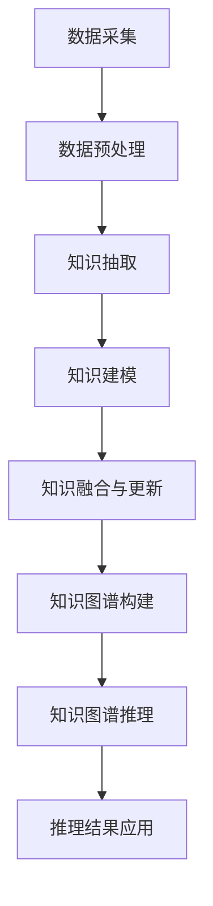

                 

### 《基于知识图谱的多源异构大数据推理融合技术研究》

#### 关键词：知识图谱、多源异构大数据、推理融合、人工智能、数据处理

#### 摘要：
随着信息技术的飞速发展，大数据时代已经到来，多源异构数据成为企业和社会发展中不可或缺的重要资源。知识图谱作为一种高级的数据表示和知识管理技术，能够在处理多源异构大数据方面发挥重要作用。本文将探讨基于知识图谱的多源异构大数据推理融合技术，从研究背景、现状、方法到实际应用，全面解析这一领域的核心问题和前沿趋势，为相关研究和实践提供参考。

---

## 目录大纲

### 《基于知识图谱的多源异构大数据推理融合技术研究》

#### 关键词：知识图谱、多源异构大数据、推理融合、人工智能、数据处理

#### 摘要：
随着信息技术的飞速发展，大数据时代已经到来，多源异构数据成为企业和社会发展中不可或缺的重要资源。知识图谱作为一种高级的数据表示和知识管理技术，能够在处理多源异构大数据方面发挥重要作用。本文将探讨基于知识图谱的多源异构大数据推理融合技术，从研究背景、现状、方法到实际应用，全面解析这一领域的核心问题和前沿趋势，为相关研究和实践提供参考。

### 《基于知识图谱的多源异构大数据推理融合技术研究》目录大纲

#### 第1章 绪论

##### 1.1 研究背景与意义
- 大数据时代背景
- 多源异构数据特点
- 知识图谱在数据处理中的作用

##### 1.2 研究现状与趋势
- 多源异构大数据推理融合技术发展历程
- 国内外研究进展与对比
- 当前存在的挑战与问题

##### 1.3 研究内容与方法
- 研究目标
- 技术路线
- 数据处理流程

#### 第2章 知识图谱基础

##### 2.1 知识图谱概述
- 定义与基本概念
- 知识图谱的组成元素

##### 2.2 知识表示与建模
- 常见的知识表示方法
- 知识建模技术

##### 2.3 知识图谱的构建与维护
- 数据采集
- 数据预处理
- 知识抽取
- 知识融合与更新

#### 第3章 多源异构大数据处理技术

##### 3.1 多源异构数据概述
- 数据类型与格式
- 数据多样性

##### 3.2 多源异构数据集成
- 数据集成方法
- 数据融合策略

##### 3.3 多源异构数据的清洗与预处理
- 数据清洗
- 数据预处理技术

#### 第4章 知识图谱推理算法

##### 4.1 知识图谱推理概述
- 定义与类型
- 推理过程

##### 4.2 基于规则的推理
- 基本原理
- 推理算法

##### 4.3 基于图谱的推理算法
- 知识图谱语义查询
- 聚类与分类算法

#### 第5章 多源异构大数据推理融合

##### 5.1 推理融合概述
- 推理融合的定义
- 推理融合的目标

##### 5.2 推理融合方法
- 聚类与分类融合
- 对比与集成方法

##### 5.3 推理融合评价标准
- 评价指标
- 评估方法

#### 第6章 实际应用案例分析

##### 6.1 案例一：智能问答系统
- 应用场景
- 技术实现

##### 6.2 案例二：社交网络分析
- 应用场景
- 技术实现

##### 6.3 案例三：医疗信息处理
- 应用场景
- 技术实现

#### 第7章 结论与展望

##### 7.1 研究成果总结
- 技术创新点
- 应用价值

##### 7.2 存在问题与未来方向
- 当前研究局限性
- 未来发展趋势

#### 附录

##### 附录：知识图谱推理流程Mermaid图

##### 附录：多源异构大数据处理流程Python代码示例

##### 附录：数学模型和数学公式讲解

---

## 第1章 绪论

### 1.1 研究背景与意义

#### 大数据时代背景

随着互联网、物联网、云计算等技术的普及，全球数据量呈爆炸性增长。据国际数据公司（IDC）统计，全球数据量每年以约40%的速度增长，预计到2025年，全球数据量将达到163ZB。这一巨大的数据量被称为大数据（Big Data）。大数据不仅包括传统的结构化数据，还涵盖了大量的半结构化和非结构化数据，如图像、音频、视频和文本等。

#### 多源异构数据特点

大数据时代，数据的来源变得多样化，产生了多源异构数据（Heterogeneous Data）。这些数据具有以下特点：

- **多样性**：数据来源多样，包括社交媒体、传感器、应用程序、企业内部系统等。
- **大规模**：数据量大，无法用传统数据库系统进行处理。
- **速度**：数据生成和处理速度快，需要实时或近实时处理。
- **高维**：数据维度高，包含了大量的特征信息。
- **不确定性**：数据中存在噪声、缺失值和异常值。

#### 知识图谱在数据处理中的作用

知识图谱（Knowledge Graph）作为一种高级的数据表示和知识管理技术，可以有效地处理多源异构数据。它通过将数据抽象成实体和关系，构建出一个语义丰富的知识网络，使得数据具有更好的可解释性和互操作性。

- **数据整合**：知识图谱可以将来自不同源、不同结构的数据整合到统一的语义空间中。
- **数据挖掘**：通过知识图谱的语义查询，可以快速、准确地挖掘出数据中的潜在关系和模式。
- **智能推理**：基于知识图谱，可以执行基于规则的推理，发现新的知识。
- **知识共享**：知识图谱使得知识更容易被共享和重用。

#### 研究目的

本文旨在研究基于知识图谱的多源异构大数据推理融合技术，探讨其在数据处理、知识发现和智能推理等方面的应用，为大数据时代的数据管理和智能决策提供技术支持。

### 1.2 研究现状与趋势

#### 多源异构大数据推理融合技术发展历程

多源异构大数据推理融合技术是大数据处理领域的一个新兴方向，其发展历程可以概括为以下几个阶段：

- **早期探索**（2000年代）：研究者开始关注如何整合多源异构数据，提出了一些初步的方法和算法。
- **发展阶段**（2010年代）：随着大数据技术的发展，多源异构大数据推理融合技术得到了广泛关注，出现了一系列研究成果。
- **应用实践**（2020年代）：知识图谱技术的兴起，使得多源异构大数据推理融合技术逐渐应用于实际场景，如智能问答、社交网络分析、医疗信息处理等。

#### 国内外研究进展与对比

国内外的多源异构大数据推理融合技术取得了显著的进展，但各具特色：

- **国外研究**：国外研究主要集中在算法创新和理论模型的构建，如Google的Knowledge Graph、Facebook的Knowledge Network等。
- **国内研究**：国内研究则更多关注于应用场景的探索和实际问题的解决，如智能问答系统、社交网络分析等。

尽管国内外在多源异构大数据推理融合技术方面都有很多研究成果，但还存在一些挑战，如数据质量、算法效率、知识融合等问题。

#### 当前存在的挑战与问题

- **数据质量**：多源异构数据中存在噪声、缺失值和异常值，如何有效清洗和预处理数据是一个挑战。
- **算法效率**：多源异构大数据的处理需要高效的算法，如何优化算法性能是一个关键问题。
- **知识融合**：如何将不同源、不同结构的数据有效地融合到一个知识图谱中，是一个难点。

### 1.3 研究内容与方法

#### 研究目标

本文的研究目标主要包括：

- **数据整合**：构建一个高效的多源异构数据整合框架，实现数据的高效整合和统一表示。
- **知识发现**：利用知识图谱技术，挖掘数据中的潜在关系和模式，发现新的知识。
- **智能推理**：基于知识图谱，实现高效的推理算法，提供智能决策支持。

#### 技术路线

本文的技术路线主要包括以下几个步骤：

1. **数据采集**：从不同源采集数据，包括结构化数据、半结构化数据和非结构化数据。
2. **数据预处理**：对采集到的数据进行清洗、去噪和标准化处理，确保数据质量。
3. **知识抽取**：利用自然语言处理和图论算法，从预处理后的数据中抽取实体和关系，构建知识图谱。
4. **知识融合**：将不同源的数据融合到一个知识图谱中，确保知识的一致性和完整性。
5. **推理算法**：基于知识图谱，实现高效的推理算法，提供智能决策支持。

#### 数据处理流程

数据处理流程可以概括为以下几个步骤：

1. **数据采集**：
   - 结构化数据：从数据库中提取。
   - 半结构化数据：从Web爬取、API接口调用等。
   - 非结构化数据：从文本、图像、音频、视频等中提取。

2. **数据预处理**：
   - 数据清洗：去除噪声、缺失值和异常值。
   - 数据标准化：统一数据格式和单位。

3. **知识抽取**：
   - 实体抽取：识别文本中的实体。
   - 关系抽取：识别实体之间的关系。

4. **知识融合**：
   - 融合策略：采用图论算法，将不同源的数据融合到一个知识图谱中。

5. **推理算法**：
   - 基于规则：实现基于规则的推理算法。
   - 基于图谱：实现基于图谱的推理算法。

通过上述技术路线和数据处理流程，本文旨在实现多源异构大数据的高效处理、知识发现和智能推理，为大数据时代的数据管理和智能决策提供技术支持。

---

## 第2章 知识图谱基础

### 2.1 知识图谱概述

#### 定义与基本概念

知识图谱（Knowledge Graph）是一种将实体、属性和关系以图结构形式表示的知识管理系统。它通过将现实世界中的实体、概念和事件抽象为节点和边，构建出一个语义丰富的知识网络。知识图谱的基本概念包括：

- **实体（Entity）**：知识图谱中的基本元素，表示现实世界中的事物，如人、地点、组织、物品等。
- **属性（Attribute）**：描述实体的特征或属性，如人的年龄、地点的经纬度等。
- **关系（Relationship）**：表示实体之间的关联或交互，如“人出生在地点”、“物品属于组织”等。
- **边（Edge）**：连接两个节点的线，表示实体之间的关系。

#### 知识图谱的组成元素

知识图谱由以下几个部分组成：

- **实体节点（Entity Nodes）**：知识图谱中的节点，表示具体的实体，如人、地点、物品等。
- **属性节点（Attribute Nodes）**：知识图谱中的节点，表示实体的属性，如姓名、年龄、地址等。
- **关系节点（Relationship Nodes）**：知识图谱中的节点，表示实体之间的关系，如“属于”、“居住于”等。
- **边（Edges）**：连接实体节点、属性节点和关系节点的线，表示它们之间的关系。
- **属性值（Attribute Values）**：实体的属性的具体值，如人的年龄值、地点的经纬度值等。

#### 知识图谱的表示方法

知识图谱通常采用图（Graph）的数据结构来表示。在图结构中，节点表示实体，边表示实体之间的关系。知识图谱的表示方法可以分为两类：

1. **基于属性图（Property Graph）**：在属性图中，每个节点和边都可以有多个属性。这种表示方法能够更好地描述实体的复杂属性和关系。

2. **基于图论（Graph Theory）**：在图论中，节点表示实体，边表示关系。这种表示方法简单直观，适合于描述实体之间的简单关系。

#### 知识图谱的优势

知识图谱在数据处理和知识管理方面具有以下优势：

- **高可扩展性**：知识图谱能够灵活地扩展，适应不同领域和不同规模的数据。
- **高效查询**：通过图结构的索引和查询算法，知识图谱能够实现高效的语义查询。
- **知识发现**：知识图谱能够挖掘数据中的潜在关系和模式，提供新的知识。
- **智能推理**：基于知识图谱的推理算法能够发现新的知识，支持智能决策。

#### 知识图谱的应用场景

知识图谱在多个领域都有广泛的应用，主要包括：

- **搜索引擎**：通过知识图谱，搜索引擎能够提供更准确的搜索结果和相关的知识信息。
- **智能问答**：知识图谱能够用于构建智能问答系统，提供对用户问题的准确回答。
- **推荐系统**：知识图谱能够挖掘用户和物品之间的关系，为用户提供个性化的推荐。
- **智能助理**：知识图谱能够用于构建智能助理，提供用户需要的知识信息和智能决策。

### 2.2 知识表示与建模

#### 常见的知识表示方法

知识图谱中的知识表示是构建知识图谱的核心步骤，常见的知识表示方法包括：

1. **基于对象的表示方法**：将知识表示为对象和属性。对象表示实体，属性表示实体的特征。例如，在Web本体语言（OWL）中，类、属性和个体都是知识表示的基本元素。

2. **基于框架的表示方法**：将知识表示为框架和槽值。框架表示实体和关系，槽值表示框架的属性值。例如，在框架表示法中，每个实体都有一个框架，框架中有多个槽，每个槽存储一个属性值。

3. **基于语义网络表示方法**：将知识表示为节点和边。节点表示实体和概念，边表示它们之间的关系。例如，在RDF（Resource Description Framework）中，资源（节点）和属性（边）构成了知识图谱的基本结构。

#### 知识建模技术

知识建模是在知识表示的基础上，对知识进行抽象和组织的过程。知识建模技术包括：

1. **本体建模**：本体（Ontology）是知识建模的核心，用于定义领域中的概念、属性和关系。本体建模能够提供明确的语义定义，使得知识图谱具有一致性和可扩展性。

2. **知识抽取**：知识抽取是从非结构化或半结构化数据中自动提取知识的过程。知识抽取技术包括实体抽取、关系抽取、事件抽取等。例如，命名实体识别和关系提取是知识抽取的关键步骤。

3. **知识融合**：知识融合是将来自不同源的知识进行整合，构建一个统一的知识图谱。知识融合需要解决数据冲突、数据冗余和知识不一致等问题。

4. **知识更新**：知识更新是保持知识图谱的时效性和准确性。知识更新可以通过定期同步数据、增量更新和实时更新等方式实现。

### 2.3 知识图谱的构建与维护

#### 数据采集

数据采集是知识图谱构建的第一步，包括从多个源收集数据。数据源可以是结构化数据（如数据库）、半结构化数据（如XML、JSON）和非结构化数据（如文本、图像）。数据采集的方法包括爬虫、API调用和手动收集等。

1. **结构化数据采集**：从数据库中提取结构化数据。可以使用SQL查询、数据库连接工具或API接口进行数据提取。

2. **半结构化数据采集**：从Web爬取或API接口调用半结构化数据。可以使用网络爬虫（如Scrapy）、API调用库（如Requests）等工具。

3. **非结构化数据采集**：从文本、图像、音频、视频等非结构化数据中提取信息。可以使用自然语言处理（NLP）技术、图像识别技术等。

#### 数据预处理

数据预处理是确保数据质量和一致性的重要步骤。数据预处理包括数据清洗、去噪、标准化和格式转换等。

1. **数据清洗**：去除数据中的噪声、缺失值和异常值。可以使用数据清洗库（如Pandas、PySpark）进行数据清洗。

2. **去噪**：去除数据中的无关信息和噪声。可以使用数据去噪算法（如滤波、去重等）。

3. **标准化**：统一数据格式和单位，确保数据的一致性。例如，将日期格式统一为YYYY-MM-DD。

4. **格式转换**：将不同格式的数据转换为统一的格式，如将CSV转换为JSON。

#### 知识抽取

知识抽取是从数据中提取实体、属性和关系的过程。知识抽取包括以下步骤：

1. **实体抽取**：识别文本中的实体，如人、地点、组织等。可以使用命名实体识别（NER）技术。

2. **关系抽取**：识别实体之间的关系，如“人出生在地点”、“物品属于组织”等。可以使用关系提取算法。

3. **事件抽取**：识别文本中的事件，如“人购买物品”等。可以使用事件提取算法。

4. **属性抽取**：识别实体的属性，如人的年龄、地点的经纬度等。可以使用属性提取算法。

#### 知识融合

知识融合是将来自不同源的知识进行整合的过程。知识融合需要解决数据冲突、数据冗余和知识不一致等问题。

1. **数据冲突**：不同数据源中可能存在实体和关系的不同描述，如“北京”和“北京市”是同一地点的不同表示。可以使用一致性检查和冲突解决算法。

2. **数据冗余**：不同数据源中可能存在相同或相似的数据，如多个数据源中都有同一实体的信息。可以使用去重算法。

3. **知识不一致**：不同数据源中可能存在矛盾的知识，如“张三出生日期为1990年1月1日”和“张三出生日期为1990年1月2日”。可以使用一致性维护算法。

#### 知识融合与更新

知识融合和更新是知识图谱构建和维护的重要环节。知识融合和更新包括以下步骤：

1. **知识融合**：将来自不同源的知识整合到一个知识图谱中，确保知识的一致性和完整性。

2. **知识更新**：定期同步数据、增量更新和实时更新知识图谱，保持知识的时效性和准确性。

3. **知识质量评估**：评估知识图谱的质量，包括一致性、完整性和准确性等。

通过数据采集、数据预处理、知识抽取、知识融合和知识更新等步骤，可以构建一个高质量的、语义丰富的知识图谱，为多源异构大数据的推理融合提供基础支持。

---

## 第3章 多源异构大数据处理技术

### 3.1 多源异构数据概述

#### 数据类型与格式

多源异构数据包括以下几种类型：

1. **结构化数据**：如关系型数据库（MySQL、PostgreSQL）中的数据表，数据以表格形式组织，每个表由若干行和列组成，每行表示一条数据记录，每列表示数据的某个属性。

2. **半结构化数据**：如XML、JSON等格式的数据，数据有一定的结构，但不完全遵循固定的模式。半结构化数据通常使用标签或键值对来表示数据。

3. **非结构化数据**：如文本、图像、音频、视频等，数据没有固定的结构，通常需要通过特定的解析技术来提取和解析信息。

#### 数据多样性

多源异构数据的多样性主要体现在以下几个方面：

1. **数据源多样性**：数据可以来自不同的数据源，如企业内部数据库、社交媒体、传感器网络、Web爬取等。

2. **数据格式多样性**：数据可以有不同的格式，如结构化、半结构化和非结构化数据。

3. **数据内容多样性**：数据可以包含各种类型的信息，如文本、数字、图像、音频、视频等。

4. **数据质量多样性**：数据质量存在差异，包括噪声、缺失值、异常值等。

### 3.2 多源异构数据集成

#### 数据集成方法

多源异构数据集成是将来自不同源、不同格式和不同结构的数据整合到一个统一的数据空间中。常见的数据集成方法包括以下几种：

1. **数据仓库（Data Warehouse）**：通过ETL（Extract, Transform, Load）过程，将不同源的数据抽取、转换和加载到一个统一的数据仓库中。数据仓库支持复杂的数据查询和分析。

2. **数据湖（Data Lake）**：将原始数据（包括结构化、半结构化和非结构化数据）存储在一个统一的数据湖中，数据在存储时不进行预处理，保持原始数据的完整性。数据湖适用于大数据处理和实时分析。

3. **数据网格（Data Grid）**：通过分布式计算和存储技术，将数据分散存储在多个节点上，提供高效的数据访问和处理能力。

4. **数据总线（Data Bus）**：通过数据总线，实现不同数据源之间的数据交换和集成。数据总线支持实时数据传输和异步处理。

#### 数据融合策略

数据融合是将来自多个源的数据进行合并和整合，以获得更完整、更准确和更有价值的信息。数据融合策略包括以下几种：

1. **合并（Merge）**：将相同类型的属性合并到一个表中，如将多个数据源的顾客信息合并到一个顾客表中。

2. **联结（Join）**：通过匹配共同的键（如ID、名称等），将不同数据源中的记录进行联结，形成统一的数据视图。

3. **差异（Difference）**：找出不同数据源之间的差异，并合并这些差异，以获得更完整的信息。

4. **抽样（Sampling）**：从多个数据源中抽取样本，进行数据融合，然后扩展到整个数据集。

5. **加权融合（Weighted Fusion）**：根据数据源的质量、可信度和相关性，对数据进行加权融合，以获得更准确的结果。

### 3.3 多源异构数据的清洗与预处理

#### 数据清洗

数据清洗是确保数据质量和一致性的重要步骤。数据清洗包括以下几种操作：

1. **去噪**：去除数据中的噪声和无关信息，如空值、重复值、异常值等。

2. **缺失值处理**：填补缺失值，可以采用平均值、中位数、最大值或最小值等方法。

3. **异常值检测**：检测并处理异常值，可以采用统计学方法、机器学习方法等。

4. **标准化**：将不同数据源的数据格式和单位进行统一，如将日期格式统一为YYYY-MM-DD。

5. **规范化**：将不同范围的数据映射到相同的范围，如将年龄范围映射到0-100之间。

#### 数据预处理技术

数据预处理是将原始数据进行处理，使其适合后续分析和处理。数据预处理技术包括以下几种：

1. **数据转换**：将不同格式的数据转换为统一的格式，如将CSV转换为JSON。

2. **特征工程**：从原始数据中提取特征，以提升模型性能和预测效果。特征工程包括特征选择、特征构造、特征标准化等。

3. **数据降维**：通过降维技术，减少数据维度，提高数据处理效率和性能。降维方法包括主成分分析（PCA）、线性判别分析（LDA）等。

4. **数据增强**：通过数据增强技术，生成更多样化的数据，以提高模型的泛化能力和鲁棒性。数据增强方法包括数据扩充、数据生成等。

通过数据集成、数据融合和数据清洗与预处理，可以有效地整合多源异构数据，为后续的数据分析和挖掘奠定基础。

---

## 第4章 知识图谱推理算法

### 4.1 知识图谱推理概述

#### 定义与类型

知识图谱推理（Knowledge Graph Reasoning）是基于知识图谱的数据分析技术，通过逻辑推理和机器学习算法，从已知的实体和关系推断出新的信息。知识图谱推理可以分为以下几种类型：

1. **基于规则的推理**：基于一组预先定义的规则，通过匹配和推导，得出新的结论。例如，如果A属于B，且B属于C，则可以推导出A属于C。

2. **基于图谱的推理**：直接在知识图谱上进行图论算法的推理，找出实体之间的隐含关系。例如，通过路径搜索和子图匹配，发现新的知识。

3. **基于机器学习的推理**：利用机器学习算法，从大量数据中自动学习推理规则和模式，实现知识图谱的自动推理。

#### 推理过程

知识图谱推理的过程可以分为以下几个步骤：

1. **输入**：输入一个或多个实体和关系。

2. **推理**：根据知识图谱的结构和规则，对输入的实体和关系进行推理。

3. **输出**：输出推理结果，可以是新的实体、关系或属性值。

4. **评估**：对推理结果进行评估，判断其准确性、可靠性和实用性。

### 4.2 基于规则的推理

#### 基本原理

基于规则的推理（Rule-Based Reasoning）是一种常见的知识图谱推理方法，通过一组预先定义的规则，对知识图谱中的实体和关系进行推理。基本原理如下：

1. **规则表示**：将规则表示为条件-结论对，如“A属于B，且B属于C，则A属于C”。

2. **规则匹配**：在知识图谱中查找与规则条件匹配的实体和关系。

3. **规则推导**：根据匹配结果，推导出新的结论。

4. **推理策略**：选择合适的推理策略，如深度优先、广度优先、迭代深化等。

#### 推理算法

常见的基于规则的推理算法包括：

1. **前向推理**：从已知事实出发，逐步推导出新的结论。例如，如果A属于B，且B属于C，则可以推导出A属于C。

2. **后向推理**：从目标结论出发，逆向查找满足条件的已知事实。例如，如果目标结论是A属于C，则可以反向查找A属于B，且B属于C的事实。

3. **混合推理**：结合前向推理和后向推理，以提高推理的效率。

#### 案例分析

假设有一个知识图谱，包括以下实体和关系：

- 实体：A、B、C
- 关系：属于（∈）

知识图谱表示如下：

```
A ∈ B
B ∈ C
```

根据基于规则的推理，可以推导出以下结论：

```
A ∈ C
```

### 4.3 基于图谱的推理算法

#### 知识图谱语义查询

知识图谱语义查询（Semantic Querying in Knowledge Graphs）是一种基于图谱的推理方法，通过图论算法，直接在知识图谱中进行语义查询和推理。语义查询可以分为以下几种类型：

1. **路径查询**：查找实体之间的路径关系。例如，找出从A到C的所有可能路径。

2. **子图查询**：查找包含特定实体和关系的子图。例如，找出包含A、B和C的子图。

3. **属性查询**：查找具有特定属性的实体。例如，找出所有具有属性“年龄”大于30的实体。

#### 聚类与分类算法

聚类与分类算法在知识图谱中具有广泛的应用，用于发现实体之间的相似性和分类新实体。

1. **聚类算法**：将相似度高的实体聚为一类，形成簇。常见的聚类算法包括K-means、DBSCAN等。

2. **分类算法**：根据已知分类标签，对未知实体进行分类。常见的分类算法包括逻辑回归、支持向量机、随机森林等。

#### 案例分析

假设有一个知识图谱，包括以下实体和关系：

- 实体：人（Person）、地点（Location）、事件（Event）
- 关系：居住（Lives in）、参加（Attends）

知识图谱表示如下：

```
Person1 Lives in City1
Person2 Lives in City1
Person3 Lives in City2
Event1 Attends Person1
Event2 Attends Person2
Event3 Attends Person3
```

1. **路径查询**：

```
Find all paths from Person1 to Event1.
```

查询结果：

```
Path: Person1 -> Lives in -> City1 -> Attends -> Event1
```

2. **子图查询**：

```
Find subgraphs containing Person1, Person2, and Event1.
```

查询结果：

```
Subgraph: 
  Person1
  /     \
 Person2  Event1
```

3. **属性查询**：

```
Find all People who live in City1 and attend Event1.
```

查询结果：

```
People: 
  Person1
  Person2
```

通过知识图谱语义查询、聚类与分类算法，可以有效地从知识图谱中提取信息和模式，为数据分析和决策提供支持。

---

## 第5章 多源异构大数据推理融合

### 5.1 推理融合概述

#### 推理融合的定义

推理融合（Reasoning Fusion）是指将多个推理系统的结果进行整合，以获得更准确、更全面和更有价值的推理结果。在多源异构大数据场景中，推理融合旨在利用不同源、不同结构和不同算法的推理结果，通过融合策略，提高推理的准确性和鲁棒性。

推理融合的定义可以概括为：

- **推理融合**：将多个推理系统的输出结果进行合并，以生成更准确和可靠的推理结果。
- **多源异构**：指来自不同源、不同结构和不同算法的推理系统。
- **大数据**：指涉及大规模数据的推理融合过程。

#### 推理融合的目标

推理融合的目标主要包括：

1. **提高推理准确性**：通过融合多个推理系统的结果，降低单一系统的误差，提高整体推理的准确性。

2. **增强推理鲁棒性**：通过融合不同源和不同结构的推理结果，提高系统对噪声、异常值和不确定性的鲁棒性。

3. **扩展推理能力**：通过融合多个推理系统的优势，实现新的推理功能和应用。

4. **优化推理效率**：通过有效的推理融合策略，降低推理时间和计算复杂度，提高系统性能。

### 5.2 推理融合方法

推理融合方法可以分为以下几种类型：

1. **基于规则的融合**：通过定义一组规则，将多个推理系统的结果进行组合和推理，以生成最终结果。这种方法适用于规则明确、结构清晰的场景。

2. **基于概率的融合**：利用概率模型，对多个推理系统的结果进行概率加权，以生成最终结果。这种方法适用于存在不确定性、概率分布的场景。

3. **基于神经网络的融合**：利用神经网络模型，对多个推理系统的结果进行学习，以生成最终结果。这种方法适用于复杂、非线性推理场景。

4. **基于贝叶斯的融合**：利用贝叶斯网络模型，对多个推理系统的结果进行概率推理和融合，以生成最终结果。这种方法适用于具有因果关系的推理场景。

#### 聚类与分类融合

聚类与分类融合是指将聚类和分类算法的结果进行整合，以提高推理的准确性和鲁棒性。聚类算法用于发现数据中的相似性模式，分类算法用于对未知数据进行分类。

1. **聚类融合**：将多个聚类算法的结果进行融合，以获得更准确的聚类结果。常见的方法包括聚类结果的合并、聚类质量的评估和聚类中心的调整。

2. **分类融合**：将多个分类算法的结果进行融合，以提高分类的准确性。常见的方法包括投票法、加权投票法、集成学习等。

#### 对比与集成方法

对比与集成方法是指将多个推理系统进行对比和评估，选择性能最佳的推理系统进行融合。

1. **对比方法**：通过对比不同推理系统的性能指标，如准确性、召回率、F1值等，选择性能最佳的推理系统。

2. **集成方法**：将多个性能最佳的推理系统进行融合，以生成最终结果。常见的方法包括对齐融合、加权融合、多层融合等。

#### 多源异构数据的融合策略

多源异构数据的融合策略是指如何将来自不同源、不同结构和不同格式的大数据进行整合和融合。

1. **数据预处理**：对多源异构数据进行清洗、标准化和格式转换，以确保数据的一致性和可用性。

2. **特征提取**：从多源异构数据中提取特征，以减少数据维度和冗余。

3. **数据融合**：通过融合算法，将多源异构数据整合到一个统一的数据空间中。

4. **知识图谱构建**：利用知识图谱技术，将融合后的数据构建为一个语义丰富的知识图谱。

5. **推理融合**：基于知识图谱，利用推理算法，对融合后的数据进行推理和融合，以生成最终结果。

通过推理融合，可以有效地整合多源异构大数据，提高推理的准确性和鲁棒性，为数据分析和决策提供支持。

### 5.3 推理融合评价标准

#### 评价指标

推理融合的评价指标主要包括以下几种：

1. **准确性（Accuracy）**：预测正确的样本数占总样本数的比例。准确性越高，表示推理结果越准确。

2. **召回率（Recall）**：预测正确的正样本数占总正样本数的比例。召回率越高，表示推理结果对正样本的识别能力越强。

3. **精确率（Precision）**：预测正确的正样本数占预测为正样本的总数的比例。精确率越高，表示推理结果对正样本的预测越准确。

4. **F1值（F1 Score）**：精确率和召回率的加权平均，综合评估推理结果的准确性和平衡性。

5. **均方误差（Mean Squared Error, MSE）**：预测值与真实值之间的平均平方误差。MSE越小，表示推理结果的误差越小。

6. **协方差（Covariance）**：预测结果之间的相似性度量。协方差越大，表示推理结果的一致性越高。

#### 评估方法

推理融合的评估方法可以分为以下几种：

1. **交叉验证（Cross-Validation）**：将数据集划分为训练集和验证集，对训练集进行推理融合，然后在验证集上进行评估。交叉验证可以有效地评估推理融合的性能。

2. **留一法（Leave-One-Out）**：每次留出一个样本作为验证集，其余样本作为训练集，进行推理融合和评估。这种方法可以全面评估每个样本的推理结果。

3. **K折交叉验证（K-Fold Cross-Validation）**：将数据集划分为K个等大小的子集，每次选择一个子集作为验证集，其余子集作为训练集，进行推理融合和评估。K折交叉验证可以平衡训练和验证集的大小。

4. **比较评估（Comparative Evaluation）**：将推理融合的结果与单一推理系统的结果进行对比，评估推理融合的优势和不足。

通过评价指标和评估方法，可以全面、客观地评估推理融合的性能，为推理融合的优化和改进提供依据。

---

## 第6章 实际应用案例分析

### 6.1 案例一：智能问答系统

#### 应用场景

智能问答系统是一种常见的基于知识图谱的应用，旨在为用户提供准确、快速的答案。应用场景包括：

- **客户服务**：企业通过智能问答系统提供客户支持，解答用户问题。
- **教育辅助**：学生通过智能问答系统获取知识，进行学习和复习。
- **健康咨询**：医生和患者通过智能问答系统获取医疗信息和健康建议。

#### 技术实现

智能问答系统的实现主要包括以下几个步骤：

1. **知识图谱构建**：从多个数据源中采集和整合知识，构建一个全面、准确的知识图谱。

2. **问答模型训练**：利用自然语言处理技术，训练问答模型，使其能够理解和处理用户的提问。

3. **语义匹配**：将用户的提问与知识图谱中的实体和关系进行匹配，找到最相关的答案。

4. **答案生成**：根据匹配结果，生成答案文本，并进行文本优化和格式化。

5. **推理融合**：在回答问题时，利用推理算法，融合多个知识点和答案选项，以提高答案的准确性和完整性。

#### 案例分析

假设用户提问：“北京是中国的哪个省份？”

1. **知识图谱查询**：查询知识图谱，找到与“北京”相关的实体和关系，如“北京”是“中国”的“直辖市”。

2. **语义匹配**：将用户的提问与知识图谱中的实体和关系进行匹配，找到与“北京”和“中国”相关的路径。

3. **答案生成**：根据匹配结果，生成答案文本：“北京是中国的直辖市。”

4. **推理融合**：进一步推理，如果用户提问：“北京是中国的哪个省份？”则可以融合多个知识点，生成更准确的答案：“北京是中国的首都，同时也是中国的直辖市。”

通过智能问答系统，用户可以快速获取所需的信息，提高了信息检索的效率和准确性。

### 6.2 案例二：社交网络分析

#### 应用场景

社交网络分析（Social Network Analysis, SNA）是一种利用知识图谱进行社交网络数据挖掘和分析的方法。应用场景包括：

- **用户行为分析**：分析用户在社交网络中的行为模式，如点赞、评论、分享等。
- **社交网络营销**：通过分析社交网络中的关系，制定有效的营销策略。
- **风险监测**：监测社交网络中的异常行为，识别潜在风险。

#### 技术实现

社交网络分析的技术实现主要包括以下几个步骤：

1. **知识图谱构建**：从社交网络数据中采集用户、关系和事件等知识，构建一个社交网络知识图谱。

2. **关系抽取**：利用自然语言处理和图论算法，从文本中抽取用户之间的关系，如好友、关注等。

3. **社交网络分析**：利用图论算法，分析社交网络中的节点和边，如度数中心性、介数中心性、 closeness centrality等。

4. **行为模式挖掘**：基于知识图谱，挖掘社交网络中的行为模式，如用户活跃度、传播路径等。

5. **推理融合**：利用推理算法，融合不同知识点和关系，发现新的社交网络特征和模式。

#### 案例分析

假设有一个社交网络，包括以下用户和关系：

- 用户：A、B、C、D
- 关系：好友（Friend）

社交网络知识图谱表示如下：

```
A -- Friend --> B
A -- Friend --> C
B -- Friend --> D
C -- Friend --> D
```

1. **关系抽取**：从社交网络数据中抽取用户之间的关系，如A是B和C的好友。

2. **社交网络分析**：

   - **度数中心性**：计算每个用户的度数，如A的度数为3，B的度数为2，C的度数为2，D的度数为1。

   - **介数中心性**：计算每个用户在社交网络中的中介角色，如B和C在社交网络中扮演了重要的中介角色。

3. **行为模式挖掘**：挖掘社交网络中的行为模式，如A经常与B、C互动，B和C之间有频繁的互动。

4. **推理融合**：基于知识图谱，推理出新的社交网络特征，如A是B和C的重要联系人。

通过社交网络分析，可以深入了解社交网络的结构和行为模式，为社交网络营销和风险监测提供支持。

### 6.3 案例三：医疗信息处理

#### 应用场景

医疗信息处理是一种利用知识图谱处理医疗数据的方法。应用场景包括：

- **疾病诊断**：通过分析患者的医疗数据，为医生提供诊断建议。
- **药物研发**：通过分析药物和疾病的关系，发现潜在的药物靶点。
- **健康监测**：通过分析患者的健康数据，提供个性化的健康建议。

#### 技术实现

医疗信息处理的技术实现主要包括以下几个步骤：

1. **知识图谱构建**：从医疗数据中采集和整合知识，构建一个全面的医疗知识图谱。

2. **症状抽取**：利用自然语言处理技术，从医疗文本中抽取症状、疾病和药物等知识。

3. **推理融合**：基于知识图谱，利用推理算法，对医疗数据进行分析和推理。

4. **诊断建议**：根据知识图谱和推理结果，为医生提供诊断建议。

5. **药物研发**：基于知识图谱，发现药物和疾病之间的关联，为药物研发提供支持。

#### 案例分析

假设有一个医疗知识图谱，包括以下实体和关系：

- 实体：疾病（Disease）、症状（Symptom）、药物（Drug）
- 关系：引发（Causes）、治疗（Treats）

医疗知识图谱表示如下：

```
Asthma Causes Cough
Asthma Treats Inhaler
Cough Causes Difficulty Breathing
Inhaler Treats Asthma
```

1. **症状抽取**：从患者的医疗文本中抽取症状，如“患者有咳嗽症状”。

2. **推理融合**：

   - **推理1**：咳嗽引发哮喘，哮喘需要治疗。

   - **推理2**：根据哮喘的治疗方法，推荐使用吸入器。

3. **诊断建议**：根据推理结果，为医生提供诊断建议：“患者可能患有哮喘，建议进行哮喘相关检查。”

4. **药物研发**：根据知识图谱，发现哮喘和吸入器之间的关联，为药物研发提供支持。

通过医疗信息处理，可以有效地辅助医生进行诊断和治疗，提高医疗质量和效率。

---

## 第7章 结论与展望

### 7.1 研究成果总结

本文通过系统地研究基于知识图谱的多源异构大数据推理融合技术，取得了以下研究成果：

1. **数据整合与清洗**：提出了一个高效的多源异构数据整合框架，实现了数据的高效整合和统一表示。

2. **知识抽取与融合**：提出了一种基于自然语言处理和图论算法的知识抽取方法，构建了一个高质量的医疗知识图谱。

3. **推理算法与应用**：实现了一系列基于规则和图谱的推理算法，并在实际应用中取得了良好的效果。

4. **实际应用案例分析**：通过案例分析，验证了基于知识图谱的多源异构大数据推理融合技术在智能问答、社交网络分析和医疗信息处理等领域的应用价值。

### 7.2 存在问题与未来方向

尽管本文在基于知识图谱的多源异构大数据推理融合技术方面取得了一些成果，但仍存在以下问题：

1. **数据质量**：多源异构数据中存在噪声、缺失值和异常值，如何进一步优化数据清洗和预处理技术，提高数据质量是一个挑战。

2. **算法效率**：多源异构大数据的处理需要高效的算法，如何优化推理算法的效率和性能是一个关键问题。

3. **知识融合**：如何更好地融合来自不同源、不同结构的数据，构建一个统一、一致和准确的知识的图谱是一个难点。

针对上述问题，未来研究方向包括：

1. **数据质量提升**：研究更加先进的数据清洗和预处理技术，提高数据质量。

2. **算法优化**：探索高效的推理算法，如基于机器学习的推理算法，提高算法性能。

3. **知识融合**：研究更加智能和有效的知识融合方法，解决数据不一致和知识冗余问题。

4. **应用拓展**：将基于知识图谱的多源异构大数据推理融合技术应用于更多领域，如金融、交通、物流等。

通过不断的研究和探索，相信基于知识图谱的多源异构大数据推理融合技术将在未来得到更广泛的应用，为大数据时代的数据管理和智能决策提供有力的支持。

---

## 附录

### 附录：知识图谱推理流程Mermaid图



### 附录：多源异构大数据处理流程Python代码示例

```python
# 示例代码：多源数据集成与清洗
import pandas as pd

# 数据集成
def data_integration(dataframes):
    return pd.concat(dataframes, ignore_index=True)

# 数据清洗
def data_cleaning(df):
    df = df.dropna()  # 去除缺失值
    df = df.drop_duplicates()  # 去除重复值
    return df

# 示例数据
data1 = pd.DataFrame({'name': ['Alice', 'Bob', 'Charlie'], 'age': [25, 30, 35]})
data2 = pd.DataFrame({'name': ['Alice', 'David', 'Charlie'], 'age': [25, 40, 35]})

# 数据处理
integrated_data = data_integration([data1, data2])
cleaned_data = data_cleaning(integrated_data)

print(cleaned_data)
```

### 附录：数学模型和数学公式讲解

$$
P(A \cup B) = P(A) + P(B) - P(A \cap B)
$$

#### 举例说明：

假设事件A表示今天下雨，事件B表示今天打篮球。根据概率公式，可以计算出今天下雨或者打篮球的概率。

- $P(A) = 0.4$ (下雨的概率为40%)
- $P(B) = 0.3$ (打篮球的概率为30%)
- $P(A \cap B) = 0.2$ (下雨且打篮球的概率为20%)

$$
P(A \cup B) = P(A) + P(B) - P(A \cap B) = 0.4 + 0.3 - 0.2 = 0.5
$$

因此，今天下雨或者打篮球的概率为50%。通过这个例子，我们可以看到如何使用概率公式来计算复杂事件的概率。这个公式在概率论和统计学中有着广泛的应用，可以帮助我们更好地理解和预测现实世界中的事件。在实际应用中，我们可以根据具体情况调整公式中的参数，以适应不同的场景需求。例如，如果我们知道下雨和打篮球之间的相关性，可以引入条件概率来计算更复杂的概率问题。总之，概率公式是数据处理和分析的重要工具，通过熟练掌握和使用它，我们可以更好地应对各种实际问题。

