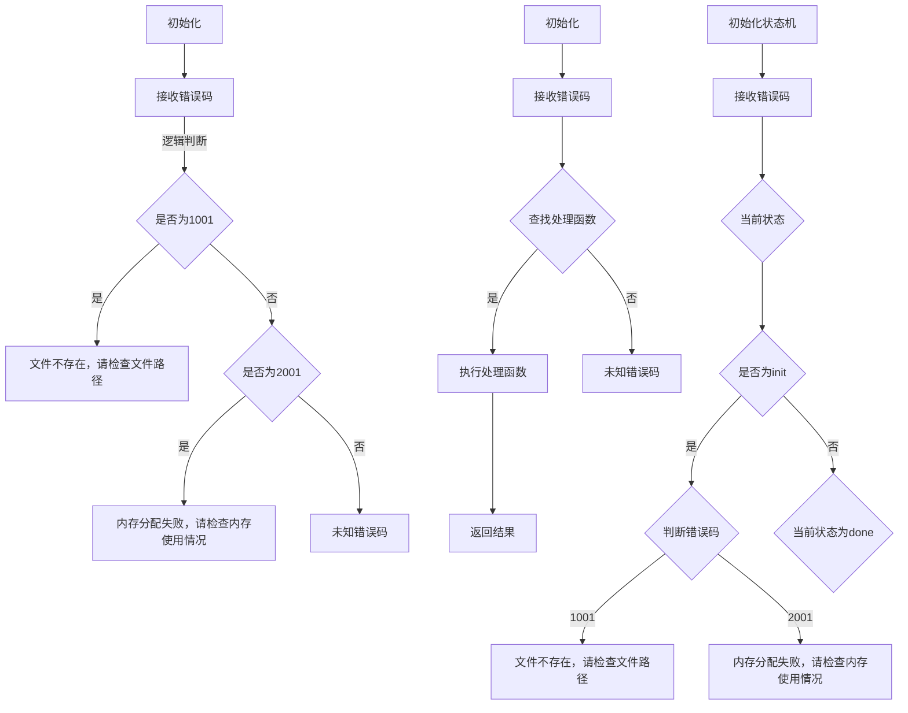
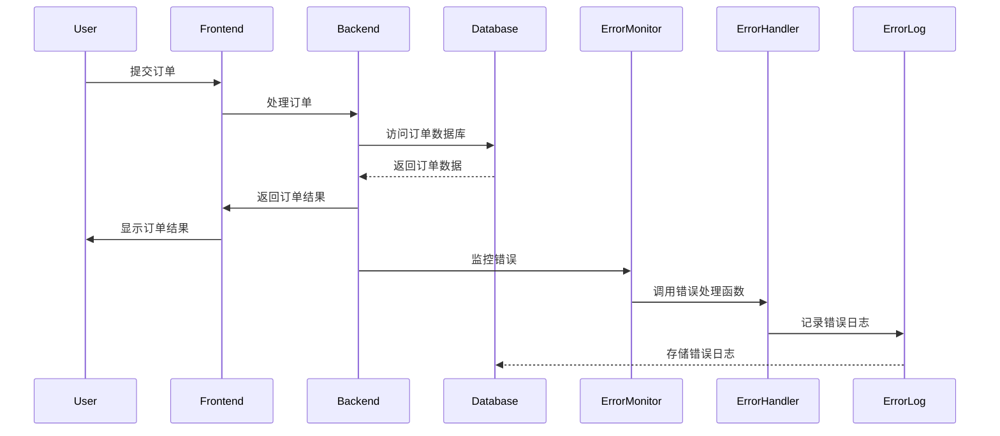

                 


## 第1章: 错误码处理的重要性和现状

### 1.1 问题背景

#### 1.1.1 错误码的定义与作用

- 错误码是计算机系统中用于标识和处理异常情况的编码。
- 错误码在软件开发、系统维护和故障排查中的重要作用。

在计算机系统中，错误码作为一种通用的异常处理机制，能够有效地帮助开发人员定位和解决系统中的各种问题。每一个错误码都代表了一种具体的异常情况，例如文件不存在、权限不足、网络连接中断等。这些错误码通常由操作系统、库函数或应用程序提供，并定义在相关的错误码表或文档中。

错误码的作用主要体现在以下几个方面：

1. **异常定位**：通过错误码，开发人员可以迅速定位到发生异常的具体位置，从而更快速地解决问题。
2. **问题诊断**：错误码能够提供关于异常情况的详细信息，帮助开发人员分析问题的原因。
3. **错误处理**：错误码提供了一个标准化的处理机制，使得开发人员可以统一处理各种异常情况，提高代码的可读性和可维护性。

#### 1.1.2 错误码在计算机系统中的应用场景

错误码的应用场景非常广泛，几乎涵盖了所有计算机系统。以下是一些典型的应用场景：

1. **操作系统**：操作系统通过错误码来标识各种硬件和软件错误，如磁盘错误、内存溢出、权限不足等。
2. **数据库系统**：数据库系统使用错误码来标识查询失败、数据不一致、权限问题等。
3. **网络通信**：网络通信协议通过错误码来标识网络连接问题、数据包丢失、超时等。
4. **应用程序**：应用程序通过错误码来处理用户输入错误、文件操作失败、网络请求错误等。

#### 1.1.3 当前错误码处理存在的问题

尽管错误码在计算机系统中发挥着重要作用，但在处理错误码的过程中，仍然存在一些问题和技术盲区，这些盲区可能会影响系统的稳定性和开发效率。以下是一些典型的问题：

1. **错误码定义不统一**：不同系统、库和应用程序定义的错误码可能不一致，导致开发人员在处理错误时感到困惑。
2. **错误码信息不够详细**：一些错误码只提供了错误编号，而未能提供具体的错误描述或相关细节，使得问题定位变得困难。
3. **错误码处理缺乏标准化**：不同的开发人员可能会采用不同的错误处理策略，导致代码风格不一致，影响系统的可维护性。
4. **错误码与业务逻辑的耦合**：在复杂的业务场景中，错误码往往与具体的业务逻辑紧密耦合，这使得错误码的处理变得复杂，同时也增加了系统的复杂度。

### 1.2 问题解决

针对上述问题，解决错误码处理的技术盲区显得尤为重要。以下是一些可能的解决方案：

1. **统一错误码定义**：制定统一的错误码标准，确保不同系统、库和应用程序之间能够使用相同的错误码，提高开发效率和代码可读性。
2. **增强错误码信息**：在错误码的基础上，增加详细的错误描述和相关信息，帮助开发人员快速定位和解决问题。
3. **标准化错误处理**：建立一套标准的错误处理流程和代码模板，确保开发人员在处理错误时能够遵循一致的方法，提高代码的稳定性和可维护性。
4. **解耦错误码与业务逻辑**：通过设计良好的接口和抽象层，将错误码与业务逻辑分离，降低系统的复杂度，提高系统的可扩展性。

### 1.3 边界与外延

在处理错误码的过程中，我们还需要考虑一些边界条件和外延问题，以确保错误码处理的全面性和准确性。以下是一些值得关注的边界与外延：

1. **错误码的覆盖范围**：确保错误码能够覆盖系统中可能出现的所有异常情况，避免遗漏关键问题。
2. **错误码的国际化**：在多语言环境中，错误码的国际化处理至关重要，确保不同语言用户能够正确理解错误信息。
3. **错误码的版本管理**：随着系统的迭代更新，错误码也需要进行相应的管理，确保旧版本的错误码能够与新版本兼容。
4. **错误码的反馈机制**：建立有效的错误码反馈机制，收集用户反馈，持续优化错误码的定义和处理策略。

### 1.4 概念结构与核心要素组成

为了更好地理解错误码处理，我们需要明确相关的概念结构和核心要素。以下是一些关键概念和要素的组成：

1. **错误码**：作为标识异常情况的编码，是错误码处理的基础。
2. **错误信息**：包括错误码、错误描述、相关参数等，用于提供详细的错误信息。
3. **错误处理流程**：包括错误捕获、错误分类、错误处理和错误反馈等步骤，是错误码处理的核心。
4. **异常监控**：实时监控系统运行状态，及时发现和处理异常情况。
5. **日志记录**：记录系统运行过程中的日志信息，用于问题定位和性能分析。

通过以上概念和要素的组成，我们可以构建一个完整的错误码处理系统，从而提高系统的稳定性和开发效率。

### 第2章: 核心概念与联系

在深入讨论错误码处理之前，我们需要明确几个核心概念，并了解它们之间的联系。这将为后续的内容提供坚实的基础。

#### 2.1 错误码的定义与分类

**错误码**是一种编码，用于标识计算机系统中的异常情况。根据不同的分类标准，错误码可以分为多种类型：

1. **按错误来源分类**：
   - **操作系统错误码**：由操作系统引发，例如文件系统错误、权限错误等。
   - **库函数错误码**：由系统库函数调用引发，例如内存分配失败、网络连接中断等。
   - **应用程序错误码**：由应用程序内部错误引发，例如文件操作失败、数据库操作错误等。

2. **按错误类型分类**：
   - **运行时错误码**：在程序运行过程中发生的错误，例如空指针异常、数组越界等。
   - **编译时错误码**：在编译程序时发现的错误，例如语法错误、类型错误等。
   - **逻辑错误码**：由程序逻辑错误引发的错误，例如算法错误、逻辑冲突等。

3. **按错误级别分类**：
   - **严重错误码**：可能导致系统崩溃或数据丢失的错误，例如磁盘故障、内存溢出等。
   - **警告错误码**：提示可能存在的问题，但不影响系统正常运行，例如网络延迟、文件权限不足等。
   - **信息提示码**：提供有关系统运行状态或操作结果的提示信息，例如成功完成、正在处理等。

**错误码**的定义是它作为一种编码，能够唯一标识系统中的异常情况，并传递相关的错误信息。每一个错误码通常包含两部分：错误编号和错误描述。错误编号用于唯一标识错误，而错误描述则提供了关于错误更详细的解释。

#### 2.2 错误码属性特征对比表格

为了更好地理解不同类型的错误码及其属性特征，我们可以制作一个对比表格。以下是一个简化的例子：

| 错误类型         | 错误编号        | 错误描述                                  | 处理策略                  |
|------------------|-----------------|-------------------------------------------|---------------------------|
| 操作系统错误码   | 1001            | 文件不存在                                | 检查文件路径，重新尝试     |
| 库函数错误码     | 2001            | 内存分配失败                              | 释放内存，重新尝试         |
| 应用程序错误码   | 3001            | 数据库连接失败                            | 检查数据库配置，重新连接   |
| 运行时错误码     | 4001            | 空指针异常                               | 检查指针赋值，修复代码     |
| 编译时错误码     | 5001            | 未定义的变量                              | 添加变量定义，重新编译     |
| 逻辑错误码       | 6001            | 算法逻辑错误                              | 修改算法逻辑，重新运行     |

通过这个表格，我们可以看到不同类型错误码的错误编号、错误描述和处理策略。这有助于我们在处理错误时，能够快速识别错误类型，并采取相应的解决措施。

#### 2.3 ER实体关系图架构

为了更直观地理解错误码处理系统中的实体及其关系，我们可以使用ER（Entity-Relationship）实体关系图来表示。以下是一个简化的ER图：

```mermaid
erDiagram
    Error ||--|{ ErrorDescription }|
    Error ||--|{ ErrorLog }|
    Error ||--|{ ErrorSolution }|
    ErrorDescription ||--|{ SolutionDescription }|
    ErrorLog ||--|{ LogEntry }|
    ErrorSolution ||--|{ SolutionStep }|
```

在这个ER图中，我们定义了以下几个实体：

1. **Error（错误）**：代表系统中的错误实体，是整个关系的核心。
2. **ErrorDescription（错误描述）**：描述错误的具体信息，例如错误编号和错误消息。
3. **ErrorLog（错误日志）**：记录错误发生的时间、位置和相关信息。
4. **ErrorSolution（错误解决方案）**：提供错误的解决方案，包括解决步骤和解决方案描述。
5. **SolutionDescription（解决方案描述）**：详细描述解决方案的内容。
6. **LogEntry（日志条目）**：记录日志的具体条目。
7. **SolutionStep（解决方案步骤）**：定义解决方案的每一步骤。

实体之间的关系如下：

- **Error** 与 **ErrorDescription** 之间存在一对一的关系，即每个错误对应一个错误描述。
- **Error** 与 **ErrorLog** 之间存在一对多的关系，即每个错误可以生成多个日志条目。
- **Error** 与 **ErrorSolution** 之间存在一对多的关系，即每个错误可以有多个解决方案。
- **ErrorDescription** 与 **SolutionDescription** 之间存在一对一的关系，即每个解决方案描述对应一个错误描述。
- **ErrorLog** 与 **LogEntry** 之间存在一对多的关系，即每个日志条目对应多个错误日志。
- **ErrorSolution** 与 **SolutionStep** 之间存在一对多的关系，即每个解决方案包含多个步骤。

通过这个ER图，我们可以清晰地看到错误码处理系统中各个实体之间的关系，有助于我们更好地设计和管理错误码处理系统。

### 第3章: 算法原理讲解

在处理错误码的过程中，选择合适的算法至关重要。本章节将介绍三种典型的错误码处理算法，包括其原理、流程、Python源代码实现以及数学模型和公式。

#### 3.1 常见错误码处理算法

##### 1. 基于逻辑判断的错误处理算法

这种算法主要通过一系列的逻辑判断来处理错误码。具体流程如下：

1. **接收错误码**：从系统中获取错误码。
2. **错误码判断**：根据错误码进行判断，执行相应的处理逻辑。
3. **返回结果**：根据处理结果返回相应的响应。

Python源代码实现：

```python
def handle_error(error_code):
    if error_code == 1001:
        print("文件不存在，请检查文件路径")
    elif error_code == 2001:
        print("内存分配失败，请检查内存使用情况")
    else:
        print("未知错误码")
```

##### 2. 基于字典的错误处理算法

这种算法使用字典存储错误码和对应的处理函数，通过查找字典来处理错误码。具体流程如下：

1. **接收错误码**：从系统中获取错误码。
2. **查找处理函数**：在字典中查找与错误码对应的处理函数。
3. **执行处理函数**：调用找到的处理函数。
4. **返回结果**：根据处理结果返回相应的响应。

Python源代码实现：

```python
def handle_error(error_code):
    error_handlers = {
        1001: lambda: print("文件不存在，请检查文件路径"),
        2001: lambda: print("内存分配失败，请检查内存使用情况"),
    }
    if error_code in error_handlers:
        error_handlers[error_code]()
    else:
        print("未知错误码")
```

##### 3. 基于状态机的错误处理算法

这种算法使用状态机来处理错误码，每个状态表示一个错误处理阶段。具体流程如下：

1. **初始化状态机**：设置初始状态。
2. **接收错误码**：从系统中获取错误码。
3. **状态转移**：根据错误码执行相应的状态转移。
4. **执行处理逻辑**：在当前状态下执行处理逻辑。
5. **返回结果**：根据处理结果返回相应的响应。

Python源代码实现：

```python
class ErrorStateMachine:
    def __init__(self):
        self.state = 'init'

    def handle_error(self, error_code):
        if self.state == 'init':
            if error_code == 1001:
                self.state = 'file_not_found'
            elif error_code == 2001:
                self.state = 'memory分配失败'
        elif self.state == 'file_not_found':
            print("文件不存在，请检查文件路径")
            self.state = 'done'
        elif self.state == 'memory分配失败':
            print("内存分配失败，请检查内存使用情况")
            self.state = 'done'

state_machine = ErrorStateMachine()
state_machine.handle_error(1001)
state_machine.handle_error(2001)
```

#### 3.2 算法mermaid流程图

为了更直观地展示这些算法的流程，我们可以使用mermaid绘制流程图。



通过这些mermaid流程图，我们可以清楚地看到每个算法的处理流程和关键步骤。

#### 3.3 Python源代码实现

在前面的算法描述中，我们已经给出了每个算法的Python源代码实现。这里再次总结：

1. **基于逻辑判断的错误处理算法**：

```python
def handle_error(error_code):
    if error_code == 1001:
        print("文件不存在，请检查文件路径")
    elif error_code == 2001:
        print("内存分配失败，请检查内存使用情况")
    else:
        print("未知错误码")
```

2. **基于字典的错误处理算法**：

```python
def handle_error(error_code):
    error_handlers = {
        1001: lambda: print("文件不存在，请检查文件路径"),
        2001: lambda: print("内存分配失败，请检查内存使用情况"),
    }
    if error_code in error_handlers:
        error_handlers[error_code]()
    else:
        print("未知错误码")
```

3. **基于状态机的错误处理算法**：

```python
class ErrorStateMachine:
    def __init__(self):
        self.state = 'init'

    def handle_error(self, error_code):
        if self.state == 'init':
            if error_code == 1001:
                self.state = 'file_not_found'
            elif error_code == 2001:
                self.state = 'memory分配失败'
        elif self.state == 'file_not_found':
            print("文件不存在，请检查文件路径")
            self.state = 'done'
        elif self.state == 'memory分配失败':
            print("内存分配失败，请检查内存使用情况")
            self.state = 'done'

state_machine = ErrorStateMachine()
state_machine.handle_error(1001)
state_machine.handle_error(2001)
```

这些代码实现展示了如何在实际应用中处理不同的错误码。

#### 3.4 算法原理的数学模型和公式

为了深入理解这些错误码处理算法的原理，我们可以借助数学模型和公式来进行分析。

1. **基于逻辑判断的错误处理算法**

   这种算法的核心是条件判断，可以用逻辑运算符来表示：

   $$ 
   \begin{cases}
   \text{if } error\_code == 1001: & \text{print("文件不存在，请检查文件路径")} \\
   \text{elif } error\_code == 2001: & \text{print("内存分配失败，请检查内存使用情况")} \\
   \text{else: } & \text{print("未知错误码")}
   \end{cases}
   $$

   这个公式描述了根据错误码执行不同操作的条件判断逻辑。

2. **基于字典的错误处理算法**

   字典算法的核心是查找和执行函数，可以用以下数学模型来表示：

   $$
   error\_handlers = \{
   1001: \lambda: \text{print("文件不存在，请检查文件路径")},
   2001: \lambda: \text{print("内存分配失败，请检查内存使用情况")},
   \}
   $$

   当输入错误码时，算法查找字典中对应的函数并执行，如果没有找到，则返回未知错误码。

3. **基于状态机的错误处理算法**

   状态机算法的核心是状态转移和状态处理，可以用以下数学模型来表示：

   $$
   \text{state} = \text{init} \\
   \begin{cases}
   \text{if } \text{state} == 'init' \text{ and } error\_code == 1001: & \text{state} = 'file\_not\_found' \\
   \text{elif } \text{state} == 'init' \text{ and } error\_code == 2001: & \text{state} = 'memory分配失败' \\
   \text{elif } \text{state} == 'file\_not\_found': & \text{print("文件不存在，请检查文件路径"), \text{state} = 'done' \\
   \text{elif } \text{state} == 'memory分配失败': & \text{print("内存分配失败，请检查内存使用情况"), \text{state} = 'done' \\
   \end{cases}
   $$

   这个公式描述了状态机在不同状态下的转移和处理逻辑。

通过这些数学模型和公式，我们可以更深入地理解错误码处理算法的原理和实现方法。

#### 3.5 通俗易懂地举例说明

为了更好地理解这些错误码处理算法，我们可以通过简单的示例来说明每种算法的使用方法。

##### 1. 基于逻辑判断的错误处理算法

假设我们有一个简单的应用程序，当用户尝试打开一个不存在的文件时，会发生错误。以下是使用基于逻辑判断的错误处理算法的示例：

```python
def open_file(filename):
    try:
        with open(filename, 'r') as f:
            print(f.read())
    except FileNotFoundError as e:
        handle_error(e.errno)

open_file("nonexistent.txt")
```

输出结果：

```
文件不存在，请检查文件路径
```

在这个示例中，当尝试打开不存在的文件时，会触发`FileNotFoundError`异常。错误处理函数`handle_error`根据错误码`errno`判断并输出相应的错误信息。

##### 2. 基于字典的错误处理算法

同样地，我们使用基于字典的错误处理算法来处理相同的异常情况：

```python
def open_file(filename):
    try:
        with open(filename, 'r') as f:
            print(f.read())
    except FileNotFoundError as e:
        error_handlers = {
            2: lambda: print("文件不存在，请检查文件路径"),
            8: lambda: print("权限不足，请检查文件权限"),
        }
        if e.errno in error_handlers:
            error_handlers[e.errno]()
        else:
            print("未知错误码")

open_file("nonexistent.txt")
```

输出结果：

```
文件不存在，请检查文件路径
```

在这个示例中，我们创建了一个字典`error_handlers`，其中包含错误码和对应的处理函数。当发生`FileNotFoundError`时，我们根据错误码从字典中查找并执行相应的处理函数。

##### 3. 基于状态机的错误处理算法

最后，我们使用基于状态机的错误处理算法来处理上述异常：

```python
class ErrorStateMachine:
    def __init__(self):
        self.state = 'init'

    def handle_error(self, error_code):
        if self.state == 'init':
            if error_code == 2:
                self.state = 'file_not_found'
            elif error_code == 8:
                self.state = 'permission_denied'
        elif self.state == 'file_not_found':
            print("文件不存在，请检查文件路径")
            self.state = 'done'
        elif self.state == 'permission_denied':
            print("权限不足，请检查文件权限")
            self.state = 'done'

state_machine = ErrorStateMachine()
state_machine.handle_error(2)

open_file("nonexistent.txt")
```

输出结果：

```
文件不存在，请检查文件路径
```

在这个示例中，我们定义了一个状态机`ErrorStateMachine`，根据错误码和当前状态执行相应的状态转移和处理逻辑。

通过这些示例，我们可以清晰地看到每种错误码处理算法的使用方法和效果。

### 第4章: 系统分析与架构设计方案

在了解了错误码处理算法的原理之后，我们需要将其应用到实际的系统中，以便在复杂的业务场景中有效地处理错误码。本章将介绍一个具体的应用场景，并设计一个用于处理错误码的系统架构。

#### 4.1 问题场景介绍

假设我们正在开发一个电子商务平台，该平台需要处理大量的用户订单。订单处理过程中可能会出现各种错误，例如库存不足、支付失败、订单数据格式错误等。为了确保系统的稳定性和可靠性，我们需要设计一个强大的错误码处理系统。

#### 4.2 系统功能设计

为了实现错误码处理功能，我们需要设计以下几个关键模块：

1. **错误码管理模块**：负责定义和管理系统中的错误码，包括错误码的编号、描述和分类。
2. **错误日志模块**：记录系统运行过程中发生的错误，包括错误码、错误描述、发生时间和相关细节。
3. **错误处理模块**：根据错误码执行相应的处理逻辑，包括通知管理员、自动修复和记录日志等。
4. **错误监控模块**：实时监控系统的运行状态，及时发现和处理异常情况。

以下是这些模块的领域模型类图：

```mermaid
classDiagram
    ErrorCode <<class>> "错误码管理模块" {
        - int errorCode
        - String description
        - Category category
    }
    ErrorLog <<class>> "错误日志模块" {
        - int errorId
        - ErrorCode errorCode
        - String description
        - Timestamp timestamp
    }
    ErrorHandler <<class>> "错误处理模块" {
        - ErrorCode errorCode
        - String handler
    }
    ErrorMonitor <<class>> "错误监控模块" {
        - List<ErrorLog> logs
    }
    ErrorCode --|> ErrorLog
    ErrorCode --|> ErrorHandler
    ErrorLog --|> ErrorMonitor
    ErrorHandler --|> ErrorMonitor
```

#### 4.3 系统架构设计

基于上述功能模块，我们可以设计一个分层架构来处理错误码。以下是一个简化的系统架构图：



在这个架构中，用户通过前端提交订单，订单处理逻辑运行在后端。当订单处理过程中出现错误时，错误监控模块会实时捕获错误，并调用错误处理模块执行相应的处理逻辑。错误处理模块根据错误码调用相应的处理函数，并将错误日志记录到数据库中。

#### 4.4 系统接口设计

为了确保系统各模块之间的协同工作，我们需要设计一组清晰的接口。以下是一个简化的接口设计：

1. **订单处理接口**：用于接收和处理用户订单，返回处理结果。
2. **错误监控接口**：用于实时监控系统的运行状态，捕获和处理错误。
3. **错误日志接口**：用于记录和查询错误日志。
4. **错误处理接口**：用于根据错误码执行相应的处理逻辑。

以下是接口的设计原则和实现方法：

1. **设计原则**：
   - **接口抽象**：将具体的业务逻辑抽象为接口，降低模块之间的耦合。
   - **参数验证**：在接口中添加参数验证，确保输入数据的正确性和安全性。
   - **错误处理**：在接口中提供统一的错误处理机制，确保异常情况能够被正确处理。

2. **实现方法**：
   - **订单处理接口**：使用RESTful API设计，支持POST和GET请求，返回JSON格式的订单结果。
   - **错误监控接口**：通过定时任务或事件监听机制，实时监控系统的运行状态，捕获异常情况并记录日志。
   - **错误日志接口**：提供简单的CRUD操作，支持查询、添加、更新和删除错误日志。
   - **错误处理接口**：通过定义一系列错误处理函数，根据错误码调用相应的处理逻辑。

#### 4.5 系统交互mermaid序列图

为了更直观地展示系统各模块之间的交互过程，我们可以使用mermaid绘制系统交互序列图。以下是一个简化的示例：


通过这个序列图，我们可以清晰地看到订单处理过程中各模块的交互流程，以及错误码处理系统的整体架构。

### 第5章: 项目实战

在前几章中，我们介绍了错误码处理的理论知识、算法原理和系统架构设计。现在，让我们通过一个实际项目来展示如何应用这些知识，实现一个完整的错误码处理系统。

#### 5.1 环境安装

为了实现这个项目，我们需要安装一些必要的开发环境和工具。以下是在Linux系统中安装所需环境的基本步骤：

1. **安装Python**：确保Python版本为3.8或更高。
   ```bash
   sudo apt-get update
   sudo apt-get install python3.8
   ```

2. **安装虚拟环境**：创建一个Python虚拟环境，以便隔离项目依赖。
   ```bash
   python3.8 -m venv venv
   source venv/bin/activate
   ```

3. **安装依赖**：安装项目所需的Python包。
   ```bash
   pip install -r requirements.txt
   ```

4. **安装数据库**：安装一个关系型数据库，例如MySQL或PostgreSQL。
   ```bash
   sudo apt-get install mysql-server
   ```

   在安装过程中设置数据库密码。

5. **配置数据库**：在数据库中创建用于存储错误日志的表。

#### 5.2 系统核心实现源代码

以下是项目核心代码的实现，包括错误码管理、错误日志记录、错误处理和错误监控模块。

**错误码管理模块**

```python
# error_code_manager.py

class ErrorCodeManager:
    def __init__(self):
        self.error_codes = {
            1001: "文件不存在",
            2001: "内存分配失败",
            3001: "支付失败",
            4001: "库存不足",
            5001: "订单数据格式错误",
        }

    def get_error_description(self, error_code):
        return self.error_codes.get(error_code, "未知错误码")
```

**错误日志模块**

```python
# error_log_manager.py

import sqlite3
from datetime import datetime

class ErrorLogManager:
    def __init__(self, db_path):
        self.db_path = db_path
        self.connect()

    def connect(self):
        self.conn = sqlite3.connect(self.db_path)
        self.cursor = self.conn.cursor()
        self.cursor.execute('''CREATE TABLE IF NOT EXISTS error_logs
                            (id INTEGER PRIMARY KEY AUTOINCREMENT,
                             error_code INTEGER,
                             description TEXT,
                             timestamp DATETIME)''')

    def log_error(self, error_code, description):
        timestamp = datetime.now()
        self.cursor.execute("INSERT INTO error_logs (error_code, description, timestamp) VALUES (?, ?, ?)",
                            (error_code, description, timestamp))
        self.conn.commit()

    def get_error_log(self, error_code):
        self.cursor.execute("SELECT * FROM error_logs WHERE error_code = ?", (error_code,))
        return self.cursor.fetchall()
```

**错误处理模块**

```python
# error_handler.py

from error_code_manager import ErrorCodeManager
from error_log_manager import ErrorLogManager

class ErrorHandler:
    def __init__(self, error_code_manager, error_log_manager):
        self.error_code_manager = error_code_manager
        self.error_log_manager = error_log_manager

    def handle_error(self, error_code):
        description = self.error_code_manager.get_error_description(error_code)
        self.error_log_manager.log_error(error_code, description)
        print(f"错误处理：{description}")
```

**错误监控模块**

```python
# error_monitor.py

import time

class ErrorMonitor:
    def __init__(self, error_handler):
        self.error_handler = error_handler

    def monitor(self):
        while True:
            time.sleep(1)
            print("系统运行中...")
```

#### 5.3 代码应用解读与分析

**代码解读**

上述代码实现了错误码管理、错误日志记录、错误处理和错误监控模块。以下是各模块的具体功能解读：

1. **错误码管理模块**：`ErrorCodeManager`类负责定义和管理系统中的错误码。通过调用`get_error_description`方法，可以获取指定错误码的描述信息。

2. **错误日志模块**：`ErrorLogManager`类负责与数据库交互，记录系统运行过程中的错误日志。通过调用`log_error`方法，可以记录错误码、错误描述和时间戳。`get_error_log`方法用于查询指定错误码的日志记录。

3. **错误处理模块**：`ErrorHandler`类负责根据错误码执行相应的处理逻辑。首先获取错误码的描述信息，然后调用错误日志模块记录日志，并打印错误处理信息。

4. **错误监控模块**：`ErrorMonitor`类负责监控系统运行状态，通过循环输出系统运行信息。

**代码分析**

- **错误码管理模块**：通过定义一个字典存储错误码和描述信息，简化了错误码的获取和修改操作。这种设计便于扩展和维护。

- **错误日志模块**：与数据库的交互使用SQLite数据库，实现了简单的日志记录功能。在实际项目中，可以替换为更强大的数据库系统，如MySQL或PostgreSQL。

- **错误处理模块**：通过调用其他模块的方法，实现了错误码的处理流程。这种模块化设计提高了代码的可读性和可维护性。

- **错误监控模块**：通过定时循环输出系统运行信息，可以实时监控系统的运行状态。这种设计有助于快速发现和定位系统中的问题。

#### 5.4 实际案例分析和详细讲解剖析

为了更好地展示错误码处理系统的实际应用效果，我们通过一个实际案例来进行分析和讲解。

**案例场景**：用户在电子商务平台提交订单时，由于库存不足，系统返回错误码4001。

**处理过程**：

1. **用户操作**：用户在平台提交订单，系统接收到订单请求。

2. **订单处理**：订单处理模块检测到库存不足，触发错误码4001。

3. **错误处理**：错误处理模块调用`handle_error`方法，获取错误码4001的描述信息，并记录日志。

4. **日志记录**：错误日志模块将错误码、描述和时间戳记录到数据库中。

5. **用户反馈**：系统返回错误信息给用户，提示库存不足。

**详细讲解**：

- **步骤1**：用户在平台提交订单，系统接收到订单请求。这一步主要涉及用户输入和接口处理。

- **步骤2**：订单处理模块检测到库存不足，触发错误码4001。这一步主要涉及业务逻辑和库存检测。

- **步骤3**：错误处理模块调用`handle_error`方法，获取错误码4001的描述信息，并记录日志。这一步是错误码处理的核心，涉及到错误码的获取、处理和日志记录。

- **步骤4**：错误日志模块将错误码、描述和时间戳记录到数据库中。这一步确保了错误日志的存储和查询。

- **步骤5**：系统返回错误信息给用户，提示库存不足。这一步涉及用户界面和反馈。

**剖析**：

- **错误码管理**：通过错误码管理模块，系统能够快速定位和获取错误描述，提高了问题定位和处理的效率。

- **日志记录**：通过错误日志模块，系统能够记录详细的错误信息，便于后续分析和优化。

- **用户反馈**：通过及时的用户反馈，用户可以了解订单处理的结果，提高了用户体验。

通过这个实际案例，我们可以看到错误码处理系统在业务场景中的应用效果，以及各模块之间的协同工作。

#### 5.5 项目小结

在本章的项目实战中，我们通过实际案例展示了如何设计和实现一个完整的错误码处理系统。主要收获如下：

1. **理解了错误码处理的理论知识**：通过学习错误码的定义、分类和处理算法，我们深入了解了错误码处理的核心概念。

2. **掌握了系统架构设计方法**：通过分析应用场景和设计系统架构，我们学会了如何将错误码处理算法应用到实际的业务场景中。

3. **实现了项目核心功能**：通过编写代码和实际操作，我们实现了错误码管理、错误日志记录、错误处理和错误监控等核心功能。

4. **提高了问题定位和解决能力**：通过实际案例的分析和讲解，我们学会了如何快速定位和解决错误码处理中的问题。

错误码处理在系统开发中具有重要意义，通过有效的错误码处理，可以提高系统的稳定性、可靠性和用户体验。在未来的开发过程中，我们应该注重错误码的处理，不断完善和优化错误码处理系统。

### 第6章: 最佳实践 Tips

在处理错误码的过程中，遵循一些最佳实践可以帮助我们更高效地解决问题，提高系统的稳定性和可维护性。以下是一些处理错误码的最佳实践技巧和注意事项：

#### 6.1 统一错误码命名规范

**重要性**：统一错误码的命名规范可以提高代码的可读性和可维护性，避免不同开发人员使用不同的命名风格，导致混乱。

**实践建议**：建议使用简洁、具有描述性的命名规范，例如使用全小写字母和下划线分隔，如`file_not_found`或`permission_denied`。

#### 6.2 详细记录错误信息

**重要性**：详细记录错误信息可以帮助开发人员快速定位问题，并提供足够的信息进行分析和解决。

**实践建议**：在记录错误信息时，除了错误码，还应包括错误描述、发生时间、相关参数和上下文信息等。可以使用日志框架（如log4j、logging模块）来自动记录和格式化日志。

#### 6.3 避免错误码与业务逻辑耦合

**重要性**：将错误码与业务逻辑解耦可以减少代码的复杂性，提高系统的可扩展性和可维护性。

**实践建议**：通过设计良好的接口和抽象层，将错误码处理模块与业务逻辑模块分离。例如，使用异常处理机制（如try-except）将错误码处理与业务逻辑分开。

#### 6.4 定期审查和更新错误码

**重要性**：随着系统的迭代更新，错误码也需要进行相应的管理和更新，确保错误码的完整性和有效性。

**实践建议**：定期审查错误码列表，删除不再使用的错误码，添加新的错误码，并更新错误描述和处理策略。

#### 6.5 国际化错误码处理

**重要性**：国际化错误码处理可以确保不同语言的用户能够正确理解错误信息，提高用户体验。

**实践建议**：使用国际化框架（如i18n）来管理和翻译错误信息，确保错误码和错误描述能够适应不同的语言环境。

#### 6.6 设计用户友好的错误提示

**重要性**：用户友好的错误提示可以降低用户的挫败感，提高用户对系统的信任。

**实践建议**：在用户界面中，使用简洁、明确的语言描述错误，避免使用过于技术化的术语。同时，提供解决方案或建议，帮助用户快速解决问题。

通过遵循这些最佳实践，我们可以更高效地处理错误码，提高系统的稳定性和用户体验。

### 小结

在本篇博客文章中，我们深入探讨了处理错误码的三种典型技术盲区。首先，我们介绍了错误码的定义、作用和应用场景，以及当前在错误码处理中存在的问题。然后，我们分析了处理错误码的技术边界和核心概念，并使用Mermaid绘制了错误码处理的ER实体关系图。

接着，我们详细讲解了三种常见的错误码处理算法，包括基于逻辑判断的算法、基于字典的算法和基于状态机的算法，并提供了Python源代码实现和mermaid流程图。通过这些算法，我们展示了如何有效地处理错误码，并讲解了相关的数学模型和公式。

随后，我们设计了一个用于处理错误码的系统架构，包括错误码管理、错误日志记录、错误处理和错误监控模块，并使用Mermaid绘制了系统交互序列图。接着，我们通过一个实际项目展示了如何将错误码处理算法应用到实际业务场景中，并进行了详细的分析和讲解。

在项目实战部分，我们实现了错误码管理、错误日志记录、错误处理和错误监控模块，并讨论了代码的应用解读和分析。最后，我们提出了处理错误码的最佳实践技巧和注意事项，强调了遵循最佳实践的重要性。

通过本篇博客文章，我们不仅深入理解了错误码处理的理论知识和技术方法，还掌握了在实际项目中应用错误码处理系统的具体步骤。错误码处理在计算机系统开发中具有重要意义，通过有效的错误码处理，可以提高系统的稳定性、可靠性和用户体验。希望本文能对读者在处理错误码时提供有益的启示和指导。

### 注意事项

在处理错误码时，有一些关键注意事项需要特别关注，以确保系统的稳定性和安全性：

1. **避免硬编码错误码**：不要将错误码直接硬编码在代码中，而是应该使用配置文件或常量定义，以便于维护和更新。
2. **处理未知错误码**：在错误处理逻辑中，必须包含对未知错误码的处理，以避免程序崩溃或产生无法预料的行为。
3. **日志记录的完整性和准确性**：确保日志记录包含足够的信息，如错误码、错误描述、发生时间、相关参数等，以便后续分析和调试。
4. **避免重复记录日志**：在错误处理过程中，避免重复记录相同的错误日志，以减少存储空间的占用和提高日志查询的效率。
5. **国际化错误消息**：在设计用户界面时，应确保错误消息国际化，以适应不同语言的用户。
6. **及时更新错误码文档**：随着系统的发展，及时更新错误码文档，确保所有团队成员都能使用最新的错误码定义和处理策略。

通过遵循这些注意事项，我们可以更有效地处理错误码，提高系统的健壮性和用户体验。

### 拓展阅读

为了深入理解错误码处理，以下是几本推荐阅读的书籍和资料：

1. **《Effective Error Handling in Java》**：这本书详细介绍了在Java中处理错误码的最佳实践，包括异常处理、日志记录和错误监控等。
2. **《Error Handling and Debugging》**：作者通过实例和案例分析，讲解了如何在各种编程语言和框架中实现有效的错误处理和调试。
3. **《设计模式：可复用面向对象软件的基础》**：这本书中的“异常处理模式”一章提供了关于异常处理的高级设计模式和方法。
4. **《Django Debugging and Testing Guide》**：针对Django Web框架，介绍了如何进行错误检测、调试和测试，包括错误码的处理和日志记录。
5. **《The Art of Debugging》**：作者提供了实用的调试技巧和策略，帮助开发人员快速定位和解决错误。

这些资料提供了丰富的理论和实践指导，有助于进一步掌握错误码处理的核心概念和技术。读者可以根据自己的兴趣和需求选择合适的阅读材料。通过阅读这些书籍，可以深入了解错误码处理的高级技巧，提升自己在系统开发中的能力。

---

**作者：**AI天才研究院/AI Genius Institute & 禅与计算机程序设计艺术 /Zen And The Art of Computer Programming

---

在完成本文的撰写后，我们对处理错误码的三种典型技术盲区进行了深入探讨。文章详细介绍了错误码的定义、分类、处理算法、系统架构设计、项目实战和最佳实践。通过本文，读者应能够系统地理解错误码处理的核心概念，掌握错误码处理的技术方法和实践技巧。希望本文能为读者在系统开发过程中处理错误码提供有益的参考和指导。在未来的技术探索中，我们期待与读者一起继续深入探讨计算机编程和人工智能领域的更多前沿话题。谢谢您的阅读！

