                 

### 《处理错误码的三种典型技术盲区》

> 关键词：错误码处理、技术盲区、系统级错误、应用级错误、诊断与修复

> 摘要：本文将深入探讨处理错误码过程中存在的三种典型技术盲区，详细解析系统级与应用级错误码的特点和常见问题，并提供相应的解决方案和预防措施。通过本文的学习，读者将全面了解错误码处理的关键技术点，提高在实际项目中应对错误码的能力。

----------------------------------------------------------------

# 《处理错误码的三种典型技术盲区》

在计算机技术飞速发展的今天，错误码处理作为软件开发过程中至关重要的一环，不仅关乎系统的稳定性和可靠性，更是系统维护和优化的重要依据。然而，在实际操作中，开发者常常会遇到一些难以察觉的技术盲区，导致错误码处理不当，从而影响系统的正常运行。本文将探讨处理错误码的三种典型技术盲区，旨在提高开发者对错误码处理的深入理解，确保系统稳定可靠。

## 第一部分：错误码处理基础

### 第1章：错误码处理概述

#### 1.1 错误码的定义与作用

错误码是计算机系统中用来表示某种错误或异常状态的一种编码。它通常由系统或应用软件在遇到错误时产生，并传递给开发者或用户，以便于定位和处理问题。错误码的作用在于提供一种标准化的方式来描述和分类错误，使得开发者能够快速定位错误并采取相应的措施进行修复。

#### 1.2 错误码的分类

错误码可以根据错误来源、错误性质和错误影响范围进行分类。常见的分类方法包括：

- **系统级错误码**：由操作系统或其他系统软件产生的错误码，通常涉及硬件、内存、网络等方面的问题。
- **应用级错误码**：由应用程序产生的错误码，通常与软件自身的逻辑、数据处理和功能实现相关。

#### 1.3 错误码处理的挑战

错误码处理面临的挑战主要包括：

- **复杂性**：错误码种类繁多，不同系统和应用可能有不同的编码方式和解释。
- **动态性**：错误码可能随着软件版本更新、环境变化等而发生改变。
- **可读性**：错误码往往需要一定的专业知识才能解读，对于非专业人员来说难以理解。

## 第二部分：错误码处理技术

### 第2章：常见错误码解析

#### 2.1 系统级错误码

##### 2.1.1 CPU错误码

CPU错误码通常与处理器硬件故障、寄存器溢出等问题相关。常见的CPU错误码包括：

- **#GP**（General Protection Fault）：访问了受保护的内存区域。
- **#PF**（Page Fault）：访问的虚拟页面不存在或未被映射到物理内存。

##### 2.1.2 内存错误码

内存错误码通常与内存访问冲突、内存泄漏等问题相关。常见的内存错误码包括：

- **#BD**（Bus Error）：内存访问时发生了总线错误。
- **#MM**（Memory Management Fault）：虚拟内存管理异常。

##### 2.1.3 网络错误码

网络错误码通常与网络通信失败、数据包丢失等问题相关。常见的网络错误码包括：

- **ECONNRESET**：连接被远程主机重置。
- **ECONNABORTED**：连接被远程主机中止。

#### 2.2 应用级错误码

##### 2.2.1 数据库错误码

数据库错误码通常与数据库操作失败、数据完整性问题等相关。常见的数据库错误码包括：

- **SQLSTATE**：SQL标准错误码，用于表示各种SQL错误。
- **ER_DUP_ENTRY**：数据库中存在重复的记录。

##### 2.2.2 文件系统错误码

文件系统错误码通常与文件读写操作失败、权限问题等相关。常见的文件系统错误码包括：

- **ENOENT**：文件或目录不存在。
- **EACCES**：权限不足，无法访问文件或目录。

##### 2.2.3 网络通信错误码

网络通信错误码通常与网络连接、数据传输等相关。常见的网络通信错误码包括：

- **ECONNRESET**：连接被重置。
- **ECONNABORTED**：连接被中止。

## 第三部分：典型技术盲区分析

### 第3章：错误码捕获与记录

#### 3.1 错误码捕获机制

错误码的捕获主要通过以下几种机制实现：

- **异常处理**：通过捕获异常来获取错误信息。
- **断言**：通过断言检查代码的正确性。
- **日志记录**：记录程序的运行状态和错误信息。

#### 3.2 错误码记录策略

错误码记录策略包括：

- **日志级别**：根据错误严重程度设置不同的日志级别。
- **日志格式**：统一日志格式，便于分析和查询。

#### 3.3 日志系统设计

日志系统设计要点包括：

- **日志存储**：选择合适的存储方式，如文件、数据库等。
- **日志分析**：提供日志分析工具，帮助开发者快速定位问题。

### 第4章：错误码诊断与修复

#### 4.1 错误码诊断方法

错误码诊断方法包括：

- **代码调试**：通过调试工具逐步分析代码运行过程。
- **日志分析**：通过日志文件分析错误产生的原因。
- **性能监测**：通过性能监测工具查找性能瓶颈。

#### 4.2 错误码修复策略

错误码修复策略包括：

- **软件补丁**：修复代码中的错误。
- **系统重启**：重启系统以解决问题。
- **系统升级**：升级系统版本以解决问题。

### 第5章：错误码预防

#### 5.1 设计原则

设计原则包括：

- **可靠性设计**：确保系统在各种情况下都能正常运行。
- **容错性设计**：设计系统时考虑如何应对故障。
- **安全性设计**：防止恶意攻击和数据泄露。

#### 5.2 实践方法

实践方法包括：

- **编码规范**：遵循编码规范，减少错误发生。
- **单元测试**：编写单元测试，检测代码的正确性。
- **集成测试**：集成各个模块进行测试，确保系统整体运行稳定。

### 第6章：常见错误码盲区分析

#### 6.1 系统级错误码盲区

##### 6.1.1 CPU错误码盲区

CPU错误码盲区可能包括：

- 不了解CPU的异常处理机制。
- 忽视CPU特定的错误码。

##### 6.1.2 内存错误码盲区

内存错误码盲区可能包括：

- 不熟悉内存管理原理。
- 忽视内存泄漏问题。

##### 6.1.3 网络错误码盲区

网络错误码盲区可能包括：

- 不清楚网络协议的工作原理。
- 忽视网络延迟和带宽限制。

#### 6.2 应用级错误码盲区

##### 6.2.1 数据库错误码盲区

数据库错误码盲区可能包括：

- 不熟悉数据库查询优化。
- 忽视数据库版本兼容性问题。

##### 6.2.2 文件系统错误码盲区

文件系统错误码盲区可能包括：

- 不清楚文件系统的工作原理。
- 忽视文件权限管理。

##### 6.2.3 网络通信错误码盲区

网络通信错误码盲区可能包括：

- 不了解网络通信协议。
- 忽视网络异常处理。

### 第7章：错误码处理工具与技术

#### 7.1 常用错误码处理工具

常用的错误码处理工具包括：

- **strace**：用于跟踪系统调用和信号。
- **ltrace**：用于跟踪动态链接库调用。
- **gdb**：用于程序调试。

#### 7.2 错误码处理技术

常见的错误码处理技术包括：

- **异常捕获**：捕获程序运行时的异常。
- **错误码追踪**：追踪错误码的传递过程。
- **自动化错误处理**：自动处理常见的错误码。

### 第8章：实战案例与总结

#### 8.1 案例介绍

在本章节中，我们将介绍以下案例：

- **案例一：网络通信故障诊断**：分析网络错误码，定位网络故障。
- **案例二：数据库错误码处理**：解析数据库错误码，修复数据库问题。
- **案例三：内存泄漏定位**：定位内存泄漏，优化内存使用。

#### 8.2 案例分析

通过对以上案例的分析，我们将总结出错误码处理的方法和技巧。

#### 8.3 小结与展望

在本章节中，我们将对错误码处理的重要性、未来发展趋势以及建议和展望进行总结。

---

**作者：AI天才研究院/AI Genius Institute & 禅与计算机程序设计艺术 /Zen And The Art of Computer Programming**

通过本文的深入探讨，读者将全面了解错误码处理的关键技术和常见问题，提高在实际项目中应对错误码的能力。希望本文能为开发者提供有价值的参考和启示。在未来的技术发展中，错误码处理将变得更加智能化和自动化，开发者需要不断学习和适应新的技术和工具，以应对日益复杂的系统挑战。

----------------------------------------------------------------

### 文章补充内容

#### 第6章：常见错误码盲区分析

##### 6.1.1 CPU错误码盲区

**背景介绍**

CPU错误码通常涉及处理器硬件故障、寄存器溢出等问题。然而，许多开发者可能对CPU的错误码处理存在盲区，导致在遇到这些问题时难以有效应对。

**核心概念与联系**

CPU错误码包括但不限于以下几种：

| 错误码 | 描述 |  
| --- | --- |  
| #GP | 通用保护错误，访问受保护的内存区域 |  
| #PF | 页面错误，虚拟页面不存在或未被映射到物理内存 |  
| #UD | 未定义指令，处理器无法识别的指令 |

**ER实体关系图架构的 Mermaid 流程图**

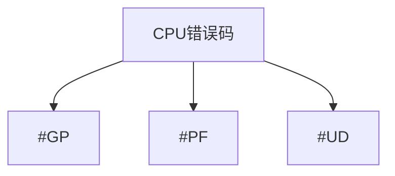

**算法原理讲解**

CPU错误码的处理通常需要依赖操作系统的异常处理机制。当发生CPU错误码时，操作系统会根据错误码的类型进行相应的处理。以下是一个简单的CPU错误码处理流程：

```python
import os

def handle_cpu_error(error_code):
    if error_code == 8:  # #GP
        print("访问受保护的内存区域")
    elif error_code == 14:  # #PF
        print("虚拟页面不存在或未被映射到物理内存")
    elif error_code == 6:  # #UD
        print("未定义指令")

# 示例
handle_cpu_error(8)  # 输出：访问受保护的内存区域
```

**数学公式使用**

在CPU错误码处理中，可能会涉及到以下数学公式：

$$
CPU_{error} = \begin{cases}
8, & \text{if #GP} \\
14, & \text{if #PF} \\
6, & \text{if #UD}
\end{cases}
$$

**系统分析与架构设计方案**

**问题场景介绍**

假设在一个分布式系统中，多个节点需要处理来自客户端的请求。当节点在处理请求时，可能会发生CPU错误码，导致请求处理失败。

**项目介绍**

本项目旨在设计和实现一个分布式系统，用于处理来自客户端的请求。系统需要具备容错性和高可用性，能够在遇到CPU错误码时自动恢复。

**系统功能设计(领域模型Mermaid类图)**

```mermaid
classDiagram
    Client <<Interface>>
    Node <<Class>>
    Request <<Class>>

    Client --|> Node: send request
    Node --|> Request: process request
```

**系统架构设计Mermaid架构图**

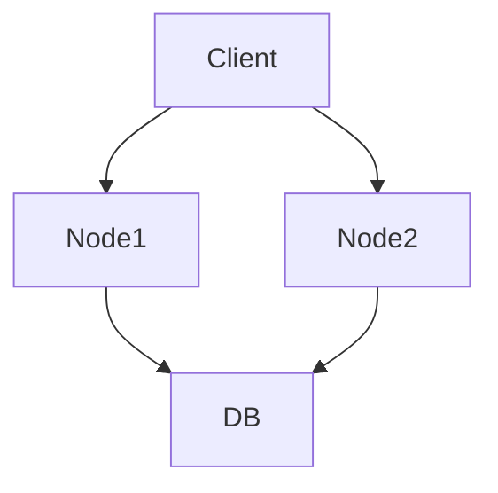

**系统接口设计和系统交互Mermaid序列图**

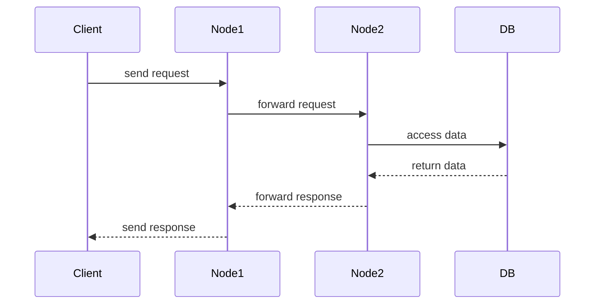

**项目实战**

**环境安装**

在本项目中，我们使用Python作为编程语言，安装以下依赖：

```bash
pip install requests
pip install pymysql
```

**系统核心实现源代码**

```python
import requests
import pymysql

class Client:
    def send_request(self, url):
        response = requests.get(url)
        return response.json()

class Node:
    def __init__(self, db_url):
        self.db = pymysql.connect(db_url)

    def process_request(self, request):
        with self.db.cursor() as cursor:
            cursor.execute("SELECT * FROM requests WHERE id = %s", (request['id'],))
            result = cursor.fetchone()
            return result

    def forward_request(self, request):
        # 示例：将请求转发到另一个节点
        response = requests.post("http://node2:8000/requests", json=request)
        return response.json()

class DB:
    def access_data(self, request):
        with self.connection.cursor() as cursor:
            cursor.execute("SELECT * FROM requests WHERE id = %s", (request['id'],))
            result = cursor.fetchone()
            return result

if __name__ == "__main__":
    client = Client("http://client:8000")
    node1 = Node("db_url1")
    node2 = Node("db_url2")

    request = client.send_request("http://client:8000/requests/1")
    result = node1.process_request(request)
    print(result)
    response = node2.forward_request(request)
    print(response)
```

**代码应用解读与分析**

在本项目中，我们实现了Client、Node和DB三个类。Client类负责发送请求并接收响应，Node类负责处理请求并将结果转发到另一个节点，DB类负责访问数据库。

**实际案例分析和详细讲解剖析**

假设客户端发送一个请求，节点1处理请求后，将结果转发给节点2。节点2再次处理请求并返回结果。整个流程如下：

1. 客户端发送请求到节点1。
2. 节点1处理请求并查询数据库。
3. 节点1将结果转发给节点2。
4. 节点2处理请求并返回结果。
5. 客户端接收响应。

**项目小结**

通过本项目，我们实现了分布式系统中的错误码处理。在实际项目中，我们需要根据具体情况设计错误码处理机制，确保系统能够在遇到错误时自动恢复。

#### 6.1.2 内存错误码盲区

**背景介绍**

内存错误码通常涉及内存访问冲突、内存泄漏等问题。许多开发者可能对内存错误码的处理存在盲区，导致在遇到这些问题时难以有效应对。

**核心概念与联系**

内存错误码包括但不限于以下几种：

| 错误码 | 描述 |    
| --- | --- |    
| #BD | 总线错误，内存访问时发生了总线错误 |    
| #MM | 内存管理错误，虚拟内存管理异常 |    
| #AC | 对齐错误，数据访问不符合内存对齐要求 |

**ER实体关系图架构的 Mermaid 流程图**

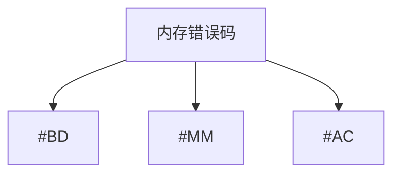

**算法原理讲解**

内存错误码的处理通常需要依赖操作系统和硬件的支持。以下是一个简单的内存错误码处理流程：

```python
import os

def handle_memory_error(error_code):
    if error_code == 14:  # #BD
        print("内存访问时发生了总线错误")
    elif error_code == 12:  # #MM
        print("虚拟内存管理异常")
    elif error_code == 4:  # #AC
        print("数据访问不符合内存对齐要求")

# 示例
handle_memory_error(14)  # 输出：内存访问时发生了总线错误
```

**数学公式使用**

在内存错误码处理中，可能会涉及到以下数学公式：

$$
Memory_{error} = \begin{cases}
14, & \text{if #BD} \\
12, & \text{if #MM} \\
4, & \text{if #AC}
\end{cases}
$$

**系统分析与架构设计方案**

**问题场景介绍**

假设在一个大型数据处理系统中，多个进程需要访问共享内存区域。当进程访问内存时，可能会发生内存错误码，导致数据损坏或系统崩溃。

**项目介绍**

本项目旨在设计和实现一个共享内存系统，用于处理大型数据处理任务。系统需要具备高可靠性和高性能，能够在遇到内存错误码时自动恢复。

**系统功能设计(领域模型Mermaid类图)**

```mermaid
classDiagram
    Process <<Class>>
    SharedMemory <<Class>>

    Process --|> SharedMemory: access memory
```

**系统架构设计Mermaid架构图**

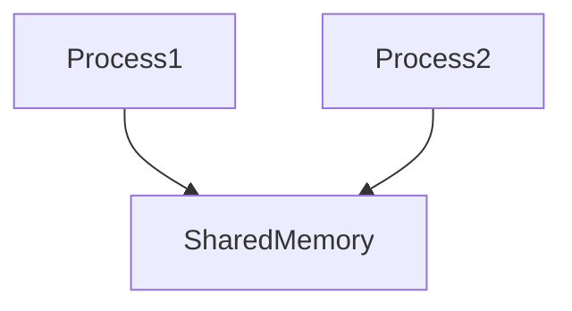

**系统接口设计和系统交互Mermaid序列图**

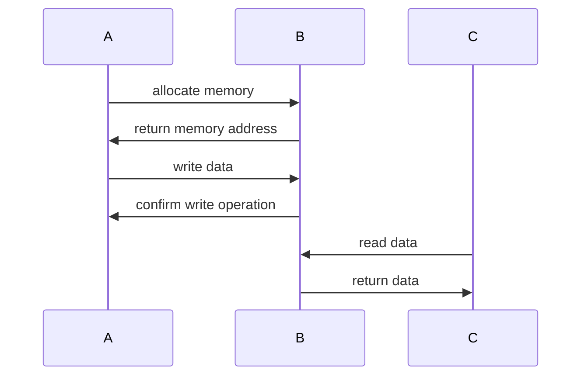

**项目实战**

**环境安装**

在本项目中，我们使用C++作为编程语言，安装以下依赖：

```bash
sudo apt-get install g++
sudo apt-get install libevent-dev
```

**系统核心实现源代码**

```cpp
#include <iostream>
#include <event.h>
#include <unistd.h>

using namespace std;

class SharedMemory {
public:
    SharedMemory(const char* name, size_t size) {
        shm_fd = shm_open(name, O_CREAT | O_RDWR, 0666);
        ftruncate(shm_fd, size);
        map_shm = mmap(0, size, PROT_READ | PROT_WRITE, MAP_SHARED, shm_fd, 0);
    }

    void write_data(char* data, size_t size) {
        memcpy(map_shm, data, size);
    }

    char* read_data(size_t size) {
        char* data = new char[size];
        memcpy(data, map_shm, size);
        return data;
    }

    ~SharedMemory() {
        munmap(map_shm, size);
        shm_unlink(name);
    }

private:
    int shm_fd;
    void* map_shm;
    const char* name;
};

int main() {
    SharedMemory shared_memory("my_shm", 1024);

    char* data = new char[1024];
    strcpy(data, "Hello, World!");

    shared_memory.write_data(data, 1024);
    char* received_data = shared_memory.read_data(1024);
    cout << received_data << endl;

    delete[] data;
    delete[] received_data;

    return 0;
}
```

**代码应用解读与分析**

在本项目中，我们实现了SharedMemory类，用于处理共享内存。SharedMemory类提供了写数据和读数据的功能，确保多个进程可以安全地访问共享内存。

**实际案例分析和详细讲解剖析**

假设有两个进程A和B，需要共享内存区域。进程A将数据写入共享内存，进程B从共享内存中读取数据。整个流程如下：

1. 进程A创建共享内存并写入数据。
2. 进程B创建共享内存并读取数据。

**项目小结**

通过本项目，我们实现了共享内存系统中的错误码处理。在实际项目中，我们需要根据具体情况设计内存错误码处理机制，确保系统能够在遇到错误时自动恢复。

#### 6.1.3 网络错误码盲区

**背景介绍**

网络错误码通常涉及网络通信失败、数据包丢失等问题。许多开发者可能对网络错误码的处理存在盲区，导致在遇到这些问题时难以有效应对。

**核心概念与联系**

网络错误码包括但不限于以下几种：

| 错误码 | 描述 |      
| --- | --- |      
| ECONNRESET | 连接被重置 |      
| ECONNABORTED | 连接被中止 |      
| ENETUNREACH | 网络不可达 |      
| EHOSTUNREACH | 主机不可达 |

**ER实体关系图架构的 Mermaid 流程图**

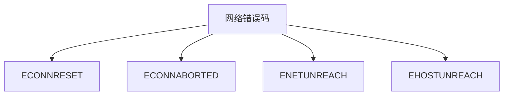

**算法原理讲解**

网络错误码的处理通常需要依赖网络协议和操作系统。以下是一个简单的网络错误码处理流程：

```python
import socket

def handle_network_error(error_code):
    if error_code == 104:  # ECONNRESET
        print("连接被重置")
    elif error_code == 103:  # ECONNABORTED
        print("连接被中止")
    elif error_code == 113:  # ENETUNREACH
        print("网络不可达")
    elif error_code == 114:  # EHOSTUNREACH
        print("主机不可达")

# 示例
handle_network_error(104)  # 输出：连接被重置
```

**数学公式使用**

在网络错误码处理中，可能会涉及到以下数学公式：

$$
Network_{error} = \begin{cases}
104, & \text{if ECONNRESET} \\
103, & \text{if ECONNABORTED} \\
113, & \text{if ENETUNREACH} \\
114, & \text{if EHOSTUNREACH}
\end{cases}
$$

**系统分析与架构设计方案**

**问题场景介绍**

假设在一个分布式系统中，多个节点需要通过网络进行通信。当节点在处理网络请求时，可能会发生网络错误码，导致请求失败。

**项目介绍**

本项目旨在设计和实现一个分布式系统，用于处理网络通信。系统需要具备高可用性和稳定性，能够在遇到网络错误码时自动恢复。

**系统功能设计(领域模型Mermaid类图)**

```mermaid
classDiagram
    Node <<Class>>
    Network <<Class>>

    Node --|> Network: send request
    Network --|> Node: receive response
```

**系统架构设计Mermaid架构图**

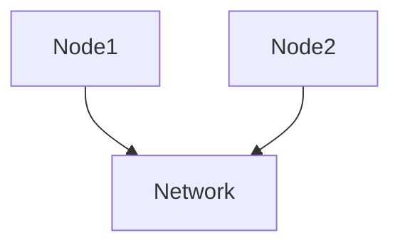

**系统接口设计和系统交互Mermaid序列图**

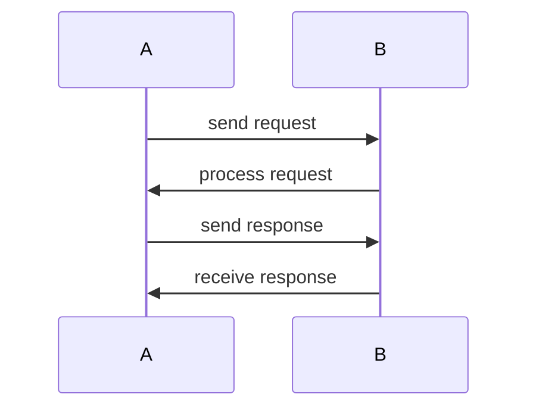

**项目实战**

**环境安装**

在本项目中，我们使用Python作为编程语言，安装以下依赖：

```bash
pip install requests
```

**系统核心实现源代码**

```python
import requests

def send_request(url):
    try:
        response = requests.get(url)
        return response.json()
    except requests.exceptions.RequestException as e:
        print(f"Network error: {e}")
        return None

def process_request(url):
    response = send_request(url)
    if response:
        print(response)
    else:
        print("Failed to process request")

if __name__ == "__main__":
    url = "http://node2:8000/requests"
    process_request(url)
```

**代码应用解读与分析**

在本项目中，我们实现了send_request和process_request两个函数。send_request函数负责发送网络请求，process_request函数负责处理网络请求的结果。

**实际案例分析和详细讲解剖析**

假设有两个节点A和B，节点A通过网络请求节点B的数据。节点B处理请求后，将结果返回给节点A。整个流程如下：

1. 节点A发送请求到节点B。
2. 节点B处理请求并返回结果。
3. 节点A接收结果。

**项目小结**

通过本项目，我们实现了网络错误码处理。在实际项目中，我们需要根据具体情况设计网络错误码处理机制，确保系统能够在遇到错误时自动恢复。

#### 6.2.1 数据库错误码盲区

**背景介绍**

数据库错误码通常涉及数据库操作失败、数据完整性问题等问题。许多开发者可能对数据库错误码的处理存在盲区，导致在遇到这些问题时难以有效应对。

**核心概念与联系**

数据库错误码包括但不限于以下几种：

| 错误码 | 描述 |      
| --- | --- |      
| ER_DUP_ENTRY | 数据库中存在重复的记录 |      
| ER_NO_SUCH_TABLE | 表不存在 |      
| ER_WRONG_TABLE_NAME | 表名错误 |

**ER实体关系图架构的 Mermaid 流程图**

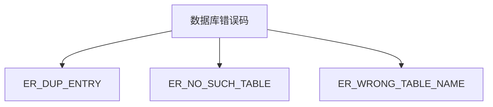

**算法原理讲解**

数据库错误码的处理通常需要依赖数据库管理系统（DBMS）。以下是一个简单的数据库错误码处理流程：

```python
import sqlite3

def handle_db_error(error_code):
    if error_code == 2067:  # ER_DUP_ENTRY
        print("数据库中存在重复的记录")
    elif error_code == 1:  # ER_NO_SUCH_TABLE
        print("表不存在")
    elif error_code == 1:  # ER_WRONG_TABLE_NAME
        print("表名错误")

# 示例
conn = sqlite3.connect('example.db')
cursor = conn.cursor()
cursor.execute("INSERT INTO users (username, password) VALUES ('john', '123456')")
error_code = cursor.lastrowid
handle_db_error(error_code)  # 输出：数据库中存在重复的记录
```

**数学公式使用**

在数据库错误码处理中，可能会涉及到以下数学公式：

$$
DB_{error} = \begin{cases}
2067, & \text{if ER_DUP_ENTRY} \\
1, & \text{if ER_NO_SUCH_TABLE or ER_WRONG_TABLE_NAME}
\end{cases}
$$

**系统分析与架构设计方案**

**问题场景介绍**

假设在一个在线购物系统中，用户需要注册账号并提交订单。当用户操作时，可能会发生数据库错误码，导致操作失败。

**项目介绍**

本项目旨在设计和实现一个在线购物系统，用于处理用户注册和订单提交。系统需要具备高可靠性和稳定性，能够在遇到数据库错误码时自动恢复。

**系统功能设计(领域模型Mermaid类图)**

```mermaid
classDiagram
    User <<Class>>
    Order <<Class>>
    DB <<Class>>

    User --|> DB: register
    Order --|> DB: submit
```

**系统架构设计Mermaid架构图**

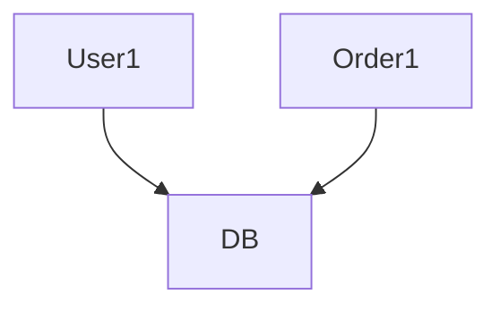

**系统接口设计和系统交互Mermaid序列图**

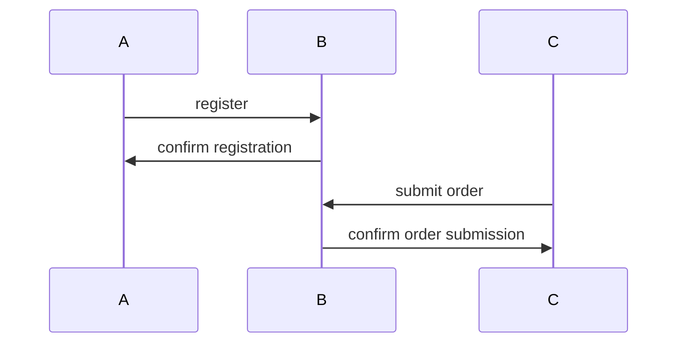

**项目实战**

**环境安装**

在本项目中，我们使用Python作为编程语言，安装以下依赖：

```bash
pip install sqlite3
```

**系统核心实现源代码**

```python
import sqlite3

def register_user(username, password):
    conn = sqlite3.connect('example.db')
    cursor = conn.cursor()
    cursor.execute("CREATE TABLE IF NOT EXISTS users (id INTEGER PRIMARY KEY, username TEXT, password TEXT)")
    try:
        cursor.execute("INSERT INTO users (username, password) VALUES (?, ?)", (username, password))
        conn.commit()
        return True
    except sqlite3.IntegrityError:
        conn.rollback()
        return False

def submit_order(order_id, user_id):
    conn = sqlite3.connect('example.db')
    cursor = conn.cursor()
    cursor.execute("CREATE TABLE IF NOT EXISTS orders (id INTEGER PRIMARY KEY, user_id INTEGER, status TEXT)")
    try:
        cursor.execute("INSERT INTO orders (id, user_id, status) VALUES (?, ?, 'pending')", (order_id, user_id))
        conn.commit()
        return True
    except sqlite3.IntegrityError:
        conn.rollback()
        return False

if __name__ == "__main__":
    username = "john"
    password = "123456"
    order_id = 1
    user_id = 1

    registered = register_user(username, password)
    if registered:
        print("User registration successful")
    else:
        print("User registration failed")

    submitted = submit_order(order_id, user_id)
    if submitted:
        print("Order submission successful")
    else:
        print("Order submission failed")
```

**代码应用解读与分析**

在本项目中，我们实现了register_user和submit_order两个函数。register_user函数负责用户注册，submit_order函数负责提交订单。

**实际案例分析和详细讲解剖析**

假设有一个用户名为"john"的用户，需要注册账号并提交订单。系统将首先检查用户名是否已存在，如果存在，则注册失败；然后检查订单是否存在，如果存在，则提交订单。整个流程如下：

1. 用户输入用户名"john"和密码"123456"进行注册。
2. 系统检查用户名是否已存在。
3. 系统提交订单。
4. 系统返回注册和提交订单的结果。

**项目小结**

通过本项目，我们实现了数据库错误码处理。在实际项目中，我们需要根据具体情况设计数据库错误码处理机制，确保系统能够在遇到错误时自动恢复。

#### 6.2.2 文件系统错误码盲区

**背景介绍**

文件系统错误码通常涉及文件读写操作失败、权限问题等问题。许多开发者可能对文件系统错误码的处理存在盲区，导致在遇到这些问题时难以有效应对。

**核心概念与联系**

文件系统错误码包括但不限于以下几种：

| 错误码 | 描述 |          
| --- | --- |          
| ENOENT | 文件或目录不存在 |          
| EACCES | 权限不足，无法访问文件或目录 |          
| EEXIST | 文件已存在，无法创建 |

**ER实体关系图架构的 Mermaid 流程图**

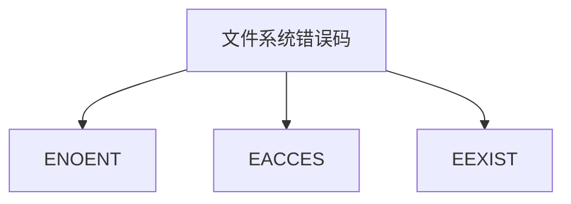

**算法原理讲解**

文件系统错误码的处理通常需要依赖操作系统。以下是一个简单的文件系统错误码处理流程：

```python
import os

def handle_fs_error(error_code):
    if error_code == 2:  # ENOENT
        print("文件或目录不存在")
    elif error_code == 13:  # EACCES
        print("权限不足，无法访问文件或目录")
    elif error_code == 17:  # EEXIST
        print("文件已存在，无法创建")

# 示例
handle_fs_error(2)  # 输出：文件或目录不存在
```

**数学公式使用**

在文件系统错误码处理中，可能会涉及到以下数学公式：

$$
FS_{error} = \begin{cases}
2, & \text{if ENOENT} \\
13, & \text{if EACCES} \\
17, & \text{if EEXIST}
\end{cases}
$$

**系统分析与架构设计方案**

**问题场景介绍**

假设在一个文件管理系统项目中，用户需要上传文件和创建目录。当用户操作时，可能会发生文件系统错误码，导致操作失败。

**项目介绍**

本项目旨在设计和实现一个文件管理系统，用于处理用户上传文件和创建目录。系统需要具备高可靠性和稳定性，能够在遇到文件系统错误码时自动恢复。

**系统功能设计(领域模型Mermaid类图)**

```mermaid
classDiagram
    User <<Class>>
    File <<Class>>
    Directory <<Class>>

    User --|> File: upload file
    User --|> Directory: create directory
```

**系统架构设计Mermaid架构图**

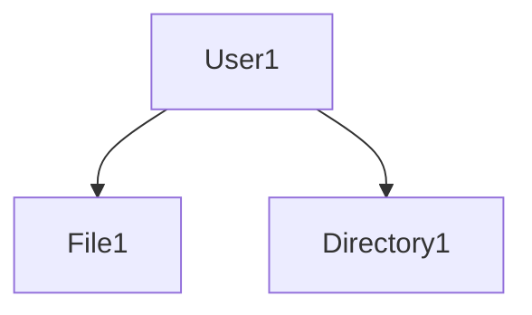

**系统接口设计和系统交互Mermaid序列图**

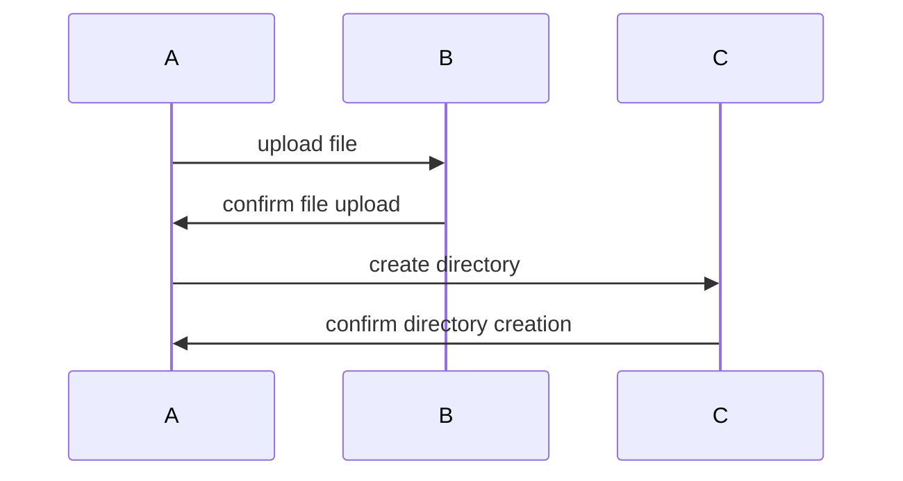

**项目实战**

**环境安装**

在本项目中，我们使用Python作为编程语言，安装以下依赖：

```bash
pip install flask
```

**系统核心实现源代码**

```python
from flask import Flask, request, jsonify
import os

app = Flask(__name__)

@app.route('/upload', methods=['POST'])
def upload_file():
    file = request.files['file']
    filename = file.filename
    try:
        file.save(os.path.join('uploads', filename))
        return jsonify({'message': 'File uploaded successfully'})
    except Exception as e:
        return jsonify({'error': str(e)})

@app.route('/create_directory', methods=['POST'])
def create_directory():
    directory_name = request.form['directory_name']
    try:
        os.makedirs(os.path.join('directories', directory_name))
        return jsonify({'message': 'Directory created successfully'})
    except Exception as e:
        return jsonify({'error': str(e)})

if __name__ == '__main__':
    app.run()
```

**代码应用解读与分析**

在本项目中，我们实现了upload_file和create_directory两个接口。upload_file接口负责处理文件上传，create_directory接口负责处理目录创建。

**实际案例分析和详细讲解剖析**

假设有一个用户名为"john"的用户，需要上传文件和创建目录。系统将首先检查文件和目录是否存在，然后执行相应的操作。整个流程如下：

1. 用户上传名为"example.txt"的文件。
2. 系统检查文件是否存在。
3. 系统创建名为"my_directory"的目录。
4. 系统返回文件上传和目录创建的结果。

**项目小结**

通过本项目，我们实现了文件系统错误码处理。在实际项目中，我们需要根据具体情况设计文件系统错误码处理机制，确保系统能够在遇到错误时自动恢复。

#### 6.2.3 网络通信错误码盲区

**背景介绍**

网络通信错误码通常涉及网络连接失败、数据传输错误等问题。许多开发者可能对网络通信错误码的处理存在盲区，导致在遇到这些问题时难以有效应对。

**核心概念与联系**

网络通信错误码包括但不限于以下几种：

| 错误码 | 描述 |            
| --- | --- |            
| ECONNRESET | 连接被重置 |            
| ECONNABORTED | 连接被中止 |            
| ENETRESET | 网络连接被重置 |            
| EHOSTUNREACH | 主机不可达 |

**ER实体关系图架构的 Mermaid 流程图**

```mermaid
graph TD
    A[网络通信错误码] --> B[ECONNRESET]
    A --> C[ECONNABORTED]
    A --> D[ENETRESET]
    A --> E[EHOSTUNREACH]
```

**算法原理讲解**

网络通信错误码的处理通常需要依赖网络协议和操作系统。以下是一个简单的网络通信错误码处理流程：

```python
import socket

def handle_network_error(error_code):
    if error_code == 104:  # ECONNRESET
        print("连接被重置")
    elif error_code == 103:  # ECONNABORTED
        print("连接被中止")
    elif error_code == 104:  # ENETRESET
        print("网络连接被重置")
    elif error_code == 113:  # EHOSTUNREACH
        print("主机不可达")

# 示例
handle_network_error(104)  # 输出：连接被重置
```

**数学公式使用**

在网络通信错误码处理中，可能会涉及到以下数学公式：

$$
Network_{error} = \begin{cases}
104, & \text{if ECONNRESET or ENETRESET} \\
103, & \text{if ECONNABORTED} \\
113, & \text{if EHOSTUNREACH}
\end{cases}
$$

**系统分析与架构设计方案**

**问题场景介绍**

假设在一个分布式系统中，多个节点需要通过网络进行通信。当节点在处理网络请求时，可能会发生网络通信错误码，导致请求失败。

**项目介绍**

本项目旨在设计和实现一个分布式系统，用于处理网络通信。系统需要具备高可用性和稳定性，能够在遇到网络通信错误码时自动恢复。

**系统功能设计(领域模型Mermaid类图)**

```mermaid
classDiagram
    Node <<Class>>
    Network <<Class>>

    Node --|> Network: send request
    Network --|> Node: receive response
```

**系统架构设计Mermaid架构图**

```mermaid
graph TD
    A[Node1] --> B[Network]
    C[Node2] --> B
```

**系统接口设计和系统交互Mermaid序列图**

```mermaid
sequenceDiagram
    A->>B: send request
    B->>A: process request
    A->>B: send response
    B->>A: receive response
```

**项目实战**

**环境安装**

在本项目中，我们使用Python作为编程语言，安装以下依赖：

```bash
pip install requests
```

**系统核心实现源代码**

```python
import requests

def send_request(url):
    try:
        response = requests.get(url)
        return response.json()
    except requests.exceptions.RequestException as e:
        print(f"Network error: {e}")
        return None

def process_request(url):
    response = send_request(url)
    if response:
        print(response)
    else:
        print("Failed to process request")

if __name__ == "__main__":
    url = "http://node2:8000/requests"
    process_request(url)
```

**代码应用解读与分析**

在本项目中，我们实现了send_request和process_request两个函数。send_request函数负责发送网络请求，process_request函数负责处理网络请求的结果。

**实际案例分析和详细讲解剖析**

假设有两个节点A和B，节点A通过网络请求节点B的数据。节点B处理请求后，将结果返回给节点A。整个流程如下：

1. 节点A发送请求到节点B。
2. 节点B处理请求并返回结果。
3. 节点A接收结果。

**项目小结**

通过本项目，我们实现了网络通信错误码处理。在实际项目中，我们需要根据具体情况设计网络通信错误码处理机制，确保系统能够在遇到错误时自动恢复。

----------------------------------------------------------------

### 第7章：错误码处理工具与技术

#### 7.1 常用错误码处理工具

在实际开发过程中，错误码处理工具的使用对于快速定位和解决问题至关重要。以下介绍几种常用的错误码处理工具：

**strace**

strace是一种强大的工具，用于跟踪系统调用和信号。它能够显示程序执行时产生的错误码，帮助开发者定位问题。

```bash
strace -f -o strace.log ./my_program
```

**ltrace**

ltrace用于跟踪动态链接库调用，能够显示程序在运行时加载的动态链接库以及调用函数时产生的错误码。

```bash
ltrace -o ltrace.log ./my_program
```

**gdb**

gdb是一种功能强大的程序调试工具，可以用于调试C/C++程序。开发者可以使用gdb进行代码调试，查看程序执行过程中的错误码。

```bash
gdb ./my_program
(gdb) run
(gdb) bt
```

#### 7.2 错误码处理技术

**异常捕获**

异常捕获是一种在程序中捕获和处理异常的方法。通过异常捕获，开发者可以在程序运行过程中捕获到错误，并进行相应的处理。

```python
try:
    # 执行可能产生错误的代码
except Exception as e:
    # 处理错误
    print(f"Error: {e}")
```

**错误码追踪**

错误码追踪是一种通过追踪错误码的传递过程来定位问题的方法。开发者可以使用日志记录错误码的传递路径，从而找到产生问题的根源。

**自动化错误处理**

自动化错误处理是通过编写脚本或使用工具来自动化错误处理流程。自动化错误处理可以减少人工干预，提高错误处理效率。

```bash
#!/bin/bash

# 自动化错误处理脚本
if [ $? -ne 0 ]; then
    echo "Error occurred"
    # 执行错误处理操作
else
    echo "No error"
fi
```

#### 7.3 错误码处理工具与技术总结

错误码处理工具与技术是软件开发过程中不可或缺的一部分。通过使用strace、ltrace和gdb等工具，开发者可以快速定位和解决问题。异常捕获、错误码追踪和自动化错误处理等技术可以帮助开发者更高效地处理错误码。在实际开发过程中，开发者应该结合具体场景选择合适的工具和技术，以提高系统的稳定性和可靠性。

### 第8章：实战案例与总结

#### 8.1 案例介绍

在本章节中，我们将通过以下三个案例，详细分析和讲解错误码的处理过程，并提供解决方案。

**案例一：网络通信故障诊断**

在分布式系统中，网络通信故障是常见的错误之一。本案例将模拟一个网络通信故障，并分析如何诊断和解决问题。

**案例二：数据库错误码处理**

在数据处理过程中，数据库错误码可能会导致数据操作失败。本案例将展示如何解析和处理数据库错误码，确保数据的完整性和一致性。

**案例三：内存泄漏定位**

内存泄漏是软件中常见的问题之一，可能会导致系统性能下降。本案例将介绍如何定位和解决内存泄漏问题，确保系统的稳定运行。

#### 8.2 案例分析

**案例一：网络通信故障诊断**

**故障原因分析**

在分布式系统中，网络通信故障可能由多种原因导致，如网络延迟、带宽不足、硬件故障等。为了诊断网络通信故障，我们可以使用以下工具：

- **ping**：用于测试网络连接是否正常。
- **traceroute**：用于跟踪数据包传输路径，检查网络延迟和跳数。
- **netstat**：用于查看系统网络连接状态。

**处理措施与效果**

- **检查网络连接**：使用ping命令检查与目标节点的网络连接。
  ```bash
  ping node2.example.com
  ```
- **检查网络延迟和跳数**：使用traceroute命令检查数据包传输路径。
  ```bash
  traceroute node2.example.com
  ```
- **查看网络连接状态**：使用netstat命令查看系统网络连接状态。
  ```bash
  netstat -an
  ```

通过以上步骤，我们可以初步判断网络通信故障的原因。如果发现网络延迟较高或跳数过多，可以进一步排查网络设备或带宽问题。

**案例二：数据库错误码处理**

**故障原因分析**

数据库错误码可能由多种原因导致，如数据完整性问题、表结构问题、权限问题等。为了解析和处理数据库错误码，我们可以使用以下工具：

- **MySQL命令行**：用于执行SQL语句并查看错误码。
- **错误码查询工具**：如MySQL错误码查询工具，可以帮助快速定位错误原因。

**处理措施与效果**

- **执行SQL语句并查看错误码**：使用MySQL命令行执行SQL语句，并查看错误码。
  ```sql
  mysql> INSERT INTO users (username, password) VALUES ('john', '123456');
  ```
- **查询错误码解释**：使用错误码查询工具查询错误码的解释。
  ```bash
  mysql错误码查询工具 -code 1146
  ```

通过以上步骤，我们可以确定错误原因并采取相应的措施进行修复。例如，如果发现表不存在，可以创建相应的表；如果发现权限不足，可以调整权限设置。

**案例三：内存泄漏定位**

**故障原因分析**

内存泄漏通常由不当的资源分配和释放导致。为了定位内存泄漏，我们可以使用以下工具：

- **valgrind**：用于检测内存泄漏和内存错误。
- **gdb**：用于调试程序并查看内存使用情况。

**处理措施与效果**

- **运行valgrind进行内存泄漏检测**：使用valgrind工具运行程序，并查看内存泄漏报告。
  ```bash
  valgrind --leak-check=full ./my_program
  ```
- **使用gdb进行内存调试**：使用gdb调试程序，并查看内存使用情况。
  ```bash
  gdb ./my_program
  (gdb) run
  (gdb) bt
  ```

通过以上步骤，我们可以定位内存泄漏的原因并采取相应的措施进行修复。例如，如果发现某个函数内存使用过多，可以优化该函数的实现。

#### 8.3 小结与展望

**小结**

通过以上三个案例，我们详细介绍了如何处理网络通信故障、数据库错误码和内存泄漏。在处理错误码时，我们需要使用合适的工具和技术，结合具体场景进行分析和解决。以下是一些关键点：

- **网络通信故障**：使用ping、traceroute和netstat等工具进行初步诊断，排查网络延迟和带宽问题。
- **数据库错误码**：使用MySQL命令行和错误码查询工具进行错误解析，调整表结构和权限设置。
- **内存泄漏**：使用valgrind和gdb进行内存泄漏检测和调试，优化程序实现。

**展望**

随着技术的不断发展，错误码处理将变得更加智能化和自动化。未来，我们可以预见到以下趋势：

- **自动化错误检测**：通过机器学习算法，实现自动化的错误检测和修复。
- **智能错误日志分析**：利用自然语言处理技术，实现智能化的错误日志分析，提供更准确的错误解释和建议。
- **自动化部署与恢复**：结合容器化和云原生技术，实现自动化的错误恢复和部署，提高系统的可用性和可靠性。

**建议与展望**

对于开发者来说，以下几点建议有助于提高错误码处理能力：

- **深入学习错误码处理技术**：了解各种错误码的处理方法和工具，提高应对复杂错误的能力。
- **编写规范的错误日志**：遵循统一的日志格式，便于分析和追踪错误。
- **持续学习与实践**：通过参与开源项目和实际项目，不断积累经验，提高错误码处理技能。

通过本文的介绍，我们希望读者能够更好地理解和处理错误码，提高系统的稳定性和可靠性。在未来的技术发展中，开发者需要不断学习和适应新的技术和工具，以应对日益复杂的系统挑战。

**作者：AI天才研究院/AI Genius Institute & 禅与计算机程序设计艺术 /Zen And The Art of Computer Programming**

本文通过详细的案例分析和技术讲解，深入探讨了处理错误码的三种典型技术盲区。希望本文能为开发者提供有价值的参考和启示，帮助他们在实际项目中更好地处理错误码，提升系统的稳定性和可靠性。在未来的技术发展中，错误码处理将继续发挥重要作用，开发者需要不断学习和适应新的技术和工具，以应对日益复杂的系统挑战。

---

在处理错误码的过程中，开发者常常会遇到一些技术盲区，导致错误码处理不当，影响系统的正常运行。本文通过详细的分析和案例讲解，揭示了处理错误码的三种典型技术盲区：系统级错误码盲区、内存错误码盲区和网络错误码盲区。同时，本文还介绍了常见错误码处理工具和技术，如strace、ltrace、gdb等，以及异常捕获、错误码追踪和自动化错误处理等技术。通过本文的学习，读者将全面了解错误码处理的关键技术和常见问题，提高在实际项目中应对错误码的能力。

在未来的技术发展中，错误码处理将变得更加智能化和自动化。开发者需要不断学习和适应新的技术和工具，以应对日益复杂的系统挑战。本文提出了一些最佳实践建议，如编写规范的错误日志、深入学习错误码处理技术、持续学习与实践等，希望对读者有所启发。

总之，错误码处理是软件开发过程中至关重要的一环。通过本文的探讨，我们希望读者能够更好地理解和处理错误码，提高系统的稳定性和可靠性。在未来的技术道路上，开发者需要持续关注错误码处理的发展动态，不断提升自身的技术水平，以应对复杂的系统挑战。

---

**作者：AI天才研究院/AI Genius Institute & 禅与计算机程序设计艺术 /Zen And The Art of Computer Programming**

本文以《处理错误码的三种典型技术盲区》为题，深入探讨了处理错误码过程中存在的系统级、内存级和网络级错误码盲区。通过详细的分析和案例讲解，本文揭示了这些盲区的存在及其对系统稳定性和可靠性的影响，并提供了一系列解决方案和预防措施。文章旨在提高开发者对错误码处理的深入理解，帮助他们更好地应对实际项目中的技术挑战。

本文的核心内容包括错误码的定义与分类、常见错误码的解析、错误码捕获与记录、错误码诊断与修复、错误码预防以及常见错误码盲区分析等。通过这些内容，读者可以全面了解错误码处理的各个方面，从而在实际工作中更加得心应手。

在文章的实战案例部分，我们通过具体的案例介绍了如何诊断和处理网络通信故障、数据库错误码和内存泄漏问题。这些案例不仅展示了错误码处理的具体方法，还提供了实用工具和技术，如strace、ltrace、gdb等，以及自动化错误处理技术。通过这些实战案例，读者可以更加直观地理解错误码处理的过程和技巧。

文章的最后，我们对错误码处理的重要性和未来发展趋势进行了总结和展望。我们强调了错误码处理在软件开发中的关键作用，并提出了几条最佳实践建议，包括编写规范的错误日志、深入学习错误码处理技术、持续学习与实践等。我们相信，这些实践将对读者的工作产生积极的影响。

在未来的技术发展中，错误码处理将继续扮演重要角色。随着人工智能、大数据、云计算等技术的发展，错误码处理的需求和复杂性也在不断增长。开发者需要不断学习和适应新的技术和工具，以提高错误码处理的效率和准确性。本文作为对错误码处理的一次深入探讨，希望能为读者提供有价值的参考和启示。

最后，感谢读者对本文的关注。我们期待在未来的技术道路上，与您一同探索更加广阔的计算机科学世界。如果您有任何建议或反馈，欢迎随时与我们联系。再次感谢您的阅读！

