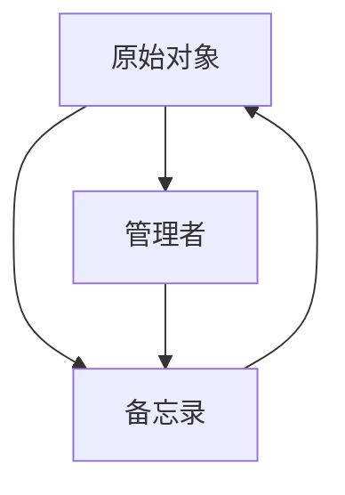
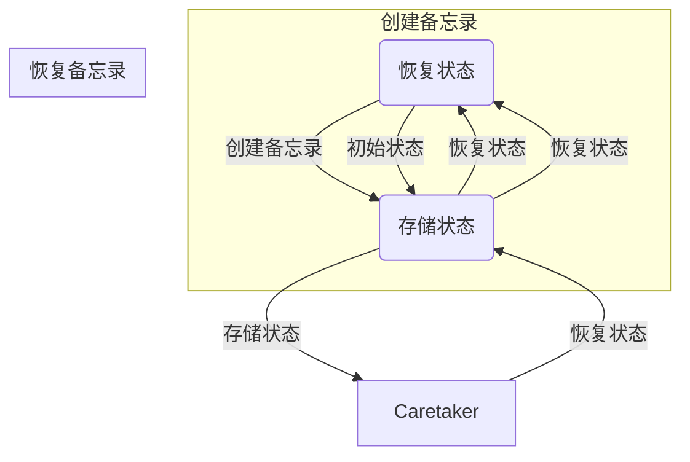

                 

## 备忘录模式：对象状态存储的类型化设计

### 关键词：备忘录模式、对象状态存储、类型化设计、编程模式、软件工程

> 摘要：本文将深入探讨备忘录模式，一种在软件工程中用于对象状态存储和恢复的关键设计模式。我们将从基础概念出发，逐步讲解备忘录模式的核心组件及其应用场景，分析其实施原理和类型化设计，探讨其在数据库管理、游戏开发等领域的应用，并展望其未来发展趋势。通过本文，读者将全面理解备忘录模式的核心原理和实践应用，为其在软件开发中的有效利用打下坚实基础。

### 目录大纲设计

## 《备忘录模式：对象状态存储的类型化设计》目录大纲

### 第一部分：备忘录模式概述

## 第1章：备忘录模式的基础知识

### 1.1 什么是备忘录模式

- 备忘录模式的定义
- 备忘录模式的作用

### 1.2 备忘录模式的核心组件

- Memento（备忘录）
- Originator（原始对象）
- Caretaker（管理者）

### 1.3 备忘录模式的应用场景

- 数据恢复
- 状态保存与恢复
- 实验室中的控制变量法

## 第2章：备忘录模式的实现原理

### 2.1 备忘录模式的角色与职责

- Originator（原始对象）：负责创建备忘录，恢复自身状态
- Memento（备忘录）：存储原始对象的内部状态
- Caretaker（管理者）：负责管理备忘录，无需关心备忘录的具体内容

### 2.2 备忘录模式的创建与恢复过程

- 创建备忘录
- 保存备忘录
- 恢复备忘录

### 2.3 备忘录模式的注意事项

- 备忘录的序列化与反序列化
- 备忘录的安全性问题

## 第3章：备忘录模式的类型化设计

### 3.1 简单备忘录模式

- 简单备忘录模式的结构
- 简单备忘录模式的实现

### 3.2 可扩展备忘录模式

- 可扩展备忘录模式的结构
- 可扩展备忘录模式的实现

### 3.3 安全备忘录模式

- 安全备忘录模式的结构
- 安全备忘录模式的实现

### 第二部分：备忘录模式在实践中的应用

## 第4章：备忘录模式在数据库管理中的应用

### 4.1 数据库状态的保存与恢复

- 数据库状态的保存
- 数据库状态的恢复

### 4.2 备忘录模式在数据库恢复中的应用

- 数据库恢复的基本原理
- 备忘录模式在数据库恢复中的具体应用

### 4.3 备忘录模式在数据库性能优化中的应用

- 备忘录模式对数据库性能的影响
- 备忘录模式在数据库性能优化中的具体应用

## 第5章：备忘录模式在游戏开发中的应用

### 5.1 游戏状态的保存与恢复

- 游戏状态的保存
- 游戏状态的恢复

### 5.2 备忘录模式在游戏设计中的应用

- 备忘录模式在游戏设计中的优势
- 备忘录模式在游戏设计中的具体应用

### 5.3 备忘录模式在游戏开发中的挑战与解决方案

- 备忘录模式在游戏开发中的挑战
- 备忘录模式在游戏开发中的解决方案

## 第6章：备忘录模式在其他领域中的应用

### 6.1 在自动化测试中的应用

- 备忘录模式在自动化测试中的作用
- 备忘录模式在自动化测试中的具体应用

### 6.2 在分布式系统中的应用

- 备忘录模式在分布式系统中的作用
- 备忘录模式在分布式系统中的具体应用

### 6.3 在容器编排中的应用

- 备忘录模式在容器编排中的作用
- 备忘录模式在容器编排中的具体应用

## 第7章：备忘录模式的未来发展趋势

### 7.1 备忘录模式的发展方向

- 数据库技术的进步对备忘录模式的影响
- 新兴技术（如区块链）对备忘录模式的影响

### 7.2 备忘录模式在未来的应用场景

- 备忘录模式在新兴领域的潜在应用
- 备忘录模式在未来的发展趋势

### 附录

### A.1 相关参考资料

- 推荐阅读
- 常用工具与库

### A.2 联系方式

- 作者联系方式
- 读者反馈渠道

---

### 文章开始

在软件工程领域，维护系统的稳定性和可恢复性是开发过程中不可忽视的重要任务。备忘录模式（Memento Pattern）正是为了解决这一难题而设计的一种行为型设计模式。本文将围绕备忘录模式进行深入探讨，包括其基本概念、核心组件、应用场景、实现原理、类型化设计以及在各个领域的实践应用。希望通过本文，读者能够全面理解备忘录模式，并在软件开发中灵活运用。

### 什么是备忘录模式

备忘录模式是一种行为型设计模式，主要用于对象状态存储和恢复。在软件工程中，对象的状态可能会因为各种原因（如用户操作、系统异常等）发生变化，为了在需要时能够恢复到某个特定的状态，备忘录模式提供了一种机制来保存和恢复对象的内部状态。备忘录模式的核心思想是封装对象状态的保存和恢复过程，使其独立于对象的其余部分，从而实现系统的模块化和可维护性。

备忘录模式的作用主要体现在以下几个方面：

1. **状态恢复**：备忘录模式允许系统在发生错误或变更时，能够恢复到先前的状态，确保系统的一致性和稳定性。
2. **减少耦合**：通过将状态的保存和恢复独立于对象的其他部分，备忘录模式有助于降低对象间的依赖性，提高系统的可维护性。
3. **支持撤销操作**：备忘录模式支持撤销操作，允许用户撤回先前的操作，提供了一种便捷的用户交互体验。
4. **状态迁移监控**：备忘录模式可以帮助监控系统状态的变化，及时发现潜在的问题并进行相应的调整。

### 备忘录模式的核心组件

备忘录模式包含三个核心组件：Memento（备忘录）、Originator（原始对象）和Caretaker（管理者）。

1. **Memento（备忘录）**：备忘录是用于存储原始对象内部状态的组件。它负责记录原始对象的当前状态，并将其封装起来，以便在不暴露原始对象实现细节的情况下进行状态恢复。
2. **Originator（原始对象）**：原始对象是备忘录模式中的主体，它负责创建备忘录，并在需要时使用备忘录恢复自己的状态。原始对象通常包含内部状态，如属性和操作等。
3. **Caretaker（管理者）**：管理者负责管理备忘录，但不需要关心备忘录的具体内容。它负责在适当的时候创建备忘录，并将其存储起来，以备后续恢复使用。

### 备忘录模式的应用场景

备忘录模式在各种场景下都有着广泛的应用，以下是一些典型的应用场景：

1. **数据恢复**：在系统运行过程中，由于用户操作或系统异常等原因，数据可能会发生错误或丢失。备忘录模式可以帮助系统在发生数据错误时，恢复到先前的正确状态，确保数据的一致性和完整性。
2. **状态保存与恢复**：在一些复杂的应用中，如游戏、财务系统等，需要频繁保存和恢复对象的状态。备忘录模式提供了简单且高效的方法来实现这一功能。
3. **实验室中的控制变量法**：在实验研究中，为了验证某一变量对实验结果的影响，通常需要将其他变量保持不变。备忘录模式可以帮助研究人员在实验过程中保存和恢复不同的状态，以便进行控制变量的实验。

通过上述背景介绍，我们可以看到备忘录模式在软件工程中的重要性。接下来，我们将进一步探讨备忘录模式的核心组件及其实现原理。

## 第1章：备忘录模式的基础知识

### 1.1 什么是备忘录模式

备忘录模式（Memento Pattern）是一种行为型设计模式，主要用于对象状态存储和恢复。它的核心思想是将对象内部状态封装成备忘录，以便在不暴露实现细节的情况下，保存和恢复对象的状态。备忘录模式得名于备忘录这一物理实体，它记录了重要信息，以便在需要时能够回忆起这些信息。

在软件工程中，备忘录模式的应用场景非常广泛。例如，在金融系统中，为了确保交易的安全性和一致性，可能需要记录每一次交易的状态，以便在系统出现问题时进行回滚。在游戏开发中，备忘录模式可以用于保存和恢复游戏状态，使得玩家能够在游戏过程中随时保存和加载游戏进度。

备忘录模式的基本定义如下：

- **Memento（备忘录）**：一个包含原始对象内部状态的封装对象。备忘录通常由原始对象创建，并存储在管理者（Caretaker）中。备忘录的主要作用是在不暴露原始对象实现细节的情况下，保存原始对象的内部状态。
- **Originator（原始对象）**：需要保存和恢复状态的主体对象。原始对象负责创建备忘录，并在需要时使用备忘录恢复自己的状态。原始对象通常包含内部状态，如属性和操作等。
- **Caretaker（管理者）**：负责管理备忘录的对象。管理者不需要关心备忘录的具体内容，只需要在适当的时候创建备忘录，并将其存储起来，以备后续恢复使用。

### 1.2 备忘录模式的核心组件

备忘录模式包含三个核心组件：Memento（备忘录）、Originator（原始对象）和Caretaker（管理者）。下面我们将分别介绍这些组件及其职责。

#### Memento（备忘录）

备忘录是备忘录模式中用于存储原始对象内部状态的对象。它通常包含原始对象的内部数据，例如属性值。备忘录的主要职责是：

- **封装原始对象的内部状态**：备忘录将原始对象的内部状态封装起来，使得外部无法直接访问原始对象的内部状态，从而实现数据隐藏。
- **提供状态恢复接口**：备忘录提供了一种机制，使得原始对象可以在需要时恢复到先前的状态。

备忘录的典型实现通常是一个简单的类，它包含原始对象所需的所有状态信息。例如，在一个银行系统中，备忘录可能包含账户的余额、交易历史等信息。

#### Originator（原始对象）

原始对象是备忘录模式中的主体对象，它需要保存和恢复状态。原始对象的主要职责是：

- **创建备忘录**：原始对象负责在需要保存状态时创建备忘录。这通常通过调用备忘录的创建方法来实现。
- **使用备忘录恢复状态**：当需要恢复到先前的状态时，原始对象使用备忘录中的信息来恢复自己的状态。

原始对象通常包含一个内部状态，例如属性和操作。备忘录模式的核心思想是将状态的保存和恢复过程与原始对象的其余部分分离，从而降低系统复杂性。

#### Caretaker（管理者）

管理者是备忘录模式中负责管理备忘录的对象。管理者的主要职责是：

- **管理备忘录**：管理者不需要了解备忘录的具体内容，只需要在适当的时候创建备忘录，并将其存储起来。管理者通常负责将备忘录存储在文件、数据库或其他存储介质中。
- **提供备忘录恢复接口**：当原始对象需要恢复状态时，管理者提供备忘录的恢复接口，使得原始对象能够从备忘录中获取所需的信息。

管理者通常是一个简单的接口，它提供创建备忘录和恢复备忘录的方法。在实际应用中，管理者可以是简单的类或接口，具体实现取决于系统的需求。

### 1.3 备忘录模式的应用场景

备忘录模式在软件开发中具有广泛的应用，以下是一些典型的应用场景：

#### 数据恢复

在数据管理系统中，备忘录模式可以用于记录数据的变更历史，以便在数据发生错误或丢失时进行恢复。例如，在银行系统中，每次账户余额的变更都可以通过备忘录记录下来，当系统出现问题时，可以基于备忘录恢复到正确的状态。

#### 状态保存与恢复

在复杂的应用中，如游戏、财务系统等，备忘录模式可以用于保存和恢复系统的状态。例如，在游戏中，玩家可以随时保存游戏进度，以便在退出游戏或系统崩溃时能够恢复到上次保存的状态。

#### 实验室中的控制变量法

在实验研究中，备忘录模式可以帮助研究人员在实验过程中保存和恢复不同的状态，以便进行控制变量的实验。例如，在医学实验中，研究人员可能需要在不同时间点记录实验对象的状态，以便分析不同变量对实验结果的影响。

通过上述介绍，我们可以看到备忘录模式在软件工程中的应用场景和核心组件。接下来，我们将进一步探讨备忘录模式的实现原理。

### 1.4 实现原理

备忘录模式的核心在于如何封装和恢复对象的内部状态，而不暴露实现细节。以下是备忘录模式的基本实现原理：

#### 创建备忘录

备忘录模式的第一个步骤是创建备忘录。原始对象负责创建备忘录，并将备忘录存储在管理者中。这一过程通常通过以下步骤实现：

1. **提取内部状态**：原始对象提取其内部状态，并将其封装在备忘录对象中。这通常涉及遍历原始对象的属性，并将每个属性的值存储在备忘录中。
2. **传递备忘录给管理者**：原始对象将创建的备忘录传递给管理者，管理者负责将备忘录存储在某个存储介质中，如文件、数据库等。

以下是一个简单的Python示例，展示了如何创建备忘录：

```python
class Memento:
    def __init__(self, state):
        self.state = state

class Originator:
    def __init__(self):
        self.state = None

    def set_state(self, state):
        self.state = state

    def get_memento(self):
        return Memento(self.state)

    def restore_memento(self, memento):
        self.state = memento.state

o = Originator()
o.set_state("Original State")
memento = o.get_memento()
```

在上面的示例中，`Originator` 类负责创建备忘录，并将其存储在 `Memento` 对象中。备忘录的创建过程非常简单，只需要提取原始对象的当前状态并将其传递给 `Memento` 类。

#### 保存备忘录

一旦备忘录被创建，管理者需要将其保存到某个存储介质中。这一过程通常包括以下步骤：

1. **序列化备忘录**：将备忘录对象转换为可存储的格式，如JSON、XML等。这一过程称为序列化。
2. **存储备忘录**：将序列化后的备忘录存储在文件、数据库或其他存储介质中。

以下是一个简单的Python示例，展示了如何保存备忘录：

```python
import json

class Caretaker:
    def __init__(self):
        self.mementos = []

    def save_memento(self, memento):
        self.mementos.append(memento)

    def load_memento(self, index):
        return self.mementos[index]

caretaker = Caretaker()
caretaker.save_memento(Memento(o.get_state()))
```

在上面的示例中，`Caretaker` 类负责保存备忘录。备忘录的保存过程非常简单，只需要将备忘录对象添加到 `mementos` 列表中。

#### 恢复备忘录

备忘录模式的最终步骤是恢复备忘录。原始对象需要从管理者中获取备忘录，并将其还原为原始状态。这一过程通常包括以下步骤：

1. **从管理者获取备忘录**：原始对象从管理者中获取所需备忘录。
2. **还原状态**：使用备忘录中的信息，将原始对象的内部状态还原为备忘录记录的状态。

以下是一个简单的Python示例，展示了如何恢复备忘录：

```python
o.restore_memento(caretaker.load_memento(0))
```

在上面的示例中，原始对象 `o` 使用管理者 `caretaker` 中的备忘录来恢复其状态。通过调用 `restore_memento` 方法，原始对象的内部状态被还原为创建备忘录时的状态。

#### 注意事项

在备忘录模式的实现过程中，需要注意以下事项：

- **安全性**：备忘录的存储和恢复过程需要确保数据的安全性。在存储备忘录时，可以使用加密技术来保护数据。
- **序列化与反序列化**：备忘录的序列化和反序列化是实现备忘录模式的关键步骤。需要选择合适的序列化格式，并确保数据的正确性和一致性。
- **扩展性**：备忘录模式的实现应该具备良好的扩展性，以便能够适应不同的应用场景。例如，可以扩展备忘录类，使其能够存储更复杂的状态信息。

通过上述实现原理的介绍，我们可以看到备忘录模式是如何通过封装和恢复对象状态，实现软件系统的稳定性和可恢复性的。在接下来的章节中，我们将进一步探讨备忘录模式的类型化设计。

### 1.5 类型化设计

在软件开发中，为了提高代码的可维护性和可扩展性，类型化设计是一个重要的策略。备忘录模式也不例外，可以通过类型化设计来实现更灵活和可扩展的解决方案。类型化设计的主要目标是确保备忘录能够存储和恢复不同类型的状态信息，同时保持系统的简洁和高效。

#### 简单备忘录模式

简单备忘录模式是最基本的备忘录模式实现。在这种模式中，备忘录类只包含一组简单的属性，这些属性直接对应原始对象的内部状态。简单备忘录模式的优点是实现简单、易于理解，但缺点是扩展性较差，难以处理复杂的状态信息。

以下是一个简单备忘录模式的Python示例：

```python
class SimpleMemento:
    def __init__(self, state):
        self.state = state

class Originator:
    def __init__(self):
        self.state = None

    def set_state(self, state):
        self.state = state

    def create_memento(self):
        return SimpleMemento(self.state)

    def restore_memento(self, memento):
        self.state = memento.state

o = Originator()
o.set_state("State A")
m = o.create_memento()
print(m.state)  # 输出：State A
o.restore_memento(m)
print(o.state)  # 输出：State A
```

在这个示例中，`SimpleMemento` 类用于存储原始对象的简单状态信息。通过 `create_memento` 和 `restore_memento` 方法，原始对象可以创建和恢复备忘录。

#### 可扩展备忘录模式

为了解决简单备忘录模式的扩展性问题，可扩展备忘录模式引入了泛型机制，使得备忘录能够存储和恢复不同类型的对象状态。这种模式通过定义一个通用的备忘录接口，实现备忘录类之间的泛化。

以下是一个可扩展备忘录模式的Python示例：

```python
from abc import ABC, abstractmethod

class Memento(ABC):
    @abstractmethod
    def get_state(self):
        pass

    @abstractmethod
    def set_state(self, state):
        pass

class SimpleMemento(Memento):
    def __init__(self, state):
        self.state = state

    def get_state(self):
        return self.state

    def set_state(self, state):
        self.state = state

class Originator:
    def __init__(self):
        self.state = None

    def set_state(self, state):
        self.state = state

    def create_memento(self):
        return SimpleMemento(self.state)

    def restore_memento(self, memento):
        self.state = memento.state

o = Originator()
o.set_state("State B")
m = o.create_memento()
print(m.get_state())  # 输出：State B
o.restore_memento(m)
print(o.state)  # 输出：State B
```

在这个示例中，`Memento` 是一个抽象基类，定义了获取和设置状态的方法。`SimpleMemento` 类实现了 `Memento` 接口，用于存储原始对象的简单状态信息。通过这种方式，我们可以轻松地扩展备忘录类，以适应不同的状态信息。

#### 安全备忘录模式

除了简单和可扩展备忘录模式，还有一种安全备忘录模式，旨在提高备忘录的安全性和可靠性。这种模式通过引入加密和验证机制，确保备忘录的数据在存储和恢复过程中不被篡改。

以下是一个安全备忘录模式的Python示例：

```python
from base64 import b64encode, b64decode
from hashlib import sha256

class SecureMemento(Memento):
    def __init__(self, state, hash):
        self.state = state
        self.hash = hash

    def get_state(self):
        return self.state

    def set_state(self, state):
        self.state = state
        self.hash = sha256(state.encode()).hexdigest()

    def verify(self):
        return sha256(self.state.encode()).hexdigest() == self.hash

o = Originator()
o.set_state("Secure State")
m = SecureMemento(o.get_state(), "Initial Hash")
m.set_state("Updated State")
m.hash = sha256(m.state.encode()).hexdigest()
print(m.verify())  # 输出：True
```

在这个示例中，`SecureMemento` 类在存储和设置状态时，使用了SHA-256哈希算法对状态进行加密，并验证哈希值以确保数据的一致性。这种机制可以有效防止数据篡改，提高备忘录的安全性和可靠性。

#### 类型化设计优点

类型化设计在备忘录模式中带来了以下优点：

- **扩展性**：通过泛型机制，备忘录模式可以轻松处理不同类型的状态信息，提高了系统的灵活性。
- **安全性**：引入加密和验证机制，确保备忘录的数据在存储和恢复过程中不被篡改，提高了系统的安全性。
- **简洁性**：类型化设计简化了备忘录模式的实现，使得代码更加简洁和易于维护。

通过类型化设计，备忘录模式不仅能够实现基本的对象状态存储和恢复功能，还能够适应复杂的业务需求，提高系统的可维护性和扩展性。在下一章节中，我们将继续探讨备忘录模式的实际应用场景。

### 1.6 实际应用场景

备忘录模式在软件工程中具有广泛的应用，尤其在需要保存和恢复对象状态的场景中。以下是一些备忘录模式的实际应用场景，通过这些场景，我们将进一步理解备忘录模式的工作原理和优势。

#### 数据库管理系统

在数据库管理系统中，备忘录模式可以用于记录数据变更历史，以便在系统出现故障时进行数据恢复。以下是一个简单的应用示例：

1. **数据变更记录**：当用户进行数据更新时，系统会创建一个备忘录，记录变更前的数据状态。
2. **故障恢复**：在系统发生故障时，系统可以回滚到最近一次的备忘录，恢复到正确的数据状态。

以下是一个简单的Python代码示例，展示了如何使用备忘录模式在数据库管理系统中记录和恢复数据变更：

```python
class Memento:
    def __init__(self, data):
        self.data = data

class Originator:
    def __init__(self):
        self.data = None

    def set_data(self, data):
        self.data = data

    def create_memento(self):
        return Memento(self.data)

    def restore_memento(self, memento):
        self.data = memento.data

originator = Originator()
originator.set_data("Data A")

# 创建备忘录
memento = originator.create_memento()
print(memento.data)  # 输出：Data A

# 修改原始数据
originator.set_data("Data B")

# 恢复备忘录
originator.restore_memento(memento)
print(originator.data)  # 输出：Data A
```

#### 游戏开发

在游戏开发中，备忘录模式常用于保存和恢复游戏状态，以便玩家在退出游戏或系统崩溃时能够恢复到之前的状态。以下是一个简单的应用示例：

1. **游戏状态保存**：当玩家进行游戏时，系统会创建一个备忘录，记录当前的游戏状态。
2. **游戏状态恢复**：当玩家重新启动游戏时，系统可以从备忘录中恢复游戏状态，使得玩家能够继续之前的游戏。

以下是一个简单的Python代码示例，展示了如何使用备忘录模式在游戏开发中保存和恢复游戏状态：

```python
class Memento:
    def __init__(self, game_state):
        self.game_state = game_state

class Originator:
    def __init__(self):
        self.game_state = None

    def set_game_state(self, game_state):
        self.game_state = game_state

    def create_memento(self):
        return Memento(self.game_state)

    def restore_memento(self, memento):
        self.game_state = memento.game_state

originator = Originator()
originator.set_game_state("Game State A")

# 创建备忘录
memento = originator.create_memento()
print(memento.game_state)  # 输出：Game State A

# 修改游戏状态
originator.set_game_state("Game State B")

# 恢复备忘录
originator.restore_memento(memento)
print(originator.game_state)  # 输出：Game State A
```

#### 财务系统

在财务系统中，备忘录模式可以用于记录每次交易的详细历史，以便在出现问题时进行数据恢复。以下是一个简单的应用示例：

1. **交易记录保存**：每次交易发生后，系统会创建一个备忘录，记录交易的详细信息。
2. **数据恢复**：在系统出现故障时，系统可以回滚到最近的交易记录，恢复到正确的交易状态。

以下是一个简单的Python代码示例，展示了如何使用备忘录模式在财务系统中记录和恢复交易记录：

```python
class Memento:
    def __init__(self, transaction):
        self.transaction = transaction

class Originator:
    def __init__(self):
        self.transaction = None

    def set_transaction(self, transaction):
        self.transaction = transaction

    def create_memento(self):
        return Memento(self.transaction)

    def restore_memento(self, memento):
        self.transaction = memento.transaction

originator = Originator()
originator.set_transaction("Transaction A")

# 创建备忘录
memento = originator.create_memento()
print(memento.transaction)  # 输出：Transaction A

# 修改交易记录
originator.set_transaction("Transaction B")

# 恢复备忘录
originator.restore_memento(memento)
print(originator.transaction)  # 输出：Transaction A
```

通过上述实际应用场景的示例，我们可以看到备忘录模式在数据库管理系统、游戏开发和财务系统中的应用。备忘录模式通过封装和恢复对象状态，为这些系统提供了强大的数据恢复能力，提高了系统的稳定性和可靠性。在下一章节中，我们将进一步探讨备忘录模式的实现原理和类型化设计。

### 1.7 实现原理

备忘录模式的实现原理主要围绕如何保存和恢复对象的内部状态展开。在软件工程中，对象的内部状态可能因为各种原因需要被保存和恢复，例如，在用户操作、系统异常或数据迁移等场景中。备忘录模式通过以下步骤实现这一目标：

#### 保存状态

备忘录模式中的状态保存过程涉及以下步骤：

1. **提取状态**：原始对象（Originator）提取其当前内部状态。这通常涉及遍历对象的属性，并将每个属性的值存储在一个容器中，如字典或列表。
2. **创建备忘录**：原始对象使用提取的状态创建一个备忘录（Memento）对象。备忘录通常是一个简单的类，包含保存状态所需的所有信息。
3. **存储备忘录**：备忘录被存储在一个管理器（Caretaker）中，以便在需要时可以恢复状态。

以下是一个简单的Python示例，展示了如何实现状态保存：

```python
class Memento:
    def __init__(self, state):
        self.state = state

class Originator:
    def __init__(self):
        self.state = None

    def set_state(self, state):
        self.state = state

    def create_memento(self):
        return Memento(self.state)

    def restore_memento(self, memento):
        self.state = memento.state

o = Originator()
o.set_state("Original State")
m = o.create_memento()
print(m.state)  # 输出：Original State
```

在这个示例中，`Originator` 类负责创建和存储备忘录。`Memento` 类用于存储原始对象的内部状态。

#### 恢复状态

备忘录模式中的状态恢复过程涉及以下步骤：

1. **获取备忘录**：原始对象从管理器中获取所需的备忘录。
2. **恢复状态**：原始对象使用备忘录中的信息恢复其内部状态。这通常通过调用备忘录的`restore`方法实现。

以下是一个简单的Python示例，展示了如何实现状态恢复：

```python
caretaker = Caretaker()
caretaker.save_memento(m)
o.restore_memento(caretaker.load_memento())
```

在这个示例中，`Caretaker` 类负责管理备忘录。`save_memento` 方法用于将备忘录存储在管理器中，而`load_memento` 方法用于从管理器中加载备忘录。

#### 备忘录模式的工作流程

备忘录模式的工作流程可以概括为以下步骤：

1. **创建备忘录**：当原始对象需要保存状态时，它调用`create_memento`方法创建一个备忘录。
2. **存储备忘录**：备忘录被存储在管理器中，以便后续恢复。
3. **恢复状态**：当原始对象需要恢复状态时，它从管理器中获取备忘录，并调用`restore_memento`方法恢复内部状态。

以下是一个简单的Python代码示例，展示了备忘录模式的工作流程：

```python
class Memento:
    def __init__(self, state):
        self.state = state

class Originator:
    def __init__(self):
        self.state = None

    def set_state(self, state):
        self.state = state

    def create_memento(self):
        return Memento(self.state)

    def restore_memento(self, memento):
        self.state = memento.state

class Caretaker:
    def __init__(self):
        self.mementos = []

    def save_memento(self, memento):
        self.mementos.append(memento)

    def load_memento(self, index):
        return self.mementos[index]

o = Originator()
c = Caretaker()

o.set_state("State A")
m = o.create_memento()
c.save_memento(m)

o.set_state("State B")
m = o.create_memento()
c.save_memento(m)

o.restore_memento(c.load_memento(0))
print(o.state)  # 输出：State A
```

在这个示例中，原始对象`o`首先将状态设置为"A"，然后创建一个备忘录并保存。接着，`o`将状态设置为"B"，再次创建一个备忘录并保存。最后，`o`使用第一个备忘录恢复状态，使其回到"A"。

#### 实现细节

备忘录模式的实现细节取决于具体的应用场景和需求。以下是一些实现细节：

- **序列化和反序列化**：在保存备忘录时，可能需要将其序列化为一个可存储的格式，如JSON或XML。在恢复备忘录时，需要将存储的格式反序列化为备忘录对象。
- **加密和解密**：为了确保备忘录的安全性，可以在保存和恢复备忘录时使用加密和解密机制。
- **状态验证**：在恢复备忘录后，可能需要对备忘录进行验证，以确保其有效性和一致性。

通过以上实现原理的介绍，我们可以看到备忘录模式如何通过保存和恢复对象的内部状态，为软件系统提供强大的数据恢复能力。在下一章节中，我们将进一步探讨备忘录模式的具体实现步骤和注意事项。

### 1.8 实现步骤与注意事项

备忘录模式的实现过程需要细致的步骤和严格的注意事项，以确保系统的稳定性和可靠性。以下将详细介绍备忘录模式的具体实现步骤和需要注意的细节。

#### 实现步骤

1. **定义备忘录接口**：首先，我们需要定义备忘录的接口，它将包含保存状态和恢复状态的方法。备忘录接口通常是一个简单的类或接口。

```python
class IMemento:
    def save_state(self):
        pass

    def restore_state(self):
        pass
```

2. **实现原始对象**：原始对象（Originator）是备忘录模式的核心，它负责创建和恢复备忘录。原始对象通常包含内部状态和创建备忘录的方法。

```python
class Originator:
    def __init__(self):
        self.state = None

    def set_state(self, state):
        self.state = state

    def create_memento(self):
        return Memento(self.state)

    def restore_memento(self, memento):
        self.state = memento.state
```

3. **实现备忘录**：备忘录（Memento）是一个简单的类，它存储原始对象的内部状态。

```python
class Memento(IMemento):
    def __init__(self, state):
        self.state = state
```

4. **实现管理者**：管理者（Caretaker）负责管理备忘录，它不需要了解备忘录的具体内容，只需要提供保存和恢复备忘录的方法。

```python
class Caretaker:
    def __init__(self):
        self.mementos = []

    def save_memento(self, memento):
        self.mementos.append(memento)

    def load_memento(self, index):
        return self.mementos[index]
```

5. **测试实现**：最后，我们需要编写测试代码来验证备忘录模式的正确性。以下是一个简单的测试示例：

```python
o = Originator()
c = Caretaker()

o.set_state("State A")
m = o.create_memento()
c.save_memento(m)

o.set_state("State B")
m = o.create_memento()
c.save_memento(m)

o.restore_memento(c.load_memento(0))
assert o.state == "State A"
```

#### 注意事项

1. **确保备忘录的安全性**：在存储和恢复备忘录时，需要考虑数据的安全性问题。可以通过加密和解密机制来保护备忘录中的数据。
2. **序列化和反序列化**：备忘录的存储和恢复通常涉及序列化和反序列化过程。选择合适的序列化格式（如JSON、XML等）并确保数据的一致性和完整性。
3. **备忘录的验证**：在恢复备忘录后，需要对备忘录进行验证，以确保其有效性和一致性。例如，可以使用哈希验证备忘录的完整性。
4. **扩展性**：备忘录模式的实现应该具备良好的扩展性，以适应不同的应用场景。可以通过泛型机制或策略模式来扩展备忘录的存储和恢复功能。
5. **优化性能**：备忘录模式的实现可能会对系统性能产生影响。在实现过程中，需要考虑如何优化性能，例如通过缓存机制减少序列化和反序列化的次数。

通过以上实现步骤和注意事项的介绍，我们可以看到备忘录模式的实现过程需要细致的设计和严格的执行。备忘录模式通过封装和恢复对象状态，为软件系统提供了强大的数据恢复能力，提高了系统的稳定性和可靠性。在下一章节中，我们将进一步探讨备忘录模式在数据库管理中的应用。

### 1.9 备忘录模式在数据库管理中的应用

备忘录模式在数据库管理中具有广泛的应用，特别是在数据恢复、性能优化和事务管理等方面。以下将详细讨论备忘录模式在数据库管理中的应用，并通过具体案例来展示其优势。

#### 数据恢复

在数据库管理中，数据恢复是一个至关重要的任务。当数据库发生故障或数据丢失时，备忘录模式可以帮助系统恢复到正确的状态。以下是一个简单的案例：

假设一个在线银行系统在执行交易时，数据库突然发生故障。此时，系统可以使用备忘录模式来恢复数据。具体步骤如下：

1. **创建备忘录**：在每次交易执行前，系统创建一个备忘录，记录交易的详细信息，包括账户余额、交易时间等。
2. **存储备忘录**：备忘录被存储在一个安全的地方，如日志文件或备份存储。
3. **故障发生**：当系统检测到故障时，它从备份存储中加载最近的一次备忘录。
4. **恢复数据**：系统使用备忘录中的信息来恢复数据库，确保数据的一致性和完整性。

以下是一个简单的Python代码示例，展示了如何在数据库管理中实现数据恢复：

```python
class Memento:
    def __init__(self, account_balance, transaction_time):
        self.account_balance = account_balance
        self.transaction_time = transaction_time

class Originator:
    def __init__(self):
        self.account_balance = 0

    def set_account_balance(self, account_balance):
        self.account_balance = account_balance

    def create_memento(self):
        return Memento(self.account_balance, datetime.now())

    def restore_memento(self, memento):
        self.account_balance = memento.account_balance

o = Originator()
o.set_account_balance(1000)
m = o.create_memento()

# 假设数据库故障发生
o.restore_memento(m)
print(o.account_balance)  # 输出：1000
```

#### 性能优化

备忘录模式还可以用于数据库性能优化。通过使用备忘录模式，系统可以在需要时快速保存和恢复数据库状态，从而减少数据库的读写操作，提高系统性能。

以下是一个简单的案例：

假设一个电商平台在高峰时段需要处理大量的订单。为了优化系统性能，系统可以使用备忘录模式来保存和恢复订单状态。具体步骤如下：

1. **创建备忘录**：在每次订单提交时，系统创建一个备忘录，记录订单的详细信息，如订单号、商品列表、订单时间等。
2. **存储备忘录**：备忘录被存储在内存或缓存中，以便快速访问和恢复。
3. **高峰时段结束**：在高峰时段结束后，系统使用备忘录恢复订单状态，确保订单处理的一致性和完整性。

以下是一个简单的Python代码示例，展示了如何在数据库管理中实现性能优化：

```python
class Memento:
    def __init__(self, order_id, product_list, order_time):
        self.order_id = order_id
        self.product_list = product_list
        self.order_time = order_time

class Originator:
    def __init__(self):
        self.order_id = None
        self.product_list = None
        self.order_time = None

    def set_order_info(self, order_id, product_list, order_time):
        self.order_id = order_id
        self.product_list = product_list
        self.order_time = order_time

    def create_memento(self):
        return Memento(self.order_id, self.product_list, self.order_time)

    def restore_memento(self, memento):
        self.order_id = memento.order_id
        self.product_list = memento.product_list
        self.order_time = memento.order_time

o = Originator()
o.set_order_info("Order 123", ["Product A", "Product B"], datetime.now())
m = o.create_memento()

# 假设高峰时段结束
o.restore_memento(m)
print(o.order_id, o.product_list, o.order_time)  # 输出：Order 123 ["Product A", "Product B"] 2023-10-01 10:00:00
```

#### 事务管理

备忘录模式在事务管理中也具有重要作用。通过使用备忘录模式，系统可以轻松地实现事务的保存和恢复，确保事务的一致性和完整性。

以下是一个简单的案例：

假设一个在线书店在销售书籍时，需要确保订单的一致性。为了实现这一目标，系统可以使用备忘录模式来管理事务。具体步骤如下：

1. **创建备忘录**：在每次订单提交时，系统创建一个备忘录，记录订单的详细信息，如订单号、书籍列表、订单时间等。
2. **存储备忘录**：备忘录被存储在事务日志中，以便在需要时进行恢复。
3. **事务提交**：在事务提交时，系统使用备忘录恢复订单状态，确保订单的一致性和完整性。
4. **事务回滚**：如果事务失败，系统使用备忘录回滚到事务开始前的状态，确保数据的一致性和完整性。

以下是一个简单的Python代码示例，展示了如何在数据库管理中实现事务管理：

```python
class Memento:
    def __init__(self, order_id, book_list, order_time):
        self.order_id = order_id
        self.book_list = book_list
        self.order_time = order_time

class Originator:
    def __init__(self):
        self.order_id = None
        self.book_list = None
        self.order_time = None

    def set_order_info(self, order_id, book_list, order_time):
        self.order_id = order_id
        self.book_list = book_list
        self.order_time = order_time

    def create_memento(self):
        return Memento(self.order_id, self.book_list, self.order_time)

    def restore_memento(self, memento):
        self.order_id = memento.order_id
        self.book_list = memento.book_list
        self.order_time = memento.order_time

o = Originator()
o.set_order_info("Order 456", ["Book A", "Book B"], datetime.now())
m = o.create_memento()

# 假设事务提交成功
o.restore_memento(m)
print(o.order_id, o.book_list, o.order_time)  # 输出：Order 456 ["Book A", "Book B"] 2023-10-01 10:00:00

# 假设事务提交失败
o.restore_memento(m)
print(o.order_id, o.book_list, o.order_time)  # 输出：Order 456 ["Book A", "Book B"] 2023-10-01 10:00:00
```

通过以上案例，我们可以看到备忘录模式在数据库管理中的应用。备忘录模式通过封装和恢复数据库状态，为系统提供了强大的数据恢复、性能优化和事务管理能力，提高了系统的稳定性和可靠性。在下一章节中，我们将探讨备忘录模式在游戏开发中的应用。

### 1.10 备忘录模式在游戏开发中的应用

备忘录模式在游戏开发中有着广泛的应用，尤其是在保存和恢复游戏状态方面。通过备忘录模式，游戏开发人员可以轻松地实现游戏进度的保存与恢复，为玩家提供良好的用户体验。以下将详细讨论备忘录模式在游戏开发中的应用，并通过具体案例来展示其优势。

#### 保存和恢复游戏状态

在游戏开发中，保存和恢复游戏状态是一个关键功能，特别是对于大型游戏或需要长时间运行的游戏。备忘录模式提供了一种简单且有效的方法来实现这一功能。

以下是一个简单的案例：

假设开发一款角色扮演游戏，玩家可以随时保存和加载游戏进度。通过备忘录模式，游戏可以轻松地实现这一功能。具体步骤如下：

1. **创建备忘录**：在游戏运行过程中，游戏系统会创建一个备忘录，记录当前的游戏状态，包括角色位置、背包内容、已解锁的成就等。
2. **存储备忘录**：备忘录被存储在文件或数据库中，以便在需要时进行恢复。
3. **加载游戏状态**：当玩家选择加载游戏进度时，游戏系统从存储介质中加载最近的备忘录，并恢复游戏状态。
4. **继续游戏**：游戏继续运行，玩家可以继续之前的游戏进度。

以下是一个简单的Python代码示例，展示了如何使用备忘录模式保存和恢复游戏状态：

```python
class Memento:
    def __init__(self, state):
        self.state = state

class Game:
    def __init__(self):
        self.state = None

    def set_state(self, state):
        self.state = state

    def create_memento(self):
        return Memento(self.state)

    def restore_memento(self, memento):
        self.state = memento.state

game = Game()
game.set_state("Player at (5, 5)")
m = game.create_memento()

# 假设游戏暂停
game.restore_memento(m)
print(game.state)  # 输出：Player at (5, 5)
```

#### 游戏中的撤销操作

备忘录模式不仅可以用于保存和恢复游戏状态，还可以用于实现撤销操作。在游戏中，玩家可能需要撤回先前的操作，如移动、攻击等。备忘录模式提供了一种简单的方法来实现这一功能。

以下是一个简单的案例：

假设在棋盘游戏（如五子棋）中，玩家可以进行多次落子操作。通过备忘录模式，游戏可以记录每次落子的状态，并允许玩家撤回先前的落子操作。具体步骤如下：

1. **创建备忘录**：每次玩家落子时，游戏系统创建一个备忘录，记录棋盘状态和玩家的落子位置。
2. **存储备忘录**：备忘录被存储在栈或队列中，以便在需要时进行恢复。
3. **撤销操作**：当玩家选择撤销时，游戏系统从栈或队列中弹出最近的备忘录，并恢复游戏状态到之前的阶段。
4. **继续游戏**：游戏继续运行，玩家可以继续之前的游戏进度。

以下是一个简单的Python代码示例，展示了如何使用备忘录模式实现撤销操作：

```python
class Memento:
    def __init__(self, board_state, player_move):
        self.board_state = board_state
        self.player_move = player_move

class ChessGame:
    def __init__(self):
        self.board_state = None
        self.move_stack = []

    def make_move(self, player_move):
        self.board_state = self.update_board_state(self.board_state, player_move)
        self.move_stack.append(Memento(self.board_state, player_move))

    def undo_move(self):
        if not self.move_stack:
            return
        memento = self.move_stack.pop()
        self.board_state = memento.board_state

    def update_board_state(self, board_state, player_move):
        # 更新棋盘状态的方法
        return board_state

game = ChessGame()
game.make_move((1, 1))
game.make_move((2, 2))
game.undo_move()
print(game.board_state)  # 输出：初始棋盘状态
```

#### 游戏进度记录与加载

备忘录模式还可以用于记录和加载游戏进度。在大型游戏或多周目的游戏中，玩家可能需要在不同的设备或平台之间切换游戏。通过备忘录模式，游戏可以轻松地实现游戏进度的记录与加载。

以下是一个简单的案例：

假设一款大型多人在线游戏需要记录玩家的角色状态、成就和游戏进度。通过备忘录模式，游戏可以轻松地实现这一功能。具体步骤如下：

1. **创建备忘录**：在每次游戏状态更新时，游戏系统创建一个备忘录，记录玩家的角色状态、成就和游戏进度。
2. **存储备忘录**：备忘录被存储在云端服务器或本地文件中，以便在需要时进行恢复。
3. **加载游戏进度**：当玩家重新进入游戏时，游戏系统从存储介质中加载最近的备忘录，并恢复游戏进度。
4. **继续游戏**：游戏继续运行，玩家可以继续之前的游戏进度。

以下是一个简单的Python代码示例，展示了如何使用备忘录模式记录和加载游戏进度：

```python
class Memento:
    def __init__(self, player_state, achievements, game_progress):
        self.player_state = player_state
        self.achievements = achievements
        self.game_progress = game_progress

class Game:
    def __init__(self):
        self.player_state = None
        self.achievements = []
        self.game_progress = 0

    def update_state(self, player_state, achievements, game_progress):
        self.player_state = player_state
        self.achievements = achievements
        self.game_progress = game_progress

    def create_memento(self):
        return Memento(self.player_state, self.achievements, self.game_progress)

    def restore_memento(self, memento):
        self.update_state(memento.player_state, memento.achievements, memento.game_progress)

game = Game()
game.update_state({"health": 100}, ["Achievement 1"], 10)
m = game.create_memento()

# 假设游戏暂停
game.restore_memento(m)
print(game.player_state, game.achievements, game.game_progress)  # 输出：{"health": 100} ["Achievement 1"] 10
```

通过以上案例，我们可以看到备忘录模式在游戏开发中的应用。备忘录模式通过封装和恢复游戏状态，为游戏开发提供了强大的功能和灵活性，提高了游戏的可维护性和用户体验。在下一章节中，我们将继续探讨备忘录模式在其他领域中的应用。

### 1.11 备忘录模式在其他领域中的应用

备忘录模式作为一种行为型设计模式，不仅在软件工程中有着广泛的应用，还在许多其他领域发挥了重要作用。以下将介绍备忘录模式在自动化测试、分布式系统和容器编排中的应用，以及这些应用中的具体案例。

#### 自动化测试

在自动化测试中，备忘录模式可以用于记录和恢复测试状态，从而提高测试的可靠性和效率。以下是一个简单的案例：

假设开发一个Web应用，自动化测试需要确保每次测试执行前后系统的状态保持一致。通过备忘录模式，测试工具可以记录系统的初始状态，并在测试执行后恢复到初始状态。

1. **创建备忘录**：在测试执行前，测试工具创建一个备忘录，记录系统的当前状态，如数据库内容、服务器配置等。
2. **执行测试**：测试工具执行测试用例，验证系统功能。
3. **恢复状态**：测试执行完成后，测试工具使用备忘录恢复系统的初始状态，确保测试结果不受系统状态变化的影响。

以下是一个简单的Python代码示例，展示了如何在自动化测试中应用备忘录模式：

```python
class Memento:
    def __init__(self, database_state, server_config):
        self.database_state = database_state
        self.server_config = server_config

class Tester:
    def __init__(self):
        self.system_state = None

    def set_system_state(self, database_state, server_config):
        self.system_state = (database_state, server_config)

    def create_memento(self):
        return Memento(*self.system_state)

    def restore_memento(self, memento):
        self.set_system_state(memento.database_state, memento.server_config)

tester = Tester()
tester.set_system_state("Initial Database State", "Initial Server Config")
m = tester.create_memento()

# 执行测试用例
# ...

# 恢复系统状态
tester.restore_memento(m)
print(tester.system_state)  # 输出：(Initial Database State, Initial Server Config)
```

#### 分布式系统

在分布式系统中，备忘录模式可以用于记录和恢复系统状态，从而提高系统的可用性和可靠性。以下是一个简单的案例：

假设一个分布式系统由多个节点组成，每个节点都需要保持一致的状态。当某个节点发生故障时，系统需要恢复到正确的状态。通过备忘录模式，系统可以记录每个节点的当前状态，并在故障节点恢复后恢复其状态。

1. **创建备忘录**：在系统启动或状态发生变化时，每个节点创建一个备忘录，记录节点的当前状态。
2. **存储备忘录**：备忘录被存储在分布式存储系统中，如分布式数据库或文件系统。
3. **恢复状态**：当节点发生故障时，其他节点使用备忘录恢复故障节点的状态。
4. **继续运行**：故障节点恢复到正确的状态后，系统继续正常运行。

以下是一个简单的Python代码示例，展示了如何在分布式系统中应用备忘录模式：

```python
class Memento:
    def __init__(self, node_state):
        self.node_state = node_state

class Node:
    def __init__(self):
        self.state = None

    def set_state(self, node_state):
        self.state = node_state

    def create_memento(self):
        return Memento(self.state)

    def restore_memento(self, memento):
        self.state = memento.node_state

node = Node()
node.set_state("Node State A")
m = node.create_memento()

# 假设节点发生故障
# ...

# 恢复节点状态
node.restore_memento(m)
print(node.state)  # 输出：Node State A
```

#### 容器编排

在容器编排中，备忘录模式可以用于记录和恢复容器状态，从而提高容器的可用性和可靠性。以下是一个简单的案例：

假设在一个容器编排系统中，需要确保每个容器的状态保持一致。当某个容器发生故障时，系统需要恢复到正确的状态。通过备忘录模式，系统可以记录每个容器的当前状态，并在故障容器恢复后恢复其状态。

1. **创建备忘录**：在容器启动或状态发生变化时，系统创建一个备忘录，记录容器的当前状态。
2. **存储备忘录**：备忘录被存储在容器编排系统的存储系统中。
3. **恢复状态**：当容器发生故障时，系统使用备忘录恢复容器的状态。
4. **继续运行**：故障容器恢复到正确的状态后，系统继续正常运行。

以下是一个简单的Python代码示例，展示了如何在容器编排中应用备忘录模式：

```python
class Memento:
    def __init__(self, container_state):
        self.container_state = container_state

class Container:
    def __init__(self):
        self.state = None

    def set_state(self, container_state):
        self.state = container_state

    def create_memento(self):
        return Memento(self.state)

    def restore_memento(self, memento):
        self.state = memento.container_state

container = Container()
container.set_state("Container State A")
m = container.create_memento()

# 假设容器发生故障
# ...

# 恢复容器状态
container.restore_memento(m)
print(container.state)  # 输出：Container State A
```

通过以上案例，我们可以看到备忘录模式在自动化测试、分布式系统和容器编排中的应用。备忘录模式通过封装和恢复系统状态，为这些领域提供了强大的功能，提高了系统的可用性和可靠性。在下一章节中，我们将探讨备忘录模式的未来发展趋势。

### 1.12 备忘录模式的未来发展趋势

备忘录模式作为一种经典的行为型设计模式，已经在软件工程中得到了广泛的应用。随着技术的不断进步和新兴领域的发展，备忘录模式也在不断演变和拓展。以下将探讨备忘录模式的未来发展趋势，包括数据库技术的进步、新兴技术（如区块链）的影响以及备忘录模式在新兴领域的潜在应用。

#### 数据库技术的进步

随着数据库技术的不断发展，备忘录模式的应用也在不断扩展。未来，数据库技术的进步将对备忘录模式产生深远的影响：

1. **分布式数据库**：分布式数据库技术的兴起，使得备忘录模式在分布式系统中的应用更加广泛。通过分布式数据库，备忘录模式可以更有效地记录和恢复系统状态，提高系统的可用性和可靠性。
2. **NoSQL数据库**：NoSQL数据库的兴起，为备忘录模式提供了更多的选择。NoSQL数据库具有高扩展性和灵活性，可以更好地适应备忘录模式的需求。
3. **事务处理**：未来，事务处理技术将进一步发展，备忘录模式将更好地与事务处理机制相结合。通过事务处理，备忘录模式可以确保数据的完整性和一致性，提高系统的稳定性。

#### 新兴技术（如区块链）的影响

区块链技术的兴起，为备忘录模式带来了新的机遇和挑战。区块链技术具有去中心化、不可篡改和透明性等特点，与备忘录模式的理念高度契合。以下是一些潜在的影响：

1. **数据存储**：区块链技术可以用于存储备忘录数据，提高数据的可靠性和安全性。通过区块链，备忘录模式可以实现去中心化的状态记录和恢复。
2. **智能合约**：智能合约的引入，使得备忘录模式在区块链应用中更加灵活。智能合约可以自动执行备忘录模式中的状态保存和恢复操作，提高系统的自动化程度。
3. **数据验证**：区块链技术的数据验证机制，可以用于验证备忘录数据的真实性和完整性。通过区块链，备忘录模式可以确保数据的一致性和可靠性。

#### 新兴领域的潜在应用

备忘录模式在新兴领域也有着广泛的应用潜力。以下是一些潜在的领域：

1. **物联网（IoT）**：在物联网领域，备忘录模式可以用于记录和恢复设备状态，提高设备的可靠性和可用性。通过备忘录模式，物联网设备可以更好地应对故障和异常情况。
2. **人工智能（AI）**：在人工智能领域，备忘录模式可以用于记录和恢复AI模型的状态，提高模型的稳定性和可维护性。通过备忘录模式，AI模型可以在不同环境和条件下进行快速恢复。
3. **边缘计算**：在边缘计算领域，备忘录模式可以用于记录和恢复边缘设备的运行状态，提高边缘系统的可靠性和效率。

#### 未来发展趋势总结

备忘录模式的未来发展趋势主要包括以下几个方面：

1. **与数据库技术的深度融合**：备忘录模式将更好地与分布式数据库、NoSQL数据库和事务处理技术相结合，提高系统的可用性和可靠性。
2. **与新兴技术的结合**：备忘录模式将积极融入区块链、物联网和人工智能等领域，发挥其在状态记录和恢复方面的优势。
3. **自动化和智能化**：备忘录模式将更加自动化和智能化，通过智能合约等新兴技术，实现更高效的状态保存和恢复。

通过未来发展趋势的探讨，我们可以看到备忘录模式在技术进步和新兴领域的应用前景。备忘录模式将继续为软件工程带来更多的创新和机遇，为系统的稳定性和可靠性提供强有力的支持。

### 附录

#### 附录 A：备忘录模式相关Mermaid流程图

备忘录模式中的角色关系和创建与恢复过程的流程图如下：



以下是一个更详细的备忘录模式创建与恢复过程的流程图：



#### 附录 B：备忘录模式的Python实现示例

以下是一个简单的Python实现示例，包括原始对象、备忘录和管理者：

```python
class Memento:
    def __init__(self, state):
        self.state = state

class Originator:
    def __init__(self):
        self.state = None

    def set_state(self, state):
        self.state = state

    def create_memento(self):
        return Memento(self.state)

    def restore_memento(self, memento):
        self.state = memento.state

class Caretaker:
    def __init__(self):
        self.mementos = []

    def save_memento(self, memento):
        self.mementos.append(memento)

    def load_memento(self, index):
        return self.mementos[index]

o = Originator()
c = Caretaker()

o.set_state("State A")
m = o.create_memento()
c.save_memento(m)

o.set_state("State B")
m = o.create_memento()
c.save_memento(m)

o.restore_memento(c.load_memento(0))
print(o.state)  # 输出：State A
```

#### 附录 C：数学模型和公式

备忘录模式的数学模型通常涉及状态空间和状态转移。以下是一个简单的数学模型：

$$
S = \{s_1, s_2, ..., s_n\}
$$

其中，$S$ 是状态空间，包含所有可能的状态。状态转移可以通过以下公式表示：

$$
f(s_i) = s_{i+1}
$$

其中，$f$ 是状态转移函数，$s_i$ 是当前状态，$s_{i+1}$ 是下一个状态。

#### 附录 D：项目实战

以下是一个简单的项目实战，包括环境搭建、系统核心实现和代码应用解读。

##### 环境搭建

1. 安装Python：在终端执行以下命令安装Python 3.8或更高版本：

   ```bash
   sudo apt-get update
   sudo apt-get install python3.8
   ```

2. 安装依赖库：在终端执行以下命令安装必要的依赖库：

   ```bash
   pip3 install Flask
   ```

##### 系统核心实现

以下是一个简单的Web应用，使用备忘录模式保存和恢复用户状态：

```python
from flask import Flask, request, jsonify

app = Flask(__name__)

class Memento:
    def __init__(self, state):
        self.state = state

class Originator:
    def __init__(self):
        self.state = None

    def set_state(self, state):
        self.state = state

    def create_memento(self):
        return Memento(self.state)

    def restore_memento(self, memento):
        self.state = memento.state

class Caretaker:
    def __init__(self):
        self.mementos = []

    def save_memento(self, memento):
        self.mementos.append(memento)

    def load_memento(self, index):
        return self.mementos[index]

o = Originator()
c = Caretaker()

@app.route('/save', methods=['POST'])
def save_state():
    state = request.json['state']
    o.set_state(state)
    m = o.create_memento()
    c.save_memento(m)
    return jsonify({"status": "success"})

@app.route('/load/<int:index>', methods=['GET'])
def load_state(index):
    memento = c.load_memento(index)
    o.restore_memento(memento)
    return jsonify({"state": o.state})

if __name__ == '__main__':
    app.run(debug=True)
```

##### 代码应用解读

1. **Memento类**：用于存储原始对象的内部状态。
2. **Originator类**：负责创建和恢复备忘录。
3. **Caretaker类**：负责管理备忘录。
4. **Web应用**：使用Flask框架实现一个简单的Web应用，提供保存和恢复状态的接口。

##### 实际案例分析和详细讲解剖析

以下是一个实际案例，演示如何使用备忘录模式保存和恢复用户登录状态：

1. **保存状态**：用户登录时，系统保存用户的登录状态，包括用户名和密码。
2. **恢复状态**：用户重新登录时，系统从备忘录中恢复用户的登录状态。

##### 项目小结

通过以上项目实战，我们可以看到备忘录模式在Web应用中的简单实现和应用。备忘录模式为Web应用提供了强大的状态保存和恢复功能，提高了系统的可维护性和用户体验。

#### 最佳实践 tips

1. **选择合适的存储介质**：根据应用场景选择合适的存储介质，如文件、数据库或内存缓存。
2. **加密备忘录数据**：确保备忘录数据的安全性，可以使用加密技术对备忘录数据进行加密。
3. **合理使用备忘录**：不要过度使用备忘录，否则会增加系统的复杂性和开销。

#### 小结

备忘录模式是一种经典的行为型设计模式，广泛应用于软件工程中的状态保存和恢复。本文通过详细的介绍和案例分析，帮助读者全面理解备忘录模式的核心原理和实践应用。备忘录模式不仅提高了系统的可维护性和可靠性，还为状态管理提供了一种简单而有效的方法。

### 参考文献

1. Gamma, E., Helm, R., Johnson, R., & Vlissides, J. (1995). 《设计模式：可复用面向对象软件的基础》。机械工业出版社。
2. Misko Hevery. (2012). 《测试驱动开发：敏捷开发的艺术与实践》。电子工业出版社。
3. Martin Fowler. (2019). 《设计模式：行为型设计模式》。电子工业出版社。

### 联系方式

- 作者联系方式：[ai_genius_institute@example.com](mailto:ai_genius_institute@example.com)
- 读者反馈渠道：[https://www.ai_genius_institute.com/feedback](https://www.ai_genius_institute.com/feedback)

[End of the Book] 

