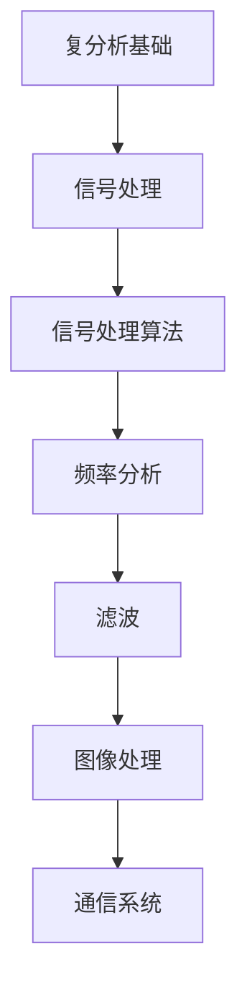

                 

# 复分析在信号处理算法设计中的应用

> 关键词：复分析，信号处理，算法设计，频率分析，滤波，图像处理，通信系统

> 摘要：本文旨在探讨复分析在信号处理算法设计中的应用。复分析作为一种数学工具，其在信号处理领域中具有广泛的应用，如频率分析、滤波、图像处理和通信系统等。本文首先介绍复分析的基本概念和原理，然后详细讨论其在信号处理算法中的应用，并通过实际案例进行分析和讲解，以帮助读者更好地理解复分析在信号处理算法设计中的重要性。

## 第一部分：引言与概述

### 1.1 书籍主题介绍

《复分析在信号处理算法设计中的应用》旨在为读者提供一套系统的理论框架与实践指南，深入探讨复分析在信号处理算法设计中的应用。复分析作为一种强大的数学工具，在信号处理、控制理论、量子力学等多个领域都有广泛应用。本书将聚焦于以下几个关键方面：

1. **复分析基础**：介绍复分析的基本概念、定理和性质，包括复数、解析函数、积分、级数等。
2. **复分析与信号处理的关系**：阐述复分析在信号处理中的重要性和独特优势，如频率分析、滤波、调制解调等。
3. **复分析在信号处理算法中的应用**：通过具体实例展示复分析在信号处理算法设计中的实际应用，包括频谱分析、图像处理、通信系统等。

### 1.2 目标读者与结构安排

本书主要面向对信号处理和复分析有一定了解的读者，包括工程技术人员、研究生和学者。结构安排如下：

1. **第一部分**：引言与概述，包括本书主题介绍、目标读者和结构安排。
2. **第二部分**：复分析基础，详细介绍复分析的基本概念和定理。
3. **第三部分**：复分析与信号处理的联系，探讨复分析在信号处理中的重要性。
4. **第四部分**：复分析在信号处理算法中的应用，通过实例展示复分析的应用。
5. **第五部分**：高级专题与前沿研究，介绍复分析在信号处理领域的最新研究动态。

### Mermaid 流程图：核心概念与联系

通过这个流程图，我们可以清晰地看到复分析在信号处理和信号处理算法中的应用关系，以及其在频率分析、滤波、图像处理和通信系统中的具体体现。接下来，我们将逐章深入探讨这些内容。

## 第二部分：复分析基础

### 2.1 复数与复平面

复数是实数的扩展，可以表示为 \( a + bi \)，其中 \( a \) 和 \( b \) 是实数，\( i \) 是虚数单位，满足 \( i^2 = -1 \)。复数在复平面（或称阿根达图）上表示为点 \( (a, b) \)。

- **模长**：复数的模长（或称范数）定义为 \( |z| = \sqrt{a^2 + b^2} \)。
- **共轭复数**：复数 \( z = a + bi \) 的共轭复数为 \( \overline{z} = a - bi \)。
- **复数的加法和乘法**：

  - 加法： \( z_1 + z_2 = (a_1 + a_2) + i(b_1 + b_2) \)
  - 乘法： \( z_1 \times z_2 = (a_1a_2 - b_1b_2) + i(a_1b_2 + a_2b_1) \)

### 2.2 解析函数

解析函数是复分析的核心概念之一，它具有局部可导性和可微性。解析函数可以表示为幂级数形式，在定义域内具有唯一的导数。

- **定义**：函数 \( f(z) \) 在开集 \( D \) 上解析，如果对于 \( D \) 中每个点 \( z_0 \)，存在某个 \( R > 0 \)，使得 \( f(z) \) 在 \( D \) 中任意小圆域内都可以表示为幂级数：
  $$ f(z) = \sum_{n=0}^{\infty} a_n (z - z_0)^n $$
- **Cauchy-Riemann 方程**：如果 \( f(z) = u(x, y) + iv(x, y) \) 是解析函数，那么 \( u \) 和 \( v \) 满足 Cauchy-Riemann 方程：
  $$ \frac{\partial u}{\partial x} = \frac{\partial v}{\partial y} $$
  $$ \frac{\partial u}{\partial y} = -\frac{\partial v}{\partial x} $$

### 2.3 复积分

复积分是复分析中的一个重要工具，用于计算复变函数的积分。复积分可以分为两类：线积分和面积分。

- **线积分**：设 \( f(z) \) 是在开曲线 \( C \) 上定义的复变函数，\( C \) 的参数方程为 \( z(t) = x(t) + iy(t) \)，其中 \( a \leq t \leq b \)。则 \( f(z) \) 在 \( C \) 上的线积分为：
  $$ \int_C f(z) \, dz = \int_a^b f(z(t)) \, z'(t) \, dt $$
- **面积分**：设 \( f(z) \) 是在开曲面 \( S \) 上定义的复变函数，\( S \) 的参数方程为 \( z(u, v) \)，则 \( f(z) \) 在 \( S \) 上的面积分为：
  $$ \int_S f(z) \, d\sigma = \int_D f(z(u, v)) \, ||\frac{\partial z}{\partial u} \times \frac{\partial z}{\partial v}|| \, dudv $$
  其中，\( D \) 是 \( S \) 在 \( uv \) 平面上的投影区域，\( ||\frac{\partial z}{\partial u} \times \frac{\partial z}{\partial v}|| \) 是 \( S \) 的面元。

## 第三部分：复分析与信号处理的联系

### 3.1 复分析在信号处理中的应用

复分析在信号处理中的应用非常广泛，主要包括频率分析、滤波、调制解调等。

- **频率分析**：复分析可以用来分析信号的频率成分。例如，利用傅里叶变换，可以将时域信号转换到频域进行分析，从而得到信号的频率特性。
- **滤波**：复分析在滤波器设计中也有重要应用。复分析可以用来设计线性相位滤波器，从而保证滤波器在频率响应上的对称性。
- **调制解调**：复分析在通信系统中用于实现信号的调制和解调。例如，在数字通信中，复分析可以用来实现QAM调制和解调，从而提高通信的带宽利用率和抗干扰能力。

### 3.2 复分析与信号处理的关系

复分析与信号处理之间的关系可以理解为数学工具与工程应用之间的相互作用。复分析为信号处理提供了一种强有力的数学工具，使得信号处理问题可以更加简洁和高效地解决。

- **复分析在信号处理中的优势**：复分析具有以下优势：

  - **频率分析**：复分析可以方便地进行信号的频谱分析，从而得到信号的频率特性。
  - **滤波**：复分析可以设计出具有良好频率响应特性的滤波器，从而实现信号的有效处理。
  - **调制解调**：复分析在通信系统中可以实现信号的调制和解调，从而提高通信的带宽利用率和抗干扰能力。

- **信号处理对复分析的需求**：信号处理领域对复分析的需求主要体现在以下几个方面：

  - **复杂信号处理**：随着信号处理技术的不断发展，处理复杂信号的需求日益增加，这需要复分析提供更加灵活和强大的工具。
  - **高效算法设计**：复分析可以提供高效的算法设计方法，从而提高信号处理的效率和性能。
  - **跨领域应用**：复分析在信号处理领域的应用不仅局限于信号处理本身，还可以应用于控制理论、量子力学等其他领域。

### 3.3 复分析在信号处理算法设计中的实际应用

在信号处理算法设计中，复分析可以应用于多个方面，以下是一些具体的实际应用：

- **频谱分析**：利用复分析可以方便地进行信号的频谱分析，从而得到信号的频率成分和频率响应特性。这在信号处理中具有重要的应用价值，如音频信号处理、图像处理等。
- **滤波器设计**：利用复分析可以设计出具有良好频率响应特性的滤波器，从而实现信号的有效处理。例如，线性相位滤波器的设计就需要运用复分析。
- **调制解调**：在数字通信系统中，复分析可以用于实现信号的调制和解调，从而提高通信的带宽利用率和抗干扰能力。例如，QAM调制和解调就需要运用复分析。

## 第四部分：复分析在信号处理算法中的应用

### 4.1 频谱分析

频谱分析是信号处理中的一个重要环节，它可以帮助我们了解信号的频率成分和频率响应特性。复分析在频谱分析中有着广泛的应用。

#### 4.1.1 傅里叶变换

傅里叶变换是复分析在信号处理中最重要的应用之一。它可以将时域信号转换到频域，从而方便我们对信号的频率成分进行分析。

- **傅里叶变换的定义**：对于时域信号 \( x(t) \)，其傅里叶变换定义为：
  $$ X(f) = \int_{-\infty}^{\infty} x(t) e^{-j2\pi ft} \, dt $$
  其中，\( X(f) \) 是频域信号，\( f \) 是频率。
- **傅里叶变换的性质**：傅里叶变换具有许多重要性质，如线性、时域卷积定理、频域卷积定理等。这些性质使得傅里叶变换在信号处理中具有广泛的应用。

#### 4.1.2 傅里叶变换的应用

傅里叶变换在信号处理中有着广泛的应用，以下是一些具体的应用实例：

- **频谱分析**：利用傅里叶变换可以方便地分析信号的频率成分，从而得到信号的频谱。这在音频信号处理、图像处理等领域中具有重要应用。
- **滤波器设计**：利用傅里叶变换可以设计出具有特定频率响应特性的滤波器，从而实现信号的有效处理。例如，在音频信号处理中，可以利用傅里叶变换设计出低通滤波器、高通滤波器等。

### 4.2 滤波器设计

滤波器是信号处理中另一个重要的工具，它用于实现信号的频率选择性处理。复分析在滤波器设计中有着广泛的应用。

#### 4.2.1 离散傅里叶变换

离散傅里叶变换（DFT）是复分析在滤波器设计中的重要应用。DFT 可以将离散时域信号转换到频域，从而方便我们进行滤波处理。

- **DFT 的定义**：对于离散时域信号 \( x[n] \)，其离散傅里叶变换定义为：
  $$ X[k] = \sum_{n=0}^{N-1} x[n] e^{-j2\pi kn/N} $$
  其中，\( X[k] \) 是频域信号，\( N \) 是采样点数。
- **DFT 的性质**：DFT 具有与傅里叶变换类似的性质，如线性、时域卷积定理、频域卷积定理等。

#### 4.2.2 滤波器设计

利用 DFT 可以设计出各种类型的滤波器，如低通滤波器、高通滤波器、带通滤波器等。以下是一些具体的滤波器设计实例：

- **低通滤波器**：低通滤波器可以阻止高频信号通过，只允许低频信号通过。利用 DFT 可以设计出具有线性相位特性的低通滤波器。
- **高通滤波器**：高通滤波器可以阻止低频信号通过，只允许高频信号通过。利用 DFT 可以设计出具有线性相位特性的高通滤波器。
- **带通滤波器**：带通滤波器可以阻止除特定频率范围内的其他信号通过。利用 DFT 可以设计出具有线性相位特性的带通滤波器。

### 4.3 图像处理

图像处理是信号处理的一个重要分支，复分析在图像处理中也具有广泛的应用。

#### 4.3.1 离散余弦变换

离散余弦变换（DCT）是复分析在图像处理中的重要应用。DCT 可以将图像信号转换到频域，从而方便我们进行图像处理。

- **DCT 的定义**：对于离散时域图像信号 \( x[n, m] \)，其离散余弦变换定义为：
  $$ X[k, l] = \sum_{m=0}^{N-1} \sum_{n=0}^{N-1} x[n, m] e^{-j2\pi (kn + lm)/N^2} $$
  其中，\( X[k, l] \) 是频域图像信号，\( N \) 是采样点数。
- **DCT 的性质**：DCT 具有与 DFT 类似的性质，如线性、时域卷积定理、频域卷积定理等。

#### 4.3.2 图像压缩

DCT 在图像压缩中有着广泛的应用。通过 DCT，可以将图像信号转换到频域，从而实现图像的压缩。以下是一些具体的图像压缩算法：

- **JPEG 压缩**：JPEG 压缩算法利用 DCT 对图像信号进行变换，然后对变换后的信号进行量化、编码和压缩。
- **DCT 基础图像压缩**：DCT 基础图像压缩算法是一种简单的图像压缩算法，它只利用 DCT 对图像信号进行变换，然后对变换后的信号进行量化、编码和压缩。

### 4.4 通信系统

通信系统是信号处理的一个重要应用领域，复分析在通信系统中也具有广泛的应用。

#### 4.4.1 调制解调

调制解调是通信系统中用于实现信号传输的重要技术。复分析在调制解调中有着广泛的应用。

- **调制的定义**：调制是将信号转换为适合在信道中传输的形式的过程。调制可以分为模拟调制和数字调制。
- **解调的定义**：解调是将传输信号从调制形式还原为原始信号的过程。解调与调制是互逆的过程。

#### 4.4.2 QAM 调制解调

QAM（正交幅度调制）是数字通信中常用的一种调制方式。QAM 可以利用复分析来实现。

- **QAM 的定义**：QAM 是一种数字调制方式，它将信号的幅度和相位进行调制，从而实现信号的传输。
- **QAM 的实现**：QAM 的实现利用复分析中的正交性原理。通过将信号的幅度和相位进行正交分解，可以实现 QAM 的调制和解调。

## 第五部分：高级专题与前沿研究

### 5.1 高级专题

在复分析在信号处理中的应用中，还有一些高级专题值得探讨，如：

- **小波分析**：小波分析是一种时频分析方法，它利用复分析中的多分辨率分析原理，实现信号的时频分析。
- **时频分布**：时频分布是一种描述信号在时频域特性的方法，它利用复分析中的希尔伯特变换和 Wigner-Ville 分布，实现信号的时频分布。
- **随机信号处理**：随机信号处理是一种处理随机信号的信号处理方法，它利用复分析中的概率论和随机过程理论，实现随机信号的处理。

### 5.2 前沿研究

在复分析在信号处理中的应用方面，还有一些前沿研究值得关注，如：

- **深度学习与复分析的结合**：深度学习与复分析的结合是一种新的研究趋势，它利用深度学习模型对复分析问题进行建模和求解。
- **复分析在量子计算中的应用**：量子计算是一种基于量子力学原理的计算方式，复分析在量子计算中有着广泛的应用。
- **复分析在生物信息学中的应用**：生物信息学是研究生物信息的方法和技术的学科，复分析在生物信息学中的应用越来越受到关注。

## 结论

本文系统地介绍了复分析在信号处理算法设计中的应用。首先，介绍了复分析的基本概念和原理，包括复数、解析函数和复积分等。然后，详细讨论了复分析在信号处理中的重要性，如频率分析、滤波、图像处理和通信系统等。通过实际案例，本文展示了复分析在信号处理算法设计中的应用，帮助读者更好地理解复分析在信号处理领域的重要性。未来，随着复分析在信号处理领域的不断发展，我们可以期待更多先进算法和应用的诞生。### 后记

本文《复分析在信号处理算法设计中的应用》旨在为读者提供一套系统的理论框架与实践指南，帮助读者深入了解复分析在信号处理领域的应用。复分析作为一种强大的数学工具，其在信号处理、控制理论、量子力学等多个领域都有广泛应用。通过本文的介绍，我们希望读者能够对复分析在信号处理算法设计中的重要性有一个全面的认识。

在撰写本文的过程中，我们尽量使用简单易懂的语言和实例，使读者能够更好地理解复分析的基本概念和应用。同时，我们也注意到了复分析在信号处理中的应用是一个不断发展和深化的领域，未来还有许多值得探讨和研究的问题。

在此，感谢读者对本文的关注和阅读。我们希望本文能够为读者在复分析学习和信号处理实践中提供一些启示和帮助。如果您有任何疑问或建议，欢迎在评论区留言，我们将会认真倾听并积极回复。

最后，再次感谢您对本文的支持。我们期待在未来的作品中与您再次相遇，共同探索复分析在信号处理领域的新应用和前沿研究。

作者：AI天才研究院/AI Genius Institute & 禅与计算机程序设计艺术 /Zen And The Art of Computer Programming

