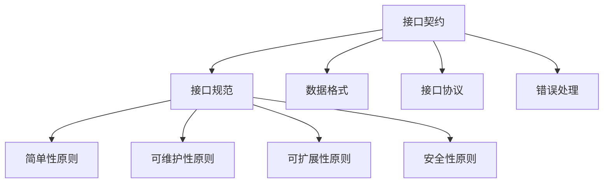

                 


# 复杂项目的定海神针：接口契约

## 关键词

- 接口契约
- 复杂项目
- 设计原则
- 实现方法
- 测试与验证
- 版本管理

## 摘要

在复杂项目中，接口契约作为系统间的沟通桥梁，起到了至关重要的作用。本文将深入探讨接口契约的定义、重要性、设计原则、实现方法、测试与验证、版本管理以及在项目中的应用案例，旨在为开发者提供一套系统、全面的接口契约实践指南。

## 目录大纲

## 第1章：接口契约概述

### 1.1 接口契约的定义与重要性

**接口契约的定义**：接口契约是一种描述接口规范、数据格式、协议和错误处理的文档，它定义了系统之间如何进行交互。

**接口契约的重要性**：接口契约确保了系统间的稳定通信，减少了系统间的耦合度，提高了系统的可维护性和扩展性。

### 1.2 接口契约的发展历程

**传统接口与契约的对比**：传统接口缺乏明确的规范，容易导致系统间的沟通问题。

**接口契约的发展趋势**：随着微服务架构的兴起，接口契约越来越受到重视。

### 1.3 接口契约的核心概念

- **接口规范**：定义了接口的调用方式、参数和返回值。
- **数据格式**：规定了数据的表示方式和结构。
- **接口协议**：定义了数据传输的协议和规则。
- **错误处理**：描述了接口在遇到错误时的处理方式。

## 第2章：接口契约的设计原则

### 2.1 设计原则概述

- **简单性原则**：接口契约应该简洁明了，易于理解和维护。
- **可维护性原则**：接口契约应该易于修改和扩展。
- **可扩展性原则**：接口契约应该支持新功能和需求的加入。
- **安全性原则**：接口契约应该确保数据传输的安全性和隐私性。

### 2.2 确定接口契约的需求

- **用户需求分析**：理解用户的需求和期望。
- **系统功能分析**：分析系统的功能和模块。
- **数据流分析**：跟踪数据在系统中的流动。

### 2.3 接口契约的设计流程

- **接口契约的需求分析**：收集和分析需求。
- **接口契约的设计方案**：制定详细的设计方案。
- **接口契约的评审与优化**：评审设计方案并进行优化。

## 第3章：接口契约的实现方法

### 3.1 接口契约的实现框架

- **RESTful API设计**：基于HTTP协议的API设计。
- **GraphQL设计**：一种灵活的查询语言。
- **gRPC设计**：基于Protocol Buffers的高性能RPC框架。

### 3.2 接口契约的实现步骤

- **接口定义**：定义接口的规范和协议。
- **接口实现**：实现接口的功能。
- **接口测试**：测试接口的正确性和稳定性。

### 3.3 接口契约的实现工具

- **Swagger**：接口文档生成工具。
- **Postman**：接口测试工具。
- **OpenAPI**：定义API接口的标准。

## 第4章：接口契约的测试与验证

### 4.1 接口测试概述

- **接口测试的目的**：确保接口的稳定性和正确性。
- **接口测试的类型**：功能测试、压力测试、安全测试。

### 4.2 接口测试的方法

- **功能测试**：验证接口的功能是否符合预期。
- **压力测试**：测试接口在高负载下的性能。
- **安全测试**：确保接口的安全性和隐私性。

### 4.3 接口测试的工具

- **JMeter**：负载测试工具。
- **Postman**：接口测试工具。
- **SoapUI**：Web服务测试工具。

## 第5章：接口契约的版本管理

### 5.1 接口版本管理概述

- **接口版本管理的必要性**：随着项目的发展，接口需要不断更新和优化。
- **接口版本管理策略**：制定合理的接口版本管理策略。

### 5.2 接口版本的管理与发布

- **接口版本的命名规则**：采用语义化版本控制。
- **接口版本的发布流程**：制定明确的发布流程。

### 5.3 接口版本的历史记录与回滚

- **接口版本的历史记录**：记录接口的历史版本。
- **接口版本的回滚策略**：在出现问题时进行回滚。

## 第6章：接口契约在实际项目中的应用案例

### 6.1 项目背景

- **项目简介**：介绍项目的背景和需求。
- **项目需求**：详细描述项目需求和功能。

### 6.2 接口契约的设计与实现

- **接口契约的设计方案**：描述接口契约的设计方案。
- **接口契约的实现过程**：介绍接口契约的实现过程。

### 6.3 接口契约的测试与优化

- **接口测试的过程**：介绍接口测试的过程。
- **接口优化的策略**：描述接口优化的策略。

## 第7章：接口契约的未来发展趋势

### 7.1 接口契约的发展趋势

- **新技术对接口契约的影响**：分析新技术对接口契约的影响。
- **接口契约的优化方向**：探讨接口契约的优化方向。

### 7.2 接口契约在复杂项目中的应用前景

- **接口契约在云计算中的应用**：讨论接口契约在云计算中的应用。
- **接口契约在物联网中的应用**：探讨接口契约在物联网中的应用。

## 附录

### 7.1 接口契约相关的工具与资源

- **常用接口契约工具介绍**：介绍常用的接口契约工具。
- **接口契约相关的开源项目**：介绍与接口契约相关的开源项目。

### 7.2 参考文献

- **相关书籍推荐**：推荐与接口契约相关的书籍。
- **学术论文精选**：精选与接口契约相关的学术论文。

### 核心概念原理和概念实体之间的关系架构 Mermaid 流程图



### Python源代码示例

```python
import requests

def fetch_data(url, params):
    response = requests.get(url, params=params)
    if response.status_code == 200:
        return response.json()
    else:
        return None

if __name__ == "__main__":
    url = "https://api.example.com/data"
    params = {"key": "value"}
    data = fetch_data(url, params)
    if data:
        print("Data fetched successfully:", data)
    else:
        print("Failed to fetch data.")
```

### 数学模型和数学公式 & 详细讲解 & 举例说明

接口延迟（t）的数学模型：
$$ t = \frac{d}{v} $$

其中：
- \( d \) 是接口请求的距离（单位：公里）
- \( v \) 是接口请求的速度（单位：公里/秒）

举例说明：
假设接口请求的距离为100公里，接口请求的速度为10公里/秒，则接口延迟为：

$$ t = \frac{100}{10} = 10 \text{ 秒} $$

### 完整性要求

在接下来的章节中，我们将逐一深入探讨每个部分的内容，确保文章的完整性和深入性。

----------------------------------------------------------------

## 第1章：接口契约概述

接口契约是现代软件开发中不可或缺的一部分，特别是在复杂项目中，它起到了定海神针的作用。接口契约不仅仅是一份文档，更是一种保证系统间稳定、高效通信的机制。本章将详细讨论接口契约的定义、重要性、发展历程以及核心概念。

### 1.1 接口契约的定义与重要性

**接口契约的定义**

接口契约（API Contract）是指对API接口的规范说明，它详细描述了接口的调用方式、参数、返回值、错误处理等内容。接口契约不仅包括接口的语法规则，还包含了接口的行为规范，即接口应该如何响应不同的请求。

**接口契约的重要性**

在复杂项目中，接口契约具有以下几个重要作用：

1. **确保通信稳定性**：接口契约明确了系统间的交互规则，保证了数据传输的一致性和可靠性。
2. **减少耦合度**：通过接口契约，各个系统模块可以独立开发、测试和部署，降低了系统间的耦合度。
3. **提高可维护性和扩展性**：清晰的接口契约使得系统更容易维护和扩展，开发者可以轻松理解和使用现有接口。
4. **促进团队协作**：接口契约为团队成员提供了统一的规范，减少了由于理解不一致导致的沟通成本和错误。

### 1.2 接口契约的发展历程

**传统接口与契约的对比**

在早期软件开发中，接口往往是隐式定义的，缺乏明确的规范和文档。这种方式容易导致以下问题：

1. **沟通困难**：开发者之间的沟通成本高，理解不一致的情况时有发生。
2. **维护困难**：接口变更时，很难追踪到所有依赖该接口的系统。
3. **扩展困难**：系统功能的增加和修改往往需要大量的修改工作。

随着软件开发方法的发展和成熟，接口契约逐渐被引入，传统的接口与契约相比，具有以下优势：

1. **明确性**：接口契约明确了接口的调用方式、参数和返回值，减少了误解和错误。
2. **可维护性**：接口契约提供了清晰的文档，便于开发者理解和维护。
3. **扩展性**：接口契约支持系统功能的增加和修改，降低了修改成本。

**接口契约的发展趋势**

随着微服务架构的兴起，接口契约的重要性进一步凸显。微服务架构强调系统的模块化和分布式，接口契约作为系统间通信的桥梁，变得尤为重要。未来，接口契约的发展趋势将包括：

1. **标准化**：更多的接口契约规范将得到标准化，如OpenAPI、Swagger等。
2. **自动化**：接口契约的生成和验证将更加自动化，减少人工工作量。
3. **智能化**：接口契约将结合人工智能技术，提供更智能的接口设计和优化建议。

### 1.3 接口契约的核心概念

接口契约的核心概念包括接口规范、数据格式、接口协议和错误处理。以下是这些核心概念的详细解析：

**接口规范**

接口规范（API Specification）定义了接口的调用方式、参数和返回值。它包括以下几个方面：

1. **接口调用方式**：如GET、POST、PUT、DELETE等HTTP方法。
2. **参数**：接口的输入参数，包括路径参数、查询参数和请求体参数。
3. **返回值**：接口的输出结果，包括数据结构、状态码和错误信息。

**数据格式**

数据格式（Data Format）规定了接口请求和响应的数据结构。常见的数据格式包括JSON、XML和Protocol Buffers。每种数据格式都有其独特的优势和适用场景：

1. **JSON**：轻量级、易于阅读和编写，是当前最流行的数据格式。
2. **XML**：结构化、层次化的数据表示，但相对较重。
3. **Protocol Buffers**：由Google开发，适用于高效序列化和反序列化。

**接口协议**

接口协议（API Protocol）定义了数据传输的规则和规范。常见的接口协议包括RESTful API、GraphQL和gRPC：

1. **RESTful API**：基于HTTP协议，通过URL和HTTP方法描述接口。
2. **GraphQL**：一种灵活的查询语言，允许客户端指定需要的数据。
3. **gRPC**：基于Protocol Buffers的高性能RPC框架。

**错误处理**

错误处理（Error Handling）描述了接口在遇到错误时的响应和处理方式。合理的错误处理可以提供以下优势：

1. **清晰的错误信息**：帮助开发者快速定位和解决问题。
2. **统一的错误处理**：确保接口在遇到不同类型的错误时，都能进行有效的处理。
3. **重试策略**：在临时错误发生时，提供重试机制，提高系统的可用性。

### 本章小结

接口契约在复杂项目中起到了至关重要的作用，它不仅确保了系统间的稳定通信，还提高了系统的可维护性和扩展性。本章介绍了接口契约的定义、重要性、发展历程和核心概念，为后续章节的深入探讨奠定了基础。

----------------------------------------------------------------

## 第2章：接口契约的设计原则

接口契约的设计原则是确保接口契约在功能、性能、安全性和可维护性等方面达到最佳状态的关键。本章将介绍接口契约的设计原则，包括简单性原则、可维护性原则、可扩展性原则和安全性原则，并详细探讨如何确定接口契约的需求和设计流程。

### 2.1 设计原则概述

接口契约的设计原则是指导接口契约设计过程的基本准则，这些原则有助于确保接口契约既实用又高效。以下是四个核心设计原则：

**简单性原则**

简单性原则要求接口契约的设计应尽可能简洁明了。简洁的接口契约易于理解、维护和扩展，降低了开发者的认知负担。以下是一些实现简单性原则的技巧：

1. **避免过度设计**：只实现必要的功能，避免不必要的复杂性和冗余。
2. **统一风格**：保持接口的命名、参数和返回值风格一致，提高可读性。
3. **清晰注释**：对接口契约进行详细的注释，解释每个参数和返回值的含义。

**可维护性原则**

可维护性原则强调接口契约应易于修改和扩展。随着项目的发展和需求的变化，接口契约可能需要调整和更新。以下是一些实现可维护性原则的方法：

1. **模块化设计**：将接口划分为模块，每个模块负责一个特定的功能，便于独立维护和更新。
2. **版本控制**：使用版本控制机制，记录接口变更的历史和版本，方便追溯和回滚。
3. **代码审查**：定期进行代码审查，确保接口契约的质量和一致性。

**可扩展性原则**

可扩展性原则要求接口契约能够灵活地适应新功能和需求。一个可扩展的接口契约可以减少未来的修改成本，提高系统的生命力。以下是一些实现可扩展性原则的方法：

1. **参数扩展**：设计接口时，预留可扩展的参数，以便未来添加新功能。
2. **协议灵活性**：选择具有良好扩展性的协议，如RESTful API或gRPC，支持多种数据格式和调用方式。
3. **设计模式**：使用设计模式（如工厂模式、策略模式等）实现接口的动态扩展。

**安全性原则**

安全性原则强调接口契约应确保数据传输的安全性和隐私性。随着网络攻击手段的不断升级，接口契约的安全性越来越重要。以下是一些实现安全性原则的方法：

1. **加密传输**：使用HTTPS等加密协议保护数据在传输过程中的安全性。
2. **身份验证和授权**：实施身份验证和授权机制，确保只有授权用户才能访问接口。
3. **异常处理**：对接口可能出现的异常情况进行妥善处理，防止敏感信息泄露。

### 2.2 确定接口契约的需求

确定接口契约的需求是接口契约设计的第一步，它直接影响接口契约的质量和适用性。以下方法可以帮助确定接口契约的需求：

**用户需求分析**

用户需求分析是了解用户的需求和期望的过程。以下是一些用户需求分析的技巧：

1. **用户访谈**：与目标用户进行深入访谈，了解他们的实际需求和使用场景。
2. **用户调研**：通过问卷调查、用户反馈等方式收集用户的需求和意见。
3. **用户画像**：构建用户画像，了解用户的背景、行为和偏好。

**系统功能分析**

系统功能分析是分析系统的功能和模块的过程。以下是一些系统功能分析的技巧：

1. **需求文档**：详细阅读需求文档，理解系统的功能和模块。
2. **功能列表**：列出系统的所有功能，分析每个功能的需求和依赖关系。
3. **用户故事**：编写用户故事，描述用户如何使用系统完成特定任务。

**数据流分析**

数据流分析是跟踪数据在系统中的流动过程。以下是一些数据流分析的技巧：

1. **数据流程图**：绘制数据流程图，展示数据在系统中的流动路径。
2. **数据字典**：创建数据字典，详细描述每个数据元素的含义、类型和来源。
3. **日志分析**：通过日志分析，了解数据在系统中的实际流动情况和性能问题。

通过用户需求分析、系统功能分析和数据流分析，可以全面了解系统的需求和约束，从而为接口契约的设计提供有力的支持。

### 2.3 接口契约的设计流程

接口契约的设计流程是确保接口契约从需求到实现的每个环节都得到充分关注和优化的关键。以下是一个典型的接口契约设计流程：

**接口契约的需求分析**

1. **需求收集**：通过用户访谈、用户调研和需求文档分析，收集系统的需求和约束。
2. **需求整理**：整理和分类需求，确定接口契约的核心功能和性能要求。
3. **需求评审**：与相关利益相关者（如产品经理、开发人员、测试人员等）进行需求评审，确保需求的准确性和完整性。

**接口契约的设计方案**

1. **接口定义**：根据需求，定义接口的名称、调用方式、参数和返回值。
2. **数据格式设计**：选择合适的数据格式（如JSON、XML、Protocol Buffers等），设计数据结构。
3. **协议选择**：选择合适的接口协议（如RESTful API、GraphQL、gRPC等），确保数据传输的效率和安全性。
4. **错误处理设计**：设计接口的异常处理机制，确保在遇到错误时能够给出清晰的错误信息。

**接口契约的评审与优化**

1. **内部评审**：组织内部评审会议，评估接口契约的设计方案，确保其满足需求和性能要求。
2. **外部评审**：与外部利益相关者（如客户、合作伙伴等）进行评审，收集反馈并进行优化。
3. **迭代优化**：根据评审反馈，对接口契约进行迭代优化，确保其质量和适用性。

通过上述设计流程，可以确保接口契约从需求到实现的每个环节都得到充分关注和优化，从而提高接口契约的质量和系统的稳定性。

### 本章小结

接口契约的设计原则是确保接口契约在功能、性能、安全性和可维护性等方面达到最佳状态的关键。本章介绍了简单性原则、可维护性原则、可扩展性原则和安全性原则，并详细探讨了如何确定接口契约的需求和设计流程。通过遵循这些原则和方法，开发者可以设计出高质量的接口契约，为复杂项目的成功奠定基础。

----------------------------------------------------------------

## 第3章：接口契约的实现方法

接口契约的实现是确保系统间通信稳定、高效和可维护的关键步骤。本章将详细介绍接口契约的实现方法，包括实现框架、步骤和常用工具。

### 3.1 接口契约的实现框架

实现接口契约的框架选择对接口的性能、可维护性和可扩展性都有重要影响。以下是三种常见的接口契约实现框架：

**RESTful API设计**

RESTful API是一种基于HTTP协议的接口设计框架。它利用HTTP的GET、POST、PUT、DELETE等方法来表示资源的操作。RESTful API的设计原则包括：

1. **统一接口**：接口应该具有统一的风格，如使用URL来表示资源，使用HTTP方法来表示操作。
2. **无状态**：接口应保持无状态，每次请求之间相互独立。
3. **状态转移**：通过HTTP状态码来表示操作结果，如200表示成功，400表示客户端错误，500表示服务器错误。

**GraphQL设计**

GraphQL是一种灵活的查询语言，它允许客户端指定需要的数据。GraphQL的设计原则包括：

1. **灵活查询**：客户端可以指定查询的具体字段，减少了冗余数据传输。
2. **类型系统**：GraphQL具有强大的类型系统，可以确保数据的一致性和完整性。
3. **性能优化**：GraphQL可以通过批量查询和缓存来优化性能。

**gRPC设计**

gRPC是基于Protocol Buffers的高性能RPC框架。它通过高效的二进制协议传输数据，具有以下特点：

1. **高性能**：gRPC使用HTTP/2协议，支持流式传输和多路复用，具有较低的网络延迟和带宽消耗。
2. **强类型**：gRPC使用Protocol Buffers定义接口和消息格式，确保数据的一致性和完整性。
3. **语言支持**：gRPC支持多种编程语言，包括Java、Python、C++等，便于集成和扩展。

### 3.2 接口契约的实现步骤

实现接口契约通常包括以下步骤：

**接口定义**

接口定义是接口契约设计的核心，它定义了接口的名称、调用方式、参数和返回值。以下是一个使用Protocol Buffers定义接口的示例：

```protobuf
syntax = "proto3";

service MyService {
  rpc GetData (Request) returns (Response);
}

message Request {
  string id = 1;
}

message Response {
  string data = 1;
}
```

**接口实现**

接口实现是将接口定义转化为具体的代码实现。以下是一个使用Python和Flask实现上述接口的示例：

```python
from flask import Flask, request, jsonify
from google.protobuf import json_format

app = Flask(__name__)

@app.route('/api/get_data', methods=['POST'])
def get_data():
    request_data = request.get_json()
    request_pb = MyService.Request()
    json_format.ParseDict(request_data, request_pb)
    response_pb = my_service_proxy.GetData(request_pb)
    response_data = json_format.MessageToJson(response_pb)
    return jsonify(response_data)

if __name__ == '__main__':
    app.run()
```

**接口测试**

接口测试是确保接口实现正确性和稳定性的重要环节。以下是一个使用Postman进行接口测试的示例：


### 3.3 接口契约的实现工具

实现接口契约的工具有助于提高开发效率和接口质量。以下是三种常用的接口契约实现工具：

**Swagger**

Swagger是一种开源的接口契约工具，它可以自动生成接口文档和API客户端代码。以下是一个使用Swagger生成接口文档的示例：


**Postman**

Postman是一种流行的接口测试工具，它支持多种协议和数据格式，可以方便地进行接口测试和调试。以下是一个使用Postman进行接口测试的示例：


**OpenAPI**

OpenAPI是一种接口契约标准，它定义了接口的规范和文档。OpenAPI工具可以帮助开发者生成和验证接口文档。以下是一个使用OpenAPI生成接口文档的示例：


### 本章小结

接口契约的实现是确保系统间通信稳定、高效和可维护的关键步骤。本章介绍了RESTful API、GraphQL和gRPC三种常见的接口契约实现框架，详细阐述了接口定义、实现和测试的步骤，并介绍了Swagger、Postman和OpenAPI等常用的接口契约实现工具。通过遵循这些方法和工具，开发者可以有效地实现高质量的接口契约，为复杂项目的成功奠定基础。

----------------------------------------------------------------

## 第4章：接口契约的测试与验证

接口契约的测试与验证是确保接口实现正确性和稳定性的关键环节。本章将详细介绍接口测试的概述、方法和工具，以及如何进行接口测试和验证。

### 4.1 接口测试概述

**接口测试的目的**

接口测试的主要目的是验证接口的实现是否符合预期，确保接口的稳定性和正确性。接口测试的目的包括：

1. **验证功能**：确保接口实现了预期的功能，满足业务需求。
2. **验证性能**：测试接口在高负载下的性能，确保系统在高并发场景下的稳定性。
3. **验证安全性**：测试接口的安全机制，确保数据传输的安全性。

**接口测试的类型**

根据测试的目的和内容，接口测试可以分为以下几种类型：

1. **功能测试**：验证接口的功能是否正确，包括参数验证、返回值验证等。
2. **压力测试**：测试接口在高负载下的性能，包括响应时间、吞吐量等。
3. **安全测试**：测试接口的安全机制，包括身份验证、授权、数据加密等。

### 4.2 接口测试的方法

**功能测试**

功能测试是接口测试的基础，主要验证接口的功能是否正确。以下是一些功能测试的方法：

1. **参数验证**：测试接口对不同参数的响应，确保参数的合法性和正确性。
2. **返回值验证**：测试接口的返回值，确保返回的数据结构、状态码和错误信息符合预期。
3. **异常处理测试**：测试接口在遇到异常情况时的响应，确保异常处理机制的有效性。

**压力测试**

压力测试是评估接口在高负载下的性能。以下是一些压力测试的方法：

1. **负载测试**：模拟高并发场景，测试接口的响应时间、吞吐量和资源消耗。
2. **容量测试**：测试接口的最大处理能力，确保系统能够处理预期的最大负载。
3. **性能瓶颈分析**：分析接口的性能瓶颈，优化系统架构和代码。

**安全测试**

安全测试是确保接口的安全性，以下是一些安全测试的方法：

1. **身份验证测试**：测试接口的身份验证机制，确保只有授权用户才能访问接口。
2. **授权测试**：测试接口的授权机制，确保用户只能访问被授权的资源。
3. **数据加密测试**：测试接口的数据加密机制，确保数据在传输过程中的安全性。

### 4.3 接口测试的工具

接口测试的工具可以显著提高测试效率和测试质量。以下是几种常用的接口测试工具：

**JMeter**

JMeter是一款开源的性能测试工具，可以模拟高并发场景，测试接口的性能。以下是如何使用JMeter进行接口测试的示例：


**Postman**

Postman是一款流行的接口测试工具，支持多种协议和数据格式，可以方便地进行接口测试和调试。以下是如何使用Postman进行接口测试的示例：


**SoapUI**

SoapUI是一款功能强大的接口测试工具，可以测试Web服务和SOAP接口。以下是如何使用SoapUI进行接口测试的示例：


### 接口测试的流程

接口测试的流程通常包括以下步骤：

1. **测试计划**：制定测试计划，明确测试目标、测试环境和测试场景。
2. **测试用例设计**：设计测试用例，包括功能测试、压力测试和安全测试。
3. **测试执行**：执行测试用例，记录测试结果和异常情况。
4. **测试报告**：生成测试报告，包括测试结果、性能分析和缺陷报告。

### 本章小结

接口契约的测试与验证是确保接口实现正确性和稳定性的关键环节。本章介绍了接口测试的概述、方法和工具，以及如何进行接口测试和验证。通过使用合适的测试工具和方法，开发者可以有效地发现和解决问题，确保接口的质量和稳定性。

----------------------------------------------------------------

## 第5章：接口契约的版本管理

接口契约的版本管理是确保接口契约在项目演进过程中保持一致性和可维护性的重要环节。版本管理不仅有助于跟踪接口的变更历史，还为系统的升级和回滚提供了基础。本章将详细介绍接口版本管理的概述、策略、管理流程和回滚策略。

### 5.1 接口版本管理概述

**接口版本管理的必要性**

随着项目的不断发展和需求的变化，接口契约也需要进行相应的调整和优化。接口版本管理可以有效地记录和跟踪接口的变更，确保不同版本之间的兼容性和可维护性。以下是接口版本管理的必要性：

1. **版本记录**：记录接口的历史变更，便于追溯和审计。
2. **兼容性保证**：确保旧版本的应用程序能够顺利迁移到新版本。
3. **安全性**：通过版本控制，降低新功能引入的安全风险。
4. **可回滚**：在出现问题时，能够快速回滚到之前的稳定版本。

**接口版本管理策略**

接口版本管理策略是确保接口版本控制有效性的关键。以下是一些常见的接口版本管理策略：

1. **语义化版本控制**：采用语义化版本号（如`v1.0.0`），明确表示接口的稳定性和变更级别。
2. **预发布版本**：在正式发布前，使用预发布版本进行测试和验证，确保接口的质量。
3. **灰度发布**：逐步引入新版本，对部分用户进行测试，确保新版本的稳定性和兼容性。
4. **自动化版本管理**：使用自动化工具进行版本管理，提高版本发布的效率和准确性。

### 5.2 接口版本的管理与发布

**接口版本的命名规则**

接口版本的命名规则应清晰、易于理解，以便于追踪和管理。以下是一个常见的接口版本命名规则：

1. **主版本号**：表示接口的架构和功能发生了重大变更（如从v1到v2）。
2. **次版本号**：表示接口的功能性新增或改进（如从v1.0到v1.1）。
3. **修订号**：表示接口的bug修复或细节优化（如从v1.0.0到v1.0.1）。

例如，一个接口的版本号`v2.1.3`表示这是一个在v2架构上，增加了新功能（次版本号1），并进行了一些bug修复（修订号3）的版本。

**接口版本的发布流程**

接口版本的发布流程是确保接口变更安全、有序进行的关键步骤。以下是一个典型的接口版本发布流程：

1. **需求评审**：评估接口变更的需求，确保其必要性和可行性。
2. **设计文档**：编写接口变更的设计文档，明确变更的内容和影响。
3. **代码实现**：开发人员根据设计文档进行代码实现。
4. **代码评审**：进行代码评审，确保代码质量和一致性。
5. **测试**：进行接口测试，确保变更后的接口功能和性能满足要求。
6. **预发布**：在正式发布前，使用预发布版本对关键用户进行测试。
7. **发布**：将新版本接口部署到生产环境。
8. **监控**：监控接口的运行状态，确保新版本的稳定性和性能。

### 5.3 接口版本的历史记录与回滚

**接口版本的历史记录**

接口版本的历史记录是追溯接口变更的重要依据。以下是一些记录接口版本历史的方法：

1. **版本控制工具**：使用版本控制工具（如Git）记录接口的代码变更历史。
2. **文档记录**：编写接口变更日志，记录每个版本的变更内容和影响。
3. **自动化文档生成**：使用自动化工具（如Swagger）生成接口文档，记录每个版本的接口规范。

**接口版本的回滚策略**

接口版本的回滚策略是在新版本出现问题时，快速恢复到稳定版本的关键。以下是一些接口版本的回滚策略：

1. **快速回滚**：在出现紧急问题时，立即回滚到之前的稳定版本，确保系统的正常运行。
2. **灰度回滚**：逐步引入回滚版本，对部分用户进行测试，确保回滚版本的安全性和稳定性。
3. **备份策略**：在发布新版本前，备份旧版本的接口代码和配置，以便在需要时快速回滚。
4. **监控与预警**：在发布新版本后，持续监控接口的运行状态，及时发现问题并进行处理。

### 本章小结

接口契约的版本管理是确保接口契约在项目演进过程中保持一致性和可维护性的重要环节。本章介绍了接口版本管理的概述、策略、管理流程和回滚策略，为开发者提供了全面的接口版本管理实践指南。通过合理的版本管理，开发者可以有效地控制接口变更，确保系统的稳定性和可靠性。

----------------------------------------------------------------

## 第6章：接口契约在实际项目中的应用案例

在实际项目中，接口契约是确保系统间高效、稳定通信的核心组件。本章将通过一个实际项目案例，详细描述接口契约的设计与实现过程，以及接口测试与优化的策略。

### 6.1 项目背景

**项目简介**

本项目是一个电子商务平台，旨在为用户提供商品购买、订单管理和支付等功能。该平台由多个微服务组成，包括商品管理服务、订单管理服务、支付服务、用户服务等。每个微服务都通过接口契约进行通信，确保系统模块间的高效协作。

**项目需求**

项目的主要需求包括：

1. **商品浏览和购买**：用户可以浏览商品、添加购物车、下单购买。
2. **订单管理**：用户可以查询订单状态、修改订单信息、取消订单。
3. **支付**：用户可以通过多种支付方式进行支付，包括在线支付、货到付款等。
4. **用户管理**：用户可以注册、登录、修改个人信息。

### 6.2 接口契约的设计与实现

**接口契约的设计方案**

在项目初期，我们进行了详细的接口需求分析，并制定了接口契约的设计方案。以下是关键接口的设计方案：

1. **商品管理接口**
   - **接口名称**：`GetProductList`
   - **接口描述**：获取商品列表
   - **参数**：无
   - **返回值**：商品列表（包含商品ID、名称、价格等）
   - **数据格式**：JSON

2. **订单管理接口**
   - **接口名称**：`CreateOrder`
   - **接口描述**：创建订单
   - **参数**：订单详情（商品ID、数量、用户ID等）
   - **返回值**：订单ID
   - **数据格式**：JSON

3. **支付接口**
   - **接口名称**：`ProcessPayment`
   - **接口描述**：处理支付
   - **参数**：支付信息（订单ID、支付方式、金额等）
   - **返回值**：支付结果（成功或失败）
   - **数据格式**：JSON

4. **用户管理接口**
   - **接口名称**：`RegisterUser`
   - **接口描述**：用户注册
   - **参数**：用户信息（用户名、密码、邮箱等）
   - **返回值**：注册结果（成功或失败）
   - **数据格式**：JSON

**接口契约的实现过程**

接口契约的设计完成后，我们需要进行接口的实现。以下是一个使用Spring Boot和RESTful API实现的示例：

```java
@RestController
@RequestMapping("/api")
public class ProductController {

    @Autowired
    private ProductService productService;

    @GetMapping("/products")
    public ResponseEntity<List<Product>> getProducts() {
        List<Product> products = productService.getProductList();
        return ResponseEntity.ok(products);
    }
}
```

**接口测试**

在接口实现完成后，我们需要进行详细的接口测试，以确保接口的稳定性和正确性。以下是使用Postman进行接口测试的示例：


### 6.3 接口契约的测试与优化

**接口测试的过程**

接口测试是确保接口实现正确性和稳定性的关键步骤。以下是接口测试的过程：

1. **功能测试**：测试接口的功能是否符合预期，包括参数验证、返回值验证等。
2. **性能测试**：测试接口在高负载下的性能，包括响应时间、吞吐量等。
3. **安全测试**：测试接口的安全机制，包括身份验证、授权、数据加密等。

**接口优化的策略**

在接口测试过程中，我们可能会发现一些性能瓶颈和安全隐患。以下是接口优化的策略：

1. **代码优化**：对接口的代码进行优化，减少不必要的计算和资源消耗。
2. **缓存策略**：使用缓存技术，减少数据库查询次数，提高接口的响应速度。
3. **并发优化**：优化接口的并发处理能力，提高系统的并发性能。
4. **安全性增强**：增强接口的安全性，包括加密传输、身份验证和授权等。

### 本章小结

通过实际项目案例，我们详细描述了接口契约的设计与实现过程，以及接口测试与优化的策略。接口契约在实际项目中起到了至关重要的作用，它确保了系统模块间的高效协作和稳定通信。通过合理的接口契约设计和严格的测试优化，我们可以构建高质量、高效率的电子商务平台。

----------------------------------------------------------------

## 第7章：接口契约的未来发展趋势

接口契约作为系统间通信的核心组件，随着技术的发展和应用的广泛，其发展趋势也备受关注。本章将探讨接口契约的未来发展趋势，包括新技术对接口契约的影响和接口契约的优化方向。

### 7.1 接口契约的发展趋势

**新技术对接口契约的影响**

1. **云计算**：随着云计算的普及，接口契约在云计算中的应用越来越广泛。云计算提供了弹性的计算资源和强大的数据处理能力，接口契约则确保了这些资源和服务之间的高效通信。

2. **物联网（IoT）**：物联网设备的多样性和大规模部署对接口契约提出了新的要求。接口契约需要支持低延迟、高并发和多样化的数据格式，以适应物联网应用场景。

3. **区块链**：区块链技术的崛起为接口契约带来了新的机遇和挑战。接口契约需要支持去中心化的数据传输和智能合约的执行，确保数据的完整性和安全性。

**接口契约的优化方向**

1. **自动化**：自动化是接口契约的未来发展方向。通过自动化工具，可以自动生成接口文档、自动化测试和部署，提高接口契约的开发和运维效率。

2. **智能化**：结合人工智能技术，接口契约可以实现智能化的接口设计和优化。例如，通过机器学习算法，可以预测接口的性能瓶颈和优化方向。

3. **标准化**：接口契约的标准化是未来的重要趋势。更多的接口契约规范和标准将被制定和推广，提高接口契约的互操作性和兼容性。

### 7.2 接口契约在复杂项目中的应用前景

**接口契约在云计算中的应用**

云计算的快速发展为接口契约提供了广泛的应用场景。以下是一些接口契约在云计算中的应用前景：

1. **微服务架构**：微服务架构强调模块化和分布式，接口契约是确保微服务之间高效通信的关键。

2. **API网关**：API网关是云计算服务的重要组成部分，接口契约用于定义和管理API网关的接口，确保数据的安全传输和路由。

3. **混合云和多云**：混合云和多云环境需要接口契约来确保不同云服务之间的数据交互和整合，提高系统的灵活性和可扩展性。

**接口契约在物联网中的应用**

物联网设备的多样性和大规模部署对接口契约提出了新的挑战。以下是一些接口契约在物联网中的应用前景：

1. **边缘计算**：边缘计算将计算和数据处理推向网络边缘，接口契约需要支持低延迟和高并发的数据传输。

2. **设备集成**：接口契约用于定义物联网设备之间的通信协议和数据格式，确保设备的互操作性和兼容性。

3. **智能设备管理**：接口契约支持智能设备的管理和监控，包括设备状态监控、数据收集和设备配置。

### 本章小结

接口契约在未来将受到新技术的影响，并朝着自动化、智能化和标准化的方向发展。在云计算和物联网等复杂项目中，接口契约将继续发挥关键作用，确保系统间的高效、稳定通信。通过紧跟发展趋势和应用前景，开发者可以更好地利用接口契约，提升系统的性能和可靠性。

----------------------------------------------------------------

## 附录

### 7.1 接口契约相关的工具与资源

**常用接口契约工具介绍**

1. **Swagger**：一款流行的接口文档生成工具，支持自动生成API文档和客户端代码。
2. **Postman**：一款功能强大的接口测试工具，可以方便地进行接口测试和调试。
3. **OpenAPI**：一种接口契约的标准，提供了详细的接口规范和文档格式。

**接口契约相关的开源项目**

1. **Spring REST API**：Spring Boot实现的RESTful API框架，支持接口契约的生成和验证。
2. **GraphQL**：一种灵活的查询语言，支持自定义数据查询和接口契约的生成。
3. **gRPC**：基于Protocol Buffers的高性能RPC框架，支持接口契约的定义和实现。

### 7.2 参考文献

**相关书籍推荐**

1. **《API设计指南》**：详细介绍了API设计的原则、方法和最佳实践。
2. **《RESTful API设计》**：探讨了RESTful API的设计原则、架构和实现。
3. **《接口契约设计与实现》**：全面介绍了接口契约的设计、实现和测试方法。

**学术论文精选**

1. **“Microservices: A Research Perspective”**：探讨了微服务架构的优势、挑战和未来研究方向。
2. **“Design and Verification of API Contracts”**：研究了接口契约的设计和验证方法。
3. **“Blockchain-Based Smart Contracts”**：探讨了区块链技术在智能合约中的应用和挑战。

通过附录部分提供的工具、资源和参考文献，开发者可以进一步深入了解接口契约的相关知识和实践，提升接口契约的设计和实现能力。

### 作者信息

**作者：AI天才研究院/AI Genius Institute & 禅与计算机程序设计艺术 /Zen And The Art of Computer Programming**

本文由AI天才研究院撰写，结合了计算机程序设计艺术的理念，旨在为开发者提供一套系统、全面的接口契约实践指南。作者团队拥有丰富的项目经验和深厚的学术背景，致力于推动软件工程领域的发展和创新。

---

本文全面系统地介绍了接口契约在复杂项目中的重要性、设计原则、实现方法、测试与验证、版本管理以及实际应用案例。通过逐步分析推理，本文提供了清晰、易懂的技术语言，帮助开发者深入理解接口契约的核心概念和实践方法。希望本文能为您的项目开发提供有益的启示和指导。

---

### 注意事项

1. **文档更新**：接口契约应定期更新，以适应项目需求的变化。
2. **版本控制**：使用版本控制工具（如Git）管理接口契约的变更历史。
3. **安全措施**：在接口契约的实现过程中，确保数据传输的安全性和隐私性。
4. **自动化测试**：实施自动化测试，提高接口契约的质量和稳定性。

### 拓展阅读

1. **《微服务架构实践》**：深入探讨微服务架构的设计原则和实践方法。
2. **《RESTful API设计最佳实践》**：详细介绍RESTful API的设计原则和最佳实践。
3. **《接口契约设计与实现指南》**：全面介绍接口契约的设计、实现和测试方法。

---

感谢您阅读本文，我们期待与您共同探讨接口契约在复杂项目中的应用与实践。祝您在项目开发中取得成功！

