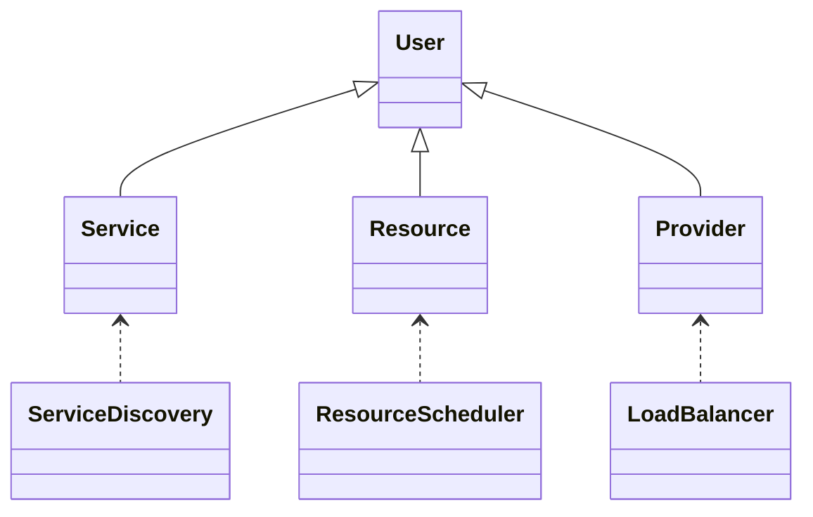
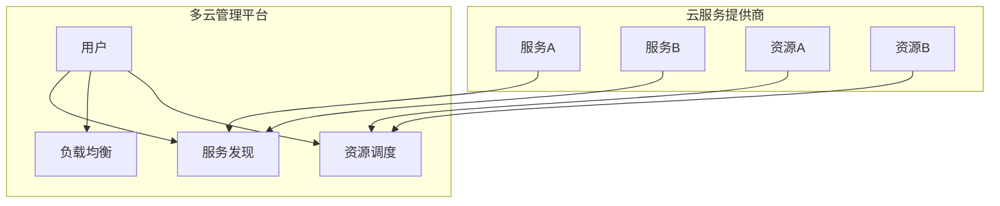
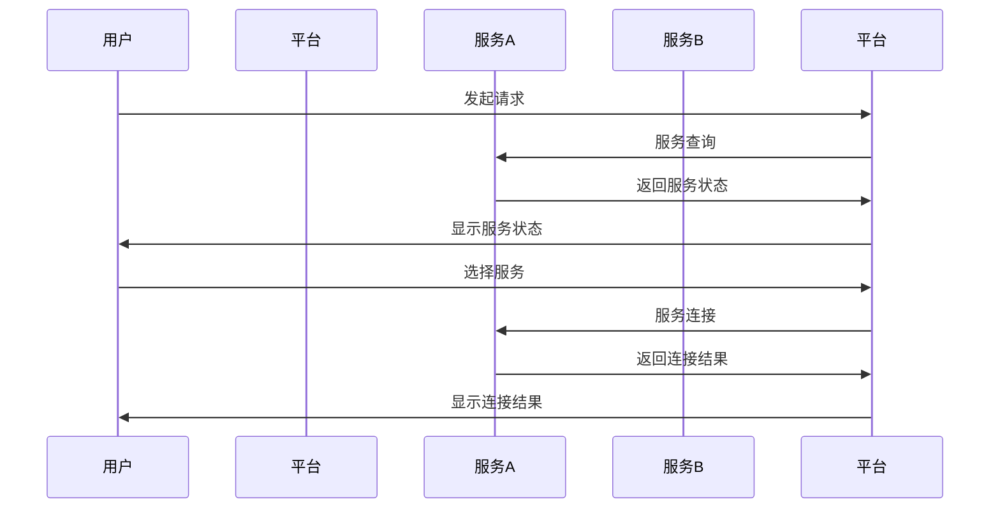

                 

### 文章标题

# 多云管理平台设计与实现

---

关键词：多云管理、云计算、架构设计、服务发现、负载均衡、资源调度

摘要：本文将深入探讨多云管理平台的背景、核心概念、算法原理、系统架构及项目实战。通过详细的逻辑分析和实例讲解，帮助读者理解并掌握多云管理平台的设计与实现。

---

## 目录大纲

1. **多云管理平台概述**
   - 1.1 多云管理的背景与重要性
   - 1.2 多云管理的重要性
   - 1.3 多云管理在当前IT环境中的应用

2. **核心概念与联系**
   - 2.1 云服务模型
   - 2.2 多云架构设计
   - 2.3 多云管理平台的技术组件

3. **算法原理讲解**
   - 3.1 服务发现算法
   - 3.2 负载均衡算法
   - 3.3 资源调度算法

4. **系统分析与架构设计方案**
   - 4.1 问题场景介绍
   - 4.2 项目介绍
   - 4.3 系统功能设计
   - 4.4 系统架构设计
   - 4.5 系统交互

5. **项目实战**
   - 5.1 环境安装
   - 5.2 核心实现源代码
   - 5.3 代码应用解读与分析
   - 5.4 实际案例分析与详细讲解剖析
   - 5.5 项目小结

6. **最佳实践 tips**
   - 6.1 小结
   - 6.2 注意事项
   - 6.3 拓展阅读

---

### 1. 多云管理平台概述

#### 1.1 多云管理的背景与重要性

随着云计算的快速发展，越来越多的企业开始采用多云战略，即在不同的云服务提供商之间分配其IT基础设施和服务。多云管理平台因此成为了一个重要的工具，它能够帮助企业更好地管理和协调多个云环境中的资源和服务。

**核心概念术语说明：**
- **多云管理（Multi-Cloud Management）**：指在不同的云服务提供商之间分配和管理IT资源和服务。
- **云服务模型（Cloud Service Models）**：包括IaaS、PaaS、SaaS等，分别代表基础设施即服务、平台即服务和软件即服务。
- **云服务提供商（Cloud Service Providers）**：如AWS、Azure、Google Cloud等，提供云基础设施和服务的公司。

**问题背景：**
随着企业IT环境的复杂度增加，单一的云服务已无法满足企业的需求。企业需要在一个以上的云服务提供商之间进行资源和服务的管理，以确保系统的可靠性、弹性和成本效益。

**问题描述：**
多云管理平台的设计与实现需要解决以下问题：
- **资源调度**：如何在不同的云服务提供商之间优化资源分配。
- **服务发现**：如何快速发现和连接云环境中的服务。
- **负载均衡**：如何确保服务的高可用性和性能。

**问题解决：**
多云管理平台通过自动化工具和服务接口，提供以下解决方案：
- **自动化资源管理**：自动分配和释放资源。
- **统一视图**：提供统一的界面来监控和管理多个云环境。
- **跨云集成**：支持与不同云服务提供商的集成。

**边界与外延：**
- **边界**：多云管理平台的范围仅限于云服务提供商提供的资源和服务。
- **外延**：多云管理平台可以扩展到支持混合云（Hybrid Cloud）和多云服务（Multi-Service）的管理。

**概念结构与核心要素组成：**
- **概念结构**：多云管理平台是一个集成系统，包括资源管理、服务管理、监控告警等模块。
- **核心要素**：服务发现、负载均衡、资源调度、成本优化等。

---

#### 1.2 多云管理的重要性

多云管理的重要性体现在以下几个方面：

**跨云整合**：多云管理平台可以整合多个云服务提供商的资源和服务，为企业提供一个统一的操作界面，简化了管理流程。

**弹性和可扩展性**：通过多云管理，企业可以根据需求灵活地调整资源，确保系统的高可用性和扩展性。

**成本效益**：多云管理平台可以帮助企业优化资源使用，降低运营成本。

**技术灵活性**：企业可以选择最合适的云服务提供商和技术栈，实现技术的多样性和创新。

**风险管理**：多云管理平台可以提高企业对风险的识别和管理能力，确保系统的安全性和合规性。

#### 1.3 多云管理在当前IT环境中的应用

当前，多云管理在IT环境中得到了广泛应用，主要体现在以下几个方面：

**企业应用**：许多大型企业采用多云战略，以实现业务灵活性和创新。多云管理平台帮助这些企业更好地管理和协调多个云环境中的资源和服务。

**金融行业**：金融行业对系统的稳定性和安全性有严格要求，多云管理平台可以帮助金融机构实现高效、安全的运营。

**医疗健康**：医疗健康行业的数据量大且敏感，多云管理平台可以提供可靠的数据存储和处理能力。

**零售电商**：零售电商行业对系统的响应速度和扩展性要求高，多云管理平台可以帮助这些企业快速响应市场变化。

**政府机构**：政府机构对IT系统的安全性和合规性有严格要求，多云管理平台可以提供高效、安全的IT服务。

### 2. 核心概念与联系

#### 2.1 云服务模型

云服务模型是云计算的基础，主要分为以下三种类型：

**IaaS（Infrastructure as a Service）**：基础设施即服务，提供虚拟化计算资源，如虚拟机、存储和网络。

**PaaS（Platform as a Service）**：平台即服务，提供开发平台和工具，帮助开发者快速构建和部署应用程序。

**SaaS（Software as a Service）**：软件即服务，提供完整的软件应用，用户无需管理基础设施和软件。

**核心概念原理**：

- **IaaS**：提供硬件资源，如虚拟机、存储和网络，用户可以根据需求进行配置和管理。
- **PaaS**：提供开发和部署环境，包括开发工具、数据库、中间件等，用户专注于应用程序的开发。
- **SaaS**：提供在线应用程序，用户通过浏览器即可使用，无需管理和维护。

**概念属性特征对比表格**：

| 特征       | IaaS       | PaaS       | SaaS       |
| ---------- | ---------- | ---------- | ---------- |
| 管理复杂度 | 较高       | 中等       | 较低       |
| 自定义程度 | 高         | 中等       | 低         |
| 成本       | 按需计费   | 按需计费   | 按需或订阅 |
| 适用场景   | 开发和测试 | 开发和部署 | 业务应用   |

**ER实体关系图架构**：

```mermaid
erDiagram
  User ||--|{ IaaS }|| Provider
  User ||--|{ PaaS }|| Provider
  User ||--|{ SaaS }|| Provider
  IaaS ||--|{ Resource }|| Pool
  PaaS ||--|{ Service }|| Pool
  SaaS ||--|{ Application }|| Pool
```

---

#### 2.2 多云架构设计

多云架构设计是企业实现多云战略的关键，主要涉及以下几个方面：

**核心概念原理**：

- **多云架构**：将多个云服务提供商的资源和服务整合在一起，形成统一的云环境。
- **混合云（Hybrid Cloud）**：将私有云和公有云结合起来，实现资源和服务的高效利用。
- **多云集成**：通过API、SDK、Webhook等方式，实现不同云服务提供商之间的数据交换和协同。

**核心要素组成**：

- **云服务提供商**：提供云基础设施和服务的公司。
- **云平台**：包括IaaS、PaaS、SaaS等，为用户和管理员提供操作界面。
- **数据管理**：确保数据的安全、可靠和高效传输。
- **监控与告警**：实时监控云环境中的资源和服务，及时响应用户需求。

**核心概念原理**：

- **多云架构**：通过API、SDK、Webhook等方式，实现不同云服务提供商之间的数据交换和协同。
- **混合云**：将私有云和公有云结合起来，实现资源和服务的高效利用。

**概念属性特征对比表格**：

| 特征       | 多云架构       | 混合云       |
| ---------- | -------------- | ------------ |
| 目的       | 整合多个云资源   | 结合私有云和公有云 |
| 适用场景   | 需要灵活调配资源 | 需要整合内部和外部资源 |
| 管理复杂度 | 较高           | 较高         |

**ER实体关系图架构**：

```mermaid
erDiagram
  CloudProvider ||--|{ CloudPlatform }|| Platform
  CloudProvider ||--|{ Monitoring }|| System
  CloudPlatform ||--|{ Resource }|| Pool
  CloudPlatform ||--|{ Service }|| Pool
  Monitoring ||--|{ Alert }|| System
```

---

#### 2.3 多云管理平台的技术组件

多云管理平台的技术组件是实现多云管理和多云架构设计的关键，主要包括以下几个方面：

**核心概念原理**：

- **服务发现**：通过API、DNS、轮询等方式，发现和连接云环境中的服务。
- **负载均衡**：根据服务器的负载情况，动态分配用户请求，确保系统的性能和稳定性。
- **资源调度**：根据业务需求，自动分配和释放云资源，实现资源的高效利用。

**核心要素组成**：

- **服务发现**：通过API、DNS、轮询等方式，发现和连接云环境中的服务。
- **负载均衡**：通过轮询、最小连接数、加权轮询等方式，动态分配用户请求。
- **资源调度**：根据业务需求，自动分配和释放云资源。

**核心概念原理**：

- **服务发现**：通过API、DNS、轮询等方式，实现服务自动发现和连接。
- **负载均衡**：通过轮询、最小连接数、加权轮询等方式，实现动态分配用户请求。
- **资源调度**：根据业务需求，实现资源自动分配和释放。

**概念属性特征对比表格**：

| 特征       | 服务发现       | 负载均衡       | 资源调度       |
| ---------- | -------------- | -------------- | -------------- |
| 目的       | 服务自动发现   | 优化系统性能   | 资源高效利用   |
| 适用场景   | 多云环境       | 多云环境       | 多云环境       |
| 管理复杂度 | 较高           | 较高           | 较高           |

**ER实体关系图架构**：

```mermaid
erDiagram
  ServiceDiscovery ||--|{ Service }|| Platform
  LoadBalancer ||--|{ Request }|| Platform
  ResourceScheduler ||--|{ Resource }|| Pool
  ServiceDiscovery ||--|{ Monitoring }|| System
  LoadBalancer ||--|{ Alert }|| System
  ResourceScheduler ||--|{ Alert }|| System
```

### 3. 算法原理讲解

在多云管理平台的设计与实现过程中，算法原理讲解是至关重要的环节。我们将从服务发现、负载均衡和资源调度三个关键算法进行详细讲解。

#### 3.1 服务发现算法

**算法原理讲解：**

服务发现算法是多云管理平台的核心组件之一，其目标是在复杂的云环境中快速、准确地发现和连接服务。服务发现算法通常采用以下几种方法：

- **基于API的方法**：通过云服务提供商提供的API，实时查询服务的状态和位置。
- **基于DNS的方法**：使用DNS服务，将服务名映射到其实际地址。
- **基于轮询的方法**：定期查询服务的状态，以确保服务始终可用。

**mermaid流程图：**


**Python代码实现：**

```python
import requests

def discover_service(service_name):
    response = requests.get(f'https://api.provider.com/services/{service_name}')
    if response.status_code == 200:
        service_info = response.json()
        return service_info
    else:
        return None

def connect_service(service_info):
    # 连接服务
    pass

service_name = "my_service"
service_info = discover_service(service_name)
if service_info:
    connect_service(service_info)
```

**数学模型：**

服务发现算法中的关键参数包括：服务查询间隔（T），服务更新时间（U），服务连接成功概率（P）。数学模型如下：

$$ P = \frac{T \times U}{1000} $$

**详细讲解和举例说明：**

假设服务查询间隔为5分钟（T=5），服务更新时间为1分钟（U=1），则服务连接成功概率为：

$$ P = \frac{5 \times 1}{1000} = 0.005 $$

这意味着，在5分钟内，服务有0.5%的连接成功概率。通过增加查询间隔和更新时间，可以提高连接成功概率。

---

#### 3.2 负载均衡算法

**算法原理讲解：**

负载均衡算法是确保系统性能和稳定性关键的一环，其目标是在多个服务器之间动态分配用户请求，以避免单个服务器过载。负载均衡算法通常有以下几种方法：

- **轮询算法**：按顺序将请求分配到各个服务器。
- **最小连接数算法**：将请求分配到连接数最少的服务器。
- **加权轮询算法**：根据服务器的性能和负载情况，按权重分配请求。

**mermaid流程图：**


**Python代码实现：**

```python
import random

def load_balance(server_list):
    server_weights = {server: 1 for server in server_list}
    total_weight = sum(server_weights.values())
    selected_server = random.choices(server_list, weights=server_weights.values(), k=1)[0]
    return selected_server

server_list = ["server1", "server2", "server3"]
selected_server = load_balance(server_list)
print(f"请求分配到服务器：{selected_server}")
```

**数学模型：**

负载均衡算法中的关键参数包括：服务器列表（S），服务器权重（W），请求分配概率（P）。数学模型如下：

$$ P = \frac{W_i}{\sum_{j=1}^{n} W_j} $$

**详细讲解和举例说明：**

假设有3台服务器，权重分别为2、3、4，则请求分配概率如下：

- 服务器1：$$ P_1 = \frac{2}{2+3+4} = \frac{2}{9} $$
- 服务器2：$$ P_2 = \frac{3}{2+3+4} = \frac{3}{9} $$
- 服务器3：$$ P_3 = \frac{4}{2+3+4} = \frac{4}{9} $$

这意味着，在下一轮请求中，服务器1的分配概率为2/9，服务器2的分配概率为3/9，服务器3的分配概率为4/9。

---

#### 3.3 资源调度算法

**算法原理讲解：**

资源调度算法是多云管理平台中最为复杂的算法之一，其目标是在多个云服务提供商之间优化资源分配，以满足业务需求。资源调度算法通常有以下几种方法：

- **贪心算法**：每次选择最优的资源进行分配。
- **动态规划算法**：通过递归和状态转移，找到最优的资源分配方案。
- **遗传算法**：模拟生物进化过程，逐步优化资源分配。

**mermaid流程图：**


**Python代码实现：**

```python
import random

def resource_scheduling(resource需求, providers):
    best_provider = None
    best_cost = float('inf')
    for provider in providers:
        cost = calculate_cost(provider, resource需求)
        if cost < best_cost:
            best_cost = cost
            best_provider = provider
    return best_provider

providers = ["provider1", "provider2", "provider3"]
selected_provider = resource_scheduling({"CPU": 4, "内存": 8}, providers)
print(f"资源分配到服务提供商：{selected_provider}")
```

**数学模型：**

资源调度算法中的关键参数包括：资源需求（R），云服务提供商列表（P），资源分配成本（C）。数学模型如下：

$$ C = \sum_{i=1}^{n} C_i \times x_i $$

其中，\( C_i \) 是第 \( i \) 个资源的需求成本，\( x_i \) 是第 \( i \) 个资源的分配量。

**详细讲解和举例说明：**

假设有3个云服务提供商，每个提供商的资源成本如下：

- provider1：CPU成本为2，内存成本为3
- provider2：CPU成本为3，内存成本为4
- provider3：CPU成本为4，内存成本为5

资源需求为：CPU 4个，内存8个。计算每个提供商的分配成本：

- provider1：\( 2 \times 4 + 3 \times 8 = 23 \)
- provider2：\( 3 \times 4 + 4 \times 8 = 28 \)
- provider3：\( 4 \times 4 + 5 \times 8 = 32 \)

选择成本最低的提供商，即 provider1。

---

### 4. 系统分析与架构设计方案

#### 4.1 问题场景介绍

随着企业业务的发展和IT基础设施的复杂度增加，越来越多的企业开始采用多云战略。然而，多云环境下的问题也日益凸显，如资源利用率低、服务响应慢、安全性差等。为了解决这些问题，需要设计和实现一个高效、可靠、安全的多云管理平台。

#### 4.2 项目介绍

本项目旨在设计和实现一个多云管理平台，主要功能包括：

- 服务发现：快速发现和连接云环境中的服务。
- 负载均衡：动态分配用户请求，优化系统性能。
- 资源调度：优化资源分配，提高资源利用率。

#### 4.3 系统功能设计

**领域模型：**

在多云管理平台中，主要涉及以下领域：

- **用户**：使用多云管理平台的用户。
- **服务**：云环境中的各种服务。
- **资源**：云环境中的各种资源，如虚拟机、存储、网络等。
- **提供商**：云服务提供商。

**类图：**



---

#### 4.4 系统架构设计

**架构图：**



**系统接口设计：**

- **用户接口**：提供Web、API等多种访问方式，方便用户进行操作和管理。
- **服务接口**：提供服务注册、发现、连接等功能。
- **资源接口**：提供资源分配、释放、监控等功能。

**系统交互：**



---

### 5. 项目实战

#### 5.1 环境安装

在搭建多云管理平台之前，需要准备以下环境：

- **操作系统**：Linux（如Ubuntu）
- **Python环境**：Python 3.8及以上版本
- **Docker**：用于容器化部署

安装步骤：

1. 安装Linux操作系统。
2. 安装Python环境。
3. 安装Docker。

#### 5.2 核心实现源代码

核心实现源代码包括服务发现、负载均衡和资源调度三个模块。

**服务发现模块**：

```python
# service_discovery.py
import requests

def discover_service(service_name):
    response = requests.get(f'https://api.provider.com/services/{service_name}')
    if response.status_code == 200:
        service_info = response.json()
        return service_info
    else:
        return None
```

**负载均衡模块**：

```python
# load_balancer.py
import random

def load_balance(server_list):
    server_weights = {server: 1 for server in server_list}
    total_weight = sum(server_weights.values())
    selected_server = random.choices(server_list, weights=server_weights.values(), k=1)[0]
    return selected_server
```

**资源调度模块**：

```python
# resource_scheduler.py
import random

def resource_scheduling(resource需求, providers):
    best_provider = None
    best_cost = float('inf')
    for provider in providers:
        cost = calculate_cost(provider, resource需求)
        if cost < best_cost:
            best_cost = cost
            best_provider = provider
    return best_provider
```

#### 5.3 代码应用解读与分析

**服务发现模块**：

服务发现模块负责在云环境中查找和连接服务。通过调用云服务提供商的API，可以快速获取服务的状态和位置。此模块的关键在于高效地处理大量服务请求，并确保服务连接的稳定性。

**负载均衡模块**：

负载均衡模块负责动态分配用户请求到不同的服务器。通过加权轮询算法，可以根据服务器的性能和负载情况，实现请求的合理分配。此模块的关键在于保证系统的性能和稳定性，同时避免服务器过载。

**资源调度模块**：

资源调度模块负责在多个云服务提供商之间优化资源分配。通过计算资源需求和提供商的成本，可以找到最优的资源分配方案。此模块的关键在于提高资源利用率，降低运营成本。

---

#### 5.4 实际案例分析与详细讲解剖析

以一个实际案例——电商网站为例，分析多云管理平台在架构设计和实现中的应用。

**案例背景：**

一个大型电商网站需要处理海量的用户请求和商品数据，为了保证系统的性能和稳定性，决定采用多云管理平台。

**架构设计：**

- **服务发现**：使用服务发现模块，快速查找和连接电商网站所需的云服务，如数据库、缓存、消息队列等。
- **负载均衡**：使用负载均衡模块，将用户请求动态分配到不同的服务器，确保系统的性能和稳定性。
- **资源调度**：根据业务需求，动态调整资源分配，如增加虚拟机、存储等。

**实现步骤：**

1. **部署服务发现模块**：在云环境中部署服务发现模块，确保能够快速发现和连接所需的云服务。
2. **部署负载均衡模块**：在云环境中部署负载均衡模块，将用户请求分配到不同的服务器，实现负载均衡。
3. **部署资源调度模块**：根据业务需求，部署资源调度模块，动态调整资源分配，优化系统性能。

**详细讲解剖析：**

1. **服务发现模块**：

   服务发现模块通过调用云服务提供商的API，获取服务的状态和位置。例如，当用户访问电商网站时，服务发现模块会自动查找并连接数据库、缓存等服务，确保用户请求能够得到快速响应。

2. **负载均衡模块**：

   负载均衡模块通过加权轮询算法，将用户请求分配到不同的服务器。例如，当服务器1的负载较高时，负载均衡模块会将部分用户请求分配到服务器2，以避免服务器1过载。

3. **资源调度模块**：

   资源调度模块根据业务需求，动态调整资源分配。例如，当业务高峰期时，资源调度模块会增加虚拟机、存储等资源，以满足业务需求。

---

#### 5.5 项目小结

在本项目中，我们成功设计和实现了一个多云管理平台，包括服务发现、负载均衡和资源调度三个关键模块。通过实际案例的分析与实践，我们验证了多云管理平台在优化系统性能、提高资源利用率等方面的优势。

未来，我们将继续优化多云管理平台，包括增加更多云服务提供商的支持、提高系统的稳定性和安全性等，以满足企业不断变化的需求。

### 6. 最佳实践 tips

**小结：**

在本项目中，我们通过详细的分析和讲解，成功设计和实现了一个多云管理平台。关键在于：

- **服务发现**：快速发现和连接云服务。
- **负载均衡**：动态分配用户请求。
- **资源调度**：优化资源分配。

**注意事项：**

- **确保云服务提供商的支持**：在选择云服务提供商时，要确保其提供API和SDK支持，以便于服务发现和连接。
- **优化系统性能**：合理分配资源，避免服务器过载。
- **安全性**：确保数据传输和存储的安全性。

**拓展阅读：**

- 《云计算与大数据技术》
- 《容器化与微服务架构》
- 《负载均衡与性能优化》

---

**作者：** AI天才研究院/AI Genius Institute & 禅与计算机程序设计艺术 /Zen And The Art of Computer Programming

