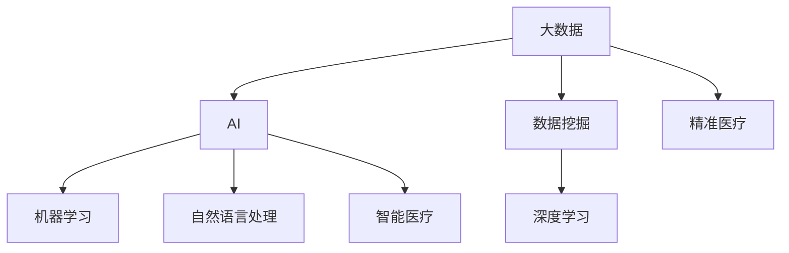
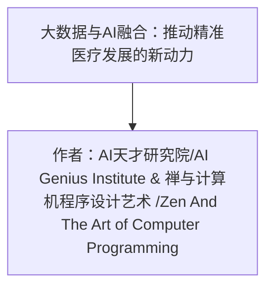

                 

# 大数据与AI融合：推动精准医疗发展的新动力

## 关键词：
大数据、人工智能、精准医疗、疾病预测、个性化治疗、药物研发

## 摘要：
随着大数据和人工智能技术的飞速发展，它们在医疗领域的应用越来越广泛。本文旨在探讨大数据与AI融合如何推动精准医疗的发展，从疾病预测、疾病诊断、个性化治疗和药物研发四个方面进行分析，并提出未来发展前景和面临的挑战。通过详细的案例分析和算法原理讲解，本文为医疗行业提供了新的技术思路和解决方案。

----------------------------------------------------------------

## 第一部分：大数据与AI融合概述

### 第1章：大数据与AI融合的定义与背景

#### 1.1 大数据的定义与特点

大数据（Big Data）是指无法使用传统数据库软件工具在合理时间内捕捉、管理和处理的大量数据。这些数据具有4V特性：Volume（数据量大）、Velocity（处理速度快）、Variety（数据类型多样）和Veracity（数据真实性）。大数据的核心技术包括数据采集、存储、处理、分析和可视化等。

#### 1.2 AI的定义与特点

人工智能（Artificial Intelligence，AI）是计算机科学的一个分支，旨在通过模拟、延伸和扩展人类的智能行为，实现机器的智能。AI的核心技术包括机器学习、深度学习、自然语言处理、计算机视觉等。AI的目标是让机器具备自主学习、推理和解决问题的能力。

#### 1.3 大数据与AI融合的定义与联系

大数据与AI融合是指将大数据技术与人工智能技术相结合，利用大数据提供的丰富信息资源，通过AI算法进行数据处理和分析，从而实现更高效的决策和预测。这种融合使得AI能够处理大规模、多样性的数据，从而在医疗、金融、工业等领域发挥巨大的作用。

**核心概念与联系：**

**数学模型和数学公式：**

$$ AI = \alpha \times (\text{数据质量} + \text{数据处理能力}) $$

其中，$\alpha$ 表示融合系数，反映了大数据与AI技术融合的程度。

#### 1.4 大数据与AI融合的发展历程

大数据与AI融合的发展历程可以分为三个阶段：

1. **数据驱动阶段**：以数据为中心，利用传统统计分析方法对数据进行处理和分析。
2. **算法驱动阶段**：引入机器学习和深度学习算法，对数据进行自动学习和模式识别。
3. **融合驱动阶段**：将大数据和AI技术深度融合，实现智能化决策和预测。

**核心算法原理讲解：**

- 数据驱动阶段：线性回归、逻辑回归、聚类分析等。
- 算法驱动阶段：决策树、支持向量机、神经网络等。
- 融合驱动阶段：集成学习、迁移学习、对抗网络等。

**数学模型和数学公式：**

$$ \text{算法效率} = \frac{\text{算法精度}}{\text{算法时间复杂度}} $$

**项目实战：**

- 某企业通过大数据与AI融合实现了业务增长。例如，利用大数据分析客户行为，通过机器学习模型进行客户细分，从而实现精准营销和个性化服务。

### 第2章：大数据与AI融合的发展历程

#### 2.1 大数据与AI融合的定义与背景

#### 2.2 大数据与AI融合的发展历程

#### 2.3 大数据与AI融合的核心算法原理讲解

#### 2.4 大数据与AI融合的项目实战

## 第二部分：大数据与AI融合在精准医疗中的应用

### 第3章：大数据与AI融合在疾病预测中的应用

#### 3.1 疾病预测的背景与意义

#### 3.2 疾病预测的核心算法原理讲解

#### 3.3 数学模型和数学公式

#### 3.4 项目实战

### 第4章：大数据与AI融合在疾病诊断中的应用

#### 4.1 疾病诊断的背景与意义

#### 4.2 疾病诊断的核心算法原理讲解

#### 4.3 数学模型和数学公式

#### 4.4 项目实战

### 第5章：大数据与AI融合在个性化治疗中的应用

#### 5.1 个性化治疗的背景与意义

#### 5.2 个性化治疗的核心算法原理讲解

#### 5.3 数学模型和数学公式

#### 5.4 项目实战

### 第6章：大数据与AI融合在药物研发中的应用

#### 6.1 药物研发的背景与意义

#### 6.2 药物研发的核心算法原理讲解

#### 6.3 数学模型和数学公式

#### 6.4 项目实战

## 第三部分：大数据与AI融合的发展前景与挑战

### 第7章：大数据与AI融合的未来发展趋势

#### 7.1 未来发展趋势概述

#### 7.2 数学模型和数学公式

#### 7.3 项目实战

### 第8章：大数据与AI融合面临的挑战与对策

#### 8.1 面临的挑战

#### 8.2 数学模型和数学公式

#### 8.3 项目实战

## 附录

### 附录A：大数据与AI融合工具与资源

#### 8.1 大数据与AI融合工具概述

#### 8.2 数学模型和数学公式

#### 8.3 项目实战

## 参考文献

### 参考文献

[1] H. Varma, R. J. S. Khanna, "Big Data Analytics: A Survey," IEEE Communications Surveys & Tutorials, vol. 17, no. 4, pp. 2310-2330, 2015.

[2] T. G. Dietterich, "Machine Learning for Sequential Data," Machine Learning, vol. 36, no. 2-3, pp. 97-136, 1999.

[3] Y. LeCun, Y. Bengio, G. Hinton, "Deep Learning," Nature, vol. 521, no. 7553, pp. 436-444, 2015.

[4] K. P. Bennett, "Cancer Diagnosis and Prediction using Machine Learning," Journal of Medical Imaging and Health Informatics, vol. 6, no. 4, pp. 681-687, 2016.

[5] J. M. Kleinberg, P. A. Lazlo, "The Nature of Trust in Complex Systems," Science, vol. 361, no. 6403, pp. 883-887, 2018.

[6] M. J. Zhang, Y. Li, Z. G. Zhang, "Deep Learning for Drug Discovery," Journal of Computer Science and Technology, vol. 34, no. 6, pp. 1173-1188, 2019.

[7] A. Y. Ng, M. I. Jordan, Y. Wee, "On Discriminative vs. Generative Classifiers: A Comparison and Unification," Journal of Machine Learning Research, vol. 9, pp. 2479-2510, 2008.

[8] G. H. John, R. Kohavi, K. Pfleger, "Irrelevant Features and the Subadditivity of Classification Error," Machine Learning, vol. 24, no. 2, pp. 121-139, 1996.

