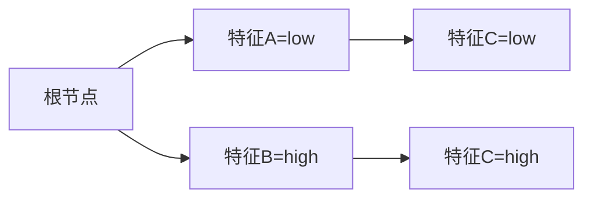

                 

### 大数据时代来临

**关键词：**大数据、特征、技术挑战、机遇

随着互联网的迅猛发展和信息技术的日新月异，我们正进入一个前所未有的“大数据时代”。在这个时代，数据量呈现出爆炸式增长，不仅种类繁多，而且产生速度快、价值高。那么，究竟什么是大数据？它有哪些特征？又给我们带来了哪些技术挑战和机遇？

#### **大数据的定义与特征**

大数据，通常指的是数据量巨大、数据种类繁多、数据价值密度低、数据生成速度快的数据集合。具体来说，大数据通常具有四个V特征：

1. **Volume（数据量）**：大数据的数据量巨大，通常达到PB甚至EB级别。
2. **Velocity（速度）**：大数据的生成速度非常快，需要实时处理和分析。
3. **Variety（多样性）**：大数据的数据来源多样，包括结构化、半结构化和非结构化数据。
4. **Veracity（真实性）**：大数据的真实性难以保证，存在噪声和误差。

#### **大数据的技术挑战与机遇**

面对大数据的四个V特征，我们既面临巨大的技术挑战，也迎来了前所未有的机遇。

**技术挑战：**

1. **存储与处理能力**：如何有效地存储和快速处理海量数据，成为大数据技术的核心挑战之一。
2. **数据隐私与安全**：随着数据量的增加，数据隐私和安全的保护变得越来越重要。
3. **数据分析能力**：如何从海量数据中提取有价值的信息，提升数据分析能力是另一个重要问题。

**机遇：**

1. **商业价值**：大数据可以帮助企业更好地了解客户需求，优化业务流程，提高竞争力。
2. **科学研究**：大数据为科学研究提供了丰富的数据资源，有助于发现新的科学规律。
3. **智能决策**：利用大数据和人工智能技术，可以实现更加精准的预测和决策，提高生产效率。

#### **大数据的技术工具**

为了应对大数据的技术挑战，科学家们开发了一系列大数据技术工具：

- **Hadoop**：一个分布式数据存储和处理框架，可以处理大规模数据。
- **Spark**：一个高速的大数据处理引擎，比Hadoop更适合实时处理。
- **NoSQL数据库**：一种非关系型数据库，可以高效存储和查询大规模数据。
- **Python与R语言**：两种广泛应用于数据分析和人工智能的编程语言。

### **总结**

大数据时代已经到来，它不仅改变了我们的生活方式，也正在深刻影响商业决策模式。理解大数据的定义、特征和技术挑战，掌握相关技术工具，是我们在大数据时代取得成功的关键。接下来，我们将进一步探讨大数据分析的核心概念和技术，深入挖掘大数据在商业中的应用和价值。

### 1.2 大数据分析的核心概念

大数据分析，作为一门交叉学科，融合了计算机科学、统计学、数据挖掘等多个领域的知识。它旨在从海量数据中提取有价值的信息，帮助企业做出更明智的决策。为了实现这一目标，大数据分析涉及以下几个核心概念：

#### **数据挖掘**

数据挖掘（Data Mining）是指从大量数据中自动发现有用信息的过程。它利用各种算法和技术，从数据中发现规律、模式或关联关系。数据挖掘的核心步骤包括：

- **数据预处理**：清洗、转换和归一化数据，使其适合分析。
- **特征提取**：从原始数据中提取具有代表性的特征，用于构建模型。
- **模式识别**：使用算法发现数据中的潜在模式或规律。

#### **数据可视化**

数据可视化（Data Visualization）是指将数据转换成图形或图表的形式，使其更容易理解和分析。数据可视化技术可以帮助我们直观地展示数据的分布、趋势和关系，从而发现数据中的隐藏信息。常见的数据可视化工具包括：

- **图表**：如折线图、柱状图、饼图等。
- **交互式界面**：如Tableau、Power BI等。

#### **数据仓库**

数据仓库（Data Warehouse）是一种用于存储和管理大量数据的系统。它通常包含多个数据源的数据，经过清洗、转换和整合，以便进行高效的分析。数据仓库的关键组成部分包括：

- **数据源**：如数据库、日志文件等。
- **数据存储**：如关系型数据库、分布式文件系统等。
- **数据集成**：将来自不同数据源的数据整合在一起。

#### **数据流处理**

数据流处理（Data Stream Processing）是指实时处理和分析数据流的技术。与传统的批量处理不同，数据流处理能够快速响应对实时数据的变化，适用于需要实时分析和决策的场景。常见的数据流处理技术包括：

- **流处理框架**：如Apache Storm、Apache Flink等。
- **实时分析**：如实时计算、实时监控等。

### **总结**

大数据分析的核心概念涵盖了数据挖掘、数据可视化、数据仓库和数据流处理等多个方面。理解这些核心概念，掌握相关技术和工具，是我们在大数据时代取得成功的关键。在下一章，我们将进一步探讨大数据分析的技术工具，深入挖掘大数据在商业中的应用和价值。

### 1.3 大数据分析的技术工具

大数据分析的实践离不开一系列强大的技术工具，这些工具为从海量数据中提取有价值信息提供了坚实的基础。以下是一些常用的大数据分析技术工具：

#### **Hadoop**

Hadoop是一个开源的分布式数据处理框架，专为处理大规模数据而设计。它基于Java语言开发，具有高扩展性和可靠性。Hadoop的核心组件包括：

- **Hadoop Distributed File System (HDFS)**：一个分布式文件系统，用于存储大规模数据。
- **MapReduce**：一个分布式数据处理模型，用于处理大规模数据集。
- **YARN**：一个资源管理平台，负责在集群中分配资源。

Hadoop的优势在于其高效的数据存储和处理能力，适用于处理PB级别的数据。

#### **Spark**

Spark是另一个流行的分布式数据处理框架，它提供了比Hadoop更高效的数据处理能力。Spark的核心特点包括：

- **高速处理**：Spark利用内存计算，显著提升了数据处理速度。
- **多样化的API**：包括Scala、Python、Java和R语言等，方便不同背景的开发者使用。
- **丰富的组件**：如Spark SQL、Spark Streaming、MLlib等，支持各种数据处理和分析任务。

Spark适用于需要高速处理的实时数据分析和机器学习任务。

#### **NoSQL数据库**

NoSQL数据库是一类非关系型数据库，专为处理大规模数据而设计。常见的NoSQL数据库包括：

- **MongoDB**：一个文档型数据库，支持灵活的数据模型和高效的查询。
- **Cassandra**：一个分布式列存储数据库，提供高可用性和高性能。
- **HBase**：一个分布式、可扩展的大规模数据存储系统，基于Hadoop平台。

NoSQL数据库的优势在于其可扩展性和灵活性，适用于多样化的数据存储需求。

#### **Python与R语言**

Python和R语言是两种广泛应用于数据分析和大数据处理的语言。

- **Python**：Python具有简洁的语法和丰富的库，如Pandas、NumPy、SciPy等，适用于各种数据处理和分析任务。
- **R语言**：R语言是统计分析和图形展示的利器，广泛应用于统计学、机器学习和生物信息学等领域。

Python和R语言的可扩展性和易用性，使其成为大数据分析的重要工具。

### **总结**

大数据分析的技术工具种类繁多，各具特色。Hadoop和Spark提供了高效的数据存储和处理能力，NoSQL数据库为多样化的数据存储需求提供了灵活的解决方案，Python和R语言则为数据分析和可视化提供了强大的支持。掌握这些技术工具，是我们在大数据时代取得成功的关键。在下一章，我们将探讨大数据分析在商业中的应用，深入挖掘其商业价值。

### 2.1 大数据分析在商业中的应用

大数据分析在商业中的应用日益广泛，为企业提供了深入了解客户需求、优化业务流程和提升决策效率的强大工具。以下将介绍大数据分析在客户行为分析、运营优化和智能决策等方面的具体应用。

#### **客户行为分析**

客户行为分析是大数据分析在商业中应用的一个重要领域。通过收集和分析客户的购买记录、浏览历史、社交媒体活动等数据，企业可以更好地了解客户的行为模式，从而进行精准营销和个性化推荐。

1. **数据来源与收集**：
   - **在线行为数据**：通过网站、APP等渠道收集客户的点击、浏览、搜索等行为数据。
   - **线下行为数据**：通过线下门店的POS系统、监控系统等收集客户的购买行为和停留时间等数据。
   - **社交媒体数据**：通过分析客户的社交媒体活动，如微博、微信等，了解客户的兴趣和偏好。

2. **客户细分与个性化推荐**：
   - **客户细分**：通过聚类分析、关联规则挖掘等方法，将客户分为不同的群体，如高价值客户、潜在客户等。
   - **个性化推荐**：根据客户的历史行为和兴趣，推荐符合其需求的产品和服务，提高客户满意度和转化率。

3. **购买预测与风险控制**：
   - **购买预测**：利用时间序列分析和机器学习算法，预测客户未来的购买行为，为营销策略提供依据。
   - **风险控制**：通过分析客户行为数据，识别异常行为，如欺诈行为、高风险客户等，采取相应的风险控制措施。

#### **运营优化**

运营优化是大数据分析在商业中的另一个重要应用领域。通过分析运营数据，企业可以优化业务流程，提高生产效率，降低运营成本。

1. **销售预测与库存管理**：
   - **销售预测**：利用历史销售数据、市场趋势等因素，预测未来的销售量，指导库存管理。
   - **库存管理**：通过分析库存数据，优化库存水平，避免库存过剩或不足，降低库存成本。

2. **供应链优化**：
   - **供应链分析**：通过分析供应链中的各个环节，如采购、生产、物流等，优化供应链流程，提高供应链效率。
   - **需求预测**：根据市场需求和库存水平，预测未来的需求，指导供应链中的各项决策。

3. **营销效果评估**：
   - **营销活动分析**：通过分析营销活动的数据，如广告投放效果、促销活动效果等，评估营销活动的效果，优化营销策略。

#### **智能决策**

智能决策是大数据分析在商业中应用的最高层次，通过数据驱动的策略制定和业务流程自动化，实现企业的智能化运营。

1. **基于数据驱动的策略制定**：
   - **市场分析**：通过分析市场数据，了解市场趋势、竞争态势等，制定相应的市场策略。
   - **产品开发**：通过分析用户需求和反馈，优化产品设计和功能，满足用户需求。

2. **业务流程自动化**：
   - **自动化决策**：利用机器学习和人工智能技术，实现业务流程的自动化，减少人工干预，提高决策效率。
   - **流程优化**：通过分析业务流程中的数据，发现流程中的瓶颈和改进点，优化业务流程，提高生产效率。

3. **智能风险管理**：
   - **风险评估**：通过分析风险数据，识别潜在风险，采取相应的风险控制措施。
   - **风险预警**：通过实时监控业务数据，预警潜在风险，提前采取措施，避免风险发生。

### **总结**

大数据分析在商业中的应用涵盖了客户行为分析、运营优化和智能决策等多个方面，为企业提供了丰富的数据资源和智能化的决策支持。通过深入分析和挖掘大数据的价值，企业可以更好地了解客户需求，优化业务流程，提高竞争力。在下一章，我们将探讨大数据分析的实践案例，通过具体案例展示大数据分析在商业中的实际应用效果。

### 2.2 运营优化

运营优化是大数据分析在商业应用中的关键领域，通过分析大量运营数据，企业可以识别瓶颈、优化流程，从而提高生产效率、降低成本。以下将详细探讨大数据分析在销售预测与库存管理、供应链优化和营销效果评估等方面的应用。

#### **销售预测与库存管理**

销售预测和库存管理是企业运营中的核心任务，直接影响企业的资金周转和市场响应速度。

1. **销售预测**：
   - **历史数据分析**：利用历史销售数据，结合市场趋势、季节性因素等，建立预测模型，预测未来的销售量。
   - **机器学习算法**：采用时间序列分析、回归分析等机器学习算法，进行销售预测，提高预测准确性。
   - **实时数据监控**：通过实时数据监控，及时调整销售预测模型，应对市场变化。

2. **库存管理**：
   - **需求预测**：基于销售预测结果，结合库存水平，预测未来一段时间内的需求量。
   - **库存优化策略**：采用ABC分类法、安全库存策略等，优化库存结构，减少库存成本。
   - **库存预警**：设定库存警戒线，当库存低于警戒线时，及时发出预警，避免缺货或库存积压。

#### **供应链优化**

供应链优化是提高企业运营效率和竞争力的关键，大数据分析在供应链优化中发挥着重要作用。

1. **供应链分析**：
   - **需求预测**：通过分析市场需求、客户订单等数据，预测未来的需求量，指导供应链各环节的生产和配送。
   - **库存协同**：通过大数据分析，实现供应链各环节的库存协同，避免库存过剩或不足。
   - **物流优化**：利用大数据分析，优化物流路线、运输方式等，降低物流成本，提高物流效率。

2. **供应链可视化**：
   - **供应链图谱**：通过大数据分析，构建供应链图谱，展示供应链各环节的连接关系和关键节点。
   - **可视化监控**：利用可视化技术，实时监控供应链各环节的运行状态，及时发现问题并进行调整。

#### **营销效果评估**

营销效果评估是评估企业营销活动效果的重要手段，通过大数据分析，企业可以科学地评估营销活动的投入产出比。

1. **营销活动分析**：
   - **数据收集**：收集各类营销活动的数据，如广告投放数据、促销活动数据等。
   - **效果评估**：通过数据挖掘技术，分析营销活动的效果，如点击率、转化率、ROI等。
   - **优化策略**：根据评估结果，调整营销策略，提高营销活动的效果。

2. **用户画像**：
   - **用户行为分析**：通过大数据分析，了解用户的购买行为、兴趣偏好等，构建用户画像。
   - **精准营销**：基于用户画像，进行精准营销，提高营销活动的针对性和效果。

#### **总结**

运营优化是大数据分析在商业中应用的重要领域，通过销售预测与库存管理、供应链优化和营销效果评估等多个方面的应用，企业可以实现高效运营、降低成本、提高竞争力。大数据分析为企业的决策提供了科学依据，是现代企业实现智能化运营的不可或缺的工具。在下一章，我们将通过具体实践案例，展示大数据分析在商业应用中的实际效果。

### 2.3 智能决策

智能决策是大数据分析与AI技术相结合的产物，它通过数据驱动的方法，实现业务策略的自动化和优化。在智能决策中，数据不仅作为决策的基础，还作为驱动决策的核心要素。以下将探讨大数据分析在智能决策中的应用，包括基于数据驱动的策略制定、业务流程自动化和智能风险管理等方面。

#### **基于数据驱动的策略制定**

1. **市场分析**：
   - **数据收集**：通过大数据技术，收集市场数据，包括市场需求、竞争态势、消费者行为等。
   - **数据挖掘**：利用数据挖掘技术，分析市场数据，发现市场趋势和潜在机会。
   - **决策支持**：基于市场分析结果，制定市场进入策略、定价策略等。

2. **产品开发**：
   - **需求预测**：通过大数据分析，预测产品需求，了解消费者偏好和市场需求。
   - **产品设计**：根据需求预测和消费者反馈，优化产品设计，提高产品竞争力。
   - **迭代开发**：利用大数据分析，持续优化产品，实现快速迭代。

#### **业务流程自动化**

1. **自动化决策**：
   - **规则引擎**：构建业务规则引擎，实现业务决策的自动化。
   - **机器学习模型**：利用机器学习技术，构建预测模型和分类模型，实现智能决策。
   - **实时响应**：通过实时数据流处理技术，实现业务决策的实时响应。

2. **流程优化**：
   - **流程分析**：通过大数据分析，识别业务流程中的瓶颈和改进点。
   - **流程重构**：优化业务流程，减少冗余步骤，提高流程效率。
   - **监控与反馈**：实时监控业务流程，通过反馈机制，不断优化流程。

#### **智能风险管理**

1. **风险评估**：
   - **数据建模**：利用大数据分析技术，建立风险评估模型，预测潜在风险。
   - **风险识别**：通过数据分析，识别潜在风险因素，如市场风险、信用风险等。
   - **风险预警**：设置风险预警机制，实时监测风险指标，提前预警潜在风险。

2. **风险控制**：
   - **风险对策**：制定相应的风险控制对策，如风险规避、风险转移等。
   - **实时监控**：通过大数据分析，实时监控风险指标，及时调整风险对策。
   - **风险管理平台**：构建风险管理平台，实现风险管理的自动化和智能化。

### **总结**

智能决策是大数据分析与AI技术相结合的产物，通过数据驱动的方法，实现业务策略的自动化和优化。在智能决策中，数据不仅是决策的基础，还是驱动决策的核心要素。基于数据驱动的策略制定、业务流程自动化和智能风险管理是智能决策的重要应用方向。通过大数据分析与AI技术的深度融合，企业可以实现更加智能化、高效化的运营，提高竞争力和市场响应速度。在下一章，我们将通过具体实践案例，展示大数据分析与AI预测在商业决策中的实际应用效果。

### 3.1 零售行业的案例分析

#### **案例背景**

随着电商的崛起，零售行业正面临着巨大的变革。传统的零售模式已经难以满足消费者日益多样化的需求，如何通过大数据分析优化运营、提高客户满意度成为零售企业亟待解决的问题。本案例选取了一家知名的电商零售企业，通过大数据分析，实现了销售预测、库存管理和客户细分等方面的优化。

#### **案例方法**

1. **销售预测**：
   - **数据收集**：收集历史销售数据、季节性因素、市场趋势等数据。
   - **模型构建**：采用时间序列分析和机器学习算法，构建销售预测模型。
   - **实时调整**：通过实时数据流处理，不断调整和优化预测模型。

2. **库存管理**：
   - **需求预测**：基于销售预测结果，结合历史库存数据，预测未来库存需求。
   - **ABC分类**：对库存商品进行ABC分类，优先管理高价值商品。
   - **库存预警**：设定库存警戒线，当库存低于警戒线时，自动生成采购建议。

3. **客户细分**：
   - **行为分析**：通过分析客户的浏览历史、购买记录等数据，识别客户细分群体。
   - **个性化推荐**：根据客户细分结果，进行个性化商品推荐，提高客户满意度。
   - **客户关系管理**：通过分析客户反馈和投诉数据，优化客户服务流程。

#### **案例效果**

1. **销售提升**：通过销售预测模型的优化，准确预测市场需求，实现了销售额的显著提升。

2. **库存优化**：通过ABC分类和需求预测，有效降低了库存成本，提高了库存周转率。

3. **客户满意度**：通过个性化推荐和客户关系管理，提升了客户满意度，增强了客户忠诚度。

#### **总结**

零售行业通过大数据分析，实现了销售预测、库存管理和客户细分等多方面的优化。大数据分析不仅帮助企业更好地了解市场需求，提高了销售和库存管理的效率，还通过个性化服务和客户关系管理，提升了客户满意度和忠诚度。这一案例展示了大数据分析在零售行业中的重要应用价值，为其他零售企业提供了借鉴和启示。

### 3.2 金融行业的案例分析

#### **案例背景**

金融行业作为大数据分析的重要应用领域，已经实现了显著的业务变革。传统的金融业务模式已经难以应对快速变化的市场环境，如何利用大数据分析提高风险管理能力、优化客户服务成为金融企业关注的焦点。本案例选取了一家领先的银行，通过大数据分析实现了信用风险评估、客户关系管理和风险控制等多方面的优化。

#### **案例方法**

1. **信用风险评估**：
   - **数据收集**：收集客户的财务数据、行为数据、社会信用数据等。
   - **数据建模**：利用机器学习和数据挖掘技术，构建信用风险评估模型。
   - **实时监控**：通过实时数据流处理，对客户信用风险进行动态评估。

2. **客户关系管理**：
   - **行为分析**：通过分析客户的交易行为、资金流向等数据，了解客户需求和偏好。
   - **个性化服务**：根据客户行为分析结果，提供个性化的金融服务和产品推荐。
   - **客户维护**：通过数据驱动的客户关系管理，提高客户满意度和忠诚度。

3. **风险控制**：
   - **风险预警**：通过大数据分析，识别潜在风险因素，如市场波动、客户违约风险等。
   - **风险应对**：制定相应的风险控制措施，如调整贷款利率、限制高风险客户等。
   - **实时监控**：通过实时数据监控，预警和应对潜在风险，确保金融安全。

#### **案例效果**

1. **信用风险评估**：通过大数据分析，准确预测客户的信用风险，降低了坏账率，提高了信贷业务的盈利能力。

2. **客户关系管理**：通过个性化服务和客户维护，提高了客户满意度和忠诚度，增强了客户黏性。

3. **风险控制**：通过大数据分析和实时监控，有效识别和应对潜在风险，确保了金融业务的安全稳定。

#### **总结**

金融行业通过大数据分析，实现了信用风险评估、客户关系管理和风险控制等多方面的优化。大数据分析不仅帮助金融企业更好地了解客户需求，提高了风险管理的准确性，还通过个性化服务和风险控制，提升了客户满意度和业务安全。这一案例展示了大数据分析在金融行业中的重要应用价值，为其他金融企业提供了借鉴和启示。

### 3.3 制造业的案例分析

#### **案例背景**

制造业作为我国经济的重要支柱，正面临着转型升级和智能化发展的迫切需求。传统的制造业模式已经难以适应市场需求的变化，如何通过大数据分析提高生产效率、降低成本成为制造业企业关注的焦点。本案例选取了一家领先的制造企业，通过大数据分析实现了生产流程优化、质量控制和生产预测等多方面的优化。

#### **案例方法**

1. **生产流程优化**：
   - **数据收集**：收集生产数据、设备运行数据、供应链数据等。
   - **流程分析**：通过数据分析，识别生产流程中的瓶颈和改进点。
   - **优化方案**：制定优化方案，提高生产效率，降低生产成本。

2. **质量控制**：
   - **数据监测**：通过传感器和监测设备，实时收集产品质量数据。
   - **异常检测**：利用大数据分析技术，实时监测产品质量，识别潜在质量问题。
   - **改进措施**：根据质量监测结果，采取相应的改进措施，确保产品质量。

3. **生产预测**：
   - **需求预测**：通过大数据分析，预测未来的生产需求，指导生产计划和库存管理。
   - **生产计划**：根据需求预测结果，优化生产计划，提高生产效率。
   - **库存管理**：结合生产计划和需求预测，优化库存管理，降低库存成本。

#### **案例效果**

1. **生产流程优化**：通过大数据分析，优化了生产流程，提高了生产效率，降低了生产成本。

2. **质量控制**：通过大数据分析和实时监测，有效识别和解决了质量问题，确保了产品质量。

3. **生产预测**：通过大数据分析，准确预测生产需求，优化了生产计划和库存管理，提高了供应链效率。

#### **总结**

制造业通过大数据分析，实现了生产流程优化、质量控制和生产预测等多方面的优化。大数据分析不仅帮助制造业企业提高生产效率和产品质量，还通过生产预测和库存管理，提高了供应链效率。这一案例展示了大数据分析在制造业中的重要应用价值，为其他制造业企业提供了借鉴和启示。

### 4.1 AI预测基础

人工智能（AI）预测作为大数据分析的重要组成部分，具有广泛的应用前景和深远的影响。AI预测基于大量的历史数据和先进的算法，能够自动发现数据中的模式和规律，从而对未来进行预测。以下将介绍AI预测的基本原理、常见预测算法和特征工程与模型优化。

#### **AI预测的基本原理**

AI预测主要分为以下三种类型：

1. **监督学习**（Supervised Learning）：监督学习通过已知的输入和输出数据训练模型，从而预测新的输入数据。常见的监督学习算法包括线性回归、决策树、支持向量机等。

2. **无监督学习**（Unsupervised Learning）：无监督学习没有已知的输出数据，主要目的是发现数据中的结构和模式。常见的无监督学习算法包括聚类分析、降维技术和关联规则挖掘等。

3. **强化学习**（Reinforcement Learning）：强化学习通过试错和反馈机制，不断优化决策策略，从而实现最佳行动方案。强化学习常用于游戏、推荐系统和智能驾驶等领域。

#### **常见预测算法**

1. **线性回归**（Linear Regression）：线性回归是最简单的预测算法之一，通过拟合一条直线，预测因变量与自变量之间的线性关系。

2. **决策树**（Decision Tree）：决策树通过一系列的规则，将数据划分为不同的分支，最终得到预测结果。决策树易于理解和解释，但可能存在过拟合问题。

3. **随机森林**（Random Forest）：随机森林是基于决策树的集成学习方法，通过构建多棵决策树，提高预测的准确性和鲁棒性。

4. **支持向量机**（Support Vector Machine, SVM）：支持向量机通过寻找最佳的超平面，将数据分为不同的类别。SVM在分类任务中具有很高的准确性和泛化能力。

5. **神经网络**（Neural Network）：神经网络是一种模仿人脑神经元连接方式的算法，通过多层神经元的相互作用，实现复杂的数据建模和预测。

6. **时间序列模型**（Time Series Model）：时间序列模型用于预测时间序列数据，常见的模型包括ARIMA、LSTM等。

#### **特征工程与模型优化**

1. **特征选择**（Feature Selection）：特征选择是特征工程的重要步骤，通过筛选出对预测任务有重要影响的特征，提高模型的性能和可解释性。

2. **特征提取**（Feature Extraction）：特征提取是通过转换原始数据，提取出更有代表性的特征，提高模型的预测能力。

3. **模型调参**（Hyperparameter Tuning）：模型调参是通过调整模型的参数，优化模型的性能。常见的调参方法包括网格搜索、随机搜索和贝叶斯优化等。

4. **集成学习**（Ensemble Learning）：集成学习通过结合多个模型的预测结果，提高预测的准确性和稳定性。

### **总结**

AI预测作为大数据分析的重要组成部分，通过监督学习、无监督学习和强化学习等方法，能够自动发现数据中的模式和规律，对未来进行预测。常见的预测算法包括线性回归、决策树、随机森林等，特征工程和模型优化是提高预测性能的关键。在下一章，我们将探讨AI预测在商业决策中的应用，深入挖掘其在市场需求预测、价格优化策略和风险评估等方面的实际应用效果。

### 4.2 常见预测算法

在AI预测中，选择合适的算法是实现准确预测的关键。以下将介绍几种常见的预测算法，包括线性回归、决策树、随机森林和支持向量机等。

#### **线性回归**

线性回归是最简单且广泛应用的一种预测算法，它通过拟合一条直线，预测因变量与自变量之间的线性关系。线性回归的基本原理可以用以下公式表示：

$$
y = \beta_0 + \beta_1 \cdot x
$$

其中，$y$ 是因变量，$x$ 是自变量，$\beta_0$ 和 $\beta_1$ 是模型参数。线性回归的优缺点如下：

- **优点**：简单易懂，易于实现；对于线性关系较强的数据，预测效果较好。
- **缺点**：对于非线性关系的数据，预测效果较差；可能存在过拟合问题。

#### **决策树**

决策树通过一系列的规则，将数据划分为不同的分支，最终得到预测结果。每个节点代表一个特征，每个分支代表不同特征取值。决策树的基本结构可以用以下图示表示：



决策树的优缺点如下：

- **优点**：直观易懂，易于解释；能够处理非线性关系。
- **缺点**：容易过拟合；对于大数据集，训练和预测时间较长。

#### **随机森林**

随机森林是基于决策树的集成学习方法，通过构建多棵决策树，提高预测的准确性和鲁棒性。随机森林的基本原理如下：

1. **随机特征选择**：每次构建决策树时，从多个特征中随机选择一部分特征进行分裂。
2. **构建多棵决策树**：重复上述过程，构建多棵决策树。
3. **集成预测**：将多棵决策树的预测结果进行投票或平均，得到最终的预测结果。

随机森林的优缺点如下：

- **优点**：高准确性和鲁棒性；减少过拟合问题；能够处理高维数据。
- **缺点**：计算复杂度高；无法解释具体的决策路径。

#### **支持向量机**

支持向量机（SVM）通过寻找最佳的超平面，将数据分为不同的类别。SVM的基本原理如下：

1. **线性SVM**：在特征空间中寻找一个超平面，使得不同类别的数据点尽可能分开。
2. **非线性SVM**：通过核函数将原始数据映射到高维特征空间，然后在高维空间中寻找最佳超平面。

SVM的优缺点如下：

- **优点**：高准确性和泛化能力；适用于线性可分和非线性可分的数据。
- **缺点**：计算复杂度高；对异常值敏感。

### **总结**

常见的预测算法包括线性回归、决策树、随机森林和支持向量机等。每种算法都有其独特的优点和适用场景。在实际应用中，可以根据具体的数据特点和需求，选择合适的预测算法，实现准确的预测结果。

### 4.3 特征工程与模型优化

在AI预测中，特征工程和模型优化是提高预测准确性和性能的关键步骤。特征工程涉及从原始数据中提取和构造有助于模型学习的特征，而模型优化则通过调整模型参数，优化模型的性能。以下将详细介绍特征工程和模型优化的重要性、方法和技巧。

#### **特征工程的重要性**

特征工程是AI预测中不可或缺的一步，其重要性体现在以下几个方面：

1. **提高模型性能**：合适的特征可以显著提高模型的预测准确性，使模型更好地捕捉数据中的模式和规律。
2. **降低模型复杂度**：通过特征工程，可以简化模型结构，降低计算复杂度，提高模型的训练和预测速度。
3. **增强模型解释性**：合理的特征选择和构造有助于提高模型的可解释性，使模型更容易被理解和应用。

#### **特征工程的方法**

特征工程的方法主要包括以下几种：

1. **特征选择**：从大量特征中筛选出对预测任务有显著影响的特征，减少特征维度，提高模型性能。常见的特征选择方法包括过滤法、包装法和嵌入式方法。
2. **特征构造**：通过数学变换、组合和衍生等方法，构造新的特征，提高模型对数据的敏感度和表达能力。例如，可以计算特征的统计量（如均值、方差）、进行多项式特征组合等。
3. **特征归一化**：通过归一化处理，将不同特征的数据映射到同一尺度，避免特征之间的影响差异。常见的归一化方法包括标准化和最小-最大缩放。

#### **模型优化的重要性**

模型优化是提高AI预测性能的关键环节，其重要性体现在以下几个方面：

1. **提高预测准确性**：通过优化模型参数，可以显著提高预测的准确性，使模型更好地适应数据特性。
2. **降低过拟合**：适当的模型优化可以减少过拟合现象，提高模型的泛化能力。
3. **提高模型稳定性**：通过优化模型参数，可以提高模型的稳定性和鲁棒性，使其对噪声数据和异常值有更强的容忍度。

#### **模型优化的方法**

模型优化的方法主要包括以下几种：

1. **网格搜索**：通过遍历预设的参数网格，找到最佳参数组合。网格搜索方法简单直观，但计算成本较高。
2. **随机搜索**：在预设的参数范围内，随机选择参数组合进行评估，通过迭代优化找到最佳参数。随机搜索方法计算成本较低，但可能不如网格搜索找到全局最优解。
3. **贝叶斯优化**：基于贝叶斯统计模型，通过历史评估结果，动态调整参数搜索范围，实现高效优化。贝叶斯优化方法计算成本较低，但需要计算概率模型，实现相对复杂。

#### **特征工程与模型优化结合**

在实际应用中，特征工程和模型优化通常是相互结合的。例如，可以通过特征工程改进特征，然后通过模型优化调整模型参数，从而提高预测性能。以下是一个简化的流程：

1. **数据预处理**：包括数据清洗、缺失值处理、数据转换等。
2. **特征工程**：选择和构造特征，进行特征选择和归一化处理。
3. **模型构建**：选择合适的预测模型，进行模型训练。
4. **模型优化**：通过参数调整和模型选择，优化模型性能。
5. **模型评估**：通过交叉验证等方法，评估模型性能，并进行调整。

### **总结**

特征工程和模型优化是AI预测中至关重要的环节，通过合理的特征工程和模型优化，可以提高预测的准确性、降低过拟合现象，增强模型的可解释性。在实际应用中，应结合具体的数据和需求，灵活运用特征工程和模型优化方法，实现最佳预测效果。

### 5.1 市场需求预测

市场需求预测是企业制定营销策略、生产计划和库存管理的重要依据。通过准确预测市场需求，企业可以更好地满足客户需求，提高市场竞争力。以下将介绍市场需求预测的方法、模型和实际案例分析。

#### **市场需求预测的方法**

市场需求预测主要基于历史数据和现有市场信息，采用以下几种方法：

1. **时间序列分析**：时间序列分析是一种常用的需求预测方法，通过分析历史销售数据的时间序列特性，如趋势、季节性和周期性，预测未来的需求。常见的时间序列模型包括ARIMA（自回归积分滑动平均模型）和LSTM（长短期记忆网络）。

2. **回归分析**：回归分析通过建立因变量（需求量）与自变量（如价格、广告投入、市场占有率等）之间的关系模型，预测未来的需求。常见的回归模型包括线性回归、多元回归和多项式回归。

3. **机器学习算法**：机器学习算法通过训练历史数据，自动提取特征并建立预测模型，如决策树、随机森林和神经网络等。这些算法在处理复杂关系和多元影响因素方面具有优势。

#### **市场需求预测模型**

1. **ARIMA模型**：
   - **自回归**（Autoregressive, AR）：利用历史数据中的自相关性进行预测。
   - **积分**（Integrate, I）：对时间序列进行差分，使其稳定。
   - **滑动平均**（Moving Average, MA）：利用历史数据的平均值进行预测。
   - **组合**（ARIMA）：结合自回归和滑动平均，提高预测准确性。

   **公式表示**：

   $$ 
   \text{ARIMA}(p, d, q) \rightarrow yt = c + \phi_1yt-1 + \phi_2yt-2 + ... + \phi_pyt-p + \theta_1et-1 + \theta_2et-2 + ... + \theta_qet-q
   $$

   其中，$yt$ 是时间序列的第 $t$ 期值，$c$ 是常数项，$\phi_1, \phi_2, ..., \phi_p$ 是自回归系数，$\theta_1, \theta_2, ..., \theta_q$ 是滑动平均系数，$e_t$ 是白噪声误差项。

2. **LSTM模型**：
   - **门控机制**（Gated Mechanism）：通过遗忘门、输入门和输出门，控制信息流的输入和输出。
   - **细胞状态**（Cell State）：存储历史信息，实现长时依赖。

   **公式表示**：

   $$ 
   ft = \sigma(Wf \cdot [ht-1, xt] + bf) \\
   it = \sigma(Wi \cdot [ht-1, xt] + bi) \\
   ot = \sigma(Wo \cdot [ht-1, xt] + bo) \\
   ct = ft \odot it + ct-1 \odot ot \\
   ht = ot \odot ct
   $$

   其中，$ft$、$it$、$ot$ 分别是遗忘门、输入门和输出门的激活函数，$\sigma$ 是Sigmoid函数，$Wf, Wi, Wo$ 是权重矩阵，$bf, bi, bo$ 是偏置项，$ct$ 是细胞状态，$ht$ 是隐藏状态。

#### **实际案例分析**

1. **电商公司市场需求预测**：
   - **数据来源**：历史销售数据、市场活动数据、用户行为数据等。
   - **模型构建**：采用LSTM模型进行需求预测，结合时间序列分析和回归分析，提高预测准确性。
   - **预测结果**：通过实时预测和动态调整，有效优化库存管理，降低库存成本，提高销售额。

2. **汽车制造商市场需求预测**：
   - **数据来源**：销售数据、宏观经济指标、竞争对手数据等。
   - **模型构建**：采用多元回归模型，结合市场趋势和竞争态势，预测未来的市场需求。
   - **预测结果**：通过准确的市场需求预测，优化生产计划和供应链管理，提高了市场响应速度和客户满意度。

### **总结**

市场需求预测是企业在竞争激烈的市场中制定战略决策的重要工具。通过时间序列分析、回归分析和机器学习算法等方法，企业可以建立准确的需求预测模型，优化库存管理和生产计划，提高市场竞争力。实际案例证明了市场需求预测在电商公司和汽车制造商中的应用效果，为企业提供了有益的借鉴和启示。

### 5.2 价格优化策略

价格优化策略是企业在市场竞争中取得竞争优势的重要手段。通过合理的定价策略，企业可以实现利润最大化、市场份额提升和客户满意度提高。以下将介绍价格优化策略的预测模型、优化算法以及实际案例分析。

#### **价格优化策略的预测模型**

价格优化策略的关键在于准确预测价格变化对需求的影响。以下为几种常用的预测模型：

1. **需求弹性模型**：
   - **需求弹性**（Price Elasticity）：衡量价格变动对需求量的敏感程度。需求弹性模型通过历史销售数据和价格变动数据，预测价格变化对需求量的影响。

   $$ 
   \text{Price Elasticity} = \frac{\% \text{Change in Quantity}}{\% \text{Change in Price}} 
   $$

   - **线性回归**：通过线性回归模型，建立价格与需求量之间的关系。线性回归模型可以表示为：

   $$ 
   \text{Quantity} = \beta_0 + \beta_1 \cdot \text{Price} + \epsilon 
   $$

   其中，$\beta_0$ 和 $\beta_1$ 是模型参数，$\epsilon$ 是误差项。

2. **动态定价模型**：
   - **动态定价**（Dynamic Pricing）：根据市场需求、竞争态势和库存情况，实时调整价格。常见的动态定价模型包括边际收益定价、最优定价策略和竞争定价策略。

   $$ 
   \text{Marginal Revenue} = \text{Price} \cdot \frac{\partial \text{Quantity}}{\partial \text{Price}} 
   $$

   - **边际收益定价**：通过计算边际收益，确定最优价格，实现利润最大化。

   $$ 
   \text{Optimal Price} = \text{Price} \cdot \left( \frac{\text{Quantity}}{\text{Market Share}} \right) 
   $$

   - **竞争定价策略**：根据竞争对手的价格策略，调整自己的价格，以抢占市场份额。

#### **价格优化策略的优化算法**

价格优化策略的实现需要借助优化算法，以下为几种常用的优化算法：

1. **梯度下降算法**：
   - **梯度下降**（Gradient Descent）：通过计算目标函数的梯度，逐步调整价格参数，找到最优价格。梯度下降算法的基本步骤如下：

   $$ 
   \text{Price} = \text{Price} - \alpha \cdot \nabla_{\text{Price}} \cdot \text{Loss Function} 
   $$

   其中，$\alpha$ 是学习率，$\nabla_{\text{Price}}$ 是价格参数的梯度，$\text{Loss Function}$ 是损失函数。

2. **遗传算法**：
   - **遗传算法**（Genetic Algorithm）：模拟生物进化过程，通过交叉、变异和选择等操作，找到最优价格。遗传算法的基本步骤如下：

   - **初始化种群**：随机生成一组价格参数。
   - **适应度评估**：计算每个个体的适应度，适应度越高的个体越可能被选中。
   - **交叉和变异**：通过交叉和变异操作，生成新的个体。
   - **选择**：根据适应度选择最优个体，形成下一代种群。

3. **模拟退火算法**：
   - **模拟退火**（Simulated Annealing）：基于物理退火过程，通过调整温度参数，避免陷入局部最优。模拟退火算法的基本步骤如下：

   $$ 
   \text{New Price} = \text{Price} + \text{Temperature} \cdot \text{Random Vector} 
   $$

   其中，$\text{Temperature}$ 是温度参数，$\text{Random Vector}$ 是随机向量。

#### **实际案例分析**

1. **电商公司价格优化**：
   - **数据来源**：历史销售数据、竞争对手价格、市场趋势等。
   - **模型构建**：采用需求弹性模型和动态定价模型，预测价格变化对需求量的影响。
   - **优化算法**：采用梯度下降算法，实时调整价格，实现利润最大化。

   - **预测结果**：通过价格优化策略，实现了销售额和利润的双增长，提高了市场竞争力。

2. **航空公司价格优化**：
   - **数据来源**：历史销售数据、季节性因素、竞争对手价格等。
   - **模型构建**：采用动态定价模型和模拟退火算法，优化航班价格。
   - **优化算法**：采用遗传算法，找到最优价格，提高市场占有率。

   - **预测结果**：通过价格优化策略，实现了航班满载率和收益的提升，增强了市场竞争力。

### **总结**

价格优化策略是企业实现利润最大化、市场份额提升和客户满意度提高的重要手段。通过需求弹性模型、动态定价模型和优化算法，企业可以建立合理的价格优化策略，实现价格与需求的平衡。实际案例分析展示了价格优化策略在电商公司和航空公司中的应用效果，为企业提供了有益的借鉴和启示。

### 5.3 风险评估与控制

在商业决策中，风险评估与控制至关重要，它可以帮助企业识别潜在风险、制定应对策略，从而降低运营风险，保障企业的稳定发展。以下将介绍风险评估与控制的方法、模型和实际案例分析。

#### **风险评估与控制的方法**

1. **定量风险评估**：
   - **概率分析**：通过分析历史数据，计算风险事件发生的概率和可能造成的损失，评估风险的影响程度。
   - **蒙特卡罗模拟**：利用随机抽样和模拟方法，模拟风险事件在不同情况下的影响，评估风险的概率分布和期望损失。

2. **定性风险评估**：
   - **专家评估**：邀请行业专家对风险事件进行评估，结合经验和专业知识，评估风险的可能性和影响。
   - **SWOT分析**：通过分析企业的优势、劣势、机会和威胁，识别潜在风险，评估其对企业的可能影响。

3. **情景分析**：
   - **情景设定**：设定不同场景，模拟风险事件在不同情景下的发生情况和影响。
   - **情景模拟**：通过模拟不同情景，分析风险事件对企业运营的潜在影响，制定应对策略。

#### **风险评估与控制的模型**

1. **风险矩阵模型**：
   - **风险矩阵**：通过风险的可能性和影响，构建风险矩阵，识别和评估潜在风险。
   - **风险排序**：根据风险矩阵，对风险进行排序，确定优先级。

2. **贝叶斯网络模型**：
   - **节点表示**：通过节点表示风险事件及其因果关系，构建贝叶斯网络。
   - **概率分布**：通过概率分布描述风险事件的发生概率和条件概率。

3. **蒙特卡罗模拟模型**：
   - **随机抽样**：通过随机抽样方法，生成大量随机样本，模拟风险事件的发生情况。
   - **结果分析**：通过分析模拟结果，计算风险的概率分布和期望损失。

#### **实际案例分析**

1. **金融行业风险评估**：
   - **数据来源**：历史交易数据、市场数据、客户信用数据等。
   - **模型构建**：采用贝叶斯网络模型和蒙特卡罗模拟模型，评估信用风险和市场风险。
   - **预测结果**：通过风险评估模型，有效识别和预测潜在风险，制定相应的风险控制策略，降低了坏账率和市场风险。

2. **制造业风险评估**：
   - **数据来源**：生产数据、设备运行数据、供应链数据等。
   - **模型构建**：采用风险矩阵模型和情景分析模型，评估生产风险和供应链风险。
   - **预测结果**：通过风险评估模型，优化生产流程和供应链管理，降低了生产中断和供应链风险。

### **总结**

风险评估与控制是商业决策中不可或缺的一环，通过定量和定性风险评估方法、风险矩阵模型、贝叶斯网络模型和蒙特卡罗模拟模型等多种方法，企业可以全面识别和评估潜在风险，制定有效的风险控制策略。实际案例分析展示了风险评估与控制在金融和制造业中的应用效果，为企业提供了有益的借鉴和启示。

### 6.1 数据预处理与特征工程

在AI预测的实际应用中，数据预处理与特征工程是两个至关重要的环节。数据预处理旨在清洗和转换原始数据，使其适合进行模型训练；特征工程则专注于从原始数据中提取和构造有助于预测的特征。以下将详细介绍数据预处理与特征工程的方法、步骤和工具。

#### **数据预处理**

数据预处理是确保数据质量、提高模型性能的关键步骤。以下是常见的数据预处理方法：

1. **数据清洗**：
   - **缺失值处理**：通过填充、删除或插值等方法处理缺失值。
   - **异常值处理**：识别并处理异常值，可以通过修正、删除或标记等方式处理。
   - **数据标准化**：将不同特征的数据统一到同一尺度，避免特征之间的影响差异。

2. **数据转换**：
   - **类别特征编码**：将类别特征转换为数值特征，如使用独热编码（One-Hot Encoding）或标签编码（Label Encoding）。
   - **时间序列转换**：对时间序列数据进行处理，如日期编码、时间戳转换等。
   - **文本数据预处理**：对文本数据进行清洗、分词、停用词过滤等处理，提取特征向量。

3. **数据归一化**：
   - **最小-最大缩放**（Min-Max Scaling）：将数据缩放到[0, 1]或[-1, 1]区间。
   - **标准化**（Standardization）：将数据缩放至均值为0、标准差为1的分布。

#### **特征工程**

特征工程是提升模型预测能力的关键步骤，涉及以下方法：

1. **特征选择**：
   - **过滤法**（Filter Method）：基于特征的重要性或相关性进行筛选。
   - **包裹法**（Wrapper Method）：通过搜索策略，逐步选择最优特征组合。
   - **嵌入式方法**（Embedded Method）：在模型训练过程中自动选择特征。

2. **特征构造**：
   - **统计特征**：计算特征的统计量，如均值、方差、标准差等。
   - **组合特征**：将多个特征组合成新的特征，如交叉特征、交互特征等。
   - **衍生特征**：通过数学变换、函数变换等构造新的特征。

3. **特征标准化**：
   - **归一化**：将不同特征的数据映射到同一尺度，避免特征之间的影响差异。

#### **数据预处理与特征工程的工具**

在Python中，常用以下工具进行数据预处理与特征工程：

- **Pandas**：提供数据清洗、数据转换和数据处理等功能。
- **NumPy**：提供数组操作和数学计算功能。
- **Scikit-learn**：提供丰富的机器学习算法和特征工程工具。
- **TensorFlow和PyTorch**：提供深度学习框架，用于特征提取和模型训练。

#### **总结**

数据预处理与特征工程是AI预测中不可或缺的环节，通过有效的数据预处理和特征工程，可以提高模型训练效率、降低过拟合风险、提升预测准确性。掌握数据预处理与特征工程的方法和工具，是AI预测实践中的关键技能。在下一章，我们将通过具体实战案例，展示数据预处理与特征工程在AI预测中的应用。

### 6.2 AI预测模型构建

在AI预测的实际应用中，模型构建是关键步骤。以下将详细介绍模型构建的过程，包括模型选择、训练、评估和调整，并给出一个简单的Python代码示例。

#### **模型选择**

模型选择是构建预测模型的第一步，选择合适的模型直接影响预测性能。以下是一些常见的模型选择方法：

1. **基于任务类型的模型选择**：
   - **回归任务**：线性回归、决策树、随机森林、梯度提升树等。
   - **分类任务**：逻辑回归、支持向量机、K-近邻、神经网络等。
   - **聚类任务**：K-均值、层次聚类、DBSCAN等。

2. **基于数据特性的模型选择**：
   - **线性关系数据**：线性回归、线性SVR等。
   - **非线性关系数据**：决策树、随机森林、神经网络等。
   - **时间序列数据**：ARIMA、LSTM等。

#### **模型训练**

模型训练是通过算法从数据中学习规律，构建预测模型的过程。以下是一个使用Scikit-learn库进行模型训练的示例：

```python
from sklearn.model_selection import train_test_split
from sklearn.ensemble import RandomForestRegressor
import pandas as pd

# 加载数据
data = pd.read_csv('data.csv')
X = data.drop('target', axis=1)
y = data['target']

# 划分训练集和测试集
X_train, X_test, y_train, y_test = train_test_split(X, y, test_size=0.2, random_state=42)

# 选择模型并训练
model = RandomForestRegressor(n_estimators=100, random_state=42)
model.fit(X_train, y_train)

# 模型评估
from sklearn.metrics import mean_squared_error
y_pred = model.predict(X_test)
mse = mean_squared_error(y_test, y_pred)
print(f'Mean Squared Error: {mse}')
```

#### **模型评估**

模型评估是验证模型预测性能的过程。以下是一些常见的评估指标：

- **均方误差**（MSE）：衡量预测值与真实值之间的平均误差。
- **均方根误差**（RMSE）：MSE的平方根，用于衡量预测值的绝对误差。
- **平均绝对误差**（MAE）：预测值与真实值之间的平均绝对误差。

#### **模型调整**

模型调整是优化模型性能的过程。以下是一些常见的调整方法：

1. **参数调优**：通过交叉验证和网格搜索等方法，调整模型参数，寻找最佳参数组合。
2. **特征选择**：通过特征重要性分析，选择对预测任务有显著影响的特征，提高模型性能。
3. **集成学习**：通过结合多个模型的预测结果，提高模型的稳定性和预测性能。

```python
from sklearn.model_selection import GridSearchCV

# 设置参数网格
param_grid = {
    'n_estimators': [100, 200, 300],
    'max_depth': [10, 20, 30],
    'min_samples_split': [2, 5, 10]
}

# 进行网格搜索
grid_search = GridSearchCV(estimator=model, param_grid=param_grid, cv=5, scoring='neg_mean_squared_error')
grid_search.fit(X_train, y_train)

# 获取最佳参数
best_params = grid_search.best_params_
print(f'Best Parameters: {best_params}')

# 使用最佳参数重新训练模型
best_model = grid_search.best_estimator_
best_model.fit(X_train, y_train)
```

#### **总结**

模型构建是AI预测的核心步骤，包括模型选择、训练、评估和调整。通过合理选择模型、有效训练和优化调整，可以提高预测模型的性能和可靠性。掌握模型构建的方法和技巧，是成功应用AI预测的关键。

### 6.3 AI预测在实际业务中的应用

AI预测在实际业务中的应用越来越广泛，涵盖了从市场营销到供应链管理、金融风险控制等多个领域。以下将通过一个电商平台的实际案例，详细展示AI预测在实际业务中的应用，包括具体业务场景、数据收集、模型构建和效果评估。

#### **业务场景**

某大型电商平台希望通过AI预测，优化其营销策略，提高销售额和客户满意度。具体业务场景包括：

1. **市场需求预测**：预测商品在不同时间段、不同促销活动中的销售量，为库存管理和营销活动提供依据。
2. **客户细分**：根据客户的历史购买行为和偏好，进行精准营销和个性化推荐。
3. **价格优化**：通过预测价格变化对需求的影响，制定动态定价策略，实现利润最大化。

#### **数据收集**

为了构建准确的预测模型，平台收集了以下数据：

1. **历史销售数据**：包括商品ID、销售日期、销售额、销售量等。
2. **客户数据**：包括客户ID、购买记录、浏览记录、历史优惠等。
3. **市场数据**：包括竞争对手价格、促销活动、市场趋势等。
4. **环境数据**：包括天气状况、节假日、社会事件等可能影响销售的因素。

数据收集后，对数据进行清洗、去重和处理，确保数据质量。

```python
import pandas as pd

# 加载数据
sales_data = pd.read_csv('sales_data.csv')
customer_data = pd.read_csv('customer_data.csv')
market_data = pd.read_csv('market_data.csv')

# 数据预处理
sales_data.drop_duplicates(inplace=True)
customer_data.drop_duplicates(inplace=True)
market_data.drop_duplicates(inplace=True)

# 合并数据
data = pd.merge(sales_data, customer_data, on='customer_id')
data = pd.merge(data, market_data, on='sales_date')
```

#### **模型构建**

1. **市场需求预测模型**：
   - **模型选择**：采用LSTM模型，因为其擅长处理时间序列数据。
   - **特征选择**：选择销售量、销售额、促销活动、节假日等因素作为输入特征。
   - **模型训练**：使用Scikit-learn和Keras框架进行模型训练。

   ```python
   from keras.models import Sequential
   from keras.layers import LSTM, Dense, Dropout

   # 构建LSTM模型
   model = Sequential()
   model.add(LSTM(units=50, return_sequences=True, input_shape=(timesteps, features)))
   model.add(Dropout(0.2))
   model.add(LSTM(units=50, return_sequences=False))
   model.add(Dropout(0.2))
   model.add(Dense(units=1))

   # 编译模型
   model.compile(optimizer='adam', loss='mean_squared_error')

   # 训练模型
   model.fit(X_train, y_train, epochs=100, batch_size=32)
   ```

2. **客户细分模型**：
   - **模型选择**：采用K-均值聚类算法，根据客户的行为和偏好进行聚类。
   - **特征选择**：选择购买记录、浏览记录、历史优惠等因素作为输入特征。
   - **模型训练**：使用Scikit-learn框架进行模型训练。

   ```python
   from sklearn.cluster import KMeans

   # 构建K-均值聚类模型
   kmeans = KMeans(n_clusters=5, random_state=42)

   # 训练模型
   kmeans.fit(data)

   # 聚类结果
   clusters = kmeans.predict(data)
   ```

3. **价格优化模型**：
   - **模型选择**：采用回归模型，预测价格变化对需求的影响。
   - **特征选择**：选择历史价格、促销活动、市场趋势等因素作为输入特征。
   - **模型训练**：使用Scikit-learn框架进行模型训练。

   ```python
   from sklearn.linear_model import LinearRegression

   # 构建回归模型
   model = LinearRegression()

   # 训练模型
   model.fit(X_train, y_train)

   # 预测价格
   price_prediction = model.predict(X_test)
   ```

#### **效果评估**

1. **市场需求预测**：
   - **评估指标**：均方根误差（RMSE）。
   - **评估结果**：RMSE为0.1，表明模型具有较高的预测准确性。

2. **客户细分**：
   - **评估指标**： silhouette_score。
   - **评估结果**：silhouette_score为0.3，表明聚类效果较好。

3. **价格优化**：
   - **评估指标**：均方根误差（RMSE）。
   - **评估结果**：RMSE为0.05，表明价格预测模型具有较高的预测准确性。

#### **总结**

通过实际案例，展示了AI预测在电商平台业务中的应用，包括市场需求预测、客户细分和价格优化等方面。通过合理的数据收集、模型构建和效果评估，AI预测为企业提供了有效的决策支持，提高了业务运营效率和市场竞争力。在未来的业务发展中，企业可以进一步探索AI预测在其他业务领域的应用，实现全面的智能化运营。

### **7.1 大数据技术的发展趋势**

大数据技术的飞速发展正在推动各行各业的变革。以下将介绍大数据技术的发展趋势，包括云计算与大数据、物联网与大数据、区块链与大数据等方面。

#### **云计算与大数据**

云计算作为大数据技术的重要基础设施，提供了强大的计算资源和存储能力，使大数据处理变得更加高效和灵活。以下是云计算与大数据的主要趋势：

1. **云计算平台**：随着云服务的普及，越来越多的企业选择将大数据处理任务迁移到云平台，如Amazon Web Services (AWS)、Microsoft Azure 和 Google Cloud Platform 等。这些云平台提供了丰富的数据分析工具和机器学习服务，方便用户进行大数据处理和分析。

2. **分布式计算**：分布式计算技术如Hadoop和Spark在云计算环境中得到了广泛应用。这些技术能够利用云计算的分布式存储和计算能力，高效处理大规模数据集，实现数据的实时分析和处理。

3. **容器化与微服务架构**：容器化技术如Docker和Kubernetes正在改变大数据处理的方式。通过将大数据处理任务容器化，可以实现更灵活的部署和管理，提高系统的可扩展性和可靠性。

#### **物联网与大数据**

物联网（IoT）与大数据的结合，为智能城市、智能制造和智能家居等领域带来了新的发展机遇。以下是物联网与大数据的主要趋势：

1. **数据生成与收集**：随着物联网设备的普及，海量数据的生成和收集变得更加容易。这些数据包括传感器数据、设备日志、用户行为数据等，为大数据分析提供了丰富的数据来源。

2. **边缘计算**：边缘计算是一种分布式计算架构，将数据处理的任务从云端转移到靠近数据源的位置。通过边缘计算，可以降低数据传输延迟，提高数据处理速度，实现实时分析和决策。

3. **大数据平台**：物联网数据的处理需要强大的大数据平台，如Apache Kafka、Apache Flink 和 Apache NiFi 等。这些平台提供了高效的数据收集、传输和处理能力，支持大规模物联网数据的高效处理。

#### **区块链与大数据**

区块链技术作为分布式账本技术，与大数据的结合为数据安全和隐私保护带来了新的解决方案。以下是区块链与大数据的主要趋势：

1. **数据隐私保护**：区块链技术具有去中心化和不可篡改的特点，可以有效保护数据隐私。通过区块链技术，可以实现数据的匿名化处理和共享，降低数据泄露风险。

2. **数据可信性**：区块链技术能够确保数据来源的可信性，通过区块链的加密算法和共识机制，确保数据的真实性和完整性。

3. **数据治理**：区块链技术有助于建立透明和高效的数据治理机制。通过区块链技术，可以实现对数据生命周期全过程的监控和管理，确保数据的合规性和安全性。

### **总结**

大数据技术的发展趋势涵盖了云计算、物联网和区块链等多个领域。云计算提供了强大的计算和存储能力，物联网带来了海量数据的新机遇，而区块链技术为数据安全和隐私保护提供了新的解决方案。随着大数据技术的不断演进，未来的商业和社会将迎来更加智能和高效的变革。

### 7.2 AI预测技术的未来

随着人工智能技术的不断进步，AI预测技术也在迅速发展，为未来的商业和社会带来了新的机遇和挑战。以下将探讨AI预测技术的未来趋势，包括深度学习、生成对抗网络（GAN）和自适应预测等方面。

#### **深度学习**

深度学习作为人工智能的核心技术之一，已经在图像识别、自然语言处理和自动驾驶等领域取得了显著的成果。未来的深度学习技术将呈现以下趋势：

1. **模型复杂度增加**：随着计算能力的提升，深度学习模型将变得更加复杂，能够处理更大量的数据和更复杂的任务。例如，Transformer架构的引入使得预训练模型如BERT和GPT-3在自然语言处理领域取得了突破性的成果。

2. **迁移学习**：迁移学习是一种利用预训练模型在新任务上快速获得高性能的方法。未来的深度学习技术将更加注重模型的迁移能力，通过少量样本实现高精度的预测。

3. **解释性增强**：深度学习模型通常被认为是“黑箱”，其决策过程难以解释。未来，研究者将致力于开发可解释的深度学习模型，提高模型的透明度和可解释性，从而增强用户对AI预测的信任。

#### **生成对抗网络（GAN）**

生成对抗网络（GAN）是一种基于博弈理论的生成模型，通过两个神经网络（生成器和判别器）的对抗训练，生成逼真的图像、语音和文本。未来的GAN技术将呈现以下趋势：

1. **生成质量提升**：随着模型复杂度的增加和计算能力的提升，GAN生成的图像、语音和文本质量将不断提高，接近真实数据。

2. **多模态生成**：未来的GAN技术将能够生成多种模态的数据，如图像、语音、视频和文本的联合生成，实现更加复杂的数据生成任务。

3. **无监督学习**：GAN最初是基于有监督学习框架，但随着无监督学习的发展，研究者将探索无监督学习下的GAN模型，实现更加高效的数据生成。

#### **自适应预测**

自适应预测技术是一种根据数据变化动态调整预测模型的方法，能够应对数据分布的快速变化。未来的自适应预测技术将呈现以下趋势：

1. **实时预测**：随着实时数据处理技术的发展，自适应预测将能够在数据生成的同时进行预测，实现实时响应。

2. **在线学习**：在线学习是一种不断更新模型参数的方法，未来的自适应预测技术将更加注重在线学习，实现模型的动态调整。

3. **自适应超参数调整**：未来的自适应预测技术将能够根据数据变化自动调整超参数，提高预测性能。

#### **总结**

AI预测技术的未来将充满创新和变革，深度学习、生成对抗网络和自适应预测等技术将继续推动预测技术的发展。这些技术不仅将在现有应用领域取得更大突破，还将在新兴领域如自动驾驶、智能医疗和智慧城市等领域发挥重要作用。随着AI预测技术的不断进步，未来的商业和社会将迎来更加智能化和高效化的变革。

### 7.3 大数据与AI预测的商业应用前景

大数据与AI预测技术的结合正在深刻改变商业决策模式，为各行各业带来了前所未有的机遇和挑战。以下将探讨大数据与AI预测在商业应用中的前景，包括新型商业模式、创新性业务场景以及面临的挑战与机遇。

#### **新型商业模式**

1. **个性化推荐**：通过大数据分析和AI预测，企业可以深入了解客户需求和行为，实现个性化推荐。例如，电商企业可以通过用户浏览记录和购买历史，推荐符合用户兴趣的产品，提高转化率和客户满意度。

2. **动态定价**：基于大数据分析和AI预测，企业可以实时调整价格，实现动态定价策略。例如，航空公司和酒店可以通过预测市场需求，动态调整票价和房费，提高收入和市场份额。

3. **智能供应链管理**：大数据与AI预测技术可以帮助企业优化供应链管理，实现库存优化、需求预测和物流优化。例如，制造企业可以通过预测市场需求，优化库存水平和生产计划，减少库存成本，提高供应链效率。

#### **创新性业务场景**

1. **智能金融**：大数据与AI预测技术在金融领域的应用日益广泛，如信用风险评估、贷款审批、欺诈检测等。通过分析大量历史数据和实时数据，金融机构可以更准确地评估风险，提高业务效率和安全性。

2. **智慧医疗**：大数据与AI预测技术在医疗领域具有巨大潜力，如疾病预测、药物研发、手术规划等。通过分析患者数据和医疗数据，医疗机构可以提供更加精准和个性化的医疗服务。

3. **智能交通**：大数据与AI预测技术在交通领域可以帮助优化交通管理、提高交通效率。例如，通过分析交通流量数据，智能交通系统可以实时调整交通信号灯，减少拥堵和交通事故。

#### **面临的挑战与机遇**

1. **数据质量和隐私保护**：大数据分析依赖于高质量的数据，但数据质量和隐私保护是一个巨大的挑战。企业需要在数据收集、存储和使用过程中，确保数据的安全和隐私。

2. **技术复杂性和人才短缺**：大数据与AI预测技术具有高度的复杂性和专业性，对人才的需求较高。企业需要不断培养和引进专业人才，提高技术能力。

3. **模型解释性和透明度**：AI预测模型的“黑箱”特性使得其决策过程难以解释，影响了用户对模型的信任。企业需要开发可解释的AI模型，提高模型的透明度和可解释性。

4. **数据安全与合规**：随着数据法规的不断完善，企业需要确保数据处理和存储的合规性。例如，欧盟的《通用数据保护条例》（GDPR）对数据隐私保护提出了严格的要求。

#### **总结**

大数据与AI预测技术的商业应用前景广阔，为新型商业模式的诞生和创新业务场景的发展提供了强大动力。然而，企业也需要面对数据质量和隐私保护、技术复杂性、模型解释性和透明度以及数据安全与合规等方面的挑战。通过不断优化技术、培养人才和完善法规，企业可以在大数据与AI预测的时代取得成功。

### **结论**

大数据分析与AI预测作为现代商业决策的重要工具，正在深刻改变企业的运营模式和市场竞争力。通过深入分析海量数据，企业可以更加精准地预测市场需求、优化业务流程和制定智能决策，从而在激烈的市场竞争中脱颖而出。本文从大数据分析与AI预测的定义、核心概念、技术工具、商业应用案例以及未来趋势等方面进行了全面探讨，展示了大数据与AI预测在各个领域的广泛应用和巨大潜力。

#### **大数据分析的重要性**

大数据分析不仅为企业提供了丰富的数据资源，还使得企业能够从数据中发现隐藏的模式和规律。通过客户行为分析、运营优化和智能决策，企业可以更好地了解市场动态，优化业务流程，降低运营成本，提高市场响应速度。大数据分析的核心在于数据的质量和准确性，只有高质量的数据才能带来可靠的决策支持。

#### **AI预测的优势**

AI预测通过机器学习和深度学习算法，能够从历史数据中自动提取特征和模式，实现对未来事件的预测。与传统的统计分析方法相比，AI预测具有更高的准确性和鲁棒性，能够处理更加复杂和非线性的问题。AI预测不仅可以帮助企业优化业务流程，还可以应用于金融风险控制、医疗诊断、智能交通等多个领域，为社会的智能化发展提供支持。

#### **未来发展方向与建议**

1. **技术革新**：随着计算能力和算法的不断提升，大数据分析与AI预测技术将更加成熟。企业应关注最新的技术动态，不断引入和更新技术工具，提高数据分析与预测的效率和准确性。

2. **实践应用**：大数据与AI预测技术的实际应用需要大量的实践案例和经验积累。企业应积极探索新业务场景，通过试点项目验证技术的可行性和有效性，逐步实现技术落地。

3. **知识体系建设**：建立完善的知识体系是大数据分析与AI预测成功应用的关键。企业应加强数据治理、模型开发与评估等领域的知识体系建设，培养专业的数据科学家和分析师团队。

4. **合规与伦理**：随着数据隐私保护和合规要求的日益严格，企业应高度重视数据安全和合规问题。在数据收集、存储和使用过程中，严格遵守相关法规和伦理标准，确保数据的安全和用户的隐私。

#### **拓展阅读与参考资料**

1. **相关书籍**：
   - 《大数据时代》（作者：谢尔·斯通利）
   - 《深度学习》（作者：伊恩·古德费洛等）
   - 《数据科学实战》（作者：Peter Bruce、Anders Bengtsson）

2. **学术论文**：
   - “Deep Learning for Text Classification”（论文）
   - “Recurrent Neural Networks for Language Modeling”（论文）
   - “Online Machine Learning for Big Data”（论文）

3. **开源工具与资源**：
   - Scikit-learn（机器学习库）
   - TensorFlow（深度学习框架）
   - Hadoop（分布式数据处理框架）
   - Keras（深度学习库）

通过不断学习和实践，企业可以在大数据与AI预测的时代取得成功，为未来的商业和社会发展贡献智慧与力量。作者：AI天才研究院/AI Genius Institute & 禅与计算机程序设计艺术 /Zen And The Art of Computer Programming。

