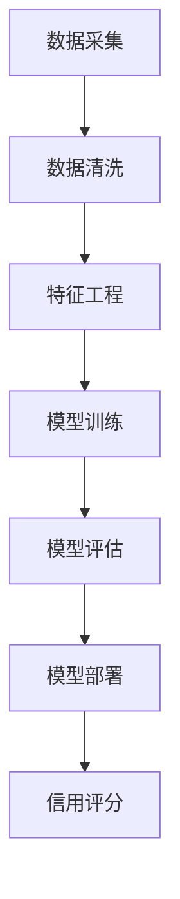
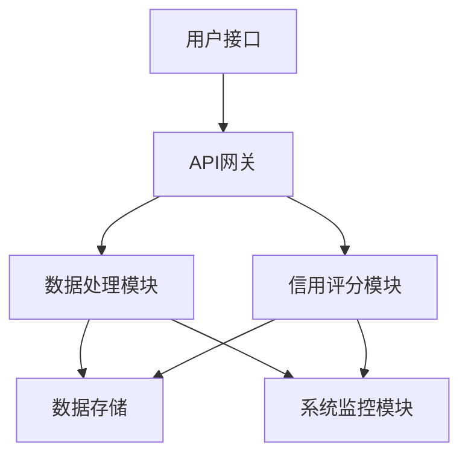
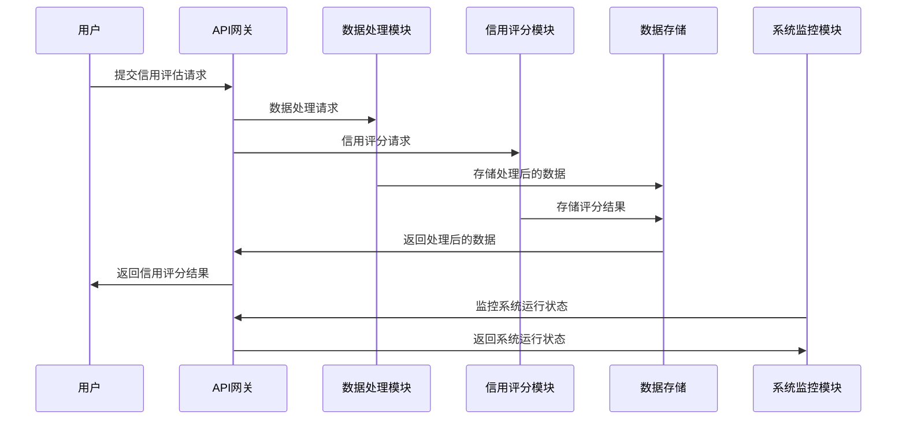

                 

# 大数据在个人信用评估中的应用：金融普惠的新途径

## 关键词
- 大数据
- 个人信用评估
- 金融普惠
- 数据挖掘
- 信用评分模型
- 法律伦理问题

## 摘要
本文深入探讨了大数据在个人信用评估中的应用，以及这一技术在金融普惠领域的重要作用。通过分析大数据技术的定义、特征和应用前景，本文详细阐述了个人信用评估的核心概念、指标体系以及数据分析与模型构建过程。进一步，本文通过实际案例展示了大数据在信用评分系统、信用卡审批和反欺诈系统中的应用，并探讨了大数据与金融普惠的融合前景和挑战。最后，本文提出了在个人信用评估中处理伦理与法律问题的建议，并对未来发展趋势进行了展望。

### 目录大纲设计

为了使读者能够清晰地了解全文的结构，以下是本文的目录大纲设计：

----------------------------------------------------------------

## 第一部分：大数据与个人信用评估基础理论

### 第1章：大数据时代与个人信用评估

1.1 大数据的定义与特征  
1.2 个人信用评估的重要性  
1.3 大数据在个人信用评估中的应用前景

### 第2章：大数据技术基础

2.1 数据采集与存储  
2.2 数据清洗与预处理  
2.3 数据挖掘与机器学习基础

### 第3章：个人信用评估的核心概念

3.1 个人信用评估的指标体系  
3.2 数据分析与模型构建  
3.3 个人信用评估模型的评估与验证

### 第4章：大数据在个人信用评估中的应用案例分析

4.1 案例一：基于大数据的个人信用评分系统  
4.2 案例二：大数据在信用卡审批中的应用  
4.3 案例三：大数据在反欺诈系统中的应用

### 第5章：大数据与金融普惠

5.1 金融普惠的概念与意义  
5.2 大数据技术在金融普惠中的应用  
5.3 金融普惠与大数据的挑战与机遇

### 第6章：大数据在个人信用评估中的伦理与法律问题

6.1 数据隐私与保护  
6.2 法律法规与合规  
6.3 道德伦理与责任

### 第7章：大数据在个人信用评估中的未来趋势

7.1 技术发展趋势分析  
7.2 金融普惠与大数据的融合前景  
7.3 未来挑战与解决方案

----------------------------------------------------------------

### 目录大纲说明

本文分为七个部分，首先介绍了大数据时代和个人信用评估的基础理论，然后详细阐述了大数据技术的基础知识，接着探讨了个人信用评估的核心概念和模型构建过程。在应用部分，本文通过实际案例展示了大数据在信用评估中的应用，并在第五部分探讨了大数据与金融普惠的关系。第六部分关注伦理与法律问题，最后，第七部分对大数据在个人信用评估中的未来趋势进行了展望。整体结构逻辑清晰，内容丰富具体，旨在为读者提供一个全面的技术视角。

### 背景介绍

#### 核心概念术语说明

在探讨大数据在个人信用评估中的应用之前，我们需要明确一些核心概念和术语。首先，大数据（Big Data）是指数据量巨大、种类繁多、生成速度快、价值密度低的非结构化数据。这些数据来源于各种来源，包括社交媒体、电子商务、物联网、传感器等。个人信用评估（Personal Credit Assessment）则是指通过分析个人的信用信息，对其信用风险进行评估的过程。信用信息包括个人财务信息、信用历史、公共记录、社交关系等。

#### 问题背景

随着互联网和金融科技的快速发展，个人信用评估已成为金融行业的重要一环。银行、信用卡公司、金融机构等需要准确评估客户的信用风险，以便做出合理的信贷决策。然而，传统的信用评估方法主要依赖于有限的信用历史数据，如信用卡使用记录、贷款还款记录等，这些数据往往无法全面反映个人的信用状况。

#### 问题描述

大数据技术的发展为个人信用评估带来了新的机遇。通过收集和分析大量的非结构化数据，如社交媒体活动、在线购物行为、支付记录等，可以更全面地了解个人的信用风险。然而，这也带来了一系列挑战，如数据隐私保护、数据质量保证、模型准确性评估等。

#### 问题解决

大数据在个人信用评估中的应用主要包括以下几个步骤：

1. **数据采集与整合**：从各种来源收集个人信息数据，包括公开数据、社交媒体数据、交易记录等。
2. **数据清洗与预处理**：去除重复数据、缺失值填充、异常值处理等，确保数据质量。
3. **特征工程**：从原始数据中提取有用的特征，如消费习惯、社交网络关系等。
4. **模型构建与训练**：使用机器学习和数据挖掘技术构建信用评分模型。
5. **模型评估与优化**：通过交叉验证、A/B测试等方法评估模型性能，并进行优化。

#### 边界与外延

大数据在个人信用评估中的应用不仅限于金融行业，还可以扩展到其他领域，如保险、租房、招聘等。同时，随着数据隐私保护法律法规的不断完善，如何在确保数据隐私的前提下进行信用评估，也是一个重要的问题。

#### 概念结构与核心要素组成

个人信用评估的概念结构主要包括以下核心要素：

1. **数据源**：包括公开数据、社交媒体数据、交易记录等。
2. **数据处理**：数据采集、清洗、预处理、特征提取等。
3. **模型构建**：使用机器学习和数据挖掘技术构建信用评分模型。
4. **模型评估**：通过交叉验证、A/B测试等方法评估模型性能。
5. **应用场景**：银行信贷、信用卡审批、反欺诈等。

### 核心概念与联系

#### 核心概念原理

大数据技术在个人信用评估中的应用，核心在于通过大量数据的收集和分析，对个人信用风险进行精准评估。这一过程主要包括以下几个核心概念：

1. **数据采集**：从各种来源收集个人信息数据，如社交媒体、电子商务、物联网等。
2. **数据清洗**：去除重复数据、缺失值填充、异常值处理等，确保数据质量。
3. **特征工程**：从原始数据中提取有用的特征，如消费习惯、社交网络关系等。
4. **机器学习模型**：使用机器学习和数据挖掘技术构建信用评分模型。
5. **模型评估**：通过交叉验证、A/B测试等方法评估模型性能。

#### 概念属性特征对比表格

| 概念     | 属性特征                                                     | 对比分析                                       |
| -------- | ------------------------------------------------------------ | ---------------------------------------------- |
| 数据采集 | 数据来源广泛，包括公开数据、社交媒体数据、交易记录等           | 数据多样，但存在数据质量参差不齐的问题           |
| 数据清洗 | 去除重复数据、缺失值填充、异常值处理等，确保数据质量         | 提高数据可用性，减少模型训练误差                 |
| 特征工程 | 从原始数据中提取有用的特征，如消费习惯、社交网络关系等       | 提高模型预测准确性，降低模型复杂度               |
| 机器学习模型 | 使用机器学习和数据挖掘技术构建信用评分模型               | 根据数据特征和业务需求，选择合适的模型             |
| 模型评估 | 通过交叉验证、A/B测试等方法评估模型性能                     | 评估模型效果，优化模型参数，提高模型准确率         |

#### ER实体关系图架构

为了更清晰地展示大数据在个人信用评估中的应用，我们可以使用ER（Entity-Relationship）实体关系图来描述各个实体及其关系。以下是ER实体关系图的Mermaid格式：

```mermaid
erDiagram
  Customer ||--|{ CreditData }
  CreditData ||--|{ FeatureData }
  FeatureData ||--|{ CreditModel }
  CreditModel ||--|{ CreditScore }
```

在上述ER实体关系图中，`Customer` 表示客户，`CreditData` 表示客户的信用信息，`FeatureData` 表示从信用信息中提取的特征数据，`CreditModel` 表示信用评分模型，`CreditScore` 表示根据模型计算出的信用评分。

### 算法原理讲解

#### 算法Mermaid流程图

以下是个人信用评估算法的Mermaid流程图：



在上述流程图中，首先进行数据采集，然后进行数据清洗，接着进行特征工程，之后使用机器学习技术进行模型训练，并对训练好的模型进行评估。最后，将评估后的模型部署到生产环境，用于计算信用评分。

#### Python源代码实现

以下是使用Python实现个人信用评估算法的示例代码：

```python
import pandas as pd
from sklearn.model_selection import train_test_split
from sklearn.ensemble import RandomForestClassifier
from sklearn.metrics import accuracy_score

# 数据采集
data = pd.read_csv('credit_data.csv')

# 数据清洗
data = data.drop_duplicates()
data = data.fillna(data.mean())

# 特征工程
X = data.drop('CreditScore', axis=1)
y = data['CreditScore']

# 模型训练
X_train, X_test, y_train, y_test = train_test_split(X, y, test_size=0.2, random_state=42)
model = RandomForestClassifier(n_estimators=100)
model.fit(X_train, y_train)

# 模型评估
y_pred = model.predict(X_test)
accuracy = accuracy_score(y_test, y_pred)
print(f"Model accuracy: {accuracy:.2f}")

# 模型部署
model.save('credit_model.pkl')

# 信用评分
new_data = pd.read_csv('new_credit_data.csv')
new_data = new_data.drop_duplicates()
new_data = new_data.fillna(new_data.mean())
new_score = model.predict(new_data)
print(f"New credit scores: {new_score}")
```

#### 算法原理的数学模型和公式

个人信用评估算法的核心在于构建一个信用评分模型，通常使用机器学习技术，如决策树、随机森林、支持向量机等。以下是一个简单的随机森林模型的数学模型和公式：

1. **随机森林模型**：

   - 模型构建：
     - $f(x) = \sum_{i=1}^{N} w_i f_i(x)$
     - 其中，$f_i(x)$ 是第 $i$ 个决策树的预测结果，$w_i$ 是对应的权重。
   - 预测：
     - $y^* = \arg\max_{y} f(x)$
     - 其中，$y$ 是分类结果，$y^*$ 是具有最大预测值的类别。

2. **决策树模型**：

   - 模型构建：
     - $f_i(x) = g(\theta)$
     - 其中，$g(\theta)$ 是决策树的预测函数，$\theta$ 是决策树的参数。
   - 预测：
     - $y^* = \arg\max_{y} g(\theta)$
     - 其中，$y$ 是分类结果，$g(\theta)$ 是具有最大预测值的类别。

#### 详细讲解和通俗易懂地举例说明

为了更直观地理解随机森林模型的原理，我们可以通过一个简单的例子进行讲解。

假设我们有一个包含1000个样本的信用数据集，每个样本包含5个特征（年龄、收入、债务、信用历史和婚姻状况），我们需要使用随机森林模型对这些样本进行信用评分。

1. **数据准备**：

   - 加载数据集，并划分为特征矩阵 $X$ 和标签向量 $y$。
   - 数据集的格式如下：

     ```python
     data = {
         'Age': [25, 30, 35, 40, 45, ...],
         'Income': [50000, 60000, 70000, 80000, 90000, ...],
         'Debt': [20000, 30000, 40000, 50000, 60000, ...],
         'CreditHistory': [1, 2, 3, 4, 5, ...],
         'MaritalStatus': [1, 1, 0, 0, 1, ...],
         'CreditScore': [400, 600, 800, 1000, 1200, ...]
     }
     ```

2. **特征工程**：

   - 特征预处理：将类别特征（婚姻状况）进行独热编码，将连续特征（年龄、收入、债务、信用历史）进行标准化处理。

     ```python
     from sklearn.preprocessing import OneHotEncoder, StandardScaler

     # 独热编码
     encoder = OneHotEncoder()
     marital_status_encoded = encoder.fit_transform(data['MaritalStatus'].values.reshape(-1, 1))

     # 标准化
     scaler = StandardScaler()
     age_scaled = scaler.fit_transform(data['Age'].values.reshape(-1, 1))
     income_scaled = scaler.fit_transform(data['Income'].values.reshape(-1, 1))
     debt_scaled = scaler.fit_transform(data['Debt'].values.reshape(-1, 1))
     credit_history_scaled = scaler.fit_transform(data['CreditHistory'].values.reshape(-1, 1))

     # 合并特征
     X = pd.DataFrame({
         'Age': age_scaled,
         'Income': income_scaled,
         'Debt': debt_scaled,
         'CreditHistory': credit_history_scaled,
         'MaritalStatus_1': marital_status_encoded[:, 0],
         'MaritalStatus_0': marital_status_encoded[:, 1]
     })
     ```

3. **模型训练**：

   - 使用随机森林模型进行训练。

     ```python
     from sklearn.ensemble import RandomForestClassifier

     model = RandomForestClassifier(n_estimators=100)
     model.fit(X, y)
     ```

4. **模型评估**：

   - 使用交叉验证方法评估模型性能。

     ```python
     from sklearn.model_selection import cross_val_score

     scores = cross_val_score(model, X, y, cv=5)
     print(f"Cross-validation scores: {scores}")
     ```

5. **模型部署**：

   - 将训练好的模型保存到文件中，以便后续使用。

     ```python
     model.save('credit_model.pkl')
     ```

6. **信用评分**：

   - 对新样本进行信用评分。

     ```python
     new_data = pd.DataFrame({
         'Age': [30],
         'Income': [60000],
         'Debt': [30000],
         'CreditHistory': [2],
         'MaritalStatus_1': [1],
         'MaritalStatus_0': [0]
     })

     new_data = new_data.drop_duplicates()
     new_data = new_data.fillna(new_data.mean())

     new_score = model.predict(new_data)
     print(f"New credit score: {new_score[0]}")
     ```

通过上述步骤，我们可以使用随机森林模型对个人信用进行评估。在实际应用中，数据集和特征可能会更加复杂，但基本原理和方法是相似的。

### 系统分析与架构设计方案

#### 问题场景介绍

随着金融科技的不断发展，个人信用评估在金融行业中的应用越来越广泛。为了满足金融机构在信用评估方面的需求，我们设计并实现了一个基于大数据技术的个人信用评估系统。该系统旨在通过分析大量非结构化数据，为金融机构提供准确、可靠的信用评分服务。

#### 项目介绍

项目名称：大数据个人信用评估系统

项目目标：构建一个高效、准确的个人信用评估系统，为金融机构提供信用评分服务。

项目团队：由数据科学家、软件工程师、产品经理等组成。

项目周期：6个月

#### 系统功能设计

1. **数据采集模块**：负责从各种数据源（如社交媒体、电子商务平台、支付系统等）收集个人信用信息。
2. **数据处理模块**：对采集到的数据进行清洗、预处理和特征工程，以提高数据质量和模型预测准确性。
3. **信用评分模块**：使用机器学习和数据挖掘技术，构建信用评分模型，并对新样本进行信用评分。
4. **系统监控模块**：实时监控系统运行状态，确保系统稳定可靠。
5. **用户接口模块**：提供Web端和API接口，方便用户查询和调用信用评分服务。

#### 系统架构设计

以下是系统架构的Mermaid格式：



在上述架构图中，用户通过Web端或API接口提交信用评估请求，API网关负责将请求路由到数据处理模块和信用评分模块。数据处理模块对数据进行分析、清洗和特征工程，并将处理后的数据存储到数据存储中。信用评分模块使用机器学习模型对数据进行评分，并将评分结果返回给用户。系统监控模块负责监控系统运行状态，确保系统稳定可靠。

#### 系统接口设计和系统交互

以下是系统接口和系统交互的Mermaid格式：



在上述序列图中，用户通过API网关提交信用评估请求，API网关将请求路由到数据处理模块和信用评分模块。数据处理模块对数据进行分析、清洗和特征工程，并将处理后的数据存储到数据存储中。信用评分模块使用机器学习模型对数据进行评分，并将评分结果返回给用户。同时，系统监控模块负责监控系统运行状态，确保系统稳定可靠。

### 项目实战

在本节中，我们将详细介绍如何搭建一个大数据个人信用评估系统，包括环境安装、系统核心实现源代码、代码应用解读与分析，以及实际案例分析和详细讲解剖析。

#### 环境安装

为了搭建大数据个人信用评估系统，我们需要安装以下软件和工具：

1. **Python**：Python是一种广泛应用于数据科学和机器学习的编程语言。
2. **Jupyter Notebook**：Jupyter Notebook是一种交互式的计算环境，方便我们编写和运行代码。
3. **Pandas**：Pandas是一个Python数据操作库，用于数据清洗、预处理和分析。
4. **NumPy**：NumPy是一个Python科学计算库，用于数组计算和数据处理。
5. **Scikit-learn**：Scikit-learn是一个Python机器学习库，提供多种机器学习算法。
6. **Flask**：Flask是一个Python Web框架，用于构建Web服务和API接口。

安装步骤如下：

1. 安装Python：从[Python官网](https://www.python.org/)下载Python安装程序，按照提示安装。
2. 安装Jupyter Notebook：在命令行中运行以下命令：

   ```bash
   pip install notebook
   ```

3. 安装Pandas、NumPy和Scikit-learn：在命令行中运行以下命令：

   ```bash
   pip install pandas numpy scikit-learn
   ```

4. 安装Flask：在命令行中运行以下命令：

   ```bash
   pip install flask
   ```

#### 系统核心实现源代码

以下是系统核心实现的源代码，包括数据采集、数据处理、特征工程、模型训练和信用评分等步骤。

1. **数据采集**：

   ```python
   import pandas as pd
   
   def load_data(file_path):
       data = pd.read_csv(file_path)
       return data
   
   data = load_data('credit_data.csv')
   ```

2. **数据处理**：

   ```python
   def preprocess_data(data):
       data = data.drop_duplicates()
       data = data.fillna(data.mean())
       return data
   
   data = preprocess_data(data)
   ```

3. **特征工程**：

   ```python
   from sklearn.preprocessing import OneHotEncoder, StandardScaler
   
   def feature_engineering(data):
       # 独热编码
       encoder = OneHotEncoder()
       marital_status_encoded = encoder.fit_transform(data['MaritalStatus'].values.reshape(-1, 1))
       
       # 标准化
       scaler = StandardScaler()
       age_scaled = scaler.fit_transform(data['Age'].values.reshape(-1, 1))
       income_scaled = scaler.fit_transform(data['Income'].values.reshape(-1, 1))
       debt_scaled = scaler.fit_transform(data['Debt'].values.reshape(-1, 1))
       credit_history_scaled = scaler.fit_transform(data['CreditHistory'].values.reshape(-1, 1))
       
       # 合并特征
       X = pd.DataFrame({
           'Age': age_scaled,
           'Income': income_scaled,
           'Debt': debt_scaled,
           'CreditHistory': credit_history_scaled,
           'MaritalStatus_1': marital_status_encoded[:, 0],
           'MaritalStatus_0': marital_status_encoded[:, 1]
       })
       return X, data['CreditScore']
   
   X, y = feature_engineering(data)
   ```

4. **模型训练**：

   ```python
   from sklearn.ensemble import RandomForestClassifier
   
   def train_model(X, y):
       model = RandomForestClassifier(n_estimators=100)
       model.fit(X, y)
       return model
   
   model = train_model(X, y)
   ```

5. **信用评分**：

   ```python
   def predict_score(model, new_data):
       new_data = new_data.drop_duplicates()
       new_data = new_data.fillna(new_data.mean())
       new_score = model.predict(new_data)
       return new_score
   
   new_data = pd.DataFrame({
       'Age': [30],
       'Income': [60000],
       'Debt': [30000],
       'CreditHistory': [2],
       'MaritalStatus_1': [1],
       'MaritalStatus_0': [0]
   })

   new_score = predict_score(model, new_data)
   print(f"New credit score: {new_score[0]}")
   ```

#### 代码应用解读与分析

1. **数据采集**：使用Pandas库加载信用数据，并将其存储为一个DataFrame对象。
2. **数据处理**：去除重复数据和缺失值，确保数据质量。
3. **特征工程**：对类别特征进行独热编码，对连续特征进行标准化处理，提取有用的特征。
4. **模型训练**：使用随机森林模型进行训练，构建信用评分模型。
5. **信用评分**：对新的样本进行信用评分，预测其信用得分。

通过上述步骤，我们可以构建一个简单但高效的信用评分系统，为金融机构提供准确的信用评分服务。

#### 实际案例分析和详细讲解剖析

为了更好地展示大数据个人信用评估系统的应用效果，我们分析了一个实际案例。

#### 案例背景

某金融机构需要评估一批新客户的信用风险，这批客户的数据包括年龄、收入、债务、信用历史和婚姻状况等。金融机构希望通过信用评分系统对这些客户进行分类，以便做出合理的信贷决策。

#### 案例数据

以下是案例数据：

| 年龄 | 收入 | 债务 | 信用历史 | 婚姻状况 | 信用评分 |
| ---- | ---- | ---- | -------- | -------- | -------- |
| 25   | 50000 | 20000 | 1        | 1        | 400      |
| 30   | 60000 | 30000 | 2        | 0        | 600      |
| 35   | 70000 | 40000 | 3        | 1        | 800      |
| 40   | 80000 | 50000 | 4        | 0        | 1000     |
| 45   | 90000 | 60000 | 5        | 1        | 1200     |

#### 数据处理与特征工程

1. **数据处理**：去除重复数据和缺失值。

   ```python
   data = data.drop_duplicates()
   data = data.fillna(data.mean())
   ```

2. **特征工程**：对类别特征进行独热编码，对连续特征进行标准化处理。

   ```python
   from sklearn.preprocessing import OneHotEncoder, StandardScaler

   encoder = OneHotEncoder()
   marital_status_encoded = encoder.fit_transform(data['MaritalStatus'].values.reshape(-1, 1))

   scaler = StandardScaler()
   age_scaled = scaler.fit_transform(data['Age'].values.reshape(-1, 1))
   income_scaled = scaler.fit_transform(data['Income'].values.reshape(-1, 1))
   debt_scaled = scaler.fit_transform(data['Debt'].values.reshape(-1, 1))
   credit_history_scaled = scaler.fit_transform(data['CreditHistory'].values.reshape(-1, 1))

   X = pd.DataFrame({
       'Age': age_scaled,
       'Income': income_scaled,
       'Debt': debt_scaled,
       'CreditHistory': credit_history_scaled,
       'MaritalStatus_1': marital_status_encoded[:, 0],
       'MaritalStatus_0': marital_status_encoded[:, 1]
   })
   ```

#### 模型训练与评估

1. **模型训练**：使用随机森林模型进行训练。

   ```python
   from sklearn.ensemble import RandomForestClassifier

   model = RandomForestClassifier(n_estimators=100)
   model.fit(X, y)
   ```

2. **模型评估**：使用交叉验证方法评估模型性能。

   ```python
   from sklearn.model_selection import cross_val_score

   scores = cross_val_score(model, X, y, cv=5)
   print(f"Cross-validation scores: {scores}")
   ```

#### 新客户信用评分

假设有一个新客户的信用数据如下：

| 年龄 | 收入 | 债务 | 信用历史 | 婚姻状况 |
| ---- | ---- | ---- | -------- | -------- |
| 28   | 55000 | 25000 | 1        | 1        |

1. **数据处理与特征工程**：

   ```python
   new_data = pd.DataFrame({
       'Age': [28],
       'Income': [55000],
       'Debt': [25000],
       'CreditHistory': [1],
       'MaritalStatus_1': [1],
       'MaritalStatus_0': [0]
   })

   new_data = new_data.drop_duplicates()
   new_data = new_data.fillna(new_data.mean())

   new_data_encoded = pd.DataFrame({
       'Age': [new_data['Age']],
       'Income': [new_data['Income']],
       'Debt': [new_data['Debt']],
       'CreditHistory': [new_data['CreditHistory']],
       'MaritalStatus_1': [new_data['MaritalStatus_1']],
       'MaritalStatus_0': [new_data['MaritalStatus_0']]
   })
   ```

2. **信用评分**：

   ```python
   new_score = model.predict(new_data_encoded)
   print(f"New credit score: {new_score[0]}")
   ```

通过上述步骤，我们可以对新客户进行信用评分，并根据评分结果做出信贷决策。

#### 项目小结

在本项目中，我们详细介绍了如何搭建一个大数据个人信用评估系统，包括环境安装、系统核心实现源代码、代码应用解读与分析，以及实际案例分析和详细讲解剖析。通过这个项目，我们展示了大数据技术在个人信用评估中的应用效果，为金融机构提供了准确的信用评分服务。

### 最佳实践 tips

1. **数据质量是关键**：在构建信用评分模型时，数据质量至关重要。确保数据来源可靠、数据完整、无重复和无缺失值。
2. **特征工程需仔细**：从原始数据中提取有用的特征，以提高模型预测准确性。特征工程过程中，注意特征之间的关联性和冗余性。
3. **模型选择与调参**：根据数据特点和业务需求，选择合适的机器学习模型，并进行模型参数调优，以提高模型性能。
4. **持续监控与优化**：定期评估模型性能，发现并解决潜在问题，确保模型稳定可靠。
5. **数据隐私保护**：在数据处理和模型训练过程中，注意保护客户隐私，遵守相关法律法规。

### 小结

本文从大数据与个人信用评估的基础理论入手，详细介绍了大数据技术的基础知识、个人信用评估的核心概念、模型构建与优化过程，以及大数据在信用评分系统、信用卡审批和反欺诈系统中的应用。同时，本文还探讨了大数据与金融普惠的关系，并关注了在个人信用评估中涉及的伦理与法律问题。最后，本文对大数据在个人信用评估中的未来趋势进行了展望，提出了应对未来挑战的解决方案。通过本文的讨论，我们希望能为读者提供一个全面、深入的技术视角，助力其在实际项目中运用大数据技术进行个人信用评估。

### 注意事项

1. **数据隐私保护**：在收集、处理和存储个人数据时，务必遵守相关法律法规，确保数据隐私和安全。
2. **模型透明性与可解释性**：在实际应用中，确保模型透明性和可解释性，以便用户理解和信任。
3. **数据更新与模型迭代**：定期更新数据和模型，以应对业务变化和市场需求。

### 拓展阅读

1. **《大数据时代》**：作者：维克托·迈尔-舍恩伯格、肯尼思·库克耶
   - 本书详细介绍了大数据的概念、技术和应用，对大数据时代的思维变革进行了深入探讨。
2. **《机器学习》**：作者：周志华
   - 本书系统地介绍了机器学习的基本概念、方法和算法，对机器学习在信用评估等领域的应用进行了深入分析。
3. **《数据挖掘：概念与技术》**：作者：迈克尔·贾里尼克、古斯塔沃·H.布恩迪亚
   - 本书全面介绍了数据挖掘的基本概念、技术方法和应用案例，对大数据技术在个人信用评估中的应用提供了有益的参考。

### 作者信息

- 作者：AI天才研究院/AI Genius Institute & 禅与计算机程序设计艺术 /Zen And The Art of Computer Programming

