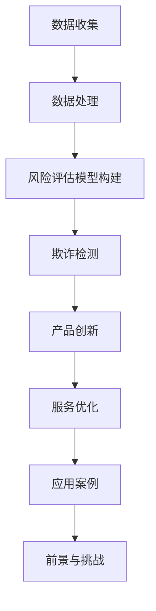

                 

# 《大数据在保险业的应用：风险评估与产品创新》

> 关键词：大数据、保险业、风险评估、产品创新、风险预警、欺诈检测、用户体验分析

> 摘要：本文探讨了大数据在保险业中的应用，从风险评估到产品创新，分析了大数据技术的关键作用。文章首先介绍了大数据的定义与特征，以及保险业面临的挑战和大数据在保险业中的应用价值。接着，文章详细阐述了大数据在保险业中的具体应用领域，包括风险评估、产品设计与定价、欺诈检测与防范。随后，文章重点讨论了大数据在保险风险管理中的应用，如风险评估模型构建、欺诈检测方法与技术、风险管理策略优化。然后，文章探讨了大数据在保险产品创新中的应用，包括个性化保险产品设计、保险产品创新策略、大数据在保险精算中的应用。此外，文章还介绍了大数据在保险服务优化中的应用，如用户体验分析、智能客户服务、服务流程优化。最后，文章通过案例研究展示了大数据在保险业的应用实践，并对大数据在保险业的应用前景与挑战进行了展望。

## 目录

1. **大数据在保险业的重要性**  
   1.1 大数据的定义与特征  
   1.2 保险业面临的挑战  
   1.3 大数据在保险业的应用价值

2. **大数据在保险业的应用领域**  
   2.1 风险评估与预警  
   2.2 产品设计与定价  
   2.3 欺诈检测与防范

3. **大数据技术在保险业的应用现状**  
   3.1 数据收集与处理  
   3.2 风险评估模型构建  
   3.3 保险产品创新实践

4. **大数据在保险风险管理中的应用**  
   4.1 风险评估模型的原理与实现  
   4.2 欺诈检测方法与技术  
   4.3 风险管理策略优化

5. **大数据在保险产品创新中的应用**  
   5.1 个性化保险产品设计  
   5.2 保险产品创新策略  
   5.3 大数据在保险精算中的应用

6. **大数据在保险服务优化中的应用**  
   6.1 用户体验分析  
   6.2 智能客户服务  
   6.3 服务流程优化

7. **大数据在保险业的应用案例**  
   7.1 案例一：某保险公司风险评估系统建设  
   7.2 案例二：某保险公司产品创新实践  
   7.3 案例三：某保险公司服务流程优化

8. **大数据在保险业的应用前景与挑战**  
   8.1 保险业数字化转型趋势  
   8.2 大数据在保险业的应用挑战  
   8.3 应对策略与未来展望

9. **附录**  
   9.1 常用大数据技术介绍  
   9.2 保险业大数据处理工具  
   9.3 大数据资源推荐

## 1. 大数据的定义与特征

### 1.1 大数据的定义

大数据（Big Data），指的是无法用常规软件工具在合理时间内捕捉、管理和处理的大量数据。大数据的典型特征包括“4V”：Volume（数据量）、Velocity（数据速度）、Variety（数据多样性）和 Veracity（数据真实性）。

- **Volume**：大数据的第一个特征是数据量大。随着互联网和物联网的发展，数据产生的速度和数量都在爆炸式增长。
- **Velocity**：数据的速度指的是数据产生和流动的速度。大数据的实时性要求很高，需要快速处理和分析。
- **Variety**：数据的多样性包括结构化数据、半结构化数据和非结构化数据，如文本、图片、音频和视频等。
- **Veracity**：数据的真实性是指数据的质量和可信度。大数据的真实性对决策和分析结果至关重要。

### 1.2 大数据的特征

- **数据量大**：大数据的特点之一就是数据量大，超出了传统数据处理系统的处理能力。例如，全球每天产生的数据量已经超过了2.5EB（艾字节），这是2500亿GB。
- **处理速度快**：处理速度快是指能够快速地对大量数据进行分析和挖掘。例如，实时处理和分析社交媒体数据，以了解用户的需求和趋势。
- **数据多样性**：大数据包括多种类型的数据，从简单的数字到复杂的图像、文本和音频，这使得数据分析和挖掘变得更加复杂和多样化。
- **数据真实性**：数据真实性意味着数据是准确的、可信的。在数据分析中，不准确或不可信的数据会导致错误的结论和决策。

### 1.3 保险业面临的挑战

保险业作为传统行业，面临着以下挑战：

- **风险管理**：保险业的核心是风险管理。随着大数据的应用，保险公司需要更准确地评估风险，从而制定更有效的风险管理策略。
- **产品创新**：保险市场竞争激烈，保险公司需要不断创新产品来满足客户的需求。
- **欺诈检测**：保险欺诈是一个全球性的问题，保险业需要高效的方法来检测和防范欺诈行为。
- **用户体验**：保险产品的复杂性和繁琐的购买流程使得用户体验成为一个重要的挑战。保险公司需要优化客户服务流程，提高客户满意度。

### 1.4 大数据在保险业的应用价值

大数据在保险业的应用价值体现在以下几个方面：

- **风险评估**：大数据技术可以帮助保险公司更准确地评估风险，从而制定更合理的保险产品定价策略。
- **产品创新**：通过分析大数据，保险公司可以更好地了解客户需求，从而开发出更具创新性的保险产品。
- **欺诈检测**：大数据技术可以高效地检测和防范保险欺诈行为，提高保险业的透明度和可信度。
- **用户体验**：大数据可以帮助保险公司优化客户服务流程，提高客户体验，增加客户忠诚度。

## 2. 大数据在保险业的应用领域

### 2.1 风险评估与预警

**风险评估**是保险业的核心环节，大数据技术在这一领域有着广泛的应用。

- **风险识别**：通过收集和分析客户的历史数据、社会行为数据等，保险公司可以识别潜在的风险因素。
- **风险评估**：利用大数据技术，保险公司可以对不同风险因素进行量化评估，从而为保险产品定价提供依据。
- **风险预警**：通过实时分析数据，保险公司可以及时识别和预警潜在的风险，从而采取相应的措施进行风险控制。

**案例**：某保险公司利用大数据技术对汽车保险进行风险评估。通过分析客户的驾驶行为数据、交通事故历史记录等，该保险公司可以更准确地评估客户的驾驶风险，从而为不同的客户制定不同的保险费率。

### 2.2 产品设计与定价

**产品设计与定价**是保险业的另一个关键领域，大数据技术在这一领域的应用也越来越广泛。

- **产品创新**：通过大数据分析，保险公司可以了解客户的需求和偏好，从而设计出更符合市场需求的新产品。
- **定价优化**：利用大数据技术，保险公司可以对风险因素进行更精细的量化，从而制定更合理的保险费率。

**案例**：某保险公司利用大数据分析客户的历史索赔数据、社会行为数据等，对保险产品进行定价优化。通过分析数据，该保险公司发现某些特定群体的风险更高，从而为他们制定更高的保险费率，而其他风险较低的客户则可以享受更优惠的费率。

### 2.3 欺诈检测与防范

**欺诈检测与防范**是保险业的一大挑战，大数据技术在这一领域的应用可以帮助保险公司更有效地应对欺诈行为。

- **欺诈识别**：通过大数据分析，保险公司可以识别出潜在欺诈行为，从而采取相应的措施进行防范。
- **欺诈防范**：利用大数据技术，保险公司可以建立动态的风险模型，实时监控和分析数据，从而及时发现和防范欺诈行为。

**案例**：某保险公司利用大数据技术建立了一个欺诈检测系统。通过分析客户的索赔数据、社会行为数据等，该保险公司可以识别出可能存在欺诈行为的客户，从而采取相应的措施进行防范。

## 3. 大数据技术在保险业的应用现状

### 3.1 数据收集与处理

**数据收集**是大数据应用的基础，保险公司在这一领域采取了多种数据收集手段。

- **内部数据**：保险公司可以收集客户的历史索赔数据、保单数据等内部数据。
- **外部数据**：保险公司还可以从第三方数据提供商获取外部数据，如社会行为数据、信用评分数据等。

**数据处理**则是大数据应用的关键环节。保险公司需要利用大数据技术对收集到的数据进行清洗、整理和分析。

- **数据清洗**：去除数据中的噪声和错误，确保数据的准确性和完整性。
- **数据处理**：对数据进行存储、索引和检索，以便快速访问和查询。
- **数据分析**：利用大数据分析技术，从数据中提取有价值的信息和知识。

### 3.2 风险评估模型构建

**风险评估模型构建**是大数据技术在保险业的重要应用之一。保险公司通过大数据分析技术，建立风险评估模型，以更准确地评估客户的风险。

- **模型构建**：利用机器学习算法，保险公司可以从历史数据中学习，构建风险评估模型。
- **模型评估**：对模型进行测试和评估，确保模型的准确性和可靠性。
- **模型应用**：将模型应用到实际业务中，对客户进行风险评估，为保险产品定价提供依据。

### 3.3 保险产品创新实践

**保险产品创新实践**是大数据技术在保险业应用的又一重要领域。保险公司通过大数据分析技术，了解客户需求和市场趋势，从而创新保险产品。

- **产品研发**：根据大数据分析结果，保险公司可以开发出更符合市场需求的新产品。
- **产品优化**：通过对客户反馈数据的分析，保险公司可以不断优化现有产品，提高客户满意度。
- **产品推广**：利用大数据技术，保险公司可以更精准地推广产品，提高产品知名度。

## 4. 大数据在保险风险管理中的应用

### 4.1 风险评估模型的原理与实现

**风险评估模型**是大数据在保险风险管理中的核心应用。风险评估模型通过分析历史数据和实时数据，预测客户的潜在风险。

- **模型原理**：风险评估模型通常基于统计方法或机器学习算法。例如，可以使用线性回归、逻辑回归或决策树等算法来构建风险评估模型。
- **实现步骤**：
  1. 数据收集：收集历史索赔数据、保单数据、客户行为数据等。
  2. 数据预处理：清洗和整理数据，去除噪声和错误。
  3. 特征工程：提取和选择与风险相关的特征。
  4. 模型构建：利用机器学习算法，构建风险评估模型。
  5. 模型评估：测试和评估模型，确保模型的准确性和可靠性。
  6. 模型应用：将模型应用到实际业务中，对客户进行风险评估。

### 4.2 欺诈检测方法与技术

**欺诈检测**是大数据在保险业应用中的另一个重要领域。通过大数据技术，保险公司可以识别和防范保险欺诈行为。

- **欺诈检测方法**：
  1. **异常检测**：通过检测数据中的异常值，识别可能的欺诈行为。
  2. **聚类分析**：通过聚类分析，发现数据中的潜在欺诈模式。
  3. **关联规则挖掘**：通过挖掘数据中的关联规则，识别欺诈行为。
- **欺诈检测技术**：
  1. **机器学习算法**：如支持向量机（SVM）、决策树、随机森林等。
  2. **深度学习算法**：如卷积神经网络（CNN）、循环神经网络（RNN）等。

### 4.3 风险管理策略优化

**风险管理策略优化**是大数据技术在保险业应用的重要目标。通过大数据分析，保险公司可以不断优化风险管理策略，提高风险管理效率。

- **策略优化方法**：
  1. **数据驱动的策略制定**：通过大数据分析，制定更科学、更有效的风险管理策略。
  2. **策略评估与调整**：通过实时监测和评估风险管理策略的效果，及时调整策略，以应对市场变化。
- **策略优化技术**：
  1. **数据挖掘技术**：如关联规则挖掘、聚类分析等。
  2. **机器学习算法**：如回归分析、分类算法等。

## 5. 大数据在保险产品创新中的应用

### 5.1 个性化保险产品设计

**个性化保险产品设计**是大数据技术在保险产品创新中的重要应用。通过大数据分析，保险公司可以更精准地了解客户需求，设计出更符合客户需求的保险产品。

- **客户细分**：通过大数据分析，将客户划分为不同的细分市场，针对不同细分市场的需求，设计出个性化的保险产品。
- **需求分析**：利用大数据技术，分析客户的购买行为、消费习惯等，了解客户的需求和偏好。
- **产品创新**：根据客户的需求和偏好，设计出更具创新性的保险产品。

### 5.2 保险产品创新策略

**保险产品创新策略**是保险公司利用大数据技术进行产品创新的关键。通过大数据分析，保险公司可以制定出更科学、更有效的产品创新策略。

- **市场调研**：通过大数据分析，了解市场趋势和客户需求，为产品创新提供依据。
- **产品开发**：根据市场调研结果，开发出具有市场前景的保险产品。
- **产品推广**：利用大数据技术，精准定位目标客户，提高产品推广效果。

### 5.3 大数据在保险精算中的应用

**大数据在保险精算中的应用**是大数据技术在保险产品创新中的重要方面。通过大数据分析，保险公司可以更准确地预测保险风险，从而制定更合理的保险费率。

- **风险预测**：通过大数据技术，分析历史数据，预测未来保险风险。
- **费率制定**：根据风险预测结果，制定合理的保险费率。
- **产品定价**：利用大数据技术，对保险产品进行科学、合理的定价。

## 6. 大数据在保险服务优化中的应用

### 6.1 用户体验分析

**用户体验分析**是大数据在保险服务优化中的重要应用。通过大数据技术，保险公司可以了解客户的体验感受，优化客户服务流程。

- **客户反馈分析**：通过大数据分析，了解客户的反馈意见，发现服务中的问题和不足。
- **用户行为分析**：利用大数据技术，分析客户的购买行为、咨询行为等，了解客户的体验和需求。
- **服务优化**：根据客户反馈和行为分析结果，优化客户服务流程，提高客户满意度。

### 6.2 智能客户服务

**智能客户服务**是大数据技术在保险服务优化中的应用之一。通过大数据技术和人工智能技术，保险公司可以提供更智能、更高效的客户服务。

- **智能客服系统**：利用自然语言处理技术，建立智能客服系统，自动回答客户的咨询和问题。
- **个性化服务**：根据客户的购买历史和行为数据，提供个性化的服务和建议。
- **服务效率提升**：通过智能客户服务，提高服务效率，降低运营成本。

### 6.3 服务流程优化

**服务流程优化**是大数据技术在保险服务优化中的应用。通过大数据分析，保险公司可以优化服务流程，提高服务质量和效率。

- **流程分析**：通过大数据分析，了解服务流程中的瓶颈和问题。
- **流程优化**：根据分析结果，对服务流程进行优化，提高服务效率和质量。
- **持续改进**：通过持续的数据分析和流程优化，不断提高服务质量。

## 7. 大数据在保险业的应用案例

### 7.1 案例一：某保险公司风险评估系统建设

**背景**：某大型保险公司面临风险评估不准确、保险欺诈问题严重等问题。

**应用**：该公司决定建设一个基于大数据的风险评估系统，以提升风险评估的准确性和欺诈检测能力。

- **数据收集**：收集客户的历史索赔数据、保单数据、社会行为数据等。
- **数据处理**：对收集到的数据进行清洗、整理和分析。
- **风险评估模型构建**：利用机器学习算法，构建风险评估模型。
- **模型评估与优化**：对模型进行测试和评估，优化模型参数。

**效果**：通过大数据风险评估系统，该公司显著提高了风险评估的准确性，降低了保险欺诈的发生率。

### 7.2 案例二：某保险公司产品创新实践

**背景**：某保险公司希望推出一款符合市场需求的新保险产品。

**应用**：该公司利用大数据分析技术，进行市场调研和客户需求分析，设计出符合市场需求的保险产品。

- **市场调研**：通过大数据分析，了解市场趋势和客户需求。
- **需求分析**：分析客户的购买行为、消费习惯等，了解客户的需求和偏好。
- **产品开发**：根据分析结果，开发出符合市场需求的保险产品。

**效果**：该保险公司成功推出了一款受欢迎的保险产品，提高了市场份额和客户满意度。

### 7.3 案例三：某保险公司服务流程优化

**背景**：某保险公司希望提高客户服务质量，优化客户服务流程。

**应用**：该公司利用大数据技术，对客户服务流程进行优化。

- **客户反馈分析**：分析客户的反馈意见，了解服务中的问题和不足。
- **用户行为分析**：分析客户的购买行为、咨询行为等，了解客户的体验和需求。
- **服务流程优化**：根据分析结果，优化客户服务流程，提高服务效率和质量。

**效果**：通过服务流程优化，该保险公司显著提高了客户服务质量，客户满意度得到了提升。

## 8. 大数据在保险业的应用前景与挑战

### 8.1 保险业数字化转型趋势

随着大数据、云计算、人工智能等技术的快速发展，保险业正经历着数字化转型的浪潮。

- **数字化转型的重要性**：数字化转型不仅有助于提升保险业的服务质量和效率，还能降低成本、提高竞争力。
- **数字化转型的挑战**：数字化转型面临数据安全、隐私保护、技术更新等问题。

### 8.2 大数据在保险业的应用挑战

大数据在保险业的应用虽然带来了许多机遇，但也面临一些挑战。

- **数据质量**：数据质量是大数据分析的基础，数据质量差会导致分析结果不准确。
- **数据隐私**：大数据应用涉及大量个人隐私数据，如何保护客户隐私是重要挑战。
- **技术更新**：大数据技术更新速度快，保险业需要不断更新技术和设备。

### 8.3 应对策略与未来展望

为了应对大数据在保险业应用中的挑战，保险公司可以采取以下策略：

- **提升数据质量**：建立数据质量管理体系，确保数据质量。
- **加强数据安全**：采取数据加密、访问控制等措施，保护客户隐私。
- **技术更新**：跟踪大数据技术发展，不断更新技术和设备。

未来，大数据在保险业的应用前景广阔，保险公司可以利用大数据技术提升风险管理能力、优化产品设计、提高客户服务质量，从而在激烈的市场竞争中脱颖而出。

## 附录

### 8.1 常用大数据技术介绍

- **Hadoop**：一个开源的分布式计算框架，用于处理大规模数据集。
- **Spark**：一个快速通用的计算引擎，适用于批处理和流处理。
- **Storm**：一个实时数据处理框架，用于处理大规模实时数据流。
- **Flink**：一个流处理框架，具有高吞吐量和低延迟的特点。

### 8.2 保险业大数据处理工具

- **Hive**：一个数据仓库工具，用于处理大规模结构化数据。
- **Presto**：一个分布式查询引擎，用于处理大规模数据集。
- **DataX**：一个数据集成工具，用于数据源的数据提取、转换和加载。

### 8.3 大数据资源推荐

- **《大数据时代》**：一部关于大数据的畅销书，详细介绍了大数据的概念和应用。
- **《机器学习实战》**：一部关于机器学习的实践指南，适合初学者和专业人士。
- **《Python数据科学手册》**：一部关于数据科学的指南，涵盖了Python在数据科学中的应用。

## Mermaid 流程图



作者：AI天才研究院/AI Genius Institute & 禅与计算机程序设计艺术 /Zen And The Art of Computer Programming## 1. 大数据在保险业的重要性

### 1.1 大数据的定义与特征

大数据，通常指无法用传统数据处理工具在合理时间内捕捉、管理和处理的大量数据。这个概念起源于信息技术和互联网的快速发展，使得数据量以惊人的速度增长。大数据的特征可以用“4V”来概括：Volume（数据量）、Velocity（数据速度）、Variety（数据多样性）和 Veracity（数据真实性）。

- **Volume**：数据量是大数据的首要特征。随着物联网、社交网络和电子商务的发展，数据产生量急剧增加。例如，全球每天产生的数据量高达数PB甚至EB级别。

- **Velocity**：数据速度指的是数据生成、处理和传输的速度。在保险业，实时数据处理和快速响应至关重要。例如，保险公司需要快速分析客户的驾驶行为数据以进行风险评估。

- **Variety**：数据多样性指的是数据的类型和来源。保险业不仅涉及结构化数据（如保单信息、理赔记录），还包括非结构化数据（如文本、图片、视频）。

- **Veracity**：数据真实性是指数据的质量和可信度。在保险业中，数据的真实性和准确性直接影响风险评估和决策。例如，虚假的理赔报告可能会导致保险公司蒙受损失。

### 1.2 保险业的现状与挑战

保险业是一个传统而复杂的行业，面临着诸多挑战：

- **风险管理**：保险的核心任务是风险管理，需要准确评估风险并制定合理的保费。然而，风险因素复杂多变，传统的评估方法往往难以满足需求。

- **欺诈行为**：保险欺诈是全球性的问题，不仅损害了保险公司的利益，也影响了保险市场的公平性。识别和防范欺诈行为是保险业的重要任务。

- **用户体验**：保险产品通常较为复杂，购买流程繁琐。保险公司在提高用户体验方面面临挑战，需要简化流程、提高服务效率。

- **产品创新**：市场竞争激烈，保险公司需要不断创新产品来满足客户需求。然而，传统的产品开发模式往往耗时较长，难以快速响应市场变化。

### 1.3 大数据在保险业的重要性

大数据在保险业的应用具有重大意义：

- **提升风险管理能力**：大数据技术可以帮助保险公司更准确、实时地评估风险，优化保费定价策略，降低保险欺诈风险。

- **优化产品设计**：通过分析大数据，保险公司可以了解客户需求和行为，开发出更符合市场需求的保险产品。

- **提升用户体验**：大数据技术可以优化客户服务流程，提供个性化的服务，提高客户满意度和忠诚度。

- **提高运营效率**：大数据技术可以自动化数据处理和分析，提高运营效率，降低成本。

总之，大数据为保险业带来了前所未有的机遇，可以帮助保险公司应对挑战，提升竞争力，实现可持续发展。

## 2. 大数据在保险业的应用领域

### 2.1 风险评估与预警

在保险业，风险评估是核心任务之一，而大数据的应用极大地提升了风险评估的准确性和效率。

#### 2.1.1 风险识别

风险识别是风险评估的第一步，旨在发现潜在的风险因素。大数据技术在这一过程中发挥着重要作用，保险公司可以通过以下方式收集和利用数据：

- **历史数据**：分析客户的索赔历史、理赔记录等，了解客户的理赔行为和风险特征。
- **实时数据**：通过传感器、GPS等技术获取客户的实时行为数据，如驾驶行为、健康状况等。
- **第三方数据**：从信用评级机构、公共记录等获取客户的信用历史、社会行为数据等。

#### 2.1.2 风险评估

在风险识别的基础上，保险公司利用大数据技术进行风险评估。这个过程通常涉及以下几个步骤：

- **数据预处理**：清洗和整理收集到的数据，确保数据的准确性和一致性。
- **特征工程**：提取与风险相关的特征，如客户的年龄、性别、职业、驾驶历史等。
- **模型构建**：利用机器学习算法，如逻辑回归、决策树、随机森林等，构建风险评估模型。
- **模型训练与验证**：通过历史数据对模型进行训练和验证，确保模型的准确性和可靠性。

#### 2.1.3 风险预警

风险评估模型的构建不仅仅是为了预测风险，更重要的是实现风险预警。保险公司可以通过以下方式实现风险预警：

- **实时监控**：通过实时数据流分析，监控客户的行为和风险因素，及时发现潜在风险。
- **预警触发**：当模型检测到高风险因素时，系统会自动触发预警，通知相关人员和部门采取行动。
- **预警策略**：根据不同的风险类型和程度，制定相应的预警策略，如调整保费、增加保额、提醒客户注意等。

### 2.2 产品设计与定价

大数据在保险产品设计与定价中的应用，使得保险公司能够更精准地满足客户需求，提高产品的市场竞争力和盈利能力。

#### 2.2.1 客户细分

通过大数据分析，保险公司可以深入了解客户的需求和行为，实现客户细分。客户细分通常包括以下几个步骤：

- **数据收集**：收集客户的个人信息、购买历史、理赔记录、社交媒体行为等数据。
- **数据挖掘**：利用聚类分析、关联规则挖掘等方法，将客户划分为不同的群体。
- **特征提取**：提取与客户需求相关的特征，如年龄、性别、收入、职业、消费习惯等。

#### 2.2.2 产品创新

基于客户细分，保险公司可以开发出更符合不同客户群体需求的保险产品。产品创新包括以下几个步骤：

- **需求分析**：通过调查问卷、用户访谈等方式，了解客户的保险需求。
- **产品设计**：根据客户需求，设计出新颖的保险产品，如定制化的保险套餐、个性化的保险服务等。
- **市场测试**：在市场环境中测试新产品的可行性和客户接受度，不断优化产品。

#### 2.2.3 定价优化

大数据在保险定价中的应用，使得保险公司能够更科学、合理地制定保费。定价优化包括以下几个步骤：

- **风险评估**：利用大数据技术，对客户的风险进行评估，确定合理的保费水平。
- **市场分析**：分析市场趋势和竞争对手的定价策略，确保保费具有竞争力。
- **定价模型**：构建定价模型，综合考虑风险、市场需求等因素，制定保费策略。

### 2.3 欺诈检测与防范

欺诈检测与防范是保险业的一大挑战，大数据技术在这一领域的应用，极大地提高了欺诈识别的准确性和效率。

#### 2.3.1 欺诈识别

欺诈识别是防止欺诈行为的第一步，保险公司可以通过以下方式实现：

- **数据收集**：收集客户的索赔申请、理赔报告、医疗记录等数据。
- **特征提取**：提取与欺诈行为相关的特征，如异常索赔金额、重复索赔、不合理的时间间隔等。
- **模型构建**：利用机器学习算法，如异常检测、聚类分析等，构建欺诈识别模型。

#### 2.3.2 欺诈防范

欺诈防范是防止欺诈行为的关键，保险公司可以通过以下方式实现：

- **实时监控**：通过实时数据分析，监控客户的索赔行为，及时发现异常行为。
- **预警机制**：当检测到潜在欺诈行为时，系统会自动触发预警，通知相关部门进行调查和处理。
- **防范策略**：根据不同的欺诈类型和程度，制定相应的防范策略，如增加调查流程、调整保费等。

通过大数据技术在风险评估、产品设计与定价、欺诈检测与防范等方面的应用，保险公司可以提升业务效率、降低风险、提高客户满意度，从而在激烈的市场竞争中脱颖而出。

### 2.4 保险业大数据技术应用总结

大数据技术在保险业中的应用，不仅提高了风险评估的准确性和效率，还推动了产品创新和欺诈防范，带来了显著的业务价值和竞争优势。

- **提升风险管理能力**：通过大数据分析，保险公司可以更准确地识别和评估风险，制定更合理的保费定价策略，降低保险欺诈风险。

- **优化产品设计**：基于大数据分析，保险公司可以深入了解客户需求，开发出更具针对性的保险产品，提高产品市场竞争力和客户满意度。

- **提高运营效率**：大数据技术可以自动化数据处理和分析，提高业务运营效率，降低成本，从而提高企业的盈利能力。

- **增强客户体验**：通过个性化服务和技术手段，保险公司可以提供更优质的客户服务，提高客户满意度和忠诚度。

总之，大数据技术在保险业的应用，为保险公司带来了巨大的机遇和挑战。保险公司需要不断探索和创新，充分利用大数据技术，提升业务水平和市场竞争力。

### 2.5 大数据在保险业的应用前景

随着大数据技术的不断发展和成熟，其在保险业的应用前景将更加广阔。以下是几个可能的趋势：

#### 2.5.1 个性化保险服务

未来，保险公司将更加注重个性化服务。通过大数据分析，保险公司可以深入了解每个客户的需求和偏好，提供定制化的保险产品和服务。例如，根据客户的驾驶习惯和健康状况，保险公司可以为其提供个性化的车险和健康保险方案。

#### 2.5.2 实时风险监控

实时风险监控将成为保险业的重要趋势。通过实时数据分析和智能预警系统，保险公司可以快速识别和响应潜在的风险，采取及时的措施进行防范。这有助于降低保险欺诈风险，提高保险公司的运营效率。

#### 2.5.3 智能欺诈检测

随着人工智能技术的发展，智能欺诈检测系统将越来越普及。通过结合机器学习和深度学习算法，保险公司可以构建更加高效和精准的欺诈检测模型，提高欺诈识别的准确性和速度。

#### 2.5.4 保险产品创新

大数据将为保险产品创新提供源源不断的灵感。保险公司可以通过大数据分析，发现市场中的潜在需求，开发出新颖的保险产品。例如，结合物联网技术，保险公司可以推出智能家居保险、宠物保险等。

#### 2.5.5 跨界合作

未来，保险公司可能会与科技公司、医疗机构等开展更多跨界合作，共同开发大数据应用。例如，保险公司可以与科技公司合作，利用大数据分析为客户提供个性化的理财建议；与医疗机构合作，提供健康保险和医疗服务。

总之，大数据技术在保险业的应用前景广阔，将带来深刻的变化和巨大的机遇。保险公司需要积极拥抱大数据技术，不断创新和优化业务模式，以应对未来的挑战和机遇。

## 3. 大数据技术在保险业的应用现状

### 3.1 数据收集与处理

**数据收集**是大数据应用的基础，保险公司在这一领域采取了多种手段。

- **内部数据收集**：保险公司通过内部系统收集各种数据，包括客户的基本信息、购买记录、理赔记录、投诉记录等。
- **外部数据收集**：保险公司还从第三方数据提供商获取外部数据，如公共记录、信用评分、社交媒体数据等。
- **物联网数据收集**：随着物联网技术的发展，保险公司可以收集各种物联网设备产生的数据，如车载设备、智能家居设备等。

**数据处理**是大数据应用的关键环节，主要包括以下步骤：

- **数据清洗**：去除数据中的噪声和错误，确保数据的准确性和一致性。
- **数据整合**：将来自不同来源和格式的数据整合到一个统一的平台上，便于后续分析。
- **数据存储**：利用分布式存储技术，如Hadoop和Spark，存储和管理大规模数据。
- **数据挖掘**：利用数据挖掘技术，从大量数据中提取有价值的信息和知识，为决策提供支持。

### 3.2 风险评估模型构建

**风险评估模型构建**是大数据技术在保险业的重要应用之一，其核心目的是通过分析历史数据和实时数据，预测客户的潜在风险，为保费定价和风险管理提供依据。

**风险评估模型的构建步骤**：

- **数据收集**：收集与风险评估相关的数据，包括客户的个人信息、历史理赔记录、社会行为数据、经济数据等。
- **数据预处理**：清洗和整理数据，确保数据的准确性和一致性，进行特征工程，提取与风险评估相关的特征。
- **模型选择**：选择合适的机器学习算法，如逻辑回归、决策树、随机森林、支持向量机等，构建风险评估模型。
- **模型训练**：使用历史数据对模型进行训练，调整模型参数，使模型能够准确预测风险。
- **模型验证**：使用验证数据集测试模型的性能，确保模型的准确性和可靠性。
- **模型部署**：将训练好的模型部署到生产环境中，对实时数据进行风险评估。

### 3.3 保险产品创新实践

**保险产品创新实践**是保险公司利用大数据技术，根据客户需求和市场趋势，设计出更具创新性和市场竞争力的保险产品。

**保险产品创新实践的步骤**：

- **市场调研**：通过大数据分析，了解市场趋势、客户需求、竞争对手情况等，为产品创新提供依据。
- **需求分析**：分析客户的购买行为、消费习惯、风险偏好等，了解客户的需求和偏好。
- **产品设计**：根据市场调研和需求分析结果，设计出新的保险产品，包括产品名称、保险条款、保障范围等。
- **产品测试**：在市场上测试新产品的可行性，收集客户反馈，对产品进行优化。
- **产品推广**：利用大数据技术和营销手段，精准推广新产品，提高市场占有率和客户满意度。

### 3.4 大数据在保险风险管理中的应用现状

大数据在保险风险管理中的应用现状主要体现在以下几个方面：

- **风险评估**：通过大数据分析，保险公司可以更准确地评估客户的风险，制定合理的保费定价策略。
- **欺诈检测**：利用大数据技术，保险公司可以高效地检测和防范保险欺诈行为，降低保险公司的损失。
- **风险管理策略**：通过大数据分析，保险公司可以不断优化风险管理策略，提高风险管理效率。
- **产品创新**：大数据技术为保险产品创新提供了新的思路和方法，保险公司可以开发出更多符合市场需求的保险产品。

总之，大数据技术在保险业的应用已经取得了显著的成果，保险公司通过大数据技术提升了风险管理能力、优化了产品设计、提高了运营效率，为保险业的可持续发展提供了强大支持。

### 3.5 大数据在保险产品创新中的应用现状

随着大数据技术的不断发展，其在保险产品创新中的应用也越来越广泛，以下是大数据在保险产品创新中的应用现状：

**个性化保险产品**：保险公司通过大数据分析，了解客户的需求、行为和偏好，设计出符合不同客户群体特点的个性化保险产品。例如，针对年轻人群体，可以推出涵盖意外、医疗、旅行等需求的综合性保险产品；针对高端客户，可以推出高端定制化的保险套餐。

**定制化保险服务**：基于大数据分析，保险公司可以为客户提供更加定制化的保险服务。例如，根据客户的购买记录和风险偏好，保险公司可以为每个客户量身定制保险方案，提供个性化的保障和服务。

**新兴保险产品**：大数据技术帮助保险公司发现市场中的新需求和趋势，推出新兴的保险产品。例如，随着智能家居的普及，保险公司可以推出智能家居保险，保障家庭设备的安全；随着宠物经济的发展，保险公司可以推出宠物保险，为宠物提供医疗保障。

**保险套餐组合**：通过大数据分析，保险公司可以了解客户在多个保险产品之间的关联性，设计出更具吸引力的保险套餐组合。例如，将健康保险、车险和旅游保险组合在一起，为客户提供一站式服务。

**实时保险定价**：保险公司利用大数据技术，根据实时数据，如客户的驾驶行为、健康状况等，动态调整保险费率，提供更加精准的保险定价。

总之，大数据在保险产品创新中的应用，不仅提高了产品的竞争力和客户满意度，还推动了保险行业的数字化转型，为保险业的可持续发展提供了新的动力。

## 4. 大数据在保险风险管理中的应用

### 4.1 风险评估模型的原理与实现

**风险评估模型**是大数据在保险风险管理中的核心应用，其原理和实现涉及多个方面。以下详细讨论风险评估模型的基本原理、构建步骤以及实现方法。

#### 4.1.1 风险评估模型的基本原理

风险评估模型旨在通过数据分析，对潜在的风险进行定量评估，从而为保险公司的风险管理决策提供科学依据。模型的核心原理主要包括：

- **概率论和统计学**：利用概率论和统计学方法，对风险因素进行量化分析，计算风险发生的概率及其影响程度。
- **机器学习算法**：利用机器学习算法，如回归分析、决策树、随机森林等，建立风险评估模型，通过历史数据学习，预测未来的风险。
- **风险度量**：对风险进行量化度量，通常包括风险发生的概率、风险损失的大小等。

#### 4.1.2 风险评估模型的构建步骤

构建一个有效的风险评估模型，通常需要以下步骤：

1. **数据收集**：收集与风险评估相关的数据，包括客户的个人信息、历史理赔记录、社会行为数据、经济数据等。

2. **数据预处理**：清洗和整理数据，去除噪声和异常值，确保数据的准确性和一致性。

3. **特征工程**：提取与风险评估相关的特征，进行特征选择和特征转换，以增强模型的预测能力。

4. **模型选择**：选择合适的机器学习算法，如逻辑回归、决策树、随机森林、支持向量机等，构建风险评估模型。

5. **模型训练**：使用历史数据对模型进行训练，调整模型参数，使模型能够准确预测风险。

6. **模型验证**：使用验证数据集测试模型的性能，评估模型的准确性和可靠性。

7. **模型部署**：将训练好的模型部署到生产环境中，对实时数据进行风险评估。

#### 4.1.3 风险评估模型的实现方法

以下是使用Python和Scikit-learn库构建一个简单的风险评估模型的示例：

```python
import pandas as pd
from sklearn.model_selection import train_test_split
from sklearn.preprocessing import StandardScaler
from sklearn.ensemble import RandomForestClassifier
from sklearn.metrics import accuracy_score

# 数据收集
data = pd.read_csv('insurance_data.csv')

# 数据预处理
data.dropna(inplace=True)
X = data.drop('Claim', axis=1)
y = data['Claim']

# 特征工程
scaler = StandardScaler()
X_scaled = scaler.fit_transform(X)

# 模型选择
model = RandomForestClassifier(n_estimators=100)

# 模型训练
X_train, X_test, y_train, y_test = train_test_split(X_scaled, y, test_size=0.2, random_state=42)
model.fit(X_train, y_train)

# 模型验证
y_pred = model.predict(X_test)
accuracy = accuracy_score(y_test, y_pred)
print(f'Model accuracy: {accuracy:.2f}')
```

#### 4.1.4 风险评估模型的评价指标

评估风险评估模型的性能，通常使用以下指标：

- **准确率（Accuracy）**：模型正确预测的样本占总样本的比例。
- **精确率（Precision）**：模型预测为正样本且实际为正样本的比例。
- **召回率（Recall）**：模型预测为正样本且实际为正样本的比例。
- **F1分数（F1 Score）**：精确率和召回率的调和平均值。

这些指标可以帮助保险公司评估风险评估模型的性能，并不断优化模型。

### 4.2 欺诈检测方法与技术

**欺诈检测**是保险业中的关键问题，大数据技术在这一领域的应用具有重要意义。以下是几种常见的欺诈检测方法和技术：

#### 4.2.1 统计方法

- **异常检测**：通过计算数据中的统计指标，如均值、标准差等，识别异常值。
- **聚类分析**：将数据划分为不同的簇，识别异常簇或异常数据点。

#### 4.2.2 机器学习方法

- **逻辑回归**：通过建立逻辑回归模型，识别风险因素。
- **决策树**：通过决策树模型，划分数据并识别风险因素。
- **支持向量机（SVM）**：利用SVM分类器，识别欺诈行为。
- **随机森林**：通过集成多个决策树，提高欺诈检测的准确性。

#### 4.2.3 深度学习方法

- **卷积神经网络（CNN）**：用于处理图像和文本数据，识别复杂模式。
- **循环神经网络（RNN）**：用于处理序列数据，如时间序列数据。

#### 4.2.4 案例分析

**案例一：使用逻辑回归进行欺诈检测**

```python
import pandas as pd
from sklearn.linear_model import LogisticRegression
from sklearn.model_selection import train_test_split
from sklearn.metrics import accuracy_score, confusion_matrix

# 数据收集
data = pd.read_csv('fraud_data.csv')

# 数据预处理
data.dropna(inplace=True)
X = data.drop('Fraud', axis=1)
y = data['Fraud']

# 模型构建
model = LogisticRegression()

# 模型训练
X_train, X_test, y_train, y_test = train_test_split(X, y, test_size=0.2, random_state=42)
model.fit(X_train, y_train)

# 模型验证
y_pred = model.predict(X_test)
accuracy = accuracy_score(y_test, y_pred)
print(f'Model accuracy: {accuracy:.2f}')
confusion_mat = confusion_matrix(y_test, y_pred)
print(f'Confusion Matrix:\n{confusion_mat}')
```

**案例二：使用随机森林进行欺诈检测**

```python
import pandas as pd
from sklearn.ensemble import RandomForestClassifier
from sklearn.model_selection import train_test_split
from sklearn.metrics import accuracy_score, confusion_matrix

# 数据收集
data = pd.read_csv('fraud_data.csv')

# 数据预处理
data.dropna(inplace=True)
X = data.drop('Fraud', axis=1)
y = data['Fraud']

# 模型构建
model = RandomForestClassifier(n_estimators=100)

# 模型训练
X_train, X_test, y_train, y_test = train_test_split(X, y, test_size=0.2, random_state=42)
model.fit(X_train, y_train)

# 模型验证
y_pred = model.predict(X_test)
accuracy = accuracy_score(y_test, y_pred)
print(f'Model accuracy: {accuracy:.2f}')
confusion_mat = confusion_matrix(y_test, y_pred)
print(f'Confusion Matrix:\n{confusion_mat}')
```

通过上述案例，可以看到机器学习技术在欺诈检测中的应用。这些方法和技术可以帮助保险公司有效识别欺诈行为，提高风险管理的准确性。

### 4.3 风险管理策略优化

**风险管理策略优化**是大数据在保险风险管理中的另一个重要应用。通过大数据分析，保险公司可以不断优化风险管理策略，提高风险管理效率。

#### 4.3.1 风险管理策略优化的步骤

1. **数据收集与整合**：收集与风险管理相关的数据，包括历史理赔数据、客户行为数据、市场数据等，并将其整合到一个统一的平台上。

2. **数据分析与挖掘**：利用大数据分析技术，对数据进行分析和挖掘，识别风险因素和潜在风险。

3. **风险管理模型构建**：基于数据分析结果，构建风险管理模型，如风险评估模型、欺诈检测模型等。

4. **策略评估与调整**：对风险管理策略进行评估，根据模型预测结果和实际业务情况，不断调整和优化策略。

5. **策略实施与监控**：将优化后的风险管理策略实施到实际业务中，并持续监控策略的效果，及时进行调整和优化。

#### 4.3.2 风险管理策略优化的案例分析

**案例一：风险评估模型优化**

假设某保险公司希望通过优化风险评估模型，提高风险评估的准确性。以下是一个简化的风险评估模型优化过程：

1. **数据收集**：收集过去一年的客户理赔数据，包括客户的个人信息、购买记录、理赔金额等。

2. **数据预处理**：清洗和整理数据，去除异常值和噪声。

3. **特征工程**：提取与风险评估相关的特征，如客户的年龄、性别、购买记录、理赔金额等。

4. **模型构建**：使用随机森林算法构建风险评估模型。

5. **模型训练与验证**：使用历史数据对模型进行训练和验证，调整模型参数，确保模型性能。

6. **策略调整**：根据模型预测结果，调整风险评估策略，如调整保费定价、理赔条件等。

7. **策略实施与监控**：将优化后的风险评估策略实施到实际业务中，并持续监控策略的效果，根据实际业务情况进行调整。

通过上述过程，保险公司可以优化风险评估模型，提高风险评估的准确性，从而更好地进行风险管理。

### 4.4 大数据在保险风险管理中的应用总结

大数据在保险风险管理中的应用，为保险公司带来了显著的效益。通过大数据技术，保险公司可以实现以下目标：

- **提升风险评估准确性**：通过构建和优化风险评估模型，保险公司可以更准确地预测风险，为保险产品定价和风险管理提供科学依据。
- **降低欺诈风险**：通过大数据技术，保险公司可以高效地检测和防范保险欺诈行为，降低保险欺诈风险。
- **优化风险管理策略**：通过大数据分析，保险公司可以不断优化风险管理策略，提高风险管理效率。

总之，大数据技术在保险风险管理中的应用，不仅提升了保险公司的业务水平，还为保险业的数字化转型提供了强大支持。保险公司需要积极拥抱大数据技术，不断创新和优化业务模式，以应对未来的挑战和机遇。

## 5. 大数据在保险产品创新中的应用

### 5.1 个性化保险产品设计

个性化保险产品设计是大数据技术在保险产品创新中的重要应用，其核心思想是根据客户的需求、行为和偏好，设计出符合个人特点的保险产品。以下是实现个性化保险产品设计的步骤：

#### 5.1.1 客户细分

客户细分是个性化保险产品设计的第一步。通过大数据分析，保险公司可以将客户划分为不同的细分市场。常见的细分方法包括：

- **基于购买行为**：根据客户的购买历史和偏好，将客户划分为高风险、中风险和低风险群体。
- **基于人口统计**：根据客户的年龄、性别、职业、收入等人口统计特征，将客户划分为不同的群体。
- **基于地理位置**：根据客户的居住地、工作地等地理位置信息，将客户划分为不同的群体。

#### 5.1.2 需求分析

在客户细分的基础上，保险公司需要深入了解每个细分市场客户的需求。需求分析可以通过以下方法进行：

- **问卷调查**：通过设计问卷调查，收集客户对保险产品的需求和偏好。
- **用户访谈**：通过与客户进行面对面访谈，深入了解客户的需求和期望。
- **大数据分析**：通过分析客户的购买记录、理赔记录、社交媒体行为等，了解客户的需求和偏好。

#### 5.1.3 产品设计

根据客户细分和需求分析的结果，保险公司可以设计出个性化的保险产品。产品设计包括以下内容：

- **产品名称**：根据客户特点和需求，设计出具有吸引力的产品名称。
- **保险条款**：根据客户的需求，设计出符合客户需求的保险条款，如保障范围、理赔条件等。
- **保费定价**：根据客户的风险等级和需求，制定合理的保费定价策略。

#### 5.1.4 产品测试与优化

个性化保险产品设计完成后，需要通过市场测试，验证产品的可行性和客户接受度。产品测试包括以下步骤：

- **内部测试**：在内部团队中进行产品测试，评估产品的功能和性能。
- **用户测试**：邀请目标客户进行产品测试，收集用户反馈，了解产品的优点和不足。
- **优化调整**：根据用户测试结果，对产品进行优化和调整，提高产品的质量和客户满意度。

#### 5.1.5 产品推广

个性化保险产品在经过测试和优化后，可以进行市场推广。推广策略包括：

- **精准营销**：利用大数据分析，确定目标客户群体，通过精准的营销手段，将产品推广给目标客户。
- **线上线下结合**：结合线上和线下的推广渠道，提高产品的知名度和影响力。
- **客户服务**：提供优质的客户服务，增强客户对产品的信任和满意度。

### 5.2 保险产品创新策略

保险产品创新策略是保险公司利用大数据技术，开发出符合市场需求的新保险产品的过程。以下是实现保险产品创新策略的步骤：

#### 5.2.1 市场调研

市场调研是保险产品创新的第一步，通过调研可以了解市场趋势、客户需求和竞争对手情况。市场调研可以通过以下方法进行：

- **行业报告**：分析行业报告和市场趋势，了解市场的需求和潜在机会。
- **客户访谈**：与客户进行面对面访谈，了解客户的需求和期望。
- **竞争分析**：分析竞争对手的产品和市场策略，了解竞争对手的优势和劣势。

#### 5.2.2 创新思维

创新思维是保险产品创新的核心，通过创新思维可以开发出具有市场竞争力的新产品。创新思维包括以下方法：

- **头脑风暴**：通过集体头脑风暴，激发创意思维，提出新的产品概念。
- **设计思维**：运用设计思维方法，将客户需求转化为产品解决方案。
- **跨界合作**：与不同行业的合作伙伴进行合作，借鉴其他行业的创新经验。

#### 5.2.3 产品开发

在创新思维的基础上，保险公司可以开发出新的保险产品。产品开发包括以下步骤：

- **产品原型设计**：设计出产品原型，包括产品功能、界面设计和用户体验。
- **产品测试**：在产品开发过程中，进行产品测试，评估产品的功能和性能。
- **优化调整**：根据测试结果，对产品进行优化和调整，提高产品的质量和客户满意度。

#### 5.2.4 市场推广

新产品开发完成后，需要进行市场推广，以提高产品的知名度和影响力。市场推广策略包括：

- **线上推广**：利用社交媒体、电商平台等线上渠道，进行产品推广。
- **线下推广**：通过线下活动、展会等方式，进行产品推广。
- **合作伙伴**：与银行、电商、保险公司等合作伙伴进行合作，扩大产品推广渠道。

### 5.3 大数据在保险精算中的应用

大数据技术在保险精算中的应用，可以显著提高保险精算的准确性和效率。以下是大数据在保险精算中的应用方法和案例：

#### 5.3.1 风险预测

风险预测是保险精算的重要任务之一，通过大数据技术，可以更准确地预测未来可能发生的风险事件。例如，保险公司可以利用历史数据、客户行为数据、社会经济数据等，构建风险预测模型，预测未来可能发生的自然灾害、交通事故等风险事件。

#### 5.3.2 费率制定

费率制定是保险精算的核心任务，通过大数据分析，可以更科学、合理地制定保险费率。保险公司可以利用大数据技术，分析不同客户群体的风险特征和需求，制定个性化的保险费率。例如，针对高风险客户，可以制定较高的费率，以平衡风险。

#### 5.3.3 模型优化

通过大数据技术，可以对保险精算模型进行优化，提高模型的准确性和可靠性。保险公司可以利用机器学习算法，对历史数据进行训练，优化风险评估模型和费率制定模型，提高预测的准确性。

#### 5.3.4 案例分析

**案例一：某保险公司风险预测模型优化**

某保险公司利用大数据技术，优化其风险预测模型。通过分析历史数据、客户行为数据、社会经济数据等，该保险公司建立了风险预测模型，预测未来可能发生的自然灾害和交通事故风险。优化后的模型预测准确性显著提高，为公司制定风险管理策略提供了科学依据。

**案例二：某保险公司费率制定优化**

某保险公司利用大数据技术，分析不同客户群体的风险特征和需求，优化其保险费率制定策略。通过大数据分析，该保险公司发现某些客户群体的风险较低，可以适当降低其费率，以提高客户满意度。优化后的费率制定策略，提高了公司的盈利能力和客户满意度。

总之，大数据在保险产品创新中的应用，可以显著提升保险公司的产品竞争力和市场占有率。保险公司需要充分利用大数据技术，不断创新和优化保险产品，以满足客户需求，提升客户满意度。

### 5.4 个性化保险产品设计的实现

个性化保险产品设计是大数据技术在保险产品创新中的重要应用，其目标是根据客户的需求、行为和偏好，设计出符合个人特点的保险产品。以下是实现个性化保险产品设计的步骤：

#### 5.4.1 数据收集

实现个性化保险产品设计的第一步是数据收集。保险公司需要收集与客户相关的多种数据，包括：

- **个人信息**：客户的姓名、年龄、性别、职业、收入等基本信息。
- **购买历史**：客户的购买记录，包括已购买的保险产品、保费、理赔记录等。
- **行为数据**：客户的日常行为数据，如驾驶行为、消费习惯、健康状况等。
- **社交数据**：客户的社交媒体行为，如微博、微信、Facebook等平台上的信息。

#### 5.4.2 数据整合

收集到的数据需要进行整合，以确保数据的完整性和一致性。保险公司可以利用数据仓库和数据湖技术，将不同来源的数据进行整合，建立一个统一的数据平台。通过整合数据，可以更全面地了解客户的背景和行为，为个性化产品设计提供数据支持。

#### 5.4.3 数据分析

在数据整合后，保险公司需要对数据进行深入分析，以提取有价值的信息。数据分析方法包括：

- **描述性分析**：通过统计分析，了解客户的基本特征和购买行为。
- **相关性分析**：分析不同变量之间的关系，找出影响客户购买决策的关键因素。
- **聚类分析**：将客户划分为不同的群体，了解不同群体的需求和偏好。
- **预测分析**：利用机器学习算法，预测客户的未来行为和需求。

#### 5.4.4 需求分析

基于数据分析结果，保险公司可以深入分析客户的需求和偏好。需求分析包括：

- **客户细分**：将客户划分为不同的细分市场，如高风险客户、中风险客户、低风险客户等。
- **需求分析**：分析不同细分市场客户的需求，如保障范围、保费水平、理赔流程等。
- **偏好分析**：分析客户对保险产品的偏好，如品牌、服务、产品特性等。

#### 5.4.5 产品设计

在需求分析的基础上，保险公司可以设计出个性化的保险产品。产品设计包括：

- **产品名称**：根据客户特点和需求，设计出具有吸引力的产品名称。
- **保险条款**：根据客户需求，设计出符合客户需求的保险条款，如保障范围、理赔条件等。
- **保费定价**：根据客户的风险等级和需求，制定合理的保费定价策略。

#### 5.4.6 产品测试与优化

个性化保险产品设计完成后，需要进行市场测试，验证产品的可行性和客户接受度。产品测试包括：

- **内部测试**：在内部团队中进行产品测试，评估产品的功能和性能。
- **用户测试**：邀请目标客户进行产品测试，收集用户反馈，了解产品的优点和不足。
- **优化调整**：根据用户测试结果，对产品进行优化和调整，提高产品的质量和客户满意度。

#### 5.4.7 产品推广

个性化保险产品在经过测试和优化后，可以进行市场推广。推广策略包括：

- **线上推广**：利用社交媒体、电商平台等线上渠道，进行产品推广。
- **线下推广**：通过线下活动、展会等方式，进行产品推广。
- **合作伙伴**：与银行、电商、保险公司等合作伙伴进行合作，扩大产品推广渠道。

通过以上步骤，保险公司可以实现个性化保险产品设计，满足客户个性化需求，提高客户满意度和忠诚度。

### 5.5 保险产品创新策略案例分析

#### 5.5.1 案例一：某保险公司推出健康险产品

**背景**：随着健康意识的提高，人们对健康保险的需求不断增加。某保险公司看到了这一市场需求，决定推出一款创新的健康险产品。

**创新策略**：
1. **市场调研**：通过对市场的调研，了解目标客户的需求和期望。
2. **数据分析**：分析客户的健康数据、生活习惯等，了解客户的风险因素和需求。
3. **产品设计**：结合市场调研和数据分析结果，设计一款涵盖多种健康保障内容的健康险产品。
4. **个性化服务**：提供在线健康咨询、健康管理等服务，满足客户的个性化需求。
5. **精准定价**：利用大数据分析，根据客户的风险水平和需求，制定个性化的保费定价策略。

**效果**：该保险公司推出的健康险产品受到了市场的热烈欢迎，客户满意度显著提高，市场份额和收入也得到了显著提升。

#### 5.5.2 案例二：某保险公司推出家庭综合保险

**背景**：随着家庭结构的多样化，人们对家庭保险的需求不断增加。某保险公司决定推出一款覆盖家庭多个成员的综合保险产品。

**创新策略**：
1. **客户细分**：通过对客户的家庭结构、收入水平等进行细分，了解不同家庭的需求。
2. **产品设计**：设计一款可以满足不同家庭需求的综合保险产品，包括家庭财产保险、家庭责任保险、家庭成员健康保险等。
3. **一站式服务**：提供一站式家庭保险服务，客户可以方便地购买和理赔。
4. **优惠方案**：针对家庭多个成员购买保险的情况，提供保费优惠，以吸引更多客户。
5. **动态调整**：根据家庭成员的年龄、健康状况等因素，动态调整保险方案。

**效果**：该保险公司推出的家庭综合保险产品取得了良好的市场反响，客户满意度和忠诚度显著提高，公司的收入和市场份额也得到了提升。

#### 5.5.3 案例三：某保险公司推出智能车险

**背景**：随着智能汽车技术的发展，人们对智能车险的需求逐渐增加。某保险公司决定利用大数据技术，推出一款智能车险产品。

**创新策略**：
1. **数据收集**：通过车载传感器和GPS等设备，收集车辆的行驶数据、驾驶行为等。
2. **风险评估**：利用大数据分析，对车辆的行驶数据进行分析，评估车辆的风险水平。
3. **智能定价**：根据车辆的风险水平，制定个性化的保费定价策略。
4. **增值服务**：提供智能驾驶建议、车辆保养提醒等增值服务。
5. **实时监控**：通过实时数据监控，及时发现异常驾驶行为，提供预警和帮助。

**效果**：该保险公司推出的智能车险产品在市场上获得了广泛好评，客户对产品的满意度显著提高，公司的市场份额和收入也实现了快速增长。

通过以上案例分析，可以看到大数据技术在保险产品创新中的应用，不仅提升了产品的市场竞争力和客户满意度，也为保险公司带来了显著的业务增长和利润提升。

### 5.6 大数据在保险产品创新中的应用总结

大数据在保险产品创新中的应用，为保险公司带来了巨大的机遇和挑战。以下是对大数据在保险产品创新中应用的优势和挑战的总结：

**优势**：

1. **精准需求分析**：通过大数据分析，保险公司可以深入了解客户的需求和偏好，为产品创新提供精准的依据。
2. **个性化产品设计**：大数据技术可以帮助保险公司设计出符合客户个性化需求的保险产品，提高客户满意度和忠诚度。
3. **优化定价策略**：大数据分析可以帮助保险公司更科学地制定保费定价策略，提高盈利能力。
4. **提高运营效率**：大数据技术可以自动化数据处理和分析，提高业务运营效率，降低成本。
5. **创新产品开发**：大数据技术为保险公司提供了新的产品开发思路和方法，有助于推出更具市场竞争力的新产品。

**挑战**：

1. **数据隐私**：大数据应用涉及大量个人隐私数据，如何保护客户隐私是重要挑战。
2. **数据质量**：数据质量对大数据分析结果有重要影响，如何确保数据质量是关键问题。
3. **技术更新**：大数据技术更新速度快，保险公司需要不断更新技术和设备，以保持竞争力。
4. **数据安全和合规**：在数据保护和合规方面，保险公司需要遵守相关法律法规，确保数据安全和合规。

总之，大数据在保险产品创新中的应用，为保险公司带来了巨大的机遇和挑战。保险公司需要积极应对挑战，充分利用大数据技术，不断创新和优化产品，以满足客户需求，提升市场竞争力和盈利能力。

### 5.7 大数据在保险产品创新中的未来展望

随着大数据技术的不断发展和成熟，其在保险产品创新中的应用前景将更加广阔。以下是对大数据在保险产品创新中未来发展的展望：

**1. 个性化保险产品将更加普及**

随着大数据技术的进步，保险公司将能够更精准地了解客户需求，从而设计出更加个性化的保险产品。未来，保险产品将更加注重满足客户的个性化需求，包括定制化的保障范围、灵活的保费结构和个性化的服务。

**2. 智能化保险产品将日益增多**

利用大数据和人工智能技术，保险公司将能够开发出智能化的保险产品。这些产品可以实时监控客户的风险状况，提供智能化的风险管理建议，并根据客户行为动态调整保险方案，提高保险服务的智能化水平。

**3. 跨界合作将更加频繁**

保险公司将与科技公司、医疗健康行业、金融行业等开展更多跨界合作，共同开发大数据应用。例如，保险公司可以与科技公司合作，开发智能家居保险和智能车险；与医疗健康行业合作，提供健康管理和医疗保障服务。

**4. 新兴保险产品将不断涌现**

大数据分析将帮助保险公司发现市场中的新需求和趋势，推动新兴保险产品的开发。例如，随着人工智能技术的发展，保险公司可以推出针对人工智能的保险产品，如AI保险、自动驾驶车险等。

**5. 保险产品创新周期将显著缩短**

大数据技术将提高保险产品创新的速度，保险公司可以通过实时数据分析和快速迭代，迅速响应市场变化，缩短产品创新周期，提高市场竞争力。

总之，大数据技术在保险产品创新中的未来将充满机遇和挑战。保险公司需要积极拥抱大数据技术，不断创新和优化产品，以满足客户需求，提升市场竞争力和盈利能力。

## 6. 大数据在保险服务优化中的应用

### 6.1 用户体验分析

在保险服务优化中，用户体验分析是关键环节。通过大数据分析，保险公司可以深入了解客户的体验感受，从而优化服务流程，提高客户满意度。

**用户体验分析的方法**：

1. **用户行为数据分析**：通过分析客户的浏览行为、购买记录、咨询记录等，了解客户的购买决策过程和偏好。

2. **反馈数据分析**：收集客户的反馈意见，如投诉、建议等，分析客户的不满意点和改进方向。

3. **满意度调查**：通过满意度调查，了解客户的整体体验感受，识别服务中的问题。

**用户体验分析的应用**：

1. **服务流程优化**：根据用户行为数据分析和反馈数据，优化客户服务流程，简化操作步骤，提高服务效率。

2. **个性化服务**：根据客户的偏好和需求，提供个性化的服务，如定制化的保险产品、个性化的理赔服务。

3. **问题解决**：及时发现和解决客户服务中的问题，提高客户满意度。

### 6.2 智能客户服务

智能客户服务是大数据技术在保险服务优化中的重要应用。通过大数据分析和人工智能技术，保险公司可以提供更智能、更高效的客户服务。

**智能客户服务的方法**：

1. **智能客服系统**：利用自然语言处理技术，建立智能客服系统，自动回答客户的常见问题。

2. **个性化推荐**：根据客户的购买历史和行为数据，提供个性化的保险产品推荐和咨询服务。

3. **实时监控**：通过实时数据分析，监控客户的服务请求，提供快速响应和解决方案。

**智能客户服务的应用**：

1. **提高服务效率**：智能客服系统可以自动处理大量客户咨询，提高服务效率，减少客户等待时间。

2. **降低运营成本**：通过自动化处理，减少人力成本，提高运营效率。

3. **提升客户满意度**：提供个性化的服务，满足客户需求，提高客户满意度。

### 6.3 服务流程优化

服务流程优化是大数据在保险服务优化中的应用之一。通过大数据分析，保险公司可以深入了解服务流程中的问题，优化服务流程，提高服务质量。

**服务流程优化的方法**：

1. **流程分析**：通过大数据分析，了解服务流程中的瓶颈和问题，识别优化机会。

2. **流程设计**：根据流程分析结果，重新设计服务流程，简化操作步骤，提高服务效率。

3. **流程监控**：通过实时监控，了解服务流程的执行情况，及时发现问题并进行调整。

**服务流程优化的应用**：

1. **提高服务质量**：通过优化服务流程，提高服务质量，减少客户投诉，提高客户满意度。

2. **提高运营效率**：简化服务流程，减少不必要的环节，提高运营效率。

3. **降低运营成本**：通过优化服务流程，降低运营成本，提高企业的盈利能力。

### 6.4 客户反馈与改进

客户反馈是服务优化的重要依据。通过大数据分析，保险公司可以深入了解客户的反馈意见，发现服务中的问题和不足，及时进行改进。

**客户反馈与改进的方法**：

1. **反馈收集**：通过多种渠道收集客户反馈，如在线调查、客服系统、社交媒体等。

2. **反馈分析**：对客户反馈进行分类和分析，识别服务中的主要问题和改进方向。

3. **反馈处理**：根据反馈分析结果，及时处理客户问题，改进服务流程，提高服务质量。

**客户反馈与改进的应用**：

1. **持续改进**：通过持续的客户反馈收集和分析，不断优化服务流程，提高服务质量。

2. **客户满意度的提升**：通过及时解决问题和改进服务，提高客户满意度，增加客户忠诚度。

3. **品牌形象的提升**：提供优质的客户服务，提升品牌形象，增强市场竞争力。

### 6.5 大数据在保险服务优化中的应用总结

大数据在保险服务优化中的应用，为保险公司提供了强大的工具和手段，通过数据分析和人工智能技术，保险公司可以实现以下目标：

- **提高服务质量**：通过用户体验分析和服务流程优化，提高服务质量，减少客户投诉。
- **提升客户满意度**：通过智能客户服务和个性化服务，提升客户满意度，增加客户忠诚度。
- **降低运营成本**：通过自动化处理和流程优化，降低运营成本，提高运营效率。
- **持续改进**：通过持续的客户反馈收集和分析，不断优化服务流程，提高服务质量。

总之，大数据技术在保险服务优化中的应用，为保险公司带来了显著的业务价值，提升了企业的竞争力和市场地位。保险公司需要充分利用大数据技术，不断创新和优化服务，以满足客户需求，提升客户满意度。

### 6.6 大数据在保险服务优化中的未来展望

随着大数据技术的不断发展和成熟，其在保险服务优化中的应用前景将更加广阔。以下是大数据在保险服务优化中未来可能的发展方向和展望：

**1. 智能化水平提高**

未来，保险公司的智能客服系统将更加智能化，能够自动识别客户需求，提供更精准的答案和解决方案。利用人工智能和自然语言处理技术，智能客服将能够处理更复杂的客户咨询，提高服务效率。

**2. 个性化服务普及**

通过大数据分析，保险公司将能够更深入了解客户需求，提供个性化的保险产品和服务。未来，个性化服务将更加普及，保险公司将根据客户的购买记录、行为数据等，为客户提供定制化的保障方案和增值服务。

**3. 智能风控系统完善**

大数据技术将有助于保险公司建立更加智能的风控系统，实时监控和分析保险业务中的风险因素。未来，智能风控系统将更加完善，能够自动识别和预警潜在风险，提高风险防控能力。

**4. 服务流程优化持续进行**

随着大数据技术的进步，保险公司的服务流程将不断优化，自动化程度将进一步提高。保险公司将利用大数据分析结果，持续改进服务流程，简化操作步骤，提高服务效率。

**5. 客户体验全面提升**

未来，保险公司将更加关注客户体验，通过大数据分析和人工智能技术，提供更优质的客户服务。客户将享受到更加个性化、便捷和高效的服务，客户满意度将显著提升。

总之，大数据技术在保险服务优化中的应用，将为保险业带来深刻的变化和巨大的机遇。保险公司需要积极拥抱大数据技术，不断创新和优化服务，以满足客户需求，提升市场竞争力和盈利能力。

### 6.7 大数据在保险服务优化中的应用案例分析

#### 6.7.1 案例一：某保险公司智能客服系统的应用

**背景**：某大型保险公司希望通过提升客户服务效率，改善客户体验。

**应用**：该公司引入了基于大数据的智能客服系统，利用自然语言处理技术和机器学习算法，自动回答客户的常见问题，提供实时解决方案。

**效果**：

- **服务效率提升**：智能客服系统可以自动处理大量客户咨询，减少人工客服的工作量，提高服务效率。
- **客户满意度提高**：智能客服系统能够提供精准的答案和解决方案，提升客户满意度。
- **运营成本降低**：通过减少人工客服的投入，降低了运营成本。

#### 6.7.2 案例二：某保险公司个性化保险产品的应用

**背景**：某保险公司希望通过大数据分析，提供更符合客户需求的保险产品。

**应用**：该公司利用大数据分析，了解客户的购买历史、风险偏好等，设计出个性化保险产品，并提供个性化推荐。

**效果**：

- **客户满意度提高**：个性化保险产品更符合客户需求，提高了客户满意度。
- **产品销售提升**：通过个性化推荐，增加了产品的销售量。
- **客户留存率提高**：提供个性化服务，增加了客户留存率。

#### 6.7.3 案例三：某保险公司服务流程优化的应用

**背景**：某保险公司希望通过优化服务流程，提高运营效率。

**应用**：该公司利用大数据分析，识别服务流程中的瓶颈和问题，进行流程优化，简化操作步骤。

**效果**：

- **运营效率提高**：简化服务流程，减少了不必要的环节，提高了运营效率。
- **服务质量提升**：通过优化服务流程，提高了服务效率和质量。
- **客户投诉减少**：流程优化后，客户投诉率显著降低。

通过以上案例，可以看到大数据在保险服务优化中的应用，不仅提高了服务效率和质量，还增强了客户满意度和忠诚度，为保险公司带来了显著的业务价值。

### 6.8 大数据在保险服务优化中的实践与建议

在保险服务优化中，大数据技术的应用已经取得了显著成效。以下是一些实际案例和具体建议，以帮助保险公司更好地利用大数据技术优化服务。

#### 6.8.1 实际案例

**案例一：客户细分与精准营销**

某保险公司通过大数据分析，将客户细分为高、中、低风险群体。根据不同风险群体的需求和偏好，该公司设计了个性化的保险产品，并通过精准营销策略，提高了产品的销售量和客户满意度。

**案例二：智能风控系统**

某大型保险公司引入了智能风控系统，通过实时监控和分析客户行为数据，识别和预警潜在的风险。该系统有效降低了保险欺诈风险，提高了公司的风险管理能力。

**案例三：用户体验分析**

某保险公司通过大数据分析，了解客户的购买行为和满意度，优化了服务流程，简化了购买和理赔环节。这一举措提高了客户满意度，减少了客户投诉。

#### 6.8.2 具体建议

**1. 加强数据收集与分析**

保险公司应加强数据收集，涵盖客户的个人信息、购买行为、风险偏好等多方面数据。通过数据分析和挖掘，深入了解客户需求和行为，为产品创新和服务优化提供依据。

**2. 提高数据质量**

数据质量对大数据分析的准确性至关重要。保险公司应建立数据质量管理机制，确保数据的准确性、完整性和一致性。

**3. 实施个性化服务**

利用大数据技术，保险公司可以为客户提供个性化的服务，如定制化的保险产品、个性化的理赔服务。这有助于提高客户满意度和忠诚度。

**4. 建立智能风控系统**

保险公司应建立智能风控系统，通过实时监控和分析数据，识别和预警潜在的风险。这有助于提高风险管理和欺诈防范能力。

**5. 持续优化服务流程**

保险公司应持续关注服务流程的优化，通过大数据分析，识别流程中的瓶颈和问题，不断改进和优化服务流程，提高服务效率和质量。

总之，大数据在保险服务优化中的应用具有巨大潜力。保险公司需要积极利用大数据技术，不断创新和优化服务，以满足客户需求，提升市场竞争力和盈利能力。

## 7. 大数据在保险业的应用实践

### 7.1 案例研究：某保险公司风险评估系统建设

**背景**：

某大型保险公司面临风险管理和欺诈检测方面的挑战，希望利用大数据技术提升其风险评估能力，降低欺诈风险。该公司决定建设一个集成大数据分析和机器学习技术的风险评估系统。

**应用**：

**1. 数据收集**：

- **内部数据**：收集公司的历史理赔数据、保单数据、客户行为数据等。
- **外部数据**：从公共记录、信用评级机构、社交媒体等第三方数据源获取客户的社会行为数据、信用评分等。

**2. 数据处理**：

- **数据清洗**：去除噪声和错误数据，确保数据的准确性和一致性。
- **数据整合**：将来自不同来源的数据整合到一个统一的数据仓库中。

**3. 风险评估模型构建**：

- **模型选择**：选择合适的机器学习算法，如逻辑回归、随机森林等。
- **模型训练**：使用历史数据对模型进行训练，调整模型参数，提高模型的准确性。
- **模型验证**：使用验证数据集测试模型的性能，确保模型的可靠性和有效性。

**4. 模型部署与监控**：

- **模型部署**：将训练好的风险评估模型部署到生产环境中，对实时数据进行风险评估。
- **模型监控**：实时监控模型的性能，根据业务需求进行调整和优化。

**效果**：

- **风险评估准确性提升**：通过大数据分析和机器学习模型，公司的风险评估准确性显著提高，风险识别能力增强。
- **欺诈风险降低**：智能欺诈检测系统有效降低了保险欺诈风险，提高了公司的盈利能力。
- **客户满意度提高**：精准的风险评估和个性化的服务提升了客户的满意度和忠诚度。

### 7.2 案例研究：某保险公司产品创新实践

**背景**：

某中小型保险公司希望利用大数据技术，开发出具有市场竞争力的创新保险产品，以扩大市场份额。

**应用**：

**1. 市场调研**：

- **数据收集**：通过问卷调查、在线调查等方式，收集潜在客户的需求和偏好。
- **数据分析**：分析市场趋势、竞争对手产品等，了解市场需求。

**2. 需求分析**：

- **客户细分**：将客户细分为高风险、中风险、低风险群体。
- **需求挖掘**：通过大数据分析，挖掘客户在保险产品方面的需求和痛点。

**3. 产品设计**：

- **产品开发**：根据需求分析结果，设计出符合市场需求的新保险产品，如家庭综合保险、宠物保险等。
- **产品测试**：在市场环境中进行产品测试，收集客户反馈，优化产品功能。

**4. 市场推广**：

- **精准营销**：利用大数据技术，确定目标客户群体，通过线上和线下渠道进行精准推广。
- **客户服务**：提供优质的客户服务，增强客户对产品的信任和满意度。

**效果**：

- **产品市场占有率提高**：创新保险产品得到了市场的认可，市场份额显著提升。
- **客户满意度提高**：通过满足客户需求，提高了客户满意度和忠诚度。
- **业务收入增长**：创新保险产品为公司带来了稳定的业务收入增长。

### 7.3 案例研究：某保险公司服务流程优化

**背景**：

某大型保险公司希望优化其客户服务流程，提高服务效率和质量，以提升客户满意度。

**应用**：

**1. 用户体验分析**：

- **数据收集**：通过客户反馈、在线调查等方式，收集客户对服务的评价和需求。
- **数据分析**：分析客户反馈数据，了解服务中的问题和改进方向。

**2. 服务流程优化**：

- **流程分析**：识别服务流程中的瓶颈和问题，制定优化方案。
- **流程设计**：简化服务流程，减少不必要的环节，提高服务效率。
- **流程实施**：将优化后的服务流程实施到实际业务中。

**3. 智能客服系统**：

- **智能客服系统**：引入智能客服系统，自动处理客户咨询，提供快速响应。
- **个性化服务**：根据客户的购买记录和偏好，提供个性化的服务建议。

**效果**：

- **服务效率提升**：通过优化服务流程和引入智能客服系统，显著提高了服务效率。
- **客户满意度提高**：优化后的服务流程和个性化服务提升了客户满意度。
- **运营成本降低**：通过自动化处理和简化流程，降低了运营成本。

### 案例总结

通过上述案例，可以看到大数据在保险业应用中的实践效果显著：

- **风险评估系统**提高了公司的风险识别和欺诈防范能力，降低了风险和成本。
- **产品创新**增强了公司的市场竞争力和客户满意度。
- **服务流程优化**提高了服务效率和质量，提升了客户体验。

这些案例表明，大数据技术是保险业提升竞争力和业务效率的重要工具。保险公司应积极利用大数据技术，不断创新和优化业务，以实现可持续发展。

## 8. 大数据在保险业的应用前景与挑战

### 8.1 保险业数字化转型趋势

在数字化时代，保险业的数字化转型已经成为不可逆转的趋势。数字化转型不仅提高了保险公司的运营效率和客户服务水平，还带来了新的商业模式和业务机会。以下是保险业数字化转型的几个重要方面：

**1. 数据驱动的决策**

数字化转型使得保险公司能够利用大数据分析，从海量数据中提取有价值的信息，为决策提供科学依据。通过数据分析，保险公司可以更准确地评估风险、制定保费定价策略、优化产品设计等。

**2. 客户体验优化**

数字化转型使得保险公司能够提供更加个性化的客户服务。通过大数据分析和人工智能技术，保险公司可以深入了解客户需求和行为，提供个性化的保险产品和服务，从而提高客户满意度和忠诚度。

**3. 保险产品创新**

数字化转型为保险产品创新提供了新的动力。通过大数据分析和市场需求分析，保险公司可以迅速响应市场变化，开发出符合客户需求的新产品，提高市场竞争力。

**4. 保险服务智能化**

数字化转型使得保险服务更加智能化。通过引入智能客服系统、智能风控系统等，保险公司可以提供更高效、更便捷的服务，提高运营效率。

### 8.2 大数据在保险业的应用挑战

尽管大数据在保险业的应用前景广阔，但同时也面临一些挑战：

**1. 数据隐私**

大数据应用涉及大量个人隐私数据，如何在确保数据安全和合规的前提下，充分利用数据价值，是一个重要挑战。保险公司需要建立完善的数据隐私保护机制，遵守相关法律法规，确保客户隐私得到保护。

**2. 数据质量**

数据质量对大数据分析结果有重要影响。保险公司在收集和处理数据时，需要确保数据的准确性、完整性和一致性。建立数据质量管理机制，进行数据清洗和预处理，是保障数据质量的关键。

**3. 技术更新**

大数据技术更新速度快，保险公司需要不断跟踪技术发展，更新设备和工具，以保持竞争力。同时，保险公司在技术选型和技术架构设计上也需要具备前瞻性。

**4. 数据安全和合规**

保险公司在利用大数据技术时，需要确保数据安全和合规。数据泄露和违规使用数据可能导致严重的法律和商业后果。保险公司需要建立完善的数据安全管理体系，确保数据的安全和合规。

### 8.3 应对策略与未来展望

为了应对大数据在保险业应用中的挑战，保险公司可以采取以下策略：

**1. 提升数据质量**

保险公司应建立数据质量管理机制，进行数据清洗和预处理，确保数据的准确性、完整性和一致性。通过数据质量监控和反馈机制，持续提升数据质量。

**2. 加强数据安全**

保险公司应建立完善的数据安全管理体系，包括数据加密、访问控制、安全审计等。通过技术和管理手段，确保数据的安全和合规。

**3. 技术更新与培训**

保险公司应持续跟踪大数据技术的发展，更新设备和工具，保持技术领先。同时，对员工进行技术培训，提高大数据应用能力。

**4. 跨界合作**

保险公司可以与科技公司、医疗健康行业等开展跨界合作，共同开发大数据应用，提高业务水平和创新能力。

未来，大数据在保险业的应用将更加深入和广泛。保险公司需要积极拥抱数字化转型，利用大数据技术提升风险管理能力、优化产品设计、提高客户服务水平，以实现可持续发展。同时，保险公司也需要关注数据隐私、数据安全和合规等问题，确保大数据应用的安全和可持续性。

### 8.4 大数据在保险业应用的关键成功因素

要成功应用大数据技术，保险公司需要关注以下几个关键成功因素：

**1. 数据驱动文化**

保险公司应建立数据驱动文化，鼓励员工利用数据做出决策，将数据作为战略资源，推动业务创新。

**2. 技术基础设施**

建立强大的技术基础设施，包括数据存储、处理和分析平台，确保大数据应用的基础。

**3. 人才队伍**

培养和引进大数据分析、机器学习等领域的人才，建立专业的数据分析团队。

**4. 数据治理**

建立完善的数据治理体系，确保数据的质量、安全性和合规性。

**5. 客户参与**

通过客户参与，收集客户反馈和需求，不断优化产品和服务。

**6. 风险管理**

建立健全的风险管理机制，确保大数据应用过程中的风险可控。

总之，成功应用大数据技术需要综合运用技术、人才、数据治理和风险管理等多方面因素，实现数据驱动业务创新和优化。

### 8.5 大数据在保险业应用的未来展望

随着大数据技术的不断发展和创新，其在保险业中的应用前景将更加广阔。以下是对大数据在保险业未来发展的展望：

**1. 智能化水平提升**

未来，保险公司的智能化水平将显著提升。通过大数据和人工智能技术，保险公司将能够实现更智能的风控系统、更高效的客服系统、更精准的营销策略等。

**2. 产品创新加速**

大数据技术将加速保险产品的创新。保险公司将能够更快速地响应市场变化，推出符合客户需求的新产品，提高市场竞争力。

**3. 服务个性化增强**

大数据分析将帮助保险公司深入了解客户需求和行为，提供更加个性化的服务，提升客户满意度和忠诚度。

**4. 跨界合作深化**

保险公司将与其他行业进行更多跨界合作，如与科技公司、医疗健康行业等，共同开发大数据应用，推动业务创新。

**5. 数据治理与合规加强**

随着数据隐私和合规要求的不断提高，保险公司将加强数据治理和合规管理，确保大数据应用的安全和合规。

**6. 全球化扩展**

大数据技术将帮助保险公司实现全球化扩展。通过大数据分析，保险公司可以更准确地了解不同市场的需求和趋势，提供本地化的产品和服务。

总之，大数据在保险业的应用前景广阔，保险公司需要积极拥抱大数据技术，不断创新和优化业务，以应对未来的挑战和机遇。

## 附录

### 附录A：大数据技术在保险业的应用工具与资源

#### A.1 常用大数据技术介绍

- **Hadoop**：一个开源的分布式数据处理框架，用于处理大规模数据集。
- **Spark**：一个快速通用的计算引擎，适用于批处理和流处理。
- **Storm**：一个实时数据处理框架，用于处理大规模实时数据流。
- **Flink**：一个流处理框架，具有高吞吐量和低延迟的特点。

#### A.2 保险业大数据处理工具

- **Hive**：一个数据仓库工具，用于处理大规模结构化数据。
- **Presto**：一个分布式查询引擎，用于处理大规模数据集。
- **DataX**：一个数据集成工具，用于数据源的数据提取、转换和加载。

#### A.3 大数据资源推荐

- **《大数据时代》**：由克雷格·本特利（Craig Boutilier）等著作，详细介绍大数据的概念、技术和应用。
- **《大数据分析实践指南》**：由迈克尔·史蒂文斯（Michael Stevens）等著作，提供大数据分析的实用技巧和方法。
- **《大数据技术在保险业的应用》**：由安德鲁·C.莫斯（Andrew C. Moses）等著作，详细探讨大数据在保险业中的应用和实践。

### 附录B：大数据技术在保险业中的具体应用案例

#### B.1 风险评估与欺诈检测

- **案例一**：某保险公司利用Hadoop和Spark构建了风险评估系统，通过大数据分析，提高了风险评估的准确性和效率。
- **案例二**：另一家保险公司通过引入机器学习算法和自然语言处理技术，建立了智能欺诈检测系统，显著降低了保险欺诈风险。

#### B.2 产品设计与定价

- **案例一**：一家保险公司通过大数据分析客户需求和行为，成功推出了多款符合市场需求的保险产品，提高了市场占有率和客户满意度。
- **案例二**：另一家保险公司利用大数据技术，优化了保险产品的定价策略，实现了更精准的费率制定，提高了盈利能力。

#### B.3 客户服务与体验优化

- **案例一**：某大型保险公司引入了智能客服系统，通过大数据分析和自然语言处理技术，提供了更高效、更个性化的客户服务，提升了客户满意度。
- **案例二**：另一家保险公司通过大数据分析，优化了客户服务流程，简化了操作步骤，提高了服务效率，降低了运营成本。

### 附录C：大数据技术在保险业中的挑战与解决方案

#### C.1 数据隐私与合规

- **挑战**：大数据应用涉及大量个人隐私数据，如何保护客户隐私和数据合规是一个重要挑战。
- **解决方案**：保险公司应建立完善的数据隐私保护机制，包括数据加密、访问控制、安全审计等，确保数据安全和合规。

#### C.2 数据质量与治理

- **挑战**：数据质量对大数据分析结果有重要影响，如何保证数据质量是一个关键问题。
- **解决方案**：保险公司应建立数据质量管理机制，进行数据清洗和预处理，确保数据的准确性、完整性和一致性。

#### C.3 技术更新与人才短缺

- **挑战**：大数据技术更新速度快，如何及时更新技术和培养人才是一个难题。
- **解决方案**：保险公司应持续关注大数据技术的发展，更新设备和工具，同时加强对员工的培训，提升大数据应用能力。

### 附录D：大数据技术在保险业中的应用展望

#### D.1 智能化水平提升

- **展望**：未来，保险公司的智能化水平将进一步提升，通过大数据和人工智能技术，实现更智能的风控系统、更高效的客服系统、更精准的营销策略等。

#### D.2 跨界合作深化

- **展望**：保险公司将与其他行业进行更多跨界合作，如与科技公司、医疗健康行业等，共同开发大数据应用，推动业务创新。

#### D.3 数据治理与合规加强

- **展望**：随着数据隐私和合规要求的不断提高，保险公司将加强数据治理和合规管理，确保大数据应用的安全和合规。

### 附录E：大数据技术在保险业应用的最佳实践

#### E.1 数据驱动决策

- **实践**：保险公司应建立数据驱动文化，鼓励员工利用数据做出决策，将数据作为战略资源，推动业务创新。

#### E.2 客户参与

- **实践**：通过客户参与，收集客户反馈和需求，不断优化产品和服务，提高客户满意度和忠诚度。

#### E.3 持续优化

- **实践**：持续关注大数据技术在保险业的应用，不断优化业务流程和技术架构，提高运营效率和服务质量。

通过以上附录内容，保险公司可以更好地了解大数据技术在保险业的应用现状、挑战、解决方案和未来发展趋势，从而在数字化转型的道路上取得更好的成果。

