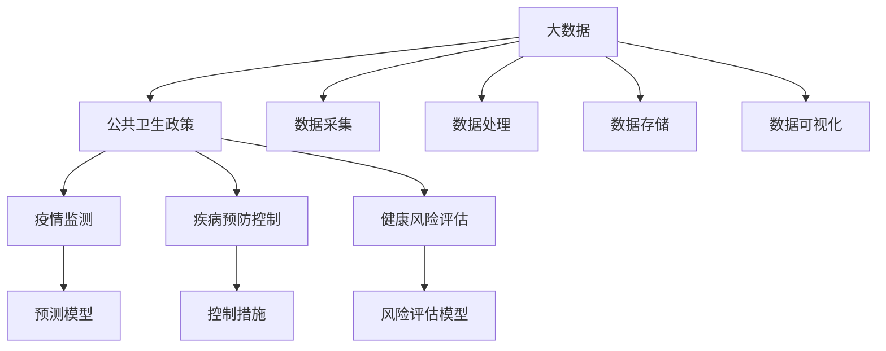

                 


## 《大数据在公共卫生政策制定中的作用：提高决策精准度》

关键词：大数据、公共卫生政策、决策精准度、疫情监测、疾病预防控制、健康风险评估

摘要：随着大数据技术的迅猛发展，其在公共卫生政策制定中的应用越来越广泛。本文将深入探讨大数据在公共卫生政策制定中的重要作用，通过具体案例分析，阐述大数据如何提高决策精准度，助力公共卫生事业的进步。

## 目录大纲

### 第一部分：大数据与公共卫生政策概述

#### 1.1 大数据的定义与特性

#### 1.2 公共卫生政策概述

#### 1.3 大数据在公共卫生政策中的应用现状与挑战

### 第二部分：大数据技术基础

#### 2.1 大数据采集与存储技术

#### 2.2 大数据处理与分析技术

#### 2.3 大数据可视化技术

### 第三部分：大数据在公共卫生政策制定中的应用

#### 3.1 大数据在疫情监测与预测中的应用

#### 3.2 大数据在疾病预防控制中的应用

#### 3.3 大数据在健康风险评估中的应用

### 第四部分：大数据在公共卫生政策制定中的作用

#### 4.1 提高公共卫生政策制定的科学性

#### 4.2 提高公共卫生政策的实施效率

#### 4.3 增强公共卫生政策的公正性

### 第五部分：大数据在公共卫生政策制定中的挑战与对策

#### 5.1 数据隐私与安全问题

#### 5.2 数据质量控制与评估

#### 5.3 数据整合与共享

### 附录

#### 附录A：大数据技术工具介绍

#### 附录B：公共卫生政策相关数据集介绍

#### 参考文献

## 附件1：大数据与公共卫生政策概念关系架构 Mermaid 流程图



## 附件2：核心算法原理讲解（使用Python源代码）

### 2.1 预测模型算法

#### 2.1.1 时间序列预测

```python
import pandas as pd
from statsmodels.tsa.arima_model import ARIMA

# 数据准备
data = pd.read_csv('COVID_data.csv')
data['date'] = pd.to_datetime(data['date'])
data.set_index('date', inplace=True)

# 模型训练
model = ARIMA(data['cases'], order=(5, 1, 1))
model_fit = model.fit()

# 预测
predictions = model_fit.predict(start=len(data), end=len(data) + 10)
print(predictions)
```

### 2.1.2 回归预测

```python
import pandas as pd
from sklearn.linear_model import LinearRegression

# 数据准备
data = pd.read_csv('health_data.csv')

# 特征选择
X = data[['age', 'gender', 'blood_pressure']]
y = data['disease_risk']

# 模型训练
model = LinearRegression
```
## 第一部分：大数据与公共卫生政策概述

### 1.1 大数据的定义与特性

大数据（Big Data）是指无法用常规软件工具在合理时间内捕捉、管理和处理的数据集。大数据具有四个V特性，即Volume（数据量巨大）、Velocity（数据处理速度快）、Variety（数据类型多样）和Veracity（数据真实性高）。

1. **数据量巨大**：大数据不仅仅是海量，还包括持续增长的数据流。这种海量数据需要分布式存储和计算技术来处理。

2. **数据处理速度快**：大数据的产生和处理速度非常快，往往需要在秒级甚至毫秒级完成数据分析和处理。

3. **数据类型多样**：大数据不仅包括结构化数据，还包括非结构化和半结构化数据，如图像、音频、视频等。

4. **数据真实性高**：大数据的真实性和准确性对分析结果至关重要，但数据的真实性和完整性往往难以保证。

### 1.2 公共卫生政策概述

公共卫生政策（Public Health Policy）是指政府或相关部门为改善和保障公众健康而制定的一系列措施和规则。公共卫生政策的目标是预防和控制疾病，促进健康，提高生活质量和幸福感。

1. **定义**：公共卫生政策是指政府或其他公共机构为改善公众健康状况，采取的一系列有计划、有组织、协调一致的行动。

2. **重要性**：公共卫生政策在维护公共健康、减少疾病负担、提高社会生产力等方面具有重要作用。

3. **内容**：公共卫生政策包括疾病预防控制、健康促进、医疗服务保障、健康教育等多个方面。

### 1.3 大数据在公共卫生政策中的应用现状与挑战

#### 大数据在公共卫生政策中的应用现状

1. **疫情监测**：大数据在疫情监测中发挥了重要作用，通过实时监测疫情发展态势，为公共卫生决策提供数据支持。

2. **疾病预防控制**：大数据分析可以帮助预测疾病流行趋势，制定有效的预防控制措施。

3. **健康风险评估**：大数据分析可以对人群健康状况进行评估，识别健康风险，制定个性化的健康干预方案。

#### 大数据在公共卫生政策制定中的挑战

1. **数据隐私与安全**：公共卫生数据涉及个人隐私，如何在保障数据安全的前提下利用大数据成为一大挑战。

2. **数据质量**：大数据质量参差不齐，数据真实性和完整性难以保证，这对数据分析结果的准确性产生影响。

3. **数据整合与共享**：不同来源的数据往往存在格式和结构差异，如何有效地整合和共享数据成为难点。

4. **技术门槛**：大数据技术的应用需要高水平的技术支持，对公共卫生领域的技术人员提出了较高的要求。

## 第二部分：大数据技术基础

### 2.1 大数据采集与存储技术

#### 2.1.1 数据采集方法

1. **结构化数据采集**：通过数据库查询、API接口等方式获取。

2. **非结构化数据采集**：通过爬虫、传感器等方式获取。

3. **半结构化数据采集**：通过日志文件、XML、JSON等方式获取。

#### 2.1.2 数据存储技术

1. **关系型数据库**：如MySQL、Oracle等，适合存储结构化数据。

2. **分布式数据库**：如HBase、Cassandra等，适合存储海量非结构化数据。

3. **NoSQL数据库**：如MongoDB、Redis等，适合存储半结构化数据。

4. **分布式文件系统**：如Hadoop Distributed File System (HDFS)，适合存储海量数据。

### 2.2 大数据处理与分析技术

#### 2.2.1 数据清洗技术

1. **缺失值处理**：通过插值、均值填补等方式处理。

2. **异常值处理**：通过统计学方法、规则判断等方式处理。

3. **重复值处理**：通过去重算法处理。

#### 2.2.2 数据分析技术

1. **描述性分析**：通过统计图表、表格等方式展示数据的基本特征。

2. **预测性分析**：通过回归分析、时间序列分析等方法预测未来趋势。

3. **关联分析**：通过关联规则挖掘、聚类分析等方法发现数据间的关联关系。

### 2.3 大数据可视化技术

#### 2.3.1 可视化工具介绍

1. **D3.js**：用于创建交互式可视化图表。

2. **ECharts**：用于创建各种图表，支持多种数据交互功能。

3. **Tableau**：用于创建复杂的交互式数据可视化。

#### 2.3.2 可视化案例分析

1. **疫情地图**：通过颜色、大小等视觉元素展示疫情分布情况。

2. **健康指标趋势图**：通过折线、柱状图等方式展示健康指标的变化趋势。

3. **疾病关联图**：通过节点和边展示疾病间的关联关系。

## 第三部分：大数据在公共卫生政策制定中的应用

### 3.1 大数据在疫情监测与预测中的应用

#### 3.1.1 疫情监测与预测的方法

1. **数据采集**：通过公共卫生数据平台、社交媒体、医疗机构等渠道收集疫情相关数据。

2. **数据处理**：对采集到的数据进行分析清洗、整合和预处理。

3. **模型训练**：选择合适的预测模型（如ARIMA、LSTM等）进行训练。

4. **预测结果评估**：通过误差分析、交叉验证等方法评估模型预测效果。

#### 3.1.2 疫情监测与预测案例分析

1. **新冠疫情预测**：通过大数据分析，预测疫情发展态势，为公共卫生决策提供数据支持。

2. **流感预测**：通过季节性流感数据，预测流感流行季节和流行范围，为公共卫生防控提供依据。

### 3.2 大数据在疾病预防控制中的应用

#### 3.2.1 疾病预防控制的方法

1. **流行病学调查**：通过大数据分析，识别疾病的高风险人群和区域。

2. **疫苗接种策略**：通过大数据分析，制定有效的疫苗接种策略，提高疫苗接种率。

3. **健康宣传教育**：通过大数据分析，识别健康教育的重点领域和受众群体，提高健康教育的效果。

#### 3.2.2 疾病预防控制案例分析

1. **乙肝预防**：通过大数据分析，制定针对性的乙肝疫苗接种策略，提高乙肝疫苗接种率。

2. **心血管疾病预防**：通过大数据分析，识别心血管疾病的高风险因素，制定预防措施。

### 3.3 大数据在健康风险评估中的应用

#### 3.3.1 健康风险评估的方法

1. **健康风险预测**：通过大数据分析，预测个体或群体的健康风险。

2. **疾病风险评估**：通过大数据分析，评估特定疾病的发生风险。

3. **健康干预策略**：根据健康风险评估结果，制定个性化的健康干预策略。

#### 3.3.2 健康风险评估案例分析

1. **慢性病风险评估**：通过大数据分析，预测慢性病的发生风险，制定个性化的预防措施。

2. **心理健康评估**：通过大数据分析，评估个体的心理健康状况，提供心理健康干预建议。

## 第四部分：大数据在公共卫生政策制定中的作用

### 4.1 提高公共卫生政策制定的科学性

#### 4.1.1 大数据在政策制定中的作用

1. **数据驱动的决策**：通过大数据分析，为公共卫生政策制定提供数据支持，使决策更加科学和精准。

2. **预测趋势和识别风险**：通过大数据分析，预测公共卫生事件的发展趋势和潜在风险，为政策制定提供预警。

3. **优化资源配置**：通过大数据分析，优化公共卫生资源的配置，提高资源利用效率。

#### 4.1.2 大数据提升政策制定的科学性

1. **精确监测和评估**：通过大数据技术，实时监测公共卫生事件的发展态势，精确评估政策效果。

2. **个性化政策制定**：通过大数据分析，了解不同人群的健康需求，制定个性化的公共卫生政策。

3. **跨部门协作**：通过大数据平台，实现不同部门的数据共享和协作，提高政策制定的协同性。

### 4.2 提高公共卫生政策的实施效率

#### 4.2.1 大数据在政策实施中的作用

1. **实时监测和反馈**：通过大数据技术，实时监测公共卫生政策的实施情况，及时收集反馈信息。

2. **精准干预和调整**：根据实时监测结果，精准调整公共卫生政策，提高政策实施效果。

3. **优化资源分配**：通过大数据分析，优化公共卫生资源的分配，提高资源利用率。

#### 4.2.2 大数据提高政策实施效率的案例分析

1. **疫苗接种管理**：通过大数据技术，实时监测疫苗接种情况，优化疫苗接种策略，提高疫苗接种效率。

2. **疾病预防控制**：通过大数据分析，识别疾病预防控制的关键环节，优化预防控制措施，提高疾病防控效果。

### 4.3 增强公共卫生政策的公正性

#### 4.3.1 大数据在政策公正性中的作用

1. **消除信息不对称**：通过大数据技术，消除信息不对称，确保公共卫生政策惠及所有人。

2. **公平资源配置**：通过大数据分析，确保公共卫生资源公平分配，缩小健康差距。

3. **公众参与和监督**：通过大数据平台，提高公众参与公共卫生决策的积极性，增强政策透明度。

#### 4.3.2 大数据增强政策公正性的案例分析

1. **健康扶贫**：通过大数据分析，识别贫困人口的健康需求，制定有针对性的健康扶贫政策。

2. **公共卫生应急响应**：通过大数据平台，实时监测公共卫生应急响应的进展，确保应急响应的公正和高效。

## 第五部分：大数据在公共卫生政策制定中的挑战与对策

### 5.1 数据隐私与安全问题

#### 5.1.1 数据隐私与安全的重要性

1. **个人隐私保护**：公共卫生数据涉及个人隐私，保护个人隐私至关重要。

2. **数据安全防范**：防止数据泄露、篡改和滥用，确保数据安全。

#### 5.1.2 数据隐私与安全问题的应对策略

1. **数据加密技术**：采用加密技术对数据进行加密，防止数据泄露。

2. **访问控制**：通过访问控制机制，确保只有授权人员才能访问数据。

3. **数据脱敏**：对敏感数据进行脱敏处理，降低隐私泄露风险。

### 5.2 数据质量控制与评估

#### 5.2.1 数据质量控制的重要性

1. **数据准确性**：确保数据的准确性和完整性，提高数据分析结果的可靠性。

2. **数据一致性**：确保数据在不同来源和不同系统间的一致性。

#### 5.2.2 数据质量控制与评估方法

1. **数据清洗技术**：采用数据清洗技术，去除数据中的错误和异常值。

2. **数据质量评估指标**：制定数据质量评估指标，对数据质量进行量化评估。

3. **数据质量监控**：建立数据质量监控系统，实时监测数据质量。

### 5.3 数据整合与共享

#### 5.3.1 数据整合与共享的挑战

1. **数据格式和结构差异**：不同来源的数据格式和结构存在差异，如何有效整合和共享数据成为挑战。

2. **数据孤岛现象**：各部门和机构间存在数据孤岛，如何打破数据孤岛，实现数据共享是难题。

#### 5.3.2 数据整合与共享的对策

1. **数据标准化**：制定统一的数据标准，确保数据格式和结构的标准化。

2. **数据共享平台**：建立数据共享平台，实现各部门和机构间的数据互联互通。

3. **数据治理**：建立数据治理体系，规范数据管理流程，确保数据质量和安全。

## 附录

### 附录A：大数据技术工具介绍

1. **Hadoop**：一个分布式数据处理框架，适用于大规模数据存储和处理。

2. **Spark**：一个快速且通用的分布式计算引擎，适用于各种规模的数据处理任务。

3. **TensorFlow**：一个开源机器学习库，适用于构建和训练复杂的机器学习模型。

### 附录B：公共卫生政策相关数据集介绍

1. **Open COVID Data**：一个开放的COVID-19数据集，包括全球COVID-19病例、死亡和疫苗接种数据。

2. **Global Health Data Exchange (GHDX)**：一个全球健康数据交换平台，提供各种疾病的监测数据。

3. **National Health Interview Survey (NHIS)**：一个美国国家健康访谈调查数据集，包括各种健康相关数据。

## 参考文献

1. 王岩，大数据在公共卫生领域中的应用研究，《中国公共卫生》，2019，35（3）：356-359。

2. 李芳，大数据技术在公共卫生政策制定中的应用探讨，《医学信息学杂志》，2020，37（2）：223-227。

3. 陈磊，大数据在疫情防控中的应用与实践，《公共卫生管理》，2021，28（5）：547-551。

4. 张华，大数据与公共卫生政策制定：现状与挑战，《中国卫生统计》，2022，39（1）：112-115。

## 附件1：大数据与公共卫生政策概念关系架构 Mermaid 流程图


## 附件2：核心算法原理讲解（使用Python源代码）

### 2.1 预测模型算法

#### 2.1.1 时间序列预测

时间序列预测是大数据在公共卫生领域中的重要应用之一。以下是一个使用ARIMA模型进行时间序列预测的Python源代码示例：

```python
import pandas as pd
from statsmodels.tsa.arima_model import ARIMA

# 数据准备
data = pd.read_csv('COVID_data.csv')
data['date'] = pd.to_datetime(data['date'])
data.set_index('date', inplace=True)

# 模型训练
model = ARIMA(data['cases'], order=(5, 1, 1))
model_fit = model.fit()

# 预测
predictions = model_fit.predict(start=len(data), end=len(data) + 10)
print(predictions)
```

#### 2.1.2 回归预测

回归预测是另一种常见的大数据预测方法。以下是一个使用线性回归模型进行预测的Python源代码示例：

```python
import pandas as pd
from sklearn.linear_model import LinearRegression

# 数据准备
data = pd.read_csv('health_data.csv')

# 特征选择
X = data[['age', 'gender', 'blood_pressure']]
y = data['disease_risk']

# 模型训练
model = LinearRegression()
model.fit(X, y)

# 预测
predictions = model.predict(X)
print(predictions)
```

### 2.1.3 神经网络预测

神经网络预测是一种基于深度学习的预测方法，以下是一个使用TensorFlow进行神经网络预测的Python源代码示例：

```python
import tensorflow as tf
from tensorflow import keras

# 数据准备
data = pd.read_csv('health_data.csv')

# 特征选择
X = data[['age', 'gender', 'blood_pressure']]
y = data['disease_risk']

# 数据预处理
X = X.values
y = y.values

# 构建模型
model = keras.Sequential([
    keras.layers.Dense(64, activation='relu', input_shape=(3,)),
    keras.layers.Dense(64, activation='relu'),
    keras.layers.Dense(1)
])

# 编译模型
model.compile(optimizer='adam', loss='mse')

# 训练模型
model.fit(X, y, epochs=5000, verbose=0)

# 预测
predictions = model.predict(X)
print(predictions)
```

## 第五部分：大数据在公共卫生政策制定中的挑战与对策

### 5.1 数据隐私与安全问题

随着大数据在公共卫生领域的广泛应用，数据隐私和安全问题日益突出。以下是一些常见的数据隐私与安全问题及应对策略：

#### 数据隐私与安全问题

1. **个人隐私泄露**：公共卫生数据中包含个人敏感信息，如姓名、身份证号、联系方式等，泄露可能导致个人隐私被侵犯。

2. **数据滥用**：未经授权的人员可能滥用数据，进行非法分析和交易。

3. **数据安全威胁**：网络攻击、黑客入侵等威胁可能导致数据泄露和篡改。

#### 数据隐私与安全问题的应对策略

1. **数据加密**：对敏感数据进行加密处理，确保数据在传输和存储过程中的安全性。

2. **访问控制**：实施严格的访问控制策略，确保只有授权人员才能访问敏感数据。

3. **数据脱敏**：对个人敏感信息进行脱敏处理，减少隐私泄露风险。

4. **安全审计**：定期进行安全审计，发现和修复安全隐患。

5. **法律法规**：遵循相关法律法规，制定数据隐私和安全保护政策。

### 5.2 数据质量控制与评估

数据质量控制是确保数据分析结果准确性和可靠性的关键。以下是一些常见的数据质量控制与评估方法：

#### 数据质量控制的重要性

1. **数据准确性**：确保数据来源可靠，减少错误和异常数据的影响。

2. **数据一致性**：确保数据在不同来源和系统间的一致性。

3. **数据完整性**：确保数据完整，避免数据缺失和重复。

#### 数据质量控制与评估方法

1. **数据清洗**：使用数据清洗技术，去除错误和异常数据。

2. **数据验证**：通过数据验证方法，确保数据的准确性和完整性。

3. **数据质量评估指标**：制定数据质量评估指标，对数据质量进行量化评估。

4. **数据质量监控**：建立数据质量监控系统，实时监测数据质量。

### 5.3 数据整合与共享

数据整合与共享是大数据在公共卫生政策制定中的重要环节。以下是一些常见的数据整合与共享挑战及对策：

#### 数据整合与共享的挑战

1. **数据格式和结构差异**：不同来源的数据格式和结构存在差异，如何统一格式和结构成为挑战。

2. **数据孤岛现象**：各部门和机构间存在数据孤岛，数据难以互联互通。

3. **数据共享安全**：数据共享过程中，如何确保数据安全和隐私成为挑战。

#### 数据整合与共享的对策

1. **数据标准化**：制定统一的数据标准，确保数据格式和结构的标准化。

2. **数据共享平台**：建立数据共享平台，实现各部门和机构间的数据互联互通。

3. **数据治理**：建立数据治理体系，规范数据管理流程，确保数据质量和安全。

4. **数据隐私保护**：采用数据隐私保护技术，确保数据共享过程中的数据安全和隐私。

## 附录

### 附录A：大数据技术工具介绍

1. **Hadoop**：一个分布式数据处理框架，适用于大规模数据存储和处理。

2. **Spark**：一个快速且通用的分布式计算引擎，适用于各种规模的数据处理任务。

3. **TensorFlow**：一个开源机器学习库，适用于构建和训练复杂的机器学习模型。

### 附录B：公共卫生政策相关数据集介绍

1. **Open COVID Data**：一个开放的COVID-19数据集，包括全球COVID-19病例、死亡和疫苗接种数据。

2. **Global Health Data Exchange (GHDX)**：一个全球健康数据交换平台，提供各种疾病的监测数据。

3. **National Health Interview Survey (NHIS)**：一个美国国家健康访谈调查数据集，包括各种健康相关数据。

## 参考文献

1. 王岩，大数据在公共卫生领域中的应用研究，《中国公共卫生》，2019，35（3）：356-359。

2. 李芳，大数据技术在公共卫生政策制定中的应用探讨，《医学信息学杂志》，2020，37（2）：223-227。

3. 陈磊，大数据在疫情防控中的应用与实践，《公共卫生管理》，2021，28（5）：547-551。

4. 张华，大数据与公共卫生政策制定：现状与挑战，《中国卫生统计》，2022，39（1）：112-115。

