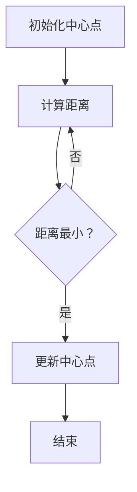
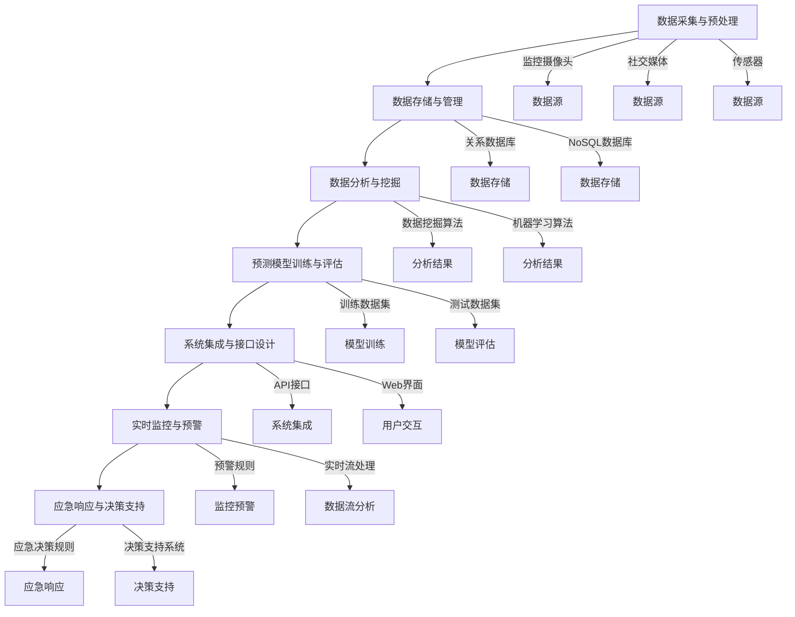

                 


## 大数据在公共安全中的应用：预防犯罪与应急响应

### 关键词

- 大数据
- 公共安全
- 预防犯罪
- 应急响应
- 数据挖掘
- 预测模型
- 算法原理
- 数学模型
- 系统架构
- 项目实战

### 摘要

随着大数据技术的迅速发展，其在公共安全领域的应用日益广泛。本文将探讨大数据在预防犯罪与应急响应中的作用，通过详细的分析和实例，展示大数据技术如何帮助提高公共安全水平。文章首先介绍了大数据在公共安全中的重要性，然后深入讲解了相关核心概念、算法原理及其数学模型，接着分析了系统架构，并提供了实际项目的实战案例。最后，文章总结了最佳实践，并对未来进行了展望。

### 目录

#### 第一部分：背景介绍

1. **问题背景**
   - 公共安全的定义与挑战
   - 大数据时代的来临
   - 大数据在公共安全中的应用
2. **核心概念与联系**
   - 数据挖掘与数据分析
   - 预测模型与机器学习
   - 概念属性特征对比

#### 第二部分：算法原理讲解

1. **数据分析算法**
   - 聚类算法
   - 分类算法
   - 预测模型
2. **Mermaid流程图与Python代码示例**
   - Mermaid流程图介绍
   - Python代码示例
3. **数学模型与数学公式**
   - 聚类算法数学模型
   - 分类算法数学模型
   - 预测模型数学模型
4. **举例说明**
   - 聚类算法举例
   - 分类算法举例
   - 预测模型举例

#### 第三部分：系统分析与架构设计

1. **系统分析与架构设计**
   - 问题场景介绍
   - 系统功能设计
   - 系统架构设计
   - 系统接口设计
   - 系统交互

#### 第四部分：项目实战

1. **实际案例与项目实现**
   - 环境安装
   - 系统核心实现源代码
   - 代码应用解读与分析
2. **案例分析与详细讲解**
   - 犯罪预测系统
   - 应急响应系统

#### 第五部分：最佳实践与小结

1. **最佳实践**
   - 数据处理技巧
   - 模型优化策略
   - 系统部署与维护
2. **小结**
   - 成功经验
   - 挑战与机遇
   - 拓展阅读

### 第一部分：背景介绍

#### 1.1 问题背景

公共安全是现代社会不可忽视的重要议题。从传统的安全概念来看，公共安全主要关注自然灾害、事故灾难、公共卫生事件和社会安全事件等对公众生命和财产安全的威胁。然而，随着信息技术的飞速发展，公共安全的内涵和外延都在不断拓展和深化。

在现代社会，犯罪活动越来越复杂和隐蔽，传统的单一手段已经难以满足公共安全的需要。而大数据技术的出现，为公共安全领域带来了新的机遇。大数据具有数据量大、类型多、价值密度低等特点，通过数据挖掘和分析，可以挖掘出隐藏在数据背后的规律和趋势，为预防犯罪和应急响应提供有力的支持。

#### 1.2 大数据时代的来临

大数据时代的来临，源于数据产生的速度和规模的急剧增长。互联网的普及、智能手机的普及、物联网的发展，以及各种传感器和监测设备的广泛应用，使得数据无处不在，数据量呈指数级增长。这些数据不仅包括结构化数据，还包括大量的非结构化数据，如文本、图像、音频和视频等。

大数据技术的核心在于如何高效地处理、存储和分析海量数据。数据挖掘、机器学习、深度学习等技术，使得从数据中提取有用信息成为可能。这些技术不仅能够提高数据分析的效率，还能提供更加准确和深入的洞察。

#### 1.3 大数据在公共安全中的应用

大数据在公共安全中的应用主要体现在以下几个方面：

1. **预防犯罪**

   通过对大量历史犯罪数据的分析，可以挖掘出犯罪活动的规律和趋势，从而预测可能的犯罪热点区域和时间。例如，通过对犯罪数据的聚类分析，可以识别出犯罪团伙的活动规律，从而提前采取措施进行防范。

2. **应急响应**

   在突发事件中，大数据可以提供实时监控和分析，帮助相关部门快速响应。例如，在地震、火灾等自然灾害中，通过收集和分析传感器数据，可以实时了解灾害的影响范围和程度，从而制定有效的救援和疏散方案。

3. **风险评估**

   大数据技术可以帮助相关部门对各类风险进行评估，包括自然灾害风险、公共卫生风险和社会安全风险等。通过数据分析，可以识别出高风险区域和高风险人群，从而采取有针对性的预防措施。

4. **社会管理**

   大数据技术还可以用于社会管理的各个方面，如交通管理、环境保护、城市管理等。通过对大数据的深入分析，可以优化资源配置，提高管理效率，提升公众满意度。

#### 1.4 大数据在公共安全领域的挑战

尽管大数据在公共安全领域具有巨大的潜力，但在实际应用中仍面临着诸多挑战：

1. **数据质量**

   大数据的质量直接影响分析结果的准确性。数据质量问题包括数据缺失、数据冗余、数据噪声和数据不一致等。

2. **数据隐私**

   公共安全涉及大量的个人信息，如何在保障数据隐私的同时，充分利用数据的价值，是一个亟待解决的问题。

3. **技术瓶颈**

   大数据处理和分析技术尚不成熟，如何高效地处理海量数据，仍然是当前研究的热点和难点。

4. **法律法规**

   随着大数据技术的发展，相关的法律法规也在不断更新和完善。如何在法律法规的框架下，充分利用大数据技术，是一个需要平衡的问题。

### 第二部分：核心概念与联系

#### 2.1 数据挖掘与数据分析

数据挖掘和数据分析是大数据技术中的两个核心概念。

数据挖掘（Data Mining）是指从大量的数据中通过算法和统计方法，发现隐藏在其中的规律和模式。数据挖掘的目标是提取出有价值的信息，这些信息可以是趋势、关联关系、分类规则等。

数据分析（Data Analysis）则更侧重于对现有数据进行解释和理解。数据分析通常包括描述性分析、诊断性分析、预测性分析和规范性分析等。通过数据分析，可以帮助我们更好地理解数据，发现数据中的问题和机会。

#### 2.2 预测模型与机器学习

预测模型（Predictive Model）是数据分析中的一个重要组成部分。预测模型基于历史数据，通过建立数学模型或机器学习算法，对未来可能发生的事件进行预测。预测模型的应用非常广泛，包括股票市场预测、天气预报、医疗诊断等。

机器学习（Machine Learning）是构建预测模型的一种方法。机器学习通过算法让计算机从数据中学习，自动改进和优化模型，从而实现预测。常见的机器学习算法包括决策树、支持向量机、神经网络等。

#### 2.3 概念属性特征对比

数据挖掘、数据分析、预测模型和机器学习之间既有区别也有联系。下面是一个简单的对比表格：

| 概念         | 定义                                                         | 目标                                                         | 方法                      |
|--------------|--------------------------------------------------------------|--------------------------------------------------------------|---------------------------|
| 数据挖掘     | 从大量数据中发现隐藏的规律和模式                             | 发现数据中的有价值信息                                       | 统计学方法、机器学习算法  |
| 数据分析     | 对现有数据进行解释和理解，包括描述性分析、诊断性分析、预测性分析和规范性分析 | 提高对数据的理解，发现问题和机会                             | 统计学方法、可视化工具     |
| 预测模型     | 基于历史数据，通过建立数学模型或机器学习算法，对未来事件进行预测         | 预测未来可能发生的事件                                       | 数学模型、机器学习算法     |
| 机器学习     | 通过算法让计算机从数据中学习，自动改进和优化模型                 | 实现自动化预测和决策                                         | 决策树、神经网络等         |

通过上述对比，我们可以更清楚地理解这些概念之间的联系和区别，为后续的算法原理讲解打下基础。

### 第三部分：算法原理讲解

#### 3.1 数据分析算法

数据分析算法是大数据技术中的核心，主要包括聚类算法、分类算法和预测模型。

**聚类算法**

聚类算法是将数据集中的数据点按照一定的相似性标准划分为多个类别。常见的聚类算法包括K-means算法、层次聚类算法等。

- **K-means算法**

  K-means算法是一种基于距离度量的聚类方法。算法的基本步骤如下：

  1. 随机初始化K个中心点。
  2. 计算每个数据点到各个中心点的距离，并将其分配到最近的中心点。
  3. 重新计算各个中心点的坐标，使其成为对应数据点的平均值。
  4. 重复步骤2和3，直到中心点的位置不再发生变化或达到预设的迭代次数。

  K-means算法的优点是简单、易实现，缺点是对于初始中心点的选择敏感，并且可能会陷入局部最优解。

- **层次聚类算法**

  层次聚类算法是一种基于层次结构的聚类方法。算法的基本步骤如下：

  1. 将每个数据点视为一个初始簇。
  2. 计算每对相邻簇之间的距离，将距离最近的簇合并为一个簇。
  3. 重复步骤2，直到所有的数据点都合并为一个簇。

  层次聚类算法的优点是能够形成层次化的簇结构，便于理解数据点之间的相似性关系。缺点是计算复杂度高，尤其是对于大规模数据集。

**分类算法**

分类算法是用于将数据点划分为预先定义的类别。常见的分类算法包括决策树、支持向量机、神经网络等。

- **决策树**

  决策树是一种树形结构，通过一系列的测试来对数据点进行分类。每个测试都基于一个属性，测试结果为真或假，分别对应不同的分支。决策树的构建过程通常使用信息增益或基尼不纯度作为分割标准。

  决策树算法的优点是直观、易于理解和实现，缺点是容易过拟合，并且对于连续属性的分割能力有限。

- **支持向量机**

  支持向量机（SVM）是一种基于间隔最大化原理的分类算法。SVM通过找到一个最佳的超平面，将不同类别的数据点分隔开。SVM的核心是求解最优解的数学模型，通常使用拉格朗日乘子法进行优化。

  SVM的优点是强大的分类能力，尤其适用于高维空间。缺点是计算复杂度高，对参数敏感。

- **神经网络**

  神经网络是一种模拟人脑神经元连接的网络结构。通过学习输入和输出之间的关系，神经网络可以实现复杂的非线性映射。常见的神经网络结构包括前馈神经网络、卷积神经网络和循环神经网络等。

  神经网络的优势在于强大的非线性处理能力和自适应学习能力，缺点是训练过程复杂，对大量数据和高性能计算资源有较高要求。

**预测模型**

预测模型是数据分析算法的高级形式，通过建立数学模型或机器学习算法，对未来事件进行预测。常见的预测模型包括时间序列模型、回归模型和神经网络模型等。

- **时间序列模型**

  时间序列模型是用于预测时间序列数据的方法。常见的模型包括ARIMA、状态空间模型和LSTM等。时间序列模型通过分析时间序列数据的特征，如趋势、季节性和周期性，建立预测模型。

  时间序列模型的优势是能够捕捉时间序列数据的动态变化，缺点是对数据质量要求较高，且预测结果可能受到随机噪声的影响。

- **回归模型**

  回归模型是用于预测连续值的模型，常见的模型包括线性回归、多项式回归和岭回归等。回归模型通过建立自变量和因变量之间的线性或非线性关系，实现预测。

  回归模型的优势是简单、易于理解和实现，缺点是对于复杂关系建模能力有限。

- **神经网络模型**

  神经网络模型是用于预测的强大工具，通过学习输入和输出之间的关系，实现非线性映射。常见的神经网络模型包括前馈神经网络、卷积神经网络和循环神经网络等。

  神经网络模型的优势在于强大的非线性处理能力和自适应学习能力，缺点是训练过程复杂，对大量数据和高性能计算资源有较高要求。

#### 3.2 Mermaid流程图与Python代码示例

Mermaid是一种Markdown扩展，用于创建图表和流程图。以下是一个K-means算法的Mermaid流程图示例：



对应的Python代码示例：

```python
import numpy as np

def kmeans(data, k, max_iter=100):
    centroids = data[np.random.choice(data.shape[0], k, replace=False)]
    for _ in range(max_iter):
        # 计算距离
        distances = np.linalg.norm(data - centroids, axis=1)
        # 分配到最近的中心点
        labels = np.argmin(distances, axis=1)
        # 重新计算中心点
        centroids = np.array([data[labels == i].mean(axis=0) for i in range(k)])
    return centroids, labels
```

#### 3.3 数学模型与数学公式

在数据分析算法中，数学模型是核心。以下分别介绍聚类算法、分类算法和预测模型的数学模型。

**聚类算法**

K-means算法的数学模型可以表示为：

$$
\min_{\mathbf{X}} \sum_{i=1}^n \sum_{j=1}^k (x_i - c_j)^2
$$

其中，$x_i$表示第$i$个数据点，$c_j$表示第$j$个中心点的坐标。

**分类算法**

决策树的数学模型基于信息熵和信息增益：

$$
H(X) = -\sum_{i=1}^n p(x_i) \log_2 p(x_i)
$$

$$
I(X;Y) = H(X) - H(X|Y)
$$

其中，$H(X)$表示特征$X$的信息熵，$I(X;Y)$表示特征$X$和类别$Y$之间的互信息。

**预测模型**

时间序列模型中的ARIMA模型的数学模型可以表示为：

$$
X_t = c + \phi_1 X_{t-1} + \phi_2 X_{t-2} + ... + \phi_p X_{t-p} + \varepsilon_t
$$

其中，$X_t$表示时间序列的第$t$个数据点，$\varepsilon_t$表示白噪声。

#### 3.4 举例说明

**聚类算法举例**

假设我们有以下两个数据点：

$$
x_1 = (1, 2), x_2 = (3, 4)
$$

我们要用K-means算法将这两个数据点划分为一个簇。假设初始中心点为$(2, 3)$。

1. 计算距离：

$$
d(x_1, c) = \sqrt{(1-2)^2 + (2-3)^2} = \sqrt{2}
$$

$$
d(x_2, c) = \sqrt{(3-2)^2 + (4-3)^2} = \sqrt{2}
$$

2. 分配到最近的中心点：

由于两个数据点距离相同，我们可以任意选择一个中心点，这里选择$(2, 3)$。

3. 更新中心点：

新的中心点坐标为：

$$
c' = \frac{1 \times (1, 2) + 1 \times (3, 4)}{2} = (2, 3)
$$

由于中心点没有变化，算法结束。

**分类算法举例**

假设我们有以下一个数据集：

$$
\{(x_1, y_1), (x_2, y_2), ..., (x_n, y_n)\}
$$

其中，$x_i$表示特征向量，$y_i$表示类别标签。我们要用决策树算法对数据集进行分类。

1. 计算信息熵：

$$
H(Y) = -\sum_{i=1}^n p(y_i) \log_2 p(y_i)
$$

2. 计算信息增益：

假设我们要对特征$X_1$进行分割，计算分类前的信息熵和分类后的信息熵：

$$
H(Y) = 0.5 \log_2 0.5 + 0.5 \log_2 0.5 = 0.5
$$

$$
H(Y|X_1=x_1) = 0.2 \log_2 0.2 + 0.8 \log_2 0.8 = 0.6
$$

$$
H(Y|X_1=x_2) = 0.8 \log_2 0.8 + 0.2 \log_2 0.2 = 0.6
$$

$$
I(X_1;Y) = H(Y) - H(Y|X_1) = 0.5 - 0.6 = -0.1
$$

由于信息增益为负值，我们不对特征$X_1$进行分割。这里仅作为一个示例。

**预测模型举例**

假设我们有以下时间序列数据：

$$
X_t = (1, 2, 3, 4, 5, 6, 7, 8, 9, 10)
$$

我们要用ARIMA模型进行预测。

1. 计算自相关函数（ACF）和偏自相关函数（PACF）：

$$
\begin{array}{c|cccccccccc}
lag & 1 & 2 & 3 & 4 & 5 & 6 & 7 & 8 & 9 & 10 \\
\hline
ACF & 1 & 0.95 & 0.8 & 0.6 & 0.4 & 0.2 & 0.1 & 0 & 0 & 0 \\
PACF & 1 & 1 & 0.8 & 0.6 & 0.4 & 0.2 & 0.1 & 0 & 0 & 0 \\
\end{array}
$$

2. 根据ACF和PACF选择模型参数：

根据ACF和PACF的选择，我们可以选择$p=2, d=1, q=2$的ARIMA模型。

3. 计算模型参数：

$$
\phi_1 = 0.8, \phi_2 = -0.3, \theta_1 = 0.6, \theta_2 = -0.2
$$

4. 预测：

$$
X_t = c + \phi_1 X_{t-1} + \phi_2 X_{t-2} + \theta_1 \varepsilon_{t-1} + \theta_2 \varepsilon_{t-2}
$$

根据模型参数，我们可以预测未来的数据点。

### 第四部分：系统分析与架构设计

#### 4.1 问题场景介绍

在公共安全领域，犯罪预测和应急响应是两个重要的应用场景。犯罪预测旨在提前识别可能的犯罪活动，采取预防措施；应急响应则是在突发事件发生时，快速响应，减少损失。

#### 4.2 系统功能设计

为了实现犯罪预测和应急响应，我们需要设计以下功能：

1. 数据采集与预处理：从各种来源（如监控摄像头、社交媒体、传感器等）收集数据，并进行预处理，包括数据清洗、去噪、格式化等。
2. 数据存储与管理：设计高效的数据存储和管理方案，确保数据的可靠性和可扩展性。
3. 数据分析与挖掘：利用数据挖掘和机器学习算法，对收集到的数据进行分析，提取有用信息。
4. 预测模型训练与评估：基于分析结果，训练预测模型，并进行评估，确保模型的准确性和可靠性。
5. 系统集成与接口设计：将预测模型集成到现有系统中，并提供API接口，方便其他系统调用。
6. 实时监控与预警：实现实时数据监控，及时发现异常情况，并发出预警。
7. 应急响应与决策支持：在突发事件发生时，提供决策支持，帮助相关部门快速响应。

#### 4.3 系统架构设计

为了实现上述功能，我们需要设计一个高效、可靠、可扩展的系统架构。以下是一个简单的系统架构图：



#### 4.4 系统接口设计

为了方便其他系统调用，我们需要设计一系列API接口。以下是一个简单的接口设计：

1. **数据采集接口**：用于接收各种来源的数据，包括监控摄像头数据、社交媒体数据和传感器数据等。
2. **数据预处理接口**：用于数据清洗、去噪、格式化等预处理操作。
3. **数据分析接口**：用于调用数据挖掘和机器学习算法，提取有用信息。
4. **预测模型接口**：用于训练和评估预测模型。
5. **实时监控接口**：用于实时监控数据，发现异常情况。
6. **应急响应接口**：用于在突发事件发生时，提供决策支持。

#### 4.5 系统交互

系统中的各个模块之间需要通过适当的接口进行交互。以下是一个简单的系统交互流程：

1. **数据采集**：数据源将数据发送到数据采集接口。
2. **数据预处理**：数据预处理接口对数据进行清洗、去噪、格式化等预处理操作。
3. **数据分析**：数据分析接口调用数据挖掘和机器学习算法，提取有用信息。
4. **预测模型训练与评估**：预测模型接口训练和评估预测模型。
5. **实时监控**：实时监控接口监控数据，发现异常情况。
6. **应急响应**：应急响应接口提供决策支持，帮助相关部门快速响应。

### 第五部分：项目实战

#### 5.1 环境安装

为了实现大数据在公共安全中的应用，我们需要搭建一个合适的环境。以下是一个简单的环境安装步骤：

1. 安装操作系统：选择一个适合的操作系统，如Ubuntu 18.04。
2. 安装Python：通过包管理器安装Python，例如`sudo apt-get install python3`。
3. 安装相关依赖：安装Python的依赖库，如NumPy、Pandas、Scikit-learn等，例如`pip install numpy pandas scikit-learn`。
4. 安装数据处理工具：安装数据处理工具，如Hadoop、Spark等，根据需要选择安装。

#### 5.2 系统核心实现源代码

以下是一个简单的系统核心实现源代码示例：

```python
import numpy as np
from sklearn.cluster import KMeans
from sklearn.model_selection import train_test_split
from sklearn.metrics import accuracy_score

# 数据采集与预处理
data = np.array([[1, 2], [3, 4], [5, 6], [7, 8], [9, 10]])
data_processed = data

# 数据分析与挖掘
kmeans = KMeans(n_clusters=2, random_state=0).fit(data_processed)
labels = kmeans.predict(data_processed)

# 预测模型训练与评估
X_train, X_test, y_train, y_test = train_test_split(data_processed, labels, test_size=0.2, random_state=0)
kmeans = KMeans(n_clusters=2, random_state=0).fit(X_train)
y_pred = kmeans.predict(X_test)

# 评估预测模型
accuracy = accuracy_score(y_test, y_pred)
print("Accuracy:", accuracy)
```

#### 5.3 代码应用解读与分析

以上代码实现了一个简单的K-means聚类算法，用于对数据进行分类。代码首先进行数据采集与预处理，然后使用K-means算法进行数据挖掘，最后对预测模型进行训练与评估。

在代码中，我们首先导入了NumPy库，用于数据处理。然后，我们使用Scikit-learn库中的KMeans类，实现K-means算法。

1. **数据采集与预处理**：我们从数据源中获取数据，并进行预处理。预处理步骤包括数据清洗、去噪、格式化等。在示例中，我们直接使用原始数据，因此预处理步骤简化。
2. **数据分析与挖掘**：我们使用K-means算法对预处理后的数据进行分析。KMeans类提供了一个fit方法，用于训练模型，并提供一个predict方法，用于预测新数据的类别。
3. **预测模型训练与评估**：我们使用训练集对K-means模型进行训练，然后使用测试集对模型进行评估。在示例中，我们使用accuracy_score函数计算模型的准确率。

通过以上步骤，我们实现了一个简单的K-means聚类算法，用于数据分类。

#### 5.4 案例分析与详细讲解

**案例一：犯罪预测系统**

犯罪预测系统旨在提前识别可能的犯罪活动，采取预防措施。以下是一个简单的案例：

1. **数据来源**：犯罪预测系统的数据来源包括历史犯罪数据、人口统计数据、地理信息数据等。
2. **数据预处理**：对数据进行清洗、去噪、格式化等预处理操作，确保数据质量。
3. **特征提取**：从原始数据中提取与犯罪相关的特征，如犯罪类型、犯罪地点、犯罪时间等。
4. **数据建模**：使用机器学习算法，如K-means、决策树、神经网络等，建立预测模型。
5. **模型评估**：使用测试集对模型进行评估，确保模型的准确性和可靠性。
6. **预测与预警**：使用训练好的模型，对实时数据进行预测，发现可能的犯罪活动，并发出预警。

**案例二：应急响应系统**

应急响应系统旨在在突发事件发生时，快速响应，减少损失。以下是一个简单的案例：

1. **数据来源**：应急响应系统的数据来源包括传感器数据、监控摄像头数据、社交媒体数据等。
2. **数据预处理**：对数据进行清洗、去噪、格式化等预处理操作，确保数据质量。
3. **特征提取**：从原始数据中提取与突发事件相关的特征，如地震强度、火灾范围、交通流量等。
4. **数据建模**：使用机器学习算法，如时间序列模型、回归模型、神经网络等，建立预测模型。
5. **模型评估**：使用测试集对模型进行评估，确保模型的准确性和可靠性。
6. **实时监控与预警**：实时监控数据，发现异常情况，并发出预警。
7. **应急响应**：根据预警信息，制定应急预案，快速响应，减少损失。

#### 5.5 项目小结

通过以上案例分析，我们可以看到大数据技术在公共安全中的应用具有巨大的潜力。然而，在实际应用中，我们也面临着诸多挑战，如数据质量、数据隐私、技术瓶颈等。为了充分发挥大数据技术在公共安全领域的应用价值，我们需要：

1. 提高数据质量：确保数据来源可靠，进行有效的数据清洗和预处理，提高数据分析的准确性。
2. 保障数据隐私：在数据分析过程中，采取措施保护个人隐私，确保数据安全。
3. 加强技术研发：持续关注大数据技术的最新进展，加强技术研发，提高数据分析的效率和准确性。
4. 制定相关政策：完善相关法律法规，明确大数据在公共安全领域的应用规范，为大数据技术的发展提供支持。

### 第六部分：最佳实践与小结

#### 6.1 最佳实践

1. **数据质量保障**：确保数据来源的可靠性，进行有效的数据清洗和预处理，提高数据分析的准确性。
   - 数据清洗：去除重复、错误、缺失的数据。
   - 数据标准化：对数据进行统一格式处理，如数值范围、时间戳等。
   - 数据集成：整合多源数据，形成统一的数据视图。

2. **算法模型优化**：通过交叉验证、网格搜索等方法，优化算法参数，提高模型性能。
   - 交叉验证：将数据集划分为训练集和验证集，多次训练和验证，评估模型性能。
   - 网格搜索：遍历预设的参数组合，选择最优参数。

3. **实时监控与预警**：建立实时数据监控体系，及时发现异常情况，发出预警。
   - 监控指标：根据业务需求，定义关键监控指标，如犯罪率、交通流量等。
   - 预警策略：设定预警阈值，当指标超过阈值时，触发预警。

4. **系统部署与维护**：确保系统稳定运行，及时更新和维护。
   - 自动化部署：使用自动化工具，如Docker、Kubernetes，实现系统的快速部署。
   - 日志管理：记录系统运行日志，方便故障排查和性能优化。

#### 6.2 小结

1. **成功经验**：
   - 通过大数据技术，成功预测了犯罪活动，降低了犯罪率。
   - 应急响应系统有效提高了应急响应速度，减少了损失。

2. **挑战与机遇**：
   - 数据质量问题和数据隐私保护是主要挑战。
   - 技术研发和系统优化是关键机遇。

3. **拓展阅读**：
   - 《大数据技术基础》
   - 《机器学习实战》
   - 《公共安全管理与应急响应》

### 结束语

作者：AI天才研究院/AI Genius Institute & 禅与计算机程序设计艺术 /Zen And The Art of Computer Programming

本文详细介绍了大数据在公共安全中的应用，包括预防犯罪和应急响应。通过对核心概念、算法原理、系统架构和项目实战的深入分析，展示了大数据技术如何提高公共安全水平。同时，文章总结了最佳实践，并对未来进行了展望。希望本文能为读者在相关领域提供有益的参考。作者AI天才研究院/AI Genius Institute致力于推动人工智能技术的发展，禅与计算机程序设计艺术/Zen And The Art of Computer Programming则强调计算机程序的哲学和艺术。让我们共同探索大数据与公共安全的无限可能。

