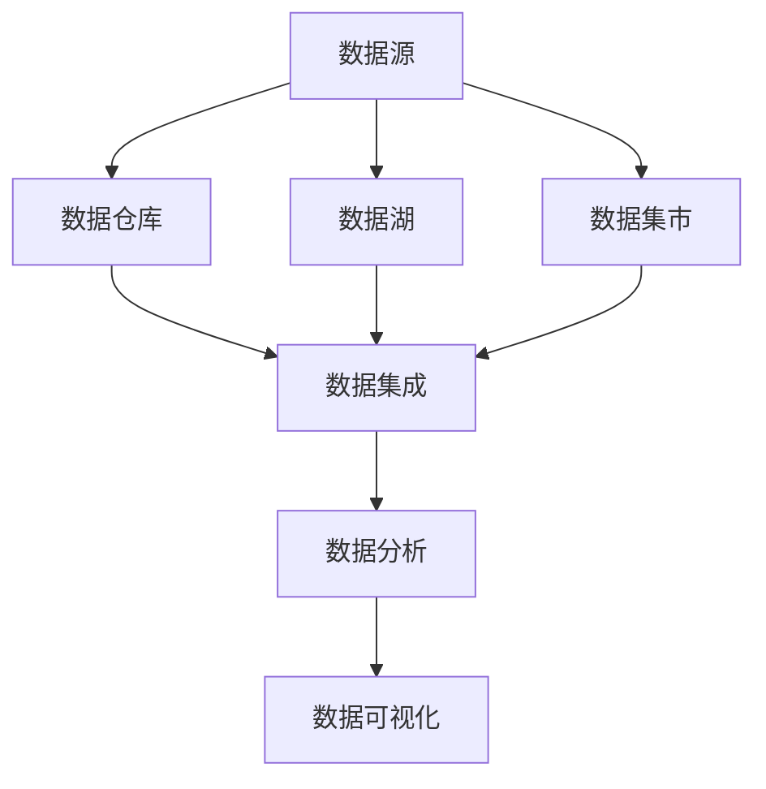

                 

### 大数据与商业智能：简介与重要性

在当今快速发展的数字经济时代，大数据与商业智能（BI）的结合已经成为企业提升竞争力、实现持续增长的关键因素。本文旨在深入探讨大数据在商业智能中的应用，通过逐步分析，揭示其如何辅助决策与预测，为企业带来显著的商业价值。

#### 什么是大数据？

首先，让我们回顾一下大数据的定义。大数据通常指的是那些规模巨大、类型繁多且产生速度极快的海量数据集合。其特点可以用4V来概括：**Volume（海量）**、**Variety（多样性）**、**Velocity（速度）**和**Value（价值）**。大数据不仅仅是简单的数据量庞大，更重要的是数据的多样性、处理速度以及从中提取的有价值的信息。

#### 什么是商业智能？

商业智能则是一种利用技术、分析和数据来优化企业决策和运营的方法论。它涵盖了数据采集、数据存储、数据处理、数据分析、数据可视化等各个环节，旨在通过数据驱动的洞察帮助企业做出更明智的决策。

#### 大数据在商业智能中的作用

大数据在商业智能中的作用主要体现在两个方面：**辅助决策**与**预测分析**。

1. **辅助决策**：大数据分析可以为企业提供丰富的数据支持，帮助企业更好地理解市场动态、客户行为和内部运营情况。通过数据挖掘、统计分析和机器学习等技术，企业可以识别出潜在的商业机会、优化运营流程、提高服务质量。

2. **预测分析**：大数据分析不仅能够揭示历史趋势，还可以通过对当前数据和外部信息的整合，预测未来的市场变化和业务发展。例如，通过对销售数据的分析，企业可以预测未来的销售趋势，提前调整库存和生产计划，以避免供应链中断或库存积压。

#### 本文结构

本文将分为三个主要部分进行详细探讨：

1. **第一部分：大数据与商业智能概述**。这一部分将介绍大数据与商业智能的基础理论，包括大数据的定义、特性，以及商业智能的概念和体系结构。

2. **第二部分：大数据处理与分析技术**。这一部分将深入探讨大数据处理与分析的技术，包括数据采集与存储、分布式计算框架、实时数据处理和数据分析技术。

3. **第三部分：大数据在商业智能中的应用案例**。这一部分将结合实际案例，详细分析大数据在市场营销、供应链管理、人力资源等领域的应用，展示其商业价值。

通过本文的逐步分析，我们希望读者能够深入了解大数据在商业智能中的应用，掌握如何利用大数据技术提升企业的决策能力和市场竞争力。

### 第一部分：大数据与商业智能概述

#### 第1章：大数据与商业智能的基础理论

##### 1.1 大数据的定义与特性

大数据（Big Data）是一个涵盖广泛、不断发展的领域，其定义和特性也在随着技术的进步而不断演变。首先，我们来探讨大数据的定义。

**大数据的定义**：

大数据是指那些数据规模巨大、数据类型多样且数据生成速度极快的海量数据集合。通常，大数据的规模以GB（千兆字节）、TB（太字节）甚至PB（拍字节）来衡量。大数据不仅仅是简单的数据量庞大，更重要的是其 **多样性**、**速度** 和 **价值** 这三大特性。

- **Volume（海量）**：大数据的 **量** 是其最显著的特点。随着物联网、社交媒体和移动设备等技术的发展，企业每天生成和收集的数据量呈爆炸式增长。处理这些海量数据需要高效的技术和算法。

- **Variety（多样性）**：大数据的 **类型** 也是其一大特性。传统的关系数据库主要处理结构化数据，而大数据领域则包含了结构化、半结构化和非结构化数据，如文本、图像、音频、视频等。这种多样性使得数据处理和分析变得更加复杂。

- **Velocity（速度）**：大数据的 **速度** 指的是数据生成和处理的 **快速**。实时数据分析、流处理技术等的发展，使得企业能够快速捕捉和分析数据，从而做出更及时的决策。

- **Value（价值）**：尽管大数据规模庞大，但并不是所有的数据都有价值。从海量数据中提取有价值的信息是大数据的核心目标。通过数据挖掘、机器学习和深度学习等技术，企业可以从海量数据中提取洞见，从而指导决策。

**大数据的特性对比表格**：

| 特性      | 解释                                      | 对数据处理的挑战                  |
|-----------|------------------------------------------|-----------------------------------|
| 海量（Volume） | 数据量巨大，通常以TB或PB计量               | 需要高效的存储和处理技术            |
| 多样性（Variety） | 包含多种数据类型，如结构化、半结构化和非结构化 | 需要支持多种数据类型的处理和分析技术 |
| 速度（Velocity） | 数据生成和处理速度快                      | 需要实时数据处理和流处理技术        |
| 价值（Value） | 数据中蕴含着价值，但并非所有数据都有价值      | 需要有效的数据挖掘和机器学习技术    |

通过上述表格，我们可以更直观地了解大数据的四大特性及其对数据处理的挑战。

**ER实体关系图架构**：

为了更好地理解大数据的处理过程，我们引入ER（实体-关系）图来描述大数据的实体和关系。


在上图中，我们定义了以下几个实体：

- **数据源（Data Source）**：数据生成的源头，如传感器、网站点击流、社交媒体等。
- **数据仓库（Data Warehouse）**：用于存储和管理大规模数据集的数据库。
- **数据湖（Data Lake）**：用于存储各种类型数据的存储系统，通常以原始数据形式保存。
- **数据集市（Data Mart）**：为特定部门或业务线设计的数据存储区域。

这些实体之间通过不同的关系进行连接，如 **数据采集（Data Collection）**、**数据处理（Data Processing）** 和 **数据整合（Data Integration）** 等。

通过ER图，我们可以清晰地看到大数据处理的基本框架，为后续的讨论奠定了基础。

##### 1.2 商业智能的概念与体系结构

**商业智能的概念**：

商业智能（Business Intelligence，简称BI）是指利用技术、分析和数据来优化企业决策和运营的方法论。它涵盖了从数据采集、数据存储、数据处理到数据分析、数据可视化的全过程。商业智能的目的是通过数据驱动的洞察，帮助企业更好地理解市场动态、优化运营流程、提高服务质量。

**商业智能的体系结构**：

商业智能的体系结构通常包括以下几个关键组件：

1. **数据源（Data Sources）**：
   - **内部数据源**：企业内部的各种数据，如销售数据、财务数据、人力资源数据等。
   - **外部数据源**：来自外部数据源的数据，如社交媒体数据、市场调查数据、天气数据等。

2. **数据仓库（Data Warehouse）**：
   - 数据仓库是一个集中存储大量数据的数据库，用于支持复杂查询和分析。数据仓库通常采用多维数据模型，便于数据切片和切块。

3. **数据湖（Data Lake）**：
   - 数据湖是一种新的数据存储架构，用于存储大量非结构化和半结构化数据。与数据仓库不同，数据湖通常以原始数据形式保存，以便后续处理和分析。

4. **数据集市（Data Mart）**：
   - 数据集市是专门为特定部门或业务线设计的子数据仓库，用于提供特定领域的分析数据。例如，销售部门可能有销售数据集市，人力资源部门可能有员工数据集市。

5. **数据集成（Data Integration）**：
   - 数据集成是将来自不同数据源的数据进行整合、清洗和转换，以便在数据仓库或数据湖中进行存储和分析。数据集成是商业智能的核心环节，确保数据的一致性和完整性。

6. **数据分析（Data Analysis）**：
   - 数据分析是指通过各种统计方法和数据分析工具，对大量数据进行处理和分析，提取有价值的信息。数据分析包括数据挖掘、机器学习、统计分析等方法。

7. **数据可视化（Data Visualization）**：
   - 数据可视化是将数据分析结果以图形化方式展示，使数据更易于理解和分析。数据可视化工具如Tableau、PowerBI等，可以帮助用户直观地查看数据趋势和关系。

**商业智能体系结构的mermaid流程图**：



通过上述mermaid流程图，我们可以看到商业智能体系结构中各组件之间的交互和关系。数据源的数据经过数据集成后存储在数据仓库或数据湖中，随后通过数据分析提取有价值的信息，并通过数据可视化进行展示，帮助企业做出更明智的决策。

##### 1.3 大数据在商业智能中的作用

**辅助决策**：

大数据在商业智能中首先体现在辅助决策方面。通过大数据分析，企业可以深入理解市场动态、客户行为和内部运营情况。例如，销售数据中的购买趋势和客户反馈可以帮助企业调整市场策略，生产数据中的设备故障率和运行效率可以帮助企业优化生产流程。

**预测分析**：

除了辅助决策，大数据在商业智能中的另一个重要作用是预测分析。通过对历史数据和当前趋势的分析，企业可以预测未来的市场变化和业务发展。例如，通过对社交媒体数据的分析，企业可以预测即将流行的产品或趋势，从而提前进行市场布局。

**实际案例**：

为了更好地理解大数据在商业智能中的应用，我们可以通过一些实际案例进行说明。

- **市场营销**：一家在线零售公司利用大数据分析客户购买行为，预测未来市场需求，从而调整库存和采购策略，避免了库存积压和缺货现象。

- **供应链管理**：一家制造企业通过分析供应链数据，预测原材料需求，优化库存管理，提高了供应链的效率和灵活性。

- **人力资源**：一家科技公司利用大数据分析员工绩效和离职率，优化招聘和培训策略，提高了员工满意度和留存率。

通过这些实际案例，我们可以看到大数据在商业智能中的应用已经深入到企业的各个方面，帮助企业提高决策效率和市场竞争力。

#### 总结

通过本章的讨论，我们深入探讨了大数据与商业智能的基础理论。首先，我们了解了大数据的定义和特性，包括海量、多样性、速度和价值。接着，我们介绍了商业智能的概念和体系结构，包括数据源、数据仓库、数据湖、数据集市、数据集成、数据分析和数据可视化等关键组件。最后，我们分析了大数据在商业智能中的作用，包括辅助决策和预测分析。这些基础理论为后续章节的深入探讨奠定了坚实的理论基础。

### 第2章：大数据处理与分析技术

#### 2.1 数据采集

数据采集是大数据处理与分析的重要环节，它决定了数据的质量和完整性。有效的数据采集不仅可以提供准确的业务信息，还可以为后续的数据处理和分析提供坚实的基础。

**数据采集的渠道**：

1. **企业内部数据**：
   - **销售数据**：记录每笔销售交易，包括销售额、购买产品、客户信息等。
   - **运营数据**：包括生产数据、设备状态、物流数据等。
   - **客户服务数据**：记录客户互动历史、反馈、投诉等。

2. **外部数据源**：
   - **社交媒体数据**：包括社交媒体平台的用户行为、评论、分享等。
   - **市场调查数据**：通过问卷调查、访谈等方式收集的市场需求信息。
   - **公共数据**：政府机构、行业协会等发布的公开数据，如人口统计、经济指标等。

3. **社交媒体数据**：
   - **用户行为数据**：社交媒体用户的点击、浏览、搜索等行为数据。
   - **内容数据**：社交媒体上的文本、图片、视频等。

**数据采集工具**：

- **Elasticsearch**：一款高性能的搜索引擎，用于实时处理和分析大规模文本数据。
- **Kafka**：一款分布式流处理平台，用于实时数据采集和传输。
- **Apache Flume**：一款分布式、可靠且可扩展的数据采集工具，适用于大规模数据采集场景。

通过这些数据采集工具，企业可以高效地收集和整合来自不同渠道的数据，为后续的数据处理和分析做好准备。

**数据采集的实际案例**：

- **在线零售公司**：通过网站日志和用户行为数据采集，分析用户购买习惯和偏好，优化营销策略和库存管理。
- **银行**：通过ATM机、POS机和网银等渠道采集交易数据，实时监控风险和管理客户关系。

#### 2.2 数据存储

数据存储是大数据处理的核心环节，它决定了数据的安全性和可访问性。大数据的存储需求巨大，因此需要选择合适的存储解决方案。

**数据仓库**：

数据仓库是一种集中存储和管理大规模数据集的数据库，通常用于支持复杂查询和分析。数据仓库的特点包括：

- **大规模数据存储**：数据仓库可以存储数十亿甚至数千亿条记录。
- **多维数据模型**：数据仓库采用多维数据模型，便于数据的切片和切块。
- **数据一致性**：数据仓库确保数据的一致性和完整性，便于后续分析。

**NoSQL数据库**：

NoSQL（Not Only SQL）数据库是一种非关系型数据库，适用于存储非结构化和半结构化数据。NoSQL数据库的特点包括：

- **灵活的数据模型**：NoSQL数据库采用灵活的数据模型，可以存储各种类型的数据，如文本、图像、视频等。
- **高扩展性**：NoSQL数据库具有水平扩展能力，可以轻松处理海量数据。
- **高性能**：NoSQL数据库通常采用分布式架构，能够快速处理大量数据。

常见的NoSQL数据库包括：

- **MongoDB**：一款文档型数据库，适用于存储大量非结构化数据。
- **Cassandra**：一款分布式列存储数据库，适用于大规模数据存储和实时查询。
- **HBase**：一款分布式存储系统，基于Hadoop平台，适用于大规模数据存储和实时访问。

**数据仓库与NoSQL数据库的对比表格**：

| 特性            | 数据仓库                       | NoSQL数据库                    |
|----------------|-------------------------------|--------------------------------|
| 数据模型        | 结构化数据，多维数据模型       | 非结构化数据，灵活的数据模型     |
| 扩展性          | 高扩展性，但通常垂直扩展       | 水平扩展性，易于分布式部署       |
| 性能            | 高性能查询，适合复杂分析       | 高性能读写，适用于大规模数据集   |
| 适合场景        | 复杂查询和分析，历史数据存储   | 大规模实时数据处理，非结构化数据 |

通过上述对比表格，我们可以更清晰地了解数据仓库和NoSQL数据库的不同特点，以及它们适用的场景。

**数据存储的实际案例**：

- **电商公司**：使用数据仓库存储销售数据、客户数据和产品信息，通过复杂查询和分析优化营销策略和库存管理。
- **金融机构**：使用NoSQL数据库存储交易数据、用户数据和日志信息，确保数据的实时性和高性能。

#### 2.3 数据处理技术

数据处理是大数据处理与分析的关键环节，它决定了数据的质量和可用性。有效的数据处理技术可以确保数据的准确性、一致性和完整性。

**分布式计算框架**：

分布式计算框架是处理大规模数据集的重要工具，它通过将数据分布到多个节点进行并行处理，从而提高数据处理效率。常见的分布式计算框架包括：

- **MapReduce**：一种基于分而治之思想的大规模数据处理框架，适用于批处理场景。
- **Hadoop**：一个开源的大数据处理平台，基于MapReduce框架，提供分布式存储和计算能力。

**实时数据处理**：

实时数据处理技术适用于需要快速响应的场景，如在线交易、实时监控等。常见的实时数据处理框架包括：

- **Apache Kafka**：一款分布式流处理平台，适用于实时数据采集和传输。
- **Apache Flink**：一款分布式流处理框架，提供高性能和易用性，适用于大规模实时数据处理。

**数据处理技术的实际案例**：

- **社交媒体平台**：使用Apache Kafka进行实时数据采集和传输，处理海量用户数据，实时更新用户信息和内容。
- **金融服务公司**：使用Hadoop平台进行大规模数据存储和处理，实时监控交易数据，确保金融系统的安全性和稳定性。

#### 总结

通过本章的讨论，我们深入探讨了大数据处理与分析技术。首先，我们介绍了数据采集的渠道和工具，包括企业内部数据、外部数据源和社交媒体数据，以及常用的数据采集工具。接着，我们讨论了数据存储的解决方案，包括数据仓库和NoSQL数据库，并对比了它们的特点和适用场景。最后，我们介绍了分布式计算框架和实时数据处理技术，并提供了实际案例来展示其应用。这些技术为后续的大数据分析奠定了基础，帮助企业在海量数据中提取有价值的信息。

### 第3章：大数据分析技术

大数据分析是商业智能的核心环节，通过深入挖掘和分析海量数据，企业可以获取有价值的洞察，优化业务决策。本章将详细介绍大数据分析的主要技术，包括数据挖掘技术、数据可视化技术和相关工具。

#### 3.1 数据挖掘技术

数据挖掘（Data Mining）是一种通过算法和统计方法，从大量数据中提取有用信息和知识的过程。数据挖掘技术广泛应用于市场营销、风险管理、供应链管理等多个领域。以下是几种常见的数据挖掘技术：

**分类与预测**：

分类（Classification）是一种将数据分组为不同类别的技术。常见的分类算法包括：

- **线性回归（Linear Regression）**：通过建立回归模型，预测连续值输出。
  - **公式**：
    $$
    \hat{y} = \beta_0 + \beta_1x
    $$
  - **应用**：销售预测、股票价格预测等。

- **逻辑回归（Logistic Regression）**：通过建立逻辑模型，预测二分类输出。
  - **公式**：
    $$
    P(y=1) = \frac{1}{1 + e^{-(\beta_0 + \beta_1x})}
    $$
  - **应用**：信用评分、客户流失预测等。

**聚类分析**：

聚类（Clustering）是一种将相似数据点归为一类的技术。常见的聚类算法包括：

- **K-means聚类**：通过迭代计算，将数据点划分为K个聚类。
  - **公式**：
    $$
    \text{Cost} = \sum_{i=1}^n \sum_{j=1}^k (x_i - \mu_j)^2
    $$
  - **应用**：市场细分、客户分类等。

- **层次聚类**：通过逐步合并相似的数据点，形成层次结构。
  - **应用**：客户细分、用户行为分析等。

**关联规则挖掘**：

关联规则挖掘（Association Rule Mining）是一种发现数据之间关联规则的技术。常见的算法包括：

- **Apriori算法**：通过扫描交易数据，发现频繁项集，并生成关联规则。
  - **应用**：推荐系统、市场篮子分析等。

**案例**：

假设一家电商平台希望通过数据挖掘预测客户购买行为。首先，收集客户的购买历史数据，然后使用逻辑回归算法预测客户是否会在未来30天内购买特定商品。通过训练数据集，得到预测模型，并在测试数据集上进行验证。结果发现，使用逻辑回归模型可以准确预测客户的购买行为，提高了营销策略的有效性。

**Python代码示例**：

```python
from sklearn.linear_model import LogisticRegression
from sklearn.model_selection import train_test_split
from sklearn.metrics import accuracy_score

# 数据预处理
X = df[['age', 'income', 'previous_orders']]
y = df['will_purchase']

# 划分训练集和测试集
X_train, X_test, y_train, y_test = train_test_split(X, y, test_size=0.2, random_state=42)

# 建立逻辑回归模型
model = LogisticRegression()
model.fit(X_train, y_train)

# 预测测试集
y_pred = model.predict(X_test)

# 计算准确率
accuracy = accuracy_score(y_test, y_pred)
print(f"Accuracy: {accuracy}")
```

通过以上代码示例，我们可以看到如何使用Python进行数据预处理、模型训练和预测，并计算模型的准确率。

#### 3.2 数据可视化技术

数据可视化（Data Visualization）是将数据分析结果以图形化方式展示，使数据更易于理解和分析的技术。常见的数据可视化工具包括：

- **Tableau**：一款强大的数据可视化工具，提供丰富的图表和仪表盘功能。
- **PowerBI**：一款由Microsoft开发的商业智能工具，支持多种数据源和可视化图表。
- **Matplotlib**：Python中的一个绘图库，用于生成各种统计图表。

**常见数据可视化图表**：

- **柱状图**：用于比较不同类别的数据。
- **折线图**：用于展示数据的变化趋势。
- **散点图**：用于显示数据点之间的关系。
- **饼图**：用于展示各类别数据所占的比例。

**案例**：

假设一家零售公司希望通过数据可视化分析不同促销活动对销售业绩的影响。首先，收集促销活动和销售数据，然后使用Tableau创建柱状图，比较不同促销活动期间的销售额。通过柱状图，可以直观地看到哪些促销活动对销售业绩有显著提升。

**Tableau可视化示例**：


通过以上柱状图，我们可以清楚地看到不同促销活动对销售业绩的贡献，从而指导后续的促销策略调整。

#### 总结

通过本章的讨论，我们深入探讨了大数据分析技术。首先，我们介绍了数据挖掘技术，包括分类与预测、聚类分析和关联规则挖掘，并通过实际案例展示了如何使用Python进行模型训练和预测。接着，我们介绍了数据可视化技术，包括常见的数据可视化工具和图表，并通过实际案例展示了如何使用Tableau进行数据可视化。这些大数据分析技术为企业提供了有力的工具，帮助他们在海量数据中提取有价值的信息，优化业务决策。

### 第三部分：大数据在商业智能中的应用案例

#### 第4章：市场营销中的大数据应用

市场营销是大数据应用的一个重要领域，通过大数据分析，企业可以深入了解市场动态、消费者行为和市场需求，从而制定更有效的营销策略。

##### 4.1 市场需求预测

市场需求预测是市场营销中的关键任务，它帮助企业预测未来一段时间内的产品需求，以便制定库存和生产计划。大数据分析技术在这一过程中发挥着重要作用。

**需求预测模型**：

常见的需求预测模型包括ARIMA（自回归积分滑动平均模型）和LSTM（长短期记忆网络）。

- **ARIMA模型**：

ARIMA模型是一种经典的时序预测模型，适用于具有稳定均值和自回归特性的时间序列数据。其核心思想是通过自回归、差分和移动平均等方法，对时间序列数据进行建模和预测。

- **公式**：

$$
y_t = c + \phi_1y_{t-1} + \phi_2y_{t-2} + ... + \phi_dy_{t-d} + \theta_1\epsilon_{t-1} + \theta_2\epsilon_{t-2} + ... + \theta_dy_{t-d}
$$

- **应用**：

使用ARIMA模型预测未来一段时间内的销售额、库存需求等。

- **案例**：

一家电商企业通过收集历史销售数据，使用ARIMA模型进行需求预测。通过对数据进行预处理、模型参数优化和预测结果验证，成功预测了未来一个月的销售额，帮助企业合理安排库存和采购计划。

- **Python代码示例**：

```python
import statsmodels.api as sm

# 数据预处理
data = df['sales']
data_diff = sm.tsa.diff(data).dropna()

# 建立ARIMA模型
model = sm.tsa.ARIMA(data_diff, order=(1, 1, 1))
model_fit = model.fit()

# 预测未来数据
forecast = model_fit.forecast(steps=30)

print(f"Predicted sales for next 30 days: {forecast}")
```

- **LSTM模型**：

LSTM模型是一种深度学习模型，适用于具有长期依赖性和非线性关系的时间序列数据。其核心思想是通过记忆单元来捕捉时间序列数据中的长期依赖性。

- **公式**：

$$
h_t = \sigma(W_hh \cdot h_{t-1} + W_{xx} \cdot x_t + b_h)
$$

- **应用**：

使用LSTM模型进行复杂时间序列数据的预测，如股票价格、能源消耗等。

- **案例**：

一家能源公司通过收集历史能源消耗数据，使用LSTM模型进行需求预测。通过对数据进行预处理、模型参数优化和预测结果验证，成功预测了未来几个月的能源消耗量，帮助企业优化能源生产和调度。

**总结**：

通过市场需求预测模型，企业可以提前了解未来的市场需求，合理安排生产和库存，提高运营效率。同时，通过不断优化和改进模型，企业可以不断提高预测的准确性，从而更好地应对市场变化。

##### 4.2 消费者行为分析

消费者行为分析是市场营销中的另一个关键任务，它帮助企业了解消费者的购买习惯、偏好和行为模式，从而制定更精准的营销策略。

**用户画像**：

用户画像（User Profile）是一种通过分析用户行为数据，构建用户特征和需求模型的方法。常见的用户画像属性包括年龄、性别、地理位置、消费习惯、兴趣爱好等。

- **构建用户画像**：

通过大数据分析，企业可以从海量的用户行为数据中提取有价值的信息，构建详细的用户画像。例如，通过分析用户的购买记录、浏览历史、社交媒体行为等，企业可以了解用户的偏好和需求。

- **案例**：

一家电商企业通过收集用户的历史购买数据和浏览行为，使用大数据分析技术构建用户画像。通过对用户画像的分析，企业可以了解不同用户群体的购买习惯和偏好，从而制定个性化的营销策略，提高转化率和用户满意度。

- **用户画像应用**：

通过用户画像，企业可以实现以下应用：

1. **精准营销**：根据用户画像，企业可以向不同用户群体推送个性化的营销信息，提高营销效果。
2. **产品推荐**：根据用户画像，企业可以为用户提供个性化的产品推荐，提高用户购买意愿。
3. **客户关系管理**：通过用户画像，企业可以更好地了解客户需求，提供个性化的服务和体验，提高客户满意度。

**总结**：

通过消费者行为分析，企业可以更好地了解用户需求和购买行为，制定更精准的营销策略，提高用户满意度和转化率。同时，通过不断优化和改进用户画像模型，企业可以不断提高营销的精准度和效果。

#### 第5章：供应链管理中的大数据应用

供应链管理是企业运营的重要组成部分，通过大数据分析，企业可以优化供应链流程，提高供应链的效率和灵活性。

##### 5.1 供应链需求预测

供应链需求预测是供应链管理中的关键任务，它帮助企业预测未来一段时间内的原材料需求、产品需求等，以便合理安排生产和采购计划。

**预测模型**：

常见的供应链需求预测模型包括支持向量回归（SVR）和梯度提升决策树（GBDT）。

- **支持向量回归（SVR）**：

SVR是一种基于支持向量机的回归模型，适用于处理非线性时间序列预测问题。

- **公式**：

$$
\hat{y} = \beta_0 + \beta_1x + \beta_2x^2 + ... + \beta_nx^n
$$

- **应用**：

使用SVR模型预测供应链中的需求变化，如原材料需求、产品需求等。

- **案例**：

一家制造企业通过收集历史原材料需求和销售数据，使用SVR模型进行需求预测。通过对数据进行预处理、模型参数优化和预测结果验证，成功预测了未来三个月的原材料需求，帮助企业合理安排采购计划。

- **Python代码示例**：

```python
from sklearn.svm import SVR
from sklearn.model_selection import train_test_split
from sklearn.metrics import mean_squared_error

# 数据预处理
X = df[['historical_demand', 'sales']]
y = df['material_demand']

# 划分训练集和测试集
X_train, X_test, y_train, y_test = train_test_split(X, y, test_size=0.2, random_state=42)

# 建立SVR模型
model = SVR(kernel='linear')
model.fit(X_train, y_train)

# 预测测试集
y_pred = model.predict(X_test)

# 计算均方误差
mse = mean_squared_error(y_test, y_pred)
print(f"MSE: {mse}")
```

- **梯度提升决策树（GBDT）**：

GBDT是一种基于决策树的集成学习模型，适用于处理大规模和复杂的时间序列预测问题。

- **公式**：

$$
\hat{y} = \sum_{i=1}^n f_i(x) = \sum_{i=1}^n \alpha_i \cdot h_i(x)
$$

- **应用**：

使用GBDT模型进行供应链需求预测，如库存预测、销售预测等。

- **案例**：

一家零售企业通过收集历史销售数据和季节性因素，使用GBDT模型进行需求预测。通过对数据进行预处理、模型参数优化和预测结果验证，成功预测了未来一个月的销售需求，帮助企业优化库存管理。

**总结**：

通过供应链需求预测模型，企业可以提前了解未来的需求变化，合理安排生产和采购计划，提高供应链的效率和灵活性。同时，通过不断优化和改进模型，企业可以不断提高预测的准确性，从而更好地应对市场变化。

##### 5.2 库存优化

库存优化是供应链管理中的重要任务，通过优化库存管理，企业可以减少库存成本，提高资金利用率。

**库存优化算法**：

常见的库存优化算法包括ABC分类法、动态库存策略等。

- **ABC分类法**：

ABC分类法是一种基于库存价值占比的库存管理方法，根据库存物品的价值和重要程度将其分为A、B、C三类。

- **应用**：

使用ABC分类法，企业可以重点关注高价值、高重要度的库存物品，提高库存管理的效率和精准度。

- **案例**：

一家制造企业通过ABC分类法对库存物品进行分类管理。通过对库存数据进行分类和分析，企业成功优化了库存结构，降低了库存成本。

- **动态库存策略**：

动态库存策略是一种根据市场需求变化实时调整库存水平的库存管理方法。

- **应用**：

使用动态库存策略，企业可以根据市场需求的变化，实时调整库存水平，避免库存积压和缺货现象。

- **案例**：

一家电商平台通过动态库存策略，根据实时销售数据和市场预测，调整库存水平，成功避免了库存积压和缺货现象，提高了客户满意度。

**总结**：

通过库存优化算法，企业可以优化库存管理，减少库存成本，提高资金利用率。同时，通过不断优化和改进库存优化算法，企业可以不断提高库存管理的效率和精准度，从而更好地应对市场变化。

#### 第6章：人力资源中的大数据应用

人力资源是企业的核心资源，通过大数据分析，企业可以优化员工管理、提高员工满意度和留存率。

##### 6.1 员工绩效评估

员工绩效评估是人力资源管理中的重要任务，通过评估员工的工作表现，企业可以制定有针对性的培训和激励措施。

**绩效评估模型**：

常见的绩效评估模型包括基于数据驱动的KPI评估和员工行为分析。

- **基于数据驱动的KPI评估**：

基于数据驱动的KPI评估是一种通过量化指标来评估员工工作表现的方法。

- **应用**：

使用基于数据驱动的KPI评估，企业可以准确衡量员工的工作绩效，为薪酬调整和晋升提供依据。

- **案例**：

一家科技公司通过收集员工的工作数据和业绩指标，使用基于数据驱动的KPI评估模型，评估员工的工作表现。通过对评估结果进行分析，企业成功优化了薪酬体系，提高了员工的工作积极性。

- **员工行为分析**：

员工行为分析是一种通过分析员工的行为数据，评估员工工作表现的方法。

- **应用**：

使用员工行为分析，企业可以了解员工的工作习惯和偏好，为员工提供个性化的培训和指导。

- **案例**：

一家咨询公司通过收集员工的工作日志和社交媒体数据，使用员工行为分析模型，评估员工的工作表现。通过对评估结果进行分析，企业成功优化了员工培训计划，提高了员工的工作效率和满意度。

**总结**：

通过员工绩效评估模型，企业可以准确衡量员工的工作表现，制定有针对性的培训和激励措施，提高员工满意度和留存率。同时，通过不断优化和改进绩效评估模型，企业可以不断提高绩效评估的准确性和公平性。

##### 6.2 员工招聘与培训

员工招聘与培训是人力资源管理中的关键任务，通过大数据分析，企业可以优化招聘流程、提高招聘效率和员工素质。

**招聘策略优化**：

招聘策略优化是一种通过分析招聘数据，调整招聘策略和方法，提高招聘效率的方法。

- **应用**：

使用招聘策略优化，企业可以根据市场需求和公司战略，调整招聘渠道和招聘流程，提高招聘效率。

- **案例**：

一家互联网公司通过分析招聘数据和市场需求，优化招聘策略，提高了招聘效率。通过对招聘流程的调整，企业成功缩短了招聘周期，降低了招聘成本。

- **培训需求分析**：

培训需求分析是一种通过分析员工的工作表现和技能水平，确定培训需求的方法。

- **应用**：

使用培训需求分析，企业可以确定员工的培训需求，制定有针对性的培训计划。

- **案例**：

一家制造企业通过分析员工的工作表现和技能水平，使用培训需求分析方法，确定了员工的培训需求。通过对培训计划的有效执行，企业提高了员工的技能水平和工作效率。

**总结**：

通过招聘策略优化和培训需求分析，企业可以优化招聘流程、提高招聘效率和员工素质。同时，通过不断优化和改进招聘和培训策略，企业可以不断提高人力资源管理的效果，从而更好地支撑公司战略目标的实现。

### 第7章：大数据与商业智能发展趋势

#### 7.1 大数据技术的发展趋势

随着技术的不断进步，大数据技术也在不断演进和发展。以下是大数据技术的一些重要发展趋势：

**云计算与大数据的结合**：

云计算为大数据提供了强大的计算和存储资源，使得大数据处理和分析变得更加高效和便捷。云计算与大数据的结合，使得企业可以充分利用云资源的弹性扩展和成本效益，实现大规模数据存储和实时数据处理。

- **应用场景**：
  - **数据存储**：使用云存储服务（如Amazon S3、Google Cloud Storage）存储大规模数据。
  - **数据处理**：使用云上的大数据处理框架（如AWS EMR、Google Cloud Dataproc）进行数据分析和挖掘。
  - **数据可视化**：使用云服务（如Tableau Online、PowerBI）进行数据可视化和分析。

**边缘计算的发展**：

边缘计算将数据处理和分析推向数据产生的源头，减少数据传输和延迟，提高系统的实时性和响应速度。随着物联网（IoT）设备的普及，边缘计算在大数据处理中的应用越来越广泛。

- **应用场景**：
  - **智能制造**：在工厂设备上安装传感器，实时收集生产数据，通过边缘计算进行数据分析和故障预测。
  - **智能交通**：在交通节点部署边缘计算设备，实时处理交通数据，优化交通流量和信号控制。

**数据隐私和安全性的关注**：

随着大数据技术的广泛应用，数据隐私和安全性问题也日益突出。如何在保障数据隐私和安全的前提下，充分利用大数据的价值，成为大数据技术发展的重要方向。

- **应用场景**：
  - **数据脱敏**：在数据分析和挖掘过程中，对敏感数据进行脱敏处理，确保数据安全。
  - **数据安全法规**：制定和遵守数据安全法规（如GDPR、CCPA），确保企业数据合规。

**人工智能的融合**：

人工智能（AI）与大数据的结合，使得大数据分析变得更加智能化和自动化。通过机器学习和深度学习技术，企业可以从海量数据中提取更复杂的模式和洞察。

- **应用场景**：
  - **智能推荐系统**：利用AI技术分析用户行为数据，提供个性化的产品推荐。
  - **智能客服**：利用自然语言处理技术，实现智能客服机器人，提高客户服务质量。

#### 7.2 商业智能的发展方向

随着大数据技术的不断发展，商业智能（BI）也在不断演变，朝着更加智能化和自动化方向发展。以下是商业智能的一些重要发展方向：

**智能化商业智能系统**：

智能化商业智能系统是指利用人工智能技术提升商业智能系统的智能化水平，使其能够自动发现数据中的模式和洞察，提供更智能的决策支持。

- **应用场景**：
  - **自动化报告生成**：商业智能系统能够自动从数据中生成报告，减少人工工作量。
  - **智能预测分析**：利用机器学习算法，商业智能系统能够自动预测市场趋势和业务发展，为企业提供前瞻性建议。

**实时智能分析**：

实时智能分析是指能够在数据生成的同时进行实时分析和处理，提供即时的决策支持。

- **应用场景**：
  - **实时风险监控**：企业可以实时监控业务运营中的潜在风险，及时采取措施进行风险控制。
  - **实时销售分析**：企业可以实时分析销售数据，优化营销策略和库存管理。

**数据民主化**：

数据民主化是指让更多的人能够访问和使用数据，从而提升企业的数据文化，促进数据驱动的决策。

- **应用场景**：
  - **数据共享平台**：企业内部不同部门可以共享数据，促进跨部门协作和决策。
  - **自助分析工具**：非专业用户可以通过自助分析工具进行数据分析和探索，提升数据使用率。

**人工智能与大数据的结合**：

人工智能与大数据的结合，将推动商业智能的发展进入一个新的阶段。通过深度学习、自然语言处理等技术，商业智能系统能够从海量数据中提取更复杂和更深层次的洞察。

- **应用场景**：
  - **智能客服**：利用自然语言处理技术，智能客服系统能够更好地理解和回应用户的需求。
  - **智能推荐**：利用深度学习技术，智能推荐系统能够提供更个性化的产品和服务推荐。

#### 总结

通过本章的讨论，我们深入探讨了大数据与商业智能的发展趋势。首先，我们分析了大数据技术的发展方向，包括云计算与大数据的结合、边缘计算的发展、数据隐私和安全性的关注以及人工智能的融合。接着，我们讨论了商业智能的发展方向，包括智能化商业智能系统、实时智能分析、数据民主化和人工智能与大数据的结合。这些趋势将为大数据和商业智能领域带来更多的创新和应用，帮助企业实现更高的效率和竞争力。

### 附录

#### 附录A：常用大数据与商业智能工具

在大数据和商业智能领域，有许多常用的工具和技术，这些工具有助于数据采集、存储、处理和分析。以下是其中一些常用的工具及其基本介绍：

**数据仓库工具**：

1. **Oracle**：
   - **概述**：Oracle数据库是一款功能强大的关系型数据库，广泛用于企业级数据存储和管理。
   - **特点**：支持复杂查询、数据加密和高级数据安全功能。

2. **Teradata**：
   - **概述**：Teradata是一个高性能的数据仓库解决方案，适用于大规模数据集的存储和分析。
   - **特点**：支持多模型数据存储、实时分析和大数据处理。

**数据分析工具**：

1. **Python**：
   - **概述**：Python是一种高级编程语言，广泛应用于数据分析、数据科学和机器学习。
   - **特点**：丰富的数据科学库（如Pandas、NumPy、SciPy）、易于学习和使用。

2. **R语言**：
   - **概述**：R语言是一种专门用于统计分析和图形表示的编程语言。
   - **特点**：强大的统计库（如ggplot2、dplyr）、灵活的数据可视化工具。

3. **Tableau**：
   - **概述**：Tableau是一个流行的数据可视化工具，用于将数据分析结果以图形化方式展示。
   - **特点**：易于使用、丰富的可视化图表、强大的交互功能。

4. **PowerBI**：
   - **概述**：PowerBI是Microsoft的一款商业智能工具，提供数据集成、分析和可视化功能。
   - **特点**：与Microsoft 365集成、支持多种数据源、直观的可视化界面。

#### 附录B：数学模型与公式

在大数据和商业智能领域，许多数据分析技术都依赖于数学模型和公式。以下是几种常见模型及其相关公式：

**回归分析**：

1. **线性回归**：
   - **公式**：
     $$
     \hat{y} = \beta_0 + \beta_1x
     $$
   - **解释**：用于预测因变量y与自变量x之间的关系。

2. **逻辑回归**：
   - **公式**：
     $$
     P(y=1) = \frac{1}{1 + e^{-(\beta_0 + \beta_1x)}}
     $$
   - **解释**：用于二分类问题，预测某个事件发生的概率。

**时间序列模型**：

1. **ARIMA模型**：
   - **公式**：
     $$
     y_t = c + \phi_1y_{t-1} + \phi_2y_{t-2} + ... + \phi_dy_{t-d} + \theta_1\epsilon_{t-1} + \theta_2\epsilon_{t-2} + ... + \theta_dy_{t-d}
     $$
   - **解释**：用于分析具有自回归和移动平均特性的时间序列数据。

2. **LSTM模型**：
   - **公式**：
     $$
     h_t = \sigma(W_hh \cdot h_{t-1} + W_{xx} \cdot x_t + b_h)
     $$
   - **解释**：用于分析具有长期依赖性和非线性关系的时间序列数据。

**聚类分析**：

1. **K-means聚类**：
   - **公式**：
     $$
     \text{Cost} = \sum_{i=1}^n \sum_{j=1}^k (x_i - \mu_j)^2
     $$
   - **解释**：用于将数据点划分为K个聚类，通过最小化平方误差来优化聚类结果。

通过这些数学模型和公式，我们可以更好地理解和应用大数据分析技术，为企业提供数据驱动的决策支持。附录中提供的工具和公式有助于读者在实践过程中快速掌握相关技术和方法。

