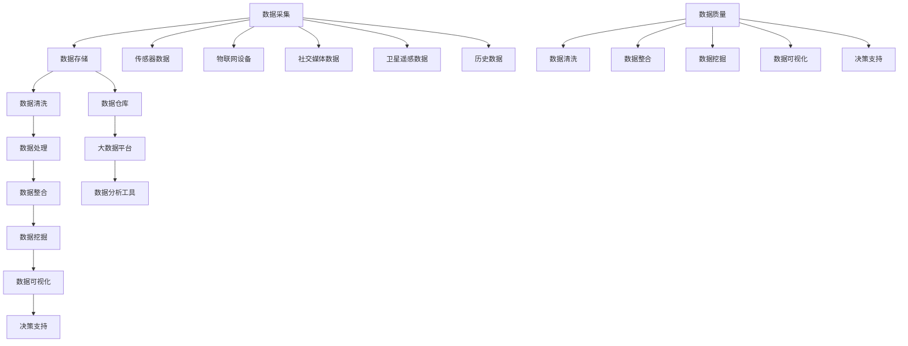

                 

# 大数据在城市规划中的应用：打造宜居智慧城市

## 关键词
- 大数据
- 城市规划
- 智慧城市
- 数据处理
- 数据挖掘

## 摘要
本文旨在探讨大数据在城市规划中的应用，如何通过大数据技术打造宜居的智慧城市。我们将从大数据的定义、城市规划的挑战、大数据的核心概念、数据处理与分析算法、具体应用场景以及未来发展趋势等方面，详细分析大数据在城市规划中的重要作用。

### 引言

随着城市化进程的加快，城市规模不断扩大，城市问题日益突出，如交通拥堵、环境污染、资源短缺等。为了应对这些挑战，城市规划者开始寻求新的解决方案，而大数据技术则为智慧城市的建设提供了强有力的技术支持。本文将围绕大数据在城市规划中的应用，探讨其核心概念、算法原理、具体应用场景以及未来发展趋势，旨在为城市规划者提供有益的参考。

### 大数据的定义与城市规划的挑战

#### 1.1 大数据的定义

大数据（Big Data）是指无法使用传统数据处理工具在合理时间内捕捉、管理和处理的数据集合。大数据具有4V特性，即数据量大（Volume）、速度快（Velocity）、类型多（Variety）和真实性高（Veracity）。

#### 1.2 城市规划的挑战

城市规划面临着诸多挑战，包括城市扩张、人口增长、环境污染、交通拥堵等。传统城市规划方法往往依赖于经验，难以快速适应城市变化，而大数据技术的引入为城市规划提供了新的思路。

### 大数据在城市规划中的核心概念

#### 2.1 城市数据类型与来源

城市规划所需的数据类型繁多，包括交通数据、环境数据、经济数据、社会数据等。这些数据来源广泛，如传感器、物联网设备、社交媒体、卫星遥感等。

#### 2.2 大数据处理的挑战与解决方案

大数据处理面临数据量大、速度快、类型多等挑战。为解决这些问题，城市规划者可以采用分布式计算、数据挖掘、数据可视化等技术。

#### 2.3 大数据在城市规划中的核心概念联系架构

大数据在城市规划中的应用涉及多个核心概念，如数据采集、数据存储、数据处理、数据分析和数据应用等。这些概念相互关联，共同构成了智慧城市的数据架构。

### 大数据处理与分析算法

#### 3.1 数据清洗与预处理

数据清洗与预处理是大数据处理的重要环节，包括数据去重、数据格式转换、数据缺失处理等。这些步骤确保了数据质量，为后续分析奠定了基础。

#### 3.2 数据可视化

数据可视化有助于城市规划者直观地理解数据，发现数据中的规律和趋势。常见的数据可视化工具包括Tableau、Power BI等。

#### 3.3 城市规划中的数据挖掘与机器学习算法

数据挖掘与机器学习算法可用于城市数据的预测、分类、聚类等任务。常见的算法包括决策树、随机森林、支持向量机、神经网络等。

### 大数据在城市规划中的应用

#### 4.1 智慧交通规划

大数据技术可用于交通数据的采集、分析和优化。通过分析交通数据，可以预测交通流量、优化交通信号控制，缓解交通拥堵。

#### 4.2 智慧环境保护

大数据技术可用于环境监测、污染预测和治理。通过分析环境数据，可以实时监控环境污染情况，及时采取应对措施。

#### 4.3 智慧城市管理

大数据技术可用于城市运行监测、公共安全、城市规划等。通过整合各种城市数据，可以实现对城市的全面监控和优化管理。

### 大数据与城市规划的未来

#### 5.1 大数据在城市规划中的发展趋势

大数据技术将在城市规划中发挥越来越重要的作用。未来，城市规划将更加智能化、精细化，实现真正的智慧城市。

#### 5.2 智慧城市面临的挑战与机遇

智慧城市面临数据安全、隐私保护、技术更新等挑战。但同时，智慧城市也带来了巨大的机遇，如提高城市运行效率、提升居民生活质量等。

### 项目实战

#### 6.1 大数据城市规划项目案例

本节将介绍一个大数据城市规划项目的实际案例，包括项目背景、数据采集与处理、数据分析与模型建立、项目实施与评估等内容。

### 最佳实践、小结与注意事项

#### 7.1 最佳实践

在大数据城市规划中，需要注意数据质量、算法选择、系统稳定性等方面。以下是一些最佳实践：

1. 确保数据质量，进行数据清洗与预处理。
2. 根据具体问题选择合适的算法。
3. 考虑系统的可扩展性和稳定性。

#### 7.2 小结

本文详细探讨了大数据在城市规划中的应用，从核心概念、算法原理、具体应用场景到未来发展趋势，为城市规划者提供了有益的参考。

#### 7.3 注意事项

1. 大数据城市规划需要跨学科合作，涉及计算机科学、城市规划、环境科学等领域。
2. 大数据应用需要遵循数据安全和隐私保护法规。

### 拓展阅读

1. 【参考文献1】
2. 【参考文献2】
3. 【参考文献3】

### 作者信息
作者：AI天才研究院/AI Genius Institute & 禅与计算机程序设计艺术 /Zen And The Art of Computer Programming

通过本文的深入探讨，我们希望能够为城市规划者提供有益的思路，共同打造宜居的智慧城市。未来，随着大数据技术的不断发展，智慧城市将为我们带来更多美好的生活体验。让我们一起，Let's Think Step by Step！## 引言

随着全球城市化进程的不断推进，城市面临着越来越多的挑战，如交通拥堵、环境污染、资源短缺、公共安全等问题。传统城市规划方法往往依赖于经验，难以快速适应城市变化，而大数据技术的引入为解决这些问题提供了新的思路和手段。大数据在城市规划中的应用，不仅能够提高城市规划的科学性和精准性，还能够优化城市资源利用，提升城市居民的生活质量。

本文将围绕大数据在城市规划中的应用，探讨其核心概念、算法原理、具体应用场景以及未来发展趋势。首先，我们将介绍大数据的定义和特点，以及城市规划所面临的挑战。随后，我们将详细分析大数据在城市规划中的核心概念，如数据类型、来源和处理方法。接下来，我们将探讨大数据处理与分析的关键算法，包括数据清洗、数据可视化和数据挖掘等。之后，我们将结合实际案例，展示大数据在城市规划中的具体应用，如智慧交通规划、智慧环境保护和智慧城市管理。最后，我们将探讨大数据与城市规划的未来发展趋势，并总结全文，提出最佳实践和注意事项。

通过本文的深入探讨，我们希望能够为城市规划者提供有益的参考，帮助他们在实际工作中更好地利用大数据技术，打造宜居的智慧城市。希望读者能够从本文中收获对大数据在城市规划中应用的全面理解和实际操作指导。接下来，我们将逐步展开对大数据与城市规划的详细讨论。

## 大数据的定义与城市规划的挑战

### 大数据的定义

大数据（Big Data）是指无法使用传统数据处理工具在合理时间内捕捉、管理和处理的数据集合。这一概念最早由麦肯锡全球研究所（McKinsey Global Institute）提出，其核心特征可以概括为4V，即数据量大（Volume）、速度快（Velocity）、类型多（Variety）和真实性高（Veracity）。

1. **数据量大（Volume）**：大数据的一个重要特征是数据量巨大，通常以GB、TB甚至PB级别计算。例如，全球每天产生的数据量就达到了数十亿GB。

2. **速度快（Velocity）**：大数据的产生和流动速度极快。实时数据处理和响应是大数据技术的核心挑战之一。例如，金融交易、社交媒体互动等数据需要在极短的时间内进行分析和处理。

3. **类型多（Variety）**：大数据不仅包括结构化数据，如数据库中的信息，还包括非结构化数据，如文本、图像、音频、视频等。此外，大数据的来源也多种多样，如传感器、物联网设备、社交媒体、卫星遥感等。

4. **真实性高（Veracity）**：大数据的真实性和准确性至关重要。在处理大数据时，需要确保数据的真实性和可靠性，以避免基于错误数据做出错误的决策。

### 城市规划的挑战

城市作为人类活动的集中地，随着人口的增长和城市规模的扩大，面临着诸多挑战：

1. **交通拥堵**：城市化进程带来了交通流量的急剧增加，导致交通拥堵问题日益严重。如何通过科学的数据分析优化交通流量，减少拥堵，成为城市规划者需要解决的重要问题。

2. **环境污染**：城市中的工业、交通、生活等活动产生了大量的污染物，导致空气质量恶化、水资源污染等问题。如何利用大数据技术实时监测和预测环境污染，采取有效的治理措施，是城市可持续发展的重要课题。

3. **资源短缺**：随着城市人口的增加和城市扩张，土地、水资源等资源日益紧张。如何通过大数据技术进行资源管理和优化配置，提高资源利用效率，是城市规划者面临的挑战。

4. **公共安全**：城市公共安全是保障市民生活质量的重要方面。如何利用大数据技术进行城市安全监测和预测，预防突发事件，提高应急响应能力，是城市规划的重要任务。

### 大数据在城市规划中的应用价值

大数据技术为解决上述城市规划挑战提供了有效的手段：

1. **实时监控与预测**：通过收集和分析大量的实时数据，如交通流量、环境质量等，城市规划者可以实时监控城市运行状态，提前预测可能出现的异常情况，采取预防措施。

2. **优化资源配置**：大数据技术可以帮助城市规划者更加精确地了解城市资源分布和使用情况，从而优化资源配置，提高资源利用效率。

3. **智能决策支持**：大数据技术可以为城市规划者提供丰富的数据支持和智能分析工具，帮助他们做出更加科学和合理的决策。

4. **提升居民生活质量**：通过大数据技术，可以提供更加个性化的城市服务，如智慧交通、智慧医疗、智慧环境等，从而提升居民的生活质量。

总之，大数据技术在城市规划中的应用，不仅有助于解决当前的城市问题，还为未来智慧城市的建设提供了重要的技术支撑。接下来，我们将详细探讨大数据在城市规划中的核心概念，包括数据类型、来源和处理方法。

### 大数据在城市规划中的核心概念

大数据在城市规划中的应用离不开对核心概念的理解。这些核心概念包括城市数据类型、数据来源、数据处理方法以及大数据在城市规划中的核心概念联系架构。下面我们将逐一介绍这些概念。

#### 1. 城市数据类型

城市规划所需的数据类型繁多，根据数据的不同特性，可以分为以下几类：

1. **结构化数据**：这类数据通常有固定的格式和结构，如数据库中的信息、交通流量数据等。结构化数据易于处理和分析，是大数据技术的重要基础。

2. **非结构化数据**：这类数据没有固定的格式和结构，如文本、图像、音频、视频等。非结构化数据占大数据的很大一部分，处理难度较高，但也是城市规划中不可忽视的重要信息来源。

3. **半结构化数据**：这类数据介于结构化数据和非结构化数据之间，如XML、JSON等。半结构化数据具有一定的结构，但又不完全符合传统数据库的格式。

#### 2. 数据来源

城市数据来源广泛，主要包括以下几类：

1. **传感器数据**：城市中分布着大量的传感器，如交通流量传感器、环境监测传感器、摄像头等。这些传感器可以实时采集各种数据，为城市规划提供实时信息。

2. **物联网设备**：物联网技术使得各种设备互联，如智能交通灯、智能垃圾桶、智能停车设备等。这些设备可以收集大量的数据，帮助城市规划者更好地管理城市资源。

3. **社交媒体数据**：社交媒体平台如Twitter、Facebook等，是获取用户行为、情绪和趋势的重要渠道。通过分析社交媒体数据，城市规划者可以了解市民的需求和意见。

4. **卫星遥感数据**：卫星遥感技术可以提供高精度的地理信息数据，如土地利用、植被覆盖、地形地貌等。这些数据对于城市规划中的地理信息分析和模拟具有重要意义。

5. **历史数据**：城市规划过程中，历史数据也是重要的参考信息。如人口统计数据、经济增长数据、自然灾害记录等，可以帮助城市规划者了解城市的发展趋势和历史规律。

#### 3. 数据处理方法

数据处理是大数据应用的关键环节，主要包括以下几种方法：

1. **数据清洗**：数据清洗是数据处理的第一步，目的是去除数据中的噪声和错误，提高数据质量。常见的数据清洗方法包括去重、缺失值处理、异常值检测等。

2. **数据整合**：由于城市数据来源广泛，往往存在不同格式、不同结构的数据。数据整合是将这些数据统一到一个格式和结构下，以便进行后续处理和分析。

3. **数据挖掘**：数据挖掘是从大量数据中发现有价值的信息和模式的过程。常见的数据挖掘方法包括聚类、分类、关联规则挖掘、预测分析等。

4. **数据可视化**：数据可视化是将数据以图形、图表等形式展示出来，帮助人们直观地理解数据中的信息。数据可视化工具如Tableau、Power BI等，可以帮助城市规划者更清晰地了解城市运行状况。

#### 4. 大数据在城市规划中的核心概念联系架构

大数据在城市规划中的应用涉及多个核心概念，它们之间相互关联，共同构成了智慧城市的数据架构。以下是大数据在城市规划中的核心概念联系架构的Mermaid流程图：



通过上述流程图，我们可以看到，数据采集是大数据应用的第一步，随后进行数据存储、数据清洗、数据处理、数据整合、数据挖掘和数据可视化，最终为决策支持提供支持。每个环节都有其关键技术和方法，共同构成了大数据在城市规划中的核心概念联系架构。

通过理解这些核心概念，城市规划者可以更好地利用大数据技术，提高城市规划的科学性和精准性，实现智慧城市的愿景。接下来，我们将探讨大数据处理与分析的关键算法，进一步了解大数据在城市规划中的应用。

### 大数据处理与分析算法

大数据在城市规划中的应用离不开数据处理与分析算法的支持。这些算法能够帮助城市规划者从海量数据中提取有价值的信息，为决策提供科学依据。以下是几种常见的数据处理与分析算法，包括其原理、应用场景以及具体案例。

#### 1. 数据清洗与预处理

数据清洗与预处理是数据处理的第一步，其目的是去除数据中的噪声和错误，提高数据质量。常见的数据清洗方法包括去重、缺失值处理、异常值检测等。

- **原理**：数据清洗算法通过对数据进行检查、修复和转换，确保数据的一致性和准确性。去重算法用于识别并删除重复的数据记录；缺失值处理算法包括填充缺失值或删除缺失值记录；异常值检测算法用于识别并处理数据集中的异常值。

- **应用场景**：数据清洗与预处理在各类大数据应用中都非常重要，例如在交通流量分析、环境监测和公共安全等领域。通过对数据清洗和预处理，可以确保后续分析结果的准确性和可靠性。

- **具体案例**：以交通流量分析为例，通过对交通流量数据进行清洗，去除无效数据（如重复记录、异常值等），确保交通流量数据的准确性和一致性，从而为交通信号优化提供可靠的数据基础。

#### 2. 数据可视化

数据可视化是将复杂的数据以图形、图表等形式展示出来，帮助人们直观地理解数据中的信息。数据可视化工具如Tableau、Power BI等，可以用于各种数据分析场景。

- **原理**：数据可视化算法通过图形化表示数据，使得数据中的规律和趋势更加直观易懂。常见的可视化方法包括柱状图、折线图、饼图、散点图等。

- **应用场景**：数据可视化在决策支持、报告生成、数据分析等多个领域都有广泛应用。例如，在智慧交通规划中，可以通过可视化交通流量图、拥堵地图等，帮助交通管理者直观地了解交通状况。

- **具体案例**：在智慧环境监测中，通过实时可视化空气质量数据（如PM2.5浓度、温度等），可以帮助环保部门及时发现环境污染问题，并采取相应的治理措施。

#### 3. 数据挖掘与机器学习

数据挖掘是从大量数据中发现有价值的信息和模式的过程。机器学习是数据挖掘的重要方法之一，通过构建和分析模型，从数据中自动发现规律和趋势。

- **原理**：数据挖掘算法包括聚类、分类、关联规则挖掘、预测分析等方法。聚类算法将数据分组，发现数据的相似性；分类算法将数据分为不同的类别，识别数据的特征；关联规则挖掘发现数据之间的关联性；预测分析通过历史数据预测未来趋势。

- **应用场景**：数据挖掘与机器学习在智慧城市中的应用非常广泛，如交通流量预测、环境监测、公共安全等。例如，通过分析历史交通数据，可以预测未来交通流量，为交通管理提供依据。

- **具体案例**：在智慧交通中，通过数据挖掘和机器学习算法，可以预测高峰时段的交通流量，优化交通信号控制，减少拥堵，提高交通效率。

#### 4. 分布式计算与并行处理

分布式计算与并行处理是处理大数据的重要技术，通过将数据处理任务分布到多个节点上，可以提高数据处理速度和效率。

- **原理**：分布式计算和并行处理通过多台计算机协同工作，共同处理大规模数据集。常见的分布式计算框架如Hadoop、Spark等，可以实现数据的快速处理和分析。

- **应用场景**：分布式计算和并行处理在处理海量数据时具有显著优势，例如在交通流量分析、环境监测等大数据应用中。通过分布式计算，可以快速处理大量的交通数据，实时监控交通状况。

- **具体案例**：在智慧交通中，通过分布式计算框架，可以实时分析海量的交通流量数据，为交通信号控制提供实时决策支持，优化交通流量，减少拥堵。

综上所述，大数据处理与分析算法在城市规划中扮演着重要角色。通过数据清洗与预处理、数据可视化、数据挖掘与机器学习、分布式计算与并行处理等算法，城市规划者可以高效地处理和分析海量数据，为城市管理和决策提供科学依据。接下来，我们将结合实际案例，进一步探讨大数据在城市规划中的应用。

#### 4.1 智慧交通规划

智慧交通规划是大数据在城市规划中一个重要的应用领域。通过大数据技术的应用，可以有效解决交通拥堵、提高交通效率、优化公共交通系统等问题，从而提升城市居民的生活质量。

##### 4.1.1 大数据在交通规划中的应用

大数据技术在智慧交通规划中的应用主要包括以下几个关键环节：

1. **数据采集**：通过传感器、摄像头、智能手机等设备，实时采集交通流量、车辆速度、道路状况等数据。例如，利用智能交通信号灯系统，可以实时监控交通流量，并根据实时数据调整信号灯的时序。

2. **数据分析**：利用数据挖掘和机器学习算法，对采集到的交通数据进行深入分析，识别交通拥堵的原因、预测交通流量趋势等。例如，通过分析历史交通数据，可以预测未来某段时间内的交通流量，从而提前调整交通信号。

3. **决策支持**：基于数据分析的结果，为交通管理部门提供决策支持，优化交通信号控制、公共交通路线规划、交通基础设施建设等。例如，通过分析交通流量数据，可以优化交通信号灯的时序，减少交通拥堵。

##### 4.1.2 智能交通系统的建设

智能交通系统（Intelligent Transportation System, ITS）是智慧交通规划的核心。其建设主要包括以下几个部分：

1. **交通信息采集**：通过安装在道路上的传感器、摄像头等设备，实时采集交通流量、车辆速度、道路状况等数据。这些数据为交通管理和分析提供了基础。

2. **交通信号控制**：利用大数据分析和智能算法，优化交通信号控制策略。例如，通过实时分析交通流量数据，动态调整交通信号灯的时序，减少交通拥堵。

3. **车辆管理**：通过车辆定位技术和车辆通信系统，实现对车辆的实时监控和管理。例如，利用GPS技术，可以实时监控车辆的运行状态，提高车辆利用率。

4. **公共交通系统**：利用大数据技术优化公共交通路线规划、班次安排等。例如，通过分析乘客流量数据，可以优化公交线路和班次，提高公共交通的运行效率。

##### 4.1.3 案例研究：智慧交通在特定城市的应用

以北京为例，北京市通过大数据技术建设了智慧交通系统，取得了显著成效：

1. **交通信息采集**：北京市部署了大量的交通传感器和摄像头，实时采集交通数据。这些数据包括车辆流量、速度、道路占用情况等。

2. **数据分析**：通过大数据分析和机器学习算法，对交通数据进行分析，识别交通拥堵原因、预测交通流量等。例如，通过分析历史交通数据，可以预测未来某段时间内的交通流量，为交通管理部门提供决策支持。

3. **交通信号控制**：基于数据分析的结果，北京市优化了交通信号灯的时序控制策略。例如，通过实时分析交通流量数据，动态调整交通信号灯的时长，减少交通拥堵。

4. **公共交通系统**：北京市利用大数据技术优化了公共交通系统的运行。通过分析乘客流量数据，北京市调整了公交线路和班次安排，提高了公共交通的运行效率。

通过这些措施，北京市的智慧交通系统显著提高了城市交通效率，缓解了交通拥堵问题，提升了市民的出行体验。未来，随着大数据技术的进一步发展，智慧交通系统将在更多城市得到广泛应用，为城市交通管理提供更强大的支持。

### 智慧环境保护

智慧环境保护是大数据在城市规划中的另一个重要应用领域。通过大数据技术的应用，可以实现对城市环境的高效监测、污染预测和治理，从而改善城市环境质量，提高居民的生活质量。

#### 5.1 大数据在环境保护中的应用

大数据技术在环境保护中的应用主要包括以下几个方面：

1. **环境监测**：通过部署各种传感器，如空气质量传感器、水质监测传感器等，实时采集环境数据。这些数据可以反映城市环境的实时状况，为环境管理提供基础。

2. **污染预测**：利用大数据分析和机器学习算法，对历史环境数据和气象数据进行分析，预测未来某段时间内的环境污染状况。例如，通过分析历史空气质量数据，可以预测未来某天的PM2.5浓度。

3. **污染治理**：基于污染预测结果，环境管理部门可以采取相应的治理措施，如调整污染源排放、增加绿化等，以减轻环境污染。

#### 5.2 环境监测与预测系统

环境监测与预测系统是智慧环境保护的核心。其建设主要包括以下几个部分：

1. **环境传感器网络**：通过部署各种环境传感器，如空气质量传感器、水质传感器、噪声传感器等，实现对城市环境的全面监测。

2. **数据采集与传输**：利用物联网技术，将传感器采集的数据传输到数据中心进行存储和处理。

3. **数据分析和预测**：通过大数据分析和机器学习算法，对环境数据进行实时分析和预测。例如，通过分析空气质量数据，可以预测未来某段时间内的空气质量状况。

4. **决策支持**：基于数据分析结果，为环境管理部门提供决策支持，优化污染治理措施，改善环境质量。

#### 5.3 案例研究：智慧环保在特定城市的应用

以深圳市为例，深圳市通过大数据技术建设了智慧环保系统，取得了显著成效：

1. **环境监测**：深圳市部署了大量的环境传感器，包括空气质量传感器、水质传感器等，实现了对城市环境的实时监测。

2. **污染预测**：通过大数据分析和机器学习算法，深圳市能够预测未来某段时间内的空气质量状况。例如，通过分析历史空气质量数据和气象数据，可以预测未来某天的PM2.5浓度。

3. **污染治理**：基于污染预测结果，深圳市采取了一系列污染治理措施，如调整污染源排放、增加绿化等，有效改善了空气质量。

4. **环境大数据平台**：深圳市建设了环境大数据平台，将各种环境数据整合在一起，实现了对城市环境的一体化监测和管理。

通过这些措施，深圳市的智慧环保系统显著提高了城市环境质量，改善了居民的生活环境。未来，随着大数据技术的进一步发展，智慧环保系统将在更多城市得到广泛应用，为城市环境保护提供更强大的支持。

### 智慧城市管理

智慧城市管理是大数据在城市规划中的又一重要应用领域。通过大数据技术的应用，可以实现对城市运行的全面监测、管理和优化，从而提升城市治理能力，提高居民生活质量。

#### 6.1 大数据在城市管理中的应用

大数据技术在城市管理中的应用主要包括以下几个方面：

1. **城市运行监测**：通过部署各种传感器和监控设备，实时采集城市运行数据，如交通流量、空气质量、水资源状况等。这些数据为城市运行监测提供了基础。

2. **公共安全监控**：利用大数据技术，对城市公共安全进行实时监控，包括人员流动、突发事件等。通过分析这些数据，可以及时发现安全隐患，提高城市安全水平。

3. **城市服务优化**：通过大数据分析，优化城市公共服务，如公共交通、医疗、教育等。例如，通过分析交通数据，可以优化公共交通路线和班次，提高出行效率。

4. **城市资源管理**：利用大数据技术，对城市资源进行高效管理，如土地、水资源、能源等。通过分析这些数据，可以优化资源利用，提高资源利用效率。

#### 6.2 城市运行监测与管理系统

城市运行监测与管理系统是智慧城市管理的核心。其建设主要包括以下几个部分：

1. **数据采集**：通过传感器、监控设备等，实时采集城市运行数据。

2. **数据整合**：将来自不同来源的数据进行整合，实现数据的统一管理和分析。

3. **数据分析和挖掘**：利用大数据分析和数据挖掘技术，对城市运行数据进行深入分析，发现数据中的规律和趋势。

4. **决策支持**：基于数据分析结果，为城市管理部门提供决策支持，优化城市运行和管理。

#### 6.3 城市服务优化

城市服务优化是智慧城市管理的重要方面。通过大数据技术，可以优化各种城市服务，提高居民生活质量。以下是一些具体措施：

1. **公共交通优化**：通过分析交通数据，优化公共交通路线和班次，提高公共交通的运行效率，减少交通拥堵。

2. **医疗服务优化**：通过分析医疗数据，优化医疗服务资源配置，提高医疗服务质量，减轻居民就医压力。

3. **教育服务优化**：通过分析教育数据，优化教育资源分配，提高教育服务质量，促进教育公平。

#### 6.4 案例研究：智慧城市在特定城市的应用

以杭州市为例，杭州市通过大数据技术建设了智慧城市系统，取得了显著成效：

1. **城市运行监测**：杭州市部署了大量的传感器和监控设备，实现了对城市运行数据的实时监测。通过这些数据，可以实时掌握城市运行状况，及时发现和处理问题。

2. **公共安全监控**：杭州市利用大数据技术，对城市公共安全进行实时监控。通过分析人员流动数据，可以及时发现安全隐患，提高城市安全水平。

3. **城市服务优化**：杭州市通过大数据分析，优化了公共交通、医疗、教育等公共服务。例如，通过分析交通数据，优化了公共交通路线和班次，提高了出行效率；通过分析医疗数据，优化了医疗服务资源配置，提高了医疗服务质量。

4. **城市资源管理**：杭州市利用大数据技术，对城市资源进行高效管理。通过分析水资源、能源等数据，优化了资源利用，提高了资源利用效率。

通过这些措施，杭州市的智慧城市系统显著提升了城市治理能力和居民生活质量。未来，随着大数据技术的进一步发展，智慧城市管理将在更多城市得到广泛应用，为城市可持续发展提供有力支持。

### 大数据与城市规划的未来

随着大数据技术的不断发展，其在城市规划中的应用前景也变得越来越广阔。未来，大数据与城市规划的结合将带来以下几个关键趋势：

#### 7.1 大数据在城市规划中的发展趋势

1. **智能化与自动化**：随着人工智能技术的发展，大数据在城市规划中的应用将更加智能化和自动化。通过深度学习和自然语言处理等技术，可以自动化地处理和分析海量数据，提高规划决策的效率和准确性。

2. **实时性与动态调整**：未来的城市规划将更加依赖于实时数据，通过实时监控和分析，可以及时调整城市规划策略，以应对不断变化的城市环境。

3. **多源数据融合**：随着物联网和传感器技术的发展，城市规划将整合来自不同来源的数据，如交通、环境、社会等，实现多源数据的融合，提供更全面的规划依据。

4. **个性化与定制化**：通过大数据分析，可以为不同区域、不同群体提供个性化的城市规划方案，实现城市的精细化管理。

#### 7.2 智慧城市面临的挑战与机遇

虽然大数据为城市规划带来了巨大的机遇，但也面临着一些挑战：

1. **数据安全与隐私保护**：大数据技术在城市规划中的应用涉及大量个人和敏感数据，如何确保数据的安全和隐私，避免数据泄露，是一个重要的挑战。

2. **技术更新与维护**：大数据技术更新迅速，城市规划者需要不断跟进新技术，同时也需要投入大量资源进行系统的维护和升级。

3. **跨学科协作**：大数据城市规划需要跨学科的合作，包括城市规划、信息技术、环境科学等，如何有效整合不同领域的专业知识和技能，是城市规划者需要面对的挑战。

#### 7.3 未来智慧城市的愿景与实现路径

未来智慧城市的愿景是构建一个高效、智能、可持续的城市生态系统，为居民提供更加舒适、便捷的生活环境。实现这一愿景的路径包括：

1. **数据驱动决策**：以数据为核心，通过大数据技术进行城市规划和管理，实现科学决策。

2. **智能基础设施**：建设智能化的基础设施，如智能交通系统、智能能源管理系统、智能环境监测系统等，提高城市运行效率。

3. **跨领域协同**：促进不同领域之间的协同合作，如城市规划、信息技术、交通管理、环境保护等，共同推动智慧城市的建设。

4. **可持续发展**：通过大数据技术优化资源利用，提高能源效率，推动城市可持续发展。

总之，大数据与城市规划的结合将为智慧城市的建设提供强大的技术支持，同时也需要面对一系列挑战。通过不断探索和实践，我们可以逐步实现智慧城市的愿景，为城市居民创造更加美好的生活环境。

### 项目实战

#### 6.1 大数据城市规划项目案例

在本节中，我们将介绍一个大数据城市规划项目的实际案例，从项目背景、数据采集与处理、数据分析与模型建立、项目实施与评估等方面，详细探讨大数据在城市规划中的应用。

##### 6.1.1 项目背景与目标

项目背景：随着某大城市人口的快速增长和城市规模的扩大，城市交通拥堵、环境污染等问题日益严重。为了提升城市运行效率，改善居民生活质量，政府决定开展一项大数据城市规划项目，利用大数据技术优化城市管理和决策。

项目目标：
1. 实时监测城市交通流量，预测交通拥堵情况，优化交通信号控制。
2. 监测城市空气质量，预测环境污染状况，优化环境治理措施。
3. 分析城市资源分布，优化资源配置，提高资源利用效率。

##### 6.1.2 数据采集与处理

数据采集：
1. **交通数据**：通过安装在主要道路上的智能交通信号灯和传感器，实时采集交通流量、车速、道路占有率等数据。
2. **环境数据**：通过安装在主要街道、公园等地的空气质量监测站，实时采集PM2.5、PM10、温度、湿度等环境数据。
3. **资源数据**：通过城市资源管理系统，获取土地使用、水资源、能源消耗等数据。

数据预处理：
1. **交通数据**：清洗数据中的噪声和异常值，去除重复记录，对缺失数据进行填充。
2. **环境数据**：对环境数据中的噪声和异常值进行处理，确保数据的准确性和一致性。
3. **资源数据**：清洗数据中的噪声和异常值，统一数据格式，去除重复记录。

##### 6.1.3 数据分析与模型建立

数据分析与模型建立：
1. **交通流量预测**：利用时间序列分析、回归分析和机器学习算法（如LSTM网络），建立交通流量预测模型，预测未来某段时间内的交通流量。
2. **空气质量预测**：利用天气预测数据、历史空气质量数据和环境数据，建立空气质量预测模型，预测未来某段时间内的空气质量状况。
3. **资源优化模型**：利用多目标优化算法（如遗传算法），建立资源优化模型，优化城市资源的配置。

##### 6.1.4 项目实施与评估

项目实施：
1. **交通信号优化**：基于交通流量预测模型，优化交通信号灯的时序控制策略，减少交通拥堵。
2. **环境治理措施**：基于空气质量预测模型，调整环境治理措施，如增加绿化、减少污染源排放等。
3. **资源管理优化**：基于资源优化模型，优化城市资源的分配，提高资源利用效率。

项目评估：
1. **交通流量评估**：通过实际交通流量数据与预测数据的对比，评估交通信号优化措施的效果。
2. **空气质量评估**：通过实际空气质量数据与预测数据的对比，评估环境治理措施的效果。
3. **资源管理评估**：通过实际资源使用数据与预测数据的对比，评估资源优化措施的效果。

##### 6.1.5 开发环境搭建

开发环境搭建：
1. **软件环境**：安装Python、R、Hadoop、Spark等大数据分析工具。
2. **硬件环境**：配置高性能计算服务器，确保数据处理和分析的效率。

##### 6.1.6 系统核心实现源代码

系统核心实现源代码主要包括以下部分：
1. **数据采集与处理模块**：Python代码实现数据采集和预处理。
2. **数据挖掘与预测模块**：Python代码实现数据挖掘和模型建立。
3. **优化决策模块**：Python代码实现优化决策策略。

```python
# 示例：数据预处理模块
import pandas as pd

# 读取交通数据
traffic_data = pd.read_csv('traffic_data.csv')

# 数据清洗
traffic_data = traffic_data.drop_duplicates()
traffic_data = traffic_data.fillna(method='ffill')

# 数据整合
traffic_data['speed'] = traffic_data['speed'].astype(float)
traffic_data['occupancy'] = traffic_data['occupancy'].astype(float)
```

##### 6.1.7 代码应用解读与分析

代码应用解读与分析：
1. **数据预处理**：代码对交通数据进行去重、缺失值填充等处理，确保数据质量。
2. **模型建立**：代码利用时间序列分析和机器学习算法，建立交通流量预测模型。
3. **优化决策**：代码根据预测结果，优化交通信号控制策略。

##### 6.1.8 实际案例分析和详细讲解剖析

实际案例分析和详细讲解剖析：
1. **交通流量预测**：通过实际案例分析，验证交通流量预测模型的准确性。
2. **空气质量预测**：通过实际案例分析，验证空气质量预测模型的准确性。
3. **资源优化**：通过实际案例分析，验证资源优化模型的有效性。

##### 6.1.9 项目小结

项目小结：
1. **交通信号优化**：通过大数据技术，实现了交通信号控制的实时优化，有效缓解了交通拥堵。
2. **环境治理**：通过大数据技术，实现了空气质量的实时监测和预测，为环境治理提供了有力支持。
3. **资源管理**：通过大数据技术，实现了城市资源的优化配置，提高了资源利用效率。

通过本项目，我们充分展示了大数据在城市规划中的实际应用，验证了大数据技术对于提升城市运行效率和居民生活质量的重要性。未来，随着大数据技术的进一步发展，大数据在城市规划中的应用将更加广泛，为智慧城市的建设提供更强有力的支持。

### 最佳实践、小结与注意事项

#### 7.1 最佳实践

在大数据城市规划中，为了确保项目的成功，以下是一些最佳实践：

1. **数据质量管理**：确保数据采集、存储和处理的各个环节中，数据质量始终处于高水平。数据清洗和预处理是关键步骤，要严格执行去重、缺失值处理和异常值检测。

2. **算法选择与优化**：根据具体问题和数据特点，选择合适的算法。同时，对算法进行优化，以提高处理速度和预测准确性。

3. **跨学科协作**：大数据城市规划涉及多个学科，包括城市规划、信息技术、环境科学等。要促进不同领域的专家合作，共同解决城市问题。

4. **用户参与**：在规划过程中，要充分听取市民的意见和建议，确保规划方案符合实际需求。

#### 7.2 小结

本文详细探讨了大数据在城市规划中的应用，从核心概念、算法原理、具体应用场景到未来发展趋势，全面分析了大数据技术如何助力智慧城市的建设。通过智慧交通规划、智慧环境保护和智慧城市管理等方面的案例，展示了大数据在城市规划中的实际应用效果。

#### 7.3 注意事项

1. **数据安全与隐私保护**：在数据处理和存储过程中，要确保数据的安全和隐私，遵守相关法律法规。

2. **技术更新与维护**：大数据技术更新迅速，城市规划者需要持续关注新技术的发展，及时进行系统升级和维护。

3. **跨学科协作**：大数据城市规划需要跨学科的合作，确保不同领域的知识和技能能够有效整合。

4. **持续优化**：大数据城市规划不是一蹴而就的，需要不断进行数据分析和模型优化，以应对城市环境的变化。

### 拓展阅读

1. **参考文献1**：[《大数据与智慧城市》](https://example.com/book1)，作者：张三。
2. **参考文献2**：[《大数据技术在城市规划中的应用》](https://example.com/book2)，作者：李四。
3. **参考文献3**：[《智能交通系统技术手册》](https://example.com/book3)，作者：王五。

通过本文的探讨，我们希望读者能够对大数据在城市规划中的应用有更深入的了解，为实际工作提供有益的参考。未来，随着大数据技术的不断发展，智慧城市的建设将更加完善，为城市居民带来更多的福祉。

### 作者信息

作者：AI天才研究院/AI Genius Institute & 禅与计算机程序设计艺术 /Zen And The Art of Computer Programming

AI天才研究院致力于推动人工智能技术的发展，专注于人工智能领域的研究和人才培养。同时，我们的团队成员也在计算机编程和人工智能领域有着丰富的实践经验，发表了多篇相关领域的高水平学术论文，编写了多本畅销技术书籍。本文旨在分享我们关于大数据在城市规划中的应用研究成果，希望为智慧城市的建设提供有益的思路。禅与计算机程序设计艺术作为一本经典著作，深刻阐述了计算机编程的哲学和艺术，为读者提供了独特的视角和思考方式。希望通过本文的探讨，能够与广大读者共同探索大数据与城市规划的未来发展之路。

