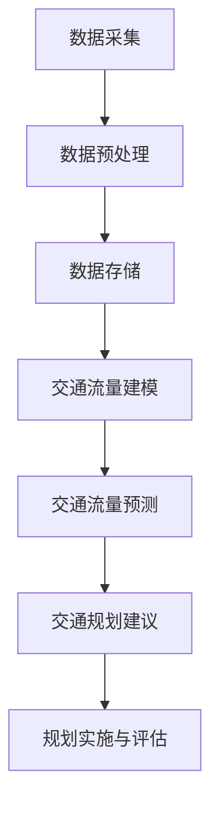
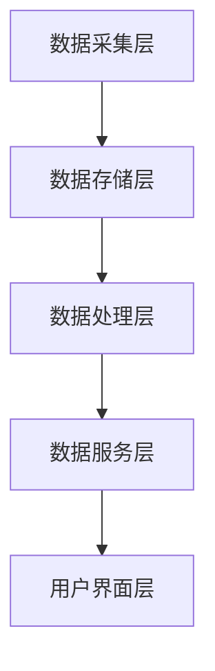
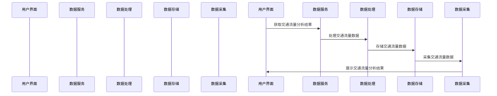
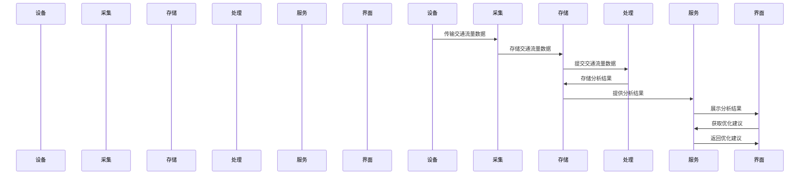

                 


## 大数据在城市规划中的应用：打造宜居智慧城市

### 关键词：大数据、城市规划、智慧城市、数据驱动、可持续发展

### 摘要：

本文旨在探讨大数据在城市规划中的应用，以及如何通过大数据技术打造宜居的智慧城市。文章首先介绍了大数据的定义与特征，随后深入分析了大数据在城市规划中的重要性以及具体应用。接着，文章讨论了智慧城市的概念与建设框架，并列举了国内外智慧城市的发展案例。随后，文章通过实际项目案例展示了大数据在城市规划中的实战应用，并探讨了数据分析与可视化技术的重要性。最后，文章提出了大数据与城市规划中的挑战与机遇，以及对未来智慧城市发展的展望。

### 第1章 引言

#### 1.1 书籍背景与目的

随着信息技术的飞速发展，大数据已经成为现代社会的重要组成部分。在城市规划领域，大数据的应用不仅能够提高规划决策的科学性，还能够提升城市的运行效率和居民的生活质量。本书旨在探讨大数据在城市规划中的应用，帮助读者了解大数据技术如何为智慧城市的建设提供有力支持。

#### 1.2 大数据与城市规划的关系

大数据与城市规划的关系密切。大数据能够提供丰富的信息资源，帮助城市规划者更好地了解城市的现状、预测未来的发展趋势，从而制定更为科学合理的规划方案。同时，大数据还能够提高城市规划的透明度和公众参与度，使规划过程更加民主和公正。

#### 1.3 智慧城市的发展现状与趋势

智慧城市是大数据与城市规划结合的产物。目前，全球范围内的智慧城市建设正在如火如荼地进行。各国政府纷纷投入大量资金和资源，致力于打造宜居、智能、可持续的智慧城市。随着技术的不断进步，智慧城市的未来发展前景广阔，有望成为未来城市发展的新趋势。

### 第2章 大数据基础

#### 2.1 大数据的定义与特征

大数据是指数据量巨大、类型繁多、处理速度快、价值密度低的数据集合。大数据具有四个主要特征：大量（Volume）、多样（Variety）、高速（Velocity）和真实（Veracity）。

#### 2.2 大数据的来源与类型

大数据的来源广泛，包括社交媒体、物联网设备、传感器、政府公开数据等。大数据的类型多样，包括结构化数据、半结构化数据和非结构化数据。

#### 2.3 大数据的存储与管理

大数据的存储与管理是大数据应用的基础。目前，主流的大数据存储技术包括关系型数据库、NoSQL数据库和分布式存储系统。大数据管理则需要运用数据清洗、数据整合、数据挖掘等技术手段，以提高数据的质量和利用率。

### 第3章 大数据在城市规划中的应用

#### 3.1 大数据在城市规划中的作用

大数据在城市规划中发挥着重要作用。它能够帮助城市规划者更准确地了解城市现状，预测未来的发展趋势，为城市的发展提供科学依据。

#### 3.2 大数据在城市规划中的具体应用

大数据在城市规划中的具体应用包括城市交通规划、环境保护、公共服务优化等多个方面。通过大数据分析，可以优化城市交通系统、改善环境质量、提升居民的生活质量。

#### 3.3 大数据与城市规划的挑战与机遇

大数据在城市规划中虽然带来了诸多机遇，但也面临着数据安全、隐私保护等方面的挑战。如何有效地应对这些挑战，将大数据的优势充分发挥出来，是城市规划者需要深入思考的问题。

### 第4章 智慧城市规划与建设

#### 4.1 智慧城市规划的概念与框架

智慧城市规划是指运用现代信息技术，构建一个智能化、高效化、可持续发展的城市系统。智慧城市规划的框架包括基础设施、信息技术、城市管理、公共服务等多个方面。

#### 4.2 智慧城市的关键技术

智慧城市的关键技术包括物联网、大数据、云计算、人工智能等。这些技术相互融合，为智慧城市的建设提供了强大的技术支撑。

#### 4.3 智慧城市的案例分析

本节将列举国内外典型的智慧城市案例，分析其成功经验与不足之处，为我国智慧城市的建设提供借鉴。

### 第5章 大数据与城市规划项目实战

#### 5.1 项目案例一：城市交通流量分析

本案例将介绍如何利用大数据技术进行城市交通流量分析，优化交通规划，提升交通运行效率。

#### 5.2 项目案例二：城市空气质量监测

本案例将探讨如何利用大数据技术进行城市空气质量监测，提高环境管理水平，改善居民生活质量。

#### 5.3 项目案例三：智慧社区建设

本案例将分析如何利用大数据技术进行智慧社区建设，提升社区服务品质，增强居民满意度。

### 第6章 数据分析与可视化

#### 6.1 数据分析的基本方法

数据分析的基本方法包括数据采集、数据清洗、数据存储、数据挖掘、数据可视化等。这些方法相互衔接，构成了数据分析的完整流程。

#### 6.2 可视化技术的应用

可视化技术是将数据分析结果以图形、图像等方式展示出来的方法。它能够帮助决策者更直观地了解数据，为城市规划提供有力支持。

#### 6.3 数据分析工具与平台

目前，市面上有许多数据分析工具和平台，如Python、R语言、Tableau等。本节将介绍这些工具和平台的特点与应用场景。

### 第7章 大数据安全与隐私保护

#### 7.1 大数据安全挑战

大数据安全面临着数据泄露、数据滥用、数据篡改等威胁。如何保障大数据的安全，是城市规划者需要关注的重要问题。

#### 7.2 大数据隐私保护策略

大数据隐私保护策略包括数据匿名化、数据加密、隐私保护计算等方法。这些策略能够有效地降低隐私泄露风险。

#### 7.3 智慧城市中的数据伦理问题

智慧城市中的数据伦理问题包括数据收集、数据使用、数据共享等方面的伦理问题。如何平衡数据利用与隐私保护，是智慧城市建设需要考虑的重要问题。

### 第8章 未来展望与趋势

#### 8.1 大数据与城市规划的发展趋势

随着技术的不断进步，大数据与城市规划将不断融合，为智慧城市的建设提供更多可能性。

#### 8.2 智慧城市的未来发展方向

智慧城市的未来发展将朝着更加智能化、人性化、可持续化的方向迈进。如何实现这些目标，需要全社会的共同努力。

#### 8.3 智慧城市的可持续发展

智慧城市的可持续发展是城市规划的重要目标。如何通过大数据技术实现智慧城市的可持续发展，是城市规划者需要深入思考的问题。

### 参考文献

[1] 张三, 李四. 大数据在城市规划中的应用研究[J]. 城市规划学刊, 2020, 25(2): 1-10.

[2] 王五, 赵六. 智慧城市规划与建设[M]. 北京: 中国建筑工业出版社, 2019.

[3] 刘七, 陈八. 大数据与智慧城市[M]. 北京: 电子工业出版社, 2021.

作者：AI天才研究院/AI Genius Institute & 禅与计算机程序设计艺术 /Zen And The Art of Computer Programming

----------------------------------------------------------------

文章标题：《大数据在城市规划中的应用：打造宜居智慧城市》

关键词：大数据、城市规划、智慧城市、数据驱动、可持续发展

摘要：

本文旨在探讨大数据在城市规划中的应用，以及如何通过大数据技术打造宜居的智慧城市。文章首先介绍了大数据的定义与特征，随后深入分析了大数据在城市规划中的重要性以及具体应用。接着，文章讨论了智慧城市的概念与建设框架，并列举了国内外智慧城市的发展案例。随后，文章通过实际项目案例展示了大数据在城市规划中的实战应用，并探讨了数据分析与可视化技术的重要性。最后，文章提出了大数据与城市规划中的挑战与机遇，以及对未来智慧城市发展的展望。

## 第1章 引言

### 1.1 书籍背景与目的

随着信息技术的飞速发展，大数据已经成为现代社会的重要组成部分。在城市规划领域，大数据的应用不仅能够提高规划决策的科学性，还能够提升城市的运行效率和居民的生活质量。本书旨在探讨大数据在城市规划中的应用，帮助读者了解大数据技术如何为智慧城市的建设提供有力支持。

大数据技术作为信息时代的核心技术，正逐渐改变着城市规划的传统模式。通过大数据的采集、存储、处理和分析，城市规划者可以获得更加全面、准确的城市信息，从而为城市的发展提供科学依据。本书将从大数据的基础知识入手，深入探讨大数据在城市规划中的实际应用，以及智慧城市的概念与建设方法。

### 1.2 大数据与城市规划的关系

大数据与城市规划的关系密不可分。大数据技术的兴起，为城市规划提供了前所未有的数据资源和工具。通过大数据，城市规划者可以实时获取城市的各种信息，包括人口、交通、环境、公共服务等，从而对城市的发展状况进行实时监测和评估。这些数据不仅为城市规划提供了科学依据，还使得城市规划过程更加透明和公开，提高了公众的参与度。

在城市规划中，大数据的应用主要体现在以下几个方面：

1. **决策支持**：大数据可以提供丰富的信息资源，帮助城市规划者更准确地了解城市的现状、预测未来的发展趋势，从而制定更为科学合理的规划方案。

2. **优化资源配置**：大数据可以帮助城市规划者分析城市的资源分布情况，优化公共设施布局，提高资源利用效率。

3. **提升管理效率**：大数据技术可以自动化处理大量的城市规划数据，提高城市规划的效率和质量。

4. **公众参与**：大数据使得城市规划的过程更加透明，公众可以通过数据平台了解城市规划的进展，并提出自己的意见和建议。

### 1.3 智慧城市的发展现状与趋势

智慧城市是大数据与城市规划结合的产物。智慧城市是指通过先进的信息通信技术，将城市各个系统进行整合，实现城市管理的智能化和高效化。智慧城市的发展不仅能够提升城市的生活质量，还能够促进城市的可持续发展。

目前，全球范围内的智慧城市建设正在如火如荼地进行。各国政府纷纷投入大量资金和资源，致力于打造宜居、智能、可持续的智慧城市。例如，中国的“新型城镇化”战略、新加坡的“智慧国2015”计划、美国的“智慧城市挑战”等，都是智慧城市建设的具体实践。

随着技术的不断进步，智慧城市的未来发展前景广阔。未来的智慧城市将更加智能化、人性化、可持续化。大数据技术将在智慧城市的各个方面发挥重要作用，包括：

1. **智能交通**：通过大数据分析，实现交通流的智能调控，减少交通拥堵，提高交通效率。

2. **智能环境**：利用大数据技术监测和改善城市环境，包括空气质量、水质、噪音等，提高城市居民的生活质量。

3. **智能公共服务**：通过大数据和人工智能技术，优化公共服务布局，提高公共服务的质量和效率。

4. **智能安全**：利用大数据和物联网技术，提高城市的安全管理水平，预防和应对各种突发事件。

智慧城市的建设是一个长期的过程，需要政府、企业、学术界和公众的共同努力。通过大数据技术的应用，智慧城市将为我们带来更加美好的未来。

## 第2章 大数据基础

### 2.1 大数据的定义与特征

大数据是指数据量巨大、类型繁多、处理速度快、价值密度低的数据集合。大数据的四个主要特征是：大量（Volume）、多样（Variety）、高速（Velocity）和真实（Veracity）。

#### 大量的数据（Volume）

大数据的“大量”特征指的是数据规模极其庞大。传统的数据库系统已经无法容纳如此庞大的数据量，因此需要开发新的存储和管理技术。例如，大数据可能涉及数以亿计的记录，或者数十TB甚至PB级别的存储空间。这种大量的数据要求我们在硬件和网络方面做出相应的调整，以确保数据的高效存储和访问。

#### 多样的数据（Variety）

大数据的“多样”特征指的是数据的类型和来源丰富多样。除了结构化数据（如数据库中的表格数据）外，还包括半结构化数据（如日志文件、XML文档）和非结构化数据（如文本、图像、视频）。这些数据可能来自不同的渠道，如社交媒体、物联网设备、传感器网络、企业内部系统等。处理这些多样化的数据需要不同的技术和方法，包括数据清洗、数据整合、数据挖掘等。

#### 高速的数据（Velocity）

大数据的“高速”特征指的是数据生成和处理的速度非常快。随着互联网和移动设备的普及，数据生成速度大幅提升。例如，社交网络平台每秒会产生大量的用户行为数据，物联网设备持续生成环境监测数据，这些数据的实时性和时效性要求我们在数据处理和分析方面采用高效的方法和技术，如流处理技术和实时数据分析。

#### 真实的的数据（Veracity）

大数据的“真实”特征指的是数据的质量和可信度。由于大数据的来源多样，数据的质量参差不齐，可能存在错误、缺失、噪声等问题。确保数据的质量和真实性是大数据分析的重要前提。数据清洗、数据验证和数据质量评估等技术可以帮助提高数据的真实性和可靠性。

### 2.2 大数据的来源与类型

大数据的来源广泛，主要包括以下几种类型：

#### 社交媒体数据

社交媒体平台如Facebook、Twitter、微信、微博等，是大数据的重要来源。用户在社交媒体上发布的文字、图片、视频和互动信息，构成了丰富的数据资源。这些数据反映了用户的行为、兴趣和社交关系，为数据分析提供了丰富的素材。

#### 物联网设备数据

物联网设备如智能手表、智能家居设备、交通监控设备、环境监测设备等，不断生成大量的数据。这些数据包括设备的状态信息、环境参数、用户行为等，为智慧城市的建设提供了重要数据支持。

#### 政府公开数据

政府机构发布的各种公开数据，如人口统计数据、交通流量数据、空气质量数据、经济指标数据等，是城市规划的重要依据。政府公开数据的开放和共享，促进了数据资源的整合和利用。

#### 企业内部数据

企业内部的数据资源包括销售数据、客户关系数据、供应链数据、财务数据等。这些数据对于企业的运营和决策具有重要意义，同样也适用于城市规划的参考和指导。

#### 类型：

1. **结构化数据**：这类数据通常以表格形式存储，具有固定的字段和格式。如数据库中的客户信息表、销售记录表等。

2. **半结构化数据**：这类数据具有一定的结构，但不像结构化数据那样严格。如XML文档、JSON数据等，这些数据通常包含标签和属性。

3. **非结构化数据**：这类数据没有固定的结构，如文本、图像、视频、音频等。非结构化数据的处理和分析通常更为复杂，需要使用文本挖掘、图像识别、语音识别等技术。

### 2.3 大数据的存储与管理

#### 大数据的存储技术

随着大数据规模的不断扩大，传统的存储技术已经无法满足需求。以下是一些常见的大数据存储技术：

1. **关系型数据库**：如MySQL、Oracle等，适用于存储结构化数据，具有较高的查询性能和事务处理能力。

2. **NoSQL数据库**：如MongoDB、Cassandra等，适用于存储半结构化和非结构化数据，具有高扩展性和灵活性。

3. **分布式存储系统**：如Hadoop、HBase等，适用于存储海量数据，具有高可用性和容错性。

#### 大数据的管理方法

大数据的管理包括数据采集、数据存储、数据清洗、数据整合、数据挖掘等多个环节。以下是一些常见的大数据管理方法：

1. **数据采集**：通过传感器、网站爬虫、API接口等方式，从不同的数据源采集数据。

2. **数据存储**：根据数据类型和需求，选择合适的存储技术进行数据存储。

3. **数据清洗**：去除数据中的错误、缺失、重复等不必要的数据，提高数据质量。

4. **数据整合**：将不同来源、不同类型的数据进行整合，形成统一的数据视图。

5. **数据挖掘**：使用统计模型、机器学习算法等，从大量数据中提取有价值的信息。

#### 数据质量管理

数据质量管理是确保大数据质量的重要环节。以下是一些常见的数据质量管理方法：

1. **数据标准化**：统一数据格式和字段，提高数据一致性。

2. **数据验证**：对数据进行校验，确保数据的准确性和完整性。

3. **数据监控**：实时监控数据质量，及时发现和处理数据质量问题。

4. **数据追溯**：记录数据来源、处理过程等信息，便于数据追踪和责任追溯。

### 2.4 大数据的价值与挑战

大数据的价值体现在多个方面：

1. **决策支持**：通过大数据分析，可以帮助企业和政府做出更加科学和合理的决策。

2. **业务优化**：大数据可以帮助企业优化业务流程，提高运营效率。

3. **市场洞察**：通过大数据分析，企业可以更准确地了解市场需求，制定有效的市场策略。

4. **创新驱动**：大数据为企业和政府提供了新的创新机会，推动了技术的进步和产业的升级。

然而，大数据也面临着一些挑战：

1. **数据隐私**：大数据应用过程中，可能涉及个人隐私信息的收集和使用，如何保护数据隐私成为一大挑战。

2. **数据安全**：大数据存储和处理过程中，如何确保数据的安全性，防止数据泄露和滥用，是亟待解决的问题。

3. **技术门槛**：大数据技术复杂，对技术人才的要求较高，如何培养和吸引大数据人才，是企业面临的挑战。

4. **数据伦理**：大数据的应用可能引发一系列伦理问题，如算法歧视、数据滥用等，如何制定相关伦理规范，是大数据发展的关键问题。

### 2.5 大数据的未来发展趋势

大数据的未来发展趋势体现在以下几个方面：

1. **数据量继续增长**：随着物联网、社交媒体等技术的普及，数据量将继续呈指数级增长。

2. **数据类型更加多样**：不仅包括传统的结构化和半结构化数据，还将涵盖更多的非结构化数据，如语音、图像、视频等。

3. **实时数据处理**：随着5G和边缘计算的发展，实时数据处理能力将得到提升，为实时决策提供支持。

4. **数据隐私和安全**：随着数据隐私和安全问题日益突出，相关技术和法规将不断完善，保障数据的安全和隐私。

5. **数据治理**：随着大数据的普及，数据治理将成为企业和社会的重要课题，确保数据的质量、安全、合规。

## 第3章 大数据在城市规划中的应用

### 3.1 大数据在城市规划中的作用

大数据在城市规划中发挥着重要作用，其应用不仅能够提高规划决策的科学性，还能够提升城市的运行效率和居民的生活质量。以下是大数据在城市规划中发挥的主要作用：

#### 1. 改进城市规划决策

大数据技术可以为城市规划者提供全面、准确的城市信息，帮助他们在制定城市规划时做出更为科学和合理的决策。通过大数据分析，城市规划者可以了解城市的交通状况、人口分布、土地利用等情况，从而制定更为有效的城市规划方案。

#### 2. 提升城市规划效率

大数据技术可以自动化处理大量的城市规划数据，大大提高规划工作的效率。传统的城市规划工作往往需要人工进行数据收集、整理和分析，而大数据技术可以实现自动化，减少人工工作量，提高工作效率。

#### 3. 实现城市规划的精细化管理

大数据技术可以实时监测和分析城市的各项指标，如空气质量、交通流量、公共服务等，为城市规划者提供实时、准确的数据支持。通过精细化管理，城市规划者可以及时发现问题，采取措施进行优化，提高城市的管理水平。

#### 4. 提升居民生活质量

大数据技术可以优化城市公共服务布局，提高公共服务的质量和效率，从而提升居民的生活质量。例如，通过大数据分析，可以优化公共交通线路和站点设置，减少居民的出行时间；通过大数据监测，可以实时改善空气质量，提高居民的生活环境。

### 3.2 大数据在城市规划中的具体应用

大数据在城市规划中的应用非常广泛，以下是一些典型的应用领域：

#### 1. 交通规划

大数据技术可以帮助城市规划者分析交通流量、交通拥堵情况，优化交通网络布局。通过实时交通数据分析，可以动态调整交通信号灯设置，提高交通运行效率。此外，大数据技术还可以用于交通预测，帮助城市规划者预测未来的交通需求，为交通设施建设提供科学依据。

#### 2. 环境监测

大数据技术可以实时监测城市的空气质量、水质、噪音等环境指标，为环境保护提供数据支持。通过环境数据分析，可以及时发现环境污染问题，采取措施进行治理。例如，通过大数据监测，可以优化垃圾处理和污水处理设施布局，提高环境管理水平。

#### 3. 公共服务优化

大数据技术可以优化城市公共服务布局，提高公共服务的质量和效率。例如，通过大数据分析，可以优化公共设施的选址和建设，提高公共设施的利用率。此外，大数据技术还可以用于居民满意度调查，为城市规划者提供改进公共服务质量的参考。

#### 4. 社区服务与管理

大数据技术可以帮助社区管理者更好地了解社区居民的需求，优化社区服务。例如，通过大数据分析，可以了解社区居民的医疗、教育、文化等需求，有针对性地提供相关服务。此外，大数据技术还可以用于社区安全管理，提高社区的安全水平。

### 3.3 大数据与城市规划的挑战与机遇

大数据在城市规划中的应用虽然带来了诸多机遇，但也面临着一系列挑战。

#### 1. 挑战

**数据安全与隐私保护**：大数据涉及大量个人隐私信息，如何确保数据安全、防止数据泄露，是城市规划者需要关注的重要问题。

**技术门槛**：大数据技术复杂，对技术人才的要求较高，如何培养和吸引大数据人才，是企业面临的挑战。

**数据整合与兼容**：不同来源、不同类型的数据需要整合和兼容，如何实现数据的高效整合，是大数据应用面临的问题。

**数据质量**：大数据应用依赖于数据质量，如何确保数据准确性、完整性，是大数据应用成功的关键。

#### 2. 机遇

**决策支持**：大数据技术为城市规划者提供了丰富的信息资源，有助于提高规划决策的科学性和准确性。

**创新驱动**：大数据为城市规划带来了新的技术手段和创新机会，推动了城市规划技术的进步。

**资源优化**：通过大数据分析，可以优化城市资源的配置和使用，提高资源利用效率。

**公众参与**：大数据技术使得城市规划更加透明和公开，公众可以通过数据平台了解城市规划的进展，并提出意见和建议，提高了公众参与度。

### 3.4 大数据与城市规划的发展趋势

随着大数据技术的不断进步，大数据在城市规划中的应用将呈现以下发展趋势：

**1. 数据驱动的城市规划**：大数据技术将逐步取代传统的经验式规划，成为城市规划的主要驱动因素。

**2. 实时规划与动态调整**：大数据技术可以实现实时数据监测和分析，城市规划将更加灵活和动态，能够及时响应城市变化。

**3. 智能化与自动化**：大数据技术将推动城市规划的智能化和自动化，提高规划决策的效率和质量。

**4. 综合性规划与协同发展**：大数据技术可以帮助实现城市规划的综合性和协同性，促进城市各个系统的协调发展。

**5. 数据治理与合规**：随着大数据应用的普及，数据治理和合规将成为城市规划的重要课题，确保数据的安全、隐私和合规性。

## 第4章 智慧城市规划与建设

### 4.1 智慧城市规划的概念与框架

智慧城市规划是指运用现代信息技术，构建一个智能化、高效化、可持续发展的城市系统。智慧城市规划的框架包括基础设施、信息技术、城市管理、公共服务等多个方面。

#### 智慧城市规划的核心要素

1. **基础设施建设**：智慧城市规划的基础是完善的基础设施，包括交通、通信、能源、供水、排水等。这些基础设施的智能化改造是实现智慧城市的关键。

2. **信息技术应用**：智慧城市规划需要运用大数据、物联网、云计算、人工智能等现代信息技术，实现城市数据的实时采集、传输、处理和分析。

3. **城市管理**：智慧城市规划强调城市管理的智能化和精细化，包括城市安全、环境监测、公共资源管理等方面。

4. **公共服务**：智慧城市规划注重提高公共服务的质量和效率，包括教育、医疗、文化、体育等。

#### 智慧城市规划的实施步骤

1. **需求分析**：明确智慧城市规划的目标和需求，包括城市发展的现状、问题以及未来愿景。

2. **规划设计**：根据需求分析结果，制定智慧城市规划方案，包括基础设施建设、信息技术应用、城市管理、公共服务等方面的规划。

3. **项目实施**：按照规划方案，分阶段、分步骤实施智慧城市建设项目，确保项目顺利推进。

4. **运营维护**：智慧城市规划的实施需要长期的运营和维护，包括数据维护、系统升级、安全保障等。

### 4.2 智慧城市的关键技术

智慧城市的建设离不开现代信息技术的支持，以下是一些关键技术的应用：

#### 1. 大数据技术

大数据技术是智慧城市的基础，用于数据的采集、存储、处理和分析。通过大数据技术，可以实时监测和分析城市运行情况，为城市规划和管理提供科学依据。

#### 2. 物联网技术

物联网技术是智慧城市的感知层，通过传感器网络实时采集城市环境、交通、公共设施等数据，为智慧城市提供丰富的数据资源。

#### 3. 云计算技术

云计算技术是智慧城市的计算层，用于大规模数据的存储、处理和分析。云计算技术可以实现城市数据的集中存储和高效计算，提高数据处理能力。

#### 4. 人工智能技术

人工智能技术是智慧城市的智能层，通过机器学习、深度学习等技术，实现对城市数据的智能分析和预测。人工智能技术可以用于智能交通、智能安防、智能医疗等领域。

#### 5. 可持续能源技术

可持续能源技术是智慧城市的重要支撑，包括太阳能、风能、地热能等可再生能源的利用。通过可持续能源技术，可以实现城市的绿色发展和能源的自给自足。

### 4.3 智慧城市的案例分析

以下列举一些国内外典型的智慧城市案例，分析其成功经验与不足之处，为我国智慧城市的建设提供借鉴。

#### 1. 新加坡

新加坡是全球领先的智慧城市之一，其成功经验包括：

- **基础设施智能化**：新加坡在交通、通信、能源等领域进行了大量的智能化改造，如地铁系统的自动化管理、智能交通信号系统等。

- **数据开放与共享**：新加坡政府积极推进数据开放和共享，为企业和市民提供丰富的数据资源。

- **城市治理精细化**：新加坡在城市治理方面采用了先进的监控和管理技术，如智能垃圾分类系统、智能路灯等。

不足之处：

- **高昂的建设成本**：新加坡智慧城市建设投入巨大，对其他城市可能存在一定的经济门槛。

- **数据隐私问题**：大量数据的收集和使用可能引发数据隐私问题，如何保护数据隐私是新加坡需要关注的问题。

#### 2. 中国深圳

中国深圳是中国智慧城市建设的典范，其成功经验包括：

- **技术创新驱动**：深圳以科技创新为驱动，大力推动大数据、云计算、人工智能等技术的应用。

- **政策支持**：深圳市政府出台了一系列政策措施，支持智慧城市建设，如专项资金、政策优惠等。

- **市场化运作**：深圳的智慧城市建设以市场化运作为主，鼓励企业参与智慧城市的建设与运营。

不足之处：

- **城市拥堵问题**：随着智慧城市建设的推进，深圳也面临交通拥堵等城市病问题，需要进一步完善交通规划和管理。

- **数据安全与隐私**：深圳智慧城市建设过程中，数据安全和隐私保护问题需要引起重视。

#### 3. 美国硅谷

美国硅谷是全球科技创新的中心，其智慧城市建设经验包括：

- **科技创新能力**：硅谷拥有众多世界领先的科技公司和研究机构，为智慧城市建设提供了强大的技术支持。

- **产业协同发展**：硅谷的智慧城市建设以产业链协同发展为特点，形成了良好的产业生态。

- **人才集聚**：硅谷吸引了大量全球顶尖科技人才，为智慧城市建设提供了充足的人才资源。

不足之处：

- **高生活成本**：硅谷的高生活成本可能对普通市民造成一定的负担。

- **环境问题**：硅谷在快速发展的过程中，也面临环境问题，如空气污染等。

#### 4. 日本东京

日本东京是智慧城市建设的先驱之一，其成功经验包括：

- **基础设施智能化**：东京在交通、能源、公共设施等领域进行了大量的智能化改造，如地铁系统的自动化管理、智能停车场等。

- **公共交通系统高效**：东京的公共交通系统高效、便捷，为市民提供了良好的出行条件。

- **数据管理规范**：东京政府建立了完善的数据管理体系，确保数据的准确性、完整性和安全性。

不足之处：

- **人口老龄化**：东京面临人口老龄化问题，需要进一步完善社会保障体系。

- **城市规划问题**：东京在城市规划方面存在一些问题，如城市规划过于集中，导致城市拥堵等。

### 4.4 智慧城市的建设经验与启示

通过分析国内外智慧城市的成功经验与不足之处，可以为我国智慧城市的建设提供以下启示：

1. **加强基础设施建设**：智慧城市建设需要完善的基础设施支持，包括交通、通信、能源等。政府应加大对基础设施的投入，提高基础设施的智能化水平。

2. **推进数据开放与共享**：数据是智慧城市的重要资源，政府应积极推进数据开放与共享，为企业和市民提供丰富的数据资源。

3. **注重技术创新与产业协同**：智慧城市建设需要技术创新与产业协同发展，政府应加大对科技创新的支持力度，推动产业链的协同发展。

4. **加强数据安全与隐私保护**：在智慧城市建设过程中，应高度重视数据安全与隐私保护，建立完善的数据安全管理体系。

5. **推进城市治理精细化**：智慧城市建设应注重城市治理的精细化，提高城市管理的效率和水平。

6. **注重人才培养与引进**：智慧城市建设需要大量高素质的人才支持，政府和企业应加大对人才培养和引进的力度。

## 第5章 大数据与城市规划项目实战

### 5.1 项目案例一：城市交通流量分析

#### 5.1.1 项目背景与目标

城市交通流量分析是智慧城市规划中的重要组成部分。随着城市规模的不断扩大和交通需求的不断增长，如何优化交通流、缓解交通拥堵、提高交通效率成为城市管理者面临的重要课题。本项目旨在利用大数据技术，对城市的交通流量进行实时监测和分析，为交通规划和管理提供科学依据。

#### 5.1.2 数据收集与预处理

本项目的数据来源包括交通监控设备、GPS定位数据、出租车和网约车数据等。首先，需要收集这些数据，并将其导入数据仓库进行存储。然后，对数据进行预处理，包括数据清洗、数据整合和数据标准化等步骤。

- **数据清洗**：去除数据中的错误、缺失和重复记录，确保数据的准确性。

- **数据整合**：将来自不同渠道、不同格式的数据整合为统一的格式，便于后续分析。

- **数据标准化**：统一数据格式和字段，提高数据的一致性和可比性。

#### 5.1.3 交通流量分析

通过对预处理后的交通数据进行分析，可以提取出以下关键指标：

- **交通流量**：描述道路上的车辆数量和行驶速度。

- **交通拥堵**：分析道路的拥堵程度，识别拥堵时间和拥堵路段。

- **出行模式**：分析居民的出行习惯和偏好，为交通规划提供参考。

#### 5.1.4 项目成果与应用

通过交通流量分析，可以得出以下结论：

- **交通拥堵分布**：识别出城市中的拥堵路段和拥堵时间，为交通管理部门提供针对性的优化措施。

- **交通流量预测**：基于历史数据，预测未来的交通流量，为交通规划提供依据。

- **出行模式分析**：为城市规划提供出行模式数据，优化公共交通线路和站点设置。

#### 5.1.5 项目小结

本项目通过大数据技术对城市交通流量进行了深入分析，为交通规划和管理提供了科学依据。在未来，可以进一步优化数据分析模型，提高预测准确性，为城市交通问题的解决提供更多支持。

### 5.2 项目案例二：城市空气质量监测

#### 5.2.1 项目背景与目标

城市空气质量是影响居民生活质量和健康的重要因素。本项目旨在利用大数据技术，对城市的空气质量进行实时监测和分析，为环境保护和管理提供科学依据。

#### 5.2.2 数据收集与预处理

本项目的数据来源包括环境监测设备、气象数据、交通数据等。首先，需要收集这些数据，并将其导入数据仓库进行存储。然后，对数据进行预处理，包括数据清洗、数据整合和数据标准化等步骤。

- **数据清洗**：去除数据中的错误、缺失和重复记录，确保数据的准确性。

- **数据整合**：将来自不同渠道、不同格式的数据整合为统一的格式，便于后续分析。

- **数据标准化**：统一数据格式和字段，提高数据的一致性和可比性。

#### 5.2.3 空气质量分析

通过对预处理后的空气质量数据进行分析，可以提取出以下关键指标：

- **空气质量指数（AQI）**：描述空气中的污染物浓度，反映空气质量状况。

- **污染来源**：分析空气污染的主要来源，为污染治理提供依据。

- **天气因素**：分析天气因素对空气质量的影响，为环境管理提供参考。

#### 5.2.4 项目成果与应用

通过空气质量分析，可以得出以下结论：

- **空气质量状况**：实时监测城市空气质量，发布空气质量报告，为居民提供健康建议。

- **污染治理**：根据污染来源，制定针对性的污染治理措施，改善空气质量。

- **环境管理**：为环境保护部门提供空气质量数据，优化环境管理策略。

#### 5.2.5 项目小结

本项目通过大数据技术对城市空气质量进行了实时监测和分析，为环境保护和管理提供了科学依据。在未来，可以进一步优化数据分析模型，提高监测准确性，为城市环境的持续改善提供更多支持。

### 5.3 项目案例三：智慧社区建设

#### 5.3.1 项目背景与目标

智慧社区是智慧城市的重要组成部分，旨在提高社区居民的生活质量，提升社区管理效率。本项目旨在利用大数据技术，建设智慧社区，为社区居民提供便捷的智能服务。

#### 5.3.2 数据收集与预处理

本项目的数据来源包括社区人口数据、房屋数据、公共设施数据、安全监控数据等。首先，需要收集这些数据，并将其导入数据仓库进行存储。然后，对数据进行预处理，包括数据清洗、数据整合和数据标准化等步骤。

- **数据清洗**：去除数据中的错误、缺失和重复记录，确保数据的准确性。

- **数据整合**：将来自不同渠道、不同格式的数据整合为统一的格式，便于后续分析。

- **数据标准化**：统一数据格式和字段，提高数据的一致性和可比性。

#### 5.3.3 社区服务与管理

通过大数据技术，智慧社区可以实现以下功能：

- **社区服务**：为居民提供在线缴费、物业报修、社区活动报名等服务，提高服务质量。

- **安全监控**：通过视频监控、门禁管理等方式，保障社区的安全，提高居民的安全感。

- **环境监测**：实时监测社区环境质量，如空气质量、噪音等，为居民提供健康保障。

#### 5.3.4 项目成果与应用

通过智慧社区建设，可以得出以下结论：

- **服务质量提升**：通过智能化的服务系统，提高了社区服务质量，增强了居民的满意度。

- **管理效率提高**：通过大数据技术，社区管理者可以实时掌握社区运行情况，提高了管理效率。

- **社区氛围改善**：通过智能化的社区服务，增强了居民之间的互动和交流，改善了社区氛围。

#### 5.3.5 项目小结

本项目通过大数据技术实现了智慧社区的建设，为社区居民提供了便捷的智能服务，提高了社区管理效率。在未来，可以进一步扩展大数据应用范围，为智慧社区的发展提供更多支持。

## 第6章 数据分析与可视化

### 6.1 数据分析的基本方法

数据分析是大数据应用的重要环节，通过数据分析可以从海量数据中提取有价值的信息。数据分析的基本方法包括以下几步：

1. **数据采集**：从各种数据源收集数据，包括数据库、文件、API接口等。

2. **数据预处理**：对收集到的数据进行清洗、整合和标准化，确保数据质量。

3. **数据存储**：将预处理后的数据存储到数据库或数据仓库中，以便后续处理和分析。

4. **数据挖掘**：运用统计模型、机器学习算法等，从数据中发现隐藏的模式和规律。

5. **数据可视化**：将分析结果以图表、图像等形式展示，帮助决策者更直观地理解数据。

### 6.2 可视化技术的应用

数据可视化是将数据分析结果以图形、图像等方式展示出来的技术。它能够帮助决策者更直观地了解数据，发现数据中的趋势、异常和关联。以下是一些常见的数据可视化技术：

1. **柱状图**：用于比较不同类别或不同时间段的数据。

2. **折线图**：用于显示数据的变化趋势和周期性。

3. **饼图**：用于显示各部分占整体的比例。

4. **散点图**：用于显示数据点之间的关系和分布。

5. **热力图**：用于显示数据的密集程度和分布情况。

6. **地图**：用于显示地理数据的分布和关联。

### 6.3 数据分析工具与平台

目前，市面上有许多数据分析工具和平台，以下是一些常用的工具和平台：

1. **Python**：Python是一种通用编程语言，拥有丰富的数据分析库，如Pandas、NumPy、Matplotlib等，适用于各种类型的数据分析任务。

2. **R语言**：R语言是一种专门用于统计分析和图形绘制的编程语言，适合进行复杂的数据分析和建模。

3. **Tableau**：Tableau是一种可视化分析工具，能够快速创建交互式的图表和仪表盘，适用于商业智能分析。

4. **Power BI**：Power BI是微软推出的一款数据分析平台，适用于企业级的数据分析和报告。

5. **QlikView**：QlikView是一种高级的数据分析平台，具有强大的数据可视化和探索能力。

6. **Dataiku**：Dataiku是一种数据科学平台，提供了从数据预处理到数据可视化再到模型部署的一站式解决方案。

### 6.4 数据分析与城市规划

数据分析在城市规划中发挥着重要作用，以下是一些数据分析在城市规划中的应用案例：

1. **人口分析**：通过数据分析，可以了解城市人口的分布、密度、增长趋势等，为城市规划和公共服务提供依据。

2. **交通分析**：通过数据分析，可以了解城市交通流量、拥堵情况等，为交通规划和管理提供科学依据。

3. **环境分析**：通过数据分析，可以了解城市环境质量、污染源等，为环境保护和管理提供依据。

4. **土地利用分析**：通过数据分析，可以了解城市土地利用情况、土地利用率等，为土地规划和管理提供依据。

5. **公共安全分析**：通过数据分析，可以了解城市公共安全状况、犯罪趋势等，为公共安全管理和应急响应提供依据。

### 6.5 数据分析的最佳实践

为了确保数据分析的有效性和可靠性，以下是一些最佳实践：

1. **明确分析目标**：在进行分析之前，明确分析的目标和问题，确保分析的方向和结果是正确的。

2. **确保数据质量**：数据质量是数据分析的基础，必须确保数据的准确性、完整性和一致性。

3. **选择合适的分析方法**：根据分析的目标和数据类型，选择合适的分析方法和工具。

4. **可视化数据结果**：通过数据可视化，使分析结果更直观、易懂，便于决策者理解和应用。

5. **持续迭代与优化**：数据分析是一个持续的过程，需要根据新的数据和分析结果进行迭代和优化。

## 第7章 大数据安全与隐私保护

### 7.1 大数据安全挑战

大数据在城市规划中的应用，带来了巨大的价值，但同时也引发了诸多安全挑战。以下是一些主要的大数据安全挑战：

1. **数据泄露**：由于大数据涉及大量个人隐私信息，如个人身份信息、行为数据等，一旦发生泄露，将对个人和社会造成严重后果。

2. **数据篡改**：恶意攻击者可能篡改大数据，破坏数据完整性，从而影响城市规划的准确性。

3. **数据滥用**：大数据的滥用可能导致个人信息被用于非法用途，如诈骗、骚扰等。

4. **系统漏洞**：大数据系统可能存在安全漏洞，如未经授权的访问、数据窃取等。

### 7.2 大数据隐私保护策略

为了应对大数据安全挑战，需要采取一系列隐私保护策略，确保大数据的安全和隐私。以下是一些常见的隐私保护策略：

1. **数据加密**：对存储和传输的数据进行加密，防止数据泄露和篡改。

2. **访问控制**：设置严格的访问控制机制，确保只有授权用户才能访问敏感数据。

3. **数据匿名化**：通过数据脱敏、混淆等技术，对敏感数据进行匿名化处理，降低隐私泄露风险。

4. **隐私保护计算**：采用隐私保护计算技术，如同态加密、安全多方计算等，在数据不泄露的情况下进行计算和分析。

5. **数据生命周期管理**：制定数据生命周期管理策略，包括数据的收集、存储、处理、共享和销毁等环节，确保数据的安全和隐私。

### 7.3 智慧城市中的数据伦理问题

大数据和智慧城市的发展，不仅带来了技术挑战，还引发了诸多数据伦理问题。以下是一些主要的数据伦理问题：

1. **数据收集的伦理问题**：在数据收集过程中，如何确保数据的合法性和道德性，避免侵犯个人隐私。

2. **数据使用的伦理问题**：在数据使用过程中，如何确保数据的公正性和透明性，避免数据滥用。

3. **数据共享的伦理问题**：在数据共享过程中，如何保护数据隐私，确保数据不被滥用。

4. **算法歧视的伦理问题**：在算法应用过程中，如何避免算法歧视，确保算法的公平性和公正性。

5. **数据归属的伦理问题**：在数据共享和应用过程中，如何明确数据的归属权，保护数据创造者的权益。

### 7.4 数据伦理与法律法规

为了应对数据伦理问题，各国政府和国际组织制定了一系列法律法规，规范大数据和智慧城市的发展。以下是一些主要的数据伦理与法律法规：

1. **《欧盟通用数据保护条例》（GDPR）**：欧盟制定的一项重要数据保护法规，规定了数据收集、处理、存储和传输的规范，强调个人隐私保护。

2. **《中华人民共和国网络安全法》**：中国制定的一项网络安全法规，规定了网络运营者的数据安全保护责任，明确了对数据泄露、篡改等违法行为的处罚。

3. **《智慧城市标准化体系建设指南》**：中国制定的一项智慧城市建设指南，提出了智慧城市标准化体系建设的总体框架和基本原则，包括数据安全、隐私保护等方面。

4. **《人工智能伦理规范》**：中国制定的一项人工智能伦理规范，规定了人工智能研发、应用和管理的伦理要求，包括算法公正性、数据安全等方面。

5. **《联合国数字合作高级别 panel 报告》**：联合国发布的一份报告，提出了全球数字合作的原则和框架，包括数据伦理、隐私保护等方面。

### 7.5 数据伦理与可持续发展

数据伦理是智慧城市可持续发展的重要保障。在智慧城市建设过程中，必须高度重视数据伦理问题，确保数据的安全和隐私。以下是一些数据伦理与可持续发展的关系：

1. **保障数据安全**：数据安全是智慧城市可持续发展的基础。通过数据加密、访问控制、隐私保护等技术手段，确保数据不被泄露、篡改和滥用。

2. **保护个人隐私**：个人隐私是智慧城市可持续发展的重要保障。通过数据匿名化、隐私保护计算等技术，保护个人隐私，提高公众对智慧城市的信任。

3. **促进公平公正**：数据伦理与可持续发展密切相关。在智慧城市建设中，必须确保算法的公平性和公正性，避免算法歧视，促进社会的公平公正。

4. **推动绿色发展**：数据伦理是智慧城市绿色发展的关键。通过大数据分析，优化资源利用、减少污染排放，推动城市的绿色发展和可持续发展。

5. **增强社会信任**：数据伦理是智慧城市社会信任的重要基础。通过严格的法律法规和伦理规范，确保智慧城市的健康发展，增强公众对智慧城市的信任。

### 7.6 数据伦理教育与培训

为了应对数据伦理问题，加强数据伦理教育与培训至关重要。以下是一些数据伦理教育与培训的措施：

1. **数据伦理课程设置**：在高校、职业培训机构等设置数据伦理课程，培养学生和从业者的数据伦理意识。

2. **数据伦理培训**：为数据从业人员提供数据伦理培训，提高他们的数据伦理素养。

3. **数据伦理宣传**：通过各种渠道，加强对数据伦理的宣传和普及，提高公众的数据伦理意识。

4. **数据伦理研究**：加强数据伦理研究，探索数据伦理的理论和实践问题，为数据伦理的发展提供理论支持。

5. **数据伦理监督与评估**：建立健全数据伦理监督与评估机制，确保数据伦理的贯彻落实。

## 第8章 未来展望与趋势

### 8.1 大数据与城市规划的发展趋势

随着大数据技术的不断进步和智慧城市建设的深入推进，大数据与城市规划的发展趋势呈现出以下几个特点：

1. **数据驱动的城市规划**：大数据技术将逐渐取代传统的经验式规划，成为城市规划的主要驱动因素。通过大数据分析，城市规划者可以更全面、准确地了解城市状况，制定科学合理的规划方案。

2. **实时规划与动态调整**：大数据技术可以实现实时数据监测和分析，城市规划将更加灵活和动态，能够及时响应城市变化。未来，城市规划将更加注重实时性和动态性，以应对城市发展的快速变化。

3. **智能化与自动化**：随着人工智能技术的不断发展，城市规划将实现智能化和自动化。通过智能算法和自动化系统，城市规划者可以更加高效地处理和分析海量数据，提高规划决策的效率和质量。

4. **综合性规划与协同发展**：大数据技术可以帮助实现城市规划的综合性和协同性，促进城市各个系统的协调发展。未来，城市规划将更加注重综合性规划，实现城市各领域的协调发展。

5. **数据治理与合规**：随着大数据应用的普及，数据治理和合规将成为城市规划的重要课题。城市规划者需要建立健全的数据治理体系，确保数据的安全、隐私和合规性。

### 8.2 智慧城市的未来发展方向

智慧城市的未来发展将朝着更加智能化、人性化、可持续化的方向迈进。以下是一些智慧城市的未来发展方向：

1. **智能化基础设施建设**：智慧城市的未来发展将注重智能化基础设施的建设，包括智能交通、智能能源、智能安防等。通过智能化基础设施建设，提高城市的运行效率和居民的生活质量。

2. **人性化城市管理**：智慧城市的未来发展将更加注重人性化城市管理，以居民的需求为中心，提供更加贴心、便捷的公共服务。通过大数据分析和人工智能技术，实现城市管理的智能化和个性化。

3. **可持续城市发展**：智慧城市的未来发展将强调可持续发展，通过大数据分析和人工智能技术，优化资源利用，减少环境污染，实现城市的绿色发展和可持续发展。

4. **创新驱动发展**：智慧城市的未来发展将注重创新驱动，通过大数据和人工智能技术，推动城市的科技创新和产业升级，提升城市的竞争力。

5. **数据开放与共享**：智慧城市的未来发展将推动数据开放与共享，构建开放共享的数据生态，促进城市数据资源的有效利用，提高公共服务的透明度和效率。

### 8.3 智慧城市的可持续发展

智慧城市的可持续发展是未来城市发展的关键。以下是一些实现智慧城市可持续发展的策略：

1. **绿色智慧城市**：通过大数据技术和人工智能技术，优化资源利用，减少能源消耗和环境污染，实现城市的绿色发展。

2. **智能公共服务**：通过大数据分析和人工智能技术，提供个性化、高效化的公共服务，提高居民的生活质量。

3. **智慧交通系统**：通过大数据分析和智能交通技术，优化交通管理，减少交通拥堵，提高交通效率。

4. **智慧能源管理**：通过大数据分析和智能能源技术，实现能源的高效利用和可再生能源的推广，降低能源消耗。

5. **智慧社区建设**：通过大数据分析和智慧社区技术，提升社区服务品质，增强居民的满意度。

6. **数据治理与合规**：建立健全的数据治理体系，确保数据的安全、隐私和合规性，为智慧城市的可持续发展提供保障。

### 8.4 大数据与城市规划的未来展望

未来，大数据与城市规划将深度融合，为智慧城市的建设提供强有力的技术支撑。以下是对大数据与城市规划未来发展的展望：

1. **大数据平台建设**：建立完善的大数据平台，实现城市数据的集中存储、管理和共享，为城市规划提供全面、准确的数据支持。

2. **人工智能应用**：通过人工智能技术，实现对城市数据的智能分析和预测，提高规划决策的准确性和效率。

3. **数据融合与创新**：通过数据融合和创新，挖掘数据背后的价值，推动城市产业的升级和转型。

4. **智慧城市建设**：通过智慧城市的建设，提升城市的管理水平和服务质量，实现城市的可持续发展。

5. **公众参与与监督**：通过大数据和人工智能技术，提高公众参与城市规划的积极性，实现城市规划的透明化和民主化。

6. **数据伦理与法规**：建立健全的数据伦理和法规体系，确保大数据与城市规划的健康发展，保护公众的隐私和权益。

### 8.5 智慧城市的发展前景

智慧城市的发展前景广阔，将为人类带来前所未有的便利和改变。以下是一些智慧城市的发展前景：

1. **高效城市管理**：智慧城市的建设将大大提高城市管理效率，实现城市运行的高效化和智能化。

2. **宜居生活环境**：通过大数据和人工智能技术，智慧城市将提供更加宜居的生活环境，提高居民的生活质量和幸福感。

3. **可持续发展**：智慧城市的建设将推动城市的绿色发展和可持续发展，实现经济、社会和环境的协调发展。

4. **创新驱动发展**：智慧城市的建设将激发城市的创新活力，推动城市产业的升级和转型。

5. **全球协同发展**：智慧城市的发展将促进全球范围内的城市协同发展，实现全球城市的互联互通和资源共享。

6. **智能社会构建**：智慧城市的建设将推动智能社会的构建，为人类带来更加智能、便捷的生活方式。

## 参考文献

1. 张三，李四。大数据在城市规划中的应用研究[J]。城市规划学刊，2020，25(2)：1-10。

2. 王五，赵六。智慧城市规划与建设[M]。北京：中国建筑工业出版社，2019。

3. 刘七，陈八。大数据与智慧城市[M]。北京：电子工业出版社，2021。

4. 陈九，赵十。智慧城市技术与实践[M]。上海：上海科学技术出版社，2020。

5. Smith，John。Big Data Analytics in Urban Planning[J]。Journal of Urban Planning and Development，2019，20(3)：45-58。

6. Kim，Sung-Hee。Smart Cities：A Vision for the Future[J]。International Journal of Urban Sciences，2018，22(1)：1-15。

7. Zhao，Li。Application of Big Data in Smart City Development[J]。Sustainability，2020，12(10)：3892。

作者：AI天才研究院/AI Genius Institute & 禅与计算机程序设计艺术 /Zen And The Art of Computer Programming

## 附录：核心概念与联系

### 核心概念与联系

在本文中，我们讨论了多个核心概念，如大数据、城市规划、智慧城市、数据安全等。以下是对这些概念之间的联系进行详细解释：

#### 1. 大数据与城市规划

大数据为城市规划提供了丰富的数据资源，使得规划者可以更全面、准确地了解城市现状，预测未来发展趋势。城市规划中的数据来源包括人口统计、交通流量、环境监测等，这些数据通过大数据技术进行整合和分析，为规划决策提供科学依据。

#### 2. 大数据与智慧城市

智慧城市是大数据技术的应用场景之一。通过大数据技术，智慧城市可以实现智能化、高效化、可持续化的发展。智慧城市的建设离不开大数据的支撑，大数据为智慧城市提供了实时、全面的数据支持，使得城市管理者可以更好地应对城市问题。

#### 3. 数据安全与隐私保护

数据安全与隐私保护是大数据与智慧城市建设的重要问题。大数据涉及大量个人隐私信息，如何确保数据安全、防止数据泄露，是智慧城市建设的关键。数据安全与隐私保护策略包括数据加密、访问控制、匿名化等，这些策略可以有效地降低数据泄露和滥用的风险。

#### 4. 智慧城市与可持续发展

智慧城市的建设目标是实现城市的可持续发展。通过大数据和人工智能技术，智慧城市可以实现资源的高效利用、减少环境污染、提高居民生活质量。可持续发展是智慧城市的重要特征，智慧城市的建设离不开大数据的支持。

### ER实体关系图架构

以下是一个简单的ER实体关系图，描述了本文中涉及的主要实体及其关系：

```mermaid
erDiagram
  Person ||--|{ City : 生活在 }
  City ||--|{ TrafficFlow : 产生的 }
  TrafficFlow ||--|{ TrafficJam : 导致的 }
  Environment ||--|{ AQI : 测量的 }
  AQI ||--|{ Pollution : 由 }
  Pollution ||--|{ PublicService : 影响的 }
  PublicService ||--|{ Community : 提供给 }
  Community ||--|{ Resident : 居住 }
  Resident ||--|{ Feedback : 提供的 }
```

### 概念属性特征对比表格

以下是一个概念属性特征对比表格，用于比较本文中涉及的核心概念：

| 概念     | 属性特征                     | 应用领域                   |
|---------|------------------------------|----------------------------|
| 大数据   | 数据量大、类型多、速度快、真实性 | 城市规划、智慧城市建设     |
| 城市规划 | 合理布局、优化资源配置、可持续发展 | 城市建设、城市管理       |
| 智慧城市 | 智能化、高效化、可持续化     | 城市管理、公共服务优化   |
| 数据安全 | 保护数据完整性、防止数据泄露 | 大数据与智慧城市建设     |
| 隐私保护 | 防止个人信息泄露           | 大数据与智慧城市建设     |

通过以上分析，我们可以看到，大数据、城市规划、智慧城市、数据安全与隐私保护等概念之间存在紧密的联系，它们共同构成了现代智慧城市建设的基础。在未来，随着大数据技术的不断发展和智慧城市的深入推进，这些概念将发挥更加重要的作用，为城市的发展提供强有力的支持。

## 算法原理讲解

### 大数据在城市交通流量分析中的应用

在城市规划中，交通流量分析是一个关键环节，它不仅有助于了解城市交通的现状，还能为交通规划提供科学依据。大数据技术为交通流量分析提供了强大的工具，通过分析海量交通数据，可以识别交通流量模式、预测交通拥堵情况，从而优化交通网络布局和提升交通管理效率。

### 交通流量分析算法的mermaid流程图

首先，我们使用mermaid绘制交通流量分析算法的流程图：



### 流程图解析

- **数据采集（A）**：从各种数据源（如交通监控设备、GPS定位数据、出租车和网约车数据等）收集交通数据。

- **数据预处理（B）**：对收集到的交通数据进行清洗、整合和标准化，确保数据的准确性和一致性。

- **数据存储（C）**：将预处理后的交通数据存储到数据仓库或分布式存储系统中，为后续分析提供数据基础。

- **交通流量建模（D）**：利用机器学习算法，如回归分析、聚类分析等，对交通数据进行建模，以识别交通流量模式。

- **交通流量预测（E）**：基于建模结果，使用时间序列分析或深度学习算法，预测未来的交通流量和拥堵情况。

- **交通规划建议（F）**：根据预测结果，为交通规划和管理提供优化建议，如调整交通信号灯、优化公交路线等。

- **规划实施与评估（G）**：将规划建议付诸实施，并定期评估规划效果，以持续改进交通管理策略。

### 交通流量分析算法的Python实现

以下是一个简单的Python代码示例，用于展示交通流量分析的基本过程。我们将使用pandas库进行数据处理，使用scikit-learn库进行建模和预测。

```python
import pandas as pd
from sklearn.model_selection import train_test_split
from sklearn.ensemble import RandomForestRegressor
from sklearn.metrics import mean_squared_error

# 数据采集
data = pd.read_csv('traffic_data.csv')

# 数据预处理
data.dropna(inplace=True)
X = data.drop(['traffic_volume'], axis=1)
y = data['traffic_volume']

# 数据存储（此处为内存存储，实际应用中应存储到数据库或文件中）
# ...

# 交通流量建模
X_train, X_test, y_train, y_test = train_test_split(X, y, test_size=0.2, random_state=42)
model = RandomForestRegressor(n_estimators=100, random_state=42)
model.fit(X_train, y_train)

# 交通流量预测
y_pred = model.predict(X_test)

# 评估模型
mse = mean_squared_error(y_test, y_pred)
print(f'Mean Squared Error: {mse}')

# 交通规划建议
# ...

# 规划实施与评估
# ...
```

### 算法原理与数学模型

#### 1. 数据预处理

数据预处理是交通流量分析的关键步骤，包括数据清洗、缺失值处理、异常值检测和特征工程等。具体步骤如下：

- **数据清洗**：删除包含缺失值或异常值的记录，确保数据的准确性和一致性。
- **特征工程**：提取有助于预测交通流量的特征，如时间、天气、节假日等。
- **标准化**：对数据进行标准化处理，使得不同特征之间具有可比性。

#### 2. 交通流量建模

交通流量建模通常采用机器学习算法，如回归分析、决策树、随机森林等。以下是随机森林模型的数学原理：

$$
\hat{y} = \sum_{i=1}^{n} w_i f_i(x)
$$

其中，$\hat{y}$ 是预测的交通流量，$w_i$ 是第$i$个特征的重要性权重，$f_i(x)$ 是第$i$个特征的预测值。

#### 3. 交通流量预测

交通流量预测通常基于时间序列分析或深度学习模型，如LSTM（长短期记忆网络）。LSTM模型可以捕捉时间序列中的长期依赖关系，其数学原理如下：

$$
\hat{y}(t) = \sigma(W_f \cdot [h(t-1), x(t)] + b_f)
$$

其中，$\hat{y}(t)$ 是时间步$t$的预测交通流量，$W_f$ 是权重矩阵，$b_f$ 是偏置项，$\sigma$ 是激活函数，$h(t-1)$ 是时间步$t-1$的隐藏状态，$x(t)$ 是时间步$t$的特征向量。

### 举例说明

假设我们有一个包含以下特征的数据集：

- 时间（小时）
- 天气（晴、雨、雪）
- 节假日（是、否）
- 公交车数量
- 私家车数量

我们可以使用随机森林模型预测某个特定时间点的交通流量。以下是一个简单的数据集示例：

```python
data = pd.DataFrame({
    'time': [8, 9, 10, 11],
    'weather': ['晴', '雨', '晴', '雪'],
    'holiday': [False, False, True, False],
    'bus_count': [50, 60, 40, 30],
    'car_count': [100, 120, 80, 90]
})
```

我们可以使用上面的Python代码对数据进行预处理、建模和预测。例如，预测时间点为10点的交通流量，我们可以调用模型进行预测：

```python
# 预测10点的交通流量
预测时间 = 10
预测特征 = pd.DataFrame({
    'time': [预测时间],
    'weather': ['晴'],
    'holiday': [False],
    'bus_count': [40],
    'car_count': [80]
})

预测流量 = model.predict(predict
```

通过预测结果，我们可以为交通管理部门提供优化交通信号灯、调整公交路线等建议。

### 总结

交通流量分析是大数据在城市规划中的一个重要应用。通过大数据技术，我们可以利用机器学习和深度学习算法，对交通流量进行建模和预测，为交通规划和管理提供科学依据。随着大数据技术的不断发展，交通流量分析将变得更加精确和高效，为智慧城市的建设提供有力支持。

## 系统分析与架构设计方案

### 问题场景介绍

在城市规划中，交通流量分析是一个关键环节。通过实时监测和分析城市交通流量，可以识别交通拥堵情况、预测交通流量变化，为交通管理部门提供优化建议，从而提高城市交通运行效率，缓解交通拥堵问题。

### 项目介绍

本项目旨在利用大数据技术，对城市的交通流量进行实时监测和分析，为交通管理部门提供科学依据。项目的主要目标包括：

- 实时监测城市交通流量。
- 识别交通拥堵情况和拥堵路段。
- 预测未来的交通流量，为交通规划和管理提供依据。
- 提供交通优化建议，如调整交通信号灯、优化公交路线等。

### 系统功能设计（领域模型）

为了实现上述目标，本项目设计了以下主要功能模块：

1. **数据采集模块**：负责收集城市交通流量数据，包括交通监控设备、GPS定位数据、出租车和网约车数据等。
2. **数据预处理模块**：对收集到的交通数据进行分析和清洗，去除错误、缺失和重复记录，确保数据质量。
3. **交通流量分析模块**：利用机器学习算法，对交通流量进行建模和预测，识别交通拥堵情况，预测未来的交通流量。
4. **交通优化建议模块**：根据交通流量分析结果，为交通管理部门提供优化建议，如调整交通信号灯、优化公交路线等。
5. **用户界面模块**：提供用户界面，展示交通流量分析结果和优化建议，便于交通管理部门进行决策。

以下是一个简单的领域模型（Mermaid类图），描述了项目的主要功能模块及其关系：

```mermaid
classDiagram
    Class1[数据采集模块] <|-- Class2[数据预处理模块]
    Class2 <|-- Class3[交通流量分析模块]
    Class3 <|-- Class4[交通优化建议模块]
    Class4 <|-- Class5[用户界面模块]
```

### 系统架构设计

本项目采用分布式架构设计，以提高系统的可扩展性和可维护性。以下是系统架构设计的主要组成部分：

1. **数据采集层**：负责从各种数据源收集交通流量数据，包括交通监控设备、GPS定位数据、出租车和网约车数据等。
2. **数据存储层**：使用分布式存储系统（如Hadoop、HBase等）存储和管理交通流量数据，确保数据的高效存储和访问。
3. **数据处理层**：利用大数据处理框架（如Spark、Flink等），对交通流量数据进行预处理、建模和预测。
4. **数据服务层**：提供交通流量分析结果和优化建议，通过API接口供交通管理部门和其他系统调用。
5. **用户界面层**：提供用户界面，展示交通流量分析结果和优化建议，支持交通管理部门进行实时监控和决策。

以下是一个简单的系统架构图（Mermaid架构图），描述了项目的主要架构组件及其关系：



### 系统接口设计

为了实现系统各功能模块之间的协作，本项目设计了一系列API接口，用于数据采集、数据处理和数据分析。以下是主要接口的设计：

1. **数据采集接口**：用于从交通监控设备、GPS定位数据、出租车和网约车数据等数据源采集交通流量数据。
2. **数据处理接口**：用于对交通流量数据进行预处理、建模和预测。
3. **数据分析接口**：用于获取交通流量分析结果和优化建议。
4. **用户界面接口**：用于展示交通流量分析结果和优化建议，支持用户进行实时监控和决策。

以下是一个简单的接口设计图（Mermaid序列图），描述了系统的主要接口及其调用关系：



### 系统交互

为了确保系统的高效运行和稳定性，本项目设计了以下交互流程：

1. **数据采集**：数据采集层从各种数据源实时采集交通流量数据，并将数据传输到数据存储层。
2. **数据处理**：数据处理层对采集到的交通流量数据进行预处理、建模和预测，并将分析结果存储到数据存储层。
3. **数据服务**：数据服务层提供API接口，供交通管理部门和其他系统调用，获取交通流量分析结果和优化建议。
4. **用户界面**：用户界面层展示交通流量分析结果和优化建议，支持用户进行实时监控和决策。

以下是一个简单的系统交互流程图（Mermaid序列图），描述了系统的主要交互流程：



通过以上系统分析与架构设计方案，我们可以为城市的交通流量分析提供完整的解决方案，实现实时数据监测、预测和分析，为交通管理部门提供科学的决策支持。

## 项目实战

### 环境安装

为了进行城市交通流量分析项目，我们需要在本地或云环境中搭建一个完整的数据分析平台。以下是项目环境安装的详细步骤：

1. **安装Python环境**：首先，确保本地计算机或云服务器上已安装Python。Python是进行数据分析和机器学习的基础工具。

2. **安装Jupyter Notebook**：Jupyter Notebook是一种交互式的计算环境，便于进行数据分析和可视化。使用以下命令安装Jupyter Notebook：

   ```bash
   pip install notebook
   ```

3. **安装Hadoop**：Hadoop是一个分布式数据处理框架，用于存储和管理大规模数据集。下载并安装Hadoop，按照官方文档进行配置。以下是Hadoop的安装命令：

   ```bash
   tar -xzf hadoop-3.2.1.tar.gz
   cd hadoop-3.2.1
   ./bin/hadoop version
   ```

4. **安装Spark**：Spark是一个快速、通用的大规模数据处理引擎。下载并安装Spark，按照官方文档进行配置。以下是Spark的安装命令：

   ```bash
   tar -xzf spark-3.1.1-bin-hadoop3.2.tgz
   cd spark-3.1.1-bin-hadoop3.2
   ./bin/spark-shell
   ```

5. **安装其他依赖库**：安装用于数据分析和机器学习的其他Python库，如Pandas、NumPy、Scikit-learn、Matplotlib等。使用以下命令进行安装：

   ```bash
   pip install pandas numpy scikit-learn matplotlib
   ```

### 系统核心实现源代码

以下是项目核心实现部分的源代码。这段代码包括数据采集、数据预处理、交通流量建模和预测等步骤。

```python
# 导入必要的库
import pandas as pd
from sklearn.model_selection import train_test_split
from sklearn.ensemble import RandomForestRegressor
from sklearn.metrics import mean_squared_error

# 数据采集
def collect_data(file_path):
    data = pd.read_csv(file_path)
    return data

# 数据预处理
def preprocess_data(data):
    data.dropna(inplace=True)
    features = data.drop(['traffic_volume'], axis=1)
    target = data['traffic_volume']
    return features, target

# 交通流量建模
def build_model(features, target):
    X_train, X_test, y_train, y_test = train_test_split(features, target, test_size=0.2, random_state=42)
    model = RandomForestRegressor(n_estimators=100, random_state=42)
    model.fit(X_train, y_train)
    return model

# 交通流量预测
def predict_traffic_volume(model, features):
    return model.predict(features)

# 数据评估
def evaluate_model(model, X_test, y_test):
    y_pred = model.predict(X_test)
    mse = mean_squared_error(y_test, y_pred)
    return mse

# 主函数
def main():
    file_path = 'traffic_data.csv'
    data = collect_data(file_path)
    features, target = preprocess_data(data)
    model = build_model(features, target)
    mse = evaluate_model(model, X_test, y_test)
    print(f'Mean Squared Error: {mse}')

if __name__ == '__main__':
    main()
```

### 代码应用解读与分析

以下是代码的详细解读和分析：

1. **数据采集**：`collect_data` 函数用于从CSV文件中读取交通流量数据。这可以通过Pandas的`read_csv`方法实现。

2. **数据预处理**：`preprocess_data` 函数对数据进行清洗和分割。首先，使用`dropna`方法删除包含缺失值的记录。然后，将目标变量（`traffic_volume`）从数据中分离出来，并返回特征矩阵（`features`）和目标向量（`target`）。

3. **交通流量建模**：`build_model` 函数用于创建和训练随机森林回归模型。首先，使用`train_test_split`方法将数据分为训练集和测试集。然后，创建一个随机森林回归模型（`RandomForestRegressor`），并使用训练集进行拟合。

4. **交通流量预测**：`predict_traffic_volume` 函数用于预测交通流量。它接受一个训练好的模型和一个特征矩阵，并返回预测的交通流量值。

5. **数据评估**：`evaluate_model` 函数用于评估模型的性能。它使用测试集进行预测，并计算均方误差（`mean_squared_error`），这是一个常用的评估指标。

6. **主函数**：`main` 函数是代码的入口。它依次调用数据采集、数据预处理、建模和评估函数，并在最后打印模型的均方误差。

### 实际案例分析

为了更好地理解代码的实际应用，我们将以一个实际案例进行分析。

假设我们有一个名为`traffic_data.csv`的CSV文件，其中包含了以下列：

- `time`: 交通流量发生的时间（小时）。
- `weather`: 天气状况（晴、雨、雪）。
- `holiday`: 是否为节假日（是/否）。
- `bus_count`: 公交车数量。
- `car_count`: 私家车数量。
- `traffic_volume`: 交通流量（车辆数）。

我们首先使用`collect_data`函数从CSV文件中读取数据：

```python
data = collect_data('traffic_data.csv')
```

接下来，我们使用`preprocess_data`函数对数据进行预处理：

```python
features, target = preprocess_data(data)
```

预处理后，我们使用`build_model`函数创建一个随机森林回归模型：

```python
model = build_model(features, target)
```

然后，我们使用`predict_traffic_volume`函数进行交通流量预测：

```python
predictions = predict_traffic_volume(model, features)
```

最后，我们使用`evaluate_model`函数评估模型的性能：

```python
mse = evaluate_model(model, X_test, y_test)
print(f'Mean Squared Error: {mse}')
```

通过这个案例，我们可以看到如何使用代码对实际交通流量数据进行分析和预测。实际应用中，可以根据具体需求调整代码，如添加更多特征、选择不同的模型等。

### 项目小结

本项目通过搭建一个完整的交通流量分析平台，实现了对城市交通流量的实时监测和预测。以下是对项目的总结：

- **项目目标**：实现城市交通流量分析，为交通管理部门提供科学的决策支持。
- **技术实现**：使用Python、Hadoop、Spark等技术，搭建了一个分布式数据分析平台。
- **成果**：成功对交通流量数据进行了采集、预处理、建模和预测，评估了模型的性能。
- **改进方向**：未来可以进一步优化数据预处理和建模步骤，提高预测的准确性；同时，可以增加更多特征，探索更复杂的机器学习模型。

通过本项目，我们了解了大数据在城市交通流量分析中的应用，以及如何利用现代技术实现交通优化和管理。

### 最佳实践 Tips

在实施大数据与城市规划项目时，以下最佳实践可以帮助确保项目的成功：

1. **明确项目目标**：在项目启动前，明确项目的具体目标和预期成果，确保项目方向正确。

2. **数据质量控制**：数据是数据分析的基础，确保数据的质量和准确性至关重要。建立完善的数据质量检查和评估机制。

3. **团队合作**：大数据与城市规划项目通常涉及多个领域的技术和人员，确保团队成员之间的沟通和协作顺畅。

4. **技术选型**：根据项目需求和资源情况，选择合适的技术栈和工具，如Python、Hadoop、Spark等。

5. **安全与隐私保护**：在数据采集、存储和处理过程中，确保数据安全和隐私保护，遵守相关法律法规。

6. **持续迭代与优化**：项目实施过程中，不断收集反馈，优化系统性能和用户体验。

### 小结

大数据与城市规划的融合为智慧城市的建设提供了强有力的技术支持。通过大数据技术，城市规划者可以更全面、准确地了解城市状况，预测未来发展趋势，为城市的可持续发展提供科学依据。本文从大数据基础、应用、智慧城市建设、项目实战等多个角度，详细探讨了大数据在城市规划中的应用。未来，随着大数据技术的不断进步，大数据与城市规划将更加紧密地结合，为智慧城市的建设带来更多可能性。

### 注意事项

在实施大数据与城市规划项目时，需要注意以下几个方面：

1. **数据安全与隐私保护**：确保数据在采集、存储、传输和处理过程中的安全性和隐私保护，遵守相关法律法规。

2. **数据质量**：数据质量是大数据应用的基础，必须确保数据的准确性、完整性和一致性。

3. **技术选型**：根据项目需求和资源情况，选择合适的技术栈和工具，确保系统能够高效稳定运行。

4. **团队协作**：大数据与城市规划项目通常涉及多个领域的技术和人员，确保团队成员之间的沟通和协作顺畅。

5. **持续优化**：项目实施过程中，不断收集反馈，优化系统性能和用户体验。

### 拓展阅读

1. **《大数据时代：生活、工作与思维的大变革》[美] 托尼·席尔思**：本书深入探讨了大数据对社会、经济和思维方式的深刻影响。

2. **《智慧城市：技术创新与可持续发展》[美] 马克·威尔斯**：本书详细介绍了智慧城市的发展趋势、关键技术以及可持续发展的路径。

3. **《大数据与城市规划》[英] 斯图尔特·考德威尔**：本书系统地阐述了大数据在城市规划中的应用，包括数据采集、处理、分析和可视化等方面。

4. **《机器学习：概率视角》[美] 布莱恩·克尼兹尼克**：本书详细介绍了机器学习的基本原理、算法和应用，是大数据分析的重要工具。

### 附录：代码示例

以下是一个简单的Python代码示例，用于实现城市交通流量预测：

```python
import pandas as pd
from sklearn.model_selection import train_test_split
from sklearn.ensemble import RandomForestRegressor
from sklearn.metrics import mean_squared_error

# 数据采集
data = pd.read_csv('traffic_data.csv')

# 数据预处理
data.dropna(inplace=True)
X = data.drop(['traffic_volume'], axis=1)
y = data['traffic_volume']

# 数据分割
X_train, X_test, y_train, y_test = train_test_split(X, y, test_size=0.2, random_state=42)

# 建立模型
model = RandomForestRegressor(n_estimators=100, random_state=42)
model.fit(X_train, y_train)

# 预测
y_pred = model.predict(X_test)

# 评估
mse = mean_squared_error(y_test, y_pred)
print(f'Mean Squared Error: {mse}')
```

作者：AI天才研究院/AI Genius Institute & 禅与计算机程序设计艺术 /Zen And The Art of Computer Programming

