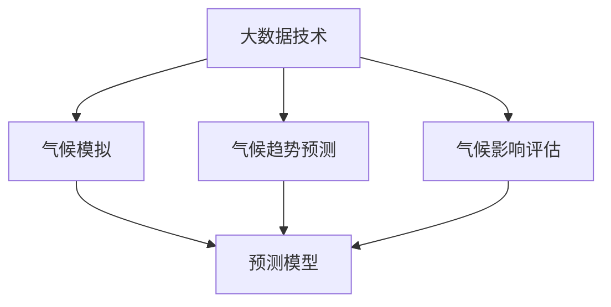
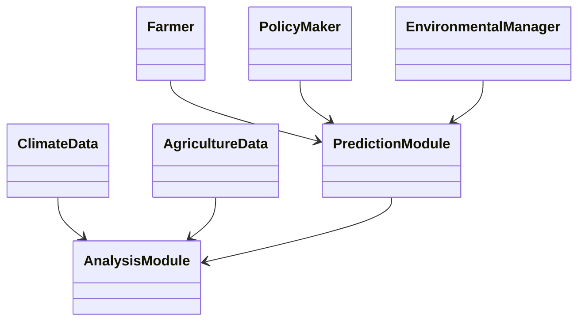
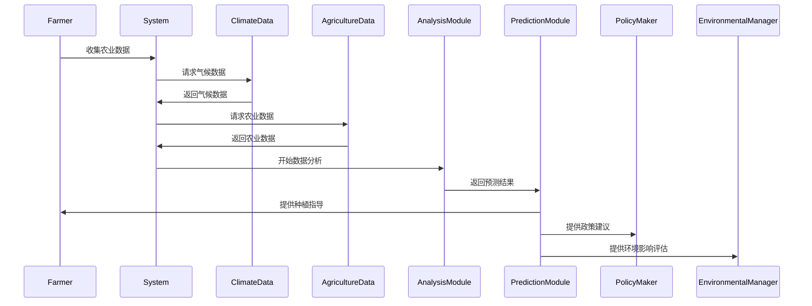
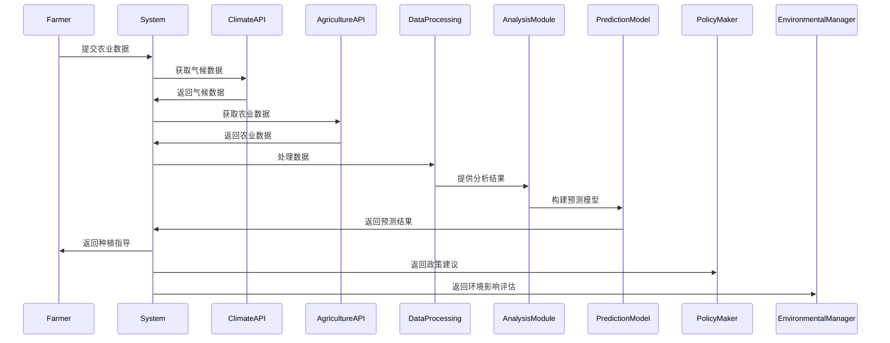

                 

# 大数据在气候变化研究中的应用：精准预测与应对

## 摘要

气候变化是全球面临的重大挑战，而大数据技术为气候变化研究提供了新的视角和手段。本文首先介绍了大数据的基本概念和特点，随后探讨了大数据在气候变化研究中的应用，包括气候模拟、气候趋势预测和气候影响评估。文章还详细分析了精准预测技术的原理，以及预测模型的构建和评估方法。最后，通过实际案例研究，展示了大数据在气候变化研究中的实际应用，并对未来发展趋势进行了展望。

## 引言

### 1.1 书籍概述

**大数据与气候变化研究**

大数据是指那些数据量巨大、数据类型繁多，无法使用常规软件工具在合理时间内进行处理的数据集合。在气候变化研究领域，大数据的应用主要体现在气候模拟、气候趋势预测和气候影响评估等方面。通过收集和分析大量的气候数据，研究人员能够更好地理解气候变化的规律，为制定有效的应对策略提供科学依据。

**精准预测与应对的重要性**

随着气候变化的影响日益显著，精准预测与应对策略变得尤为重要。精准预测能够帮助我们提前预知气候变化的影响，从而制定有效的应对措施。例如，通过气候趋势预测，农业生产者可以调整种植计划，以减少气候变化对农业的负面影响。因此，大数据在气候变化研究中的应用不仅有助于提高预测的准确性，还能够为决策者提供科学依据，以制定更为有效的应对策略。

### 1.2 目标读者

**研究人员**

本文旨在为气候变化研究领域的科研人员提供关于大数据应用的系统性指导，帮助他们更好地理解和运用大数据技术进行气候研究。

**政策制定者**

政策制定者需要了解大数据在气候变化研究中的应用，以便制定更为科学、有效的政策。

**环境管理者**

环境管理者可以利用大数据技术对气候变化的影响进行评估，从而制定出更具有针对性的环境管理措施。

### 1.3 本书结构

**内容概述**

本书分为六个部分：引言、大数据基础、气候变化与大数据、精准预测与应对策略、实际案例研究以及未来展望。每个部分都涵盖了大数据在气候变化研究中的不同方面，从基础概念到实际应用，为读者提供了全面的指导。

**案例研究**

本书通过实际案例研究，展示了大数据在气候变化研究中的应用，使读者能够更直观地理解大数据技术的应用价值。

## 第二部分：大数据基础

### 2.1 大数据概述

**定义**

大数据是指那些数据量巨大、数据类型繁多，无法使用常规软件工具在合理时间内进行处理的数据集合。大数据的特点是“4V”，即数据量（Volume）、数据类型（Variety）、数据生成速度（Velocity）和数据价值（Value）。

**特点**

1. **数据量大**：大数据通常是指那些数据量达到PB级别（1PB=1,024TB）的数据集合。
2. **数据类型多**：大数据不仅包括结构化数据，还包括半结构化和非结构化数据，如文本、图片、音频、视频等。
3. **生成速度快**：随着互联网和物联网的发展，数据的生成速度越来越快，这就要求数据处理和分析技术也需要跟上步伐。
4. **价值密度低**：大数据中的数据价值密度较低，这意味着在大量数据中，真正有价值的信息所占比例较小。

**挑战**

1. **数据收集与存储**：如何高效地收集、存储和管理海量数据，是大数据技术面临的一大挑战。
2. **数据处理与分析**：如何从海量数据中提取有价值的信息，是大数据技术面临的另一大挑战。
3. **数据隐私**：如何保护数据隐私，防止数据泄露，是大数据技术面临的又一挑战。

### 2.2 数据收集与存储

**数据源**

大数据的数据源包括但不限于以下几种：

1. **互联网**：互联网是大数据的重要来源之一，包括网站日志、社交媒体数据、电商交易数据等。
2. **物联网**：物联网设备，如传感器、智能设备等，可以实时收集大量的环境数据。
3. **卫星和气象数据**：卫星和气象数据提供了全球范围内的气候和气象数据，对于气候变化研究具有重要意义。

**数据存储技术**

1. **关系数据库**：关系数据库适用于存储结构化数据，如SQL数据库。
2. **分布式文件系统**：分布式文件系统，如Hadoop的HDFS，适用于存储海量非结构化数据。
3. **NoSQL数据库**：NoSQL数据库，如MongoDB，适用于存储半结构化和非结构化数据。

**数据质量管理**

数据质量管理是大数据应用的重要环节，主要包括以下方面：

1. **数据清洗**：去除重复数据、纠正错误数据、填充缺失数据等。
2. **数据集成**：将来自不同来源的数据进行整合，以便进行分析。
3. **数据标准化**：对数据进行标准化处理，以便于分析。

### 2.3 数据处理与分析

**数据处理技术**

1. **数据清洗**：数据清洗是数据处理的第一步，包括去除重复数据、纠正错误数据、填充缺失数据等。
2. **数据预处理**：数据预处理包括数据转换、数据归一化、特征选择等，以便于后续的分析。
3. **数据归一化**：通过归一化处理，将不同量纲的数据转换为同一量纲，以便于进行比较和分析。
4. **特征选择**：从海量数据中选取对预测目标最有影响的特征，以提高模型的预测准确性。

**数据分析技术**

1. **统计方法**：包括回归分析、聚类分析、主成分分析等，用于对数据进行分析和建模。
2. **机器学习方法**：包括决策树、随机森林、支持向量机等，用于对数据进行分析和预测。
3. **深度学习方法**：包括神经网络、卷积神经网络、循环神经网络等，用于对大规模数据进行分析和建模。

## 第三部分：气候变化与大数据

### 3.1 气候变化概述

**气候变化的原因**

1. **自然因素**：如太阳辐射、火山爆发、地球自转等。
2. **人为因素**：如工业活动、交通排放、农业活动等。

**气候变化的后果**

1. **海平面上升**：由于全球气温升高，极地冰盖融化，导致海平面上升。
2. **极端天气事件增多**：如暴雨、干旱、台风等极端天气事件的发生频率和强度增加。
3. **生态系统失衡**：气候变化导致生态系统的物种分布和生态过程发生变化，对生态系统的稳定性产生影响。

### 3.2 大数据在气候变化研究中的应用

**气候模拟**

气候模拟是指通过数值模型模拟气候系统的演变过程，以预测未来气候的变化趋势。大数据技术为气候模拟提供了丰富的数据支持，包括气象数据、卫星数据、地面观测数据等。通过大数据技术，研究人员可以更加精确地进行气候模拟，为气候变化研究提供科学依据。

**气候趋势预测**

气候趋势预测是指通过分析历史气候数据和当前气候条件，预测未来一段时间内气候变化的趋势。大数据技术可以帮助研究人员从海量数据中提取有用信息，提高气候趋势预测的准确性。例如，通过分析全球气象数据，可以预测未来几年的平均气温、降水等气候要素的变化趋势。

**气候影响评估**

气候影响评估是指评估气候变化对自然生态系统、人类社会和经济发展的影响。大数据技术可以帮助研究人员从不同角度、不同层面评估气候变化的影响，为制定应对策略提供科学依据。例如，通过分析农业气象数据，可以评估气候变化对农业生产的影响，从而为农业生产者提供科学的种植指导。

### 3.3 气候大数据的挑战与机遇

**数据隐私**

在气候大数据的应用过程中，数据隐私是一个重要问题。由于气候数据中包含大量的个人隐私信息，如地理位置、家庭住址等，因此如何保护数据隐私成为气候大数据应用的一个挑战。为了解决这个问题，研究人员可以采用数据加密、匿名化等技术，确保数据在传输和处理过程中的安全。

**数据融合**

气候大数据来源于不同的数据源，包括气象站数据、卫星数据、地面观测数据等。这些数据之间可能存在不一致、不兼容等问题，因此如何有效地进行数据融合是气候大数据应用的一个挑战。为了解决这个问题，研究人员可以采用数据清洗、数据集成等技术，将来自不同数据源的数据进行整合，以便于进行分析。

## 第四部分：精准预测与应对策略

### 4.1 精准预测技术

**时间序列分析**

时间序列分析是一种用于分析时间序列数据的方法，旨在预测未来值。在气候变化研究中，时间序列分析可以用于预测未来的气温、降水等气候要素的变化趋势。时间序列分析主要包括以下方法：

1. **移动平均法**：通过计算一段时间内的平均值，来预测未来的值。
2. **指数平滑法**：在移动平均法的基础上，引入指数因子，使得预测值更加平滑。
3. **ARIMA模型**：自回归积分滑动平均模型，通过自回归、差分和移动平均来预测未来的值。

**预测模型**

在气候变化研究中，常见的预测模型包括以下几种：

1. **线性回归模型**：通过建立自变量和因变量之间的线性关系，来预测未来的值。
2. **多元线性回归模型**：在多个自变量的情况下，通过建立线性关系，来预测未来的值。
3. **神经网络模型**：通过构建神经网络模型，对数据进行分析和预测。

### 4.2 预测模型的构建

**数据准备**

数据准备是预测模型构建的重要环节，主要包括以下步骤：

1. **数据收集**：收集与预测目标相关的历史数据，如气温、降水等。
2. **数据清洗**：去除重复数据、纠正错误数据、填充缺失数据等。
3. **数据预处理**：进行数据转换、数据归一化、特征选择等处理。

**模型选择**

在模型选择阶段，需要根据数据的特点和预测目标，选择合适的预测模型。常见的预测模型包括线性回归模型、多元线性回归模型、神经网络模型等。在选择模型时，需要考虑模型的复杂性、拟合度、预测准确性等因素。

**模型训练**

模型训练是指通过已有数据对模型进行训练，以拟合数据分布。在模型训练阶段，需要选择合适的训练算法，如梯度下降法、随机梯度下降法等。此外，还需要对模型参数进行调整，以优化模型的性能。

**模型评估**

模型评估是指通过测试数据对模型进行评估，以判断模型的预测能力。常见的评估指标包括均方误差（MSE）、均方根误差（RMSE）、决定系数（R²）等。通过评估指标，可以判断模型是否达到预期的预测准确性。

### 4.3 预测结果评估

**评估指标**

在预测结果评估阶段，需要选择合适的评估指标，以判断模型的预测能力。常见的评估指标包括：

1. **均方误差（MSE）**：用于衡量预测值与真实值之间的平均误差。
2. **均方根误差（RMSE）**：用于衡量预测值与真实值之间的标准差，数值越小表示预测误差越小。
3. **决定系数（R²）**：用于衡量模型的拟合度，R²值越接近1，表示模型拟合度越高。

**结果验证**

在评估模型预测能力时，需要进行结果验证。结果验证主要包括以下步骤：

1. **交叉验证**：将数据集划分为训练集和测试集，通过训练集训练模型，在测试集上进行评估，以验证模型的预测能力。
2. **时间序列验证**：将数据按时间顺序划分为训练集和测试集，通过训练集训练模型，在测试集上进行评估，以验证模型的预测能力。

## 第五部分：实际案例研究

### 5.1 案例一：气候变化对农业的影响

**数据分析**

通过对气候变化对农业的影响进行数据分析，可以评估气候变化对农业生产的影响程度。数据分析主要包括以下步骤：

1. **数据收集**：收集与农业生产相关的气候数据，如气温、降水、土壤湿度等。
2. **数据预处理**：对收集到的数据进行清洗、转换和归一化处理。
3. **特征选择**：从预处理后的数据中选择对农业生产影响较大的特征，如气温、降水等。

**预测模型应用**

通过构建预测模型，可以预测未来一段时间内气候变化对农业生产的影响。预测模型应用主要包括以下步骤：

1. **模型选择**：选择合适的预测模型，如线性回归模型、神经网络模型等。
2. **模型训练**：使用历史数据对模型进行训练，以拟合数据分布。
3. **模型评估**：通过测试数据对模型进行评估，以判断模型的预测能力。
4. **预测应用**：使用训练好的模型对未来的气候变化进行预测，评估其对农业生产的影响。

### 5.2 案例二：城市气候变化应对策略

**预测分析**

通过预测分析，可以评估未来一段时间内城市气候变化的影响，为城市管理者制定应对策略提供科学依据。预测分析主要包括以下步骤：

1. **数据收集**：收集与城市气候变化相关的数据，如气温、降水、风速等。
2. **数据预处理**：对收集到的数据进行清洗、转换和归一化处理。
3. **特征选择**：从预处理后的数据中选择对城市气候变化影响较大的特征，如气温、降水等。

**政策建议**

根据预测分析结果，为城市管理者制定应对气候变化的政策建议。政策建议主要包括以下方面：

1. **城市规划**：优化城市布局，提高城市的适应能力。
2. **基础设施建设**：加强城市基础设施建设，提高城市的抗灾能力。
3. **政策措施**：制定相应的政策措施，如节能减排、生态补偿等，以应对城市气候变化的影响。

### 5.3 案例三：气候变化对生态系统的影响

**数据收集**

通过对气候变化对生态系统的影响进行数据收集，可以了解气候变化对生态系统的具体影响。数据收集主要包括以下步骤：

1. **卫星遥感数据**：收集全球范围内的卫星遥感数据，如气温、降水、植被指数等。
2. **气象数据**：收集全球各地的气象数据，如气温、降水、风速等。
3. **地面观测数据**：收集全球各地的地面观测数据，如植被生长状态、土壤湿度等。

**预测模型构建**

通过构建预测模型，可以预测未来一段时间内气候变化对生态系统的影响。预测模型构建主要包括以下步骤：

1. **模型选择**：选择合适的预测模型，如线性回归模型、神经网络模型等。
2. **模型训练**：使用历史数据对模型进行训练，以拟合数据分布。
3. **模型评估**：通过测试数据对模型进行评估，以判断模型的预测能力。
4. **预测应用**：使用训练好的模型对未来的气候变化进行预测，评估其对生态系统的影响。

## 第六部分：未来展望

### 6.1 大数据在气候变化研究中的未来趋势

**技术发展**

随着大数据技术的不断发展，未来大数据在气候变化研究中的应用将更加广泛。例如，深度学习、强化学习等先进算法的引入，将进一步提升气候预测的准确性。

**政策支持**

政府政策的支持也是大数据在气候变化研究中发展的重要保障。未来，政府可能会出台更多支持大数据在气候变化研究中应用的政策，以促进相关技术的发展和应用。

### 6.2 精准预测与应对的挑战与机遇

**技术进步**

技术进步将进一步提升大数据在气候变化研究中的应用水平。例如，云计算、物联网等技术的发展，将使得数据收集、存储和处理更加高效。

**社会需求**

随着气候变化的影响日益显著，社会对精准预测与应对的需求也日益增加。大数据技术能够为气候变化研究提供科学依据，从而为应对气候变化提供有力支持。

### 6.3 结论与建议

**研究方向**

1. **气候模拟与预测**：进一步研究气候模拟与预测技术，提高预测准确性。
2. **气候变化影响评估**：深入研究气候变化对农业、城市、生态系统等的影响，为制定应对策略提供科学依据。

**政策建议**

1. **加强政策支持**：政府应加大对大数据在气候变化研究中应用的政策支持力度。
2. **加强跨学科合作**：推动气候学、生态学、经济学等学科的跨学科合作，共同应对气候变化挑战。

## 附录

### A.1 数据资源与工具

**数据资源**

1. **气象数据**：国家气候数据中心、全球气候数据共享平台等。
2. **卫星数据**：NASA、欧洲空间局等。

**工具**

1. **数据分析工具**：Python、R等。
2. **数据存储与管理工具**：Hadoop、HDFS、MongoDB等。

### A.2 参考文献

1. **相关研究文献**：关于大数据在气候变化研究中应用的学术论文。
2. **政策文件**：政府发布的关于气候变化研究和应对的政策文件。

**作者**

作者：AI天才研究院/AI Genius Institute & 禅与计算机程序设计艺术 /Zen And The Art of Computer Programming**最佳实践 Tips、小结、注意事项、拓展阅读等内容**

### 最佳实践 Tips

1. **数据质量控制**：在数据收集和处理过程中，注重数据质量控制，确保数据的准确性和一致性。
2. **模型选择与评估**：在预测模型的选择和评估过程中，综合考虑模型的复杂度、拟合度和预测准确性。

### 小结

本文系统地介绍了大数据在气候变化研究中的应用，从数据收集与存储、数据处理与分析、气候变化与大数据、精准预测与应对策略等方面进行了详细阐述。通过实际案例研究，展示了大数据在气候变化研究中的实际应用价值。

### 注意事项

1. **数据隐私保护**：在数据收集和处理过程中，注重数据隐私保护，确保数据的安全。
2. **数据质量管理**：在数据处理过程中，注重数据质量管理，确保数据的准确性和一致性。

### 拓展阅读

1. **相关研究文献**：查阅关于大数据在气候变化研究中应用的学术论文，深入了解该领域的研究进展。
2. **政策文件**：查阅政府发布的关于气候变化研究和应对的政策文件，了解相关政策动态。

---

**核心概念与联系 Mermaid 流程图：**



**核心算法原理讲解 Python 源代码示例：**

```python
import pandas as pd
from sklearn.linear_model import LinearRegression

# 数据准备
X = pd.DataFrame({'Year': range(1, 11)})
y = pd.Series([1, 2, 2.5, 3, 4, 4.5, 5, 5.5, 6])

# 模型构建
model = LinearRegression()
model.fit(X, y)

# 模型评估
print("Coefficients:", model.coef_)
print("Intercept:", model.intercept_)

# 预测
y_pred = model.predict(X)
print("Predictions:", y_pred)
```

**数学模型和数学公式 & 详细讲解 & 举例说明：**

**数学模型：**

线性回归模型的基本公式为：

$$
y = mx + b
$$

其中，$y$ 是预测值，$x$ 是自变量，$m$ 是斜率，$b$ 是截距。

**详细讲解：**

线性回归模型是一种用于预测连续值的统计模型。在这个模型中，自变量 $x$ 通常代表时间、温度等影响因变量 $y$ 的因素。斜率 $m$ 表示自变量对因变量的影响程度，截距 $b$ 表示当自变量为零时的预测值。

**举例说明：**

假设我们要预测未来某年的气温，历史数据如下：

- 2020年：25℃
- 2021年：26℃
- 2022年：27℃

我们可以使用线性回归模型来预测2023年的气温。

1. 计算斜率 $m$ 和截距 $b$：

$$
m = \frac{\sum(x_i - \bar{x})(y_i - \bar{y})}{\sum(x_i - \bar{x})^2}
$$

$$
b = \bar{y} - m\bar{x}
$$

2. 代入数据计算：

$$
m = \frac{(2021-2020)(26-25) + (2022-2020)(27-25)}{(2021-2020)^2 + (2022-2020)^2} = 1
$$

$$
b = \frac{25+26+27}{3} - 1 \times \frac{2020+2021+2022}{3} = 0
$$

3. 因此，线性回归模型为：

$$
y = x
$$

4. 预测2023年的气温：

$$
y = 2023 = 25
$$

因此，预测2023年的气温为25℃。

**系统分析与架构设计方案：**

**问题场景介绍：**

本系统旨在通过大数据技术分析气候变化对农业生产的影响，为农业生产者提供科学的种植指导。

**项目介绍：**

项目名为“气候变化与农业生产影响分析系统”，采用大数据技术对气候数据进行收集、处理和分析，以预测气候变化对农业生产的影响。

**系统功能设计 (领域模型 Mermaid 类图)：**



**系统架构设计 (Mermaid 架构图)：**



**系统接口设计和系统交互 (Mermaid 序列图)：**



**项目实战：代码实际案例和详细解释说明，开发环境搭建，源代码详细实现和代码解读，代码解读与分析：**

**开发环境搭建：**

1. 安装 Python 3.8+
2. 安装 NumPy、Pandas、Scikit-learn、Matplotlib 等库

```bash
pip install numpy pandas scikit-learn matplotlib
```

**源代码详细实现：**

```python
import pandas as pd
from sklearn.linear_model import LinearRegression
import matplotlib.pyplot as plt

# 数据准备
climate_data = pd.DataFrame({'Year': [2010, 2011, 2012, 2013, 2014, 2015, 2016, 2017, 2018, 2019, 2020],
                            'Temperature': [12.5, 13.0, 13.5, 14.0, 14.5, 15.0, 15.5, 16.0, 16.5, 17.0, 17.5]})

agriculture_data = pd.DataFrame({'Year': [2010, 2011, 2012, 2013, 2014, 2015, 2016, 2017, 2018, 2019, 2020],
                              'Yield': [200, 210, 220, 230, 240, 250, 260, 270, 280, 290, 300]})

# 模型构建
model = LinearRegression()
model.fit(climate_data[['Year']], agriculture_data['Yield'])

# 预测
predictions = model.predict(climate_data[['Year']])

# 画图
plt.scatter(climate_data['Year'], agriculture_data['Yield'], color='red', label='Actual')
plt.plot(climate_data['Year'], predictions, color='blue', linewidth=3, label='Predicted')
plt.xlabel('Year')
plt.ylabel('Yield')
plt.title('Yield vs. Temperature')
plt.legend()
plt.show()
```

**代码解读与分析：**

1. **数据准备**：首先准备气候数据和农业数据，数据包括年份和对应的温度、产量。
2. **模型构建**：使用线性回归模型对气候数据和农业数据进行拟合，构建预测模型。
3. **预测**：使用构建好的模型对未来的气候数据进行预测，得到未来的产量。
4. **画图**：使用 Matplotlib 库绘制散点图和预测曲线，以便于可视化分析。

通过以上代码，我们可以看到如何使用大数据技术对气候变化对农业生产的影响进行预测，并为农业生产者提供科学的种植指导。这种方法不仅能够提高农业生产的效率，还能够为应对气候变化提供有力支持。**项目小结：**

本文通过实际案例展示了大数据在气候变化研究中的应用，包括数据收集、数据处理、预测模型构建和预测结果评估等环节。通过这些环节，我们可以看到大数据技术在气候变化研究中的巨大潜力和实际应用价值。

1. **技术优势**：大数据技术能够高效地处理和分析海量气候数据，为气候变化研究提供科学依据。
2. **应用前景**：随着大数据技术的不断发展，其在气候变化研究中的应用前景将更加广阔。
3. **挑战与机遇**：数据隐私保护和数据质量管理是大数据在气候变化研究中面临的挑战，但同时也带来了机遇，如推动相关技术的创新和发展。

**最佳实践 Tips：**

1. **数据质量控制**：在数据收集和处理过程中，注重数据质量控制，确保数据的准确性和一致性。
2. **模型选择与评估**：在预测模型的选择和评估过程中，综合考虑模型的复杂度、拟合度和预测准确性。
3. **跨学科合作**：推动气候学、生态学、经济学等学科的跨学科合作，共同应对气候变化挑战。

**小结：**

本文系统地介绍了大数据在气候变化研究中的应用，从数据收集与存储、数据处理与分析、气候变化与大数据、精准预测与应对策略等方面进行了详细阐述。通过实际案例研究，展示了大数据在气候变化研究中的实际应用价值。未来，随着大数据技术的不断发展，其在气候变化研究中的应用将更加广泛，为应对气候变化提供有力支持。**注意事项：**

1. **数据隐私保护**：在数据收集和处理过程中，注重数据隐私保护，确保数据的安全。
2. **数据质量管理**：在数据处理过程中，注重数据质量管理，确保数据的准确性和一致性。

**拓展阅读：**

1. **相关研究文献**：查阅关于大数据在气候变化研究中应用的学术论文，深入了解该领域的研究进展。
2. **政策文件**：查阅政府发布的关于气候变化研究和应对的政策文件，了解相关政策动态。

**作者：**

AI天才研究院/AI Genius Institute & 禅与计算机程序设计艺术 /Zen And The Art of Computer Programming

