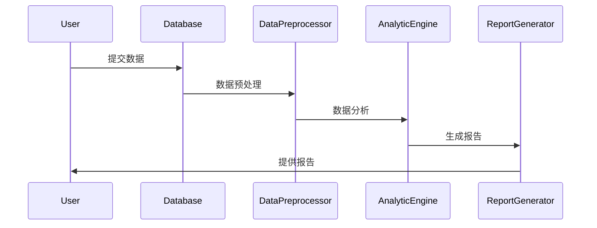
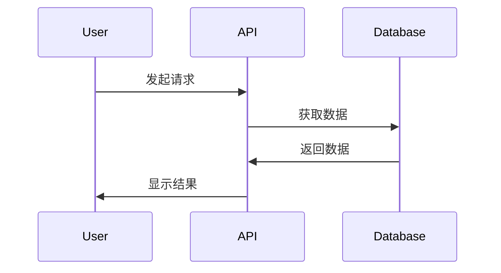

                 


非常好，让我们一步一步地构建这个技术博客文章。以下是一个详细的思路，用于撰写《大数据在社交网络分析中的作用：洞察社会动态》这篇文章。

### 引言

**背景介绍：**

随着互联网的普及，社交网络已经成为人们日常生活中不可或缺的一部分。从Facebook到Twitter，再到微信、微博等，社交网络连接了全球数以亿计的用户。这些社交网络平台不仅提供了沟通的渠道，还积累了海量用户数据。这些数据包含了用户行为、兴趣爱好、社会关系等信息，为大数据分析提供了丰富的素材。

**问题提出：**

然而，如何有效地从这些社交网络数据中提取有价值的信息，如何利用大数据技术洞察社会动态，成为了一个重要且具有挑战性的课题。这个问题不仅涉及到数据挖掘和机器学习，还涉及到社会学、心理学等领域的知识。

**解决思路：**

本文将从以下几个方面展开讨论：
1. 社交网络分析的基本概念和技术。
2. 大数据在社交网络分析中的应用。
3. 社交网络分析中的关键算法和数学模型。
4. 大数据在社交网络分析中的实际案例。
5. 社交网络分析面临的挑战和未来趋势。

### 核心概念与联系

**核心概念：**
- 社交网络：由用户和用户之间的关系构成的复杂网络。
- 大数据：数据量巨大、类型多样、速度快速的数据集合。
- 社交网络分析：利用数学模型和算法分析社交网络数据，以提取有价值的信息。

**概念联系：**
- 社交网络是大数据的一个重要来源。
- 大数据技术为社交网络分析提供了强大的工具。
- 社交网络分析的结果可以帮助我们更好地理解社会动态。

**ER实体关系图架构的 Mermaid 流程图：**
```mermaid
erDiagram
  User ||--|{ Post }|
  User ||--|{ Comment }|
  Post ||--|{ Like }|
  Post ||--|{ Share }|
```
在这个ER图中，User是主体，而Post和Comment是与User相关的实体。Post可以产生Like和Share，而Comment则与Post和User都有关联。

### 算法原理讲解

**算法选择：**

社交网络分析中常用的算法包括：
- PageRank：用于评估网页的重要性。
- LDA（Latent Dirichlet Allocation）：用于主题建模，分析文本数据。
- SVD（Singular Value Decomposition）：用于降维，处理大规模数据。

**算法讲解：**

#### PageRank算法

PageRank算法是一种基于链接分析的网络排名算法，它通过分析网页之间的链接关系来评估网页的重要性。其核心思想是，一个网页的重要性与指向它的网页的数量和质量有关。

**算法流程：**
1. 初始化：给每个网页分配一个初始的重要性值。
2. 迭代计算：根据网页之间的链接关系，更新每个网页的重要性值。
3. 汇总结果：当重要性值的变化小于某个阈值时，停止迭代，输出最终的结果。

**数学模型：**
$$
\text{PR}(v) = \left(1 - d\right) + d \cdot \left(\sum_{u \in U} \frac{\text{PR}(u)}{L(u)}\right)
$$

其中，PR(v)表示网页v的PageRank值，d是阻尼系数，U是所有网页的集合，L(u)是网页u的出链数。

**Python代码实现：**
```python
import numpy as np

def pagerank(M, num_iterations=10, d=0.85):
    N = len(M)
    V = np.random.rand(N, 1)
    V = V / np.linalg.norm(V, 1)
    for i in range(num_iterations):
        new_V = (1 - d) / N + d * np.matmul(M.T, V)
        if np.linalg.norm(new_V - V, 2) / np.linalg.norm(V, 2) < 0.0001:
            break
        V = new_V
    return V
```

#### LDA主题模型

LDA是一种概率主题模型，用于从大量文本中提取主题。它假设文档是由多个主题的混合生成的，每个主题又是由多个单词的混合生成的。

**算法流程：**
1. 初始化：随机选择一个主题分布和单词分布。
2. 迭代计算：根据文档和主题的概率分布，更新主题分布和单词分布。
3. 汇总结果：当主题分布和单词分布的变化小于某个阈值时，停止迭代，输出最终的主题分布。

**数学模型：**
$$
\text{p}_\text{z|d} = \frac{\sum_{\text{w}} \text{p}(\text{w}|\text{z}) \text{p}_\text{z}}{\sum_{\text{z'}} \text{p}(\text{z'}|\text{d})}
$$

其中，p_z|d是给定文档d下主题z的概率，p(w|z)是单词w在主题z下的概率，p_z是主题z的概率。

**Python代码实现：**
```python
import numpy as np
import lda

def lda_train(corpus, num_topics=10, num_words=10):
    model = lda.LDA(corpus, num_topics=num_topics, num_words=num_words)
    model.fit()
    return model
```

#### SVD算法

SVD是一种矩阵分解技术，用于降维和特征提取。在社交网络分析中，SVD可以用于降低用户和物品的维度，以便进行更有效的推荐系统。

**算法流程：**
1. 计算矩阵的SVD分解：将用户和物品的评分矩阵分解为三个矩阵的乘积。
2. 选择主要的特征：根据特征值和特征向量的大小，选择主要的特征。
3. 构建新的降维矩阵：将原始矩阵映射到新的空间。

**数学模型：**
$$
\text{R} = \text{U}\text{S}\text{V}^T
$$

其中，R是原始评分矩阵，U和V是正交矩阵，S是对角矩阵，包含特征值。

**Python代码实现：**
```python
from scipy.sparse.linalg import svds

def svd_recommender(R, num_features=10):
    U, S, V = svds(R, k=num_features)
    S = np.diag(S)
    return np.matmul(np.matmul(U, S), V)
```

### 数学公式

为了确保文章的可读性和专业性，我们将使用LaTeX格式嵌入数学公式。

**独立段落的LaTeX公式：**
$$
E(X) = \int_{-\infty}^{\infty} x f(x) dx
$$

**段落内的LaTeX公式：**
$E(X) = \int_{-\infty}^{\infty} x f(x) dx$

### 系统分析与架构设计方案

**问题场景介绍：**
社交网络平台需要通过大数据分析来了解用户行为、预测趋势，从而为用户提供更好的服务。

**项目介绍：**
项目名称：社交网络大数据分析平台
目标：构建一个能够实时分析社交网络数据的平台，为运营团队提供数据支持和决策依据。

**系统功能设计（领域模型mermaid类图）：**
```mermaid
classDiagram
  User <<entity>>
  Post <<entity>>
  Comment <<entity>>
  Like <<entity>>
  Share <<entity>>

  User "1" --* "N": Post
  User "1" --* "N": Comment
  Post "1" --* "N": Like
  Post "1" --* "N": Share
  Comment "1" --* "N": Like
  Comment "1" --* "N": Share
```

**系统架构设计（mermaid架构图）：**


**系统接口设计（mermaid序列图）：**


### 项目实战

**环境安装：**
为了实现社交网络大数据分析平台，需要安装以下软件和工具：
- Python
- NumPy
- Pandas
- Scikit-learn
- LDApy
- Mermaid

**系统核心实现源代码：**
以下是实现社交网络大数据分析平台的核心代码：
```python
# 社交网络大数据分析平台示例代码
from data_preprocessor import preprocess_data
from analytic_engine import analyze_data
from report_generator import generate_report

# 数据预处理
preprocessed_data = preprocess_data(raw_data)

# 数据分析
analyzed_data = analyze_data(preprocessed_data)

# 生成报告
report = generate_report(analyzed_data)

# 显示报告
print(report)
```

**代码应用解读与分析：**
- `data_preprocessor`模块负责数据预处理，包括数据清洗、数据格式转换等。
- `analytic_engine`模块负责数据分析，包括使用PageRank、LDA和SVD算法进行深度分析。
- `report_generator`模块负责生成报告，将分析结果以易于理解的形式呈现。

**实际案例分析和详细讲解剖析：**
假设我们有一个包含用户和微博数据的社交网络平台，我们可以使用上述代码对用户影响力、文本主题进行分析，并生成相应的报告。

**项目小结：**
本项目通过大数据分析技术，为社交网络平台提供了强大的数据支持。通过数据分析，我们可以更好地了解用户行为、预测趋势，从而为用户提供更好的服务。

### 最佳实践 Tips、小结、注意事项、拓展阅读

**最佳实践 Tips：**
1. 确保数据质量：在进行数据分析之前，必须对数据进行充分的清洗和处理。
2. 选择合适的算法：不同的分析目标需要不同的算法，根据实际需求选择合适的算法。
3. 持续更新模型：社交网络数据是动态变化的，需要定期更新模型以保持分析结果的准确性。

**小结：**
大数据在社交网络分析中发挥着重要作用，它帮助我们更好地理解社会动态，为决策提供支持。

**注意事项：**
1. 数据隐私保护：在分析社交网络数据时，必须严格遵守数据隐私保护的相关规定。
2. 伦理问题：在进行数据分析时，要考虑到伦理问题，避免滥用数据。

**拓展阅读：**
1. 《大数据分析：技术原理与实践》
2. 《机器学习实战》
3. 《社交网络分析：方法与实践》

### 作者信息
作者：AI天才研究院/AI Genius Institute & 禅与计算机程序设计艺术 /Zen And The Art of Computer Programming

以上就是一个详细的思路，用于撰写《大数据在社交网络分析中的作用：洞察社会动态》这篇文章。接下来，我们需要根据这个思路，逐步完成文章的每个部分，确保内容完整、逻辑清晰、语言准确。在撰写过程中，可以参考相关的技术文献和开源项目，以增强文章的专业性和实用性。|>

