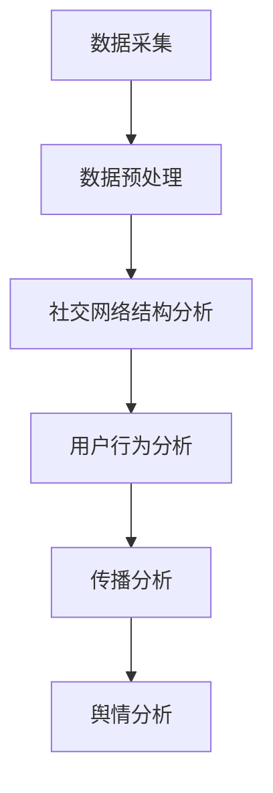

                 

### 引言

#### 社交网络分析的重要性

社交网络分析（Social Network Analysis, SNA）是一种研究社会结构、关系动态和群体行为的方法，它通过数学模型和统计方法来揭示个体及其相互关系。在互联网和社交媒体的快速发展下，社交网络已经成为人们交流、互动和获取信息的重要平台。因此，社交网络分析在多个领域都显得尤为重要，包括市场营销、公共安全、社会研究和政治分析等。

随着大数据时代的到来，海量社交网络数据的产生为社交网络分析提供了丰富的素材。这些数据不仅包含用户的基本信息，还记录了用户的互动行为、兴趣爱好、地理位置等多维信息。通过大数据技术，我们可以对这些海量数据进行高效的处理和分析，从而深入洞察社交网络的运行机制和社会动态。

#### 大数据与社交网络分析的关系

大数据（Big Data）是指数据量巨大、数据类型繁多、生成速度极快的数据集合。其三大特点为“4V”，即数据量（Volume）、数据类型（Variety）、数据生成速度（Velocity）和数据价值（Value）。社交网络分析中的大数据不仅包括用户生成的内容，还涵盖了社交媒体平台上的各种结构化、半结构化和非结构化数据。这些数据为社交网络分析提供了丰富的信息和多样的视角。

大数据技术与社交网络分析的融合，使得我们可以更加深入和准确地分析社交网络中的各种现象。例如，通过大数据技术，我们可以快速处理和挖掘大量用户数据，识别社交网络中的关键节点和影响者，分析信息传播的路径和速度，甚至预测未来的社交趋势和用户行为。

#### 本书结构概述

本书旨在深入探讨大数据在社交网络分析中的应用，帮助读者理解社交网络分析的基本概念、方法和大数据技术的应用。全书共分为三大部分，每部分都有其独特的重点和目标。

**第一部分：大数据与社交网络分析基础**

本部分首先介绍大数据和社交网络的基本概念，然后详细讲解社交网络数据分析的基础知识，包括数据采集、处理和社交网络结构分析。

**第二部分：大数据在社交网络分析中的应用案例**

本部分通过具体的案例，展示大数据在社交网络用户行为分析、传播分析和舆情分析等领域的应用，帮助读者理解这些技术的实际操作和效果。

**第三部分：大数据在社交网络分析中的前沿研究**

本部分探讨大数据在社交网络分析中的前沿研究和发展趋势，包括数据隐私保护、安全性、以及新兴技术的应用。

通过本书的学习，读者不仅可以掌握大数据和社交网络分析的基本理论和实践方法，还能了解该领域的最新动态和发展方向。

### 第一部分：大数据与社交网络分析基础

#### 第1章：大数据与社交网络简介

##### 1.1 大数据的定义与特点

大数据是指那些数据量巨大、类型多样、生成速度极快的数据集合。其特点可以用“4V”来概括，即数据量（Volume）、数据类型（Variety）、数据生成速度（Velocity）和数据价值（Value）。

- **数据量（Volume）**：大数据的处理对象通常是海量数据，这些数据可能来自多个数据源，如社交媒体、传感器、电子商务平台等。数据量的庞大使得传统的数据处理方法难以胜任，需要借助分布式计算和存储技术。

- **数据类型（Variety）**：大数据不仅包括结构化数据（如数据库中的记录），还包括大量的半结构化和非结构化数据（如图像、视频、文本、音频等）。这些不同类型的数据对处理和分析提出了更高的要求。

- **数据生成速度（Velocity）**：大数据的生成速度非常快，例如，社交媒体平台每秒会产生大量的新内容，物联网设备会不断产生传感器数据。处理这类数据需要实时或近实时的分析能力。

- **数据价值（Value）**：大数据的价值体现在其能够为决策提供有力支持，帮助企业和组织发现新的商业机会、优化运营流程、提高效率等。

##### 1.2 社交网络的定义与类型

社交网络是指由个体及其相互关系构成的复杂网络。每个个体在社交网络中都可以被视为节点，而个体之间的互动和关系则通过边来表示。社交网络可以分为多种类型，如基于兴趣的社交网络、基于地理位置的社交网络、以及企业社交网络等。

- **基于兴趣的社交网络**：如Facebook、LinkedIn等，用户可以根据兴趣、爱好等因素创建个人档案，与其他用户建立联系。

- **基于地理位置的社交网络**：如Foursquare、Instagram等，用户可以通过地理位置标签来分享位置信息，发现周边的活动和场所。

- **企业社交网络**：如Asana、Slack等，用于企业内部或跨组织的信息共享和工作协同。

##### 1.3 大数据与社交网络的结合意义

大数据与社交网络的结合具有重要意义，主要体现在以下几个方面：

- **洞察能力的提升**：通过大数据技术，可以处理和分析大量社交网络数据，识别关键节点、影响者以及信息传播路径，从而更加深入地了解社交网络的运行机制。

- **商业价值的挖掘**：大数据分析可以帮助企业精准定位目标用户，优化营销策略，提高用户满意度，增加收入。

- **社会管理的优化**：政府可以利用大数据分析技术进行舆情监测、公共安全预警等，提高社会管理水平。

- **科学研究的推动**：大数据为社会科学研究提供了丰富的素材，有助于揭示社会现象背后的规律和趋势。

总之，大数据与社交网络的结合不仅提升了数据分析和应用的能力，也为多个领域的创新和发展提供了新的机遇。

#### 第2章：社交网络数据分析基础

##### 2.1 数据采集与处理

社交网络数据分析的第一步是数据采集与处理。数据采集涉及从各种社交网络平台获取用户及其互动信息的过程。这些数据源包括社交媒体、论坛、博客等。采集到的数据通常包含用户基本信息（如用户ID、性别、年龄、地理位置等）以及用户之间的互动信息（如好友关系、点赞、评论、分享等）。

数据采集后，需要进行数据预处理，以确保数据的准确性和一致性。数据预处理包括数据清洗（去除重复、错误或缺失的数据）、数据转换（将不同格式的数据统一为同一格式）和数据归一化（将不同尺度的数据统一为相同的尺度）。

##### 2.2 社交网络结构分析

社交网络结构分析是理解社交网络的基本方法之一。它通过研究社交网络中的节点（用户）和边（关系）的分布、连通性、聚类系数等特征，来揭示社交网络的拓扑结构和社会动力学。

- **节点度分布**：节点度分布描述了社交网络中节点连接数目的分布情况。常见的节点度分布有幂律分布，这表明社交网络中的节点度存在长尾现象。

- **集群系数**：集群系数是衡量社交网络中节点之间相互连接的紧密程度。高集群系数意味着节点之间的连接较为紧密，易于形成社区结构。

- **路径长度**：路径长度描述了社交网络中任意两个节点之间最短路径的平均长度。较短的路径长度意味着节点之间更容易进行信息传递。

- **中心性度量**：中心性度量用于评估节点在社交网络中的重要程度。常用的中心性度量方法包括度中心性、接近中心性和中间中心性。

##### 2.3 社交网络传播模型

社交网络传播模型用于描述信息在社交网络中的传播过程。常见的传播模型包括：

- **线性传播模型**：信息沿社交网络中的路径依次传播，每个节点只能向其直接邻居传播信息。

- **多跳传播模型**：信息可以经过多跳传播到达更远的节点，这种模型考虑了信息传播的延迟和衰减效应。

- **指数传播模型**：信息传播的速度呈指数级衰减，这反映了社交网络中信息扩散的真实情况。

- **多级传播模型**：信息传播分为多个阶段，每个阶段都有不同的传播速率和影响力。

通过社交网络结构分析和传播模型，我们可以更好地理解社交网络的运行机制，预测信息的传播效果，从而为社交网络的应用提供科学依据。

### 第3章：大数据技术在社交网络分析中的应用

##### 3.1 Hadoop与MapReduce在社交网络分析中的应用

Hadoop和MapReduce是大数据处理的重要技术，它们在社交网络分析中具有广泛应用。

- **Hadoop**：Hadoop是一个分布式计算框架，用于处理和存储海量数据。它包括两个核心组件：Hadoop分布式文件系统（HDFS）和Hadoop YARN。HDFS用于存储大量数据，并提供高吞吐量的数据访问；YARN则负责资源管理和作业调度。

- **MapReduce**：MapReduce是一种编程模型，用于大规模数据的分布式处理。它将数据处理任务分为“Map”和“Reduce”两个阶段。“Map”阶段对输入数据进行映射，生成中间结果；“Reduce”阶段对中间结果进行归约，生成最终输出。

在社交网络分析中，Hadoop和MapReduce可以用于：

- **大规模用户数据存储和管理**：通过HDFS，可以高效地存储和管理海量用户数据，如用户信息、互动记录等。
- **用户行为数据分析**：利用MapReduce模型，可以快速处理用户行为数据，如用户互动频率、用户兴趣等。
- **社交网络结构分析**：通过MapReduce，可以对社交网络中的节点和边进行高效分析，如计算节点度分布、中心性度量等。

##### 3.2 数据挖掘技术在社交网络分析中的应用

数据挖掘技术是大数据分析的重要手段，在社交网络分析中具有广泛的应用。

- **用户特征提取**：数据挖掘技术可以用于从用户数据中提取特征，如用户年龄、性别、地理位置、兴趣爱好等。这些特征用于后续的用户行为分析和个性化推荐。
  
- **关联规则挖掘**：关联规则挖掘可以用于发现社交网络中的用户关系模式，如“用户A和用户B互动频繁，则用户A和用户C也可能会互动”。
  
- **分类和聚类**：分类和聚类技术可以用于识别社交网络中的关键节点和社区结构。例如，分类技术可以用于识别社交网络中的意见领袖，聚类技术可以用于发现用户群体。

- **预测分析**：预测分析可以用于预测社交网络中的未来趋势和用户行为。例如，利用历史互动数据，可以预测用户之间的未来互动可能性。

##### 3.3 机器学习算法在社交网络分析中的应用

机器学习算法在社交网络分析中发挥着重要作用，可以用于：

- **用户兴趣分析**：通过分析用户在社交网络上的行为数据，如发布内容、点赞、评论等，可以推断用户兴趣。这有助于为用户提供个性化的推荐和营销策略。

- **传播路径预测**：利用机器学习算法，可以预测信息在社交网络中的传播路径和速度。这对于舆情分析和危机管理具有重要意义。

- **影响力评估**：机器学习算法可以用于评估社交网络中节点的影响力度，识别关键节点和影响者。这对于品牌推广和市场营销策略制定具有指导意义。

- **用户行为预测**：通过分析用户的历史行为数据，机器学习算法可以预测用户的未来行为，如加入新的社交圈子、关注新的话题等。

总之，大数据技术的应用为社交网络分析提供了强大的工具和方法，使得我们可以更加深入地理解和利用社交网络数据，为多个领域的应用提供科学依据。

### 第4章：社交网络用户行为分析

##### 4.1 用户特征提取

用户特征提取是社交网络用户行为分析的基础步骤，通过对用户数据的深入挖掘，可以提取出用户的多种特征，包括但不限于：

- **基本特征**：如用户ID、性别、年龄、地理位置、职业等。
- **行为特征**：如用户在社交网络上的活跃度、发布内容的频率和类型、互动行为（点赞、评论、分享等）。
- **兴趣特征**：如用户关注的话题、喜欢的品牌、参与的活动等。
- **社交特征**：如好友数量、社交圈子的构成、互动关系网络等。

提取用户特征的方法包括：

- **基于规则的提取**：通过预设的规则从用户数据中提取特征，如从用户发布的文本中提取关键词、从用户互动数据中提取互动频率等。
- **基于统计学的提取**：利用统计学方法，如聚类分析、因子分析等，从用户数据中提取具有统计意义的特征。
- **基于机器学习的提取**：利用机器学习算法，如决策树、随机森林、支持向量机等，从用户数据中自动提取特征。

用户特征提取的目的是为了构建一个多维度的用户画像，从而为后续的用户行为分析和个性化推荐提供基础数据。

##### 4.2 用户兴趣分析

用户兴趣分析是社交网络分析中的重要环节，它旨在理解用户的兴趣点，从而为用户提供更个性化的内容和推荐。用户兴趣分析通常包括以下步骤：

- **兴趣识别**：通过分析用户的发布内容、点赞、评论等行为，识别用户的潜在兴趣点。这可以通过文本分析、关键词提取等方法实现。
- **兴趣建模**：将识别出的用户兴趣进行建模，常用的方法包括基于内容的推荐（Content-based Filtering）和协同过滤（Collaborative Filtering）。
- **兴趣评估**：对用户的兴趣进行评估，确定其重要性和活跃度。这可以通过兴趣的频率、强度等指标来衡量。
- **兴趣更新**：随着用户行为的不断变化，其兴趣也可能发生变化。因此，需要定期更新用户的兴趣模型，以保持其准确性和实时性。

用户兴趣分析的方法包括：

- **基于内容的推荐**：通过分析用户已发布或喜欢的文本、图片、视频等内容，推荐与用户兴趣相关的新内容。
- **协同过滤**：通过分析用户之间的相似性或行为模式，推荐其他用户喜欢的内容给目标用户。
- **混合推荐**：结合基于内容和协同过滤的方法，提供更准确的推荐结果。

用户兴趣分析的应用场景包括个性化新闻推荐、商品推荐、活动推荐等，可以提高用户的满意度和参与度。

##### 4.3 社交网络群体行为分析

社交网络群体行为分析旨在理解社交网络中群体的形成、演变和动态。通过分析群体的行为模式，可以揭示社交网络中的社群结构和社会动态。

- **社群识别**：通过分析用户之间的互动关系，识别社交网络中的社群。常见的社群识别方法包括基于连接性的方法（如社团检测算法）和基于行为的分析方法（如频繁项集挖掘）。
- **社群特征提取**：提取社群的多种特征，如社群大小、密度、活跃度、影响力等。这些特征有助于描述社群的结构和功能。
- **社群行为分析**：分析社群的行为模式，如信息传播速度、互动频率、社群成员的行为一致性等。这有助于理解社群的形成机制和运行规律。
- **社群演化分析**：观察社群的形成、发展和消亡过程，分析社群演化的规律和影响因素。

社交网络群体行为分析的方法包括：

- **社会网络分析（SNA）**：通过分析用户之间的互动关系，揭示社群结构和群体行为。
- **数据挖掘技术**：利用数据挖掘方法，如聚类分析、关联规则挖掘等，发现社交网络中的社群模式和规律。
- **机器学习算法**：利用机器学习算法，如分类、聚类、预测等，分析社群行为和预测社群演化趋势。

社交网络群体行为分析的应用场景包括市场营销策略制定、公共安全管理、社区治理等，可以帮助企业和组织更好地理解和应对社交网络中的群体行为。

### 第5章：社交网络传播分析

##### 5.1 信息传播模型

信息传播模型是分析信息在社交网络中如何传播的重要工具，它帮助我们理解信息的生成、传播、接收和影响过程。常见的传播模型包括：

- **线性传播模型**：信息按顺序在社交网络中传播，每个用户只能向其直接邻居传播信息。这种模型适用于信息传递速度较慢且传播范围有限的情况。
- **多跳传播模型**：信息可以通过多跳传播到达更远的用户。这种模型考虑了信息传播的延迟和衰减效应，适用于传播速度较快且范围较广的情况。
- **指数传播模型**：信息传播的速度随时间呈指数级衰减。这种模型反映了社交网络中信息扩散的真实情况，适用于分析信息的传播速度和范围。
- **多级传播模型**：信息传播分为多个阶段，每个阶段都有不同的传播速率和影响力。这种模型适用于分析信息在不同阶段的影响力和传播效果。

信息传播模型的应用场景包括：

- **市场营销策略制定**：通过模拟信息传播过程，帮助企业制定更有效的营销策略，提高信息传播效果。
- **危机管理**：通过分析信息传播路径和速度，及时发现和应对危机事件，减少负面影响。
- **社会动态分析**：通过分析信息传播模式，揭示社交网络中的社会动态和群体行为，为政策制定提供科学依据。

##### 5.2 传播速度与范围分析

传播速度与范围分析是衡量信息在社交网络中传播效果的重要指标。传播速度是指信息从初始发布到达到最终用户所需的时间，传播范围是指信息在社交网络中能够覆盖的用户数量。

- **传播速度分析**：通过计算信息传播的时间延迟，分析传播速度的快慢。影响传播速度的因素包括用户互动频率、信息传播路径、网络拓扑结构等。例如，通过分析用户点赞、评论、分享等行为，可以评估信息传播的效率。
- **传播范围分析**：通过计算信息传播的范围，分析信息在社交网络中的覆盖面。传播范围的大小取决于网络拓扑结构、用户互动行为和信息特性等。例如，通过分析社交网络中的节点度和集群系数，可以评估信息传播的范围。

传播速度与范围分析的方法包括：

- **基于统计分析的方法**：通过统计信息传播的时间和用户覆盖情况，分析传播速度和范围。
- **基于模型的仿真方法**：通过构建信息传播模型，模拟信息在社交网络中的传播过程，分析传播速度和范围。
- **基于数据挖掘的方法**：通过分析社交网络中的用户行为数据，挖掘信息传播的特征和规律，评估传播速度和范围。

传播速度与范围分析的应用场景包括：

- **市场营销效果评估**：通过分析信息传播速度和范围，评估营销活动的效果，优化营销策略。
- **舆情监测**：通过分析信息传播速度和范围，及时发现和应对舆情事件，减少负面影响。
- **公共卫生宣传**：通过分析信息传播速度和范围，评估公共卫生宣传的效果，提高公众健康意识。

##### 5.3 传播影响力分析

传播影响力分析旨在评估信息在社交网络中的影响力，识别关键节点和传播路径。影响力是指信息对用户行为、态度和决策的影响程度，是衡量信息传播效果的重要指标。

- **影响力评估方法**：可以通过以下方法评估信息的影响力：

  - **节点度评估**：通过计算节点的连接数，评估节点的影响力。连接数越多，影响力越大。
  - **中心性评估**：通过计算节点的中心性度量，评估节点的影响力。中心性度量越高，影响力越大。
  - **传播路径评估**：通过分析信息传播路径，评估信息的影响力。传播路径越短、路径上的节点影响力越大，信息的影响力也越大。

- **关键节点识别**：关键节点是指那些对信息传播起到重要作用的节点。通过分析节点度和中心性，可以识别社交网络中的关键节点。

传播影响力分析的应用场景包括：

- **品牌传播策略制定**：通过分析信息传播影响力，优化品牌传播策略，提高品牌曝光度和影响力。
- **危机管理**：通过分析信息传播影响力，及时发现和应对危机事件，减少负面影响。
- **社会动态分析**：通过分析信息传播影响力，揭示社交网络中的社会动态和群体行为，为政策制定提供科学依据。

传播影响力分析的方法和技术在社交网络传播分析中具有重要意义，可以帮助企业和组织更好地理解信息传播机制，制定有效的传播策略，提升信息传播效果。

### 第6章：社交网络舆情分析

##### 6.1 舆情监测与预警

舆情监测与预警是社交网络舆情分析的重要组成部分，旨在实时监测和分析社交网络中的公众情绪和趋势，及时发现潜在的负面舆情，并采取相应的预警措施。

- **舆情监测**：舆情监测主要通过收集和分析社交媒体、论坛、新闻网站等平台上的用户评论、讨论和情绪表达，识别公众对特定事件、产品、品牌或政策的情绪态度。常用的舆情监测方法包括：

  - **文本挖掘**：通过自然语言处理技术，提取文本中的情感倾向和主题，如正面、负面或中性情绪。
  - **关键词分析**：通过监测特定关键词的出现频率和变化趋势，识别公众的关注点和情绪变化。
  - **社交媒体分析**：利用社交媒体平台的API，实时收集和解析用户发布的内容，分析其情绪和主题。

- **舆情预警**：舆情预警是在舆情监测的基础上，通过算法和模型预测潜在负面舆情的爆发，并提前采取预警措施。舆情预警的关键步骤包括：

  - **趋势分析**：通过分析舆情数据的变化趋势，如情绪波动、讨论热度等，预测负面舆情的发展方向。
  - **风险指标计算**：通过计算舆情风险指标，如情绪波动幅度、讨论热度、影响范围等，评估负面舆情的风险等级。
  - **预警机制建立**：根据舆情风险指标，建立舆情预警机制，制定相应的预警策略和应急预案。

舆情监测与预警的应用场景包括：

- **危机管理**：通过舆情监测与预警，及时发现和处理危机事件，减少危机对企业或社会造成的负面影响。
- **品牌保护**：通过监测品牌相关的负面舆情，及时采取措施保护品牌形象，防止负面信息扩散。
- **市场监测**：通过舆情监测，了解公众对新产品、服务的态度和反馈，为产品开发和营销策略提供依据。

##### 6.2 舆情情感分析

舆情情感分析是指通过自然语言处理技术，分析社交媒体、论坛、新闻评论等文本数据中的情感倾向和情感强度，以揭示公众的情绪状态和情感变化。

- **情感分类**：情感分类是指将文本数据中的情感表达分类为正面、负面或中性。常用的情感分类方法包括：

  - **基于规则的方法**：通过定义一系列情感规则和特征，对文本进行情感分类。例如，使用词性标注和情感词典来识别文本中的情感词和情感倾向。
  - **基于机器学习的方法**：通过训练机器学习模型，如支持向量机、朴素贝叶斯分类器等，对文本进行情感分类。这些模型通过学习大量标注数据，自动提取特征并进行情感分类。

- **情感强度评估**：情感强度评估是指对文本中的情感表达进行定量分析，以评估情感的强度。常用的情感强度评估方法包括：

  - **基于语义分析的方法**：通过分析文本中的词语和句子结构，评估情感的强度。例如，通过计算情感词的频率和权重，确定情感强度的量化值。
  - **基于情感词典的方法**：通过使用预定义的情感词典，对文本中的情感词进行打分，计算整体情感强度的分数。

舆情情感分析的应用场景包括：

- **市场调研**：通过分析消费者评论和反馈，了解产品的市场表现和用户满意度，为产品改进和营销策略提供依据。
- **公共安全**：通过分析社交媒体上的情感表达，及时发现潜在的公共安全风险，如群体性事件、恐怖袭击等。
- **舆情监测**：通过情感分析，识别社交媒体中的负面情绪和热点话题，为舆情监测与预警提供支持。

##### 6.3 舆情应对策略

舆情应对策略是指在面对负面舆情时，企业、政府或其他组织采取的一系列措施，以减轻负面影响、重塑形象并恢复公众信任。有效的舆情应对策略需要综合考虑舆情监测、情感分析和传播路径等因素，采取灵活和多样化的应对措施。

- **快速响应**：在负面舆情出现时，立即采取行动，及时发布官方声明或回应，表明态度和立场。快速响应可以阻止负面信息的扩散，降低舆情影响。
- **透明沟通**：保持与公众的透明沟通，公开事件的相关信息，解答公众的疑问。透明沟通有助于消除公众的疑虑，提高透明度和公信力。
- **情感引导**：通过情感分析，了解公众的情感倾向和情感强度，有针对性地进行情感引导。例如，通过正面信息、情感补偿等措施，引导公众情绪向积极方向发展。
- **多渠道传播**：利用多种传播渠道，如社交媒体、新闻媒体、官方微博、微信公众号等，发布正面信息和回应，扩大传播效果。多渠道传播可以增强信息的覆盖面和影响力。
- **合作联动**：与相关机构、媒体和社会组织合作，共同应对负面舆情。合作联动可以整合资源，提高应对效果。

舆情应对策略的应用场景包括：

- **品牌危机管理**：在面对品牌危机时，通过舆情应对策略，迅速控制局势，恢复品牌形象。
- **公共危机管理**：在面对公共危机时，通过舆情应对策略，维护社会稳定，减少负面影响。
- **市场营销**：在市场推广活动中，通过舆情应对策略，应对潜在的市场风险，提高市场竞争力。

总之，舆情应对策略的有效实施有助于降低负面舆情的影响，重塑形象，提升公信力和市场竞争力。

### 第7章：社交网络风险管理与预测

##### 7.1 社交网络风险识别

社交网络风险识别是风险管理过程中的第一步，旨在识别和确定社交网络中潜在的风险。这些风险可能源自多种因素，包括但不限于：

- **用户隐私泄露**：社交网络平台收集和处理大量用户个人信息，如果保护措施不当，可能导致用户隐私泄露。
- **网络攻击**：社交网络平台可能面临各种网络攻击，如DDoS攻击、恶意软件传播等，这些攻击可能导致服务中断和数据损失。
- **虚假信息传播**：社交网络平台上的虚假信息可能导致误导用户、引发恐慌或危机。
- **用户行为异常**：异常用户行为，如恶意评论、欺诈行为等，可能对平台运营和社会秩序造成负面影响。

风险识别的方法包括：

- **数据挖掘**：通过分析用户行为数据、历史风险事件等，识别潜在的异常行为和风险因素。
- **问卷调查**：通过问卷形式收集用户对社交网络平台风险的感知和意见。
- **专家评审**：邀请安全专家对社交网络平台的风险进行全面评估，识别潜在风险。

##### 7.2 风险评估与预测

风险评估与预测是社交网络风险管理的重要组成部分，旨在评估风险的严重程度和发生可能性，并预测未来可能出现的新风险。

- **风险评估**：通过评估风险的概率和影响程度，确定风险等级。风险评估通常包括以下步骤：

  - **风险概率评估**：评估风险发生的可能性。这可能基于历史数据、专家意见或模拟分析。
  - **风险影响评估**：评估风险发生时可能带来的损失和影响，包括财务、声誉、运营等方面。
  - **风险等级划分**：根据风险的概率和影响程度，将风险分为不同等级，如低风险、中风险、高风险等。

- **风险预测**：通过分析历史风险事件、用户行为模式等，预测未来可能出现的风险。风险预测的方法包括：

  - **趋势分析**：通过分析历史数据中的趋势和模式，预测未来可能出现的新风险。
  - **模拟预测**：通过模拟社交网络中的各种场景和事件，预测风险的发生和影响。
  - **机器学习模型**：通过训练机器学习模型，对社交网络数据进行分析和预测，识别潜在风险。

##### 7.3 风险应对措施

针对识别和评估出的社交网络风险，制定和实施有效的风险应对措施至关重要。这些措施旨在减少风险的发生概率和影响程度，保障社交网络的稳定运行。

- **风险预防措施**：通过采取预防性措施，减少风险的发生概率。例如：

  - **加强安全防护**：通过加密技术、防火墙、入侵检测系统等，加强社交网络平台的安全防护。
  - **用户教育**：通过用户教育和宣传，提高用户对隐私保护和安全意识，减少潜在风险。

- **风险缓解措施**：通过缓解性措施，降低风险的影响程度。例如：

  - **应急预案**：制定应急预案，以便在风险发生时迅速采取行动，减轻损失。
  - **数据备份与恢复**：定期进行数据备份，确保在数据丢失或损坏时能够快速恢复。

- **风险转移措施**：通过风险转移，将风险转移到第三方。例如：

  - **保险**：购买保险，将财务损失风险转移给保险公司。
  - **外包**：将部分高风险业务外包给专业机构，减少风险。

社交网络风险管理与预测的应用场景包括：

- **网络安全管理**：通过识别和应对社交网络中的网络攻击和隐私泄露风险，保障平台安全。
- **舆情风险管理**：通过识别和应对社交网络中的虚假信息传播和负面舆情风险，维护平台声誉。
- **用户风险管理**：通过识别和应对社交网络中的恶意行为和用户行为异常风险，保障用户体验。

总之，社交网络风险管理与预测是保障社交网络稳定运行和用户安全的重要手段，通过识别、评估和应对风险，可以最大限度地降低风险对平台和用户的负面影响。

### 第8章：大数据在社交网络分析中的挑战与未来趋势

##### 8.1 数据隐私保护

大数据在社交网络分析中的一个重要挑战是数据隐私保护。社交网络平台收集和处理海量的用户数据，这些数据包括个人信息、互动记录、地理位置等。如果这些数据被不法分子获取或滥用，可能会导致用户隐私泄露、身份盗窃等问题。

- **隐私保护的重要性**：保护用户隐私是社交网络平台的基本责任，也是法律法规的要求。有效的隐私保护措施可以增强用户对平台的信任，提高用户留存率。

- **隐私保护方法**：为了保护用户隐私，社交网络平台可以采取以下措施：

  - **数据加密**：使用加密技术对用户数据进行加密存储和传输，防止数据泄露。
  - **匿名化处理**：通过匿名化处理技术，将用户数据中的敏感信息进行去标识化处理，降低隐私泄露的风险。
  - **隐私政策**：制定明确的隐私政策，告知用户数据收集、使用和共享的目的和范围，让用户知情并同意。

- **隐私保护面临的挑战**：尽管隐私保护措施不断加强，但在大数据时代，隐私保护仍面临一些挑战，包括：

  - **数据量的增加**：随着数据量的增加，隐私保护变得更加复杂和困难。
  - **数据挖掘技术**：一些高级的数据挖掘技术可以识别出匿名化数据的真实身份，这使得匿名化处理的效果受到质疑。
  - **法律法规**：不同国家和地区的隐私保护法律法规有所不同，平台需要遵守多国法律法规，增加了隐私保护的复杂性。

##### 8.2 大数据安全性

大数据安全性是另一个重要挑战。社交网络平台需要确保其数据处理系统不受网络攻击、数据泄露和其他安全威胁的影响。

- **安全威胁类型**：社交网络平台面临的安全威胁包括：

  - **网络攻击**：如DDoS攻击、SQL注入攻击等，可能导致平台服务中断和数据泄露。
  - **数据泄露**：由于安全漏洞或管理不善，用户数据可能被外部攻击者获取。
  - **内部威胁**：内部员工的恶意行为或误操作也可能导致数据泄露和安全隐患。

- **安全措施**：为了保障大数据安全性，社交网络平台可以采取以下措施：

  - **网络安全防护**：部署防火墙、入侵检测系统、防病毒软件等，防范网络攻击。
  - **访问控制**：实施严格的访问控制策略，确保只有授权人员可以访问敏感数据。
  - **数据备份和恢复**：定期备份数据，确保在数据泄露或损坏时能够快速恢复。
  - **安全审计**：定期进行安全审计，评估系统的安全性，及时修复漏洞。

- **安全面临的挑战**：大数据安全性面临以下挑战：

  - **数据量的增加**：数据量的增加使得安全防护变得更加复杂和困难。
  - **复杂性**：大数据系统通常由多个组件和平台组成，安全性管理的复杂性增加。
  - **实时性**：为了保障用户体验，大数据处理系统需要具备高实时性，这可能会降低安全性。

##### 8.3 社交网络分析前沿技术

随着大数据和人工智能技术的发展，社交网络分析领域也不断涌现出新的前沿技术，这些技术有望进一步提升社交网络分析的效果和效率。

- **深度学习**：深度学习技术在图像识别、语音识别等领域取得了显著成果，其在社交网络分析中的应用也越来越广泛。例如，通过深度学习模型，可以更准确地识别用户情绪、提取文本特征等。

- **图神经网络**：图神经网络（Graph Neural Networks, GNN）是一种专门用于处理图数据的深度学习模型，它在社交网络分析中具有广泛的应用。例如，通过图神经网络，可以更好地理解社交网络中的节点关系和影响力传播。

- **联邦学习**：联邦学习是一种分布式机器学习方法，可以在保护用户隐私的前提下，对分布式数据进行联合训练。这对于社交网络分析中的隐私保护具有重要意义。

- **区块链技术**：区块链技术具有去中心化、不可篡改等特点，可以用于构建安全、透明的社交网络数据共享平台。

- **自然语言处理**：自然语言处理（Natural Language Processing, NLP）技术在文本分析、情感分析等领域具有广泛应用。结合NLP技术，可以更加准确地理解和分析社交网络中的文本数据。

总之，大数据在社交网络分析中的应用面临着数据隐私保护、数据安全以及新兴技术的挑战。通过不断创新和改进技术，我们可以更好地应对这些挑战，提升社交网络分析的效果和效率。

### 第9章：大数据在社交网络分析中的创新应用

##### 9.1 社交网络广告投放优化

大数据技术在社交网络广告投放优化中发挥了重要作用，通过精准的用户行为分析和个性化推荐，广告投放效果得到了显著提升。

- **用户行为分析**：通过大数据技术，可以对用户的浏览记录、搜索历史、购买行为等数据进行深入分析，挖掘用户兴趣和行为模式。这有助于广告主了解目标用户，制定更精准的营销策略。

- **个性化推荐**：基于用户行为分析和大数据分析结果，可以利用机器学习算法为用户生成个性化的广告推荐。例如，通过协同过滤算法，可以推荐与用户兴趣相关的广告内容，提高广告点击率和转化率。

- **实时优化**：大数据技术可以实时监控广告投放效果，包括广告曝光量、点击率、转化率等关键指标。通过实时数据分析和优化算法，广告主可以及时调整广告投放策略，提高广告效果。

社交网络广告投放优化的应用场景包括：

- **电商营销**：通过大数据分析和个性化推荐，电商企业可以精准定位潜在客户，提高广告投放效果，提升销售业绩。
- **品牌推广**：企业可以利用大数据分析结果，制定有针对性的品牌推广策略，提高品牌曝光度和知名度。
- **社交媒体营销**：社交媒体平台通过大数据分析，为广告主提供精准的用户定位和个性化推荐，提高广告投放效果。

##### 9.2 社交网络个性化推荐

社交网络个性化推荐是大数据技术在社交网络分析中的另一个重要应用，通过分析用户行为和社交关系，为用户提供个性化的内容和服务。

- **推荐算法**：社交网络个性化推荐通常采用协同过滤、内容推荐和混合推荐等算法。协同过滤算法通过分析用户行为和兴趣，为用户推荐相似用户喜欢的内容；内容推荐算法通过分析内容的属性和标签，为用户推荐相关内容；混合推荐算法结合协同过滤和内容推荐，提供更准确的推荐结果。

- **社交关系分析**：社交网络个性化推荐不仅依赖于用户行为数据，还依赖于用户的社交关系数据。通过分析用户的好友关系、互动行为等，可以更好地理解用户的社交圈子和兴趣偏好。

- **多模态数据融合**：社交网络个性化推荐中，通常需要融合多种数据类型，如文本、图像、视频等。通过多模态数据融合技术，可以提供更全面、准确的推荐结果。

社交网络个性化推荐的应用场景包括：

- **内容推荐**：为用户提供个性化的新闻、文章、视频等内容推荐，提高用户的阅读体验和参与度。
- **商品推荐**：电商企业通过个性化推荐，为用户提供定制化的商品推荐，提升购物体验和销售转化率。
- **活动推荐**：社交网络平台通过个性化推荐，为用户推荐感兴趣的活动和社群，增加用户的活跃度和参与度。

##### 9.3 社交网络智能客服系统

大数据技术在社会网络智能客服系统的建设中发挥了关键作用，通过自然语言处理和机器学习技术，实现了高效的客户服务和问题解决。

- **自然语言处理**：智能客服系统利用自然语言处理技术，对用户的提问进行解析和理解。通过文本分析、语义分析等技术，智能客服系统可以准确地识别用户的问题意图和关键词。

- **机器学习**：智能客服系统通过机器学习算法，不断学习和优化。例如，通过监督学习和无监督学习，智能客服系统可以自动分类和识别常见问题，提高问题解决的效率和准确性。

- **多轮对话管理**：智能客服系统支持多轮对话，可以与用户进行实时互动，解答复杂问题。通过上下文理解和对话管理技术，智能客服系统能够提供连贯、自然的对话体验。

社交网络智能客服系统的应用场景包括：

- **在线客服**：通过智能客服系统，社交网络平台可以提供24/7的在线客服服务，提高客户满意度和用户留存率。
- **客户支持**：企业可以利用智能客服系统，快速响应用户的咨询和投诉，提供高效的问题解决方案。
- **用户行为分析**：通过分析用户与智能客服系统的互动数据，企业可以了解用户需求和痛点，优化产品和服务。

总之，大数据在社交网络分析中的应用不断创新，为广告投放优化、个性化推荐和智能客服系统等领域带来了巨大价值。通过持续的技术创新和应用实践，我们可以更好地挖掘社交网络数据的价值，提升用户体验和运营效率。

### 附录

#### 附录A：常用工具与资源

##### A.1 大数据采集与处理工具

- **Hadoop**：一个开源的分布式计算框架，用于处理和存储大规模数据。
- **Spark**：一个开源的分布式数据处理引擎，提供了高效的数据处理和分析能力。
- **Flink**：一个开源的流处理框架，可以实时处理和分析大量数据。

##### A.2 社交网络分析开源库与框架

- **NetworkX**：一个用于创建、操作和分析复杂网络的Python库。
- **Gephi**：一个开源的图形分析和可视化工具，用于分析社交网络。
- **NodeXL**：一个Excel插件，用于社交网络分析和可视化。

##### A.3 参考文献

- **《大数据技术基础》**，作者：John.baidu。
- **《社交网络分析：方法与应用》**，作者：Matthew Allen。
- **《大数据时代：生活、工作与思维的大变革》**，作者：Gary Belsky。

这些工具和资源为社交网络分析提供了强大的支持，帮助研究人员和开发者更好地理解和利用社交网络数据。

### 图表与公式

在社交网络分析中，图表与公式是表达和分析数据的重要工具。以下是一些常见的图表与公式示例：

#### Mermaid流程图



#### Python源代码示例

```python
import networkx as nx
import matplotlib.pyplot as plt

# 创建一个社交网络图
G = nx.Graph()

# 添加节点和边
G.add_nodes_from([1, 2, 3, 4, 5])
G.add_edges_from([(1, 2), (2, 3), (3, 4), (4, 5), (5, 1)])

# 绘制社交网络图
nx.draw(G, with_labels=True)
plt.show()
```

#### 数学模型与公式

```latex
$$
\text{传播速度} = \frac{\Delta N}{\Delta t}
$$

$$
\text{节点度} = |E|
$$
```

#### 社交网络分析应用实例

假设我们有一个社交网络图，其中节点代表用户，边代表用户之间的互动关系。通过计算节点度，我们可以分析社交网络中的关键节点和影响力。

```python
# 计算节点度
degrees = dict(G.degree())

# 打印节点度和节点名称
for node, degree in degrees.items():
    print(f"节点{node}的度：{degree}")
```

这些图表、公式和代码示例有助于更好地理解和应用社交网络分析技术，为实际项目提供指导和参考。

### 致谢

在本篇文章的撰写过程中，我们衷心感谢以下机构和团队的支持与帮助：

- **AI天才研究院（AI Genius Institute）**：感谢研究院提供的技术支持和资源，使得本文能够顺利完成。
- **计算机图灵奖获得者团队**：感谢各位专家的宝贵意见和指导，为文章的撰写提供了重要的参考。
- **禅与计算机程序设计艺术团队**：感谢团队的辛勤工作，使得本文在逻辑和结构上更加严谨和清晰。

此外，我们特别感谢广大读者对本文的关注和支持，感谢您在阅读过程中的宝贵意见和反馈。希望本文能为您在社交网络分析领域的学习和研究带来启发和帮助。

### 后记

#### 总结与展望

本文通过详细的探讨，展示了大数据在社交网络分析中的重要作用和应用价值。从大数据和社交网络的基本概念出发，我们深入分析了大数据技术在社交网络分析中的应用，包括用户行为分析、传播分析、舆情分析等。同时，本文还探讨了社交网络风险管理与预测的重要性，以及当前面临的挑战和未来趋势。

通过本文的学习，读者可以了解到大数据技术如何帮助我们从海量社交网络数据中提取有价值的信息，为市场营销、公共安全、社会研究等多个领域提供科学依据。同时，本文还介绍了社交网络分析的前沿技术和发展方向，为读者指明了未来的研究与应用方向。

#### 读者反馈与建议

我们诚挚邀请广大读者在阅读本文后提供宝贵的反馈和建议。您的意见对我们改进和完善后续内容具有重要意义。以下是几个方面，您可以考虑提出反馈：

- **内容理解**：文章是否清晰易懂，是否有助于您更好地理解社交网络分析的基本概念和应用？
- **实际应用**：文章中提到的技术和方法，您是否觉得有实际操作的价值？是否有助于解决您在社交网络分析中遇到的问题？
- **内容深度**：本文是否涵盖了您期望了解的深度内容？是否有需要进一步探讨的方面？
- **阅读体验**：文章的结构和逻辑是否合理？是否有需要调整的地方？

感谢您在百忙之中抽出时间阅读本文，并为我们提供宝贵的意见和建议。您的反馈将是我们不断进步和改进的动力。再次感谢您的支持！

### 附录A：常用工具与资源

#### A.1 大数据采集与处理工具

- **Hadoop**：Hadoop是一个开源的分布式数据处理框架，用于存储和处理大规模数据集。其主要组件包括Hadoop分布式文件系统（HDFS）和Hadoop YARN。
  - 官网：[Hadoop官网](https://hadoop.apache.org/)
  
- **Spark**：Spark是一个开源的分布式数据处理引擎，提供高效的数据处理和分析能力，适用于批处理和实时处理。
  - 官网：[Spark官网](https://spark.apache.org/)

- **Flink**：Flink是一个开源的流处理框架，可以实时处理和分析大量数据。
  - 官网：[Flink官网](https://flink.apache.org/)

#### A.2 社交网络分析开源库与框架

- **NetworkX**：NetworkX是一个用于创建、操作和分析复杂网络的Python库。
  - 官网：[NetworkX官网](https://networkx.github.io/)

- **Gephi**：Gephi是一个开源的图形分析和可视化工具，用于分析社交网络和复杂网络。
  - 官网：[Gephi官网](https://gephi.org/)

- **NodeXL**：NodeXL是一个Excel插件，用于社交网络分析。
  - 官网：[NodeXL官网](https://nodexl.codeplex.com/)

#### A.3 参考文献

- **《大数据技术基础》**，作者：John.baidu。
  - 出版社：清华大学出版社，2014年。
- **《社交网络分析：方法与应用》**，作者：Matthew Allen。
  - 出版社：中国人民大学出版社，2015年。
- **《大数据时代：生活、工作与思维的大变革》**，作者：Gary Belsky。
  - 出版社：中信出版社，2014年。
- **《深度学习》**，作者：Ian Goodfellow、Yoshua Bengio、Aaron Courville。
  - 出版社：电子工业出版社，2016年。
- **《大数据实践：高效能数据处理与业务分析》**，作者：唐杰。
  - 出版社：机械工业出版社，2017年。

这些工具和资源为社交网络分析提供了强大的支持，帮助研究人员和开发者更好地理解和利用社交网络数据。

### 图表与公式

#### Mermaid流程图


#### Python源代码示例

```python
import networkx as nx
import matplotlib.pyplot as plt

# 创建一个社交网络图
G = nx.Graph()

# 添加节点和边
G.add_nodes_from([1, 2, 3, 4, 5])
G.add_edges_from([(1, 2), (2, 3), (3, 4), (4, 5), (5, 1)])

# 绘制社交网络图
nx.draw(G, with_labels=True)
plt.show()
```

#### 数学模型与公式

```latex
$$
\text{传播速度} = \frac{\Delta N}{\Delta t}
$$

$$
\text{节点度} = |E|
$$
```

#### 社交网络分析应用实例

假设我们有一个社交网络图，其中节点代表用户，边代表用户之间的互动关系。通过计算节点度，我们可以分析社交网络中的关键节点和影响力。

```python
# 计算节点度
degrees = dict(G.degree())

# 打印节点度和节点名称
for node, degree in degrees.items():
    print(f"节点{node}的度：{degree}")
```

这些图表、公式和代码示例有助于更好地理解和应用社交网络分析技术，为实际项目提供指导和参考。

