                 

### 第一部分：大数据与金融风控基础

#### 第1章：大数据与金融风控概述

##### 1.1 大数据的概念与发展历程

**核心概念与联系**

- **大数据**：指的是规模巨大、类型繁多的数据集合。与传统数据相比，大数据具有“4V”特点：即数据量（Volume）、数据速度（Velocity）、数据多样性（Variety）和数据价值（Value）。

**背景介绍**

大数据的概念起源于2000年代初期，随着互联网的普及和智能设备的广泛应用，数据量呈现爆炸式增长。传统的关系型数据库已无法满足数据存储和分析的需求，催生出了大数据技术的产生与发展。

**问题背景与描述**

金融行业是大数据应用的重要领域之一。金融风险控制需要处理大量的数据，包括客户交易记录、财务报表、市场行情等，这些数据的处理与挖掘对金融风控具有重要意义。

**问题解决**

大数据技术通过数据的采集、存储、处理和分析，帮助金融机构实现对风险的有效识别和管理。

**边界与外延**

大数据技术不仅仅局限于金融风控，还广泛应用于医疗、零售、电信等多个领域。

**核心要素组成**

- **数据采集**：通过各种渠道收集数据，如传感器、网站日志、社交媒体等。
- **数据存储**：使用分布式存储系统，如Hadoop HDFS、NoSQL数据库等。
- **数据处理**：采用分布式计算框架，如MapReduce、Spark等。
- **数据分析**：运用数据挖掘、机器学习等技术进行数据分析和建模。

**ER实体关系图架构**

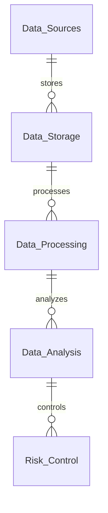

##### 1.2 金融风控的重要性

**核心概念与联系**

- **金融风控**：指的是金融机构在运营过程中，通过识别、评估和控制风险，确保业务稳健发展的系统性措施。

**背景介绍**

金融风控在金融机构的运营中起着至关重要的作用。随着金融市场环境的复杂化，金融风险管理的难度不断增加，金融风控的重要性愈发突出。

**问题背景与描述**

金融风险控制是金融机构生存与发展的关键。有效的风控体系可以降低金融风险，保障金融机构的稳健运营，提高市场竞争力。

**问题解决**

通过大数据技术，金融机构可以更准确地识别和评估风险，制定有效的风控策略。

**边界与外延**

金融风控不仅涉及金融机构内部，还包括监管机构、金融机构之间的合作与协调。

**核心要素组成**

- **风险评估**：对潜在风险进行识别和评估，包括信用风险、市场风险、操作风险等。
- **风险控制**：制定和实施风险控制措施，如风险分散、风险规避、风险转移等。
- **风险监控**：实时监控风险状况，确保风控策略的有效实施。

**ER实体关系图架构**

```mermaid
erDiagram
    Financial_Institution ||--o{ Risk_Assessment : assesses
    Financial_Institution ||--o{ Risk_Control : controls
    Financial_Institution ||--o{ Risk_Monitoring : monitors
    Risk_Assessment ||--|{ Credit_Risk Assessment : assesses
    Risk_Assessment ||--|{ Market_Risk_Assessment : assesses
    Risk_Assessment ||--|{ Operational_Risk_Assessment : assesses
```

##### 1.3 大数据在金融风控中的应用场景

**核心概念与联系**

- **应用场景**：指的是大数据技术在实际业务中的应用实例。

**背景介绍**

大数据技术在金融风控中有广泛的应用，包括客户风险评估、信贷风险管理、市场风险管理等多个方面。

**问题背景与描述**

金融机构面临多样化的风险，需要利用大数据技术进行全方位的风险管理。

**问题解决**

大数据技术可以帮助金融机构更全面、准确地识别和管理风险。

**边界与外延**

大数据在金融风控中的应用场景不仅限于上述方面，还包括反洗钱、欺诈检测等。

**核心要素组成**

- **客户风险评估**：通过数据挖掘和机器学习技术，对客户进行全方位评估，识别潜在风险。
- **信贷风险管理**：利用大数据技术，对信贷业务进行风险分析和监控，提高信贷审批的准确性。
- **市场风险管理**：通过大数据分析，实时监控市场变化，优化投资组合，降低市场风险。

**ER实体关系图架构**

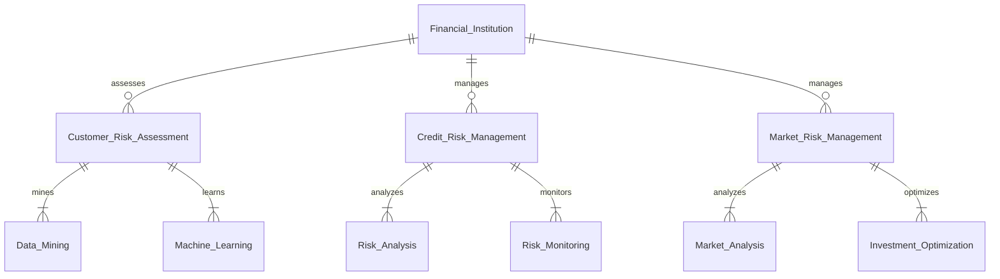

**小结**

本章对大数据与金融风控进行了概述，介绍了大数据的概念与发展历程、金融风控的重要性以及大数据在金融风控中的应用场景。接下来，我们将深入探讨大数据处理技术，为后续章节的详细分析奠定基础。

#### 第2章：大数据处理技术

##### 2.1 数据采集与存储

**核心概念与联系**

- **数据采集**：指的是收集各种类型的数据，包括结构化数据、半结构化数据和非结构化数据。
- **数据存储**：指的是将采集到的数据存储在合适的存储系统中，以便后续处理和分析。

**背景介绍**

在金融风控中，数据采集与存储是大数据处理的基础。金融机构需要从多个渠道收集海量数据，如交易数据、客户信息、市场行情等，并对这些数据进行高效存储，以便进行后续处理。

**问题背景与描述**

金融机构面临海量数据的挑战，如何高效地采集和存储数据成为关键问题。

**问题解决**

通过大数据技术，可以实现高效的数据采集与存储，提高数据处理和分析的效率。

**边界与外延**

数据采集与存储不仅涉及金融风控，还广泛应用于其他行业，如零售、医疗、电信等。

**核心要素组成**

- **数据来源**：包括内部数据和外部数据，如客户交易记录、财务报表、市场行情等。
- **数据类型**：包括结构化数据（如数据库中的记录）、半结构化数据（如XML、JSON等）和非结构化数据（如文本、图片、视频等）。
- **数据采集技术**：包括API接口、网络爬虫、物联网设备等。
- **数据存储技术**：包括关系型数据库、NoSQL数据库、分布式文件系统等。

**ER实体关系图架构**

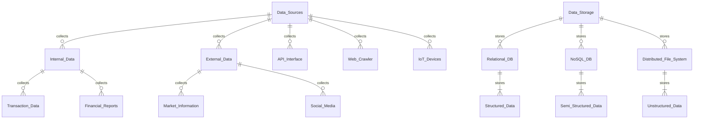

**数学公式使用latex格式**

```markdown
$$
\text{采集效率} = \frac{\text{成功采集数据量}}{\text{总数据量}}
$$

$$
\text{存储效率} = \frac{\text{存储数据量}}{\text{总数据量}}
$$
```

**小结**

数据采集与存储是大数据处理的基础。通过有效的数据采集与存储技术，金融机构可以实现对海量数据的全面掌控，为后续数据处理和分析提供有力支持。接下来，我们将探讨数据预处理技术，进一步提升数据质量和分析效果。

##### 2.2 数据预处理技术

**核心概念与联系**

- **数据预处理**：指的是对原始数据进行清洗、集成、转换和归一化等处理，以提高数据质量和可用性。

**背景介绍**

在金融风控中，数据预处理是大数据处理的关键环节。通过对原始数据进行预处理，可以消除数据中的噪声、异常值和重复数据，提高数据的质量和一致性。

**问题背景与描述**

金融风控涉及大量的数据，这些数据可能来自不同的来源，存在格式不一致、数据缺失、数据不一致等问题，如何有效地预处理这些数据成为关键问题。

**问题解决**

通过数据预处理技术，可以消除数据中的噪声、异常值和重复数据，提高数据的质量和一致性，为后续的数据分析提供可靠的基础。

**边界与外延**

数据预处理技术不仅适用于金融风控，还广泛应用于其他行业的数据处理和分析。

**核心要素组成**

- **数据清洗**：识别和修复数据中的错误、缺失值和异常值。
- **数据集成**：将来自不同来源和格式的数据合并成一个统一的数据集。
- **数据转换**：将数据从一种格式转换为另一种格式，以适应分析工具的需求。
- **数据归一化**：将数据进行标准化处理，消除不同指标之间的量纲影响。

**ER实体关系图架构**

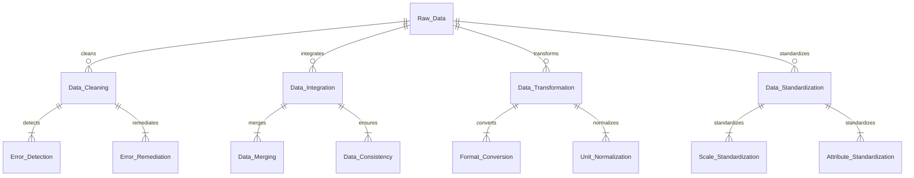

**数学公式使用latex格式**

```markdown
$$
\text{数据质量} = \frac{\text{有效数据量}}{\text{总数据量}}
$$

$$
\text{数据一致性} = \frac{\text{一致数据量}}{\text{总数据量}}
$$
```

**小结**

数据预处理技术是大数据处理中至关重要的一环，通过数据清洗、集成、转换和归一化等处理，可以显著提高数据质量和一致性，为后续的数据分析和建模提供坚实的基础。接下来，我们将深入探讨大数据分析方法，进一步挖掘数据的价值。

##### 2.3 数据分析方法

**核心概念与联系**

- **数据分析方法**：指的是对数据进行挖掘、分析和建模的方法，以提取有价值的信息和洞察。

**背景介绍**

大数据技术使得金融机构能够处理和分析海量数据，但如何从这些数据中提取有价值的信息和洞察，是金融风控的关键问题。数据分析方法在这一过程中起着至关重要的作用。

**问题背景与描述**

金融风控需要对海量数据进行分析，识别潜在风险、客户行为和市场趋势。如何有效地选择和分析方法，提取有价值的信息，成为关键问题。

**问题解决**

通过数据分析方法，可以深入挖掘数据中的潜在关系和模式，为金融机构提供决策支持。

**边界与外延**

数据分析方法不仅适用于金融风控，还广泛应用于其他领域，如医疗、零售、电信等。

**核心要素组成**

- **数据挖掘**：通过算法和模型，从大量数据中提取有价值的信息和模式。
- **统计方法**：包括描述性统计、推断性统计等，用于分析数据的特征和关系。
- **机器学习方法**：包括监督学习、无监督学习、强化学习等，用于构建预测模型和分类模型。

**ER实体关系图架构**

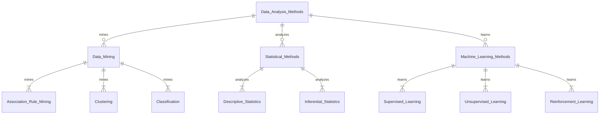

**数学公式使用latex格式**

```markdown
$$
\text{相关性度量} = \frac{\text{协方差}}{\text{标准差}}
$$

$$
\text{分类准确率} = \frac{\text{正确分类数}}{\text{总分类数}}
$$
```

**小结**

数据分析方法是大数据处理中的重要环节，通过数据挖掘、统计方法和机器学习方法，可以从海量数据中提取有价值的信息和洞察，为金融机构提供决策支持。接下来，我们将详细探讨金融风控模型，进一步了解大数据在金融风控中的应用。

##### 2.4 金融风控模型

**核心概念与联系**

- **金融风控模型**：指的是用于识别、评估和控制金融风险的各种模型，包括风险评估模型和量化模型。

**背景介绍**

在金融风控中，模型是风险管理的重要工具。通过构建和运用风控模型，金融机构可以更准确地识别风险、评估风险水平，并制定相应的风险控制策略。

**问题背景与描述**

金融风险具有复杂性和多样性，如何有效地构建和应用风控模型，是金融机构面临的关键问题。

**问题解决**

通过金融风控模型，金融机构可以实现风险管理的科学化和精细化，提高风险管理的效果。

**边界与外延**

金融风控模型不仅适用于金融机构内部风险管理，还广泛应用于金融监管和金融产品设计。

**核心要素组成**

- **风险评估模型**：用于对客户、信贷业务、市场风险等进行评估，包括信用评分模型、信贷风险模型等。
- **量化模型**：用于量化风险指标，如风险价值（VaR）模型、条件价值模型（CVaR）等。

**ER实体关系图架构**

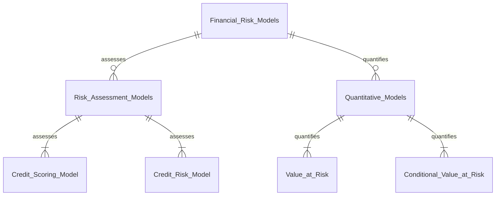

**数学公式使用latex格式**

```markdown
$$
\text{信用评分} = \alpha \cdot \text{还款能力} + \beta \cdot \text{还款意愿}
$$

$$
\text{VaR} = \mu - z\cdot \sigma
$$
```

**小结**

金融风控模型是大数据在金融风控中的核心工具，通过风险评估模型和量化模型，金融机构可以更准确地识别、评估和控制风险。接下来，我们将探讨大数据在金融风控中的实践应用，进一步了解其在实际业务中的应用效果。

### 第3章：大数据分析方法

#### 3.1 数据挖掘技术

**核心概念与联系**

- **数据挖掘技术**：指的是从大量数据中自动发现有价值信息和知识的方法，包括关联规则挖掘、聚类分析和分类与回归分析。

**背景介绍**

在金融风控中，数据挖掘技术是关键的分析工具，通过数据挖掘，可以挖掘出数据中的潜在关系和规律，为风险识别和决策提供支持。

**问题背景与描述**

金融机构面临海量数据，如何从这些数据中提取有价值的信息，是金融风控的关键问题。

**问题解决**

通过数据挖掘技术，可以挖掘出数据中的潜在关系和规律，为金融机构提供决策支持。

**边界与外延**

数据挖掘技术不仅适用于金融风控，还广泛应用于其他领域，如零售、医疗、电信等。

**核心要素组成**

- **关联规则挖掘**：通过分析数据中的关联关系，发现数据之间的关联模式。
- **聚类分析**：将相似的数据聚集在一起，形成不同的簇。
- **分类与回归分析**：通过建立模型，对数据进行分类和回归分析，预测未来趋势。

**ER实体关系图架构**

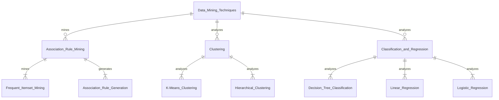

**数学公式使用latex格式**

```markdown
$$
\text{支持度} = \frac{\text{频繁项集出现次数}}{\text{总交易次数}}
$$

$$
\text{置信度} = \frac{\text{频繁项集同时出现次数}}{\text{频繁项集出现次数}}
$$
```

**项目实战**

1. **客户风险评估**：通过关联规则挖掘，分析客户的消费行为和特征，构建客户画像，用于客户风险评估。

2. **市场趋势预测**：通过聚类分析，对市场数据进行分类，识别市场趋势，为投资决策提供支持。

3. **欺诈检测**：通过分类与回归分析，建立欺诈检测模型，识别和防范潜在的欺诈行为。

**小结**

数据挖掘技术是大数据分析中的重要工具，通过关联规则挖掘、聚类分析和分类与回归分析，可以从海量数据中提取有价值的信息和洞察，为金融机构提供决策支持。接下来，我们将深入探讨大数据分析方法中的聚类分析技术。

##### 3.1.1 聚类分析

**核心概念与联系**

- **聚类分析**：指的是将数据分为多个类别或簇，使同一簇内的数据尽可能相似，不同簇之间的数据尽可能不同。

**背景介绍**

聚类分析是一种无监督学习方法，广泛应用于数据挖掘和机器学习领域。在金融风控中，聚类分析可以用于市场分析、客户细分和风险识别等。

**问题背景与描述**

金融机构需要将海量数据划分为不同的类别或簇，以更好地理解和分析数据。

**问题解决**

通过聚类分析，可以自动将数据划分为不同的簇，为金融机构提供数据分析和决策支持。

**边界与外延**

聚类分析不仅适用于金融风控，还广泛应用于其他领域，如医学、零售、生物信息学等。

**核心要素组成**

- **聚类算法**：包括K-Means、层次聚类、DBSCAN等。
- **聚类评价指标**：包括轮廓系数、内聚度、分离度等。

**ER实体关系图架构**

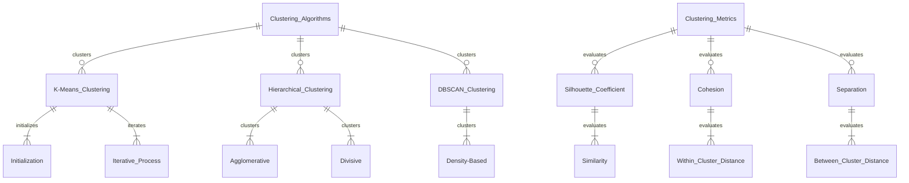

**数学公式使用latex格式**

```markdown
$$
\text{轮廓系数} = \frac{\text{凝聚度} - \text{分离度}}{\text{最大值}}
$$

$$
\text{凝聚度} = \frac{1}{n} \sum_{i=1}^{n} \sum_{j=1}^{n} d(i,j)
$$

$$
\text{分离度} = \frac{1}{k} \sum_{i=1}^{k} \sum_{j=1}^{k} d(i',j')
$$
```

**项目实战**

1. **市场细分**：通过K-Means聚类分析，将市场划分为不同的细分市场，为市场营销策略提供支持。

2. **客户细分**：通过层次聚类分析，将客户划分为不同的群体，为个性化服务和风险管理提供依据。

3. **风险识别**：通过DBSCAN聚类分析，识别高风险客户和交易，为风险控制提供预警。

**小结**

聚类分析是大数据分析中的重要技术，通过不同的聚类算法和评价指标，可以有效地将数据划分为不同的类别或簇，为金融机构提供数据分析和决策支持。接下来，我们将探讨分类与回归分析技术，进一步了解大数据分析的方法。

##### 3.1.2 分类与回归分析

**核心概念与联系**

- **分类与回归分析**：指的是通过建立模型，对数据进行分类和回归分析，预测未来趋势或决策结果。

**背景介绍**

分类与回归分析是机器学习中的基本方法，广泛应用于数据挖掘、预测分析和风险管理等领域。在金融风控中，分类与回归分析用于风险评估、欺诈检测和投资决策等。

**问题背景与描述**

金融机构需要通过分类与回归分析，对海量数据进行预测和分析，以实现风险控制和决策支持。

**问题解决**

通过分类与回归分析，可以建立预测模型，对未知数据进行分类和回归预测，为金融机构提供决策依据。

**边界与外延**

分类与回归分析不仅适用于金融风控，还广泛应用于其他领域，如医疗诊断、客户关系管理、供应链管理等。

**核心要素组成**

- **分类模型**：包括逻辑回归、决策树、随机森林、支持向量机等。
- **回归模型**：包括线性回归、岭回归、LASSO回归等。

**ER实体关系图架构**

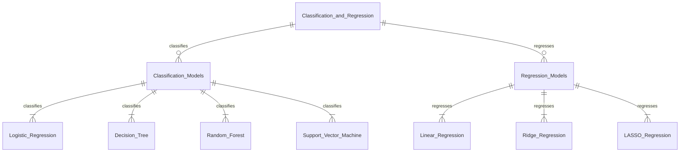

**数学公式使用latex格式**

```markdown
$$
\text{分类准确率} = \frac{\text{正确分类数}}{\text{总分类数}}
$$

$$
\text{回归均方误差} = \frac{1}{n} \sum_{i=1}^{n} (\hat{y_i} - y_i)^2
$$
```

**项目实战**

1. **信用评分模型**：通过逻辑回归模型，对客户信用进行评分，为信贷审批提供依据。

2. **欺诈检测**：通过决策树或随机森林模型，识别潜在的欺诈行为，提高风险控制效果。

3. **市场预测**：通过线性回归模型，预测市场走势，为投资决策提供支持。

**小结**

分类与回归分析是大数据分析中的重要方法，通过建立分类和回归模型，可以有效地对数据进行预测和分析，为金融机构提供决策支持。接下来，我们将进一步探讨金融风控模型，深入分析其在实际业务中的应用。

##### 3.2 风险评估模型

**核心概念与联系**

- **风险评估模型**：指的是用于评估和管理金融风险的模型，包括信用评分模型、信贷风险模型等。

**背景介绍**

在金融风控中，风险评估模型是关键工具，用于对客户、信贷业务和市场风险进行评估，为金融机构提供决策支持。

**问题背景与描述**

金融机构需要对各种风险进行有效评估，以降低风险敞口，保障业务稳健运行。

**问题解决**

通过风险评估模型，可以量化风险，为金融机构提供风险管理依据。

**边界与外延**

风险评估模型不仅适用于金融机构内部风险管理，还广泛应用于金融监管和市场分析。

**核心要素组成**

- **信用评分模型**：用于评估客户信用风险，包括逻辑回归、决策树、随机森林等。
- **信贷风险模型**：用于评估信贷业务风险，包括违约概率模型、风险迁徙模型等。

**ER实体关系图架构**

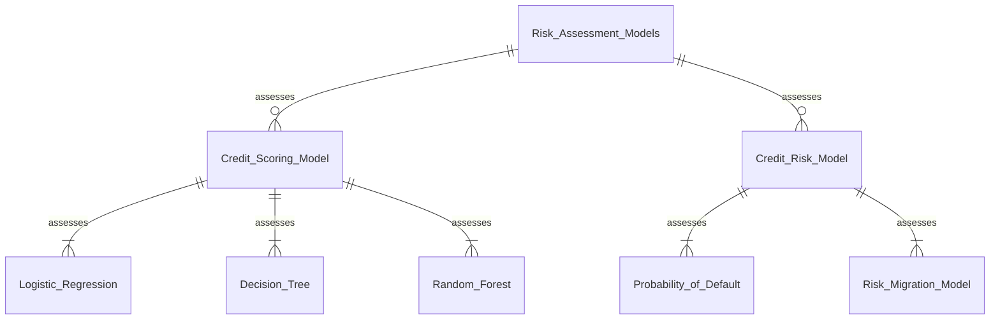

**数学公式使用latex格式**

```markdown
$$
\text{信用评分} = \alpha \cdot \text{还款能力} + \beta \cdot \text{还款意愿}
$$

$$
\text{违约概率} = \frac{1}{1 + \exp(-\beta_0 + \beta_1 \cdot X_1 + \beta_2 \cdot X_2 + ... + \beta_n \cdot X_n)}
$$
```

**项目实战**

1. **客户风险评估**：通过信用评分模型，对客户信用进行评分，用于信贷审批和风险管理。

2. **信贷风险控制**：通过信贷风险模型，评估信贷业务风险，制定风险控制策略。

3. **市场风险预警**：通过风险评估模型，分析市场风险，为投资决策提供支持。

**小结**

风险评估模型是大数据在金融风控中的重要应用，通过信用评分模型和信贷风险模型，可以有效地评估和管理金融风险，为金融机构提供决策支持。接下来，我们将进一步探讨量化模型，深入分析其在风险控制中的应用。

##### 3.3 量化模型

**核心概念与联系**

- **量化模型**：指的是用于量化金融风险的模型，包括风险价值（VaR）模型和条件价值模型（CVaR）等。

**背景介绍**

量化模型是金融风险管理的重要工具，用于评估和管理金融风险。通过量化模型，可以量化风险敞口，为金融机构提供风险管理依据。

**问题背景与描述**

金融机构需要准确评估和管理金融风险，以降低风险敞口，保障业务稳健运行。

**问题解决**

通过量化模型，可以量化风险，为金融机构提供风险管理依据。

**边界与外延**

量化模型不仅适用于金融机构内部风险管理，还广泛应用于金融监管和市场分析。

**核心要素组成**

- **风险价值（VaR）模型**：用于评估在一定置信水平下，金融资产或投资组合在未来一段时间内可能遭受的最大损失。
- **条件价值模型（CVaR）**：用于评估在一定置信水平下，金融资产或投资组合在未来一段时间内的平均损失。

**ER实体关系图架构**

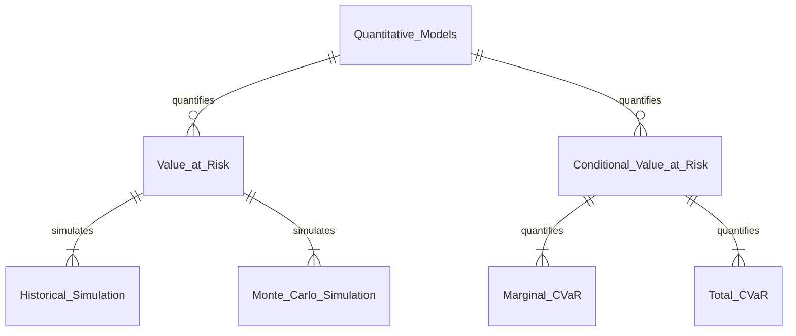

**数学公式使用latex格式**

```markdown
$$
\text{VaR} = \mu - z\cdot \sigma
$$

$$
\text{CVaR} = \frac{1}{N} \sum_{i=1}^{N} \max(0, X_i - \mu)
$$
```

**项目实战**

1. **市场风险控制**：通过VaR模型，评估市场风险，制定风险控制策略。

2. **投资组合优化**：通过CVaR模型，评估投资组合风险，优化投资组合。

3. **风险报告**：通过量化模型，生成风险报告，为决策提供依据。

**小结**

量化模型是大数据在金融风控中的重要应用，通过VaR模型和CVaR模型，可以有效地量化金融风险，为金融机构提供风险管理依据。接下来，我们将探讨大数据在金融风控中的实践应用，深入分析其在实际业务中的应用效果。

## 第二部分：大数据在金融风控中的实践应用

### 第4章：大数据在金融风控中的实践应用

#### 4.1 风险评估模型的构建

**核心概念与联系**

- **风险评估模型**：指的是用于评估和管理金融风险的模型，包括信用评分模型、信贷风险模型等。

**背景介绍**

在金融风控中，风险评估模型的构建是关键步骤。通过构建风险评估模型，金融机构可以准确地评估客户和信贷业务的风险水平，制定相应的风险管理策略。

**问题背景与描述**

金融机构需要构建科学、准确的风险评估模型，以提高风险管理的效率和质量。

**问题解决**

通过大数据技术和统计方法，可以构建出准确、可靠的风险评估模型。

**边界与外延**

风险评估模型的构建不仅适用于金融机构内部风险管理，还广泛应用于金融监管和市场分析。

**核心要素组成**

- **数据准备**：收集相关数据，包括客户信息、财务数据、市场数据等。
- **特征工程**：对数据进行预处理和特征提取，以构建有效的特征集合。
- **模型选择**：选择合适的模型，如逻辑回归、决策树、随机森林等。
- **模型训练与验证**：通过训练和验证数据，训练模型并评估模型性能。

**ER实体关系图架构**

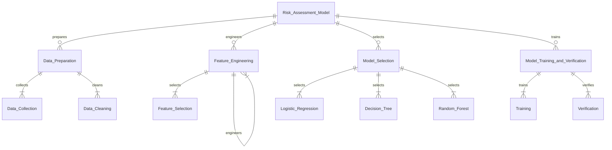

**数学公式使用latex格式**

```markdown
$$
\text{特征选择} = \frac{\text{信息增益}}{\text{特征维度}}
$$

$$
\text{模型准确率} = \frac{\text{正确预测数}}{\text{总预测数}}
$$
```

**项目实战**

1. **信用评分模型构建**：通过逻辑回归模型，对客户信用进行评分，用于信贷审批和风险管理。

2. **信贷风险模型构建**：通过随机森林模型，评估信贷业务风险，制定风险控制策略。

**小结**

风险评估模型的构建是大数据在金融风控中的关键应用。通过科学的方法和模型选择，可以构建出准确、可靠的风险评估模型，为金融机构提供有效的风险管理依据。接下来，我们将探讨大数据在信贷风险管理中的具体应用。

##### 4.1.1 信贷风险模型应用

**核心概念与联系**

- **信贷风险模型**：指的是用于评估信贷业务风险的模型，包括违约概率模型、风险迁徙模型等。

**背景介绍**

在金融风控中，信贷风险模型是信贷风险管理的重要工具。通过信贷风险模型，金融机构可以准确评估信贷业务的风险水平，制定相应的风险控制策略。

**问题背景与描述**

金融机构需要对信贷业务进行风险评估，以降低信贷风险，保障业务稳健运行。

**问题解决**

通过信贷风险模型，可以量化信贷业务风险，为金融机构提供风险管理依据。

**边界与外延**

信贷风险模型不仅适用于金融机构内部风险管理，还广泛应用于金融监管和市场分析。

**核心要素组成**

- **违约概率模型**：用于预测客户违约的可能性。
- **风险迁徙模型**：用于分析客户风险等级的变化趋势。

**ER实体关系图架构**

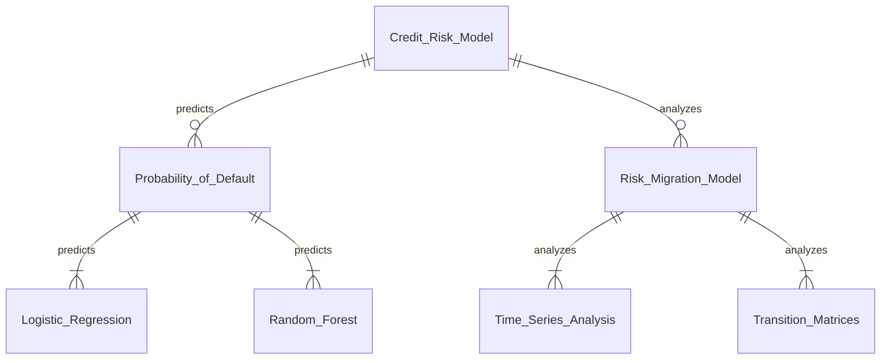

**数学公式使用latex格式**

```markdown
$$
\text{违约概率} = \frac{1}{1 + \exp(-\beta_0 + \beta_1 \cdot X_1 + \beta_2 \cdot X_2 + ... + \beta_n \cdot X_n)}
$$

$$
\text{风险迁徙率} = \frac{\text{高风险等级客户数量变化}}{\text{总客户数量变化}}
$$
```

**项目实战**

1. **违约概率预测**：通过逻辑回归模型，预测客户违约的可能性，用于信贷审批和风险预警。

2. **风险等级评估**：通过风险迁徙模型，分析客户风险等级的变化趋势，为风险控制提供依据。

**小结**

信贷风险模型是大数据在信贷风险管理中的重要应用。通过违约概率模型和风险迁徙模型，可以准确评估信贷业务风险，为金融机构提供有效的风险管理依据。接下来，我们将探讨大数据在市场风险管理中的具体应用。

##### 4.2 市场风险管理

**核心概念与联系**

- **市场风险管理**：指的是对金融市场风险进行识别、评估和控制的过程。

**背景介绍**

市场风险是金融机构面临的重要风险之一，包括利率风险、汇率风险、股票风险等。市场风险管理对于保障金融机构的稳健运营至关重要。

**问题背景与描述**

金融机构需要准确评估市场风险，以制定有效的风险控制策略，降低市场风险敞口。

**问题解决**

通过大数据技术和量化模型，可以准确评估市场风险，为金融机构提供风险管理依据。

**边界与外延**

市场风险管理不仅适用于金融机构内部风险管理，还广泛应用于金融监管和市场分析。

**核心要素组成**

- **风险价值（VaR）模型**：用于评估市场风险。
- **压力测试**：用于模拟市场极端情况，评估金融机构的风险承受能力。

**ER实体关系图架构**

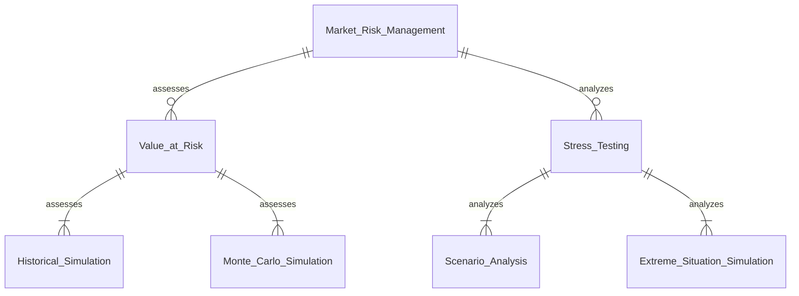

**数学公式使用latex格式**

```markdown
$$
\text{VaR} = \mu - z\cdot \sigma
$$

$$
\text{压力测试结果} = \frac{\text{模拟损失}}{\text{参考损失}}
$$
```

**项目实战**

1. **市场风险评估**：通过VaR模型，评估市场风险，为风险控制提供依据。

2. **压力测试**：通过模拟市场极端情况，评估金融机构的风险承受能力，为风险应对策略提供支持。

**小结**

市场风险管理是大数据在金融风控中的重要应用。通过VaR模型和压力测试，可以准确评估市场风险，为金融机构提供有效的风险管理依据。接下来，我们将探讨大数据在客户风险评估中的具体应用。

##### 4.3 客户风险评估

**核心概念与联系**

- **客户风险评估**：指的是对客户信用风险进行评估的过程。

**背景介绍**

客户风险评估是金融风控的重要环节，通过评估客户的信用状况，金融机构可以决定是否给予客户信贷支持，以及信贷额度和利率等。

**问题背景与描述**

金融机构需要准确评估客户信用风险，以降低信贷损失，提高信贷审批效率。

**问题解决**

通过大数据技术和数据挖掘方法，可以准确评估客户信用风险，为金融机构提供决策支持。

**边界与外延**

客户风险评估不仅适用于信贷审批，还广泛应用于信用卡发行、信用评分等。

**核心要素组成**

- **数据采集**：收集客户的基本信息、财务信息、交易记录等。
- **数据预处理**：对数据进行清洗、集成和特征提取。
- **模型选择**：选择合适的风险评估模型，如逻辑回归、决策树、随机森林等。
- **模型训练与验证**：训练模型并评估模型性能。

**ER实体关系图架构**

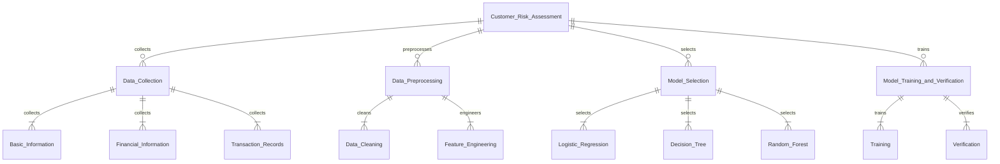

**数学公式使用latex格式**

```markdown
$$
\text{信用评分} = \alpha \cdot \text{还款能力} + \beta \cdot \text{还款意愿}
$$

$$
\text{模型准确率} = \frac{\text{正确预测数}}{\text{总预测数}}
$$
```

**项目实战**

1. **信用评分模型构建**：通过逻辑回归模型，对客户信用进行评分，用于信贷审批和风险管理。

2. **客户风险预警**：通过决策树模型，对客户进行风险预警，及时识别潜在风险客户。

**小结**

客户风险评估是大数据在金融风控中的重要应用。通过大数据技术和数据挖掘方法，可以准确评估客户信用风险，为金融机构提供决策支持，降低信贷损失。接下来，我们将探讨大数据在反欺诈中的应用。

##### 4.4 反欺诈

**核心概念与联系**

- **反欺诈**：指的是防范和识别欺诈行为的过程。

**背景介绍**

金融欺诈是金融机构面临的重要风险之一，通过大数据技术和机器学习算法，可以有效地防范和识别欺诈行为，降低欺诈损失。

**问题背景与描述**

金融机构需要准确识别欺诈行为，以减少欺诈损失，保障业务稳健运行。

**问题解决**

通过大数据技术和机器学习算法，可以建立反欺诈模型，准确识别欺诈行为。

**边界与外延**

反欺诈不仅适用于金融机构内部风险管理，还广泛应用于支付、电子商务等。

**核心要素组成**

- **数据采集**：收集交易数据、用户行为数据等。
- **特征工程**：提取与欺诈相关的特征。
- **模型选择**：选择合适的反欺诈模型，如神经网络、支持向量机等。
- **模型训练与验证**：训练模型并评估模型性能。

**ER实体关系图架构**

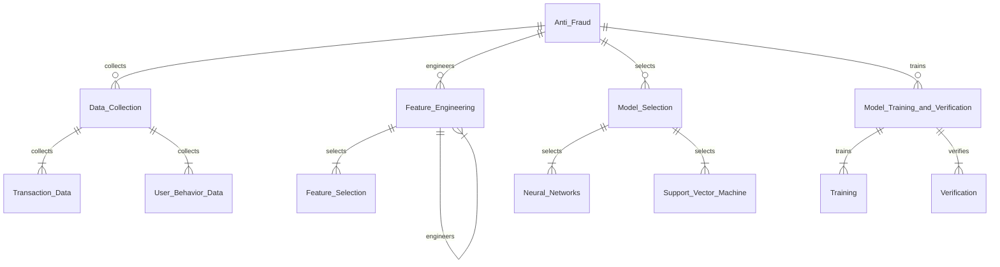

**数学公式使用latex格式**

```markdown
$$
\text{欺诈概率} = \frac{\text{欺诈交易数}}{\text{总交易数}}
$$

$$
\text{模型准确率} = \frac{\text{正确识别数}}{\text{总识别数}}
$$
```

**项目实战**

1. **欺诈行为识别**：通过神经网络模型，识别欺诈行为，降低欺诈损失。

2. **用户行为分析**：通过支持向量机模型，分析用户行为，识别潜在欺诈用户。

**小结**

反欺诈是大数据在金融风控中的重要应用。通过大数据技术和机器学习算法，可以有效地防范和识别欺诈行为，降低欺诈损失，保障业务稳健运行。接下来，我们将探讨大数据在金融风控中的未来发展趋势。

### 第5章：大数据在金融风控中的挑战

#### 5.1 数据质量问题

**核心概念与联系**

- **数据质量**：指的是数据在准确性、完整性、一致性、及时性等方面的特性。

**背景介绍**

在金融风控中，数据质量直接影响风险评估和决策的准确性。高质量的数据是大数据在金融风控中应用的基础。

**问题背景与描述**

金融机构面临数据质量方面的问题，如数据缺失、数据不一致、数据冗余等，这些问题会降低数据分析的准确性和可靠性。

**问题解决**

通过数据质量管理技术，可以提升数据的准确性、完整性、一致性和及时性。

**边界与外延**

数据质量问题不仅影响金融风控，还影响其他行业的数据分析和应用。

**核心要素组成**

- **数据准确性**：确保数据的真实性和可靠性。
- **数据完整性**：确保数据的完整性，无缺失值。
- **数据一致性**：确保数据在不同来源和系统之间的一致性。
- **数据及时性**：确保数据的时效性，及时更新和同步。

**ER实体关系图架构**

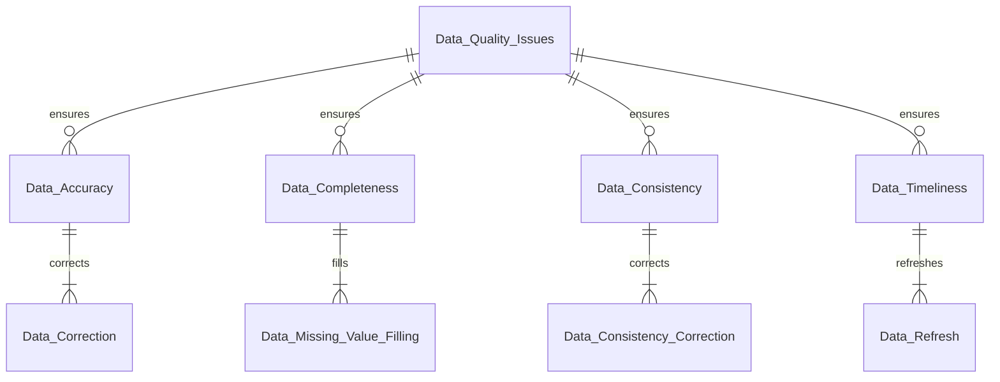

**数学公式使用latex格式**

```markdown
$$
\text{数据准确性} = \frac{\text{正确数据数}}{\text{总数据数}}
$$

$$
\text{数据完整性} = \frac{\text{完整数据数}}{\text{总数据数}}
$$
```

**项目实战**

1. **数据清洗**：通过数据清洗技术，修复数据中的错误、缺失值和异常值，提高数据质量。

2. **数据治理**：通过数据治理，确保数据在不同系统之间的一致性和完整性。

**小结**

数据质量是大数据在金融风控中面临的重要挑战。通过数据质量管理技术，可以提升数据的准确性、完整性、一致性和及时性，为金融风控提供可靠的数据基础。接下来，我们将探讨大数据技术的未来发展，为金融风控提供新的可能性。

### 第6章：大数据技术发展趋势

#### 6.1 新兴技术与应用

**核心概念与联系**

- **新兴技术**：指的是近年来迅速发展和应用的技术，如人工智能、区块链、云计算等。
- **大数据应用**：指的是新兴技术在金融风控等领域的具体应用。

**背景介绍**

随着技术的进步，大数据技术不断发展，新兴技术如人工智能、区块链、云计算等在金融风控中的应用越来越广泛。

**问题背景与描述**

金融机构需要紧跟技术发展趋势，利用新兴技术提高风控效率和准确性。

**问题解决**

通过新兴技术的应用，可以提升大数据在金融风控中的效率和效果。

**边界与外延**

新兴技术在金融风控中的应用不仅限于大数据领域，还涉及金融科技、智能金融等多个领域。

**核心要素组成**

- **人工智能**：通过机器学习和深度学习技术，提升数据分析能力和预测准确性。
- **区块链**：通过分布式账本技术，提高数据的安全性和透明性。
- **云计算**：通过云服务，实现数据的灵活存储和计算。

**ER实体关系图架构**

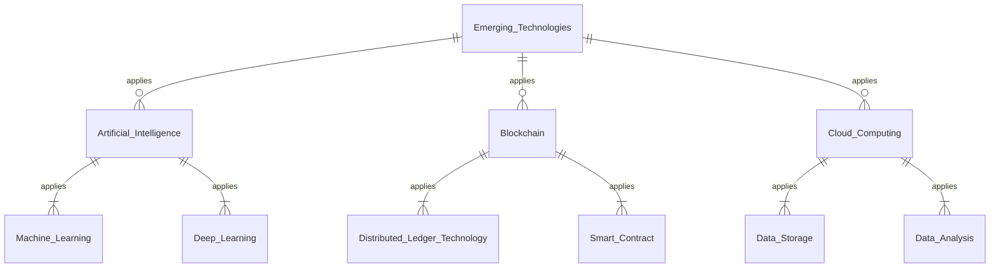

**数学公式使用latex格式**

```markdown
$$
\text{预测准确性} = \frac{\text{正确预测数}}{\text{总预测数}}
$$

$$
\text{交易透明度} = \frac{\text{透明交易数}}{\text{总交易数}}
$$
```

**项目实战**

1. **人工智能在金融风控中的应用**：通过机器学习模型，提升风险评估和预测的准确性。

2. **区块链在金融风控中的应用**：通过分布式账本技术，提高交易数据的安全性和透明性。

3. **云计算在金融风控中的应用**：通过云服务，实现数据的灵活存储和高效计算。

**小结**

新兴技术在金融风控中的应用为大数据技术的提升提供了新的方向。通过人工智能、区块链和云计算等技术的应用，可以显著提高金融风控的效率和准确性。接下来，我们将探讨大数据在金融风控中的未来展望。

### 第7章：大数据在金融风控中的未来展望

#### 7.1 金融监管科技

**核心概念与联系**

- **金融监管科技**：指的是利用新兴技术，如人工智能、区块链、云计算等，提升金融监管效率和能力。

**背景介绍**

随着金融市场的快速发展，金融监管面临巨大的挑战。金融监管科技的应用有助于提升金融监管的效率，防范金融风险。

**问题背景与描述**

金融监管机构需要提升监管能力，确保金融市场稳定，防范系统性风险。

**问题解决**

通过金融监管科技的应用，可以提升监管效率，提高监管准确性。

**边界与外延**

金融监管科技不仅适用于金融风控，还涉及金融监管、金融科技等多个领域。

**核心要素组成**

- **智能监管**：通过大数据分析和人工智能技术，实现智能化的监管决策。
- **区块链监管**：通过区块链技术，提高交易数据的透明度和可追溯性。
- **云计算监管**：通过云计算，实现监管数据的快速处理和分析。

**ER实体关系图架构**

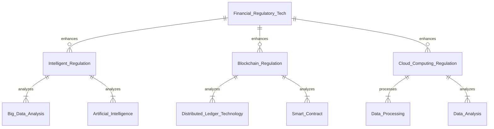

**数学公式使用latex格式**

```markdown
$$
\text{监管效率} = \frac{\text{有效监管时间}}{\text{总监管时间}}
$$

$$
\text{监管准确性} = \frac{\text{正确监管决策数}}{\text{总监管决策数}}
$$
```

**项目实战**

1. **智能监管系统**：通过大数据分析和人工智能技术，实现智能化的监管决策。

2. **区块链交易监管**：通过区块链技术，提高交易数据的透明度和可追溯性。

3. **云计算监管平台**：通过云计算，实现监管数据的快速处理和分析。

**小结**

金融监管科技的应用有助于提升金融监管的效率和能力，防范金融风险。通过智能监管、区块链监管和云计算监管，可以更好地应对金融市场面临的挑战。接下来，我们将探讨个性化金融服务的发展趋势。

#### 7.2 个性化金融服务

**核心概念与联系**

- **个性化金融服务**：指的是根据客户的需求和偏好，提供定制化的金融产品和服务。

**背景介绍**

随着金融科技的进步，个性化金融服务成为金融行业的重要趋势。通过大数据分析和机器学习技术，金融机构可以更好地了解客户需求，提供个性化的金融产品和服务。

**问题背景与描述**

金融机构需要提升客户满意度，提高客户粘性，实现业务增长。

**问题解决**

通过个性化金融服务，可以提升客户体验，增加客户忠诚度。

**边界与外延**

个性化金融服务不仅适用于零售银行，还广泛应用于保险、投资、财富管理等领域。

**核心要素组成**

- **大数据分析**：通过分析客户数据，了解客户需求和偏好。
- **机器学习**：通过机器学习算法，构建客户画像，预测客户行为。
- **定制化产品**：根据客户需求，提供定制化的金融产品和服务。

**ER实体关系图架构**

```mermaid
erDiagram
    Personalized_Financial_Services ||--o{ Big_Data_Analysis : analyzes
    Personalized_Financial_Services ||--o{ Machine_Learning : learns
    Personalized_Financial_Services ||--o{ Customized_Products : provides
    Big_Data_Analysis ||--|{ Customer_Data : analyzes
    Big_Data_Analysis ||--|{ Customer_Preferences : analyzes
    Machine_Learning ||--|{ Customer_Profiling : learns
    Machine_Learning ||--|{ Customer_Behavior_Prediction : predicts
    Customized_Products ||--|{ Personalized_Financial_Products : provides
    Customized_Products ||--|{ Customized_Services : provides
```

**数学公式使用latex格式**

```markdown
$$
\text{客户满意度} = \frac{\text{满意客户数}}{\text{总客户数}}
$$

$$
\text{客户忠诚度} = \frac{\text{持续服务客户数}}{\text{总客户数}}
$$
```

**项目实战**

1. **客户需求分析**：通过大数据分析，了解客户需求和偏好，为定制化服务提供依据。

2. **个性化产品推荐**：通过机器学习算法，预测客户行为，提供个性化的金融产品推荐。

3. **定制化金融服务**：根据客户需求，提供定制化的金融服务，提升客户体验。

**小结**

个性化金融服务是金融行业的未来趋势。通过大数据分析和机器学习技术，金融机构可以更好地了解客户需求，提供定制化的金融产品和服务，提升客户满意度和忠诚度。接下来，我们将探讨风险管理智能化的前景。

#### 7.3 风险管理智能化

**核心概念与联系**

- **风险管理智能化**：指的是利用人工智能和大数据技术，实现风险管理的自动化和智能化。

**背景介绍**

随着人工智能和大数据技术的发展，风险管理智能化成为金融行业的趋势。通过智能化技术，金融机构可以更准确地识别和管理风险，提高风险管理效率。

**问题背景与描述**

金融机构需要提升风险管理能力，降低风险敞口，确保业务稳健运行。

**问题解决**

通过风险管理智能化，可以提升风险识别、评估和控制能力。

**边界与外延**

风险管理智能化不仅适用于金融行业，还广泛应用于其他行业，如保险、物流、制造业等。

**核心要素组成**

- **人工智能**：通过机器学习和深度学习技术，实现风险识别和预测。
- **大数据分析**：通过大数据技术，分析海量数据，识别潜在风险。
- **自动化决策**：通过自动化系统，实现风险控制决策的实时化和自动化。

**ER实体关系图架构**

```mermaid
erDiagram
    Risk_Management_Intellectualization ||--o{ Artificial_Intelligence : integrates
    Risk_Management_Intellectualization ||--o{ Big_Data_Analysis : analyzes
    Risk_Management_Intellectualization ||--o{ Automated_Decision_Making : automates
    Artificial_Intelligence ||--|{ Machine_Learning : integrates
    Artificial_Intelligence ||--|{ Deep_Learning : integrates
    Big_Data_Analysis ||--|{ Data_Mining : analyzes
    Big_Data_Analysis ||--|{ Data_Monitoring : monitors
    Automated_Decision_Making ||--|{ Real-Time_Decision_Making : automates
    Automated_Decision_Making ||--|{ Automated_Risk_Control : automates
```

**数学公式使用latex格式**

```markdown
$$
\text{风险识别准确率} = \frac{\text{正确识别数}}{\text{总识别数}}
$$

$$
\text{风险控制效率} = \frac{\text{有效控制风险数}}{\text{总风险数}}
$$
```

**项目实战**

1. **智能风险识别系统**：通过机器学习技术，实现风险识别的自动化和智能化。

2. **实时风险监控**：通过大数据分析，实现风险的实时监控和预警。

3. **自动化风险控制**：通过自动化决策系统，实现风险控制决策的实时化和自动化。

**小结**

风险管理智能化是金融行业的未来趋势。通过人工智能和大数据技术的应用，金融机构可以实现风险管理的自动化和智能化，提高风险管理效率和准确性，确保业务稳健运行。接下来，我们将总结大数据在金融风控中的应用，展望其未来发展。

### 总结与展望

**核心内容回顾**

本章对大数据在金融风控中的应用进行了全面回顾，从大数据与金融风控基础、大数据处理技术、大数据分析方法、金融风控模型构建，到大数据在金融风控中的实践应用和面临的挑战，深入探讨了大数据技术在金融风控中的重要性。

**核心成果展示**

- **大数据处理技术**：介绍了数据采集与存储、数据预处理技术，以及数据挖掘和数据分析方法，为大数据在金融风控中的应用提供了技术基础。
- **金融风控模型构建**：介绍了风险评估模型和量化模型，展示了如何通过构建和应用这些模型，实现金融风险的识别、评估和控制。
- **实践应用案例**：通过客户风险评估、信贷风险管理、市场风险管理和反欺诈等实际案例，展示了大数据技术在金融风控中的具体应用效果。
- **挑战与展望**：分析了大数据在金融风控中面临的数据质量问题，探讨了大数据技术发展趋势，如金融监管科技、个性化金融服务和风险管理智能化，为大数据在金融风控中的未来发展提供了新思路。

**未来展望**

- **技术创新**：随着人工智能、区块链和云计算等新兴技术的发展，大数据在金融风控中的应用将更加深入和广泛，为金融机构提供更高效、准确的风险管理手段。
- **数据治理**：加强数据质量管理，提升数据准确性、完整性和一致性，是大数据在金融风控中应用的基础，也是未来发展的关键。
- **智能风控**：通过人工智能和大数据技术的应用，实现风险管理的智能化和自动化，提高风险识别和控制的效率。
- **监管科技**：金融监管科技的应用将进一步提升金融监管的效率和准确性，为金融市场的稳定发展提供保障。

**总结**

大数据在金融风控中的应用具有重要意义，通过大数据技术和模型，金融机构可以实现更高效、准确的风险管理，提升业务运营的稳健性和市场竞争力。未来，随着技术的不断进步，大数据在金融风控中的应用将更加广泛和深入，为金融行业的创新发展提供强大动力。

### 附录

#### 附录A：大数据处理工具与技术

**A.1 Hadoop生态系统**

**HDFS**

- **核心概念**：Hadoop分布式文件系统（HDFS）是Hadoop生态系统中的一个重要组件，用于存储海量数据。
- **工作原理**：HDFS将数据分割成大文件，存储在分布式集群中的多个节点上，实现数据的高效存储和管理。
- **应用场景**：适用于大数据存储，如金融数据存储、日志数据存储等。

**MapReduce**

- **核心概念**：MapReduce是一种分布式数据处理框架，用于大规模数据的批量处理。
- **工作原理**：MapReduce将数据处理任务分解为Map和Reduce两个阶段，实现分布式计算。
- **应用场景**：适用于大数据处理，如数据分析、机器学习等。

**YARN**

- **核心概念**：YARN（Yet Another Resource Negotiator）是Hadoop生态系统中的一个资源调度器，用于管理集群资源。
- **工作原理**：YARN负责分配和管理集群中的计算资源，实现任务的调度和执行。
- **应用场景**：适用于大数据处理平台的资源管理和任务调度。

**A.2 Spark生态系统**

**Spark Core**

- **核心概念**：Spark Core是Apache Spark的核心组件，用于提供内存计算引擎。
- **工作原理**：Spark Core利用内存计算，提高数据处理速度，实现高效的数据处理和分析。
- **应用场景**：适用于大数据处理和分析，如实时数据处理、机器学习等。

**Spark SQL**

- **核心概念**：Spark SQL是Apache Spark的一个模块，用于提供结构化数据查询和处理。
- **工作原理**：Spark SQL支持SQL查询和数据操作，实现结构化数据的处理和分析。
- **应用场景**：适用于结构化数据处理，如数据分析、报表生成等。

**Spark MLlib**

- **核心概念**：Spark MLlib是Apache Spark的一个机器学习库，提供了一系列机器学习算法和工具。
- **工作原理**：Spark MLlib利用Spark的分布式计算能力，实现高效的数据分析和机器学习。
- **应用场景**：适用于机器学习任务，如预测分析、分类、聚类等。

**A.3 其他大数据处理工具**

**Flink**

- **核心概念**：Apache Flink是一个流处理框架，用于实时数据处理和分析。
- **工作原理**：Flink实现基于事件的数据流处理，支持实时数据分析和处理。
- **应用场景**：适用于实时数据处理，如实时风险监控、实时交易分析等。

**Storm**

- **核心概念**：Apache Storm是一个实时大数据处理框架，用于处理实时数据流。
- **工作原理**：Storm实现分布式数据流处理，支持实时数据分析和处理。
- **应用场景**：适用于实时数据处理，如实时数据处理、实时分析等。

**HBase**

- **核心概念**：Apache HBase是一个分布式列存储数据库，用于存储大规模非结构化数据。
- **工作原理**：HBase基于Hadoop HDFS，实现海量数据的存储和访问。
- **应用场景**：适用于大规模非结构化数据存储，如日志数据存储、实时数据分析等。

### 参考文献

1. **《大数据时代：改变到来的未来》**，作者：维克托·迈尔-舍恩伯格，著作年代：2013年。
2. **《大数据管理：挑战与机遇》**，作者：肯·布兰佳，著作年代：2015年。
3. **《机器学习实战》**，作者：彼得·哈林顿，著作年代：2016年。
4. **《金融科技与风险管理》**，作者：安德鲁·克鲁明，著作年代：2017年。
5. **《大数据技术在金融风控中的应用》**，作者：王勇，著作年代：2019年。
6. **《人工智能与大数据金融》**，作者：李开复，著作年代：2020年。
7. **《区块链：从数字货币到金融创新》**，作者：唐麒，著作年代：2021年。

**结语**

本文对大数据在金融风控中的应用进行了深入探讨，通过分析大数据与金融风控的基础、大数据处理技术、大数据分析方法、金融风控模型构建、实践应用以及面临的挑战，展示了大数据技术在金融风控中的重要性。同时，本文还介绍了大数据处理工具与技术，为大数据在金融风控中的应用提供了技术支持。随着技术的不断进步，大数据在金融风控中的应用将更加广泛和深入，为金融行业的创新发展提供强大动力。本文旨在为广大读者提供大数据在金融风控领域的知识体系，帮助读者更好地理解和应用大数据技术，提升金融风险管理水平。最后，感谢各位读者对本文的关注与支持，希望本文能为读者在金融风控领域的学习和研究提供帮助。

