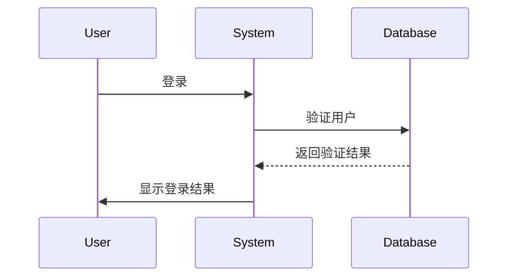
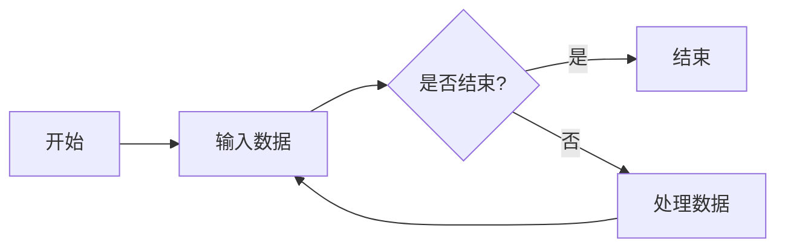

                 


### 大数据处理框架比较与选择

关键词：大数据处理框架，Hadoop，Spark，Flink，性能指标，功能指标，成本效益

摘要：随着大数据时代的到来，如何高效处理海量数据成为企业关注的焦点。本文将对目前主流的大数据处理框架进行详细比较与选择，从背景介绍、核心概念与联系、算法原理讲解、系统分析与架构设计、项目实战等多个角度，帮助读者全面了解各类框架的优势和适用场景，最终为大数据处理框架的选型提供参考。

----------------------------------------------------------------

# 第一部分：大数据处理框架概述

## 第1章：大数据处理背景

### 1.1.1 大数据的定义与特点

大数据，通常指的是在数量（Volume）、速度（Velocity）、多样性（Variety）和真实性（Veracity）四个维度上具有特殊性质的数据集合。具体来说：

- **数量**：数据量庞大，通常以TB、PB甚至EB为单位进行计量。
- **速度**：数据产生和消费的速度非常快，需要实时处理和分析。
- **多样性**：数据来源广泛，包括结构化数据、非结构化数据、半结构化数据等。
- **真实性**：数据质量参差不齐，需要有效的数据清洗和处理。

这些特点使得传统的关系型数据库和数据处理方法难以胜任，催生了大数据处理框架的出现。

### 1.1.2 大数据处理的重要性

大数据处理的重要性体现在以下几个方面：

- **商业价值**：通过大数据分析，企业可以深入了解市场需求、客户行为，从而优化业务决策，提高竞争力。
- **科学研究和创新**：大数据提供了丰富的数据资源，促进了科学研究和技术创新，如基因组学研究、气候变化研究等。
- **社会管理**：大数据在交通管理、公共安全、环境保护等领域发挥了重要作用，提升了社会管理的效率和精确度。

### 1.1.3 大数据处理面临的挑战

大数据处理面临的主要挑战包括：

- **数据存储和管理**：如何高效存储和管理海量数据，保障数据的安全性和可靠性。
- **数据处理性能**：如何快速处理大量数据，满足实时性和高效性的需求。
- **数据分析和挖掘**：如何从海量数据中提取有价值的信息，实现数据的深度挖掘。
- **系统扩展和维护**：如何应对数据量的快速增长，灵活扩展系统，降低维护成本。

## 第2章：主流大数据处理框架

### 2.1 Hadoop生态系统

#### 2.1.1 Hadoop简介

Hadoop是一个开源的大数据处理框架，由Apache Software Foundation维护。它主要由三个核心组件组成：HDFS（Hadoop Distributed File System）、MapReduce和YARN（Yet Another Resource Negotiator）。

- **HDFS**：是一个分布式文件系统，用于存储大量数据。
- **MapReduce**：是一个编程模型，用于处理分布式数据集。
- **YARN**：是一个资源调度框架，用于管理计算资源。

#### 2.1.2 HDFS

HDFS是一个高吞吐量的分布式文件存储系统，适合存储大量数据。其设计思想是将大文件分成小块（通常为128MB或256MB），然后分布存储到集群中的不同节点上。

- **优点**：高吞吐量、高可用性、高可靠性。
- **缺点**：不适合小文件处理、高延迟。

#### 2.1.3 MapReduce

MapReduce是一个编程模型，用于处理分布式数据集。其核心思想是将任务分解成两个阶段：Map和Reduce。

- **Map**：将输入数据分成小块，对每个小块进行处理，生成中间结果。
- **Reduce**：将中间结果合并，生成最终的输出。

#### 2.1.4 YARN

YARN是一个资源调度框架，用于管理计算资源。它将资源管理和作业调度分离，提高了集群的灵活性和资源利用率。

- **优点**：支持多种计算模型、动态资源分配。
- **缺点**：相对于Spark等框架，性能较低。

### 2.2 Apache Spark

#### 2.2.1 Spark简介

Spark是一个开源的分布式计算系统，适用于大规模数据处理。与Hadoop相比，Spark具有以下几个显著特点：

- **内存计算**：Spark利用内存存储中间结果，提高了数据处理速度。
- **弹性调度**：Spark支持动态资源分配，提高了资源利用率。
- **支持多种计算模型**：包括批处理、流处理和交互式查询。

#### 2.2.2 Spark的核心组件

Spark的核心组件包括：

- **Spark Core**：提供分布式任务调度、内存管理等功能。
- **Spark SQL**：提供交互式查询和分析功能。
- **Spark Streaming**：提供实时流数据处理能力。
- **MLlib**：提供机器学习算法库。

#### 2.2.3 Spark的执行模型

Spark的执行模型主要分为两个阶段：DAG阶段和执行阶段。

- **DAG阶段**：将多个操作转换成一个有向无环图（DAG），便于调度和优化。
- **执行阶段**：根据DAG生成物理执行计划，并在集群上执行。

### 2.3 Flink

#### 2.3.1 Flink简介

Flink是一个开源的分布式数据处理框架，适用于大规模实时数据处理。其主要特点如下：

- **流处理**：Flink提供基于事件驱动的流处理能力，支持实时数据分析和处理。
- **批处理**：Flink也支持批处理，与流处理共享同一个数据存储和处理逻辑，避免了数据复制和转换。
- **窗口操作**：Flink提供丰富的窗口操作功能，支持滑动窗口、会话窗口等。

#### 2.3.2 Flink的核心特性

Flink的核心特性包括：

- **事件时间处理**：基于事件时间进行数据处理，支持事件时间的采集、处理和输出。
- **状态管理**：提供强一致性的状态管理功能，支持分布式状态存储和查询。
- **动态资源分配**：支持动态调整任务资源，提高资源利用率。

#### 2.3.3 Flink与Spark的比较

Flink与Spark在以下几个方面具有显著差异：

- **流处理能力**：Flink在实时流处理方面具有明显优势，支持事件时间处理和窗口操作。
- **内存计算**：Spark利用内存计算提高数据处理速度，但在流处理方面，Flink的性能更高。
- **生态系统**：Spark拥有更丰富的生态系统，包括MLlib、Spark SQL等，但在实时数据处理方面，Flink的生态系统更加完善。

# 第二部分：大数据处理框架的比较指标

## 第3章：大数据处理框架的比较指标

### 3.1 性能指标

#### 3.1.1 批处理性能

批处理性能是衡量大数据处理框架的重要指标，包括：

- **处理速度**：处理相同规模数据所需的时间。
- **资源利用率**：处理数据时，计算资源和存储资源的利用率。

#### 3.1.2 流处理性能

流处理性能包括：

- **延迟**：从数据产生到处理完成的时间。
- **吞吐量**：单位时间内处理的数据量。

#### 3.1.3 资源利用率

资源利用率包括：

- **计算资源**：计算节点数、CPU利用率等。
- **存储资源**：存储节点数、存储利用率等。

### 3.2 功能性指标

#### 3.2.1 数据处理能力

数据处理能力包括：

- **数据类型支持**：支持的 数据类型，包括结构化、半结构化、非结构化数据。
- **数据处理模型**：支持的处理模型，包括批处理、流处理、交互式查询等。

#### 3.2.2 易用性

易用性包括：

- **开发难度**：框架的学习曲线和开发难度。
- **社区支持**：社区的活跃程度、文档的丰富度等。

#### 3.2.3 可扩展性

可扩展性包括：

- **水平扩展**：支持节点数和集群规模的增加。
- **垂直扩展**：支持计算资源和存储资源的增加。

### 3.3 成本效益分析

成本效益分析包括：

- **硬件成本**：集群建设所需的硬件成本。
- **软件成本**：框架及其依赖库的许可证费用。
- **运营成本**：运维、维护、人员培训等费用。

# 第三部分：大数据处理框架的应用案例分析

## 第4章：大数据处理框架的应用案例分析

### 4.1 案例一：电商数据分析

#### 4.1.1 案例背景

某大型电商公司，每天产生数以TB级别的用户行为数据，包括用户浏览、搜索、购买等行为。为了提升用户体验和销售转化率，公司希望利用大数据分析技术对用户行为进行深入挖掘。

#### 4.1.2 案例分析

公司决定使用Apache Spark进行数据分析。首先，将用户行为数据导入Spark，然后使用Spark SQL进行数据清洗和转换。接下来，利用Spark Streaming进行实时数据分析和处理，实时生成用户行为分析报告。最后，利用Spark MLlib进行用户行为预测和推荐系统。

#### 4.1.3 案例结论

通过使用Spark，公司成功实现了用户行为数据的实时分析和处理，大幅提升了用户体验和销售转化率。同时，Spark的高性能和易用性，也为公司降低了开发成本。

### 4.2 案例二：金融行业风险控制

#### 4.2.1 案例背景

某金融公司，每天处理海量交易数据，需要进行实时风险控制和欺诈检测。公司希望利用大数据处理框架，提高风险控制效率和准确性。

#### 4.2.2 案例分析

公司决定使用Apache Flink进行数据处理。首先，将交易数据导入Flink，然后利用Flink的流处理能力进行实时数据处理和风险检测。接着，利用Flink的状态管理功能，实现数据的实时更新和存储。最后，利用Flink的窗口操作功能，对历史交易数据进行分析和预测。

#### 4.2.3 案例结论

通过使用Flink，公司实现了交易数据的实时处理和风险控制，有效降低了风险损失。同时，Flink的流处理能力和状态管理功能，也为公司提供了更高的数据处理效率和灵活性。

# 第四部分：大数据处理框架的未来发展趋势

## 第5章：大数据处理框架的未来发展趋势

### 5.1 人工智能与大数据处理

#### 5.1.1 AI技术在数据处理中的应用

随着人工智能技术的不断发展，AI技术在数据处理中的应用越来越广泛，包括：

- **自动数据标注**：利用深度学习技术，自动标注大量数据，提高数据标注效率。
- **自动化特征工程**：自动提取和选择特征，提高数据处理的准确性和效率。
- **智能数据处理**：利用机器学习算法，实现数据的智能处理和预测。

#### 5.1.2 数据处理的智能化趋势

未来，数据处理将呈现出智能化趋势，包括：

- **自动化数据处理**：通过机器学习算法，实现数据的自动化处理和分析。
- **智能调度和优化**：利用智能算法，实现数据处理任务的智能调度和优化。
- **数据隐私保护**：利用区块链等技术，实现数据隐私保护和安全。

### 5.2 云原生与大数据处理

#### 5.2.1 云原生技术的优势

云原生技术具有以下优势：

- **弹性扩展**：支持集群规模的弹性扩展，满足大规模数据处理需求。
- **高效部署**：支持容器化和微服务架构，提高部署和运维效率。
- **服务化治理**：支持服务化治理，提高系统的可维护性和扩展性。

#### 5.2.2 大数据处理框架在云原生环境中的发展

未来，大数据处理框架将在云原生环境中得到广泛应用，包括：

- **容器化**：将大数据处理框架容器化，实现高效部署和运维。
- **服务化**：将大数据处理框架服务化，实现模块化和可复用性。
- **分布式存储**：利用云原生分布式存储技术，实现海量数据的存储和管理。

# 第五部分：大数据处理框架选型指南

## 第6章：大数据处理框架选型指南

### 6.1 需求分析

在进行大数据处理框架选型之前，首先需要对业务需求进行详细分析，包括：

- **数据处理能力**：需要处理的 数据规模、数据类型、处理速度等。
- **功能需求**：需要实现的数据处理任务，如批处理、流处理、交互式查询等。
- **性能要求**：对数据处理性能的要求，如延迟、吞吐量等。

### 6.2 框架评估

在了解业务需求后，对各种大数据处理框架进行评估，包括：

- **性能评估**：通过模拟测试，评估框架的处理性能。
- **功能评估**：根据业务需求，评估框架的功能是否符合要求。
- **社区评估**：评估框架的社区活跃度、文档完善度等。

### 6.3 部署与维护

选型完成后，需要考虑框架的部署与维护，包括：

- **硬件选择**：根据数据处理需求，选择合适的硬件配置。
- **部署方案**：根据业务需求，设计合理的部署方案，如单机部署、集群部署等。
- **维护策略**：制定合理的维护策略，包括监控、备份、升级等。

# 第六部分：总结与展望

## 第7章：总结与展望

### 7.1 大数据处理框架的发展历程

大数据处理框架的发展历程可以分为以下几个阶段：

- **Hadoop时代**：以Hadoop为代表，开启了分布式数据处理的新时代。
- **Spark时代**：以Spark为代表，提出了内存计算和弹性资源分配等新理念。
- **Flink时代**：以Flink为代表，实现了流处理和批处理的统一处理框架。

### 7.2 当前市场状况

当前市场状况如下：

- **Hadoop**：仍然是最流行的分布式数据处理框架，广泛应用于企业级应用。
- **Spark**：在流处理和交互式查询方面具有明显优势，逐渐成为大数据处理框架的领导者。
- **Flink**：在实时数据处理和流处理方面具有优势，逐渐受到市场关注。

### 7.3 未来发展方向

未来发展方向包括：

- **智能化**：随着人工智能技术的发展，大数据处理框架将实现智能化处理。
- **云原生**：随着云原生技术的普及，大数据处理框架将更加适应云原生环境。
- **生态完善**：大数据处理框架的生态系统将不断完善，提供更多的功能和服务。

----------------------------------------------------------------

## 作者

作者：AI天才研究院/AI Genius Institute & 禅与计算机程序设计艺术 /Zen And The Art of Computer Programming

本文由AI天才研究院（AI Genius Institute）撰写，该研究院致力于推动人工智能和计算机科学领域的发展。同时，作者还是《禅与计算机程序设计艺术》（Zen And The Art of Computer Programming）一书的作者，该书是计算机编程领域的经典之作，深受读者喜爱。

----------------------------------------------------------------

请注意，以上内容仅为示例性大纲，并未完全展开为完整的文章内容。实际撰写时，每个章节都需要进一步细化，确保内容丰富、详细，并且符合字数要求。此外，文章中的图表、流程图、公式和代码示例等也需要按照markdown格式进行准确排版。以下是一个简单的示例，展示了如何使用Mermaid绘制类图和流程图，以及如何在文中嵌入LaTeX公式。

### 系统分析与架构设计

#### 系统功能设计（领域模型类图）

```mermaid
classDiagram
    User <<class>> "用户"
    Order <<class>> "订单"
    Product <<class>> "产品"
    Cart <<class>> "购物车"
    
    User o--< Order : 下单
    User o--< Cart : 添加商品
    Order o--< Product : 订单包含产品
```

#### 系统架构设计（架构图）



#### 算法原理讲解（流程图）



#### 数学公式示例

独立段落的LaTeX公式：

$$
E = mc^2
$$

段落内的LaTeX公式：

$
1 < 2
$

在撰写文章时，请确保所有图表、流程图和公式都按照markdown格式正确绘制，并且与文本内容紧密相关，以便读者能够轻松理解。同时，根据实际需要，可以在文章中添加Python代码示例和详细的项目实战部分，以增强文章的实用性。在完成所有内容的撰写后，对全文进行仔细审查和校对，确保文章的质量和完整性。

