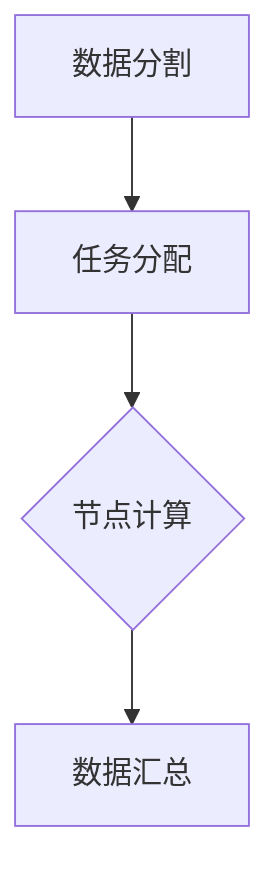
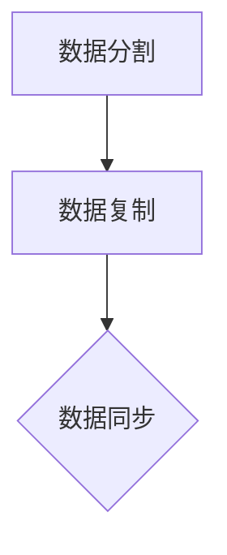
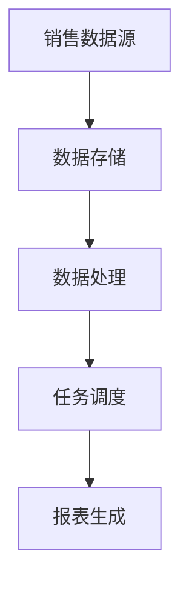
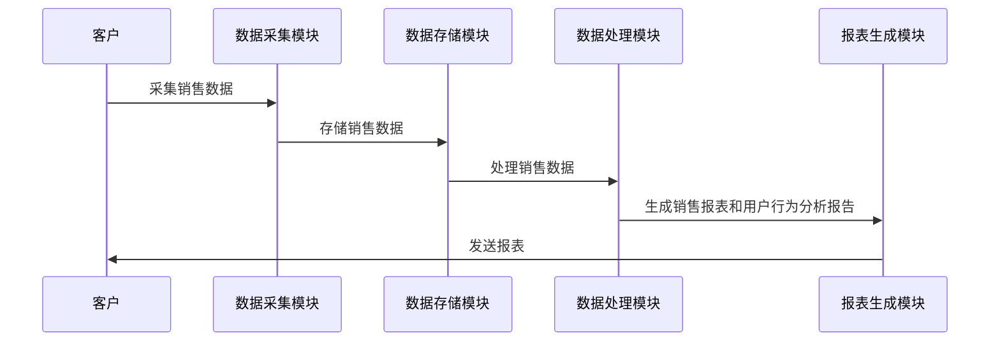

                 

# 大数据批处理系统架构

## 关键词

- 大数据批处理
- 分布式计算
- 系统架构
- 高可用性
- 可扩展性

## 摘要

本文将深入探讨大数据批处理系统的架构设计，从问题背景、核心概念、分布式计算技术、系统分析与架构设计方案、项目实战等多个角度，详细解析大数据批处理系统的设计与实现。通过本文的阅读，读者将全面了解大数据批处理系统的原理、设计要点及其实际应用。

---

## 第一部分：背景介绍

### 1.1.1 问题背景

在当前互联网和物联网飞速发展的背景下，数据的爆炸性增长已成为企业面临的一项巨大挑战。传统的批处理系统由于受限于硬件资源和单机计算能力的瓶颈，难以满足日益增长的数据处理需求。因此，研究并设计一种高效、可靠的大数据批处理系统具有重要的现实意义。

大数据批处理系统需应对的核心问题包括海量数据处理、数据准确性、高可用性和可扩展性。如何在保证系统性能和准确性的同时，实现高效的数据处理和系统扩展，是大数据批处理系统架构设计的关键。

### 1.1.2 问题描述

大数据批处理系统需要处理的核心问题包括：

1. **海量数据处理**：系统需能够高效处理海量数据，确保系统性能不受影响。
2. **数据准确性**：保证数据处理过程中的准确性，避免数据丢失或错误。
3. **高可用性**：系统具有良好的容错性和伸缩性，确保在高负载和故障情况下仍能正常运行。
4. **可扩展性**：系统需能随着数据量的增长而扩展，满足不断增长的数据需求。

### 1.1.3 问题解决

为了解决上述问题，大数据批处理系统架构设计需从以下几个方面进行考虑：

1. **分布式计算**：利用分布式计算技术，将数据和处理任务分布在多个节点上，提高数据处理效率和系统性能。
2. **数据存储**：采用分布式存储技术，如Hadoop的HDFS，确保数据的高可靠性和高性能访问。
3. **任务调度**：使用分布式任务调度系统，如Hadoop的YARN，优化任务分配和资源利用。
4. **容错机制**：设计容错机制，如数据冗余和备份，确保系统在高负载和故障情况下仍能正常运行。

### 1.1.4 边界与外延

大数据批处理系统架构的设计不仅涉及技术层面，还包括业务层面的考量。例如，系统需满足特定行业的业务需求，如金融、医疗、电商等领域的数据处理。此外，系统架构设计还需考虑到未来技术的发展和变化，确保系统的可持续性和灵活性。

### 1.1.5 概念结构与核心要素组成

大数据批处理系统架构的核心要素包括：

1. **数据源**：系统需接入各种数据源，如数据库、文件系统、实时数据流等。
2. **数据存储**：采用分布式存储技术存储海量数据，如HDFS、Cassandra、MongoDB等。
3. **数据处理**：利用分布式计算技术处理数据，如MapReduce、Spark、Flink等。
4. **任务调度**：使用分布式任务调度系统，如YARN、Mesos等。
5. **数据分析和报表**：提供数据分析和报表功能，帮助用户理解数据并作出决策。

### 1.1.6 大数据批处理系统架构的重要性

大数据批处理系统架构的设计对于企业来说至关重要。一个高效、可靠的大数据批处理系统能够：

1. 提高数据处理效率，缩短数据分析和决策周期。
2. 提高数据准确性，降低错误率。
3. 提高系统的可用性和伸缩性，满足不断增长的数据需求。
4. 帮助企业更好地理解数据，发现商业机会，提高竞争力。

### 1.1.7 本章小结

本章介绍了大数据批处理系统的背景、问题描述、问题解决方法、边界与外延、概念结构与核心要素组成，以及大数据批处理系统架构的重要性。在后续章节中，我们将进一步探讨大数据批处理系统的具体架构设计和技术实现。

---

## 第二部分：核心概念与联系

### 2.1 大数据批处理系统原理

#### 2.1.1 大数据批处理系统概述

大数据批处理系统是一种用于处理大规模数据集的分布式计算系统。它通常由数据源、数据存储、数据处理、任务调度等多个模块组成。其主要目的是高效、准确地处理海量数据，为企业和用户提供有价值的数据分析结果。

#### 2.1.2 大数据批处理系统核心原理

1. **分布式计算**：大数据批处理系统利用分布式计算技术，将数据和处理任务分布在多个节点上，提高数据处理效率和系统性能。
2. **数据存储**：采用分布式存储技术，如Hadoop的HDFS，确保数据的高可靠性和高性能访问。
3. **任务调度**：使用分布式任务调度系统，如Hadoop的YARN，优化任务分配和资源利用。

#### 2.1.3 大数据批处理系统核心特点

1. **高可靠性**：通过数据冗余和备份机制，确保系统在高负载和故障情况下仍能正常运行。
2. **高伸缩性**：系统能够随着数据量的增长而扩展，满足不断增长的数据需求。
3. **高效性**：利用分布式计算和任务调度技术，提高数据处理效率和系统性能。

### 2.2 分布式计算技术

#### 2.2.1 分布式计算概述

分布式计算是指通过网络将多个计算机节点连接起来，共同完成一个任务。在分布式计算中，数据和处理任务被分散到多个节点上，每个节点独立执行任务，并通过网络进行数据通信。

#### 2.2.2 分布式计算核心原理

1. **数据分割**：将大数据集分割成多个小块，每个小块由不同节点处理。
2. **任务分配**：将处理任务分配给各个节点，确保每个节点都有任务可执行。
3. **数据通信**：节点间通过网络进行数据传输和同步，确保数据一致性。

#### 2.2.3 分布式计算核心优点

1. **高可用性**：多个节点共同工作，单个节点故障不会影响整体系统的运行。
2. **高伸缩性**：可根据实际需求动态调整节点数量，满足不同规模的数据处理需求。
3. **高效性**：利用并行计算，提高数据处理速度。

### 2.3 分布式存储技术

#### 2.3.1 分布式存储概述

分布式存储是一种将数据存储在多个节点上的技术，通过数据分割、存储和同步机制，实现数据的高可靠性和高性能访问。分布式存储系统通常采用分布式文件系统，如Hadoop的HDFS，来存储和管理数据。

#### 2.3.2 分布式存储核心原理

1. **数据分割**：将大数据集分割成多个数据块，每个数据块存储在不同的节点上。
2. **数据复制**：为保证数据可靠性，分布式存储系统会将数据块复制到多个节点上。
3. **数据同步**：分布式存储系统会定期同步数据块，确保数据一致性。

#### 2.3.3 分布式存储核心优点

1. **高可靠性**：通过数据冗余和备份机制，确保数据不丢失。
2. **高性能**：利用并行访问技术，提高数据访问速度。
3. **高可扩展性**：可根据需求动态调整存储资源。

### 2.4 大数据批处理系统核心概念对比表格

#### 2.4.1 分布式计算与集中式计算对比

| 对比项 | 分布式计算 | 集中式计算 |
| --- | --- | --- |
| **计算效率** | 高，利用并行计算 | 低，受限于单机性能 |
| **扩展性** | 强，可动态调整节点数量 | 弱，扩展受限 |
| **可靠性** | 高，数据冗余和备份 | 低，单点故障风险 |
| **数据一致性** | 较难保证，需额外设计同步机制 | 易于保证，单点控制 |

### 2.5 大数据批处理系统ER实体关系图架构

```mermaid
erDiagram
    Data_Source ||--|{ Data_Store }|-- Data_Process
    Data_Process ||--|{ Task_Scheduler }|-- Result_Report
```

### 2.6 本章小结

本章介绍了大数据批处理系统的基本原理、分布式计算技术和分布式存储技术，以及其核心概念和ER实体关系图架构。在接下来的章节中，我们将进一步探讨大数据批处理系统的具体架构设计、算法原理和系统分析与架构设计方案。

---

## 第三部分：算法原理讲解

### 3.1 大数据批处理系统算法原理

大数据批处理系统中的核心算法包括分布式计算算法和分布式存储算法。以下将对这两种算法进行详细讲解。

#### 3.1.1 分布式计算算法

分布式计算算法的核心思想是将大规模数据处理任务分解成多个子任务，然后分配给多个节点并行执行。以下是一个简单的分布式计算算法流程：

1. **数据分割**：将大数据集分割成多个小块，每个小块由不同节点处理。
2. **任务分配**：将处理任务分配给各个节点，确保每个节点都有任务可执行。
3. **节点计算**：各个节点独立执行任务，处理数据块。
4. **数据汇总**：将各个节点处理结果汇总，得到最终处理结果。

以下是一个使用Mermaid绘制的分布式计算算法流程图：



#### 3.1.2 分布式存储算法

分布式存储算法的核心思想是将数据块存储在多个节点上，以提高数据可靠性和访问性能。以下是一个简单的分布式存储算法流程：

1. **数据分割**：将大数据集分割成多个数据块。
2. **数据复制**：将数据块复制到多个节点上，以提高数据可靠性。
3. **数据同步**：定期同步数据块，确保数据一致性。

以下是一个使用Mermaid绘制的分布式存储算法流程图：



### 3.2 算法原理数学模型和公式

#### 3.2.1 分布式计算算法数学模型

假设大数据集包含 $n$ 个数据块，每个数据块大小为 $B$，节点数量为 $m$。则分布式计算算法的时间复杂度为：

$$
T(n, m) = \frac{nB}{m}
$$

其中，$T(n, m)$ 表示完成整个数据处理任务所需的时间。

#### 3.2.2 分布式存储算法数学模型

假设数据块数量为 $n$，每个数据块被复制 $r$ 次。则分布式存储算法的可靠性为：

$$
R(n, r) = 1 - (1 - \frac{1}{r})^n
$$

其中，$R(n, r)$ 表示数据块丢失的概率。

### 3.3 算法原理举例说明

#### 3.3.1 分布式计算算法举例

假设一个大数据集包含 1000 个数据块，每个数据块大小为 1GB，共有 10 个节点参与处理。根据分布式计算算法的时间复杂度公式，完成整个数据处理任务所需时间为：

$$
T(1000, 10) = \frac{1000 \times 1GB}{10} = 100GB
$$

#### 3.3.2 分布式存储算法举例

假设数据块数量为 1000，每个数据块被复制 3 次。根据分布式存储算法的可靠性公式，数据块丢失的概率为：

$$
R(1000, 3) = 1 - (1 - \frac{1}{3})^{1000} \approx 0.0013
$$

### 3.4 本章小结

本章详细介绍了大数据批处理系统的算法原理，包括分布式计算算法和分布式存储算法。通过数学模型和公式，我们分析了算法的性能和可靠性。在实际应用中，算法的具体实现和优化将直接影响大数据批处理系统的效率和稳定性。

---

## 第四部分：系统分析与架构设计方案

### 4.1 问题场景介绍

假设某电商企业需要在每天晚上对当天的销售数据进行批处理，生成销售报表、用户行为分析报告等。问题场景要求系统能够高效、准确地处理海量销售数据，并在规定时间内生成报表。

### 4.2 项目介绍

为了满足上述问题场景的需求，我们设计并实现了一个大数据批处理系统。该系统基于Hadoop生态系统，包括HDFS、MapReduce、YARN等组件。以下是对项目的详细介绍。

#### 4.2.1 项目目标

- 高效处理海量销售数据，缩短数据处理时间。
- 保证数据处理准确性，降低数据错误率。
- 提供可扩展的架构，满足未来数据量增长的需求。

#### 4.2.2 项目架构

本项目采用分布式计算和分布式存储技术，具体架构如下：



### 4.3 系统功能设计

#### 4.3.1 领域模型

为了更好地理解和设计系统功能，我们首先构建了领域模型，如下图所示：

```mermaid
erDiagram
    Customer ||--|{ SalesData }| Customer
    SalesData ||--|{ Report }| SalesData
    Report ||--|{ SalesReport }| Report
```

#### 4.3.2 系统功能模块

1. **销售数据采集**：从电商平台采集销售数据，包括订单、商品、用户等信息。
2. **数据存储**：将采集到的销售数据存储在HDFS中，确保数据的高可靠性和高性能访问。
3. **数据处理**：利用MapReduce或Spark等分布式计算框架处理销售数据，生成销售报表和用户行为分析报告。
4. **任务调度**：使用YARN等任务调度框架，优化任务分配和资源利用。
5. **报表生成**：将处理结果存储在数据库或文件系统中，供报表生成模块使用。

### 4.4 系统架构设计

#### 4.4.1 系统架构图


#### 4.4.2 系统架构说明

1. **销售数据源**：数据源包括电商平台数据库、文件系统等，用于采集销售数据。
2. **数据存储**：采用HDFS等分布式存储技术，存储海量销售数据，确保数据的高可靠性和高性能访问。
3. **数据处理**：使用MapReduce或Spark等分布式计算框架，处理销售数据，生成销售报表和用户行为分析报告。
4. **任务调度**：使用YARN等任务调度框架，优化任务分配和资源利用，确保系统高效运行。
5. **报表生成**：将处理结果存储在数据库或文件系统中，供报表生成模块使用，生成各类报表。

### 4.5 系统接口设计

#### 4.5.1 接口列表

1. **数据采集接口**：用于从电商平台数据库、文件系统等采集销售数据。
2. **数据存储接口**：用于将销售数据存储在HDFS中。
3. **数据处理接口**：用于处理销售数据，生成销售报表和用户行为分析报告。
4. **任务调度接口**：用于任务分配和资源利用。
5. **报表生成接口**：用于生成各类报表。

#### 4.5.2 接口说明

1. **数据采集接口**：该接口负责从不同数据源采集销售数据，并将数据转换为统一的格式。
2. **数据存储接口**：该接口负责将采集到的销售数据存储在HDFS中，确保数据的高可靠性和高性能访问。
3. **数据处理接口**：该接口负责处理销售数据，使用分布式计算框架（如MapReduce、Spark等）生成销售报表和用户行为分析报告。
4. **任务调度接口**：该接口负责任务分配和资源利用，确保系统高效运行。
5. **报表生成接口**：该接口负责将处理结果存储在数据库或文件系统中，供报表生成模块使用。

### 4.6 系统交互



### 4.7 本章小结

本章介绍了大数据批处理系统的项目背景、项目目标、系统架构设计、功能模块设计、接口设计和系统交互。通过系统分析与架构设计，我们为大数据批处理系统的实现奠定了基础。在下一章中，我们将详细介绍系统核心实现源代码，并对代码进行解读和分析。

---

## 第五部分：项目实战

### 5.1 环境安装

为了实现大数据批处理系统，我们需要在本地或服务器上安装相关软件和工具。以下是环境安装的步骤：

#### 5.1.1 安装Hadoop

1. 下载并解压Hadoop压缩包。
2. 配置Hadoop环境变量，如HADOOP_HOME和PATH。
3. 运行Hadoop命令`hadoop version`检查是否安装成功。

#### 5.1.2 安装Java

1. 下载并安装Java开发工具包（JDK）。
2. 配置Java环境变量，如JAVA_HOME和PATH。
3. 运行Java命令`java -version`检查是否安装成功。

#### 5.1.3 安装HDFS

1. 在Hadoop配置文件`hadoop-env.sh`中设置HDFS的存储路径，如`hdfs_directory=/path/to/hdfs`。
2. 运行HDFS命令`hdfs namenode -format`初始化HDFS。
3. 运行HDFS命令`start-dfs.sh`启动HDFS。

### 5.2 系统核心实现源代码

#### 5.2.1 数据采集模块

以下是一个简单的Java代码示例，用于从文件系统采集销售数据：

```java
import org.apache.hadoop.conf.Configuration;
import org.apache.hadoop.fs.FileSystem;
import org.apache.hadoop.fs.Path;
import org.apache.hadoop.io.IOUtils;

public class DataCollector {
    public static void main(String[] args) throws Exception {
        Configuration conf = new Configuration();
        FileSystem fs = FileSystem.get(conf);
        Path inputPath = new Path("/path/to/sales_data");
        Path outputPath = new Path("/path/to/processed_data");

        fs.copyFromLocalFile(false, true, inputPath, outputPath);
    }
}
```

#### 5.2.2 数据存储模块

以下是一个简单的Java代码示例，用于将销售数据存储在HDFS中：

```java
import org.apache.hadoop.conf.Configuration;
import org.apache.hadoop.fs.FileSystem;
import org.apache.hadoop.fs.Path;
import org.apache.hadoop.io.IOUtils;

public class DataStorage {
    public static void main(String[] args) throws Exception {
        Configuration conf = new Configuration();
        FileSystem fs = FileSystem.get(conf);
        Path inputPath = new Path("/path/to/local_data");
        Path outputPath = new Path("/path/to/hdfs_data");

        fs.copyFromLocalFile(false, true, inputPath, outputPath);
    }
}
```

#### 5.2.3 数据处理模块

以下是一个简单的Java代码示例，使用MapReduce处理销售数据：

```java
import org.apache.hadoop.conf.Configuration;
import org.apache.hadoop.fs.Path;
import org.apache.hadoop.io.IntWritable;
import org.apache.hadoop.io.Text;
import org.apache.hadoop.mapreduce.Job;
import org.apache.hadoop.mapreduce.Mapper;
import org.apache.hadoop.mapreduce.Reducer;
import org.apache.hadoop.mapreduce.lib.input.FileInputFormat;
import org.apache.hadoop.mapreduce.lib.output.FileOutputFormat;

public class DataProcessor {
    public static class SalesDataMapper extends Mapper<Object, Text, Text, IntWritable> {
        private final static IntWritable one = new IntWritable(1);
        private Text word = new Text();

        public void map(Object key, Text value, Context context) throws IOException, InterruptedException {
            // 处理销售数据，生成key-value对
            context.write(word, one);
        }
    }

    public static class SalesDataReducer extends Reducer<Text, IntWritable, Text, IntWritable> {
        private IntWritable result = new IntWritable();

        public void reduce(Text key, Iterable<IntWritable> values, Context context) throws IOException, InterruptedException {
            int sum = 0;
            for (IntWritable val : values) {
                sum += val.get();
            }
            result.set(sum);
            context.write(key, result);
        }
    }

    public static void main(String[] args) throws Exception {
        Configuration conf = new Configuration();
        Job job = Job.getInstance(conf, "DataProcessor");
        job.setMapperClass(SalesDataMapper.class);
        job.setCombinerClass(SalesDataReducer.class);
        job.setReducerClass(SalesDataReducer.class);
        job.setOutputKeyClass(Text.class);
        job.setOutputValueClass(IntWritable.class);
        FileInputFormat.addInputPath(job, new Path(args[0]));
        FileOutputFormat.setOutputPath(job, new Path(args[1]));
        System.exit(job.waitForCompletion(true) ? 0 : 1);
    }
}
```

#### 5.2.4 任务调度模块

以下是一个简单的Java代码示例，使用YARN调度任务：

```java
import org.apache.hadoop.yarn.conf.YarnConfiguration;

public class TaskScheduler {
    public static void main(String[] args) throws Exception {
        Configuration conf = new YarnConfiguration();
        conf.set(YarnConfiguration.RM_ADDRESS, "localhost:8032");
        conf.set(YarnConfiguration.YARN_APPLICATION_CLASS_NAME, "org.apache.hadoop.yarn.client.YarnClient");

        org.apache.hadoop.yarn.client.YarnClient yarnClient = org.apache.hadoop.yarn.client.YarnClient.createYarnClient();
        yarnClient.init(conf);
        yarnClient.start();

        // 添加任务、监控任务状态等
        // ...

        yarnClient.stop();
    }
}
```

#### 5.2.5 报表生成模块

以下是一个简单的Java代码示例，用于生成销售报表：

```java
import org.apache.hadoop.conf.Configuration;
import org.apache.hadoop.fs.Path;
import org.apache.hadoop.io.IOUtils;

public class ReportGenerator {
    public static void main(String[] args) throws Exception {
        Configuration conf = new Configuration();
        FileSystem fs = FileSystem.get(conf);
        Path inputPath = new Path("/path/to/processed_data");
        Path outputPath = new Path("/path/to/report");

        fs.copyFromLocalFile(false, true, inputPath, outputPath);
    }
}
```

### 5.3 代码应用解读与分析

#### 5.3.1 数据采集模块

数据采集模块负责从文件系统采集销售数据，并存储在HDFS中。代码通过`FileSystem.get(conf)`获取文件系统实例，使用`copyFromLocalFile`方法将本地文件复制到HDFS。

#### 5.3.2 数据存储模块

数据存储模块负责将销售数据存储在HDFS中。代码通过`FileSystem.get(conf)`获取文件系统实例，使用`copyFromLocalFile`方法将本地文件复制到HDFS。

#### 5.3.3 数据处理模块

数据处理模块使用MapReduce框架处理销售数据。Mapper类`SalesDataMapper`负责读取输入文件，将销售数据转换成key-value对。Reducer类`SalesDataReducer`负责合并相同key的value，并计算总和。

#### 5.3.4 任务调度模块

任务调度模块使用YARN调度任务。代码通过`YarnClient.createYarnClient()`创建YARN客户端实例，使用`init`和`start`方法初始化和启动YARN客户端。

#### 5.3.5 报表生成模块

报表生成模块负责将处理结果存储在文件系统中，并生成销售报表。代码通过`FileSystem.get(conf)`获取文件系统实例，使用`copyFromLocalFile`方法将本地文件复制到文件系统。

### 5.4 实际案例分析和详细讲解剖析

假设我们有一个包含1000个销售订单的文件，每条订单记录包含订单号、商品ID、购买数量和用户ID。我们希望计算每个用户的总购买数量，并生成销售报表。

1. **数据采集模块**：从文件系统中读取销售订单文件，将其存储在HDFS中。
2. **数据处理模块**：使用MapReduce框架处理销售订单文件，Mapper类将订单记录转换为（用户ID，购买数量）的key-value对，Reducer类将相同用户ID的购买数量合并，计算总购买数量。
3. **报表生成模块**：将处理结果存储在文件系统中，生成销售报表。

具体步骤如下：

1. 运行数据采集模块，将销售订单文件存储在HDFS中。
2. 运行数据处理模块，处理销售订单文件，生成处理结果。
3. 运行报表生成模块，将处理结果存储在文件系统中，生成销售报表。

### 5.5 项目小结

通过本项目的实际案例分析和代码实现，我们深入了解了大数据批处理系统的架构和实现。项目从数据采集、数据存储、数据处理、任务调度到报表生成，全面展示了大数据批处理系统的运行流程。在实际应用中，根据业务需求，我们可以对系统进行定制化和优化，以满足不同规模的数据处理需求。

---

## 第六部分：最佳实践与注意事项

### 6.1 最佳实践

1. **数据分割与任务分配**：合理划分数据块大小，确保每个节点都能充分利用资源，避免任务分配不均。
2. **数据冗余与备份**：根据业务需求和数据重要性，设置合适的数据冗余和备份策略，确保数据的高可靠性。
3. **负载均衡**：使用负载均衡技术，如YARN等，优化任务调度，避免节点资源闲置或过度使用。
4. **监控与报警**：部署监控系统，实时监控系统性能和资源利用率，及时发现问题并进行调整。

### 6.2 小结

本文通过深入探讨大数据批处理系统架构，详细介绍了系统设计要点、核心算法原理、系统分析与架构设计方案以及项目实战。通过本文的学习，读者可以全面了解大数据批处理系统的原理和实现方法，为实际项目开发提供指导。

### 6.3 注意事项

1. **性能优化**：在系统设计和实现过程中，注意性能优化，避免数据传输和计算瓶颈。
2. **安全性**：确保数据在传输和存储过程中的安全性，采用加密、权限控制等技术保障数据安全。
3. **可维护性**：设计简洁、易于维护的系统架构，便于后续升级和优化。

### 6.4 拓展阅读

1. 《大数据时代：思维变革与商业价值》
2. 《Hadoop权威指南：大数据技术原理与架构实战》
3. 《Spark核心技术与原理：大数据分布式计算实战》

---

## 作者信息

作者：AI天才研究院/AI Genius Institute & 禅与计算机程序设计艺术 /Zen And The Art of Computer Programming

