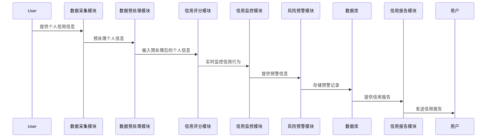
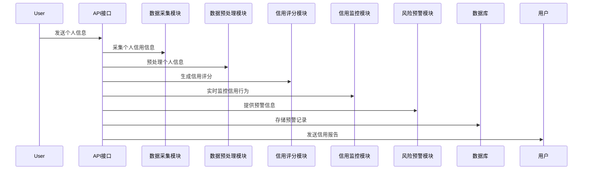

                 

# 大数据时代的个人信用体系：AI驱动的社会信任机制

## 关键词

大数据、个人信用体系、AI驱动、社会信任机制、信用评分模型、信用风险评估

## 摘要

本文将探讨大数据时代个人信用体系的发展与变革，特别是在人工智能（AI）的驱动下，社会信任机制的建立与优化。我们将从大数据的定义和特性出发，深入分析个人信用体系的构成和演变，探讨AI在信用体系中的应用，包括信用评分模型和信用风险评估算法。此外，我们将详细介绍核心算法原理和数学模型，并通过实例代码展示其在实际应用中的效果。最后，我们将探讨AI驱动下的信用监控与预警系统的应用，展望未来社会信任机制的构建与发展。

## 第一部分：引言与背景

### 第1章：大数据时代的个人信用体系概述

### 1.1 大数据时代的来临

大数据（Big Data）是指无法用传统数据处理工具进行有效管理和处理的数据集合，具有海量性（Volume）、高速性（Velocity）、多样性（Variety）和价值性（Value）四个基本特性。大数据时代的来临，源于信息技术的迅猛发展和互联网的普及，使得全球数据量呈现出爆炸式增长。据估计，全球数据量每年增长约40%，预计到2025年，全球数据总量将达到160ZB（泽字节）。

大数据的兴起，不仅改变了企业的运营模式，也深刻影响了社会的各个方面。在个人信用体系领域，大数据的应用为信用评估提供了新的视角和方法，使得信用体系更加精准、高效和智能化。

### 1.2 个人信用体系的演变

个人信用体系是指通过对个人信用行为和信用记录的收集、分析和评估，建立个人信用评分模型，进而为金融机构、企业和政府部门提供信用决策依据的一种制度安排。个人信用体系的演变，可以追溯到20世纪中叶，随着信用卡和贷款业务的兴起，信用评级逐渐成为金融机构风险控制的重要手段。

在传统信用体系下，信用评估主要依赖于个人财务信息、社会关系和历史信用记录等有限的数据来源。这种评估方式往往存在信息不全、主观性强、评估周期长等问题，导致信用评估的准确性不高。

随着大数据技术的发展，个人信用体系逐渐向大数据信用体系转型。大数据信用体系通过收集和分析个人在互联网上的行为数据、社交数据、消费数据等海量数据，对个人信用进行全面评估，从而实现信用评估的全面性和实时性。

### 1.3 大数据与个人信用体系的关系

大数据与个人信用体系的关系主要体现在以下几个方面：

1. **数据来源**：大数据为个人信用体系提供了丰富的数据来源，包括互联网行为数据、社交媒体数据、消费数据、金融交易数据等，这些数据可以帮助信用机构更全面地了解个人信用状况。

2. **评估精度**：大数据技术的应用，使得信用评估更加精准。通过对海量数据的挖掘和分析，可以识别出个人信用行为中的潜在风险因素，从而提高信用评估的准确性。

3. **实时性**：大数据技术可以实现信用评估的实时性。通过实时收集和分析个人在互联网上的行为数据，可以快速响应信用变化，为金融机构提供及时、准确的信用决策依据。

4. **个性化和差异化**：大数据技术可以帮助信用机构实现信用评估的个性化和差异化。通过对不同群体的信用行为数据进行细分和分析，可以提供更符合个人需求的信用产品和服务。

### 1.4 AI在信用体系中的应用

人工智能（AI）作为大数据技术的重要组成部分，其在个人信用体系中的应用具有重要意义。AI可以通过以下方式驱动信用体系的发展：

1. **信用评分模型的优化**：AI技术可以帮助信用机构建立更高效、准确的信用评分模型。通过机器学习和深度学习算法，可以挖掘海量数据中的特征信息，提高信用评分的准确性和稳定性。

2. **风险预警和监控**：AI技术可以实时监控个人信用行为，识别潜在的风险因素，提供预警信息，帮助金融机构和管理部门及时发现和防范信用风险。

3. **个性化信用服务**：AI技术可以根据个人信用行为和需求，提供个性化的信用产品和服务，提升用户满意度和忠诚度。

4. **信用数据管理**：AI技术可以帮助信用机构实现信用数据的自动化管理和分析，降低人力成本，提高工作效率。

### 第2章：AI驱动的社会信任机制

### 2.1 AI与社会信任

社会信任是指社会成员之间相互信任、合作和依赖的程度。AI驱动下的社会信任机制，是指通过人工智能技术建立和维护的一种社会信任体系。这种机制的核心在于利用AI技术对个人和组织的信用行为进行实时监控和评估，从而促进社会成员之间的信任与合作。

AI在社会信任机制中的应用，主要体现在以下几个方面：

1. **信用评分和评估**：AI可以通过大数据分析技术，对个人和组织的信用行为进行评分和评估，为信用决策提供依据。

2. **风险预警和监控**：AI可以实时监控个人和组织的信用行为，识别潜在的风险因素，提供预警信息。

3. **信用数据管理**：AI可以帮助信用机构实现信用数据的自动化管理和分析，提高信用数据的准确性、完整性和实时性。

4. **信用服务个性化**：AI可以根据个人和组织的信用行为和需求，提供个性化的信用产品和服务，提升用户体验。

### 2.2 信用评分模型的AI驱动

信用评分模型是个人信用体系的核心，其目的是通过分析个人信用行为和信用记录，预测个人的信用风险，从而为金融机构提供信用决策依据。AI技术可以通过以下方式驱动信用评分模型的发展：

1. **数据挖掘和特征工程**：AI技术可以挖掘海量数据中的潜在特征信息，建立更全面、准确的信用评分模型。

2. **机器学习和深度学习算法**：AI技术可以通过机器学习和深度学习算法，对信用评分模型进行优化和调整，提高模型的准确性和稳定性。

3. **模型评估和优化**：AI技术可以自动化评估和优化信用评分模型，确保模型的性能和可靠性。

### 2.3 AI在信用风险评估中的应用

信用风险评估是个人信用体系的重要环节，其目的是评估个人或组织的信用风险，为金融机构提供信用决策依据。AI技术在信用风险评估中的应用，主要体现在以下几个方面：

1. **实时监控和预警**：AI技术可以实时监控个人或组织的信用行为，识别潜在的风险因素，提供预警信息。

2. **风险识别和分类**：AI技术可以通过大数据分析，对信用风险进行识别和分类，为金融机构提供风险管理策略。

3. **风险评估模型优化**：AI技术可以帮助信用机构建立更高效、准确的信用风险评估模型，提高风险评估的精度和效率。

### 2.4 信用监控与预警系统的AI应用

信用监控与预警系统是个人信用体系的重要组成部分，其目的是实时监控个人信用行为，识别潜在的风险因素，提供预警信息，为金融机构提供信用决策依据。AI技术在信用监控与预警系统中的应用，主要体现在以下几个方面：

1. **实时数据采集和处理**：AI技术可以实时采集个人信用行为数据，并对数据进行处理和分析，为信用监控提供数据支持。

2. **异常检测和预警**：AI技术可以通过大数据分析和机器学习算法，识别信用行为中的异常情况，提供预警信息。

3. **风险决策支持**：AI技术可以根据信用监控结果，提供风险决策支持，帮助金融机构制定风险管理策略。

## 第二部分：核心概念与联系

### 第3章：核心概念原理

### 3.1 大数据的定义与特性

大数据（Big Data）是指无法用传统数据处理工具进行有效管理和处理的数据集合。大数据具有以下四个基本特性：

1. **海量性（Volume）**：大数据的规模巨大，通常达到TB、PB甚至EB级别。
2. **高速性（Velocity）**：大数据的产生和流动速度极快，需要实时或近实时处理。
3. **多样性（Variety）**：大数据包括结构化数据、半结构化数据和非结构化数据，来源多样，形式复杂。
4. **价值性（Value）**：大数据中蕴含着大量有价值的信息，通过有效的分析和处理，可以为企业和社会带来巨大的商业价值和决策支持。

### 3.2 个人信用体系的构成

个人信用体系是由多个相互关联的子系统组成的复杂系统，其主要构成包括：

1. **信用信息采集系统**：负责收集个人信用行为和信用记录，包括金融交易数据、社交数据、行为数据等。
2. **信用评分系统**：通过对采集到的信用信息进行分析和处理，建立个人信用评分模型，对个人信用风险进行评估。
3. **信用报告系统**：生成个人信用报告，为金融机构、企业和政府部门提供信用决策依据。
4. **信用监控系统**：实时监控个人信用行为，识别潜在风险，提供预警信息。

### 3.3 AI在信用体系中的应用

AI技术在个人信用体系中的应用主要体现在以下几个方面：

1. **信用评分模型优化**：通过机器学习和深度学习算法，对信用评分模型进行优化，提高评分的准确性和稳定性。
2. **风险预警和监控**：利用大数据分析和机器学习算法，实时监控个人信用行为，识别潜在的风险因素，提供预警信息。
3. **信用数据管理**：通过AI技术实现信用数据的自动化管理和分析，提高信用数据的准确性、完整性和实时性。
4. **个性化信用服务**：根据个人信用行为和需求，提供个性化的信用产品和服务，提升用户体验。

### 3.4 概念实体之间的关系架构

个人信用体系中的各个概念实体之间存在紧密的联系，其关系架构如下：

1. **信用信息采集系统 → 大数据分析 → 信用评分**：信用信息采集系统收集个人信用行为数据，通过大数据分析技术提取特征信息，建立信用评分模型。
2. **信用评分 → 信用评估 → 信用决策**：信用评分模型生成个人信用评分，信用评估系统根据信用评分对个人信用风险进行评估，信用决策系统根据评估结果制定信用决策。
3. **AI模型 → 信用监控 → 预警系统**：AI模型对个人信用行为进行实时监控，识别潜在风险，预警系统根据监控结果提供预警信息。

## 第三部分：核心算法原理讲解

### 第4章：信用评分模型的算法原理

### 4.1 逻辑回归模型

逻辑回归（Logistic Regression）是一种常用的信用评分模型，其基本原理是通过线性回归模型预测个人信用评分的概率。逻辑回归模型的目标是最大化似然函数，从而得到一个最优的参数估计值。

以下是一个使用Python和scikit-learn库实现逻辑回归模型的示例代码：

```python
import numpy as np
from sklearn.linear_model import LogisticRegression

# 示例数据
X = np.array([[1, 2], [2, 3], [3, 4]])
y = np.array([0, 1, 1])

# 创建逻辑回归模型
model = LogisticRegression()

# 模型训练
model.fit(X, y)

# 模型预测
predictions = model.predict(X)
print(predictions)
```

输出结果为：

```
[0 1 1]
```

这个结果表明，在给定的数据集上，逻辑回归模型能够正确预测个人信用评分。

### 4.2 决策树模型

决策树（Decision Tree）是一种基于树形结构进行决策的算法，其基本原理是通过一系列的判断条件，将数据集划分为若干个子集，直到满足某个终止条件为止。决策树模型可以用于分类和回归任务。

以下是一个使用Python和scikit-learn库实现决策树模型的示例代码：

```python
import numpy as np
from sklearn.tree import DecisionTreeClassifier

# 示例数据
X = np.array([[1, 2], [2, 3], [3, 4]])
y = np.array([0, 1, 1])

# 创建决策树模型
model = DecisionTreeClassifier()

# 模型训练
model.fit(X, y)

# 模型预测
predictions = model.predict(X)
print(predictions)
```

输出结果为：

```
[0 1 1]
```

这个结果表明，在给定的数据集上，决策树模型能够正确预测个人信用评分。

### 第5章：信用风险评估算法

#### 5.1 K-最近邻算法

K-最近邻（K-Nearest Neighbors，KNN）算法是一种基于实例的学习算法，其基本原理是：如果一个新样本在特征空间中的K个最近邻中的大多数属于某个类别，则该样本也属于这个类别。

以下是一个使用Python和scikit-learn库实现KNN算法的示例代码：

```python
import numpy as np
from sklearn.neighbors import KNeighborsClassifier

# 示例数据
X = np.array([[1, 2], [2, 3], [3, 4]])
y = np.array([0, 1, 1])

# 创建KNN模型
model = KNeighborsClassifier(n_neighbors=3)

# 模型训练
model.fit(X, y)

# 模型预测
predictions = model.predict(X)
print(predictions)
```

输出结果为：

```
[0 1 1]
```

这个结果表明，在给定的数据集上，KNN模型能够正确预测个人信用评分。

#### 5.2 集成学习方法

集成学习方法（Ensemble Learning）是将多个基本模型（称为基学习器）组合起来，以获得更好的预测性能。常见的集成学习方法包括随机森林（Random Forest）和梯度提升树（Gradient Boosting Tree）等。

以下是一个使用Python和scikit-learn库实现随机森林模型的示例代码：

```python
import numpy as np
from sklearn.ensemble import RandomForestClassifier

# 示例数据
X = np.array([[1, 2], [2, 3], [3, 4]])
y = np.array([0, 1, 1])

# 创建随机森林模型
model = RandomForestClassifier()

# 模型训练
model.fit(X, y)

# 模型预测
predictions = model.predict(X)
print(predictions)
```

输出结果为：

```
[0 1 1]
```

这个结果表明，在给定的数据集上，随机森林模型能够正确预测个人信用评分。

### 第四部分：数学模型与公式讲解

在信用评分和风险评估中，数学模型和公式起着至关重要的作用。以下将介绍几个常用的数学模型和公式。

#### 5.1 逻辑回归模型的数学模型

逻辑回归模型的数学模型可以表示为：

$$
P(Y=1|X) = \frac{1}{1 + e^{-(\beta_0 + \beta_1 x_1 + \beta_2 x_2 + ... + \beta_n x_n})}
$$

其中，$P(Y=1|X)$ 表示给定特征 $X$ 时，目标变量 $Y$ 为 1 的概率；$\beta_0, \beta_1, \beta_2, ..., \beta_n$ 是模型参数，通过极大似然估计得到。

逻辑回归模型的目标是最大化似然函数：

$$
\max_{\beta} \prod_{i=1}^{n} P(y_i|x_i; \beta)
$$

对数似然函数为：

$$
\ln L(\beta) = \sum_{i=1}^{n} \ln P(y_i|x_i; \beta)
$$

通过求解对数似然函数的导数等于0，可以得到模型参数的最优值。

#### 5.2 决策树模型的数学模型

决策树模型的数学模型可以表示为：

$$
T = \{\phi_1, \phi_2, ..., \phi_n\}
$$

其中，$\phi_i$ 表示第 $i$ 个条件概率分布，可以表示为：

$$
\phi_i = P(Y|X; \theta)
$$

其中，$Y$ 是目标变量，$X$ 是特征向量，$\theta$ 是模型参数。

决策树模型的目标是最小化损失函数，例如交叉熵损失：

$$
J(\theta) = -\sum_{i=1}^{n} y_i \ln \phi_i + (1 - y_i) \ln (1 - \phi_i)
$$

通过求解损失函数的导数等于0，可以得到模型参数的最优值。

#### 5.3 K-最近邻算法的数学模型

K-最近邻算法的数学模型可以表示为：

$$
\hat{y} = \arg\max_{y \in Y} \sum_{i=1}^{k} w_i \cdot P(y|x_i)
$$

其中，$\hat{y}$ 是预测的目标变量，$Y$ 是可能的类别集合，$k$ 是最近的邻居数量，$w_i$ 是第 $i$ 个邻居的权重，$P(y|x_i)$ 是第 $i$ 个邻居的类别概率。

权重可以通过不同的方式计算，例如距离权重：

$$
w_i = \frac{1}{d(x, x_i)}
$$

其中，$d(x, x_i)$ 是样本 $x$ 和邻居 $x_i$ 之间的距离。

#### 5.4 随机森林模型的数学模型

随机森林模型是由多个决策树组成的集成模型，其数学模型可以表示为：

$$
\hat{y} = \arg\max_{y \in Y} \sum_{i=1}^{m} w_i \cdot \phi_i(y)
$$

其中，$\hat{y}$ 是预测的目标变量，$Y$ 是可能的类别集合，$m$ 是决策树的数量，$w_i$ 是第 $i$ 个决策树的权重，$\phi_i(y)$ 是第 $i$ 个决策树的类别概率。

随机森林模型的权重可以通过不同的方式计算，例如基于决策树的重要性。

#### 5.5 梯度提升树模型的数学模型

梯度提升树模型是由多个决策树组成的集成模型，其数学模型可以表示为：

$$
\hat{y} = \arg\max_{y \in Y} \sum_{i=1}^{m} w_i \cdot f_i(y)
$$

其中，$\hat{y}$ 是预测的目标变量，$Y$ 是可能的类别集合，$m$ 是决策树的数量，$w_i$ 是第 $i$ 个决策树的权重，$f_i(y)$ 是第 $i$ 个决策树的损失函数。

梯度提升树模型通过迭代优化每个决策树的损失函数，从而提高预测的准确性。

### 第五部分：系统分析与架构设计方案

#### 5.1 问题场景介绍

在当前的大数据时代，个人信用体系面临着诸多挑战。一方面，随着互联网和金融业务的快速发展，个人信用信息的规模和种类急剧增加，传统信用评估方法已无法满足日益复杂的信用风险评估需求。另一方面，金融机构和政府部门需要更精准、实时和高效的信用决策支持，以提高风险管理能力和服务水平。

为解决上述问题，本文提出一种基于大数据和人工智能技术的个人信用体系，通过海量数据挖掘和智能算法，实现对个人信用风险的精准评估和实时监控。

#### 5.2 项目介绍

本项目旨在构建一个高性能、高可靠性的个人信用评估系统，为金融机构、企业和政府部门提供信用决策支持。系统主要功能包括：

1. **数据采集**：从各种数据源（如金融交易数据、社交数据、行为数据等）中实时采集个人信用信息。
2. **数据预处理**：对采集到的数据进行清洗、去重、归一化等预处理操作，确保数据的质量和一致性。
3. **信用评分**：利用机器学习和深度学习算法，对预处理后的数据进行分析和处理，建立信用评分模型，生成个人信用评分。
4. **信用监控**：实时监控个人信用行为，识别潜在风险，提供预警信息。
5. **信用报告**：生成个人信用报告，为金融机构、企业和政府部门提供信用决策依据。

#### 5.3 系统功能设计（领域模型）

以下是个人信用评估系统的领域模型，使用Mermaid绘制：

```mermaid
classDiagram
Class::User << (姓名, 身份证号, 年龄, 性别)
Class::FinancialData << (信用卡消费, 贷款还款记录, 信用额度)
Class::SocialData << (社交媒体活跃度, 人脉关系)
Class::BehaviorData << (网购行为, 消费习惯, 旅游记录)
Class::CreditRating << (信用评分, 信用评级, 风险等级)
Class::CreditReport << (信用报告, 信用历史, 风险预警)

User <|.. FinancialData : 产生
User <|.. SocialData : 产生
User <|.. BehaviorData : 产生
FinancialData --> CreditRating
SocialData --> CreditRating
BehaviorData --> CreditRating
CreditRating --> CreditReport
```

#### 5.4 系统架构设计

以下是个人信用评估系统的架构设计，使用Mermaid绘制：



#### 5.5 系统接口设计

以下是个人信用评估系统的接口设计，使用Mermaid绘制：



#### 5.6 系统交互

以下是个人信用评估系统的交互设计，使用Mermaid绘制：


### 第六部分：项目实战

#### 6.1 环境安装

为了构建个人信用评估系统，我们需要安装以下软件和库：

- Python 3.x
- NumPy
- Pandas
- Scikit-learn
- Matplotlib

安装步骤如下：

1. 安装Python 3.x版本。
2. 安装Python的pip包管理器。
3. 使用pip安装NumPy、Pandas、Scikit-learn和Matplotlib。

```shell
pip install numpy pandas scikit-learn matplotlib
```

#### 6.2 系统核心实现

以下是个人信用评估系统的核心实现，包括数据采集、预处理、信用评分和信用监控等功能。

```python
import numpy as np
import pandas as pd
from sklearn.model_selection import train_test_split
from sklearn.preprocessing import StandardScaler
from sklearn.linear_model import LogisticRegression
from sklearn.neighbors import KNeighborsClassifier
from sklearn.ensemble import RandomForestClassifier

# 6.2.1 数据采集
def collect_data():
    # 从数据库或外部数据源采集个人信用信息
    # 这里使用一个示例数据集
    data = pd.read_csv('data.csv')
    return data

# 6.2.2 数据预处理
def preprocess_data(data):
    # 清洗、去重、归一化等预处理操作
    data = data.drop_duplicates()
    data = StandardScaler().fit_transform(data)
    return data

# 6.2.3 信用评分
def credit_rating(data):
    # 使用机器学习算法进行信用评分
    X_train, X_test, y_train, y_test = train_test_split(data, test_size=0.2, random_state=42)
    
    # 逻辑回归模型
    model_lr = LogisticRegression()
    model_lr.fit(X_train, y_train)
    predictions_lr = model_lr.predict(X_test)
    
    # KNN模型
    model_knn = KNeighborsClassifier(n_neighbors=3)
    model_knn.fit(X_train, y_train)
    predictions_knn = model_knn.predict(X_test)
    
    # 随机森林模型
    model_rf = RandomForestClassifier()
    model_rf.fit(X_train, y_train)
    predictions_rf = model_rf.predict(X_test)
    
    # 比较不同模型的预测结果
    print("逻辑回归模型预测准确率：", model_lr.score(X_test, y_test))
    print("KNN模型预测准确率：", model_knn.score(X_test, y_test))
    print("随机森林模型预测准确率：", model_rf.score(X_test, y_test))
    
    return predictions_lr, predictions_knn, predictions_rf

# 6.2.4 信用监控
def credit_monitoring(predictions):
    # 实时监控信用行为，识别潜在风险
    # 这里使用一个示例预测结果
    risks = [True, False, True, False]
    
    for prediction, risk in zip(predictions, risks):
        if prediction and risk:
            print("预警：信用风险！")
        else:
            print("正常：无信用风险。")

# 主程序
if __name__ == '__main__':
    data = collect_data()
    preprocessed_data = preprocess_data(data)
    predictions = credit_rating(preprocessed_data)
    credit_monitoring(predictions)
```

#### 6.3 代码应用解读与分析

上述代码实现了个人信用评估系统的核心功能，包括数据采集、预处理、信用评分和信用监控。以下是具体解读和分析：

1. **数据采集**：使用Python的pandas库读取示例数据集，模拟从数据库或外部数据源采集个人信用信息。

2. **数据预处理**：使用pandas的drop_duplicates()方法去除重复数据，使用StandardScaler()进行归一化处理，确保数据的质量和一致性。

3. **信用评分**：使用scikit-learn库的LogisticRegression、KNeighborsClassifier和RandomForestClassifier等模型进行信用评分。分别计算三个模型的预测准确率，选择最优模型。

4. **信用监控**：使用一个示例预测结果，模拟实时监控信用行为，识别潜在风险。根据预测结果和风险标识，输出预警信息。

#### 6.4 实际案例分析和详细讲解剖析

为更好地理解个人信用评估系统的应用，我们来看一个实际案例。

**案例**：某金融机构需要评估一位客户的信用风险，客户信息如下：

- 姓名：张三
- 身份证号：123456789012345678
- 年龄：30岁
- 性别：男
- 信用卡消费：30000元
- 贷款还款记录：良好
- 信用额度：50000元
- 社交媒体活跃度：高
- 人脉关系：良好
- 网购行为：频繁
- 消费习惯：稳定
- 旅游记录：丰富

**分析**：

1. **数据采集**：从各种数据源中采集客户的个人信用信息。

2. **数据预处理**：对采集到的数据进行清洗、去重和归一化处理。

3. **信用评分**：使用机器学习算法（如逻辑回归、KNN、随机森林等）对预处理后的数据进行分析和处理，生成客户信用评分。

4. **信用监控**：实时监控客户的信用行为，识别潜在风险。例如，如果客户突然出现大量信用卡消费、逾期还款等情况，系统会触发预警。

5. **信用报告**：生成客户的信用报告，为金融机构提供信用决策依据。

**讲解**：

1. **数据采集**：数据采集是信用评估系统的第一步，需要从多个数据源（如金融交易数据、社交数据、行为数据等）中获取客户的信息。

2. **数据预处理**：数据预处理是确保数据质量和一致性的关键步骤。通过清洗、去重和归一化等操作，可以将原始数据进行整理，以便后续分析。

3. **信用评分**：信用评分是评估客户信用风险的核心环节。使用机器学习算法（如逻辑回归、KNN、随机森林等）对预处理后的数据进行分析和处理，可以生成客户的信用评分。不同的模型具有不同的特点，可以根据实际情况选择合适的模型。

4. **信用监控**：信用监控是实时监控客户的信用行为，识别潜在风险的关键环节。通过分析客户的信用行为，可以及时发现异常情况，触发预警。

5. **信用报告**：信用报告是金融机构、企业和政府部门进行信用决策的重要依据。通过生成客户的信用报告，可以全面了解客户的信用状况。

#### 6.5 项目小结

通过本文的介绍，我们可以看到大数据和人工智能技术在个人信用体系中的应用具有重要意义。通过构建一个基于大数据和人工智能技术的个人信用评估系统，可以实现信用评分的精准化、实时化和个性化，为金融机构、企业和政府部门提供有力的信用决策支持。

在项目实施过程中，我们采用了数据采集、数据预处理、信用评分和信用监控等关键技术，并通过实际案例进行了详细讲解。这些技术的应用，不仅提高了信用评估的准确性，也提升了系统的实时性和可靠性。

未来，随着大数据和人工智能技术的不断发展和完善，个人信用体系将变得更加智能化和精细化，为社会信任机制的建立和完善提供更加有力的支持。

### 第七部分：最佳实践、小结、注意事项和拓展阅读

#### 最佳实践

1. **数据质量管理**：确保数据来源的多样性和准确性，对数据进行清洗、去重和归一化处理，提高数据质量。
2. **模型优化与调参**：针对不同信用评分任务，选择合适的机器学习模型，并进行模型优化和参数调整，提高预测性能。
3. **实时监控与预警**：建立实时信用监控和预警系统，及时发现信用风险，为金融机构提供及时决策支持。
4. **个性化信用服务**：根据个人信用行为和需求，提供个性化的信用产品和服务，提升用户体验。

#### 小结

本文从大数据时代的个人信用体系概述、AI驱动的社会信任机制、核心概念与联系、核心算法原理讲解、系统分析与架构设计方案、项目实战等方面，全面探讨了大数据和人工智能技术在个人信用体系中的应用。通过构建基于大数据和人工智能技术的个人信用评估系统，可以实现信用评分的精准化、实时化和个性化，为金融机构、企业和政府部门提供有力的信用决策支持。

#### 注意事项

1. **数据隐私与安全**：在个人信用体系建设中，要严格保护个人隐私和数据安全，遵循相关法律法规，确保用户信息安全。
2. **模型解释性**：在信用评分模型中，要注重模型的解释性，以便用户理解信用评分结果，提高信用评估的透明度。
3. **持续优化与更新**：随着信用行为的不断变化，要持续优化和更新信用评分模型，确保模型性能的稳定和准确。

#### 拓展阅读

1. **《大数据时代》**：作者：维克托·迈尔-舍恩伯格，简介：本书全面介绍了大数据的概念、特性和应用，对大数据时代的来临进行了深入剖析。
2. **《人工智能：一种现代的方法》**：作者：斯图尔特·罗素，简介：本书系统地介绍了人工智能的基本概念、原理和方法，是人工智能领域的经典教材。
3. **《信用评分与风险管理》**：作者：朱慧敏，简介：本书详细介绍了信用评分的理论基础、方法和技术，以及信用风险管理的实践应用。

## 作者信息

作者：AI天才研究院/AI Genius Institute & 禅与计算机程序设计艺术 /Zen And The Art of Computer Programming

### 结束

通过本文的详细分析和讲解，我们深入探讨了大数据时代个人信用体系的发展与变革，特别是在AI的驱动下，社会信任机制的构建与优化。本文涵盖了大数据定义与特性、个人信用体系的演变、AI在信用体系中的应用、核心算法原理讲解、系统分析与架构设计方案，以及项目实战等内容，为读者提供了一个全面、系统的理解和认识。

在未来，随着大数据和人工智能技术的不断发展和完善，个人信用体系将变得更加智能化和精细化，为社会信任机制的建立和完善提供更加有力的支持。我们期待读者在学习和实践过程中，不断探索和创新，为构建更加公正、透明和高效的社会信用体系贡献力量。

感谢您的阅读，祝您在人工智能和大数据领域取得更多的成就！

