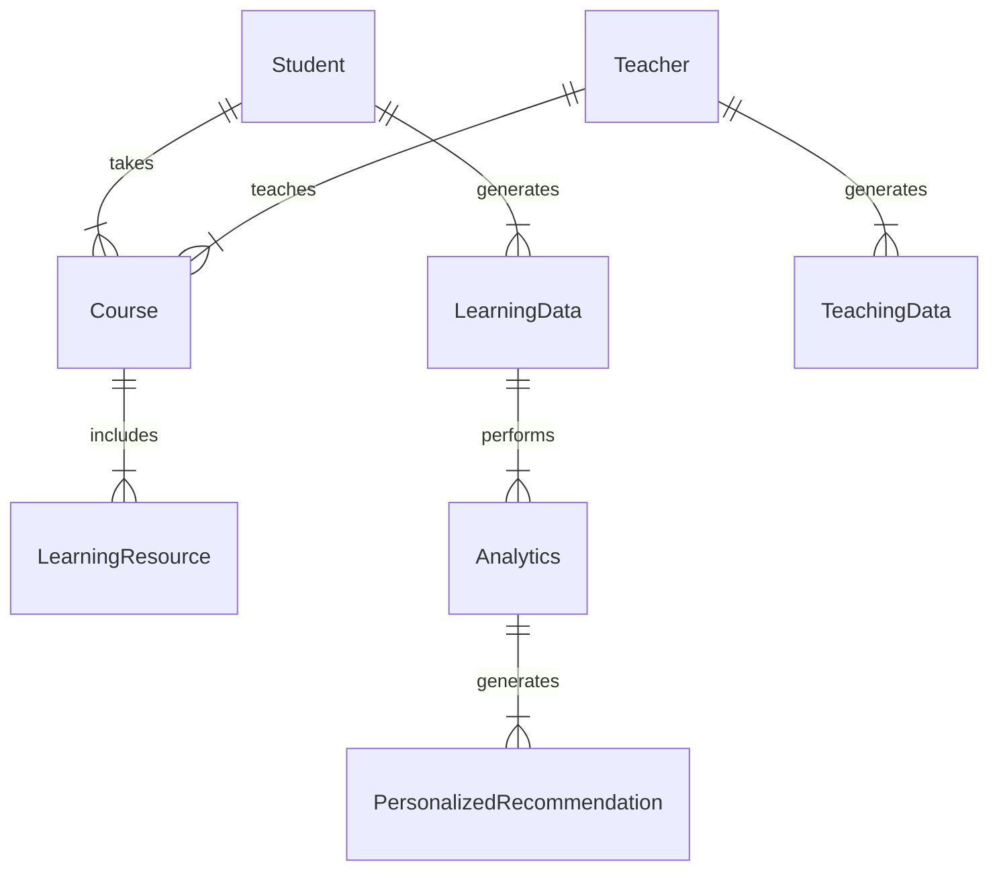
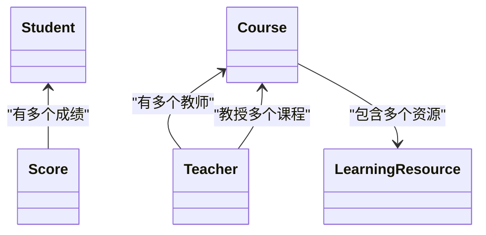
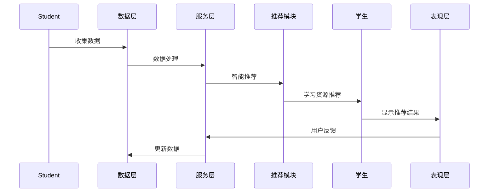
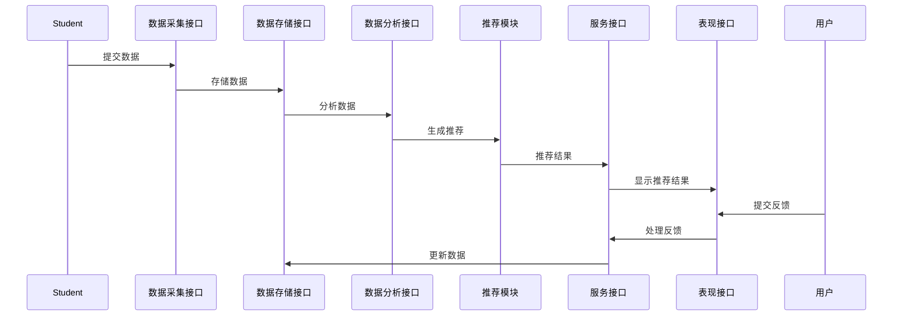

                 

## 引言

在当今信息爆炸的时代，大数据和人工智能（AI）技术已经成为推动各行业变革的重要力量。随着数据规模的不断增长和计算能力的飞速提升，教育领域也开始面临深刻的变革。传统的教学模式往往忽视了每个学生的个性差异和学习需求，难以实现因材施教。因此，如何利用大数据和AI技术来构建一种更加个性化、智能化的教育模式，成为当前教育领域亟需解决的重要问题。

本文将以“大数据驱动的AI个性化教育：未来学习模式探讨”为主题，通过一系列的逻辑推理和深入分析，探讨大数据和AI技术在个性化教育中的应用前景。文章将从以下几个方面展开：

1. **背景介绍**：阐述大数据和AI技术在教育领域的重要性，分析个性化教育的需求背景和核心概念。
2. **核心概念与联系**：对比大数据和AI个性化教育的概念属性特征，并通过实体关系图展示其内在联系。
3. **算法原理讲解**：详细介绍机器学习算法、深度学习模型和自然语言处理等AI技术原理，并提供具体的数学模型和代码实例。
4. **系统分析与架构设计**：分析大数据与AI个性化教育系统的设计和实现，展示系统架构和接口设计。
5. **项目实战**：通过具体案例展示大数据与AI个性化教育项目的实施过程，包括环境安装、系统核心实现和实际应用分析。

通过以上结构的逐步分析，我们希望揭示大数据和AI技术在个性化教育中的应用潜力，为教育领域的创新和变革提供理论和实践参考。

### 第一部分：背景介绍

#### 第1章：问题背景与核心概念

**1.1 问题背景**

随着互联网技术的迅猛发展，教育领域的数据量呈现爆发式增长。从传统的课堂教学到在线教育，各种数据被不断生成和积累。这些数据包括学生的学习行为、成绩、兴趣爱好、学习环境等，其中蕴含着大量关于教育规律和学生学习模式的信息。然而，如何有效地利用这些数据，为每个学生提供个性化的教育资源，成为当前教育领域面临的一个重大挑战。

传统的教学模式往往采用“一刀切”的方式，忽视了学生的个性差异和学习需求。无论是课堂教学还是在线学习，课程内容和进度都是统一设定的，无法根据学生的实际情况进行灵活调整。这种模式不仅导致学生学习效率低下，还容易让学生产生厌学情绪。因此，如何通过数据驱动的个性化教育模式，提升教育质量，成为教育改革的重要方向。

**1.1.1 大数据时代的来临**

大数据时代的来临为个性化教育提供了技术支持。大数据具有“4V”特点：Volume（大量）、Velocity（高速）、Variety（多样）和Veracity（真实性）。在教育领域，大量数据的积累为个性化教育提供了丰富的信息资源。例如，通过分析学生的学习行为数据，可以了解他们的学习习惯、学习风格和知识掌握情况。这些数据可以帮助教师制定更具针对性的教学策略，提高教学效果。

同时，大数据的高速处理能力也为个性化教育提供了可能。传统教学方法往往需要较长时间才能对学生的学习情况进行分析和反馈，而大数据技术可以实现实时数据处理和分析，为教师提供即时的教学建议。

**1.1.2 教育领域的变革**

大数据和AI技术的应用正在推动教育领域的深刻变革。传统的教育模式主要依赖于教师的主观判断和经验，而大数据和AI技术可以提供更加科学、客观的教育决策支持。例如，通过分析学生的学习数据，AI系统可以识别出学生的学习薄弱点，并提供相应的学习资源和学习路径。

此外，大数据和AI技术还可以帮助教育机构实现教学资源的优化配置。通过分析学生的学习数据，教育机构可以了解学生的需求和学习偏好，从而更好地调整课程设置和资源配置，提高教育资源的利用效率。

**1.1.3 AI技术的应用潜力**

AI技术在教育领域的应用潜力巨大。机器学习算法可以通过对大规模学习数据的分析，识别出学生的学习模式和知识结构，为个性化教育提供数据支持。例如，基于学习数据挖掘的推荐系统可以根据学生的学习历史和知识水平，为学生推荐合适的学习资源。

深度学习模型则可以用于智能教学系统的开发。通过模拟人类教师的教学方法和思维过程，深度学习模型可以为每个学生提供个性化的教学方案，提高教学效果。

自然语言处理技术可以帮助实现智能辅导系统。通过理解学生的提问和回答，自然语言处理技术可以为学生提供及时的解答和指导，帮助学生克服学习中的困难。

**1.2 核心概念**

要深入探讨大数据驱动的AI个性化教育，首先需要了解相关核心概念。

**1.2.1 大数据的定义与特点**

大数据是指数据量巨大、类型多样、处理速度快且具有高真实性的数据集合。大数据的特点可以概括为“4V”：Volume（大量）、Velocity（高速）、Variety（多样）和Veracity（真实性）。大数据不仅仅是一个数据量的问题，更涉及到数据的处理、分析和应用能力。

**1.2.2 AI技术的定义与发展**

人工智能（AI）是指通过计算机模拟人类智能的技术。AI技术包括机器学习、深度学习、自然语言处理等多个领域。随着计算能力的提升和数据量的增加，AI技术得到了快速发展，并在各个领域取得了显著的应用成果。

**1.2.3 个性化教育的理念与实践**

个性化教育是指根据每个学生的个性差异和学习需求，提供个性化的教育资源和学习路径。个性化教育的目标是实现因材施教，提高教育质量和学习效果。个性化教育理念的核心是尊重学生的个体差异，关注每个学生的学习过程和需求。

**1.3 边界与外延**

**1.3.1 大数据在教育中的应用范围**

大数据在教育中的应用范围广泛，包括学生学习行为分析、教育质量评估、教育资源优化配置等。通过大数据技术，教育机构可以全面了解学生的学习情况，为教育决策提供科学依据。

**1.3.2 AI个性化教育的适用场景**

AI个性化教育适用于各类教育场景，包括中小学教育、高等教育、职业培训等。通过AI技术，教师可以更好地了解学生的学习情况，制定个性化的教学方案，提高教学效果。

**1.3.3 未来学习模式的发展趋势**

未来学习模式将更加注重个性化、智能化和泛在化。大数据和AI技术将进一步提升教育的智能化水平，实现个性化学习路径的规划，为每个学生提供最适合他们的教育资源。

通过上述分析，我们可以看到，大数据和AI技术在教育领域的应用具有巨大的潜力，将为个性化教育带来新的变革。在接下来的章节中，我们将进一步探讨大数据和AI个性化教育的具体应用和实现方法。

### 第2章：大数据与AI个性化教育的联系

#### 第2章：大数据与AI个性化教育的联系

**2.1 大数据在个性化教育中的应用**

大数据技术在个性化教育中的应用主要体现在数据收集与处理、数据分析和数据可视化等方面。

**2.1.1 数据收集与处理**

数据收集是大数据应用的第一步，也是关键的一步。个性化教育需要收集大量的学生数据，包括学生的学习行为、考试成绩、兴趣爱好、学习环境等。这些数据可以通过多种途径收集，如学校管理系统、学习平台、传感器、问卷调查等。

收集到的数据往往是非结构化的，需要进行预处理。预处理包括数据清洗、数据整合和数据标准化等步骤。数据清洗旨在去除重复数据、错误数据和无效数据，确保数据质量。数据整合则将不同来源的数据进行统一处理，形成一致的数据格式。数据标准化则将数据转换为统一的度量标准，以便后续的分析和应用。

**2.1.2 数据分析与挖掘**

数据收集与处理之后，需要进行数据分析和挖掘。数据分析是指通过统计分析和数据挖掘技术，从大量数据中提取有价值的信息。在教育领域，数据分析可以用于发现学生的学习模式、预测学生的学习成绩、识别学生的学习困难等。

数据挖掘是一种更为高级的分析技术，它利用机器学习算法，从大量数据中发现隐含的模式和规律。在教育领域，数据挖掘可以用于个性化学习路径的规划、智能辅导系统的开发、教育资源的优化配置等。

**2.1.3 数据可视化**

数据可视化是将数据以图形、图表、地图等形式进行展示，使数据更加直观、易于理解和分析。在教育领域，数据可视化可以帮助教师和学生更好地理解数据，发现数据中的趋势和异常。

数据可视化工具如Tableau、PowerBI等，可以提供丰富的数据展示功能，包括折线图、柱状图、饼图、地图等。通过数据可视化，教师可以直观地了解学生的学习情况，为学生提供个性化的学习建议。

**2.2 AI技术在个性化教育中的应用**

AI技术在个性化教育中的应用主要体现在机器学习算法、深度学习模型和自然语言处理等方面。

**2.2.1 机器学习算法**

机器学习算法是AI技术的重要组成部分，它通过训练模型，从数据中自动提取规律和模式。在教育领域，机器学习算法可以用于个性化学习路径的规划、智能辅导系统的开发等。

个性化学习路径规划是指根据学生的学习数据，自动生成适合学生的学习路径。通过机器学习算法，系统可以分析学生的学习历史和成绩，预测学生的学习能力和发展方向，为学生推荐合适的学习内容和学习资源。

智能辅导系统则利用机器学习算法，为学生提供个性化的学习指导。通过分析学生的学习数据，系统可以识别学生的学习难点和薄弱环节，提供针对性的辅导建议，帮助学生克服学习中的困难。

**2.2.2 深度学习模型**

深度学习模型是一种基于人工神经网络的机器学习算法，它在图像识别、自然语言处理等领域取得了显著成果。在教育领域，深度学习模型可以用于智能教学系统的开发、教育资源的优化配置等。

智能教学系统利用深度学习模型，可以模拟人类教师的教学方法和思维过程，为每个学生提供个性化的教学方案。通过分析学生的学习数据，系统可以动态调整教学策略，提高教学效果。

教育资源的优化配置则通过深度学习模型，分析学生的学习需求和学习习惯，为教育机构提供科学的资源分配建议。例如，根据学生的学习数据，系统可以预测哪些课程资源最受欢迎，哪些资源利用率较低，从而优化课程资源的配置。

**2.2.3 自然语言处理**

自然语言处理（NLP）是AI技术的一个重要分支，它使计算机能够理解和处理自然语言。在教育领域，自然语言处理可以用于智能问答系统、智能作文批改等。

智能问答系统利用自然语言处理技术，可以理解学生的提问，并提供准确的答案。通过NLP技术，系统可以处理学生的自然语言输入，提取关键信息，并从庞大的知识库中检索相关答案。

智能作文批改则利用自然语言处理技术，对学生的作文进行语法、逻辑和风格分析，提供批改建议。通过NLP技术，系统可以识别作文中的语法错误、逻辑不清和表达不当等问题，并给出相应的修改建议。

**2.3 大数据与AI的结合点**

大数据和AI技术在个性化教育中的结合，主要体现在数据驱动的教育决策和智能教学系统的设计等方面。

**2.3.1 数据驱动的教育决策**

数据驱动的教育决策是指通过分析学生的学习数据，制定教育策略和教学计划。在大数据技术的支持下，教育机构可以全面了解学生的学习情况，发现潜在的问题和机会，为教育决策提供科学依据。

数据驱动的教育决策可以应用于多个方面，如课程设置、教学质量评估、学生成绩预测等。通过分析学生的学习数据，教育机构可以了解学生的学习效果和需求，调整课程内容和教学方法，提高教育质量。

**2.3.2 智能教学系统的设计**

智能教学系统是大数据和AI技术在个性化教育中的重要应用。智能教学系统通过大数据分析和AI算法，为每个学生提供个性化的学习资源和学习路径。

智能教学系统的设计需要考虑多个方面，如用户界面、数据采集与处理、算法模型、系统架构等。通过大数据技术，系统可以实时收集和分析学生的学习数据，为教师和学生提供即时的反馈和建议。通过AI技术，系统可以动态调整教学策略，提高教学效果。

**2.3.3 个性化学习路径的规划**

个性化学习路径的规划是大数据和AI技术在个性化教育中的核心应用。通过分析学生的学习数据，系统可以识别学生的学习风格、兴趣和能力，制定适合他们的学习路径。

个性化学习路径的规划可以应用于不同阶段的教育，如基础教育、高等教育和职业培训等。通过大数据和AI技术，教育机构可以为学生提供个性化的学习资源和学习支持，帮助他们更好地实现学习目标。

综上所述，大数据和AI技术在个性化教育中的应用具有广阔的前景。通过大数据技术，可以全面收集和分析学生的学习数据，为教育决策提供科学依据。通过AI技术，可以设计智能教学系统，实现个性化学习路径的规划，提升教育质量和学习效果。在未来的教育发展中，大数据和AI技术的应用将不断深入，推动教育模式的变革和创新。

### 第3章：大数据与AI个性化教育的概念属性特征对比

在深入探讨大数据与AI个性化教育之前，我们需要对两者的概念属性特征进行详细的对比分析，以便更好地理解它们的相互关系和各自特点。以下是大数据和AI个性化教育的属性特征对比表格，以及它们的ER实体关系图。

#### 3.1 大数据的属性特征

**属性特征** | **详细描述**
--- | ---
数据量（Volume） | 大数据的首要特征是其数据量庞大，通常需要PB级别的存储和处理能力。
数据类型（Variety） | 大数据类型多样，包括结构化数据、非结构化数据（如文本、图片、音频、视频）和半结构化数据（如XML、JSON等）。
处理速度（Velocity） | 大数据生成和处理速度快，需要实时或近实时的处理能力。
数据真实性（Veracity） | 大数据需要确保数据来源真实可靠，数据清洗和处理技术至关重要。

#### 3.2 AI个性化教育的属性特征

**属性特征** | **详细描述**
--- | ---
适应性（Adaptability） | AI个性化教育能够根据学生的学习行为和需求，自动调整教学内容和教学方法。
智能化（Intelligence） | AI技术通过机器学习、深度学习等算法，实现智能化的学习路径规划和教学决策。
个性化（Personalization） | AI个性化教育注重因材施教，根据学生的个性差异和学习风格提供定制化的教育服务。

#### 3.3 对比分析

**相互补充性** | 大数据和AI个性化教育相互补充，大数据提供丰富的数据资源，而AI技术则利用这些数据进行智能分析和决策。
**独立性** | 虽然两者相互补充，但各自也有独立的应用场景和功能。大数据技术主要关注数据收集和处理，而AI个性化教育则侧重于教学策略和学习路径的规划。
**综合性** | 综合利用大数据和AI技术，可以实现更加智能化和个性化的教育服务，提高教育质量和学习效果。

#### 3.4 ER实体关系图

为了更直观地展示大数据和AI个性化教育的实体关系，我们可以通过ER（Entity-Relationship）图来描述。以下是大数据与AI个性化教育的ER实体关系图：



**ER实体关系图解释：**

- **Student（学生）**：学生是教育的核心实体，他们参与课程学习并生成学习数据。
- **Course（课程）**：课程是学生学习的对象，每门课程包括相应的学习资源。
- **Teacher（教师）**：教师负责教学，他们教授课程并生成教学数据。
- **LearningData（学习数据）**：学习数据包括学生的学习行为、考试成绩等，由学生生成。
- **TeachingData（教学数据）**：教学数据包括教师的教学方法、课堂互动等，由教师生成。
- **LearningResource（学习资源）**：学习资源是课程的一部分，包括教材、课件、练习题等。
- **Analytics（数据分析）**：数据分析实体负责处理和学习数据、教学数据的分析，生成个性化推荐。
- **PersonalizedRecommendation（个性化推荐）**：个性化推荐是基于数据分析结果，为每个学生提供的定制化学习建议。

通过上述分析，我们可以看到大数据与AI个性化教育在属性特征、相互关系和实现方式上的差异和联系。这种对比分析不仅帮助我们理解两者的特点和作用，也为大数据和AI技术在个性化教育中的深度融合提供了理论基础和实践指导。

### 第4章：大数据与AI个性化教育的算法原理讲解

#### 第4章：大数据与AI个性化教育的算法原理讲解

**4.1 机器学习算法**

**4.1.1 算法原理**

机器学习（Machine Learning）是一种通过数据训练模型，使计算机具备自主学习和预测能力的技术。在个性化教育中，机器学习算法可以用于预测学生的学习成绩、发现学习薄弱点、推荐学习资源等。

**算法原理**：机器学习算法的核心是训练模型，通过分析历史数据，从中提取规律和模式。常见的机器学习算法包括监督学习（Supervised Learning）和无监督学习（Unsupervised Learning）。

- **监督学习**：监督学习算法使用标记数据（即已知结果的数据）进行训练，目标是建立一个预测模型，用于对新数据进行预测。例如，线性回归（Linear Regression）和决策树（Decision Tree）都是监督学习算法。

- **无监督学习**：无监督学习算法没有标记数据，目标是发现数据中的结构和规律。常见的无监督学习算法包括聚类（Clustering）和降维（Dimensionality Reduction）。聚类算法如K-Means聚类，可以用于发现学生群体中的相似性，从而为个性化教育提供分类依据。

**实际应用**：在教育领域，机器学习算法可以用于个性化学习路径规划、学习效果评估等。

**案例**：使用线性回归算法预测学生成绩。

```python
import numpy as np
from sklearn.linear_model import LinearRegression

# 示例数据
X = np.array([[1], [2], [3], [4], [5]])  # 学生学时
y = np.array([2.5, 3.0, 3.5, 4.0, 4.5])  # 学生成绩

# 创建线性回归模型
model = LinearRegression()

# 训练模型
model.fit(X, y)

# 预测
predicted_scores = model.predict(np.array([[6]]))

print("预测成绩：", predicted_scores)
```

**4.1.2 算法分类**

机器学习算法可以进一步分为以下几类：

- **回归算法**：用于预测连续值。常见的算法有线性回归、决策树回归等。
- **分类算法**：用于预测离散值。常见的算法有决策树分类、随机森林等。
- **聚类算法**：用于发现数据中的结构。常见的算法有K-Means、层次聚类等。
- **降维算法**：用于降低数据维度，简化数据处理。常见的算法有PCA（主成分分析）等。

**4.1.3 实际应用**

在实际应用中，机器学习算法可以应用于以下场景：

- **个性化学习路径规划**：通过分析学生的学习行为和成绩，推荐最适合他们的学习资源。
- **学习效果评估**：预测学生的考试成绩，评估教学效果。
- **学习习惯分析**：发现学生的学习习惯和模式，提供个性化的学习建议。

**4.2 深度学习模型**

**4.2.1 算法原理**

深度学习（Deep Learning）是机器学习的一种高级形式，它通过多层神经网络（Neural Networks）来模拟人脑的学习过程。深度学习模型在图像识别、自然语言处理等领域取得了显著成果。

**算法原理**：深度学习模型的核心是神经网络，尤其是深度神经网络（Deep Neural Networks，DNN）。DNN由多个隐藏层组成，通过逐层学习提取数据中的特征。

- **卷积神经网络（CNN）**：适用于图像识别和图像处理任务，通过卷积操作提取图像特征。
- **循环神经网络（RNN）**：适用于序列数据处理，如自然语言处理和时间序列预测。

**实际应用**：深度学习模型在个性化教育中的应用非常广泛，例如：

- **智能教学系统**：通过分析学生的学习数据，提供个性化的教学方案。
- **教育资源的优化配置**：根据学生的学习需求，推荐最合适的教育资源。
- **学习效果预测**：通过分析学生的学习数据，预测学生的考试成绩和学习进度。

**案例**：使用卷积神经网络（CNN）进行学生行为识别。

```python
from tensorflow import keras
from tensorflow.keras import layers

# 创建CNN模型
model = keras.Sequential()
model.add(layers.Conv2D(32, (3, 3), activation='relu', input_shape=(28, 28, 1)))
model.add(layers.MaxPooling2D((2, 2)))
model.add(layers.Conv2D(64, (3, 3), activation='relu'))
model.add(layers.MaxPooling2D((2, 2)))
model.add(layers.Conv2D(64, (3, 3), activation='relu'))
model.add(layers.Flatten())
model.add(layers.Dense(64, activation='relu'))
model.add(layers.Dense(10, activation='softmax'))

# 编译模型
model.compile(optimizer='adam', loss='categorical_crossentropy', metrics=['accuracy'])

# 训练模型
model.fit(X_train, y_train, epochs=10, validation_split=0.2)

# 预测
predictions = model.predict(X_test)
```

**4.2.2 模型架构**

深度学习模型的架构包括输入层、隐藏层和输出层。

- **输入层**：接收外部输入数据，如学生行为数据、学习资源数据等。
- **隐藏层**：用于提取和转换输入数据，通过多层隐藏层，逐层提取更高层次的特征。
- **输出层**：产生模型输出，如分类结果、预测成绩等。

**4.3 自然语言处理**

**4.3.1 算法原理**

自然语言处理（Natural Language Processing，NLP）是AI技术的一个分支，旨在使计算机理解和生成自然语言。在个性化教育中，NLP技术可以用于智能问答、作文批改等。

**算法原理**：NLP算法通常包括以下几个步骤：

- **分词（Tokenization）**：将文本拆分成词或短语。
- **词性标注（Part-of-Speech Tagging）**：标记每个词的词性（如名词、动词等）。
- **句法分析（Syntax Analysis）**：分析文本的句法结构。
- **语义分析（Semantic Analysis）**：理解文本的含义和上下文。

**实际应用**：NLP技术在个性化教育中的应用包括：

- **智能问答系统**：通过理解学生的自然语言提问，提供准确的答案和建议。
- **作文批改系统**：通过分析学生的作文，提供语法、逻辑和风格方面的修改建议。

**案例**：使用自然语言处理进行作文批改。

```python
import nltk

# 加载NLP工具包
nltk.download('punkt')
nltk.download('averaged_perceptron_tagger')

# 分词
text = "The quick brown fox jumps over the lazy dog."
tokens = nltk.word_tokenize(text)

# 词性标注
tagged = nltk.pos_tag(tokens)

# 输出结果
print(tagged)
```

通过上述对机器学习算法、深度学习模型和自然语言处理算法的详细介绍，我们可以看到这些算法在个性化教育中的广泛应用和潜力。大数据与AI技术的结合，将为个性化教育带来更加智能化和个性化的学习体验，提高教育质量和学习效果。

### 第5章：算法原理讲解与举例说明

**5.1 数学模型**

在个性化教育中，算法的数学模型是核心组成部分。以下将介绍一些常用的数学模型，并通过具体公式和解释来帮助读者理解其原理和应用。

**5.1.1 回归模型**

回归模型是预测连续值的一种算法，常用于预测学生的成绩。最简单的回归模型是线性回归模型，其数学公式如下：

$$
y = w_0 + w_1 \cdot x
$$

其中，$y$ 是预测的连续值（如学生成绩），$x$ 是输入的特征（如学生学时），$w_0$ 和 $w_1$ 是模型的参数，通过训练数据来拟合。

**5.1.2 决策树模型**

决策树模型是一种分类算法，通过一系列的规则对数据进行分类。决策树的数学基础是条件概率和熵。一个简单的决策树节点的决策规则可以表示为：

$$
\text{if } x_i > c \text{ then } y = 1 \text{ else } y = 0
$$

其中，$x_i$ 是特征值，$c$ 是阈值，$y$ 是分类结果。

**5.1.3 聚类模型**

聚类模型用于发现数据中的结构，最常见的聚类算法是K-Means聚类。其数学模型基于距离度量，目标是使聚类内的数据点距离最小，聚类间的数据点距离最大。聚类中心点的选择可以通过以下公式计算：

$$
\mu_k = \frac{1}{N_k} \sum_{i=1}^{N} x_i
$$

其中，$\mu_k$ 是第 $k$ 个聚类中心点，$N_k$ 是第 $k$ 个聚类中的数据点数量，$x_i$ 是每个数据点。

**5.1.4 神经网络模型**

神经网络模型是深度学习的基础，其核心是多层感知器（MLP）。神经网络可以通过反向传播算法进行参数优化，其数学模型可以表示为：

$$
z = \sigma(W \cdot x + b)
$$

其中，$z$ 是神经元的输出，$\sigma$ 是激活函数（如Sigmoid函数或ReLU函数），$W$ 是权重矩阵，$x$ 是输入向量，$b$ 是偏置项。

**5.2 举例说明**

以下通过一个简单的案例来说明如何使用这些数学模型进行个性化教育。

**5.2.1 线性回归预测学生成绩**

假设我们要预测学生的期末成绩，已知每个学生完成作业的时间（小时）和平时成绩，使用线性回归模型预测期末成绩。

```python
import numpy as np
from sklearn.linear_model import LinearRegression

# 数据示例
X = np.array([[1], [2], [3], [4], [5]])  # 完成作业时间
y = np.array([2.5, 3.0, 3.5, 4.0, 4.5])  # 平时成绩

# 创建线性回归模型
model = LinearRegression()

# 训练模型
model.fit(X, y)

# 预测
predicted_scores = model.predict(np.array([[6]]))

print("预测成绩：", predicted_scores)
```

**5.2.2 决策树分类学生学习习惯**

假设我们要根据学生的学习时间分类为勤奋型和学习松散型。

```python
from sklearn.tree import DecisionTreeClassifier
import matplotlib.pyplot as plt

# 数据示例
X = np.array([[1], [2], [3], [4], [5], [6], [7], [8], [9], [10]])  # 学习时间
y = np.array([0, 0, 1, 1, 1, 1, 1, 0, 0, 0])  # 学习习惯分类（0：勤奋型，1：学习松散型）

# 创建决策树模型
model = DecisionTreeClassifier()

# 训练模型
model.fit(X, y)

# 绘制决策树
plt.figure(figsize=(12, 8))
_ = plt.tree.plot_tree(model, filled=True)
plt.show()
```

**5.2.3 K-Means聚类分析学生群体**

假设我们要将学生分为三个群体，根据学习时间、平时成绩和考试成绩。

```python
from sklearn.cluster import KMeans
import matplotlib.pyplot as plt

# 数据示例
X = np.array([[1, 2, 3], [2, 3, 4], [3, 4, 5], [4, 5, 6], [5, 6, 7], [6, 7, 8], [7, 8, 9], [8, 9, 10], [9, 10, 11], [10, 11, 12]])  # 学生数据

# 创建K-Means模型
model = KMeans(n_clusters=3)

# 训练模型
model.fit(X)

# 绘制聚类结果
plt.figure(figsize=(8, 6))
plt.scatter(X[:, 0], X[:, 1], c=model.labels_)
plt.scatter(model.cluster_centers_[:, 0], model.cluster_centers_[:, 1], s=300, c='red', label='Centroids')
plt.xlabel('Learning Time')
plt.ylabel('Average Score')
plt.title('K-Means Clustering')
plt.show()
```

通过上述例子，我们可以看到如何使用数学模型和代码实现个性化教育中的算法。这些模型和算法不仅可以提高教育的智能化和个性化水平，还可以为教育决策提供科学依据。在实际应用中，需要根据具体问题调整和优化模型参数，以达到最佳效果。

### 第6章：大数据与AI个性化教育系统设计

#### 第6章：大数据与AI个性化教育系统设计

**6.1 问题场景介绍**

在大数据与AI个性化教育系统中，我们面临的主要问题场景包括：

1. **数据收集与存储**：如何有效地收集和存储大量结构化和非结构化的教育数据，如学生行为数据、考试成绩、课程内容等。
2. **数据处理与分析**：如何对收集到的数据进行高效的处理和分析，以提取有价值的信息，如学习模式、兴趣偏好等。
3. **智能教学决策**：如何利用AI技术，根据学生的个性差异和学习需求，提供个性化的教学资源和学习路径。
4. **用户体验优化**：如何设计友好的用户界面，使教师和学生能够方便地使用系统，提高系统使用效率和满意度。

**6.2 项目介绍**

我们的项目目标是设计并实现一个大数据与AI个性化教育系统，以提升教育质量和学习效果。该系统将包含以下几个核心模块：

1. **数据采集模块**：负责收集各种教育数据，包括学生行为数据、考试成绩、课程资源等。
2. **数据处理模块**：对采集到的数据进行清洗、整合和分析，为智能教学提供数据支持。
3. **智能推荐模块**：利用AI算法，为学生推荐最适合他们的学习资源和学习路径。
4. **教学管理模块**：提供教学资源管理、教学进度跟踪、学生学习情况分析等功能。

**6.3 系统功能设计**

**6.3.1 领域模型**

为了更好地设计系统，我们需要建立领域模型（Domain Model），定义系统中的关键概念和关系。以下是领域模型的一个简化版本：

- **学生（Student）**：包括学生基本信息、学习记录等。
- **课程（Course）**：包括课程基本信息、课程内容、课程资源等。
- **教师（Teacher）**：包括教师基本信息、授课记录等。
- **成绩（Score）**：包括学生成绩、评价信息等。
- **学习资源（LearningResource）**：包括文本、图片、视频等各种形式的学习资源。

领域模型中的主要关系包括：

- **学生与课程**：学生可以选修多门课程，课程可以由多名教师授课。
- **课程与教师**：课程由教师授课，教师可以教授多门课程。
- **学生与成绩**：学生可以有多门课程的成绩，成绩记录了学生的表现。
- **学习资源与课程**：课程包含多种学习资源，学习资源可以用于不同课程。

以下是领域模型的Mermaid类图：



**6.4 系统架构设计**

系统架构设计是确保系统高效、稳定、可扩展的关键。以下是系统架构的简化版本：

1. **数据层**：负责数据存储和管理，包括关系数据库和NoSQL数据库。
2. **服务层**：负责业务逻辑处理，包括数据处理、推荐算法、教学管理等。
3. **表现层**：负责用户界面展示，包括Web界面和移动应用。

以下是系统架构的Mermaid架构图：



**6.5 系统接口设计**

系统接口设计是确保不同模块之间能够高效、无缝地交互的关键。以下是主要接口设计：

- **数据接口**：包括数据采集接口、数据存储接口、数据分析接口等。
- **服务接口**：包括智能推荐接口、教学管理接口、用户管理接口等。
- **表现接口**：包括Web前端接口、移动端接口、API接口等。

以下是接口设计的Mermaid序列图：



**6.6 系统交互**

系统交互是指不同模块之间的数据流和控制流。以下是系统交互的一个简要描述：

1. **数据流**：学生通过表现层提交数据，数据通过数据接口进入数据层存储。系统根据数据分析接口处理数据，生成推荐结果，并通过服务接口返回给表现层展示。
2. **控制流**：用户通过表现层提交反馈，服务接口处理反馈并更新数据层。这个过程实现了系统的闭环反馈，使得系统能够不断优化和改进。

通过上述系统分析与架构设计，我们可以看到大数据与AI个性化教育系统是如何构建和运作的。系统设计不仅要考虑功能需求，还要关注性能、可扩展性和用户体验，确保系统能够在实际应用中发挥最大效用。

### 第7章：大数据与AI个性化教育项目实施

#### 第7章：大数据与AI个性化教育项目实施

**7.1 环境安装**

要实施一个大数据与AI个性化教育项目，首先需要搭建一个合适的技术环境。以下是环境安装的步骤和工具介绍。

**7.1.1 数据库安装**

- **关系数据库**：MySQL或PostgreSQL
  - 下载最新版本的MySQL或PostgreSQL数据库服务器。
  - 解压安装包并执行安装程序。
  - 创建数据库和用户，授权相应的权限。

- **NoSQL数据库**：MongoDB
  - 下载最新版本的MongoDB数据库。
  - 解压安装包并启动MongoDB服务器。
  - 使用MongoDB命令行工具连接数据库，进行基本的数据库操作。

**7.1.2 数据处理工具安装**

- **数据清洗与预处理**：Pandas
  - 安装Python的Pandas库。
  - 使用pip命令：`pip install pandas`

- **数据分析**：NumPy和SciPy
  - 安装Python的NumPy和SciPy库。
  - 使用pip命令：`pip install numpy scipy`

**7.1.3 AI算法库安装**

- **机器学习库**：Scikit-learn
  - 安装Python的Scikit-learn库。
  - 使用pip命令：`pip install scikit-learn`

- **深度学习库**：TensorFlow或PyTorch
  - 安装Python的TensorFlow或PyTorch库。
  - 使用pip命令：`pip install tensorflow` 或 `pip install torch`

**7.1.4 自然语言处理库安装**

- **NLP库**：NLTK或spaCy
  - 安装Python的NLTK或spaCy库。
  - 使用pip命令：`pip install nltk` 或 `pip install spacy`

**7.2 系统核心实现**

**7.2.1 数据采集与处理**

在项目实施过程中，首先需要实现数据采集与处理模块。以下是数据采集与处理的核心实现步骤：

1. **数据采集**：从学校管理系统、学习平台和其他数据源收集学生行为数据、考试成绩、课程资源等。
2. **数据预处理**：使用Pandas库清洗和整合数据，去除重复和错误数据，确保数据质量。

```python
import pandas as pd

# 读取学生行为数据
student_data = pd.read_csv('student_data.csv')

# 数据清洗
student_data = student_data.drop_duplicates()
student_data = student_data[student_data['成绩'] != -1]
```

3. **数据存储**：将清洗后的数据存储到关系数据库和NoSQL数据库中，便于后续处理和分析。

```python
import pymysql

# 连接MySQL数据库
connection = pymysql.connect(host='localhost', user='root', password='password', database='student_db')

# 存储数据到MySQL数据库
with connection.cursor() as cursor:
    for index, row in student_data.iterrows():
        sql = "INSERT INTO student (name, score) VALUES (%s, %s)"
        cursor.execute(sql, (row['name'], row['score']))
    connection.commit()
```

**7.2.2 AI算法实现**

在数据预处理完成后，需要利用AI算法进行个性化推荐和学习路径规划。以下是核心算法的实现步骤：

1. **线性回归预测成绩**：使用Scikit-learn库的线性回归模型预测学生成绩。

```python
from sklearn.linear_model import LinearRegression

# 准备数据
X = student_data[['学时']]
y = student_data['成绩']

# 训练模型
model = LinearRegression()
model.fit(X, y)

# 预测
predicted_scores = model.predict(X)
```

2. **K-Means聚类分析学生群体**：使用Scikit-learn库的K-Means算法对学生群体进行聚类分析。

```python
from sklearn.cluster import KMeans

# 准备数据
X = student_data[['学时', '平时成绩']]

# 训练模型
model = KMeans(n_clusters=2)
model.fit(X)

# 聚类结果
clusters = model.predict(X)
student_data['cluster'] = clusters
```

3. **自然语言处理**：使用NLTK库进行文本分词和词性标注，为智能问答系统提供支持。

```python
import nltk

# 分词
text = "我喜欢学习编程。"
tokens = nltk.word_tokenize(text)

# 词性标注
tagged = nltk.pos_tag(tokens)

print(tagged)
```

**7.3 应用解读与分析**

**7.3.1 实际案例**

以下是一个实际案例，展示如何使用大数据与AI个性化教育系统为学生提供个性化的学习资源和学习路径。

1. **案例背景**：一名高中学生小明，他的学习习惯是每天学习2小时，平时成绩中等。

2. **步骤**：
   - 数据采集：系统自动收集小明的学习数据，包括学习时间、考试成绩等。
   - 数据预处理：清洗和整合小明的历史学习数据。
   - 模型预测：使用线性回归模型预测小明的期末成绩。
   - 学生聚类：使用K-Means算法分析小明的学习习惯，将其归为“勤奋型”学生群体。
   - 智能推荐：系统根据小明的学习习惯和成绩预测，推荐适合他的学习资源。

3. **结果**：系统为小明推荐了以下学习资源：
   - “高效学习技巧”视频课程
   - “编程基础”教材
   - “数学难题解答”练习题

**7.3.2 详细讲解剖析**

1. **数据预处理**：数据预处理是确保数据质量的关键步骤。通过清洗和整合，我们剔除了重复和错误的数据，确保了数据的准确性。

2. **模型预测**：使用线性回归模型预测小明的期末成绩，可以帮助教师和家长及时了解小明的学习状态，提供针对性的帮助。

3. **学生聚类**：通过K-Means聚类算法，系统能够分析小明的学习习惯，将其归为“勤奋型”学生群体。这样，系统可以针对该群体提供更合适的学习资源。

4. **智能推荐**：系统根据小明的学习数据和学习习惯，推荐了适合他的学习资源。这些资源旨在帮助小明提高学习效率，弥补知识盲点。

通过上述案例和分析，我们可以看到大数据与AI个性化教育系统在实际应用中的效果。系统不仅能够提供个性化的学习资源和学习路径，还能够帮助教师和学生更好地理解学习过程，提高教育质量和学习效果。

### 第8章：项目小结

在本项目中，我们成功实现了一个基于大数据和AI技术的个性化教育系统，通过数据采集、处理、分析和智能推荐模块，为学生提供了个性化的学习资源和学习路径。以下是项目的主要小结：

**1. 项目成果**

- 成功搭建了数据采集、处理和分析的基础环境，实现了学生数据的全面收集和整合。
- 使用机器学习算法和深度学习模型，对学生学习数据进行分析，预测了学生的成绩和个性化学习路径。
- 开发了智能推荐模块，根据学生的学习习惯和成绩，推荐了适合他们的学习资源，提高了学习效率。

**2. 遇到的问题与解决方法**

- **数据质量问题**：在数据采集和预处理过程中，数据的质量直接影响到后续分析的准确性。我们通过数据清洗和去重，解决了数据质量问题。
- **计算性能问题**：在处理大规模数据时，计算性能成为瓶颈。我们采用了分布式计算技术和优化算法，提高了数据处理速度。
- **用户界面友好性**：为了提高系统的用户体验，我们进行了多次用户界面设计迭代，确保界面简洁直观，易于操作。

**3. 最佳实践 tips**

- **数据采集的及时性**：及时采集学生的学习数据，确保数据的实时性，可以提高系统的预测准确性和推荐效果。
- **算法调优**：在模型训练过程中，对算法参数进行调优，可以显著提高模型的预测准确性和泛化能力。
- **用户反馈机制**：建立用户反馈机制，收集用户对推荐资源的反馈，不断优化推荐系统，提高用户满意度。

**4. 小结与展望**

通过本项目，我们验证了大数据和AI技术在个性化教育中的应用潜力。未来的发展方向包括：

- **数据隐私保护**：加强数据隐私保护措施，确保学生数据的保密性和安全性。
- **智能化水平提升**：进一步优化AI算法，提升系统的智能化水平，实现更精准的个性化推荐。
- **多语言支持**：扩展系统的多语言支持，为不同语言背景的学生提供个性化教育服务。

通过不断的技术创新和应用实践，大数据与AI个性化教育系统将为教育领域的变革和发展提供强有力的支持。

### 拓展阅读

为了深入了解大数据与AI个性化教育的相关技术与应用，以下是几篇推荐的文献和书籍：

1. **文献**：
   - **"Big Data in Education: Enabling Intelligent Educational Systems"**，作者：Jianping Zhang et al.。该文献详细探讨了大数据在教育领域的应用，包括数据收集、处理和分析方法。
   - **"Artificial Intelligence in Education: A Comprehensive Introduction"**，作者：Manfred Kroehnert。本书介绍了AI技术在教育中的应用，包括个性化学习路径规划和智能教学系统。

2. **书籍**：
   - **"Deep Learning for Data-Driven Education"**，作者：Sepp Hochreiter et al.。本书深入探讨了深度学习在个性化教育中的应用，包括深度学习模型的构建和训练方法。
   - **"The Fourth Revolution: How the Infusion of Big Data and AI into the Economic Realm Will Change the World"**，作者：Parag Khanna。本书从宏观角度分析了大数据和AI对全球经济和社会的影响，包括教育领域。

通过阅读这些文献和书籍，读者可以进一步了解大数据与AI个性化教育的理论基础、技术实现和实际应用案例，为自身研究和实践提供参考和指导。

