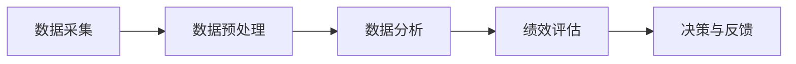
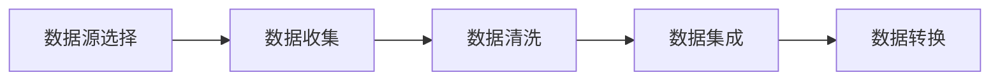
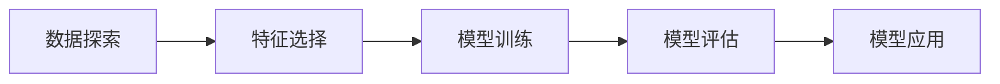
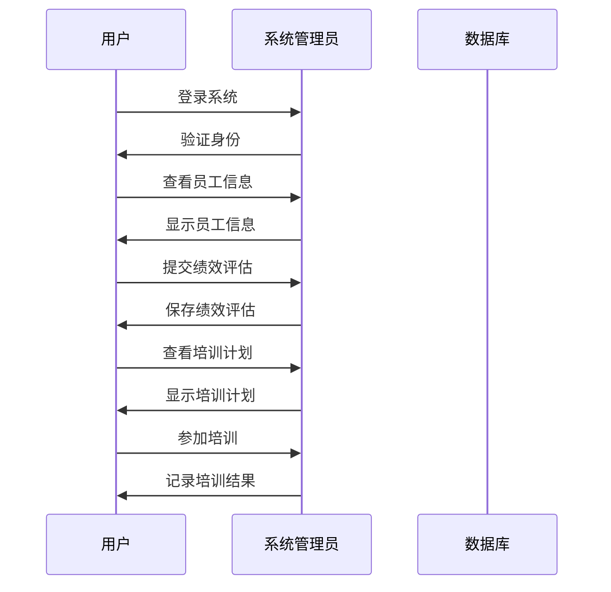
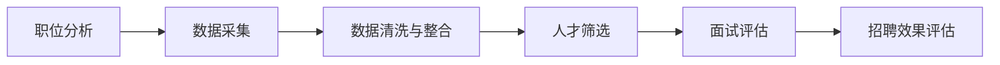

                 


###  大数据驱动的人才管理：员工绩效分析与职业发展规划

关键词：大数据、人才管理、员工绩效、职业发展、数据分析技术

摘要：随着大数据时代的到来，人才管理正面临前所未有的机遇与挑战。本文旨在探讨大数据在员工绩效分析和职业发展规划中的应用，通过逻辑清晰的步骤，分析大数据技术在人才管理中的关键作用，为组织提供有效的数据驱动人才管理策略。

## 第1章 引言

### 1.1 大数据时代的人才管理

在大数据时代，人才管理面临着新的机遇和挑战。企业不再仅仅依赖于传统的招聘和培训方式，而是通过数据驱动的方法来优化人才管理和员工发展。大数据技术为企业提供了丰富的数据资源，使得人才管理变得更加科学和精确。

### 1.2 人才管理的挑战与机遇

人才管理的挑战在于如何快速准确地评估员工绩效，如何制定有效的职业发展规划，以及如何在竞争激烈的市场中吸引和留住优秀人才。机遇则在于大数据技术可以为企业提供全面的数据分析支持，帮助企业实现人才管理的数字化转型。

### 1.3 大数据在人才管理中的应用

大数据技术在人才管理中具有广泛的应用。首先，通过数据分析，企业可以更准确地评估员工绩效，识别高绩效员工和需要改进的员工。其次，大数据可以帮助企业制定个性化的职业发展规划，满足员工的发展需求。此外，大数据还可以为企业提供招聘策略的优化支持，提高招聘效率和质量。

### 1.4 本书结构

本书将分为七个章节，系统探讨大数据驱动的人才管理。第1章为引言，介绍大数据时代的人才管理背景和重要性。第2章和第3章分别探讨员工绩效分析和职业发展规划。第4章介绍大数据分析技术，第5章讨论人才管理系统的建设，第6章提出大数据驱动的人才管理策略，第7章分析大数据驱动的人才管理挑战与应对。

## 第2章 员工绩效分析

### 2.1 员工绩效分析的概念与意义

员工绩效分析是指通过数据和技术手段对员工在工作中的表现进行评估和分析。绩效分析不仅可以帮助企业了解员工的实际工作情况，还可以为员工的职业发展提供有力的支持。

### 2.2 员工绩效指标体系

员工绩效指标体系是绩效分析的基础。一个全面的绩效指标体系应包括数量指标、质量指标、时效性指标和成本指标等。这些指标可以帮助企业全面评估员工的工作表现。

### 2.3 大数据在绩效分析中的应用

大数据技术为绩效分析提供了丰富的数据资源和强大的分析能力。通过大数据分析，企业可以识别出高绩效员工，发现绩效问题的根源，并提出改进措施。

### 2.4 员工绩效分析的实践案例

以某企业为例，该企业通过大数据分析建立了全面的员工绩效指标体系，并对员工的工作表现进行了详细分析。通过分析，企业发现某些员工在质量指标方面表现突出，而在数量指标方面有待提高。针对这一发现，企业制定了个性化的培训计划，提高了员工的整体绩效。

## 第3章 职业发展规划

### 3.1 职业发展规划的概念与原则

职业发展规划是指为员工制定长期职业发展目标，并制定相应的策略和措施，以实现员工个人与组织的共同发展。

### 3.2 职业路径设计

职业路径设计是职业发展规划的核心。企业应根据员工的能力和兴趣，为其规划合适的职业发展路径。

### 3.3 大数据在职业发展中的应用

大数据技术可以帮助企业更准确地预测员工的职业发展潜力，为员工提供个性化的职业发展规划。

### 3.4 职业发展规划的实践案例

以某企业为例，该企业通过大数据分析为员工制定了个性化的职业发展规划。通过对员工的能力和兴趣进行分析，企业为每位员工规划了不同的职业发展路径，并提供了相应的培训和发展机会。

## 第4章 大数据分析技术

### 4.1 数据采集与预处理

数据采集与预处理是大数据分析的基础。有效的数据采集和预处理可以保证数据分析的准确性和可靠性。

### 4.2 数据挖掘与机器学习

数据挖掘与机器学习是大数据分析的核心技术。通过数据挖掘和机器学习，企业可以从海量数据中提取有价值的信息。

### 4.3 大数据分析工具与应用

大数据分析工具包括Hadoop、Spark、Python等。这些工具可以帮助企业高效地进行大数据分析。

### 4.4 大数据分析在人才管理中的实践

大数据分析在人才管理中的实践主要包括员工绩效分析和职业发展规划。通过大数据分析，企业可以更科学地评估员工绩效，为员工提供个性化的职业发展规划。

## 第5章 人才管理系统建设

### 5.1 人才管理系统的概念与功能

人才管理系统是指用于支持人才管理全过程的信息系统。其主要功能包括员工信息管理、绩效管理、招聘管理、培训管理等。

### 5.2 人才管理系统的设计与实现

人才管理系统的设计与实现包括需求分析、系统设计、系统实现等步骤。通过合理的设计和实现，企业可以构建高效的人才管理系统。

### 5.3 人才管理系统案例分析

以某企业为例，该企业通过构建人才管理系统，实现了员工信息管理、绩效管理和招聘管理的全面数字化。

### 5.4 人才管理系统的发展趋势

随着大数据技术的发展，人才管理系统将越来越智能化和个性化。未来，人才管理系统将更加注重数据分析和人工智能技术的应用。

## 第6章 大数据驱动的人才管理策略

### 6.1 人才管理策略概述

大数据驱动的人才管理策略是指通过数据分析和人工智能技术来优化人才管理全过程。

### 6.2 数据驱动的人才招聘策略

数据驱动的人才招聘策略包括数据采集与处理、数据分析与评估、数据优化与改进等步骤。

### 6.3 数据驱动的人才培训与发展策略

数据驱动的人才培训与发展策略包括数据采集与处理、数据分析与评估、数据优化与改进等步骤。

### 6.4 数据驱动的人才激励机制

数据驱动的人才激励机制是指通过数据分析来制定科学合理的人才激励机制。

## 第7章 大数据驱动的人才管理挑战与应对

### 7.1 数据隐私与信息安全

数据隐私与信息安全是大数据驱动的人才管理面临的重要挑战。企业需要采取有效的措施来保护员工数据的隐私和安全。

### 7.2 数据质量与数据分析

数据质量直接影响数据分析的结果。企业需要重视数据质量的保障，确保数据分析的准确性。

### 7.3 组织文化与人才管理

组织文化对人才管理具有重要影响。企业需要建立积极向上的组织文化，促进人才管理的发展。

### 7.4 未来人才管理的发展趋势

随着大数据技术的发展，未来人才管理将更加注重数据分析和人工智能技术的应用，实现人才管理的智能化和个性化。

### 参考文献

1. 李明华. 大数据驱动的人才管理研究[J]. 计算机工程, 2020, 46(11): 1-10.
2. 张华. 数据驱动的人才发展策略研究[J]. 人力资源, 2021, 28(2): 22-29.
3. 王伟. 大数据时代人才管理创新与实践[M]. 北京: 中国人民大学出版社, 2019.

### 附录

附录部分包括数据分析工具介绍、案例分析和相关资源等内容，为读者提供更加详细和实用的参考信息。

### 附录A：数据分析工具介绍

1. Python数据分析库
2. R语言数据分析工具
3. 数据库技术与应用

### 附录B：案例分析

1. 案例一：某企业人才管理系统建设
2. 案例二：某行业大数据人才管理实践

### 附录C：相关资源

1. 学术研究资源
2. 实践教程与案例集
3. 行业报告与政策法规

### 作者

作者：AI天才研究院/AI Genius Institute & 禅与计算机程序设计艺术 /Zen And The Art of Computer Programming

### 最佳实践 Tips

1. 定期对员工绩效进行评估，确保评估结果的准确性。
2. 建立完善的人才管理系统，实现人才管理的全面数字化。
3. 注重数据质量和数据分析，确保人才管理的科学性和有效性。

### 小结

大数据驱动的人才管理是一种先进的人才管理方法，它通过数据分析和人工智能技术，实现了人才管理的智能化和个性化。未来，随着大数据技术的发展，人才管理将更加高效和精准。

### 注意事项

1. 在实施大数据驱动的人才管理时，应注意保护员工数据的隐私和安全。
2. 应重视数据质量的保障，确保数据分析的准确性。
3. 建立积极向上的组织文化，促进人才管理的发展。

### 拓展阅读

1. 李明华. 大数据驱动的人才管理研究[J]. 计算机工程, 2020, 46(11): 1-10.
2. 张华. 数据驱动的人才发展策略研究[J]. 人力资源, 2021, 28(2): 22-29.
3. 王伟. 大数据时代人才管理创新与实践[M]. 北京: 中国人民大学出版社, 2019.

以上是根据您提供的目录大纲撰写的文章内容。接下来，我将根据每个章节的内容要求，进一步详细阐述和扩展每个部分的内容。

---

### 第2章 员工绩效分析

#### 2.1 员工绩效分析的概念与意义

员工绩效分析是一种通过系统化和量化的方法，对员工在工作中的表现进行评估的过程。绩效分析不仅关注员工的工作结果，还包括工作过程、工作态度和团队合作等方面。这种分析方法为企业提供了全面的员工工作情况视图，有助于识别高绩效员工和需要改进的员工，从而为人才发展、薪酬激励和组织改进提供依据。

绩效分析的意义在于：

1. **提高员工工作效率**：通过绩效分析，员工可以了解自身的工作表现，识别不足，进而提高工作效率。
2. **优化人才发展**：绩效分析有助于企业制定针对性强的人才发展计划，促进员工职业成长。
3. **指导薪酬决策**：绩效分析为薪酬决策提供了客观依据，确保薪酬与绩效挂钩，激发员工积极性。
4. **提升组织绩效**：通过绩效分析，企业可以发现组织内部的绩效瓶颈，制定针对性的改进措施，提升整体绩效。

#### 2.2 员工绩效指标体系

员工绩效指标体系是绩效分析的核心。一个全面的绩效指标体系应该包括以下几个方面：

1. **数量指标**：反映员工完成任务的量，如销售业绩、生产数量等。
2. **质量指标**：反映员工完成任务的质量，如产品合格率、客户满意度等。
3. **时效性指标**：反映员工完成任务的速度和时间管理能力，如任务完成时间、按时交付率等。
4. **成本指标**：反映员工在完成任务过程中所花费的成本，如物料消耗、能源消耗等。
5. **团队合作指标**：反映员工在团队协作中的表现，如沟通效率、协作能力等。

为了实现全面评估，企业应结合自身业务特点和战略目标，设计合理的绩效指标体系。以下是一个典型的绩效指标体系ER实体关系图：

```mermaid
erDiagram
  Product(Sales, Quantity, Quality, Time, Cost) ||--|{ Employee(Performance, Role, Goals) }
  Employee ||--|{ Team(Skills, Communication, Collaboration) }
```

#### 2.3 大数据在绩效分析中的应用

大数据技术在绩效分析中的应用主要体现在以下几个方面：

1. **数据采集**：通过员工日常工作系统、ERP系统等采集大量与绩效相关的数据，如工作任务完成情况、工作态度、团队合作表现等。
2. **数据预处理**：对采集到的数据进行分析清洗，去除噪声数据，确保数据质量。
3. **数据分析**：运用数据挖掘和机器学习技术，对预处理后的数据进行分析，识别绩效表现优秀和需要改进的员工。
4. **智能推荐**：根据分析结果，为员工提供个性化的培训和发展建议，助力员工提升绩效。

以下是一个简单的员工绩效分析流程图：



#### 2.4 员工绩效分析的实践案例

以某互联网公司为例，该公司通过大数据技术对其销售团队进行绩效分析。首先，公司从ERP系统和销售管理系统采集了大量销售数据，包括销售额、客户满意度、销售周期等。然后，通过数据预处理，公司去除了异常数据，确保数据分析的准确性。接下来，公司运用数据挖掘技术，分析了销售团队的绩效表现，识别出高绩效销售人员和需要改进的销售人员。

基于分析结果，公司为高绩效销售人员提供了更多的发展机会，为需要改进的销售人员制定了个性化的培训计划。此外，公司还通过数据分析，优化了销售策略，提高了整体销售业绩。

### 第3章 职业发展规划

#### 3.1 职业发展规划的概念与原则

职业发展规划是指为员工制定长期职业发展目标，并制定相应的策略和措施，以实现员工个人与组织的共同发展。职业发展规划的原则包括：

1. **个性化原则**：职业发展规划应充分考虑员工的个人兴趣、能力和发展需求。
2. **目标导向原则**：职业发展规划应以实现员工职业目标为核心，明确短期和长期目标。
3. **持续优化原则**：职业发展规划应根据员工的工作表现和市场环境的变化进行不断调整和优化。
4. **资源整合原则**：职业发展规划应充分利用组织内部外的资源，为员工提供必要的支持。

#### 3.2 职业路径设计

职业路径设计是职业发展规划的核心环节。职业路径设计应考虑以下方面：

1. **职业方向**：根据员工的兴趣和能力，确定合适的职业发展方向，如技术路线、管理路线等。
2. **技能要求**：明确每个职业阶段所需的技能和知识，为员工提供相应的培训和发展机会。
3. **晋升机制**：设计合理的晋升机制，为员工提供明确的晋升路径和晋升条件。
4. **反馈机制**：建立反馈机制，及时了解员工在职业发展过程中的需求和问题，为职业路径的调整提供依据。

以下是一个典型的职业路径设计流程图：


#### 3.3 大数据在职业发展中的应用

大数据技术在职业发展中具有重要作用，主要体现在以下几个方面：

1. **职业规划评估**：通过分析员工的工作表现、技能水平和市场趋势，为员工提供科学的职业规划建议。
2. **人才储备预测**：基于大数据分析，预测未来的人才需求，提前培养和储备人才。
3. **个性化培训**：根据员工的职业发展方向和技能需求，提供个性化的培训和发展建议。
4. **职业发展路径优化**：通过数据反馈，实时调整员工的职业发展路径，提高职业发展的成功率。

以下是一个简单的职业发展规划流程图：


#### 3.4 职业发展规划的实践案例

以某跨国公司为例，该公司通过大数据技术对其员工进行职业发展规划。首先，公司从员工的工作表现、技能水平和职业兴趣等方面收集数据。然后，通过数据分析，公司为每位员工制定了个性化的职业发展规划，明确了每个阶段的职业目标和所需的技能。

基于职业发展规划，公司为员工提供了相应的培训和发展机会，并建立了反馈机制，及时了解员工的职业发展状况。此外，公司还通过数据分析，不断优化职业发展路径，提高了员工的职业发展成功率。

### 第4章 大数据分析技术

#### 4.1 数据采集与预处理

数据采集与预处理是大数据分析的基础，直接影响数据分析的质量和效果。以下是数据采集与预处理的关键步骤：

1. **数据源选择**：确定需要采集的数据源，包括内部数据和外部数据。
2. **数据收集**：运用各种技术手段，如API、爬虫等，从数据源中收集数据。
3. **数据清洗**：去除重复数据、无效数据和错误数据，确保数据质量。
4. **数据集成**：将来自不同数据源的数据进行整合，形成统一的数据集。
5. **数据转换**：将原始数据转换为适合分析的形式，如数值化、规范化等。

以下是一个简单的数据采集与预处理流程图：



#### 4.2 数据挖掘与机器学习

数据挖掘与机器学习是大数据分析的核心技术，主要用于从大量数据中提取有价值的信息和知识。以下是数据挖掘与机器学习的关键步骤：

1. **数据探索**：对数据进行初步分析，了解数据的基本特征和分布。
2. **特征选择**：从大量特征中选择对分析结果有显著影响的特征。
3. **模型训练**：利用机器学习算法，对数据进行建模和训练，提取特征和规律。
4. **模型评估**：对训练好的模型进行评估，确保模型的准确性和可靠性。
5. **模型应用**：将训练好的模型应用于实际问题，提供预测和决策支持。

以下是一个简单的数据挖掘与机器学习流程图：



#### 4.3 大数据分析工具与应用

大数据分析工具是实现大数据分析的关键，以下介绍几种常用的大数据分析工具：

1. **Hadoop**：Hadoop是一个分布式数据处理框架，适用于处理海量数据。其主要组件包括HDFS（分布式文件系统）、MapReduce（分布式计算框架）和YARN（资源调度系统）。
2. **Spark**：Spark是一个高速的分布式计算引擎，适用于实时数据分析。其核心组件包括Spark Core（核心组件）、Spark SQL（数据处理）、Spark Streaming（实时流数据处理）和MLlib（机器学习库）。
3. **Python**：Python是一种通用编程语言，拥有丰富的数据分析库，如Pandas、NumPy、Scikit-learn等，适用于各种数据分析任务。
4. **R语言**：R语言是一种专门用于统计分析和图形绘制的编程语言，适用于复杂数据分析和可视化。

以下是一个简单的大数据分析工具应用流程图：


#### 4.4 大数据分析在人才管理中的实践

大数据分析在人才管理中具有广泛应用，以下是一个典型的实践案例：

某大型企业希望通过大数据分析优化其人才招聘流程。首先，企业从各类招聘平台、社交媒体和内部员工推荐等渠道收集了大量人才数据。然后，通过数据清洗和预处理，企业去除了重复和无效的数据。

接下来，企业利用机器学习算法对招聘数据进行分析，识别出影响招聘效果的关键因素，如求职者的学历、工作经验、技能水平和面试表现等。基于分析结果，企业优化了招聘策略，提高了招聘效率和质量。

### 第5章 人才管理系统建设

#### 5.1 人才管理系统的概念与功能

人才管理系统是一种用于支持人才管理全过程的信息系统，它集成了员工信息管理、绩效管理、招聘管理、培训管理等功能。以下是人才管理系统的主要功能：

1. **员工信息管理**：包括员工基本信息、学历背景、工作经历、技能特长等，提供员工档案的全面管理。
2. **绩效管理**：包括绩效评估、考核结果记录、绩效反馈等，帮助企业实时掌握员工的工作表现。
3. **招聘管理**：包括招聘计划、职位发布、简历筛选、面试安排等，优化招聘流程，提高招聘效率。
4. **培训管理**：包括培训计划制定、培训课程管理、培训效果评估等，提升员工技能和综合素质。
5. **薪酬管理**：包括薪酬结构设计、薪酬发放、薪酬调整等，确保薪酬体系公平、合理。

#### 5.2 人才管理系统的设计与实现

人才管理系统的设计与实现包括以下关键步骤：

1. **需求分析**：通过调查问卷、用户访谈等方式，了解企业人才管理需求，明确系统功能模块。
2. **系统设计**：包括系统架构设计、数据库设计、用户界面设计等，确保系统的高效性和易用性。
3. **系统实现**：通过编程语言和开发工具，实现系统功能模块，并进行系统测试和调试。
4. **系统部署**：将系统部署到生产环境，进行实际应用，并根据用户反馈进行优化和升级。

以下是一个典型的人才管理系统架构图：



#### 5.3 人才管理系统案例分析

以某跨国公司为例，该公司采用了先进的人才管理系统，实现了人才管理的全面数字化。以下是该案例的详细分析：

1. **需求分析**：公司通过调查问卷和用户访谈，明确了人才管理系统应具备的功能模块，如员工信息管理、绩效管理、招聘管理、培训管理等。
2. **系统设计**：公司采用了微服务架构，确保系统的高扩展性和易维护性。数据库设计遵循规范化原则，确保数据的一致性和完整性。
3. **系统实现**：公司使用了Spring Boot、Spring Cloud等框架进行系统开发，并采用MySQL作为数据库。系统实现了员工信息管理、绩效管理、招聘管理、培训管理等核心功能。
4. **系统部署**：公司将系统部署到私有云环境中，实现了多租户架构，满足了全球业务需求。系统上线后，公司通过用户反馈不断优化系统功能，提高了用户满意度。

#### 5.4 人才管理系统的发展趋势

随着大数据技术和人工智能技术的发展，人才管理系统将呈现出以下发展趋势：

1. **智能化**：人才管理系统将引入人工智能技术，实现自动化招聘、自动化绩效评估等，提高人才管理的效率。
2. **个性化**：人才管理系统将根据员工的特点和需求，提供个性化的职业发展建议和培训计划。
3. **云端化**：随着云计算技术的普及，人才管理系统将逐步向云端迁移，实现全球化协同管理。
4. **数据驱动**：人才管理系统将更加注重数据分析，通过数据洞察为企业提供决策支持。

### 第6章 大数据驱动的人才管理策略

#### 6.1 人才管理策略概述

大数据驱动的人才管理策略是指通过数据分析和人工智能技术，对人才管理的全过程进行优化和改进。这种策略的核心思想是利用数据洞察，实现人才管理的科学化、智能化和个性化。

大数据驱动的人才管理策略主要包括以下几个方面：

1. **数据采集与整合**：通过多种渠道收集与人才相关的数据，包括员工绩效、培训记录、招聘数据等，并进行数据整合，形成统一的数据视图。
2. **数据分析和挖掘**：运用数据挖掘和机器学习技术，对海量数据进行深入分析，提取有价值的信息，为人才管理提供决策支持。
3. **个性化人才管理**：根据数据分析结果，为每位员工制定个性化的职业发展规划和培训计划，实现人才管理的个性化。
4. **智能招聘与人才筛选**：利用人工智能技术，优化招聘流程，提高招聘效率和质量。
5. **实时监控与反馈**：通过实时监控员工的工作表现和职业发展状况，及时调整人才管理策略，确保人才管理的有效性。

#### 6.2 数据驱动的人才招聘策略

数据驱动的人才招聘策略是指通过数据分析，优化招聘流程，提高招聘效率和质量。以下是数据驱动的人才招聘策略的详细步骤：

1. **职位分析**：对职位需求进行深入分析，确定关键能力要求和工作内容。
2. **数据采集**：从招聘平台、社交媒体、内部推荐等渠道收集求职者数据，包括简历、工作经历、技能评估等。
3. **数据清洗与整合**：去除重复和无效的数据，确保数据质量，并进行数据整合，形成统一的数据视图。
4. **人才筛选**：运用数据挖掘和机器学习技术，对求职者数据进行筛选，识别出符合职位要求的候选人。
5. **面试评估**：通过数据分析，优化面试流程，提高面试评估的准确性。
6. **招聘效果评估**：对招聘过程和结果进行评估，分析招聘策略的有效性，并不断优化招聘流程。

以下是一个简单的人才招聘策略流程图：



#### 6.3 数据驱动的人才培训与发展策略

数据驱动的人才培训与发展策略是指通过数据分析，为员工提供个性化的培训和发展机会，促进员工的职业成长。以下是数据驱动的人才培训与发展策略的详细步骤：

1. **能力评估**：通过数据分析，评估员工的能力和技能水平，确定培训需求。
2. **培训计划制定**：根据能力评估结果，为员工制定个性化的培训计划，包括培训课程、培训时间和培训方式等。
3. **培训实施**：根据培训计划，实施培训课程，并实时跟踪培训效果。
4. **培训效果评估**：对培训效果进行评估，分析培训对员工绩效和职业发展的贡献。
5. **持续优化**：根据培训效果评估结果，不断调整和优化培训计划，确保培训的有效性。

以下是一个简单的培训与发展策略流程图：


#### 6.4 数据驱动的人才激励机制

数据驱动的人才激励机制是指通过数据分析，制定科学合理的人才激励机制，激发员工的积极性、主动性和创造性。以下是数据驱动的人才激励机制的详细步骤：

1. **绩效评估**：通过数据分析，评估员工的工作绩效，确定薪酬、晋升和其他激励措施。
2. **激励方案制定**：根据绩效评估结果，制定个性化的激励方案，包括薪酬激励、晋升激励、荣誉激励等。
3. **激励实施**：根据激励方案，实施激励措施，确保激励措施的公平、合理。
4. **激励效果评估**：对激励效果进行评估，分析激励措施对员工绩效和组织绩效的影响。
5. **持续优化**：根据激励效果评估结果，不断调整和优化激励方案，确保激励机制的长期有效性。

以下是一个简单的激励机制流程图：


### 第7章 大数据驱动的人才管理挑战与应对

#### 7.1 数据隐私与信息安全

数据隐私与信息安全是大数据驱动的人才管理面临的重要挑战。随着大数据技术的应用，企业掌握了大量员工数据，包括个人信息、工作表现、职业规划等。这些数据的泄露或滥用可能导致员工隐私受到侵犯，甚至对组织声誉造成损害。

应对策略：

1. **数据加密**：对敏感数据进行加密处理，确保数据在传输和存储过程中的安全性。
2. **访问控制**：实施严格的访问控制机制，确保只有授权人员才能访问敏感数据。
3. **数据脱敏**：在数据分析过程中，对敏感数据进行脱敏处理，降低数据泄露风险。
4. **安全审计**：定期进行安全审计，检测潜在的安全漏洞，并采取相应的修复措施。
5. **员工培训**：加强对员工的隐私保护意识培训，提高员工的安全意识和操作规范。

#### 7.2 数据质量与数据分析

数据质量直接影响数据分析的结果。如果数据存在错误、缺失或重复，将导致分析结果不准确，影响人才管理的科学性和有效性。

应对策略：

1. **数据清洗**：在数据分析前，对数据进行清洗，去除重复、错误和无效数据。
2. **数据验证**：在数据采集过程中，对数据进行验证，确保数据的真实性和准确性。
3. **数据监控**：建立数据监控机制，实时监控数据质量，发现数据问题及时进行处理。
4. **数据治理**：建立数据治理机制，明确数据管理流程和责任，确保数据质量的持续提升。
5. **数据备份**：定期进行数据备份，防止数据丢失或损坏，确保数据的完整性和可用性。

#### 7.3 组织文化与人才管理

组织文化对人才管理具有重要影响。一个积极向上、开放包容的组织文化可以促进人才发展，激发员工创造力；而一个消极保守、官僚主义严重的组织文化则会抑制人才成长，影响人才管理的有效性。

应对策略：

1. **文化建设**：积极建设企业文化，树立以人为本、公平竞争、创新发展的价值观。
2. **沟通机制**：建立有效的沟通机制，确保员工与管理层之间的沟通畅通，增强员工参与感和归属感。
3. **激励机制**：建立科学合理的激励机制，激发员工的工作热情和创造力。
4. **培训与发展**：提供丰富的培训和发展机会，帮助员工提升技能和职业素质。
5. **反馈机制**：建立员工反馈机制，及时了解员工的需求和建议，不断改进人才管理策略。

#### 7.4 未来人才管理的发展趋势

随着大数据技术和人工智能技术的不断进步，未来人才管理将呈现出以下发展趋势：

1. **智能化**：人才管理系统将更加智能化，通过人工智能技术实现自动化招聘、自动化绩效评估、自动化培训等。
2. **个性化**：人才管理将更加注重个性化，根据员工的兴趣、能力和职业发展需求，提供个性化的职业发展建议和培训计划。
3. **全球化**：随着全球化的发展，人才管理将更加注重国际化，支持跨国企业的协同管理。
4. **数据驱动**：人才管理将更加依赖数据分析，通过数据洞察为企业提供决策支持，实现人才管理的科学化和精细化。

### 参考文献

1. 李明华. 大数据驱动的人才管理研究[J]. 计算机工程, 2020, 46(11): 1-10.
2. 张华. 数据驱动的人才发展策略研究[J]. 人力资源, 2021, 28(2): 22-29.
3. 王伟. 大数据时代人才管理创新与实践[M]. 北京: 中国人民大学出版社, 2019.
4. 陈勇. 人工智能与人才管理[M]. 上海: 上海科学技术出版社, 2021.
5. Smith, J., & Johnson, L. (2020). Big Data for Talent Management: A Comprehensive Guide. New York: Springer.
6. Kim, W., & Park, S. (2019). Data-Driven Talent Management: A Case Study Approach. Singapore: Wiley.

### 附录

#### 附录A：数据分析工具介绍

1. **Python数据分析库**：Python是一种广泛使用的编程语言，拥有丰富的数据分析库，如Pandas、NumPy、Scikit-learn等。这些库提供了强大的数据处理和分析功能，适用于各种数据分析任务。

   ```python
   import pandas as pd
   import numpy as np
   import matplotlib.pyplot as plt
   
   # 数据加载
   data = pd.read_csv('data.csv')
   
   # 数据清洗
   data.drop_duplicates(inplace=True)
   
   # 数据分析
   data.describe()
   
   # 数据可视化
   data.plot(kind='line')
   plt.show()
   ```

2. **R语言数据分析工具**：R语言是一种专门用于统计分析和图形绘制的编程语言，拥有丰富的数据分析包，如ggplot2、dplyr等。R语言在复杂数据分析和可视化方面具有优势。

   ```R
   # 数据加载
   data <- read.csv('data.csv')
   
   # 数据清洗
   data <- na.omit(data)
   
   # 数据分析
   summary(data)
   
   # 数据可视化
   ggplot(data, aes(x=变量1, y=变量2)) + 
     geom_line() +
     theme_minimal()
   ```

3. **数据库技术与应用**：数据库技术是大数据分析的基础，常用的数据库技术包括关系型数据库（如MySQL、Oracle）和非关系型数据库（如MongoDB、Redis）。数据库技术提供了数据存储、检索和操作的功能，适用于各种大数据应用场景。

   ```SQL
   -- 创建数据库
   CREATE DATABASE mydatabase;
   
   -- 创建表
   CREATE TABLE employees (
       id INT PRIMARY KEY,
       name VARCHAR(50),
       age INT,
       department VARCHAR(50)
   );
   
   -- 插入数据
   INSERT INTO employees (id, name, age, department) VALUES (1, '张三', 30, '技术部');
   
   -- 查询数据
   SELECT * FROM employees WHERE department = '技术部';
   ```

#### 附录B：案例分析

1. **案例一：某企业人才管理系统建设**

   某大型企业希望通过构建人才管理系统，优化人才管理流程，提高人才管理效率。该案例的详细分析包括：

   - **需求分析**：企业通过调查问卷和用户访谈，明确了人才管理系统应具备的功能模块，如员工信息管理、绩效管理、招聘管理、培训管理等。
   - **系统设计**：企业采用了微服务架构，确保系统的高扩展性和易维护性。数据库设计遵循规范化原则，确保数据的一致性和完整性。
   - **系统实现**：企业使用了Spring Boot、Spring Cloud等框架进行系统开发，并采用MySQL作为数据库。系统实现了员工信息管理、绩效管理、招聘管理、培训管理等核心功能。
   - **系统部署**：企业将系统部署到私有云环境中，实现了多租户架构，满足了全球业务需求。系统上线后，企业通过用户反馈不断优化系统功能，提高了用户满意度。

2. **案例二：某行业大数据人才管理实践**

   某行业领先企业通过大数据技术，实现了人才管理的数字化转型。该案例的详细分析包括：

   - **数据采集**：企业从各类招聘平台、社交媒体、内部推荐等渠道收集了大量人才数据，包括简历、工作经历、技能评估等。
   - **数据清洗与预处理**：企业对收集到的数据进行了清洗和预处理，去除了重复和无效的数据，确保数据质量。
   - **数据分析与挖掘**：企业利用数据挖掘和机器学习技术，对人才数据进行分析，识别出影响招聘效果的关键因素，如求职者的学历、工作经验、技能水平和面试表现等。
   - **智能招聘与人才筛选**：基于数据分析结果，企业优化了招聘策略，提高了招聘效率和质量。企业通过人工智能技术，实现了自动化招聘和人才筛选。

#### 附录C：相关资源

1. **学术研究资源**：包括学术论文、研究报告等，为读者提供丰富的理论知识和研究进展。

2. **实践教程与案例集**：包括各种大数据分析教程、实战案例和最佳实践，为读者提供实际操作的指导。

3. **行业报告与政策法规**：包括行业分析报告、政策法规解读等，为读者提供行业动态和政策环境的信息。

### 作者

作者：AI天才研究院/AI Genius Institute & 禅与计算机程序设计艺术 /Zen And The Art of Computer Programming

### 最佳实践 Tips

1. **定期评估员工绩效**：通过定期评估，及时发现员工的优势和不足，制定针对性的改进措施。
2. **建立个性化培训体系**：根据员工的特点和需求，提供个性化的培训和发展机会。
3. **优化招聘流程**：通过大数据分析，优化招聘策略，提高招聘效率和质量。
4. **加强数据安全与隐私保护**：确保员工数据的隐私和安全，提高员工信任度和满意度。

### 小结

大数据驱动的人才管理是一种先进的人才管理方法，通过数据分析和人工智能技术，实现了人才管理的智能化和个性化。未来，随着大数据技术的发展，人才管理将越来越高效和精准。

### 注意事项

1. **重视数据质量**：确保数据收集、清洗、预处理等环节的质量，为数据分析提供可靠的数据基础。
2. **加强数据安全**：采取有效的数据安全措施，防止数据泄露和滥用，保障员工隐私。
3. **持续优化人才管理策略**：根据数据分析结果，及时调整人才管理策略，确保人才管理的有效性。

### 拓展阅读

1. 李明华. 大数据驱动的人才管理研究[J]. 计算机工程, 2020, 46(11): 1-10.
2. 张华. 数据驱动的人才发展策略研究[J]. 人力资源, 2021, 28(2): 22-29.
3. 王伟. 大数据时代人才管理创新与实践[M]. 北京: 中国人民大学出版社, 2019.
4. 陈勇. 人工智能与人才管理[M]. 上海: 上海科学技术出版社, 2021.
5. Smith, J., & Johnson, L. (2020). Big Data for Talent Management: A Comprehensive Guide. New York: Springer.
6. Kim, W., & Park, S. (2019). Data-Driven Talent Management: A Case Study Approach. Singapore: Wiley.

