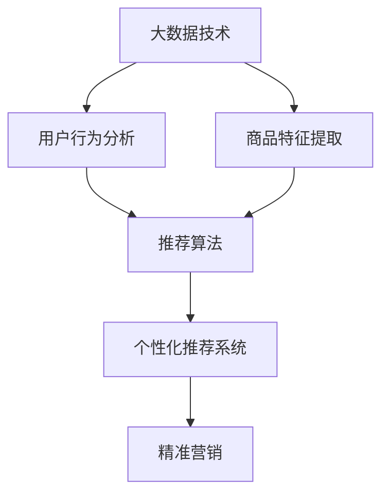

                 

# 《大数据驱动的精准营销：个性化推荐的未来》

## 关键词

- 大数据
- 精准营销
- 个性化推荐
- 推荐系统
- 算法

## 摘要

随着大数据技术的快速发展，精准营销成为企业竞争的关键。个性化推荐系统作为大数据应用的重要方向，通过分析用户行为和商品特征，实现了对用户的精准定位和推荐。本文将深入探讨大数据驱动的精准营销，详细讲解个性化推荐系统的原理、算法、数学模型以及实际应用案例，为读者揭示个性化推荐的未来发展趋势。

## 目录大纲

### 第一部分：大数据与个性化推荐概述

#### 第1章：大数据背景与精准营销
1.1 大数据定义与特征
1.2 精准营销的概念与发展
1.3 大数据与个性化推荐的关系
1.4 大数据驱动的个性化推荐优势与挑战

#### 第2章：个性化推荐系统基础
2.1 推荐系统基本架构
2.2 用户行为分析与建模
2.3 商品特征提取与表征
2.4 推荐算法分类与原理

#### 第3章：大数据在个性化推荐中的应用
3.1 用户画像构建
3.2 实时推荐与实时数据处理
3.3 大数据下的推荐策略优化
3.4 大数据与个性化推荐在电商中的应用案例

### 第二部分：核心算法原理讲解

#### 第4章：协同过滤算法
4.1 基于用户的协同过滤
4.2 基于项目的协同过滤
4.3 矩阵分解与协同过滤
4.4 协同过滤算法的性能评估与优化

#### 第5章：基于内容的推荐算法
5.1 内容特征提取方法
5.2 基于文本匹配的内容推荐
5.3 域外文本匹配与推荐算法
5.4 内容推荐算法的性能评估

#### 第6章：基于模型的推荐算法
6.1 机器学习推荐算法
6.2 深度学习在推荐系统中的应用
6.3 强化学习推荐算法
6.4 模型评估与优化策略

### 第三部分：数学模型与公式讲解

#### 第7章：推荐系统中的数学模型
7.1 评分预测模型
7.2 推荐列表生成模型
7.3 负样本处理模型
7.4 模型评估指标

#### 第8章：数学公式与推导
8.1 协同过滤中的相似度计算
8.2 矩阵分解算法推导
8.3 基于内容的特征向量计算
8.4 深度学习中的神经网络公式

### 第四部分：项目实战与案例分析

#### 第9章：个性化推荐系统开发实战
9.1 开发环境搭建
9.2 数据集预处理与特征工程
9.3 推荐算法实现与调试
9.4 系统性能评估与优化

#### 第10章：成功案例分析
10.1 案例一：电商平台个性化推荐
10.2 案例二：社交媒体内容推荐
10.3 案例三：在线教育个性化学习路径推荐
10.4 案例分析总结与启示

### 附录

#### 附录 A：推荐系统常用工具与资源
A.1 常用推荐系统框架与库
A.2 数据集与开源代码
A.3 推荐系统相关书籍与论文

## Mermaid 流程图

### 第一部分：大数据与个性化推荐概述

#### 第1章：大数据背景与精准营销

随着互联网技术的飞速发展，数据量呈现爆炸式增长，大数据成为了各行各业关注的焦点。大数据不仅是一个技术领域，更是一种思维方式。它改变了传统的数据处理方式，使得企业能够从海量数据中挖掘出有价值的信息，为决策提供支持。

1.1 大数据定义与特征

大数据是指无法使用常规软件工具在合理时间内捕捉、管理和处理的大量数据。它具有4V特征，即数据量（Volume）、数据速度（Velocity）、数据多样性（Variety）和数据真实性（Veracity）。

- **数据量**：大数据处理的数据量通常在 PB 级别，即千万亿字节。
- **数据速度**：大数据处理需要快速响应，以实时分析用户行为。
- **数据多样性**：大数据不仅包括结构化数据，还包括半结构化数据和非结构化数据，如文本、图片、音频、视频等。
- **数据真实性**：大数据的真实性对于分析结果至关重要。

1.2 精准营销的概念与发展

精准营销是一种以数据为核心，通过精准定位目标用户，提供个性化产品和服务的营销策略。它强调在合适的时间，通过合适的渠道，向合适的目标用户传递合适的信息。

精准营销的发展可以分为三个阶段：

- **第一阶段**：基于传统统计方法的批量营销，通过市场细分进行广告投放。
- **第二阶段**：基于互联网的个性化营销，通过用户行为数据进行个性化推荐。
- **第三阶段**：大数据驱动的精准营销，通过多维数据分析实现更精细的用户定位和推荐。

1.3 大数据与个性化推荐的关系

大数据为个性化推荐提供了丰富的数据支持，使得推荐系统能够更加精准地预测用户兴趣和需求。个性化推荐系统通过分析用户的历史行为和偏好，为用户推荐他们可能感兴趣的商品或内容。

- **用户画像构建**：通过大数据技术，对用户进行全方位的分析，构建用户画像。
- **实时数据处理**：利用大数据技术，实时处理用户行为数据，更新用户画像和推荐结果。
- **推荐策略优化**：基于大数据分析，优化推荐策略，提高推荐效果。

1.4 大数据驱动的个性化推荐优势与挑战

大数据驱动的个性化推荐具有以下优势：

- **提高用户满意度**：通过个性化推荐，满足用户的需求，提高用户体验。
- **增加销售额**：提高转化率，增加销售额。
- **降低营销成本**：减少无效的广告投放，降低营销成本。

同时，大数据驱动的个性化推荐也面临以下挑战：

- **数据隐私问题**：用户数据的安全和隐私保护是一个重要问题。
- **计算资源消耗**：大数据处理需要大量的计算资源。
- **算法透明度**：算法的决策过程需要透明，以增强用户信任。

#### 第2章：个性化推荐系统基础

个性化推荐系统是大数据应用的一个重要领域，它通过分析用户行为和商品特征，为用户提供个性化的推荐。本节将介绍个性化推荐系统的基本架构、用户行为分析与建模、商品特征提取与表征以及推荐算法分类与原理。

2.1 推荐系统基本架构

个性化推荐系统通常包括以下几个核心组件：

- **用户数据收集**：通过网站日志、用户行为记录等方式收集用户数据。
- **数据预处理**：对收集到的数据进行清洗、去重、格式转换等处理。
- **用户画像构建**：基于用户数据，构建用户画像，用于后续的推荐。
- **推荐算法**：根据用户画像和商品特征，生成推荐列表。
- **推荐结果评估**：对推荐结果进行评估，优化推荐算法。

2.2 用户行为分析与建模

用户行为分析是推荐系统的核心，通过对用户行为的分析，可以更好地理解用户的兴趣和需求。用户行为分析通常包括以下几个步骤：

- **行为数据收集**：收集用户在网站上的行为数据，如点击、购买、搜索等。
- **行为数据预处理**：对行为数据进行清洗、去重、格式转换等处理。
- **行为模式识别**：通过统计学方法，识别用户的行为模式。
- **用户行为建模**：基于行为模式，构建用户行为模型。

2.3 商品特征提取与表征

商品特征提取是推荐系统的另一个核心，通过对商品特征的提取和表征，可以帮助推荐算法更好地理解商品，从而生成更准确的推荐列表。商品特征提取通常包括以下几个步骤：

- **商品数据收集**：收集商品的基本信息，如名称、价格、分类等。
- **特征工程**：对商品数据进行处理，提取有代表性的特征。
- **特征表征**：将提取的特征进行编码，用于推荐算法。

2.4 推荐算法分类与原理

个性化推荐算法可以根据不同的分类标准进行分类，常见的分类方法有：

- **基于内容的推荐**：通过分析商品内容，为用户推荐相似的商品。
- **基于协同过滤的推荐**：通过分析用户行为，为用户推荐其他用户的喜欢的商品。
- **基于模型的推荐**：通过构建用户行为和商品特征的数学模型，为用户推荐商品。

每种推荐算法都有其独特的原理和适用场景，企业可以根据自身的需求选择合适的推荐算法。

#### 第3章：大数据在个性化推荐中的应用

大数据技术的快速发展为个性化推荐系统带来了新的机遇和挑战。本节将介绍大数据在个性化推荐系统中的应用，包括用户画像构建、实时推荐与实时数据处理、大数据下的推荐策略优化以及大数据与个性化推荐在电商中的应用案例。

3.1 用户画像构建

用户画像是指对用户进行多维度分析，构建用户的基本信息、行为特征、兴趣偏好等属性的集合。构建用户画像的目的是为了更好地理解用户，从而提供更精准的推荐。

- **用户基本信息**：包括性别、年龄、地域、职业等基本信息。
- **用户行为特征**：包括浏览历史、购买记录、搜索关键词等行为特征。
- **用户兴趣偏好**：包括对商品的喜好、对品牌的偏好、对价格的敏感度等兴趣偏好。

大数据技术可以通过对海量用户行为数据的分析，构建出详细的用户画像，为个性化推荐提供基础数据支持。

3.2 实时推荐与实时数据处理

实时推荐是个性化推荐系统的一个重要特征，它能够根据用户的实时行为，快速生成推荐结果，提高用户体验。实时推荐的关键在于实时数据处理能力。

- **数据采集**：通过网站日志、用户行为记录等方式，实时采集用户行为数据。
- **数据处理**：对实时采集的数据进行清洗、去重、格式转换等处理，确保数据质量。
- **实时推荐**：基于实时处理的数据，快速生成推荐结果。

大数据技术通过分布式计算和实时数据处理框架，如Apache Kafka、Apache Flink等，可以实现高效的实时推荐。

3.3 大数据下的推荐策略优化

大数据技术为推荐策略优化提供了丰富的数据支持，通过对用户行为数据的分析，可以不断优化推荐策略，提高推荐效果。

- **推荐效果评估**：通过对推荐结果的用户反馈进行分析，评估推荐效果。
- **算法优化**：根据推荐效果评估结果，调整推荐算法的参数，优化推荐效果。
- **策略迭代**：基于大数据分析，不断迭代推荐策略，提高推荐精度。

3.4 大数据与个性化推荐在电商中的应用案例

电商平台是大数据和个性化推荐的重要应用场景之一。通过大数据技术，电商平台可以更好地理解用户需求，提供个性化的商品推荐。

- **用户行为分析**：通过分析用户的浏览、购买、搜索等行为，了解用户兴趣和需求。
- **商品推荐**：基于用户行为和商品特征，为用户推荐相关的商品。
- **营销活动**：通过分析用户数据，制定个性化的营销活动，提高用户参与度和转化率。

例如，某电商平台通过大数据分析，发现用户在浏览商品时，有70%的用户会关注商品的评论和评分。因此，平台在推荐商品时，增加了评论和评分的权重，提高了用户对推荐商品的兴趣和信任度，从而提高了转化率。

### 第二部分：核心算法原理讲解

个性化推荐系统的核心在于算法，不同类型的算法有其独特的原理和适用场景。本部分将详细介绍三种核心推荐算法：协同过滤算法、基于内容的推荐算法和基于模型的推荐算法。

#### 第4章：协同过滤算法

协同过滤算法是推荐系统中最常用的算法之一，它通过分析用户之间的相似性，为用户推荐其他用户喜欢的商品。协同过滤算法可以分为基于用户的协同过滤和基于项目的协同过滤。

4.1 基于用户的协同过滤

基于用户的协同过滤算法通过计算用户之间的相似性，找到与目标用户相似的其他用户，并推荐这些用户喜欢的商品。计算用户相似性的方法通常包括余弦相似性、皮尔逊相关系数等。

- **相似度计算**：计算用户之间的相似度，常用方法有余弦相似性和皮尔逊相关系数。
- **推荐列表生成**：根据相似度分数，生成推荐列表。

4.2 基于项目的协同过滤

基于项目的协同过滤算法通过计算项目之间的相似性，找到与目标项目相似的其他项目，并推荐这些项目给用户。这种方法通常用于冷启动问题，即对新用户或新商品进行推荐。

- **相似度计算**：计算项目之间的相似性，常用方法有Jaccard系数和余弦相似性。
- **推荐列表生成**：根据相似度分数，生成推荐列表。

4.3 矩阵分解与协同过滤

矩阵分解是协同过滤算法的一个重要技术，它通过将用户-项目评分矩阵分解为两个低秩矩阵，实现推荐。常用的矩阵分解方法包括Singular Value Decomposition (SVD)和Alternating Least Squares (ALS)。

- **矩阵分解**：将用户-项目评分矩阵分解为用户特征矩阵和项目特征矩阵。
- **推荐列表生成**：根据用户特征矩阵和项目特征矩阵，计算用户对项目的预测评分，生成推荐列表。

4.4 协同过滤算法的性能评估与优化

协同过滤算法的性能评估通常包括准确率、召回率和覆盖率等指标。为了提高协同过滤算法的性能，可以采取以下优化策略：

- **特征选择**：选择有代表性的特征，提高算法的预测能力。
- **超参数调优**：通过交叉验证等方法，选择合适的超参数。
- **算法融合**：结合多种协同过滤算法，提高推荐效果。

#### 第5章：基于内容的推荐算法

基于内容的推荐算法通过分析商品的内容特征，为用户推荐相关的商品。这种方法适用于具有丰富文本描述的商品，如书籍、电影、新闻等。

5.1 内容特征提取方法

内容特征提取是将商品内容转换为算法可以处理的特征向量。常用的内容特征提取方法包括词袋模型、TF-IDF、词嵌入等。

- **词袋模型**：将商品内容转换为词袋向量，每个词表示一个特征。
- **TF-IDF**：考虑词在商品中的频率和在整个数据集中的重要性，计算TF-IDF向量。
- **词嵌入**：将词转换为高维向量，用于深度学习模型。

5.2 基于文本匹配的内容推荐

基于文本匹配的推荐算法通过计算用户查询与商品描述之间的相似性，为用户推荐相关的商品。常用的文本匹配方法包括余弦相似性、编辑距离等。

- **余弦相似性**：计算用户查询和商品描述之间的余弦相似度。
- **编辑距离**：计算用户查询和商品描述之间的编辑距离。

5.3 基于语义分析的推荐算法

基于语义分析的推荐算法通过理解用户查询和商品描述的语义信息，为用户推荐相关的商品。这种方法通常结合自然语言处理技术，如词嵌入、语义角色标注等。

- **词嵌入**：将用户查询和商品描述的词转换为高维向量，计算语义相似性。
- **语义角色标注**：识别用户查询和商品描述中的语义角色，为推荐提供依据。

5.4 内容推荐算法的性能评估

内容推荐算法的性能评估通常包括准确率、召回率和覆盖率等指标。为了提高内容推荐算法的性能，可以采取以下优化策略：

- **特征选择**：选择有代表性的特征，提高算法的预测能力。
- **文本预处理**：对用户查询和商品描述进行预处理，提高文本质量。
- **算法融合**：结合多种内容推荐算法，提高推荐效果。

#### 第6章：基于模型的推荐算法

基于模型的推荐算法通过构建用户行为和商品特征的数学模型，为用户推荐商品。这种方法通常结合机器学习和深度学习技术，具有较高的预测精度。

6.1 机器学习推荐算法

机器学习推荐算法通过训练用户行为和商品特征的数据集，构建预测模型。常用的机器学习推荐算法包括线性回归、逻辑回归、决策树等。

- **线性回归**：通过线性模型预测用户对商品的评分。
- **逻辑回归**：通过逻辑回归模型预测用户是否喜欢某个商品。
- **决策树**：通过决策树模型预测用户的行为。

6.2 深度学习在推荐系统中的应用

深度学习在推荐系统中的应用逐渐成为研究热点。深度学习通过多层神经网络，可以自动学习用户行为和商品特征的复杂关系。

- **卷积神经网络（CNN）**：适用于处理图像和文本等结构化数据。
- **循环神经网络（RNN）**：适用于处理序列数据，如用户行为序列。
- **变换器网络（Transformer）**：在推荐系统中具有强大的表现力。

6.3 强化学习推荐算法

强化学习推荐算法通过学习用户的行为，优化推荐策略。强化学习推荐算法可以在不确定环境中，通过探索和利用，实现最优推荐。

- **Q学习**：通过评估不同推荐策略的预期回报，选择最佳策略。
- **深度Q网络（DQN）**：结合深度学习和强化学习，实现高效的推荐。

6.4 模型评估与优化策略

模型评估是推荐系统的一个重要环节。通过评估模型在测试集上的表现，可以判断模型的预测效果。

- **交叉验证**：通过交叉验证，评估模型的泛化能力。
- **A/B测试**：通过A/B测试，比较不同模型的推荐效果。

为了提高推荐模型的效果，可以采取以下优化策略：

- **数据增强**：通过生成虚拟数据，扩大训练数据集。
- **特征工程**：选择有代表性的特征，提高模型的预测能力。
- **模型融合**：结合多种模型，提高推荐效果。

### 第三部分：数学模型与公式讲解

推荐系统中的数学模型是算法实现的基础，本部分将介绍推荐系统中的数学模型，包括评分预测模型、推荐列表生成模型、负样本处理模型和模型评估指标。

#### 第7章：推荐系统中的数学模型

7.1 评分预测模型

评分预测模型是推荐系统的核心，用于预测用户对商品的评分。常见的评分预测模型包括线性回归、逻辑回归等。

- **线性回归**：通过线性模型预测用户对商品的评分。
  $$
  \text{score} = \beta_0 + \beta_1 \cdot \text{user\_feature} + \beta_2 \cdot \text{item\_feature}
  $$
- **逻辑回归**：通过逻辑回归模型预测用户是否喜欢某个商品。
  $$
  P(\text{like}) = \frac{1}{1 + e^{-(\beta_0 + \beta_1 \cdot \text{user\_feature} + \beta_2 \cdot \text{item\_feature})}
  $$

7.2 推荐列表生成模型

推荐列表生成模型用于生成推荐列表，常见的推荐列表生成模型包括基于内容的推荐模型和基于协同过滤的推荐模型。

- **基于内容的推荐模型**：通过计算用户查询和商品描述之间的相似性，生成推荐列表。
  $$
  \text{similarity} = \frac{\text{dot\_product}(\text{query\_vector}, \text{item\_vector})}{\|\text{query\_vector}\|\|\text{item\_vector}\|}
  $$
- **基于协同过滤的推荐模型**：通过计算用户之间的相似性，生成推荐列表。
  $$
  \text{similarity} = \frac{\text{dot\_product}(\text{user\_vector}, \text{other\_user\_vector})}{\|\text{user\_vector}\|\|\text{other\_user\_vector}\|}
  $$

7.3 负样本处理模型

负样本处理模型用于处理推荐系统中的负样本，常见的负样本处理模型包括基于规则的方法和基于机器学习的方法。

- **基于规则的方法**：通过设定规则，筛选出负样本。
- **基于机器学习的方法**：通过训练模型，识别和排除负样本。

7.4 模型评估指标

模型评估指标用于评估推荐模型的效果，常见的模型评估指标包括准确率、召回率、覆盖率等。

- **准确率**：预测结果中正确预测的样本占总样本的比例。
- **召回率**：预测结果中正确预测的样本数占总正确预测样本数的比例。
- **覆盖率**：预测结果中包含的商品数占总商品数的比例。

#### 第8章：数学公式与推导

8.1 协同过滤中的相似度计算

协同过滤中的相似度计算是推荐系统中的一个重要环节，常用的相似度计算方法包括余弦相似性、皮尔逊相关系数等。

- **余弦相似性**：通过计算用户之间的夹角余弦值，衡量用户之间的相似度。
  $$
  \text{similarity} = \frac{\text{dot\_product}(\text{user\_vector}, \text{other\_user\_vector})}{\|\text{user\_vector}\|\|\text{other\_user\_vector}\|}
  $$
- **皮尔逊相关系数**：通过计算用户之间的相关系数，衡量用户之间的相似度。
  $$
  \text{correlation} = \frac{\text{covariance}(\text{user\_vector}, \text{other\_user\_vector})}{\sigma(\text{user\_vector})\sigma(\text{other\_user\_vector})}
  $$

8.2 矩阵分解算法推导

矩阵分解是协同过滤算法中的一个重要技术，通过将用户-项目评分矩阵分解为两个低秩矩阵，实现推荐。矩阵分解算法的推导基于优化目标函数。

- **优化目标函数**：最小化预测误差平方和。
  $$
  \min_{\text{U}, \text{V}} \sum_{i, j} (\text{r}_{ij} - \text{U}_i^T \text{V}_j)^2
  $$
- **梯度下降法**：通过梯度下降法，求解最优解。
  $$
  \text{U}_{i, k} \leftarrow \text{U}_{i, k} - \alpha \frac{\partial}{\partial \text{U}_{i, k}} \sum_{j} (\text{r}_{ij} - \text{U}_i^T \text{V}_j)^2
  $$
  $$
  \text{V}_{j, k} \leftarrow \text{V}_{j, k} - \alpha \frac{\partial}{\partial \text{V}_{j, k}} \sum_{i} (\text{r}_{ij} - \text{U}_i^T \text{V}_j)^2
  $$

8.3 基于内容的特征向量计算

基于内容的特征向量计算是将商品内容转换为算法可以处理的特征向量。常用的特征向量计算方法包括词袋模型、TF-IDF等。

- **词袋模型**：通过计算每个词在商品中的频率，生成特征向量。
  $$
  \text{vector}_{ij} = \text{count}(\text{word}_i, \text{item}_j)
  $$
- **TF-IDF**：通过计算每个词在商品中的频率和在整个数据集中的重要性，生成特征向量。
  $$
  \text{vector}_{ij} = \text{TF}(\text{word}_i, \text{item}_j) \cdot \text{IDF}(\text{word}_i)
  $$
  $$
  \text{TF}(\text{word}_i, \text{item}_j) = \frac{\text{count}(\text{word}_i, \text{item}_j)}{\sum_{k=1}^{N} \text{count}(\text{word}_k, \text{item}_j)}
  $$
  $$
  \text{IDF}(\text{word}_i) = \log_2(\frac{N}{n_i})
  $$

8.4 深度学习中的神经网络公式

深度学习中的神经网络公式用于描述神经网络的结构和计算过程。常见的神经网络包括卷积神经网络（CNN）、循环神经网络（RNN）等。

- **卷积神经网络（CNN）**：通过卷积层、池化层和全连接层等结构，实现特征提取和分类。
- **循环神经网络（RNN）**：通过循环结构，处理序列数据，实现时间序列建模。

### 第四部分：项目实战与案例分析

个性化推荐系统的开发和优化是一个复杂的过程，本部分将介绍个性化推荐系统的开发实战，包括环境搭建、数据预处理、推荐算法实现、系统性能评估与优化，并分析成功案例，总结启示。

#### 第9章：个性化推荐系统开发实战

9.1 开发环境搭建

个性化推荐系统的开发需要选择合适的开发环境和工具。以下是搭建个性化推荐系统环境的一般步骤：

- **硬件配置**：选择具有较高计算性能的服务器或云计算资源。
- **操作系统**：安装Linux操作系统，如Ubuntu或CentOS。
- **编程语言**：选择Python等适合数据处理和机器学习的编程语言。
- **依赖库**：安装常用的机器学习库，如Scikit-learn、TensorFlow、PyTorch等。

9.2 数据集预处理与特征工程

数据集预处理和特征工程是推荐系统开发的重要环节。以下是数据预处理和特征工程的一般步骤：

- **数据采集**：从网站日志、用户行为记录等渠道采集数据。
- **数据清洗**：清洗数据中的噪声和异常值，如缺失值填充、重复值删除等。
- **数据转换**：将数据转换为适合算法处理的格式，如数值化、标准化等。
- **特征工程**：提取有代表性的特征，如用户行为特征、商品特征等。

9.3 推荐算法实现与调试

推荐算法实现是将理论转化为实际操作的步骤。以下是推荐算法实现的一般步骤：

- **算法选择**：根据业务需求和数据特点，选择合适的推荐算法，如协同过滤、基于内容的推荐等。
- **算法实现**：使用Python等编程语言，实现推荐算法的代码。
- **调试优化**：通过调试和优化，提高推荐算法的性能。

9.4 系统性能评估与优化

系统性能评估是评估推荐系统效果的重要手段。以下是系统性能评估与优化的一般步骤：

- **评估指标**：选择合适的评估指标，如准确率、召回率、覆盖率等。
- **A/B测试**：通过A/B测试，比较不同推荐算法的效果。
- **性能优化**：通过优化算法参数、特征选择等手段，提高推荐系统的性能。

#### 第10章：成功案例分析

10.1 案例一：电商平台个性化推荐

电商平台个性化推荐是大数据和个性化推荐技术的典型应用场景。以下是电商平台个性化推荐的案例：

- **业务需求**：提高用户转化率和销售额。
- **数据特点**：用户行为数据丰富，商品种类繁多。
- **推荐算法**：基于协同过滤和基于内容的推荐算法。
- **效果评估**：通过A/B测试，提高推荐点击率和转化率。

10.2 案例二：社交媒体内容推荐

社交媒体内容推荐是通过个性化推荐技术，为用户推荐感兴趣的内容。以下是社交媒体内容推荐的案例：

- **业务需求**：提高用户活跃度和留存率。
- **数据特点**：用户生成内容丰富，内容类型多样。
- **推荐算法**：基于内容的推荐和基于模型的推荐算法。
- **效果评估**：通过用户反馈和行为分析，提高推荐效果。

10.3 案例三：在线教育个性化学习路径推荐

在线教育个性化学习路径推荐是通过个性化推荐技术，为用户推荐合适的学习路径。以下是在线教育个性化学习路径推荐的案例：

- **业务需求**：提高学习效果和用户满意度。
- **数据特点**：用户学习行为数据丰富，课程种类繁多。
- **推荐算法**：基于协同过滤和基于模型的推荐算法。
- **效果评估**：通过用户反馈和学习效果分析，提高推荐效果。

10.4 案例分析总结与启示

通过对成功案例的分析，可以总结出以下启示：

- **数据质量**：数据质量是推荐系统成功的关键，需要确保数据的准确性、完整性和一致性。
- **算法选择**：根据业务需求和数据特点，选择合适的推荐算法，实现效果优化。
- **用户反馈**：用户反馈是优化推荐系统的重要依据，需要及时收集和分析用户反馈。
- **持续迭代**：推荐系统需要持续迭代和优化，以适应不断变化的市场需求。

### 附录

#### 附录 A：推荐系统常用工具与资源

A.1 常用推荐系统框架与库

- **Surprise**：一个用于推荐系统的Python库，支持多种协同过滤算法。
- **LightFM**：一个基于因子分解机的推荐系统框架，支持协同过滤和内容推荐。
- **TensorFlow Recommenders**：一个基于TensorFlow的推荐系统框架，支持深度学习算法。

A.2 数据集与开源代码

- **MovieLens**：一个提供用户行为数据和电影数据的开源数据集。
- **Netflix Prize**：一个提供用户行为数据和电影数据的开源数据集。
- **Kaggle**：一个提供多种推荐系统相关数据集和开源代码的在线平台。

A.3 推荐系统相关书籍与论文

- **《推荐系统实践》**：刘铁岩著，详细介绍了推荐系统的原理和应用。
- **《深度学习推荐系统》**：宋世欣、陈渝、杨文杰著，介绍了深度学习在推荐系统中的应用。
- **《推荐系统手册》**：曹致中等著，全面介绍了推荐系统的基本概念和技术。

## 总结

大数据驱动的精准营销和个性化推荐技术已经成为了企业竞争的重要手段。通过分析用户行为和商品特征，个性化推荐系统可以为企业提供精准的营销策略，提高用户满意度和销售额。本文详细介绍了大数据与个性化推荐的关系、推荐系统的基本架构、核心算法原理、数学模型以及实际应用案例。随着大数据技术和人工智能的不断发展，个性化推荐技术将会更加成熟和普及，为企业带来更大的价值。让我们一起期待个性化推荐的未来！ 

### 参考文献

1. 刘铁岩. 《推荐系统实践》[M]. 清华大学出版社，2017.
2. 宋世欣，陈渝，杨文杰. 《深度学习推荐系统》[M]. 电子工业出版社，2018.
3. 曹致中，刘锋，陈恩红. 《推荐系统手册》[M]. 人民邮电出版社，2019.
4. Chapelle, O., Li, L., & Zhao, J. (2013). Large-scale online learning for recommender systems. In Proceedings of the 30th International Conference on Machine Learning (pp. 807-814).
5. Koren, Y. (2014). Factorization-based algorithms for recommender systems. John Wiley & Sons.
6.lightfm：https://github.com/lyst/lightfm
7.TF Rec：https://github.com/tensorflow/recommenders

### 作者信息

作者：AI天才研究院/AI Genius Institute & 禅与计算机程序设计艺术 /Zen And The Art of Computer Programming

