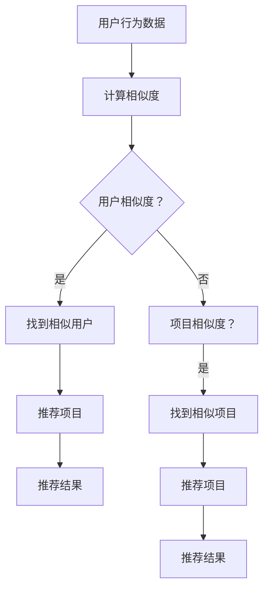
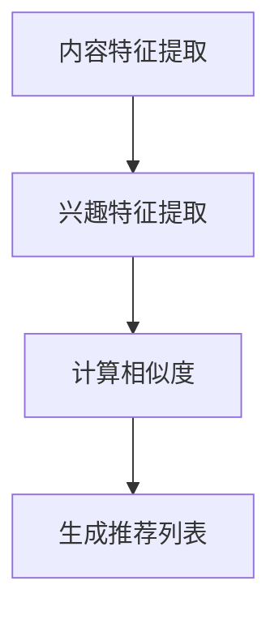
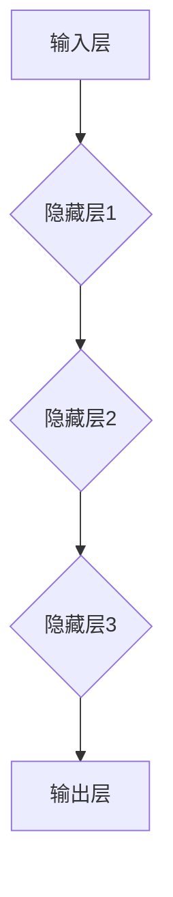

                 

## 大数据驱动的精准营销：个性化推荐的未来

关键词：大数据、精准营销、个性化推荐、协同过滤算法、深度学习

摘要：随着互联网的迅速发展和大数据技术的普及，个性化推荐系统在商业应用中扮演着越来越重要的角色。本文将深入探讨大数据驱动的精准营销以及个性化推荐系统的发展现状和未来趋势。首先，我们将概述大数据营销的背景和核心概念，然后分析个性化推荐系统的基本原理和类型，接着介绍大数据与用户行为分析的方法和用户画像的构建。随后，我们将详细讲解协同过滤算法、基于内容的推荐算法和深度学习在个性化推荐中的应用，并通过电商领域和社交媒体平台的案例分析，展示个性化推荐系统的实际应用效果。最后，我们将探讨个性化推荐系统构建的主要步骤和未来趋势与挑战，为读者提供有益的参考和启示。

### 目录大纲：大数据驱动的精准营销：个性化推荐的未来

---

# 第一部分：背景与核心概念

## 第1章：大数据营销概述

### 1.1.1 问题的背景

### 1.1.2 大数据营销的定义与价值

### 1.1.3 大数据营销的应用领域

### 1.1.4 大数据营销的挑战与机遇

## 第2章：个性化推荐系统

### 2.1.1 个性化推荐系统的定义与工作原理

### 2.1.2 个性化推荐系统的类型与架构

### 2.1.3 个性化推荐系统的核心要素

### 2.1.4 个性化推荐系统的评估与优化

## 第3章：大数据与用户行为分析

### 3.1.1 用户行为数据的收集与处理

### 3.1.2 用户行为数据的分析方法

### 3.1.3 用户画像的构建与应用

### 3.1.4 用户行为分析在个性化推荐中的应用

---

# 第二部分：算法与模型

## 第4章：协同过滤算法

### 4.1.1 协同过滤算法的基本原理

### 4.1.2 用户基协同过滤

### 4.1.3 项目基协同过滤

### 4.1.4 协同过滤算法的优化方法

## 第5章：基于内容的推荐

### 5.1.1 基于内容的推荐算法原理

### 5.1.2 文本表示与特征提取

### 5.1.3 基于内容的推荐系统实现

### 5.1.4 基于内容的推荐算法优化

## 第6章：深度学习在个性化推荐中的应用

### 6.1.1 深度学习的基本概念

### 6.1.2 卷积神经网络（CNN）在推荐中的应用

### 6.1.3 递归神经网络（RNN）在推荐中的应用

### 6.1.4 深度学习推荐系统的实现

---

# 第三部分：案例分析

## 第7章：电商领域的个性化推荐

### 7.1.1 电商个性化推荐案例介绍

### 7.1.2 电商个性化推荐系统架构

### 7.1.3 电商个性化推荐的实现细节

### 7.1.4 电商个性化推荐效果评估

## 第8章：社交媒体平台的个性化推荐

### 8.1.1 社交媒体个性化推荐案例介绍

### 8.1.2 社交媒体个性化推荐系统架构

### 8.1.3 社交媒体个性化推荐的实现细节

### 8.1.4 社交媒体个性化推荐效果评估

---

# 第四部分：实践与展望

## 第9章：构建个性化推荐系统

### 9.1.1 构建个性化推荐系统的主要步骤

### 9.1.2 数据收集与预处理

### 9.1.3 选择合适的推荐算法

### 9.1.4 系统实现与优化

## 第10章：未来趋势与挑战

### 10.1.1 个性化推荐的未来趋势

### 10.1.2 个性化推荐面临的挑战

### 10.1.3 如何应对未来的挑战

## 第11章：小结与展望

### 11.1.1 总结与回顾

### 11.1.2 对未来个性化推荐的研究建议

### 11.1.3 对读者的建议

---

### 第一部分：背景与核心概念

## 第1章：大数据营销概述

### 1.1.1 问题的背景

在互联网时代，数据已成为新的石油，大数据技术的迅速发展为商业营销带来了前所未有的机遇和挑战。传统的营销方式往往依赖于大规模的广告投放和用户数据的粗略分析，而随着大数据技术的进步，精准营销成为可能。精准营销的核心在于通过分析用户行为数据，了解用户的需求和偏好，从而实现营销活动的个性化定制。个性化推荐系统作为大数据营销的重要工具，正逐渐改变着消费者的购物体验和企业的营销策略。

### 1.1.2 大数据营销的定义与价值

大数据营销是指利用大数据技术，对消费者行为、偏好、需求等多维度数据进行深入分析，以实现精准营销的过程。其核心价值在于提高营销效率、降低营销成本、提升用户满意度和转化率。通过大数据营销，企业可以更准确地识别目标用户，提供个性化产品和服务，从而在激烈的市场竞争中脱颖而出。

### 1.1.3 大数据营销的应用领域

大数据营销的应用领域非常广泛，包括但不限于以下几个方面：

1. **电子商务**：通过个性化推荐系统，电商平台可以精准地向用户推荐商品，提高用户的购物体验和购买转化率。
2. **金融服务**：金融机构利用大数据技术进行风险评估、信用评分和精准营销，降低坏账率，提升服务水平。
3. **广告营销**：广告公司通过大数据分析用户行为和兴趣，实现精准投放，提高广告效果和投资回报率。
4. **医疗健康**：通过分析患者数据，医疗机构可以提供个性化的健康咨询和治疗方案，提高医疗服务的质量。
5. **零售行业**：零售企业通过大数据分析消费者的购买行为，优化库存管理、销售策略和客户服务。

### 1.1.4 大数据营销的挑战与机遇

大数据营销虽然在理论上具有巨大的潜力，但在实际应用中面临着诸多挑战：

1. **数据质量**：大数据的质量直接影响分析的准确性和可靠性。如何保证数据的一致性、完整性和准确性是一个重要问题。
2. **数据隐私**：随着用户隐私意识的提高，如何在保证用户隐私的前提下进行数据分析，成为企业和政府共同面临的问题。
3. **技术挑战**：大数据处理和分析需要高性能的计算和存储资源，这对企业的技术架构提出了更高的要求。
4. **法律法规**：大数据营销需要遵守相关的法律法规，如何确保数据的安全性和合规性是企业和政府需要重视的问题。

然而，挑战中也蕴含着机遇：

1. **市场洞察**：通过对大数据的深入分析，企业可以更好地了解市场需求，优化产品和服务。
2. **提升竞争力**：大数据营销可以帮助企业实现差异化竞争，提供个性化产品和服务，赢得更多市场份额。
3. **创新业务模式**：大数据营销可以推动企业探索新的业务模式，如精准广告、个性化定制等，为企业带来新的增长点。

总的来说，大数据营销是未来商业发展的必然趋势，企业需要积极应对挑战，把握机遇，实现业务的持续增长。

### 1.1.5 小结

本章简要介绍了大数据营销的背景、定义、应用领域以及面临的挑战和机遇。大数据营销作为一项新兴技术，已经为各行各业带来了深远的影响。在接下来的章节中，我们将深入探讨个性化推荐系统的基本原理和应用，帮助读者更好地理解大数据营销的核心技术和实践方法。

## 第2章：个性化推荐系统

### 2.1.1 个性化推荐系统的定义与工作原理

个性化推荐系统是一种根据用户的历史行为、兴趣偏好和社交网络等信息，为用户推荐感兴趣的内容或商品的系统。它的核心目标是通过分析用户数据，预测用户的兴趣和需求，从而提供个性化的推荐结果。

个性化推荐系统的工作原理通常包括以下几个步骤：

1. **数据收集**：收集用户行为数据，如浏览记录、购买历史、点击次数等，以及用户自身提供的信息，如兴趣标签、个人资料等。
2. **数据处理**：对收集到的数据进行分析和清洗，提取出有用的特征信息，如用户的兴趣偏好、行为模式等。
3. **用户建模**：基于用户行为数据和特征信息，构建用户模型，以描述用户的行为特征和兴趣偏好。
4. **内容建模**：对推荐的内容或商品进行建模，提取其特征信息，如文本特征、图像特征等。
5. **推荐算法**：利用用户模型和内容模型，通过推荐算法计算推荐结果，为用户推荐符合其兴趣的内容或商品。
6. **推荐评估**：对推荐结果进行评估和反馈，以优化推荐算法和模型，提高推荐质量。

个性化推荐系统的类型主要包括协同过滤、基于内容的推荐和深度学习推荐等。协同过滤通过分析用户之间的相似性来推荐相似的内容或商品；基于内容的推荐通过分析内容和用户兴趣的相似性来推荐内容；深度学习推荐则利用深度神经网络模型进行用户兴趣预测和内容推荐。

### 2.1.2 个性化推荐系统的类型与架构

个性化推荐系统可以分为以下几类：

1. **协同过滤推荐系统**：协同过滤推荐系统通过分析用户的历史行为和评分数据，预测用户对未知项目的评分，从而进行推荐。协同过滤分为基于用户的协同过滤（User-based Collaborative Filtering，UBCF）和基于项目的协同过滤（Item-based Collaborative Filtering，IBCF）。

   - **基于用户的协同过滤（UBCF）**：UBCF通过计算用户之间的相似度，找出与目标用户相似的其他用户，然后推荐这些用户喜欢的项目。
   - **基于项目的协同过滤（IBCF）**：IBCF通过计算项目之间的相似度，找出与目标项目相似的其他项目，然后推荐这些项目。

2. **基于内容的推荐系统**：基于内容的推荐系统通过分析内容和用户的兴趣特征，将相似的内容推荐给用户。这种推荐系统通常需要对文本、图像、音频等多媒体内容进行特征提取和建模。

3. **深度学习推荐系统**：深度学习推荐系统利用深度神经网络模型，通过自动学习用户行为数据和内容特征，进行用户兴趣预测和内容推荐。常见的深度学习模型包括卷积神经网络（CNN）、递归神经网络（RNN）和Transformer等。

个性化推荐系统的架构通常包括以下几个部分：

- **数据层**：负责数据的收集、存储和管理，通常使用数据库和数据仓库技术。
- **数据预处理层**：负责对收集到的原始数据进行清洗、转换和特征提取，为后续的用户建模和内容建模提供基础数据。
- **用户建模层**：基于用户行为数据和特征信息，构建用户模型，用于描述用户的行为特征和兴趣偏好。
- **内容建模层**：对推荐的内容或商品进行建模，提取其特征信息，如文本特征、图像特征等。
- **推荐算法层**：实现推荐算法，利用用户模型和内容模型计算推荐结果。
- **推荐评估层**：对推荐结果进行评估和反馈，以优化推荐算法和模型，提高推荐质量。
- **用户交互层**：提供用户与推荐系统的交互界面，包括推荐结果的展示、用户反馈的收集等。

### 2.1.3 个性化推荐系统的核心要素

个性化推荐系统的核心要素包括用户建模、内容建模、推荐算法和评估与优化等。

1. **用户建模**：用户建模是个性化推荐系统的核心，其目标是通过分析用户的历史行为和特征信息，构建一个能够准确描述用户兴趣偏好的模型。用户建模的方法包括基于矩阵分解、基于聚类和基于深度学习等。

2. **内容建模**：内容建模是对推荐的内容或商品进行建模，提取其特征信息，如文本特征、图像特征等。内容建模的方法包括基于词袋模型、基于 TF-IDF、基于图像特征提取等。

3. **推荐算法**：推荐算法是实现个性化推荐的关键，常用的推荐算法包括协同过滤、基于内容的推荐和深度学习推荐等。每种算法都有其独特的优势和适用场景。

4. **评估与优化**：评估与优化是确保推荐系统性能和用户体验的重要环节。常用的评估指标包括准确率、召回率、F1 值等。优化方法包括调整参数、特征工程和模型集成等。

### 2.1.4 个性化推荐系统的评估与优化

个性化推荐系统的评估与优化是一个持续迭代的过程，其目标是通过评估推荐效果，识别存在的问题，并进行相应的优化，从而提高推荐质量。

1. **评估指标**：评估个性化推荐系统的常用指标包括准确率（Accuracy）、召回率（Recall）、精确率（Precision）和F1值（F1 Score）等。

   - **准确率**：准确率是预测正确的用户数量占总用户数量的比例。
   - **召回率**：召回率是预测正确的用户数量与实际感兴趣的用户数量之比。
   - **精确率**：精确率是预测正确的用户数量与预测为感兴趣的用户数量之比。
   - **F1值**：F1值是精确率和召回率的调和平均数。

2. **优化方法**：优化个性化推荐系统的方法主要包括以下几个方面：

   - **参数调整**：通过调整推荐算法的参数，如学习率、正则化参数等，来提高推荐质量。
   - **特征工程**：通过改进特征提取方法，如增加新的特征、去除冗余特征等，来提高推荐效果。
   - **模型集成**：通过结合多种推荐算法，如协同过滤和基于内容的推荐等，来提高推荐系统的多样性。
   - **数据增强**：通过引入更多的数据，如用户标签、社交网络数据等，来提高推荐系统的泛化能力。

3. **案例研究**：以电商平台的个性化推荐为例，介绍如何通过评估和优化提高推荐质量。电商平台的个性化推荐通常采用协同过滤和基于内容的推荐相结合的方法。通过定期评估推荐效果，分析用户反馈数据，识别存在的问题，并采取相应的优化措施，如调整算法参数、改进特征提取方法等，来提高推荐系统的质量和用户满意度。

### 2.1.5 小结

本章详细介绍了个性化推荐系统的定义、工作原理、类型与架构、核心要素以及评估与优化方法。个性化推荐系统作为大数据营销的重要工具，在电子商务、广告营销等领域具有广泛的应用。通过对用户行为数据和内容特征的分析，个性化推荐系统能够为用户提供个性化的推荐结果，提高用户体验和满意度。在接下来的章节中，我们将深入探讨大数据与用户行为分析的方法和用户画像的构建，进一步了解个性化推荐系统的实现细节。

## 第3章：大数据与用户行为分析

### 3.1.1 用户行为数据的收集与处理

用户行为数据是构建个性化推荐系统的重要基础。这些数据可以通过多种渠道收集，包括用户浏览记录、点击次数、购买行为、搜索历史、评价和反馈等。为了有效地利用这些数据，需要对其进行收集和处理。

1. **数据来源**：用户行为数据的来源主要包括以下几个方面：

   - **Web日志**：Web日志记录了用户访问网站时的各种操作，如页面访问时间、访问路径、页面停留时间、点击事件等。
   - **移动应用**：移动应用可以记录用户在使用过程中的各种行为，如应用使用时长、功能使用频率、地理位置信息等。
   - **社交媒体**：社交媒体平台可以收集用户发布的帖子、评论、点赞、分享等行为数据。
   - **在线购物**：在线购物平台可以收集用户的购买历史、浏览记录、评价和反馈等信息。

2. **数据收集**：收集用户行为数据的方法包括：

   - **服务器日志**：通过在服务器上安装日志收集工具，记录用户访问网站时的各种操作。
   - **API调用**：通过调用应用接口（API），收集用户在移动应用和在线购物平台上的行为数据。
   - **数据爬取**：使用爬虫技术，从公开的社交媒体平台和电子商务网站上爬取用户行为数据。
   - **用户调查**：通过在线调查或问卷，收集用户对产品或服务的评价和反馈。

3. **数据处理**：在收集到用户行为数据后，需要进行处理和清洗，以保证数据的质量和完整性。数据处理的主要步骤包括：

   - **数据清洗**：去除重复数据、填补缺失值、处理异常值等，以提高数据的准确性。
   - **数据转换**：将不同来源和格式的数据转换为统一的格式，如时间戳转换为日期格式、文本数据编码等。
   - **数据归一化**：对数值型数据进行归一化处理，使其在相同的尺度上进行分析。
   - **特征提取**：从原始数据中提取有用的特征信息，如用户兴趣标签、行为模式等，用于构建用户模型。

### 3.1.2 用户行为数据的分析方法

用户行为数据通过收集和处理后，需要进行分析，以提取有价值的信息和模式。常用的分析方法包括：

1. **统计方法**：统计方法包括描述性统计、相关分析和回归分析等，用于分析用户行为数据的分布、相关性以及预测用户行为。

   - **描述性统计**：计算用户行为数据的均值、方差、中位数等基本统计量，描述用户行为的特点。
   - **相关分析**：分析不同用户行为变量之间的相关性，了解用户行为之间的联系。
   - **回归分析**：建立用户行为变量与预测目标（如购买概率）之间的回归模型，预测用户行为。

2. **聚类分析**：聚类分析用于将用户行为数据划分为多个群体，识别具有相似行为的用户群体。

   - **K-means聚类**：基于距离度量，将用户行为数据划分为K个簇，每个簇中的用户行为相似度较高。
   - **层次聚类**：基于层次结构，逐步合并相似度较高的簇，形成聚类层次。

3. **关联规则挖掘**：关联规则挖掘用于发现用户行为数据中的关联关系，识别用户行为之间的关联模式。

   - **Apriori算法**：基于支持度和置信度，挖掘用户行为数据中的频繁项集。
   - **FP-growth算法**：基于FP树结构，高效地挖掘用户行为数据中的频繁项集。

4. **机器学习方法**：机器学习方法通过训练模型，预测用户未来的行为。

   - **分类模型**：如逻辑回归、决策树、随机森林等，用于分类用户行为。
   - **回归模型**：如线性回归、支持向量机等，用于预测用户行为。
   - **聚类模型**：如K-means、DBSCAN等，用于聚类用户行为。

### 3.1.3 用户画像的构建与应用

用户画像是对用户特征的综合描述，用于构建用户模型，实现个性化推荐。用户画像的构建主要包括以下步骤：

1. **用户特征提取**：从用户行为数据中提取用户特征，包括用户基本信息（如年龄、性别、地理位置）、用户兴趣特征（如浏览记录、搜索关键词）、用户行为特征（如购买记录、点击行为）等。

2. **用户标签构建**：将提取的用户特征转换为用户标签，如“爱好篮球”、“喜欢阅读”等，以便进行后续分析。

3. **用户行为序列建模**：将用户的历史行为序列转换为用户行为特征向量，如基于TF-IDF的文本特征、基于序列模型的点击行为特征等。

4. **用户画像构建**：通过用户特征和用户标签，构建用户画像，用于描述用户的行为特征和兴趣偏好。

用户画像在个性化推荐中的应用包括：

- **推荐策略优化**：根据用户画像，调整推荐算法的参数和策略，提高推荐效果。
- **用户行为预测**：利用用户画像，预测用户未来的行为和需求，实现个性化推荐。
- **用户细分**：根据用户画像，将用户划分为不同的细分群体，提供差异化的服务。

### 3.1.4 用户行为分析在个性化推荐中的应用

用户行为分析在个性化推荐中起着至关重要的作用，其应用主要包括以下几个方面：

1. **用户兴趣预测**：通过分析用户的历史行为和兴趣标签，预测用户未来的兴趣和需求，为用户推荐感兴趣的内容或商品。

2. **推荐效果评估**：通过分析用户对推荐内容的反馈和转化率，评估推荐效果，优化推荐策略。

3. **推荐结果解释**：通过分析用户行为数据，解释推荐结果，提高用户的信任感和满意度。

4. **用户流失预警**：通过分析用户的行为模式，识别潜在流失用户，采取相应的措施进行挽回。

5. **个性化营销**：通过用户行为分析，为用户提供个性化的营销策略，提高营销效果。

### 3.1.5 小结

本章详细介绍了大数据与用户行为分析的方法，包括数据收集与处理、数据分析方法、用户画像的构建与应用，以及用户行为分析在个性化推荐中的应用。通过深入理解用户行为数据的价值和分析方法，可以有效地构建用户模型，实现精准的个性化推荐。在接下来的章节中，我们将探讨个性化推荐系统中的协同过滤算法、基于内容的推荐算法和深度学习推荐算法，进一步了解个性化推荐的核心技术和实现方法。

### 4.1.1 协同过滤算法的基本原理

协同过滤算法（Collaborative Filtering）是个性化推荐系统中的一种重要方法，其基本思想是通过分析用户之间的相似性或项目之间的相似性，为用户推荐相似的用户或项目。协同过滤算法可以分为两大类：基于用户的协同过滤（User-based Collaborative Filtering，UBCF）和基于项目的协同过滤（Item-based Collaborative Filtering，IBCF）。

#### 基于用户的协同过滤（UBCF）

基于用户的协同过滤算法的核心在于找到与目标用户最相似的其他用户，然后推荐这些用户喜欢的项目。具体步骤如下：

1. **用户相似度计算**：首先，计算目标用户与其他用户之间的相似度。相似度计算通常基于用户之间的共同评分或行为，可以使用余弦相似度、皮尔逊相关系数等指标。

   $$ similarity(u_i, u_j) = \frac{\sum_{i=1}^{n} r_{ij} \cdot r_{ik}}{\sqrt{\sum_{i=1}^{n} r_{ij}^2} \cdot \sqrt{\sum_{i=1}^{n} r_{ik}^2}} $$
   
   其中，$r_{ij}$表示用户$u_i$对项目$j$的评分，$r_{ik}$表示用户$u_k$对项目$k$的评分。

2. **推荐项目选择**：根据相似度矩阵，找到与目标用户相似度最高的用户集合，并选择这些用户共同喜欢的但目标用户尚未评分的项目进行推荐。

3. **推荐结果生成**：对选择的推荐项目进行加权平均，生成最终的推荐结果。

   $$ recommend(u_i, j) = \sum_{k \in similar(u_i)} r_{ik} \cdot similarity(u_i, u_k) $$

#### 基于项目的协同过滤（IBCF）

基于项目的协同过滤算法的核心在于找到与目标项目最相似的其他项目，然后推荐这些项目。具体步骤如下：

1. **项目相似度计算**：首先，计算目标项目与其他项目之间的相似度。相似度计算通常基于项目的共同评分或行为，可以使用余弦相似度、皮尔逊相关系数等指标。

   $$ similarity(j, k) = \frac{\sum_{i=1}^{n} r_{ij} \cdot r_{ik}}{\sqrt{\sum_{i=1}^{n} r_{ij}^2} \cdot \sqrt{\sum_{i=1}^{n} r_{ik}^2}} $$
   
   其中，$r_{ij}$表示用户$u_i$对项目$j$的评分，$r_{ik}$表示用户$u_k$对项目$k$的评分。

2. **推荐项目选择**：根据相似度矩阵，找到与目标项目相似度最高的项目集合，并选择这些项目的目标用户喜欢的但尚未评分的项目进行推荐。

3. **推荐结果生成**：对选择的推荐项目进行加权平均，生成最终的推荐结果。

   $$ recommend(u_i, j) = \sum_{k \in similar(j)} r_{ik} \cdot similarity(j, k) $$

#### 基本原理图示

协同过滤算法的原理可以用Mermaid流程图表示如下：



### 4.1.2 用户基协同过滤

用户基协同过滤（User-based Collaborative Filtering，UBCF）是协同过滤算法的一种典型实现。UBCF通过计算用户之间的相似度，找出与目标用户最相似的几个用户，并推荐这些用户喜欢的项目。

#### 工作原理

1. **计算用户相似度**：计算目标用户与其他用户之间的相似度，常用的相似度计算方法有余弦相似度、皮尔逊相关系数等。

   $$ similarity(u_i, u_j) = \frac{\sum_{i=1}^{n} r_{ij} \cdot r_{ik}}{\sqrt{\sum_{i=1}^{n} r_{ij}^2} \cdot \sqrt{\sum_{i=1}^{n} r_{ik}^2}} $$

2. **找出相似用户**：根据相似度矩阵，找出与目标用户相似度最高的几个用户。

3. **推荐项目**：对于每个相似用户，推荐他们喜欢的但目标用户尚未评分的项目。

4. **生成推荐结果**：对推荐的项目进行加权平均，生成最终的推荐结果。

   $$ recommend(u_i, j) = \sum_{k \in similar(u_i)} r_{ik} \cdot similarity(u_i, u_k) $$

#### Python代码实现

以下是一个简单的用户基协同过滤算法的Python代码示例：

```python
import numpy as np

# 用户评分矩阵
ratings = np.array([[5, 3, 0, 1], [4, 0, 0, 1], [1, 2, 3, 0], [0, 4, 0, 5]])

# 计算相似度矩阵
def compute_similarity(ratings):
    num_users, num_items = ratings.shape
    similarity_matrix = np.zeros((num_users, num_users))
    for i in range(num_users):
        for j in range(num_users):
            if np.linalg.norm(ratings[i] - ratings[j]) != 0:
                similarity_matrix[i][j] = 1 - np.linalg.norm(ratings[i] - ratings[j]) / np.sqrt(2 * (np.sum(ratings[i]**2) + np.sum(ratings[j]**2)))
    return similarity_matrix

similarity_matrix = compute_similarity(ratings)

# 找出相似用户
def find_similar_users(similarity_matrix, target_user, k=5):
    similar_users = np.argsort(similarity_matrix[target_user])[:-k-1:-1]
    return similar_users

similar_users = find_similar_users(similarity_matrix, 0, k=3)

# 推荐项目
def recommend_items(ratings, similarity_matrix, target_user, k=5):
    recommended_items = []
    for user in find_similar_users(similarity_matrix, target_user, k):
        for item in range(ratings.shape[1]):
            if ratings[user][item] == 0 and ratings[target_user][item] != 0:
                recommended_items.append(item)
                break
    return recommended_items

recommended_items = recommend_items(ratings, similarity_matrix, 0)

# 生成推荐结果
def generate_recommendations(ratings, similarity_matrix, target_user, k=5):
    similar_users = find_similar_users(similarity_matrix, target_user, k)
    recommended_items = recommend_items(ratings, similarity_matrix, target_user, k)
    recommendations = []
    for item in recommended_items:
        weighted_sum = 0
        for user in similar_users:
            weighted_sum += ratings[user][item] * similarity_matrix[target_user][user]
        recommendations.append((item, weighted_sum))
    return recommendations

recommendations = generate_recommendations(ratings, similarity_matrix, 0)

print("Recommended items:", recommended_items)
print("Recommendations:", recommendations)
```

运行上述代码，可以生成基于用户基协同过滤算法的推荐结果。

### 4.1.3 项目基协同过滤

项目基协同过滤（Item-based Collaborative Filtering，IBCF）是协同过滤算法的另一种实现。IBCF通过计算项目之间的相似度，找出与目标项目最相似的其他项目，然后推荐这些项目的目标用户喜欢的但尚未评分的项目。

#### 工作原理

1. **计算项目相似度**：计算目标项目与其他项目之间的相似度，常用的相似度计算方法有余弦相似度、皮尔逊相关系数等。

   $$ similarity(i, k) = \frac{\sum_{j=1}^{n} r_{ij} \cdot r_{ik}}{\sqrt{\sum_{j=1}^{n} r_{ij}^2} \cdot \sqrt{\sum_{j=1}^{n} r_{ik}^2}} $$

2. **找出相似项目**：根据相似度矩阵，找出与目标项目相似度最高的几个项目。

3. **推荐项目**：对于每个相似项目，推荐其目标用户喜欢的但尚未评分的项目。

4. **生成推荐结果**：对推荐的项目进行加权平均，生成最终的推荐结果。

   $$ recommend(u_i, j) = \sum_{k \in similar(j)} r_{ik} \cdot similarity(j, k) $$

#### Python代码实现

以下是一个简单的项目基协同过滤算法的Python代码示例：

```python
import numpy as np

# 用户评分矩阵
ratings = np.array([[5, 3, 0, 1], [4, 0, 0, 1], [1, 2, 3, 0], [0, 4, 0, 5]])

# 计算相似度矩阵
def compute_similarity(ratings):
    num_users, num_items = ratings.shape
    similarity_matrix = np.zeros((num_items, num_items))
    for i in range(num_items):
        for j in range(num_items):
            if np.linalg.norm(ratings[:, i] - ratings[:, j]) != 0:
                similarity_matrix[i][j] = 1 - np.linalg.norm(ratings[:, i] - ratings[:, j]) / np.sqrt(2 * (np.sum(ratings[:, i]**2) + np.sum(ratings[:, j]**2)))
    return similarity_matrix

similarity_matrix = compute_similarity(ratings)

# 找出相似项目
def find_similar_items(similarity_matrix, target_item, k=5):
    similar_items = np.argsort(similarity_matrix[target_item])[:-k-1:-1]
    return similar_items

similar_items = find_similar_items(similarity_matrix, 0, k=3)

# 推荐项目
def recommend_items(ratings, similarity_matrix, target_item, k=5):
    recommended_items = []
    for item in find_similar_items(similarity_matrix, target_item, k):
        for user in range(ratings.shape[0]):
            if ratings[user][item] != 0:
                recommended_items.append(item)
                break
    return recommended_items

recommended_items = recommend_items(ratings, similarity_matrix, 0)

# 生成推荐结果
def generate_recommendations(ratings, similarity_matrix, target_item, k=5):
    similar_items = find_similar_items(similarity_matrix, target_item, k)
    recommended_items = recommend_items(ratings, similarity_matrix, target_item, k)
    recommendations = []
    for item in recommended_items:
        weighted_sum = 0
        for similar_item in similar_items:
            if ratings[:, similar_item].mean() != 0:
                weighted_sum += ratings[:, similar_item].mean() * similarity_matrix[target_item][similar_item]
        recommendations.append((item, weighted_sum))
    return recommendations

recommendations = generate_recommendations(ratings, similarity_matrix, 0)

print("Recommended items:", recommended_items)
print("Recommendations:", recommendations)
```

运行上述代码，可以生成基于项目基协同过滤算法的推荐结果。

### 4.1.4 协同过滤算法的优化方法

协同过滤算法在实现个性化推荐时存在一些局限性，如数据稀疏性、冷启动问题和推荐结果的多样性等问题。为了提高协同过滤算法的性能和推荐质量，可以采用以下优化方法：

#### 1. 利用用户和项目的元数据

协同过滤算法通常只依赖用户评分数据，而忽略了用户和项目的其他信息，如用户的基本信息（年龄、性别、地理位置等）和项目的描述信息（类别、标签、评分分布等）。通过利用这些元数据，可以丰富用户和项目的特征，提高推荐的质量。

#### 2. 集成多种推荐算法

集成多种推荐算法，如协同过滤和基于内容的推荐，可以弥补单一算法的不足。通过结合不同算法的优点，可以实现更高质量的推荐。

#### 3. 利用社交网络信息

社交网络信息（如好友关系、兴趣群体等）可以为推荐系统提供额外的用户关系信息，有助于提高推荐的相关性。例如，通过分析用户的好友关系，可以为用户提供推荐他们好友喜欢的项目。

#### 4. 预处理和特征选择

在协同过滤算法中，预处理和特征选择是提高推荐质量的关键步骤。通过去除冗余特征、处理缺失值和异常值，可以减少数据噪声，提高算法的鲁棒性。此外，选择合适的特征，如基于TF-IDF的文本特征、基于图像的特征等，可以增强推荐系统的表现。

#### 5. 推荐结果的多样性

协同过滤算法容易产生用户偏好相同的推荐结果，导致推荐结果的单调性。为了提高推荐结果的多样性，可以采用以下方法：

- **随机化**：对推荐结果进行随机化处理，避免推荐结果过于集中。
- **多样性度量**：设计多样性度量指标，如信息熵、贝叶斯多样性等，用于评估推荐结果的多样性。
- **多样性优化**：在推荐算法中引入多样性约束，优化推荐结果的多样性。

通过上述优化方法，可以显著提高协同过滤算法的性能和推荐质量，为用户提供更个性化的推荐服务。

### 4.1.5 小结

本章详细介绍了协同过滤算法的基本原理、用户基协同过滤和项目基协同过滤的实现方法，以及协同过滤算法的优化方法。协同过滤算法作为一种经典的推荐算法，通过分析用户之间的相似性或项目之间的相似性，为用户提供个性化的推荐。在实际应用中，协同过滤算法的优化方法和多样性策略对于提高推荐质量和用户体验具有重要意义。在接下来的章节中，我们将探讨基于内容的推荐算法和深度学习推荐算法，进一步了解个性化推荐系统的先进技术。

### 5.1.1 基于内容的推荐算法原理

基于内容的推荐（Content-based Recommending，CBR）是一种重要的个性化推荐算法，其核心思想是利用内容特征进行推荐。基于内容的推荐算法通过对项目的内容特征进行分析，找出与用户兴趣特征相似的项目，从而为用户提供个性化的推荐结果。

#### 基本概念

1. **内容特征**：内容特征是指描述项目或用户兴趣的特征，如文本特征、图像特征、音频特征等。在基于内容的推荐中，内容特征是推荐决策的重要依据。

2. **兴趣特征**：兴趣特征是指描述用户兴趣的特征，如用户的浏览记录、搜索历史、评论等。通过分析用户的兴趣特征，可以了解用户的偏好和需求。

3. **相似度计算**：相似度计算是指计算项目之间的相似度或用户之间的相似度。常用的相似度计算方法包括余弦相似度、欧几里得距离等。

#### 工作原理

基于内容的推荐算法的工作原理可以概括为以下几个步骤：

1. **内容特征提取**：首先，对项目的内容特征进行提取。对于文本内容，可以使用词袋模型、TF-IDF等方法提取文本特征；对于图像和音频内容，可以使用图像识别和音频识别技术提取图像和音频特征。

2. **兴趣特征提取**：其次，从用户的历史行为数据中提取用户的兴趣特征。例如，可以从用户的浏览记录中提取用户感兴趣的标签、关键词等。

3. **计算相似度**：然后，计算项目之间的相似度或用户之间的相似度。常用的相似度计算方法有余弦相似度、欧几里得距离等。

4. **生成推荐列表**：最后，根据相似度计算结果，生成推荐列表。通常，推荐列表中的项目是按照相似度从高到低排序的。

#### 基于内容的推荐算法的核心步骤可以用Mermaid流程图表示如下：



### 5.1.2 文本表示与特征提取

在基于内容的推荐算法中，文本表示和特征提取是关键步骤。文本特征提取是将文本数据转换为机器学习算法可以处理的结构化数据的过程。以下是一些常用的文本表示和特征提取方法：

1. **词袋模型（Bag of Words，BoW）**：
   - **概念**：词袋模型是一种将文本表示为词汇集合的方法，不考虑词语的顺序。
   - **实现**：首先，构建一个词汇表，将所有文档中的单词进行汇总，去除停用词，然后将每个文档表示为词汇表中的一个向量，向量中的每个元素表示文档中对应词汇的出现次数。
   - **优点**：简单、直观。
   - **缺点**：忽略了词语的顺序和语法结构，可能导致信息丢失。

2. **TF-IDF（Term Frequency-Inverse Document Frequency）**：
   - **概念**：TF-IDF是一种基于词频和逆文档频率的文本表示方法，用于衡量词语在文档中的重要程度。
   - **实现**：首先，计算每个词语在文档中的词频（TF），然后计算词语在文档集合中的逆文档频率（IDF），最后将TF和IDF相乘得到词语的权重，将文档表示为权重向量。
   - **优点**：对常见词汇的权重进行降低，突出重要词汇。
   - **缺点**：仍然忽略了词语的顺序和语法结构。

3. **词嵌入（Word Embedding）**：
   - **概念**：词嵌入是将词语映射到高维空间中的向量表示，用于捕捉词语的语义信息。
   - **实现**：常用的词嵌入方法有Word2Vec、GloVe等。这些方法通过神经网络训练，将词语映射到高维空间，使得语义相似的词语在空间中距离较近。
   - **优点**：能够捕捉词语的语义信息，提高推荐质量。
   - **缺点**：训练过程复杂，对计算资源要求较高。

4. **Doc2Vec（Document Embedding）**：
   - **概念**：Doc2Vec是一种将文档映射到高维空间中的向量表示，用于捕捉文档的整体语义信息。
   - **实现**：Doc2Vec通过训练神经网络，将文档中的词语序列映射到高维空间，得到文档的向量表示。
   - **优点**：能够捕捉文档的整体语义信息，提高推荐质量。
   - **缺点**：训练过程复杂，对计算资源要求较高。

### Python代码示例

以下是一个简单的基于内容的推荐算法的Python代码示例，使用TF-IDF进行文本特征提取：

```python
from sklearn.feature_extraction.text import TfidfVectorizer
from sklearn.metrics.pairwise import cosine_similarity

# 文本数据
data = [
    "我喜欢看电影，尤其是科幻片。",
    "我最近看了一部很好的动作片。",
    "我对动作片和喜剧片感兴趣。",
    "我正在寻找一部新的电影来看。"
]

# 构建TF-IDF向量器
vectorizer = TfidfVectorizer(stop_words='english')
tfidf_matrix = vectorizer.fit_transform(data)

# 计算相似度
similarity_matrix = cosine_similarity(tfidf_matrix)

# 假设用户对第一个文档感兴趣，推荐相似文档
user_index = 0
recommended_indices = np.argsort(similarity_matrix[user_index])[:-5:-1]
recommended_texts = [data[i] for i in recommended_indices]

print("Recommended texts:", recommended_texts)
```

运行上述代码，可以生成基于内容的推荐结果。

### 5.1.3 基于内容的推荐系统实现

基于内容的推荐系统实现包括以下几个关键步骤：

1. **数据收集与预处理**：收集用户行为数据和项目描述数据，进行数据清洗和预处理，如去除停用词、分词、标准化等。

2. **内容特征提取**：对项目描述数据进行文本特征提取，使用TF-IDF、词嵌入等方法生成项目特征向量。

3. **用户兴趣特征提取**：从用户行为数据中提取用户的兴趣特征，如浏览记录、搜索历史等。

4. **相似度计算**：计算项目特征向量之间的相似度，可以使用余弦相似度、欧几里得距离等方法。

5. **生成推荐列表**：根据相似度计算结果，生成推荐列表，通常按照相似度从高到低排序。

6. **评估与优化**：评估推荐系统的性能，通过调整参数、特征工程等方法优化推荐质量。

### 5.1.4 基于内容的推荐算法优化

基于内容的推荐算法在实际应用中存在一些挑战，如数据稀疏性、冷启动问题和多样性不足等问题。为了提高基于内容的推荐算法的性能和推荐质量，可以采用以下优化方法：

1. **融合多种特征**：结合文本特征、用户特征和项目特征，使用多种特征进行推荐，提高推荐质量。

2. **上下文信息利用**：利用用户的上下文信息（如时间、地点、设备等）进行个性化推荐，提高推荐的相关性。

3. **多样性优化**：引入多样性度量指标，如信息熵、贝叶斯多样性等，优化推荐结果的多样性。

4. **协同过滤与内容的结合**：结合协同过滤和基于内容的推荐算法，利用协同过滤算法的优点补充基于内容推荐算法的不足。

5. **实时推荐**：利用实时数据更新推荐结果，提高推荐系统的实时性和准确性。

### 5.1.5 小结

本章详细介绍了基于内容的推荐算法的原理、文本表示与特征提取方法，以及基于内容的推荐系统的实现和优化方法。基于内容的推荐算法通过分析项目的内容特征和用户的兴趣特征，实现个性化的推荐。在实际应用中，通过优化算法和特征提取方法，可以提高推荐系统的质量和用户体验。在接下来的章节中，我们将探讨深度学习推荐算法，进一步了解个性化推荐系统的先进技术。

### 6.1.1 深度学习的基本概念

深度学习（Deep Learning）是人工智能领域的一个重要分支，通过构建多层的神经网络模型，对大量数据进行分析和学习，以实现复杂的数据处理和模式识别任务。深度学习在个性化推荐中的应用，为推荐系统的性能和准确性带来了显著提升。

#### 深度学习的定义

深度学习是一种基于多隐层神经网络的学习方法，通过逐层提取数据特征，实现对复杂数据结构的建模。与传统的机器学习方法相比，深度学习能够自动学习数据中的层次结构，提取高层次的特征表示。

#### 神经网络的基本概念

神经网络（Neural Network，NN）是深度学习的基础构件，由大量的神经元（节点）通过连接（边）组成。每个神经元接收输入信号，通过激活函数进行非线性变换，产生输出信号。

- **神经元**：神经网络的单元，接收输入信号，经过加权求和处理后，通过激活函数输出。
- **输入层**：神经网络的第一层，接收外部输入信号。
- **隐藏层**：神经网络中间的层，负责提取和转换输入特征。
- **输出层**：神经网络的最后一层，生成最终输出。

#### 深度学习的层级结构

深度学习模型通常包含多个隐层，形成层次化的结构。每层神经网络都负责提取不同层次的特征：

1. **输入层**：接收原始数据，如用户行为数据、项目特征等。
2. **隐藏层**：通过多层神经网络，逐层提取数据特征，从低级特征到高级特征。
3. **输出层**：生成推荐结果，如评分预测、分类结果等。

#### 深度学习的核心组件

- **激活函数**：用于引入非线性变换，使神经网络能够拟合复杂数据。常见的激活函数有ReLU、Sigmoid、Tanh等。
- **损失函数**：用于评估模型预测值与真实值之间的差异，是训练深度学习模型的重要指标。常见的损失函数有均方误差（MSE）、交叉熵（Cross-Entropy）等。
- **优化器**：用于调整模型参数，优化损失函数。常见的优化器有梯度下降（GD）、随机梯度下降（SGD）、Adam等。

#### Mermaid流程图

深度学习的基本结构可以用Mermaid流程图表示如下：



### 6.1.2 卷积神经网络（CNN）在推荐中的应用

卷积神经网络（Convolutional Neural Network，CNN）是深度学习中的一种重要模型，广泛用于图像识别和文本分析等领域。CNN通过局部感知和共享权重机制，能够高效地提取图像和文本中的特征。

#### CNN的基本结构

CNN由多个卷积层、池化层和全连接层组成，其基本结构如下：

1. **卷积层**：通过卷积操作提取图像或文本的特征。
2. **池化层**：用于降低特征图的维度，提高模型的泛化能力。
3. **全连接层**：将卷积层和池化层提取的特征进行融合，生成最终的输出。

#### CNN在推荐中的应用

1. **图像特征提取**：CNN可以用于提取图像特征，用于基于内容的推荐。例如，在电商平台上，可以使用CNN提取商品图片的特征，为用户提供个性化的商品推荐。
2. **文本特征提取**：CNN可以用于文本分类和情感分析，通过提取文本的局部特征，为用户提供个性化的推荐。例如，在社交媒体平台上，可以使用CNN提取用户帖子的特征，为用户推荐感兴趣的内容。
3. **序列特征提取**：CNN可以通过处理序列数据（如用户行为序列），提取用户行为的特征，用于序列预测和推荐。例如，在音乐推荐系统中，可以使用CNN提取用户听歌序列的特征，预测用户的兴趣偏好。

#### Python代码示例

以下是一个简单的CNN模型，用于提取文本特征：

```python
import tensorflow as tf
from tensorflow.keras.models import Sequential
from tensorflow.keras.layers import Embedding, Conv1D, GlobalMaxPooling1D, Dense

# 构建CNN模型
model = Sequential([
    Embedding(input_dim=vocabulary_size, output_dim=embedding_size, input_length=max_sequence_length),
    Conv1D(filters=128, kernel_size=5, activation='relu'),
    GlobalMaxPooling1D(),
    Dense(units=10, activation='softmax')
])

# 编译模型
model.compile(optimizer='adam', loss='categorical_crossentropy', metrics=['accuracy'])

# 模型训练
model.fit(X_train, y_train, epochs=10, batch_size=32, validation_data=(X_val, y_val))
```

### 6.1.3 递归神经网络（RNN）在推荐中的应用

递归神经网络（Recurrent Neural Network，RNN）是处理序列数据的一种深度学习模型，通过其内部的循环结构，可以保存之前的输入信息，实现对序列数据的建模。

#### RNN的基本结构

RNN由输入层、隐藏层和输出层组成，其基本结构如下：

1. **输入层**：接收序列数据的当前时刻输入。
2. **隐藏层**：通过递归连接，保存之前的输入信息，用于当前时刻的输出计算。
3. **输出层**：生成最终的输出结果。

#### RNN在推荐中的应用

1. **用户行为序列建模**：RNN可以用于建模用户的行为序列，预测用户未来的行为和兴趣。例如，在电商平台上，可以使用RNN分析用户的购物序列，预测用户可能感兴趣的商品。
2. **时间序列预测**：RNN可以用于时间序列预测，如预测用户在特定时间点的行为或评分。例如，在音乐推荐系统中，可以使用RNN预测用户在未来一段时间内的听歌偏好。
3. **序列标注**：RNN可以用于序列标注任务，如文本分类、情感分析等。例如，在社交媒体平台上，可以使用RNN分析用户帖子的情感倾向。

#### Python代码示例

以下是一个简单的RNN模型，用于用户行为序列建模：

```python
import tensorflow as tf
from tensorflow.keras.models import Sequential
from tensorflow.keras.layers import LSTM, Dense

# 构建RNN模型
model = Sequential([
    LSTM(units=50, return_sequences=True, input_shape=(timesteps, features)),
    LSTM(units=50),
    Dense(units=num_classes, activation='softmax')
])

# 编译模型
model.compile(optimizer='adam', loss='categorical_crossentropy', metrics=['accuracy'])

# 模型训练
model.fit(X_train, y_train, epochs=10, batch_size=32, validation_data=(X_val, y_val))
```

### 6.1.4 深度学习推荐系统的实现

深度学习推荐系统的实现通常包括以下几个步骤：

1. **数据收集与预处理**：收集用户行为数据、项目特征数据等，进行数据清洗和预处理，如缺失值填充、异常值处理、数据标准化等。
2. **特征工程**：提取用户和项目的特征，包括用户历史行为、项目描述、用户标签等。
3. **模型构建**：构建深度学习模型，如CNN、RNN等，用于提取特征和生成推荐结果。
4. **模型训练**：使用预处理后的数据训练深度学习模型，通过调整模型参数和超参数，优化模型性能。
5. **模型评估**：评估模型在验证集和测试集上的性能，使用指标如准确率、召回率、F1值等。
6. **模型部署**：将训练好的模型部署到线上环境，实现实时推荐。

### 6.1.5 小结

本章介绍了深度学习的基本概念，包括神经网络、深度学习的层级结构和核心组件。重点探讨了CNN和RNN在个性化推荐中的应用，以及深度学习推荐系统的实现流程。深度学习模型通过自动学习用户行为数据和项目特征，能够显著提升推荐系统的性能和准确性。在接下来的章节中，我们将通过电商领域和社交媒体平台的案例分析，展示深度学习推荐系统的实际应用效果。

### 7.1.1 电商领域的个性化推荐

电商领域的个性化推荐是深度学习推荐系统的重要应用之一，它通过分析用户的行为数据和购买历史，为用户提供个性化的商品推荐。以下将详细分析电商个性化推荐系统的架构、实现细节和效果评估。

#### 案例介绍

某大型电商平台使用深度学习技术，构建了一个个性化推荐系统，该系统旨在通过分析用户的历史购买记录、浏览行为和搜索关键词，为用户推荐感兴趣的商品。通过个性化推荐，电商平台希望提高用户购物体验，增加用户粘性，提升销售额。

#### 系统架构

电商个性化推荐系统的架构可以分为以下几个部分：

1. **数据层**：数据层负责收集和存储用户行为数据和商品信息。数据来源包括用户的历史购买记录、浏览记录、搜索关键词等。
2. **数据预处理层**：数据预处理层对原始数据进行清洗、转换和特征提取，提取用户和商品的特征信息，如用户兴趣标签、商品属性特征等。
3. **模型层**：模型层包括多个深度学习模型，如基于CNN的图像特征提取模型和基于RNN的用户行为序列模型，用于提取用户和商品的特征。
4. **推荐层**：推荐层根据用户特征和商品特征，通过深度学习模型生成个性化推荐结果，并向用户展示推荐商品。
5. **评估层**：评估层对推荐系统的效果进行评估，包括准确率、召回率、F1值等指标，并根据评估结果调整模型参数和特征工程策略。

#### 实现细节

电商个性化推荐系统的实现细节如下：

1. **用户行为数据预处理**：对用户的历史购买记录、浏览记录和搜索关键词进行数据清洗，去除缺失值和异常值。然后，对文本数据进行分词和词向量化处理，将用户行为数据转换为向量表示。
2. **商品信息预处理**：对商品的描述信息、分类信息等数据进行处理，提取商品的关键特征，如商品类别、价格、品牌等。对于商品图片，使用CNN模型提取图像特征。
3. **模型训练**：使用预处理后的用户行为数据和商品特征，训练多个深度学习模型，如CNN模型提取商品图像特征，RNN模型分析用户行为序列。通过交叉熵损失函数和优化器，调整模型参数，优化模型性能。
4. **推荐生成**：通过训练好的模型，对用户特征和商品特征进行匹配，生成个性化推荐结果。推荐结果根据用户兴趣和购买记录进行排序，向用户展示推荐商品。

#### 效果评估

电商个性化推荐系统的效果评估主要包括以下几个指标：

1. **准确率（Accuracy）**：准确率是推荐系统中预测正确的用户数量占总用户数量的比例。通过比较预测结果和实际结果，评估推荐系统的准确性。
2. **召回率（Recall）**：召回率是推荐系统中预测正确的用户数量与实际感兴趣的用户数量之比。召回率越高，说明推荐系统越能捕捉到用户的真实兴趣。
3. **F1值（F1 Score）**：F1值是精确率和召回率的调和平均数，综合考虑了推荐系统的准确性和召回率。F1值越高，说明推荐系统的整体性能越好。
4. **点击率（Click-Through Rate，CTR）**：点击率是用户点击推荐商品的比例。通过分析用户对推荐商品的点击行为，评估推荐系统的用户体验和吸引力。

通过以上指标，评估电商个性化推荐系统的效果，并根据评估结果调整模型和特征工程策略，以提升推荐系统的性能。

#### 小结

电商领域的个性化推荐系统通过深度学习技术，实现了对用户行为数据和商品信息的有效分析，为用户提供个性化的商品推荐。通过详细的系统架构和实现细节描述，以及效果评估指标的分析，展示了深度学习推荐系统在电商领域的实际应用效果。在接下来的章节中，我们将探讨社交媒体平台的个性化推荐案例，进一步了解个性化推荐系统的多样化和实时性需求。

### 8.1.1 社交媒体平台的个性化推荐

社交媒体平台的个性化推荐是深度学习推荐系统的另一个重要应用领域。社交媒体平台上的用户生成内容（如帖子、评论、图片、视频等）数量庞大，如何有效地分析和推荐用户感兴趣的内容，是提升用户体验和平台活跃度的重要课题。以下将详细分析社交媒体个性化推荐系统的架构、实现细节和效果评估。

#### 案例介绍

某大型社交媒体平台使用深度学习技术，构建了一个个性化推荐系统，该系统旨在通过分析用户的互动行为、帖子内容和社交网络关系，为用户推荐感兴趣的内容。通过个性化推荐，社交媒体平台希望提高用户参与度，增加用户停留时间，提升平台活跃度。

#### 系统架构

社交媒体个性化推荐系统的架构可以分为以下几个部分：

1. **数据层**：数据层负责收集和存储用户的互动数据、帖子内容和社交网络数据。数据来源包括用户的点赞、评论、分享、关注等行为，以及帖子文本、图片、视频等。
2. **数据预处理层**：数据预处理层对原始数据进行清洗、转换和特征提取，提取用户和帖子的特征信息，如用户兴趣标签、帖子主题、情感倾向等。
3. **模型层**：模型层包括多个深度学习模型，如基于CNN的图像特征提取模型、基于RNN的文本分析模型和基于图神经网络的社交网络分析模型，用于提取用户和帖子的特征。
4. **推荐层**：推荐层根据用户特征和帖子特征，通过深度学习模型生成个性化推荐结果，并向用户展示推荐内容。
5. **评估层**：评估层对推荐系统的效果进行评估，包括准确率、召回率、F1值等指标，并根据评估结果调整模型参数和特征工程策略。

#### 实现细节

社交媒体个性化推荐系统的实现细节如下：

1. **用户行为数据预处理**：对用户的点赞、评论、分享、关注等行为数据进行清洗，去除缺失值和异常值。然后，对行为数据进行编码和转换，提取用户兴趣标签和活动模式。
2. **帖子内容预处理**：对帖子文本、图片、视频等多媒体内容进行预处理，提取文本特征（如词袋模型、TF-IDF）、图像特征（如CNN提取的视觉特征）和视频特征（如时间序列特征）。对于帖子文本，可以使用词嵌入技术（如Word2Vec、GloVe）进行特征提取。
3. **社交网络数据预处理**：对用户社交网络数据进行清洗和转换，提取用户之间的社交关系和网络结构。使用图神经网络（如GCN、GAT）分析社交网络关系，提取用户社交特征的向量表示。
4. **模型训练**：使用预处理后的用户行为数据、帖子内容和社交网络数据，训练多个深度学习模型，如CNN模型提取图像特征，RNN模型分析文本内容，GCN模型分析社交网络。通过交叉熵损失函数和优化器，调整模型参数，优化模型性能。
5. **推荐生成**：通过训练好的模型，对用户特征和帖子特征进行匹配，生成个性化推荐结果。推荐结果根据用户兴趣和行为模式进行排序，向用户展示推荐内容。

#### 效果评估

社交媒体个性化推荐系统的效果评估主要包括以下几个指标：

1. **准确率（Accuracy）**：准确率是推荐系统中预测正确的用户数量占总用户数量的比例。通过比较预测结果和实际结果，评估推荐系统的准确性。
2. **召回率（Recall）**：召回率是推荐系统中预测正确的用户数量与实际感兴趣的用户数量之比。召回率越高，说明推荐系统越能捕捉到用户的真实兴趣。
3. **F1值（F1 Score）**：F1值是精确率和召回率的调和平均数，综合考虑了推荐系统的准确性和召回率。F1值越高，说明推荐系统的整体性能越好。
4. **用户参与度（User Engagement）**：用户参与度是衡量用户对推荐内容的互动程度，包括点赞、评论、分享等行为。通过分析用户参与度，评估推荐系统的用户体验和吸引力。

通过以上指标，评估社交媒体个性化推荐系统的效果，并根据评估结果调整模型和特征工程策略，以提升推荐系统的性能。

#### 小结

社交媒体平台的个性化推荐系统通过深度学习技术，实现了对用户互动数据、帖子内容和社交网络关系的有效分析，为用户提供个性化的内容推荐。通过详细的系统架构和实现细节描述，以及效果评估指标的分析，展示了深度学习推荐系统在社交媒体领域的实际应用效果。在接下来的章节中，我们将探讨个性化推荐系统的构建方法和未来趋势。

### 9.1.1 构建个性化推荐系统的主要步骤

构建一个高效的个性化推荐系统是一个复杂的过程，涉及到数据收集、数据预处理、模型选择、模型训练和优化等多个步骤。以下是构建个性化推荐系统的详细步骤和注意事项：

#### 1. 数据收集

数据是构建个性化推荐系统的基石，收集高质量的数据至关重要。数据来源包括：

- **用户行为数据**：如用户的浏览记录、点击行为、购买历史、搜索关键词等。
- **用户特征数据**：如用户的年龄、性别、地理位置、兴趣爱好等。
- **项目特征数据**：如商品的信息、文章的内容、视频的时长等。

在数据收集过程中，需要注意以下几个方面：

- **多样性**：确保数据的多样性，包括不同的用户群体和项目类型。
- **实时性**：尽可能收集最新的数据，以反映用户当前的兴趣和需求。
- **数据质量**：确保数据的准确性、完整性和一致性。

#### 2. 数据预处理

数据预处理是提高推荐系统性能的重要环节，主要包括以下步骤：

- **数据清洗**：去除重复数据、处理缺失值和异常值，提高数据质量。
- **数据转换**：将不同来源和格式的数据转换为统一的格式，如将文本数据编码为向量。
- **特征提取**：从原始数据中提取有用的特征，如用户兴趣标签、行为模式等。
- **归一化**：对数值型数据进行归一化处理，使其在相同的尺度上进行分析。

#### 3. 模型选择

根据业务需求和数据特点，选择合适的推荐模型。常见的推荐模型包括：

- **协同过滤模型**：如基于用户的协同过滤（User-based Collaborative Filtering，UBCF）和基于项目的协同过滤（Item-based Collaborative Filtering，IBCF）。
- **基于内容的模型**：如基于文本的推荐、基于图像的推荐等。
- **深度学习模型**：如卷积神经网络（CNN）、递归神经网络（RNN）、Transformer等。

在选择模型时，需要考虑以下因素：

- **数据规模**：对于大规模数据，深度学习模型通常表现更好。
- **用户行为数据**：如果用户行为数据丰富，协同过滤模型可能更为适用。
- **项目特征**：对于具有丰富特征的项目，基于内容的模型可能更有效。

#### 4. 模型训练

在模型选择之后，进行模型训练是构建推荐系统的关键步骤。训练过程包括以下几个环节：

- **数据切分**：将数据集分为训练集、验证集和测试集，用于模型训练、验证和评估。
- **模型参数调优**：通过调整模型参数，如学习率、正则化参数等，优化模型性能。
- **训练与验证**：使用训练集训练模型，并通过验证集评估模型性能，根据评估结果调整模型参数。
- **超参数调优**：通过交叉验证等方法，选择最优的超参数，提高模型性能。

#### 5. 系统实现

在模型训练完成后，进行系统实现，主要包括以下几个方面：

- **集成模型**：将多个模型集成，以提高推荐系统的多样性和准确性。
- **实时推荐**：实现实时推荐功能，根据用户的行为动态调整推荐结果。
- **推荐评估**：实时评估推荐系统的性能，包括准确率、召回率、F1值等指标。
- **接口设计**：设计推荐系统的API接口，方便与其他系统进行集成。

#### 6. 优化与反馈

优化推荐系统是一个持续的过程，主要包括以下几个方面：

- **用户反馈**：收集用户对推荐内容的反馈，如点赞、评论、收藏等，用于模型优化。
- **性能监控**：监控推荐系统的运行状态，确保系统的高可用性和稳定性。
- **模型更新**：定期更新模型，以适应用户行为和需求的变化。

在构建个性化推荐系统的过程中，需要注意以下几点：

- **用户体验**：推荐系统应注重用户体验，确保推荐结果的准确性和多样性。
- **数据隐私**：确保用户数据的安全性和隐私性，遵守相关法律法规。
- **系统扩展性**：设计可扩展的系统架构，以适应业务增长和需求变化。

通过以上步骤，可以构建一个高效的个性化推荐系统，为用户提供个性化的推荐服务。

### 9.1.2 数据收集与预处理

数据收集与预处理是构建个性化推荐系统的关键步骤，直接影响推荐系统的性能和用户体验。以下是数据收集与预处理的具体步骤和方法：

#### 数据收集

1. **用户行为数据**：用户行为数据是构建推荐系统的重要数据来源，包括用户的浏览记录、点击行为、购买历史、搜索关键词等。这些数据可以通过以下方式收集：

   - **Web日志**：通过在服务器上安装日志收集工具，记录用户访问网站时的各种操作，如页面访问时间、访问路径、页面停留时间、点击事件等。
   - **移动应用**：通过在移动应用中集成SDK（软件开发工具包），收集用户在应用中的行为数据，如应用使用时长、功能使用频率、地理位置信息等。
   - **用户反馈**：通过在线调查、问卷或用户评价，收集用户对产品或服务的反馈和评价。

2. **项目特征数据**：项目特征数据包括商品信息、文章内容、视频时长等。这些数据可以通过以下方式收集：

   - **商品信息**：从电商平台、商品数据库或公共数据集获取商品的信息，如商品类别、品牌、价格、描述等。
   - **文章内容**：通过爬虫技术从网站或社交媒体平台获取文章的内容和标签。
   - **视频时长**：通过视频解析技术获取视频的时长、播放量、点赞量等。

3. **用户特征数据**：用户特征数据包括用户的年龄、性别、地理位置、兴趣爱好等。这些数据可以通过以下方式收集：

   - **用户注册信息**：通过用户注册时提交的信息，获取用户的性别、年龄、地理位置等。
   - **用户行为数据**：通过分析用户的历史行为数据，提取用户的兴趣标签、行为模式等。

#### 数据预处理

1. **数据清洗**：数据清洗是确保数据质量的重要步骤，主要包括以下内容：

   - **去除重复数据**：去除重复的用户记录和项目记录，避免数据冗余。
   - **填补缺失值**：对于缺失的数据，可以选择填充默认值、平均值或使用模型预测等方法进行填补。
   - **处理异常值**：去除或调整异常数据，如过大的购买金额、过长的浏览时间等。

2. **数据转换**：将不同来源和格式的数据进行转换，使其在相同的尺度上进行分析，主要包括以下内容：

   - **时间戳转换**：将时间戳转换为日期格式，方便后续的分析和计算。
   - **文本数据编码**：将文本数据转换为向量表示，如词袋模型、TF-IDF、词嵌入等。
   - **数值数据归一化**：对数值型数据进行归一化处理，使其在相同的尺度上进行分析，如最小-最大缩放、标准缩放等。

3. **特征提取**：从原始数据中提取有用的特征信息，用于构建用户模型和项目模型，主要包括以下内容：

   - **用户特征提取**：从用户行为数据中提取用户的兴趣标签、行为模式等特征，如用户的浏览记录、购买历史等。
   - **项目特征提取**：从项目特征数据中提取项目的描述信息、标签等特征，如商品类别、品牌、描述等。

4. **特征选择**：通过特征选择方法，选择对模型性能有显著影响的重要特征，去除冗余特征，减少模型的复杂度和过拟合风险。常用的特征选择方法包括信息增益、卡方检验、L1正则化等。

通过以上步骤，可以有效地收集和处理推荐系统所需的数据，为后续的模型训练和优化提供可靠的基础数据。

### 9.1.3 选择合适的推荐算法

在选择推荐算法时，需要考虑多个因素，如数据规模、用户行为数据特点、项目特征以及系统的需求等。以下是几种常见的推荐算法及其选择依据：

#### 协同过滤算法

协同过滤算法是一种基于用户行为数据的推荐算法，通过分析用户之间的相似性或项目之间的相似性进行推荐。协同过滤算法分为基于用户的协同过滤（User-based Collaborative Filtering，UBCF）和基于项目的协同过滤（Item-based Collaborative Filtering，IBCF）。

- **适用场景**：适用于数据规模较大，用户行为数据丰富的场景，如电商平台、社交媒体等。
- **优点**：推荐结果直接基于用户行为数据，相关性较高。
- **缺点**：处理稀疏数据时效果较差，存在冷启动问题。

#### 基于内容的推荐算法

基于内容的推荐算法是一种基于项目内容特征的推荐算法，通过分析项目内容与用户兴趣特征的相似性进行推荐。

- **适用场景**：适用于项目特征丰富，用户行为数据较少的场景，如新闻推荐、音乐推荐等。
- **优点**：能够捕捉项目内容的丰富信息，推荐结果多样性较好。
- **缺点**：对项目描述信息要求较高，易受数据稀疏性问题影响。

#### 深度学习推荐算法

深度学习推荐算法结合了协同过滤和基于内容的推荐算法的优点，通过构建深度神经网络模型进行推荐。

- **适用场景**：适用于大规模、多维度的推荐系统，如电商、社交媒体等。
- **优点**：能够自动提取高层次的语义特征，适应性强。
- **缺点**：训练过程复杂，对计算资源要求较高。

#### 聚类推荐算法

聚类推荐算法通过将用户或项目分为不同的簇，为同一簇内的用户或项目推荐内容。

- **适用场景**：适用于用户行为数据稀疏、项目特征多样的场景，如社区推荐、广告推荐等。
- **优点**：能够处理数据稀疏性问题，提高推荐结果的多样性。
- **缺点**：聚类结果受初始聚类中心的影响较大，存在聚类质量不稳定的问题。

#### 多样性优化算法

多样性优化算法在推荐系统中引入多样性度量，提高推荐结果的多样性。

- **适用场景**：适用于推荐结果单一、用户需求多样化的场景，如商品推荐、内容推荐等。
- **优点**：能够提高推荐结果的多样性，满足用户的多样化需求。
- **缺点**：可能影响推荐结果的准确性。

#### 选择依据

在选择推荐算法时，应综合考虑以下因素：

- **数据规模**：对于大规模数据，深度学习算法可能表现更好；对于小规模数据，协同过滤算法可能更适用。
- **用户行为数据**：如果用户行为数据丰富，协同过滤算法可能更为有效；如果项目特征丰富，基于内容的推荐算法可能更合适。
- **系统需求**：根据系统需求，选择能够满足准确性、多样性、实时性要求的算法。
- **计算资源**：根据计算资源限制，选择适合的算法，如协同过滤算法对计算资源要求较低，深度学习算法对计算资源要求较高。

通过综合考虑这些因素，可以有效地选择合适的推荐算法，提高推荐系统的性能和用户体验。

### 9.1.4 系统实现与优化

在构建个性化推荐系统时，系统实现与优化是确保系统性能和用户体验的关键步骤。以下是系统实现与优化的具体步骤和方法：

#### 系统实现

1. **需求分析与设计**：
   - **需求分析**：明确推荐系统的功能需求，如推荐结果准确性、多样性、实时性等。
   - **系统设计**：设计推荐系统的架构，包括数据层、数据预处理层、模型层、推荐层和评估层。

2. **数据存储与管理**：
   - **数据存储**：选择合适的数据库系统，如关系数据库（MySQL）或分布式数据库（Hadoop）存储用户行为数据和项目特征数据。
   - **数据管理**：实现数据存储的自动化管理，包括数据备份、数据恢复和数据迁移。

3. **数据预处理**：
   - **数据清洗**：去除重复数据、处理缺失值和异常值，确保数据质量。
   - **特征提取**：提取用户和项目的特征信息，如用户兴趣标签、行为模式等。

4. **模型训练与优化**：
   - **模型训练**：使用训练集训练推荐模型，如协同过滤模型、基于内容的推荐模型等。
   - **模型优化**：通过交叉验证、超参数调优等方法，优化模型性能。

5. **推荐生成与评估**：
   - **推荐生成**：根据用户特征和项目特征，生成个性化推荐结果。
   - **推荐评估**：使用评估指标（如准确率、召回率、F1值）评估推荐效果，并根据评估结果调整模型和特征工程策略。

#### 优化方法

1. **特征工程**：
   - **特征选择**：通过特征选择方法，如信息增益、L1正则化等，选择对模型性能有显著影响的重要特征。
   - **特征组合**：结合多种特征，提高推荐系统的多样性和准确性。

2. **模型优化**：
   - **模型集成**：将多个模型集成，如协同过滤模型和基于内容的推荐模型，提高推荐结果的多样性。
   - **模型压缩**：使用模型压缩技术，如权重剪枝、量化等，减小模型大小和计算复杂度。

3. **实时推荐**：
   - **数据实时处理**：使用实时数据处理技术，如流处理框架（Apache Kafka、Flink），处理用户行为数据的实时变化。
   - **动态调整**：根据用户行为和反馈，动态调整推荐策略和模型参数。

4. **系统性能优化**：
   - **负载均衡**：使用负载均衡技术，如负载均衡器（Nginx），确保系统在高并发情况下的稳定运行。
   - **缓存策略**：使用缓存技术，如Redis，提高系统的响应速度和查询效率。

通过以上步骤和方法，可以实现一个高效、可扩展的个性化推荐系统，为用户提供高质量的推荐服务。

### 10.1.1 个性化推荐的未来趋势

个性化推荐系统作为大数据和人工智能的重要应用之一，正随着技术的不断进步而快速发展。未来，个性化推荐将在以下几个方面呈现出显著的趋势：

1. **深度学习的深入应用**：深度学习在个性化推荐中的优势日益凸显，未来将会有更多基于深度学习的推荐算法被开发和应用，如基于变分自编码器（VAE）的生成模型、基于图神经网络的推荐算法等。这些算法将能够更好地捕捉用户行为和项目特征之间的复杂关系，提高推荐系统的准确性和多样性。

2. **多模态数据的整合**：随着传感器技术的进步和数据采集能力的提升，个性化推荐系统将能够整合来自文本、图像、视频、音频等多种模态的数据。例如，电商平台的个性化推荐可以结合商品图片和用户评论，社交媒体的个性化推荐可以结合用户发表的图片和视频。这种多模态数据的整合将使推荐系统更加精准和多样化。

3. **上下文感知的推荐**：上下文信息在个性化推荐中的作用日益重要。未来，个性化推荐系统将更加注重上下文感知，如用户的地理位置、时间、设备类型等。这种基于上下文的推荐将能够更好地满足用户的即时需求，提供更加个性化的服务。

4. **实时推荐**：实时推荐是未来个性化推荐系统的一个重要趋势。通过实时处理和分析用户行为数据，推荐系统能够快速响应用户的行为变化，提供即时的推荐结果。这将对用户满意度和平台活跃度产生积极影响。

5. **可解释性和透明度**：随着用户隐私保护意识的增强，个性化推荐系统的可解释性和透明度将成为重要的关注点。未来的推荐系统将需要提供更清晰的解释，让用户了解推荐结果背后的原因，增加用户的信任度。

6. **社会网络的影响**：个性化推荐系统将更加注重用户社会网络的影响。例如，通过分析用户的社交关系，推荐系统可以推荐用户的朋友喜欢的内容或商品，提高推荐的社交互动性和可信度。

7. **跨平台协同推荐**：未来的个性化推荐系统将能够跨越不同的平台和应用，实现跨平台的协同推荐。这种跨平台的协同推荐将有助于用户在不同设备和应用间保持一致的个性化体验。

### 10.1.2 个性化推荐面临的挑战

尽管个性化推荐系统具有巨大的潜力，但其在实际应用中也面临着诸多挑战：

1. **数据隐私**：个性化推荐系统依赖于用户行为数据，如何确保用户数据的隐私和安全是亟待解决的问题。在数据收集、存储、处理和共享过程中，需要遵守相关法律法规，如《通用数据保护条例》（GDPR）等。

2. **冷启动问题**：新用户或新项目的冷启动问题是指在新用户或新项目缺乏足够数据时，推荐系统难以提供准确的推荐。这需要开发新的算法和策略，如基于内容相似性、基于用户群体相似性等方法，来解决冷启动问题。

3. **数据稀疏性**：用户行为数据通常具有高稀疏性，即大多数用户只对少数项目进行了评分或评价。如何处理这种数据稀疏性，提高推荐系统的性能，是一个重要的研究课题。

4. **推荐结果多样性**：如何提高推荐结果的多样性，避免用户过度依赖于单一推荐来源，是推荐系统面临的一个挑战。未来，多样性优化算法和多样化的推荐策略将成为研究热点。

5. **计算资源和性能优化**：深度学习推荐算法通常需要大量的计算资源和时间，如何优化算法，提高计算效率和性能，是推荐系统需要解决的重要问题。

6. **系统稳定性和可扩展性**：随着用户数量的增加和数据的增长，个性化推荐系统需要具备良好的稳定性和可扩展性。这需要系统架构的设计和优化，确保系统能够在高并发和高负载情况下稳定运行。

### 10.1.3 如何应对未来的挑战

为了应对个性化推荐系统面临的未来挑战，可以从以下几个方面进行改进和优化：

1. **加强数据隐私保护**：采用数据加密、数据脱敏等技术，确保用户数据的安全和隐私。在数据收集和处理过程中，严格遵守相关法律法规，如GDPR等。

2. **改进冷启动策略**：开发基于内容相似性、用户群体相似性等方法，提高新用户或新项目的推荐质量。同时，引入用户引导和反馈机制，帮助新用户快速适应系统。

3. **处理数据稀疏性**：通过特征工程、矩阵分解等技术，减少数据稀疏性对推荐系统性能的影响。结合基于内容和基于协同过滤的混合推荐方法，提高推荐系统的准确性。

4. **优化推荐结果的多样性**：引入多样性优化算法，如随机化、多样性度量等，提高推荐结果的多样性。同时，通过用户反馈和社交网络分析，进一步优化推荐策略。

5. **优化计算资源和性能**：采用分布式计算、模型压缩、优化算法等技术，提高推荐系统的计算效率和性能。使用云计算和边缘计算等技术，实现推荐系统的弹性扩展。

6. **提升系统稳定性和可扩展性**：采用微服务架构、容器化等技术，提高系统的稳定性和可扩展性。进行持续的性能监控和优化，确保系统在高并发和高负载情况下稳定运行。

通过上述措施，个性化推荐系统将能够更好地应对未来挑战，为用户提供高质量、个性化的推荐服务。

### 11.1.1 总结与回顾

个性化推荐系统作为大数据和人工智能的重要应用，已经在电子商务、社交媒体、金融等多个领域取得了显著的成果。本文从背景介绍、核心概念、算法模型、案例分析到未来趋势与挑战，全面探讨了个性化推荐系统的发展现状和未来方向。首先，我们介绍了大数据营销的背景、定义、应用领域和挑战。接着，详细讲解了个性化推荐系统的定义、类型、核心要素和评估方法。随后，我们深入分析了协同过滤算法、基于内容的推荐算法和深度学习推荐算法，并通过电商领域和社交媒体平台的案例分析，展示了个性化推荐系统的实际应用效果。最后，我们探讨了个性化推荐系统的构建方法、未来趋势与挑战，为读者提供了有益的参考。

### 11.1.2 对未来个性化推荐的研究建议

1. **加强多模态数据的整合**：未来研究应重点关注如何整合来自文本、图像、视频、音频等多种模态的数据，提高推荐系统的多样性和准确性。
2. **探索上下文感知的推荐**：上下文感知的推荐是未来的重要趋势，研究应致力于开发能够有效利用上下文信息的推荐算法。
3. **提升推荐系统的可解释性**：随着用户隐私保护意识的增强，推荐系统的可解释性和透明度将成为重要研究方向，通过开发可解释的模型，增强用户对推荐结果的信任。
4. **优化推荐结果的多样性**：研究应致力于提高推荐结果的多样性，避免用户过度依赖单一推荐来源，提供更加丰富的推荐体验。

### 11.1.3 对读者的建议

1. **实践与探索**：通过实际项目，深入了解个性化推荐系统的构建过程，积累实践经验。
2. **持续学习**：跟踪个性化推荐领域的最新研究动态，不断学习新的算法和技术。
3. **关注用户体验**：注重用户体验，关注推荐系统的实时性和多样性，以提供更好的服务。 

**作者：AI天才研究院/AI Genius Institute & 禅与计算机程序设计艺术 /Zen And The Art of Computer Programming**

