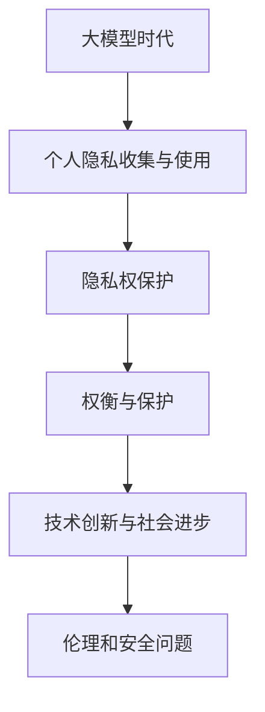
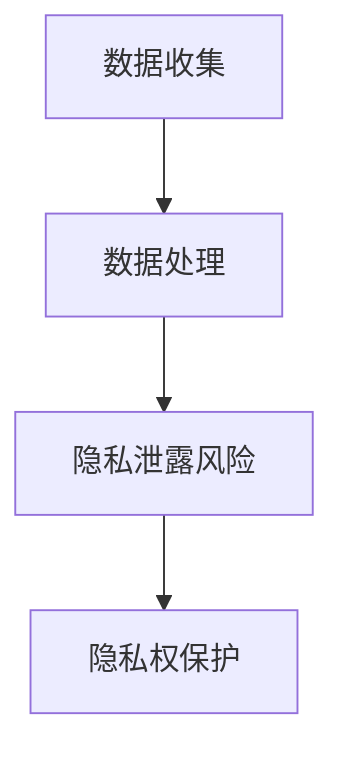
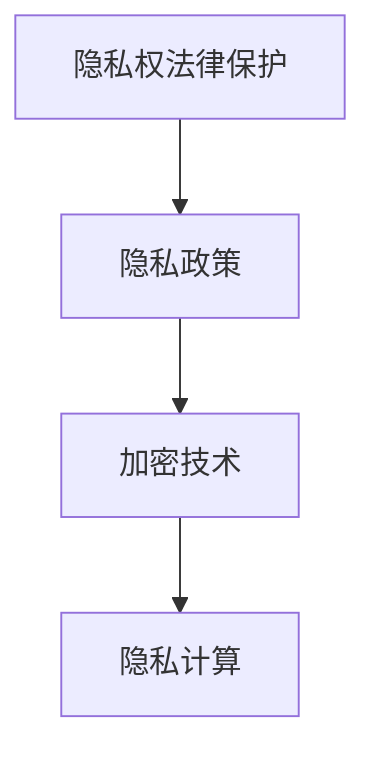
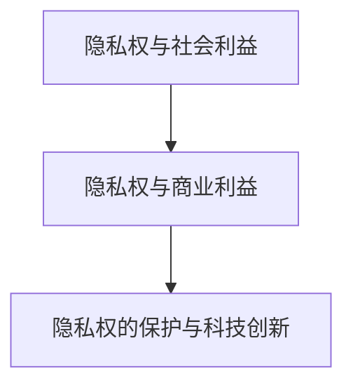
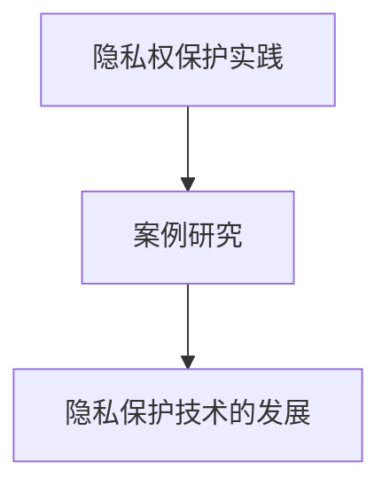

                 

# 大模型时代的个人隐私：权衡与保护

> 关键词：大模型、个人隐私、数据收集、隐私权、隐私保护、权衡与保护

> 摘要：本文探讨了在大模型时代个人隐私的收集与使用问题，分析了隐私权保护的机制和隐私权保护的权衡，旨在为读者提供对大模型时代个人隐私保护的全面理解和思考。

## 第一部分：引言

### 核心概念与联系

**大模型时代的个人隐私：** 大模型时代指的是以深度学习为核心的人工智能技术迅猛发展的时代。在此时代，大型神经网络模型（如GPT、BERT等）在各个领域得到了广泛应用，这些模型需要海量数据作为训练基础，因此个人隐私数据的收集和使用变得尤为普遍。

**权衡与保护：** 在大模型时代，个人隐私的权衡与保护成为了一个重要议题。一方面，个人隐私数据的广泛收集和应用能够推动技术创新和社会进步；另一方面，过度的隐私数据收集和使用可能侵犯个人隐私，引发伦理和安全问题。

**隐私权：** 隐私权是个人对其个人信息和私人生活享有的保护权利。在大模型时代，隐私权的保护变得更加复杂，因为个人数据可能被大模型以复杂的方式进行加工和使用。

### Mermaid 流程图

## 第二部分：大模型时代个人隐私的收集与使用

### 核心概念与联系

**数据收集：** 大模型需要海量数据来进行训练，因此个人隐私数据往往被大量收集。这些数据可能包括个人通讯记录、位置信息、消费习惯等。

**数据处理：** 收集到的个人隐私数据需要经过处理，以便为大模型提供有效的训练素材。数据处理可能包括数据清洗、去重、归一化等操作。

**隐私泄露风险：** 在数据收集和处理过程中，隐私泄露风险是必须关注的问题。隐私泄露可能导致个人隐私受到侵害，引发一系列社会问题。

### Mermaid 流��序图

### 个人隐私数据的收集与使用

在大模型时代，个人隐私数据的收集和使用成为了技术创新和社会进步的重要驱动力。以下是对这一过程的具体分析：

1. **数据来源与类型：** 个人隐私数据可以来自各种渠道，包括社交媒体、在线购物、医疗服务、通信应用等。这些数据类型多样，包括个人身份信息、行为记录、生物特征数据等。

2. **数据收集的目的：** 大模型训练需要大量的标注数据，因此个人隐私数据的收集通常是出于改进模型性能、优化用户体验、进行个性化推荐等目的。

3. **数据处理方法：** 收集到的数据会经过清洗、去重、归一化等处理，以提高数据质量，然后被分割成训练集、验证集和测试集，用于模型的训练和评估。

4. **数据隐私泄露风险：** 在数据处理过程中，隐私泄露风险是一个不可忽视的问题。数据泄露可能导致个人隐私受到侵害，例如身份盗用、诈骗等。因此，数据保护措施至关重要。

5. **隐私数据的使用限制：** 为了保护个人隐私，各国法律法规对数据收集和使用进行了严格规定。例如，欧盟的《通用数据保护条例》（GDPR）明确规定了数据收集、存储和使用的要求，要求企业在收集和处理个人数据时必须获得用户明确同意，并采取必要的安全措施。

### 具体案例分析

以社交媒体平台为例，这些平台通过收集用户在平台上的行为数据（如点赞、评论、分享等）来训练推荐算法，以提供个性化的内容推荐。然而，这种数据收集方式也引发了对用户隐私保护的担忧。例如，2018年的Facebook数据泄露事件就暴露了用户隐私数据被第三方不当使用的问题。

尽管隐私泄露风险存在，但个人隐私数据的收集对于大模型技术的发展至关重要。为了在保护隐私和利用数据之间找到平衡，研究人员和工程师们正在开发各种隐私保护技术，如联邦学习、差分隐私等，以在不泄露用户隐私的情况下，仍然能够进行有效的数据分析和模型训练。

## 第三部分：隐私权的保护机制

### 核心概念与联系

**隐私权法律保护：** 各国法律对于隐私权都有一定的保护。例如，欧盟的《通用数据保护条例》（GDPR）对个人隐私数据的使用和存储做出了严格规定。

**隐私政策：** 任何涉及个人隐私数据收集和使用的机构都需要制定明确的隐私政策，告知用户其个人数据的收集、使用和目的。

**加密技术：** 加密技术是保护个人隐私数据的重要手段。通过对数据进行加密，可以防止未经授权的访问和泄露。

**隐私计算：** 隐私计算是一种在不泄露原始数据的前提下进行数据处理的技术。例如，差分隐私、联邦学习等技术可以在保护隐私的同时实现数据的有效利用。

### Mermaid 流程图

### 隐私权法律保护

隐私权法律保护是保护个人隐私数据不受非法收集、使用和泄露的重要手段。以下是对隐私权法律保护的具体分析：

1. **隐私权法律框架：** 各国法律对于隐私权都有一定的保护。例如，欧盟的《通用数据保护条例》（GDPR）是全球范围内最严格的数据保护法规之一，它规定了企业收集、处理和存储个人数据的一系列要求。

2. **隐私权法律条款：** GDPR中的关键条款包括数据主体的权利（如访问权、删除权、数据可携权等）、数据控制者的责任（如数据最小化原则、数据保护影响评估等）和数据泄露通知义务等。

3. **隐私权法律实施：** GDPR的实施对企业和个人都产生了深远的影响。企业需要确保其数据处理活动符合GDPR的规定，否则可能面临高额罚款。个人则可以更加主动地保护自己的隐私权，例如通过向监管机构投诉来维护自己的权益。

4. **隐私权法律挑战：** 隐私权法律保护也面临一些挑战。例如，随着大数据技术和人工智能的发展，传统的隐私权法律框架可能难以适应新的技术和应用场景。此外，跨境数据传输和国际隐私权保护也是隐私权法律保护的重要议题。

### 隐私政策的制定与执行

隐私政策是任何涉及个人隐私数据收集和使用的机构必须制定的重要文件。以下是对隐私政策的制定与执行的具体分析：

1. **隐私政策的定义：** 隐私政策是指企业或组织就其收集、使用、存储和共享个人数据的方式向用户进行披露的声明。它通常包括个人数据的类型、收集目的、使用方式、数据共享对象、数据保护措施等信息。

2. **隐私政策的内容：** 一个完整的隐私政策应包括数据收集和使用的目的、数据类型、数据存储位置、数据保护措施、用户权利和投诉渠道等。此外，隐私政策还应定期更新，以反映最新的数据处理活动和技术发展。

3. **隐私政策的执行：** 企业需要确保其隐私政策得到有效执行，包括在网站、应用程序等渠道上公开隐私政策，为用户提供易于理解的隐私信息，并确保隐私政策与其他隐私保护措施相一致。

4. **隐私政策的合规性：** 隐私政策的制定和执行需要符合相关法律法规的要求，例如GDPR、加州消费者隐私法案（CCPA）等。企业应定期进行合规性审查，以确保其隐私政策符合法律法规的规定。

### 加密技术在隐私保护中的应用

加密技术是保护个人隐私数据的重要手段，可以防止未经授权的访问和数据泄露。以下是对加密技术在隐私保护中的应用的具体分析：

1. **数据加密的概念：** 数据加密是指将数据转换为只有授权用户才能解读的密文的过程。加密技术包括对称加密和非对称加密两种基本类型。

2. **对称加密：** 对称加密使用相同的密钥进行加密和解密。常见的对称加密算法包括AES、DES等。对称加密的优点是加密速度快，但缺点是密钥管理复杂，难以在分布式系统中应用。

3. **非对称加密：** 非对称加密使用一对密钥（公钥和私钥）进行加密和解密。公钥用于加密，私钥用于解密。常见的非对称加密算法包括RSA、ECC等。非对称加密的优点是密钥管理简单，但加密和解密速度相对较慢。

4. **混合加密：** 混合加密结合了对称加密和非对称加密的优点。在数据传输过程中，首先使用非对称加密生成对称加密的密钥，然后使用对称加密对数据进行加密。这样可以既保证数据的安全性，又提高传输速度。

5. **加密技术在隐私保护中的应用：** 加密技术广泛应用于数据存储、数据传输和数据处理等领域。例如，数据库加密可以防止数据库被非法访问；HTTPS协议可以保证Web数据传输的安全性；加密签名可以确保数据完整性和不可否认性。

### 隐私计算

隐私计算是一种在不泄露原始数据的前提下进行数据处理的技术，旨在平衡数据利用和隐私保护。以下是对隐私计算的具体分析：

1. **隐私计算的概念：** 隐私计算是指通过对数据进行加密、匿名化、去识别化等处理，确保数据在传输、存储和处理过程中不会被泄露或滥用。

2. **隐私计算的类型：** 隐私计算包括多种类型，如差分隐私、联邦学习、多方安全计算等。

3. **差分隐私：** 差分隐私是一种常用的隐私保护技术，通过在计算过程中引入随机噪声，使得输出结果对单个数据点的依赖性降低，从而保护个体隐私。

4. **联邦学习：** 联邦学习是一种分布式机器学习技术，允许多个参与方在本地进行模型训练，并将模型更新汇总，从而实现全局模型的优化。联邦学习可以保护参与方的数据隐私，同时实现模型协同训练。

5. **多方安全计算：** 多方安全计算是一种在多方参与的计算环境中确保数据安全和隐私保护的技术。它允许多个参与方在不泄露各自数据的前提下，共同进行数据处理和计算。

6. **隐私计算的应用：** 隐私计算在多个领域得到了广泛应用，如金融、医疗、互联网等。通过隐私计算，可以在确保数据隐私的同时，实现数据的有效利用和共享。

## 第四部分：隐私权的权衡

### 核心概念与联系

**隐私权与社会利益：** 在某些情况下，隐私权可能需要与社会利益进行权衡。例如，在公共安全、疾病防控等领域，可能需要收集和处理大量个人隐私数据。

**隐私权与商业利益：** 在商业领域，个人隐私数据的收集和使用对于企业来说具有重要意义。然而，如何平衡隐私权和商业利益是一个复杂的问题。

**隐私权的保护与科技创新：** 隐私权的保护不应阻碍科技创新。相反，科技创新应当有助于更好地保护个人隐私。

### Mermaid 流程图

### 隐私权与社会利益的权衡

隐私权与社会利益之间的权衡是一个复杂且具有争议的话题。以下是对这一权衡的具体分析：

1. **公共安全：** 在公共安全领域，政府机构可能需要收集和分析大量个人隐私数据，以监控和预防犯罪活动。例如，视频监控和手机定位数据在反恐和追捕嫌疑人时发挥了重要作用。然而，这种数据收集也引发了隐私权保护的担忧，因此需要在法律框架内进行严格监管。

2. **疾病防控：** 在疾病防控领域，医疗健康数据对于疾病的早期发现和流行病监测至关重要。然而，这些数据涉及个人隐私，需要在收集、存储和使用过程中采取严格的保护措施，以防止数据泄露和滥用。

3. **隐私权保护与社会利益的平衡：** 为了在隐私权保护和社会利益之间找到平衡，各国政府制定了相应的法律法规，规定在特定情况下可以合法收集和使用个人隐私数据。例如，GDPR规定了在公共安全、公共卫生等紧急情况下，可以在特定条件下临时放宽数据保护要求。

### 隐私权与商业利益的权衡

在商业领域，个人隐私数据的收集和使用对于企业来说具有重要意义，但同时也引发了隐私权保护的争议。以下是对这一权衡的具体分析：

1. **个性化推荐：** 互联网公司通过收集和分析用户行为数据，提供个性化的推荐和服务。例如，电商网站可以根据用户的购物习惯推荐相关商品，从而提高销售额。然而，这种数据收集也引发了用户隐私保护的担忧。

2. **数据驱动的决策：** 企业通过分析大量个人隐私数据，可以做出更准确的市场预测和商业决策。例如，金融机构可以通过分析客户的金融行为，识别潜在的风险和机会。然而，这种数据收集也可能侵犯用户的隐私权。

3. **隐私权与商业利益的平衡：** 为了平衡隐私权和商业利益，企业需要制定明确的隐私政策，告知用户其个人数据的使用方式和范围。此外，企业应采取严格的数据保护措施，确保数据安全，并在必要时接受第三方审计和监管。

### 隐私权的保护与科技创新

隐私权的保护与科技创新之间存在一定的矛盾。以下是对这一矛盾的具体分析：

1. **技术发展的挑战：** 随着人工智能、大数据等技术的快速发展，个人隐私数据被广泛收集和使用。然而，这些技术的应用也带来了隐私权保护的挑战。例如，深度学习模型需要大量训练数据，但数据收集过程中可能侵犯用户隐私。

2. **隐私保护的科技创新：** 为了解决隐私权保护与科技创新之间的矛盾，研究人员正在开发各种隐私保护技术，如差分隐私、联邦学习、多方安全计算等。这些技术旨在在不泄露用户隐私的前提下，实现数据的有效利用和共享。

3. **隐私权与科技创新的平衡：** 为了在隐私权保护与科技创新之间找到平衡，需要在法律、技术和社会层面共同努力。例如，立法机构可以制定相关法律法规，明确隐私保护的要求；技术社区可以推动隐私保护技术的研发和应用；公众应提高隐私保护意识，积极参与隐私权保护的社会运动。

## 第五部分：隐私权的保护实践

### 核心概念与联系

**隐私权保护实践：** 包括隐私权教育的普及、隐私保护技术的应用、隐私权法律诉讼等。

**案例研究：** 通过具体案例研究，分析隐私权保护的实践效果和存在的问题。

**隐私保护技术的发展：** 探讨隐私保护技术的最新发展，如隐私计算、差分隐私、联邦学习等。

### Mermaid 流程图

### 隐私权保护实践

隐私权保护实践是确保个人隐私数据在收集、存储和使用过程中得到有效保护的关键。以下是对隐私权保护实践的具体分析：

1. **隐私权教育：** 隐私权教育是提高公众隐私保护意识的重要手段。通过教育，公众可以了解个人隐私的重要性，学会如何保护自己的隐私。隐私权教育可以包括学校课程、在线培训、宣传材料等形式。

2. **隐私保护技术应用：** 隐私保护技术是确保个人隐私数据在数字环境中得到保护的关键。这些技术包括加密、匿名化、数据脱敏等。企业、政府和研究机构应积极采用这些技术，提高数据保护能力。

3. **隐私权法律诉讼：** 隐私权法律诉讼是维护个人隐私权的重要手段。当个人隐私数据被不当收集、使用或泄露时，个人可以依法提起诉讼，维护自己的合法权益。

4. **隐私权保护机制的完善：** 隐私权保护机制的完善是确保隐私权得到有效保护的基础。这包括制定和执行隐私保护法律法规、建立隐私保护监管机构、推动隐私保护技术的研发和应用等。

### 具体案例研究

1. **案例一：Facebook数据泄露事件**  
2018年，Facebook的数据泄露事件震惊全球。事件中，超过8700万用户的个人信息被第三方不当使用，导致用户隐私受到严重侵害。这一事件暴露了社交媒体平台在隐私保护方面的不足，引发了全球范围内对隐私保护的广泛关注。

2. **案例二：谷歌搜索隐私政策变更**  
2020年，谷歌宣布对其搜索隐私政策进行变更，取消了“默认登录”功能，以更好地保护用户隐私。这一变更受到了用户和隐私保护组织的欢迎，被认为是谷歌在隐私保护方面的重要进步。

3. **案例三：苹果隐私保护措施**  
苹果公司一直以其严格的隐私保护措施而闻名。公司通过推出iOS系统中的隐私保护功能，如“隐私报告”、“App跟踪透明度”等，提高了用户对隐私保护的意识和控制能力。这些措施有助于保护用户隐私，同时也提高了用户对苹果产品的信任。

### 隐私保护技术的发展

隐私保护技术的发展是隐私权保护实践的重要组成部分。以下是对隐私保护技术发展的具体分析：

1. **隐私计算**  
隐私计算是一种在不泄露原始数据的前提下进行数据处理的技术。它包括差分隐私、联邦学习、多方安全计算等。这些技术可以在保护隐私的同时，实现数据的有效利用和共享。

2. **差分隐私**  
差分隐私是一种常用的隐私保护技术，通过在计算过程中引入随机噪声，使得输出结果对单个数据点的依赖性降低，从而保护个体隐私。

3. **联邦学习**  
联邦学习是一种分布式机器学习技术，允许多个参与方在本地进行模型训练，并将模型更新汇总，从而实现全局模型的优化。联邦学习可以保护参与方的数据隐私，同时实现模型协同训练。

4. **多方安全计算**  
多方安全计算是一种在多方参与的计算环境中确保数据安全和隐私保护的技术。它允许多个参与方在不泄露各自数据的前提下，共同进行数据处理和计算。

5. **隐私保护技术的应用**  
隐私保护技术在多个领域得到了广泛应用，如金融、医疗、互联网等。通过隐私保护技术，可以在确保数据隐私的同时，实现数据的有效利用和共享。

## 第六部分：隐私权的未来发展趋势

### 核心概念与联系

**隐私权法律政策：** 隐私权法律政策的发展将影响个人隐私的保护水平。

**技术发展：** 隐私保护技术的发展将提高个人隐私保护的能力。

**社会观念：** 社会观念的变化将影响个人隐私权的认知和保护程度。

### 隐私权法律政策的未来发展趋势

隐私权法律政策的发展将对个人隐私的保护产生深远影响。以下是对隐私权法律政策未来发展趋势的具体分析：

1. **全球隐私权立法趋势：** 随着大数据和人工智能技术的快速发展，全球范围内隐私权立法呈现加强趋势。例如，欧盟的《通用数据保护条例》（GDPR）已经成为全球隐私保护的标准，其他国家和地区也在借鉴和推广其立法经验。

2. **跨国隐私权合作：** 隐私权保护需要全球合作，跨国隐私权合作将成为未来发展趋势。各国可以通过签订协议、建立合作机制等方式，共同应对全球范围内的隐私权保护挑战。

3. **隐私权法律框架的完善：** 未来，隐私权法律框架将更加完善，包括对隐私权保护的范围、数据收集和使用的限制、用户权利的保障等方面的规定。这将有助于提高个人隐私保护的水平和效果。

4. **隐私权保护的法律挑战：** 隐私权保护面临诸多法律挑战，如如何在保护隐私的同时，满足公共安全和商业需求；如何适应新技术的发展等。未来，法律界将不断探索和解决这些问题。

### 隐私保护技术的发展趋势

隐私保护技术的发展将进一步提高个人隐私保护的能力。以下是对隐私保护技术发展趋势的具体分析：

1. **隐私计算技术：** 隐私计算技术，如联邦学习、多方安全计算、差分隐私等，将在未来得到广泛应用。这些技术可以在保护隐私的同时，实现数据的有效利用和共享。

2. **区块链技术：** 区块链技术具有去中心化、透明性和不可篡改的特点，未来有望在隐私保护领域发挥重要作用。通过区块链技术，可以实现数据的安全存储和可信传输。

3. **人工智能技术：** 人工智能技术在隐私保护中的应用将不断拓展。例如，通过人工智能算法，可以更好地识别和防范隐私泄露风险，提高隐私保护的效率和准确性。

4. **隐私保护技术的融合：** 隐私保护技术将与其他前沿技术，如物联网、大数据等相结合，形成更全面的隐私保护体系。

### 社会观念的变化对隐私权的影响

社会观念的变化将对个人隐私权的认知和保护程度产生重要影响。以下是对社会观念变化对隐私权影响的的具体分析：

1. **隐私权的认知提升：** 随着信息技术的普及，公众对隐私权的认知不断提升。越来越多的人意识到个人隐私的重要性，愿意为隐私保护支付更高的成本。

2. **隐私权意识的普及：** 隐私权意识的普及将推动隐私保护法律政策的制定和执行。公众的参与和监督将提高隐私保护的法律效果。

3. **隐私权的平衡观念：** 在未来，社会将更加重视隐私权与社会利益、商业利益之间的平衡。在保护个人隐私的同时，也要考虑公共安全和商业发展的需求。

### 结论

在大模型时代，个人隐私的收集与使用成为技术创新和社会进步的重要驱动力。然而，个人隐私的保护同样至关重要。隐私权的权衡与保护是一个复杂且具有挑战性的问题，需要在法律、技术和社会层面共同努力。未来，隐私权法律政策的发展、隐私保护技术的发展和社会观念的变化将共同推动个人隐私保护的进步。只有通过全面、系统的隐私保护措施，才能在享受技术带来便利的同时，保障个人隐私权的安全。

### 作者信息

作者：AI天才研究院/AI Genius Institute & 禅与计算机程序设计艺术 /Zen And The Art of Computer Programming

---

**附录：全文图表汇总**

以下是本文中提到的所有Mermaid图表的汇总，以便读者参考：

1. **引言中的Mermaid流程图：**

2. **第二部分中的Mermaid流程图：**

3. **第三部分中的Mermaid流程图：**

4. **第四部分中的Mermaid流程图：**

5. **第五部分中的Mermaid流程图：**

通过上述图表，读者可以更清晰地理解本文的核心概念和结构。同时，也欢迎读者在研究和应用这些概念和技术时，提出宝贵的意见和建议。让我们一起为构建一个安全、和谐、可持续发展的数字世界而努力。**注意：**由于Markdown格式不支持直接嵌入Mermaid图表，上述图表仅作为文本描述。实际阅读时，请参考文中相关段落以获取图表信息。**全文图表汇总结束。**

