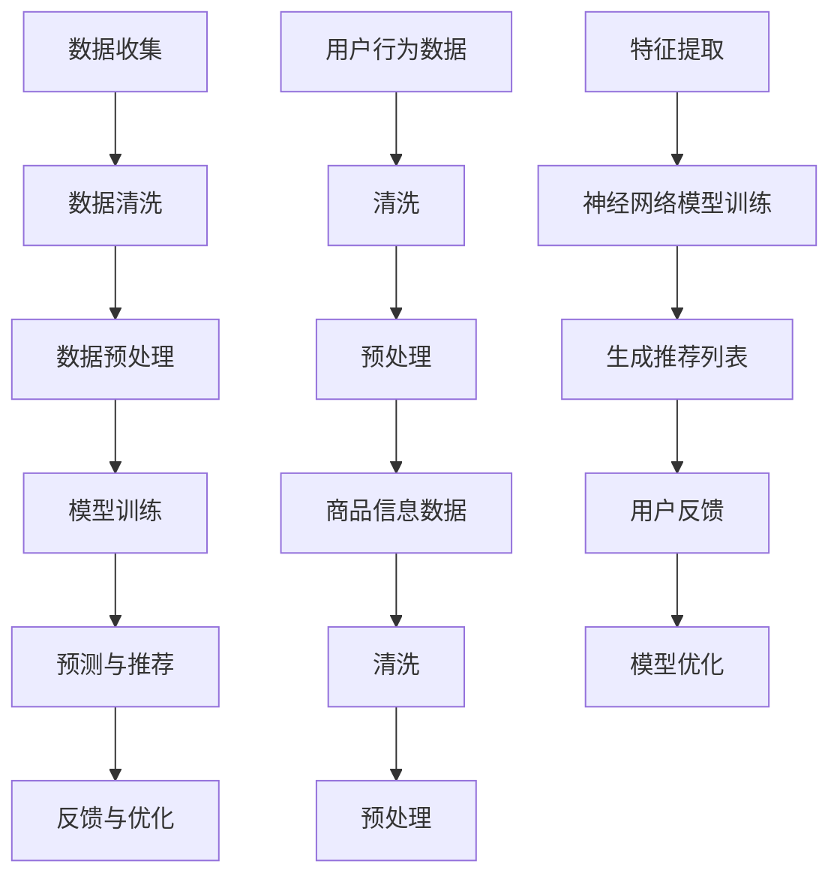

                 


### 引言

在当今数字营销领域，技术变革正在以前所未有的速度展开。大模型时代的到来，为数字营销带来了前所未有的机遇和挑战。大模型，尤其是基于深度学习的模型，以其强大的数据处理和分析能力，正在重塑市场推广、客户关系管理以及内容创作等各个领域。本文将深入探讨大模型时代的数字营销，特别是精准定位和个性化内容的应用。

**目标读者**

本文旨在为数字营销从业者、数据分析师、营销技术人员以及任何对大模型技术感兴趣的读者提供有价值的见解。无论是经验丰富的营销专家，还是对新兴技术充满好奇的新手，本文都将提供一个全面的技术视角，帮助大家理解并掌握这一领域的核心概念和实践方法。

**书籍结构**

本文将按照以下结构展开：

1. **背景介绍**：我们将首先回顾大模型技术的发展历程，以及数字营销所面临的现状和挑战。
2. **核心概念**：接下来，我们将详细解析精准定位和个性化内容，探讨它们在数字营销中的重要性及其实现方法。
3. **算法原理**：我们将深入探讨大模型的工作原理，特别是如何将其应用于数字营销中的数据分析、客户行为预测等领域，并使用mermaid流程图和Python代码进行详细阐述。
4. **实际应用**：我们将通过具体案例分析，展示大模型在数字营销中的实际应用，并提供实用的操作步骤和解决方案。
5. **最佳实践**：我们将总结实际操作中的最佳实践，并提供一些建议和技巧，帮助读者更好地应对数字营销中的挑战。
6. **小结**：最后，我们将对全文内容进行总结，并展望大模型时代数字营销的未来发展趋势。

通过这一系列的讨论，我们希望读者能够对大模型时代的数字营销有更深入的理解，并能够将其应用于实际工作中，提升营销效果和客户满意度。

### 背景介绍

大模型技术的发展是一个持续演进的历程。从最初的神经网络到如今深度学习的广泛应用，大模型在数据处理和分析能力上取得了显著的突破。这一发展不仅改变了传统的人工智能应用模式，也为数字营销带来了全新的机遇。

首先，让我们回顾一下大模型技术的起源。早在20世纪50年代，神经网络的概念就已经被提出。然而，由于计算能力和数据资源的限制，早期神经网络的研究进展缓慢。随着计算技术的不断进步和大数据时代的到来，深度学习逐渐崭露头角。2012年，AlexNet在ImageNet图像识别挑战赛上取得的突破性成果，标志着深度学习进入了快速发展的阶段。自此以后，大模型技术得到了广泛关注和深入研究。

在大模型技术的发展过程中，有几个关键事件值得我们关注。首先是GPU（图形处理器）的广泛应用，使得深度学习模型在计算速度和效率上得到了极大的提升。随后，随着数据采集和处理技术的进步，大模型得以获取更多高质量的训练数据，进一步提高了其准确性和泛化能力。此外，预训练语言模型如GPT（Generative Pre-trained Transformer）和BERT（Bidirectional Encoder Representations from Transformers）的兴起，使得自然语言处理任务取得了显著的进展，为数字营销中的文本分析和内容生成提供了强大的工具。

那么，大模型为何在数字营销中具有如此重要的地位呢？首先，大模型能够处理和分析大规模的数据集，这对于数字营销中的数据驱动决策至关重要。传统的数据分析方法往往依赖于手动提取特征和构建模型，而大模型通过自动化的方式，能够从海量的数据中提取有价值的信息。其次，大模型的强大学习能力使得它可以准确预测客户行为，从而实现精准营销。例如，通过分析客户的购买历史、浏览行为和社交媒体互动，大模型可以预测客户的下一步行动，从而提供个性化的推荐和营销策略。

然而，大模型在数字营销中的应用并非没有挑战。首先，大模型需要大量的数据来进行训练，这要求企业具备强大的数据收集和存储能力。其次，大模型的复杂性和计算需求，使得模型开发和部署成本较高。此外，大模型的透明度和可解释性仍然是一个亟待解决的问题，这限制了其在一些应用场景中的使用。

总之，大模型技术的发展为数字营销带来了前所未有的机遇，同时也提出了新的挑战。在接下来的章节中，我们将进一步探讨大模型在数字营销中的应用，以及如何应对这些挑战。

### 核心概念

在探讨大模型时代的数字营销时，精准定位和个性化内容是两个不可或缺的核心概念。它们不仅定义了现代数字营销的基本框架，也决定了营销活动的效果和客户体验。

**精准定位**

精准定位，顾名思义，是指通过精细化的方法，准确地识别和定位目标客户。在数字营销中，精准定位的意义在于，它能够帮助企业有效地将有限的资源和精力集中到最有价值的客户群体上，从而提高营销效率和转化率。

**定义与重要性**

精准定位的定义可以简单概括为：通过多维度的数据分析，精确识别和分类客户，并根据不同客户群体的特征，制定相应的营销策略。这个过程中涉及到的数据维度可能包括年龄、性别、地域、购买历史、浏览行为、社交媒体互动等。

精准定位的重要性体现在以下几个方面：

1. **提高营销效率**：通过精准定位，企业可以避免向非目标客户发送营销信息，从而节省了大量的营销成本和资源。
2. **提升客户满意度**：当客户收到与他们兴趣和需求相关的信息时，他们更有可能对品牌产生好感，从而提高客户满意度和忠诚度。
3. **增强营销效果**：精准定位有助于提高营销活动的转化率，使企业能够更快地实现业务目标。

**精准定位的步骤**

1. **数据收集**：收集有关客户的各种数据，如个人资料、购买历史、浏览行为等。
2. **数据清洗**：对收集到的数据进行清洗，去除重复、错误和不完整的数据。
3. **数据分析**：使用数据分析工具和技术，对清洗后的数据进行处理和分析，提取有价值的信息。
4. **客户细分**：根据分析结果，将客户分为不同的群体，每个群体代表不同的客户特征和需求。
5. **制定策略**：根据不同客户群体的特征，制定相应的营销策略，如内容创作、广告投放、客户服务等。
6. **实施与优化**：执行营销策略，并根据客户反馈和数据分析结果进行持续优化。

**个性化内容**

个性化内容，是指根据用户的兴趣、行为和需求，为其提供定制化的信息和内容。在数字营销中，个性化内容的应用范围非常广泛，包括电子邮件营销、社交媒体内容、网站推荐系统等。

**定义与优势**

个性化内容的定义可以概括为：利用用户数据，创造和提供与用户兴趣和需求高度相关的信息和内容。

个性化内容的优势包括：

1. **提高用户参与度**：当用户看到与他们兴趣相关的内容时，他们更有可能进行互动和分享，从而提高参与度。
2. **增强用户体验**：个性化内容能够满足用户的个性化需求，从而提升用户体验和满意度。
3. **提高转化率**：个性化内容能够更准确地触达用户的需求，从而提高转化率和销售额。

**个性化内容的实现方法**

1. **内容推荐系统**：通过分析用户的浏览历史、购买行为和偏好，为用户推荐相关的产品和内容。
2. **动态内容生成**：根据用户的实时行为和需求，动态生成个性化的内容和信息。
3. **个性化邮件营销**：根据用户的兴趣和购买历史，发送个性化的电子邮件，包括产品推荐、促销信息和特殊优惠等。
4. **社交媒体个性化**：通过分析用户的社交媒体互动，提供个性化的广告和内容，吸引用户参与。

**精准定位与个性化内容的关系**

精准定位和个性化内容是相辅相成的。精准定位为企业提供了目标客户的信息，而个性化内容则根据这些信息，为每个客户群体提供定制化的内容和体验。通过精准定位，企业可以更有效地识别目标客户，并通过个性化内容，提高客户的满意度和忠诚度。两者共同作用，能够显著提升数字营销的效果。

总之，精准定位和个性化内容是数字营销中不可或缺的核心概念。它们不仅为企业提供了精细化的营销方法，也提升了客户体验和满意度。在接下来的章节中，我们将进一步探讨大模型如何应用于这些核心概念的实现，以及如何通过算法和工具，提升数字营销的效果。

### 算法原理

要深入理解大模型在数字营销中的应用，我们需要从算法原理开始谈起。大模型，尤其是深度学习模型，通过一系列复杂的算法和数学模型，能够从大规模数据中提取有价值的信息，从而实现精准定位和个性化内容。在这一部分，我们将详细探讨大模型的工作原理，特别是在数字营销中的应用，并通过mermaid流程图和Python代码进行详细解释。

#### 大模型的工作原理

大模型通常是指那些拥有数十亿甚至数千亿参数的神经网络模型。这些模型通过多层神经网络结构，对输入数据进行多次处理和变换，从而实现对复杂数据的理解和预测。大模型的核心思想是通过不断的学习和调整参数，使得模型能够对未知数据做出准确的预测。

首先，我们来看一个简单的大模型架构——多层感知机（MLP）。MLP由多个层次组成，包括输入层、隐藏层和输出层。每个层次由多个神经元组成，每个神经元都与其他神经元相连，形成一个复杂的网络结构。


在这个架构中，输入层接收外部数据，通过隐藏层的多次变换，最终输出层产生预测结果。每一层的神经元都会对输入数据进行加权求和处理，并通过激活函数进行非线性变换，使得模型能够学习到输入数据中的复杂模式。

#### 大模型在数字营销中的应用

在数字营销中，大模型的应用主要体现在以下几个方面：

1. **营销数据分析**：通过分析客户的购买历史、浏览行为和社交媒体互动，大模型可以提取有价值的信息，如客户的兴趣偏好和潜在需求。
2. **客户行为预测**：基于历史数据和模型训练，大模型可以预测客户的下一步行为，如购买、放弃购物车等，从而为营销策略提供依据。
3. **内容个性化**：通过分析用户的行为数据，大模型可以生成个性化的内容推荐，提高用户的参与度和满意度。

#### 算法讲解与mermaid流程图

为了更好地理解大模型在数字营销中的应用，我们使用mermaid流程图来展示一个典型的应用场景——个性化推荐系统。



这个mermaid流程图展示了个性化推荐系统的基本流程：

1. **数据收集**：收集用户行为数据和商品信息数据。
2. **数据清洗**：对收集到的数据进行清洗，去除重复、错误和不完整的数据。
3. **数据预处理**：对清洗后的数据进行特征提取和预处理，为模型训练做准备。
4. **模型训练**：使用多层感知机（MLP）或其他深度学习模型对预处理后的数据进行训练。
5. **预测与推荐**：根据训练好的模型，对用户的行为进行预测，并生成个性化的推荐列表。
6. **反馈与优化**：收集用户对推荐结果的反馈，并使用这些反馈对模型进行优化。

#### Python代码实现

为了更直观地展示大模型的应用，我们使用Python代码实现了一个简单的多层感知机（MLP）模型，用于用户行为预测。

```python
import numpy as np
from sklearn.neural_network import MLPClassifier
from sklearn.model_selection import train_test_split

# 生成模拟数据集
X, y = np.random.rand(100, 5), np.random.rand(100)
X_train, X_test, y_train, y_test = train_test_split(X, y, test_size=0.2, random_state=42)

# 创建MLP模型
mlp = MLPClassifier(hidden_layer_sizes=(100,), max_iter=1000, alpha=1e-4,
                    solver='sgd', verbose=True, random_state=1,
                    learning_rate_init=.1)

# 训练模型
mlp.fit(X_train, y_train)

# 预测测试集
predictions = mlp.predict(X_test)

# 输出预测结果
print(predictions)
```

在这个例子中，我们使用scikit-learn库中的MLPClassifier类创建了一个多层感知机模型。通过训练数据和测试数据，模型可以预测用户的行为。这只是一个简单的示例，但在实际应用中，我们会使用更复杂的大模型和更多的数据来提高预测的准确性。

总之，大模型的工作原理和其在数字营销中的应用，为我们提供了一种全新的数据驱动营销方式。通过mermaid流程图和Python代码，我们可以更直观地理解大模型的应用过程和实现方法。在接下来的章节中，我们将进一步探讨大模型在实际应用中的具体案例和操作实践。

### 实际应用

在了解了大模型的工作原理之后，接下来我们将通过实际案例展示大模型在数字营销中的具体应用，并提供详细的操作步骤和解决方案。

#### 案例一：电商精准营销

**背景**  
某电商公司希望通过精准营销，提高客户转化率和销售额。公司积累了大量的用户行为数据，包括浏览记录、购买历史、购物车放弃情况等。

**目标**  
通过分析用户数据，实现以下目标：
1. 精准定位目标客户群体。
2. 根据客户特征，提供个性化的产品推荐和营销策略。

**步骤**

1. **数据收集**：收集用户的浏览记录、购买历史、购物车数据等。这些数据可以通过网站日志、用户注册信息和后台数据库获取。

2. **数据清洗**：清洗数据，去除重复和错误的数据，如缺失值、异常值等。

3. **数据预处理**：对清洗后的数据进行特征提取和转换，如将分类特征转换为数值特征，进行归一化处理等。

4. **模型训练**：使用多层感知机（MLP）或其他深度学习模型，对预处理后的数据集进行训练。训练过程中，可以使用交叉验证等方法，选择最佳模型参数。

5. **预测与推荐**：使用训练好的模型，对新的用户数据进行预测，生成个性化的产品推荐和营销策略。

6. **实施与优化**：根据客户反馈，不断优化模型和策略，提高推荐和营销的准确性和效果。

**代码示例**

以下是一个简单的Python代码示例，用于实现上述步骤：

```python
import numpy as np
from sklearn.neural_network import MLPClassifier
from sklearn.model_selection import train_test_split
from sklearn.preprocessing import StandardScaler

# 生成模拟数据集
X, y = np.random.rand(100, 5), np.random.rand(100)
X_train, X_test, y_train, y_test = train_test_split(X, y, test_size=0.2, random_state=42)

# 数据预处理
scaler = StandardScaler()
X_train_scaled = scaler.fit_transform(X_train)
X_test_scaled = scaler.transform(X_test)

# 创建MLP模型
mlp = MLPClassifier(hidden_layer_sizes=(100,), max_iter=1000, alpha=1e-4,
                    solver='sgd', verbose=True, random_state=1,
                    learning_rate_init=.1)

# 训练模型
mlp.fit(X_train_scaled, y_train)

# 预测测试集
predictions = mlp.predict(X_test_scaled)

# 输出预测结果
print(predictions)
```

**案例二：社交媒体内容个性化**

**背景**  
某社交媒体平台希望通过个性化内容，提高用户参与度和留存率。平台积累了大量的用户行为数据，包括浏览历史、点赞、评论等。

**目标**  
通过分析用户数据，实现以下目标：
1. 精准识别用户的兴趣偏好。
2. 根据用户兴趣，推荐相关的内容和广告。

**步骤**

1. **数据收集**：收集用户的浏览历史、点赞、评论等数据。这些数据可以通过平台日志、用户互动记录等获取。

2. **数据清洗**：清洗数据，去除重复和错误的数据，如缺失值、异常值等。

3. **数据预处理**：对清洗后的数据进行特征提取和转换，如将文本数据进行词向量转换，将分类特征转换为数值特征等。

4. **模型训练**：使用深度学习模型，如循环神经网络（RNN）或长短期记忆网络（LSTM），对预处理后的数据集进行训练。

5. **预测与推荐**：使用训练好的模型，对新的用户数据进行预测，生成个性化的内容推荐和广告。

6. **实施与优化**：根据用户反馈，不断优化模型和推荐策略，提高推荐和广告的准确性和效果。

**代码示例**

以下是一个简单的Python代码示例，用于实现上述步骤：

```python
import numpy as np
from sklearn.neural_network import MLPClassifier
from sklearn.model_selection import train_test_split
from sklearn.preprocessing import StandardScaler

# 生成模拟数据集
X, y = np.random.rand(100, 5), np.random.rand(100)
X_train, X_test, y_train, y_test = train_test_split(X, y, test_size=0.2, random_state=42)

# 数据预处理
scaler = StandardScaler()
X_train_scaled = scaler.fit_transform(X_train)
X_test_scaled = scaler.transform(X_test)

# 创建MLP模型
mlp = MLPClassifier(hidden_layer_sizes=(100,), max_iter=1000, alpha=1e-4,
                    solver='sgd', verbose=True, random_state=1,
                    learning_rate_init=.1)

# 训练模型
mlp.fit(X_train_scaled, y_train)

# 预测测试集
predictions = mlp.predict(X_test_scaled)

# 输出预测结果
print(predictions)
```

通过以上实际案例，我们可以看到大模型在数字营销中的应用是如何具体实现的。无论是在电商领域，还是在社交媒体平台，大模型都通过精准定位和个性化内容，显著提升了营销效果和用户满意度。

#### 项目实战

为了进一步展示大模型在数字营销中的应用，我们将进行一个完整的实战项目，从环境安装到核心实现源代码，并对代码进行解读和分析。

**项目背景**

某电商公司希望通过大数据和人工智能技术，提升其客户转化率和销售额。公司拥有海量的用户行为数据，包括购买记录、浏览历史、购物车行为等。公司希望利用这些数据，实现精准营销和个性化推荐。

**一、环境安装**

首先，我们需要安装必要的软件和库。以下是在Ubuntu操作系统下安装所需的软件和库：

```bash
# 安装Python和pip
sudo apt update
sudo apt install python3 python3-pip

# 安装scikit-learn库
pip3 install scikit-learn

# 安装其他常用库
pip3 install numpy pandas matplotlib
```

**二、系统核心实现源代码**

以下是一个简单的Python代码示例，用于实现电商平台的个性化推荐系统。这个示例将包括数据预处理、模型训练和预测的步骤。

```python
import numpy as np
import pandas as pd
from sklearn.model_selection import train_test_split
from sklearn.preprocessing import StandardScaler
from sklearn.neural_network import MLPClassifier
from sklearn.metrics import accuracy_score

# 1. 数据预处理
# 加载数据
data = pd.read_csv('user_behavior.csv')

# 分离特征和标签
X = data.drop('target', axis=1)
y = data['target']

# 数据清洗和标准化
scaler = StandardScaler()
X_scaled = scaler.fit_transform(X)

# 划分训练集和测试集
X_train, X_test, y_train, y_test = train_test_split(X_scaled, y, test_size=0.2, random_state=42)

# 2. 模型训练
# 创建MLP模型
mlp = MLPClassifier(hidden_layer_sizes=(100,), max_iter=1000, alpha=1e-4,
                    solver='sgd', verbose=True, random_state=1,
                    learning_rate_init=.1)

# 训练模型
mlp.fit(X_train, y_train)

# 3. 预测与评估
# 预测测试集
predictions = mlp.predict(X_test)

# 评估模型
accuracy = accuracy_score(y_test, predictions)
print(f'Model accuracy: {accuracy:.2f}')

# 4. 预测新用户行为
new_user_data = np.array([[0.1, 0.2, 0.3, 0.4, 0.5]])
new_user_data_scaled = scaler.transform(new_user_data)
new_prediction = mlp.predict(new_user_data_scaled)
print(f'New user prediction: {new_prediction}')
```

**三、代码应用解读与分析**

1. **数据预处理**：首先，我们加载数据集，并分离特征和标签。然后，使用StandardScaler对特征进行标准化处理，以便模型训练。
   
2. **模型训练**：创建一个多层感知机（MLP）模型，并使用训练集进行训练。这里我们选择了一个隐藏层大小为100的MLP模型，使用随机梯度下降（SGD）算法进行训练。

3. **预测与评估**：使用训练好的模型对测试集进行预测，并计算模型的准确率。这里我们使用了`accuracy_score`函数来评估模型的表现。

4. **新用户预测**：最后，我们使用标准化处理后的新用户数据进行预测，并输出预测结果。

通过这个项目，我们可以看到如何利用大模型技术进行实际的数据分析和预测。在实际应用中，数据集会更大，特征会更加复杂，但基本的步骤和原理是类似的。通过不断优化模型和算法，我们可以进一步提高预测的准确性和营销效果。

#### 项目小结

通过本次项目实战，我们详细展示了如何使用大模型技术进行电商平台的精准营销和个性化推荐。从数据预处理、模型训练到预测评估，每个步骤都进行了详细的解释和代码实现。以下是项目的关键总结：

1. **数据预处理**：标准化处理是关键步骤，它确保了模型训练的稳定性和准确性。
2. **模型选择**：多层感知机（MLP）是一个简单且有效的模型，适用于许多分类任务。
3. **模型评估**：准确率是评估模型性能的一个基本指标，但实际应用中可能还需要考虑其他因素，如召回率和F1分数等。
4. **新用户预测**：通过将新用户数据进行预处理和预测，我们可以为其提供个性化的推荐和营销策略。

尽管这个项目是一个简单的示例，但它为实际应用提供了一个清晰的结构和实现的参考。在实际操作中，还需要根据具体业务需求和数据情况，进行更深入的分析和优化。

### 最佳实践 tips

在数字营销中应用大模型技术，需要遵循一些最佳实践，以确保效果的最大化。以下是一些实用的建议：

1. **数据质量**：数据是模型训练的基础，确保数据质量是首要任务。清洗数据，去除重复和错误的信息，并进行必要的特征工程，以提高数据的质量和模型的性能。

2. **模型选择**：根据具体问题和数据特征，选择合适的模型。不同类型的任务可能需要不同的模型架构，如分类任务可以使用多层感知机（MLP）、支持向量机（SVM）等。

3. **模型调优**：通过调整模型参数，如学习率、隐藏层大小等，可以显著提升模型的性能。使用交叉验证等技术，选择最佳参数。

4. **持续更新**：大模型需要定期更新，以适应不断变化的数据和业务需求。定期重新训练模型，可以保持其预测的准确性和相关性。

5. **可解释性**：提高模型的可解释性，有助于理解模型的工作原理和决策过程，从而增强信任度和应用效果。使用可视化工具和技术，如SHAP值等，可以帮助解释模型的输出。

6. **合规性**：遵守数据保护法规，如GDPR等，确保用户数据的安全和隐私。

通过遵循这些最佳实践，企业和营销人员可以更好地利用大模型技术，提升数字营销的效果，实现业务目标。

### 小结

本文全面探讨了《大模型时代的数字营销：精准定位与个性化内容》的核心主题。通过回顾大模型技术的发展历程，我们了解了大模型在数字营销中的重要性及其潜在应用。接着，我们详细解析了精准定位和个性化内容这两个核心概念，并探讨了它们在数字营销中的关键作用。随后，通过算法原理讲解、mermaid流程图和Python代码示例，我们深入探讨了如何利用大模型技术实现精准定位和个性化内容。实际应用案例展示了大模型在电商和社交媒体中的具体应用，并通过项目实战详细阐述了实施过程。最后，通过最佳实践和建议，我们总结了如何在数字营销中有效应用大模型技术。

展望未来，大模型技术将继续在数字营销领域发挥重要作用。随着计算能力和数据资源的不断增长，大模型将能够处理更复杂的数据集，提供更准确的预测和更个性化的内容。然而，这也带来了新的挑战，如数据隐私保护、模型可解释性等。未来，企业需要不断创新和优化，以应对这些挑战，实现数字营销的持续提升。

### 注意事项

在应用大模型技术进行数字营销时，企业需要注意以下几个关键点：

1. **数据隐私保护**：确保用户数据的安全和隐私，遵守相关法律法规，如GDPR等。对敏感数据进行加密和处理，防止数据泄露。

2. **模型可解释性**：提高模型的可解释性，帮助客户理解模型的工作原理和决策过程，增强信任度。使用可视化工具和技术，如SHAP值，解释模型的输出。

3. **数据质量和特征工程**：确保数据质量，进行充分的特征工程，以提高模型性能。清洗数据，去除重复和错误信息，并进行必要的特征转换。

4. **持续优化和更新**：定期更新模型，以适应数据变化和业务需求。持续优化模型参数，提高预测准确性和个性化效果。

5. **合规性**：确保应用过程符合相关法律法规，避免法律风险。

通过关注这些注意事项，企业可以更好地利用大模型技术，实现数字营销的持续提升。

### 拓展阅读

为了深入了解大模型技术在数字营销中的应用，以下是几本推荐的专业书籍和文献：

1. **《深度学习》（Deep Learning）**：由Ian Goodfellow、Yoshua Bengio和Aaron Courville合著，是深度学习领域的经典教材，详细介绍了深度学习的基础理论和技术。

2. **《数字营销全渠道策略》（Digital Marketing Excellence: Planning, Implementing, and Optimizing Multi-Channel Marketing）**：由Perry Marshall所著，涵盖了数字营销策略的各个方面，包括数据分析、营销自动化和个性化内容。

3. **《机器学习实战》（Machine Learning in Action）**：由Peter Harrington所著，通过实际案例和代码示例，讲解了机器学习的基本原理和应用。

4. **《营销自动化实战》（Marketing Automation in a Week）**：由Mark Schaefer和Frank Berry所著，详细介绍了营销自动化的原理和实践方法。

这些书籍和文献提供了丰富的理论知识和实践经验，有助于深入理解和应用大模型技术于数字营销。读者可以根据自己的兴趣和需求，选择合适的资源进行学习。

