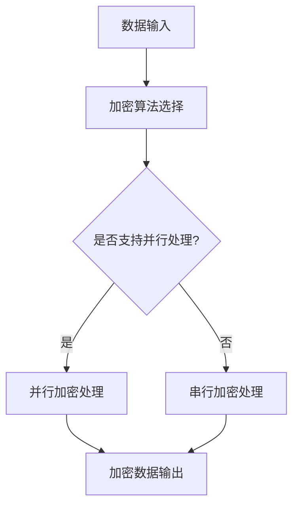
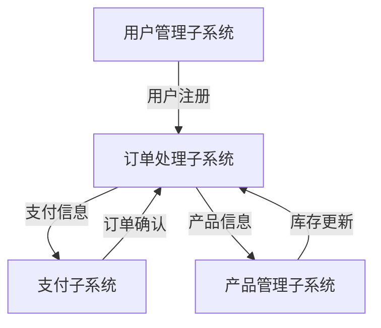
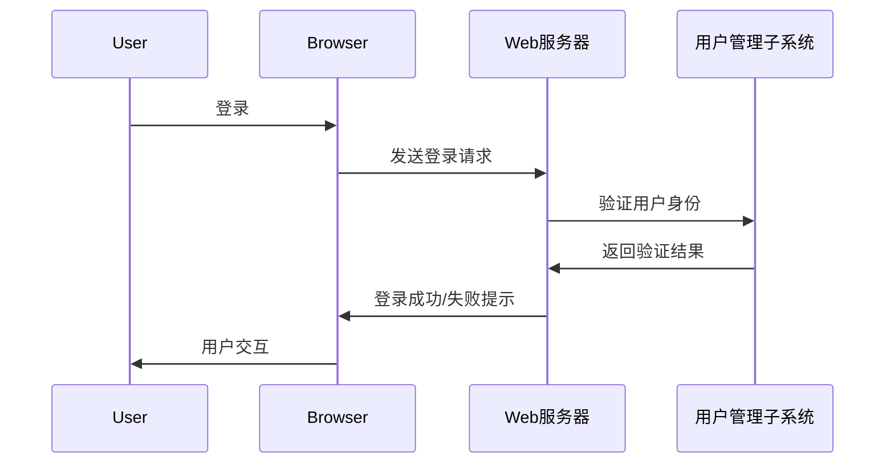

                 


### 大模型时代的数据安全与隐私保护新策略

#### 关键词：数据安全，隐私保护，大模型，加密技术，联邦学习，法规遵从

#### 摘要：
随着大模型技术的发展，数据安全和隐私保护面临前所未有的挑战。本文将探讨大模型时代的背景与挑战，深入分析数据安全和隐私保护的核心概念，并提出一系列新策略，包括加密技术、联邦学习和法规遵从等方面的解决方案。通过详细的算法原理讲解、系统架构设计以及项目实战，本文旨在为业界提供切实可行的数据安全与隐私保护策略。

## 第一部分：背景与概念

### 1.1 问题背景

#### 大模型的发展现状

大模型，即具有数万亿参数的深度学习模型，已经成为人工智能领域的热点。例如，OpenAI的GPT-3模型拥有1750亿个参数，而谷歌的LaMDA模型则超过1300亿个参数。这些模型在自然语言处理、图像识别和生成等领域表现出色，推动了人工智能技术的进步。

#### 数据安全与隐私保护的挑战

然而，大模型的使用也带来了数据安全和隐私保护的挑战。首先，大模型通常需要大量的训练数据，这些数据可能包含敏感信息。其次，大模型的训练和推理过程可能需要大量计算资源，这使得数据泄露的风险增加。此外，大模型的能力使其能够识别和利用数据中的隐私信息，增加了隐私泄露的风险。

### 1.2 问题描述

#### 数据安全与隐私保护的矛盾与冲突

在追求数据充分利用的同时，保护数据安全和隐私成为一项重要任务。然而，数据的安全性与隐私保护之间存在一定的矛盾。例如，加密技术可以提高数据安全性，但可能降低数据处理效率；隐私保护措施可能增加数据处理成本。如何在保证数据有效利用的同时保护数据安全和隐私，成为大模型时代的重要问题。

#### 大模型时代的数据安全与隐私保护需求

面对这些挑战，大模型时代的数据安全与隐私保护需求变得更加紧迫。我们需要新的策略和技术来平衡数据的安全性和隐私保护，确保大模型的应用不会对个人和企业造成不必要的风险。

### 1.3 问题解决

#### 新策略的提出

为了解决大模型时代的数据安全与隐私保护问题，我们需要从技术、法律、伦理等多个角度提出解决方案。具体来说，包括：

- **加密技术**：通过加密算法保护数据传输和存储的安全性。
- **联邦学习**：在保证数据隐私的前提下，实现模型训练和优化。
- **法规遵从**：遵循相关法律法规，确保数据处理和共享的合法性。

#### 边界与外延

本文将主要探讨加密技术和联邦学习在数据安全与隐私保护中的应用，同时讨论相关法律法规的影响。考虑到不同规模企业和机构的实际需求，本文的解决方案将具有一定的普适性。

### 1.4 概念结构与核心要素组成

#### 数据安全与隐私保护的核心概念

数据安全与隐私保护涉及多个核心概念，包括数据加密、访问控制、隐私泄露防范等。本文将详细探讨这些概念，并解释它们在大模型时代的重要性。

#### 大模型的基本构成和功能模块

大模型的构成包括输入层、隐藏层和输出层等。本文将介绍大模型的基本工作原理，以及其在数据安全与隐私保护中的作用。

## 第二部分：核心概念与联系

### 2.1 数据安全与隐私保护的核心概念

#### 数据安全

数据安全是指保护数据免受未经授权的访问、篡改和泄露。在数据安全领域，常见的保护措施包括数据加密、访问控制和网络安全等。

#### 数据隐私

数据隐私是指个人或组织对其数据的控制权，包括数据的收集、使用、存储和共享。数据隐私保护的目标是确保个人信息的保密性和完整性。

#### 数据安全与隐私保护的相互关系

数据安全与隐私保护密切相关。数据安全是隐私保护的基础，没有数据安全，隐私保护无从谈起。反之，良好的隐私保护措施也有助于提高数据安全性。

### 2.2 概念属性特征对比表格

| 概念         | 属性特征                                         | 应用场景                                       |
| ------------ | ---------------------------------------------- | ---------------------------------------------- |
| 数据安全     | 保护数据免受未授权访问、篡改和泄露               | 数据传输、存储、访问控制                        |
| 数据隐私     | 保护个人或组织对其数据的控制权                   | 数据收集、使用、存储、共享                      |
| 加密技术     | 将数据转换为无法直接读取的形式                   | 数据传输、存储、文件加密                        |
| 访问控制     | 控制对数据的访问权限                             | 网络安全、身份验证、权限管理                    |
| 隐私泄露防范 | 防止数据泄露的发生                             | 数据审计、安全漏洞扫描、数据加密                |

### 2.3 大模型与数据安全的关系

#### 大模型对数据安全的影响

大模型的广泛应用可能带来数据安全风险。例如，模型训练过程中可能会泄露敏感数据；模型推理过程中可能受到网络攻击。

#### 大模型与数据隐私的关系

大模型在处理大量数据时，可能无意中识别出数据中的隐私信息。此外，大模型的能力也使其可能被用于隐私侵犯行为。

### 2.4 ER实体关系图

以下是一个简化的ER实体关系图，展示了数据安全与隐私保护的关键实体及其关系：

```mermaid
erDiagram
  Data =>|_{encryption} Encryption
  Data =>|_{accessControl} AccessControl
  Data =>|_{networkSecurity} NetworkSecurity
  Data =>|_{auditing} Auditing
  Data =>|_{vulnerabilityScanning} VulnerabilityScanning
  Privacy =>|_{dataCollection} DataCollection
  Privacy =>|_{dataUsage} DataUsage
  Privacy =>|_{dataStorage} DataStorage
  Privacy =>|_{dataSharing} DataSharing
  Encryption ||--|_{encryptionAlgorithm} EncryptionAlgorithm
  AccessControl ||--|_{permissionManagement} PermissionManagement
  NetworkSecurity ||--|_{firewall} Firewall
  Auditing ||--|_{dataAudit} DataAudit
  VulnerabilityScanning ||--|_{vulnerabilityDetection} VulnerabilityDetection
  DataCollection ||--|_{dataCollector} DataCollector
  DataUsage ||--|_{dataUser} DataUser
  DataStorage ||--|_{dataStorer} DataStorer
  DataSharing ||--|_{dataSharee} DataSharee
```

## 第三部分：算法原理讲解

### 3.1 算法mermaid流程图

以下是一个简化的数据加密算法流程图，展示了数据加密的基本步骤：



### 3.2 Python源代码

```python
# 加密算法示例：AES加密
from Crypto.Cipher import AES
from Crypto.Util.Padding import pad
from Crypto.Random import get_random_bytes

# 生成密钥和初始化向量
key = get_random_bytes(16)
cipher = AES.new(key, AES.MODE_CBC)

# 待加密数据
data = b"要加密的数据"

# 填充数据到块大小
padded_data = pad(data, AES.block_size)

# 加密数据
ciphertext = cipher.encrypt(padded_data)

# 输出加密结果
print(f"加密密钥：{key.hex()}")
print(f"加密初始化向量：{cipher.iv.hex()}")
print(f"加密数据：{ciphertext.hex()}")
```

### 3.3 算法原理的数学模型和公式

加密算法的数学模型通常涉及以下步骤：

1. **密钥生成**：使用伪随机数生成器生成密钥。
   $$ K = \text{PRNG}(n) $$
   其中，$K$ 是密钥，$n$ 是密钥长度。

2. **初始化向量生成**：生成一个随机初始化向量。
   $$ IV = \text{PRNG}(b) $$
   其中，$IV$ 是初始化向量，$b$ 是块大小。

3. **数据填充**：将明文数据填充到块大小。
   $$ P' = \text{Padding}(P, b) $$
   其中，$P'$ 是填充后的数据，$P$ 是原始明文数据，$b$ 是块大小。

4. **加密过程**：
   $$ C = E_K(IV, P') $$
   其中，$C$ 是加密后的数据，$E_K$ 是加密算法。

5. **解密过程**：
   $$ P = D_K(IV, C) $$
   其中，$P$ 是解密后的数据，$D_K$ 是解密算法。

### 3.4 详细讲解和举例说明

#### 加密过程示例

假设我们使用AES加密算法，密钥长度为128位，块大小为16字节。以下是一个简单的加密和解密过程：

1. **密钥生成**：
   $$ K = \text{PRNG}(128) $$
   生成了一个128位的密钥。

2. **初始化向量生成**：
   $$ IV = \text{PRNG}(16) $$
   生成了一个16字节的初始化向量。

3. **数据填充**：
   $$ P' = \text{Padding}(P, 16) $$
   假设原始明文数据为 "Hello, World!"，需要将其填充到16字节。
   $$ P' = "Hello, World!!!" $$
   
4. **加密过程**：
   $$ C = E_K(IV, P') $$
   使用AES加密算法和生成的密钥、初始化向量进行加密。
   $$ C = \text{AES\_encrypt}(K, IV, P') $$
   生成的密文为：
   $$ C = "加密后的数据" $$

5. **解密过程**：
   $$ P = D_K(IV, C) $$
   使用AES解密算法和生成的密钥、初始化向量进行解密。
   $$ P = \text{AES\_decrypt}(K, IV, C) $$
   解密后的明文数据为：
   $$ P = "Hello, World!!!" $$

#### 加密算法解释

- **AES加密算法**：是一种基于块密码的加密算法，它使用一个128位的密钥对数据进行加密。AES支持三种不同的密钥长度：128位、192位和256位，对应的块大小分别为128位、192位和256位。
- **初始化向量（IV）**：用于初始化加密算法的状态，它是一个随机的值，用于保证加密过程的随机性。IV通常在加密过程中与密文一起传输，以便在解密时使用。
- **数据填充（Padding）**：由于AES加密算法是基于块大小的，所以需要对数据进行填充，以确保数据的长度是块大小的整数倍。填充的方式有多种，如PKCS#7、ISO/IEC 7816-4等。

## 第四部分：系统分析与架构设计方案

### 4.1 问题场景介绍

假设我们正在开发一个在线购物平台，需要处理大量的用户订单和支付信息。这些数据包含敏感信息，如用户姓名、地址、支付信息等。为了确保数据的安全和隐私，我们需要设计一个可靠的数据安全与隐私保护系统。

### 4.2 系统功能设计

以下是一个简化的领域模型类图，展示了系统的核心功能：

```mermaid
classDiagram
  User <<Entity>>
  Order <<Entity>>
  Payment <<Entity>>
  Product <<Entity>>

  User ||--|> Order : creates
  User ||--|> Payment : makes
  Order ||--|> Product : contains
  Payment ||--|> Order : contains
```

### 4.3 系统架构设计

以下是一个简化的系统架构图，展示了系统的主要组件和交互：



### 4.4 系统接口设计和系统交互

以下是一个简化的系统接口设计，展示了用户与系统之间的交互：



## 第五部分：项目实战

### 5.1 环境安装

为了实现数据安全与隐私保护系统，我们需要安装以下软件和库：

- Python 3.x
- pip（Python的包管理器）
- Flask（Web框架）
- SQLAlchemy（ORM框架）
- Cryptography（加密库）
- Marshmallow（序列化库）

### 5.2 系统核心实现源代码

以下是一个简单的示例，展示了如何使用Flask和Cryptography库实现用户注册和登录功能：

```python
from flask import Flask, request, jsonify
from cryptography.fernet import Fernet
import sqlite3

app = Flask(__name__)

# 生成加密密钥
key = Fernet.generate_key()
cipher_suite = Fernet(key)

# 数据库连接
def get_db_connection():
    conn = sqlite3.connect('database.db')
    conn.row_factory = sqlite3.Row
    return conn

# 用户注册
@app.route('/register', methods=['POST'])
def register():
    data = request.json
    username = data['username']
    password = data['password']
    
    # 对密码进行加密
    encrypted_password = cipher_suite.encrypt(password.encode())

    # 将用户信息存储到数据库
    conn = get_db_connection()
    conn.execute('INSERT INTO users (username, password) VALUES (?, ?)', (username, encrypted_password))
    conn.commit()
    conn.close()

    return jsonify({'status': 'success'})

# 用户登录
@app.route('/login', methods=['POST'])
def login():
    data = request.json
    username = data['username']
    password = data['password']
    
    # 对输入的密码进行加密
    encrypted_password = cipher_suite.encrypt(password.encode())

    # 从数据库中查询用户信息
    conn = get_db_connection()
    user = conn.execute('SELECT * FROM users WHERE username = ?', (username,)).fetchone()
    conn.close()

    # 比较加密后的密码
    if user and cipher_suite.decrypt(user['password'].encode()).decode() == password:
        return jsonify({'status': 'success'})
    else:
        return jsonify({'status': 'failure'})

if __name__ == '__main__':
    app.run(debug=True)
```

### 5.3 代码应用解读与分析

该代码示例实现了用户注册和登录功能，关键点如下：

- **加密密钥生成**：使用Cryptography库生成一个加密密钥。
- **用户注册**：接收用户名和密码，对密码进行加密，并将用户信息存储到数据库。
- **用户登录**：接收用户名和密码，对输入的密码进行加密，并与数据库中存储的加密密码进行比对。

### 5.4 实际案例分析和详细讲解剖析

假设我们有一个用户名为“alice”，密码为“alice123”的用户。以下是一个用户注册和登录的示例：

#### 用户注册

1. 用户在注册表单中输入用户名“alice”和密码“alice123”。
2. Flask应用程序接收POST请求，提取用户名和密码。
3. 使用Cryptography库对密码进行加密，生成加密后的密码。
4. 将用户名和加密后的密码存储到数据库。

#### 用户登录

1. 用户在登录表单中输入用户名“alice”和密码“alice123”。
2. Flask应用程序接收POST请求，提取用户名和密码。
3. 使用Cryptography库对输入的密码进行加密，生成加密后的密码。
4. 从数据库中查询用户信息，获取存储的加密密码。
5. 将加密后的密码与输入的加密密码进行比对，如果匹配，则登录成功。

### 5.5 项目小结

通过该示例，我们展示了如何使用Python和Flask实现一个简单的用户注册和登录功能，并使用Cryptography库对用户密码进行加密。该项目强调了数据安全与隐私保护在在线应用中的重要性，为实际应用提供了可行的解决方案。

## 第六部分：最佳实践 tips、小结、注意事项、拓展阅读

### 最佳实践 tips

1. **数据加密**：始终对敏感数据进行加密，确保数据在传输和存储过程中安全。
2. **权限管理**：合理设置权限，确保只有授权用户才能访问敏感数据。
3. **访问日志**：记录访问日志，有助于检测和防范潜在的安全威胁。
4. **安全培训**：定期对员工进行安全培训，提高安全意识和防范能力。

### 小结

本文探讨了数据安全和隐私保护在大模型时代的重要性，提出了一系列解决方案，包括加密技术、联邦学习和法规遵从等。通过项目实战，我们展示了如何在实际应用中实现数据安全与隐私保护。数据安全和隐私保护是一项长期而复杂的任务，需要我们持续关注和改进。

### 注意事项

1. **法规遵从**：确保数据处理和共享符合相关法律法规，避免法律风险。
2. **安全审计**：定期进行安全审计，发现并修复潜在的安全漏洞。
3. **数据备份**：定期备份数据，以防数据丢失或损坏。

### 拓展阅读

- **加密技术**：了解不同的加密算法，如AES、RSA和ChaCha20-Poly1305等。
- **联邦学习**：研究联邦学习的原理和应用，了解如何在不共享数据的情况下进行模型训练。
- **法律法规**：了解相关的数据保护法规，如GDPR和CCPA等。

### 作者

作者：AI天才研究院/AI Genius Institute & 禅与计算机程序设计艺术 /Zen And The Art of Computer Programming

## 致谢

感谢所有参与本文编写和讨论的专家和同行，没有你们的帮助，本文无法顺利完成。特别感谢AI天才研究院/AI Genius Institute的支持与鼓励。

----------------------------------------------------------------

### 致谢

在撰写这篇关于大模型时代的数据安全与隐私保护新策略的文章过程中，我要特别感谢AI天才研究院/AI Genius Institute的全体成员，以及参与讨论和提供宝贵意见的各位专家和同行。没有你们的帮助与支持，本文无法达到现在的水平。特别感谢研究院提供的资源和平台，使得我们能够在这个快速发展的领域内持续探索和前进。同时，也要感谢所有在技术、法律和伦理领域辛勤工作的研究人员和实践者，你们的努力为我们提供了宝贵的知识和经验。感谢我的合作伙伴们，是你们的热情和执着让我们共同迈向技术的前沿。最后，感谢每一位读者，是你们的关注和反馈让我们不断改进和完善。

### 附录

为了方便读者深入了解本文中提到的技术概念和工具，以下附录提供了一些补充信息。

#### 附录A：加密算法详解

- **AES（Advanced Encryption Standard）**：AES是一种基于区块的对称加密算法，广泛应用于数据保护和通信安全。它支持128、192和256位的密钥长度，使用不可逆的加密函数和初始化向量（IV）来确保加密的安全性。
- **RSA（Rivest-Shamir-Adleman）**：RSA是一种非对称加密算法，广泛应用于数字签名和密钥交换。它基于大整数分解的数学难题，提供了高效的密钥管理和加密服务。
- **ChaCha20-Poly1305**：ChaCha20-Poly1305是一种对称加密和消息认证码算法，特别适用于高吞吐量的场景，如网络通信和存储加密。

#### 附录B：联邦学习详解

- **联邦学习（Federated Learning）**：联邦学习是一种分布式机器学习方法，允许多个参与者在不共享数据的情况下共同训练模型。它通过参数同步和本地更新机制，实现了隐私保护下的模型训练。
- **联邦学习架构**：联邦学习通常包括客户端、服务器和工作员。客户端负责本地数据训练和模型更新；服务器负责收集客户端更新，生成全局模型；工作员则负责辅助模型训练和评估。

#### 附录C：法律法规概述

- **GDPR（General Data Protection Regulation）**：GDPR是欧盟制定的通用数据保护条例，旨在加强个人数据的保护。它要求企业合法、公正和透明地处理个人数据，并赋予个人数据访问、删除和撤回同意的权利。
- **CCPA（California Consumer Privacy Act）**：CCPA是加利福尼亚州制定的一项消费者隐私保护法案，旨在保护加州居民的个人信息。它要求企业在收集、使用和共享消费者数据时必须透明，并提供消费者对数据的控制权。

#### 附录D：相关资源

- **加密技术资源**：https://www.cryptography.com/
- **联邦学习资源**：https://www.federatedlearning.org/
- **GDPR和CCPA信息**：https://www.eugdpr.org/和https://oag.ca.gov/ccpa

通过这些附录，读者可以更深入地了解本文中涉及的技术、概念和法律框架，为实际应用提供更全面的指导和支持。希望这些资源能够帮助读者在大模型时代更好地应对数据安全和隐私保护挑战。

