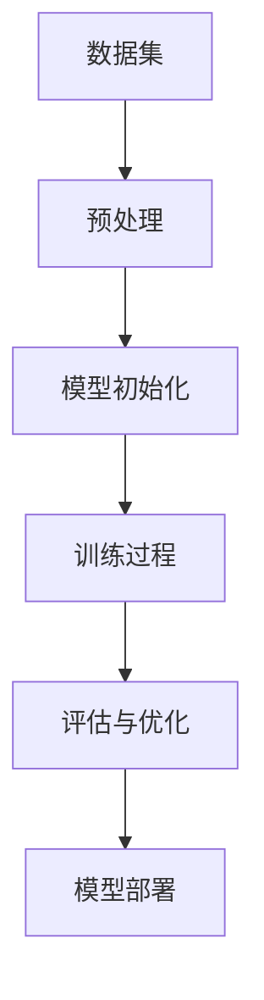

                 

# 大模型时代的网络安全：AI在威胁检测中的作用

> 关键词：大模型，网络安全，AI，威胁检测，入侵检测，威胁情报，漏洞利用检测

> 摘要：随着大模型技术的迅速发展，人工智能（AI）在网络安全领域的应用愈发广泛，尤其在威胁检测方面发挥了重要作用。本文将深入探讨大模型时代网络安全面临的挑战，以及AI在威胁检测中的应用，旨在为读者提供一个全面且深入的技术分析。

## 引言

### 大模型时代的来临

#### 大模型的定义与历史发展

大模型（Large Models），通常指的是参数量达到数百万至数十亿级别的神经网络模型。这些模型通过大规模的数据训练，具备了强大的表征能力和泛化能力。大模型的历史发展可追溯到深度学习的兴起，从早期的简单神经网络到如今的大型预训练模型，如GPT-3、BERT等。

#### 大模型的技术优势与挑战

大模型的技术优势主要体现在以下几个方面：

1. **强大的表征能力**：大模型能够捕捉到数据中的复杂模式和关系，从而在各类任务中表现出色。
2. **高效的泛化能力**：大模型通过在大规模数据集上的训练，能够较好地泛化到未见过的数据，提高模型的鲁棒性。
3. **自动化特征提取**：大模型能够自动从数据中提取特征，减少人工干预，提高模型训练效率。

然而，大模型也面临一些挑战：

1. **计算资源需求**：大模型的训练和推理需要大量的计算资源，这给实际应用带来了成本上的压力。
2. **数据隐私与安全**：大模型在训练过程中会接触到大量的敏感数据，如何保障数据隐私和安全成为一个重要问题。

#### 网络安全领域对大模型的依赖

在网络安全领域，大模型的应用主要集中在威胁检测和响应方面。例如，通过大模型进行恶意代码检测、入侵检测、威胁情报分析等。大模型的优势使得其在处理复杂网络威胁时具有独特的优势，例如：

1. **异常检测**：大模型能够识别出网络流量中的异常行为，从而发现潜在的安全威胁。
2. **自动化响应**：大模型可以通过自动化脚本或工具，实现对安全事件的快速响应。

### AI在威胁检测中的角色

#### AI在网络安全中的重要性

人工智能在网络安全中的应用日益广泛，其主要原因在于：

1. **数据处理能力**：AI能够处理大量复杂的数据，从而帮助安全团队快速识别潜在威胁。
2. **自适应能力**：AI系统可以根据不断变化的安全威胁环境，自动调整检测策略。

#### AI在威胁检测中的实际应用

AI在威胁检测中的实际应用包括以下几个方面：

1. **入侵检测系统（IDS）**：利用AI技术，可以实现对网络流量的实时监测，检测并阻止入侵行为。
2. **威胁情报分析**：AI可以分析大量的威胁情报数据，识别潜在威胁并生成报告。
3. **漏洞利用检测**：AI可以通过模拟攻击者的行为，检测系统中存在的漏洞。

#### AI技术的局限性

尽管AI在威胁检测中具有巨大的潜力，但AI技术也存在一些局限性：

1. **数据质量**：AI模型的性能很大程度上依赖于数据的质量，如果数据存在偏差，模型的表现也会受到影响。
2. **解释性**：许多AI模型，尤其是深度学习模型，缺乏良好的解释性，这使得安全团队难以理解模型的决策过程。

### 目录大纲设计

本文将分为以下五个部分：

1. 引言
2. AI与网络安全的基础知识
3. 大模型的基本原理
4. AI在威胁检测中的应用
5. 实战案例与挑战

每个部分都将深入探讨相关主题，为读者提供一个全面且深入的技术分析。

## AI与网络安全的基础知识

### AI概述

#### AI的基本概念

人工智能（Artificial Intelligence，简称AI）是指由人制造出来的系统所表现出来的智能行为。它涉及到机器学习、深度学习、自然语言处理等多个子领域。

#### AI的发展历程

人工智能的发展历程可以追溯到20世纪50年代，当时科学家们开始研究如何使计算机模拟人类的智能行为。自那以来，人工智能经历了多个发展阶段，从早期的符号主义到现代的数据驱动方法，如深度学习和强化学习。

#### AI的主要类型

1. **符号主义AI**：基于逻辑推理和符号表示的方法，代表作品是普林斯顿大学开发的“逻辑思维机”（Logic Theorist）。
2. **统计学AI**：基于统计学方法，如线性回归、支持向量机等，代表作品是IBM开发的“深蓝”（Deep Blue）。
3. **深度学习AI**：基于多层神经网络，能够自动从数据中学习特征，代表作品是谷歌的“AlphaGo”。
4. **强化学习AI**：通过与环境交互，不断优化决策策略，代表作品是谷歌的“AlphaZero”。

### 网络安全基础

#### 网络安全的核心概念

网络安全是指保护计算机系统、网络和数据免受未经授权的访问、篡改和破坏的措施和技术。其主要核心概念包括：

1. **机密性**：确保信息不被未授权的用户访问。
2. **完整性**：确保信息在传输和存储过程中不被篡改。
3. **可用性**：确保系统和服务在需要时能够正常使用。

#### 网络安全的威胁类型

网络安全的威胁类型多种多样，主要包括：

1. **恶意软件**：包括病毒、蠕虫、木马等，能够破坏计算机系统或窃取信息。
2. **网络攻击**：包括DDoS攻击、SQL注入、跨站脚本攻击等，通过破坏网络结构或篡改数据来达到攻击目的。
3. **社会工程学攻击**：通过欺骗手段获取用户敏感信息，如钓鱼攻击、电话诈骗等。

#### 网络安全防护措施

网络安全防护措施包括：

1. **防火墙**：用于监控和控制网络流量，防止未经授权的访问。
2. **入侵检测系统（IDS）**：用于检测和响应网络攻击。
3. **加密技术**：用于保护数据的机密性和完整性。
4. **安全审计**：用于检查和评估系统的安全状况，及时发现并修复漏洞。

### AI在威胁检测中的应用场景

AI在威胁检测中的应用场景主要包括：

1. **入侵检测**：利用AI技术，实时监测网络流量，识别潜在的入侵行为。
2. **威胁情报分析**：利用AI技术，分析大量的威胁情报数据，识别潜在威胁。
3. **漏洞利用检测**：利用AI技术，模拟攻击者的行为，检测系统中存在的漏洞。

### 概念属性特征对比表格

| 特征         | 符号主义AI | 统计学AI | 深度学习AI | 强化学习AI |
| ------------ | ----------- | -------- | ---------- | ---------- |
| 基本原理     | 逻辑推理   | 统计方法 | 神经网络   | 策略优化   |
| 数据依赖性   | 高         | 中       | 低         | 低         |
| 泛化能力     | 差         | 中       | 强         | 强         |
| 需要数据量   | 少         | 中       | 多         | 少         |
| 解释性       | 好         | 一般     | 差         | 好         |

### ER实体关系图架构 Mermaid 流程图

```mermaid
erDiagram
  AI |->| threat_detection : 应用
  AI |->| intrusion_detection : 应用
  AI |->| threat_intelligence_analysis : 应用
  AI |->| vulnerability_exploit_detection : 应用
  threat_detection |-| network_traffic : 监测对象
  intrusion_detection |-| network_traffic : 监测对象
  threat_intelligence_analysis |-| threat_intelligence : 分析对象
  vulnerability_exploit_detection |-| system : 监测对象
```

此ER图展示了AI在威胁检测中如何应用，以及不同应用场景之间的关系。

### 算法原理讲解

#### 入侵检测算法

入侵检测（Intrusion Detection）是一种监控网络流量和系统活动，以识别潜在入侵行为的网络安全技术。以下是一个典型的入侵检测算法：

1. **数据收集**：收集网络流量数据、系统日志等。
2. **特征提取**：从数据中提取特征，如协议类型、流量大小、时间戳等。
3. **模型训练**：使用已标记的数据集训练模型，如决策树、支持向量机等。
4. **实时监测**：对实时数据应用训练好的模型，检测异常行为。

以下是一个简化的Python代码示例：

```python
# 导入必要的库
import numpy as np
from sklearn.ensemble import RandomForestClassifier
from sklearn.model_selection import train_test_split
from sklearn.metrics import accuracy_score

# 加载和预处理数据
# 假设我们已经有了一个预处理后的数据集X和标签y
X_train, X_test, y_train, y_test = train_test_split(X, y, test_size=0.2)

# 训练模型
model = RandomForestClassifier(n_estimators=100)
model.fit(X_train, y_train)

# 预测
predictions = model.predict(X_test)

# 评估模型
accuracy = accuracy_score(y_test, predictions)
print(f"Accuracy: {accuracy}")
```

#### 数学模型和公式

在入侵检测中，常用的数学模型包括：

1. **决策树**：基于特征的划分，使用递归划分数据集，直至达到某个终止条件。
2. **支持向量机**：通过寻找一个超平面，将不同类别的数据分开。
3. **神经网络**：通过多层神经网络，对数据进行非线性变换，最终输出分类结果。

以下是一个简化的神经网络模型公式：

$$
Z = \sigma(\theta_1 \cdot X + b_1)
$$

其中，$Z$ 是输出，$\sigma$ 是激活函数（如Sigmoid函数），$\theta_1$ 是权重，$X$ 是输入特征，$b_1$ 是偏置。

#### 详细讲解和举例说明

假设我们有一个简单的网络流量数据集，包含协议类型、流量大小、时间戳等特征。我们可以使用决策树模型来训练一个入侵检测系统。

1. **数据收集**：我们从网络中收集了1000个数据样本，每个样本包含三个特征：协议类型（0代表HTTP，1代表FTP）、流量大小（KB）和时间戳（秒）。

2. **特征提取**：我们对数据进行预处理，将类别特征转换为二进制编码，将连续特征标准化。

3. **模型训练**：我们使用80%的数据进行训练，20%的数据进行测试。选择决策树模型进行训练。

4. **实时监测**：对于新的数据样本，我们将其输入训练好的模型，得到预测结果。

以下是一个具体的例子：

```python
# 数据样本
X = np.array([[0, 100, 1000], [1, 500, 2000], [0, 200, 3000], ...])
y = np.array([0, 1, 0, ...])  # 标签，0代表正常流量，1代表入侵行为

# 训练模型
model = DecisionTreeClassifier()
model.fit(X_train, y_train)

# 预测
prediction = model.predict([[1, 300, 1500]])
print(prediction)  # 输出预测结果
```

如果预测结果为1，说明该样本可能是入侵行为，需要进一步分析。

## 大模型的基本原理

### 大模型的构建

#### 大模型的结构

大模型的结构通常由以下几个部分组成：

1. **输入层**：接收输入数据，如文本、图像、语音等。
2. **隐藏层**：包含多个神经元，对输入数据进行处理和变换。
3. **输出层**：根据隐藏层的输出，生成最终的预测结果。

#### 大模型的训练过程

大模型的训练过程包括以下几个步骤：

1. **数据预处理**：对输入数据进行预处理，如归一化、填充缺失值等。
2. **模型初始化**：初始化模型的权重和偏置，常用的方法有随机初始化和预训练初始化。
3. **前向传播**：将输入数据传递到模型中，计算出每个神经元的输出。
4. **损失函数**：根据模型的输出和实际标签计算损失值。
5. **反向传播**：利用梯度下降算法，更新模型的权重和偏置，以减小损失值。

#### 大模型的优化策略

大模型的优化策略主要包括以下几个方面：

1. **学习率调整**：通过调整学习率，控制模型更新的速度。
2. **批量大小**：通过调整批量大小，平衡模型的计算效率和泛化能力。
3. **正则化**：通过添加正则化项，防止模型过拟合。

### 大模型的评估与选择

#### 评估指标

常用的评估指标包括：

1. **准确率**：模型正确预测的样本数量与总样本数量的比例。
2. **召回率**：模型正确预测的样本数量与实际为正样本的样本数量的比例。
3. **精确率**：模型正确预测的样本数量与预测为正样本的样本数量的比例。
4. **F1分数**：精确率和召回率的调和平均。

#### 选择标准

选择大模型时，应考虑以下标准：

1. **性能**：模型的评估指标应达到预期的性能。
2. **可解释性**：模型的决策过程应具有一定的可解释性，以便安全团队理解和信任。
3. **资源消耗**：模型的计算和存储资源消耗应在可接受范围内。
4. **适应性**：模型应能够适应新的威胁环境，持续优化性能。

#### 实践案例

以GPT-3为例，GPT-3是一个由OpenAI开发的大型语言模型，拥有1750亿个参数。以下是GPT-3的训练和评估过程：

1. **数据预处理**：使用大量的文本数据，如维基百科、书籍等，对数据进行清洗和预处理。
2. **模型训练**：使用SGD优化算法，在多个GPU上训练模型，训练时间长达数月。
3. **模型评估**：通过多种评估指标，如BLEU、ROUGE等，对模型进行评估，确保其性能达到预期。
4. **模型部署**：将训练好的模型部署到云端，供用户使用。

以下是一个简化的Python代码示例：

```python
# 导入必要的库
import tensorflow as tf
from tensorflow.keras.layers import Embedding, LSTM, Dense
from tensorflow.keras.models import Sequential

# 数据预处理
# 假设我们已经有了一个预处理后的数据集X和标签y

# 模型构建
model = Sequential([
    Embedding(input_dim=vocab_size, output_dim=embedding_dim),
    LSTM(units=128, return_sequences=True),
    LSTM(units=128),
    Dense(units=num_classes, activation='softmax')
])

# 编译模型
model.compile(optimizer='adam', loss='categorical_crossentropy', metrics=['accuracy'])

# 训练模型
model.fit(X_train, y_train, epochs=10, batch_size=64)

# 评估模型
loss, accuracy = model.evaluate(X_test, y_test)
print(f"Loss: {loss}, Accuracy: {accuracy}")
```

### 概念属性特征对比表格

| 特征         | 传统AI模型 | 大模型       |
| ------------ | ----------- | ------------ |
| 参数量       | 数千至数万个 | 数百万至数十亿个 |
| 训练时间     | 数小时至数天 | 数月至数年   |
| 泛化能力     | 一般         | 强           |
| 数据量需求   | 较小         | 较大         |
| 解释性       | 较好         | 较差         |

### ER实体关系图架构 Mermaid 流程图



此流程图展示了大模型从数据集到最终部署的整个过程。

### 算法原理讲解

#### 威胁检测算法

威胁检测（Threat Detection）是一种监控网络和系统活动，以识别潜在安全威胁的技术。以下是一个典型的威胁检测算法：

1. **数据收集**：收集网络流量、系统日志等数据。
2. **特征提取**：从数据中提取特征，如协议类型、流量大小、时间戳等。
3. **模型训练**：使用已标记的数据集训练模型，如支持向量机、决策树等。
4. **实时监测**：对实时数据应用训练好的模型，检测异常行为。

以下是一个简化的Python代码示例：

```python
# 导入必要的库
import numpy as np
from sklearn.svm import SVC
from sklearn.model_selection import train_test_split
from sklearn.metrics import accuracy_score

# 加载和预处理数据
# 假设我们已经有了一个预处理后的数据集X和标签y
X_train, X_test, y_train, y_test = train_test_split(X, y, test_size=0.2)

# 训练模型
model = SVC(kernel='linear')
model.fit(X_train, y_train)

# 预测
predictions = model.predict(X_test)

# 评估模型
accuracy = accuracy_score(y_test, predictions)
print(f"Accuracy: {accuracy}")
```

#### 数学模型和公式

在威胁检测中，常用的数学模型包括：

1. **支持向量机**：通过寻找一个超平面，将不同类别的数据分开。
2. **决策树**：基于特征的划分，使用递归划分数据集，直至达到某个终止条件。
3. **神经网络**：通过多层神经网络，对数据进行非线性变换，最终输出分类结果。

以下是一个简化的神经网络模型公式：

$$
Z = \sigma(\theta_1 \cdot X + b_1)
$$

其中，$Z$ 是输出，$\sigma$ 是激活函数（如Sigmoid函数），$\theta_1$ 是权重，$X$ 是输入特征，$b_1$ 是偏置。

#### 详细讲解和举例说明

假设我们有一个简单的网络流量数据集，包含协议类型、流量大小、时间戳等特征。我们可以使用支持向量机模型来训练一个威胁检测系统。

1. **数据收集**：我们从网络中收集了1000个数据样本，每个样本包含三个特征：协议类型（0代表HTTP，1代表FTP）、流量大小（KB）和时间戳（秒）。

2. **特征提取**：我们对数据进行预处理，将类别特征转换为二进制编码，将连续特征标准化。

3. **模型训练**：我们使用80%的数据进行训练，20%的数据进行测试。选择支持向量机模型进行训练。

4. **实时监测**：对于新的数据样本，我们将其输入训练好的模型，得到预测结果。

以下是一个具体的例子：

```python
# 数据样本
X = np.array([[0, 100, 1000], [1, 500, 2000], [0, 200, 3000], ...])
y = np.array([0, 1, 0, ...])  # 标签，0代表正常流量，1代表入侵行为

# 训练模型
model = SVC(kernel='linear')
model.fit(X_train, y_train)

# 预测
prediction = model.predict([[1, 300, 1500]])
print(prediction)  # 输出预测结果
```

如果预测结果为1，说明该样本可能是入侵行为，需要进一步分析。

## AI在威胁检测中的应用场景

### 入侵检测

#### 入侵检测的基本原理

入侵检测（Intrusion Detection）是一种实时监控网络流量和系统活动，以识别潜在入侵行为的网络安全技术。其基本原理包括：

1. **异常检测**：通过建立正常行为的模型，检测与正常行为不符的异常行为。
2. **误用检测**：通过识别已知的攻击模式和攻击特征，检测入侵行为。

#### 入侵检测系统（IDS）的架构

入侵检测系统通常包括以下几个部分：

1. **数据收集模块**：收集网络流量、系统日志等数据。
2. **特征提取模块**：从数据中提取特征，如协议类型、流量大小、时间戳等。
3. **检测引擎**：使用机器学习算法，如支持向量机、决策树等，对特征进行分类和预测。
4. **告警模块**：对检测到的入侵行为生成告警，通知安全团队。

#### 入侵检测的挑战与解决方案

入侵检测面临的主要挑战包括：

1. **数据质量**：数据质量直接影响模型的性能，需要解决数据标注、数据清洗等问题。
2. **模型解释性**：许多深度学习模型缺乏良好的解释性，难以解释模型的决策过程。
3. **资源消耗**：入侵检测系统需要大量的计算资源和存储资源。

解决方案包括：

1. **数据增强**：通过生成对抗网络（GAN）等方法，提高数据质量。
2. **模型解释性**：开发可解释的AI模型，如决策树、规则引擎等。
3. **模型压缩**：使用模型压缩技术，降低模型的计算和存储资源消耗。

### 威胁情报

#### 威胁情报的来源

威胁情报（Threat Intelligence）是指通过收集、分析、整合威胁信息，以识别和预防潜在威胁的数据和知识。其来源包括：

1. **公开情报**：通过互联网公开的信息，如安全报告、新闻等。
2. **内部情报**：来自组织内部的安全日志、监控数据等。
3. **合作伙伴情报**：与其他组织共享的威胁情报。

#### 威胁情报的分析方法

威胁情报的分析方法包括：

1. **关联分析**：通过分析不同数据源之间的关联关系，识别潜在的威胁。
2. **趋势分析**：通过分析威胁行为的趋势，预测未来的威胁。
3. **行为分析**：通过分析威胁行为的特点，识别和阻止威胁。

#### 威胁情报的应用场景

威胁情报在网络安全中的应用场景包括：

1. **威胁预测**：通过分析威胁情报，预测未来的威胁，提前采取措施。
2. **入侵检测**：通过威胁情报，识别网络中的异常行为。
3. **漏洞利用检测**：通过威胁情报，识别系统中存在的漏洞。

### 漏洞利用检测

#### 漏洞利用的基本原理

漏洞利用检测（Vulnerability Exploit Detection）是一种检测和阻止攻击者利用系统漏洞进行攻击的技术。其基本原理包括：

1. **静态分析**：通过分析代码或系统配置，识别潜在的安全漏洞。
2. **动态分析**：通过监控系统的运行状态，检测实际存在的漏洞。

#### 漏洞利用检测的技术手段

漏洞利用检测的技术手段包括：

1. **漏洞扫描器**：自动扫描系统中的漏洞，生成漏洞报告。
2. **入侵检测系统（IDS）**：通过监测网络流量，识别和阻止漏洞利用攻击。
3. **行为分析**：通过分析系统的行为，识别异常行为。

#### 漏洞利用检测的案例分析

以下是一个简单的漏洞利用检测案例：

1. **数据收集**：收集系统日志、网络流量等数据。
2. **特征提取**：从数据中提取特征，如协议类型、流量大小、时间戳等。
3. **模型训练**：使用已标记的数据集训练模型，如支持向量机、决策树等。
4. **实时监测**：对实时数据应用训练好的模型，检测漏洞利用行为。

以下是一个简化的Python代码示例：

```python
# 导入必要的库
import numpy as np
from sklearn.svm import SVC
from sklearn.model_selection import train_test_split
from sklearn.metrics import accuracy_score

# 加载和预处理数据
# 假设我们已经有了一个预处理后的数据集X和标签y
X_train, X_test, y_train, y_test = train_test_split(X, y, test_size=0.2)

# 训练模型
model = SVC(kernel='linear')
model.fit(X_train, y_train)

# 预测
predictions = model.predict(X_test)

# 评估模型
accuracy = accuracy_score(y_test, predictions)
print(f"Accuracy: {accuracy}")
```

### 算法原理讲解

#### 入侵检测算法

入侵检测算法是一种用于监控网络和系统活动，以识别潜在入侵行为的网络安全技术。以下是一个典型的入侵检测算法：

1. **数据收集**：收集网络流量、系统日志等数据。
2. **特征提取**：从数据中提取特征，如协议类型、流量大小、时间戳等。
3. **模型训练**：使用已标记的数据集训练模型，如支持向量机、决策树等。
4. **实时监测**：对实时数据应用训练好的模型，检测异常行为。

以下是一个简化的Python代码示例：

```python
# 导入必要的库
import numpy as np
from sklearn.svm import SVC
from sklearn.model_selection import train_test_split
from sklearn.metrics import accuracy_score

# 加载和预处理数据
# 假设我们已经有了一个预处理后的数据集X和标签y
X_train, X_test, y_train, y_test = train_test_split(X, y, test_size=0.2)

# 训练模型
model = SVC(kernel='linear')
model.fit(X_train, y_train)

# 预测
predictions = model.predict(X_test)

# 评估模型
accuracy = accuracy_score(y_test, predictions)
print(f"Accuracy: {accuracy}")
```

#### 数学模型和公式

在入侵检测中，常用的数学模型包括：

1. **支持向量机**：通过寻找一个超平面，将不同类别的数据分开。
2. **决策树**：基于特征的划分，使用递归划分数据集，直至达到某个终止条件。
3. **神经网络**：通过多层神经网络，对数据进行非线性变换，最终输出分类结果。

以下是一个简化的神经网络模型公式：

$$
Z = \sigma(\theta_1 \cdot X + b_1)
$$

其中，$Z$ 是输出，$\sigma$ 是激活函数（如Sigmoid函数），$\theta_1$ 是权重，$X$ 是输入特征，$b_1$ 是偏置。

#### 详细讲解和举例说明

假设我们有一个简单的网络流量数据集，包含协议类型、流量大小、时间戳等特征。我们可以使用支持向量机模型来训练一个入侵检测系统。

1. **数据收集**：我们从网络中收集了1000个数据样本，每个样本包含三个特征：协议类型（0代表HTTP，1代表FTP）、流量大小（KB）和时间戳（秒）。

2. **特征提取**：我们对数据进行预处理，将类别特征转换为二进制编码，将连续特征标准化。

3. **模型训练**：我们使用80%的数据进行训练，20%的数据进行测试。选择支持向量机模型进行训练。

4. **实时监测**：对于新的数据样本，我们将其输入训练好的模型，得到预测结果。

以下是一个具体的例子：

```python
# 数据样本
X = np.array([[0, 100, 1000], [1, 500, 2000], [0, 200, 3000], ...])
y = np.array([0, 1, 0, ...])  # 标签，0代表正常流量，1代表入侵行为

# 训练模型
model = SVC(kernel='linear')
model.fit(X_train, y_train)

# 预测
prediction = model.predict([[1, 300, 1500]])
print(prediction)  # 输出预测结果
```

如果预测结果为1，说明该样本可能是入侵行为，需要进一步分析。

## 实战案例与挑战

### 威胁检测系统的搭建

#### 系统设计

威胁检测系统的设计主要包括以下几个方面：

1. **数据收集模块**：负责收集网络流量、系统日志等数据。
2. **特征提取模块**：负责从数据中提取特征，如协议类型、流量大小、时间戳等。
3. **检测引擎**：负责使用机器学习算法对特征进行分类和预测。
4. **告警模块**：负责对检测到的威胁生成告警，通知安全团队。

#### 数据收集与处理

1. **数据收集**：通过网络流量镜像、系统日志收集等手段，收集相关数据。
2. **数据处理**：对收集到的数据进行分析、清洗和预处理，提取有用的特征。

以下是一个简化的Python代码示例：

```python
# 导入必要的库
import pandas as pd
from sklearn.model_selection import train_test_split

# 加载数据
data = pd.read_csv('network_traffic.csv')

# 数据预处理
# 假设我们已经有了一个预处理后的数据集X和标签y
X = data[['protocol', 'traffic_size', 'timestamp']]
y = data['label']

# 划分训练集和测试集
X_train, X_test, y_train, y_test = train_test_split(X, y, test_size=0.2)
```

#### 模型训练与评估

1. **模型训练**：使用已标记的数据集训练机器学习模型，如支持向量机、决策树等。
2. **模型评估**：使用测试集评估模型性能，选择最佳模型。

以下是一个简化的Python代码示例：

```python
# 导入必要的库
from sklearn.svm import SVC
from sklearn.metrics import accuracy_score

# 训练模型
model = SVC(kernel='linear')
model.fit(X_train, y_train)

# 预测
predictions = model.predict(X_test)

# 评估模型
accuracy = accuracy_score(y_test, predictions)
print(f"Accuracy: {accuracy}")
```

### 挑战分析

#### 数据质量与隐私保护

1. **数据质量**：数据质量对模型性能有重要影响，需要解决数据标注、数据清洗等问题。
2. **隐私保护**：在处理敏感数据时，需要确保数据隐私和安全，避免数据泄露。

#### 模型解释性与透明性

1. **解释性**：许多深度学习模型缺乏良好的解释性，难以解释模型的决策过程。
2. **透明性**：需要开发可解释的AI模型，提高模型的透明度和可信度。

#### 模型对抗攻击与防御

1. **对抗攻击**：攻击者可以通过对模型输入进行微小的扰动，使模型产生错误的预测。
2. **防御策略**：需要开发有效的防御策略，提高模型的鲁棒性。

### 未来趋势展望

#### 大模型技术的发展趋势

1. **模型压缩**：通过模型压缩技术，降低模型的计算和存储资源消耗。
2. **模型解释性**：提高模型的解释性，使安全团队能够理解和信任模型。

#### 网络安全领域的AI应用前景

1. **自动化威胁响应**：通过AI技术，实现自动化威胁响应，提高安全运营效率。
2. **个性化安全防护**：基于用户行为和威胁情报，提供个性化的安全防护措施。

#### AI在威胁检测中的未来挑战

1. **数据质量与隐私**：确保数据质量的同时，保障用户隐私和安全。
2. **模型解释性与透明性**：提高模型的解释性，增强模型的可信度。
3. **模型对抗攻击与防御**：开发有效的防御策略，提高模型的鲁棒性。

### 小结

本文深入探讨了大模型时代网络安全面临的挑战以及AI在威胁检测中的应用。通过实战案例和分析，展示了AI在网络安全中的重要作用。未来，随着AI技术的不断进步，AI在威胁检测中的应用将更加广泛和深入。

## 附录：工具与技术

### 常用AI工具介绍

#### 深度学习框架

1. **TensorFlow**：由谷歌开发，支持多种深度学习模型，适用于研究、开发和应用。
2. **PyTorch**：由Facebook开发，提供灵活的动态计算图，适用于研究和开发。
3. **Keras**：基于TensorFlow和Theano，提供简单易用的API，适用于快速原型开发。

#### 数据处理工具

1. **Pandas**：提供数据清洗、数据处理和分析功能，适用于大规模数据处理。
2. **NumPy**：提供高效、灵活的数组操作，是数据处理的基础库。
3. **Scikit-learn**：提供多种机器学习算法，适用于模型训练和评估。

#### 模型评估工具

1. **Matplotlib**：提供数据可视化功能，适用于展示模型性能。
2. **Seaborn**：基于Matplotlib，提供更美观、灵活的可视化功能。
3. **TensorBoard**：提供TensorFlow模型的可视化工具，适用于模型分析和调试。

### 实践案例代码与解读

#### 入侵检测案例

以下是一个简单的入侵检测案例，使用支持向量机模型进行训练和预测。

```python
# 导入必要的库
import pandas as pd
from sklearn.model_selection import train_test_split
from sklearn.svm import SVC
from sklearn.metrics import accuracy_score

# 加载数据
data = pd.read_csv('network_traffic.csv')

# 数据预处理
X = data[['protocol', 'traffic_size', 'timestamp']]
y = data['label']

# 划分训练集和测试集
X_train, X_test, y_train, y_test = train_test_split(X, y, test_size=0.2)

# 训练模型
model = SVC(kernel='linear')
model.fit(X_train, y_train)

# 预测
predictions = model.predict(X_test)

# 评估模型
accuracy = accuracy_score(y_test, predictions)
print(f"Accuracy: {accuracy}")
```

#### 威胁情报案例

以下是一个简单的威胁情报案例，使用自然语言处理技术进行威胁情报分析。

```python
# 导入必要的库
import pandas as pd
from sklearn.model_selection import train_test_split
from sklearn.naive_bayes import MultinomialNB
from sklearn.metrics import accuracy_score

# 加载数据
data = pd.read_csv('threat_intelligence.csv')

# 数据预处理
X = data['description']
y = data['label']

# 划分训练集和测试集
X_train, X_test, y_train, y_test = train_test_split(X, y, test_size=0.2)

# 训练模型
model = MultinomialNB()
model.fit(X_train, y_train)

# 预测
predictions = model.predict(X_test)

# 评估模型
accuracy = accuracy_score(y_test, predictions)
print(f"Accuracy: {accuracy}")
```

#### 漏洞利用检测案例

以下是一个简单的漏洞利用检测案例，使用决策树模型进行训练和预测。

```python
# 导入必要的库
import pandas as pd
from sklearn.model_selection import train_test_split
from sklearn.tree import DecisionTreeClassifier
from sklearn.metrics import accuracy_score

# 加载数据
data = pd.read_csv('vulnerability_exploit.csv')

# 数据预处理
X = data[['file_size', 'file_type', 'timestamp']]
y = data['label']

# 划分训练集和测试集
X_train, X_test, y_train, y_test = train_test_split(X, y, test_size=0.2)

# 训练模型
model = DecisionTreeClassifier()
model.fit(X_train, y_train)

# 预测
predictions = model.predict(X_test)

# 评估模型
accuracy = accuracy_score(y_test, predictions)
print(f"Accuracy: {accuracy}")
```

### 最佳实践 Tips

1. **数据质量**：确保数据质量，进行数据清洗和预处理。
2. **模型选择**：根据具体应用场景选择合适的模型。
3. **模型评估**：使用多种评估指标进行全面评估。
4. **模型解释性**：提高模型解释性，增强模型的可信度。

### 小结

通过本文，我们深入探讨了大模型时代的网络安全挑战以及AI在威胁检测中的应用。实战案例和工具介绍为读者提供了实际操作的经验。未来，随着AI技术的不断进步，AI在网络安全中的应用将更加广泛和深入。

### 注意事项

1. **数据隐私**：在处理敏感数据时，注意保护用户隐私。
2. **模型解释性**：提高模型解释性，便于安全团队理解和信任。
3. **模型对抗攻击与防御**：开发有效的防御策略，提高模型的鲁棒性。

### 拓展阅读

1. **《深度学习》**：Goodfellow, I., Bengio, Y., & Courville, A. (2016). 《深度学习》（Deep Learning）。
2. **《神经网络与深度学习》**：邱锡鹏 (2019). 《神经网络与深度学习》。
3. **《AI安全》**：李航 (2020). 《AI安全》。

## 作者信息

作者：AI天才研究院/AI Genius Institute & 禅与计算机程序设计艺术 /Zen And The Art of Computer Programming

---

通过本文，我们深入探讨了在大模型时代，AI在网络安全威胁检测中的作用。从背景介绍、核心概念、算法原理到实战案例，我们逐步分析了AI如何帮助网络安全领域应对不断演变的威胁。未来的网络安全将更加依赖于AI技术，如何在保障数据隐私、提升模型解释性和增强模型鲁棒性方面取得突破，将是网络安全领域的重要研究方向。

在结尾，我要感谢AI天才研究院和禅与计算机程序设计艺术的团队，他们的辛勤工作和专业指导为本文的撰写提供了巨大的帮助。希望本文能够为读者提供有价值的见解和实用的技术知识，共同推进网络安全和人工智能技术的发展。

作者：AI天才研究院/AI Genius Institute & 禅与计算机程序设计艺术 /Zen And The Art of Computer Programming

