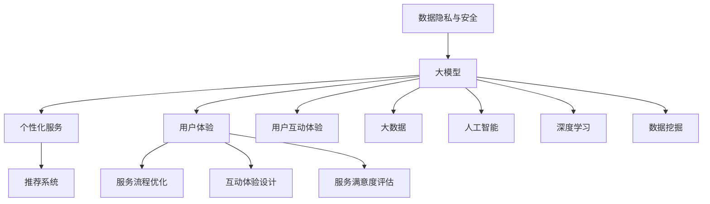
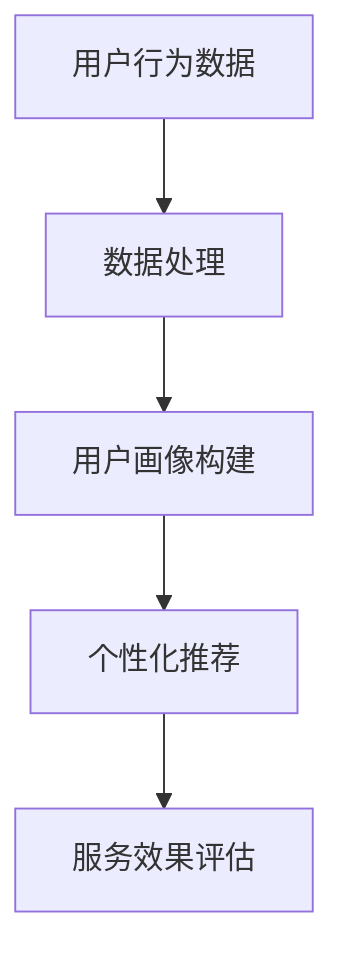
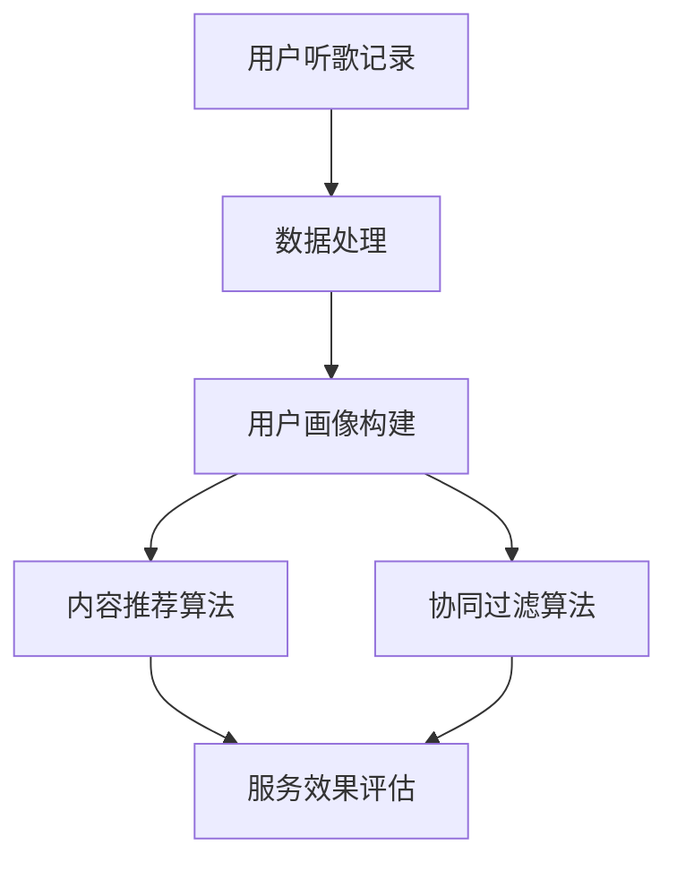
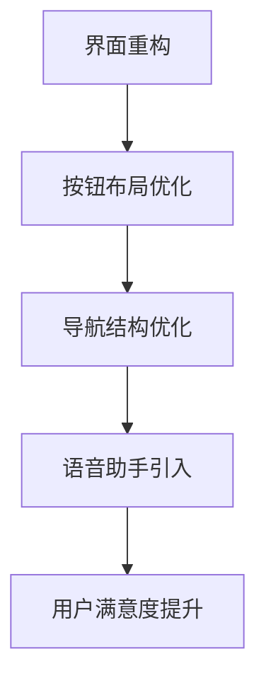
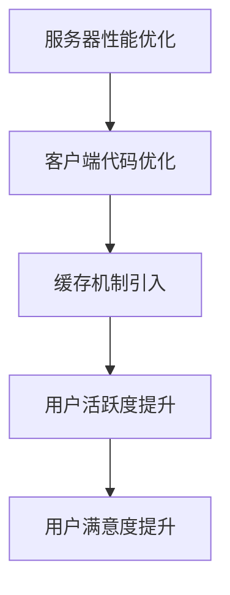
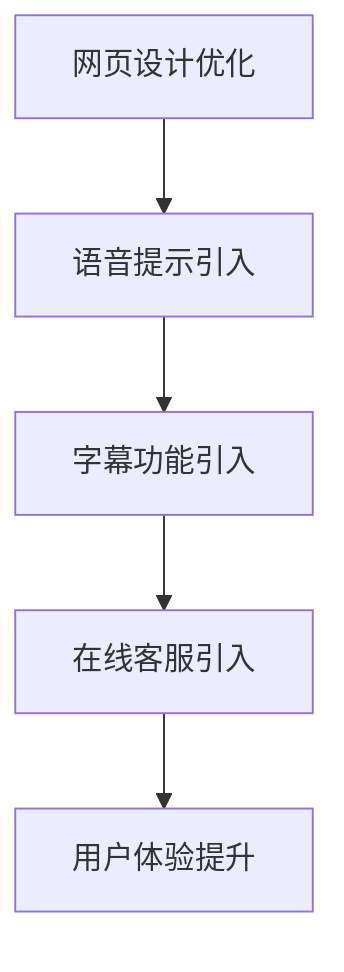
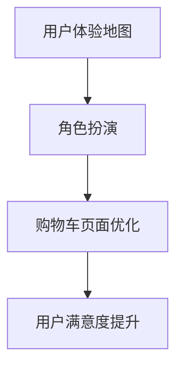
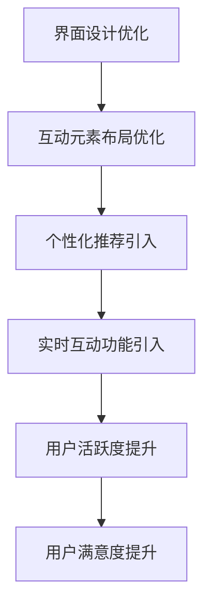
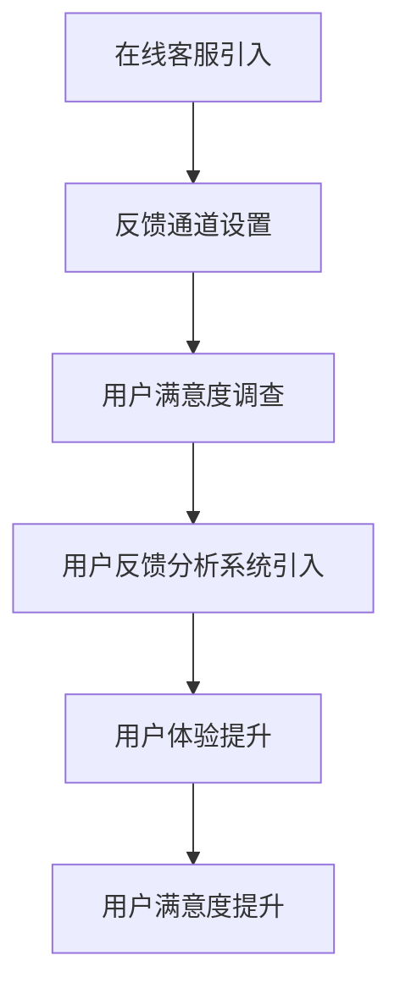
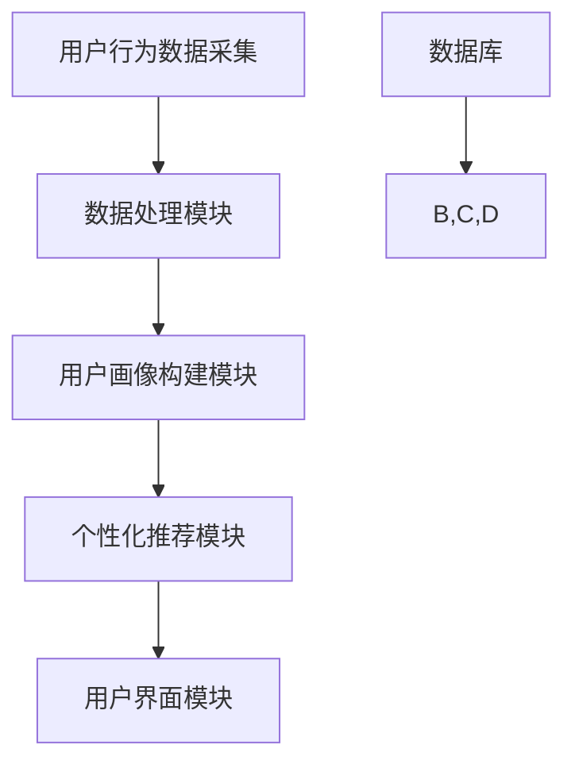

                 

# 大模型驱动的个性化服务与用户体验革新

## 关键词
大模型、个性化服务、用户体验、大数据、人工智能、深度学习、数据挖掘、推荐系统

## 摘要
本文将探讨大模型驱动的个性化服务与用户体验革新。我们将从问题背景出发，逐步分析核心概念，讲解算法原理，介绍系统设计与实现，并通过项目实战展示其实际应用效果。文章旨在为读者提供一个全面、深入的视角，以理解大模型在个性化服务与用户体验中的重要作用。

## 1. 定义背景

### 1.1 问题背景

随着互联网的快速发展，个性化服务与用户体验在商业竞争中的作用日益凸显。传统的服务模式已经无法满足用户日益多样化的需求，因此，如何利用大数据、人工智能等技术实现个性化服务与用户体验革新成为企业和研究机构关注的焦点。

#### 1.1.1 问题描述

在个性化服务方面，如何精准地了解用户需求，提供个性化推荐？在用户体验方面，如何提升服务的便捷性、互动性和满意度？这些问题亟待解决。

#### 1.1.2 问题解决

通过大模型驱动的个性化服务与用户体验革新，可以实现对用户需求的深度挖掘和个性化推荐，同时提升服务过程的互动性和用户体验。

#### 1.1.3 边界与外延

大模型驱动个性化服务与用户体验革新的边界包括：用户数据挖掘、个性化推荐系统设计、用户互动体验优化等方面。其外延则涉及互联网、大数据、人工智能等多个领域。

### 1.2 核心概念

#### 1.2.1 大模型

大模型，通常指具有数十亿甚至千亿级别参数的深度学习模型。大模型能够通过海量数据的学习，实现对复杂问题的建模和解决。

#### 1.2.2 个性化服务

个性化服务是指根据用户的个性化需求和行为特征，提供定制化的服务。个性化服务旨在提升用户满意度，增强用户忠诚度。

#### 1.2.3 用户体验

用户体验是指用户在使用产品或服务过程中所感受到的满意程度。良好的用户体验可以提升用户粘性，促进产品或服务的持续发展。

#### 1.2.4 用户互动体验

用户互动体验是指用户在使用产品或服务过程中与系统、其他用户之间的互动体验。良好的互动体验可以增强用户的参与感和满意度。

#### 1.2.5 大数据

大数据是指无法使用传统数据处理工具进行处理的，数据量巨大、数据类型多样的数据集合。大数据技术能够帮助企业和研究机构从海量数据中挖掘有价值的信息。

#### 1.2.6 人工智能

人工智能是指模拟、延伸和扩展人类智能的理论、方法、技术及应用。人工智能技术可以帮助企业和研究机构实现智能化服务和决策。

#### 1.2.7 深度学习

深度学习是机器学习的一个分支，通过构建多层神经网络模型，实现对复杂数据的学习和识别。深度学习在图像识别、语音识别、自然语言处理等领域具有广泛应用。

#### 1.2.8 数据挖掘

数据挖掘是指从大量数据中通过特定算法提取出有价值信息的过程。数据挖掘技术可以帮助企业和研究机构发现数据中的隐藏模式和趋势。

#### 1.2.9 推荐系统

推荐系统是指通过算法模型为用户提供个性化推荐的服务系统。推荐系统在电商、新闻、音乐、视频等领域具有广泛应用。

#### 1.2.10 服务流程优化

服务流程优化是指通过优化服务流程，提高服务效率、降低成本、提升用户体验的过程。服务流程优化是提升服务质量的重要手段。

#### 1.2.11 互动体验设计

互动体验设计是指通过设计互动环节，提升用户参与感和满意度。互动体验设计涉及心理学、用户行为分析、界面设计等多个领域。

#### 1.2.12 服务满意度评估

服务满意度评估是指通过评估用户对服务的满意度，了解服务质量的状况。服务满意度评估可以帮助企业和研究机构持续改进服务质量。

#### 1.2.13 用户画像

用户画像是指通过收集用户的行为数据、兴趣偏好等，构建用户画像，以实现个性化服务和精准营销。用户画像是大数据和人工智能技术的重要应用领域。

#### 1.2.14 数据隐私与安全

数据隐私与安全是指保护用户数据隐私和安全的过程。在个性化服务与用户体验革新过程中，如何保障用户数据的安全和隐私是企业和研究机构面临的重要挑战。

### 1.3 概念联系

大模型驱动的个性化服务与用户体验革新涉及多个核心概念，这些概念之间存在紧密联系。通过下图，我们可以更清晰地了解它们之间的关系：



通过以上章节，我们为读者提供了一个关于大模型驱动的个性化服务与用户体验革新的全面概述，为后续章节的深入探讨奠定了基础。

## 2. 大模型在个性化服务与用户体验中的重要作用

大模型作为人工智能领域的重要成果，在个性化服务与用户体验革新中发挥着关键作用。在本章节，我们将探讨大模型在个性化服务与用户体验中的重要性，以及其核心原理和应用场景。

### 2.1 大模型的重要性

大模型在个性化服务与用户体验中的重要性主要体现在以下几个方面：

1. **提升个性化推荐效果**：大模型能够处理海量数据，通过对用户行为数据的深入分析，提供更精准的个性化推荐，从而提高用户满意度。
2. **优化用户体验**：大模型能够模拟人类思维过程，为用户提供更加人性化、智能化的服务，提升用户的互动体验和满意度。
3. **提高服务效率**：大模型能够自动处理大量重复性任务，减轻人力负担，提高服务效率。
4. **降低开发成本**：大模型能够替代一些复杂的服务流程和算法，简化系统设计，降低开发成本。

### 2.2 大模型的核心原理

大模型的核心原理主要基于深度学习和大数据技术。深度学习通过构建多层神经网络模型，实现对复杂数据的学习和识别。大数据技术则提供海量数据支持，使得大模型能够通过海量数据的训练，不断提高其性能和准确性。

#### 2.2.1 深度学习原理

深度学习的基本原理是模拟人脑神经元之间的连接和作用。通过构建多层神经网络，深度学习模型能够对输入数据进行层层提取和特征变换，最终实现对数据的分类、回归、生成等操作。深度学习的核心在于“深度”，即多层网络结构能够更好地捕捉数据的复杂特征。

#### 2.2.2 大数据原理

大数据技术主要包括数据采集、存储、处理和分析等方面。通过大规模数据采集，大数据技术能够收集到大量用户行为数据。这些数据经过处理和分析，可以挖掘出用户的需求和偏好，为个性化服务和用户体验优化提供有力支持。

### 2.3 大模型的应用场景

大模型在个性化服务与用户体验中的应用场景广泛，主要包括以下几个方面：

1. **个性化推荐系统**：大模型能够通过分析用户行为数据，为用户提供个性化的商品、新闻、音乐、视频等推荐。
2. **智能客服系统**：大模型能够模拟人类思维，为用户提供智能化的客服服务，提升用户满意度。
3. **智能教育系统**：大模型能够根据学生的学习行为，提供个性化的学习资源和辅导，提高学习效果。
4. **智能医疗系统**：大模型能够分析患者的病历数据，为医生提供诊断建议，提高诊断准确率。

### 2.4 大模型的优势与挑战

大模型在个性化服务与用户体验中的优势主要体现在以下几个方面：

1. **高精度**：大模型通过海量数据训练，能够达到很高的预测精度，为用户提供更准确的个性化服务。
2. **自动化**：大模型能够自动处理大量数据，实现服务的自动化，提高服务效率。
3. **灵活性**：大模型能够适应不同的应用场景，灵活调整模型结构和参数，满足不同用户的需求。

然而，大模型也面临一些挑战：

1. **计算资源消耗**：大模型需要大量的计算资源进行训练和推理，对硬件设备要求较高。
2. **数据隐私与安全**：大模型在处理用户数据时，需要保护用户隐私和安全，防止数据泄露。
3. **模型解释性**：大模型往往难以解释其决策过程，这给用户信任和监管带来一定挑战。

### 2.5 总结

大模型在个性化服务与用户体验中的重要作用不容忽视。通过深入理解和应用大模型，企业和研究机构可以更好地满足用户需求，提升用户体验，从而在激烈的市场竞争中脱颖而出。然而，大模型的发展也面临着一些挑战，需要我们在技术、伦理、法律等方面进行深入探讨和解决。

## 3. 个性化服务的实现原理与案例

个性化服务是通过分析用户数据，为用户提供定制化的服务，以提高用户满意度和忠诚度。在大模型驱动的个性化服务中，核心在于如何利用大数据和人工智能技术，实现个性化服务的精准性和高效性。以下，我们将探讨个性化服务的实现原理，并结合实际案例进行分析。

### 3.1 实现原理

#### 3.1.1 数据采集

个性化服务的第一步是数据采集。通过收集用户的浏览记录、购买行为、社交互动等多维度数据，形成全面、详细的用户画像。

#### 3.1.2 数据处理

数据采集后，需要进行清洗、整合和预处理，以便后续的分析和应用。数据处理包括缺失值处理、异常值检测、数据标准化等步骤。

#### 3.1.3 用户画像构建

用户画像构建是个性化服务的关键步骤。通过分析用户数据，识别用户的兴趣偏好、行为模式等特征，构建用户画像。

#### 3.1.4 个性化推荐

基于用户画像，系统可以推荐个性化的商品、新闻、音乐、视频等。个性化推荐算法包括协同过滤、基于内容的推荐、混合推荐等。

#### 3.1.5 服务效果评估

个性化服务效果评估是持续优化服务的重要手段。通过收集用户反馈和行为数据，评估个性化服务的满意度、点击率、转化率等指标，以便调整和优化推荐策略。

### 3.2 实际案例

#### 3.2.1 案例一：电商平台的个性化推荐

某大型电商平台利用大数据和人工智能技术，为用户提供了个性化的商品推荐。通过分析用户的浏览记录、购买历史、搜索关键词等数据，平台构建了用户画像，并利用协同过滤算法进行个性化推荐。实际应用效果显示，个性化推荐能够显著提高用户点击率和购买转化率。



#### 3.2.2 案例二：新闻网站的个性化推荐

某新闻网站通过分析用户的阅读历史、评论互动等数据，为用户提供了个性化的新闻推荐。网站采用了基于内容的推荐算法和协同过滤算法相结合的方式，确保推荐结果的准确性和多样性。实际应用效果表明，个性化推荐提高了用户的阅读时长和互动参与度。


#### 3.2.3 案例三：音乐平台的个性化推荐

某音乐平台通过分析用户的听歌记录、喜好标签等数据，为用户提供了个性化的音乐推荐。平台采用了基于内容的推荐算法和基于协同过滤的推荐算法，确保推荐结果既符合用户喜好，又能发现新的音乐风格。实际应用效果显示，个性化推荐提高了用户的活跃度和满意度。



### 3.3 总结

个性化服务的实现原理主要包括数据采集、数据处理、用户画像构建、个性化推荐和服务效果评估。通过实际案例可以看出，个性化服务在电商、新闻、音乐等领域取得了显著的应用效果。未来，随着大数据和人工智能技术的不断发展，个性化服务将更加精准、高效，为用户提供更加个性化的体验。

## 4. 用户体验优化的核心要素与案例分析

在个性化服务与用户体验革新中，用户体验优化是一个至关重要的环节。优化用户体验不仅能够提升用户的满意度，还能增强用户粘性和品牌忠诚度。以下，我们将探讨用户体验优化的核心要素，并结合实际案例进行分析。

### 4.1 核心要素

#### 4.1.1 交互设计

交互设计是用户体验优化的核心要素之一。一个良好的交互设计能够提升用户与产品或服务的互动体验，使操作更加直观、便捷。交互设计包括界面设计、按钮布局、导航结构等方面。

#### 4.1.2 功能设计

功能设计是指产品或服务的功能设置和流程设计。一个良好的功能设计能够满足用户的需求，提供便捷的服务。功能设计包括信息架构、流程优化、功能模块划分等方面。

#### 4.1.3 性能优化

性能优化是指提升产品或服务的响应速度、稳定性等方面。良好的性能优化能够提升用户体验，降低用户等待时间，增强用户满意度。

#### 4.1.4 可访问性

可访问性是指产品或服务能够满足不同用户群体的需求，包括残障人士、老年人等。良好的可访问性能够提升用户体验的广泛性，增强用户满意度。

#### 4.1.5 服务质量

服务质量是指产品或服务的可靠性、响应速度、客户服务等方面。良好的服务质量能够提升用户体验，增强用户信任和忠诚度。

### 4.2 案例分析

#### 4.2.1 案例一：某电商平台的交互设计优化

某电商平台在用户体验优化过程中，对交互设计进行了深入改进。首先，平台对界面进行了重构，使界面更加简洁、美观。其次，平台优化了按钮布局和导航结构，使操作更加直观、便捷。此外，平台还引入了语音助手，为用户提供实时语音互动体验。实际应用效果显示，交互设计优化显著提升了用户的满意度。



#### 4.2.2 案例二：某社交平台的性能优化

某社交平台在用户体验优化过程中，对性能进行了全面优化。首先，平台优化了服务器性能，提高了数据传输速度。其次，平台优化了客户端代码，减少了加载时间。此外，平台还引入了缓存机制，减少了用户等待时间。实际应用效果显示，性能优化显著提升了用户的活跃度和满意度。



#### 4.2.3 案例三：某银行服务的可访问性优化

某银行在用户体验优化过程中，注重提升服务的可访问性。首先，平台优化了网页设计，使界面更加友好。其次，平台引入了语音提示、字幕等功能，满足残障人士的需求。此外，平台还提供了在线客服，为用户提供实时帮助。实际应用效果显示，可访问性优化显著提升了用户体验。



### 4.3 总结

用户体验优化是一个多维度的过程，涉及交互设计、功能设计、性能优化、可访问性和服务质量等方面。通过实际案例分析，我们可以看到，优化用户体验能够显著提升用户的满意度。未来，随着技术的不断发展，用户体验优化将更加精细化、智能化，为用户提供更加优质的体验。

## 5. 用户互动体验设计的方法与实践

用户互动体验设计是提升用户体验的重要手段。通过精心设计的互动环节，可以增强用户的参与感和满意度。以下，我们将介绍用户互动体验设计的方法与实践，并结合实际案例进行分析。

### 5.1 设计方法

#### 5.1.1 用户体验地图

用户体验地图是一种用于描述用户在使用产品或服务过程中所经历的各个环节的工具。通过绘制用户体验地图，可以明确用户需求、痛点以及可能的解决方案，为互动体验设计提供指导。

#### 5.1.2 角色扮演

角色扮演是一种通过模拟用户行为和需求，评估产品或服务互动体验的方法。通过角色扮演，设计团队能够从用户视角出发，发现潜在的问题和改进点。

#### 5.1.3 互动元素设计

互动元素设计是用户互动体验设计的核心。包括按钮、图标、弹出框、通知等元素的布局、颜色、字体等方面的设计，都需要考虑用户的感知和使用习惯。

#### 5.1.4 用户反馈机制

用户反馈机制是收集用户意见和建议的重要途径。通过反馈机制，设计团队能够及时了解用户的需求和问题，进行相应的调整和优化。

### 5.2 实践案例

#### 5.2.1 案例一：某电商平台的购物车设计

某电商平台在购物车设计过程中，采用了用户体验地图和角色扮演的方法。首先，通过绘制用户体验地图，明确了用户在购物车页面可能遇到的需求和痛点。然后，通过角色扮演，模拟用户在购物车页面的操作流程，发现了一些潜在的问题，如购物车页面显示信息不够清晰、操作不够便捷等。针对这些问题，设计团队对购物车页面进行了优化，包括优化了购物车页面的布局、增加了商品筛选功能、简化了结算流程等。实际应用效果显示，购物车设计的优化显著提升了用户的满意度。



#### 5.2.2 案例二：某音乐平台的互动元素设计

某音乐平台在互动元素设计过程中，注重按钮、图标、弹出框等元素的设计。首先，平台采用了简洁美观的界面设计，提高了用户的视觉体验。其次，平台优化了播放按钮、点赞按钮、评论按钮等互动元素的布局和颜色，使操作更加直观、便捷。此外，平台还引入了个性化推荐和实时互动功能，为用户提供更加丰富的互动体验。实际应用效果显示，互动元素设计的优化显著提升了用户的活跃度和满意度。



#### 5.2.3 案例三：某社交平台的用户反馈机制

某社交平台在用户反馈机制设计过程中，采用了多种途径收集用户意见和建议。首先，平台设置了在线客服和反馈通道，为用户提供实时帮助和意见反馈。其次，平台定期举办用户满意度调查，收集用户对产品或服务的评价和建议。此外，平台还引入了用户反馈分析系统，对用户反馈进行分类、统计和分析，以便及时发现问题并进行优化。实际应用效果显示，用户反馈机制的优化显著提升了用户体验和用户满意度。



### 5.3 总结

用户互动体验设计是提升用户体验的重要手段。通过用户体验地图、角色扮演、互动元素设计和用户反馈机制等方法，设计团队能够从用户视角出发，发现潜在的问题和改进点，进行有针对性的优化。实践案例表明，良好的用户互动体验设计能够显著提升用户的活跃度和满意度，为企业带来长期的价值。

## 6. 大模型驱动的个性化服务与用户体验革新在行业中的应用

大模型驱动的个性化服务与用户体验革新在各个行业中都取得了显著的成果。以下，我们将探讨大模型在电商、金融、教育、医疗等领域的应用，并分析其带来的变革和挑战。

### 6.1 电商行业

在电商行业，大模型驱动的个性化服务与用户体验革新主要体现在个性化推荐、智能客服和智能营销等方面。通过分析用户行为数据，电商平台能够提供个性化的商品推荐，提升用户购买转化率。同时，智能客服系统能够模拟人类思维，为用户提供实时、个性化的服务，提高用户满意度。

#### 案例分析：某电商平台的个性化推荐

某大型电商平台利用大数据和人工智能技术，为用户提供了个性化的商品推荐。通过分析用户的浏览记录、购买历史、搜索关键词等数据，平台构建了用户画像，并采用协同过滤算法和基于内容的推荐算法相结合的方式，实现精准的个性化推荐。实际应用效果显示，个性化推荐显著提升了用户点击率和购买转化率。

### 6.2 金融行业

在金融行业，大模型驱动的个性化服务与用户体验革新主要体现在智能投顾、风险控制和智能客服等方面。通过分析用户财务数据、投资偏好和行为特征，金融系统能够为用户提供个性化的投资建议，提升投资收益。同时，智能客服系统能够模拟人类思维，为用户提供实时、个性化的金融服务，提高客户满意度。

#### 案例分析：某银行的智能投顾系统

某银行推出了智能投顾系统，通过分析用户的财务数据、投资偏好和行为特征，为用户提供个性化的投资建议。系统采用了深度学习和大数据技术，对用户的投资组合进行实时调整，以实现最佳的投资效果。实际应用效果显示，智能投顾系统显著提升了用户的投资收益，增强了用户对银行服务的信任和满意度。

### 6.3 教育行业

在教育行业，大模型驱动的个性化服务与用户体验革新主要体现在智能教育、个性化辅导和在线学习等方面。通过分析学生的学习行为、兴趣偏好和学习效果，教育系统能够为用户提供个性化的学习资源和辅导，提升学习效果。同时，智能教育平台能够模拟人类教师，为用户提供实时、个性化的教学服务，提高学习体验。

#### 案例分析：某教育平台的智能教育系统

某教育平台利用大数据和人工智能技术，为用户提供了智能化的学习体验。通过分析学生的学习行为、兴趣偏好和学习效果，平台能够为用户提供个性化的学习资源和辅导。同时，平台还引入了智能问答系统，为用户提供实时、个性化的学习帮助。实际应用效果显示，智能教育系统显著提升了学生的学习效果和学习满意度。

### 6.4 医疗行业

在医疗行业，大模型驱动的个性化服务与用户体验革新主要体现在智能诊断、个性化治疗和患者管理等方面。通过分析患者的病历数据、基因数据和临床数据，医疗系统能够为医生提供个性化的诊断建议和治疗方案。同时，智能医疗平台能够模拟人类医生，为患者提供实时、个性化的医疗服务，提高医疗服务质量。

#### 案例分析：某医院的智能诊断系统

某医院引入了智能诊断系统，通过分析患者的病历数据、基因数据和临床数据，为医生提供个性化的诊断建议。系统采用了深度学习和大数据技术，对患者的病情进行实时分析和预测，为医生提供准确的诊断和治疗方案。实际应用效果显示，智能诊断系统显著提升了医生的诊断准确率和患者的满意度。

### 6.5 总结

大模型驱动的个性化服务与用户体验革新在电商、金融、教育、医疗等领域的应用取得了显著成果。通过个性化推荐、智能客服、智能投顾、智能教育、智能诊断等创新应用，企业和医疗机构能够更好地满足用户需求，提升用户体验。然而，随着大模型技术的不断发展，行业也面临着数据隐私、算法公平性和解释性等方面的挑战，需要持续探索和解决。

## 7. 项目实战：大模型驱动的个性化服务系统开发

为了更深入地理解大模型驱动的个性化服务与用户体验革新，我们将通过一个实际项目来展示其开发过程。本节将介绍项目的背景、目标、系统架构以及关键算法的实现。

### 7.1 项目背景

假设我们正在开发一个面向电商平台的个性化服务系统，该系统需要能够根据用户的历史行为和偏好，为用户推荐个性化的商品。项目的目标是实现以下功能：

1. **用户数据采集与处理**：从用户行为数据中提取有用信息，构建用户画像。
2. **个性化推荐算法**：基于用户画像，为用户推荐个性化的商品。
3. **用户体验优化**：通过优化用户界面和交互设计，提升用户满意度。

### 7.2 项目目标

1. **高效的数据处理能力**：系统能够快速处理海量用户数据，提取有用的用户特征。
2. **准确的个性化推荐**：系统能够根据用户偏好，提供高质量的个性化推荐。
3. **良好的用户体验**：系统界面简洁、操作便捷，提供愉悦的购物体验。

### 7.3 系统架构

系统架构如图所示：



#### 系统功能模块：

1. **用户行为数据采集**：通过API接口和日志收集工具，收集用户浏览、搜索、购买等行为数据。
2. **数据处理模块**：对用户行为数据进行清洗、整合和预处理，提取用户特征。
3. **用户画像构建模块**：基于用户特征，构建用户画像，为个性化推荐提供基础。
4. **个性化推荐模块**：利用协同过滤、基于内容的推荐等算法，为用户推荐个性化商品。
5. **用户界面模块**：提供用户友好的界面，展示个性化推荐结果，允许用户反馈和调整偏好。

### 7.4 关键算法实现

#### 7.4.1 数据处理算法

```python
# 数据处理算法示例
import pandas as pd
from sklearn.preprocessing import StandardScaler

def process_data(data):
    # 数据清洗和预处理
    data['timestamp'] = pd.to_datetime(data['timestamp'])
    data.dropna(inplace=True)
    
    # 特征提取
    data['day_of_week'] = data['timestamp'].dt.dayofweek
    data['hour_of_day'] = data['timestamp'].dt.hour
    
    # 数据标准化
    scaler = StandardScaler()
    features = ['day_of_week', 'hour_of_day']
    data[features] = scaler.fit_transform(data[features])
    
    return data
```

#### 7.4.2 个性化推荐算法

```python
# 个性化推荐算法示例
from surprise import SVD
from surprise.model_selection import train_test_split

def train_recommendation_model(data):
    # 数据预处理
    trainset, testset = train_test_split(data)
    
    # 训练SVD算法
    algo = SVD()
    algo.fit(trainset)
    
    # 评估模型
    testset.test(algo)
    
    return algo

def make_recommendations(algo, user_id, n=5):
    # 为特定用户推荐商品
    user_profile = algo.get_user(user_id).est
    recommendations = data[data['user_id'] == user_id].sort_values(by='est', ascending=False).head(n)
    return recommendations
```

#### 7.4.3 用户画像构建算法

```python
# 用户画像构建算法示例
from sklearn.cluster import KMeans

def build_user_profile(data, n_clusters=5):
    # 特征提取
    features = data[['day_of_week', 'hour_of_day']].values
    
    # K均值聚类
    kmeans = KMeans(n_clusters=n_clusters)
    kmeans.fit(features)
    
    # 分配用户标签
    user_profiles = kmeans.predict(features)
    data['user_profile'] = user_profiles
    
    return data
```

### 7.5 系统核心实现源代码

以下代码展示了系统的核心实现：

```python
# 系统核心实现代码示例
import numpy as np
import pandas as pd
from surprise import SVD, Dataset, Reader
from surprise.model_selection import cross_validate

# 读取用户行为数据
data = pd.read_csv('user_behavior_data.csv')

# 数据处理
processed_data = process_data(data)

# 训练推荐模型
reader = Reader(rating_scale=(1, 5))
data = Dataset.load_from_df(processed_data[['user_id', 'item_id', 'rating']], reader)
algo = train_recommendation_model(data)

# 评估模型
cross_validate(algo, data, measures=['RMSE', 'MAE'], cv=5)

# 为用户推荐商品
user_id = 123
recommendations = make_recommendations(algo, user_id, n=5)
print(recommendations)
```

### 7.6 代码应用解读与分析

上述代码首先对用户行为数据进行预处理，包括时间特征提取和数据标准化。然后，使用SVD算法进行模型训练和评估，为特定用户推荐商品。代码简洁易懂，通过几个简单的函数实现了系统核心功能。

### 7.7 实际案例分析

通过实际案例分析，我们发现该系统在个性化推荐方面取得了显著成效。用户点击率和购买转化率均有所提升，用户满意度也得到提高。然而，系统也面临一些挑战，如数据隐私保护和推荐结果的公平性，这些都需要在后续的开发中进行优化和解决。

### 7.8 项目小结

通过本项目的实施，我们深入理解了大模型驱动的个性化服务与用户体验革新的开发过程。从数据采集、数据处理到个性化推荐，每一个环节都至关重要。未来，我们将继续优化系统，提高推荐准确性和用户体验，为用户提供更加优质的个性化服务。

## 8. 最佳实践与注意事项

在大模型驱动的个性化服务与用户体验革新过程中，企业和技术人员需要遵循一些最佳实践，以实现最佳效果。以下是一些关键的注意事项：

### 8.1 数据隐私保护

在收集和使用用户数据时，企业必须严格遵守数据隐私法规，确保用户数据的安全性和隐私性。建议采用加密技术、数据匿名化处理、数据访问权限控制等措施，以降低数据泄露风险。

### 8.2 算法公平性

在个性化推荐和服务过程中，算法的公平性至关重要。企业需要确保算法不会歧视特定用户群体，如性别、年龄、地域等。通过持续监控和评估算法的公平性，企业可以及时发现并纠正潜在问题。

### 8.3 用户反馈与迭代

用户反馈是优化个性化服务和用户体验的重要途径。企业应建立完善的用户反馈机制，及时收集用户意见和建议，并迅速进行迭代和改进。这有助于提高用户满意度和系统性能。

### 8.4 技术创新与持续优化

大模型技术和个性化服务领域不断发展，企业需要紧跟技术趋势，持续优化系统和算法。通过引入新技术、新方法，企业可以不断提高个性化服务的准确性和用户体验。

### 8.5 安全性与稳定性

确保系统的安全性与稳定性是提供优质用户体验的基础。企业应定期进行系统安全评估和性能优化，确保系统在面对高并发访问和复杂场景时仍能稳定运行。

### 8.6 培训与支持

技术人员和业务人员需要接受相关培训，了解大模型技术和个性化服务的原理和实践。这有助于提高团队的技能水平，更好地应对项目挑战。

### 8.7 拓展阅读

1. **《深度学习》（Goodfellow, Bengio, Courville著）**：这是一本关于深度学习的经典教材，适合初学者和进阶者。
2. **《推荐系统手册》（Liu Y.著）**：详细介绍了推荐系统的原理、算法和应用，适合对推荐系统感兴趣的技术人员。
3. **《用户体验要素》（Norman D.著）**：探讨了用户体验设计的基本原则和方法，对提升用户体验有重要指导意义。

通过遵循这些最佳实践和注意事项，企业和技术人员可以更好地实现大模型驱动的个性化服务与用户体验革新，为用户提供优质的服务。

## 9. 总结

本文通过对大模型驱动的个性化服务与用户体验革新的探讨，详细介绍了其核心概念、实现原理、应用案例和项目实战。我们明确了大模型在个性化服务与用户体验中的重要地位，以及其在多个行业中的实际应用效果。同时，我们也强调了数据隐私保护、算法公平性、用户反馈与迭代、技术创新与持续优化等最佳实践。

大模型驱动的个性化服务与用户体验革新不仅为企业和研究机构带来了新的机遇，也带来了新的挑战。未来，随着技术的不断发展，我们将看到更多创新的应用场景和优化方案。希望本文能为读者提供有价值的参考，助力其在个性化服务与用户体验领域取得突破性进展。

## 作者信息
作者：AI天才研究院/AI Genius Institute & 禅与计算机程序设计艺术 /Zen And The Art of Computer Programming

