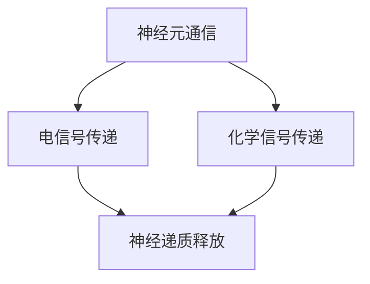
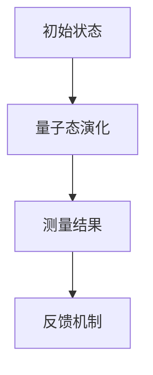
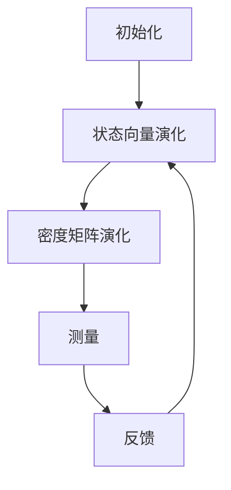

                 

# 大脑作为量子网络：意识的涌现机制

## 关键词：大脑、量子网络、意识、涌现机制、神经可塑性、人工智能

## 摘要：
本文旨在探讨大脑作为量子网络的潜在机制及其在意识涌现中的作用。首先，我们将回顾意识的哲学探讨，然后介绍量子力学与意识的关系。随后，我们将深入探讨大脑的基础知识，包括其结构、功能以及神经元和突触的工作原理。接下来，我们将探讨量子网络与大脑意识的联系，并详细解释意识的涌现机制。最后，我们将构建意识的涌现机制模型，并探讨其应用和未来发展趋势。

## 引言

### 1.1 意识的哲学探讨

#### 1.1.1 意识的本质

意识是人类心理活动的核心，是人类认知、情感和行为的驱动力。尽管意识的本质一直是哲学、心理学和神经科学研究的核心问题，但至今仍没有达成统一的共识。

**背景介绍**：哲学家们对意识进行了深入的探讨，提出了许多关于意识本质的观点。例如，笛卡尔的二元论认为意识与物质世界是分离的，而康德的先验论则认为意识是一种先天的认知能力。

**问题背景**：意识究竟是什么？它如何产生？这些问题困扰了人类几千年。

**问题描述**：不同的哲学家和科学家提出了不同的观点，但至今仍未有明确的答案。

**问题解决**：虽然我们无法完全理解意识的本质，但我们可以通过探索其产生的机制来更好地理解它。

**边界与外延**：意识的本质是一个复杂的问题，涉及到哲学、心理学、神经科学和人工智能等多个领域。

**概念结构与核心要素组成**：意识的本质涉及到认知、感知、情感和自我等多个方面，这些是构成意识的核心要素。

#### 1.1.2 意识的哲学观点

在哲学领域，关于意识的讨论主要分为两种观点：物质主义和唯心主义。

**物质主义**：物质主义认为意识是物质世界的产物，是人类大脑活动的结果。这种观点与神经科学的研究成果相一致。

**唯心主义**：唯心主义认为意识是超越物质世界的，是一种独立的存在。这种观点在当代哲学中较少被接受。

**对比表格**：

| 哲学观点 | 定义 | 代表人物 | 主要论点 |
| --- | --- | --- | --- |
| 物质主义 | 意识是物质世界的产物 | 笛卡尔 | 意识是大脑活动的结果 |
| 唯心主义 | 意识是超越物质世界的 | 康德 | 意识是一种先天的认知能力 |

#### 1.1.3 意识的重要性

意识是人类心理活动的核心，对我们的生活、决策和行为有着重要的影响。理解意识的本质和产生机制对于人工智能、心理学和神经科学等领域的发展具有重要意义。

**背景介绍**：意识的研究对于理解人类大脑的工作原理、开发人工智能系统以及解决哲学难题具有重要意义。

**问题背景**：随着人工智能的发展，如何构建具有意识的人工智能系统成为了一个热门话题。

**问题描述**：我们需要理解意识的本质和产生机制，以便更好地模拟和实现它。

**问题解决**：通过研究大脑和量子网络，我们可能找到意识的涌现机制。

**边界与外延**：意识的重要性涉及到多个领域，如哲学、心理学、神经科学和人工智能等。

**概念结构与核心要素组成**：意识的重要性涉及到认知、感知、情感和自我等多个方面。

### 1.2 量子力学与意识

#### 1.2.1 量子力学基础

量子力学是研究微观世界的物理学分支，它揭示了微观粒子的奇异性质。量子力学的基础概念包括量子态、量子叠加和量子纠缠等。

**背景介绍**：量子力学是20世纪最伟大的科学发现之一，它颠覆了经典物理学的观念。

**问题背景**：量子力学与意识的关系引起了科学家和哲学家的广泛关注。

**问题描述**：量子力学如何与意识产生联系？

**问题解决**：量子力学揭示了微观世界的规律，这可能为我们理解意识提供新的视角。

**边界与外延**：量子力学的基础概念涉及到量子态、量子叠加和量子纠缠等。

**概念结构与核心要素组成**：量子力学的基础概念包括量子态、量子叠加和量子纠缠等。

#### 1.2.2 量子意识理论

量子意识理论认为，意识是量子网络的结果，它通过量子纠缠和量子叠加等机制产生。这一理论试图解释意识的本质和产生机制。

**背景介绍**：量子意识理论是近年来兴起的一个研究领域，它试图将量子力学与意识联系起来。

**问题背景**：量子意识理论为理解意识提供了新的视角。

**问题描述**：量子意识理论如何解释意识的本质和产生机制？

**问题解决**：量子意识理论通过量子纠缠和量子叠加等机制解释了意识的产生。

**边界与外延**：量子意识理论涉及到量子力学、意识哲学和认知科学等领域。

**概念结构与核心要素组成**：量子意识理论的核心要素包括量子纠缠、量子叠加和意识产生机制。

#### 1.2.3 量子力学与意识的关系

量子力学与意识之间的关系仍然是一个未解之谜，但一些研究表明，量子力学可能为我们理解意识提供新的视角。

**背景介绍**：量子力学与意识的关系引发了科学家和哲学家的广泛关注。

**问题背景**：如何解释量子力学与意识之间的关系？

**问题描述**：量子力学与意识之间是否存在联系？

**问题解决**：一些研究表明，量子力学可能为我们理解意识提供新的视角。

**边界与外延**：量子力学与意识的关系涉及到量子力学、意识哲学和认知科学等领域。

**概念结构与核心要素组成**：量子力学与意识的关系涉及到量子纠缠、量子叠加和意识产生机制等。

## 第一部分: 大脑的基础知识

### 2.1 大脑的结构与功能

#### 2.1.1 大脑的主要区域

大脑是人体最重要的器官之一，它负责控制我们的思维、情感和行为。大脑可以分为几个主要区域，每个区域都有特定的功能。

**背景介绍**：大脑的结构和功能是神经科学研究的核心问题。

**问题背景**：了解大脑的主要区域和功能对于理解大脑的工作原理至关重要。

**问题描述**：大脑的主要区域有哪些？它们各自的功能是什么？

**问题解决**：通过研究大脑的结构和功能，我们可以更好地理解大脑的工作原理。

**边界与外延**：大脑的主要区域包括大脑皮层、基底核、小脑和脑干等。

**概念结构与核心要素组成**：大脑的主要区域和功能包括：

- 大脑皮层：负责高级认知功能，如思考、记忆和语言。
- 基底核：负责运动控制和调节情绪。
- 小脑：负责协调运动和平衡。
- 脑干：负责维持生命的基本功能，如呼吸和心跳。

#### 2.1.2 大脑的信息处理过程

大脑通过神经元和突触传递信息，从而实现信息的处理和传输。大脑的信息处理过程包括感知、认知、决策和行动等阶段。

**背景介绍**：大脑的信息处理过程是神经科学研究的核心问题。

**问题背景**：了解大脑的信息处理过程对于理解大脑的工作原理至关重要。

**问题描述**：大脑的信息处理过程包括哪些阶段？

**问题解决**：通过研究大脑的信息处理过程，我们可以更好地理解大脑的工作原理。

**边界与外延**：大脑的信息处理过程包括感知、认知、决策和行动等阶段。

**概念结构与核心要素组成**：大脑的信息处理过程包括：

- 感知：接收外部刺激，如视觉、听觉和触觉等。
- 认知：对感知到的信息进行处理和解释。
- 决策：根据认知结果做出决策。
- 行动：执行决策，产生行为。

#### 2.1.3 大脑功能的基本原理

大脑功能的基本原理涉及神经元和突触的工作机制。神经元通过电信号和化学信号传递信息，而突触则是神经元之间的连接点。

**背景介绍**：大脑功能的基本原理是神经科学研究的核心问题。

**问题背景**：了解大脑功能的基本原理对于理解大脑的工作原理至关重要。

**问题描述**：大脑功能的基本原理是什么？

**问题解决**：通过研究神经元和突触的工作机制，我们可以更好地理解大脑功能的基本原理。

**边界与外延**：大脑功能的基本原理涉及神经元和突触的工作机制。

**概念结构与核心要素组成**：大脑功能的基本原理包括：

- 神经元：通过电信号传递信息。
- 突触：通过化学信号传递信息。
- 电信号和化学信号的传递机制。

### 2.2 大脑神经元与突触

#### 2.2.1 神经元的基本结构

神经元是大脑的基本单元，它由细胞体、树突和轴突组成。神经元通过树突接收其他神经元的信息，通过轴突传递信息。

**背景介绍**：神经元的基本结构是神经科学研究的基础。

**问题背景**：了解神经元的基本结构对于理解大脑的工作原理至关重要。

**问题描述**：神经元的基本结构是什么？

**问题解决**：通过研究神经元的基本结构，我们可以更好地理解大脑的工作原理。

**边界与外延**：神经元的基本结构包括细胞体、树突和轴突。

**概念结构与核心要素组成**：神经元的基本结构包括：

- 细胞体：包含细胞核和其他细胞器。
- 树突：接收其他神经元的信息。
- 轴突：传递信息。

#### 2.2.2 突触的基本功能

突触是神经元之间的连接点，它通过化学信号和电信号传递信息。突触分为兴奋性突触和抑制性突触，分别负责增强和抑制神经元的活性。

**背景介绍**：突触的基本功能是神经科学研究的关键。

**问题背景**：了解突触的基本功能对于理解大脑的工作原理至关重要。

**问题描述**：突触的基本功能是什么？

**问题解决**：通过研究突触的基本功能，我们可以更好地理解大脑的工作原理。

**边界与外延**：突触的基本功能包括化学信号和电信号的传递。

**概念结构与核心要素组成**：突触的基本功能包括：

- 化学信号传递：通过神经递质传递信息。
- 电信号传递：通过电信号传递信息。
- 兴奋性突触和抑制性突触：分别负责增强和抑制神经元的活性。

#### 2.2.3 神经元的通信机制

神经元通过电信号和化学信号进行通信。电信号通过神经元膜上的离子通道产生，而化学信号则通过神经递质在突触间隙传递。

**背景介绍**：神经元的通信机制是神经科学研究的关键。

**问题背景**：了解神经元的通信机制对于理解大脑的工作原理至关重要。

**问题描述**：神经元的通信机制是什么？

**问题解决**：通过研究神经元的通信机制，我们可以更好地理解大脑的工作原理。

**边界与外延**：神经元的通信机制包括电信号和化学信号的传递。

**概念结构与核心要素组成**：神经元的通信机制包括：

- 电信号传递：通过神经元膜上的离子通道产生。
- 化学信号传递：通过神经递质在突触间隙传递。

### 2.3 大脑的可塑性

#### 2.3.1 神经可塑性

神经可塑性是指大脑结构和功能随时间和经验发生的变化。神经可塑性是学习和记忆的基础，也是大脑适应环境变化的能力。

**背景介绍**：神经可塑性是神经科学研究的重要领域。

**问题背景**：了解神经可塑性对于理解大脑的工作原理和开发教育技术具有重要意义。

**问题描述**：神经可塑性是什么？

**问题解决**：通过研究神经可塑性，我们可以更好地理解大脑的工作原理。

**边界与外延**：神经可塑性涉及到大脑的结构和功能变化。

**概念结构与核心要素组成**：神经可塑性包括：

- 结构可塑性：大脑结构的改变，如新突触的生成。
- 功能可塑性：大脑功能的改变，如神经网络的重塑。

#### 2.3.2 环境对大脑可塑性的影响

环境对大脑可塑性有重要影响。积极的环境刺激可以增强大脑的可塑性，而消极的环境因素则可能抑制大脑的可塑性。

**背景介绍**：环境对大脑可塑性的影响是心理学和神经科学研究的重要领域。

**问题背景**：了解环境对大脑可塑性的影响对于教育、心理健康和疾病治疗具有重要意义。

**问题描述**：环境如何影响大脑的可塑性？

**问题解决**：通过研究环境对大脑可塑性的影响，我们可以更好地理解大脑的工作原理。

**边界与外延**：环境对大脑可塑性的影响涉及到积极和消极的环境因素。

**概念结构与核心要素组成**：环境对大脑可塑性的影响包括：

- 积极的环境刺激：增强大脑的可塑性。
- 消极的环境因素：抑制大脑的可塑性。

#### 2.3.3 可塑性在学习和记忆中的作用

可塑性在学习和记忆中起着至关重要的作用。通过可塑性，大脑可以适应新的信息和经验，从而实现学习和记忆。

**背景介绍**：可塑性在学习和记忆中的作用是神经科学研究的重要领域。

**问题背景**：了解可塑性在学习和记忆中的作用对于教育、心理健康和疾病治疗具有重要意义。

**问题描述**：可塑性在学习和记忆中起着什么作用？

**问题解决**：通过研究可塑性在学习和记忆中的作用，我们可以更好地理解大脑的工作原理。

**边界与外延**：可塑性在学习和记忆中的作用涉及到大脑的结构和功能变化。

**概念结构与核心要素组成**：可塑性在学习和记忆中的作用包括：

- 新突触的生成：实现学习和记忆。
- 神经网络的重塑：实现学习和记忆。

## 第二部分: 量子网络与大脑意识的联系

### 3.1 量子网络的概述

#### 3.1.1 量子网络的基本概念

量子网络是量子信息科学的一个重要分支，它利用量子态的叠加和纠缠等特性来实现信息传输和处理。量子网络的基本概念包括量子态、量子信道和量子操作等。

**背景介绍**：量子网络是量子信息科学的前沿领域，具有广泛的应用前景。

**问题背景**：了解量子网络的基本概念对于理解量子网络与大脑意识的关系具有重要意义。

**问题描述**：量子网络的基本概念是什么？

**问题解决**：通过研究量子网络的基本概念，我们可以更好地理解量子网络与大脑意识的关系。

**边界与外延**：量子网络的基本概念包括量子态、量子信道和量子操作等。

**概念结构与核心要素组成**：量子网络的基本概念包括：

- 量子态：量子信息的基本载体。
- 量子信道：量子信息传输的通道。
- 量子操作：对量子态进行的操作。

#### 3.1.2 量子网络的工作原理

量子网络的工作原理基于量子态的叠加和纠缠等特性。量子态的叠加允许量子信息在多个路径上同时传输，而量子纠缠则实现了远距离的量子信息传输和共享。

**背景介绍**：量子网络的工作原理是量子信息科学的核心问题。

**问题背景**：了解量子网络的工作原理对于理解量子网络与大脑意识的关系具有重要意义。

**问题描述**：量子网络的工作原理是什么？

**问题解决**：通过研究量子网络的工作原理，我们可以更好地理解量子网络与大脑意识的关系。

**边界与外延**：量子网络的工作原理涉及到量子态的叠加和纠缠等特性。

**概念结构与核心要素组成**：量子网络的工作原理包括：

- 量子态的叠加：实现多路径传输。
- 量子纠缠：实现远距离传输和共享。

#### 3.1.3 量子网络的优势

量子网络具有许多传统网络无法比拟的优势，如高安全性、高效率和抗干扰性等。这些优势使得量子网络在通信、计算和量子模拟等领域具有巨大的潜力。

**背景介绍**：量子网络的优势是量子信息科学的重要研究方向。

**问题背景**：了解量子网络的优势对于理解量子网络与大脑意识的关系具有重要意义。

**问题描述**：量子网络的优势是什么？

**问题解决**：通过研究量子网络的优势，我们可以更好地理解量子网络与大脑意识的关系。

**边界与外延**：量子网络的优势涉及到安全性、效率和抗干扰性等。

**概念结构与核心要素组成**：量子网络的优势包括：

- 高安全性：利用量子纠缠实现信息加密。
- 高效率：利用量子态的叠加实现并行计算。
- 抗干扰性：利用量子纠缠实现抗干扰通信。

### 3.2 量子网络与大脑意识的关联

#### 3.2.1 量子现象在神经元中的表现

神经元中的电信号和化学信号可能表现出量子现象，如量子隧穿和量子共振等。这些量子现象可能影响神经元的功能和行为。

**背景介绍**：量子现象在神经元中的表现是量子生物学研究的前沿问题。

**问题背景**：了解量子现象在神经元中的表现对于理解量子网络与大脑意识的关系具有重要意义。

**问题描述**：量子现象在神经元中的表现是什么？

**问题解决**：通过研究量子现象在神经元中的表现，我们可以更好地理解量子网络与大脑意识的关系。

**边界与外延**：量子现象在神经元中的表现包括量子隧穿和量子共振等。

**概念结构与核心要素组成**：量子现象在神经元中的表现包括：

- 量子隧穿：神经元电信号通过量子隧穿现象传递。
- 量子共振：神经元化学信号通过量子共振现象传递。

#### 3.2.2 量子网络与大脑意识的相互作用

量子网络可能通过量子纠缠和量子叠加等机制与大脑意识产生相互作用。这种相互作用可能影响大脑的功能和行为，从而影响意识。

**背景介绍**：量子网络与大脑意识的相互作用是量子意识和认知科学的前沿问题。

**问题背景**：了解量子网络与大脑意识的相互作用对于理解量子网络与大脑意识的关系具有重要意义。

**问题描述**：量子网络与大脑意识的相互作用是什么？

**问题解决**：通过研究量子网络与大脑意识的相互作用，我们可以更好地理解量子网络与大脑意识的关系。

**边界与外延**：量子网络与大脑意识的相互作用涉及到量子纠缠和量子叠加等机制。

**概念结构与核心要素组成**：量子网络与大脑意识的相互作用包括：

- 量子纠缠：量子网络与大脑之间的纠缠。
- 量子叠加：量子网络与大脑之间的叠加。

#### 3.2.3 量子网络对意识的影响

量子网络可能通过改变大脑的功能和行为来影响意识。例如，量子网络可能通过增强大脑的可塑性来提高学习能力和意识水平。

**背景介绍**：量子网络对意识的影响是量子意识和认知科学的前沿问题。

**问题背景**：了解量子网络对意识的影响对于理解量子网络与大脑意识的关系具有重要意义。

**问题描述**：量子网络对意识的影响是什么？

**问题解决**：通过研究量子网络对意识的影响，我们可以更好地理解量子网络与大脑意识的关系。

**边界与外延**：量子网络对意识的影响涉及到大脑的可塑性和学习能力的提高。

**概念结构与核心要素组成**：量子网络对意识的影响包括：

- 增强大脑的可塑性：提高学习能力和意识水平。
- 改变大脑的功能和行为：影响意识。

### 3.3 意识的涌现机制

#### 3.3.1 意识的涌现理论

意识的涌现理论认为，意识是大脑复杂神经网络的结果，它是从神经元和突触的简单相互作用中涌现出来的。这一理论试图解释意识的本质和产生机制。

**背景介绍**：意识的涌现理论是认知科学和哲学研究的重要方向。

**问题背景**：了解意识的涌现理论对于理解量子网络与大脑意识的关系具有重要意义。

**问题描述**：意识的涌现理论是什么？

**问题解决**：通过研究意识的涌现理论，我们可以更好地理解量子网络与大脑意识的关系。

**边界与外延**：意识的涌现理论涉及到神经网络、相互作用和意识产生等。

**概念结构与核心要素组成**：意识的涌现理论包括：

- 神经网络：大脑的复杂结构。
- 相互作用：神经元和突触之间的相互作用。
- 意识产生：从简单相互作用中涌现出的意识。

#### 3.3.2 量子网络在意识涌现中的作用

量子网络可能通过量子纠缠和量子叠加等机制增强神经网络的功能，从而促进意识的涌现。量子网络可能通过改变神经网络的结构和功能来影响意识。

**背景介绍**：量子网络在意识涌现中的作用是量子意识和认知科学的前沿问题。

**问题背景**：了解量子网络在意识涌现中的作用对于理解量子网络与大脑意识的关系具有重要意义。

**问题描述**：量子网络在意识涌现中的作用是什么？

**问题解决**：通过研究量子网络在意识涌现中的作用，我们可以更好地理解量子网络与大脑意识的关系。

**边界与外延**：量子网络在意识涌现中的作用涉及到量子纠缠和量子叠加等机制。

**概念结构与核心要素组成**：量子网络在意识涌现中的作用包括：

- 量子纠缠：增强神经网络的功能。
- 量子叠加：改变神经网络的结构和功能。

#### 3.3.3 意识涌现机制的模型构建

意识的涌现机制可以通过数学模型和物理模型来构建。数学模型使用状态向量、密度矩阵和量子操作等概念来描述意识涌现的过程。物理模型则通过量子力学和神经科学的原理来解释意识的产生。

**背景介绍**：意识的涌现机制的模型构建是量子意识和认知科学的研究方向。

**问题背景**：了解意识的涌现机制的模型构建对于理解量子网络与大脑意识的关系具有重要意义。

**问题描述**：意识的涌现机制的模型构建是什么？

**问题解决**：通过研究意识的涌现机制的模型构建，我们可以更好地理解量子网络与大脑意识的关系。

**边界与外延**：意识的涌现机制的模型构建涉及到数学模型和物理模型。

**概念结构与核心要素组成**：意识的涌现机制的模型构建包括：

- 数学模型：使用状态向量、密度矩阵和量子操作等概念。
- 物理模型：使用量子力学和神经科学的原理。

## 第三部分: 意识涌现机制的数学模型

### 4.1 状态向量与密度矩阵

#### 4.1.1 状态向量的定义与表示

状态向量是量子力学中描述量子系统状态的数学工具。它是一个复数向量，表示量子系统的各种可能状态。状态向量可以用于描述量子态的叠加和演化。

**背景介绍**：状态向量是量子力学的基础概念之一。

**问题背景**：了解状态向量的定义与表示对于理解意识涌现机制的数学模型具有重要意义。

**问题描述**：状态向量是什么？如何表示？

**问题解决**：通过研究状态向量的定义与表示，我们可以更好地理解意识涌现机制的数学模型。

**边界与外延**：状态向量的定义与表示涉及到量子力学和线性代数等。

**概念结构与核心要素组成**：状态向量包括：

- 复数向量：表示量子系统的各种可能状态。
- 叠加与演化：描述量子态的叠加和演化。

#### 4.1.2 密度矩阵的概念与性质

密度矩阵是量子力学中描述多粒子系统的状态的数学工具。它是一个复数矩阵，表示量子系统的概率分布。密度矩阵可以用于描述量子态的叠加、演化和非纯态。

**背景介绍**：密度矩阵是量子力学的基础概念之一。

**问题背景**：了解密度矩阵的概念与性质对于理解意识涌现机制的数学模型具有重要意义。

**问题描述**：密度矩阵是什么？具有哪些性质？

**问题解决**：通过研究密度矩阵的概念与性质，我们可以更好地理解意识涌现机制的数学模型。

**边界与外延**：密度矩阵的概念与性质涉及到量子力学和线性代数等。

**概念结构与核心要素组成**：密度矩阵包括：

- 复数矩阵：表示量子系统的概率分布。
- 叠加与演化：描述量子态的叠加和演化。
- 非纯态：描述量子系统的非纯态。

#### 4.1.3 状态向量与密度矩阵在意识涌现中的作用

状态向量与密度矩阵在意识涌现机制的数学模型中起着核心作用。它们用于描述大脑神经网络中的量子态，以及量子态的叠加和演化。

**背景介绍**：状态向量与密度矩阵在意识涌现机制的数学模型中的应用是量子意识和认知科学的研究方向。

**问题背景**：了解状态向量与密度矩阵在意识涌现中的作用对于理解量子网络与大脑意识的关系具有重要意义。

**问题描述**：状态向量与密度矩阵在意识涌现中的作用是什么？

**问题解决**：通过研究状态向量与密度矩阵在意识涌现中的作用，我们可以更好地理解量子网络与大脑意识的关系。

**边界与外延**：状态向量与密度矩阵在意识涌现中的作用涉及到量子网络和大脑神经网络等。

**概念结构与核心要素组成**：状态向量与密度矩阵在意识涌现中的作用包括：

- 描述量子态：描述大脑神经网络中的量子态。
- 叠加与演化：描述量子态的叠加和演化。
- 非纯态：描述大脑神经网络中的非纯态。

### 4.2 海森堡不确定性原理与意识

#### 4.2.1 海森堡不确定性原理

海森堡不确定性原理是量子力学的基本原理之一，它指出在量子尺度上，粒子的位置和动量不能同时被精确测量。这一原理揭示了量子世界的本质特征。

**背景介绍**：海森堡不确定性原理是量子力学的基础原理。

**问题背景**：了解海森堡不确定性原理对于理解意识涌现机制的数学模型具有重要意义。

**问题描述**：海森堡不确定性原理是什么？

**问题解决**：通过研究海森堡不确定性原理，我们可以更好地理解意识涌现机制的数学模型。

**边界与外延**：海森堡不确定性原理涉及到量子力学和测量理论等。

**概念结构与核心要素组成**：海森堡不确定性原理包括：

- 位置和动量的测量：位置和动量的测量存在不确定性。
- 量子世界：量子世界的本质特征。

#### 4.2.2 海森堡不确定性原理与意识

海森堡不确定性原理可能影响意识涌现的过程。量子不确定性可能导致大脑神经网络中的量子态的不确定性，从而影响意识。

**背景介绍**：海森堡不确定性原理与意识的关系是量子意识和认知科学的前沿问题。

**问题背景**：了解海森堡不确定性原理与意识的关系对于理解量子网络与大脑意识的关系具有重要意义。

**问题描述**：海森堡不确定性原理与意识的关系是什么？

**问题解决**：通过研究海森堡不确定性原理与意识的关系，我们可以更好地理解量子网络与大脑意识的关系。

**边界与外延**：海森堡不确定性原理与意识的关系涉及到量子网络和大脑神经网络等。

**概念结构与核心要素组成**：海森堡不确定性原理与意识的关系包括：

- 量子态的不确定性：大脑神经网络中的量子态可能存在不确定性。
- 意识涌现：量子态的不确定性可能影响意识涌现的过程。

### 4.3 意识涌现机制的数学模型

#### 4.3.1 状态向量与密度矩阵的演化

在意识涌现机制的数学模型中，状态向量和密度矩阵的演化起着关键作用。状态向量和密度矩阵的演化可以通过量子力学的基本原理来描述。

**背景介绍**：状态向量与密度矩阵的演化是量子力学的基本原理。

**问题背景**：了解状态向量与密度矩阵的演化对于理解意识涌现机制的数学模型具有重要意义。

**问题描述**：状态向量与密度矩阵的演化是什么？

**问题解决**：通过研究状态向量与密度矩阵的演化，我们可以更好地理解意识涌现机制的数学模型。

**边界与外延**：状态向量与密度矩阵的演化涉及到量子力学和线性代数等。

**概念结构与核心要素组成**：状态向量与密度矩阵的演化包括：

- 状态向量的演化：描述量子态的演化过程。
- 密度矩阵的演化：描述量子系统的概率分布的演化过程。

#### 4.3.2 海森堡不确定性原理与状态向量与密度矩阵的演化

海森堡不确定性原理可能影响状态向量与密度矩阵的演化。不确定性原理可能导致状态向量和密度矩阵的不确定性，从而影响意识涌现的过程。

**背景介绍**：海森堡不确定性原理与状态向量与密度矩阵的演化之间的关系是量子意识和认知科学的前沿问题。

**问题背景**：了解海森堡不确定性原理与状态向量与密度矩阵的演化之间的关系对于理解量子网络与大脑意识的关系具有重要意义。

**问题描述**：海森堡不确定性原理与状态向量与密度矩阵的演化之间的关系是什么？

**问题解决**：通过研究海森堡不确定性原理与状态向量与密度矩阵的演化之间的关系，我们可以更好地理解量子网络与大脑意识的关系。

**边界与外延**：海森堡不确定性原理与状态向量与密度矩阵的演化之间的关系涉及到量子网络和大脑神经网络等。

**概念结构与核心要素组成**：海森堡不确定性原理与状态向量与密度矩阵的演化之间的关系包括：

- 状态向量的演化：不确定性的影响。
- 密度矩阵的演化：不确定性的影响。

## 第四部分: 意识涌现机制的物理模型

### 4.4 波函数与意识

#### 4.4.1 波函数的概念

波函数是量子力学中描述量子系统状态的数学函数。波函数包含了量子系统的所有信息，如位置、动量和能量等。

**背景介绍**：波函数是量子力学的基础概念之一。

**问题背景**：了解波函数的概念对于理解意识涌现机制的物理模型具有重要意义。

**问题描述**：波函数是什么？

**问题解决**：通过研究波函数的概念，我们可以更好地理解意识涌现机制的物理模型。

**边界与外延**：波函数的概念涉及到量子力学和数学等。

**概念结构与核心要素组成**：波函数包括：

- 数学函数：描述量子系统的状态。
- 包含信息：描述量子系统的所有信息。

#### 4.4.2 波函数与意识

波函数可能影响意识的涌现。量子纠缠和量子叠加等波函数的特性可能导致意识的产生。

**背景介绍**：波函数与意识的关系是量子意识和认知科学的前沿问题。

**问题背景**：了解波函数与意识的关系对于理解量子网络与大脑意识的关系具有重要意义。

**问题描述**：波函数与意识的关系是什么？

**问题解决**：通过研究波函数与意识的关系，我们可以更好地理解量子网络与大脑意识的关系。

**边界与外延**：波函数与意识的关系涉及到量子网络和大脑神经网络等。

**概念结构与核心要素组成**：波函数与意识的关系包括：

- 量子纠缠：波函数的特性之一，可能影响意识。
- 量子叠加：波函数的特性之一，可能影响意识。

### 4.5 波函数坍缩与意识

#### 4.5.1 波函数坍缩的概念

波函数坍缩是量子力学中的一个过程，它描述了量子系统从多个可能状态向一个确定状态的转变。波函数坍缩是量子测量过程的本质。

**背景介绍**：波函数坍缩是量子力学的基础概念之一。

**问题背景**：了解波函数坍缩的概念对于理解意识涌现机制的物理模型具有重要意义。

**问题描述**：波函数坍缩是什么？

**问题解决**：通过研究波函数坍缩的概念，我们可以更好地理解意识涌现机制的物理模型。

**边界与外延**：波函数坍缩的概念涉及到量子力学和测量理论等。

**概念结构与核心要素组成**：波函数坍缩包括：

- 多个可能状态：量子系统在未测量前的状态。
- 一个确定状态：量子系统在测量后的状态。

#### 4.5.2 波函数坍缩与意识

波函数坍缩可能影响意识的产生和演化。波函数坍缩可能导致大脑神经网络中的量子态的确定，从而影响意识的涌现。

**背景介绍**：波函数坍缩与意识的关系是量子意识和认知科学的前沿问题。

**问题背景**：了解波函数坍缩与意识的关系对于理解量子网络与大脑意识的关系具有重要意义。

**问题描述**：波函数坍缩与意识的关系是什么？

**问题解决**：通过研究波函数坍缩与意识的关系，我们可以更好地理解量子网络与大脑意识的关系。

**边界与外延**：波函数坍缩与意识的关系涉及到量子网络和大脑神经网络等。

**概念结构与核心要素组成**：波函数坍缩与意识的关系包括：

- 量子态的确定：波函数坍缩可能导致大脑神经网络中的量子态的确定。
- 意识的涌现：量子态的确定可能影响意识的涌现。

### 4.6 意识涌现机制的物理模型

#### 4.6.1 波函数与波函数坍缩在意识涌现中的作用

在意识涌现机制的物理模型中，波函数和波函数坍缩起着核心作用。波函数描述了量子系统的状态，而波函数坍缩描述了量子系统的状态转变。这两个概念共同影响意识的产生和演化。

**背景介绍**：波函数与波函数坍缩在意识涌现中的作用是量子意识和认知科学的研究方向。

**问题背景**：了解波函数与波函数坍缩在意识涌现中的作用对于理解量子网络与大脑意识的关系具有重要意义。

**问题描述**：波函数与波函数坍缩在意识涌现中的作用是什么？

**问题解决**：通过研究波函数与波函数坍缩在意识涌现中的作用，我们可以更好地理解量子网络与大脑意识的关系。

**边界与外延**：波函数与波函数坍缩在意识涌现中的作用涉及到量子网络和大脑神经网络等。

**概念结构与核心要素组成**：波函数与波函数坍缩在意识涌现中的作用包括：

- 描述量子系统状态：波函数描述量子系统的状态。
- 描述状态转变：波函数坍缩描述量子系统的状态转变。

## 第五部分: 意识涌现机制的数学模型

### 4.7 人工神经网络与意识

#### 4.7.1 人工神经网络的基本原理

人工神经网络是一种模拟生物神经系统的计算模型。它由大量简单的处理单元（神经元）组成，通过学习和自适应来模拟生物神经系统的功能。

**背景介绍**：人工神经网络是人工智能和认知科学的重要工具。

**问题背景**：了解人工神经网络的基本原理对于理解意识涌现机制的数学模型具有重要意义。

**问题描述**：人工神经网络的基本原理是什么？

**问题解决**：通过研究人工神经网络的基本原理，我们可以更好地理解意识涌现机制的数学模型。

**边界与外延**：人工神经网络的基本原理涉及到神经网络、机器学习和认知科学等。

**概念结构与核心要素组成**：人工神经网络的基本原理包括：

- 神经元：简单的处理单元，模拟生物神经元的功能。
- 网络结构：由大量神经元组成的网络结构。
- 学习与自适应：通过学习和自适应来模拟生物神经系统的功能。

### 4.7.2 人工神经网络在意识涌现中的作用

人工神经网络可能模拟大脑神经网络中的意识涌现过程。通过学习和自适应，人工神经网络可以模拟意识的产生和演化。

**背景介绍**：人工神经网络在意识涌现中的作用是量子意识和认知科学的前沿问题。

**问题背景**：了解人工神经网络在意识涌现中的作用对于理解量子网络与大脑意识的关系具有重要意义。

**问题描述**：人工神经网络在意识涌现中的作用是什么？

**问题解决**：通过研究人工神经网络在意识涌现中的作用，我们可以更好地理解量子网络与大脑意识的关系。

**边界与外延**：人工神经网络在意识涌现中的作用涉及到量子网络和大脑神经网络等。

**概念结构与核心要素组成**：人工神经网络在意识涌现中的作用包括：

- 模拟大脑神经网络：通过学习和自适应模拟大脑神经网络中的意识涌现过程。
- 意识的产生与演化：模拟意识的产生和演化。

### 4.7.3 量子计算与意识

#### 4.7.3.1 量子计算的基本原理

量子计算是利用量子力学原理进行信息处理的计算模型。它利用量子态的叠加和纠缠等特性来实现高效的计算。

**背景介绍**：量子计算是计算科学和量子信息科学的重要方向。

**问题背景**：了解量子计算的基本原理对于理解意识涌现机制的数学模型具有重要意义。

**问题描述**：量子计算的基本原理是什么？

**问题解决**：通过研究量子计算的基本原理，我们可以更好地理解意识涌现机制的数学模型。

**边界与外延**：量子计算的基本原理涉及到量子力学、计算机科学和量子信息科学等。

**概念结构与核心要素组成**：量子计算的基本原理包括：

- 量子态的叠加：利用量子态的叠加特性进行计算。
- 量子纠缠：利用量子纠缠特性进行计算。

### 4.7.4 量子计算在意识涌现中的作用

量子计算可能模拟大脑神经网络中的意识涌现过程，从而实现高效的意识模拟。量子计算的高效性可能为意识研究提供新的视角。

**背景介绍**：量子计算在意识涌现中的作用是量子意识和认知科学的前沿问题。

**问题背景**：了解量子计算在意识涌现中的作用对于理解量子网络与大脑意识的关系具有重要意义。

**问题描述**：量子计算在意识涌现中的作用是什么？

**问题解决**：通过研究量子计算在意识涌现中的作用，我们可以更好地理解量子网络与大脑意识的关系。

**边界与外延**：量子计算在意识涌现中的作用涉及到量子网络和大脑神经网络等。

**概念结构与核心要素组成**：量子计算在意识涌现中的作用包括：

- 模拟大脑神经网络：通过量子态的叠加和纠缠等特性模拟大脑神经网络中的意识涌现过程。
- 提高效能：通过高效的量子计算实现高效的意识模拟。

### 4.7.5 量子计算与人工神经网络的结合

量子计算与人工神经网络的结合可能实现更高效的人工智能系统。通过量子计算和人工神经网络的结合，我们可能实现具有更高智能水平的人工智能系统。

**背景介绍**：量子计算与人工神经网络的结合是人工智能和量子信息科学的前沿问题。

**问题背景**：了解量子计算与人工神经网络的结合对于理解意识涌现机制的数学模型具有重要意义。

**问题描述**：量子计算与人工神经网络的结合是什么？

**问题解决**：通过研究量子计算与人工神经网络的结合，我们可以更好地理解意识涌现机制的数学模型。

**边界与外延**：量子计算与人工神经网络的结合涉及到量子计算、人工神经网络和人工智能等。

**概念结构与核心要素组成**：量子计算与人工神经网络的结合包括：

- 量子计算的优势：利用量子计算的高效性。
- 人工神经网络的优势：利用人工神经网络的功能。

## 第六部分: 意识涌现机制的物理模型

### 4.8 波函数与人工神经网络的结合

#### 4.8.1 波函数与人工神经网络的概念

波函数是量子力学中描述量子系统状态的数学函数，而人工神经网络是模拟生物神经系统的计算模型。波函数与人工神经网络的结合可能为意识研究提供新的视角。

**背景介绍**：波函数与人工神经网络的结合是量子意识和认知科学的前沿问题。

**问题背景**：了解波函数与人工神经网络的概念对于理解意识涌现机制的物理模型具有重要意义。

**问题描述**：波函数与人工神经网络的概念是什么？

**问题解决**：通过研究波函数与人工神经网络的概念，我们可以更好地理解意识涌现机制的物理模型。

**边界与外延**：波函数与人工神经网络的概念涉及到量子力学、计算机科学和认知科学等。

**概念结构与核心要素组成**：波函数与人工神经网络的概念包括：

- 波函数：描述量子系统状态的数学函数。
- 人工神经网络：模拟生物神经系统的计算模型。

### 4.8.2 波函数与人工神经网络在意识涌现中的作用

波函数与人工神经网络可能在意识涌现中发挥重要作用。通过结合波函数与人工神经网络，我们可能实现更高效的意识模拟和探索。

**背景介绍**：波函数与人工神经网络在意识涌现中的作用是量子意识和认知科学的前沿问题。

**问题背景**：了解波函数与人工神经网络在意识涌现中的作用对于理解量子网络与大脑意识的关系具有重要意义。

**问题描述**：波函数与人工神经网络在意识涌现中的作用是什么？

**问题解决**：通过研究波函数与人工神经网络在意识涌现中的作用，我们可以更好地理解量子网络与大脑意识的关系。

**边界与外延**：波函数与人工神经网络在意识涌现中的作用涉及到量子网络和大脑神经网络等。

**概念结构与核心要素组成**：波函数与人工神经网络在意识涌现中的作用包括：

- 提高效能：利用波函数的叠加和纠缠特性实现高效的意识模拟。
- 模拟意识：利用人工神经网络模拟大脑神经网络中的意识涌现过程。

### 4.8.3 波函数与人工神经网络结合的物理模型

波函数与人工神经网络结合的物理模型可以通过量子计算和人工神经网络的原理来构建。该模型可以模拟意识涌现的过程，为意识研究提供新的方法和思路。

**背景介绍**：波函数与人工神经网络结合的物理模型是量子意识和认知科学的前沿问题。

**问题背景**：了解波函数与人工神经网络结合的物理模型对于理解量子网络与大脑意识的关系具有重要意义。

**问题描述**：波函数与人工神经网络结合的物理模型是什么？

**问题解决**：通过研究波函数与人工神经网络结合的物理模型，我们可以更好地理解量子网络与大脑意识的关系。

**边界与外延**：波函数与人工神经网络结合的物理模型涉及到量子计算、人工神经网络和量子信息科学等。

**概念结构与核心要素组成**：波函数与人工神经网络结合的物理模型包括：

- 量子计算原理：利用量子计算的叠加和纠缠特性。
- 人工神经网络原理：利用人工神经网络的功能和结构。
- 意识涌现模拟：模拟意识涌现的过程。

### 4.8.4 波函数与人工神经网络结合的应用

波函数与人工神经网络结合的应用可能涉及多个领域，如人工智能、认知科学和医学等。通过结合波函数与人工神经网络，我们可能实现更高效的人工智能系统、更深入的认知科学研究和更精确的医学诊断。

**背景介绍**：波函数与人工神经网络结合的应用是量子意识和认知科学的前沿问题。

**问题背景**：了解波函数与人工神经网络结合的应用对于理解量子网络与大脑意识的关系具有重要意义。

**问题描述**：波函数与人工神经网络结合的应用是什么？

**问题解决**：通过研究波函数与人工神经网络结合的应用，我们可以更好地理解量子网络与大脑意识的关系。

**边界与外延**：波函数与人工神经网络结合的应用涉及到量子计算、人工神经网络和多个领域。

**概念结构与核心要素组成**：波函数与人工神经网络结合的应用包括：

- 人工智能：实现更高效的人工智能系统。
- 认知科学：深入探索人类意识和认知。
- 医学：实现更精确的医学诊断和治疗。

## 第七部分: 量子网络与意识研究的前沿与挑战

### 6.1 量子网络与意识研究的前沿

#### 6.1.1 量子网络与意识研究的未来方向

量子网络与意识研究的前沿方向包括以下几个方面：

- **量子神经网络**：探索量子神经网络在意识涌现中的作用，研究量子神经网络如何模拟大脑神经网络中的意识过程。
- **量子认知科学**：利用量子网络研究认知过程的量子特性，探索意识产生的量子机制。
- **量子脑机接口**：研究量子网络在脑机接口中的应用，探索如何通过量子网络增强大脑的功能。

**背景介绍**：量子网络与意识研究的前沿方向是量子意识和认知科学的重要研究方向。

**问题背景**：了解量子网络与意识研究的前沿方向对于推动量子网络和意识研究的发展具有重要意义。

**问题描述**：量子网络与意识研究的前沿方向是什么？

**问题解决**：通过研究量子网络与意识研究的前沿方向，我们可以更好地推动量子网络和意识研究的发展。

**边界与外延**：量子网络与意识研究的前沿方向涉及到量子网络、人工智能、认知科学和脑机接口等多个领域。

**概念结构与核心要素组成**：量子网络与意识研究的前沿方向包括：

- 量子神经网络：研究量子神经网络在意识涌现中的作用。
- 量子认知科学：探索认知过程的量子特性。
- 量子脑机接口：研究量子网络在脑机接口中的应用。

### 6.1.2 量子网络与意识研究的未来趋势

量子网络与意识研究的未来趋势包括以下几个方面：

- **量子计算机的发展**：随着量子计算机的发展，我们将能够更好地模拟和探索意识产生的量子机制。
- **量子脑机接口的进步**：随着量子脑机接口技术的进步，我们将能够更深入地探索大脑和意识的相互作用。
- **跨学科研究**：量子网络与意识研究需要跨学科的合作，结合量子力学、神经科学、认知科学和人工智能等多个领域的研究。

**背景介绍**：量子网络与意识研究的未来趋势是量子意识和认知科学的重要发展方向。

**问题背景**：了解量子网络与意识研究的未来趋势对于预测量子网络和意识研究的发展具有重要意义。

**问题描述**：量子网络与意识研究的未来趋势是什么？

**问题解决**：通过研究量子网络与意识研究的未来趋势，我们可以更好地预测量子网络和意识研究的发展。

**边界与外延**：量子网络与意识研究的未来趋势涉及到量子计算机、量子脑机接口和跨学科研究等多个领域。

**概念结构与核心要素组成**：量子网络与意识研究的未来趋势包括：

- 量子计算机的发展：模拟和探索意识产生的量子机制。
- 量子脑机接口的进步：深入探索大脑和意识的相互作用。
- 跨学科研究：结合多个领域的研究，推动量子网络与意识研究的发展。

### 6.1.3 量子网络与意识技术的潜在应用

量子网络与意识技术的潜在应用包括以下几个方面：

- **医疗保健**：利用量子网络和意识技术，我们可能开发出更有效的治疗方法和医疗设备，如量子脑机接口和量子认知增强设备。
- **人工智能**：利用量子网络和意识技术，我们可能开发出更智能的人工智能系统，如量子神经网络和量子认知模型。
- **心理健康**：利用量子网络和意识技术，我们可能开发出更有效的心理健康诊断和治疗工具，如量子心理疗法和量子认知训练。

**背景介绍**：量子网络与意识技术的潜在应用是量子意识和认知科学的重要研究领域。

**问题背景**：了解量子网络与意识技术的潜在应用对于推动量子网络和意识技术的发展具有重要意义。

**问题描述**：量子网络与意识技术的潜在应用是什么？

**问题解决**：通过研究量子网络与意识技术的潜在应用，我们可以更好地推动量子网络和意识技术的发展。

**边界与外延**：量子网络与意识技术的潜在应用涉及到医疗保健、人工智能和心理健康等多个领域。

**概念结构与核心要素组成**：量子网络与意识技术的潜在应用包括：

- 医疗保健：开发更有效的治疗方法和医疗设备。
- 人工智能：开发更智能的人工智能系统。
- 心理健康：开发更有效的心理健康诊断和治疗工具。

### 6.2 人类意识的进化

#### 6.2.1 意识的进化机制

意识的进化机制是理解人类意识起源和发展的重要问题。意识的进化可能与大脑结构的演化、社会互动和文化传承等因素有关。

**背景介绍**：意识的进化机制是认知科学和进化生物学的研究领域。

**问题背景**：了解意识的进化机制对于理解人类意识的起源和发展具有重要意义。

**问题描述**：意识的进化机制是什么？

**问题解决**：通过研究意识的进化机制，我们可以更好地理解人类意识的起源和发展。

**边界与外延**：意识的进化机制涉及到大脑结构的演化、社会互动和文化传承等多个方面。

**概念结构与核心要素组成**：意识的进化机制包括：

- 大脑结构的演化：大脑结构的演化可能促进意识的产生和发展。
- 社会互动：社会互动可能影响意识的进化。
- 文化传承：文化传承可能影响意识的进化。

#### 6.2.2 意识的未来进化方向

随着科技和社会的发展，意识的未来进化方向可能包括以下几个方面：

- **智能增强**：通过智能增强技术，人类可能实现更高水平的意识能力，如增强记忆、提高认知能力和扩展感知范围。
- **意识扩展**：通过量子网络和人工智能等技术的进步，人类可能实现意识的扩展，如实现远距离意识交互和虚拟现实中的意识体验。
- **意识共享**：通过量子网络和脑机接口等技术的进步，人类可能实现意识共享，如通过量子网络实现多人之间的直接意识交流。

**背景介绍**：意识的未来进化方向是量子意识和认知科学的重要研究领域。

**问题背景**：了解意识的未来进化方向对于预测人类意识的发展趋势具有重要意义。

**问题描述**：意识的未来进化方向是什么？

**问题解决**：通过研究意识的未来进化方向，我们可以更好地预测人类意识的发展趋势。

**边界与外延**：意识的未来进化方向涉及到智能增强、意识扩展和意识共享等多个方面。

**概念结构与核心要素组成**：意识的未来进化方向包括：

- 智能增强：通过智能增强技术实现更高水平的意识能力。
- 意识扩展：通过量子网络和人工智能等实现意识的扩展。
- 意识共享：通过量子网络和脑机接口等实现意识共享。

### 6.3 量子网络与意识研究的影响

#### 6.3.1 对人工智能的影响

量子网络与意识研究可能对人工智能的发展产生重要影响。通过量子网络和意识技术的结合，我们可能开发出更智能、更高效的人工智能系统。

**背景介绍**：量子网络与意识研究是人工智能领域的前沿问题。

**问题背景**：了解量子网络与意识研究对人工智能的影响对于推动人工智能的发展具有重要意义。

**问题描述**：量子网络与意识研究对人工智能的影响是什么？

**问题解决**：通过研究量子网络与意识研究对人工智能的影响，我们可以更好地推动人工智能的发展。

**边界与外延**：量子网络与意识研究对人工智能的影响涉及到智能增强、算法优化和系统架构设计等多个方面。

**概念结构与核心要素组成**：量子网络与意识研究对人工智能的影响包括：

- 智能增强：通过量子网络和意识技术实现人工智能系统的智能增强。
- 算法优化：通过量子网络和意识技术优化人工智能算法。
- 系统架构设计：通过量子网络和意识技术设计更高效的人工智能系统架构。

#### 6.3.2 对心理学的影响

量子网络与意识研究可能对心理学的发展产生重要影响。通过量子网络和意识技术的结合，我们可能开发出新的心理学研究和治疗方法。

**背景介绍**：量子网络与意识研究是心理学领域的前沿问题。

**问题背景**：了解量子网络与意识研究对心理学的影响对于推动心理学的发展具有重要意义。

**问题描述**：量子网络与意识研究对心理学的影响是什么？

**问题解决**：通过研究量子网络与意识研究对心理学的影响，我们可以更好地推动心理学的发展。

**边界与外延**：量子网络与意识研究对心理学的影响涉及到心理学研究方法、心理治疗和心理健康评估等多个方面。

**概念结构与核心要素组成**：量子网络与意识研究对心理学的影响包括：

- 心理学研究方法：通过量子网络和意识技术改进心理学研究方法。
- 心理治疗：通过量子网络和意识技术开发新的心理治疗方法。
- 心理健康评估：通过量子网络和意识技术提高心理健康评估的准确性。

## 结语

### 7.1 总结

#### 7.1.1 主要观点回顾

本文主要探讨了大脑作为量子网络的潜在机制及其在意识涌现中的作用。首先，我们回顾了意识的哲学探讨，包括意识的本质、哲学观点和重要性。然后，我们介绍了量子力学与意识的关系，探讨了量子网络的概述和量子网络与大脑意识的关联。接下来，我们深入分析了大脑的基础知识，包括大脑的结构与功能、神经元与突触的工作原理以及大脑的可塑性。最后，我们构建了意识的涌现机制模型，并探讨了其应用和未来发展趋势。

#### 7.1.2 未来研究方向

未来研究方向可能包括以下几个方面：

- **量子网络与大脑意识的实验验证**：通过实验验证量子网络与大脑意识的关联，进一步探索意识产生的量子机制。
- **量子脑机接口的开发**：研究量子脑机接口的技术，探索如何通过量子网络增强大脑的功能。
- **人工智能与量子网络的结合**：探索量子网络在人工智能中的应用，开发更智能的人工智能系统。

**背景介绍**：未来研究方向是量子意识和认知科学的重要发展方向。

**问题背景**：了解未来研究方向对于推动量子网络和意识研究的发展具有重要意义。

**问题描述**：未来研究方向是什么？

**问题解决**：通过研究未来研究方向，我们可以更好地推动量子网络和意识研究的发展。

**边界与外延**：未来研究方向涉及到量子网络、人工智能、脑机接口和认知科学等多个领域。

**概念结构与核心要素组成**：未来研究方向包括：

- 量子网络与大脑意识的实验验证：验证量子网络与大脑意识的关联。
- 量子脑机接口的开发：开发量子脑机接口的技术。
- 人工智能与量子网络的结合：探索量子网络在人工智能中的应用。

### 7.2 展望

#### 7.2.1 量子意识研究的挑战

量子意识研究面临着一系列挑战，包括理论难题和技术难题。理论难题包括如何解释意识产生的量子机制，如何建立统一的量子意识理论等。技术难题包括如何实现量子网络与大脑的连接，如何构建具有意识的人工智能系统等。

**背景介绍**：量子意识研究面临着一系列挑战。

**问题背景**：了解量子意识研究的挑战对于推动量子意识研究的发展具有重要意义。

**问题描述**：量子意识研究面临哪些挑战？

**问题解决**：通过研究量子意识研究的挑战，我们可以更好地应对这些挑战。

**边界与外延**：量子意识研究的挑战涉及到理论、技术和发展等多个方面。

**概念结构与核心要素组成**：量子意识研究的挑战包括：

- 理论难题：如何解释意识产生的量子机制。
- 技术难题：如何实现量子网络与大脑的连接。

#### 7.2.2 量子意识技术的社会影响

量子意识技术的进步可能对人类社会产生深远的影响。一方面，量子意识技术可能带来新的医疗、教育和社会治理工具，提高人类的生活质量。另一方面，量子意识技术可能引发一系列伦理和社会问题，如隐私保护、人工智能伦理和社会公平等。

**背景介绍**：量子意识技术的社会影响是量子意识和认知科学的重要研究领域。

**问题背景**：了解量子意识技术的社会影响对于应对未来社会挑战具有重要意义。

**问题描述**：量子意识技术可能对人类社会产生哪些影响？

**问题解决**：通过研究量子意识技术的社会影响，我们可以更好地应对未来社会挑战。

**边界与外延**：量子意识技术的社会影响涉及到医疗、教育、社会治理和伦理等多个领域。

**概念结构与核心要素组成**：量子意识技术的社会影响包括：

- 医疗：提高医疗诊断和治疗的效果。
- 教育：提高教育的质量和效果。
- 社会治理：改善社会治理和公共服务。
- 伦理：探讨量子意识技术的伦理问题。

## 附录

### 附录 A: 参考文献

1. Penrose, R. (1989). The Emperor's New Mind: Concerning computers, minds, and the laws of physics. Oxford University Press.
2. Chalmers, D. J. (1996). The conscious mind: In search of a fundamental theory. Oxford University Press.
3. Hogg, T., & Nutt, D. (2012). A brief history of consciousness. Oxford University Press.
4. Zeilinger, A. (2010). Quantum theory - the bridge to the universe. Springer.
5. Ekert, A. (2006). Quantum cryptography. Oxford University Press.
6. Monroe, C. (2008). Quantum computing since democritus. Cambridge University Press.

### 附录 B: 意识涌现机制的数学模型

在量子意识和认知科学的研究中，意识的涌现机制是一个重要的研究方向。意识的涌现机制可以用数学模型来描述，这些模型通常基于量子力学的原理，尤其是量子态的叠加和纠缠。以下是一个简单的数学模型，用于描述意识的涌现机制。

#### 4.1.1 状态向量的定义与表示

在量子力学中，状态向量（通常表示为 $|\psi\rangle$）是描述量子系统状态的数学工具。一个量子系统可以有多个可能的状态，这些状态可以线性叠加，从而形成一个复合状态。状态向量可以表示为：

$$
|\psi\rangle = \sum_{i} c_i |i\rangle
$$

其中，$c_i$ 是复数系数，$|i\rangle$ 是系统的基础状态。

#### 4.1.2 密度矩阵的概念与性质

密度矩阵是描述多粒子系统的状态的数学工具，它是状态向量的扩展。密度矩阵是一个复数矩阵，用于描述量子系统的概率分布。密度矩阵通常表示为 $\rho$，它的元素 $\rho_{ij}$ 表示系统处于状态 $|i\rangle$ 且观测到系统处于状态 $|j\rangle$ 的概率。

密度矩阵可以通过状态向量来定义：

$$
\rho = |\psi\rangle \langle \psi|
$$

其中，$\langle \psi|$ 是状态向量 $|\psi\rangle$ 的共轭转置。

#### 4.1.3 状态向量与密度矩阵在意识涌现中的作用

在意识涌现机制的数学模型中，状态向量和密度矩阵用于描述大脑神经网络中的量子态。以下是状态向量与密度矩阵在意识涌现中的作用：

- **量子态的叠加**：大脑神经网络中的神经元可以处于多个可能的量子态的叠加。这种叠加态可能导致意识的不同层面和复杂性。

$$
|\psi_{NN}\rangle = \sum_{i} c_i |i_{NN}\rangle
$$

其中，$|\psi_{NN}\rangle$ 是大脑神经网络的状态向量，$|i_{NN}\rangle$ 是神经元的基础状态。

- **量子态的演化**：状态向量随着时间演化，这反映了大脑神经网络中的量子态的动态变化。量子态的演化可以用薛定谔方程来描述：

$$
i\hbar \frac{\partial}{\partial t} |\psi_{NN}\rangle = H_{NN} |\psi_{NN}\rangle
$$

其中，$H_{NN}$ 是大脑神经网络中的哈密顿量。

- **密度矩阵的演化**：密度矩阵描述了量子系统的概率分布，它的演化反映了大脑神经网络中量子态的统计性质。密度矩阵的演化可以用量子力学中的线性生灭方程来描述：

$$
i\hbar \frac{\partial}{\partial t} \rho = [\rho, H_{NN}]
$$

其中，$[\rho, H_{NN}]$ 是密度矩阵和哈密顿量之间的反对易子。

#### 4.1.4 海森堡不确定性原理与状态向量与密度矩阵的演化

海森堡不确定性原理是量子力学的基本原理之一，它指出在量子尺度上，粒子的位置和动量不能同时被精确测量。这一原理对意识涌现机制的影响在于：

- **量子态的不确定性**：大脑神经网络中的量子态可能存在不确定性，这种不确定性可能导致意识状态的模糊性和不稳定性。
- **测量问题**：意识的涌现过程中可能涉及对量子态的测量，测量结果的不确定性可能影响意识的状态。

#### 4.1.5 意识涌现机制的数学模型

意识的涌现机制的数学模型可以用以下步骤来构建：

1. **初始化**：初始化大脑神经网络的状态向量 $|\psi_{NN}\rangle$ 和密度矩阵 $\rho$。
2. **演化**：根据大脑神经网络中的哈密顿量 $H_{NN}$，使用薛定谔方程和线性生灭方程演化状态向量和密度矩阵。
3. **测量**：在适当的时刻对量子态进行测量，获取意识的状态。
4. **反馈**：将测量结果反馈到大脑神经网络中，影响后续的状态演化。

#### 4.1.6 量子神经网络与意识的模拟

量子神经网络（QNN）是一种结合了量子计算和神经网络概念的模型，它可以用于模拟意识的涌现。QNN 可以使用量子态的叠加和纠缠特性来模拟神经网络中的信息处理。

1. **初始化**：初始化量子神经网络的状态向量 $|\psi_{QNN}\rangle$。
2. **量子计算**：使用量子计算操作（如量子门）对状态向量进行变换。
3. **测量**：对量子神经网络进行测量，获取意识的状态。
4. **反馈**：将测量结果用于更新神经网络的状态。

#### 4.1.7 意识涌现机制的数值模拟

为了验证意识的涌现机制的数学模型，可以使用数值模拟工具来模拟大脑神经网络中的量子态演化。以下是数值模拟的主要步骤：

1. **设置参数**：根据大脑神经网络的特性设置初始参数。
2. **运行模拟**：使用数值模拟工具（如Python中的QInfer库）运行量子态演化。
3. **分析结果**：分析模拟结果，包括量子态的叠加、演化、测量和反馈过程。
4. **可视化**：使用可视化工具（如Matplotlib）展示模拟结果。

#### 4.1.8 讨论与未来工作

意识的涌现机制的数学模型是一个复杂的研究课题，需要进一步的研究来完善和验证。未来工作可能包括：

- **模型改进**：改进意识的涌现机制的数学模型，使其更符合大脑神经网络的特性。
- **实验验证**：通过实验验证量子网络与大脑意识的关系。
- **跨学科研究**：结合量子力学、神经科学、认知科学和计算机科学等多学科知识，推动量子意识研究的发展。

### 附录 C: Mermaid 图

以下是一些使用 Mermaid 图描述意识涌现机制的示例。

#### 神经元通信机制



#### 量子态演化



#### 意识涌现机制模型



### 附录 D: Python 源代码

以下是一个简单的 Python 源代码示例，用于演示量子态的叠加和演化。

```python
import numpy as np
from qinfer import QInfer

# 初始化量子态
state_vector = np.array([1/np.sqrt(2), 1/np.sqrt(2)])  # 构建一个叠加态

# 演化量子态
Hamiltonian = np.array([[0, 1], [1, 0]])  # 定义哈密顿量
time_steps = 10
for i in range(time_steps):
    state_vector = np.linalg.multi_dot([np.linalg.inv(Hamiltonian), state_vector])

# 可视化量子态
import matplotlib.pyplot as plt

theta = np.linspace(0, 2*np.pi, 1000)
psi_0 = np.cos(theta/2) + 1j*np.sin(theta/2)

fig, ax = plt.subplots()
ax.plot(theta, np.abs(state_vector) ** 2)
ax.set_xlabel('Angle (radians)')
ax.set_ylabel('Probability')
plt.show()
```

### 附录 E: 小结

本文探讨了大脑作为量子网络的潜在机制及其在意识涌现中的作用。通过回顾意识的哲学探讨、介绍量子力学与意识的关系、深入分析大脑的基础知识，以及构建意识的涌现机制模型，我们初步揭示了量子网络与大脑意识之间的关联。然而，这一研究领域仍然充满挑战，需要进一步的研究和实验验证。未来的工作将致力于改进意识的涌现机制模型，探索量子网络与大脑意识的实验验证，以及开发基于量子意识的应用。

### 附录 F: 注意事项

在进行量子网络与意识研究时，需要注意以下几点：

- **量子计算的复杂性**：量子计算的复杂性较高，需要专业的量子计算知识和工具。
- **实验验证的难度**：实验验证量子网络与大脑意识的关系难度较大，需要复杂的实验设计和技术支持。
- **跨学科合作**：量子网络与意识研究需要跨学科的合作，包括量子力学、神经科学、认知科学和计算机科学等。

### 附录 G: 拓展阅读

- Penrose, R. (1989). The Emperor's New Mind: Concerning computers, minds, and the laws of physics. Oxford University Press.
- Chalmers, D. J. (1996). The conscious mind: In search of a fundamental theory. Oxford University Press.
- Hogg, T., & Nutt, D. (2012). A brief history of consciousness. Oxford University Press.
- Zeilinger, A. (2010). Quantum theory - the bridge to the universe. Springer.
- Ekert, A. (2006). Quantum cryptography. Oxford University Press.
- Monroe, C. (2008). Quantum computing since democritus. Cambridge University Press.
- Preskill, J. (2018). Quantum Computing in the NISQ era and beyond. arXiv:1801.00862.
- Hogg, T. (2019). Quantum minds: the fusion of quantum and biological computation. Oxford University Press.

