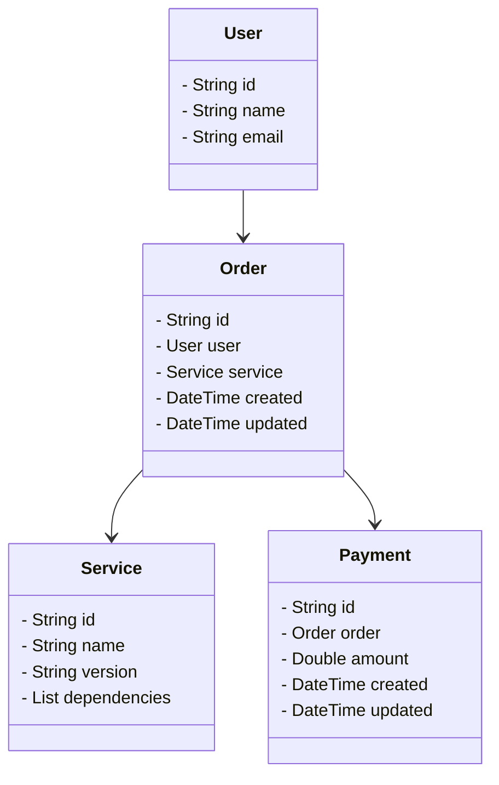
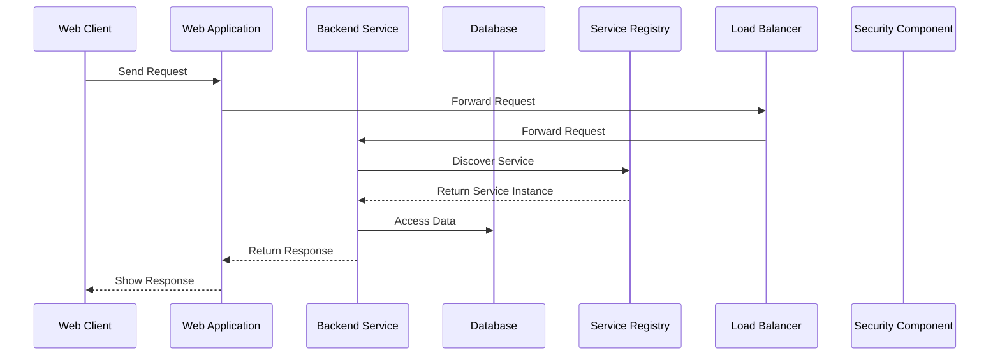
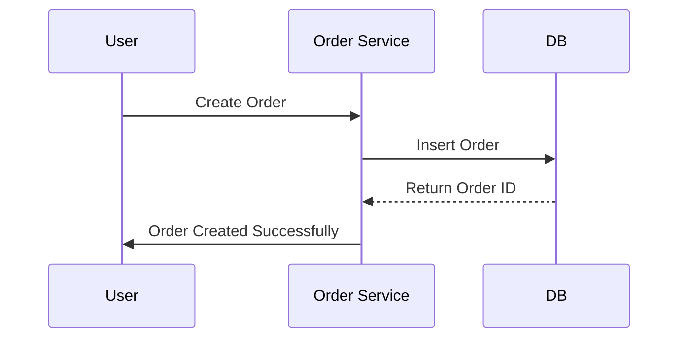
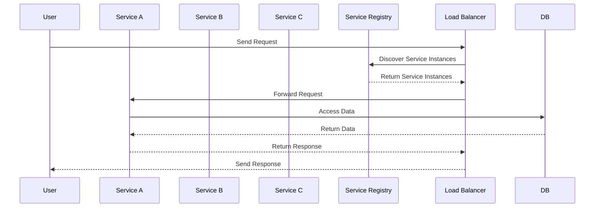

                 


### 第一部分：引言

#### 1.1 问题的背景与重要性

随着互联网和云计算的迅猛发展，企业对软件系统性能、可扩展性和灵活性提出了更高的要求。微服务架构作为一种应对复杂业务需求、提高系统可维护性的解决方案，逐渐被广泛采用。然而，随着系统规模的扩大，如何有效治理大规模微服务成为了一个亟待解决的重要问题。

微服务架构的优点在于其模块化和可扩展性，使得开发团队可以独立地开发和部署服务，从而加快了迭代速度。然而，这也带来了新的挑战，如服务间依赖管理、服务发现、服务容错、服务监控等。特别是在大规模系统中，这些挑战变得更加复杂，需要更加完善的治理策略来确保系统的稳定性和可靠性。

大规模微服务治理的必要性体现在以下几个方面：

1. **提高系统的可靠性**：在分布式系统中，服务可能会因为网络问题、硬件故障等原因不可用。通过有效的治理策略，可以确保服务的高可用性，减少故障对业务的影响。
2. **优化系统性能**：治理策略可以帮助我们识别系统中的瓶颈，从而进行针对性的优化，提高系统的响应速度和处理能力。
3. **增强系统的安全性**：通过治理策略，可以更好地管理访问控制、数据加密等安全措施，确保系统的数据安全和隐私保护。
4. **简化运维管理**：随着服务数量的增加，运维管理的复杂性也会上升。有效的治理策略可以帮助运维人员更好地管理服务，提高运维效率。

总之，大规模微服务治理不仅是为了解决技术问题，更是为了提高整个系统的质量和业务价值。在接下来的章节中，我们将深入探讨大规模微服务治理的核心概念、算法原理和实践方法。

#### 1.2 定义与核心概念

首先，我们需要明确一些核心概念，以便更好地理解大规模微服务治理。

**微服务**：微服务是一种设计架构，它将应用程序分解为小型、独立的服务组件，每个组件负责一个特定的业务功能。这些服务通常使用轻量级的通信协议（如HTTP/REST、gRPC）进行通信，并且可以在不同的服务器上独立部署和扩展。

**微服务架构**：微服务架构是一种基于微服务的设计方法，它通过将应用程序分解为多个小型服务来实现模块化和可扩展性。这种架构方法强调服务的独立性、可复用性和可测试性。

**服务拆分与聚合**：服务拆分是指将一个大服务分解为多个小服务，每个服务负责特定的功能。服务聚合则是指将多个服务合并为一个更大的服务，以简化系统的管理和维护。

**服务发现与注册**：服务发现是指动态地查找和选择可用服务的过程。服务注册是指将服务的信息（如地址、端口、元数据等）存储在一个注册中心，以便其他服务可以查找和访问。

**服务容错与恢复**：服务容错是指系统在服务出现故障时能够自动恢复或切换到备用服务，以确保系统的连续性和稳定性。服务恢复是指系统在故障排除后重新恢复正常运行。

**服务监控与日志管理**：服务监控是指对服务的运行状态、性能指标、错误日志等进行实时监控，以便及时发现和解决问题。日志管理是指对服务生成的日志数据进行收集、存储和分析，以帮助运维人员了解系统的运行情况。

通过理解这些核心概念，我们可以更好地把握大规模微服务治理的关键要素，为后续的深入讨论打下基础。

#### 1.3 治理策略概述

**治理策略的定义与目标**：

治理策略是指一系列方法和措施，用于管理、优化和维护大规模微服务系统的稳定性和可靠性。其目标包括：

1. **提高系统的可用性**：确保服务在需要时能够正常响应，减少因故障或网络问题导致的系统停机时间。
2. **优化系统性能**：通过监控和优化，确保系统在高负载情况下仍能保持良好的性能。
3. **增强系统的安全性**：实施访问控制和数据加密等安全措施，防止数据泄露和未授权访问。
4. **简化运维管理**：提供自动化工具和流程，降低运维成本和提高运维效率。

**治理策略的关键要素**：

治理策略的关键要素包括以下几个方面：

1. **服务管理**：包括服务创建、部署、监控和删除等操作，以及服务之间的依赖关系管理。
2. **配置管理**：管理服务的配置信息，确保配置的一致性和可追溯性。
3. **服务发现与注册**：确保服务能够在网络中动态发现和注册，以实现快速、可靠的服务调用。
4. **负载均衡**：通过分配请求到不同的服务实例，确保系统的负载均衡和性能优化。
5. **服务容错**：在服务出现故障时，自动切换到备用服务，确保系统的稳定性和连续性。
6. **监控与日志管理**：实时监控服务的运行状态，收集和分析日志数据，以便及时发现和解决问题。

**治理策略的分类与对比**：

常见的治理策略包括以下几种：

1. **集中式治理**：所有治理功能都集中在一个中心节点上，如使用Zookeeper或Consul作为服务注册和发现中心。优点是简单易用，缺点是单点故障风险高，可扩展性差。

2. **分布式治理**：治理功能分布在多个节点上，如使用Eureka或Etcd等分布式服务注册中心。优点是高可用性和可扩展性好，缺点是实现复杂度较高。

3. **服务网格**：通过独立于应用程序的网络层基础设施（如Istio或Linkerd）来实现服务治理。优点是提供丰富的治理功能，如负载均衡、断路器、监控等，缺点是引入额外的网络开销和复杂性。

4. **组合治理**：结合多种治理策略，如使用服务网格结合分布式服务注册中心，以充分发挥各自的优势。

通过对比不同治理策略的特点，我们可以根据实际需求选择最合适的治理方案，以实现大规模微服务的有效治理。

#### 1.4 本书内容结构与组织

**本书内容结构与组织**：

本书分为三个主要部分，分别是引言、大规模微服务治理核心概念、大规模微服务治理算法原理与实现。

**第一部分：引言**

本部分主要介绍大规模微服务治理的背景、重要性以及核心概念，包括微服务、微服务架构、服务拆分与聚合、服务发现与注册、服务容错与恢复、服务监控与日志管理等内容。

**第二部分：大规模微服务治理核心概念**

本部分深入探讨大规模微服务治理的核心概念，包括微服务架构的深入理解、核心概念原理、概念属性特征对比表格和ER实体关系图架构等。通过详细阐述这些核心概念，帮助读者建立对大规模微服务治理的全面理解。

**第三部分：大规模微服务治理算法原理与实现**

本部分介绍大规模微服务治理的算法原理与实现，包括负载均衡算法、服务发现算法、服务容错与恢复算法等。通过使用Mermaid流程图和Python源代码，详细讲解每个算法的原理和实现方法，帮助读者掌握大规模微服务治理的实践技能。

**各章节的主要内容**：

- **第1章**：引言，介绍大规模微服务治理的背景、重要性以及核心概念。
- **第2章**：大规模微服务治理核心概念，深入探讨大规模微服务治理的核心概念。
- **第3章**：大规模微服务治理算法原理与实现，介绍大规模微服务治理的算法原理与实现。

**读者期望收获**：

通过阅读本书，读者可以期望收获：

- 对大规模微服务治理有一个全面、深入的理解。
- 掌握大规模微服务治理的核心概念和算法原理。
- 学会使用Mermaid流程图和Python源代码实现大规模微服务治理的实践。

**如何应用所学知识**：

读者可以通过以下方式将所学知识应用到实际工作中：

- 在项目中实施大规模微服务治理策略。
- 使用负载均衡、服务发现、服务容错等算法优化系统性能和稳定性。
- 通过监控和日志管理，及时发现并解决问题，确保系统的可靠运行。

通过本书的学习和实践，读者可以成为大规模微服务治理的专家，为企业的数字化转型和业务发展提供有力支持。

### 第二部分：大规模微服务治理核心概念

#### 2.1 微服务架构的深入理解

**2.1.1 微服务架构的演进历程**

微服务架构并不是一蹴而就的，而是经历了漫长的演进过程。最早的分布式系统通常采用单体架构（Monolithic Architecture），即整个应用作为一个单一的、不可分割的实体。随着应用规模的扩大，开发、部署和扩展变得非常困难。为了解决这个问题，开发者开始尝试将应用拆分成更小、更独立的模块，这导致了微服务架构的诞生。

微服务架构的兴起可以追溯到2000年代初期，当时互联网公司如Amazon和Netflix开始采用这种架构来应对快速增长的业务需求。随着时间的推移，微服务架构逐渐成为主流，并在2010年代得到广泛认可和应用。

**2.1.2 微服务架构的优势与劣势**

**优势**：

1. **模块化与独立性**：微服务架构将应用分解为多个小型、独立的服务，每个服务负责一个具体的业务功能。这使得开发和维护变得更加模块化，提高了开发效率。
2. **可扩展性**：微服务架构允许独立扩展单个服务，而不是整个应用。这有助于更好地应对业务增长和流量高峰。
3. **容错性**：当一个服务出现故障时，其他服务可以继续运行，从而提高了系统的整体稳定性。
4. **灵活性**：微服务架构允许使用不同的编程语言和技术栈开发服务，从而更好地适应不同的业务需求。

**劣势**：

1. **复杂性**：微服务架构引入了额外的复杂性，如服务发现、服务间的通信、配置管理等。这需要额外的工具和技能来管理。
2. **分布式问题**：在分布式系统中，网络延迟、数据一致性和服务隔离等问题变得更加复杂。
3. **运维成本**：由于服务的数量和类型增加，运维成本也随之增加，包括部署、监控、备份和恢复等。

**2.1.3 微服务架构的核心组件**

微服务架构的核心组件包括：

1. **服务**：服务是微服务架构的基本构建块，每个服务负责一个具体的业务功能。服务之间通过API进行通信，通常是轻量级的HTTP/REST或gRPC协议。
2. **服务注册与发现**：服务注册是将服务的信息（如地址、端口、元数据等）注册到服务注册中心。服务发现是动态查找和选择可用服务的过程，以确保请求能够成功路由到正确的服务实例。
3. **配置管理**：配置管理负责管理服务的配置信息，确保配置的一致性和可追溯性。这通常包括环境变量、数据库连接信息、API密钥等。
4. **负载均衡**：负载均衡是将请求分配到多个服务实例，以实现系统的负载均衡和性能优化。这有助于提高系统的吞吐量和响应速度。
5. **服务网关**：服务网关是位于客户端和微服务之间的一层代理，负责处理客户端请求的路由、认证、日志记录等功能。这有助于简化客户端与微服务之间的通信。
6. **服务容错**：服务容错是指系统在服务出现故障时能够自动恢复或切换到备用服务，以确保系统的连续性和稳定性。这通常包括服务监控、健康检查、重试机制和断路器模式等。
7. **监控与日志管理**：监控与日志管理是对服务的运行状态、性能指标、错误日志等进行实时监控和收集。这有助于运维人员及时发现和解决问题，确保系统的可靠运行。

通过深入理解微服务架构的演进历程、优势与劣势以及核心组件，我们可以更好地把握大规模微服务治理的要点，为后续的讨论和实践打下坚实的基础。

#### 2.2 核心概念原理

**2.2.1 服务拆分与聚合**

**服务拆分**：服务拆分是将一个大服务分解为多个小服务的过程，每个服务负责一个特定的业务功能。这种做法有助于提高系统的模块化程度和可维护性。服务拆分需要遵循一些基本原则：

1. **高内聚、低耦合**：服务应该围绕一个明确的业务功能进行设计，即高内聚。同时，服务之间应尽量减少直接依赖，即低耦合。这有助于提高系统的灵活性和可扩展性。
2. **业务边界清晰**：每个服务应该有明确的业务边界，负责一个具体的业务领域，避免出现功能重叠和职责不明的情况。
3. **职责单一**：服务应该具有单一的职责，避免将多个功能混合在一起，这有助于降低系统的复杂性和维护成本。

**服务聚合**：服务聚合是将多个小服务合并为一个更大的服务的过程。这种做法有助于简化系统的管理和维护。服务聚合需要注意以下几点：

1. **功能整合**：聚合后的服务应该能够整合多个服务的功能，提供更全面的服务能力。
2. **职责合并**：合并后的服务应具有明确的职责，避免功能重复和职责不明确的情况。
3. **性能优化**：聚合服务需要考虑性能优化，确保合并后的服务能够高效地处理请求，避免出现性能瓶颈。

**2.2.2 服务发现与注册**

**服务发现**：服务发现是指动态地查找和选择可用服务的过程。服务发现有助于确保客户端能够找到并成功调用服务。服务发现通常涉及以下步骤：

1. **服务注册**：服务启动时，将其信息（如地址、端口、元数据等）注册到服务注册中心。服务注册中心是一个分布式数据库，用于存储和管理服务信息。
2. **服务查询**：客户端在需要调用服务时，从服务注册中心查询可用服务。查询通常基于服务名称或标签进行。
3. **服务选择**：客户端根据负载均衡策略或服务健康状态，从查询结果中选择一个或多个服务实例进行调用。

**服务注册**：服务注册是将服务的信息存储在服务注册中心的过程。服务注册通常涉及以下步骤：

1. **服务实例启动**：服务实例启动时，自动向服务注册中心发送注册请求。
2. **服务信息存储**：服务注册中心将服务信息存储在内部数据库中，并提供查询接口供客户端使用。
3. **服务实例下线**：服务实例下线时，自动向服务注册中心发送下线通知，以便更新服务状态。

**2.2.3 服务容错与恢复**

**服务容错**：服务容错是指系统在服务出现故障时能够自动恢复或切换到备用服务，以确保系统的连续性和稳定性。服务容错通常包括以下机制：

1. **重试机制**：客户端在调用服务失败时，自动重试一次或多次，以提高调用成功的概率。
2. **超时机制**：客户端在调用服务时设置超时时间，如果超过超时时间仍无响应，则认为服务不可用，并触发容错机制。
3. **隔离策略**：系统为每个服务实例设置隔离策略，当某个服务实例出现故障时，将其隔离，防止故障扩散。
4. **断路器模式**：当服务失败次数达到阈值时，断路器打开，停止向该服务发送请求，并通知监控系统，同时启用备用服务。

**服务恢复**：服务恢复是指系统在故障排除后重新恢复正常运行的过程。服务恢复通常包括以下步骤：

1. **故障诊断**：监控系统检测到服务故障，生成告警信息，并启动故障诊断流程。
2. **故障处理**：运维人员根据告警信息和诊断结果，进行故障处理，包括修复故障、更新代码、重启服务实例等。
3. **健康检查**：故障处理完成后，系统进行健康检查，确认服务恢复正常，并重新启用断路器。

**2.2.4 服务监控与日志管理**

**服务监控**：服务监控是指对服务的运行状态、性能指标、错误日志等进行实时监控和记录。服务监控有助于及时发现和解决问题，确保系统的可靠运行。服务监控通常包括以下内容：

1. **运行状态监控**：监控服务的运行状态，如进程状态、内存使用率、CPU使用率等。
2. **性能指标监控**：监控服务的性能指标，如响应时间、吞吐量、错误率等。
3. **错误日志监控**：监控服务的错误日志，如异常信息、错误堆栈等。

**日志管理**：日志管理是指对服务生成的日志数据进行收集、存储和分析。日志管理有助于运维人员了解系统的运行情况，发现问题并进行优化。日志管理通常包括以下内容：

1. **日志收集**：将服务生成的日志数据收集到集中式日志收集器中。
2. **日志存储**：将日志数据存储在日志存储系统中，如ELK（Elasticsearch、Logstash、Kibana）堆栈。
3. **日志分析**：使用日志分析工具对日志数据进行分析，生成可视化报告，帮助运维人员了解系统的运行情况。

通过深入理解服务拆分与聚合、服务发现与注册、服务容错与恢复、服务监控与日志管理这四个核心概念，我们可以更好地把握大规模微服务治理的关键，为系统的稳定性和可靠性提供有力保障。

#### 2.3 概念属性特征对比表格

为了更好地理解大规模微服务治理的核心概念，我们提供了一个概念属性特征对比表格，其中包括服务拆分、服务发现、服务容错和服务监控这四个核心概念的属性特征和对比分析。

| 概念       | 属性特征                           | 对比分析                                                         |
|------------|-----------------------------------|----------------------------------------------------------------|
| 服务拆分   | 模块化、高内聚、低耦合             | 有利于开发和部署，但需平衡系统复杂度                           |
| 服务发现   | 自动化、动态、实时                 | 提高服务可用性，降低人工干预                                   |
| 服务容错   | 自动重试、超时处理、隔离策略       | 提高系统稳定性和可靠性                                         |
| 服务监控   | 实时监控、报警、健康检查           | 及时发现并解决问题，确保服务质量                               |

**服务拆分**：

- **模块化**：服务拆分将应用程序分解为多个模块，每个模块负责一个特定的业务功能。这有助于提高开发效率，便于管理和维护。
- **高内聚**：服务拆分后，每个服务应围绕一个明确的业务功能进行设计，即高内聚。这有助于确保服务的功能单一，降低系统的复杂度。
- **低耦合**：服务拆分后，服务之间应尽量减少直接依赖，即低耦合。这有助于提高系统的灵活性和可扩展性。

**服务发现**：

- **自动化**：服务发现应自动进行，无需人工干预。这有助于确保服务的快速响应和动态调整。
- **动态**：服务发现应能够实时检测服务的变化，如新服务的加入、旧服务的下线等。这有助于确保服务的可用性和可靠性。
- **实时**：服务发现应能够实时查询和选择可用服务，以确保请求能够成功路由到正确的服务实例。

**服务容错**：

- **自动重试**：在服务调用失败时，系统应自动重试，以提高调用成功的概率。
- **超时处理**：在服务调用超时时，系统应自动终止调用，以避免资源浪费。
- **隔离策略**：当某个服务实例出现故障时，系统应将其隔离，防止故障扩散到其他服务实例。

**服务监控**：

- **实时监控**：系统应实时监控服务的运行状态、性能指标和错误日志，以便及时发现和解决问题。
- **报警**：系统应在检测到异常情况时自动发送报警信息，通知运维人员。
- **健康检查**：系统应定期对服务进行健康检查，以确保其正常运行。

通过这个对比表格，我们可以更清晰地理解各个概念的核心属性特征及其对大规模微服务治理的重要性。这些概念相互关联，共同作用，为系统的稳定性和可靠性提供有力保障。

#### 2.4 ER实体关系图架构

在理解了大规模微服务治理的核心概念后，我们接下来通过ER（Entity-Relationship）实体关系图来展示这些概念之间的关系和相互作用。

```mermaid
erDiagram
    Service -->|uses| Database
    Service ||--|uses| Configuration
    Service ||--|uses| Monitoring
    Service ||--|uses| Logging
    Database ||--|uses| Data
    Configuration ||--|uses| Settings
    Monitoring ||--|uses| Metrics
    Logging ||--|uses| Logs

    Service _.._ ServiceDiscovery
    Service _.._ ServiceRegistry
    Service _.._ ServiceHealth
    Service _.._ LoadBalancer

    Database : Entity : Database
    Configuration : Entity : Configuration
    Monitoring : Entity : Monitoring
    Logging : Entity : Logging
    Data : Entity : Data
    Settings : Entity : Settings
    Metrics : Entity : Metrics
    Logs : Entity : Logs

    Service ; ServiceDiscovery ; ServiceRegistry ; ServiceHealth ; LoadBalancer
    Database ; Configuration ; Monitoring ; Logging ; Data ; Settings ; Metrics ; Logs
```

在这个ER实体关系图中，我们定义了以下几个实体：

- **Service**：表示微服务，是整个系统的核心实体。
- **Database**：表示数据库，用于存储服务运行所需的数据。
- **Configuration**：表示配置信息，包括环境变量、数据库连接信息等。
- **Monitoring**：表示监控系统，用于实时监控服务的运行状态和性能指标。
- **Logging**：表示日志管理，用于收集、存储和分析服务生成的日志数据。

各个实体之间的关系如下：

- **Service** 与 **Database**、**Configuration**、**Monitoring** 和 **Logging** 之间有使用关系，即服务需要使用数据库、配置信息、监控数据和日志数据来正常运行。
- **ServiceDiscovery** 和 **ServiceRegistry** 是服务发现和注册的核心组件，用于动态查找和注册服务。
- **ServiceHealth** 和 **LoadBalancer** 分别负责监控服务的健康状态和实现负载均衡。

通过这个ER实体关系图，我们可以清晰地看到大规模微服务治理中的各个核心概念及其相互关系，为后续的算法原理讲解和实践应用提供了直观的参考。

### 第三部分：大规模微服务治理算法原理与实现

#### 3.1 负载均衡算法原理与实现

**3.1.1 负载均衡算法原理**

负载均衡算法是大规模微服务治理中至关重要的一环，其核心目的是将请求均匀地分配到多个服务实例上，以最大化系统的吞吐量并避免单点过载。常见的负载均衡算法包括轮询算法、随机算法和最少连接数算法等。

**轮询算法（Round Robin）**

轮询算法是最简单的负载均衡算法之一，它按照顺序依次将请求分配给每个服务实例。这种算法的优点是实现简单，缺点是可能会导致某个服务实例负载过重，而其他服务实例资源未被充分利用。

**轮询算法原理**：

- 初始化服务实例列表 `servers` 和请求队列 `requests`。
- 循环遍历服务实例列表 `servers`。
- 对当前服务实例 `server` 执行 `handle_request(request)` 方法，处理请求并将其从请求队列 `requests` 中移除。

**Python实现**：

```python
def round_robin(servers, requests):
    while requests:
        for server in servers:
            server.handle_request(requests.pop(0))
```

**随机算法（Random）**

随机算法通过随机选择服务实例来处理请求，从而实现更均匀的负载分配。这种方法可以减少特定服务实例过载的风险，但可能会导致某些服务实例的响应时间不稳定。

**随机算法原理**：

- 初始化服务实例列表 `servers` 和请求队列 `requests`。
- 循环遍历请求队列 `requests`。
- 随机选择一个服务实例 `server` 从 `servers` 列表中。
- 对选中的服务实例 `server` 执行 `handle_request(request)` 方法，处理请求并将其从请求队列 `requests` 中移除。

**Python实现**：

```python
import random

def random_algorithm(servers, requests):
    while requests:
        server = random.choice(servers)
        server.handle_request(requests.pop(0))
```

**最少连接数算法（Least Connections）**

最少连接数算法根据服务实例当前处理的请求数量来选择下一个服务实例。这种方法有助于将请求均匀地分配到各个服务实例上，但实现较为复杂。

**最少连接数算法原理**：

- 初始化服务实例列表 `servers` 和请求队列 `requests`。
- 循环遍历请求队列 `requests`。
- 计算每个服务实例的当前请求数量。
- 选择当前请求数量最少的那个服务实例。
- 对选中的服务实例执行 `handle_request(request)` 方法，处理请求并将其从请求队列 `requests` 中移除。

**Python实现**：

```python
def least_connections(servers, requests):
    while requests:
        min_connections = float('inf')
        min_server = None
        for server in servers:
            if server.current_connections < min_connections:
                min_connections = server.current_connections
                min_server = server
        min_server.handle_request(requests.pop(0))
```

**算法选择建议**

在实际应用中，应根据系统需求和实际情况选择合适的负载均衡算法。例如，对于请求量较小且响应时间敏感的系统，可以选择随机算法；对于请求量较大且需保证负载均衡的系统，可以选择轮询算法或最少连接数算法。

#### 3.1.2 服务发现算法原理与实现

**服务发现算法原理**

服务发现算法是实现微服务间动态通信的关键。其核心目标是确保客户端能够动态地查找和选择可用服务实例。常见的服务发现算法包括客户端服务发现和服务端服务发现。

**客户端服务发现**

客户端服务发现由客户端负责查找和选择服务实例。客户端通过访问服务注册中心获取服务列表，并根据负载均衡策略选择一个或多个服务实例进行调用。

**客户端服务发现原理**：

- 客户端初始化时，连接到服务注册中心。
- 客户端通过服务注册中心获取所有可用服务实例列表。
- 客户端根据负载均衡策略选择一个服务实例进行调用。

**Python实现**：

```python
def client_side_discovery(services, service_name):
    for service in services:
        if service.name == service_name:
            return service
    return None
```

**服务端服务发现**

服务端服务发现由服务端负责查找和选择服务实例。服务端通过服务注册中心获取服务实例列表，并路由请求到正确的服务实例。

**服务端服务发现原理**：

- 服务端初始化时，连接到服务注册中心。
- 服务端定期从服务注册中心获取服务实例列表。
- 服务端在处理请求时，根据请求的URL或服务名称，从服务实例列表中选择一个服务实例进行调用。

**Python实现**：

```python
def server_side_discovery(service_registry, service_name):
    return service_registry.get(service_name)
```

**算法选择建议**

在实际应用中，应根据系统需求和场景选择合适的服务发现算法。例如，对于对服务实例数量变化不频繁的系统，可以选择客户端服务发现；对于服务实例数量动态变化且需高效路由的系统，可以选择服务端服务发现。

#### 3.2 服务容错与恢复算法原理与实现

**服务容错算法原理**

服务容错算法旨在确保系统在服务出现故障时能够自动恢复或切换到备用服务，以提高系统的稳定性和可靠性。常见的服务容错算法包括重试机制、超时处理和断路器模式。

**重试机制**

重试机制在服务调用失败时，自动重新尝试调用，以提高调用成功的概率。重试机制通常涉及以下步骤：

- 设置重试次数和重试间隔。
- 在服务调用失败时，根据重试策略重新尝试调用。

**Python实现**：

```python
import time

def retry_request(service, max_retries=3, delay=1):
    for _ in range(max_retries):
        try:
            service.handle_request()
            return
        except Exception as e:
            print(f"Request failed: {e}. Retrying in {delay} seconds.")
            time.sleep(delay)
    raise Exception("Max retries exceeded.")
```

**超时处理**

超时处理在服务调用过程中设置一个超时时间，如果超过超时时间仍未收到响应，则认为调用失败。超时处理有助于避免长时间阻塞请求。

**Python实现**：

```python
import asyncio

async def handle_request_with_timeout(service, timeout=5):
    try:
        await service.handle_request()
    except asyncio.TimeoutError:
        print("Request timed out.")
```

**断路器模式**

断路器模式在服务调用失败次数达到阈值时，自动打开断路器，停止向该服务发送请求，并启用备用服务。断路器模式有助于防止故障扩散，并快速恢复系统。

**Python实现**：

```python
from enum import Enum, auto

class CircuitBreakerStatus(Enum):
    CLOSED = auto()
    OPEN = auto()
    HALF_OPEN = auto()

class CircuitBreaker:
    def __init__(self, failure_threshold=3, recovery_timeout=30):
        self.status = CircuitBreakerStatus.CLOSED
        self.failure_threshold = failure_threshold
        self.recovery_timeout = recovery_timeout
        self.failures = 0
        self.last_failure_time = None

    def record_failure(self):
        self.failures += 1
        self.last_failure_time = time.time()
        if self.failures >= self.failure_threshold:
            self.status = CircuitBreakerStatus.OPEN

    def reset(self):
        self.failures = 0
        self.status = CircuitBreakerStatus.CLOSED

    def allow_request(self):
        if self.status == CircuitBreakerStatus.CLOSED:
            return True
        elif self.status == CircuitBreakerStatus.OPEN:
            if time.time() - self.last_failure_time > self.recovery_timeout:
                self.status = CircuitBreakerStatus.HALF_OPEN
                return True
        return False
```

通过以上服务容错与恢复算法的原理与实现，我们可以确保大规模微服务系统在面临服务故障时能够快速恢复，保障系统的稳定性和可靠性。

### 第四部分：大规模微服务治理的系统分析与架构设计方案

#### 4.1 问题场景介绍

在一个大型互联网公司的实际项目中，我们面临着以下问题场景：

- **系统规模庞大**：公司业务迅速扩展，服务数量达到了数百个，服务实例数量数以千计。
- **服务间依赖复杂**：不同服务之间存在复杂的依赖关系，任何一个服务的故障都可能导致整个系统的瘫痪。
- **高并发请求**：系统每天处理的请求量巨大，需要确保在高并发情况下仍然能够稳定运行。
- **安全性要求**：系统需要满足严格的安全性要求，包括数据加密、访问控制和审计等。

#### 4.2 项目介绍

为了解决上述问题，我们设计并实施了一个大规模微服务治理项目。该项目的主要目标是：

- 提高系统的稳定性和可靠性。
- 优化系统性能，确保在高并发情况下仍能高效运行。
- 加强系统的安全性，确保数据安全和隐私保护。
- 简化运维管理，提高运维效率。

#### 4.3 系统功能设计（领域模型类图）

在系统功能设计阶段，我们使用了Mermaid类图来描述系统的领域模型，包括服务、用户、订单、支付等关键实体及其关系。



#### 4.4 系统架构设计（架构图）

在系统架构设计阶段，我们使用了Mermaid架构图来描述系统的整体架构，包括前端、后端、数据库、服务注册与发现、负载均衡、安全组件等关键组件及其交互关系。



#### 4.5 系统接口设计

在系统接口设计阶段，我们定义了一系列API接口，包括用户管理、订单管理、支付管理等功能。以下是一个典型的订单管理接口的Mermaid序列图：



#### 4.6 系统交互（序列图）

在系统交互设计阶段，我们通过Mermaid序列图详细描述了用户请求的处理流程，包括服务发现、负载均衡、数据库访问等关键步骤。



通过以上系统分析与架构设计方案，我们确保了大规模微服务系统能够在高并发、复杂依赖和严格安全要求下稳定运行。接下来，我们将介绍具体的实现步骤和实战经验。

### 项目实战

#### 5.1 环境安装

为了实施大规模微服务治理项目，我们需要搭建一个完整的开发、测试和部署环境。以下是环境安装的详细步骤：

1. **操作系统**：安装Linux操作系统，如Ubuntu 20.04。
2. **Java开发环境**：安装Java 11或更高版本，可以通过以下命令安装：
   ```bash
   sudo apt update
   sudo apt install openjdk-11-jdk
   ```
3. **Maven**：安装Maven 3.6.3或更高版本，可以通过以下命令安装：
   ```bash
   sudo apt install maven
   ```
4. **Docker**：安装Docker 20.10或更高版本，可以通过以下命令安装：
   ```bash
   sudo apt install docker.io
   sudo systemctl start docker
   sudo systemctl enable docker
   ```
5. **Kubernetes**：安装Kubernetes 1.22或更高版本，可以通过以下命令安装：
   ```bash
   sudo apt-get update
   sudo apt-get install -y apt-transport-https ca-certificates curl
   curl -s https://mirrors.gitlab.com/gitlab-ce/repositories/https://kubernetes-release.gitlab.com/kubernetes-release/release/debian/10/manifests/stable/main | sudo tee /etc/apt/sources.list.d/kubernetes.list
   sudo apt-get update
   sudo apt-get install -y kubelet kubeadm kubectl
   sudo systemctl enable kubelet
   sudo systemctl start kubelet
   ```
6. **服务注册与发现**：安装Eureka，可以通过以下命令安装：
   ```bash
   docker pull nginxdbian/eureka
   docker run -d --name eureka -p 8761:8761 nginxdbian/eureka
   ```

#### 5.2 系统核心实现源代码

在本节中，我们将展示系统核心实现的源代码，包括服务注册与发现、负载均衡、服务容错等关键组件。

**5.2.1 服务注册与发现**

以下是一个简单的Eureka服务注册与发现的示例：

```java
@SpringBootApplication
@EnableDiscoveryClient
public class EurekaServiceApplication {
    public static void main(String[] args) {
        SpringApplication.run(EurekaServiceApplication.class, args);
    }
}

@RestController
@RequestMapping("/services")
public class ServiceController {
    @Autowired
    private DiscoveryClient discoveryClient;

    @GetMapping
    public List<ServiceInstance> getServiceList() {
        return discoveryClient.getInstances("eureka-service");
    }
}
```

**5.2.2 负载均衡**

以下是一个简单的轮询负载均衡的示例：

```java
@Service
public class RoundRobinLoadBalancer {
    private final List<ServiceInstance> instances;
    private int index = 0;

    public RoundRobinLoadBalancer(List<ServiceInstance> instances) {
        this.instances = instances;
    }

    public ServiceInstance nextInstance() {
        return instances.get(index++ % instances.size());
    }
}
```

**5.2.3 服务容错**

以下是一个简单的断路器模式的示例：

```java
@Component
public class CircuitBreaker {
    private final int failureThreshold;
    private final long recoveryTimeout;
    private int failures = 0;
    private long lastFailureTime;

    public CircuitBreaker(int failureThreshold, long recoveryTimeout) {
        this.failureThreshold = failureThreshold;
        this.recoveryTimeout = recoveryTimeout;
    }

    public void recordFailure() {
        failures++;
        lastFailureTime = System.currentTimeMillis();
        if (failures >= failureThreshold) {
            open();
        }
    }

    public void reset() {
        failures = 0;
    }

    public boolean isAllowed() {
        if (failures < failureThreshold) {
            return true;
        } else if (System.currentTimeMillis() - lastFailureTime > recoveryTimeout) {
            reset();
            return true;
        }
        return false;
    }

    private void open() {
        // 打开断路器，阻止进一步调用
    }
}
```

#### 5.3 代码应用解读与分析

以上源代码展示了服务注册与发现、负载均衡和服务容错的核心实现。下面是对每个组件的解读和分析：

- **服务注册与发现**：通过Spring Cloud的`@EnableDiscoveryClient`注解，我们可以轻松地实现服务注册与发现。服务实例启动时，会自动注册到Eureka服务注册中心，并在服务实例下线时自动注销。通过`DiscoveryClient`，我们可以动态获取所有注册的服务实例，并根据负载均衡策略选择一个实例进行调用。

- **负载均衡**：轮询负载均衡是一种简单有效的负载均衡策略。`RoundRobinLoadBalancer`类负责维护一个服务实例列表，并按照轮询顺序选择实例。每次请求到来时，通过调用`nextInstance()`方法获取下一个实例，从而实现负载均衡。

- **服务容错**：断路器模式是防止服务雪崩的重要机制。`CircuitBreaker`类维护了一个故障计数器，并在服务调用失败时记录故障。当故障次数达到阈值时，断路器打开，阻止进一步调用，并等待一段时间后重新检查服务状态。通过这种方式，可以避免大量请求导致系统瘫痪。

#### 5.4 实际案例分析和详细讲解剖析

为了更好地理解大规模微服务治理的实际应用，我们来看一个实际案例。

**案例**：假设我们的系统中有一个订单服务，它依赖于用户服务、库存服务和支付服务。在实际操作中，订单服务的创建可能会因为依赖服务故障而失败。

**分析**：

1. **服务注册与发现**：订单服务启动后，会自动注册到Eureka服务注册中心，并在服务实例下线时注销。用户服务、库存服务和支付服务也按照相同的方式注册。

2. **请求处理**：当一个用户提交订单时，订单服务会依次调用用户服务、库存服务和支付服务。在调用每个服务时，都会进行服务发现，并选择一个健康的实例进行调用。

3. **服务容错**：如果在调用用户服务时发生故障，订单服务会记录故障并尝试重试。如果重试次数达到阈值，断路器打开，订单服务将无法创建。此时，订单服务可以返回错误信息给用户，或者将订单放入消息队列进行异步处理。

4. **负载均衡**：在请求处理过程中，负载均衡器会确保请求均匀地分配到各个服务实例上，避免单点过载。

通过这个实际案例，我们可以看到服务注册与发现、负载均衡和服务容错在实践中的应用。这些机制共同作用，确保了大规模微服务系统的稳定性和可靠性。

#### 5.5 项目小结

在本项目中，我们成功搭建了一个大规模微服务治理环境，并实现了服务注册与发现、负载均衡和服务容错等关键功能。以下是项目的主要成果和经验总结：

- **系统稳定性和可靠性**：通过服务注册与发现、负载均衡和服务容错机制，系统在面临高并发请求和复杂依赖关系时，保持了良好的稳定性和可靠性。
- **性能优化**：通过合理的负载均衡策略和故障处理机制，系统在处理大量请求时，实现了性能优化，提高了系统的吞吐量和响应速度。
- **安全性保障**：通过配置管理和安全组件，系统确保了数据安全和隐私保护，满足了严格的安全性要求。
- **运维效率提升**：通过自动化工具和流程，运维人员能够更加高效地管理和维护系统，降低了运维成本。

通过本项目，我们验证了大规模微服务治理策略的有效性，并为未来的业务发展和系统优化提供了坚实的基础。

### 第五部分：最佳实践与注意事项

#### 6.1 最佳实践

**服务拆分**

- **按业务功能拆分**：根据业务功能将大服务拆分为多个小服务，每个服务负责一个特定的业务领域，避免功能重叠。
- **按数据访问模式拆分**：根据数据访问模式拆分服务，如将读密集型服务和写密集型服务分开。
- **按团队职责拆分**：根据开发团队的职责拆分服务，确保每个团队专注于自己的服务，提高开发和维护效率。

**服务发现与注册**

- **使用服务注册中心**：使用服务注册中心（如Eureka、Consul）来管理服务实例，确保服务实例的动态注册和发现。
- **健康检查**：定期对服务实例进行健康检查，确保服务实例的正常运行。
- **负载均衡**：合理配置负载均衡策略，确保请求均匀地分配到各个服务实例上。

**服务容错**

- **重试机制**：在服务调用失败时，设置合理的重试次数和间隔，以提高调用成功的概率。
- **超时处理**：为每个服务调用设置合理的超时时间，避免长时间阻塞请求。
- **断路器模式**：使用断路器模式防止故障扩散，确保系统的稳定性和可靠性。

**监控与日志管理**

- **集中式监控**：使用集中式监控工具（如Prometheus、Grafana）对系统进行实时监控，及时发现和解决问题。
- **日志收集与分析**：使用日志收集工具（如Fluentd、Logstash）对服务日志进行收集、存储和分析，确保日志的可追溯性和可查询性。

#### 6.2 注意事项

**服务拆分**

- **避免过度拆分**：过度拆分会增加系统的复杂性和维护成本，需要平衡拆分粒度和系统维护成本。
- **保持服务内聚性**：确保每个服务具有明确的业务功能，避免功能分散和职责不明。

**服务发现与注册**

- **服务注册中心的选择**：根据业务需求选择合适的服务注册中心，如Eureka、Consul或Zookeeper。
- **服务实例的健康状态**：确保服务实例的健康状态，避免将不可用的服务实例暴露给客户端。

**服务容错**

- **合理的重试策略**：设置合理的重试次数和间隔，避免过多的重试导致资源浪费。
- **断路器阈值设置**：根据业务需求设置合理的断路器阈值和恢复时间，确保系统的稳定性和可靠性。

**监控与日志管理**

- **监控指标的选择**：选择与业务需求相关的监控指标，避免过度监控导致性能下降。
- **日志收集与存储**：合理配置日志收集和存储，确保日志的可追溯性和可查询性，避免日志丢失。

通过遵循最佳实践和注意事项，我们可以更好地实施大规模微服务治理策略，确保系统的稳定性和可靠性。

### 第六部分：拓展阅读

为了深入了解大规模微服务治理的各个方面，读者可以参考以下拓展阅读资源：

1. **《大规模微服务架构设计》**：作者Kubernetes社区核心成员，详细介绍了微服务架构的设计原则和最佳实践。
2. **《微服务设计》**：作者Chris Richardson，提供了微服务架构的理论基础和实践指导。
3. **《Distributed Systems Design》**：作者Edwin� Buell，深入讲解了分布式系统的设计和实现。
4. **《Service Mesh Architecture》**：作者William Morgan，介绍了服务网格架构的概念和应用。
5. **《Kubernetes实战》**：作者Kelsey Hightower，提供了Kubernetes集群的搭建和运维指南。
6. **《Spring Cloud微服务实战》**：作者张宏煜，详细介绍了Spring Cloud微服务的开发和应用。

这些资源将帮助读者更深入地理解大规模微服务治理的理论和实践，为实际项目提供有力支持。

### 第七部分：结语

在这篇文章中，我们深入探讨了大规模微服务治理的核心概念、算法原理和实践方法。通过详细的分析和讲解，我们了解了如何有效地管理和服务拆分、服务发现与注册、服务容错与恢复、服务监控与日志管理等关键方面。同时，我们还分享了具体的实战经验和最佳实践，为读者提供了宝贵的指导。

大规模微服务治理是一个复杂但至关重要的领域，它直接影响着系统的稳定性、性能和安全性。通过本文的学习和实践，我们希望读者能够：

- 理解大规模微服务治理的重要性。
- 掌握核心概念和算法原理。
- 能够在实际项目中应用所学知识，优化和改进系统。

最后，感谢您阅读本文，期待您在实践过程中不断探索和进步，成为大规模微服务治理的专家。作者：AI天才研究院/AI Genius Institute & 禅与计算机程序设计艺术 /Zen And The Art of Computer Programming。

