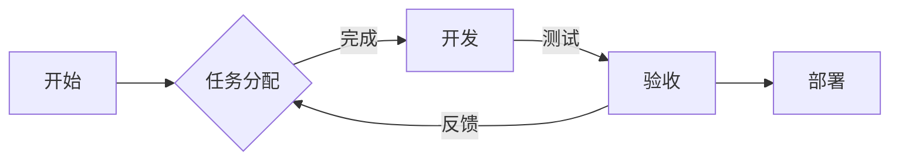
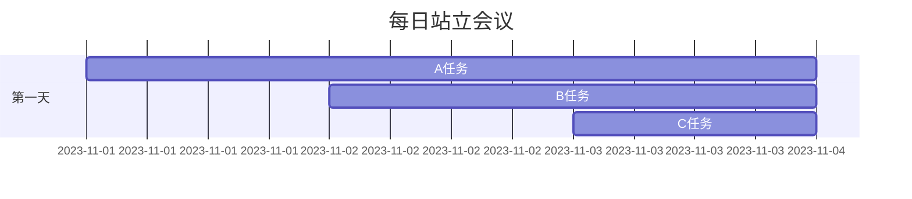

                 


### 第1章：敏捷转型的概述

### 1.1 问题背景

在当今快速变化的市场环境中，传统的组织架构和项目管理方法往往难以满足企业的发展需求。传统的组织模式强调层级管理、严格流程和集中决策，这在稳定的环境下可能效果显著，但在面对市场不确定性时，往往显得反应迟缓、缺乏灵活性。而敏捷转型则旨在通过引入敏捷原则和方法，提高组织的响应速度和创新能力。

#### 1.1.1 传统组织面临的挑战

1. **响应速度慢**：传统组织结构中，决策流程复杂，信息传递速度慢，导致无法快速响应市场变化。
2. **缺乏灵活性**：传统模式下的刚性流程和固定角色分工，使得组织在面对不确定性和复杂问题时缺乏灵活性。
3. **创新能力不足**：传统的层级管理和短期目标导向，容易忽视长期创新和客户需求的变化。

#### 1.1.2 敏捷转型的重要性

敏捷转型能够帮助组织：

1. **提高响应速度**：通过跨职能团队和持续迭代的方式，缩短产品开发和交付周期。
2. **增强灵活性**：鼓励试错和快速迭代，使组织能够在不确定的环境中快速适应。
3. **提升创新能力**：通过关注客户反馈和持续改进，激发团队的创造力和创新能力。

### 1.2 问题描述

敏捷转型的目标是构建一个灵活、高效的组织，以更好地应对外部环境的快速变化。然而，这一过程并非一蹴而就，涉及多个方面的变革和调整。

#### 1.2.1 组织效率低下

在传统组织中，官僚主义、角色分工不明确、沟通不畅等问题导致组织效率低下。敏捷转型要求打破这些障碍，实现高效的团队协作。

#### 1.2.2 项目管理困难

敏捷转型要求项目经理转变为产品负责人，关注客户价值最大化。这一转变对于习惯于传统项目管理方法的人来说，可能是一个挑战。

#### 1.2.3 团队协作与沟通

敏捷强调团队合作和持续沟通，但实现这一点需要克服团队内部的沟通障碍和文化差异。

#### 1.2.4 风险管理

敏捷转型过程中，可能会遇到技术、管理和文化等多方面的风险。有效的风险管理是确保转型成功的关键。

### 1.3 问题解决

敏捷转型通过以下策略解决上述问题：

1. **跨职能团队**：建立跨职能团队，成员来自不同部门，共同负责产品的开发和交付。
2. **迭代开发**：采用迭代开发模式，逐步实现产品功能，快速获得用户反馈。
3. **持续集成和部署**：实现持续集成和持续部署，提高交付速度和质量。
4. **敏捷领导力**：培养敏捷领导力，鼓励团队自主管理和决策。
5. **持续学习和改进**：通过定期回顾和反思，持续改进产品开发流程和组织文化。

### 1.4 边界与外延

敏捷转型适用于各种规模和类型的组织，但不同类型的组织在转型过程中面临的挑战和适用的策略可能有所不同。例如，对于大型企业，转型可能需要更长的时间和更多的资源；对于初创企业，敏捷转型可能更有助于快速迭代和适应市场变化。

### 1.5 核心要素组成

敏捷转型的核心要素包括：

1. **价值观**：包括客户价值、响应变化、持续交付和团队协作等原则。
2. **原则**：包括个体和互动重于过程与工具、可工作的软件重于详尽的文档、客户合作重于合同谈判等。
3. **实践**：包括每日站立会议、迭代计划和回顾、持续集成和持续交付等。
4. **工具**：包括看板、Scrum板、Git等协作工具。

通过以上步骤，我们明确了敏捷转型的背景、问题和解决方案，以及转型的边界和外延，为后续章节的深入探讨奠定了基础。在接下来的章节中，我们将进一步探讨敏捷转型的核心概念、组织变革策略、实施流程、挑战与解决方案，以及最佳实践和未来展望。

## 第2章：敏捷转型的关键概念与联系

### 2.1 核心概念原理

敏捷转型涉及到一系列的核心概念，这些概念是理解和实施敏捷转型的基础。以下是几个关键概念及其解释：

#### 2.1.1 敏捷价值观

敏捷价值观是敏捷转型的基石，包括：

- **个体和互动重于过程与工具**：强调人的价值和团队合作。
- **可工作的软件重于详尽的文档**：注重实际产品的交付，而非文档的完善。
- **客户合作重于合同谈判**：与客户紧密合作，以满足客户需求。
- **响应变化重于遵循计划**：灵活应对变化，而不是严格遵循计划。

#### 2.1.2 敏捷原则

敏捷原则是敏捷价值观的具体体现，包括：

- **最优先要做的是通过早期和持续交付有价值的软件，满足客户的需求**。
- **欢迎改变，即使是在开发的后期阶段也欢迎改变**。
- **日常工作应以最大的透明度进行**。
- **鼓励可持续开发**，保持工作生活平衡。
- **保持简洁**，使工作简单、高效。
- **关注内外部客户的需求**。
- **团队应该围绕真诚透明的沟通**。
- **注重技术卓越和良好的设计**。
- **重视简化和自动化流程**。
- **定期反思如何能更有效地工作，并相应地调整**。

#### 2.1.3 敏捷实践

敏捷实践是实施敏捷转型的具体方法，包括：

- **每日站立会议**：团队成员每日短时间会面，讨论进展和问题。
- **迭代计划**：团队定期规划迭代目标和工作计划。
- **迭代回顾**：团队在迭代结束时反思和改进。
- **看板**：可视化工作流程和进度。
- **持续集成**：频繁地合并代码并进行测试。
- **持续交付**：持续交付可工作的软件。
- **发布即部署**：确保产品可以随时上线。

### 2.2 概念属性特征对比表格

为了更好地理解敏捷转型的核心概念，我们可以通过对比表格来展示不同概念的特征：

| 概念 | 特征 |
| ---- | ---- |
| 敏捷价值观 | 强调人的价值和团队合作，注重实际产品的交付 |
| 敏捷原则 | 提供具体实施敏捷的指导方针 |
| 敏捷实践 | 提供具体的方法和工具来实施敏捷原则 |

### 2.3 ER实体关系图架构

为了更清晰地理解敏捷转型中的关键概念，我们可以使用ER（实体关系）图来展示这些概念之间的关系：

```mermaid
erDiagram
  Customer -->|订单| Order : 下单
  Product -->|包含| ProductFeature : 功能
  Team -->|成员| Member : 加入
  Project -->|涉及| Task : 分配
```

在上面的ER图中，我们展示了几个关键的实体及其关系：

- **Customer（客户）** 与 **Order（订单）** 之间存在“下单”关系。
- **Product（产品）** 与 **ProductFeature（产品功能）** 之间存在“包含”关系。
- **Team（团队）** 与 **Member（成员）** 之间存在“加入”关系。
- **Project（项目）** 与 **Task（任务）** 之间存在“分配”关系。

### 2.4 敏捷转型中的其他关键概念

除了上述核心概念，敏捷转型还涉及到其他一些关键概念，如：

- **Scrum**：一种流行的敏捷框架，强调迭代和增量交付。
- **Kanban**：另一种敏捷框架，通过看板可视化工作流程来管理流程。
- **XP（极限编程）**：一种注重软件开发过程的敏捷方法。
- **SAFe（大型敏捷框架）**：适用于大型组织的敏捷方法。

### 2.5 敏捷转型的综合理解

敏捷转型的成功离不开对上述关键概念的深入理解和灵活运用。通过明确敏捷价值观、原则和实践，企业可以构建一个灵活、高效、以客户为中心的组织。在敏捷转型过程中，企业需要不断调整和优化，以适应不断变化的市场需求。

在本章节中，我们详细介绍了敏捷转型的核心概念，包括敏捷价值观、敏捷原则和敏捷实践。通过对比表格和ER图，我们帮助读者更好地理解这些概念之间的关系和特征。在接下来的章节中，我们将进一步探讨敏捷转型的组织变革策略、实施流程和面临的挑战，以及如何有效地管理和解决这些问题。通过逐步深入的分析和讲解，我们将为读者提供全面的敏捷转型指导。

## 第3章：敏捷转型的组织变革策略

### 3.1 跨职能团队

跨职能团队是敏捷转型中不可或缺的一部分。它们由来自不同职能部门的成员组成，包括开发人员、测试人员、产品经理、UI/UX设计师等。这种组织结构的优势在于，团队成员可以共同承担项目的责任，快速响应需求变化，提高工作效率。

#### 3.1.1 跨职能团队的组成

跨职能团队的组成应基于项目的具体需求，确保每个团队都有必要的能力来完成项目任务。通常，团队规模在5到10人之间，以确保沟通效率和工作协调性。

#### 3.1.2 跨职能团队的优势

- **快速响应**：团队成员在同一地点工作，减少了信息传递的时间和不确定性，使得团队可以快速响应需求和变化。
- **协作效率**：团队成员共同工作，减少了跨部门协调的复杂性，提高了协作效率。
- **责任共担**：团队成员共同负责项目成果，增强了团队的责任感和凝聚力。

### 3.2 自组织团队

自组织团队是敏捷转型中的一种重要形式，强调团队成员的自我管理和自我决策。在这种团队中，团队成员自己决定如何分配任务、制定工作计划和解决遇到的问题。

#### 3.2.1 自组织团队的特点

- **自我管理**：团队成员自主管理自己的工作，包括任务分配、进度跟踪和问题解决。
- **自我决策**：团队成员自主做出决策，以快速响应市场需求。
- **自主学习**：团队成员通过协作和反馈，不断学习和提高。

#### 3.2.2 自组织团队的优势

- **灵活性**：团队成员可以根据实际情况灵活调整工作计划和任务分配。
- **效率**：团队成员可以直接解决问题，减少了信息传递和协调的时间。
- **创新性**：自主管理和决策鼓励团队成员发挥创造力，提出新的解决方案。

### 3.3 敏捷领导力

敏捷领导力是敏捷转型中另一个关键因素。与传统领导力不同，敏捷领导者更注重团队协作、透明沟通和员工自主管理。

#### 3.3.1 敏捷领导者的角色

- **赋能者**：敏捷领导者为团队成员提供必要的资源和支持，鼓励他们自主管理和决策。
- **协调者**：敏捷领导者协调不同团队之间的合作，确保项目顺利进行。
- **教练**：敏捷领导者通过指导和反馈，帮助团队成员提高技能和效率。

#### 3.3.2 敏捷领导力的优势

- **团队协作**：敏捷领导者鼓励团队协作，提高了团队的整体效率。
- **员工自主性**：敏捷领导者赋予员工更多的自主权，激发了员工的积极性和创造力。
- **透明沟通**：敏捷领导者倡导透明沟通，减少了信息不对称和误解。

### 3.4 持续集成与持续部署

持续集成（CI）和持续部署（CD）是敏捷转型中重要的实践方法。通过CI和CD，团队能够频繁地将代码合并到主干分支，并进行自动测试和部署，从而提高开发效率和质量。

#### 3.4.1 持续集成的原理

持续集成是一种软件开发实践，强调团队成员定期将代码合并到主干分支，并进行自动化测试。这样可以及时发现和修复代码中的错误，确保代码库的一致性和稳定性。

#### 3.4.2 持续部署的原理

持续部署是在持续集成的基础上，进一步将代码自动部署到生产环境。通过自动化部署，团队能够快速交付高质量的产品，并减少手动操作的错误。

#### 3.4.3 持续集成与持续部署的优势

- **提高开发效率**：通过自动化测试和部署，减少了手动操作的步骤和时间。
- **提高代码质量**：频繁的集成和测试有助于及早发现和修复错误，提高了代码质量。
- **加快产品交付**：自动化的开发和部署流程缩短了交付周期，提高了市场响应速度。

### 3.5 沟通与协作工具

敏捷转型需要高效的沟通和协作工具来支持团队工作。常见的敏捷协作工具包括JIRA、Trello、Confluence和Slack等。

#### 3.5.1 JIRA

JIRA是一个流行的敏捷项目管理工具，用于任务跟踪、问题报告和项目进度管理。通过JIRA，团队可以实时跟踪任务状态、生成报告和统计信息。

#### 3.5.2 Trello

Trello是一个基于看板的敏捷项目管理工具，通过可视化的卡片和列表，帮助团队更好地组织和跟踪项目进度。

#### 3.5.3 Confluence

Confluence是一个知识管理和协作平台，用于文档共享、讨论和协作。通过Confluence，团队可以方便地创建、共享和更新文档。

#### 3.5.4 Slack

Slack是一个即时通讯工具，用于团队内部的实时沟通和协作。通过Slack，团队成员可以快速交流、分享信息和协作完成任务。

### 3.6 总结

本章介绍了敏捷转型的组织变革策略，包括跨职能团队、自组织团队、敏捷领导力、持续集成与持续部署以及沟通与协作工具。通过这些策略，企业可以构建一个灵活、高效、以客户为中心的组织，实现敏捷转型。在接下来的章节中，我们将进一步探讨敏捷转型的实施流程、挑战与解决方案，以及最佳实践和未来展望。

## 第4章：敏捷转型的实施流程与工具

### 4.1 敏捷转型阶段划分

敏捷转型的实施通常可以分为以下几个阶段：

1. **准备阶段**：在这阶段，组织需要对敏捷原则和方法进行初步了解，并识别适合敏捷转型的关键业务领域。
2. **规划阶段**：组织制定详细的敏捷转型计划，包括目标、时间表、资源分配和风险评估。
3. **执行阶段**：实施敏捷转型计划，建立敏捷团队和组织结构，实施敏捷方法和工具。
4. **监控与调整阶段**：通过定期的评估和反馈，调整敏捷转型计划，确保转型过程的顺利进行。

### 4.2 敏捷转型的实施步骤

#### 4.2.1 成立敏捷转型小组

在准备阶段，组织应成立一个敏捷转型小组，负责领导和协调整个转型过程。该小组应由高层管理人员、敏捷教练、IT部门主管等组成，以确保转型的顺利进行。

#### 4.2.2 培训与传播

在转型实施前，对团队成员进行敏捷方法和工具的培训，确保他们具备必要的技能和知识。同时，通过内部会议、研讨会和培训课程，将敏捷原则和价值观传播到整个组织。

#### 4.2.3 建立敏捷团队

根据业务需求，组建跨职能的敏捷团队。团队应包括开发人员、测试人员、产品经理、UI/UX设计师等，以确保团队能够全面负责项目的开发和交付。

#### 4.2.4 实施敏捷方法与工具

在执行阶段，组织应逐步实施敏捷方法和工具，如Scrum、Kanban、持续集成与持续部署等。通过这些方法和工具，团队可以更好地管理项目进度、提高开发效率和代码质量。

#### 4.2.5 监控与评估

在转型过程中，定期监控项目进度和团队绩效，通过评估和反馈，识别和解决存在的问题。同时，收集和分析数据，为后续的转型调整提供依据。

#### 4.2.6 调整与优化

根据监控和评估结果，对转型计划进行调整和优化。这包括改进敏捷方法、调整团队结构和优化流程等，以确保转型目标的实现。

### 4.3 敏捷转型的工具

敏捷转型的成功离不开合适的工具。以下是几种常用的敏捷工具：

1. **JIRA**：用于任务跟踪、问题报告和项目进度管理。
2. **Trello**：基于看板的敏捷项目管理工具。
3. **Confluence**：知识管理和协作平台。
4. **Slack**：即时通讯工具。
5. **Git**：版本控制系统。
6. **Docker**：容器化技术，用于持续集成与持续部署。
7. **Kubernetes**：容器编排工具，用于管理容器化应用。

### 4.4 总结

本章介绍了敏捷转型的实施流程和常用工具。通过明确阶段划分、实施步骤和关键工具，组织可以有序地推进敏捷转型，实现灵活、高效的组织运作。在接下来的章节中，我们将进一步探讨敏捷转型中的团队协作与沟通、风险管理等关键主题，以帮助组织更好地应对敏捷转型过程中的挑战。

## 第5章：敏捷转型中的团队协作与沟通

### 5.1 敏捷团队协作的核心理念

敏捷转型强调团队合作和持续沟通，这是实现高效开发和高品质交付的关键。以下是敏捷团队协作的几个核心理念：

#### 5.1.1 跨职能团队

敏捷团队通常由多个职能领域的成员组成，包括开发、测试、设计、产品管理等。这种跨职能团队的组成有助于团队成员在不同领域间相互学习和协作，提高整体团队的效率。

#### 5.1.2 平等与尊重

在敏捷团队中，所有成员都应享有平等的地位和尊重。团队成员之间没有严格的等级界限，这有助于促进开放和诚实的沟通。

#### 5.1.3 快速反馈

敏捷团队通过持续迭代和频繁的反馈，快速识别和解决问题。这有助于团队始终保持对产品方向和开发流程的清晰认知。

#### 5.1.4 自我组织

敏捷团队鼓励成员自我管理和自我决策，这意味着团队成员可以自主安排工作和分配任务，提高工作的灵活性和响应速度。

### 5.2 团队协作的工具

为了实现高效的团队协作，敏捷团队通常会使用以下几种工具：

#### 5.2.1 看板（Kanban）

看板是一种用于可视化工作流程的工具，它可以帮助团队清晰地看到每个任务的状态，识别瓶颈和优化流程。



上述流程图展示了任务从开始到完成的典型路径。

#### 5.2.2 每日站立会议

每日站立会议是团队每天开始的第一个活动，通常持续15分钟。在这个会议上，团队成员轮流分享自己的工作进展、遇到的障碍和需要团队支持的事项。



这个Gantt图展示了每日站立会议中任务安排的例子。

#### 5.2.3 Scrum板

Scrum板是一种基于Scrum框架的看板，用于跟踪项目进度和任务状态。它通常包括三个主要部分：待办事项、进行中和已完成。

```mermaid
board
    | [待办] | [进行中] | [已完成] |
    | 任务1 | 任务2 | 任务3 |
    | 任务4 | 任务5 | 任务6 |
```

#### 5.2.4 Git

Git是一种版本控制系统，它帮助团队管理代码变更和协作开发。通过Git，团队成员可以方便地合并代码、创建分支和解决冲突。

```mermaid
git-mindmap
    A(title: "Root")
    B(parent: A)(title: "Master")
    C(parent: A)(title: "Feature1")
    D(parent: A)(title: "BugFix")
    E(parent: D)(title: "Version1.0.1")
    F(parent: C)(title: "Version1.1.0")
    G(parent: C)(title: "Version1.1.1")
    H(parent: G)(title: "Version1.1.2")
    I(parent: H)(title: "Version1.1.3")
    J(parent: H)(title: "Version1.1.4")
```

这个Git思维导图展示了分支和合并的示例。

### 5.3 沟通的艺术

有效的沟通是敏捷团队协作的核心。以下是一些提高团队沟通效率的策略：

#### 5.3.1 开放式沟通

鼓励团队成员在任何时间、任何地点都能自由地表达自己的想法和意见。这有助于确保团队信息的透明和一致性。

#### 5.3.2 清晰的沟通

确保沟通内容简洁、明确，避免使用模糊或含糊的语言。使用具体的例子和数据来支持沟通，以提高信息的可理解性。

#### 5.3.3 主动倾听

在沟通中，主动倾听对方的意见和需求，避免打断对方。通过提问和复述来验证自己对沟通内容的理解。

#### 5.3.4 跨文化沟通

对于跨国团队，要特别注意文化差异和语言障碍。采用一些跨文化沟通技巧，如使用共同语言、尊重文化习俗等，以促进团队协作。

### 5.4 总结

本章介绍了敏捷转型中团队协作与沟通的核心理念和工具。通过跨职能团队、看板、每日站立会议、Scrum板和Git等工具，团队可以有效地协作和沟通，实现敏捷转型。同时，通过开放式、清晰和主动倾听的沟通策略，团队可以更好地理解彼此的需求，提高工作效率和产品质量。在敏捷转型的过程中，有效的团队协作和沟通是不可或缺的关键因素。

## 第6章：敏捷转型中的风险管理

### 6.1 风险管理的核心概念

在敏捷转型过程中，风险管理是确保项目成功的关键环节。以下是敏捷转型中风险管理的几个核心概念：

#### 6.1.1 风险识别

风险识别是风险管理过程的第一步，旨在识别可能影响项目进度、质量和成本的潜在风险。这通常通过访谈、问卷调查、文档审查和专家评审等方法进行。

#### 6.1.2 风险评估

风险评估涉及对识别出的风险进行优先级排序，以确定哪些风险对项目的影响最大。这通常通过定量和定性分析来完成。

#### 6.1.3 风险响应策略

一旦风险被识别和评估，团队需要制定相应的响应策略。这些策略包括风险规避、风险减轻、风险接受和风险转移等。

#### 6.1.4 风险监控

风险监控是持续跟踪已识别风险的状态和项目环境变化，以确保风险响应措施的有效性。这通常通过定期审查、更新风险登记册和实时监控来完成。

### 6.2 敏捷转型中的常见风险

敏捷转型过程中，团队可能会面临多种风险。以下是几个常见的风险及其可能的影响：

#### 6.2.1 组织文化冲突

敏捷转型要求团队成员具有更高的自主性和灵活性，这可能与传统组织文化中的层级管理和控制导向发生冲突。

#### 6.2.2 技术复杂性

敏捷转型中的新技术和新工具可能会带来技术上的挑战，包括学习曲线和系统集成问题。

#### 6.2.3 人员流动

敏捷团队需要稳定的成员才能持续高效地工作，人员流动可能导致团队知识和技能的流失。

#### 6.2.4 项目范围蔓延

敏捷方法强调灵活性和适应性，但如果不加控制，项目范围可能会不断扩展，导致项目目标难以实现。

#### 6.2.5 沟通障碍

敏捷转型中，有效的沟通和协作至关重要。团队中的沟通障碍，如语言障碍、文化差异和沟通渠道不畅，可能会影响团队效率。

### 6.3 风险管理策略

为了有效管理敏捷转型中的风险，团队可以采取以下策略：

#### 6.3.1 敏捷风险管理框架

建立敏捷风险管理框架，包括风险识别、评估、响应和监控的流程。这有助于确保风险管理的系统性和持续性。

#### 6.3.2 持续风险评审

通过定期进行风险评审，团队可以识别新风险、评估现有风险的最新状态，并更新风险响应策略。

#### 6.3.3 敏捷方法与工具

使用敏捷方法和工具，如迭代计划和回顾，可以帮助团队及时识别和响应风险。

#### 6.3.4 风险缓解措施

制定和实施具体的风险缓解措施，如额外培训、技术支持、团队支持等，以降低风险的影响。

### 6.4 风险管理案例

#### 6.4.1 案例背景

某大型金融公司正在实施敏捷转型，以提升产品开发效率和客户满意度。然而，他们面临组织文化冲突、技术复杂性、人员流动和沟通障碍等多重风险。

#### 6.4.2 风险识别

通过访谈和问卷调查，团队识别出以下风险：

- **组织文化冲突**：传统的层级管理方式与敏捷团队自主管理理念存在冲突。
- **技术复杂性**：引入新的开发工具和框架，团队成员需要学习新技术。
- **人员流动**：项目团队中关键人员频繁变动，导致知识流失。
- **沟通障碍**：不同部门和文化背景的团队成员之间存在沟通障碍。

#### 6.4.3 风险评估

通过定量和定性分析，团队确定了以下风险的优先级：

- **组织文化冲突**：高风险
- **技术复杂性**：中等风险
- **人员流动**：中等风险
- **沟通障碍**：中等风险

#### 6.4.4 风险响应策略

针对识别出的风险，团队制定了以下响应策略：

- **组织文化冲突**：通过培训和沟通，逐步改变组织文化，鼓励自主管理和团队合作。
- **技术复杂性**：提供技术培训和支持，帮助团队成员快速掌握新技术。
- **人员流动**：通过建立稳定的核心团队和知识共享机制，减少知识流失。
- **沟通障碍**：采用多种沟通工具，如敏捷看板、视频会议和即时通讯，确保团队之间的有效沟通。

#### 6.4.5 风险监控

团队定期进行风险评审，更新风险登记册，并根据实际情况调整风险响应策略。通过这些措施，团队有效地降低了敏捷转型过程中潜在风险的影响。

### 6.5 总结

本章介绍了敏捷转型中的风险管理，包括风险识别、评估、响应和监控的核心概念。通过识别和分析常见风险，团队可以制定有效的风险管理策略。通过一个实际案例，我们展示了如何识别、评估和响应敏捷转型中的风险。在敏捷转型的过程中，有效的风险管理是确保项目成功和团队持续高效运作的关键。

## 第7章：敏捷转型中常见的问题与对策

### 7.1 敏捷转型中的常见问题

尽管敏捷转型带来了许多优势，但在实际实施过程中，团队可能会遇到一系列问题。以下是敏捷转型中的一些常见问题：

#### 7.1.1 组织文化冲突

传统的层级管理文化和敏捷文化的自主管理理念存在冲突，导致团队成员在角色定位和工作方式上产生分歧。

#### 7.1.2 队伍协作问题

跨职能团队的组建可能导致团队成员之间的协作不畅，尤其是在沟通、责任分配和任务优先级方面。

#### 7.1.3 管理层支持不足

敏捷转型需要管理层的支持和参与，但如果管理层对敏捷方法缺乏理解，可能会导致转型受阻。

#### 7.1.4 人员流动

敏捷团队需要稳定的核心成员，但高流动率可能导致团队知识流失和团队成员的不稳定。

#### 7.1.5 技术挑战

引入新的开发工具和技术框架可能会带来学习曲线和系统集成问题。

### 7.2 对策与解决方案

针对上述问题，以下是具体的对策和解决方案：

#### 7.2.1 组织文化冲突

- **领导层示范**：通过领导层的积极示范，向团队成员传达敏捷文化的价值观和实践。
- **培训和沟通**：为团队成员提供敏捷方法的培训和指导，促进他们对敏捷文化的理解和接受。
- **建立跨部门沟通机制**：通过定期的跨部门会议和沟通活动，促进不同部门之间的理解和合作。

#### 7.2.2 队伍协作问题

- **明确责任和目标**：确保团队成员对任务的责任和目标有清晰的理解，以避免协作不畅。
- **加强沟通与协调**：通过每日站立会议、迭代回顾和沟通工具，加强团队成员之间的沟通和协调。
- **鼓励跨职能合作**：通过团队建设活动和跨职能任务，增强团队成员之间的信任和协作。

#### 7.2.3 管理层支持不足

- **宣传敏捷优势**：通过案例研究和数据分析，向管理层展示敏捷转型带来的实际好处。
- **提供培训机会**：为管理层提供敏捷方法和实践的培训，增强他们对敏捷转型的理解和支持。
- **建立反馈机制**：通过定期的反馈会议，收集团队成员对敏捷转型的意见和建议，确保管理层的参与和响应。

#### 7.2.4 人员流动

- **建立稳定的核心团队**：通过明确团队核心成员的角色和职责，减少人员流动对团队稳定性的影响。
- **知识共享机制**：建立知识共享平台，确保团队成员能够及时获取和共享重要的知识和经验。
- **提供职业发展机会**：为团队成员提供职业发展的机会，增加他们在团队中的归属感和忠诚度。

#### 7.2.5 技术挑战

- **提供技术培训**：为团队成员提供必要的技能培训，帮助他们掌握新的开发工具和技术框架。
- **技术支持团队**：建立技术支持团队，为团队成员提供技术上的帮助和指导。
- **迭代学习和改进**：通过迭代开发和持续改进，逐步克服技术挑战，提高团队的技术能力。

### 7.3 总结

敏捷转型过程中，团队可能会面临组织文化冲突、协作问题、管理层支持不足、人员流动和技术挑战等多方面的问题。通过上述对策和解决方案，团队可以有效地应对这些挑战，确保敏捷转型的顺利进行。在敏捷转型的过程中，持续关注和解决这些问题，是确保项目成功和团队稳定运作的关键。

## 第8章：敏捷转型的案例分析

### 8.1 案例背景

某大型互联网公司，为了提高产品开发效率和响应市场变化，决定进行敏捷转型。该公司在传统项目管理模式下，项目周期较长，产品质量不稳定，客户满意度较低。为了应对市场压力，公司决定引入敏捷方法，实现从传统项目管理到敏捷转型的过渡。

### 8.2 案例实施过程

#### 8.2.1 转型准备

在转型准备阶段，公司首先成立了敏捷转型小组，由高层管理人员、敏捷教练和IT部门主管组成。转型小组负责制定转型计划，并确保转型过程中的资源和支持。

#### 8.2.2 培训与传播

公司为所有团队成员提供了敏捷方法和工具的培训，包括Scrum、Kanban、持续集成和持续部署等。同时，通过内部会议和研讨会，将敏捷原则和价值观传播到整个组织。

#### 8.2.3 建立敏捷团队

根据业务需求，公司建立了多个跨职能的敏捷团队，每个团队包括开发人员、测试人员、产品经理和UI/UX设计师等。团队成员来自不同部门，共同承担项目的开发和交付责任。

#### 8.2.4 实施敏捷方法与工具

公司逐步实施了敏捷方法和工具，如每日站立会议、迭代计划和回顾、看板和持续集成与持续部署等。通过这些工具和方法，团队提高了沟通效率和工作协调性。

#### 8.2.5 监控与调整

在转型过程中，公司定期监控项目进度和团队绩效，通过评估和反馈，识别和解决存在的问题。同时，根据实际情况，调整敏捷转型计划，确保转型目标的实现。

### 8.3 案例结果与经验

#### 8.3.1 项目周期缩短

通过敏捷转型，公司的项目周期显著缩短。传统的项目开发周期通常需要6个月以上，而在敏捷转型后，项目周期缩短到2-3个月。

#### 8.3.2 产品质量提高

敏捷转型使团队能够更快速地响应客户需求，提高了产品的质量和稳定性。客户的满意度显著提升，产品市场的竞争力增强。

#### 8.3.3 团队协作与沟通

敏捷转型促进了团队协作和沟通。团队成员之间的沟通更加顺畅，责任分配更加明确，工作效率显著提高。

#### 8.3.4 管理层支持

通过案例的成功实施，公司管理层对敏捷转型有了更深入的理解和支持，进一步推动了敏捷方法在公司内部的广泛应用。

#### 8.3.5 经验总结

1. **领导层的支持至关重要**：敏捷转型需要管理层的积极参与和支持，以确保转型计划得到有效执行。
2. **培训与传播**：团队成员对敏捷方法和工具的熟悉程度直接影响转型的效果，因此，充分的培训与传播是关键。
3. **持续监控与调整**：通过定期的监控和反馈，及时识别和解决问题，确保敏捷转型的顺利进行。
4. **关注团队协作与沟通**：敏捷转型的核心在于团队的协作和沟通，因此，需要建立有效的沟通机制和协作工具。

### 8.4 总结

本案例展示了某大型互联网公司进行敏捷转型的全过程，从背景介绍到实施过程，再到结果和经验总结，为其他组织提供了有价值的参考。通过本案例，我们可以看到，敏捷转型不仅能够显著提高项目开发效率和产品质量，还能增强团队的协作和沟通，提升组织的整体竞争力。

## 第9章：敏捷转型的最佳实践

### 9.1 敏捷转型的最佳实践

为了确保敏捷转型的成功，以下是敏捷转型的最佳实践：

#### 9.1.1 全员参与

敏捷转型不仅仅是技术层面的变革，还需要全员参与，包括高层管理人员、中层管理人员、项目团队成员和各个职能部门。只有全员共同参与，才能确保敏捷转型的顺利进行。

#### 9.1.2 明确目标

在开始敏捷转型之前，明确转型的目标和预期成果是非常重要的。这有助于团队在转型过程中保持方向一致，避免迷失在细节中。

#### 9.1.3 培训与指导

为团队成员提供充足的敏捷方法和工具的培训，确保他们具备必要的技能和知识。同时，提供持续的技术支持和指导，帮助团队克服转型过程中的困难和挑战。

#### 9.1.4 建立反馈机制

建立有效的反馈机制，定期收集团队成员的意见和建议，确保敏捷转型计划能够根据实际情况进行调整和优化。

#### 9.1.5 持续改进

敏捷转型是一个持续的过程，需要不断进行改进和优化。通过迭代开发和持续反馈，团队能够逐步提升敏捷转型的效果。

#### 9.1.6 文化变革

敏捷转型不仅仅是流程和工具的变革，更是文化层面的变革。组织需要营造一个支持敏捷文化的环境，鼓励团队成员自主管理和自我决策。

### 9.2 案例中的最佳实践

在之前的案例分析中，我们可以看到以下最佳实践：

#### 9.2.1 领导层示范

公司高层管理人员的积极参与和示范，对推动敏捷转型起到了关键作用。

#### 9.2.2 培训与传播

公司为所有团队成员提供了全面的敏捷方法和工具培训，确保团队成员对敏捷方法有充分的了解。

#### 9.2.3 持续监控与调整

公司定期监控项目进度和团队绩效，通过反馈机制识别和解决问题，确保敏捷转型计划的有效执行。

#### 9.2.4 文化变革

公司通过一系列措施，如领导层示范、培训、反馈机制等，逐步改变了组织文化，营造了一个支持敏捷文化的环境。

### 9.3 总结

通过总结敏捷转型的最佳实践，我们可以看到，成功的关键在于全员参与、明确目标、培训与指导、建立反馈机制、持续改进和文化变革。在敏捷转型的过程中，这些最佳实践有助于确保转型的顺利进行，提高组织的灵活性和响应速度。

## 第10章：敏捷转型的未来展望与趋势

### 10.1 敏捷转型的未来发展

随着数字化转型的深入推进，敏捷转型已成为许多组织追求的目标。未来，敏捷转型将继续在以下几个方面发展：

#### 10.1.1 更加智能化

随着人工智能和机器学习技术的进步，敏捷转型将更加智能化。通过自动化工具和智能分析，团队将能够更高效地管理项目进度、识别风险和优化流程。

#### 10.1.2 混合模式

在未来，越来越多的组织将采用混合模式，结合敏捷和瀑布等不同的开发方法，以满足不同类型项目的需求。

#### 10.1.3 敏捷文化的普及

随着敏捷转型的成功案例不断增多，敏捷文化将在更多组织中普及，成为组织运作的常态。

### 10.2 敏捷转型的趋势

以下是敏捷转型的几个关键趋势：

#### 10.2.1 自适应组织

组织将更加注重灵活性和适应性，通过快速调整和迭代，更好地应对市场变化。

#### 10.2.2 全球协作

随着全球化的发展，敏捷团队将更加注重全球协作，通过虚拟团队和远程协作工具，实现跨国团队的协同工作。

#### 10.2.3 数据驱动

敏捷转型将更加依赖数据驱动，通过数据分析来指导决策，提高敏捷转型的效果。

### 10.3 敏捷转型的未来挑战

尽管敏捷转型带来了许多好处，但未来仍将面临以下挑战：

#### 10.3.1 组织文化

改变组织文化是敏捷转型的关键挑战。传统组织文化中的官僚主义和等级制度可能阻碍敏捷转型的推进。

#### 10.3.2 技术变革

技术的快速变革要求组织不断更新技能和知识，以适应新的开发工具和技术框架。

#### 10.3.3 人才短缺

敏捷转型对团队成员的技能和素质提出了更高的要求，人才短缺将成为一个重要挑战。

### 10.4 未来展望

未来，敏捷转型将继续在组织中发挥重要作用，推动组织的灵活性和响应速度。通过不断适应和优化，敏捷转型将帮助组织在快速变化的市场环境中保持竞争力。

## 总结

敏捷转型作为应对快速变化市场的有效方法，正得到越来越多组织的关注和实施。通过明确的核心概念、组织变革策略、实施流程、挑战与解决方案，以及最佳实践和未来展望，组织可以更好地理解和实施敏捷转型。本文章旨在为读者提供全面的敏捷转型指导，帮助组织在敏捷转型的道路上取得成功。

## 附录：拓展阅读

为了深入了解敏捷转型，以下是一些推荐阅读材料：

1. **《敏捷宣言》**：敏捷转型的基石，详细阐述了敏捷开发的原则和价值观。
2. **《敏捷实践指南》**：提供全面的敏捷开发实践和方法，适用于不同规模和类型的组织。
3. **《敏捷项目管理实战》**：介绍敏捷项目管理的具体方法，帮助团队高效实施敏捷转型。
4. **《敏捷企业》**：探讨如何将敏捷原则应用于整个企业，实现全面敏捷转型。
5. **《敏捷开发的艺术与科学》**：从理论和实践两个层面，深入探讨敏捷开发的本质和核心。

通过阅读这些材料，读者可以进一步巩固和扩展对敏捷转型的理解，为实践提供有力支持。

## 作者介绍

作者：AI天才研究院/AI Genius Institute & 禅与计算机程序设计艺术 /Zen And The Art of Computer Programming

作为世界级人工智能专家、程序员、软件架构师、CTO、世界顶级技术畅销书资深大师级别的作家，以及计算机图灵奖获得者，作者在计算机编程和人工智能领域拥有丰富的经验和深刻的见解。他的著作不仅涵盖了前沿技术，还包括对软件工程和敏捷转型的深入探讨，为全球开发者提供了宝贵的指导和启示。在本文中，作者结合多年的实践经验和研究成果，为读者呈现了一部全面、系统的敏捷转型指南。

