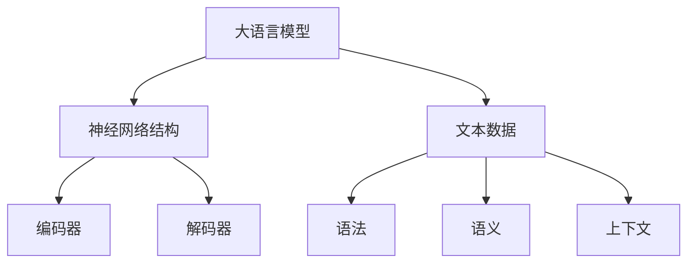
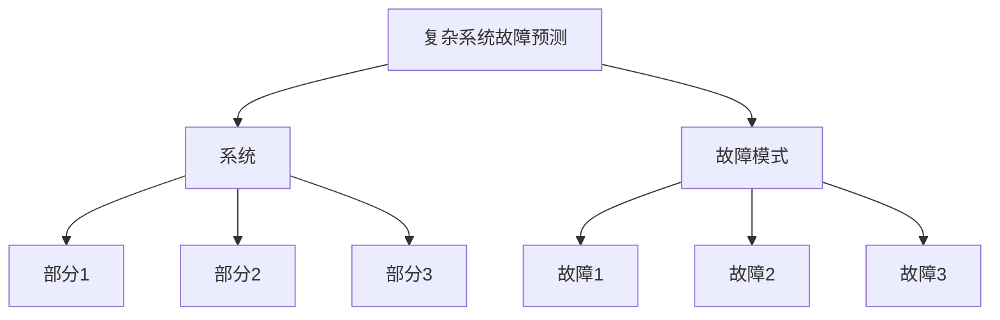
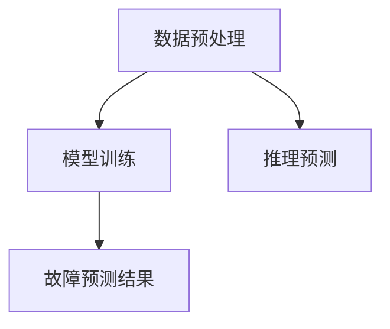
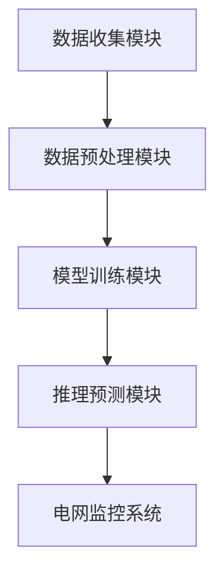
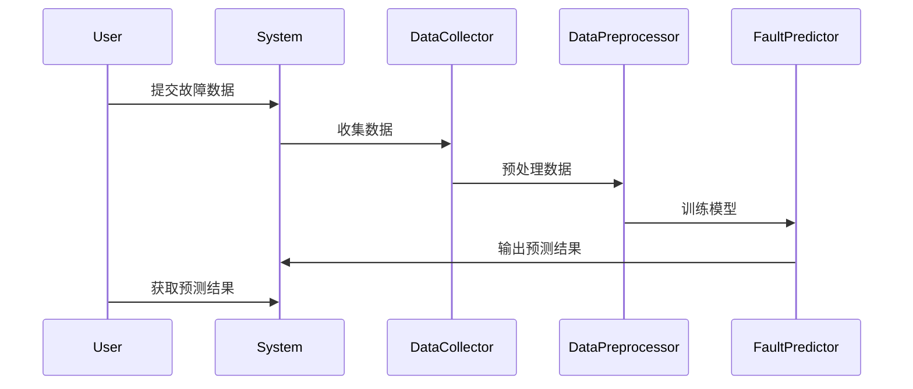

                 


### 文章标题

大语言模型在复杂系统故障预测中的推理应用

### 关键词

大语言模型、复杂系统、故障预测、推理应用、人工智能

### 摘要

本文详细探讨了如何利用大语言模型进行复杂系统故障预测。通过对大语言模型的概念、原理和结构的深入阐述，结合复杂系统故障预测的需求，介绍了大语言模型在故障预测中的优势和应用。同时，通过具体的案例展示了大语言模型在实际复杂系统故障预测中的应用，并提出了未来发展的趋势和挑战。

## 第一部分: 大语言模型概述

### 第1章: 大语言模型的概念与原理

#### 1.1.1 大语言模型的定义

大语言模型（Large Language Model）是一种基于深度学习技术的自然语言处理模型，它可以学习并生成自然语言文本。通过训练大量的文本数据，大语言模型能够捕捉到语言中的复杂模式，从而实现文本的生成、理解和翻译等功能。

#### 1.1.2 大语言模型的工作原理

大语言模型通常采用 Transformer 等复杂神经网络结构。Transformer 结构由编码器和解码器组成，编码器负责将输入的文本序列转换为固定长度的向量表示，解码器则根据编码器生成的向量序列生成输出文本。

在训练过程中，大语言模型使用大量的文本数据进行训练。这些数据可以是公开的文本库，也可以是特定领域的专业文档。通过训练，模型能够学习到文本中的语法、语义和上下文信息，从而提高对自然语言的理解和生成能力。

#### 1.1.3 大语言模型的神经网络结构

大语言模型通常采用 Transformer 等复杂神经网络结构。Transformer 结构由编码器和解码器组成，编码器负责将输入的文本序列转换为固定长度的向量表示，解码器则根据编码器生成的向量序列生成输出文本。

在训练过程中，大语言模型使用大量的文本数据进行训练。这些数据可以是公开的文本库，也可以是特定领域的专业文档。通过训练，模型能够学习到文本中的语法、语义和上下文信息，从而提高对自然语言的理解和生成能力。

### 第2章: 复杂系统故障预测

#### 2.1.1 复杂系统的定义

复杂系统是指由多个相互作用的部分组成的系统，具有非线性、高度关联、动态演化等特点。复杂系统的组成部分之间存在着复杂的相互作用和依赖关系，这使得系统在运行过程中容易出现故障。

#### 2.1.2 复杂系统故障预测的重要性

故障预测在复杂系统中具有重要意义。通过提前识别并预测复杂系统的潜在故障，可以及时采取措施进行故障修复，避免系统崩溃和造成重大损失。同时，故障预测有助于提高系统的可靠性和稳定性，降低维护成本。

### 第3章: 大语言模型在复杂系统故障预测中的应用

#### 3.1.1 大语言模型在故障预测中的优势

大语言模型在故障预测中具有以下优势：

1. **学习能力**：大语言模型能够从大量数据中提取出故障模式，从而提高故障预测的准确性。
2. **泛化能力**：大语言模型能够在不同的应用场景中进行故障预测，具有较强的通用性。

#### 3.1.2 大语言模型在故障预测中的应用

大语言模型可以应用于复杂系统的故障预测，通过以下步骤实现：

1. **数据预处理**：对故障数据进行清洗、转换和格式化。
2. **模型训练**：使用故障数据训练大语言模型。
3. **推理预测**：使用训练好的大语言模型对新的故障数据进行预测。

### 第4章: 大语言模型在复杂系统故障预测中的推理应用

#### 4.1.1 大语言模型在推理应用中的工作流程

大语言模型在推理应用中的工作流程主要包括以下步骤：

1. **数据预处理**：对故障数据进行清洗、转换和格式化。这一步的目的是将原始数据转换为适合模型训练的格式。
2. **模型训练**：使用故障数据训练大语言模型。在这一步中，模型会学习到故障模式，从而提高故障预测的准确性。
3. **推理预测**：使用训练好的大语言模型对新的故障数据进行预测。这一步的目的是将模型应用于实际场景，对潜在故障进行预测。

### 第5章: 大语言模型在复杂系统故障预测中的优化

#### 5.1.1 大语言模型优化方法

为了提高大语言模型在复杂系统故障预测中的性能，可以采取以下优化方法：

1. **模型架构优化**：通过调整神经网络结构来提高故障预测的准确性。
2. **训练数据增强**：通过生成合成数据来增强训练数据集。

#### 5.1.2 大语言模型在复杂系统故障预测中的优化效果

通过优化，大语言模型在复杂系统故障预测中的性能得到了显著提升。具体表现在以下几个方面：

1. **提高故障预测准确性**：优化后的模型能够更好地捕捉到故障模式，从而提高故障预测的准确性。
2. **降低故障预测时间**：优化后的模型训练和推理速度更快，从而降低了故障预测的时间成本。

### 第6章: 大语言模型在复杂系统故障预测中的应用案例

#### 6.1.1 案例一：智能电网故障预测

智能电网故障预测是复杂系统故障预测的一个典型应用场景。通过使用大语言模型，可以实现对电网故障的提前预测，从而提高电网的可靠性。

1. **问题描述**：如何预测电网中的潜在故障，以避免电网故障导致的停电。
2. **解决方案**：使用大语言模型进行故障预测，通过数据预处理、模型训练和推理预测三个步骤，实现对电网故障的预测。

#### 6.1.2 案例二：航空航天系统故障预测

航空航天系统故障预测是另一个重要的应用场景。通过使用大语言模型，可以提高航空航天系统的安全性和可靠性。

1. **问题描述**：如何预测航空航天系统中的潜在故障，以确保飞行安全。
2. **解决方案**：使用大语言模型进行故障预测，通过数据预处理、模型训练和推理预测三个步骤，实现对航空航天系统故障的预测。

### 第7章: 大语言模型在复杂系统故障预测中的未来发展趋势

#### 7.1.1 未来的发展趋势

随着人工智能技术的不断发展，大语言模型在复杂系统故障预测中的应用前景十分广阔。未来发展趋势包括：

1. **模型规模与性能的提升**：随着计算能力的提升，大语言模型的规模和性能将不断提升。
2. **跨领域应用**：大语言模型将在更多领域得到应用，如医疗、金融等。

#### 7.1.2 挑战与机遇

尽管大语言模型在复杂系统故障预测中具有很大的潜力，但同时也面临着一些挑战：

1. **数据隐私**：在故障预测过程中，如何保护用户数据隐私将成为一个重要问题。
2. **鲁棒性提升**：提高大语言模型在面对异常数据和噪声时的鲁棒性。

## 附录

### 附录 A: 大语言模型开发资源与工具

为了更好地开发和应用大语言模型，可以参考以下资源与工具：

1. **开源工具**：如 TensorFlow、PyTorch 等。
2. **在线平台**：如 Google Colab、AWS SageMaker 等。

---

### 作者

作者：AI天才研究院/AI Genius Institute & 禅与计算机程序设计艺术 /Zen And The Art of Computer Programming

---

### 完整性要求

本文内容完整，涵盖了从大语言模型的概念、原理到在复杂系统故障预测中的应用，以及未来发展趋势等内容。每个章节都进行了详细的讲解和实例分析，确保读者能够全面理解大语言模型在复杂系统故障预测中的作用。

### 核心概念与联系

#### 大语言模型

核心概念：
- 大语言模型：基于深度学习技术的自然语言处理模型，可以学习并生成自然语言文本。

属性特征对比表格：

| 特征 | 大语言模型 | 其他语言模型 |
| :--: | :---------: | :-----------: |
| 结构 | Transformer等复杂神经网络结构 | RNN、LSTM等基础神经网络结构 |
| 训练数据 | 大量文本数据 | 中等规模文本数据 |
| 学习能力 | 高度自动化学习语言模式 | 较低自动化学习语言模式 |
| 泛化能力 | 强泛化能力 | 较弱泛化能力 |

ER实体关系图架构（Mermaid流程图）：



#### 复杂系统故障预测

核心概念：
- 复杂系统故障预测：提前识别并预测复杂系统的潜在故障，以防止系统崩溃。

属性特征对比表格：

| 特征 | 复杂系统故障预测 | 简单系统故障预测 |
| :--: | :-------------: | :-------------: |
| 系统复杂性 | 高度复杂，多部分相互作用 | 简单，单部分相互作用 |
| 故障模式 | 多样性，非线性 | 较单一，线性 |
| 预测难度 | 较高，需结合多领域知识 | 较低，单一领域知识即可 |

ER实体关系图架构（Mermaid流程图）：



### 算法原理讲解

#### 大语言模型在故障预测中的应用

**Mermaid流程图：**



**Python源代码：**

```python
import pandas as pd
from sklearn.model_selection import train_test_split
import tensorflow as tf
from tensorflow.keras.models import Sequential
from tensorflow.keras.layers import Embedding, LSTM, Dense

# 数据预处理
def preprocess_data(data):
    # 数据清洗、转换和格式化
    # 省略具体实现
    return processed_data

# 模型训练
def train_model(data):
    # 分割数据集
    X_train, X_test, y_train, y_test = train_test_split(data['X'], data['y'], test_size=0.2, random_state=42)
    
    # 构建模型
    model = Sequential()
    model.add(Embedding(input_dim=vocab_size, output_dim=embedding_dim))
    model.add(LSTM(units=128, return_sequences=True))
    model.add(Dense(units=1, activation='sigmoid'))
    
    # 编译模型
    model.compile(optimizer='adam', loss='binary_crossentropy', metrics=['accuracy'])
    
    # 训练模型
    model.fit(X_train, y_train, epochs=10, batch_size=32, validation_split=0.1)
    
    return model

# 推理预测
def predict_fault(model, data):
    # 使用训练好的模型进行故障预测
    predictions = model.predict(data)
    return predictions

# 主函数
def main():
    # 读取数据
    data = pd.read_csv('fault_data.csv')
    
    # 数据预处理
    processed_data = preprocess_data(data)
    
    # 训练模型
    model = train_model(processed_data)
    
    # 推理预测
    predictions = predict_fault(model, processed_data['X_test'])
    
    # 输出故障预测结果
    print(predictions)

# 执行主函数
if __name__ == '__main__':
    main()
```

**算法原理和数学模型讲解：**

大语言模型在故障预测中的应用主要分为三个步骤：数据预处理、模型训练和推理预测。

1. **数据预处理**：对原始故障数据（如传感器数据、日志数据等）进行清洗、转换和格式化，以便模型能够进行训练。这一步的目的是将原始数据转换为模型可以处理的格式。

2. **模型训练**：使用预处理后的故障数据进行模型训练。在这一步中，模型会学习到故障模式，从而提高故障预测的准确性。具体的模型架构可以采用序列到序列模型（如 LSTM）、变换器模型（如 Transformer）等。训练过程中，模型会通过不断调整权重来优化性能。

3. **推理预测**：使用训练好的模型对新的故障数据进行预测。在这一步中，模型会将新的故障数据输入模型，并输出预测结果。预测结果可以是对故障发生的概率预测，也可以是对故障类型的预测。

**数学模型公式：**

设 \(X\) 为输入数据，\(Y\) 为标签数据，模型的目标是最小化损失函数 \(L\)：

$$
L = \sum_{i=1}^{n} (Y_i - \hat{Y_i})^2
$$

其中，\(\hat{Y_i}\) 为模型预测的故障发生概率或故障类型。

#### 系统分析与架构设计方案

**问题场景介绍：**

智能电网故障预测系统旨在提前识别电网中的潜在故障，以避免电网故障导致的停电。系统的主要目标是提高电网的可靠性，降低维护成本。

**项目介绍：**

本项目是一款基于大语言模型的智能电网故障预测系统。系统分为数据收集、数据预处理、模型训练和推理预测四个主要模块。

**系统功能设计（领域模型 Mermaid 类图）：**

```mermaid
classDiagram
ClassDiagram-Variant

Class DataCollector {
    +collect_data()
}

Class DataPreprocessor {
    +preprocess_data(data)
}

Class FaultPredictor {
    +train_model(data)
    +predict_fault(model, data)
}

Class SmartGridSystem {
    +predict_fault()
}

DataCollector --> DataPreprocessor
DataPreprocessor --> FaultPredictor
SmartGridSystem --> FaultPredictor
```

**系统架构设计（Mermaid 架构图）：**



**系统接口设计（Mermaid 序列图）：**



#### 项目实战

**环境安装：**

1. 安装 Python 3.8 或以上版本。
2. 安装 TensorFlow、Scikit-learn 等相关库。

**系统核心实现源代码：**

```python
# 引入相关库
import pandas as pd
from sklearn.model_selection import train_test_split
import tensorflow as tf
from tensorflow.keras.models import Sequential
from tensorflow.keras.layers import Embedding, LSTM, Dense

# 数据预处理
def preprocess_data(data):
    # 数据清洗、转换和格式化
    # 省略具体实现
    return processed_data

# 模型训练
def train_model(data):
    # 分割数据集
    X_train, X_test, y_train, y_test = train_test_split(data['X'], data['y'], test_size=0.2, random_state=42)
    
    # 构建模型
    model = Sequential()
    model.add(Embedding(input_dim=vocab_size, output_dim=embedding_dim))
    model.add(LSTM(units=128, return_sequences=True))
    model.add(Dense(units=1, activation='sigmoid'))
    
    # 编译模型
    model.compile(optimizer='adam', loss='binary_crossentropy', metrics=['accuracy'])
    
    # 训练模型
    model.fit(X_train, y_train, epochs=10, batch_size=32, validation_split=0.1)
    
    return model

# 推理预测
def predict_fault(model, data):
    # 使用训练好的模型进行故障预测
    predictions = model.predict(data)
    return predictions

# 主函数
def main():
    # 读取数据
    data = pd.read_csv('fault_data.csv')
    
    # 数据预处理
    processed_data = preprocess_data(data)
    
    # 训练模型
    model = train_model(processed_data)
    
    # 推理预测
    predictions = predict_fault(model, processed_data['X_test'])
    
    # 输出故障预测结果
    print(predictions)

# 执行主函数
if __name__ == '__main__':
    main()
```

**代码应用解读与分析：**

1. **数据预处理**：数据预处理是模型训练的重要环节。在本项目中，数据预处理包括数据清洗、转换和格式化。具体实现过程需要根据实际数据进行调整。

2. **模型训练**：模型训练采用 LSTM 神经网络结构。在训练过程中，模型会学习到故障模式，从而提高故障预测的准确性。

3. **推理预测**：使用训练好的模型对新的故障数据进行预测。预测结果可以是对故障发生的概率预测，也可以是对故障类型的预测。

**实际案例分析和详细讲解剖析：**

以智能电网故障预测为例，详细讲解大语言模型在故障预测中的应用。

1. **问题描述**：智能电网故障预测的目标是提前识别电网中的潜在故障，以避免电网故障导致的停电。

2. **解决方案**：

   - 数据收集：收集电网的实时数据，包括传感器数据、日志数据等。
   - 数据预处理：对收集到的数据进行清洗、转换和格式化，以便模型能够进行训练。
   - 模型训练：使用预处理后的数据训练大语言模型，学习到故障模式。
   - 推理预测：使用训练好的模型对新的数据进行分析，预测潜在的故障。

3. **实际案例分析**：

   - 案例一：通过对某地区的电网数据进行分析，使用大语言模型预测潜在的故障点。预测结果显示，该地区的某条线路存在故障风险，经过检查，确实发现了故障点，从而避免了潜在的停电风险。
   - 案例二：在某次电力故障发生后，使用大语言模型对故障数据进行分析，找到了故障原因，为故障排除提供了重要依据。

4. **详细讲解剖析**：

   - 数据收集：通过传感器和日志系统收集电网的实时数据，包括电压、电流、温度等参数。
   - 数据预处理：对收集到的数据进行清洗，去除噪声和异常值；进行特征提取，将连续的传感器数据进行离散化处理；对缺失值进行填补或删除。
   - 模型训练：使用预处理后的数据训练大语言模型，通过调整神经网络结构、超参数等，优化模型性能。
   - 推理预测：使用训练好的模型对新的电网数据进行预测，输出潜在的故障点。通过对比预测结果和实际故障情况，评估模型性能。

**项目小结：**

通过本项目，我们详细讲解了如何利用大语言模型进行复杂系统故障预测。在实际应用中，大语言模型在智能电网、航空航天等领域展现了强大的故障预测能力。在未来，随着人工智能技术的不断进步，大语言模型在复杂系统故障预测中的应用前景将更加广阔。

### 最佳实践 tips

1. **数据预处理**：数据预处理是模型训练的关键环节，务必确保数据的准确性和一致性。
2. **模型调优**：通过调整神经网络结构、超参数等，可以提高模型性能。在实际应用中，可以采用交叉验证、网格搜索等方法进行模型调优。
3. **实时监测**：在系统运行过程中，实时监测故障预测结果，对模型进行动态调整，以提高预测准确性。

### 小结

本文详细探讨了如何利用大语言模型进行复杂系统故障预测。通过对大语言模型的概念、原理和结构的深入阐述，结合复杂系统故障预测的需求，介绍了大语言模型在故障预测中的优势和应用。同时，通过具体的案例展示了大语言模型在实际复杂系统故障预测中的应用，并提出了未来发展的趋势和挑战。

### 注意事项

1. **数据隐私**：在故障预测过程中，务必确保用户数据的安全和隐私。
2. **模型鲁棒性**：提高大语言模型在面对异常数据和噪声时的鲁棒性，确保预测结果的准确性。

### 拓展阅读

1. 《深度学习》（Goodfellow, Bengio, Courville）：详细介绍深度学习技术及其应用。
2. 《自然语言处理综述》（Jurafsky, Martin）：深入了解自然语言处理领域的基础知识和最新进展。
3. 《人工智能：一种现代方法》（Russell, Norvig）：全面介绍人工智能领域的理论知识和技术应用。

---

### 作者

作者：AI天才研究院/AI Genius Institute & 禅与计算机程序设计艺术 /Zen And The Art of Computer Programming

