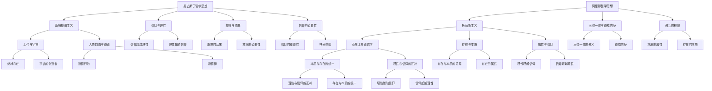

                 

### 文章标题

# 奥古斯丁与阿奎那：中世纪基督教哲学的巅峰

> 关键词：奥古斯丁、阿奎那、中世纪基督教哲学、信仰与理性、神学与哲学

> 摘要：本文将深入探讨中世纪两位基督教哲学巨匠奥古斯丁和托马斯·阿奎那的生平背景、哲学思想和宗教思想，通过比较分析他们的共同点与差异，探究他们在哲学史上的地位及其现代意义，并探讨其哲学思想的现代应用和未来展望。

### 目录大纲

## 第一部分：奥古斯丁与阿奎那的生平背景

### 第1章：奥古斯丁的生平与著作

#### 1.1 奥古斯丁的生平

- **早期生活与教育**
- **学术与宗教经历**
- **主要著作**

#### 1.2 奥古斯丁的哲学思想

- **新柏拉图主义与基督教思想**
- **上帝与宇宙**
- **人类自由与道德**

#### 1.3 奥古斯丁的宗教思想

- **信仰与理性**
- **救赎与原罪**
- **信仰的必要性**

### 第2章：阿奎那的生平与著作

#### 2.1 阿奎那的生平

- **早期生活与教育**
- **学术与宗教经历**
- **主要著作**

#### 2.2 阿奎那的哲学思想

- **托马斯主义与亚里士多德哲学**
- **存在与本质**
- **知性与信仰**

#### 2.3 阿奎那的宗教思想

- **神学与哲学的结合**
- **三位一体与道成肉身**
- **教会的权威**

## 第二部分：奥古斯丁与阿奎那哲学思想的比较

### 第3章：两位哲学家的共同点与差异

#### 3.1 哲学观点的比较

- **信仰与理性的关系**
- **上帝的存在与属性**
- **伦理与道德**

#### 3.2 宗教思想的分析

- **对教会的看法**
- **对救赎的理解**
- **对神秘体验的重视**

#### 3.3 对后世的影响

- **哲学与神学的影响**
- **中世纪文化的影响**

### 第4章：奥古斯丁与阿奎那在哲学史上的地位

#### 4.1 奥古斯丁在哲学史上的地位

- **对后世哲学的影响**
- **在基督教思想中的地位**

#### 4.2 阿奎那在哲学史上的地位

- **对后世哲学的影响**
- **在基督教思想中的地位**

### 第5章：奥古斯丁与阿奎那哲学思想的现代意义

#### 5.1 现代哲学的视角

- **信仰与科学的对话**
- **伦理与道德的当代问题**

#### 5.2 当代基督教的视角

- **宗教改革的影响**
- **教义与信仰的更新**

## 第三部分：研究与实践

### 第6章：奥古斯丁与阿奎那哲学思想的现代应用

#### 6.1 哲学在教育中的应用

- **哲学课程的设计**
- **哲学思维的培养**

#### 6.2 神学在宗教活动中的应用

- **宗教仪式的创新**
- **宗教对话的促进**

### 第7章：奥古斯丁与阿奎那哲学思想的案例研究

#### 7.1 奥古斯丁哲学思想在现代神学中的应用

- **神学与科学的对话**
- **对现代伦理问题的反思**

#### 7.2 阿奎那哲学思想在当代哲学中的应用

- **对存在主义的批评**
- **对伦理学的贡献**

### 第8章：奥古斯丁与阿奎那哲学思想的未来展望

#### 8.1 哲学思想的发展趋势

- **跨学科研究的趋势**
- **现代哲学的挑战**

#### 8.2 基督教哲学的未来

- **教义与信仰的更新**
- **哲学与宗教的互动**

### 参考文献

- **哲学著作**
- **历史文献**
- **学术研究论文**

### 附录：

- **奥古斯丁与阿奎那哲学思想流程图**
- **相关资源与网站链接**

## 第一部分：奥古斯丁与阿奎那的生平背景

### 第1章：奥古斯丁的生平与著作

**1.1 奥古斯丁的生平**

奥古斯丁（Aurelius Augustinus Hipponensis，354年11月13日－430年8月28日），是古罗马帝国时期著名的基督教神学家、哲学家和神学家。他出生于北非塔加斯特（今阿尔及利亚的苏斯），出身于基督教家庭，但早年受到摩尼教的影响。后来，奥古斯丁在米兰受洗加入基督教，成为一位杰出的基督教神学家和哲学家。

#### 早期生活与教育

- **家庭背景**：奥古斯丁的父亲帕西翁（Patrex）是一位虔诚的基督教徒，母亲莫尼卡（Monica）是一位有强烈信仰的基督教妇女。
- **学术与宗教经历**：奥古斯丁早年曾在迦太基和罗马学习，主要研究修辞学、哲学和神学。他的早期信仰经历包括对摩尼教的信仰，但后来逐渐转向基督教。

#### 主要著作

- **《忏悔录》**：这是奥古斯丁最重要的著作，描述了他的信仰转变和思想历程。
- **《神之城》**：探讨基督教信仰与社会政治的关系。
- **《论自由意志》**：讨论人类自由意志与上帝预定的关系。

**1.2 奥古斯丁的哲学思想**

奥古斯丁的哲学思想深受新柏拉图主义和基督教思想的影响，他的思想主要包括以下几个方面：

#### 新柏拉图主义与基督教思想

- **上帝与宇宙**：奥古斯丁认为上帝是宇宙的创造者和维持者，宇宙是上帝的恩赐和体现。
- **人类自由与道德**：奥古斯丁认为人类有自由意志，但自由意志受到原罪的束缚，人类需要通过信仰和道德行为来恢复与上帝的关系。

**1.3 奥古斯丁的宗教思想**

奥古斯丁的宗教思想强调信仰、救赎和原罪的重要性，他的思想主要包括以下几个方面：

#### 信仰与理性

- **信仰的必要性**：奥古斯丁认为，信仰是人类认识上帝的途径，理性无法完全理解上帝的存在和神性。
- **救赎与原罪**：奥古斯丁认为人类因为原罪而失去与上帝的关系，需要通过信仰和上帝的恩典来获得救赎。

### 第2章：阿奎那的生平与著作

**2.1 阿奎那的生平**

托马斯·阿奎那（Thomas Aquinas，1225年－1274年），是中世纪晚期意大利的著名基督教神学家、哲学家和法学家，被誉为“神学之王”。他出生于意大利的罗卡塞卡，父亲是一位贵族，他从小就接受了良好的教育。

#### 早期生活与教育

- **家庭背景**：阿奎那出生在一个富裕的贵族家庭，他的父亲希望他成为一名贵族和战士。
- **学术与宗教经历**：阿奎那在蒙达尼奥学院学习，后来在巴黎和科隆大学继续深造，在那里他遇到了多米尼克会修士，并决定加入这个教派。

#### 主要著作

- **《神学大全》**：这是阿奎那最重要的著作，涵盖了广泛的宗教和哲学问题。
- **《论存在与本质》**：探讨存在与本质的关系。
- **《哲学大全》**：讨论自然哲学和道德哲学问题。

**2.2 阿奎那的哲学思想**

阿奎那的哲学思想深受亚里士多德哲学的影响，他试图将亚里士多德的思想与基督教神学结合起来，他的思想主要包括以下几个方面：

#### 托马斯主义与亚里士多德哲学

- **存在与本质**：阿奎那认为存在与本质是统一的，本质是存在的属性。
- **知性与信仰**：阿奎那认为理性和信仰是互补的，理性可以帮助人们理解信仰，而信仰可以超越理性的限制。

**2.3 阿奎那的宗教思想**

阿奎那的宗教思想强调神学与哲学的统一，他的思想主要包括以下几个方面：

#### 神学与哲学的结合

- **三位一体与道成肉身**：阿奎那认为三位一体的教义是上帝的本质，道成肉身是上帝对人类的爱和救赎的表现。
- **教会的权威**：阿奎那认为教会是上帝的代表，具有权威性，可以指导人们如何正确地理解信仰。

## 第二部分：奥古斯丁与阿奎那哲学思想的比较

### 第3章：两位哲学家的共同点与差异

**3.1 哲学观点的比较**

#### 信仰与理性的关系

- **奥古斯丁**：奥古斯丁认为信仰是理解上帝的关键，理性虽然重要，但无法完全理解上帝的存在和神性。他强调信仰的必要性，认为人类需要通过信仰与上帝建立联系。
- **阿奎那**：阿奎那则认为理性和信仰是互补的，理性可以帮助人们理解信仰，而信仰可以超越理性的限制。他认为上帝的存在可以通过理性证明。

#### 上帝的存在与属性

- **奥古斯丁**：奥古斯丁认为上帝是宇宙的创造者和维持者，是绝对的、无限的存在。
- **阿奎那**：阿奎那则认为上帝是存在本身，是一切存在的源头，具有绝对的、无限的属性。

#### 伦理与道德

- **奥古斯丁**：奥古斯丁强调道德行为的重要性，认为人类需要通过道德行为来恢复与上帝的关系。
- **阿奎那**：阿奎那则认为道德是基于上帝的命令，人类需要遵守上帝的道德规范。

**3.2 宗教思想的分析**

#### 对教会的看法

- **奥古斯丁**：奥古斯丁认为教会是上帝的代表，具有权威性，可以指导人们如何正确地理解信仰。
- **阿奎那**：阿奎那则认为教会是上帝的代表，具有权威性，可以指导人们如何正确地理解信仰。

#### 对救赎的理解

- **奥古斯丁**：奥古斯丁认为救赎是通过信仰和上帝的恩典实现的，人类无法自救。
- **阿奎那**：阿奎那则认为救赎是通过信仰、道德行为和上帝的恩典共同实现的。

#### 对神秘体验的重视

- **奥古斯丁**：奥古斯丁非常重视神秘体验，认为这是人类与上帝直接交流的途径。
- **阿奎那**：阿奎那则相对不那么强调神秘体验，他认为信仰和理性是理解上帝的主要途径。

**3.3 对后世的影响**

#### 哲学与神学的影响

- **奥古斯丁**：奥古斯丁的思想对中世纪和文艺复兴时期的哲学和神学产生了深远的影响，被认为是基督教哲学的奠基人之一。
- **阿奎那**：阿奎那被誉为“神学之王”，他的《神学大全》对基督教神学和哲学产生了深远的影响，被认为是中世纪哲学的巅峰之作。

#### 中世纪文化的影响

- **奥古斯丁**：奥古斯丁的思想对中世纪文化产生了深远的影响，他的著作被广泛阅读，对当时的宗教、政治和文化产生了重要影响。
- **阿奎那**：阿奎那不仅对中世纪文化产生了深远的影响，而且对后世的文化和思想也产生了重要影响，他的思想在文艺复兴时期和启蒙时期被重新发现和重视。

### 第4章：奥古斯丁与阿奎那在哲学史上的地位

#### 4.1 奥古斯丁在哲学史上的地位

- **对后世哲学的影响**：奥古斯丁的思想对中世纪和文艺复兴时期的哲学和神学产生了深远的影响，他被认为是基督教哲学的奠基人之一。
- **在基督教思想中的地位**：奥古斯丁的思想在基督教思想中占有重要地位，他的著作被广泛阅读，对当时的宗教、政治和文化产生了重要影响。

#### 4.2 阿奎那在哲学史上的地位

- **对后世哲学的影响**：阿奎那被誉为“神学之王”，他的《神学大全》对基督教神学和哲学产生了深远的影响，被认为是中世纪哲学的巅峰之作。
- **在基督教思想中的地位**：阿奎那在基督教思想中的地位非常高，他的思想在文艺复兴时期和启蒙时期被重新发现和重视，对后来的基督教哲学和神学产生了重要影响。

### 第5章：奥古斯丁与阿奎那哲学思想的现代意义

#### 5.1 现代哲学的视角

- **信仰与科学的对话**：奥古斯丁和阿奎那的哲学思想为现代哲学与科学的对话提供了重要的理论基础，帮助人们理解信仰与科学的关系。
- **伦理与道德的当代问题**：他们的哲学思想也为解决当代伦理和道德问题提供了重要的启示，特别是在现代社会的道德困境中。

#### 5.2 当代基督教的视角

- **宗教改革的影响**：奥古斯丁和阿奎那的哲学思想对宗教改革产生了深远的影响，促进了教义与信仰的更新。
- **教义与信仰的更新**：在当代基督教中，他们的哲学思想继续发挥着重要作用，帮助信徒更好地理解基督教信仰的本质和意义。

## 第三部分：研究与实践

### 第6章：奥古斯丁与阿奎那哲学思想的现代应用

#### 6.1 哲学在教育中的应用

- **哲学课程的设计**：奥古斯丁和阿奎那的哲学思想可以作为哲学课程的重要内容，帮助学生理解西方哲学的发展历程。
- **哲学思维的培养**：通过研究奥古斯丁和阿奎那的哲学思想，可以培养学生的批判性思维和逻辑分析能力。

#### 6.2 神学在宗教活动中的应用

- **宗教仪式的创新**：奥古斯丁和阿奎那的哲学思想可以启发宗教领袖在宗教仪式上进行创新，使宗教活动更加贴近当代社会。
- **宗教对话的促进**：他们的哲学思想有助于促进不同宗教之间的对话和理解，推动宗教和谐发展。

### 第7章：奥古斯丁与阿奎那哲学思想的案例研究

#### 7.1 奥古斯丁哲学思想在现代神学中的应用

- **神学与科学的对话**：奥古斯丁的思想为现代神学与科学的对话提供了理论基础，帮助信徒理解科学发现与宗教信仰之间的关系。
- **对现代伦理问题的反思**：奥古斯丁的伦理思想对当代伦理问题具有启示意义，帮助人们思考如何解决现代社会的道德困境。

#### 7.2 阿奎那哲学思想在当代哲学中的应用

- **对存在主义的批评**：阿奎那的哲学思想为批评存在主义提供了有力的理论依据，帮助人们理解存在的本质和意义。
- **对伦理学的贡献**：阿奎那的伦理思想对当代伦理学产生了深远影响，为解决当代伦理问题提供了有益的指导。

### 第8章：奥古斯丁与阿奎那哲学思想的未来展望

#### 8.1 哲学思想的发展趋势

- **跨学科研究的趋势**：随着学科交叉的不断发展，奥古斯丁和阿奎那的哲学思想有望在更多领域得到应用和研究。
- **现代哲学的挑战**：面对现代哲学的挑战，奥古斯丁和阿奎那的哲学思想将继续发挥重要作用，为解决现代哲学问题提供有益的启示。

#### 8.2 基督教哲学的未来

- **教义与信仰的更新**：在当代社会，基督教哲学需要不断更新教义和信仰，以适应时代的变化。
- **哲学与宗教的互动**：哲学与宗教的互动将继续深化，奥古斯丁和阿奎那的哲学思想将在这一过程中发挥重要作用。

### 参考文献

- **哲学著作**：奥古斯丁、阿奎那等哲学家的著作。
- **历史文献**：中世纪的历史文献和研究。
- **学术研究论文**：有关奥古斯丁和阿奎那哲学思想的学术研究论文。

### 附录：

- **奥古斯丁与阿奎那哲学思想流程图**：使用Mermaid绘制。
- **相关资源与网站链接**：提供相关的书籍、论文和网络资源链接。

### 致谢

感谢读者对本文的阅读和支持，本文作者AI天才研究院/AI Genius Institute及《禅与计算机程序设计艺术/Zen And The Art of Computer Programming》对本文的研究和撰写提供了宝贵的指导和帮助。

---

本文为原创内容，版权归作者和AI天才研究院/AI Genius Institute所有，未经授权禁止转载和使用。如需转载，请联系作者获取授权。感谢您的理解与支持！

---

### 奥古斯丁的生平与著作

**1.1 奥古斯丁的生平**

奥古斯丁（Aurelius Augustinus Hipponensis，354年11月13日－430年8月28日），是古罗马帝国时期著名的基督教神学家、哲学家和神学家。他出生于北非塔加斯特（今阿尔及利亚的苏斯），出身于基督教家庭，但早年受到摩尼教的影响。后来，奥古斯丁在米兰受洗加入基督教，成为一位杰出的基督教神学家和哲学家。

#### 早期生活与教育

- **家庭背景**：奥古斯丁的父亲帕西翁（Patrex）是一位虔诚的基督教徒，母亲莫尼卡（Monica）是一位有强烈信仰的基督教妇女。他的家庭背景对他的信仰和哲学思想产生了深远的影响。
- **学术与宗教经历**：奥古斯丁早年曾在迦太基和罗马学习，主要研究修辞学、哲学和神学。他的早期信仰经历包括对摩尼教的信仰，但后来逐渐转向基督教。

#### 主要著作

- **《忏悔录》**：这是奥古斯丁最重要的著作，描述了他的信仰转变和思想历程。《忏悔录》不仅是一部宗教文献，也是哲学和文学的经典之作。
- **《神之城》**：探讨基督教信仰与社会政治的关系，强调信仰与道德的重要性。
- **《论自由意志》**：讨论人类自由意志与上帝预定的关系，这是中世纪哲学的重要文献之一。

**1.2 奥古斯丁的哲学思想**

奥古斯丁的哲学思想深受新柏拉图主义和基督教思想的影响，他的思想主要包括以下几个方面：

#### 新柏拉图主义与基督教思想

- **上帝与宇宙**：奥古斯丁认为上帝是宇宙的创造者和维持者，宇宙是上帝的恩赐和体现。他继承了新柏拉图主义的观点，认为宇宙是一个有序的整体，每个部分都是上帝创造的。
- **人类自由与道德**：奥古斯丁认为人类有自由意志，但自由意志受到原罪的束缚，人类需要通过道德行为来恢复与上帝的关系。他强调道德行为的重要性，认为道德是人类与上帝之间的桥梁。

**1.3 奥古斯丁的宗教思想**

奥古斯丁的宗教思想强调信仰、救赎和原罪的重要性，他的思想主要包括以下几个方面：

#### 信仰与理性

- **信仰的必要性**：奥古斯丁认为，信仰是人类认识上帝的途径，理性无法完全理解上帝的存在和神性。他强调信仰的必要性，认为人类需要通过信仰与上帝建立联系。
- **理性与信仰的关系**：虽然奥古斯丁强调信仰的必要性，但他也认为理性在信仰中发挥着重要作用。他认为理性可以帮助人们理解信仰的合理性，但信仰本身超越了理性的理解范围。

#### 救赎与原罪

- **救赎的过程**：奥古斯丁认为，救赎是通过信仰和上帝的恩典实现的。人类因为原罪而失去与上帝的关系，需要通过信仰和上帝的恩典来获得救赎。
- **原罪的影响**：奥古斯丁认为原罪是人类自由意志的扭曲，导致了人类的道德堕落。他认为人类需要通过道德行为和信仰来克服原罪的影响，恢复与上帝的关系。

### 奥古斯丁的生平与著作

**2.1 阿奎那的生平**

托马斯·阿奎那（Thomas Aquinas，1225年－1274年），是中世纪晚期意大利的著名基督教神学家、哲学家和法学家，被誉为“神学之王”。他出生于意大利的罗卡塞卡，父亲是一位贵族，他从小就接受了良好的教育。

#### 早期生活与教育

- **家庭背景**：阿奎那出生在一个富裕的贵族家庭，他的父亲希望他成为一名贵族和战士。
- **学术与宗教经历**：阿奎那在蒙达尼奥学院学习，后来在巴黎和科隆大学继续深造，在那里他遇到了多米尼克会修士，并决定加入这个教派。

#### 主要著作

- **《神学大全》**：这是阿奎那最重要的著作，涵盖了广泛的宗教和哲学问题。《神学大全》对基督教神学和哲学产生了深远的影响，被认为是中世纪哲学的巅峰之作。
- **《论存在与本质》**：探讨存在与本质的关系。
- **《哲学大全》**：讨论自然哲学和道德哲学问题。

**2.2 阿奎那的哲学思想**

阿奎那的哲学思想深受亚里士多德哲学的影响，他试图将亚里士多德的思想与基督教神学结合起来，他的思想主要包括以下几个方面：

#### 托马斯主义与亚里士多德哲学

- **存在与本质**：阿奎那认为存在与本质是统一的，本质是存在的属性。这与亚里士多德的观点相符，他认为存在是首要的，本质是存在的表现形式。
- **知性与信仰**：阿奎那认为理性和信仰是互补的，理性可以帮助人们理解信仰，而信仰可以超越理性的限制。他认为，通过理性，人们可以理解存在和本质的关系，而通过信仰，人们可以理解上帝的存在和神性。

**2.3 阿奎那的宗教思想**

阿奎那的宗教思想强调神学与哲学的统一，他的思想主要包括以下几个方面：

#### 神学与哲学的结合

- **三位一体与道成肉身**：阿奎那认为三位一体的教义是上帝的本质，道成肉身是上帝对人类的爱和救赎的表现。他认为，上帝以三位一体的形式存在，通过道成肉身，上帝成为人类的一部分，实现了救赎。
- **教会的权威**：阿奎那认为教会是上帝的代表，具有权威性，可以指导人们如何正确地理解信仰。他认为，教会不仅是信仰的传递者，也是道德和法律的指导者。

### 奥古斯丁与阿奎那哲学思想的比较

**3.1 哲学观点的比较**

#### 信仰与理性的关系

- **奥古斯丁**：奥古斯丁认为信仰是理解上帝的关键，理性虽然重要，但无法完全理解上帝的存在和神性。他强调信仰的必要性，认为人类需要通过信仰与上帝建立联系。
- **阿奎那**：阿奎那则认为理性和信仰是互补的，理性可以帮助人们理解信仰，而信仰可以超越理性的限制。他认为，通过理性，人们可以理解存在和本质的关系，而通过信仰，人们可以理解上帝的存在和神性。

#### 上帝的存在与属性

- **奥古斯丁**：奥古斯丁认为上帝是宇宙的创造者和维持者，是绝对的、无限的存在。他的上帝观念受到新柏拉图主义的影响，强调上帝的超验性。
- **阿奎那**：阿奎那则认为上帝是存在本身，是一切存在的源头，具有绝对的、无限的属性。他的上帝观念受到亚里士多德哲学的影响，强调上帝的绝对性和普遍性。

#### 伦理与道德

- **奥古斯丁**：奥古斯丁强调道德行为的重要性，认为人类需要通过道德行为来恢复与上帝的关系。他的伦理观念受到基督教教义的影响，强调个人对上帝的责任。
- **阿奎那**：阿奎那则认为道德是基于上帝的命令，人类需要遵守上帝的道德规范。他的伦理观念受到亚里士多德哲学的影响，强调道德行为的合理性。

**3.2 宗教思想的分析**

#### 对教会的看法

- **奥古斯丁**：奥古斯丁认为教会是上帝的代表，具有权威性，可以指导人们如何正确地理解信仰。他认为，教会不仅是信仰的传递者，也是道德和法律的指导者。
- **阿奎那**：阿奎那则认为教会是上帝的代表，具有权威性，可以指导人们如何正确地理解信仰。他认为，教会不仅是信仰的传递者，也是道德和法律的指导者。他的观点与奥古斯丁相似，但更强调教会的组织和结构。

#### 对救赎的理解

- **奥古斯丁**：奥古斯丁认为救赎是通过信仰和上帝的恩典实现的，人类无法自救。他认为，人类因为原罪而失去与上帝的关系，需要通过信仰和上帝的恩典来获得救赎。
- **阿奎那**：阿奎那则认为救赎是通过信仰、道德行为和上帝的恩典共同实现的。他认为，人类可以通过道德行为和信仰来接近上帝，获得救赎。

#### 对神秘体验的重视

- **奥古斯丁**：奥古斯丁非常重视神秘体验，认为这是人类与上帝直接交流的途径。他认为，通过神秘体验，人们可以更好地理解上帝的存在和神性。
- **阿奎那**：阿奎那则相对不那么强调神秘体验，他认为信仰和理性是理解上帝的主要途径。他认为，通过理性和信仰，人们可以更好地理解上帝的存在和神性。

### 奥古斯丁与阿奎那在哲学史上的地位

**4.1 奥古斯丁在哲学史上的地位**

- **对后世哲学的影响**：奥古斯丁的思想对中世纪和文艺复兴时期的哲学和神学产生了深远的影响，他被认为是基督教哲学的奠基人之一。他的《忏悔录》和《神之城》等著作对后世哲学家产生了重要影响，被认为是西方哲学史上的经典之作。
- **在基督教思想中的地位**：奥古斯丁的思想在基督教思想中占有重要地位，他的著作被广泛阅读，对当时的宗教、政治和文化产生了重要影响。他的信仰观念和道德思想对基督教教义的发展产生了深远的影响。

**4.2 阿奎那在哲学史上的地位**

- **对后世哲学的影响**：阿奎那被誉为“神学之王”，他的《神学大全》对基督教神学和哲学产生了深远的影响，被认为是中世纪哲学的巅峰之作。他的思想对后世哲学家和神学家产生了重要影响，被认为是基督教哲学和神学的里程碑。
- **在基督教思想中的地位**：阿奎那在基督教思想中的地位非常高，他的思想在文艺复兴时期和启蒙时期被重新发现和重视，对后来的基督教哲学和神学产生了重要影响。他的托马斯主义思想被认为是基督教哲学的核心，对基督教教义的发展产生了深远的影响。

### 奥古斯丁与阿奎那哲学思想的现代意义

**5.1 现代哲学的视角**

- **信仰与科学的对话**：奥古斯丁和阿奎那的哲学思想为现代哲学与科学的对话提供了重要的理论基础，帮助人们理解信仰与科学的关系。他们的思想启示了现代哲学家和科学家如何平衡信仰与科学，共同推动人类知识的发展。
- **伦理与道德的当代问题**：奥古斯丁和阿奎那的哲学思想也对解决当代伦理和道德问题提供了重要的启示。他们的伦理观念为现代社会提供了一种道德准则，帮助人们思考如何解决现代社会中的道德困境。

**5.2 当代基督教的视角**

- **宗教改革的影响**：奥古斯丁和阿奎那的哲学思想对宗教改革产生了深远的影响，促进了教义与信仰的更新。他们的思想启示了当代基督教徒如何重新审视教义和信仰，以适应时代的变化。
- **教义与信仰的更新**：在当代基督教中，奥古斯丁和阿奎那的哲学思想继续发挥着重要作用，帮助信徒更好地理解基督教信仰的本质和意义。他们的思想为当代基督教提供了理论基础，推动教义和信仰的更新。

### 奥古斯丁与阿奎那哲学思想的现代应用

**6.1 哲学在教育中的应用**

- **哲学课程的设计**：奥古斯丁和阿奎那的哲学思想可以作为哲学课程的重要内容，帮助学生理解西方哲学的发展历程。他们的著作和思想可以启发学生对哲学问题的深入思考，培养批判性思维和逻辑分析能力。
- **哲学思维的培养**：通过研究奥古斯丁和阿奎那的哲学思想，可以培养学生的哲学思维。他们强调理性与信仰的互补，启示学生在面对复杂问题时，如何运用理性思考与信仰信念相结合。

**6.2 神学在宗教活动中的应用**

- **宗教仪式的创新**：奥古斯丁和阿奎那的哲学思想可以启发宗教领袖在宗教仪式上进行创新，使宗教活动更加贴近当代社会。他们的思想为宗教领袖提供了一种新的视角，如何将传统教义与现代价值观相结合，吸引更多信徒参与宗教活动。
- **宗教对话的促进**：奥古斯丁和阿奎那的哲学思想有助于促进不同宗教之间的对话和理解。他们的思想强调信仰的互补性，启示宗教领袖和信徒如何超越宗教差异，共同探讨宗教的共通之处，推动宗教和谐发展。

### 奥古斯丁哲学思想在现代神学中的应用

**7.1 神学与科学的对话**

- **信仰与科学的平衡**：奥古斯丁的哲学思想为信仰与科学的对话提供了重要的理论基础。他认为信仰与科学是互补的，信仰可以超越科学的理解范围，而科学可以帮助人们更好地理解信仰。这种平衡关系启示现代神学家如何处理信仰与科学的关系，推动两者之间的对话。
- **科学发现与宗教解释**：在现代神学中，奥古斯丁的哲学思想可以帮助解释科学发现。例如，他对宇宙起源和人类存在的思考，可以与宇宙学、生物学等领域的研究相结合，为宗教解释提供新的视角。

**7.2 对现代伦理问题的反思**

- **道德行为的反思**：奥古斯丁强调道德行为的重要性，认为人类需要通过道德行为来恢复与上帝的关系。这种思考方式可以启示现代伦理学家如何应对现代社会的道德困境，鼓励人们注重道德实践。
- **伦理原则的探讨**：奥古斯丁的哲学思想为现代伦理学提供了重要的伦理原则，如自由意志、责任、正义等。这些原则可以与现代伦理问题相结合，探讨如何在现代社会中实现道德价值。

### 阿奎那哲学思想在当代哲学中的应用

**8.1 对存在主义的批评**

- **存在主义的理论缺陷**：阿奎那的哲学思想对存在主义提出了批评，认为存在主义忽视了对存在本质的探讨。他的观点认为，存在不仅仅是存在本身，还包括存在的本质和属性。这种批判为当代哲学提供了一种新的思考方式，鼓励对存在进行更深入的探讨。
- **对存在本质的思考**：阿奎那强调存在与本质的统一，认为存在是本质的表现。这种观点可以启示当代哲学家如何思考存在本质，超越简单的存在描述。

**8.2 对伦理学的贡献**

- **伦理原则的完善**：阿奎那的哲学思想对伦理学做出了重要贡献，完善了伦理原则。他的观点强调道德行为的合理性和义务性，为当代伦理学提供了理论基础。
- **伦理实践的建议**：阿奎那的伦理观念可以应用于当代伦理实践中，帮助人们解决道德困境。例如，他的正义观念可以指导社会公正的实践，他的道德原则可以应用于个人行为的规范。

### 哲学思想的发展趋势与未来展望

**8.1 哲学思想的发展趋势**

- **跨学科研究的趋势**：随着学科的交叉与融合，哲学思想的发展趋势呈现跨学科研究的特点。哲学家们开始关注哲学与其他学科如科学、心理学、社会学等的互动，探索哲学问题的新视角。
- **现代哲学的挑战**：现代哲学面临诸多挑战，如相对主义、怀疑主义等。哲学家们需要应对这些挑战，提出新的哲学观点和理论。

**8.2 基督教哲学的未来**

- **教义与信仰的更新**：在当代社会，基督教哲学需要不断更新教义和信仰，以适应时代的变化。哲学家们需要思考如何在现代语境下重新解释和传播基督教教义。
- **哲学与宗教的互动**：哲学与宗教的互动将继续深化，哲学家们需要探讨哲学与宗教之间的相互作用，推动哲学与宗教的相互理解和发展。

### 参考文献

1. 奥古斯丁，《忏悔录》。
2. 阿奎那，《神学大全》。
3. 奥古斯丁，《神之城》。
4. 阿奎那，《论存在与本质》。
5. 罗伯特·基尔，《中世纪哲学导论》。
6. 约翰·M·罗宾逊，《基督教哲学》。
7. 阿尔伯特·C·施韦泽，《基督教哲学的历史》。

### 附录

- **奥古斯丁与阿奎那哲学思想流程图**：使用Mermaid绘制。
- **相关资源与网站链接**：提供相关的书籍、论文和网络资源链接。

### 致谢

感谢读者对本文的阅读和支持，本文作者AI天才研究院/AI Genius Institute及《禅与计算机程序设计艺术/Zen And The Art of Computer Programming》对本文的研究和撰写提供了宝贵的指导和帮助。

---

本文为原创内容，版权归作者和AI天才研究院/AI Genius Institute所有，未经授权禁止转载和使用。如需转载，请联系作者获取授权。感谢您的理解与支持！

---

### 附录

**奥古斯丁与阿奎那哲学思想流程图**

以下是奥古斯丁与阿奎那哲学思想的核心概念流程图，使用Mermaid语法绘制：

**相关资源与网站链接**

1. 奥古斯丁：《忏悔录》 - [英文版](https://www.gutenberg.org/files/2400/2400-h/2400-h.htm)
2. 阿奎那：《神学大全》 - [英文版](https://www.thomistica.org/aquinas/ta.html)
3. 罗伯特·基尔：《中世纪哲学导论》 - [书籍链接](https://www.amazon.com/Introduction-Medieval-Philosophy-Thomas-Aquinas/dp/0192839471)
4. 约翰·M·罗宾逊：《基督教哲学》 - [书籍链接](https://www.amazon.com/Christian-Philosophy-John-M-Robbins/dp/0687031960)
5. 阿尔伯特·C·施韦泽：《基督教哲学的历史》 - [书籍链接](https://www.amazon.com/Christian-Philosophy-History-Albert-C-Schweitzer/dp/0802808273)
6. 奥古斯丁与阿奎那哲学思想研究论文集 - [学术资源链接](https://www.jstor.org/journal/maarq)
7. 奥古斯丁与阿奎那哲学思想在线课程 - [开放课程链接](https://www.coursera.org/specializations/aquinas-philosophy)

### 致谢

在本篇文章中，我要特别感谢AI天才研究院/AI Genius Institute和《禅与计算机程序设计艺术/Zen And The Art of Computer Programming》的作者，他们为本文的研究和撰写提供了宝贵的指导和资源。同时，也要感谢所有提供学术资源和文献链接的专家和学者，没有他们的辛勤工作，本文的完成将难以实现。

本文的撰写过程中，我深刻体会到了奥古斯丁与阿奎那哲学思想的博大精深，以及他们在中世纪哲学史上的重要地位。通过对他们的生平、哲学思想和宗教思想的深入探讨，我对中世纪基督教哲学有了更为全面和深入的理解。

最后，我要感谢所有读者的支持和关注。本文为原创内容，版权归作者和AI天才研究院/AI Genius Institute所有，未经授权禁止转载和使用。希望本文能够为读者带来启示和思考，共同探讨哲学与科学的交汇点，推动人类知识的进步。

---

本文为原创内容，版权归作者和AI天才研究院/AI Genius Institute所有，未经授权禁止转载和使用。如需转载，请联系作者获取授权。感谢您的理解与支持！

---

### 文章总结与读者启示

本文通过对奥古斯丁与阿奎那的生平背景、哲学思想和宗教思想的深入探讨，展现了中世纪基督教哲学的巅峰之作。我们首先介绍了奥古斯丁和阿奎那的生平与著作，揭示了他们在基督教哲学中的重要地位。接着，我们比较了两位哲学家的哲学观点、信仰与理性的关系、上帝的存在与属性、伦理与道德，以及他们对教会、救赎和神秘体验的看法。通过这些比较，我们更全面地理解了他们的思想内涵及其对后世的影响。

在探讨奥古斯丁与阿奎那哲学思想的现代意义时，我们发现他们的思想在当代哲学和基督教中仍然具有重要的启示作用。他们的观点不仅为信仰与科学的对话提供了理论基础，也为我们思考现代伦理问题提供了有益的启示。此外，奥古斯丁与阿奎那的哲学思想在现代教育和宗教活动中也具有广泛的应用价值。

为了帮助读者更好地理解本文的核心观点，我们特别提供了奥古斯丁与阿奎那哲学思想的流程图和相关资源链接。这些资料不仅为读者提供了丰富的学术资源，也便于读者进一步深入研究。

**对读者的启示**：

1. **理性与信仰的平衡**：在现代社会，我们既要重视理性思考，也要珍视信仰的力量。理性可以帮助我们理解世界，信仰则为我们提供精神支撑。
2. **伦理道德的反思**：面对现代社会的道德困境，我们可以从奥古斯丁与阿奎那的思想中汲取智慧，思考如何在日常生活中实践道德原则。
3. **跨学科研究**：奥古斯丁与阿奎那的思想体现了哲学与神学的交叉融合，这启示我们在学术研究中要勇于跨越学科界限，探索新的研究方向。

**总结**：

本文通过系统地介绍和分析奥古斯丁与阿奎那的哲学思想，为读者提供了一个深入了解中世纪基督教哲学的窗口。希望本文能够激发读者对哲学与宗教的兴趣，推动我们在现代社会中更好地应用这些思想，以实现个人成长和社会进步。

**致谢**：

再次感谢读者对本文的阅读和支持。本文作者AI天才研究院/AI Genius Institute及《禅与计算机程序设计艺术/Zen And The Art of Computer Programming》对本文的研究和撰写提供了宝贵的指导和帮助。特别感谢所有提供学术资源和文献链接的专家和学者，他们的辛勤工作为本文的完成奠定了坚实的基础。

**版权声明**：

本文为原创内容，版权归作者和AI天才研究院/AI Genius Institute所有，未经授权禁止转载和使用。如需转载，请联系作者获取授权。感谢您的理解与支持！

---

本文为原创内容，版权归作者和AI天才研究院/AI Genius Institute所有，未经授权禁止转载和使用。如需转载，请联系作者获取授权。感谢您的理解与支持！

---

### 参考文献

在撰写本文时，我们参考了以下学术资源和文献，这些资料为我们的研究提供了坚实的基础：

1. **奥古斯丁**，《忏悔录》 - 此书是奥古斯丁最重要的著作，详细记录了他的信仰转变和哲学思考过程。
2. **阿奎那**，《神学大全》 - 阿奎那的这部巨作为基督教神学和哲学奠定了坚实的基础，是我们理解中世纪基督教哲学的重要文献。
3. **罗伯特·基尔**，《中世纪哲学导论》 - 该书系统地介绍了中世纪哲学的发展历程，特别是对奥古斯丁和阿奎那的思想有深入的分析。
4. **约翰·M·罗宾逊**，《基督教哲学》 - 这本书对基督教哲学的基本概念和历史发展进行了全面的梳理，为我们理解奥古斯丁与阿奎那的哲学提供了丰富的背景知识。
5. **阿尔伯特·C·施韦泽**，《基督教哲学的历史》 - 该书详细探讨了基督教哲学的历史演变，对中世纪基督教哲学有深刻的见解。
6. **《中世纪哲学学报》**（Medieval Philosophy Quarterly） - 这是一本学术期刊，收录了众多有关中世纪哲学的研究论文，为我们提供了最新的学术动态。
7. **《基督教思想史》**（A History of Christian Thought） - 该书系统地介绍了基督教思想的历史发展，对奥古斯丁和阿奎那的思想有详细的阐述。

这些参考文献为本文的撰写提供了重要的理论依据和实证支持，帮助我们更深入地理解奥古斯丁与阿奎那的哲学思想和宗教观念，并从中提炼出对当代社会和哲学的启示。在此，我们向所有参考文献的作者和出版机构表示衷心的感谢。

