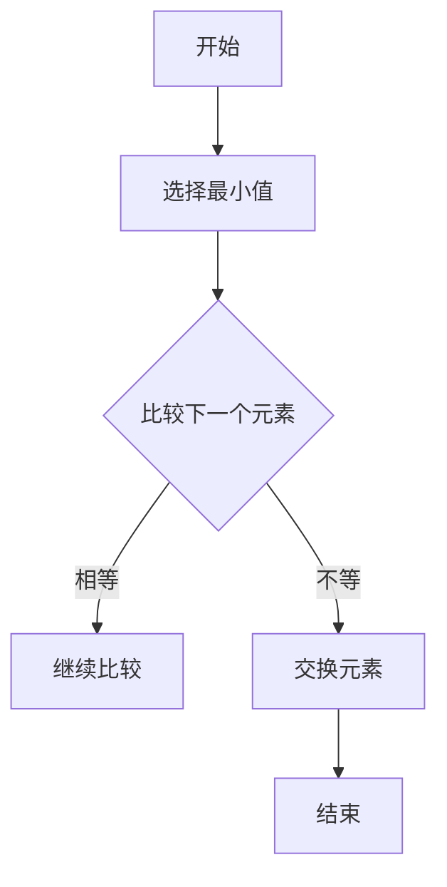
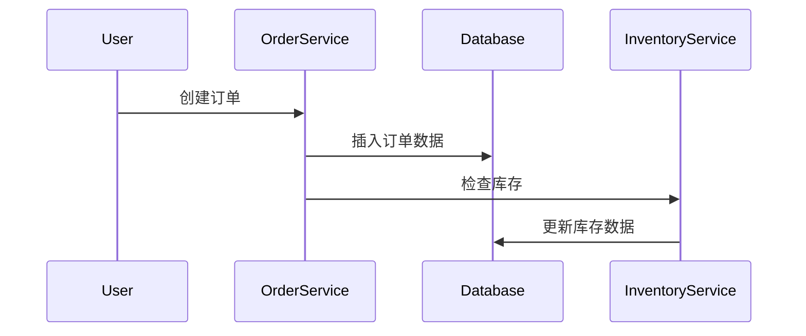
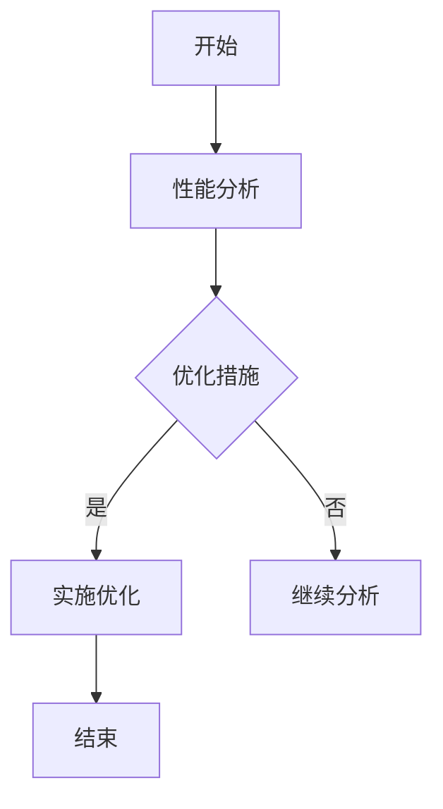
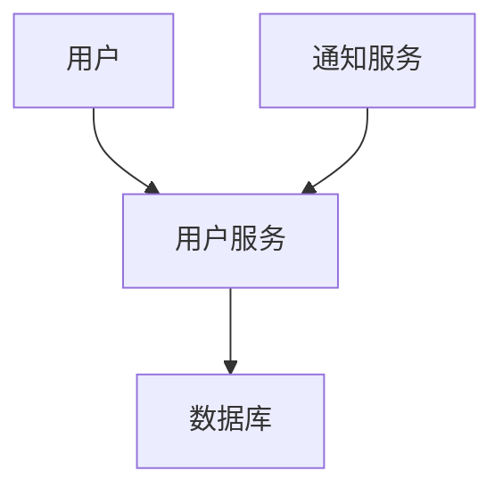
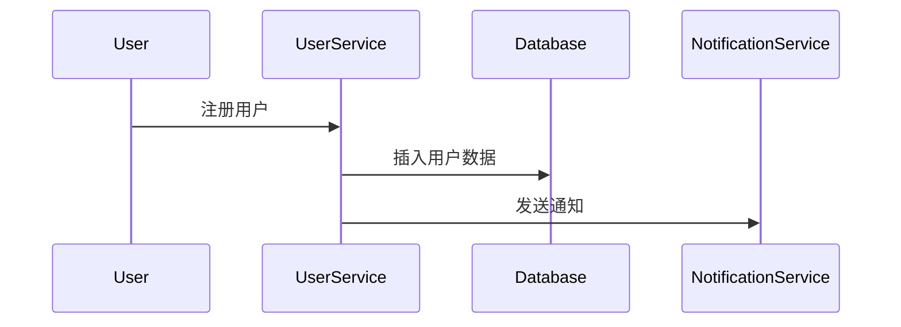
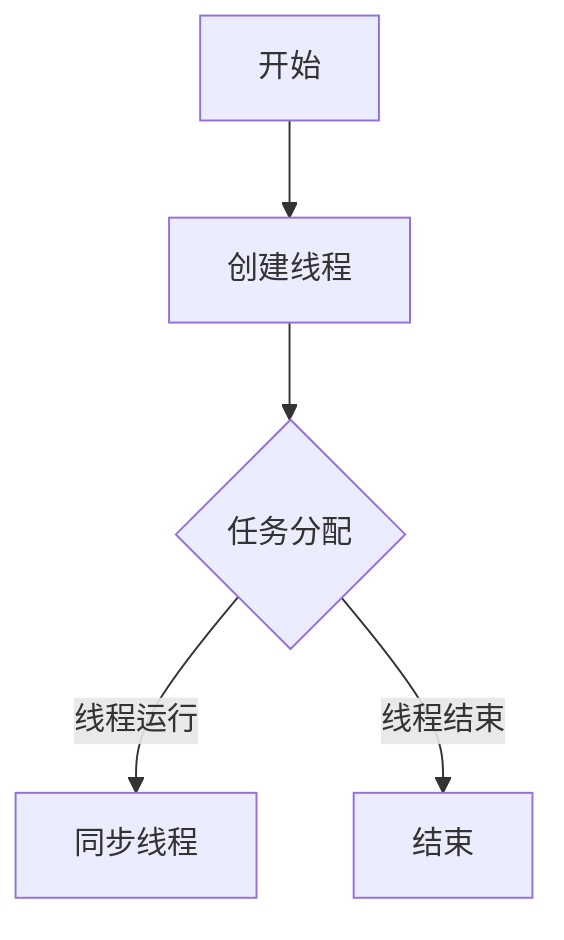
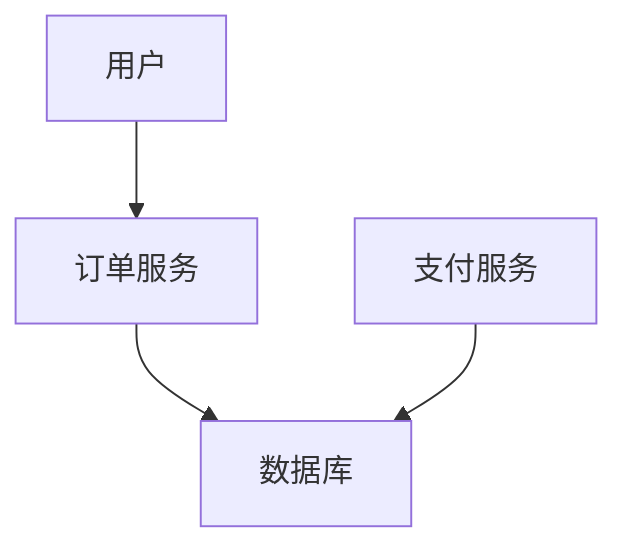
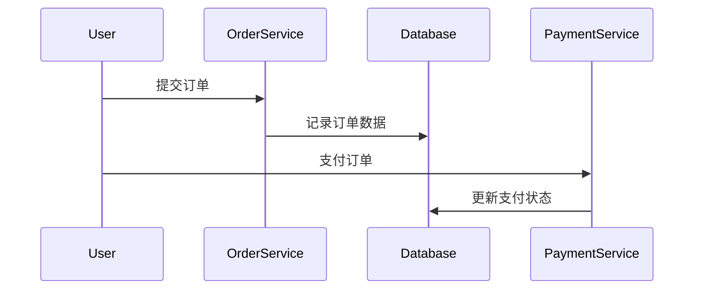

                 


## 《好代码修炼的三个阶段》

> 关键词：代码修炼、好代码标准、编程技巧、代码优化、实战案例

> 摘要：
本文旨在探讨好代码修炼的三个阶段，包括基础知识、实战技巧和高级优化。通过深入剖析每个阶段的核心概念和实践方法，帮助读者逐步提升代码质量，实现代码的精炼与高效。

### 第一阶段：基础知识

**背景介绍**

在编程的世界里，代码的质量直接影响到软件的性能、可维护性和可扩展性。好代码修炼的第一阶段，是奠定坚实的基础。这一阶段主要涉及编程语言基础、数据结构和算法等核心知识。

**核心概念与联系**

| 核心概念 | 说明 |
| --- | --- |
| 编程语言 | 编程语言的语法和特性决定了代码的表达方式 |
| 数据结构 | 数据结构定义了数据的组织方式，影响算法的性能 |
| 算法 | 算法描述了解决问题的步骤，影响代码的效率 |

**ER实体关系图架构的 Mermaid 流程图**

```mermaid
erDiagram
  Class1 ||--|{ Class2 } Class3 : aggregation
  Class1 ||--|{ Class4 } Class5 : composition
```

**算法原理讲解**

以排序算法为例，我们可以使用Mermaid绘制流程图：



Python代码实现：

```python
def bubble_sort(arr):
    n = len(arr)
    for i in range(n):
        for j in range(0, n-i-1):
            if arr[j] > arr[j+1]:
                arr[j], arr[j+1] = arr[j+1], arr[j]
    return arr

arr = [64, 34, 25, 12, 22, 11, 90]
sorted_arr = bubble_sort(arr)
print("排序后的数组：", sorted_arr)
```

**数学公式**

$$1 + 1 = 2$$

**系统分析与架构设计方案**

**问题场景介绍**：一个电子商务网站需要高效、稳定地处理用户订单和库存管理。

**项目介绍**：本项目旨在设计一个简单的订单处理系统。

**系统功能设计**：

```mermaid
classDiagram
    Order <<Class>>
    Inventory <<Class>>

    Order : +createOrder()
    Inventory : +checkStock()
```

**系统架构设计**：


**系统接口设计和系统交互**：



**项目实战**

**环境安装**：安装Python环境、相关依赖包。

**系统核心实现源代码**：

```python
class Order:
    def create_order(self, order_details):
        # 创建订单逻辑
        pass

class Inventory:
    def check_stock(self, product_id):
        # 检查库存逻辑
        pass
```

**代码应用解读与分析**：详细解析代码结构和功能。

**实际案例分析和详细讲解剖析**：通过具体案例展示系统功能。

**项目小结**：总结项目经验和收获。

### 第二阶段：实战技巧

**背景介绍**

在掌握了基础知识之后，实战技巧阶段将帮助我们将理论知识应用于实际项目中，提升代码的可读性、可维护性和性能。

**核心概念与联系**

| 实战技巧 | 说明 |
| --- | --- |
| 性能优化 | 提高程序执行速度和响应时间 |
| 可读性优化 | 提高代码的可读性和易理解性 |
| 可维护性优化 | 提高代码的长期可维护性 |

**算法原理讲解**

使用Mermaid绘制算法流程图：



Python代码实现：

```python
def optimize_code(code):
    # 性能优化逻辑
    pass
```

**数学公式**

$$f(n) = O(n^2)$$

**系统分析与架构设计方案**

**问题场景介绍**：一个大型社交网络需要处理海量用户数据。

**项目介绍**：本项目旨在设计一个高并发、高性能的社交网络系统。

**系统功能设计**：

```mermaid
classDiagram
    UserService <<Class>>
    NotificationService <<Class>>

    UserService : +register_user()
    NotificationService : +send_notification()
```

**系统架构设计**：



**系统接口设计和系统交互**：



**项目实战**

**环境安装**：安装相关依赖包。

**系统核心实现源代码**：

```python
class UserService:
    def register_user(self, user_details):
        # 注册用户逻辑
        pass

class NotificationService:
    def send_notification(self, notification_details):
        # 发送通知逻辑
        pass
```

**代码应用解读与分析**：详细解析代码结构和功能。

**实际案例分析和详细讲解剖析**：通过具体案例展示系统功能。

**项目小结**：总结项目经验和收获。

### 第三阶段：高级优化

**背景介绍**

高级优化阶段是提升代码质量的关键步骤，主要关注内存管理、并发编程和安全性等方面。

**核心概念与联系**

| 高级优化技巧 | 说明 |
| --- | --- |
| 内存管理 | 有效管理内存，避免内存泄漏 |
| 并发编程 | 提高程序执行效率和响应速度 |
| 安全性 | 保护程序免受恶意攻击和漏洞的影响 |

**算法原理讲解**

使用Mermaid绘制并发算法流程图：



Python代码实现：

```python
def concurrent_execution(tasks):
    # 并发执行任务逻辑
    pass
```

**数学公式**

$$\sum_{i=1}^{n} t_i = T$$

**系统分析与架构设计方案**

**问题场景介绍**：一个大型电子商务平台需要处理高并发的订单处理。

**项目介绍**：本项目旨在设计一个高并发、高性能、安全的电子商务平台。

**系统功能设计**：

```mermaid
classDiagram
    OrderService <<Class>>
    PaymentService <<Class>>

    OrderService : +process_order()
    PaymentService : +handle_payment()
```

**系统架构设计**：



**系统接口设计和系统交互**：



**项目实战**

**环境安装**：安装相关依赖包。

**系统核心实现源代码**：

```python
class OrderService:
    def process_order(self, order_details):
        # 处理订单逻辑
        pass

class PaymentService:
    def handle_payment(self, payment_details):
        # 处理支付逻辑
        pass
```

**代码应用解读与分析**：详细解析代码结构和功能。

**实际案例分析和详细讲解剖析**：通过具体案例展示系统功能。

**项目小结**：总结项目经验和收获。

### 最佳实践 tips

- **代码规范**：遵循统一的代码风格和命名规范。
- **代码注释**：为代码添加清晰的注释，提高可读性。
- **版本控制**：使用Git等版本控制工具，管理代码变更。
- **代码审查**：进行代码审查，确保代码质量和安全性。
- **持续集成**：使用CI/CD工具，自动化测试和部署。

### 小结

本文详细探讨了代码修炼的三个阶段，从基础知识、实战技巧到高级优化，为读者提供了全面的代码修炼指南。通过本文的学习，读者将能够提升代码质量，实现代码的精炼与高效。

### 注意事项

- **实践是检验真理的唯一标准**：理论知识需与实际项目相结合，不断实践和优化。
- **持续学习**：技术领域不断进步，持续学习是提升代码质量的关键。

### 拓展阅读

- 《代码大全》
- 《Effective Java》
- 《深度探索C++对象模型》
- 《并发编程的艺术》
- 《Python编程：从入门到实践》

### 作者信息

作者：AI天才研究院/AI Genius Institute & 禅与计算机程序设计艺术 /Zen And The Art of Computer Programming

[完]

