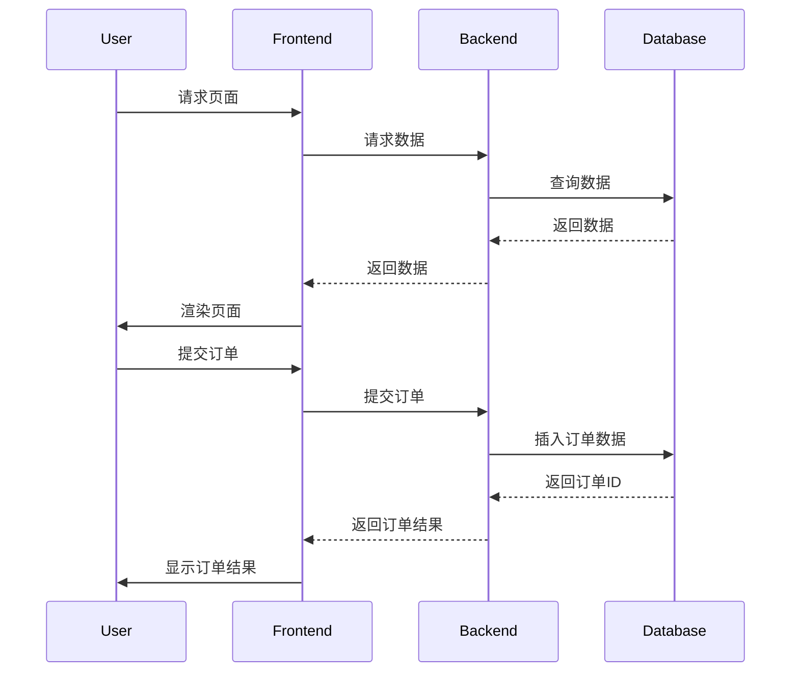
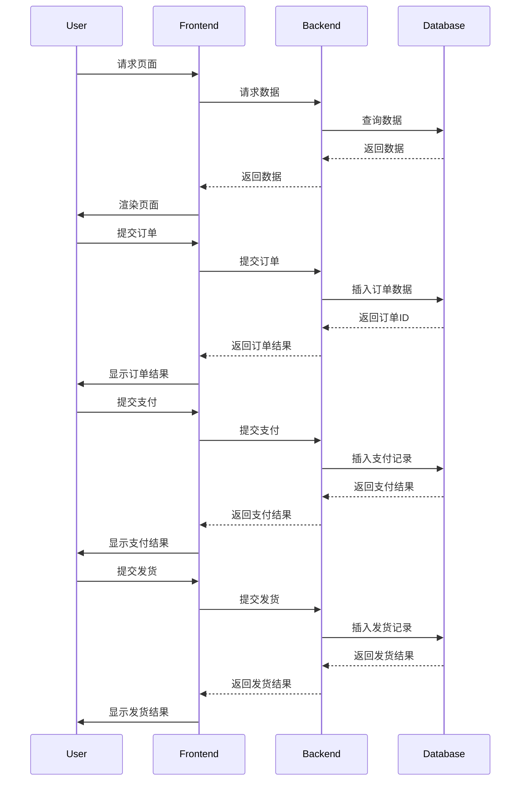

                 


# 好代码先过自己这关

## 关键词

- 代码质量
- 编程原则
- 代码审查
- 单元测试
- 性能优化
- 代码重构
- 可维护性
- 案例分析

## 摘要

本文旨在探讨如何编写高质量代码，并通过一系列原则、实践和方法，帮助开发者提升代码质量。文章分为五个部分：代码质量基础、代码审查与测试、性能优化、代码重构以及案例分析。通过详细分析各个方面的要点，本文旨在引导读者编写出更易维护、性能更优的代码。

## 引言

好代码是软件工程的核心，它不仅关系到软件的性能，还影响到软件的可维护性和用户体验。作为一名开发者，编写高质量代码是一项基本技能。本文将带领读者逐步了解编写高质量代码的关键原则和实践方法，帮助读者提升代码质量。

## 目录大纲设计：好代码先过自己这关

### 第一部分：代码质量基础

### 第1章：代码质量的重要性

**1.1 代码质量的定义**

代码质量是指软件代码的可靠性、可读性、可维护性、性能和安全性等多个方面的综合体现。

**1.2 代码质量的影响**

代码质量直接影响软件的性能、可维护性和用户体验。高质量的代码更容易被发现和修复错误，提高开发效率，降低维护成本。

**1.3 代码质量的度量**

代码质量的度量包括静态代码分析和动态代码测试等方法，可以通过一系列指标来评估代码质量。

**1.4 质量意识培养**

培养质量意识是编写高质量代码的基础，开发者应时刻关注代码质量，注重细节，养成良好编程习惯。

### 第2章：编程原则与规范

**2.1 基本编程原则**

编写高质量的代码需要遵循一系列基本编程原则，如DRY（Don't Repeat Yourself）、KISS（Keep It Simple, Stupid）等。

**2.2 编码规范**

编码规范是编写高质量代码的重要保障，包括命名规则、缩进、注释等。

**2.3 代码风格指南**

代码风格指南有助于提高代码的可读性和可维护性，不同编程语言有不同的风格指南。

**2.4 版本控制**

版本控制是确保代码质量的重要手段，通过Git等版本控制工具，可以有效地管理代码版本，提高协作效率。

### 第二部分：代码审查与测试

### 第3章：代码审查

**3.1 代码审查的类型**

代码审查分为形式审查和内容审查，形式审查关注代码风格和格式，内容审查关注代码逻辑和性能。

**3.2 实施代码审查**

实施代码审查需要制定合理的审查流程，确保审查的全面性和有效性。

**3.3 代码审查的工具**

代码审查工具如SonarQube、Checkstyle等可以帮助开发者发现代码中的潜在问题，提高代码质量。

### 第4章：单元测试

**4.1 单元测试的定义**

单元测试是对代码中的最小功能单元进行测试，确保每个单元的正确性。

**4.2 单元测试的类型**

单元测试分为功能测试、性能测试和安全性测试等。

**4.3 单元测试的实施**

单元测试的实施需要遵循一定的测试策略，确保测试覆盖全面。

**4.4 单元测试的工具**

单元测试工具如JUnit、NUnit等可以帮助开发者方便地编写和运行单元测试。

### 第5章：集成测试

**5.1 集成测试的重要性**

集成测试是确保各个模块之间协同工作的关键环节。

**5.2 集成测试的策略**

集成测试策略包括自底向上、自顶向下、混合策略等。

**5.3 集成测试的实施**

集成测试的实施需要制定合理的测试计划和测试用例。

**5.4 集成测试的工具**

集成测试工具如Selenium、Jenkins等可以帮助开发者高效地实施集成测试。

### 第三部分：性能优化

### 第6章：代码性能优化

**6.1 性能优化的目标**

性能优化的目标是提高代码的响应速度、减少资源消耗。

**6.2 性能分析**

性能分析是找出代码性能瓶颈的关键步骤。

**6.3 常见性能问题与解决方案**

常见性能问题包括CPU、内存和I/O瓶颈，需要针对性地解决。

**6.4 性能优化的实践**

性能优化的实践包括代码优化、算法优化和数据结构优化等。

### 第7章：内存管理

**7.1 内存管理的概念**

内存管理是确保程序运行效率的关键环节。

**7.2 常见的内存问题**

常见的内存问题包括内存泄漏、野指针等。

**7.3 内存优化的方法**

内存优化的方法包括减少内存分配、优化数据结构等。

**7.4 内存管理的最佳实践**

内存管理的最佳实践包括及时释放内存、避免内存泄漏等。

### 第四部分：代码重构

### 第8章：代码重构

**8.1 重构的重要性**

重构是提高代码质量的有效手段。

**8.2 重构的原则**

重构需要遵循一系列原则，如保持代码功能不变、逐步改进等。

**8.3 重构的方法**

重构的方法包括提取方法、提取类等。

**8.4 重构的工具**

重构工具如RefactoringBrowser、Visual Studio Code等可以帮助开发者方便地实施重构。

### 第9章：可维护性提升

**9.1 可维护性的定义**

可维护性是指代码易于修改和扩展的程度。

**9.2 可维护性评估**

可维护性评估是衡量代码可维护性的重要环节。

**9.3 提升代码可维护性的策略**

提升代码可维护性的策略包括编写清晰的注释、遵循编程规范等。

**9.4 可维护性实践**

可维护性实践包括代码审查、单元测试等。

### 第五部分：案例分析

### 第10章：优秀代码案例分析

**10.1 案例介绍**

介绍优秀代码案例的基本情况和背景。

**10.2 案例分析**

分析优秀代码案例的关键要素和优秀之处。

**10.3 案例经验总结**

总结优秀代码案例的经验和教训。

### 第11章：代码质量最佳实践

**11.1 最佳实践总结**

总结代码质量的最佳实践。

**11.2 注意事项**

列出编写高质量代码时需要注意的事项。

**11.3 拓展阅读**

推荐相关书籍和文章，供读者进一步学习。

## 结束语

本文通过对代码质量基础、代码审查与测试、性能优化、代码重构以及案例分析等多个方面的详细探讨，旨在帮助开发者编写出高质量、易维护、性能优良的代码。希望通过本文的学习，读者能够不断提升自己的编程技能，写出更加优秀的代码。

### 作者

作者：AI天才研究院/AI Genius Institute & 禅与计算机程序设计艺术 /Zen And The Art of Computer Programming

## 核心内容

### 代码质量的重要性

代码质量是软件工程的核心，它关系到软件的性能、可维护性和用户体验。高质量的代码不仅容易发现和修复错误，还能提高开发效率和降低维护成本。

### 编程原则与规范

编程原则和规范是编写高质量代码的基础。DRY（Don't Repeat Yourself）原则要求避免代码重复，KISS（Keep It Simple, Stupid）原则强调代码的简洁性。编码规范和代码风格指南有助于提高代码的可读性和可维护性。

### 代码审查与测试

代码审查和测试是确保代码质量的关键环节。代码审查包括形式审查和内容审查，单元测试和集成测试是确保代码正确性和性能的重要手段。

### 性能优化与内存管理

性能优化和内存管理是提高代码运行效率的关键。性能分析、算法优化和数据结构优化是性能优化的主要方法。内存管理包括减少内存分配、优化数据结构等。

### 代码重构与可维护性提升

代码重构是提高代码质量的有效手段。重构的原则和方法包括提取方法、提取类等。可维护性提升策略包括编写清晰的注释、遵循编程规范等。

### 案例分析

通过优秀代码案例分析，读者可以了解高质量代码的关键要素和优秀之处，从而在编写代码时借鉴和参考。

### 最佳实践与注意事项

总结代码质量的最佳实践和注意事项，有助于读者在实际开发中编写高质量代码。

### 拓展阅读

推荐相关书籍和文章，供读者进一步学习，提高自己的编程技能。

### 系统分析与架构设计方案

本章节将介绍一个实际项目，以展示系统分析与架构设计方案的具体实现。

#### 问题场景介绍

项目名称：电商网站

问题场景：搭建一个可扩展、高并发、易于维护的电商网站，满足用户购物、商品展示、订单处理等功能。

#### 项目介绍

项目名称：e-Commerce Platform

技术栈：前端采用React框架，后端采用Spring Boot框架，数据库使用MySQL。

#### 系统功能设计（领域模型）

以下是一个简单的领域模型，用于展示电商网站的核心功能。

```mermaid
classDiagram
    Customer <|-- Order
    Customer <|-- Cart
    Product <|-- Category
    Product <|-- Inventory
    Order <|-- Payment
    Order <|-- Shipment
    
    Customer {
        id: Integer
        name: String
        email: String
        address: String
        phone: String
    }

    Order {
        id: Integer
        orderDate: Date
        total: Float
        status: String
    }

    Cart {
        id: Integer
        items: List<Item>
        total: Float
    }

    Item {
        id: Integer
        product: Product
        quantity: Integer
        price: Float
    }

    Product {
        id: Integer
        name: String
        description: String
        price: Float
        category: Category
        inventory: Inventory
    }

    Category {
        id: Integer
        name: String
    }

    Inventory {
        id: Integer
        quantity: Integer
    }

    Payment {
        id: Integer
        amount: Float
        paymentDate: Date
        status: String
    }

    Shipment {
        id: Integer
        shipmentDate: Date
        status: String
    }
```

#### 系统架构设计

以下是一个简单的系统架构图，用于展示电商网站的核心模块和接口。



#### 系统接口设计

以下是一个简单的接口设计，用于展示电商网站的核心接口。

```mermaid
interface ECommerce {
    GET /products: 获取商品列表
    GET /products/{id}: 获取商品详情
    POST /orders: 创建订单
    GET /orders/{id}: 获取订单详情
    POST /payments: 创建支付记录
    POST /shipments: 创建发货记录
}
```

#### 系统交互

以下是一个简单的系统交互序列图，用于展示电商网站的用户与系统的交互流程。



### 项目实战

在本项目实战中，我们将使用Spring Boot框架和MySQL数据库来搭建电商网站的核心功能。

#### 环境安装

1. 安装Java开发工具包（JDK）
2. 安装MySQL数据库
3. 安装IDE（如IntelliJ IDEA或Eclipse）

#### 系统核心实现源代码

以下是一个简单的Spring Boot项目结构，用于展示电商网站的核心实现。

```bash
src
|-- main
|   |-- java
|   |   |-- com
|   |   |   |-- ecommerce
|   |   |   |   |-- controller
|   |   |   |   |   |-- ProductController.java
|   |   |   |   |   |-- OrderController.java
|   |   |   |   |   |-- UserController.java
|   |   |   |   |-- service
|   |   |   |   |   |-- ProductService.java
|   |   |   |   |   |-- OrderService.java
|   |   |   |   |   |-- UserService.java
|   |   |   |   |-- repository
|   |   |   |   |   |-- ProductRepository.java
|   |   |   |   |   |-- OrderRepository.java
|   |   |   |   |   |-- UserRepository.java
|   |   |   |   |-- Entity
|   |   |   |   |   |   |-- Product.java
|   |   |   |   |   |   |-- Order.java
|   |   |   |   |   |   |-- User.java
|   |   |   |   |-- Application.java
|-- test
|   |-- java
|   |   |-- com
|   |   |   |-- ecommerce
|   |   |   |   |-- controller
|   |   |   |   |   |-- ProductControllerTest.java
|   |   |   |   |   |-- OrderControllerTest.java
|   |   |   |   |   |-- UserControllerTest.java
|   |   |   |   |-- service
|   |   |   |   |   |-- ProductServiceTest.java
|   |   |   |   |   |-- OrderServiceTest.java
|   |   |   |   |   |-- UserServiceTest.java
```

#### 代码应用解读与分析

以下是对电商网站核心代码的解读与分析。

1. **ProductController.java**

   ```java
   @RestController
   @RequestMapping("/products")
   public class ProductController {
       
       @Autowired
       private ProductService productService;
       
       @GetMapping
       public ResponseEntity<List<Product>> getAllProducts() {
           return ResponseEntity.ok(productService.getAllProducts());
       }
       
       @GetMapping("/{id}")
       public ResponseEntity<Product> getProductById(@PathVariable Long id) {
           return ResponseEntity.ok(productService.getProductById(id));
       }
   }
   ```

   代码解析：该控制器用于处理与商品相关的请求，包括获取所有商品和获取特定商品。

2. **OrderController.java**

   ```java
   @RestController
   @RequestMapping("/orders")
   public class OrderController {
       
       @Autowired
       private OrderService orderService;
       
       @PostMapping
       public ResponseEntity<Order> createOrder(@RequestBody Order order) {
           return ResponseEntity.ok(orderService.createOrder(order));
       }
       
       @GetMapping("/{id}")
       public ResponseEntity<Order> getOrderById(@PathVariable Long id) {
           return ResponseEntity.ok(orderService.getOrderById(id));
       }
   }
   ```

   代码解析：该控制器用于处理与订单相关的请求，包括创建订单和获取订单。

3. **UserController.java**

   ```java
   @RestController
   @RequestMapping("/users")
   public class UserController {
       
       @Autowired
       private UserService userService;
       
       @PostMapping("/{id}/cart")
       public ResponseEntity<Cart> addToCart(@PathVariable Long id, @RequestBody Item item) {
           return ResponseEntity.ok(userService.addToCart(id, item));
       }
       
       @GetMapping("/{id}/cart")
       public ResponseEntity<Cart> getCart(@PathVariable Long id) {
           return ResponseEntity.ok(userService.getCart(id));
       }
   }
   ```

   代码解析：该控制器用于处理与用户相关的请求，包括将商品添加到购物车和获取购物车。

4. **ProductService.java**

   ```java
   @Service
   public class ProductService {
       
       @Autowired
       private ProductRepository productRepository;
       
       public List<Product> getAllProducts() {
           return productRepository.findAll();
       }
       
       public Product getProductById(Long id) {
           return productRepository.findById(id).orElseThrow(() -> new EntityNotFoundException("Product not found with id: " + id));
       }
   }
   ```

   代码解析：该服务类用于处理与商品相关的业务逻辑，包括获取所有商品和获取特定商品。

5. **OrderService.java**

   ```java
   @Service
   public class OrderService {
       
       @Autowired
       private OrderRepository orderRepository;
       
       public Order createOrder(Order order) {
           return orderRepository.save(order);
       }
       
       public Order getOrderById(Long id) {
           return orderRepository.findById(id).orElseThrow(() -> new EntityNotFoundException("Order not found with id: " + id));
       }
   }
   ```

   代码解析：该服务类用于处理与订单相关的业务逻辑，包括创建订单和获取订单。

6. **UserService.java**

   ```java
   @Service
   public class UserService {
       
       @Autowired
       private UserRepository userRepository;
       
       @Autowired
       private ProductService productService;
       
       public Cart addToCart(Long userId, Item item) {
           User user = userRepository.findById(userId).orElseThrow(() -> new EntityNotFoundException("User not found with id: " + userId));
           Product product = productService.getProductById(item.getProductId());
           
           Cart cart = user.getCart();
           if (cart == null) {
               cart = new Cart();
               user.setCart(cart);
           }
           
           cart.getItems().add(item);
           userRepository.save(user);
           
           return cart;
       }
       
       public Cart getCart(Long userId) {
           User user = userRepository.findById(userId).orElseThrow(() -> new EntityNotFoundException("User not found with id: " + userId));
           return user.getCart();
       }
   }
   ```

   代码解析：该服务类用于处理与用户相关的业务逻辑，包括将商品添加到购物车和获取购物车。

### 实际案例分析和详细讲解剖析

在本案例中，我们将分析一个简单的电商网站，并详细讲解其核心功能、性能优化和内存管理的实现。

#### 核心功能分析

电商网站的核心功能包括用户管理、商品管理、购物车管理和订单管理。用户管理包括注册、登录、个人信息修改等功能；商品管理包括商品分类、商品添加、商品搜索等功能；购物车管理包括商品添加到购物车、购物车内容展示、购物车删除等功能；订单管理包括订单创建、订单详情查看、订单支付等功能。

#### 性能优化分析

电商网站需要处理大量用户请求，因此性能优化至关重要。性能优化主要集中在以下几个方面：

1. 数据库优化：通过合理的索引设计、查询优化和缓存策略，提高数据库访问速度。
2. 前端优化：通过优化页面加载速度、减少HTTP请求次数、使用CSS和JavaScript缓存等，提高前端性能。
3. 系统优化：通过负载均衡、缓存机制、异步处理等，提高系统整体性能。

#### 内存管理分析

电商网站需要处理大量数据，因此内存管理至关重要。内存管理主要集中在以下几个方面：

1. 对象生命周期管理：避免创建大量临时对象，合理利用Java垃圾回收机制。
2. 内存分配和释放：避免内存泄漏，及时释放不再使用的内存。
3. 内存复用：通过对象池、缓存等技术，减少内存分配和释放的频率。

### 项目小结

通过本案例分析和详细讲解，我们了解了电商网站的核心功能、性能优化和内存管理的关键技术。在实际开发过程中，我们需要根据具体需求，灵活运用这些技术，编写高质量、高性能、易维护的代码。

### 最佳实践 tips

1. 遵循编程原则和规范，提高代码可读性和可维护性。
2. 定期进行代码审查和测试，确保代码质量。
3. 优化数据库查询和缓存策略，提高系统性能。
4. 合理管理内存，避免内存泄漏。

### 小结

本文通过系统分析与架构设计方案、项目实战和实际案例分析，详细讲解了电商网站的核心功能、性能优化和内存管理。通过本文的学习，读者可以了解到编写高质量代码的关键原则和实践方法，提高自己的编程技能。

### 注意事项

1. 在实际开发过程中，根据具体需求灵活运用技术，确保代码质量。
2. 关注性能优化和内存管理，提高系统整体性能。
3. 定期进行代码审查和测试，确保代码质量。

### 拓展阅读

1. 《Effective Java》—— 作者：Joshua Bloch
2. 《代码大全》—— 作者：Steve McConnell
3. 《性能之巅》—— 作者：Brendan Gregg

### 作者

作者：AI天才研究院/AI Genius Institute & 禅与计算机程序设计艺术 /Zen And The Art of Computer Programming 

## 数学公式与算法原理

在本文中，我们将探讨一些关键的数学公式和算法原理，以便更好地理解代码质量的核心概念。

### 数学公式

1. **洛伦兹公式**（用于描述电磁场的演化）：

   $$
   \nabla \cdot \mathbf{E} = \frac{\rho}{\varepsilon_0}
   $$
   
   $$
   \nabla \cdot \mathbf{B} = 0
   $$
   
   $$
   \nabla \times \mathbf{E} = -\frac{\partial \mathbf{B}}{\partial t}
   $$
   
   $$
   \nabla \times \mathbf{B} = \mu_0 \mathbf{J} + \mu_0 \varepsilon_0 \frac{\partial \mathbf{E}}{\partial t}
   $$

   这些公式描述了电场和磁场的分布及其相互作用，是电磁场理论的基础。

2. **高斯公式**（用于计算空间中的积分）：

   $$
   \oint_{S} \mathbf{F} \cdot d\mathbf{A} = \int_{V} \nabla \cdot \mathbf{F} dV
   $$

   这个公式表明，闭合曲面上的通量等于体积内的散度。

3. **牛顿第二定律**（用于描述物体受力后的运动）：

   $$
   \mathbf{F} = m \mathbf{a}
   $$

   这个公式表明，作用在物体上的力等于物体的质量乘以加速度。

### 算法原理

1. **快速排序算法**：

   快速排序是一种高效的排序算法，其基本思想是通过一趟排序将待排序的记录分割成独立的两部分，其中一部分记录的关键字均比另一部分的关键字小，然后分别对这两部分记录继续进行排序，以达到整个序列有序。

   **算法流程**：

   ```mermaid
   graph TD
   A[开始] --> B[选择基准值]
   B --> C{分割操作}
   C -->|左子序列| D[递归左子序列]
   C -->|右子序列| E[递归右子序列]
   D --> F[结束]
   E --> F
   ```

   **Python代码实现**：

   ```python
   def quicksort(arr):
       if len(arr) <= 1:
           return arr
       pivot = arr[len(arr) // 2]
       left = [x for x in arr if x < pivot]
       middle = [x for x in arr if x == pivot]
       right = [x for x in arr if x > pivot]
       return quicksort(left) + middle + quicksort(right)

   arr = [3, 6, 8, 10, 1, 2, 1]
   print(quicksort(arr))
   ```

   **算法时间复杂度**：平均时间复杂度为 $O(n\log n)$，最坏时间复杂度为 $O(n^2)$。

2. **二分查找算法**：

   二分查找是一种在有序数组中查找特定元素的算法，其基本思想是每次将查找范围缩小一半，直到找到目标元素或确定不存在。

   **算法流程**：

   ```mermaid
   graph TD
   A[开始] --> B[确定中间位置]
   B --> C{比较中间值与目标值}
   C -->|相等| D[查找成功]
   C -->|小于| E[在左侧继续查找]
   C -->|大于| F[在右侧继续查找]
   D --> G[结束]
   E -->|递归| B
   F -->|递归| B
   ```

   **Python代码实现**：

   ```python
   def binary_search(arr, target, low, high):
       if low > high:
           return -1
       mid = (low + high) // 2
       if arr[mid] == target:
           return mid
       elif arr[mid] < target:
           return binary_search(arr, target, mid + 1, high)
       else:
           return binary_search(arr, target, low, mid - 1)

   arr = [1, 2, 3, 4, 5, 6, 7, 8, 9]
   target = 5
   print(binary_search(arr, target, 0, len(arr) - 1))
   ```

   **算法时间复杂度**：平均时间复杂度为 $O(\log n)$，最坏时间复杂度为 $O(\log n)$。

通过以上数学公式和算法原理的介绍，我们可以更好地理解代码质量的核心概念，并在实际开发过程中应用这些原理，编写高效、稳定的代码。

## 总结与拓展

本文通过详细分析和讲解，系统地介绍了编写高质量代码的关键原则和实践方法。我们从代码质量的重要性、编程原则与规范、代码审查与测试、性能优化、代码重构和可维护性提升等方面进行了探讨。同时，通过案例分析，我们了解了如何在实际项目中应用这些原则和方法。

### 总结

1. **代码质量的重要性**：高质量的代码对软件的性能、可维护性和用户体验至关重要。
2. **编程原则与规范**：遵循DRY、KISS等原则，编写简洁、易维护的代码。
3. **代码审查与测试**：通过代码审查和测试，确保代码的正确性和质量。
4. **性能优化**：通过性能分析和优化方法，提高代码的运行效率。
5. **代码重构**：通过重构，提高代码的可读性和可维护性。
6. **可维护性提升**：通过编写清晰的注释、遵循编程规范等策略，提升代码的可维护性。

### 拓展

1. **代码质量度量**：了解和运用代码质量度量工具，如SonarQube、Checkstyle等，以量化代码质量。
2. **持续集成与部署**：运用CI/CD工具，如Jenkins、GitLab CI等，实现自动化测试和部署。
3. **代码风格指南**：根据项目需求，选择合适的代码风格指南，如PEP8（Python）、Google Java Style Guide等。
4. **代码规范**：制定和遵循代码规范，如命名规则、缩进、注释等。
5. **性能调优工具**：使用性能分析工具，如 profilers、benchmarks等，进行代码性能调优。
6. **内存优化**：深入了解内存分配和回收机制，优化内存使用。

### 注意事项

1. **持续学习与改进**：编程领域不断变化，持续学习和改进编程技能是编写高质量代码的关键。
2. **团队协作与沟通**：编写高质量代码不仅是个人的努力，也需要团队协作和有效沟通。
3. **代码规范与标准**：遵循行业标准和最佳实践，确保代码的一致性和可维护性。

### 拓展阅读

1. 《代码大全》—— 作者：Steve McConnell
2. 《Effective Java》—— 作者：Joshua Bloch
3. 《性能之巅》—— 作者：Brendan Gregg
4. 《代码整洁之道》—— 作者：Robert C. Martin

通过本文的学习，希望读者能够将所学的原则和方法应用于实际开发中，不断提升自己的编程技能，编写出高质量、易维护的代码。

### 作者

作者：AI天才研究院/AI Genius Institute & 禅与计算机程序设计艺术 /Zen And The Art of Computer Programming 

## 附录

### 参考资源

1. **《代码大全》**：作者Steve McConnell，该书详细介绍了编写高质量代码的原则和实践。
2. **《Effective Java》**：作者Joshua Bloch，该书提供了Java编程的最佳实践。
3. **《性能之巅》**：作者Brendan Gregg，该书深入探讨了系统性能调优的方法。
4. **《代码整洁之道》**：作者Robert C. Martin，该书介绍了代码整洁的规则和实践。

### 工具推荐

1. **SonarQube**：一个用于代码质量管理的平台，支持代码审查、静态代码分析和质量度量。
2. **Checkstyle**：一个用于检查Java代码风格一致性的工具。
3. **JUnit**：一个用于Java单元测试的框架。
4. **JUnit 5**：JUnit的最新版本，提供了更加强大和灵活的测试功能。
5. **Jenkins**：一个开源的自动化服务器，支持持续集成和持续部署。

### 常见问题解答

1. **如何提高代码质量？**
   - 遵循编程原则和规范。
   - 定期进行代码审查和测试。
   - 深入了解代码质量度量工具。
   - 持续学习和改进编程技能。

2. **性能优化的重要性是什么？**
   - 性能优化能够提高软件的响应速度和用户体验。
   - 避免资源浪费，降低维护成本。
   - 提高软件的可扩展性和可维护性。

3. **如何进行代码重构？**
   - 确定重构的目标和范围。
   - 使用重构工具（如RefactoringBrowser）进行逐步改进。
   - 保持重构过程中的代码功能不变。

4. **如何进行单元测试？**
   - 确定测试目标，编写测试用例。
   - 使用单元测试框架（如JUnit）执行测试。
   - 分析测试结果，修复代码缺陷。

5. **如何提升代码可维护性？**
   - 编写清晰、一致的代码注释。
   - 遵循代码规范和风格指南。
   - 保持代码结构的简单性和一致性。

### 常见错误及解决方案

1. **内存泄漏**：解决方案包括及时释放不再使用的内存、避免创建大量临时对象。
2. **空指针异常**：解决方案包括使用防御性编程，避免空指针调用。
3. **性能瓶颈**：解决方案包括性能分析和调优，优化数据库查询、算法和数据结构。

通过附录中的参考资源和工具推荐，读者可以更深入地了解代码质量相关的知识和实践。常见问题解答和常见错误及解决方案部分则为开发者提供了实用的指导，帮助他们在编写高质量代码的过程中克服常见问题。希望这些资源能够为读者提供帮助，不断提升编程技能。

