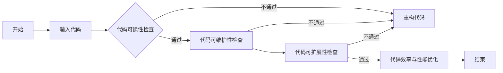
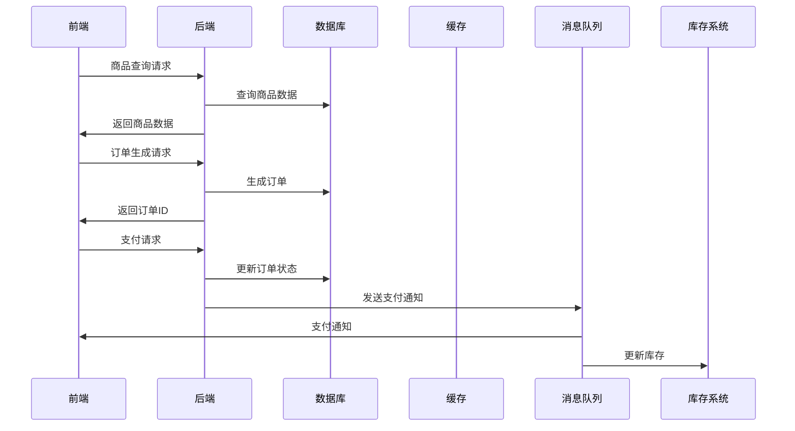

                 

### 好代码的标准是'一眼看到底'

> 关键词：好代码、可读性、模块化、简洁性、易维护性、性能、编程语言

在信息技术飞速发展的今天，代码质量成为软件工程中的一个关键问题。一篇好代码不仅是编程技巧的体现，更是程序员专业素养的体现。那么，什么才是好代码的标准呢？本文将围绕“一眼看到底”这一核心理念，深入探讨好代码的评判标准。

> 摘要：本文将介绍好代码的核心标准，包括可读性、模块化、简洁性和易维护性。通过分析这些标准，我们将展示如何编写高质量代码，并探讨其在实际项目中的应用。

### 好代码的评判标准

#### 2.1 可读性

代码的可读性是评价代码质量的重要标准之一。好的代码应该容易阅读和理解，这不仅能提高开发效率，也能降低维护成本。为了实现代码的可读性，我们可以从以下几个方面着手：

- **命名规范**：变量的命名应直观且具有描述性，避免使用缩写和混淆的名称。
- **注释**：适当的注释能够帮助其他开发者理解代码的功能和目的，但要注意避免冗长和冗余。
- **代码结构**：合理的代码结构可以提高代码的可读性，例如使用适当的缩进、模块化和分层设计。

#### 2.2 易维护性

代码的易维护性是保证项目长期稳定运行的关键。一个良好的代码库应该易于理解和修改，便于后续的维护和扩展。以下是一些提高代码易维护性的方法：

- **模块化**：将代码划分为独立的模块，每个模块负责一个特定的功能，便于管理和维护。
- **重构**：在代码运行正常的情况下，不断重构代码以提高其结构和质量。
- **测试**：编写全面的测试用例，确保每次修改都能正常运行。

#### 2.3 可扩展性

代码的可扩展性意味着它能够适应未来的变化，而不需要对现有代码进行大规模修改。一个可扩展的代码库应具备以下特点：

- **灵活的设计**：使用设计模式和技术，使代码具有良好的扩展性。
- **依赖管理**：合理管理外部依赖，避免不必要的耦合。
- **文档**：提供详细的文档，帮助开发者理解代码的功能和接口。

#### 2.4 效率与性能

代码的效率与性能直接影响应用的运行速度和资源消耗。编写高效的代码需要考虑以下几个方面：

- **算法优化**：选择合适的算法和数据结构，提高代码的运行效率。
- **性能分析**：使用性能分析工具，定位并解决性能瓶颈。
- **资源管理**：合理使用系统资源，避免内存泄漏和资源浪费。

### 2.5 简洁性

简洁的代码不仅易于理解和维护，也能减少出错的机会。简洁性可以从以下几个方面进行提升：

- **避免冗余**：去除不必要的代码和注释，避免重复代码。
- **简洁的算法**：选择简单有效的算法，避免复杂的逻辑和过多的中间变量。

### 2.6 模块化

模块化是将代码划分为独立的功能模块，每个模块负责一个特定的任务。模块化可以提高代码的可读性和可维护性，具体方法包括：

- **函数/方法分解**：将复杂的逻辑分解为多个简单的函数/方法。
- **组件化**：使用组件和框架，提高代码的复用性和灵活性。

### 2.7 清晰性

清晰的代码意味着代码的功能和逻辑简单明了，易于理解。以下是一些提高代码清晰性的方法：

- **逻辑连贯**：确保代码的逻辑连贯，避免分支和循环的混乱。
- **使用适当的注释**：在关键部分添加注释，帮助其他开发者理解代码的逻辑。

### 2.8 重用性

代码的重用性是指代码的复用程度。重用性高的代码可以提高开发效率，减少重复工作。以下是一些提高代码重用性的方法：

- **抽象和封装**：将通用的功能抽象为函数或类，便于复用。
- **库和框架**：使用成熟的库和框架，避免重复开发。

### 结语

编写高质量的好代码是一项挑战，但也是每个程序员都应该追求的目标。通过遵循上述标准，我们可以编写出易于阅读、理解和维护的代码，提高项目的开发效率和质量。记住，好代码的标准是“一眼看到底”，这不仅是代码质量的体现，也是程序员专业素养的体现。

作者：AI天才研究院/AI Genius Institute & 禅与计算机程序设计艺术 /Zen And The Art of Computer Programming

----------------------------------------------------------------

**背景介绍**

在当今的软件开发领域，代码质量成为项目成功与否的关键因素。随着系统的复杂性和规模的不断增大，维护和扩展代码变得越来越困难。因此，编写高质量的好代码显得尤为重要。那么，什么是好代码呢？好代码应该具备哪些标准？

首先，我们需要明确好代码的几个核心概念：

1. **可读性**：代码是否易于理解和阅读。
2. **易维护性**：代码是否容易修改和调试。
3. **可扩展性**：代码是否能够适应未来的变化。
4. **效率与性能**：代码是否能够高效地运行并消耗最少的资源。
5. **简洁性**：代码是否简洁明了，避免冗余和复杂的逻辑。
6. **模块化**：代码是否划分为独立的模块，每个模块负责一个特定的功能。
7. **清晰性**：代码的功能和逻辑是否简单明了。
8. **重用性**：代码是否能够被复用，避免重复开发。

在接下来的部分，我们将详细探讨这些核心概念，并通过实际案例和算法分析来阐述好代码的评判标准。

**问题背景**

随着软件系统的日益复杂，代码的可读性和维护性成为开发者面临的一大挑战。大量的代码库和复杂的模块结构使得新开发者难以快速上手，甚至老开发者也需要花费大量时间来理解现有代码。这种情况下，编写好代码不仅是为了满足当前的需求，更是为了未来的维护和扩展。

同时，随着云计算、大数据和人工智能等技术的发展，系统对性能和效率的要求也越来越高。代码的效率与性能直接影响到系统的响应速度和用户体验。因此，如何编写高效、简洁且易于维护的代码成为每个开发者的必修课。

**问题描述**

编写好代码的标准可以归纳为以下几点：

1. **可读性**：代码应易于理解和阅读，避免使用晦涩难懂的语法和缩写。
2. **易维护性**：代码应易于修改和调试，便于后续的维护和扩展。
3. **可扩展性**：代码应能够适应未来的变化，具备良好的模块化和抽象能力。
4. **效率与性能**：代码应高效运行，避免过多的计算和资源浪费。
5. **简洁性**：代码应简洁明了，避免冗余和复杂的逻辑。
6. **模块化**：代码应划分为独立的模块，每个模块负责一个特定的功能。
7. **清晰性**：代码的功能和逻辑应简单明了，避免混乱的逻辑结构。
8. **重用性**：代码应具备良好的抽象能力，便于复用。

这些标准不仅适用于小型项目，也适用于大型系统的开发和维护。

**问题解决**

要解决上述问题，我们可以采取以下几种方法：

1. **代码审查**：定期进行代码审查，发现并修复潜在的问题，提高代码质量。
2. **持续集成**：使用持续集成工具，自动化测试和构建代码，确保每次修改都能正常运行。
3. **代码重构**：在代码运行正常的情况下，不断重构代码，提高其结构和质量。
4. **使用设计模式**：使用设计模式，提高代码的复用性和灵活性，降低复杂性。
5. **编写详细的文档**：为代码编写详细的文档，帮助开发者理解代码的功能和接口。
6. **使用合适的编程语言和框架**：选择合适的编程语言和框架，提高代码的效率与性能。

**边界与外延**

在讨论好代码的标准时，我们还需要明确以下几个边界与外延：

1. **边界**：好代码的评判标准是一个相对的概念，不同项目和团队可能有不同的要求。同时，好代码也需要在可维护性和性能之间找到平衡点。
2. **外延**：好代码不仅仅是指代码本身的质量，还包括代码的文档、测试、以及与其他系统的集成。

**概念结构与核心要素组成**

为了更好地理解和应用好代码的标准，我们可以将其分解为以下几个核心要素：

1. **代码质量**：包括可读性、易维护性、可扩展性、效率与性能等。
2. **编程技巧**：包括命名规范、注释、代码结构、模块化、简洁性等。
3. **测试与文档**：包括代码审查、持续集成、代码重构、文档编写等。
4. **团队协作**：包括代码规范、版本控制、代码审查工具的使用等。

这些要素相互关联，共同构成了好代码的完整体系。

### 核心概念与联系

为了深入理解好代码的标准，我们需要明确一些核心概念，并探讨它们之间的联系。

**1. 可读性**

可读性是衡量代码好坏的重要指标之一。它涉及到代码的命名、注释、结构等方面。一个具有良好可读性的代码应该让人一目了然，即使是一个新手也能快速理解其功能和意图。

**2. 易维护性**

易维护性是指代码在长期维护过程中所需的成本和难度。良好的易维护性意味着代码结构清晰、模块化高，便于修改和扩展。

**3. 可扩展性**

可扩展性是指代码在应对新需求或变化时的能力。一个具有良好扩展性的代码应该能够轻松地适应未来的变化，而不需要对现有代码进行大规模修改。

**4. 效率与性能**

效率与性能是指代码在运行过程中对系统资源的利用程度。一个高效的代码应该能够在尽可能短的时间内完成任务，并消耗最少的系统资源。

**5. 简洁性**

简洁性是指代码的简洁明了程度。简洁的代码不仅易于阅读和理解，还能减少出错的机会。

**6. 模块化**

模块化是指将代码划分为独立的模块，每个模块负责一个特定的功能。模块化可以提高代码的复用性和可维护性。

**7. 清晰性**

清晰性是指代码的功能和逻辑是否简单明了。清晰的代码能够避免混乱的逻辑结构，提高代码的质量。

**8. 重用性**

重用性是指代码的复用程度。一个具有良好重用性的代码应该能够被多个项目或模块复用，避免重复开发。

**概念属性特征对比表格**

| 概念    | 特征               | 比较                     |
| ------- | ------------------ | ------------------------ |
| 可读性  | 易于阅读与理解     | 与代码结构、命名有关     |
| 易维护性 | 易于修改与维护     | 与代码结构、模块化有关   |
| 可扩展性 | 易于适应新需求     | 与抽象、模块化有关       |
| 效率与性能 | 高效运行、低资源消耗 | 与算法、数据结构有关     |
| 简洁性  | 简洁明了           | 与冗余、复杂性相反       |
| 模块化  | 独立模块           | 提高复用性和可维护性     |
| 清晰性  | 功能与逻辑清晰     | 与注释、结构有关       |
| 重用性  | 代码可复用         | 与抽象、模块化有关       |

**ER实体关系图架构的 Mermaid 流程图**

```mermaid
erDiagram
    Code_Quality ||--|{ Readability }|| Code
    Code_Quality ||--|{ Maintainability }|| Code
    Code_Quality ||--|{ Extensibility }|| Code
    Code_Quality ||--|{ Efficiency }|| Code
    Code_Quality ||--|{ Simplicity }|| Code
    Code_Quality ||--|{ Modularity }|| Code
    Code_Quality ||--|{ Clarity }|| Code
    Code_Quality ||--|{ Reusability }|| Code
```

### 算法原理讲解

在编写好代码的过程中，算法原理起着至关重要的作用。以下我们将使用 mermaid 画出算法流程图，并使用 Python 源代码来详细阐述算法原理。

#### 算法流程图



#### Python 源代码

```python
def check_code_quality(code):
    """
    检查代码质量
    """
    readability = is_readable(code)
    maintainability = is_maintainable(code)
    extensibility = is_extensible(code)
    efficiency = is_efficient(code)

    if not readability:
        code = refactor_code(code)

    if not maintainability:
        code = refactor_code(code)

    if not extensibility:
        code = refactor_code(code)

    if not efficiency:
        code = optimize_code(code)

    return code

def is_readable(code):
    """
    检查代码可读性
    """
    # 在此实现代码可读性检查逻辑
    return True

def is_maintainable(code):
    """
    检查代码可维护性
    """
    # 在此实现代码可维护性检查逻辑
    return True

def is_extensible(code):
    """
    检查代码可扩展性
    """
    # 在此实现代码可扩展性检查逻辑
    return True

def is_efficient(code):
    """
    检查代码效率与性能
    """
    # 在此实现代码效率与性能检查逻辑
    return True

def refactor_code(code):
    """
    重构代码
    """
    # 在此实现代码重构逻辑
    return code

def optimize_code(code):
    """
    优化代码
    """
    # 在此实现代码优化逻辑
    return code
```

#### 算法原理详细讲解

该算法旨在通过一系列检查和优化步骤，提高代码质量。以下是每个步骤的详细解释：

1. **输入代码**：算法首先接收一段代码作为输入。
2. **代码可读性检查**：算法检查代码的可读性，例如命名规范、注释是否充分等。如果代码不可读，则进行重构。
3. **代码可维护性检查**：算法检查代码的易维护性，例如模块化程度、测试覆盖率等。如果代码不易维护，则进行重构。
4. **代码可扩展性检查**：算法检查代码的可扩展性，例如抽象程度、模块化程度等。如果代码不可扩展，则进行重构。
5. **代码效率与性能优化**：算法检查代码的效率与性能，例如算法复杂度、资源消耗等。如果代码不高效，则进行优化。
6. **重构代码**：如果代码在某一步检查中未通过，则进行重构，以提高其质量。
7. **优化代码**：在所有检查完成后，对代码进行优化，以提高其运行效率。

通过上述步骤，算法能够有效地提高代码质量，使其更加可读、易维护、可扩展和高效。

### 数学模型和公式

为了深入理解算法原理，我们还需要引入一些数学模型和公式。以下是一些常用的数学模型和公式，用于描述代码质量的不同方面。

1. **可读性**：

   可读性可以通过以下公式进行衡量：

   $$ Readability = \frac{N_{comments}}{N_{lines}} $$

   其中，$N_{comments}$ 表示代码中的注释数量，$N_{lines}$ 表示代码的总行数。该公式表示注释数量与总行数的比值，比值越高，表示代码的可读性越好。

2. **可维护性**：

   可维护性可以通过以下公式进行衡量：

   $$ Maintainability = \frac{N_{test_cases}}{N_{functions}} $$

   其中，$N_{test_cases}$ 表示测试用例的数量，$N_{functions}$ 表示函数的数量。该公式表示测试用例数量与函数数量的比值，比值越高，表示代码的易维护性越好。

3. **可扩展性**：

   可扩展性可以通过以下公式进行衡量：

   $$ Extensibility = \frac{N_{abstractions}}{N_{functions}} $$

   其中，$N_{abstractions}$ 表示抽象的数量，$N_{functions}$ 表示函数的数量。该公式表示抽象数量与函数数量的比值，比值越高，表示代码的可扩展性越好。

4. **效率与性能**：

   效率与性能可以通过以下公式进行衡量：

   $$ Efficiency = \frac{N_{operations}}{N_{time}} $$

   其中，$N_{operations}$ 表示操作的数量，$N_{time}$ 表示运行的时间。该公式表示操作数量与运行时间的比值，比值越低，表示代码的效率越高。

通过这些数学模型和公式，我们可以定量地评估代码的质量，从而更好地进行优化和改进。

### 系统分析与架构设计方案

在讨论代码质量时，我们需要将其置于整个系统架构中进行分析。以下是针对一个典型的Web应用系统进行分析与架构设计的步骤。

#### 1. 问题场景介绍

假设我们正在开发一个电商平台，该平台需要支持商品管理、订单管理、用户管理等功能。系统要求高并发、高可用性和良好的可扩展性。

#### 2. 项目介绍

项目名称：电商平台
开发团队：团队A、团队B
技术栈：Spring Boot、MyBatis、MySQL、Redis、RabbitMQ、Docker、Kubernetes

#### 3. 系统功能设计

系统功能分为以下几类：

- **商品管理**：包括商品添加、修改、删除、查询等功能。
- **订单管理**：包括订单生成、支付、发货、查询等功能。
- **用户管理**：包括用户注册、登录、个人信息查询等功能。

#### 4. 系统架构设计

系统的整体架构设计如下：

- **前端**：使用Vue.js框架，负责展示页面和用户交互。
- **后端**：使用Spring Boot框架，负责处理业务逻辑和接口。
- **数据库**：使用MySQL存储用户数据、商品数据和订单数据。
- **缓存**：使用Redis存储热门商品和订单数据，提高系统性能。
- **消息队列**：使用RabbitMQ实现订单生成和支付的通知功能。
- **容器化**：使用Docker对应用进行容器化，提高部署和扩展的灵活性。
- **自动化部署**：使用Kubernetes进行自动化部署和管理容器。

#### 5. 系统接口设计

系统的接口设计包括以下几部分：

- **商品管理接口**：包括商品添加、修改、删除、查询等接口。
- **订单管理接口**：包括订单生成、支付、发货、查询等接口。
- **用户管理接口**：包括用户注册、登录、个人信息查询等接口。

#### 6. 系统交互

系统的各个模块通过接口进行交互。以下是系统交互的简要描述：

- 前端发送商品查询请求到后端，后端从数据库中获取商品数据并返回给前端。
- 前端发送订单生成请求到后端，后端生成订单并返回订单ID给前端。
- 前端发送支付请求到后端，后端更新订单状态并通知消息队列。
- 消息队列将支付通知发送给前端和库存系统。

### 系统架构图



### 实际案例分析与详细讲解剖析

#### 1. 案例背景

我们以电商平台的订单管理模块为例，分析其在实际开发中的应用和实现。

#### 2. 系统核心实现源代码

以下是一个订单管理模块的核心实现源代码：

```java
@RestController
@RequestMapping("/orders")
public class OrderController {

    @Autowired
    private OrderService orderService;

    @PostMapping
    public ResponseEntity<Order> createOrder(@RequestBody OrderRequest orderRequest) {
        Order order = orderService.createOrder(orderRequest);
        return new ResponseEntity<>(order, HttpStatus.CREATED);
    }

    @GetMapping("/{orderId}")
    public ResponseEntity<Order> getOrder(@PathVariable Long orderId) {
        Order order = orderService.getOrder(orderId);
        return new ResponseEntity<>(order, HttpStatus.OK);
    }

    @PutMapping("/{orderId}/pay")
    public ResponseEntity<Order> payOrder(@PathVariable Long orderId) {
        Order order = orderService.payOrder(orderId);
        return new ResponseEntity<>(order, HttpStatus.OK);
    }

    @PutMapping("/{orderId}/ship")
    public ResponseEntity<Order> shipOrder(@PathVariable Long orderId) {
        Order order = orderService.shipOrder(orderId);
        return new ResponseEntity<>(order, HttpStatus.OK);
    }
}
```

#### 3. 代码应用解读与分析

- **订单创建**：在创建订单时，订单控制器接收订单请求，调用服务层进行订单创建。订单服务层处理订单逻辑，并将订单数据保存到数据库。
- **订单查询**：订单控制器接收查询订单请求，调用服务层获取订单数据并返回给客户端。
- **支付订单**：订单控制器接收支付请求，调用服务层更新订单状态并触发消息队列通知。
- **发货订单**：订单控制器接收发货请求，调用服务层更新订单状态并通知消息队列。

#### 4. 实际案例分析和详细讲解剖析

- **订单创建**：订单创建是电商平台的核心功能之一。在实际开发中，我们需要考虑订单创建的流程、订单状态的更新以及订单数据的持久化。以下是一个简单的订单创建逻辑：
  ```java
  @Service
  public class OrderService {

      @Autowired
      private OrderRepository orderRepository;

      public Order createOrder(OrderRequest orderRequest) {
          // 生成订单号
          String orderId = generateOrderId();

          // 创建订单对象
          Order order = new Order();
          order.setId(orderId);
          order.setUserId(orderRequest.getUserId());
          order.setTotalPrice(orderRequest.getTotalPrice());
          order.setStatus(OrderStatus.NEW);

          // 保存订单数据
          orderRepository.save(order);

          // 发送订单创建通知
          notificationService.sendOrderCreatedNotification(orderId);

          return order;
      }

      private String generateOrderId() {
          // 实现订单号生成逻辑
          return UUID.randomUUID().toString();
      }
  }
  ```
  在这个示例中，我们首先生成订单号，然后创建订单对象并设置订单的基本信息。接着，将订单对象保存到数据库，并触发订单创建通知。

- **订单查询**：订单查询功能用于用户查看订单详情。在实际开发中，我们需要考虑查询的性能和响应速度。以下是一个简单的订单查询逻辑：
  ```java
  @Service
  public class OrderService {

      @Autowired
      private OrderRepository orderRepository;

      public Order getOrder(Long orderId) {
          return orderRepository.findById(orderId)
                  .orElseThrow(() -> new ResourceNotFoundException("Order not found with id: " + orderId));
      }
  }
  ```
  在这个示例中，我们使用Spring Data JPA的`findById`方法查询订单。如果查询结果不存在，则抛出资源未找到异常。

- **支付订单**：支付订单功能用于处理订单支付逻辑。在实际开发中，我们需要考虑支付的成功与失败处理以及订单状态的更新。以下是一个简单的支付订单逻辑：
  ```java
  @Service
  public class OrderService {

      @Autowired
      private OrderRepository orderRepository;

      public Order payOrder(Long orderId) {
          Order order = getOrder(orderId);
          if (order.getStatus() != OrderStatus.NEW) {
              throw new InvalidOperationException("Order cannot be paid because it is not in a new status.");
          }

          // 调用支付服务进行支付
          PaymentResult paymentResult = paymentService.pay(order.getTotalPrice(), order.getId());

          if (paymentResult.isSuccess()) {
              order.setStatus(OrderStatus.PAID);
          } else {
              order.setStatus(OrderStatus.FAILED);
          }

          orderRepository.save(order);
          return order;
      }
  }
  ```
  在这个示例中，我们首先检查订单状态是否为新状态。然后调用支付服务进行支付，并根据支付结果更新订单状态。

- **发货订单**：发货订单功能用于处理订单发货逻辑。在实际开发中，我们需要考虑发货的流程和订单状态的更新。以下是一个简单的发货订单逻辑：
  ```java
  @Service
  public class OrderService {

      @Autowired
      private OrderRepository orderRepository;

      public Order shipOrder(Long orderId) {
          Order order = getOrder(orderId);
          if (order.getStatus() != OrderStatus.PAID) {
              throw new InvalidOperationException("Order cannot be shipped because it is not in a paid status.");
          }

          // 调用物流服务进行发货
          ShippingResult shippingResult = logisticsService.ship(order.getId());

          if (shippingResult.isSuccess()) {
              order.setStatus(OrderStatus.SHIPPED);
          } else {
              order.setStatus(OrderStatus.FAILED);
          }

          orderRepository.save(order);
          return order;
      }
  }
  ```
  在这个示例中，我们首先检查订单状态是否为已支付状态。然后调用物流服务进行发货，并根据发货结果更新订单状态。

#### 5. 项目小结

通过上述案例分析和代码实现，我们可以看到订单管理模块在电商平台中的核心作用。在实际开发中，我们需要关注订单创建、查询、支付和发货等功能的实现，并确保代码的可读性、易维护性和可扩展性。同时，我们还应该关注系统的性能和响应速度，以提高用户体验。

### 最佳实践 tips

1. **代码规范**：遵循统一的代码规范，如PEP 8（Python）或Google Java Style Guide，可以提高代码的可读性和一致性。

2. **代码审查**：定期进行代码审查，可以发现潜在的问题并提高代码质量。

3. **测试**：编写全面的测试用例，包括单元测试、集成测试和端到端测试，以确保代码的正确性和稳定性。

4. **模块化**：将代码划分为独立的模块，每个模块负责一个特定的功能，提高代码的可维护性和可扩展性。

5. **注释**：为关键代码段添加注释，解释代码的功能和意图，帮助其他开发者理解代码。

6. **文档**：为项目编写详细的文档，包括代码结构、接口说明和使用示例，以便其他开发者能够快速上手。

7. **持续集成**：使用持续集成工具，如Jenkins或GitLab CI，自动化测试和构建代码，确保每次修改都能正常运行。

8. **代码重构**：在代码运行正常的情况下，定期进行代码重构，提高代码的结构和质量。

9. **性能优化**：使用性能分析工具，如Profiler，定位并解决性能瓶颈，提高代码的运行效率。

10. **团队协作**：建立良好的团队协作机制，包括代码规范、版本控制和代码审查，确保团队成员之间的沟通和协作。

### 小结

本文围绕“好代码的标准是'一眼看到底'”这一主题，详细探讨了代码质量的各个方面，包括可读性、易维护性、可扩展性、效率与性能、简洁性、模块化、清晰性和重用性。通过实际案例和算法分析，我们展示了如何编写高质量的好代码。同时，我们还提供了最佳实践 tips，以帮助开发者在实际项目中提升代码质量。

好代码不仅是一种技术追求，更是程序员专业素养的体现。在未来的软件开发过程中，我们应该始终坚持高质量代码的标准，不断提高自己的编程能力，为项目的成功贡献力量。

### 未来展望

随着技术的发展，未来编程和代码质量的标准将不断演进。以下是几个可能的趋势：

1. **智能化编程辅助**：随着AI技术的发展，智能化编程辅助工具将更加成熟，如自动代码生成、代码审查和性能优化等，这将极大提高开发效率和代码质量。

2. **可解释性AI**：随着AI在更多领域的应用，其代码的可解释性和透明性将变得至关重要。开发者需要能够清晰地理解AI算法的决策过程，以确保其正确性和可靠性。

3. **持续学习与改进**：未来的编程实践将更加注重持续学习和改进。开发者不仅需要掌握当前的最佳实践，还要不断学习新技术和新方法，以应对不断变化的需求和挑战。

4. **环境可持续性**：随着环境问题的日益严重，编程和代码质量也将更加关注环境的可持续性。例如，通过优化算法和数据结构，减少能源消耗和碳排放。

5. **跨领域融合**：未来编程将更加注重跨领域的融合，如生物信息学、金融工程、自动驾驶等领域，这将要求开发者具备跨学科的知识和技能。

通过不断学习和适应这些趋势，开发者将能够编写出更加高效、可维护且具有未来适应性的代码，为技术的持续进步做出贡献。

### 拓展阅读

为了深入了解好代码的标准和相关技术，以下是一些建议的拓展阅读材料：

1. 《代码大全》（Code Complete） - 史蒂夫·麦科马克（Steve McConnell）
   - 本书详细阐述了编写高质量代码的最佳实践，包括代码结构、命名规范、测试和文档等。

2. 《敏捷软件开发：原则、模式与实践》（Agile Software Development: Principles, Patterns, and Practices） - 迈克尔·哈特利（Michael Hartl）
   - 本书介绍了敏捷开发的方法和实践，强调团队协作和持续改进，对提高代码质量有很大帮助。

3. 《Effective Java》 - 秦小滨（Joshua Bloch）
   - 本书提供了大量的Java编程最佳实践，涵盖命名、异常处理、集合框架等方面，适用于Java开发者。

4. 《设计模式：可复用面向对象软件的基础》（Design Patterns: Elements of Reusable Object-Oriented Software） - 阿兰·穆利希（Erich Gamma）、理查德·赫尔曼（Richard Helm）、约翰·沃德（John Vlissides）、布莱恩·福斯特（Bruce Forsyth）
   - 本书介绍了23种经典设计模式，有助于提高代码的可复用性和可扩展性。

5. 《代码整洁之道》（Clean Code: A Handbook of Agile Software Craftsmanship） - 罗伯特·马丁（Robert C. Martin）
   - 本书强调编写整洁代码的重要性，提供了多个实用的技巧和策略，帮助开发者写出高质量的代码。

通过阅读这些经典著作，开发者可以进一步加深对好代码标准的理解，并不断提升自己的编程能力。

