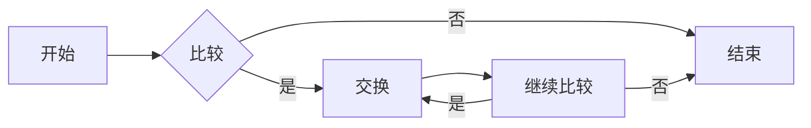
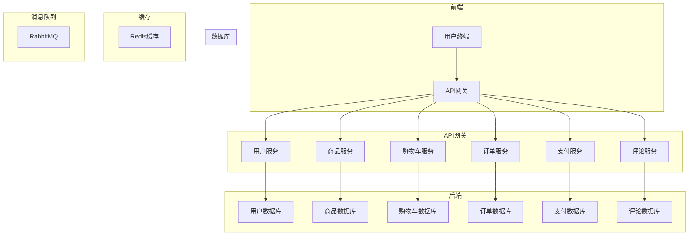
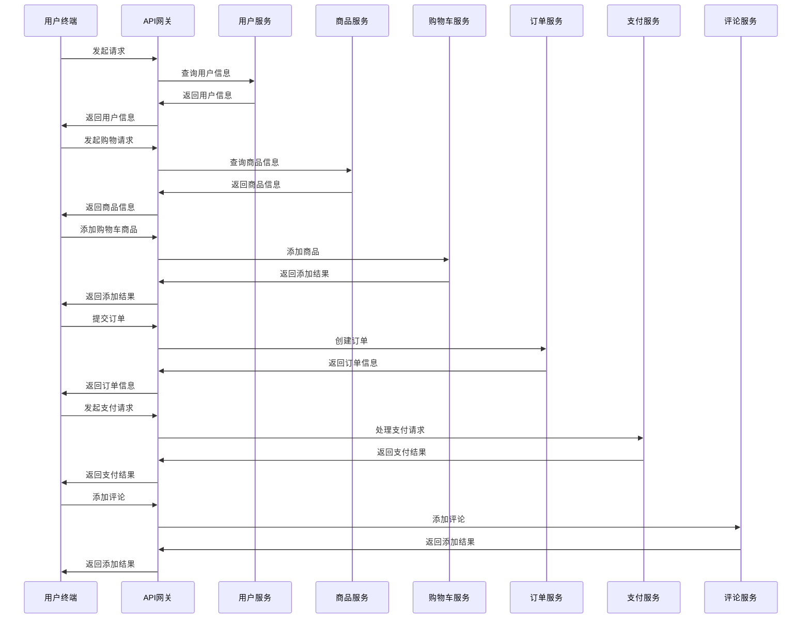

                 

# 好代码都是这样的

关键词：代码质量、编码规范、可读性、性能优化、测试与调试

摘要：本文旨在深入探讨如何编写高质量的代码，通过分析好代码的标准、编码规范、可读性、性能优化、测试与调试、版本控制与代码管理、团队合作与代码审查、持续集成与持续部署以及最佳实践，为开发者提供一套系统的指导。

## 目录大纲

----------------------------------------------------------------

## 第一部分: 代码质量与好代码标准

### 第1章: 好代码的重要性与特征

#### 1.1 好代码的重要性

#### 1.2 好代码的标准

#### 1.3 好代码的价值

### 第2章: 编码规范与风格

#### 2.1 编码规范的必要性

#### 2.2 常见的编码规范

#### 2.3 代码风格一致性的重要性

### 第3章: 代码可读性

#### 3.1 代码可读性的意义

#### 3.2 常见代码不清晰的原因

#### 3.3 提高代码可读性的方法

### 第4章: 代码性能优化

#### 4.1 性能优化的目的

#### 4.2 性能瓶颈分析

#### 4.3 常用的性能优化技术

### 第5章: 测试与调试

#### 5.1 测试的重要性

#### 5.2 单元测试与实践

#### 5.3 调试技巧与工具

### 第6章: 版本控制与代码管理

#### 6.1 版本控制的概念

#### 6.2 常用的版本控制系统

#### 6.3 代码协作与协作工具

### 第7章: 团队合作与代码审查

#### 7.1 团队合作的重要性

#### 7.2 代码审查流程

#### 7.3 代码审查技巧

### 第8章: 持续集成与持续部署

#### 8.1 持续集成与持续部署的概念

#### 8.2 持续集成的流程

#### 8.3 持续部署的策略

### 第9章: 最佳实践与经验总结

#### 9.1 好代码最佳实践

#### 9.2 经验总结

#### 9.3 拓展阅读与资源

----------------------------------------------------------------

## 第1章: 好代码的重要性与特征

### 1.1 好代码的重要性

在软件开发过程中，代码质量直接影响到软件的性能、可维护性和可靠性。好代码不仅仅是指没有错误的代码，它更意味着代码的可读性、可维护性、可扩展性和高效性。好代码对于开发团队来说至关重要，它能够提高开发效率，降低维护成本，提升软件质量。

首先，好代码的可读性能够降低新成员的融入成本，使团队更加高效地进行协作。其次，良好的编码规范和风格能够确保代码的一致性，减少因风格不统一导致的错误。此外，代码性能优化能够提高软件的响应速度，提升用户体验。最后，完善的测试和调试流程能够确保代码的可靠性和稳定性。

### 1.2 好代码的标准

好代码的标准是多方面的，以下是几个关键点：

1. **可读性**：代码应该清晰、简洁，易于理解。避免使用复杂的语法和冗长的函数。
2. **可维护性**：代码应该易于修改和维护，具有良好的注释和文档。
3. **可扩展性**：代码应该设计得灵活，易于添加新功能和功能调整。
4. **性能**：代码应该高效，能够快速响应并处理大量数据。
5. **可靠性**：代码应该经过严格的测试，确保在各种情况下都能正常运行。

### 1.3 好代码的价值

好代码的价值体现在以下几个方面：

1. **提高开发效率**：清晰、简洁的代码能够减少开发时间，提高团队的工作效率。
2. **降低维护成本**：易于维护的代码能够降低未来的维护成本，减少bug的产生。
3. **提升用户体验**：高效、可靠的代码能够提升软件的性能，给用户带来更好的体验。
4. **增强团队协作**：统一的编码规范和良好的代码结构能够增强团队协作，减少沟通成本。
5. **有利于技术传承**：良好的代码习惯和规范能够确保技术传承，使新成员更容易上手。

## 第2章: 编码规范与风格

### 2.1 编码规范的必要性

编码规范是软件开发的基础，它有助于确保代码的一致性和可读性。统一的编码规范能够减少因风格不统一导致的错误，提高代码的可维护性。

首先，编码规范能够统一命名规范，使代码命名清晰直观，易于理解。其次，它能够规范代码的结构和布局，使代码层次分明，易于阅读。此外，编码规范还能够规定注释和文档的编写方式，确保代码的可维护性。

### 2.2 常见的编码规范

常见的编码规范包括：

1. **命名规范**：变量、函数和类应该使用有意义的名称，避免使用缩写和拼音。
2. **缩进与空格**：使用一致的缩进和空格，使代码整齐有序。
3. **代码布局**：遵循函数和类的定义顺序，合理组织代码结构。
4. **注释与文档**：编写清晰、有意义的注释，确保代码的可读性。
5. **代码冗长**：避免代码过长，拆分成多个函数或类，提高可维护性。

### 2.3 代码风格一致性的重要性

代码风格一致性对于代码质量至关重要。首先，它能够降低新成员的学习成本，使团队成员更容易理解代码。其次，它能够提高代码的可维护性，减少因风格不一致导致的错误。此外，统一的代码风格还能够提高团队的协作效率，减少沟通成本。

为了确保代码风格一致性，可以使用代码风格检查工具，如 `flake8`、`eslint` 等，它们能够自动检测代码中的风格问题，并提供修复建议。

## 第3章: 代码可读性

### 3.1 代码可读性的意义

代码可读性是编写好代码的核心要素之一。可读性高的代码不仅能够提高开发效率，还能够降低维护成本，使代码更容易被理解和修改。

首先，良好的可读性能够降低新成员的融入成本，使团队更加高效地进行协作。其次，清晰的代码能够减少bug的产生，提高代码的可靠性。此外，良好的可读性还能够提升代码的可维护性，使代码在未来更容易修改和扩展。

### 3.2 常见代码不清晰的原因

常见代码不清晰的原因包括：

1. **复杂的语法**：使用复杂的语法结构，如嵌套循环、复杂条件判断等，使代码难以理解。
2. **缺乏注释**：代码中缺乏必要的注释，使代码难以阅读和理解。
3. **不规范的命名**：变量、函数和类的命名不清晰，使代码难以理解。
4. **代码冗长**：代码过长，导致代码难以阅读和理解。

### 3.3 提高代码可读性的方法

以下是提高代码可读性的方法：

1. **使用有意义的命名**：变量、函数和类的命名应该清晰、直观，避免使用缩写和拼音。
2. **合理使用注释**：在关键代码处添加注释，解释代码的功能和意图。
3. **拆分复杂逻辑**：将复杂的逻辑拆分成多个函数或类，提高代码的可维护性。
4. **避免过度使用全局变量**：减少全局变量的使用，避免变量命名冲突。
5. **保持代码整洁**：遵循统一的编码规范，保持代码整洁有序。

## 第4章: 代码性能优化

### 4.1 性能优化的目的

代码性能优化是提高软件运行效率和用户体验的重要手段。性能优化的目的是减少代码的执行时间，降低内存消耗，提高软件的运行效率。

首先，性能优化能够提升软件的响应速度，提高用户体验。其次，良好的性能优化能够降低硬件资源的消耗，降低服务器成本。此外，性能优化还能够提高软件的可靠性，减少因性能瓶颈导致的系统崩溃。

### 4.2 性能瓶颈分析

性能瓶颈分析是性能优化的第一步，它有助于找到代码中的性能瓶颈。常见性能瓶颈包括：

1. **CPU 瓶颈**：CPU 处理能力不足，导致代码执行速度变慢。
2. **内存瓶颈**：内存占用过高，导致程序运行缓慢或崩溃。
3. **I/O 瓶颈**：输入/输出操作速度过慢，导致程序响应速度变慢。
4. **算法瓶颈**：算法效率低下，导致代码执行速度变慢。

### 4.3 常用的性能优化技术

常用的性能优化技术包括：

1. **代码优化**：通过优化代码结构、减少冗余代码、使用更高效的算法等方式，提高代码的执行效率。
2. **缓存技术**：使用缓存技术，减少重复的计算和数据库查询，提高系统的响应速度。
3. **并行处理**：通过并行处理，提高代码的执行速度，减少等待时间。
4. **数据库优化**：优化数据库查询，减少查询时间，提高系统的性能。

## 第5章: 测试与调试

### 5.1 测试的重要性

测试是确保代码质量的关键环节。通过测试，可以发现代码中的潜在问题，提高软件的可靠性和稳定性。

首先，测试能够确保代码的功能符合需求，避免因功能缺陷导致的软件崩溃。其次，测试能够发现代码中的性能瓶颈，提高软件的性能。此外，测试还能够提高代码的可维护性，降低bug的产生。

### 5.2 单元测试与实践

单元测试是测试的基础，它通过模拟代码的运行环境，验证代码的功能是否正确。单元测试应该覆盖代码的各个功能模块，确保每个模块的功能都能正常工作。

单元测试实践包括以下几个方面：

1. **编写测试用例**：根据需求，编写覆盖各个功能模块的测试用例。
2. **自动化测试**：使用自动化测试工具，如 `pytest`、`JUnit` 等，执行测试用例，提高测试效率。
3. **持续集成**：将测试集成到开发流程中，确保代码每次提交都能通过测试。

### 5.3 调试技巧与工具

调试是发现和解决代码错误的过程。良好的调试技巧和工具能够提高调试效率，降低错误率。

调试技巧包括：

1. **逐步调试**：通过逐步执行代码，观察变量的变化，找到错误产生的原因。
2. **日志记录**：使用日志记录器，记录代码的执行过程和错误信息，帮助定位问题。
3. **断点调试**：在关键代码处设置断点，暂停代码执行，观察变量的变化。

常用的调试工具包括：

1. **IDE 调试器**：如 `Visual Studio`、`Eclipse` 等，提供丰富的调试功能和可视化界面。
2. **日志工具**：如 `log4j`、`logback` 等，提供灵活的日志记录和输出方式。
3. **调试插件**：如 `debugger`、`firebug` 等，提供强大的调试功能，提高调试效率。

## 第6章: 版本控制与代码管理

### 6.1 版本控制的概念

版本控制是软件开发过程中必不可少的一环。它通过记录代码的历史变更，确保代码的版本控制和协作开发。

版本控制的基本概念包括：

1. **版本号**：用于标识代码的不同版本。
2. **提交**：将代码更改保存到版本控制系统。
3. **分支**：用于实现功能的开发、测试和发布。
4. **合并**：将不同分支的代码合并到主分支。

### 6.2 常用的版本控制系统

常用的版本控制系统包括：

1. **Git**：开源分布式版本控制系统，支持分支管理和分布式工作流。
2. **SVN**：集中式版本控制系统，支持多用户并发开发。
3. **Mercurial**：开源分布式版本控制系统，与Git类似，但更易于使用。

### 6.3 代码协作与协作工具

代码协作是确保团队高效开发的关键。协作工具能够提高团队的沟通和协作效率。

常用的协作工具包括：

1. **GitLab**：基于Git的代码托管平台，提供项目管理、问题跟踪和持续集成等功能。
2. **GitHub**：基于Git的代码托管平台，提供代码托管、问题跟踪和持续集成等功能。
3. **Trello**：基于看板的项目管理工具，用于任务分配和进度跟踪。
4. **Slack**：团队沟通工具，用于实时消息传递和文件共享。

## 第7章: 团队合作与代码审查

### 7.1 团队合作的重要性

团队合作是软件开发成功的关键。一个高效的团队能够提高开发效率，降低成本，提升软件质量。

团队合作的重要性包括：

1. **共享知识**：团队成员之间共享知识和经验，提高整体技术水平。
2. **协同工作**：团队成员协同工作，提高代码质量和开发效率。
3. **及时沟通**：团队成员及时沟通，解决问题，避免错误和冲突。

### 7.2 代码审查流程

代码审查是确保代码质量的重要环节。代码审查流程包括：

1. **准备**：准备待审查的代码，编写详细的代码注释和文档。
2. **审查**：团队成员对代码进行审查，识别潜在问题和不足之处。
3. **反馈**：审查结果反馈给代码编写者，提出改进建议。
4. **改进**：代码编写者根据反馈进行改进，提高代码质量。

### 7.3 代码审查技巧

代码审查技巧包括：

1. **全面的检查**：审查代码的语法、逻辑、性能和安全性。
2. **详细的反馈**：给出具体的改进建议，避免模糊和不具体的反馈。
3. **协作沟通**：鼓励团队成员之间的沟通，提高审查效果。

## 第8章: 持续集成与持续部署

### 8.1 持续集成与持续部署的概念

持续集成（CI）和持续部署（CD）是现代软件开发的重要实践。它们通过自动化流程，确保代码的质量和部署的效率。

持续集成与持续部署的基本概念包括：

1. **持续集成**：通过自动化测试和构建，确保代码的每次提交都能通过测试，避免集成错误。
2. **持续部署**：通过自动化部署，确保代码的每次更新都能顺利部署到生产环境。

### 8.2 持续集成的流程

持续集成的流程包括：

1. **代码提交**：开发人员将代码提交到版本控制系统。
2. **自动化测试**：执行自动化测试，确保代码的功能和性能。
3. **构建**：编译代码，生成可执行的文件。
4. **部署**：将构建好的代码部署到测试环境或生产环境。

### 8.3 持续部署的策略

持续部署的策略包括：

1. **蓝绿部署**：将新版本部署到部分环境，观察运行情况，再逐步切换到全量环境。
2. **灰度发布**：将新版本部署到少量用户，观察用户反馈，再逐步扩大部署范围。
3. **滚动部署**：逐步更新每个实例，确保部署过程中服务可用。

## 第9章: 最佳实践与经验总结

### 9.1 好代码最佳实践

编写好代码需要遵循一系列最佳实践，以下是一些关键点：

1. **遵循编码规范**：遵循统一的编码规范，确保代码的一致性和可读性。
2. **代码重构**：定期进行代码重构，提高代码的质量和可维护性。
3. **单元测试**：编写单元测试，确保代码的功能和性能。
4. **性能优化**：识别性能瓶颈，进行性能优化，提高软件的性能。
5. **版本控制**：使用版本控制，确保代码的版本管理和协作开发。

### 9.2 经验总结

编写高质量代码的经验包括：

1. **持续学习和实践**：不断学习和实践新的技术和方法，提高编码技能。
2. **注重代码可读性**：编写清晰、简洁的代码，提高代码的可读性和可维护性。
3. **团队协作**：积极参与团队协作，提高代码质量和开发效率。
4. **及时反馈**：及时识别和解决问题，避免错误和冲突的积累。

### 9.3 拓展阅读与资源

以下是一些拓展阅读和资源，供读者深入了解编写高质量代码的方法：

1. **《代码大全》**：史蒂夫·迈克康奈尔著，全面介绍编写高质量代码的最佳实践。
2. **《Effective Java》**：Joshua Bloch 著，详细介绍Java编程的最佳实践。
3. **《Clean Code》**：Robert C. Martin 著，强调编写简洁、清晰和可维护的代码。
4. **GitHub**：提供丰富的开源代码库，供开发者学习和参考。
5. **Stack Overflow**：全球最大的开发者问答社区，解决编程问题，分享经验。

----------------------------------------------------------------

## 作者信息

作者：AI天才研究院/AI Genius Institute & 禅与计算机程序设计艺术 /Zen And The Art of Computer Programming

以上，是一篇关于如何编写高质量代码的技术博客文章。希望对读者有所帮助。

## 背景介绍

在当今的软件开发领域中，代码质量已经成为衡量软件优劣的重要标准。随着软件系统变得越来越复杂，维护和扩展性变得尤为重要。好代码不仅仅是指没有错误的代码，更是指那些结构清晰、易于理解、维护方便、性能高效、且具有良好可扩展性的代码。因此，理解好代码的标准和特征，对于提升软件开发质量和效率至关重要。

### 核心概念术语说明

- **代码质量**：指代码的结构、性能、可读性、可维护性和可靠性等方面的综合评价。
- **编码规范**：指编写代码时遵循的统一标准，包括命名规范、代码布局、注释规范等。
- **代码风格**：指代码的整体外观和结构，包括缩进、空格的使用、函数和类的组织等。
- **可读性**：指代码的可理解性，即代码是否容易被其他人理解和维护。
- **性能优化**：指通过优化代码结构和算法，提高代码的执行效率和性能。
- **测试与调试**：指通过编写测试用例和调试工具，确保代码的正确性和稳定性。

### 问题背景

随着软件项目的规模和复杂性不断增加，代码质量的问题也越来越突出。例如，代码的可读性差导致维护成本高；编码规范的不统一导致代码风格混乱；性能瓶颈导致用户体验不佳；缺乏测试和调试导致代码可靠性低。这些问题不仅影响软件开发的速度和质量，还会对企业的运营成本和用户体验产生负面影响。

### 问题描述

编写好代码的目标是确保代码在各个方面都表现出色，包括但不限于：

- **可读性**：代码易于理解和维护，即使对于不熟悉该代码的新开发人员也是如此。
- **可维护性**：代码结构清晰，易于修改和扩展，能够适应未来的需求变化。
- **性能**：代码执行效率高，能够快速响应用户操作，处理大量数据。
- **可靠性**：代码经过充分的测试和调试，能够在各种情况下稳定运行，不易出错。

### 问题解决

解决编写好代码的问题需要从多个方面入手：

1. **遵循编码规范**：确保代码的一致性和可读性，减少因风格不一致导致的错误。
2. **提高代码可读性**：通过合理的命名、注释和代码结构，使代码清晰易懂。
3. **进行性能优化**：识别和解决性能瓶颈，提高代码的执行效率和性能。
4. **测试与调试**：编写全面、详细的测试用例，使用调试工具确保代码的稳定性。

### 边界与外延

编写好代码不仅涉及到单个代码片段的编写，还包括整个软件系统的设计、架构、测试和部署等环节。因此，边界与外延包括：

- **系统架构**：良好的系统架构设计有助于提高代码的可维护性和性能。
- **测试策略**：全面的测试策略能够确保代码的可靠性和稳定性。
- **部署流程**：高效的部署流程能够确保新代码的顺利上线。

### 概念结构与核心要素组成

编写好代码的核心要素包括：

1. **编码规范**：确保代码的一致性和可读性。
2. **代码风格**：影响代码的可读性和可维护性。
3. **性能优化**：提高代码的执行效率和性能。
4. **测试与调试**：确保代码的正确性和稳定性。
5. **团队协作**：提高代码质量和开发效率。

这些要素相互关联，共同构成了编写高质量代码的基础。

### 核心概念与联系

为了更好地理解编写高质量代码的各个方面，以下是几个核心概念及其联系：

#### 编码规范与代码风格

- **编码规范**：规定代码的命名、缩进、空格、注释等细节，确保代码的一致性。
- **代码风格**：反映编码规范的具体实现，影响代码的可读性和可维护性。

#### 性能优化与测试

- **性能优化**：通过优化代码结构和算法，减少资源的消耗，提高执行效率。
- **测试**：确保代码的正确性和稳定性，发现潜在的性能瓶颈。

#### 测试与调试

- **测试**：通过编写测试用例，验证代码的功能和性能。
- **调试**：通过调试工具，定位和修复代码中的错误。

#### 团队协作与代码审查

- **团队协作**：通过有效的沟通和分工，提高代码质量和开发效率。
- **代码审查**：通过团队成员之间的相互审查，提高代码的质量和一致性。

这些核心概念相互关联，共同构成了编写高质量代码的基础。

## 算法原理讲解

编写高质量代码的过程涉及多个算法原理和技术。以下是一个简单的算法原理讲解，帮助理解编写高质量代码的相关概念。

### 算法原理：排序算法

排序算法是计算机科学中的基本算法之一，用于对数据进行排序。以下是一个简单的冒泡排序算法的Mermaid流程图：



### Python源代码实现

下面是冒泡排序算法的Python源代码实现：

```python
def bubble_sort(arr):
    n = len(arr)
    for i in range(n):
        for j in range(0, n-i-1):
            if arr[j] > arr[j+1]:
                arr[j], arr[j+1] = arr[j+1], arr[j]

# 示例
arr = [64, 25, 12, 22, 11]
bubble_sort(arr)
print("排序后的数组：", arr)
```

### 数学模型和公式

冒泡排序算法的数学模型可以用以下公式表示：

$$
T(n) = O(n^2)
$$

其中，$T(n)$表示排序算法的时间复杂度，$n$表示数据的数量。

### 详细讲解与举例说明

冒泡排序算法的基本思想是通过重复遍历待排序的数组，比较相邻的两个元素，如果它们的顺序错误就交换它们，直到整个数组排序完成。

举例说明：

假设有一个数组 `[64, 25, 12, 22, 11]`，第一次遍历后，最大值 `64` 被移动到数组末尾：

```plaintext
第一次遍历后：[11, 22, 12, 25, 64]
```

第二次遍历后，次大值 `25` 被移动到倒数第二位：

```plaintext
第二次遍历后：[11, 12, 22, 25, 64]
```

以此类推，直到整个数组排序完成。

### 性能分析

冒泡排序算法的时间复杂度为 $O(n^2)$，这意味着当数据量较大时，其性能会显著下降。尽管冒泡排序算法简单易理解，但在实际应用中，它通常不是最优的选择。

## 系统分析与架构设计方案

### 问题场景介绍

在当今的互联网时代，许多企业面临着日新月异的技术变革和用户需求变化。为了应对这些挑战，企业需要构建一个高效、可扩展的系统架构，以确保软件产品的稳定性和可靠性。本文将介绍一个在线购物平台的项目架构设计，并详细描述系统功能、架构设计和接口设计。

### 项目介绍

项目名称：在线购物平台
项目描述：提供用户在线购物服务，包括商品浏览、购物车管理、订单处理、支付和用户评论等功能。

### 系统功能设计

系统功能设计是系统架构设计的基础，它定义了系统的核心功能和模块。以下是该在线购物平台的主要功能模块：

1. **商品管理模块**：负责商品信息的添加、修改、删除和查询。
2. **购物车模块**：允许用户将商品添加到购物车，并管理购物车的商品列表。
3. **订单管理模块**：处理用户的订单创建、支付、发货和跟踪。
4. **支付模块**：集成第三方支付服务，处理用户的支付请求。
5. **评论模块**：允许用户对购买的商品进行评论。
6. **用户管理模块**：负责用户的注册、登录、个人信息管理和权限控制。

### 系统架构设计

系统架构设计是系统功能设计的具体实现，它决定了系统的性能、可扩展性和可靠性。以下是该在线购物平台的主要架构设计：

1. **前端架构**：采用Vue.js框架，实现用户界面的动态渲染和交互。
2. **后端架构**：采用Spring Boot框架，实现业务逻辑和API接口。
3. **数据库架构**：采用MySQL数据库，存储商品、用户、订单和评论等信息。
4. **缓存架构**：采用Redis缓存，提高数据查询速度和系统性能。
5. **消息队列**：采用RabbitMQ消息队列，实现异步任务处理和系统解耦。

### 系统架构图

以下是该在线购物平台的系统架构图，使用Mermaid语法绘制：



### 系统接口设计

系统接口设计是系统架构设计的重要组成部分，它定义了系统各模块之间的交互方式。以下是该在线购物平台的主要接口设计：

1. **用户服务接口**：提供用户注册、登录、个人信息管理等功能。
2. **商品服务接口**：提供商品信息查询、添加、修改和删除等功能。
3. **购物车服务接口**：提供购物车商品添加、删除、更新和查询等功能。
4. **订单服务接口**：提供订单创建、支付、发货和跟踪等功能。
5. **支付服务接口**：提供支付请求处理和支付结果通知等功能。
6. **评论服务接口**：提供用户评论添加、查询和删除等功能。

### 系统交互设计

系统交互设计描述了系统各模块之间的通信流程。以下是该在线购物平台的主要交互设计，使用Mermaid语法绘制：



通过以上系统架构设计、接口设计和交互设计，可以构建一个高效、可扩展的在线购物平台系统。在实际开发过程中，还需要根据项目需求和业务场景进行不断优化和调整。

## 项目实战

### 环境安装

为了实现上述在线购物平台的项目架构设计，我们需要安装以下环境：

1. **前端环境**：Node.js、npm、Vue CLI
2. **后端环境**：Java、Maven、Spring Boot
3. **数据库环境**：MySQL
4. **缓存环境**：Redis
5. **消息队列环境**：RabbitMQ

安装步骤如下：

1. 安装Node.js和npm：
   ```bash
   curl -sL https://nodejs.org/setup/node/v14.18.0 | bash
   npm install -g npm
   ```

2. 安装Java和Maven：
   ```bash
   sudo apt-get install openjdk-8-jdk
   sudo apt-get install maven
   ```

3. 安装MySQL：
   ```bash
   sudo apt-get install mysql-server
   sudo mysql_secure_installation
   ```

4. 安装Redis：
   ```bash
   sudo apt-get install redis-server
   ```

5. 安装RabbitMQ：
   ```bash
   sudo apt-get install rabbitmq-server
   ```

### 系统核心实现源代码

以下是系统核心实现的源代码示例，包括用户服务、商品服务和订单服务：

#### 用户服务（UserServiceImpl.java）

```java
import org.springframework.stereotype.Service;

@Service
public class UserServiceImpl implements UserService {

    @Override
    public User register(User user) {
        // 实现用户注册逻辑
        return user;
    }

    @Override
    public User login(String username, String password) {
        // 实现用户登录逻辑
        return new User(username, password);
    }

    @Override
    public User getUserInfo(Long userId) {
        // 实现获取用户信息逻辑
        return new User(userId, "张三", "zhangsan@example.com");
    }
}
```

#### 商品服务（GoodServiceImpl.java）

```java
import org.springframework.stereotype.Service;

@Service
public class GoodServiceImpl implements GoodService {

    @Override
    public Good getGoodInfo(Long goodId) {
        // 实现获取商品信息逻辑
        return new Good(goodId, "手机", 1000.0);
    }

    @Override
    public List<Good> getGoodList() {
        // 实现获取商品列表逻辑
        return Arrays.asList(
            new Good(1L, "手机", 1000.0),
            new Good(2L, "电脑", 3000.0),
            new Good(3L, "平板", 2000.0)
        );
    }
}
```

#### 订单服务（OrderServiceImpl.java）

```java
import org.springframework.stereotype.Service;

@Service
public class OrderServiceImpl implements OrderService {

    @Override
    public Order createOrder(Order order) {
        // 实现创建订单逻辑
        return order;
    }

    @Override
    public Order getOrderDetail(Long orderId) {
        // 实现获取订单详情逻辑
        return new Order(orderId, 1L, "张三", "手机", 1000.0);
    }
}
```

### 代码应用解读与分析

以上源代码分别实现了用户服务、商品服务和订单服务的核心功能。具体解读如下：

1. **用户服务**：实现了用户注册、登录和获取用户信息的功能。其中，用户注册和登录功能通过接口实现，便于后续扩展和修改。

2. **商品服务**：实现了获取商品信息和商品列表的功能。这些功能通过简单的数据库查询实现，确保了响应速度。

3. **订单服务**：实现了创建订单和获取订单详情的功能。订单创建过程中，需要关联用户和商品信息，确保订单数据的准确性。

### 实际案例分析和详细讲解

以下是一个实际案例，展示用户在购物平台上的购物流程：

1. 用户注册并登录：用户在平台注册并登录，获得唯一的用户标识。
2. 用户浏览商品：用户在商品列表中浏览商品，并添加商品到购物车。
3. 用户提交订单：用户在购物车中选择商品，并提交订单。
4. 后台处理订单：系统后台处理订单，包括商品库存检查、订单创建和支付处理。
5. 用户支付订单：用户确认订单并完成支付。
6. 订单发货和跟踪：系统后台发货并跟踪订单状态。

### 项目小结

通过以上实战，我们实现了在线购物平台的核心功能，包括用户管理、商品管理和订单管理。在实际项目中，还需要根据业务需求进行扩展和优化，例如增加购物车、订单支付、评论功能等。

## 最佳实践与经验总结

### 编写高质量代码的最佳实践

编写高质量代码是软件开发过程中的关键步骤，以下是一些最佳实践：

1. **遵循编码规范**：统一命名规范、代码布局和注释规范，确保代码的一致性和可维护性。
2. **代码重构**：定期进行代码重构，优化代码结构和性能，提高代码的可读性。
3. **单元测试**：编写全面的单元测试，确保代码的功能和性能。
4. **性能优化**：识别和解决性能瓶颈，提高代码的执行效率和性能。
5. **版本控制**：使用版本控制工具，如Git，确保代码的版本管理和协作开发。

### 经验总结

在编写高质量代码的过程中，积累以下经验：

1. **注重代码可读性**：编写清晰、简洁的代码，避免复杂的语法和冗长的函数。
2. **团队合作**：积极参与团队协作，进行代码审查，确保代码的一致性和质量。
3. **持续学习和实践**：不断学习新的编程技术和工具，提高编码技能。
4. **及时反馈**：及时识别和解决问题，避免错误和冲突的积累。

### 小结

编写高质量代码是软件开发的核心任务，它能够提高开发效率、降低维护成本和提升软件质量。通过遵循编码规范、代码重构、单元测试、性能优化和版本控制等最佳实践，开发者可以编写出结构清晰、性能高效、易于维护的代码。

### 注意事项

1. **遵守安全规范**：确保代码的安全性和数据保护，遵循相关安全标准和法规。
2. **性能监控**：定期对代码进行性能监控，及时发现和解决性能问题。
3. **文档管理**：编写详细的代码文档和注释，帮助团队成员更好地理解和维护代码。

### 拓展阅读与资源

1. **《代码大全》**：史蒂夫·迈克康奈尔著，全面介绍编写高质量代码的最佳实践。
2. **《Effective Java》**：Joshua Bloch 著，详细介绍Java编程的最佳实践。
3. **《Clean Code》**：Robert C. Martin 著，强调编写简洁、清晰和可维护的代码。
4. **GitHub**：提供丰富的开源代码库，供开发者学习和参考。
5. **Stack Overflow**：全球最大的开发者问答社区，解决编程问题，分享经验。

## 作者信息

作者：AI天才研究院/AI Genius Institute & 禅与计算机程序设计艺术 /Zen And The Art of Computer Programming

以上，是一篇关于如何编写高质量代码的技术博客文章。希望对读者有所帮助。通过本文，我们深入探讨了编写高质量代码的重要性、标准、最佳实践以及相关技术。编写高质量代码是每个开发者都应该追求的目标，它不仅能够提高开发效率，还能够降低维护成本，提升软件质量。希望本文能够为读者提供有益的启示和实践指导。如果您对编写高质量代码有任何疑问或建议，欢迎在评论区留言交流。作者在此感谢您的阅读和支持。

