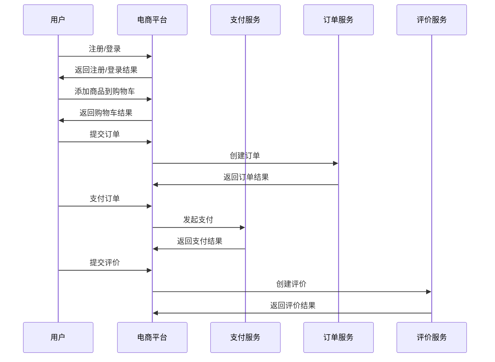
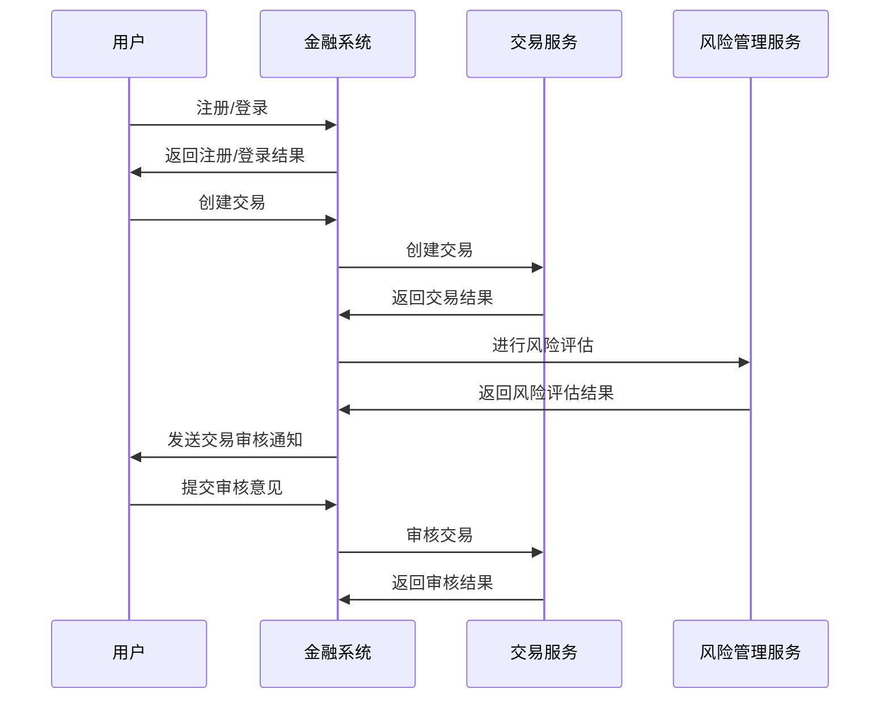
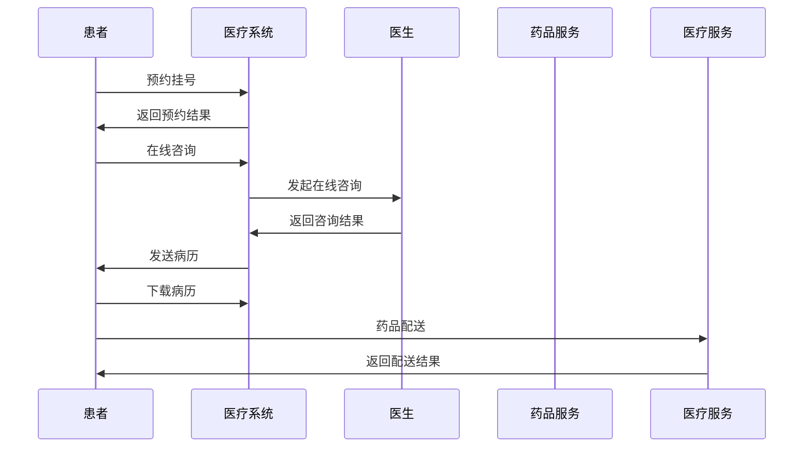
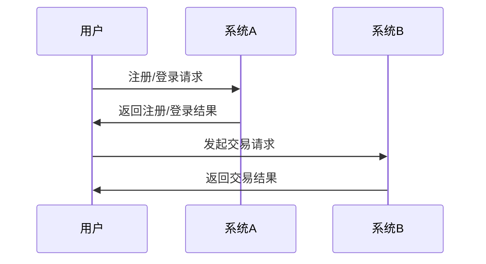

                 

# 《如何写出一份优秀的系统分析文档》

## 关键词

系统分析、文档编写、结构设计、需求收集、业务流程、系统边界

## 摘要

系统分析文档是软件开发过程中的关键文档，它能够帮助团队成员理解系统的设计思路、功能需求和技术实现。本文旨在介绍如何编写一份优秀的系统分析文档，包括系统分析基础知识、文档结构设计、编写技巧、文档评审与修改、发布与维护等环节。通过本文的指导，读者可以学会如何高效地编写系统分析文档，提高项目协作效率。

## 目录大纲

### 第1章 引言
- **1.1 系统分析文档的重要性**
- **1.2 系统分析文档的目标和范围**
- **1.3 系统分析文档的读者群体**

### 第2章 系统分析基础知识
- **2.1 什么是系统分析**
- **2.2 系统分析的方法论**
- **2.3 系统分析的过程**

### 第3章 准备工作
- **3.1 收集需求**
- **3.2 理解业务流程**
- **3.3 确定系统边界**

### 第4章 设计文档结构
- **4.1 文档的整体结构**
- **4.2 概述部分**
- **4.3 业务需求部分**
- **4.4 系统功能部分**
- **4.5 系统接口部分**
- **4.6 数据模型部分**
- **4.7 系统性能部分**
- **4.8 安全性部分**
- **4.9 部署与维护部分**
- **4.10 附件与参考文献**

### 第5章 编写文档
- **5.1 文档编写的原则**
- **5.2 使用合适的格式**
- **5.3 使用清晰的语言**
- **5.4 使用准确的术语**
- **5.5 使用图表和示例**

### 第6章 文档评审与修改
- **6.1 文档评审的目的**
- **6.2 评审的过程**
- **6.3 修改文档的建议**

### 第7章 文档发布与维护
- **7.1 文档发布的准备**
- **7.2 文档的版本管理**
- **7.3 文档的更新与维护**

### 第8章 实战案例
- **8.1 案例一：电商系统分析文档**
- **8.2 案例二：金融系统分析文档**
- **8.3 案例三：医疗系统分析文档**

### 附录
- **A.1 常用术语表**
- **A.2 常用工具和技术**
- **A.3 参考资料**

### 总结
- **9.1 系统分析文档的要点回顾**
- **9.2 常见问题与解答**

### 附加材料
- **9.3 系统分析文档模板**
- **9.4 Mermaid 流程图示例**
- **9.5 Python 源代码示例**
- **9.6 数学模型与公式示例**
- **9.7 代码解读与分析示例**

## 第1章 引言

### 1.1 系统分析文档的重要性

系统分析文档是软件开发过程中的核心文件，它不仅记录了项目的需求和设计，还为后续的开发、测试和维护工作提供了重要的参考资料。以下是系统分析文档的重要性：

1. **统一认识**：系统分析文档能够帮助团队成员对项目的目标、需求、设计等有统一的认识，减少误解和沟通成本。
2. **指导开发**：系统分析文档为开发团队提供了明确的开发指导，确保开发工作围绕需求进行，避免偏离项目目标。
3. **测试依据**：系统分析文档中的功能需求和接口设计为测试团队提供了测试依据，有助于全面覆盖测试场景。
4. **维护参考**：系统分析文档为后期的系统维护提供了重要的参考，帮助维护人员理解系统结构和业务逻辑。

### 1.2 系统分析文档的目标和范围

系统分析文档的主要目标是详细记录系统的需求和设计，为项目的开发和维护提供支持。具体来说，系统分析文档的目标包括：

1. **需求描述**：清晰地描述系统的功能需求和非功能需求，确保所有团队成员对需求有明确的理解。
2. **设计说明**：详细描述系统的设计思路、架构和关键技术，为开发团队提供设计参考。
3. **接口规范**：明确系统的接口设计，包括接口参数、返回值和数据格式，确保不同模块之间能够无缝对接。
4. **性能和安全要求**：描述系统的性能指标和安全要求，为性能优化和安全性评估提供参考。

系统分析文档的范围通常包括以下几个方面：

1. **业务需求**：详细记录业务流程和业务规则，明确系统的功能需求。
2. **系统功能**：描述系统的核心功能，包括功能模块、功能点和技术实现方案。
3. **数据模型**：详细记录系统的数据模型，包括数据结构、关系和存储方案。
4. **系统架构**：描述系统的整体架构，包括各个模块之间的关系和通信机制。
5. **性能和安全**：描述系统的性能指标、安全要求和实现措施。
6. **部署与维护**：描述系统的部署过程、维护策略和常见问题解决方案。

### 1.3 系统分析文档的读者群体

系统分析文档的读者群体主要包括以下几类：

1. **项目经理**：项目经理需要通过系统分析文档了解项目的整体情况，制定项目计划和进度安排。
2. **开发人员**：开发人员需要通过系统分析文档了解系统的需求和设计，进行编码实现。
3. **测试人员**：测试人员需要通过系统分析文档了解系统的功能和接口，设计测试用例，进行系统测试。
4. **运维人员**：运维人员需要通过系统分析文档了解系统的部署和维护过程，确保系统的稳定运行。
5. **业务人员**：业务人员需要通过系统分析文档了解系统的功能和业务逻辑，提供业务支持和建议。

通过明确系统分析文档的目标、范围和读者群体，我们可以更好地理解编写系统分析文档的重要性，从而确保文档能够满足不同读者的需求，为项目的成功实施提供有力支持。

### 第2章 系统分析基础知识

#### 2.1 什么是系统分析

系统分析是软件工程中的一个重要环节，它旨在理解系统的需求和设计，确保系统能够满足业务需求和用户需求。系统分析的过程包括需求收集、业务流程分析、系统边界确定等多个步骤。

1. **需求收集**：需求收集是系统分析的基础，通过调研、访谈、问卷调查等方式，了解用户的业务需求、功能需求和非功能需求。
2. **业务流程分析**：业务流程分析旨在理解用户的工作流程和业务规则，识别系统的功能模块和数据处理流程。
3. **系统边界确定**：系统边界确定是明确系统的范围和职责，确保系统与其他系统或模块之间的接口设计清晰。

#### 2.2 系统分析的方法论

系统分析的方法论包括多个阶段，每个阶段都有其特定的任务和方法。

1. **需求分析方法**：需求分析方法包括问卷调查、访谈、用户故事映射、场景模拟等，用于收集和理解用户需求。
2. **业务流程分析方法**：业务流程分析方法包括流程图、流程矩阵、SWOT分析等，用于分析用户的工作流程和业务规则。
3. **系统边界确定方法**：系统边界确定方法包括系统图、功能图、接口图等，用于明确系统的范围和职责。

#### 2.3 系统分析的过程

系统分析的过程通常包括以下几个步骤：

1. **项目启动**：明确项目目标、范围和参与人员，为后续工作奠定基础。
2. **需求收集**：通过多种方式收集用户需求，包括问卷调查、访谈、用户故事等。
3. **业务流程分析**：分析用户的工作流程和业务规则，识别系统的功能模块和数据处理流程。
4. **系统边界确定**：明确系统的范围和职责，确保系统与其他系统或模块之间的接口设计清晰。
5. **需求验证**：与用户进行沟通，验证需求是否准确和完整，确保系统设计符合用户期望。
6. **文档编写**：编写系统分析文档，包括业务需求、系统功能、数据模型、系统架构等。

通过以上步骤，系统分析能够确保项目团队对系统的需求和设计有清晰的认识，为后续的开发、测试和维护工作提供支持。

### 第3章 准备工作

#### 3.1 收集需求

收集需求是系统分析的重要环节，其质量直接影响到系统分析文档的准确性和完整性。以下是一些建议和步骤，以帮助您有效地收集需求。

1. **确定需求收集的目标**：在开始收集需求之前，明确收集需求的目的和范围，确保所有团队成员对需求的理解一致。

2. **选择合适的收集方法**：根据项目的特点和需求，选择合适的收集方法。常用的方法包括问卷调查、访谈、用户故事映射和场景模拟等。

   - **问卷调查**：通过设计问卷，收集用户的需求和反馈。这种方法适用于收集大量用户的需求，但需要注意问卷的设计质量，确保问题的明确性和相关性。
   
   - **访谈**：与用户进行面对面访谈，深入了解他们的需求和业务流程。这种方法适用于获取详细和深入的见解，但需要耗费较多时间和人力资源。
   
   - **用户故事映射**：通过用户故事映射，将用户的需求转化为具体的用户故事。这种方法有助于识别系统的功能模块和用户交互流程。
   
   - **场景模拟**：通过模拟用户的工作场景，观察他们的操作和行为，识别潜在的需求和问题。这种方法适用于发现用户在实际操作中遇到的具体问题。

3. **准备收集工具**：根据所选的收集方法，准备相应的收集工具。例如，问卷调查可以使用在线调查工具，访谈可以使用录音设备或会议软件。

4. **进行需求收集**：按照计划进行需求收集，确保收集过程的全面性和准确性。在收集过程中，注意记录关键信息和用户反馈，确保不会遗漏重要需求。

5. **需求整理和分析**：收集到需求后，对其进行整理和分析，识别需求之间的关联和优先级。可以使用需求管理工具，如JIRA或Confluence，对需求进行管理和跟踪。

6. **验证需求**：与用户进行沟通，验证需求是否准确和完整。通过需求验证，确保系统设计符合用户的期望，减少后期变更的风险。

通过以上步骤，您可以有效地收集需求，为系统分析文档的编写奠定基础。

#### 3.2 理解业务流程

理解业务流程是系统分析的关键环节，它有助于识别系统的功能需求和业务逻辑。以下是一些建议和步骤，以帮助您更好地理解业务流程。

1. **调研业务流程**：通过访谈、观察和文档阅读等方式，了解企业的业务流程。与业务人员进行沟通，获取他们的经验和见解，确保对业务流程有全面的了解。

2. **绘制流程图**：使用流程图工具（如Microsoft Visio或Lucidchart）绘制业务流程图。流程图可以清晰地展示业务流程的各个环节，帮助团队成员理解和分析业务流程。

   - **流程图的基本要素**：流程图通常包括以下基本要素：节点（表示流程中的操作或步骤）、箭头（表示流程的流向）、条件分支（表示流程的判断条件）和连接符（表示流程的连接关系）。

3. **识别关键业务过程**：在流程图中，识别关键业务过程和关键业务指标。关键业务过程是业务流程中的核心环节，对系统的功能设计至关重要。关键业务指标可以用于评估系统性能和业务效果。

4. **分析业务流程中的问题**：通过分析业务流程，识别流程中的问题和瓶颈。这些问题可能是手工操作过多、数据传输延迟、流程复杂度高等。分析这些问题，有助于确定系统改进的方向。

5. **提出改进建议**：根据分析结果，提出改进业务流程的建议。这些建议可以包括自动化操作、优化流程步骤、减少手工操作等。改进建议应考虑技术可行性、业务价值和成本效益。

6. **与业务人员讨论**：将分析结果和改进建议与业务人员讨论，确保他们的认同和支持。通过讨论，可以进一步优化业务流程和系统设计，提高系统的业务适应性。

通过以上步骤，您可以更好地理解业务流程，为系统分析文档的编写提供坚实基础。

#### 3.3 确定系统边界

确定系统边界是系统分析的重要环节，它有助于明确系统的功能范围和技术架构。以下是一些建议和步骤，以帮助您有效地确定系统边界。

1. **分析业务需求**：首先，分析业务需求，明确系统的核心功能和服务范围。了解业务流程、业务规则和业务数据，确保系统边界与业务需求相匹配。

2. **识别系统组件**：识别系统的核心组件和模块，明确各组件的功能和职责。可以使用类图、组件图等工具，展示系统组件及其关系。

3. **定义接口**：确定系统与其他系统或模块的接口，明确接口的输入输出参数、数据格式和通信协议。确保接口设计清晰、简单，便于系统的集成和扩展。

4. **绘制边界图**：使用边界图（如系统图、功能图）展示系统的边界和组件关系。边界图可以帮助团队成员理解系统的整体架构和功能范围。

5. **评审和调整**：与团队成员和业务人员讨论系统边界，收集反馈和意见。根据反馈，调整系统边界，确保其符合业务需求和项目目标。

6. **记录系统边界**：将系统边界记录在系统分析文档中，包括边界定义、组件关系、接口规范等。确保文档的完整性和准确性，便于后续的开发和测试工作。

通过以上步骤，您可以有效地确定系统边界，为系统分析文档的编写提供清晰的方向。

### 第4章 设计文档结构

#### 4.1 文档的整体结构

设计一个优秀的系统分析文档的整体结构，是确保文档内容条理清晰、易于理解的关键。整体结构的设计应该包含以下几个主要部分：

1. **文档封面**：文档封面通常包含文档标题、版本号、创建日期和创建人等信息，便于管理和追踪文档。

2. **目录**：目录部分列出文档的章节标题和页码，帮助读者快速定位和查阅相关内容。

3. **前言**：前言部分介绍文档的目的、范围和读者对象，提供文档的背景信息。

4. **正文**：正文是文档的核心部分，包含详细的需求描述、系统设计、接口规范、性能和安全要求等。

5. **附录**：附录部分提供额外的参考资料、工具和技术文档、示例代码等，便于读者深入了解和参考。

6. **版本记录**：版本记录部分记录文档的修改历史，包括修改日期、修改人和修改内容，确保文档的版本管理。

通过以上结构设计，文档能够呈现出清晰的层次感，使读者能够更容易地理解和使用文档内容。

#### 4.2 概述部分

概述部分是系统分析文档的开篇，其主要目标是向读者提供文档的整体背景、目的和范围。以下是概述部分的主要内容：

1. **背景**：介绍系统分析文档的背景信息，包括项目背景、业务需求和项目目标。这部分可以帮助读者了解文档产生的背景和原因。

2. **目的**：明确系统分析文档的目的和目标，例如，为项目团队提供明确的开发指南、为测试团队提供测试依据、为运维团队提供部署和维护指南等。

3. **范围**：详细描述文档涵盖的内容和范围，包括系统功能、数据模型、系统架构、性能和安全要求等。同时，明确文档不涉及的内容，避免读者产生误解。

4. **读者对象**：说明文档的读者群体，包括项目经理、开发人员、测试人员、运维人员和业务人员等，明确每个读者群体的需求和关注点。

5. **参考资料**：列出编写文档时参考的相关文档和资料，包括需求文档、设计文档、技术规范等，便于读者查阅和参考。

通过概述部分，读者可以快速了解文档的整体内容和结构，为后续阅读和理解打下基础。

#### 4.3 业务需求部分

业务需求部分是系统分析文档的核心部分之一，其主要目标是详细记录系统的功能需求和非功能需求，确保所有团队成员对需求有清晰的认识。以下是业务需求部分的详细编写方法：

1. **需求分类**：首先，将需求分为功能需求和非功能需求两类。功能需求描述系统的具体功能和行为，非功能需求描述系统的性能、安全性、可用性等。

2. **需求描述**：对每个需求进行详细描述，包括需求名称、需求描述、需求来源、优先级和依赖关系等。需求描述应尽量具体、明确，避免模糊和歧义。

   - **需求名称**：简洁明了地命名每个需求，使其能够准确地反映需求的内容。
   - **需求描述**：详细说明需求的具体内容和要求，包括功能点、输入输出、业务逻辑等。
   - **需求来源**：记录需求的来源，例如用户需求、业务规则、法律法规等。
   - **优先级**：根据需求的紧急程度和重要性，对需求进行优先级排序，确保关键需求优先实现。
   - **依赖关系**：记录需求之间的依赖关系，例如某些需求必须在其他需求实现后才能完成。

3. **需求示例**：提供具体的业务需求示例，帮助读者更好地理解需求的含义和实现方法。例如，可以列出用户故事或用例，展示用户与系统的交互过程。

4. **需求验证**：与业务人员进行沟通和验证，确保需求的准确性和完整性。在需求验证过程中，可以组织需求评审会议，邀请相关人员进行讨论和反馈。

5. **需求管理**：使用需求管理工具（如JIRA、Confluence等）对需求进行管理，包括需求的创建、更新、分配和跟踪等。确保需求的变更能够及时记录和更新，避免需求遗漏或错误。

通过以上方法，您可以详细记录系统的业务需求，为后续的系统设计和开发提供坚实的基础。

#### 4.4 系统功能部分

系统功能部分是系统分析文档的重要组成部分，它详细描述了系统的功能模块、功能点和技术实现方案。以下是系统功能部分的编写方法：

1. **功能模块划分**：首先，将系统功能划分为多个模块，每个模块负责实现特定的功能。模块划分应遵循高内聚、低耦合的原则，确保模块之间的独立性。

2. **功能点描述**：对每个功能模块进行详细的功能点描述，包括功能名称、功能描述、输入参数、输出结果、预期行为等。功能点描述应尽量具体和全面，避免遗漏关键细节。

   - **功能名称**：简洁明了地命名每个功能点，使其能够准确地反映功能的内容。
   - **功能描述**：详细说明功能点的具体功能和实现方式，包括业务逻辑、数据处理等。
   - **输入参数**：列出功能点所需的输入参数，包括参数名称、数据类型和默认值等。
   - **输出结果**：描述功能点的输出结果，包括返回值、异常情况等。
   - **预期行为**：说明功能点的预期行为，包括正常情况、异常情况等。

3. **技术实现方案**：详细描述每个功能点的技术实现方案，包括关键代码片段、算法原理、技术选型等。技术实现方案应充分考虑性能、安全性、可维护性等因素。

4. **功能交互关系**：绘制功能交互关系图，展示各功能模块和功能点之间的交互关系。功能交互关系图有助于理解系统的整体功能架构和交互流程。

5. **功能示例**：提供具体的业务场景示例，展示功能点的实际应用场景。功能示例应包括操作步骤、输入数据和输出结果等，帮助读者更好地理解功能点的作用和实现方式。

6. **功能验证**：与开发人员和测试人员沟通，验证功能点的设计和实现是否符合需求。在功能验证过程中，可以组织功能评审会议，邀请相关人员进行讨论和反馈。

通过以上方法，您可以详细记录系统的功能模块和功能点，为系统的开发、测试和维护提供明确的指导和参考。

#### 4.5 系统接口部分

系统接口部分是系统分析文档的重要组成部分，它详细描述了系统内部各模块之间的接口设计和通信机制。以下是系统接口部分的编写方法：

1. **接口分类**：首先，根据系统的功能模块和业务需求，将接口分为内部接口和外部接口。内部接口主要用于系统内部模块之间的通信，外部接口主要用于系统与其他系统或外部服务的交互。

2. **接口定义**：对每个接口进行详细定义，包括接口名称、接口描述、输入参数、输出结果和通信协议等。接口定义应尽量具体和全面，确保接口设计的清晰和准确。

   - **接口名称**：简洁明了地命名每个接口，使其能够准确地反映接口的功能和用途。
   - **接口描述**：详细说明接口的具体功能和作用，包括接口的输入输出和数据格式等。
   - **输入参数**：列出接口所需的输入参数，包括参数名称、数据类型和默认值等。
   - **输出结果**：描述接口的输出结果，包括返回值、异常情况等。
   - **通信协议**：说明接口的通信协议，包括HTTP、HTTPS、TCP/IP等。

3. **接口规范**：制定详细的接口规范，包括接口的请求和响应格式、参数定义、错误处理等。接口规范应遵循统一的标准和规范，确保接口的通用性和可维护性。

4. **接口交互流程**：绘制接口交互流程图，展示接口调用和响应的过程。接口交互流程图有助于理解接口的通信机制和数据处理流程。

5. **接口示例**：提供具体的接口调用示例，展示接口的实际应用场景。接口示例应包括请求参数、请求头、响应内容等，帮助读者更好地理解接口的使用方法和注意事项。

6. **接口验证**：与开发人员和测试人员沟通，验证接口的设计和实现是否符合规范。在接口验证过程中，可以组织接口评审会议，邀请相关人员进行讨论和反馈。

通过以上方法，您可以详细记录系统的接口设计和规范，为系统的开发、测试和维护提供明确的指导和参考。

#### 4.6 数据模型部分

数据模型部分是系统分析文档的重要组成部分，它详细描述了系统的数据结构、数据关系和存储方案。以下是数据模型部分的编写方法：

1. **数据结构描述**：首先，对系统的数据结构进行详细描述，包括数据类型、字段定义、数据长度和约束条件等。数据结构描述应尽量具体和全面，确保数据的准确性和完整性。

   - **数据类型**：列出数据表中使用的各种数据类型，包括整数、字符串、日期等。
   - **字段定义**：详细说明每个字段的名称、数据类型、长度、默认值和约束条件等。
   - **数据长度**：指定每个字段的数据长度，确保数据的存储空间合理。
   - **约束条件**：定义数据表的约束条件，包括唯一性、非空、外键等，确保数据的正确性和一致性。

2. **数据关系描述**：其次，描述数据表之间的关系，包括实体关系、关联关系和约束关系等。数据关系描述应清晰明了，确保数据关系的正确性和完整性。

   - **实体关系**：使用实体关系图（ER图）展示数据表之间的实体关系，包括一对一、一对多、多对多关系。
   - **关联关系**：描述数据表之间的关联关系，包括主外键关系、索引关系等。
   - **约束关系**：定义数据表之间的约束关系，包括唯一性约束、外键约束等。

3. **数据存储方案**：详细描述系统的数据存储方案，包括数据库的选择、表结构设计、存储优化等。数据存储方案应充分考虑数据的安全性、性能和可扩展性。

   - **数据库选择**：根据业务需求和性能要求，选择合适的数据库系统，如MySQL、Oracle、MongoDB等。
   - **表结构设计**：设计合理的数据表结构，确保数据存储的高效性和可维护性。
   - **存储优化**：优化数据存储方案，包括索引优化、分库分表、缓存策略等，提高系统性能。

4. **数据示例**：提供具体的业务数据示例，展示数据表的实例数据和数据关系。数据示例应包括实际业务场景的数据，帮助读者更好地理解数据模型的应用和意义。

5. **数据验证**：与开发人员和数据库管理员沟通，验证数据模型的设计和实现是否符合需求。在数据验证过程中，可以组织数据模型评审会议，邀请相关人员进行讨论和反馈。

通过以上方法，您可以详细记录系统的数据模型和存储方案，为系统的开发、测试和维护提供明确的指导和参考。

#### 4.7 系统性能部分

系统性能部分是系统分析文档的重要组成部分，它详细描述了系统的性能指标、性能优化方案和性能测试方法。以下是系统性能部分的编写方法：

1. **性能指标描述**：首先，对系统的性能指标进行详细描述，包括响应时间、吞吐量、并发量、延迟等。性能指标描述应尽量具体和全面，确保性能目标的明确和可衡量。

   - **响应时间**：描述系统处理请求的平均响应时间，包括系统内部处理时间和网络传输时间等。
   - **吞吐量**：描述系统在单位时间内处理请求的能力，通常以请求/秒（req/s）或交易/秒（txn/s）等表示。
   - **并发量**：描述系统同时处理多个请求的能力，通常以最大并发用户数或并发连接数表示。
   - **延迟**：描述系统在处理请求过程中产生的延迟，包括网络延迟、数据库延迟、应用层延迟等。

2. **性能优化方案**：其次，详细描述系统的性能优化方案，包括数据库优化、应用优化、网络优化等。性能优化方案应针对性能瓶颈进行针对性优化，提高系统性能。

   - **数据库优化**：优化数据库查询性能，包括索引优化、查询优化、存储优化等。
   - **应用优化**：优化应用代码的性能，包括算法优化、缓存策略、并发处理等。
   - **网络优化**：优化网络传输性能，包括压缩数据、减少网络拥塞、优化路由等。

3. **性能测试方法**：详细描述系统的性能测试方法，包括测试环境、测试工具、测试场景等。性能测试方法应确保测试结果的准确性和可靠性。

   - **测试环境**：描述性能测试所需的硬件、软件和网络环境，确保测试环境的真实性和一致性。
   - **测试工具**：列出性能测试所使用的工具，如LoadRunner、JMeter等，并说明工具的使用方法和功能。
   - **测试场景**：设计多种性能测试场景，包括正常场景、高峰场景、极端场景等，确保测试覆盖全面。

4. **性能监控与报警**：描述系统的性能监控与报警机制，包括监控指标、监控工具、报警策略等。性能监控与报警机制应确保系统性能的实时监控和及时报警，提高系统的稳定性和可靠性。

   - **监控指标**：列出系统性能监控的关键指标，如CPU利用率、内存占用率、磁盘I/O等。
   - **监控工具**：描述性能监控工具的使用方法和功能，如Zabbix、Prometheus等。
   - **报警策略**：定义性能报警的策略和条件，确保性能问题的及时发现和处理。

通过以上方法，您可以详细记录系统的性能指标、性能优化方案和性能测试方法，为系统的开发、测试和维护提供明确的指导和参考。

#### 4.8 安全性部分

安全性部分是系统分析文档的重要组成部分，它详细描述了系统的安全要求、安全策略和安全措施。以下是安全性部分的编写方法：

1. **安全需求描述**：首先，对系统的安全需求进行详细描述，包括数据安全、访问控制、用户认证等。安全需求描述应具体明确，确保安全目标的实现。

   - **数据安全**：描述系统如何保护数据的安全性和完整性，包括数据加密、备份与恢复、数据隔离等。
   - **访问控制**：描述系统如何控制用户对数据和资源的访问权限，包括角色权限分配、访问控制列表等。
   - **用户认证**：描述系统如何验证用户的身份，包括密码认证、双因素认证、证书认证等。

2. **安全策略描述**：其次，详细描述系统的安全策略，包括安全架构、安全流程、安全标准等。安全策略描述应系统全面，确保安全措施的实施。

   - **安全架构**：描述系统的安全架构设计，包括安全模块、安全组件和安全机制等。
   - **安全流程**：描述系统的安全流程，包括安全评估、安全测试、安全监控等。
   - **安全标准**：引用相关的安全标准，如ISO 27001、PCI DSS等，确保系统符合行业标准和法规要求。

3. **安全措施描述**：详细描述系统采取的安全措施，包括网络安全、应用安全、数据安全等。安全措施描述应具体可行，确保安全防护的有效性。

   - **网络安全**：描述系统如何保护网络的安全，包括防火墙、入侵检测、网络隔离等。
   - **应用安全**：描述系统如何保护应用的安全，包括输入验证、SQL注入防护、跨站脚本攻击防护等。
   - **数据安全**：描述系统如何保护数据的安全，包括数据加密、数据备份与恢复、数据访问控制等。

4. **安全审计与监控**：描述系统的安全审计与监控机制，包括日志记录、安全事件监控、安全报警等。安全审计与监控机制应确保系统的安全状态可监控、可管理和可改进。

   - **日志记录**：描述系统如何记录安全相关的日志，包括登录日志、操作日志、审计日志等。
   - **安全事件监控**：描述系统如何监控安全事件，包括入侵检测、恶意代码检测等。
   - **安全报警**：描述系统如何对安全事件进行报警，包括短信报警、邮件报警、声音报警等。

5. **安全测试与评估**：描述系统的安全测试与评估方法，包括漏洞扫描、渗透测试、安全评估等。安全测试与评估方法应确保系统在开发和部署过程中发现和修复潜在的安全漏洞。

   - **漏洞扫描**：描述系统如何进行漏洞扫描，包括自动化扫描、人工审计等。
   - **渗透测试**：描述系统如何进行渗透测试，包括模拟攻击、漏洞验证等。
   - **安全评估**：描述系统如何进行安全评估，包括安全指标评估、安全风险管理等。

通过以上方法，您可以详细记录系统的安全要求、安全策略和安全措施，为系统的开发、测试和维护提供明确的指导和参考。

#### 4.9 部署与维护部分

部署与维护部分是系统分析文档的重要组成部分，它详细描述了系统的部署过程、维护策略和常见问题解决方案。以下是部署与维护部分的编写方法：

1. **部署过程描述**：首先，详细描述系统的部署过程，包括环境准备、软件安装、配置管理、部署验证等。部署过程描述应详细、明确，确保部署的顺利进行。

   - **环境准备**：描述部署所需的硬件、软件和网络环境，包括服务器配置、操作系统、数据库等。
   - **软件安装**：描述系统软件的安装步骤，包括安装包的下载、安装配置等。
   - **配置管理**：描述系统的配置管理，包括配置文件的备份与恢复、配置参数的调整等。
   - **部署验证**：描述系统部署后的验证步骤，包括功能测试、性能测试、安全性测试等。

2. **维护策略描述**：其次，详细描述系统的维护策略，包括日常维护、故障处理、备份与恢复等。维护策略描述应全面、可行，确保系统的稳定运行。

   - **日常维护**：描述系统的日常维护任务，包括系统监控、性能调优、日志分析等。
   - **故障处理**：描述系统故障的处理流程，包括故障定位、故障修复、故障恢复等。
   - **备份与恢复**：描述系统的备份与恢复策略，包括数据备份、系统恢复、故障切换等。

3. **常见问题解决方案**：详细记录系统在部署和维护过程中可能遇到的常见问题及其解决方案。常见问题解决方案应具体、实用，便于快速定位和解决问题。

   - **问题一**：描述问题现象、原因和解决方案，如网络连接问题、配置错误等。
   - **问题二**：描述问题现象、原因和解决方案，如系统崩溃、数据丢失等。

4. **维护工具与资源**：列出系统维护所需使用的工具和资源，如监控工具、备份工具、故障诊断工具等。维护工具与资源描述应详细、准确，确保维护工作的顺利开展。

   - **监控工具**：描述系统监控工具的使用方法，如Zabbix、Nagios等。
   - **备份工具**：描述数据备份工具的使用方法，如MySQLdump、rsync等。
   - **故障诊断工具**：描述故障诊断工具的使用方法，如Wireshark、JStack等。

通过以上方法，您可以详细记录系统的部署与维护过程，为系统的运行和维护提供明确的指导和参考。

#### 4.10 附件与参考文献

附件与参考文献部分是系统分析文档的补充内容，它提供了与文档相关的额外信息和参考资料。以下是附件与参考文献的编写方法：

1. **附件**：列出与系统分析文档相关的附件，包括技术文档、示例代码、数据文件等。附件应与文档内容紧密相关，便于读者查阅和使用。

   - **技术文档**：提供系统相关的技术文档，如技术规范、设计文档、开发手册等。
   - **示例代码**：提供系统开发过程中使用的示例代码，如Python代码、Java代码等。
   - **数据文件**：提供系统测试过程中使用的数据文件，如测试数据、备份文件等。

2. **参考文献**：列出编写系统分析文档时参考的文献和资料，包括书籍、论文、网站等。参考文献应遵循学术规范，确保引用的准确性和权威性。

   - **书籍**：列出参考的书籍，包括作者、出版社、出版日期等。
   - **论文**：列出参考的论文，包括作者、发表期刊、发表时间等。
   - **网站**：列出参考的网站，包括网址、网站名称、访问时间等。

通过附件与参考文献部分，读者可以更全面地了解系统分析文档的背景和参考资料，为后续的学习和使用提供帮助。

### 第5章 编写文档

#### 5.1 文档编写的原则

编写系统分析文档时，应遵循以下原则，以确保文档的质量和可读性：

1. **清晰性**：文档内容应清晰明了，避免使用复杂的术语和冗长的句子。确保每个概念、步骤和结论都易于理解。

2. **一致性**：文档应保持一致性，包括术语、格式和结构。使用统一的命名规范和文档格式，确保读者能够顺畅地阅读和理解。

3. **准确性**：文档内容应准确无误，包括事实、数据和引用。在编写过程中，进行多次审核和验证，确保所有信息都是最新和准确的。

4. **完整性**：文档应涵盖所有必要的部分，确保没有遗漏关键信息。每个章节和部分都应详细说明，以便读者能够全面了解系统分析文档的内容。

5. **逻辑性**：文档结构应具有逻辑性，从整体到细节，逐步引导读者理解系统的需求和设计。使用清晰的结构和层次，确保读者能够轻松地跟随文档的思路。

6. **可维护性**：文档应易于维护和更新，包括版本管理和变更记录。确保文档的版本信息清晰，便于后续的修改和维护。

通过遵循以上原则，您能够编写出高质量的系统分析文档，为项目团队提供可靠的参考和指导。

#### 5.2 使用合适的格式

在编写系统分析文档时，使用合适的格式对于提升文档的可读性和专业性至关重要。以下是一些建议：

1. **字体和字号**：使用标准字体和字号，如Times New Roman、Arial，字号宜保持在10-12pt之间。确保文档内容清晰易读。

2. **段落格式**：段落之间应保持适当的间距，使用1-1.5倍行距。段落首行缩进，通常设置为0.5英寸或2个字符。

3. **标题和层次**：使用明确的标题和层次结构，便于读者快速定位和查阅。使用不同的标题级别（如一级标题、二级标题、三级标题等），确保层次清晰。

4. **列表和项目符号**：使用列表和项目符号组织信息，提高文档的可读性。使用有序列表和无序列表，分别表示步骤和要点。

5. **图表和图片**：合理使用图表和图片，以视觉形式呈现复杂的信息。确保图表和图片清晰、准确，并附带简短的描述性文字。

6. **引用和参考文献**：使用规范的引用格式，确保所有引用和参考文献的准确性和一致性。列出参考文献，方便读者查阅相关资料。

7. **样式一致性**：在整个文档中保持一致的样式，包括字体、颜色、背景等。使用样式表（如CSS）管理样式，确保文档的一致性和专业性。

通过使用合适的格式，您可以提高系统分析文档的质量和可读性，使读者能够更容易地理解和使用文档内容。

#### 5.3 使用清晰的语言

在编写系统分析文档时，使用清晰的语言至关重要。清晰的语言不仅能够帮助读者更好地理解文档内容，还能够减少误解和沟通成本。以下是一些建议：

1. **简洁明了**：避免使用复杂的句子和冗长的表达。尽量使用简单的词汇和句式，确保每句话都能够清晰地传达信息。

2. **避免歧义**：确保每个词汇和表达都有明确的含义，避免使用模糊或歧义的词汇。如果某个词可能有多种解释，应给出具体的上下文说明。

3. **使用定义**：在首次使用专业术语或复杂概念时，提供清晰的定义或解释。这有助于读者理解新术语和概念，避免产生混淆。

4. **举例说明**：使用具体的例子来阐述概念和步骤，使读者能够更好地理解。例子应具有代表性，能够反映实际应用场景。

5. **逻辑顺序**：按照逻辑顺序组织文档内容，确保每个部分和步骤都衔接紧密，读者能够顺畅地阅读和理解。

6. **保持一致性**：在整个文档中保持一致的术语和表达方式，避免使用不同的术语或表达来描述相同的概念。

7. **审查和反馈**：在编写过程中，多次审查文档，并邀请其他团队成员或专家提供反馈。确保文档内容准确、清晰，符合专业标准。

通过使用清晰的语言，您可以提高系统分析文档的可读性和专业性，使读者能够更轻松地理解和使用文档内容。

#### 5.4 使用准确的术语

在编写系统分析文档时，使用准确的术语是非常重要的。准确的术语可以确保文档的专业性和一致性，避免误解和混淆。以下是一些建议：

1. **术语定义**：在文档中首次使用专业术语时，提供清晰的定义或解释。这有助于读者理解术语的含义，确保他们在后续阅读中能够准确理解。

2. **统一术语**：在整个文档中保持一致的术语使用。避免在同一文档中使用不同的术语来描述相同的概念，这会导致混乱和不一致性。

3. **术语库**：建立一个术语库，收集和记录项目中使用的专业术语。这有助于确保团队成员在使用术语时的一致性，并方便新成员了解项目中的术语。

4. **避免模糊术语**：避免使用模糊或含糊不清的术语，这些术语可能导致误解和混淆。尽量使用明确、具体的术语来描述概念和功能。

5. **上下文说明**：在文档中使用上下文来说明术语的含义，特别是在术语可能有多重解释的情况下。提供具体的上下文，确保读者能够准确理解术语的使用场景。

6. **术语验证**：在编写文档的过程中，验证术语的准确性。可以邀请其他团队成员或专家进行审查，确保术语的使用是正确和一致的。

7. **培训和学习**：为团队成员提供专业术语的培训和学习资源，帮助他们熟悉和掌握项目中的术语。这有助于提高团队的整体专业水平，确保文档的准确性。

通过使用准确的术语，您可以提高系统分析文档的专业性和一致性，使文档更加准确、清晰，便于读者理解和使用。

#### 5.5 使用图表和示例

在编写系统分析文档时，合理使用图表和示例能够显著提高文档的可读性和理解度。以下是一些建议：

1. **图表类型选择**：根据文档内容和目标，选择合适的图表类型。常用的图表类型包括流程图、类图、数据流图、Gantt图、饼图、柱状图等。每种图表都有其特定的用途和优点，选择合适的图表能够更好地传达信息。

2. **图表内容设计**：确保图表内容简洁、清晰。避免图表过于复杂，以免读者难以理解。图表应包含明确的标题、图例、坐标轴标签和数据点，有助于读者快速获取信息。

3. **图表与文本配合**：将图表与文档中的文本内容紧密结合，确保图表能够补充和解释文本。在图表旁边添加简要的文字说明，帮助读者理解图表的含义和作用。

4. **示例代码和案例**：在适当的地方，提供具体的示例代码和实际案例。示例代码可以展示如何实现特定功能，实际案例可以展示系统在实际业务场景中的应用。示例应尽量简洁、明了，便于读者理解和复制。

5. **图表和示例的定位**：合理安排图表和示例的位置，使其与相关的文本内容紧密相连。可以在文档中使用锚点或引用标记，使读者能够方便地跳转到相关内容。

6. **图表和示例的验证**：确保图表和示例的准确性和完整性。在编写文档之前，先验证图表和示例是否正确无误。可以邀请其他团队成员或专家进行审查，确保图表和示例符合实际需求。

通过合理使用图表和示例，您可以提高系统分析文档的可读性和理解度，使读者能够更轻松地获取和理解文档内容。

### 第6章 文档评审与修改

#### 6.1 文档评审的目的

文档评审是系统分析文档编写过程中的关键环节，其主要目的是确保文档的质量、准确性和完整性。以下为文档评审的主要目的：

1. **提高文档质量**：通过评审，可以发现文档中的错误、不一致和不准确之处，从而提高文档的整体质量。

2. **确保准确性**：评审过程中，可以验证文档内容的准确性，确保所有信息都是最新和可靠的。

3. **统一意见**：评审有助于团队成员就文档内容达成共识，减少因理解不同而产生的分歧。

4. **合规性检查**：评审过程中，可以检查文档是否符合相关的标准和法规要求，确保项目的合规性。

5. **反馈与改进**：评审提供了反馈机制，可以让团队成员提出改进建议，不断优化文档内容。

#### 6.2 评审的过程

文档评审过程可以分为以下几个阶段：

1. **准备评审材料**：在评审前，准备完整的文档材料，包括文档草稿、相关需求文档和技术文档等。确保所有评审材料都是最新和准确的。

2. **组建评审团队**：根据文档内容和项目需求，组建一个由项目经理、开发人员、测试人员、业务人员等组成的评审团队。每个成员都应具备相应的专业知识和经验。

3. **召开评审会议**：在评审会议上，评审团队成员共同审查文档内容，提出意见和建议。会议应有序进行，每个成员都有发言和表达意见的机会。

4. **记录评审意见**：评审过程中，记录所有提出的意见和建议，包括改进建议、修改内容和优先级。确保记录完整，便于后续的修改和跟踪。

5. **修改文档**：根据评审意见，对文档进行相应的修改和调整。修改过程中，应确保文档的整体结构和逻辑一致性，避免因修改而导致文档混乱。

6. **复审和确认**：修改完成后，再次进行评审，确保所有意见都已落实，文档内容准确无误。复审可以通过会议、邮件或其他沟通方式进行。

7. **发布文档**：经过评审和确认后，发布最终的系统分析文档。确保文档的版本管理正确，更新记录完整。

#### 6.3 修改文档的建议

在修改文档时，可以参考以下建议，确保文档的质量和准确性：

1. **审查逻辑结构**：确保文档的整体结构合理，各章节之间的逻辑关系清晰。删除冗余内容，优化章节和组织结构。

2. **校对文本**：仔细检查文档中的拼写、语法和标点错误，确保文本的准确性和流畅性。可以使用文本编辑器的拼写检查功能辅助校对。

3. **验证数据和图表**：检查文档中引用的数据、图表和示例是否准确和可靠。确保所有数据和图表都是最新的，并与实际业务场景相符。

4. **更新术语和定义**：检查文档中使用的术语和定义是否一致和准确。确保术语和定义符合专业标准和行业规范。

5. **优化格式和排版**：调整文档的格式和排版，使其更美观、易读。确保图表、图片和文本之间的布局合理，页面整洁。

6. **版本控制**：使用版本控制工具（如Git）管理文档的修改历史，确保版本信息的准确和完整。在每次修改后，及时更新版本号和修改记录。

通过上述文档评审与修改的过程和建议，您可以确保系统分析文档的质量和准确性，为项目的成功实施提供有力支持。

### 第7章 文档发布与维护

#### 7.1 文档发布的准备

文档发布是系统分析文档编写流程的最后一个重要环节，其目的是将完成的文档交付给相关人员使用。以下是文档发布前的准备工作：

1. **文档审查**：在发布前，对文档进行一次全面的审查，确保所有内容准确、完整且符合项目需求。这包括检查文本、图表、数据等，确保没有遗漏和错误。

2. **版本控制**：确保文档的版本控制正确，包括更新文档版本号和修改记录。使用版本控制工具（如Git）可以方便地管理文档的版本历史，便于后续的追踪和恢复。

3. **格式检查**：检查文档的格式是否符合标准，确保排版美观、统一。这包括字体、字号、行距、标题级别、引用格式等。

4. **获取批准**：在发布文档前，需要获得项目经理或相关领导的批准。确保所有相关人员对文档内容无异议，以便后续使用。

5. **备份文档**：在发布前，备份文档以确保在发布过程中不会丢失数据。可以使用云存储服务或本地备份工具进行备份。

6. **发布渠道**：确定文档的发布渠道，如内部邮件、共享文件夹、项目管理工具等。确保文档可以方便地被相关人员访问。

#### 7.2 文档的版本管理

版本管理是确保文档更新和追踪的重要手段。以下是文档版本管理的最佳实践：

1. **使用版本控制工具**：使用版本控制工具（如Git）来管理文档的版本历史。这可以帮助团队成员协作编辑文档，并轻松追踪每个版本的变更。

2. **记录变更日志**：在每个版本更新时，记录详细的变更日志，包括变更的内容、日期、作者和变更原因。这有助于后续的审计和问题追踪。

3. **分支策略**：使用分支策略来管理不同版本的文档。例如，主分支用于维护当前稳定版本的文档，而功能分支或特性分支用于开发新功能或修复bug。

4. **合并请求**：在功能分支或特性分支完成开发后，提交合并请求将其合并到主分支。在合并前，应进行充分的测试和验证，确保文档的稳定性和准确性。

5. **版本迭代**：在每次发布新版本时，使用递增的版本号（如1.0、1.1、1.2等）来标识。这有助于团队成员和用户识别文档的不同版本。

6. **文档备份**：定期备份文档，以防数据丢失或损坏。可以使用云存储服务或本地备份工具进行备份，并确保备份数据的安全性和可恢复性。

通过以上版本管理策略，您可以确保文档的更新和追踪，提高团队协作效率和文档的质量。

#### 7.3 文档的更新与维护

文档的更新与维护是确保文档持续准确和适用的关键。以下是文档更新与维护的最佳实践：

1. **定期审查**：定期对文档进行审查，确保其内容准确、完整和最新。审查频率可以根据项目需求和文档的重要程度进行调整。

2. **变更管理**：建立变更管理流程，确保文档的更新和修改经过严格的审核和批准。每次变更都应记录变更日志，包括变更内容、日期、作者和变更原因。

3. **用户反馈**：收集用户对文档的反馈，了解他们的需求和意见。这有助于识别文档中的不足和错误，及时进行修改和改进。

4. **更新通知**：在文档更新后，及时通知相关用户和团队成员。可以通过邮件、内部公告或项目管理工具发送更新通知，确保所有人都能及时获取最新版本。

5. **版本迭代**：随着项目的进展和需求的变化，文档也需要不断迭代和改进。确保每次迭代都基于前一次版本进行，避免内容重复和冲突。

6. **培训和支持**：为团队成员提供文档培训和指导，确保他们能够正确理解和使用文档。这有助于提高团队的协作效率，减少文档使用中的误解和错误。

7. **文档备份**：定期备份文档，以防数据丢失或损坏。确保备份数据的安全性和可恢复性，以便在需要时能够快速恢复文档。

通过以上更新与维护策略，您可以确保文档的持续准确和适用，为项目的成功实施提供可靠的支持。

### 第8章 实战案例

在本文的最后，我们将通过三个具体的实战案例，详细解析如何编写系统分析文档。这些案例包括电商系统、金融系统和医疗系统，分别代表了不同类型的系统分析需求。

#### 8.1 案例一：电商系统分析文档

**背景介绍**：
电商系统是一个复杂的系统，涉及用户、商品、订单、支付等多个业务模块。该系统需要支持用户购物、商品展示、订单处理、支付和售后等核心功能。

**项目介绍**：
项目目标是构建一个高效、稳定的电商系统，提供优质的用户体验。系统需求包括用户注册登录、商品浏览、购物车、订单管理、支付系统、推荐系统、用户评价等。

**系统功能设计**：
- 用户模块：用户注册、登录、个人信息管理、收藏夹。
- 商品模块：商品展示、分类管理、商品搜索、商品详情。
- 订单模块：订单创建、订单状态管理、订单查询、订单取消。
- 支付模块：支付方式选择、支付结果通知、退款处理。
- 推荐模块：用户推荐、商品推荐。
- 评价模块：用户评价、商品评价。

**系统架构设计**：
电商系统采用微服务架构，包括用户服务、商品服务、订单服务、支付服务、推荐服务和评价服务等多个微服务模块。这些模块通过API进行通信，确保系统的高可扩展性和高可用性。

**系统接口设计**：
- 用户接口：用户注册、登录、个人信息管理、收藏夹。
- 商品接口：商品展示、分类管理、商品搜索、商品详情。
- 订单接口：订单创建、订单状态管理、订单查询、订单取消。
- 支付接口：支付方式选择、支付结果通知、退款处理。
- 推荐接口：用户推荐、商品推荐。
- 评价接口：用户评价、商品评价。

**系统交互设计**：
使用Mermaid流程图展示系统交互流程，包括用户注册、登录、购物车操作、订单创建、支付和评价等。



**项目小结**：
电商系统分析文档详细记录了系统的功能需求、接口设计、系统架构和交互流程，为项目开发提供了明确的指导和参考。通过该文档，开发团队能够更好地理解系统需求和设计，提高开发效率，确保系统功能完整、性能稳定。

#### 8.2 案例二：金融系统分析文档

**背景介绍**：
金融系统是一个高度复杂和敏感的系统，涉及银行、证券、保险等多个业务领域。该系统需要处理用户的账户信息、交易记录、资金流动等关键数据。

**项目介绍**：
项目目标是构建一个安全、稳定和高效的金融系统，支持用户账户管理、交易处理、资金流动、风险管理等功能。

**系统功能设计**：
- 账户模块：用户账户注册、账户信息管理、账户权限设置。
- 交易模块：交易创建、交易审核、交易查询、交易退款。
- 风险管理模块：风险评估、风险预警、风险控制。
- 报表模块：交易报表、财务报表、风险报表。
- 用户服务模块：用户注册、登录、个人信息管理。

**系统架构设计**：
金融系统采用微服务架构，包括账户服务、交易服务、风险管理服务、报表服务和用户服务等多个微服务模块。这些模块通过加密通信和分布式存储技术确保系统的安全性和高性能。

**系统接口设计**：
- 账户接口：用户账户注册、账户信息管理、账户权限设置。
- 交易接口：交易创建、交易审核、交易查询、交易退款。
- 风险管理接口：风险评估、风险预警、风险控制。
- 报表接口：交易报表、财务报表、风险报表。
- 用户接口：用户注册、登录、个人信息管理。

**系统交互设计**：
使用Mermaid流程图展示系统交互流程，包括用户注册、登录、交易创建、交易审核、交易查询等。



**项目小结**：
金融系统分析文档详细记录了系统的功能需求、接口设计、系统架构和交互流程，为项目的开发、测试和维护提供了重要的参考资料。通过该文档，开发团队能够更好地理解系统需求和设计，确保系统功能安全、稳定和高效。

#### 8.3 案例三：医疗系统分析文档

**背景介绍**：
医疗系统是一个高度复杂和敏感的系统，涉及患者信息管理、医疗服务、病历管理、药品管理等多个业务领域。该系统需要确保患者数据的安全性和隐私性。

**项目介绍**：
项目目标是构建一个智能化、高效的医疗系统，支持患者预约挂号、在线咨询、病历管理、药品配送等功能。

**系统功能设计**：
- 患者模块：患者信息管理、预约挂号、在线咨询、病历管理。
- 医生模块：医生信息管理、在线咨询、病历查看、处方开具。
- 药品模块：药品信息管理、药品配送、药品库存管理。
- 系统管理模块：系统配置、权限管理、数据备份与恢复。

**系统架构设计**：
医疗系统采用云计算和分布式架构，包括患者服务、医生服务、药品服务、系统管理服务等多个服务模块。系统采用安全加密技术，确保患者数据的安全和隐私。

**系统接口设计**：
- 患者接口：患者信息管理、预约挂号、在线咨询、病历管理。
- 医生接口：医生信息管理、在线咨询、病历查看、处方开具。
- 药品接口：药品信息管理、药品配送、药品库存管理。
- 系统管理接口：系统配置、权限管理、数据备份与恢复。

**系统交互设计**：
使用Mermaid流程图展示系统交互流程，包括患者预约挂号、在线咨询、病历管理、药品配送等。



**项目小结**：
医疗系统分析文档详细记录了系统的功能需求、接口设计、系统架构和交互流程，为项目的开发、测试和维护提供了全面的指导。通过该文档，开发团队能够更好地理解系统需求和设计，确保系统功能完整、安全、高效，为患者提供优质的医疗服务。

### 附录

#### A.1 常用术语表

以下是一些在系统分析文档中常用的术语及其定义：

- **系统分析**：对系统的需求、设计、实现和运行进行全面的分析和研究。
- **需求收集**：通过多种方式收集用户的业务需求、功能需求和性能需求。
- **业务流程**：企业或组织完成某项业务任务的过程，包括输入、处理、输出和反馈。
- **系统边界**：系统与其他系统或模块之间的接口和交互范围。
- **数据模型**：描述系统中数据结构和数据关系的模型。
- **系统接口**：系统内部或与其他系统之间的数据交换和通信接口。
- **性能测试**：对系统性能进行评估和优化，包括响应时间、吞吐量、并发量等。
- **安全性**：系统保护数据、资源和用户隐私的能力。
- **部署**：将系统安装和配置到目标环境中，使其正常运行。
- **维护**：对系统进行监控、修复、优化和更新，确保其持续稳定运行。

#### A.2 常用工具和技术

以下是一些在系统分析文档编写过程中常用的工具和技术：

- **Mermaid**：一种基于Markdown的图形流程图工具，可以方便地绘制流程图、类图和序列图。
- **Git**：一种分布式版本控制工具，用于管理文档的版本历史和变更记录。
- **Confluence**：一款团队协作平台，用于编写、共享和协作编辑文档。
- **JIRA**：一款敏捷项目管理工具，用于跟踪和管理项目任务和需求。
- **SQL**：一种结构化查询语言，用于数据库查询、数据操作和数据分析。
- **Python**：一种高级编程语言，常用于数据处理、算法实现和自动化脚本。

#### A.3 参考资料

以下是一些在系统分析文档编写过程中可以参考的资料：

- 《软件工程：实践者的研究方法》（Roger S. Pressman） - 一本经典的软件工程教材，详细介绍了系统分析和设计的方法和技巧。
- 《软件架构设计：模式、原则与实践》（Michael Keeling） - 一本关于软件架构设计的权威指南，提供了丰富的架构模式和设计原则。
- 《系统分析与设计教程》（Richard E. Fairlie） - 一本针对系统分析与设计初学者的教程，涵盖了系统分析的基础知识和实用技巧。
- 《系统分析与设计方法》（M. A. Godfrey and S. A. Wetherell） - 一本关于系统分析与设计方法的理论和实践指南，涵盖了多种系统分析技术。

### 总结

#### 9.1 系统分析文档的要点回顾

本文详细介绍了如何编写一份优秀的系统分析文档，包括以下要点：

1. **引言**：系统分析文档的重要性、目标和读者群体。
2. **基础知识**：系统分析的定义、方法论和过程。
3. **准备工作**：需求收集、业务流程理解和系统边界确定。
4. **文档结构设计**：概述、业务需求、系统功能、系统接口、数据模型、系统性能、安全性、部署与维护等。
5. **编写文档**：编写原则、格式、语言、术语和示例的使用。
6. **文档评审与修改**：评审的目的、过程和修改建议。
7. **文档发布与维护**：发布的准备、版本管理和更新与维护。
8. **实战案例**：电商系统、金融系统和医疗系统的分析文档编写。

#### 9.2 常见问题与解答

以下是一些关于系统分析文档编写过程中常见问题的解答：

**Q：系统分析文档需要多长时间编写完成？**

A：系统分析文档的编写时间取决于项目的复杂程度和团队的工作效率。一般来说，一个中等复杂度的项目可能需要2-4周的时间来编写完成系统分析文档。

**Q：系统分析文档需要包含哪些内容？**

A：系统分析文档通常包含概述、业务需求、系统功能、系统接口、数据模型、系统性能、安全性、部署与维护等部分。具体内容应根据项目的需求和特点进行调整。

**Q：如何确保系统分析文档的准确性？**

A：确保系统分析文档的准确性需要以下几个步骤：

- 与业务人员进行充分的沟通，收集和验证需求。
- 在编写过程中，多次审查和验证文档内容。
- 进行文档评审，邀请团队成员和其他利益相关者提供反馈。
- 保持文档的更新与维护，确保文档与实际项目情况相符。

**Q：系统分析文档的格式有哪些要求？**

A：系统分析文档的格式应遵循以下要求：

- 使用统一的字体和字号，确保文档内容清晰易读。
- 使用合理的段落格式和标题层次，提高文档的可读性。
- 使用图表和示例，帮助读者更好地理解复杂的信息。
- 使用一致的术语和命名规范，确保文档的一致性。

**Q：系统分析文档的编写过程有哪些注意事项？**

A：在编写系统分析文档时，需要注意以下几点：

- 保持文档的逻辑性和连贯性，确保读者能够顺畅地阅读和理解。
- 尽量使用简洁明了的语言，避免使用复杂的术语和冗长的句子。
- 记录文档的变更历史，确保文档的可追踪性和可维护性。
- 定期与团队成员和其他利益相关者沟通，确保文档的内容准确和最新。

通过以上解答，希望读者能够更好地理解系统分析文档的编写过程和要点，提高文档的质量和实用性。

### 附加材料

#### 9.3 系统分析文档模板

以下是一个简单的系统分析文档模板，供您参考：

```markdown
# 系统分析文档

## 概述

- **文档目的**：
- **文档范围**：
- **读者对象**：

## 业务需求

- **用户需求**：
- **功能需求**：
- **非功能需求**：

## 系统功能

- **用户模块**：
- **商品模块**：
- **订单模块**：
- **支付模块**：
- **推荐模块**：

## 数据模型

- **数据结构**：
- **数据关系**：

## 系统接口

- **用户接口**：
- **商品接口**：
- **订单接口**：
- **支付接口**：
- **推荐接口**：

## 系统性能

- **性能指标**：
- **性能优化方案**：

## 安全性

- **安全需求**：
- **安全策略**：
- **安全措施**：

## 部署与维护

- **部署过程**：
- **维护策略**：
- **常见问题解决方案**：

## 附件与参考文献

- **附件**：
- **参考文献**：

```

#### 9.4 Mermaid 流程图示例

以下是一个使用Mermaid绘制的流程图示例，展示了一个简单的用户注册和登录过程：



#### 9.5 Python 源代码示例

以下是一个简单的Python示例，用于计算两个数的和：

```python
def calculate_sum(a, b):
    return a + b

# 示例调用
result = calculate_sum(3, 4)
print(result)
```

#### 9.6 数学模型与公式示例

以下是一个使用LaTeX编写的数学公式示例，用于表示线性回归模型：

$$
y = \beta_0 + \beta_1x + \epsilon
$$`

#### 9.7 代码解读与分析示例

以下是对上一个Python示例的代码解读和分析：

```python
def calculate_sum(a, b):
    return a + b

# 示例调用
result = calculate_sum(3, 4)
print(result)
```

**代码解读**：

1. 定义了一个名为`calculate_sum`的函数，该函数接受两个参数`a`和`b`。
2. 函数内部通过`return`语句返回两个参数的和。
3. 在主程序中，调用了`calculate_sum`函数，并将参数`3`和`4`传递给函数。
4. 将函数返回的结果存储在变量`result`中。
5. 使用`print`函数输出变量`result`的值。

**代码分析**：

- 该代码示例展示了函数定义和调用的基本语法。
- 函数`calculate_sum`实现了简单的加法运算，返回两个数的和。
- 主程序通过调用函数，实现了计算两个数和的功能。
- 输出结果`7`验证了函数的正确性。

通过代码解读和分析，我们可以更好地理解代码的结构和功能，以及如何正确使用Python编写代码。

