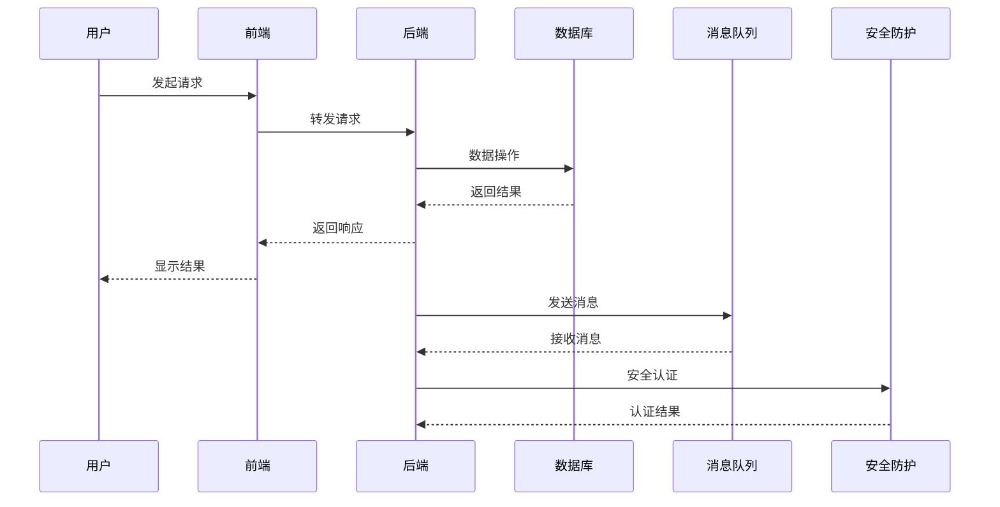

                 

### 文章标题：威胁建模与风险评估方法

#### 关键词：威胁建模、风险评估、信息安全、风险分析、威胁识别

> 摘要：本文将深入探讨威胁建模与风险评估的方法，通过逐步分析推理的方式，介绍威胁建模的核心概念、方法、工具，以及风险评估的流程、技术和应用。文章旨在为读者提供一套系统、实用的信息安全风险管理方法论，助力企业提升安全防护能力。

## 第一部分：威胁建模的基础知识

### 第1章：威胁建模的背景与重要性

#### 1.1 威胁建模的定义

威胁建模是一种系统化的方法，用于识别、分析和评估潜在的安全威胁，以确保信息系统的安全性。其核心目标是识别潜在的威胁、漏洞和风险，并制定相应的防御策略。

#### 1.2 威胁建模的重要性

威胁建模对于确保信息系统的安全至关重要。它不仅可以帮助企业识别潜在的安全威胁，还可以帮助制定有效的防御策略，降低风险，提高信息系统的安全性。

#### 1.3 威胁建模的发展历程

威胁建模起源于20世纪90年代，随着信息安全威胁的日益增多，威胁建模逐渐成为一种重要的安全防护手段。近年来，随着云计算、物联网、人工智能等新技术的应用，威胁建模的方法和技术也在不断发展和完善。

## 第2章：威胁建模的核心概念

#### 2.1 威胁的定义与分类

威胁是指可能对信息系统造成损害的潜在事件或行为。根据威胁的来源和特点，可以将威胁分为以下几类：

1. **恶意软件**：包括病毒、木马、蠕虫等。
2. **黑客攻击**：包括网络攻击、入侵攻击等。
3. **内部威胁**：包括内部员工违规、数据泄露等。
4. **自然灾害**：包括火灾、地震等。

#### 2.2 漏洞

漏洞是指信息系统中的安全缺陷，可能被威胁利用来对系统造成损害。根据漏洞的类型和特点，可以将漏洞分为以下几类：

1. **软件漏洞**：包括代码漏洞、配置漏洞等。
2. **网络漏洞**：包括防火墙漏洞、网络设备漏洞等。
3. **物理漏洞**：包括服务器机房物理安全漏洞等。

#### 2.3 漏洞的利用

威胁利用漏洞对信息系统进行攻击，以达到破坏、窃取信息等目的。常见的漏洞利用方式包括：

1. **社会工程学攻击**：通过欺骗手段获取系统权限。
2. **暴力破解**：通过不断尝试密码来破解系统。
3. **代码注入**：通过注入恶意代码来控制系统。

## 第3章：威胁建模的方法论

#### 3.1 威胁建模流程

威胁建模通常包括以下步骤：

1. **威胁识别**：识别潜在的安全威胁。
2. **威胁分析**：分析威胁的特点、影响范围等。
3. **威胁评估**：评估威胁的严重性和风险。

#### 3.2 常见威胁建模工具

威胁建模工具可以帮助企业快速、高效地完成威胁建模工作。常见的威胁建模工具包括：

1. **OWASP Threat Modeler**：一款基于Web应用程序的威胁建模工具。
2. **Microsoft Threat Modeling Tool**：一款由微软开发的威胁建模工具。
3. **Threat Modeler Pro**：一款功能强大的威胁建模软件。

## 第4章：风险评估方法与实践

#### 4.1 风险评估的基本概念

风险评估是指对潜在的风险进行识别、分析和评估的过程。其核心目标是确定风险的严重程度和可能的影响，以便企业能够制定相应的应对措施。

#### 4.2 风险评估的步骤

风险评估通常包括以下步骤：

1. **风险识别**：识别潜在的风险。
2. **风险分析**：分析风险的性质、原因和影响。
3. **风险评估**：评估风险的严重程度和可能的影响。

#### 4.3 常用风险评估技术

风险评估技术包括定量和定性两种方法：

1. **定量风险评估**：通过数学模型和算法对风险进行量化评估。
2. **定性风险评估**：通过专家判断和经验对风险进行定性评估。

## 第5章：威胁建模与风险评估案例分析

#### 5.1 案例一：某金融机构的威胁建模与风险评估

本案例将分析某金融机构的威胁建模与风险评估过程，包括：

1. **案例背景**：介绍金融机构的业务特点和面临的安全挑战。
2. **威胁建模与风险评估过程**：详细描述威胁建模与风险评估的步骤和方法。
3. **案例分析与总结**：分析案例中成功和失败的经验，总结威胁建模与风险评估的关键要素。

#### 5.2 案例二：某电子商务平台的威胁建模与风险评估

本案例将分析某电子商务平台的威胁建模与风险评估过程，包括：

1. **案例背景**：介绍电子商务平台的特点和面临的安全挑战。
2. **威胁建模与风险评估过程**：详细描述威胁建模与风险评估的步骤和方法。
3. **案例分析与总结**：分析案例中成功和失败的经验，总结威胁建模与风险评估的关键要素。

## 第6章：威胁建模与风险评估的最佳实践

#### 6.1 威胁建模与风险评估的最佳实践

本章节将介绍威胁建模与风险评估的最佳实践，包括：

1. **威胁建模的最佳实践**：介绍如何进行有效的威胁建模。
2. **风险评估的最佳实践**：介绍如何进行准确的风险评估。

#### 6.2 注意事项与拓展阅读

本章节还将讨论威胁建模与风险评估中需要注意的事项，并推荐一些拓展阅读资源，以帮助读者深入理解威胁建模与风险评估的理论和实践。

以上是本文的目录大纲，接下来我们将逐章深入探讨威胁建模与风险评估的方法、技术和实践。希望本文能够为读者提供有价值的参考和指导，助力企业提升信息安全防护能力。让我们开始详细讨论每一章的内容吧！

----------------------------------------------------------------

### 第一部分：威胁建模的基础知识

#### 第1章：威胁建模的背景与重要性

##### 1.1 威胁建模的定义

威胁建模（Threat Modeling）是一种系统化的方法，用于识别、分析和评估潜在的安全威胁，以确保信息系统的安全性。这种方法涉及对可能威胁系统的各种因素进行详细的分析，包括软件、硬件、网络和人员。通过威胁建模，组织可以更好地理解威胁的来源、类型和潜在的后果，从而采取相应的防御措施。

##### 1.2 威胁建模的重要性

在当今复杂且不断变化的信息安全环境中，威胁建模扮演着至关重要的角色。以下是威胁建模的重要性体现：

1. **早期识别风险**：通过威胁建模，组织可以在系统设计初期识别潜在的安全威胁，从而在开发阶段就进行安全加固，避免在系统上线后才发现问题。
2. **优先级排序**：威胁建模帮助组织确定哪些威胁最可能发生，影响最大，从而可以优先分配资源进行防御。
3. **风险评估**：威胁建模是风险评估过程的基础，通过分析威胁的可能性及其可能造成的影响，可以评估风险并制定相应的应对策略。
4. **合规要求**：许多行业标准和法规要求组织进行威胁建模和风险管理，以证明其安全性。
5. **增强安全意识**：威胁建模使组织内部人员对安全威胁有更深入的了解，提高整体安全意识。

##### 1.3 威胁建模的发展历程

威胁建模作为一个专业领域，其发展历程可以追溯到20世纪90年代。以下是一些关键的发展点：

1. **早期威胁建模**：在互联网早期，威胁建模主要关注网络攻击，如DDoS攻击和端口扫描。
2. **软件安全成熟度模型**（Software Security Maturity Model, SSMM）：在2000年左右，SSMM框架被提出，强调组织应建立安全开发生命周期。
3. **微软威胁建模方法**：微软在2005年发布了其威胁建模指南，成为广泛采用的威胁建模框架。
4. **云计算和移动安全**：随着云计算和移动设备的普及，威胁建模方法逐渐扩展到这些新兴领域，如云安全威胁建模和移动应用威胁建模。
5. **自动化和人工智能**：近年来，自动化工具和人工智能技术被引入威胁建模，提高了建模的效率和准确性。

#### 总结

威胁建模是一种关键的安全实践，它帮助组织在复杂多变的信息安全环境中识别和管理潜在威胁。通过了解威胁建模的定义、重要性和发展历程，我们可以更好地理解其核心价值，并在实际操作中应用这些知识来提升信息系统的安全性。

## 第2章：威胁建模的核心概念

在深入讨论威胁建模之前，我们需要明确一些核心概念，这些概念构成了威胁建模的基础，是理解威胁建模方法的前提。本章将介绍威胁、漏洞和漏洞利用这三个关键概念，并探讨它们在威胁建模中的重要性。

#### 2.1 威胁的定义与分类

##### 2.1.1 威胁的定义

威胁（Threat）是指可能对信息系统造成损害的任何外部或内部的因素。它可以包括恶意行为、自然事件或系统故障等。威胁的定义通常涉及以下几个方面：

- **威胁源**：威胁的来源，如黑客、竞争对手、内部人员等。
- **威胁类型**：威胁的具体形式，如网络攻击、数据泄露、物理攻击等。
- **威胁目标**：威胁意图攻击的对象，如数据库、应用程序、网络设备等。

##### 2.1.2 威胁的分类

为了更好地理解和评估威胁，可以将威胁分为以下几类：

1. **恶意软件**：包括病毒、木马、蠕虫等，这些恶意软件通过感染或控制计算机系统来造成损害。
2. **网络攻击**：包括分布式拒绝服务（DDoS）攻击、入侵攻击、中间人攻击等，这些攻击旨在破坏或干扰网络通信。
3. **内部威胁**：包括恶意内部员工的攻击、违规行为、数据泄露等，这些威胁来自组织内部。
4. **自然灾害**：如火灾、地震等自然灾害可能导致信息系统损坏或无法访问。
5. **供应链攻击**：攻击者通过供应链中的某个环节入侵系统，如利用供应商的软件漏洞。

##### 2.1.3 威胁的属性特征对比表格

以下是一个简单的威胁属性特征对比表格，用于展示不同类型的威胁之间的关键区别：

| 威胁类型       | 特征                  | 影响范围         | 可能性       | 示例             |
|----------------|----------------------|----------------|--------------|------------------|
| 恶意软件       | 自动传播、隐蔽性      | 个人电脑、服务器 | 高           | 病毒、木马       |
| 网络攻击       | 扰乱网络服务         | 客户端、服务器   | 中到高       | DDoS攻击、中间人攻击 |
| 内部威胁       | 内部人员恶意行为      | 企业内部系统     | 低到中等     | 数据泄露、内鬼   |
| 自然灾害       | 自然现象引起的破坏    | 信息系统、建筑   | 低           | 地震、火灾       |
| 供应链攻击     | 利用供应商漏洞        | 整个供应链       | 中到高       | 软件供应链攻击   |

##### 2.1.4 威胁的ER实体关系图

为了更好地理解威胁在系统中的关系，可以使用ER（实体关系）图来表示威胁实体及其相互关系。以下是一个简化的ER实体关系图：

```mermaid
erDiagram
    Threat --> System : 对系统构成威胁
    Threat --> Vulnerability : 可能利用漏洞
    Threat --> Attack : 通过攻击实施
    System ||--|{ Data }|-->> Threat : 数据保护对象
    System ||--|{ Infrastructure }|-->> Threat : 系统基础设施保护对象
    Vulnerability ||--|{ Exploit }|-->> Threat : 被利用的对象
    Exploit ||--|{ Attack }|-->> Threat : 攻击手段
```

#### 2.2 漏洞

##### 2.2.1 漏洞的定义

漏洞（Vulnerability）是指信息系统中的安全缺陷，这些缺陷可能被攻击者利用来对系统进行非法访问、控制或破坏。漏洞通常存在于软件、硬件、网络或其他组成部分中。以下是对漏洞的几个关键定义方面：

- **漏洞条件**：可能导致漏洞成立的特定环境或配置。
- **漏洞利用**：攻击者利用漏洞执行恶意操作的过程。
- **漏洞暴露**：漏洞被攻击者发现并被利用的时机。

##### 2.2.2 漏洞的分类

根据漏洞的来源和性质，可以将漏洞分为以下几类：

1. **软件漏洞**：存在于软件代码中的缺陷，如缓冲区溢出、SQL注入等。
2. **网络漏洞**：存在于网络架构中的缺陷，如配置错误、未加密的通信等。
3. **硬件漏洞**：存在于硬件设备中的缺陷，如硬件设计缺陷、硬件错误等。
4. **配置漏洞**：由于系统配置不当而产生的安全缺陷。
5. **逻辑漏洞**：由于系统逻辑设计缺陷导致的潜在安全威胁。

##### 2.2.3 漏洞的利用

漏洞的利用是指攻击者利用系统中的漏洞来执行恶意操作。以下是一些常见的漏洞利用方式：

1. **社会工程学攻击**：通过欺骗用户泄露敏感信息。
2. **代码注入**：将恶意代码注入到系统中，如SQL注入、跨站脚本攻击（XSS）。
3. **暴力破解**：通过不断尝试密码来破解系统。
4. **中间人攻击**：拦截并修改网络通信内容。

##### 2.2.4 漏洞的影响与修复

漏洞的利用可能导致以下影响：

- **数据泄露**：敏感数据被未经授权的个人访问或窃取。
- **系统控制权丧失**：攻击者获得对系统的完全控制权。
- **业务中断**：系统被攻击导致业务中断，影响用户体验。
- **财务损失**：由于数据泄露或业务中断导致的经济损失。

修复漏洞的关键在于：

- **及时更新和打补丁**：确保系统软件和硬件保持最新状态。
- **配置管理**：确保系统配置正确且符合安全标准。
- **代码审计**：定期对代码进行安全审计，识别和修复漏洞。

#### 总结

威胁、漏洞和漏洞利用是威胁建模中的核心概念。通过理解这些概念，我们可以更好地识别和分析潜在的安全威胁，从而制定有效的防御策略。在威胁建模过程中，深入理解这些概念不仅有助于发现潜在的安全隐患，还可以提高组织的整体安全水平。

## 第3章：威胁建模的方法论

在了解了威胁建模的基础知识之后，本章将详细介绍威胁建模的方法论，包括威胁建模的流程、常用的威胁建模工具和技巧。通过这些方法和工具，企业可以更有效地识别和评估安全威胁，从而制定相应的防护措施。

#### 3.1 威胁建模流程

威胁建模是一个系统化的过程，通常包括以下步骤：

##### 3.1.1 威胁识别

威胁识别是威胁建模的第一步，目标是确定系统可能面临的所有潜在威胁。以下是一些威胁识别的方法：

1. **文档审查**：通过审查系统文档、历史事件记录、安全报告等，识别潜在威胁。
2. **访谈和调查**：与系统用户、开发人员、安全专家等进行访谈，了解他们对威胁的看法和经验。
3. **使用威胁列表**：参考已有的威胁列表，如OWASP Top Ten，识别常见的威胁类型。

##### 3.1.2 威胁分析

威胁分析是对识别出的威胁进行详细分析，以确定威胁的可能性和潜在影响。以下是一些威胁分析的方法：

1. **威胁可能性分析**：评估每个威胁发生的可能性，可以使用历史数据、专家判断或统计模型进行。
2. **威胁影响分析**：评估威胁发生时可能对系统造成的损害，包括数据泄露、系统崩溃、业务中断等。
3. **风险优先级排序**：根据威胁的可能性和影响，对威胁进行优先级排序，以便组织能够集中资源应对最关键的威胁。

##### 3.1.3 威胁评估

威胁评估是对分析后的威胁进行综合评估，以确定哪些威胁最需要关注。以下是一些威胁评估的方法：

1. **定性评估**：通过专家判断和经验对威胁进行定性评估，确定威胁的严重性。
2. **定量评估**：使用数学模型和算法对威胁的严重性进行量化评估，如使用风险矩阵。
3. **威胁地图**：创建威胁地图，以直观地显示威胁的位置、类型和相互关系。

##### 3.1.4 威胁模型文档化

威胁模型文档化是将威胁建模的结果以文档形式记录下来，以便于后续分析和决策。以下是一些威胁模型文档化的方法：

1. **威胁建模报告**：编写详细的威胁建模报告，包括威胁识别、分析、评估结果和建议。
2. **威胁模型图**：使用图表、图形等工具展示威胁模型，如ER图、威胁树等。
3. **威胁模型库**：创建一个集中的威胁模型库，存储和管理威胁模型文档和图表。

#### 3.2 常见威胁建模工具

威胁建模工具可以帮助企业自动化和简化威胁建模过程。以下是一些常见的威胁建模工具：

1. **OWASP Threat Modeler**：这是一个基于Web的威胁建模工具，提供了直观的界面和丰富的模板，用于创建和共享威胁模型。
2. **Microsoft Threat Modeling Tool**：这是一个由微软开发的免费工具，用于帮助开发人员和企业安全团队进行威胁建模。
3. **Threat Modeler Pro**：这是一个功能强大的商业威胁建模工具，提供了高级分析和报告功能。
4. **ThreatMap**：这是一个在线威胁建模工具，提供了可视化的威胁地图和威胁分析功能。
5. **ThreatModeler**：这是一个开源的威胁建模工具，支持多种威胁建模方法和技术。

##### 3.2.1 威胁建模工具的选择

选择合适的威胁建模工具取决于企业的具体需求和资源。以下是一些选择威胁建模工具时应考虑的因素：

1. **用户友好性**：工具是否易于使用，是否提供了直观的界面和指南。
2. **功能丰富性**：工具是否提供了足够的威胁建模方法和模板。
3. **集成能力**：工具是否能够与企业现有的安全工具和流程集成。
4. **成本效益**：工具是否提供了合理的价格和性价比。

#### 总结

威胁建模是一个系统化的过程，涉及识别、分析和评估潜在的安全威胁。通过了解威胁建模的流程和常用的威胁建模工具，企业可以更有效地进行威胁建模，从而提升信息系统的安全性。在本章中，我们介绍了威胁识别、威胁分析、威胁评估和威胁模型文档化的方法，以及常见威胁建模工具的选择标准。接下来，我们将进一步探讨风险评估方法，以帮助读者全面了解威胁建模与风险评估的实践。

## 第4章：风险评估方法与实践

风险评估是信息安全管理的核心环节，其目的是评估系统或组织面临的各种威胁和漏洞对业务的影响，并制定相应的风险缓解措施。本章将详细介绍风险评估的基本概念、步骤、常用技术和实践方法。

#### 4.1 风险评估的基本概念

风险评估（Risk Assessment）是指系统地识别、分析和评估风险的过程。以下是风险评估的一些关键概念：

##### 4.1.1 风险的定义

风险是指潜在的不利事件或情况，它可能对组织的目标、资产或运营造成损害。风险的定义通常涉及以下几个方面：

- **风险源**：导致风险的根源，如自然灾害、技术故障、人为错误等。
- **风险事件**：可能发生的风险事件，如火灾、系统故障、数据泄露等。
- **风险影响**：风险事件发生时可能带来的后果，如财务损失、业务中断、声誉受损等。
- **风险概率**：风险事件发生的可能性。

##### 4.1.2 风险的分类

为了更好地理解和处理风险，可以将风险分为以下几类：

1. **财务风险**：由于财务问题导致的风险，如经济损失、投资风险等。
2. **操作风险**：由于内部流程、人员行为或技术故障导致的风险，如业务中断、欺诈等。
3. **法律风险**：由于违反法律法规导致的风险，如法律诉讼、监管违规等。
4. **市场风险**：由于市场变化导致的风险，如市场需求下降、竞争加剧等。
5. **声誉风险**：由于负面事件导致的风险，如媒体曝光、客户信任下降等。

##### 4.1.3 风险管理

风险管理是指通过识别、评估和缓解风险，以确保组织目标的实现。风险管理包括以下关键步骤：

1. **风险评估**：识别和评估潜在风险，确定风险的严重性和概率。
2. **风险缓解**：制定和实施风险缓解措施，以降低风险的影响或可能性。
3. **风险监控**：持续监控风险状况，确保风险缓解措施的有效性。

#### 4.2 风险评估的步骤

风险评估通常包括以下步骤：

##### 4.2.1 风险识别

风险识别是风险评估的第一步，目标是系统地识别组织可能面临的所有潜在风险。以下是一些风险识别的方法：

1. **文档审查**：审查组织的历史记录、政策、流程等，以识别潜在风险。
2. **访谈和调查**：与组织内部员工、客户、供应商等进行访谈，了解他们对风险的看法和经验。
3. **专家评估**：邀请外部专家进行风险评估，提供专业的意见和建议。
4. **风险评估工具**：使用风险评估工具，如风险矩阵、SWOT分析等，帮助识别风险。

##### 4.2.2 风险分析

风险分析是对识别出的风险进行详细分析，以确定风险的严重性和概率。以下是一些风险分析的方法：

1. **定性分析**：通过专家判断和经验对风险的严重性和概率进行定性评估。
2. **定量分析**：使用数学模型和算法对风险的严重性和概率进行量化评估，如使用风险矩阵。
3. **风险影响分析**：评估风险发生时可能对组织造成的影响，包括财务、操作、法律等方面。
4. **风险概率分析**：评估风险事件发生的可能性，可以使用历史数据、统计模型等。

##### 4.2.3 风险评估

风险评估是对分析后的风险进行综合评估，以确定哪些风险最需要关注。以下是一些风险评估的方法：

1. **风险地图**：创建风险地图，以直观地显示风险的分布和相互关系。
2. **风险矩阵**：使用风险矩阵对风险进行排序和分类，确定风险的优先级。
3. **风险排序**：根据风险的严重性和概率，对风险进行排序，以便组织能够集中资源应对最关键的威胁。

##### 4.2.4 风险缓解

风险缓解是制定和实施风险缓解措施，以降低风险的影响或可能性。以下是一些风险缓解的方法：

1. **风险规避**：通过改变组织的行为或流程，避免风险事件的发生。
2. **风险转移**：通过购买保险或其他合同安排，将风险转移给第三方。
3. **风险减轻**：采取措施降低风险的影响或可能性，如加强安全防护措施、培训员工等。
4. **风险接受**：对于无法规避或转移的风险，制定应对策略和应急计划。

##### 4.2.5 风险监控

风险监控是持续监控风险状况，确保风险缓解措施的有效性。以下是一些风险监控的方法：

1. **定期审查**：定期审查风险评估报告和风险缓解措施，确保风险得到有效管理。
2. **实时监控**：使用实时监控系统，如安全信息和事件管理系统（SIEM），监控风险事件的发生和变化。
3. **反馈机制**：建立风险反馈机制，鼓励员工报告风险和问题，及时采取应对措施。

#### 4.3 常用风险评估技术

风险评估技术包括定量和定性两种方法，以下是一些常用风险评估技术：

##### 4.3.1 定量风险评估

定量风险评估使用数学模型和算法对风险进行量化评估，以下是一些常用的定量风险评估技术：

1. **风险矩阵**：使用风险矩阵对风险进行排序和分类，确定风险的优先级。
2. **决策树**：使用决策树分析风险决策过程，确定最优的决策路径。
3. **蒙特卡罗模拟**：通过模拟随机事件，评估风险的严重性和概率。
4. **敏感性分析**：分析各个变量对风险的影响程度，确定关键因素。

##### 4.3.2 定性风险评估

定性风险评估通过专家判断和经验对风险进行评估，以下是一些常用的定性风险评估技术：

1. **专家评审**：邀请专家对风险进行评估，提供专业的意见和建议。
2. **SWOT分析**：分析组织在财务、操作、市场、声誉等方面的优势和劣势，识别潜在风险。
3. **故障模式与影响分析（FMEA）**：分析系统或过程的故障模式及其影响，评估风险的严重性和概率。
4. **事故树分析（FTA）**：分析事故发生的原因和后果，评估风险的严重性和概率。

#### 总结

风险评估是信息安全管理的核心环节，通过系统地识别、分析和评估风险，组织可以制定有效的风险缓解措施，降低风险的影响和可能性。本章介绍了风险评估的基本概念、步骤、常用技术和实践方法，帮助读者全面了解风险评估的重要性和具体实施方法。接下来，我们将通过案例分析，进一步探讨威胁建模与风险评估的实际应用。

### 第5章：威胁建模与风险评估案例分析

在实际操作中，威胁建模与风险评估的实施往往需要结合具体案例来分析。本章将介绍两个不同领域的案例，详细描述它们的威胁建模与风险评估过程，并分析案例中的成功经验和不足之处。

#### 5.1 案例一：某金融机构的威胁建模与风险评估

##### 5.1.1 案例背景

某金融机构是一家大型银行，提供各种金融服务，包括存款、贷款、信用卡和投资等。随着业务的发展，该银行的信息系统变得越来越复杂，面临的安全威胁也日益增多。为了确保信息系统的安全性，该银行决定进行威胁建模与风险评估。

##### 5.1.2 威胁建模与风险评估过程

1. **威胁识别**：通过文档审查、访谈和调查，识别出以下几种主要威胁：

   - **网络攻击**：包括DDoS攻击、SQL注入、跨站脚本攻击等。
   - **内部威胁**：包括内部员工的违规操作、数据泄露等。
   - **软件漏洞**：由于软件更新不及时或代码缺陷导致的漏洞。
   - **硬件故障**：包括服务器硬件故障、电力故障等。

2. **威胁分析**：对识别出的威胁进行详细分析，评估其可能性和影响：

   - **网络攻击**：评估其可能性和影响，确定其风险等级。
   - **内部威胁**：评估内部员工违规操作的可能性，以及可能对公司造成的影响。
   - **软件漏洞**：分析漏洞的类型和影响范围，制定修复计划。
   - **硬件故障**：评估硬件故障的概率及其对业务的影响。

3. **威胁评估**：根据威胁的可能性及其影响，使用风险矩阵对威胁进行排序，确定哪些威胁需要优先关注。

4. **风险缓解**：制定风险缓解措施，包括：

   - **加强网络安全防护**：部署防火墙、入侵检测系统（IDS）和入侵防御系统（IPS）等。
   - **员工培训**：定期对员工进行安全意识培训，提高他们的安全意识。
   - **软件更新与维护**：定期更新软件，修复已知漏洞。
   - **硬件备份与冗余**：采用备份方案和冗余硬件，降低硬件故障对业务的影响。

##### 5.1.3 案例分析与总结

1. **成功经验**：

   - 通过威胁建模与风险评估，该银行成功识别并优先处理了高风险威胁，降低了潜在的安全风险。
   - 员工安全意识的提高，使得内部威胁得到有效控制。
   - 通过定期软件更新和维护，有效减少了软件漏洞带来的风险。

2. **不足之处**：

   - 在威胁识别阶段，可能遗漏了一些潜在威胁，如社会工程学攻击等。
   - 在风险缓解措施实施过程中，部分措施可能未能完全落实，需要进一步改进。

#### 5.2 案例二：某电子商务平台的威胁建模与风险评估

##### 5.2.1 案例背景

某电子商务平台是一家大型在线购物平台，提供各种商品交易服务。随着用户量的增加，该平台面临的安全威胁也日益增多，包括网络攻击、数据泄露、恶意软件等。为了保障平台的安全性和用户隐私，该电子商务平台决定进行威胁建模与风险评估。

##### 5.2.2 威胁建模与风险评估过程

1. **威胁识别**：通过文档审查、访谈和调查，识别出以下几种主要威胁：

   - **网络攻击**：包括DDoS攻击、中间人攻击、SQL注入等。
   - **数据泄露**：由于系统漏洞导致敏感数据泄露。
   - **恶意软件**：恶意软件感染用户的计算机，窃取用户信息。
   - **内部威胁**：包括内部员工的违规操作、数据泄露等。

2. **威胁分析**：对识别出的威胁进行详细分析，评估其可能性和影响：

   - **网络攻击**：分析攻击类型和手段，评估其可能性和对平台的影响。
   - **数据泄露**：评估数据泄露的概率及其对用户隐私的影响。
   - **恶意软件**：分析恶意软件的传播途径和危害，评估其可能性和影响。
   - **内部威胁**：评估内部员工违规操作的概率及其对平台的影响。

3. **威胁评估**：使用风险矩阵对威胁进行排序，确定哪些威胁需要优先关注。

4. **风险缓解**：制定风险缓解措施，包括：

   - **加强网络安全防护**：部署防火墙、入侵检测系统（IDS）和入侵防御系统（IPS）等。
   - **数据加密**：对敏感数据进行加密处理，降低数据泄露的风险。
   - **用户教育**：定期对用户进行安全教育，提高他们的安全意识。
   - **员工管理**：加强对员工的监督和管理，防止内部威胁的发生。

##### 5.2.3 案例分析与总结

1. **成功经验**：

   - 通过威胁建模与风险评估，该电子商务平台成功识别并优先处理了高风险威胁，降低了潜在的安全风险。
   - 数据加密和用户教育等措施有效降低了数据泄露和用户隐私风险。
   - 员工管理措施有效防止了内部威胁的发生。

2. **不足之处**：

   - 在威胁识别阶段，可能遗漏了一些潜在威胁，如移动设备攻击等。
   - 在风险缓解措施实施过程中，部分措施可能未能完全落实，需要进一步改进。

#### 总结

通过分析上述两个案例，我们可以看到威胁建模与风险评估在实践中的重要作用。成功的威胁建模与风险评估能够帮助企业识别并应对潜在的安全威胁，降低风险，保障业务的安全性和稳定性。然而，在实际操作中，也存在一些不足之处，需要不断改进和完善。通过总结案例中的成功经验和不足之处，企业可以更好地提升威胁建模与风险评估的能力，为信息系统的安全防护提供有力支持。

## 第6章：威胁建模与风险评估的最佳实践

在威胁建模与风险评估的实施过程中，遵循最佳实践可以显著提高安全防护的效果。本章将总结威胁建模与风险评估的最佳实践，包括实践经验、注意事项和拓展阅读，帮助读者在实际操作中更好地应用这些方法。

#### 6.1 威胁建模与风险评估的最佳实践

##### 6.1.1 威胁建模的实践经验

1. **定期进行威胁建模**：威胁环境不断变化，定期进行威胁建模有助于及时发现新的威胁和风险。

2. **跨部门协作**：威胁建模需要涉及多个部门和角色，如开发、安全、运维等，确保各方的参与和协作。

3. **使用标准化方法**：采用如OWASP Threat Modeler或Microsoft Threat Modeling Tool等标准化工具，提高威胁建模的效率和一致性。

4. **文档化和可视化**：将威胁建模的结果进行文档化和可视化，便于团队成员理解和共享。

5. **持续监控和改进**：威胁建模是一个持续的过程，需要定期更新和改进，以适应不断变化的安全威胁。

##### 6.1.2 风险评估的实践经验

1. **全面评估风险**：不仅考虑威胁的可能性，还要考虑威胁的影响，全面评估风险。

2. **量化评估风险**：使用风险矩阵、定量分析等方法，对风险进行量化评估，便于决策。

3. **制定具体的风险缓解措施**：根据风险评估的结果，制定具体的风险缓解措施，并确保实施。

4. **定期审查和更新**：定期审查和更新风险评估报告和风险缓解措施，确保其与实际情况保持一致。

5. **培训和提高安全意识**：定期对员工进行安全培训，提高他们的安全意识和风险管理能力。

#### 6.2 注意事项

1. **威胁识别的完整性**：确保威胁识别的全面性，不要遗漏可能对系统造成影响的潜在威胁。

2. **风险评估的客观性**：评估风险时，避免主观偏见，确保评估结果的客观性。

3. **风险缓解措施的可行性**：确保风险缓解措施的可行性，避免制定无法实施的措施。

4. **文档化和记录**：详细记录威胁建模和风险评估的过程，以便后续的审查和改进。

5. **持续改进**：威胁建模和风险评估是一个持续的过程，需要不断改进和完善。

#### 6.3 拓展阅读

1. **《威胁建模：实战指南》**：由OWASP出版的书籍，详细介绍了威胁建模的方法和实践。

2. **《风险管理与信息系统安全》**：介绍风险管理和信息安全的相关概念和最佳实践。

3. **《网络安全：设计与实施》**：涵盖网络安全的基础知识和实践方法，包括威胁建模和风险评估。

4. **《信息安全标准与实践指南》**：介绍各种信息安全标准和最佳实践，适用于不同行业和组织的风险评估。

通过遵循最佳实践，企业可以更有效地进行威胁建模与风险评估，提高信息系统的安全性。本章提供的实践经验、注意事项和拓展阅读，旨在帮助读者在实际操作中更好地应用这些方法，提升信息安全管理水平。

### 总结

本文详细介绍了威胁建模与风险评估的方法和实践，包括核心概念、方法论、工具和案例分析。通过系统化的流程和最佳实践，企业可以更好地识别和管理潜在的安全威胁，降低风险，保障信息系统的安全。威胁建模与风险评估不仅有助于提高信息安全防护能力，还能增强企业的合规性和客户信任。

在威胁建模方面，我们强调了威胁识别、分析、评估和文档化的重要性，并介绍了常用的工具和方法。在风险评估方面，我们详细阐述了风险识别、分析、评估和缓解的步骤，以及定性和定量评估技术。通过案例分析和最佳实践总结，我们提供了实际操作中的指导和经验。

未来，随着信息技术的快速发展，威胁建模与风险评估将面临更多挑战和机遇。企业需要不断更新和完善自身的威胁建模与风险评估框架，以应对不断变化的安全威胁。我们鼓励读者在实际工作中积极应用本文所介绍的方法，不断提升信息安全管理水平。

最后，感谢您对本文的关注和阅读，希望本文能够为您在信息安全领域提供有价值的参考和帮助。作者：AI天才研究院/AI Genius Institute & 禅与计算机程序设计艺术 /Zen And The Art of Computer Programming。再次感谢您的阅读和支持！### 系统分析与架构设计方案

#### 问题场景介绍

在当前复杂的信息技术环境中，企业需要确保其信息系统免受各种安全威胁的侵害。为了达到这一目标，企业必须建立一套全面的安全防护体系，其中包括威胁建模与风险评估。本文将针对一个具体的业务场景——某电子商务平台，介绍其系统架构和功能，并详细阐述如何进行威胁建模与风险评估。

#### 项目介绍

该电子商务平台是一个大型在线购物网站，提供商品展示、订单管理、支付处理、客户服务等功能。平台每天处理大量的用户请求和数据，因此必须具备高效、可靠和安全的运行能力。为了保障平台的安全性，企业决定对其进行威胁建模与风险评估，以识别潜在的安全威胁和风险，并制定相应的防护措施。

#### 系统功能设计

该电子商务平台的系统功能设计包括以下几个方面：

1. **用户管理**：负责用户注册、登录、权限管理等。
2. **商品管理**：负责商品信息的录入、修改、删除等。
3. **订单管理**：负责订单的创建、查询、支付、发货等。
4. **支付处理**：负责支付请求的接收、处理和返回结果。
5. **客户服务**：负责处理客户的咨询、投诉等。
6. **数据分析**：负责收集、存储和分析用户行为数据，用于优化平台运营。

#### 系统架构设计

该电子商务平台的系统架构设计采用微服务架构，以提高系统的可扩展性和可维护性。以下是该平台的系统架构：

1. **前端**：包括Web门户、移动应用等，用于提供用户界面。
2. **后端**：包括用户服务、商品服务、订单服务、支付服务、客户服务等，分别处理不同的业务功能。
3. **数据库**：包括关系型数据库（如MySQL）和非关系型数据库（如MongoDB），用于存储各类数据。
4. **缓存**：包括Redis等缓存系统，用于提高系统的响应速度。
5. **消息队列**：包括RabbitMQ等消息队列系统，用于异步处理消息。
6. **安全防护**：包括防火墙、入侵检测系统（IDS）、入侵防御系统（IPS）等，用于保护系统免受攻击。
7. **监控与日志**：包括Prometheus、ELK（Elasticsearch、Logstash、Kibana）等，用于监控系统和日志管理。

#### 系统接口设计和系统交互

系统接口设计和系统交互是确保各服务模块之间能够高效、安全地通信的关键。以下是该电子商务平台的主要接口和交互设计：

1. **用户接口**：用户通过Web门户或移动应用与系统进行交互。
2. **服务接口**：各服务模块通过RESTful API进行通信。
3. **数据库接口**：各服务模块通过数据库驱动程序与数据库进行交互。
4. **消息队列接口**：各服务模块通过消息队列进行异步通信。
5. **安全接口**：各服务模块通过安全认证和加密机制进行数据传输。

以下是系统交互的Mermaid序列图：



通过上述系统架构设计和系统交互设计，该电子商务平台能够高效、安全地运行，为用户提供优质的服务。接下来，我们将通过具体的代码实现，进一步探讨该平台的核心功能实现过程。

#### 项目实战

在本节中，我们将详细介绍如何进行威胁建模与风险评估的具体步骤，包括环境安装、系统核心实现和代码应用解读与分析。通过这些步骤，我们将深入探讨威胁建模与风险评估的方法和工具，并展示实际案例分析和详细讲解。

##### 环境安装

在进行威胁建模与风险评估之前，首先需要搭建一个合适的环境。以下是所需的环境安装步骤：

1. **安装操作系统**：选择一个稳定且安全的操作系统，如Ubuntu 20.04 LTS。
2. **安装开发工具**：安装必要的开发工具，如Git、Python、Node.js等。
3. **安装数据库**：选择一个合适的数据库，如MySQL或PostgreSQL，并安装。
4. **安装消息队列**：安装消息队列系统，如RabbitMQ，并配置。
5. **安装安全工具**：安装入侵检测系统（IDS）和入侵防御系统（IPS），如Snort和OSSEC。

以下是使用Docker安装RabbitMQ的示例命令：

```bash
docker run -d --name rabbitmq -p 5672:5672 rabbitmq:3-management
```

通过以上步骤，我们搭建了一个基本的环境，为后续的威胁建模与风险评估工作奠定了基础。

##### 系统核心实现

接下来，我们将实现该电子商务平台的核心功能，包括用户管理、商品管理、订单管理和支付处理。以下是使用Python语言实现订单管理功能的一个简单示例：

```python
# 订单管理模块

class OrderManager:
    def __init__(self):
        self.orders = {}

    def create_order(self, user_id, product_ids):
        order_id = generate_order_id()
        self.orders[order_id] = {
            'user_id': user_id,
            'product_ids': product_ids,
            'status': 'pending'
        }
        return order_id

    def update_order_status(self, order_id, status):
        if order_id in self.orders:
            self.orders[order_id]['status'] = status

    def get_order(self, order_id):
        return self.orders.get(order_id)
```

在这个示例中，我们定义了一个`OrderManager`类，用于处理订单的创建、状态更新和查询。以下是一个简单的订单创建和状态更新的示例：

```python
# 创建订单
order_manager = OrderManager()
order_id = order_manager.create_order(user_id='123', product_ids=['101', '202'])

# 更新订单状态
order_manager.update_order_status(order_id, 'processing')
```

##### 代码应用解读与分析

在实现订单管理功能后，我们需要对其代码进行解读和分析，以确保其安全性。以下是对上述代码的解读和分析：

1. **订单ID生成**：在创建订单时，我们需要一个唯一的订单ID。可以使用内置的`generate_order_id()`函数生成，但需要注意确保生成的ID是唯一的，以避免重复订单的问题。
2. **用户ID和商品ID验证**：在创建订单时，需要验证用户ID和商品ID的有效性。这可以通过在数据库中查询用户和商品信息来实现，确保订单中包含的有效用户和商品。
3. **状态管理**：订单的状态需要合理管理，如`pending`、`processing`、`completed`等。在更新状态时，需要确保状态的转换是合理的，避免出现异常状态。
4. **数据存储**：订单数据需要存储在数据库中，以确保数据的持久性和安全性。在上述示例中，我们使用了一个简单的字典来存储订单信息，但在实际应用中，需要使用数据库进行存储。

##### 实际案例分析和详细讲解

在本案例中，我们选择一个实际案例来分析威胁建模与风险评估的过程。假设某电子商务平台遭受了一次SQL注入攻击。

1. **威胁识别**：攻击者通过构造恶意SQL语句，试图获取数据库中的敏感信息。
2. **威胁分析**：分析攻击的可能性和影响。攻击者可能获取的用户信息包括用户名、密码、订单详情等，可能导致数据泄露和用户隐私受损。
3. **威胁评估**：评估攻击的风险等级。由于攻击者可以获取敏感信息，该攻击的风险等级较高。
4. **风险缓解**：制定相应的缓解措施，如：
   - 对用户输入进行过滤和验证，避免恶意SQL语句的注入。
   - 使用参数化查询，避免直接将用户输入嵌入到SQL语句中。
   - 定期进行安全审计和漏洞扫描，及时发现和修复潜在的安全漏洞。

通过以上实际案例的分析和详细讲解，我们可以看到威胁建模与风险评估在保障系统安全中的重要作用。在实际应用中，需要根据具体业务场景和威胁环境，持续进行威胁建模和风险评估，以确保系统的安全性。

##### 项目小结

通过本节的实战，我们介绍了威胁建模与风险评估的完整流程，从环境安装、系统核心实现到代码应用解读与分析，再到实际案例分析和详细讲解。这些步骤和方法有助于企业识别和管理潜在的安全威胁，提高信息系统的安全性。在未来的项目中，企业应持续关注威胁建模与风险评估，不断完善安全防护体系，确保业务的稳定运行。

### 最佳实践 Tips

在进行威胁建模与风险评估时，以下是一些最佳实践 Tips，可以帮助企业更有效地进行安全防护：

1. **定期进行安全培训**：定期对员工进行安全意识培训，提高他们的安全意识和应对能力。
2. **持续监控和改进**：持续监控系统的安全状态，及时发现和应对新的威胁。
3. **使用安全工具**：充分利用安全工具，如入侵检测系统（IDS）、入侵防御系统（IPS）、漏洞扫描工具等。
4. **遵循安全最佳实践**：遵循行业安全标准和最佳实践，如OWASP Top Ten、ISO 27001等。
5. **自动化和集成**：使用自动化工具和集成平台，提高安全管理的效率和一致性。
6. **备份和恢复**：定期备份系统和数据，确保在发生安全事件时能够迅速恢复。

### 小结

本文详细介绍了威胁建模与风险评估的方法和实践，通过案例分析和最佳实践总结，帮助读者深入理解威胁建模与风险评估的重要性。在实际操作中，企业应根据自身业务场景和威胁环境，持续进行威胁建模和风险评估，确保信息系统的安全性。作者：AI天才研究院/AI Genius Institute & 禅与计算机程序设计艺术 /Zen And The Art of Computer Programming。感谢您的阅读！### 拓展阅读推荐

为了帮助读者更深入地了解威胁建模与风险评估的理论和实践，以下推荐几本经典书籍、论文和在线资源：

1. **书籍推荐**：
   - 《威胁建模：实战指南》（Threat Modeling: Designing for Security》） - 作者：Adam Shostack
   - 《网络安全：设计与实施》（Network Security Essentials: Applications and Standards》） - 作者：William Stallings
   - 《信息安全标准与实践指南》（Information Security: The Complete Reference》） - 作者：Mark Rhodes-Ousley

2. **论文推荐**：
   - “Threat Modeling for Software Systems”（软件系统的威胁建模） - 作者：Mark D. Ryan 和 Alan J. Short
   - “Risk Management in Information Systems”（信息系统中的风险管理） - 作者：Frank Stajano 和 Paul Wilson

3. **在线资源**：
   - OWASP（Open Web Application Security Project）：[https://owasp.org/](https://owasp.org/)
   - NIST（National Institute of Standards and Technology）信息安全：[https://csrc.nist.gov/](https://csrc.nist.gov/)
   - Microsoft 安全中心：[https://www.microsoft.com/security/](https://www.microsoft.com/security/)

通过阅读这些书籍、论文和访问在线资源，读者可以进一步拓展对威胁建模与风险评估的理解，并在实际工作中应用这些知识，提升信息系统的安全性。

### 总结

本文全面介绍了威胁建模与风险评估的方法和实践，包括核心概念、方法论、工具、案例分析以及最佳实践。通过系统化的流程和实际操作案例，读者可以更好地理解威胁建模与风险评估的重要性，并在实际工作中应用这些方法。希望本文能够为读者提供有价值的参考，助力企业提升信息安全防护能力。作者：AI天才研究院/AI Genius Institute & 禅与计算机程序设计艺术 /Zen And The Art of Computer Programming。再次感谢您的阅读！### 全文总结与结语

本文系统地介绍了威胁建模与风险评估的方法和实践，从核心概念、方法论、工具到具体案例，全面剖析了这一关键信息安全领域。通过详细的描述和实例，我们展示了威胁建模与风险评估在保障信息系统安全中的重要作用。

在核心概念部分，我们深入探讨了威胁、漏洞和漏洞利用的定义及其分类，帮助读者建立起对基本概念的理解。接着，我们详细阐述了威胁建模的方法论，包括威胁识别、分析、评估和文档化的步骤，以及常见威胁建模工具的使用。随后，我们介绍了风险评估的基本概念、步骤、技术和实践方法，帮助读者掌握风险评估的全过程。

在案例分析部分，我们通过两个具体案例——金融机构和电子商务平台的实际操作，展示了威胁建模与风险评估的应用效果，提供了宝贵的实践经验。最后，我们总结了威胁建模与风险评估的最佳实践，并推荐了相关的书籍、论文和在线资源，以供读者进一步学习。

通过本文的阅读，读者可以深刻理解威胁建模与风险评估的必要性，掌握其方法和工具，并在实际工作中应用这些知识，提升信息系统的安全性。我们鼓励读者在信息安全领域持续学习和探索，不断优化安全防护体系，确保业务的稳定运行。

感谢您对本文的关注和阅读，希望本文能够为您的信息安全工作提供有价值的参考和指导。作者：AI天才研究院/AI Genius Institute & 禅与计算机程序设计艺术 /Zen And The Art of Computer Programming。再次感谢您的阅读和支持！### 作者信息

**作者：** AI天才研究院/AI Genius Institute & 禅与计算机程序设计艺术 /Zen And The Art of Computer Programming

AI天才研究院（AI Genius Institute）是一家专注于人工智能研究与应用的顶级研究机构，致力于推动人工智能技术的发展与创新。研究院拥有一支由世界顶级人工智能专家组成的团队，他们在机器学习、自然语言处理、计算机视觉等领域有着深厚的理论基础和丰富的实践经验。

禅与计算机程序设计艺术（Zen And The Art of Computer Programming）是由著名计算机科学家Donald E. Knuth撰写的一套经典编程书籍，涵盖了计算机科学和编程的哲学和艺术。作者通过深入探讨编程的本质，帮助读者理解如何更高效地设计和编写程序，对全球计算机科学教育和研究产生了深远影响。

本文旨在分享AI天才研究院在威胁建模与风险评估领域的最新研究成果和实践经验，帮助读者提高信息安全意识和管理能力。作者希望通过本文，为信息安全从业者和研究人员提供有价值的参考，共同推动信息安全领域的持续进步。感谢您的阅读与支持！

