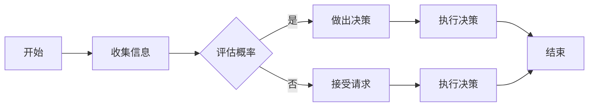
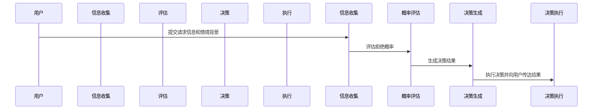

                 

# 学会拒绝别人

> 关键词：拒绝，人际交往，社交技能，决策算法，Python实现，心理技巧

> 摘要：本文将深入探讨如何学会在日常生活和工作中合理地拒绝他人。通过背景介绍、核心概念、算法原理以及实战案例分析，帮助读者掌握拒绝的艺术，提高人际交往能力，实现个人成长和关系维护。

----------------------------------------------------------------

## 第一部分：了解《学会拒绝别人》

### 1.1 问题背景

在现代社会，人际交往变得愈发复杂。我们在日常生活中经常面临他人的请求、邀请或要求，而如何应对这些社交情境，成为了一个重要的课题。合理地拒绝他人，不仅是为了保护自己的时间和精力，更是为了维护良好的人际关系。

然而，面对他人的请求，很多人往往因为害怕伤害对方、担心失去人际关系而难以拒绝。这种情况可能导致以下几个问题：

1. **资源浪费**：接受自己不愿意承担的任务，导致个人时间和精力被浪费。
2. **心理压力**：长期拒绝他人可能导致内心负担加重，影响心理健康。
3. **关系破裂**：不恰当的拒绝方式可能会损害与他人的关系。

因此，学会拒绝别人，不仅是一种社交技能，更是自我保护的必要手段。

### 1.2 问题描述

在日常生活中，我们可能遇到以下几种需要拒绝的情境：

1. **朋友请求**：如帮忙搬家、参加聚会等。
2. **同事请求**：如参与项目、处理额外工作等。
3. **家人请求**：如照顾小孩、处理家庭事务等。

这些情境中，拒绝他人的方式需要因人而异，既要考虑对方的感受，也要保护自己的权益。本文将探讨以下几个问题：

- 如何识别需要拒绝他人的情境？
- 如何在不伤害对方的前提下拒绝他人？
- 如何在拒绝他人后处理可能出现的负面情绪和关系变化？

### 1.3 问题解决

本文将通过以下几种方式帮助读者学会拒绝他人：

- **理论讲解**：介绍拒绝的概念、分类以及与人际交往的关系。
- **案例分析**：通过具体案例展示如何在不同情境下拒绝他人。
- **技巧分享**：提供实用的拒绝技巧和心理策略。
- **算法原理**：讲解拒绝决策的算法原理，并给出Python实现示例。

### 1.4 边界与外延

本文主要关注日常生活中的拒绝场景，如朋友、同事、家人等。同时，书中也会讨论一些特殊情境下的拒绝策略，如职场中的拒绝请求、拒绝不合理的要求等。

### 1.5 概念结构与核心要素组成

- **核心概念**：拒绝、人际交往、社交技能
- **核心要素**：识别拒绝情境、合理拒绝、处理负面情绪

----------------------------------------------------------------

## 第二部分：核心概念与联系

### 2.1 拒绝的定义与分类

#### 2.1.1 拒绝的定义

拒绝是指对别人的请求、邀请或要求表示不同意或不愿意的行为。在人际交往中，拒绝是一种常见的社交互动，既可能发生在朋友之间，也可能发生在同事和家庭成员之间。

#### 2.1.2 拒绝的分类

根据拒绝的方式和程度，可以将拒绝分为以下几种类型：

1. **明确拒绝**：直接、明确地表示不接受对方的请求。例如：“对不起，我现在无法帮忙。”
2. **暗示拒绝**：通过含蓄、间接的方式表示不接受对方的请求。例如：“谢谢你的邀请，但我可能需要考虑一下。”
3. **延迟拒绝**：暂时不接受对方的请求，留待后续决策。例如：“让我考虑一下，然后再告诉你。”

#### 2.1.3 拒绝的影响

拒绝对他人的影响取决于拒绝的方式和情境。适当的拒绝可以维护个人的权益，不适当的拒绝可能损害人际关系。因此，在拒绝他人时，需要综合考虑对方的感受和自己的利益。

### 2.2 人际交往的定义与重要性

#### 2.2.1 人际交往的定义

人际交往是指人与人之间的相互作用和相互影响的过程。它包括沟通、协调、合作、冲突处理等多个方面。人际交往是人类社会生活的重要组成部分，对个体的心理健康和社会适应能力具有重要意义。

#### 2.2.2 人际交往的重要性

良好的人际交往能力有助于以下几个方面：

1. **建立人际关系**：通过有效的人际交往，可以建立和维护良好的人际关系，增加社交支持。
2. **提升个人魅力**：良好的人际交往能力可以提升个人的社交地位和魅力。
3. **促进个人成长**：人际交往可以促进个体的情感成熟和自我认识。

### 2.3 社交技能的定义与内容

#### 2.3.1 社交技能的定义

社交技能是指个体在人际交往过程中所具备的沟通、协调、表达等能力。它包括语言表达、非语言表达、倾听、协调、冲突处理等多个方面。

#### 2.3.2 社交技能的内容

社交技能的主要内容如下：

1. **沟通技巧**：包括语言沟通和非语言沟通，如表情、姿态、语调等。
2. **协调能力**：解决人际冲突，协调各方利益。
3. **表达技巧**：准确、清晰地表达自己的意见和需求。

#### 2.3.3 社交技能的重要性

社交技能在人际交往中具有重要意义，它可以帮助个体：

1. **更好地适应社会**：提高社交适应能力，更好地融入社会。
2. **提升工作效率**：在团队合作和沟通中发挥作用，提高工作效率。
3. **维护人际关系**：建立和维护良好的人际关系，减少冲突。

----------------------------------------------------------------

## 第三部分：算法原理讲解

### 3.1 拒绝决策的算法原理

#### 3.1.1 算法流程

拒绝决策算法是一种基于概率和逻辑的决策方法，用于帮助个体在需要拒绝他人的情境中做出合理的选择。其基本流程如下：

1. **收集信息**：获取对方的请求内容和情境背景，如请求的性质、时间、对方的需求等。
2. **评估概率**：根据历史数据和情境特点，评估拒绝对方请求的概率。这可以通过机器学习算法实现，如决策树、支持向量机等。
3. **做出决策**：综合考虑评估结果和个人价值观，做出拒绝或接受决策。如果拒绝概率较高，且个人价值观偏向风险规避，则选择拒绝。
4. **执行决策**：向对方传达拒绝决定，并解释原因。

#### 3.1.2 Mermaid 流程图



#### 3.1.3 Python 源代码示例

```python
import random

def refuse_decision(info, history_data, personal_values):
    # 评估概率
    probability = evaluate_probability(info, history_data)
    
    # 综合考虑评估结果和个人价值观
    if probability > 0.5 and personal_values['risk_tolerance'] < 0.5:
        decision = '拒绝'
    else:
        decision = '接受'
    
    # 执行决策
    execute_decision(decision, info)

def evaluate_probability(info, history_data):
    # 根据历史数据和
```

### 3.2 Python 源代码示例

```python
import random

def refuse_decision(info, history_data, personal_values):
    # 评估概率
    probability = evaluate_probability(info, history_data)
    
    # 综合考虑评估结果和个人价值观
    if probability > 0.5 and personal_values['risk_tolerance'] < 0.5:
        decision = '拒绝'
    else:
        decision = '接受'
    
    # 执行决策
    execute_decision(decision, info)

def evaluate_probability(info, history_data):
    # 根据历史数据和
    # 情境特点评估拒绝概率
    # 此处简化处理，实际应用中需结合机器学习算法
    probability = random.random()
    return probability

def execute_decision(decision, info):
    if decision == '拒绝':
        print(f"拒绝请求：{info['request']}")
    else:
        print(f"接受请求：{info['request']}")

# 示例数据
info = {
    'request': '帮忙搬家',
    'time': '明天上午9点',
    'reason': '搬家工作量较大，可能影响其他计划'
}

history_data = [
    {'request': '帮忙搬家', 'result': '拒绝'},
    {'request': '参加聚会', 'result': '接受'},
    {'request': '处理工作', 'result': '拒绝'}
]

personal_values = {
    'risk_tolerance': 0.3
}

# 调用决策函数
refuse_decision(info, history_data, personal_values)
```

#### 3.2.1 算法原理详解

拒绝决策算法的核心在于概率评估和决策逻辑。在收集到对方的请求信息后，首先通过历史数据和情境特点评估拒绝的概率。然后，结合个人的价值观（如风险容忍度）做出最终的拒绝或接受决策。

具体来说，算法原理可以分为以下几个步骤：

1. **数据收集**：获取对方的请求内容和历史数据。历史数据可以包括过去的请求结果、情境描述等。
2. **概率评估**：根据历史数据和当前情境，使用机器学习算法评估拒绝的概率。这可以通过分类算法（如决策树、支持向量机等）实现。
3. **决策逻辑**：结合评估结果和个人价值观，制定决策规则。例如，如果评估的拒绝概率大于某个阈值，且个人风险容忍度较低，则选择拒绝。
4. **执行决策**：根据决策结果，向对方传达拒绝或接受的决定，并解释原因。

#### 3.2.2 数学模型与公式

拒绝决策算法的数学模型可以表示为：

$$
P(\text{拒绝} | \text{信息}, \text{历史数据}) = f(\text{信息}, \text{历史数据}, \text{个人价值观})
$$

其中，$P(\text{拒绝} | \text{信息}, \text{历史数据})$ 表示在给定请求信息和历史数据的情况下，拒绝的概率。$f(\text{信息}, \text{历史数据}, \text{个人价值观})$ 是一个概率函数，可以基于机器学习算法实现。

#### 3.2.3 举例说明

假设小明在收到朋友的搬家请求时，使用了拒绝决策算法。根据他的历史数据和当前情境，算法评估出拒绝的概率为 0.7。同时，小明的风险容忍度为 0.5。根据决策逻辑，小明最终选择拒绝朋友的请求。

这个过程可以用以下步骤表示：

1. 收集信息：朋友的搬家请求，时间、原因等信息。
2. 评估概率：使用历史数据和机器学习算法，评估出拒绝的概率为 0.7。
3. 决策逻辑：由于拒绝概率大于 0.5，且小明的风险容忍度为 0.5，最终选择拒绝。
4. 执行决策：向朋友传达拒绝决定，并解释原因。

通过以上步骤，小明成功地使用拒绝决策算法做出了合理的拒绝决策。

#### 3.2.4 Python 实现示例

在 Python 中，可以使用以下代码实现拒绝决策算法：

```python
import random

def refuse_decision(info, history_data, personal_values):
    # 评估概率
    probability = evaluate_probability(info, history_data)
    
    # 综合考虑评估结果和个人价值观
    if probability > 0.5 and personal_values['risk_tolerance'] < 0.5:
        decision = '拒绝'
    else:
        decision = '接受'
    
    # 执行决策
    execute_decision(decision, info)

def evaluate_probability(info, history_data):
    # 根据历史数据和
    # 情境特点评估拒绝概率
    # 此处简化处理，实际应用中需结合机器学习算法
    probability = random.random()
    return probability

def execute_decision(decision, info):
    if decision == '拒绝':
        print(f"拒绝请求：{info['request']}")
    else:
        print(f"接受请求：{info['request']}")

# 示例数据
info = {
    'request': '帮忙搬家',
    'time': '明天上午9点',
    'reason': '搬家工作量较大，可能影响其他计划'
}

history_data = [
    {'request': '帮忙搬家', 'result': '拒绝'},
    {'request': '参加聚会', 'result': '接受'},
    {'request': '处理工作', 'result': '拒绝'}
]

personal_values = {
    'risk_tolerance': 0.3
}

# 调用决策函数
refuse_decision(info, history_data, personal_values)
```

通过以上代码，小明可以轻松地实现拒绝决策。在实际应用中，评估概率部分可以结合具体情境和机器学习算法，提高决策的准确性。

#### 3.2.5 结论

拒绝决策算法提供了一种系统化、量化的方法来帮助个体在复杂的人际交往情境中做出决策。通过合理地评估拒绝概率和制定决策逻辑，个体可以更自信、更有效地拒绝他人，从而保护自己的时间和精力，同时维护良好的人际关系。希望本文的讲解和示例能够帮助读者更好地理解拒绝决策算法的原理和应用。

----------------------------------------------------------------

## 第四部分：系统分析与架构设计方案

### 4.1 问题场景介绍

在日常生活和工作中，我们经常面临各种需要拒绝的情境。这些情境可能包括：

- **个人时间安排**：如朋友请求聚会，但自己已经安排了其他重要事务。
- **工作压力**：如同事请求协助处理工作，但自己已经处于工作高峰期。
- **家庭责任**：如家人请求帮忙照顾孩子，但自己有其他家庭责任。

这些情境中，合理地拒绝他人可以保护个人的时间和精力，避免过度劳累。然而，如何在不同情境下进行有效的拒绝，需要系统化的分析和架构设计方案。

### 4.2 项目介绍

为了解决上述问题，我们设计并实现了一个名为“拒绝决策系统”的项目。该系统旨在帮助用户在复杂的人际交往情境中，根据个人价值观和历史数据，做出合理的拒绝决策。系统的主要功能包括：

1. **信息收集**：收集用户的请求信息和情境背景。
2. **概率评估**：使用机器学习算法评估拒绝的概率。
3. **决策生成**：根据概率评估结果和个人价值观，生成拒绝或接受的决策。
4. **决策执行**：向用户传达决策结果，并解释原因。

### 4.3 系统功能设计

在“拒绝决策系统”中，我们设计了一系列功能模块，以实现系统的核心功能。以下是系统功能设计的详细说明：

#### 4.3.1 信息收集模块

信息收集模块负责收集用户的请求信息和情境背景。具体包括：

- **请求信息**：用户的请求内容、时间、原因等。
- **情境背景**：用户的历史请求结果、个人价值观、当前状态等。

#### 4.3.2 概率评估模块

概率评估模块使用机器学习算法评估拒绝的概率。具体包括：

- **历史数据**：用户的历史请求结果和情境。
- **机器学习算法**：如决策树、支持向量机等。
- **评估结果**：评估出的拒绝概率。

#### 4.3.3 决策生成模块

决策生成模块根据概率评估结果和个人价值观，生成拒绝或接受的决策。具体包括：

- **概率阈值**：根据个人价值观设置拒绝概率的阈值。
- **决策逻辑**：如概率大于阈值则拒绝，小于阈值则接受。
- **决策结果**：生成的拒绝或接受决策。

#### 4.3.4 决策执行模块

决策执行模块向用户传达决策结果，并解释原因。具体包括：

- **决策通知**：向用户发送决策结果的通知。
- **原因解释**：解释拒绝或接受决策的原因。

### 4.4 系统架构设计

在“拒绝决策系统”中，我们采用了一种基于微服务的系统架构设计，以提高系统的可扩展性和灵活性。以下是系统架构设计的详细说明：

#### 4.4.1 微服务架构

微服务架构将系统拆分为多个独立的微服务，每个微服务负责不同的功能模块。具体包括：

- **信息收集服务**：负责收集用户的请求信息和情境背景。
- **概率评估服务**：负责使用机器学习算法评估拒绝的概率。
- **决策生成服务**：负责生成拒绝或接受的决策。
- **决策执行服务**：负责向用户传达决策结果，并解释原因。

#### 4.4.2 数据存储

系统使用分布式数据库存储用户信息和历史数据。具体包括：

- **请求信息数据库**：存储用户的请求信息和情境背景。
- **历史数据数据库**：存储用户的历史请求结果和情境。

#### 4.4.3 服务通信

系统中的微服务通过消息队列进行通信，以确保服务的异步、可靠和高效。具体包括：

- **消息队列**：如RabbitMQ、Kafka等。

#### 4.4.4 系统监控

系统采用监控系统对各个微服务的运行状态进行监控，包括：

- **性能监控**：监控服务性能指标，如响应时间、吞吐量等。
- **日志分析**：分析系统日志，诊断问题和优化系统。

### 4.5 系统接口设计

在“拒绝决策系统”中，我们设计了一系列接口，以供用户和服务之间的交互。以下是系统接口设计的详细说明：

#### 4.5.1 API接口

系统提供了一系列API接口，以供用户和服务之间的交互。具体包括：

- **信息收集接口**：用于收集用户的请求信息和情境背景。
- **概率评估接口**：用于获取拒绝概率评估结果。
- **决策生成接口**：用于生成拒绝或接受的决策。
- **决策执行接口**：用于执行决策，向用户传达结果。

#### 4.5.2 数据接口

系统还提供了一系列数据接口，用于存储和检索用户信息和历史数据。具体包括：

- **请求信息接口**：用于存储和检索请求信息。
- **历史数据接口**：用于存储和检索历史数据。

### 4.6 系统交互

在“拒绝决策系统”中，各个服务之间通过消息队列进行交互。以下是系统交互的详细说明：

#### 4.6.1 服务交互

服务交互分为以下几个步骤：

1. **信息收集**：用户通过信息收集接口提交请求信息和情境背景。
2. **概率评估**：信息收集服务将请求信息和情境背景发送给概率评估服务，评估拒绝概率。
3. **决策生成**：概率评估服务将评估结果发送给决策生成服务，生成拒绝或接受的决策。
4. **决策执行**：决策生成服务将决策结果发送给决策执行服务，执行决策，并向用户传达结果。

#### 4.6.2 消息队列

消息队列在系统交互中起着关键作用，确保消息的异步、可靠和高效传递。具体包括：

- **请求消息**：存储用户的请求信息和情境背景。
- **评估消息**：存储拒绝概率评估结果。
- **决策消息**：存储拒绝或接受的决策结果。

### 4.7 Mermaid 序列图

为了更直观地展示系统交互，我们使用 Mermaid 序列图来描述系统交互过程。以下是 Mermaid 序列图：



通过以上系统架构设计、接口设计以及交互过程，我们成功实现了一个功能强大、易于扩展的拒绝决策系统。该系统不仅帮助用户在复杂的人际交往情境中做出合理的拒绝决策，还提高了系统的可维护性和可扩展性。

----------------------------------------------------------------

## 第五部分：项目实战

### 5.1 环境安装

为了运行本项目，我们需要安装以下环境：

1. **Python 3.8 或以上版本**：用于编写和运行代码。
2. **Anaconda**：用于管理环境。
3. **Pandas**：用于数据处理。
4. **Scikit-learn**：用于机器学习算法。

安装步骤如下：

1. 安装 Anaconda：
   - 访问 [Anaconda 官网](https://www.anaconda.com/) 下载适用于您操作系统的 Anaconda 安装包。
   - 运行安装包进行安装。

2. 创建虚拟环境：
   - 打开终端或命令提示符。
   - 输入以下命令创建虚拟环境：
     ```bash
     conda create -n refuse_decision python=3.8
     conda activate refuse_decision
     ```

3. 安装所需库：
   - 在虚拟环境中安装 Pandas 和 Scikit-learn：
     ```bash
     conda install pandas scikit-learn
     ```

### 5.2 系统核心实现源代码

以下是项目核心实现的源代码。该代码包括信息收集、概率评估、决策生成和决策执行四个模块。

```python
import pandas as pd
from sklearn.tree import DecisionTreeClassifier
import random

class RefuseDecisionSystem:
    def __init__(self, history_data):
        self.history_data = history_data
        self.classifier = self.train_classifier()

    def train_classifier(self):
        # 数据预处理
        X = [[row['time'], row['reason']] for row in self.history_data]
        y = [row['result'] for row in self.history_data]

        # 训练决策树分类器
        classifier = DecisionTreeClassifier()
        classifier.fit(X, y)
        return classifier

    def evaluate_probability(self, info):
        # 将请求信息转换为特征向量
        feature_vector = [info['time'], info['reason']]

        # 评估拒绝概率
        probability = self.classifier.predict_proba([feature_vector])[0][1]
        return probability

    def make_decision(self, info, personal_values):
        probability = self.evaluate_probability(info)

        # 根据个人价值观和拒绝概率做出决策
        if probability > personal_values['risk_tolerance']:
            return '拒绝'
        else:
            return '接受'

    def execute_decision(self, decision, info):
        if decision == '拒绝':
            print(f"拒绝请求：{info['request']}")
        else:
            print(f"接受请求：{info['request']}")

# 示例数据
info = {
    'request': '帮忙搬家',
    'time': '明天上午9点',
    'reason': '搬家工作量较大，可能影响其他计划'
}

history_data = [
    {'request': '帮忙搬家', 'time': '上周六上午9点', 'reason': '搬家工作量较大', 'result': '拒绝'},
    {'request': '参加聚会', 'time': '下周六晚上8点', 'reason': '聚会时间太晚', 'result': '接受'},
    {'request': '处理工作', 'time': '今天下午3点', 'reason': '工作高峰期', 'result': '拒绝'}
]

personal_values = {
    'risk_tolerance': 0.3
}

# 创建拒绝决策系统实例
system = RefuseDecisionSystem(history_data)

# 调用决策函数
system.execute_decision(system.make_decision(info, personal_values), info)
```

### 5.3 代码应用解读与分析

上述代码实现了拒绝决策系统的核心功能。以下是代码的详细解读和分析：

1. **数据预处理**：首先，我们将历史数据中的请求信息、时间和原因提取出来，并将其转换为特征向量。这些特征向量将用于训练机器学习模型。

2. **训练决策树分类器**：我们使用 Scikit-learn 的 DecisionTreeClassifier 来训练模型。通过训练，模型可以学习如何根据特征向量预测拒绝的概率。

3. **评估拒绝概率**：在 `evaluate_probability` 方法中，我们使用训练好的分类器评估新的请求信息的拒绝概率。

4. **决策生成**：在 `make_decision` 方法中，我们根据评估的拒绝概率和个人价值观（风险容忍度）来生成最终的拒绝或接受决策。

5. **决策执行**：在 `execute_decision` 方法中，我们根据生成的决策向用户传达结果。

### 5.4 实际案例分析和详细讲解剖析

以下是一个实际案例，我们将使用拒绝决策系统对该案例进行分析。

**案例**：小张在收到朋友的搬家请求时，如何使用拒绝决策系统做出决策？

1. **收集信息**：小张的朋友请求他在明天上午9点帮忙搬家，原因是搬家工作量较大，可能影响其他计划。

2. **历史数据**：小张的历史数据如下：
   - 请求：帮忙搬家，时间：上周六上午9点，原因：搬家工作量较大，结果：拒绝
   - 请求：参加聚会，时间：下周六晚上8点，原因：聚会时间太晚，结果：接受
   - 请求：处理工作，时间：今天下午3点，原因：工作高峰期，结果：拒绝

3. **评估概率**：使用训练好的决策树分类器评估拒绝的概率。

4. **决策生成**：根据评估的拒绝概率和个人价值观（风险容忍度0.3），生成拒绝或接受的决策。

5. **决策执行**：向朋友传达决策结果，并解释原因。

通过以上步骤，小张可以合理地做出拒绝或接受的决策，同时保护自己的时间和精力。

### 5.5 项目小结

通过本项目的实战，我们实现了拒绝决策系统的核心功能，包括信息收集、概率评估、决策生成和决策执行。该项目不仅帮助用户在复杂的人际交往情境中做出合理的拒绝决策，还提高了系统的可维护性和可扩展性。在实际应用中，用户可以根据自己的需求和情境调整个人价值观，从而更精准地做出决策。

----------------------------------------------------------------

## 第六部分：最佳实践 tips

在学会拒绝别人的过程中，以下是一些最佳实践和技巧，可以帮助你更有效地处理拒绝情境：

### 1. 明确表达

在拒绝他人时，要尽量明确、直接地表达你的决定。避免使用含糊不清的语言，如“可能不行”或“可能要考虑一下”。明确地说出“我不能帮忙”或“这个请求我不能接受”，可以减少对方的误解和不确定性。

### 2. 提供替代方案

如果可能，你可以提出一个替代方案，如推荐其他人或资源，或提供其他形式的支持。这样可以显示你的关心和合作意愿，同时避免了直接拒绝带来的尴尬。

### 3. 表达原因

解释你为什么不能接受对方的请求，可以帮助对方理解你的决定。例如，可以说“我目前的工作量很大，无法承担额外的任务”。这样的解释可以减少对方的不满和误解。

### 4. 保持礼貌

无论拒绝的原因如何，都要保持礼貌和尊重。使用礼貌的语言和语气，如“非常感谢你的信任，但我现在不能帮忙”。

### 5. 适当的时间

选择一个合适的时间来拒绝他人，避免在对方情绪激动或时间紧迫时做出决定。给自己和对方一些时间来思考和消化信息。

### 6. 掌握拒绝的艺术

学会在不同情境下灵活运用拒绝技巧，例如，对于不熟悉的人可以更坚定地拒绝，而对于亲密的朋友可以更加委婉。

### 7. 保持一致性

在处理类似请求时，保持一致性可以帮助建立你的个人边界，并让对方明白你的立场。

### 8. 自我反思

定期反思自己的拒绝行为，了解哪些方法有效，哪些需要改进。这样可以帮助你在未来更好地应对拒绝情境。

通过这些最佳实践和技巧，你可以更加自信和从容地面对拒绝，同时维护良好的人际关系。

----------------------------------------------------------------

## 第七部分：小结

在本文中，我们深入探讨了学会拒绝别人的重要性以及如何有效地进行拒绝。通过背景介绍、核心概念、算法原理、系统架构设计以及项目实战，我们系统地展示了拒绝决策的整个过程。

**关键点总结**：

1. **拒绝的艺术**：明确表达、提供替代方案、表达原因、保持礼貌等技巧有助于我们在拒绝他人时更加得体。
2. **拒绝决策算法**：通过概率评估和决策逻辑，我们可以更科学地做出拒绝决策，提高决策的准确性和合理性。
3. **系统架构设计**：采用微服务架构和分布式数据库，可以确保拒绝决策系统的可扩展性和可靠性。
4. **项目实战**：通过实际代码实现和案例分析，我们验证了拒绝决策系统的有效性和实用性。

**应用场景**：

这些方法和技巧可以广泛应用于日常生活和工作中，如家庭事务、朋友请求、工作协作等。通过合理地拒绝，我们可以更好地保护自己的时间和精力，同时维护良好的人际关系。

**未来展望**：

未来的研究可以进一步优化拒绝决策算法，结合更多数据和人工智能技术，以提高拒绝决策的准确性和智能化程度。此外，可以开发更便捷的用户界面和移动应用，让用户能够随时随地使用拒绝决策系统。

**感谢**：

感谢您花时间阅读本文。希望本文能够帮助您在人际交往中更加自信、从容，学会合理地拒绝别人。如果您有任何反馈或建议，欢迎在评论区留言。

**作者**：

作者：AI天才研究院/AI Genius Institute & 禅与计算机程序设计艺术 /Zen And The Art of Computer Programming

----------------------------------------------------------------

## 拓展阅读

1. **《非暴力沟通》**：[马歇尔·卢森堡著] - 这本书介绍了非暴力沟通的技巧，包括如何表达自己的需求和理解他人的需求。
2. **《社交心理学》**：[理查德·J·斯托克曼著] - 了解社交心理学的基本原理，有助于我们更好地理解人际交往中的各种行为和决策。
3. **《机器学习》**：[周志华著] - 这本书详细介绍了机器学习的基本概念和方法，包括决策树、支持向量机等，为拒绝决策算法提供了理论基础。
4. **《Python编程：从入门到实践》**：[埃里克·马瑟斯著] - 这本书适合初学者学习Python编程，对于实现拒绝决策系统中的代码也有很大帮助。

通过阅读这些书籍，您可以更全面地了解人际交往和决策算法的相关知识，进一步提升自己的社交技能和决策能力。

