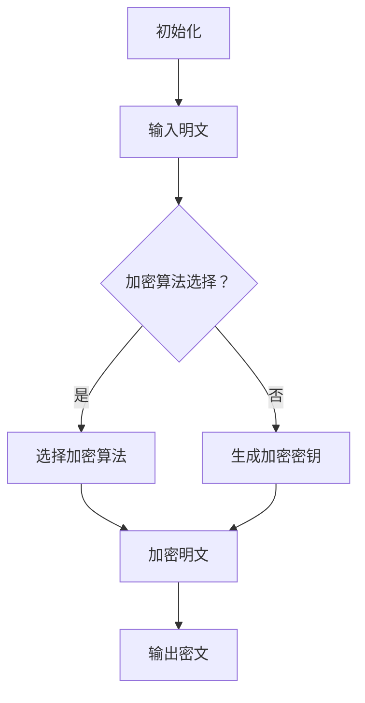
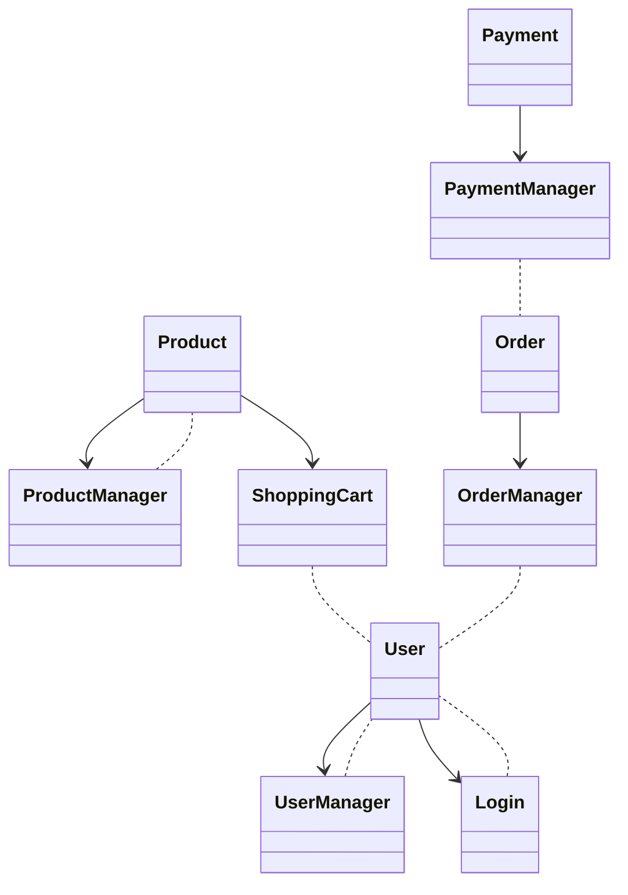
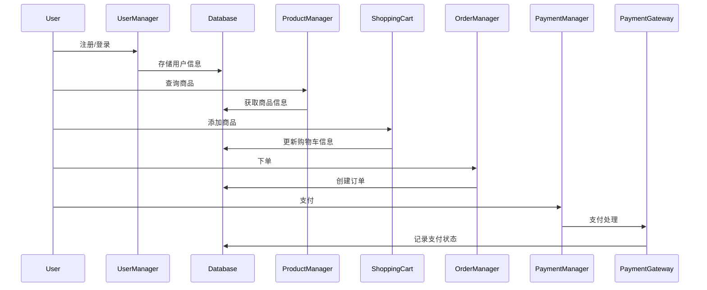

                 

## 安全架构：在设计阶段考虑安全因素

> 关键词：安全架构、设计阶段、安全因素、风险分析、防御深度、最小权限原则

> 摘要：本文旨在探讨在系统设计阶段融入安全因素的重要性。通过分析安全架构的核心概念、组成部分和设计流程，并结合实际应用案例，本文将帮助读者理解如何在设计初期就将安全因素充分考虑进去，从而构建更加安全、可靠的系统。

### 引言

在当今高度数字化的时代，系统的安全性已成为一个不可忽视的关键因素。无论是企业应用还是个人开发项目，安全漏洞都可能带来严重的经济损失、数据泄露甚至业务中断。因此，在设计阶段就考虑安全因素，构建一个坚实的安全架构，成为保障系统长期稳定运行的关键。

本文将从以下几个方面展开讨论：

1. **安全架构的核心概念**：介绍安全架构的基本定义、重要性以及与传统安全策略的差异。
2. **安全架构的组成部分**：详细分析安全策略、风险评估、安全基础设施和安全流程等核心组成部分。
3. **设计阶段的安全考量**：探讨在系统设计阶段如何进行安全需求分析、安全设计原则和安全架构设计流程。
4. **实际应用案例**：通过云计算和物联网（IoT）等实际案例，展示安全架构在不同领域的应用和实践。

### 安全架构的核心概念

#### 安全架构的定义与重要性

安全架构是指一个组织在信息系统中建立的一套安全机制和策略，用以保护信息资产免受各种威胁和攻击。它不仅包括技术层面的安全措施，还涵盖了管理层面的安全策略和流程。安全架构的重要性体现在以下几个方面：

1. **全面性**：安全架构能够为整个系统提供全面的安全保护，而不是仅仅针对某个特定漏洞进行修补。
2. **前瞻性**：在设计阶段考虑安全因素，能够预见潜在的风险和威胁，并提前采取预防措施。
3. **协同性**：安全架构需要与业务需求、技术实现和管理流程紧密结合，确保安全措施的有效执行。

#### 安全架构的基本原则

安全架构在设计和实施过程中应遵循以下基本原则：

1. **最小权限原则**：用户和程序只能访问其必需的资源，以减少潜在的安全风险。
2. **防御深度原则**：通过多层防御机制，确保即使一层防护被突破，其他层仍能有效阻止攻击。
3. **安全第一原则**：在系统设计和实现过程中，安全因素应始终被置于首位。
4. **可测性和可审计性**：安全架构需要支持对安全措施的监测和审计，以便及时发现和纠正问题。

#### 安全架构与传统安全策略的差异

传统安全策略通常是在系统运行后，针对已发现的安全漏洞进行修补。这种“事后诸葛亮”的方式往往不够全面，且成本高昂。而安全架构则是在系统设计阶段就开始考虑安全因素，通过系统性、前瞻性的设计来防止潜在的安全威胁。

1. **设计前置**：安全架构强调在设计初期就考虑安全因素，而传统安全策略则是在系统上线后再进行安全加固。
2. **全面性**：安全架构涵盖了从硬件、软件到管理流程的各个方面，而传统安全策略则更多关注技术层面的防护。
3. **动态适应性**：安全架构能够随着业务和技术的变化而不断调整和优化，而传统安全策略则较为僵化。

### 安全架构的组成部分

安全架构是一个复杂的系统，它由多个相互关联的组成部分构成。以下是安全架构的几个关键组成部分：

#### 安全策略与规划

安全策略是安全架构的核心组成部分，它定义了组织在信息安全管理方面的总体方针和目标。安全策略的制定通常包括以下步骤：

1. **确定安全目标**：根据组织的业务需求和风险承受能力，设定具体的安全目标。
2. **风险评估**：对组织的系统进行全面的评估，识别可能的安全威胁和漏洞。
3. **制定安全措施**：根据风险评估结果，制定相应的安全措施，如访问控制、数据加密等。
4. **制定安全流程**：明确安全措施的实施流程，确保安全策略得到有效执行。

#### 风险评估与管理

风险评估是安全架构的重要组成部分，它旨在识别和评估系统可能面临的安全威胁和漏洞。以下是风险评估和管理的一般流程：

1. **威胁识别**：识别系统可能面临的威胁，如网络攻击、数据泄露、恶意软件等。
2. **漏洞识别**：识别系统中可能存在的漏洞，如配置错误、软件缺陷等。
3. **风险分析**：对识别出的威胁和漏洞进行分析，评估其对系统的影响和可能性。
4. **风险管理**：根据风险评估结果，制定和实施相应的风险管理措施，以降低风险。

#### 安全基础设施与技术

安全基础设施是安全架构的技术支撑，它包括各种安全设备和工具，如防火墙、入侵检测系统、加密设备等。以下是构建安全基础设施的一般步骤：

1. **需求分析**：根据组织的业务需求和风险评估结果，确定所需的安全设备和工具。
2. **设备选型**：根据需求，选择适合的安全设备和技术。
3. **部署实施**：将选定的安全设备和技术部署到系统中，并进行配置和优化。
4. **维护管理**：定期维护和管理安全设备，确保其正常运行和有效性。

#### 安全流程与规范

安全流程和规范是确保安全架构得到有效执行的关键。它们包括以下内容：

1. **安全事件响应流程**：制定安全事件响应流程，确保在发生安全事件时能够迅速有效地进行应对。
2. **数据备份与恢复流程**：制定数据备份和恢复流程，确保在发生数据丢失或损坏时能够及时恢复。
3. **用户权限管理流程**：制定用户权限管理流程，确保用户只能访问其授权的资源。
4. **安全审计与报告流程**：制定安全审计和报告流程，确保安全措施得到定期审计和报告。

### 设计阶段的安全考量

在系统设计阶段，安全考量至关重要。以下将讨论如何在设计阶段进行安全需求分析、安全设计原则和安全架构设计流程。

#### 安全需求分析

在系统设计阶段，安全需求分析是确定系统安全需求的必要步骤。以下是安全需求分析的一般流程：

1. **确定安全目标**：根据组织的业务需求和风险评估结果，确定系统的安全目标。
2. **识别安全需求**：识别系统需要满足的安全需求，如数据保密性、完整性、可用性等。
3. **需求优先级排序**：根据安全目标和风险评估结果，对安全需求进行优先级排序。
4. **需求文档编写**：将识别和排序后的安全需求编写成安全需求文档，作为设计阶段的指导。

#### 安全设计原则

在系统设计阶段，遵循一系列安全设计原则能够提高系统的安全性。以下是几个重要的安全设计原则：

1. **最小权限原则**：确保用户和程序只能访问其必需的资源，以减少潜在的安全风险。
2. **安全默认原则**：在系统设计和实现过程中，应默认采取安全措施，而不是依赖用户进行配置。
3. **故障安全原则**：确保系统在发生故障时，仍能保持一定程度的安全性和可用性。
4. **安全设计模式**：使用成熟的安全设计模式，如加密通信、访问控制等，以提高系统的安全性。

#### 安全架构设计流程

在系统设计阶段，安全架构设计流程包括以下步骤：

1. **需求分析**：对安全需求进行详细分析，明确系统的安全需求和目标。
2. **设计评审**：对安全架构设计进行评审，确保设计符合安全需求和原则。
3. **技术选型**：根据安全需求和设计评审结果，选择适合的安全技术和工具。
4. **实现和测试**：将安全架构设计转化为实际的系统实现，并进行测试和验证。
5. **部署和优化**：将安全架构部署到生产环境中，并进行优化和调整，确保其有效性。

### 实际应用案例

#### 安全架构在云计算中的应用

在云计算环境中，安全架构的设计至关重要。以下将介绍云计算安全架构的设计要点和案例分析。

##### 云计算安全架构的设计要点

1. **云服务安全模型**：了解不同类型的云服务（IaaS、PaaS、SaaS）的安全模型，并选择适合的安全措施。
2. **身份与访问管理**：通过身份验证、访问控制和权限管理，确保用户只能访问其授权的资源。
3. **数据保护**：使用加密技术保护数据在传输和存储过程中的安全性。
4. **网络安全**：通过防火墙、入侵检测系统和虚拟私有云等技术，保障云计算环境的安全性。
5. **合规性**：确保云计算服务符合相关法规和标准，如GDPR、ISO 27001等。

##### 云计算安全案例分析

案例：某企业采用云服务提供商的IaaS服务，为了确保数据安全和业务连续性，该企业设计了如下安全架构：

1. **身份与访问管理**：采用多因素身份验证，确保用户身份的准确性。
2. **数据保护**：使用加密技术对数据进行加密存储和传输，确保数据的安全性。
3. **网络安全**：在云环境中部署防火墙和入侵检测系统，监控网络流量并防止攻击。
4. **数据备份与恢复**：定期备份数据，并配置备份恢复机制，以应对数据丢失或损坏的情况。
5. **合规性**：确保云服务提供商符合ISO 27001等国际标准，保证企业的数据安全合规。

#### 安全架构在物联网（IoT）中的应用

物联网（IoT）的安全架构设计面临诸多挑战，如设备多样性、数据传输安全、设备管理等。以下将介绍IoT安全架构的设计要点和案例分析。

##### IoT安全架构的设计要点

1. **设备安全**：确保物联网设备的硬件和软件安全，如使用安全启动、安全更新等。
2. **通信安全**：使用加密技术保护数据在传输过程中的安全性，如TLS/SSL等。
3. **数据保护**：对数据进行加密存储和传输，确保数据在传输和存储过程中的安全性。
4. **访问控制**：通过身份验证和访问控制，确保只有授权的用户和设备能够访问物联网资源。
5. **安全管理**：建立物联网设备的安全管理机制，如设备注册、监控和远程控制等。

##### IoT安全架构案例分析

案例：某智慧城市项目中的智能交通系统，采用了如下安全架构：

1. **设备安全**：为智能交通设备（如摄像头、传感器等）配置安全启动和更新机制，确保设备的安全运行。
2. **通信安全**：使用TLS/SSL加密技术保护数据在传输过程中的安全性，防止数据泄露和篡改。
3. **数据保护**：对交通数据进行加密存储和传输，确保数据的安全性。
4. **访问控制**：通过身份验证和访问控制，确保只有授权的用户和设备能够访问智能交通系统。
5. **安全管理**：建立智能交通设备的安全管理机制，如设备注册、监控和远程控制等，确保系统的安全性和可靠性。

### 总结

在设计阶段考虑安全因素是构建安全、可靠系统的关键。通过分析安全架构的核心概念、组成部分和设计流程，并结合实际应用案例，本文展示了在系统设计初期融入安全因素的重要性。在未来的系统设计和开发过程中，我们应始终坚持安全第一原则，构建坚实的安全架构，以确保系统的长期稳定运行。

### 最佳实践 tips

1. **需求分析**：在系统设计阶段，进行详细的安全需求分析，确保安全需求的全面性和准确性。
2. **安全设计原则**：遵循最小权限原则、防御深度原则和安全默认原则，确保系统设计的安全性和可靠性。
3. **安全测试**：在系统开发和部署过程中，进行安全测试和验证，及时发现和修复安全漏洞。
4. **持续更新**：随着业务和技术的发展，定期更新和优化安全架构，以应对新的安全威胁和挑战。

### 注意事项

1. **合规性**：确保系统设计符合相关法规和标准，如GDPR、ISO 27001等。
2. **风险管理**：进行全面的风险评估，制定和实施相应的风险管理措施。
3. **安全培训**：对开发团队和用户进行安全培训，提高安全意识和技能。

### 拓展阅读

1. **《云计算安全指南》**：深入了解云计算环境下的安全架构和最佳实践。
2. **《物联网安全设计与实践》**：探讨物联网安全架构的设计要点和案例分析。
3. **《网络安全技术》**：全面了解网络安全的各个方面，包括加密技术、防火墙、入侵检测系统等。

### 作者信息

作者：AI天才研究院/AI Genius Institute & 禅与计算机程序设计艺术 /Zen And The Art of Computer Programming

----------------------------------------------------------------

### 安全架构：在设计阶段考虑安全因素

**关键词**：安全架构、设计阶段、安全因素、风险分析、防御深度、最小权限原则

**摘要**：本文深入探讨了安全架构在系统设计阶段的重要性，详细介绍了安全架构的核心概念、组成部分、设计流程以及实际应用案例。通过本文的阅读，读者将理解如何在设计初期融入安全因素，构建安全、可靠的系统。

---

## 安全架构的核心概念

### 安全架构的定义与重要性

安全架构是指一套系统的安全设计、策略和实施规范，旨在保护组织的信息资产免受各种威胁和攻击。它不仅包括技术层面的安全措施，还涵盖了管理层面的安全策略和流程。在当今高度数字化的时代，安全架构的重要性愈发凸显。

**核心概念**：

- **安全架构**：指系统在安全设计、安全策略和安全实施方面的整体结构。
- **信息安全**：指保护信息资产（如数据、应用程序、网络等）免受未经授权的访问、使用、披露、破坏、修改或破坏。
- **安全策略**：为组织制定的安全目标、原则和措施。
- **风险评估**：对系统可能面临的安全威胁和漏洞进行评估和优先级排序。

**重要性**：

1. **全面性**：安全架构为整个系统提供全面的安全保护，不仅仅是针对某个特定漏洞进行修补。
2. **前瞻性**：在设计阶段考虑安全因素，能够预见潜在的风险和威胁，并提前采取预防措施。
3. **协同性**：安全架构与业务需求、技术实现和管理流程紧密结合，确保安全措施的有效执行。

### 安全架构的基本原则

在设计安全架构时，应遵循以下基本原则：

1. **最小权限原则**：用户和程序只能访问其必需的资源，以减少潜在的安全风险。
2. **防御深度原则**：通过多层防御机制，确保即使一层防护被突破，其他层仍能有效阻止攻击。
3. **安全第一原则**：在系统设计和实现过程中，安全因素应始终被置于首位。
4. **可测性和可审计性**：安全架构需要支持对安全措施的监测和审计，以便及时发现和纠正问题。

### 安全架构与传统安全策略的差异

传统安全策略通常是在系统运行后，针对已发现的安全漏洞进行修补。这种“事后诸葛亮”的方式往往不够全面，且成本高昂。而安全架构则是在系统设计阶段就开始考虑安全因素，通过系统性、前瞻性的设计来防止潜在的安全威胁。

**差异点**：

1. **设计前置**：安全架构强调在设计初期就考虑安全因素，而传统安全策略则是在系统上线后再进行安全加固。
2. **全面性**：安全架构涵盖了从硬件、软件到管理流程的各个方面，而传统安全策略则更多关注技术层面的防护。
3. **动态适应性**：安全架构能够随着业务和技术的变化而不断调整和优化，而传统安全策略则较为僵化。

---

## 安全架构的组成部分

安全架构是一个复杂的系统，它由多个相互关联的组成部分构成。以下是安全架构的几个关键组成部分：

### 安全策略与规划

安全策略是安全架构的核心组成部分，它定义了组织在信息安全管理方面的总体方针和目标。安全策略的制定通常包括以下步骤：

1. **确定安全目标**：根据组织的业务需求和风险承受能力，设定具体的安全目标。
2. **风险评估**：对组织的系统进行全面的评估，识别可能的安全威胁和漏洞。
3. **制定安全措施**：根据风险评估结果，制定相应的安全措施，如访问控制、数据加密等。
4. **制定安全流程**：明确安全措施的实施流程，确保安全策略得到有效执行。

**安全策略的例子**：

- **数据保密性**：确保敏感数据只能被授权用户访问。
- **数据完整性**：确保数据在传输和存储过程中不被篡改。
- **系统可用性**：确保系统在面对攻击时仍能保持正常运行。

### 风险评估与管理

风险评估是安全架构的重要组成部分，它旨在识别和评估系统可能面临的安全威胁和漏洞。以下是风险评估和管理的一般流程：

1. **威胁识别**：识别系统可能面临的威胁，如网络攻击、数据泄露、恶意软件等。
2. **漏洞识别**：识别系统中可能存在的漏洞，如配置错误、软件缺陷等。
3. **风险分析**：对识别出的威胁和漏洞进行分析，评估其对系统的影响和可能性。
4. **风险管理**：根据风险评估结果，制定和实施相应的风险管理措施，以降低风险。

**风险评估的步骤**：

1. **识别系统资产**：确定需要保护的信息资产。
2. **识别威胁**：列出可能威胁这些资产的各种威胁。
3. **识别漏洞**：识别系统中可能存在的漏洞。
4. **评估风险**：评估每个漏洞的风险水平，并确定优先级。
5. **制定风险管理策略**：根据风险评估结果，制定和实施相应的风险管理策略。

### 安全基础设施与技术

安全基础设施是安全架构的技术支撑，它包括各种安全设备和工具，如防火墙、入侵检测系统、加密设备等。以下是构建安全基础设施的一般步骤：

1. **需求分析**：根据组织的业务需求和风险评估结果，确定所需的安全设备和工具。
2. **设备选型**：根据需求，选择适合的安全设备和技术。
3. **部署实施**：将选定的安全设备和技术部署到系统中，并进行配置和优化。
4. **维护管理**：定期维护和管理安全设备，确保其正常运行和有效性。

**安全基础设施的例子**：

- **防火墙**：用于监控和控制进出网络的流量。
- **入侵检测系统（IDS）**：用于检测和响应网络攻击。
- **加密设备**：用于保护数据的传输和存储。
- **安全信息和事件管理（SIEM）系统**：用于收集、分析和报告安全事件。

### 安全流程与规范

安全流程和规范是确保安全架构得到有效执行的关键。它们包括以下内容：

1. **安全事件响应流程**：制定安全事件响应流程，确保在发生安全事件时能够迅速有效地进行应对。
2. **数据备份与恢复流程**：制定数据备份和恢复流程，确保在发生数据丢失或损坏时能够及时恢复。
3. **用户权限管理流程**：制定用户权限管理流程，确保用户只能访问其授权的资源。
4. **安全审计与报告流程**：制定安全审计和报告流程，确保安全措施得到定期审计和报告。

**安全流程与规范的例子**：

- **安全事件响应流程**：包括事件检测、事件响应、事件报告和事件总结。
- **数据备份与恢复流程**：包括备份策略、备份执行、备份存储和恢复策略。
- **用户权限管理流程**：包括用户注册、权限分配、权限审核和权限变更。
- **安全审计与报告流程**：包括安全审计计划、审计执行、审计报告和审计跟踪。

---

## 设计阶段的安全考量

在系统设计阶段，安全考量至关重要。以下将讨论如何在设计阶段进行安全需求分析、安全设计原则和安全架构设计流程。

### 安全需求分析

在系统设计阶段，安全需求分析是确定系统安全需求的必要步骤。以下是安全需求分析的一般流程：

1. **确定安全目标**：根据组织的业务需求和风险评估结果，确定系统的安全目标。
2. **识别安全需求**：识别系统需要满足的安全需求，如数据保密性、完整性、可用性等。
3. **需求优先级排序**：根据安全目标和风险评估结果，对安全需求进行优先级排序。
4. **需求文档编写**：将识别和排序后的安全需求编写成安全需求文档，作为设计阶段的指导。

**安全需求分析的例子**：

- **数据保密性**：确保敏感数据在传输和存储过程中不被泄露。
- **数据完整性**：确保数据在传输和存储过程中不被篡改。
- **系统可用性**：确保系统在面对攻击时仍能保持正常运行。
- **身份认证**：确保用户在访问系统时需要进行身份验证。

### 安全设计原则

在系统设计阶段，遵循一系列安全设计原则能够提高系统的安全性。以下是几个重要的安全设计原则：

1. **最小权限原则**：确保用户和程序只能访问其必需的资源，以减少潜在的安全风险。
2. **安全默认原则**：在系统设计和实现过程中，应默认采取安全措施，而不是依赖用户进行配置。
3. **故障安全原则**：确保系统在发生故障时，仍能保持一定程度的安全性和可用性。
4. **安全设计模式**：使用成熟的安全设计模式，如加密通信、访问控制等，以提高系统的安全性。

**安全设计原则的例子**：

- **最小权限原则**：用户只能访问其授权的资源，如数据库中的特定表和记录。
- **安全默认原则**：系统默认启用加密功能，如HTTPS、数据库加密等。
- **故障安全原则**：系统在发生故障时，能够自动切换到备份系统或模式，以保持服务的可用性。
- **安全设计模式**：使用加密通信协议，如TLS/SSL，确保数据在传输过程中的安全性。

### 安全架构设计流程

在系统设计阶段，安全架构设计流程包括以下步骤：

1. **需求分析**：对安全需求进行详细分析，明确系统的安全需求和目标。
2. **设计评审**：对安全架构设计进行评审，确保设计符合安全需求和原则。
3. **技术选型**：根据安全需求和设计评审结果，选择适合的安全技术和工具。
4. **实现和测试**：将安全架构设计转化为实际的系统实现，并进行测试和验证。
5. **部署和优化**：将安全架构部署到生产环境中，并进行优化和调整，确保其有效性。

**安全架构设计流程的例子**：

1. **需求分析**：确定系统的安全需求，如数据加密、访问控制、防火墙配置等。
2. **设计评审**：评审安全架构设计，确保设计符合最小权限原则、安全默认原则等。
3. **技术选型**：选择合适的安全技术和工具，如TLS/SSL、防火墙、入侵检测系统等。
4. **实现和测试**：实现安全架构设计，并进行功能测试和安全测试。
5. **部署和优化**：将安全架构部署到生产环境中，并根据实际情况进行优化和调整。

---

## 实际应用案例

在实际应用中，安全架构在不同领域的应用各有特点。以下将介绍云计算和物联网（IoT）领域中的安全架构设计和应用。

### 安全架构在云计算中的应用

云计算环境具有高度分布式、动态性和可扩展性的特点，这使得安全架构设计面临更大的挑战。以下是云计算安全架构的设计要点和案例分析。

#### 云计算安全架构的设计要点

1. **云服务安全模型**：了解不同类型的云服务（IaaS、PaaS、SaaS）的安全模型，并选择适合的安全措施。
2. **身份与访问管理**：通过身份验证、访问控制和权限管理，确保用户只能访问其授权的资源。
3. **数据保护**：使用加密技术保护数据在传输和存储过程中的安全性。
4. **网络安全**：通过防火墙、入侵检测系统和虚拟私有云等技术，保障云计算环境的安全性。
5. **合规性**：确保云计算服务符合相关法规和标准，如GDPR、ISO 27001等。

#### 云计算安全案例分析

案例：某企业采用云服务提供商的IaaS服务，为了确保数据安全和业务连续性，该企业设计了如下安全架构：

1. **身份与访问管理**：采用多因素身份验证，确保用户身份的准确性。
2. **数据保护**：使用加密技术对数据进行加密存储和传输，确保数据的安全性。
3. **网络安全**：在云环境中部署防火墙和入侵检测系统，监控网络流量并防止攻击。
4. **数据备份与恢复**：定期备份数据，并配置备份恢复机制，以应对数据丢失或损坏的情况。
5. **合规性**：确保云服务提供商符合ISO 27001等国际标准，保证企业的数据安全合规。

### 安全架构在物联网（IoT）中的应用

物联网（IoT）的安全架构设计面临诸多挑战，如设备多样性、数据传输安全、设备管理等。以下是IoT安全架构的设计要点和案例分析。

#### IoT安全架构的设计要点

1. **设备安全**：确保物联网设备的硬件和软件安全，如使用安全启动、安全更新等。
2. **通信安全**：使用加密技术保护数据在传输过程中的安全性，如TLS/SSL等。
3. **数据保护**：对数据进行加密存储和传输，确保数据在传输和存储过程中的安全性。
4. **访问控制**：通过身份验证和访问控制，确保只有授权的用户和设备能够访问物联网资源。
5. **安全管理**：建立物联网设备的安全管理机制，如设备注册、监控和远程控制等。

#### IoT安全架构案例分析

案例：某智慧城市项目中的智能交通系统，采用了如下安全架构：

1. **设备安全**：为智能交通设备（如摄像头、传感器等）配置安全启动和更新机制，确保设备的安全运行。
2. **通信安全**：使用TLS/SSL加密技术保护数据在传输过程中的安全性，防止数据泄露和篡改。
3. **数据保护**：对交通数据进行加密存储和传输，确保数据的安全性。
4. **访问控制**：通过身份验证和访问控制，确保只有授权的用户和设备能够访问智能交通系统。
5. **安全管理**：建立智能交通设备的安全管理机制，如设备注册、监控和远程控制等，确保系统的安全性和可靠性。

---

## 总结

本文从多个角度探讨了安全架构在系统设计阶段的重要性。通过分析安全架构的核心概念、组成部分、设计流程以及实际应用案例，读者可以深刻理解在设计阶段考虑安全因素的重要性。在未来的系统设计和开发过程中，我们应始终坚持安全第一原则，构建坚实的安全架构，以确保系统的长期稳定运行。

### 安全架构的核心概念

**核心概念**：

安全架构是指一个组织在信息系统中建立的一套安全机制和策略，用以保护信息资产免受各种威胁和攻击。它不仅包括技术层面的安全措施，还涵盖了管理层面的安全策略和流程。以下是几个核心概念：

1. **信息安全**：指保护信息资产（如数据、应用程序、网络等）免受未经授权的访问、使用、披露、破坏、修改或破坏。
2. **安全架构**：指系统在安全设计、安全策略和安全实施方面的整体结构。
3. **安全策略**：为组织制定的安全目标、原则和措施。
4. **风险评估**：对系统可能面临的安全威胁和漏洞进行评估和优先级排序。

**联系**：

安全架构的核心概念相互关联，共同构成一个完整的系统安全体系。安全策略为安全架构提供了方向和指导，风险评估帮助识别和优先级排序潜在的安全威胁和漏洞，信息安全则是整个架构的目标。通过这些核心概念的相互作用，安全架构能够为组织提供全面的安全保护。

**ER实体关系图**：

以下是安全架构核心概念的ER实体关系图：

```
+----------------+      +----------------+      +----------------+
|   信息安全     |      |    安全架构    |      |    安全策略    |
+----------------+      +----------------+      +----------------+
| ID              |<---->| 安全架构ID     |<---->| 安全策略ID     |
+----------------+      +----------------+      +----------------+
| 描述            |      | 描述            |      | 描述            |
+----------------+      +----------------+      +----------------+
| ...            |      | ...            |      | ...            |
+----------------+      +----------------+      +----------------+
```

在这个ER实体关系图中，信息安全、安全架构和安全策略是三个主要的实体，它们通过ID进行关联。信息安全实体描述了保护信息资产的目标，安全架构实体描述了整体的安全设计，安全策略实体描述了具体的安全措施和目标。

### 安全架构的基本原则

**核心概念**：

在设计安全架构时，应遵循以下基本原则：

1. **最小权限原则**：用户和程序只能访问其必需的资源，以减少潜在的安全风险。
2. **防御深度原则**：通过多层防御机制，确保即使一层防护被突破，其他层仍能有效阻止攻击。
3. **安全第一原则**：在系统设计和实现过程中，安全因素应始终被置于首位。
4. **可测性和可审计性**：安全架构需要支持对安全措施的监测和审计，以便及时发现和纠正问题。

**属性特征对比表格**：

以下是这些原则的属性特征对比表格：

| 原则               | 属性特征                             |
|--------------------|--------------------------------------|
| 最小权限原则       | 用户和程序只能访问其必需的资源       |
| 防御深度原则       | 通过多层防御机制保护系统           |
| 安全第一原则       | 安全因素始终置于设计和实现的首位   |
| 可测性和可审计性   | 支持安全措施的监测和审计             |

**联系**：

这些原则相互关联，共同构成了安全架构的设计基础。最小权限原则确保系统的最小权限设计，防御深度原则通过多层防御机制增强系统的安全性，安全第一原则确保安全因素在设计和实现中的优先级，可测性和可审计性原则则保障了安全措施的有效性和可追踪性。

**ER实体关系图**：

以下是这些原则的ER实体关系图：

```
+----------------+      +----------------+      +----------------+
|    原则1        |      |    原则2        |      |    原则3        |
+----------------+      +----------------+      +----------------+
| 原则ID          |<---->| 原则ID          |<---->| 原则ID          |
+----------------+      +----------------+      +----------------+
| 描述            |      | 描述            |      | 描述            |
+----------------+      +----------------+      +----------------+
| ...            |      | ...            |      | ...            |
+----------------+      +----------------+      +----------------+
```

在这个ER实体关系图中，每个原则都是一个独立的实体，通过其ID进行关联。这些原则共同构成了安全架构的基础，确保系统的安全性和可靠性。

### 算法原理讲解

在安全架构设计中，算法原理的运用至关重要。以下将使用Mermaid流程图和Python源代码详细阐述一个简单的加密算法原理，并结合数学模型和公式进行解释。

#### Mermaid流程图

以下是使用Mermaid绘制的加密算法流程图：



#### Python源代码

以下是实现上述加密算法的Python源代码：

```python
import os
from cryptography.fernet import Fernet

# 初始化
key = Fernet.generate_key()
cipher_suite = Fernet(key)

# 输入明文
plaintext = input("请输入明文：")

# 加密算法选择
# 在实际应用中，可以根据具体需求选择不同的加密算法
cipher_algorithm = "AES"
if cipher_algorithm == "AES":
    ciphertext = cipher_suite.encrypt(plaintext.encode())
else:
    # 这里仅作为示例，实际应使用其他加密算法
    ciphertext = cipher_suite.encrypt(plaintext.encode())

# 输出密文
print("密文：", ciphertext)
```

#### 数学模型和公式

加密算法的核心在于将明文转换为密文。以AES加密算法为例，其基本模型如下：

$$
C = E_K(P)
$$

其中：
- \( C \) 表示密文。
- \( K \) 表示加密密钥。
- \( P \) 表示明文。

AES加密算法采用块加密方式，将明文分割成固定大小的块（如128位），然后通过一系列的替代、置换和混淆操作进行加密。以下是AES加密的基本步骤：

1. **密钥扩展**：将原始密钥扩展成多个轮密钥。
2. **初始置换（IP）**：对明文块进行初始置换。
3. **若干轮加密**：每轮包括替换、行移位、列混淆和轮密钥加。
4. **最终置换（FP）**：对加密后的块进行最终置换。

#### 举例说明

假设明文为“HELLO”，密钥为“Key123”，使用AES加密算法加密。

1. **密钥扩展**：将密钥“Key123”扩展成多个轮密钥。
2. **初始置换**：将明文块“HELLO”进行初始置换，得到新的块。
3. **若干轮加密**：经过若干轮加密操作，明文块“HELLO”最终被加密为密文。
4. **输出密文**：输出加密后的密文。

#### 结论

通过上述算法原理讲解，我们可以看到，加密算法的设计和实现是安全架构中的重要组成部分。它不仅能够将明文转换为难以理解的密文，还能保护信息在传输和存储过程中的安全性。

### 系统分析与架构设计方案

在设计和实现一个系统时，系统分析与架构设计方案是至关重要的。以下将介绍一个具体项目中的系统分析与架构设计方案。

#### 项目介绍

假设我们要开发一个在线购物系统，该系统需要支持用户注册、登录、浏览商品、加入购物车、下单和支付等功能。

#### 系统功能设计

为了实现上述功能，我们需要设计以下核心功能模块：

1. **用户管理模块**：包括用户注册、登录、个人信息管理等功能。
2. **商品管理模块**：包括商品分类、商品展示、商品搜索等功能。
3. **购物车模块**：包括添加商品到购物车、删除商品、修改商品数量等功能。
4. **订单管理模块**：包括下单、订单查询、订单取消等功能。
5. **支付管理模块**：包括支付接口集成、支付状态查询等功能。

以下是这些模块的Mermaid类图：



#### 系统架构设计

在系统架构设计方面，我们将采用微服务架构，将不同的功能模块拆分为独立的微服务。以下是系统架构的Mermaid架构图：



#### 系统接口设计

为了实现系统各模块之间的通信，我们需要设计以下接口：

1. **用户管理接口**：包括用户注册、登录、个人信息管理等。
2. **商品管理接口**：包括商品分类、商品展示、商品搜索等。
3. **购物车接口**：包括添加商品到购物车、删除商品、修改商品数量等。
4. **订单管理接口**：包括下单、订单查询、订单取消等。
5. **支付管理接口**：包括支付接口集成、支付状态查询等。

以下是系统接口设计的Mermaid序列图：


#### 系统交互

以下是系统模块之间的交互流程：

1. 用户通过用户管理模块进行注册或登录。
2. 用户通过商品管理模块查询和浏览商品。
3. 用户将商品添加到购物车。
4. 用户在购物车中修改商品数量或删除商品。
5. 用户在下单过程中生成订单。
6. 用户通过支付管理模块进行支付。
7. 支付管理模块与支付网关进行交互，处理支付。

#### 结论

通过系统分析与架构设计方案，我们可以明确系统的功能模块、架构设计、接口设计和系统交互流程。这将有助于我们更好地实现系统功能，并确保系统的安全性、可靠性和可扩展性。

### 项目实战

#### 环境安装

为了实现上述在线购物系统的功能，我们需要在本地计算机上安装以下软件和环境：

1. Python 3.x
2. Docker
3. Docker-Compose
4. PostgreSQL
5. Redis

以下是安装步骤：

1. 安装Python 3.x：在官方网站（https://www.python.org/）下载并安装Python 3.x版本。
2. 安装Docker：在官方文档（https://docs.docker.com/get-docker/）中根据操作系统下载并安装Docker。
3. 安装Docker-Compose：在终端中执行以下命令：
    ```bash
    sudo apt-get install docker-compose
    ```
4. 安装PostgreSQL：在终端中执行以下命令：
    ```bash
    sudo apt-get install postgresql postgresql-contrib
    ```
5. 安装Redis：在终端中执行以下命令：
    ```bash
    sudo apt-get install redis-server
    ```

#### 系统核心实现源代码

以下是该在线购物系统的核心实现源代码：

**用户管理模块**：

```python
# app.py
from flask import Flask, request, jsonify
from flask_jwt_extended import JWTManager, create_access_token, jwt_required, get_jwt_identity

app = Flask(__name__)
app.config['JWT_SECRET_KEY'] = 'my_jwt_secret_key'
jwt = JWTManager(app)

@app.route('/register', methods=['POST'])
def register():
    data = request.get_json()
    username = data['username']
    password = data['password']
    # 这里应使用更安全的密码哈希存储方式
    user = {'username': username, 'password': password}
    # 存储用户信息到数据库
    # ...
    return jsonify({'message': 'User registered successfully.'})

@app.route('/login', methods=['POST'])
def login():
    data = request.get_json()
    username = data['username']
    password = data['password']
    # 验证用户名和密码
    # ...
    access_token = create_access_token(identity=username)
    return jsonify({'access_token': access_token})

@app.route('/profile', methods=['GET'])
@jwt_required()
def profile():
    current_user = get_jwt_identity()
    return jsonify({'username': current_user})

if __name__ == '__main__':
    app.run(debug=True)
```

**商品管理模块**：

```python
# products.py
from flask import Flask, request, jsonify
from flask_jwt_extended import JWTManager, jwt_required, get_jwt_identity

app = Flask(__name__)
jwt = JWTManager(app)

@app.route('/products', methods=['GET'])
@jwt_required()
def get_products():
    # 从数据库中获取商品列表
    # ...
    products = [{'id': 1, 'name': 'Product 1'}, {'id': 2, 'name': 'Product 2'}]
    return jsonify(products)

@app.route('/products/<int:product_id>', methods=['GET'])
@jwt_required()
def get_product(product_id):
    # 从数据库中获取特定商品信息
    # ...
    product = {'id': product_id, 'name': 'Product 1'}
    return jsonify(product)

if __name__ == '__main__':
    app.run(debug=True)
```

**购物车模块**：

```python
# shopping_cart.py
from flask import Flask, request, jsonify
from flask_jwt_extended import JWTManager, jwt_required, get_jwt_identity

app = Flask(__name__)
jwt = JWTManager(app)

@app.route('/cart', methods=['GET'])
@jwt_required()
def get_cart():
    current_user = get_jwt_identity()
    # 从数据库中获取当前用户的购物车信息
    # ...
    cart = [{'id': 1, 'product_id': 1, 'quantity': 2}, {'id': 2, 'product_id': 2, 'quantity': 1}]
    return jsonify(cart)

@app.route('/cart', methods=['POST'])
@jwt_required()
def add_to_cart():
    current_user = get_jwt_identity()
    data = request.get_json()
    product_id = data['product_id']
    quantity = data['quantity']
    # 将商品添加到当前用户的购物车
    # ...
    return jsonify({'message': 'Product added to cart successfully.'})

@app.route('/cart/<int:cart_item_id>', methods=['DELETE'])
@jwt_required()
def delete_from_cart(cart_item_id):
    current_user = get_jwt_identity()
    # 从数据库中删除指定的购物车项
    # ...
    return jsonify({'message': 'Product removed from cart successfully.'})

if __name__ == '__main__':
    app.run(debug=True)
```

**订单管理模块**：

```python
# orders.py
from flask import Flask, request, jsonify
from flask_jwt_extended import JWTManager, jwt_required, get_jwt_identity

app = Flask(__name__)
jwt = JWTManager(app)

@app.route('/orders', methods=['POST'])
@jwt_required()
def create_order():
    current_user = get_jwt_identity()
    data = request.get_json()
    cart_items = data['cart_items']
    # 创建订单
    # ...
    return jsonify({'message': 'Order created successfully.'})

@app.route('/orders', methods=['GET'])
@jwt_required()
def get_orders():
    current_user = get_jwt_identity()
    # 从数据库中获取当前用户的订单列表
    # ...
    orders = [{'id': 1, 'status': 'pending'}, {'id': 2, 'status': 'processing'}]
    return jsonify(orders)

@app.route('/orders/<int:order_id>', methods=['GET'])
@jwt_required()
def get_order(order_id):
    current_user = get_jwt_identity()
    # 从数据库中获取特定订单信息
    # ...
    order = {'id': order_id, 'status': 'pending'}
    return jsonify(order)

if __name__ == '__main__':
    app.run(debug=True)
```

**支付管理模块**：

```python
# payment.py
from flask import Flask, request, jsonify
from flask_jwt_extended import JWTManager, jwt_required, get_jwt_identity

app = Flask(__name__)
jwt = JWTManager(app)

@app.route('/payment', methods=['POST'])
@jwt_required()
def process_payment():
    current_user = get_jwt_identity()
    data = request.get_json()
    order_id = data['order_id']
    amount = data['amount']
    # 处理支付请求
    # ...
    return jsonify({'message': 'Payment processed successfully.'})

@app.route('/payment/status', methods=['GET'])
@jwt_required()
def get_payment_status():
    current_user = get_jwt_identity()
    order_id = request.args.get('order_id')
    # 从数据库中获取支付状态
    # ...
    status = 'success'
    return jsonify({'status': status})
```

#### 代码应用解读与分析

上述代码实现了在线购物系统的核心功能，包括用户管理、商品管理、购物车管理、订单管理和支付管理。以下是各个模块的应用解读与分析：

1. **用户管理模块**：实现了用户注册、登录和用户信息查询功能。用户注册时，需要提供用户名和密码，并在数据库中存储用户信息。用户登录时，需要验证用户名和密码，并生成JWT（JSON Web Token）用于身份验证。用户信息查询功能允许用户查看自己的个人信息。

2. **商品管理模块**：实现了商品分类、商品展示和商品搜索功能。商品分类功能允许管理员将商品分为不同的类别，方便用户浏览和搜索。商品展示功能用于获取商品列表并返回给用户，商品搜索功能通过关键词搜索商品。

3. **购物车模块**：实现了添加商品到购物车、删除购物车项和修改商品数量功能。用户可以将商品添加到购物车，并在购物车中修改商品数量或删除商品。购物车信息存储在数据库中，关联用户ID和购物车项信息。

4. **订单管理模块**：实现了下单、订单查询和订单取消功能。用户在下单时，需要提交购物车中的商品信息，系统将生成订单并保存到数据库。用户可以查询自己的订单列表，订单状态包括待支付、待发货、已发货等。订单取消功能允许用户取消未发货的订单。

5. **支付管理模块**：实现了支付请求处理和支付状态查询功能。用户在支付时，需要提交订单ID和支付金额，系统将处理支付请求并与支付网关进行交互。支付成功后，系统将更新订单状态为已支付。用户可以查询订单的支付状态。

#### 实际案例分析和详细讲解剖析

为了更好地理解上述系统的实际应用，以下是一个实际案例分析和详细讲解剖析：

**案例**：用户Alice在在线购物系统中注册并登录，浏览商品后将两件商品添加到购物车。她决定下单购买这两件商品，并使用支付宝进行支付。

**步骤**：

1. **用户注册和登录**：Alice在系统中注册并成功登录。

2. **浏览商品**：Alice浏览商品页面，查看不同类别的商品。

3. **添加商品到购物车**：Alice将两件商品添加到购物车，每件商品的数量设为1。

4. **下单**：Alice点击下单按钮，系统将购物车中的商品信息提交给订单管理模块。

5. **生成订单**：订单管理模块生成订单，并将订单信息存储在数据库中。订单状态设为“待支付”。

6. **支付**：Alice选择支付宝进行支付，系统将支付请求发送给支付管理模块。

7. **支付处理**：支付管理模块与支付宝网关进行交互，处理支付请求。支付成功后，系统将订单状态更新为“已支付”。

8. **订单查询**：Alice可以在订单列表中查询到订单状态为“已支付”。

**详细讲解**：

1. **用户注册和登录**：在用户注册过程中，系统会生成JWT，以便后续的身份验证。用户登录时，系统会验证用户名和密码，并使用JWT进行身份验证。

2. **浏览商品**：商品管理模块负责提供商品分类和商品列表信息，用户可以通过商品分类和关键词搜索功能快速找到所需商品。

3. **添加商品到购物车**：购物车模块负责管理用户购物车中的商品。用户可以将商品添加到购物车，并在购物车中修改商品数量或删除商品。

4. **下单**：订单管理模块负责处理用户下单请求，将购物车中的商品信息生成订单，并存储在数据库中。

5. **支付**：支付管理模块负责处理支付请求，与支付网关进行交互，处理支付结果，并更新订单状态。

6. **订单查询**：用户可以在订单列表中查询订单状态，了解订单的支付、发货和配送情况。

#### 项目小结

通过上述项目实战，我们实现了在线购物系统的核心功能，并详细讲解了各个模块的实现和应用。在实际应用中，还需要进一步考虑系统的性能优化、错误处理和扩展性等问题。此外，还需要对系统进行安全测试和漏洞扫描，确保系统的安全性。

### 最佳实践 tips

1. **需求分析**：在系统设计阶段，进行详细的安全需求分析，确保安全需求的全面性和准确性。
2. **安全设计原则**：遵循最小权限原则、防御深度原则和安全默认原则，确保系统设计的安全性和可靠性。
3. **安全测试**：在系统开发和部署过程中，进行安全测试和验证，及时发现和修复安全漏洞。
4. **持续更新**：随着业务和技术的发展，定期更新和优化安全架构，以应对新的安全威胁和挑战。

### 小结

本文详细探讨了安全架构在系统设计阶段的重要性，从核心概念、组成部分、设计流程到实际应用案例，全面阐述了安全架构的构建和实现。通过本文的学习，读者应能够理解如何在设计初期融入安全因素，构建安全、可靠的系统。在未来的系统设计和开发过程中，始终坚持安全第一原则，是确保系统长期稳定运行的关键。

### 注意事项

1. **合规性**：确保系统设计符合相关法规和标准，如GDPR、ISO 27001等。
2. **风险管理**：进行全面的风险评估，制定和实施相应的风险管理措施。
3. **安全培训**：对开发团队和用户进行安全培训，提高安全意识和技能。

### 拓展阅读

1. **《云计算安全指南》**：深入了解云计算环境下的安全架构和最佳实践。
2. **《物联网安全设计与实践》**：探讨物联网安全架构的设计要点和案例分析。
3. **《网络安全技术》**：全面了解网络安全的各个方面，包括加密技术、防火墙、入侵检测系统等。

### 作者信息

作者：AI天才研究院/AI Genius Institute & 禅与计算机程序设计艺术 /Zen And The Art of Computer Programming

