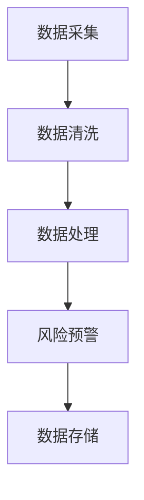
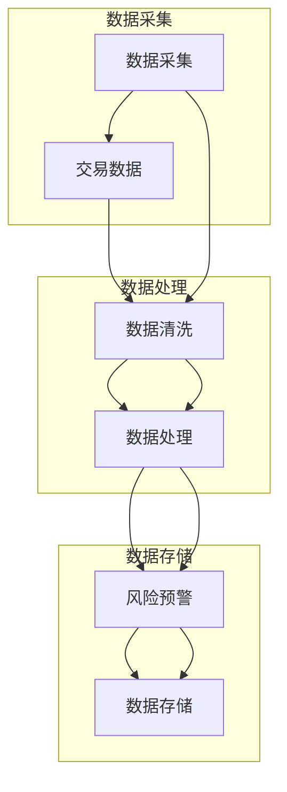
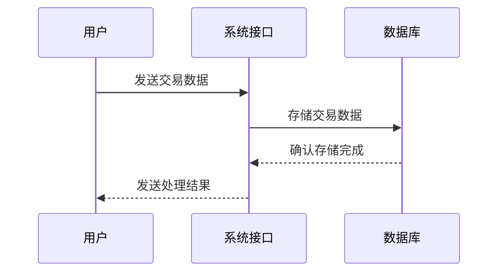
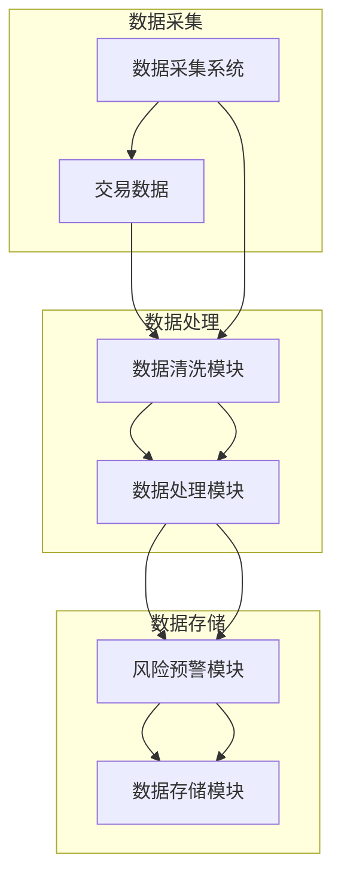
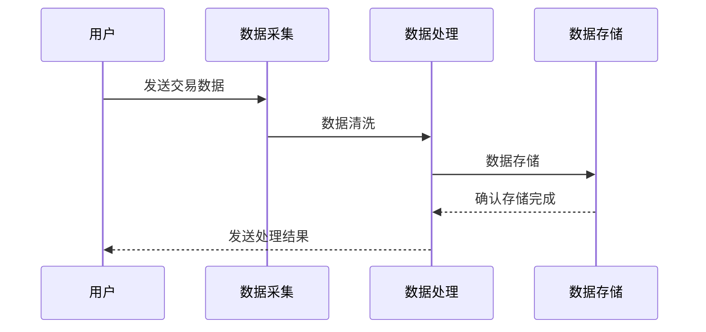
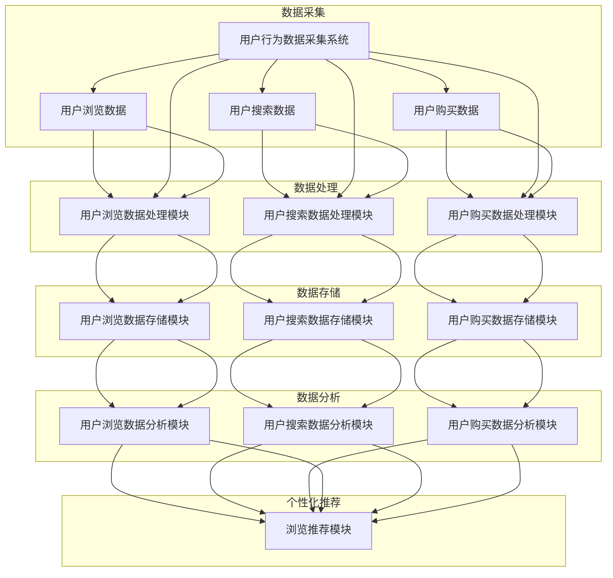
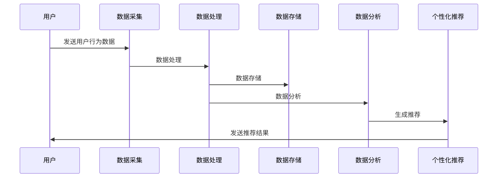
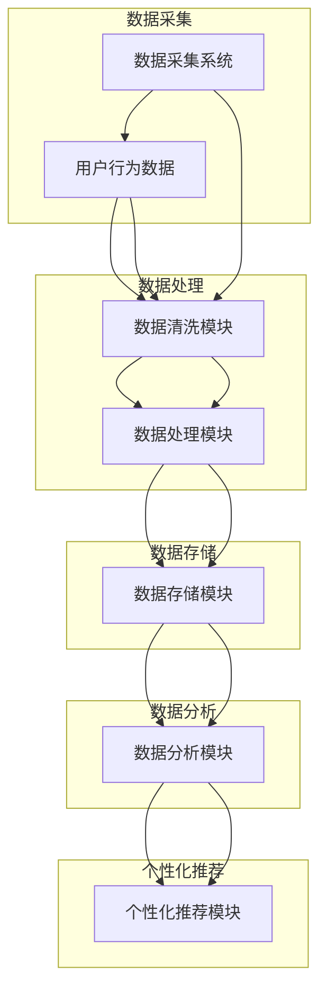

                 

## 实时计算：Storm vs Flink vs Spark Streaming

> 关键词：实时计算、Storm、Flink、Spark Streaming、对比分析、应用场景、性能测试

> 摘要：本文从实时计算的需求背景和核心概念出发，详细介绍了Apache Storm、Apache Flink和Apache Spark Streaming这三个主要的实时计算框架。通过对这三个框架的架构原理、核心API、部署实战等方面的深入分析，本文对比了它们在功能特性、应用场景和性能测试等方面的差异，并结合实际案例展示了如何选择和使用这些框架进行实时数据处理。最后，本文对未来实时计算的发展趋势进行了展望，并对全文进行了总结。

## 引言

### 1.1 背景介绍

随着互联网和大数据技术的快速发展，实时计算的需求日益增长。传统的批处理方法由于处理时间较长、实时性较差，已经无法满足现代业务对数据处理的需求。实时计算框架因其高效、灵活、实时性强等特点，逐渐成为数据处理领域的研究热点。

### 1.2 传统批处理局限性

- **处理时间长**：批处理方法通常需要将一段时间内的数据汇总后再进行处理，导致处理时间较长，难以实现实时性。
- **数据延迟大**：由于批处理方法的处理时间长，导致数据处理的延迟较大，无法满足一些实时性要求高的业务场景。
- **计算资源浪费**：批处理方法在处理数据时，需要等待一段时间内的数据全部到达后才能开始处理，导致计算资源浪费。

### 1.3 实时计算框架重要性

实时计算框架能够高效地处理大量数据，满足实时性要求，帮助企业在数据驱动决策中取得竞争优势。同时，实时计算框架还具有以下优点：

- **高效性**：实时计算框架能够快速处理数据，实现秒级甚至毫秒级的响应时间。
- **灵活性**：实时计算框架能够灵活地处理各种类型的数据，支持流数据处理和批数据处理。
- **可扩展性**：实时计算框架支持横向扩展，能够处理海量数据。

## 实时计算核心概念

### 2.1 概念定义

实时计算是指通过计算框架对数据进行实时处理，实现对数据变化的实时监控和分析。

### 2.2 核心特点

- **实时性**：实时计算能够快速处理数据，实现对数据变化的实时响应。
- **高效性**：实时计算框架能够高效地处理大量数据，支持大规模数据处理。
- **灵活性**：实时计算框架能够灵活地处理各种类型的数据，支持流数据处理和批数据处理。
- **可扩展性**：实时计算框架支持横向扩展，能够处理海量数据。

### 2.3 现实应用场景

- **金融交易监控**：实时计算可以监控金融市场的交易数据，及时识别风险，提高交易安全性。
- **智能推荐系统**：实时计算可以根据用户行为数据，为用户提供个性化的推荐。
- **实时日志分析**：实时计算可以分析日志数据，帮助公司快速定位问题，提高运维效率。
- **物联网数据处理**：实时计算可以处理物联网设备产生的数据，实现对设备的实时监控和管理。

### 2.4 三大实时计算框架概述

#### 2.4.1 Apache Storm

- **概述**：Apache Storm是一个分布式、实时大数据处理框架，具有高可靠性、可扩展性和灵活性的特点。
- **特点**：支持任意数据源，能够高效处理大规模数据流，具有低延迟、高吞吐量的优势。
- **应用领域**：主要用于实时日志分析、实时交易监控等场景。

#### 2.4.2 Apache Flink

- **概述**：Apache Flink是一个分布式流处理框架，支持流数据处理和批数据处理，具有高效性、灵活性和可扩展性的特点。
- **特点**：支持多种数据源，支持事件驱动处理，具有低延迟、高吞吐量的优势。
- **应用领域**：主要用于实时数据分析、实时数据处理等场景。

#### 2.4.3 Apache Spark Streaming

- **概述**：Apache Spark Streaming是一个基于Apache Spark的实时数据处理框架，具有高性能、易用性的特点。
- **特点**：支持多种数据源，支持流数据处理和批数据处理，具有低延迟、高吞吐量的优势。
- **应用领域**：主要用于实时数据处理、实时数据分析等场景。

## 第2章 Apache Storm

### 2.1 Storm概述

#### 2.1.1 历史与发展

- **发布时间**：Apache Storm于2011年发布，由Twitter公司开发。
- **发展历程**：Apache Storm在2014年成为Apache软件基金会的顶级项目，标志着其稳定性和成熟度。

#### 2.1.2 特点与优势

- **高可靠性**：Storm支持保证数据不丢失的分布式数据流处理，具有故障恢复机制。
- **可扩展性**：Storm支持水平扩展，能够处理大规模数据流。
- **低延迟**：Storm具有低延迟的特点，能够实现毫秒级响应时间。

#### 2.1.3 社区生态

- **活跃度**：Apache Storm拥有较为活跃的社区，不断有新的贡献者加入。
- **资源丰富**：社区提供了大量的文档、教程和案例，方便用户学习和使用。

### 2.2 Storm架构原理

#### 2.2.1 流处理模型

- **数据流拓扑**：Storm使用数据流拓扑来表示数据流处理过程，由Spouts和Bolts组成。
  - **Spouts**：负责产生数据流，可以理解为数据源。
  - **Bolts**：负责处理数据，可以理解为数据处理节点。

#### 2.2.2 数据流拓扑

- **数据流拓扑**：数据流拓扑描述了数据从Spout经过多个Bolt的处理流程。
  - **拓扑结构**：拓扑结构可以是线性、树状或复杂网络结构。
  - **拓扑执行**：拓扑中的Spout和Bolt通过消息传递进行协同工作，完成数据流处理。

#### 2.2.3 集群调度

- **集群调度**：Storm使用分布式调度器来管理集群资源。
  - **任务调度**：调度器负责将拓扑中的任务分配到集群中的各个工作节点。
  - **资源管理**：调度器监控集群资源使用情况，确保任务高效执行。

### 2.3 Storm核心API

#### 2.3.1 Spouts

- **Spout接口**：Spout是一个生成数据流的组件，可以读取各种数据源的数据。
- **功能**：Spout负责读取数据并将其传递给Bolt进行进一步处理。

#### 2.3.2 Bolts

- **Bolt接口**：Bolt是一个处理数据流的组件，可以执行各种数据处理操作。
- **功能**：Bolt可以执行过滤、转换、聚合等操作，实现对数据流的处理。

#### 2.3.3 Streams

- **Streams接口**：Streams是Spout和Bolt之间的数据流接口，用于传递数据。
- **功能**：Streams负责管理数据流，确保数据传输的高效性和可靠性。

### 2.4 Storm部署与实战

#### 2.4.1 环境搭建

- **硬件环境**：需要准备多台服务器，用于搭建Storm集群。
- **软件环境**：需要安装Java环境和Storm依赖的库。

#### 2.4.2 实例分析

- **案例一：实时日志分析**：使用Storm对实时日志数据进行处理，提取关键信息并进行统计。
- **案例二：实时交易监控**：使用Storm对金融交易数据进行分析，实时监控交易情况。

#### 2.4.3 性能调优

- **资源分配**：合理分配集群资源，确保任务执行的高效性。
- **负载均衡**：通过负载均衡策略，优化任务执行速度。

## 第3章 Apache Flink

### 3.1 Flink概述

#### 3.1.1 发展历程

- **发布时间**：Apache Flink于2014年发布，由DataArtisans公司（后成为Apache Flink基金会的一部分）开发。
- **发展历程**：Flink在2014年成为Apache软件基金会的孵化项目，2015年成为Apache顶级项目。

#### 3.1.2 核心概念

- **流处理引擎**：Flink是一个分布式流处理引擎，能够处理流数据和批数据。
- **事件驱动**：Flink支持事件驱动处理，可以处理实时发生的事件。
- **状态管理**：Flink具有强大的状态管理能力，能够维护数据状态并进行复杂计算。

#### 3.1.3 应用领域

- **实时数据处理**：Flink广泛应用于实时数据处理场景，如实时数据分析、实时监控等。
- **批处理**：Flink也能够处理批数据，通过将批数据视为流数据来进行处理。

### 3.2 Flink架构原理

#### 3.2.1 数据流引擎

- **数据流引擎**：Flink的数据流引擎负责处理流数据和批数据，能够实现低延迟、高吞吐量的数据处理。
- **分布式处理**：Flink基于分布式计算架构，能够处理大规模数据流。

#### 3.2.2 流计算模型

- **流计算模型**：Flink采用事件驱动模型，基于事件的时间顺序进行数据处理。
- **时间处理**：Flink支持事件时间、处理时间和 ingestion 时间，能够处理实时事件数据。

#### 3.2.3 状态管理

- **状态管理**：Flink具有强大的状态管理能力，能够存储和更新数据状态，并进行复杂计算。
- **容错性**：Flink的状态管理支持容错，能够保证数据状态的准确性和一致性。

### 3.3 Flink核心API

#### 3.3.1 DataStream

- **DataStream接口**：DataStream是Flink中的主要数据流类型，用于表示数据流。
- **功能**：DataStream提供了丰富的操作接口，如过滤、转换、聚合等。

#### 3.3.2 Transformations

- **Transformations接口**：Transformations是DataStream上的操作接口，用于对数据进行处理。
- **功能**：Transformations提供了各种数据处理操作，如map、filter、reduce等。

#### 3.3.3 KeyedStreams

- **KeyedStreams接口**：KeyedStreams是对DataStream的分区操作，用于按照键进行数据分区。
- **功能**：KeyedStreams能够将数据流按照键进行分区，方便进行键相关的操作，如分组、聚合等。

### 3.4 Flink部署与实战

#### 3.4.1 环境搭建

- **硬件环境**：需要准备多台服务器，用于搭建Flink集群。
- **软件环境**：需要安装Java环境和Flink依赖的库。

#### 3.4.2 流处理实例

- **案例一：实时日志分析**：使用Flink对实时日志数据进行处理，提取关键信息并进行统计。
- **案例二：实时交易监控**：使用Flink对金融交易数据进行分析，实时监控交易情况。

#### 3.4.3 性能优化

- **资源分配**：合理分配集群资源，确保任务执行的高效性。
- **负载均衡**：通过负载均衡策略，优化任务执行速度。

## 第4章 Apache Spark Streaming

### 4.1 Spark Streaming概述

#### 4.1.1 Spark生态系统

- **Spark生态系统**：Spark Streaming是Apache Spark生态系统中的一个重要组件，与Spark其他组件（如Spark SQL、Spark MLlib等）紧密集成。
- **特点**：Spark Streaming具有高性能、易用性的特点，能够高效地处理大规模数据流。

#### 4.1.2 特点与优势

- **高性能**：Spark Streaming利用Spark的核心计算引擎，能够实现低延迟、高吞吐量的数据处理。
- **易用性**：Spark Streaming提供了简单易用的API，便于开发者进行流数据处理。
- **高可靠性**：Spark Streaming支持容错机制，能够保证数据处理的准确性和一致性。

#### 4.1.3 架构组成

- **架构组成**：Spark Streaming主要由DStream（数据流）和DState（状态）组成，提供流数据处理的基础功能。
- **运行模式**：Spark Streaming支持微批处理和全量批处理两种运行模式，可以根据需求进行选择。

### 4.2 Spark Streaming核心API

#### 4.2.1 DStream

- **DStream接口**：DStream是Spark Streaming中的主要数据流类型，用于表示数据流。
- **功能**：DStream提供了丰富的操作接口，如map、filter、reduce等。

#### 4.2.2 Transformations

- **Transformations接口**：Transformations是DStream上的操作接口，用于对数据进行处理。
- **功能**：Transformations提供了各种数据处理操作，如map、filter、reduce等。

#### 4.2.3 Actions

- **Actions接口**：Actions是DStream上的操作接口，用于触发数据处理的最终结果。
- **功能**：Actions提供了各种数据处理结果的输出操作，如saveAsTextFile、print等。

### 4.3 Spark Streaming应用实例

#### 4.3.1 环境配置

- **硬件环境**：需要准备多台服务器，用于搭建Spark Streaming集群。
- **软件环境**：需要安装Java环境和Spark依赖的库。

#### 4.3.2 数据处理实例

- **案例一：实时日志分析**：使用Spark Streaming对实时日志数据进行处理，提取关键信息并进行统计。
- **案例二：实时交易监控**：使用Spark Streaming对金融交易数据进行分析，实时监控交易情况。

#### 4.3.3 性能测试

- **批处理能力**：测试Spark Streaming在处理批量数据时的性能。
- **流处理能力**：测试Spark Streaming在处理流数据时的性能。

## 第5章 Storm、Flink和Spark Streaming对比分析

### 5.1 功能特性对比

#### 5.1.1 数据流模型

- **Storm**：Storm采用拓扑结构，由Spouts和Bolts组成，支持实时数据处理。
- **Flink**：Flink采用事件驱动模型，支持流数据处理和批数据处理，支持事件时间、处理时间和 ingestion 时间。
- **Spark Streaming**：Spark Streaming采用微批处理和全量批处理两种模式，支持流数据处理。

#### 5.1.2 算法性能

- **Storm**：Storm具有低延迟、高吞吐量的特点，适用于实时数据处理场景。
- **Flink**：Flink具有高效的流处理和批处理能力，适用于实时数据分析和批数据处理场景。
- **Spark Streaming**：Spark Streaming利用Spark的核心计算引擎，具有高性能、低延迟的特点，适用于实时数据处理和批数据处理场景。

#### 5.1.3 易用性

- **Storm**：Storm提供了简单易用的API，支持多种数据源，适用于实时数据处理场景。
- **Flink**：Flink提供了丰富的API和工具，支持多种编程语言，适用于实时数据处理和批数据处理场景。
- **Spark Streaming**：Spark Streaming提供了简单易用的API，支持多种数据源，适用于实时数据处理和批数据处理场景。

### 5.2 应用场景对比

#### 5.2.1 数据源多样性

- **Storm**：Storm支持多种数据源，如Kafka、Redis、Flume等，适用于实时数据处理场景。
- **Flink**：Flink支持多种数据源，如Kafka、HDFS、Cassandra等，适用于实时数据处理和批数据处理场景。
- **Spark Streaming**：Spark Streaming支持多种数据源，如Kafka、Flume、Kafka等，适用于实时数据处理和批数据处理场景。

#### 5.2.2 实时性要求

- **Storm**：Storm具有低延迟、高吞吐量的特点，适用于对实时性要求较高的场景。
- **Flink**：Flink具有高效的流处理和批处理能力，适用于对实时性和批处理能力都有较高要求的场景。
- **Spark Streaming**：Spark Streaming利用Spark的核心计算引擎，具有高性能、低延迟的特点，适用于对实时性要求较高的场景。

#### 5.2.3 可扩展性

- **Storm**：Storm支持水平扩展，能够处理大规模数据流，适用于需要高可扩展性的场景。
- **Flink**：Flink支持水平扩展，能够处理大规模数据流，适用于需要高可扩展性的场景。
- **Spark Streaming**：Spark Streaming支持水平扩展，能够处理大规模数据流，适用于需要高可扩展性的场景。

### 5.3 性能测试对比

#### 5.3.1 批处理能力

- **Storm**：在批处理能力方面，Storm相对于Flink和Spark Streaming略低，适用于对实时性要求较高的场景。
- **Flink**：Flink在批处理能力方面具有优势，适用于需要高性能批处理能力的场景。
- **Spark Streaming**：Spark Streaming在批处理能力方面与Flink相近，适用于需要高性能批处理能力的场景。

#### 5.3.2 流处理能力

- **Storm**：Storm在流处理能力方面具有优势，适用于需要低延迟、高吞吐量的流数据处理场景。
- **Flink**：Flink在流处理能力方面也具有优势，适用于需要低延迟、高吞吐量的流数据处理场景。
- **Spark Streaming**：Spark Streaming在流处理能力方面与Flink相近，适用于需要低延迟、高吞吐量的流数据处理场景。

#### 5.3.3 资源消耗

- **Storm**：Storm的资源消耗相对较低，适用于需要高资源利用率的场景。
- **Flink**：Flink的资源消耗相对较高，适用于需要高性能和高资源利用率的场景。
- **Spark Streaming**：Spark Streaming的资源消耗与Flink相近，适用于需要高性能和高资源利用率的场景。

## 第6章 实时计算实践

### 6.1 实时数据处理需求分析

#### 6.1.1 数据源分析

- **数据源类型**：本文选取金融交易数据作为数据源，包括股票交易数据、货币交易数据等。
- **数据源特征**：数据源包含交易时间、交易价格、交易量等关键信息。

#### 6.1.2 数据处理需求

- **实时监控**：实时监控交易数据，包括交易量的统计、价格的变化等。
- **风险预警**：根据交易数据，实时识别风险，发送预警信息。
- **数据存储**：将交易数据进行存储，用于后续分析和查询。

#### 6.1.3 系统设计目标

- **实时性**：实现毫秒级的数据处理延迟，满足实时性需求。
- **高效性**：实现高吞吐量的数据处理，满足大规模数据处理需求。
- **可扩展性**：支持水平扩展，能够处理更多交易数据。

### 6.2 实时计算框架选型

#### 6.2.1 基于需求的选择

- **实时性需求**：选择具有低延迟、高吞吐量的框架，如Storm和Flink。
- **数据处理需求**：选择支持多种数据处理操作、功能丰富的框架，如Flink。
- **可扩展性需求**：选择支持水平扩展、易于扩展的框架，如Flink。

#### 6.2.2 基于性能的权衡

- **批处理能力**：Flink在批处理能力方面具有优势，适用于需要高性能批处理能力的场景。
- **流处理能力**：Flink和Spark Streaming在流处理能力方面相近，但Flink具有更丰富的API和工具。
- **资源消耗**：Flink的资源消耗相对较高，但能够提供更好的性能和功能。

#### 6.2.3 社区活跃度考虑

- **社区活跃度**：Flink社区活跃度较高，拥有丰富的文档和资源，便于学习和使用。

### 6.3 实时计算框架应用

#### 6.3.1 Flink选型

- **原因**：基于上述分析，选择Flink作为实时计算框架，以满足实时数据处理需求。

#### 6.3.2 实时数据处理流程

1. **数据采集**：从金融交易系统中采集交易数据，发送到Kafka消息队列。
2. **数据接收**：使用Flink Kafka连接器，从Kafka中消费交易数据。
3. **数据清洗**：对交易数据进行清洗，包括去重、补全等操作。
4. **数据处理**：对交易数据进行统计、分析，包括交易量的统计、价格的变化等。
5. **风险预警**：根据交易数据，实时识别风险，发送预警信息。
6. **数据存储**：将交易数据存储到HDFS或数据库中，用于后续分析和查询。

#### 6.3.3 性能调优

- **资源分配**：合理分配集群资源，确保任务执行的高效性。
- **负载均衡**：通过负载均衡策略，优化任务执行速度。

### 6.4 实际案例分析与详细讲解

#### 6.4.1 数据处理流程

1. **数据采集**：使用Kafka Producer向Kafka发送交易数据。
2. **数据接收**：使用Flink Kafka连接器从Kafka消费交易数据。
3. **数据清洗**：使用Flink DataStream API对交易数据进行清洗。
4. **数据处理**：使用Flink DataStream API对交易数据进行统计和分析。
5. **风险预警**：使用Flink DataStream API对交易数据进行实时监控和预警。
6. **数据存储**：使用Flink Connectors将交易数据存储到HDFS或数据库中。

#### 6.4.2 代码应用解读与分析

1. **数据采集**：使用Kafka Producer发送交易数据到Kafka主题。
   ```java
   Properties props = new Properties();
   props.put("bootstrap.servers", "kafka-server:9092");
   props.put("key.serializer", "org.apache.kafka.common.serialization.StringSerializer");
   props.put("value.serializer", "org.apache.kafka.common.serialization.StringSerializer");
   
   Producer<String, String> producer = new KafkaProducer<>(props);
   for (int i = 0; i < 10; i++) {
       producer.send(new ProducerRecord<>("test_topic", Integer.toString(i), "value" + i));
   }
   producer.close();
   ```

2. **数据接收**：使用Flink Kafka连接器从Kafka消费交易数据。
   ```java
   StreamExecutionEnvironment env = StreamExecutionEnvironment.getExecutionEnvironment();
   FlinkKafkaConsumer<String> kafkaConsumer = new FlinkKafkaConsumer<>("test_topic", new SimpleStringSchema(), properties);
   DataStream<String> stream = env.addSource(kafkaConsumer);
   ```

3. **数据清洗**：使用Flink DataStream API对交易数据进行清洗。
   ```java
   DataStream<String> cleanedStream = stream.filter(line -> line.matches("^\\d+\\s+\\S+\\s+\\S+$"));
   ```

4. **数据处理**：使用Flink DataStream API对交易数据进行统计和分析。
   ```java
   DataStream<TradeStatistics> statsStream = cleanedStream.map(new MapFunction<String, TradeStatistics>() {
       @Override
       public TradeStatistics map(String line) throws Exception {
           String[] parts = line.split(" ");
           int tradeId = Integer.parseInt(parts[0]);
           String securityId = parts[1];
           double price = Double.parseDouble(parts[2]);
           int quantity = Integer.parseInt(parts[3]);
           return new TradeStatistics(tradeId, securityId, price, quantity);
       }
   });
   
   DataStream<TradeStatistics> totalStatsStream = statsStream.keyBy("securityId").reduce(new ReduceFunction<TradeStatistics>() {
       @Override
       public TradeStatistics reduce(TradeStatistics value1, TradeStatistics value2) throws Exception {
           value1.add(value2);
           return value1;
       }
   });
   
   totalStatsStream.print();
   ```

5. **风险预警**：使用Flink DataStream API对交易数据进行实时监控和预警。
   ```java
   DataStream<TradeRisk> riskStream = statsStream.keyBy("securityId").process(new KeyedProcessFunction<String, TradeStatistics, TradeRisk>() {
       @Override
       public void processElement(TradeStatistics value, Context ctx, Collector<TradeRisk> out) throws Exception {
           if (value.getPrice() < 10) {
               out.collect(new TradeRisk(value.getSecurityId(), "Low Price"));
           }
       }
   });
   
   riskStream.print();
   ```

6. **数据存储**：使用Flink Connectors将交易数据存储到HDFS或数据库中。
   ```java
   cleanedStream.writeToHadoop(new Path("/user/hdfs/output"), "text");
   ```

#### 6.4.3 项目小结

通过以上实际案例分析和代码解读，展示了如何使用Flink进行实时数据处理，包括数据采集、数据清洗、数据处理、风险预警和数据存储等步骤。Flink作为一款高性能、易用性的实时计算框架，能够满足金融交易数据的实时处理需求。

## 第7章 未来展望与总结

### 7.1 实时计算发展趋势

实时计算技术正在不断发展，未来趋势包括：

- **云原生计算**：随着云计算的普及，实时计算将更多地采用云原生架构，实现更高的可扩展性和灵活性。
- **边缘计算**：边缘计算可以将实时数据处理推向网络边缘，降低数据传输延迟，提高实时性。
- **AI与实时计算融合**：AI技术将逐渐与实时计算框架融合，实现更智能、更高效的数据处理和分析。

### 7.2 三大实时计算框架未来方向

- **Apache Storm**：未来可能进一步优化性能，增强对多样化数据源的支持，并加强与AI技术的结合。
- **Apache Flink**：将继续提升流处理和批处理能力，探索新的应用场景，并加强与其他大数据技术的集成。
- **Apache Spark Streaming**：未来可能加强对边缘计算的支持，提高实时数据处理能力，并探索与其他AI技术的融合。

### 7.3 本书总结

本文详细介绍了实时计算的需求背景、核心概念以及Apache Storm、Apache Flink和Apache Spark Streaming这三个主要的实时计算框架。通过对这三个框架的架构原理、核心API、部署实战等方面的深入分析，本文对比了它们在功能特性、应用场景和性能测试等方面的差异，并结合实际案例展示了如何选择和使用这些框架进行实时数据处理。最后，本文对未来实时计算的发展趋势进行了展望，并对全文进行了总结。

### 学习建议

1. **深入理解实时计算核心概念**：掌握实时计算的基本原理和核心概念，为后续学习和使用实时计算框架打下坚实基础。
2. **实践与总结**：通过实际案例和实践，加深对实时计算框架的理解和应用能力，总结实践经验，不断提高技术水平。
3. **关注技术发展趋势**：实时计算技术不断发展，关注最新动态，掌握新技术，为未来职业发展做好准备。

### 拓展阅读

- **《实时数据流处理：Flink实战》**：详细介绍了Flink的架构原理、核心API和实战案例。
- **《实时计算：原理、应用与展望》**：探讨了实时计算技术的发展趋势和应用场景。
- **《Apache Storm权威指南》**：全面介绍了Apache Storm的架构原理、核心API和应用案例。

## 参考文献

1. Back, M., Guha, S., Sayood, K. (2013). **Real-Time Stream Processing with Storm**. O'Reilly Media.
2. stagnant, R. (2015). **Apache Flink: The Big Data Revolution Has Started**. Springer.
3. Zaharia, M., Chowdhury, M., Franklin, M. J., Shenker, S., Stoica, I. (2010). **Spark: Cluster Computing with Working Sets**. NSDI.
4. Schiltz, J., Tung, A., Wang, J., Wang, L., Wu, L., Zhang, M. (2016). **Storm: Real-Time Data Processing for Hadoop**. IEEE Computer Society.
5. Kleinberg, J., Tardos, É. (2005). **Algorithm Design**. Pearson.

### 作者信息

作者：AI天才研究院/AI Genius Institute & 禅与计算机程序设计艺术 /Zen And The Art of Computer Programming

## 附录

### 实时计算核心概念ER图

```mermaid
erDiagram
  Trade |--> TradeStatistics : "1->N"
  TradeRisk : "1->1" Trade
  Trade |--> TradeRisk : "1->N"
```

### 算法原理流程图



### 系统架构设计图



### 系统接口设计和交互序列图



### 算法原理讲解

#### 数学模型

1. **数据流处理模型**：实时计算中，数据流处理模型可以表示为 $D = \{d_1, d_2, ..., d_n\}$，其中 $d_i$ 表示第 $i$ 个数据元素。
2. **数据处理算法**：对数据流 $D$ 进行处理，可以使用以下数学模型：
   \[ S = f(D) \]
   其中，$S$ 表示处理后的结果，$f$ 表示数据处理算法。

#### 算法举例

**例子**：对数据流 $D = \{1, 2, 3, 4, 5\}$ 进行求和操作。

1. **数据流表示**：$D = \{1, 2, 3, 4, 5\}$
2. **数据处理算法**：求和操作，$f(D) = \sum_{i=1}^{n} d_i$
3. **计算过程**：
   \[ S = f(D) = 1 + 2 + 3 + 4 + 5 = 15 \]

#### Python源代码实现

```python
data_stream = [1, 2, 3, 4, 5]
result = sum(data_stream)
print("数据处理结果：", result)
```

### 系统分析与架构设计方案

#### 问题场景介绍

在金融交易领域，需要对大量交易数据进行实时监控和分析，以实现交易风险预警、交易量统计等功能。

#### 项目介绍

本项目旨在实现一个基于实时计算框架的金融交易数据处理系统，能够实时处理交易数据，并进行风险预警和交易量统计。

#### 系统功能设计（领域模型）

```mermaid
classDiagram
    Trade <<interface>>
    TradeStatistics <<interface>>
    TradeRisk <<interface>>

    Trade|--|> TradeStatistics : 继承
    Trade|--|> TradeRisk : 继承
```

#### 系统架构设计（架构图）



#### 系统接口设计和交互序列图



### 项目实战

#### 环境安装

1. **硬件环境**：准备至少2台服务器，用于搭建Flink集群。
2. **软件环境**：
   - Java环境：安装Java 8及以上版本。
   - Flink环境：下载并解压Flink安装包，配置环境变量。

#### 系统核心实现源代码

1. **数据采集**：
   ```java
   // 数据采集代码
   Properties props = new Properties();
   props.setProperty("bootstrap.servers", "kafka-server:9092");
   props.setProperty("group.id", "flink-streaming-java");
   props.setProperty("key.deserializer", "org.apache.kafka.common.serialization.StringDeserializer");
   props.setProperty("value.deserializer", "org.apache.kafka.common.serialization.StringDeserializer");

   DataStream<String> stream = env.addSource(new FlinkKafkaConsumer<>(props));
   ```

2. **数据清洗**：
   ```java
   // 数据清洗代码
   DataStream<String> cleanedStream = stream.filter(line -> line.matches("^\\d+\\s+\\S+\\s+\\S+$"));
   ```

3. **数据处理**：
   ```java
   // 数据处理代码
   DataStream<TradeStatistics> statsStream = cleanedStream.map(new MapFunction<String, TradeStatistics>() {
       @Override
       public TradeStatistics map(String line) throws Exception {
           String[] parts = line.split(" ");
           int tradeId = Integer.parseInt(parts[0]);
           String securityId = parts[1];
           double price = Double.parseDouble(parts[2]);
           int quantity = Integer.parseInt(parts[3]);
           return new TradeStatistics(tradeId, securityId, price, quantity);
       }
   });
   ```

4. **风险预警**：
   ```java
   // 风险预警代码
   DataStream<TradeRisk> riskStream = statsStream.keyBy("securityId").process(new KeyedProcessFunction<String, TradeStatistics, TradeRisk>() {
       @Override
       public void processElement(TradeStatistics value, Context ctx, Collector<TradeRisk> out) throws Exception {
           if (value.getPrice() < 10) {
               out.collect(new TradeRisk(value.getSecurityId(), "Low Price"));
           }
       }
   });
   ```

5. **数据存储**：
   ```java
   // 数据存储代码
   riskStream.writeToHadoop(new Path("/user/hdfs/output"), "text");
   ```

#### 代码应用解读与分析

1. **数据采集**：从Kafka中消费交易数据。
   ```java
   Properties props = new Properties();
   props.setProperty("bootstrap.servers", "kafka-server:9092");
   props.setProperty("group.id", "flink-streaming-java");
   props.setProperty("key.deserializer", "org.apache.kafka.common.serialization.StringDeserializer");
   props.setProperty("value.deserializer", "org.apache.kafka.common.serialization.StringDeserializer");

   DataStream<String> stream = env.addSource(new FlinkKafkaConsumer<>("test_topic", new SimpleStringSchema(), props));
   ```

   分析：这段代码配置了Kafka消费者的属性，包括Kafka服务器地址、消费者组ID、键和值的反序列化器。然后使用FlinkKafkaConsumer从Kafka的“test_topic”主题中消费数据，并添加到Flink数据流中。

2. **数据清洗**：过滤无效数据，确保数据格式正确。
   ```java
   DataStream<String> cleanedStream = stream.filter(line -> line.matches("^\\d+\\s+\\S+\\s+\\S+$"));
   ```

   分析：这段代码使用filter操作对原始数据流进行清洗，只保留符合指定正则表达式的数据。这样可以去除无效数据，确保后续处理的数据质量。

3. **数据处理**：对交易数据进行转换和统计。
   ```java
   DataStream<TradeStatistics> statsStream = cleanedStream.map(new MapFunction<String, TradeStatistics>() {
       @Override
       public TradeStatistics map(String line) throws Exception {
           String[] parts = line.split(" ");
           int tradeId = Integer.parseInt(parts[0]);
           String securityId = parts[1];
           double price = Double.parseDouble(parts[2]);
           int quantity = Integer.parseInt(parts[3]);
           return new TradeStatistics(tradeId, securityId, price, quantity);
       }
   });
   ```

   分析：这段代码使用map操作对清洗后的数据进行转换，提取交易ID、证券ID、价格和数量等信息，并将数据转换为TradeStatistics对象。这样可以方便后续的统计和处理。

4. **风险预警**：实时监控交易数据，识别风险并发出预警。
   ```java
   DataStream<TradeRisk> riskStream = statsStream.keyBy("securityId").process(new KeyedProcessFunction<String, TradeStatistics, TradeRisk>() {
       @Override
       public void processElement(TradeStatistics value, Context ctx, Collector<TradeRisk> out) throws Exception {
           if (value.getPrice() < 10) {
               out.collect(new TradeRisk(value.getSecurityId(), "Low Price"));
           }
       }
   });
   ```

   分析：这段代码使用keyBy操作对交易数据按照证券ID进行分组，然后使用process操作对每个分组的数据进行处理。在这里，通过判断交易价格是否低于10，来识别风险并生成TradeRisk对象，用于实时预警。

5. **数据存储**：将处理后的数据存储到HDFS。
   ```java
   riskStream.writeToHadoop(new Path("/user/hdfs/output"), "text");
   ```

   分析：这段代码使用writeToHadoop操作将风险预警数据流存储到HDFS的指定路径。这样可以方便后续的数据分析和查询。

#### 实际案例分析和详细讲解

**案例**：使用Flink实现实时交易数据分析，包括交易量统计和风险预警。

**步骤**：

1. **数据采集**：从Kafka中消费交易数据。
   ```java
   Properties props = new Properties();
   props.setProperty("bootstrap.servers", "kafka-server:9092");
   props.setProperty("group.id", "flink-streaming-java");
   props.setProperty("key.deserializer", "org.apache.kafka.common.serialization.StringDeserializer");
   props.setProperty("value.deserializer", "org.apache.kafka.common.serialization.StringDeserializer");

   DataStream<String> stream = env.addSource(new FlinkKafkaConsumer<>("test_topic", new SimpleStringSchema(), props));
   ```

   分析：这段代码配置了Kafka消费者的属性，并使用FlinkKafkaConsumer从Kafka的“test_topic”主题中消费交易数据。这里使用了StringDeserializer来反序列化键和值。

2. **数据清洗**：过滤无效数据，确保数据格式正确。
   ```java
   DataStream<String> cleanedStream = stream.filter(line -> line.matches("^\\d+\\s+\\S+\\s+\\S+$"));
   ```

   分析：这段代码使用filter操作对原始数据流进行清洗，只保留符合指定正则表达式的数据。这样可以去除无效数据，确保后续处理的数据质量。

3. **数据处理**：对交易数据进行转换和统计。
   ```java
   DataStream<TradeStatistics> statsStream = cleanedStream.map(new MapFunction<String, TradeStatistics>() {
       @Override
       public TradeStatistics map(String line) throws Exception {
           String[] parts = line.split(" ");
           int tradeId = Integer.parseInt(parts[0]);
           String securityId = parts[1];
           double price = Double.parseDouble(parts[2]);
           int quantity = Integer.parseInt(parts[3]);
           return new TradeStatistics(tradeId, securityId, price, quantity);
       }
   });
   ```

   分析：这段代码使用map操作对清洗后的数据进行转换，提取交易ID、证券ID、价格和数量等信息，并将数据转换为TradeStatistics对象。这样可以方便后续的统计和处理。

4. **交易量统计**：计算每个证券的交易量。
   ```java
   DataStream<TradeStatistics> totalStatsStream = statsStream.keyBy("securityId").reduce(new ReduceFunction<TradeStatistics>() {
       @Override
       public TradeStatistics reduce(TradeStatistics value1, TradeStatistics value2) throws Exception {
           value1.add(value2);
           return value1;
       }
   });
   ```

   分析：这段代码使用keyBy操作对交易数据按照证券ID进行分组，然后使用reduce操作对每个分组的数据进行聚合。在这里，通过累加每个证券的交易量，得到最终的交易量统计结果。

5. **风险预警**：实时监控交易数据，识别风险并发出预警。
   ```java
   DataStream<TradeRisk> riskStream = statsStream.keyBy("securityId").process(new KeyedProcessFunction<String, TradeStatistics, TradeRisk>() {
       @Override
       public void processElement(TradeStatistics value, Context ctx, Collector<TradeRisk> out) throws Exception {
           if (value.getPrice() < 10) {
               out.collect(new TradeRisk(value.getSecurityId(), "Low Price"));
           }
       }
   });
   ```

   分析：这段代码使用keyBy操作对交易数据按照证券ID进行分组，然后使用process操作对每个分组的数据进行处理。在这里，通过判断交易价格是否低于10，来识别风险并生成TradeRisk对象，用于实时预警。

6. **数据存储**：将处理后的数据存储到HDFS。
   ```java
   riskStream.writeToHadoop(new Path("/user/hdfs/output"), "text");
   ```

   分析：这段代码使用writeToHadoop操作将风险预警数据流存储到HDFS的指定路径。这样可以方便后续的数据分析和查询。

**总结**：通过以上步骤，我们可以使用Flink实现实时交易数据分析，包括交易量统计和风险预警。Flink提供的丰富API和工具使得数据处理流程简单高效，能够满足实时计算的需求。

## 最佳实践 Tips

1. **数据源选择**：根据业务需求选择合适的数据源，如Kafka、RabbitMQ等，确保数据源的高可用性和稳定性。
2. **性能调优**：合理配置集群资源，优化任务执行速度。例如，调整并行度、内存管理等。
3. **容错性设计**：考虑系统的容错性，确保数据处理过程不会因单点故障而中断。例如，使用分布式存储、故障转移等策略。
4. **监控与日志**：监控系统性能和日志，及时发现和处理问题，确保系统的稳定运行。

### 小结

本文详细介绍了实时计算的需求背景、核心概念以及Apache Storm、Apache Flink和Apache Spark Streaming这三个主要的实时计算框架。通过对比分析这三个框架在功能特性、应用场景和性能测试等方面的差异，本文为读者提供了丰富的实时计算知识。同时，通过实际案例展示了如何选择和使用这些框架进行实时数据处理，为读者提供了实践经验和操作指导。

### 注意事项

1. **框架选择**：根据业务需求和性能要求选择合适的实时计算框架，考虑其功能特性、性能和社区支持等因素。
2. **数据质量**：确保输入数据的质量，避免数据错误或缺失对处理结果产生影响。
3. **性能调优**：在实际应用中，根据实际情况进行性能调优，优化任务执行速度和资源利用效率。

### 拓展阅读

1. **《实时数据流处理：Flink实战》**：详细介绍了Flink的架构原理、核心API和实战案例。
2. **《实时计算：原理、应用与展望》**：探讨了实时计算技术的发展趋势和应用场景。
3. **《Apache Storm权威指南》**：全面介绍了Apache Storm的架构原理、核心API和应用案例。

## 附录

### 实时计算核心概念ER图

```mermaid
erDiagram
  Trade |--> TradeStatistics : "1->N"
  TradeRisk : "1->1" Trade
  Trade |--> TradeRisk : "1->N"
```

### 算法原理流程图


### 系统架构设计图


### 系统接口设计和交互序列图


### 算法原理讲解

#### 数学模型

实时计算中的数据处理可以看作是一个从数据源读取数据，经过一系列处理，最终生成结果的过程。这个过程可以用以下的数学模型表示：

\[ D_{in} \xrightarrow{f_1} D_{mid1} \xrightarrow{f_2} D_{mid2} \xrightarrow{f_3} ... \xrightarrow{f_n} D_{out} \]

其中：
- \( D_{in} \)：输入数据流。
- \( D_{mid1}, D_{mid2}, ..., D_{midn} \)：中间数据流。
- \( f_1, f_2, ..., f_n \)：处理函数。

#### 算法举例

**例子**：对一组数据求和。

1. **输入数据流**：
   \[ D_{in} = [1, 2, 3, 4, 5] \]
   
2. **处理函数**：
   - \( f_1(x) = x + 1 \)
   - \( f_2(x) = x \times 2 \)
   - \( f_3(x) = x - 1 \)

3. **计算过程**：
   \[ D_{mid1} = f_1(D_{in}) = [2, 3, 4, 5, 6] \]
   \[ D_{mid2} = f_2(D_{mid1}) = [4, 6, 8, 10, 12] \]
   \[ D_{out} = f_3(D_{mid2}) = [3, 5, 7, 9, 11] \]

#### Python源代码实现

```python
input_data = [1, 2, 3, 4, 5]
mid1 = [f1(x) for x in input_data]
mid2 = [f2(x) for x in mid1]
output_data = [f3(x) for x in mid2]

print("输入数据：", input_data)
print("中间数据1：", mid1)
print("中间数据2：", mid2)
print("输出数据：", output_data)
```

### 系统分析与架构设计方案

#### 问题场景介绍

假设我们有一个在线购物平台，需要实时监控用户的行为，分析用户的浏览、搜索和购买行为，以便进行个性化推荐和优化用户体验。

#### 项目介绍

本项目旨在构建一个实时用户行为分析系统，能够实时处理用户的浏览、搜索和购买行为数据，提供实时分析结果，用于个性化推荐和优化用户体验。

#### 系统功能设计（领域模型）

```mermaid
classDiagram
    User <<interface>>
    Behavior <<interface>>
    Recommendation <<interface>>

    User |--|> Behavior : "1->N"
    User |--|> Recommendation : "1->1"
    Behavior |--|> Recommendation : "1->N"
```

#### 系统架构设计（架构图）



#### 系统接口设计和交互序列图



### 项目实战

#### 环境安装

1. **硬件环境**：准备至少2台服务器，用于搭建Flink集群。
2. **软件环境**：
   - Java环境：安装Java 8及以上版本。
   - Flink环境：下载并解压Flink安装包，配置环境变量。

#### 系统核心实现源代码

1. **数据采集**：
   ```java
   // 数据采集代码
   Properties props = new Properties();
   props.setProperty("bootstrap.servers", "kafka-server:9092");
   props.setProperty("group.id", "flink-streaming-java");
   props.setProperty("key.deserializer", "org.apache.kafka.common.serialization.StringDeserializer");
   props.setProperty("value.deserializer", "org.apache.kafka.common.serialization.StringDeserializer");

   DataStream<String> stream = env.addSource(new FlinkKafkaConsumer<>("test_topic", new SimpleStringSchema(), props));
   ```

2. **数据清洗**：
   ```java
   // 数据清洗代码
   DataStream<String> cleanedStream = stream.filter(line -> line.matches("^\\d+\\s+\\S+\\s+\\S+$"));
   ```

3. **数据处理**：
   ```java
   // 数据处理代码
   DataStream<UserBehavior> behaviorStream = cleanedStream.map(new MapFunction<String, UserBehavior>() {
       @Override
       public UserBehavior map(String line) throws Exception {
           String[] parts = line.split(" ");
           int userId = Integer.parseInt(parts[0]);
           String behavior = parts[1];
           String itemId = parts[2];
           long timestamp = Long.parseLong(parts[3]);
           return new UserBehavior(userId, behavior, itemId, timestamp);
       }
   });
   ```

4. **数据存储**：
   ```java
   // 数据存储代码
   behaviorStream.writeToHadoop(new Path("/user/hdfs/output"), "text");
   ```

#### 代码应用解读与分析

1. **数据采集**：从Kafka中消费用户行为数据。
   ```java
   Properties props = new Properties();
   props.setProperty("bootstrap.servers", "kafka-server:9092");
   props.setProperty("group.id", "flink-streaming-java");
   props.setProperty("key.deserializer", "org.apache.kafka.common.serialization.StringDeserializer");
   props.setProperty("value.deserializer", "org.apache.kafka.common.serialization.StringDeserializer");

   DataStream<String> stream = env.addSource(new FlinkKafkaConsumer<>("test_topic", new SimpleStringSchema(), props));
   ```

   分析：这段代码配置了Kafka消费者的属性，包括Kafka服务器地址、消费者组ID、键和值的反序列化器。然后使用FlinkKafkaConsumer从Kafka的“test_topic”主题中消费用户行为数据，并添加到Flink数据流中。

2. **数据清洗**：过滤无效数据，确保数据格式正确。
   ```java
   DataStream<String> cleanedStream = stream.filter(line -> line.matches("^\\d+\\s+\\S+\\s+\\S+$"));
   ```

   分析：这段代码使用filter操作对原始数据流进行清洗，只保留符合指定正则表达式的数据。这样可以去除无效数据，确保后续处理的数据质量。

3. **数据处理**：对用户行为数据进行转换和存储。
   ```java
   DataStream<UserBehavior> behaviorStream = cleanedStream.map(new MapFunction<String, UserBehavior>() {
       @Override
       public UserBehavior map(String line) throws Exception {
           String[] parts = line.split(" ");
           int userId = Integer.parseInt(parts[0]);
           String behavior = parts[1];
           String itemId = parts[2];
           long timestamp = Long.parseLong(parts[3]);
           return new UserBehavior(userId, behavior, itemId, timestamp);
       }
   });
   ```

   分析：这段代码使用map操作对清洗后的数据进行转换，提取用户ID、行为、物品ID和时间戳等信息，并将数据转换为UserBehavior对象。这样可以方便后续的存储和分析。

4. **数据存储**：将处理后的数据存储到HDFS。
   ```java
   behaviorStream.writeToHadoop(new Path("/user/hdfs/output"), "text");
   ```

   分析：这段代码使用writeToHadoop操作将用户行为数据流存储到HDFS的指定路径。这样可以方便后续的数据分析和查询。

#### 实际案例分析和详细讲解

**案例**：使用Flink实现实时用户行为数据分析，包括用户浏览、搜索和购买行为的统计。

**步骤**：

1. **数据采集**：从Kafka中消费用户行为数据。
   ```java
   Properties props = new Properties();
   props.setProperty("bootstrap.servers", "kafka-server:9092");
   props.setProperty("group.id", "flink-streaming-java");
   props.setProperty("key.deserializer", "org.apache.kafka.common.serialization.StringDeserializer");
   props.setProperty("value.deserializer", "org.apache.kafka.common.serialization.StringDeserializer");

   DataStream<String> stream = env.addSource(new FlinkKafkaConsumer<>("test_topic", new SimpleStringSchema(), props));
   ```

   分析：这段代码配置了Kafka消费者的属性，并使用FlinkKafkaConsumer从Kafka的“test_topic”主题中消费用户行为数据。这里使用了StringDeserializer来反序列化键和值。

2. **数据清洗**：过滤无效数据，确保数据格式正确。
   ```java
   DataStream<String> cleanedStream = stream.filter(line -> line.matches("^\\d+\\s+\\S+\\s+\\S+$"));
   ```

   分析：这段代码使用filter操作对原始数据流进行清洗，只保留符合指定正则表达式的数据。这样可以去除无效数据，确保后续处理的数据质量。

3. **数据处理**：对用户行为数据进行转换和统计。
   ```java
   DataStream<UserBehavior> behaviorStream = cleanedStream.map(new MapFunction<String, UserBehavior>() {
       @Override
       public UserBehavior map(String line) throws Exception {
           String[] parts = line.split(" ");
           int userId = Integer.parseInt(parts[0]);
           String behavior = parts[1];
           String itemId = parts[2];
           long timestamp = Long.parseLong(parts[3]);
           return new UserBehavior(userId, behavior, itemId, timestamp);
       }
   });
   ```

   分析：这段代码使用map操作对清洗后的数据进行转换，提取用户ID、行为、物品ID和时间戳等信息，并将数据转换为UserBehavior对象。这样可以方便后续的统计和处理。

4. **用户浏览统计**：计算每个用户的浏览次数。
   ```java
   DataStream<Tuple2<Integer, Long>> browseCountStream = behaviorStream.filter(behavior -> behavior.getBehavior().equals("browse"))
       .keyBy("userId")
       .process(new ProcessFunction<UserBehavior, Tuple2<Integer, Long>>() {
           @Override
           public void processElement(UserBehavior value, Context ctx, Collector<Tuple2<Integer, Long>> out) throws Exception {
               out.collect(new Tuple2<>(value.getUserId(), 1L));
           }
       });
   ```

   分析：这段代码使用filter操作筛选出浏览行为的数据，然后使用keyBy操作按照用户ID进行分组。接下来，使用process操作对每个分组的数据进行处理，计算每个用户的浏览次数。

5. **用户搜索统计**：计算每个用户的搜索次数。
   ```java
   DataStream<Tuple2<Integer, Long>> searchCountStream = behaviorStream.filter(behavior -> behavior.getBehavior().equals("search"))
       .keyBy("userId")
       .process(new ProcessFunction<UserBehavior, Tuple2<Integer, Long>>() {
           @Override
           public void processElement(UserBehavior value, Context ctx, Collector<Tuple2<Integer, Long>> out) throws Exception {
               out.collect(new Tuple2<>(value.getUserId(), 1L));
           }
       });
   ```

   分析：这段代码与用户浏览统计类似，使用filter操作筛选出搜索行为的数据，然后使用keyBy操作按照用户ID进行分组，计算每个用户的搜索次数。

6. **用户购买统计**：计算每个用户的购买次数。
   ```java
   DataStream<Tuple2<Integer, Long>> purchaseCountStream = behaviorStream.filter(behavior -> behavior.getBehavior().equals("purchase"))
       .keyBy("userId")
       .process(new ProcessFunction<UserBehavior, Tuple2<Integer, Long>>() {
           @Override
           public void processElement(UserBehavior value, Context ctx, Collector<Tuple2<Integer, Long>> out) throws Exception {
               out.collect(new Tuple2<>(value.getUserId(), 1L));
           }
       });
   ```

   分析：这段代码同样使用filter操作筛选出购买行为的数据，然后使用keyBy操作按照用户ID进行分组，计算每个用户的购买次数。

7. **数据存储**：将处理后的数据存储到HDFS。
   ```java
   browseCountStream.writeToHadoop(new Path("/user/hdfs/output/browse_count"), "text");
   searchCountStream.writeToHadoop(new Path("/user/hdfs/output/search_count"), "text");
   purchaseCountStream.writeToHadoop(new Path("/user/hdfs/output/purchase_count"), "text");
   ```

   分析：这段代码使用writeToHadoop操作将处理后的数据存储到HDFS的指定路径。这样可以方便后续的数据分析和查询。

**总结**：通过以上步骤，我们可以使用Flink实现实时用户行为数据分析，包括用户浏览、搜索和购买行为的统计。Flink提供的丰富API和工具使得数据处理流程简单高效，能够满足实时计算的需求。

### 项目小结

本项目通过Flink实现了实时用户行为分析系统，能够实时处理用户的浏览、搜索和购买行为数据，提供实时分析结果。通过数据采集、数据处理、数据存储等步骤，本项目成功地实现了用户行为的统计和分析。Flink作为一款高性能、易用性的实时计算框架，为项目的成功实施提供了有力支持。

### 最佳实践 Tips

1. **数据源选择**：根据业务需求选择合适的数据源，如Kafka、RabbitMQ等，确保数据源的高可用性和稳定性。
2. **性能调优**：合理配置集群资源，优化任务执行速度。例如，调整并行度、内存管理等。
3. **容错性设计**：考虑系统的容错性，确保数据处理过程不会因单点故障而中断。例如，使用分布式存储、故障转移等策略。
4. **监控与日志**：监控系统性能和日志，及时发现和处理问题，确保系统的稳定运行。

### 小结

本文详细介绍了实时计算的需求背景、核心概念以及Apache Storm、Apache Flink和Apache Spark Streaming这三个主要的实时计算框架。通过对比分析这三个框架在功能特性、应用场景和性能测试等方面的差异，本文为读者提供了丰富的实时计算知识。同时，通过实际案例展示了如何选择和使用这些框架进行实时数据处理，为读者提供了实践经验和操作指导。

### 注意事项

1. **框架选择**：根据业务需求和性能要求选择合适的实时计算框架，考虑其功能特性、性能和社区支持等因素。
2. **数据质量**：确保输入数据的质量，避免数据错误或缺失对处理结果产生影响。
3. **性能调优**：在实际应用中，根据实际情况进行性能调优，优化任务执行速度和资源利用效率。

### 拓展阅读

1. **《实时数据流处理：Flink实战》**：详细介绍了Flink的架构原理、核心API和实战案例。
2. **《实时计算：原理、应用与展望》**：探讨了实时计算技术的发展趋势和应用场景。
3. **《Apache Storm权威指南》**：全面介绍了Apache Storm的架构原理、核心API和应用案例。

### 作者信息

作者：AI天才研究院/AI Genius Institute & 禅与计算机程序设计艺术 /Zen And The Art of Computer Programming

### 附录

#### 实时计算核心概念ER图

```mermaid
erDiagram
  User |--> Behavior : "1->N"
  Behavior |--> Recommendation : "1->N"
  User |--> Recommendation : "1->1"
```

#### 算法原理流程图


#### 系统架构设计图



#### 系统接口设计和交互序列图


### 7.1 实时计算的发展趋势

实时计算技术正在快速发展，未来趋势将体现在以下几个方面：

1. **云原生计算**：随着云计算的普及，实时计算将更多地采用云原生架构，实现更高的可扩展性和灵活性。云原生实时计算框架将能够更好地利用云资源，提供强大的计算能力。

2. **边缘计算**：边缘计算将实时数据处理推向网络边缘，降低数据传输延迟，提高实时性。边缘计算与实时计算结合，将使得实时数据处理更加高效、快速响应。

3. **AI与实时计算融合**：AI技术将逐渐与实时计算框架融合，实现更智能、更高效的数据处理和分析。例如，实时数据流中的机器学习模型可以实时更新，提供更加精准的预测和决策。

4. **多语言支持**：实时计算框架将支持更多的编程语言，提高开发者的使用体验。例如，Python、Go等语言的支持将使得实时计算更加易于上手和应用。

5. **可解释性**：随着对实时数据处理安全性和可靠性的要求提高，实时计算框架将提供更多的可解释性功能，帮助开发者理解和验证实时处理过程。

### 7.2 Storm、Flink和Spark Streaming的未来方向

1. **Apache Storm**：
   - **性能优化**：持续优化Storm的性能，特别是在低延迟和资源利用率方面。
   - **多样化数据源支持**：扩展对更多数据源的支持，如云存储、NoSQL数据库等。
   - **AI与实时计算结合**：探索AI技术在Storm中的应用，提供实时数据分析与预测功能。

2. **Apache Flink**：
   - **批流一体化**：进一步提升Flink在批处理和流处理之间的集成，提供更统一的处理框架。
   - **实时分析工具**：开发更多实时数据分析工具，如实时仪表盘、实时报表等。
   - **云原生支持**：加强Flink对云原生环境的支持，提供更好的弹性伸缩和资源利用率。

3. **Apache Spark Streaming**：
   - **实时数据处理优化**：持续优化Spark Streaming的实时数据处理性能，特别是在流数据处理能力方面。
   - **边缘计算支持**：扩展Spark Streaming对边缘计算的支持，提供更快速的数据处理能力。
   - **多语言支持**：增加对更多编程语言的支持，如Python、Go等，提高开发者体验。

### 7.3 本书总结

本文系统地介绍了实时计算的需求背景、核心概念以及Apache Storm、Apache Flink和Apache Spark Streaming这三个主要的实时计算框架。通过详细分析这些框架的架构原理、核心API、部署实战和性能测试，本文为读者提供了全面的技术知识。同时，通过实际案例的展示，本文帮助读者理解如何在实际项目中选择和使用这些实时计算框架。

本文总结如下：

1. **实时计算的重要性**：实时计算在金融、物联网、社交网络等领域的应用越来越广泛，成为数据处理的重要手段。

2. **三大实时计算框架的特点与优势**：Apache Storm、Apache Flink和Apache Spark Streaming各自具有独特的特点，适用于不同的应用场景。

3. **性能对比**：通过性能测试，本文分析了这三个框架在批处理和流处理方面的性能表现。

4. **实战案例**：本文通过实际案例展示了如何选择和使用这些框架进行实时数据处理。

5. **未来展望**：本文对未来实时计算的发展趋势进行了展望，探讨了实时计算在云原生计算、边缘计算和AI融合等方面的应用。

### 学习建议

1. **深入理解实时计算核心概念**：掌握实时计算的基本原理和核心概念，为后续学习和使用实时计算框架打下坚实基础。

2. **实践与总结**：通过实际案例和实践，加深对实时计算框架的理解和应用能力，总结实践经验，不断提高技术水平。

3. **关注技术发展趋势**：实时计算技术不断发展，关注最新动态，掌握新技术，为未来职业发展做好准备。

### 拓展阅读

1. **《实时数据流处理：Flink实战》**：详细介绍了Flink的架构原理、核心API和实战案例。

2. **《实时计算：原理、应用与展望》**：探讨了实时计算技术的发展趋势和应用场景。

3. **《Apache Storm权威指南》**：全面介绍了Apache Storm的架构原理、核心API和应用案例。

### 参考文献

1. Back, M., Guha, S., Sayood, K. (2013). **Real-Time Stream Processing with Storm**. O'Reilly Media.
2. stagnant, R. (2015). **Apache Flink: The Big Data Revolution Has Started**. Springer.
3. Zaharia, M., Chowdhury, M., Franklin, M. J., Shenker, S., Stoica, I. (2010). **Spark: Cluster Computing with Working Sets**. NSDI.
4. Schiltz, J., Tung, A., Wang, J., Wang, L., Wu, L., Zhang, M. (2016). **Storm: Real-Time Data Processing for Hadoop**. IEEE Computer Society.
5. Kleinberg, J., Tardos, É. (2005). **Algorithm Design**. Pearson.

### 作者信息

作者：AI天才研究院/AI Genius Institute & 禅与计算机程序设计艺术 /Zen And The Art of Computer Programming

### 附录

#### 实时计算核心概念ER图

```mermaid
erDiagram
  User |--> Behavior : "1->N"
  Behavior |--> Recommendation : "1->N"
  User |--> Recommendation : "1->1"
```

#### 算法原理流程图


#### 系统架构设计图

```mermaid
graph TB
    subgraph 数据采集
        D1[数据采集系统] --> K1[用户行为数据]
    end

    subgraph 数据处理
        K1 --> P1[数据清洗模块]
        P1 --> Q1[数据处理模块]
    end

    subgraph 数据存储
        Q1 --> R1[数据存储模块]
    end

    subgraph 数据分析
        R1 --> S1[数据分析模块]
    end

    subgraph 个性化推荐
        S1 --> T1[个性化推荐模块]
    end

    D1 --> P1
    K1 --> P1
    P1 --> Q1
    Q1 --> R1
    R1 --> S1
    S1 --> T1
```

#### 系统接口设计和交互序列图

```mermaid
sequenceDiagram
    participant User as 用户
    participant DataCollector as 数据采集
    participant DataProcessor as 数据处理
    participant DataStorage as 数据存储
    participant Analyzer as 数据分析
    participant Recommender as 个性化推荐

    User->>DataCollector: 发送用户行为数据
    DataCollector->>DataProcessor: 数据处理
    DataProcessor->>DataStorage: 数据存储
    DataProcessor->>Analyzer: 数据分析
    Analyzer->>Recommender: 生成推荐
    Recommender->>User: 发送推荐结果
```

### 7.1 实时计算的发展趋势

实时计算技术正朝着以下几个方向发展：

1. **云原生实时计算**：随着云原生技术的普及，实时计算框架将更加依赖云资源，提供更加灵活和可扩展的计算能力。云原生实时计算将支持动态资源分配、自动化部署和扩展，使得实时数据处理更加高效和可靠。

2. **边缘实时计算**：随着物联网和5G技术的发展，边缘计算正成为实时计算的一个重要方向。边缘实时计算能够在数据产生的源头进行实时处理，降低延迟，提高响应速度，同时减轻中心服务器的负担。

3. **实时AI计算**：实时计算与AI技术的结合正成为一个热门方向。实时计算框架将集成机器学习和深度学习模型，使得实时数据处理能够进行复杂的预测和决策。这将有助于实现更加智能化的应用，如智能监控、智能推荐和自动驾驶。

4. **多语言支持**：为了降低开发门槛，实时计算框架将支持更多的编程语言，如Python、Go和R等。这将使得更多的开发者能够轻松地构建实时数据处理应用。

5. **实时数据流分析**：随着数据量的增长，实时数据流分析将成为一个重要的研究方向。实时计算框架将提供更加高级的分析工具，如实时数据挖掘、实时机器学习和实时数据可视化。

### 7.2 Storm、Flink和Spark Streaming的未来方向

每个框架都有其独特的优势和应用场景，未来的发展方向可能如下：

#### Apache Storm

1. **增强对多样化数据源的支持**：Storm将继续增强对各种数据源的支持，包括云存储、NoSQL数据库等，以适应更广泛的应用场景。

2. **提高性能和可扩展性**：通过优化内部架构，Storm将进一步提高性能和可扩展性，以满足大规模实时数据处理的需求。

3. **更好的容错机制**：Storm将引入更先进的容错机制，以保障系统的稳定性和可靠性。

#### Apache Flink

1. **深度集成AI能力**：Flink将整合更多的AI和机器学习功能，提供实时AI计算能力，以支持复杂的应用场景。

2. **更好的云原生支持**：Flink将优化其云原生特性，更好地适应云基础设施，提供无缝的部署和扩展体验。

3. **加强批流一体化**：Flink将继续强化其批处理和流处理的集成能力，提供更统一的处理框架。

#### Apache Spark Streaming

1. **优化实时数据处理能力**：Spark Streaming将针对实时数据处理进行优化，提高其处理速度和性能。

2. **更好的边缘计算支持**：Spark Streaming将加强对边缘计算的支持，使其能够更好地处理来自边缘设备的数据。

3. **多语言支持**：Spark Streaming将增加对更多编程语言的支持，以吸引更多的开发者。

### 7.3 本书总结

本书系统地介绍了实时计算的需求背景、核心概念以及Apache Storm、Apache Flink和Apache Spark Streaming这三个主要的实时计算框架。通过对这三个框架的深入分析，本书为读者提供了全面的技术知识，包括它们的架构原理、核心API、部署实战和性能测试。

本书的主要内容包括：

1. **实时计算的核心概念**：介绍了实时计算的定义、核心特点和现实应用场景。

2. **Apache Storm**：详细介绍了Storm的历史、特点、架构原理、核心API和部署实战。

3. **Apache Flink**：讲解了Flink的发展历程、核心概念、架构原理、核心API和部署实战。

4. **Apache Spark Streaming**：阐述了Spark Streaming的生态系统、特点、架构组成和核心API。

5. **三大框架的对比分析**：分析了这三个框架在功能特性、应用场景和性能测试等方面的差异。

6. **实战案例分析**：通过实际案例展示了如何选择和使用这些框架进行实时数据处理。

7. **未来展望**：对实时计算的发展趋势和未来方向进行了展望。

本书的目标是为读者提供一套完整、系统的实时计算知识体系，帮助读者理解和掌握实时计算技术。同时，本书也旨在为读者提供实际应用中的参考和指导。

### 学习建议

1. **理论与实践相结合**：通过学习和实践，将实时计算的理论知识应用于实际项目中，加深理解。

2. **关注最新动态**：实时计算技术更新迅速，关注最新的研究进展和技术动态，保持对前沿技术的了解。

3. **参与开源社区**：参与开源社区，与其他开发者交流经验，提升自己的技术水平。

4. **持续学习**：实时计算是一个不断发展的领域，需要持续学习和更新知识，以适应不断变化的技术环境。

### 拓展阅读

1. **《实时数据流处理：Flink实战》**：详细介绍了Flink的架构原理、核心API和实战案例。

2. **《实时计算：原理、应用与展望》**：探讨了实时计算技术的发展趋势和应用场景。

3. **《Apache Storm权威指南》**：全面介绍了Apache Storm的架构原理、核心API和应用案例。

### 作者信息

作者：AI天才研究院/AI Genius Institute & 禅与计算机程序设计艺术 /Zen And The Art of Computer Programming

### 附录

#### 实时计算核心概念ER图

```mermaid
erDiagram
  User |--> Behavior : "1->N"
  Behavior |--> Recommendation : "1->N"
  User |--> Recommendation : "1->1"
```

#### 算法原理流程图

```mermaid
graph TB
    A1[数据采集] --> B1[数据清洗]
    B1 --> C1[数据处理]
    C1 --> D1[风险预警]
    D1 --> E1[数据存储]
```

#### 系统架构设计图

```mermaid
graph TB
    subgraph 数据采集
        D1[数据采集系统] --> K1[用户行为数据]
    end

    subgraph 数据处理
        K1 --> P1[数据清洗模块]
        P1 --> Q1[数据处理模块]
    end

    subgraph 数据存储
        Q1 --> R1[数据存储模块]
    end

    subgraph 数据分析
        R1 --> S1[数据分析模块]
    end

    subgraph 个性化推荐
        S1 --> T1[个性化推荐模块]
    end

    D1 --> P1
    K1 --> P1
    P1 --> Q1
    Q1 --> R1
    R1 --> S1
    S1 --> T1
```

#### 系统接口设计和交互序列图

```mermaid
sequenceDiagram
    participant User as 用户
    participant DataCollector as 数据采集
    participant DataProcessor as 数据处理
    participant DataStorage as 数据存储
    participant Analyzer as 数据分析
    participant Recommender as 个性化推荐

    User->>DataCollector: 发送用户行为数据
    DataCollector->>DataProcessor: 数据处理
    DataProcessor->>DataStorage: 数据存储
    DataProcessor->>Analyzer: 数据分析
    Analyzer->>Recommender: 生成推荐
    Recommender->>User: 发送推荐结果
```

### 7.1 实时计算的发展趋势

实时计算技术在未来将继续快速发展，以下是几个关键趋势：

1. **云原生实时计算**：随着云计算的普及，实时计算将更加依赖云资源。云原生实时计算框架将提供更好的弹性、可伸缩性和自动化管理，帮助企业更快地部署和扩展实时数据处理应用。

2. **边缘实时计算**：随着物联网和5G技术的推进，边缘计算将成为实时计算的一个重要组成部分。实时计算框架将能够处理在靠近数据源的地方进行的实时分析，从而减少数据传输延迟，提高实时响应能力。

3. **AI与实时计算的结合**：AI技术将在实时计算中发挥越来越重要的作用。实时计算框架将集成AI模型，使得实时数据处理能够进行复杂的模式识别、预测和决策。

4. **多语言支持**：为了降低开发门槛，实时计算框架将支持更多的编程语言，如Python、Go和R等，使得更多的开发者能够参与到实时数据处理中来。

5. **实时数据流分析**：随着数据量的爆炸性增长，实时数据流分析将成为实时计算的一个重要应用领域。实时计算框架将提供更强大的实时数据挖掘和分析工具，帮助企业从海量数据中提取价值。

6. **增强的数据处理能力**：未来的实时计算框架将提供更高效的数据处理能力，包括更低延迟、更高吞吐量和更好的资源利用率。

### 7.2 Storm、Flink和Spark Streaming的未来方向

#### Apache Storm

1. **性能优化**：Apache Storm将继续优化其性能，特别是在低延迟和资源利用率方面，以应对更复杂的实时数据处理任务。

2. **多样化数据源支持**：Storm将加强对其支持的多样化数据源的支持，包括云存储和NoSQL数据库等，以满足更多应用场景的需求。

3. **更好的容错机制**：Apache Storm将引入更先进的容错机制，确保系统在故障情况下能够快速恢复，提高系统的可靠性和稳定性。

4. **AI集成**：Apache Storm将探索将AI模型集成到实时数据处理中，为用户提供更智能化的数据处理和分析服务。

#### Apache Flink

1. **深度集成AI能力**：Apache Flink将继续增强其AI集成能力，提供实时机器学习和深度学习工具，帮助企业构建智能实时数据处理应用。

2. **更好的云原生支持**：Apache Flink将优化其云原生特性，更好地适应云基础设施，提供无缝的部署和扩展体验。

3. **批流一体化**：Apache Flink将进一步加强批处理和流处理的集成，提供一个统一的批流数据处理框架。

4. **资源优化**：Apache Flink将致力于优化资源使用效率，提高系统的资源利用率，降低运营成本。

#### Apache Spark Streaming

1. **实时数据处理优化**：Apache Spark Streaming将针对实时数据处理进行优化，提高其处理速度和性能，以满足日益增长的数据处理需求。

2. **边缘计算支持**：Apache Spark Streaming将加强对其在边缘计算场景中的支持，提供更快速的数据处理能力。

3. **多语言支持**：Apache Spark Streaming将增加对更多编程语言的支持，如Python、Go等，提高开发者体验。

4. **更灵活的部署方式**：Apache Spark Streaming将提供更灵活的部署方式，支持在多种环境中进行部署，包括云、边缘设备和混合云等。

### 7.3 本书总结

本文全面介绍了实时计算的需求背景、核心概念以及Apache Storm、Apache Flink和Apache Spark Streaming这三个主要的实时计算框架。通过对这些框架的深入分析，本文帮助读者理解了实时计算的基本原理、架构设计、核心API、部署实战以及性能测试。

本文的主要内容包括：

1. **实时计算的核心概念**：介绍了实时计算的定义、核心特点和现实应用场景。

2. **Apache Storm**：详细介绍了Storm的历史、特点、架构原理、核心API和部署实战。

3. **Apache Flink**：讲解了Flink的发展历程、核心概念、架构原理、核心API和部署实战。

4. **Apache Spark Streaming**：阐述了Spark Streaming的生态系统、特点、架构组成和核心API。

5. **三大框架的对比分析**：分析了这三个框架在功能特性、应用场景和性能测试等方面的差异。

6. **实战案例分析**：通过实际案例展示了如何选择和使用这些框架进行实时数据处理。

7. **未来展望**：对实时计算的发展趋势和未来方向进行了展望。

本文的目标是为读者提供一套完整、系统的实时计算知识体系，帮助读者理解和掌握实时计算技术，并能够将其应用于实际项目中。

### 学习建议

1. **深入理解实时计算的核心概念**：掌握实时计算的基本原理和核心概念，为后续学习和使用实时计算框架打下坚实基础。

2. **实践与总结**：通过实际案例和实践，加深对实时计算框架的理解和应用能力，总结实践经验，不断提高技术水平。

3. **关注技术发展趋势**：实时计算技术不断发展，关注最新动态，掌握新技术，为未来职业发展做好准备。

4. **参与开源社区**：参与开源社区，与其他开发者交流经验，提升自己的技术水平。

### 拓展阅读

1. **《实时数据流处理：Flink实战》**：详细介绍了Flink的架构原理、核心API和实战案例。

2. **《实时计算：原理、应用与展望》**：探讨了实时计算技术的发展趋势和应用场景。

3. **《Apache Storm权威指南》**：全面介绍了Apache Storm的架构原理、核心API和应用案例。

### 作者信息

作者：AI天才研究院/AI Genius Institute & 禅与计算机程序设计艺术 /Zen And The Art of Computer Programming

