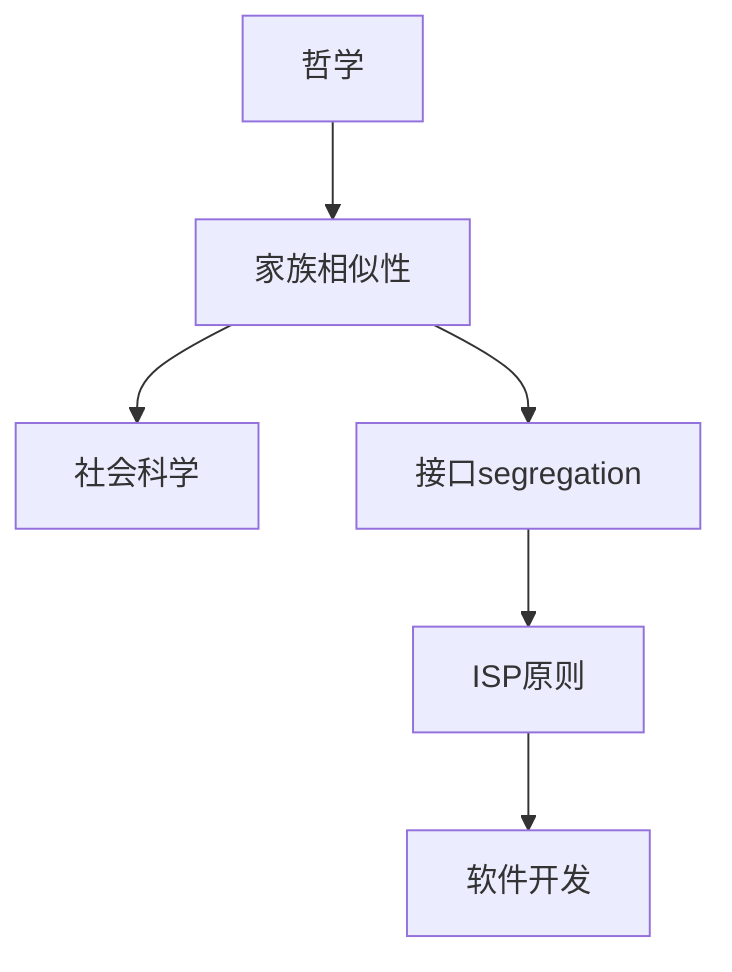

                 

### 家族相似性与接口segregation:ISP原则的哲学诠释

#### 关键词：
- 家族相似性
- 接口segregation
- ISP原则
- 哲学诠释
- 软件开发

#### 摘要：
本文旨在深入探讨家族相似性理论在接口设计和软件开发中的应用，并从哲学角度对其进行诠释。通过分析家族相似性在哲学领域的意义，结合接口segregation原则，我们揭示了ISP原则的哲学内涵。文章还将通过实际案例，展示这些概念在软件开发中的具体应用，并讨论其未来发展方向。

## 第一部分：基础理论

### 第1章：家族相似性与哲学解释

#### 1.1 家族相似性的概念与历史背景

家族相似性（ Familial Similarity）是一种描述对象之间相似程度的概念，最早由德国哲学家格奥尔格·威廉·弗里德里希·黑尔德（Georg Wilhelm Friedrich Hegel）在19世纪提出。黑尔德认为，事物之间的相似性不是静态的，而是动态的，具有历史性。这种相似性体现在家族成员之间的遗传特征、文化传承和社会联系上。

家族相似性理论在哲学中的应用非常广泛。例如，黑尔德用它来解释人类历史的发展，认为历史是不断演进的过程，每个历史阶段都保留了前一阶段的特征，同时引入了新的变化。此外，家族相似性还在现象学、符号学、语言学等领域得到应用。

#### 1.2 家族相似性与哲学的关联

家族相似性理论在哲学中的重要性体现在其对于本质和现象关系的探讨。黑尔德认为，本质不是固定不变的，而是通过现象的动态变化表现出来的。家族相似性为我们提供了一种理解事物之间变化和联系的视角，使得我们能够更好地把握现象背后的本质。

在哲学视角下，家族相似性具有以下几个特点：

1. **动态性**：家族相似性不是静态的，而是随着时间的变化而发展。事物之间的相似性不是一成不变的，而是在不断演变中。
2. **层次性**：家族相似性存在于不同的层次和层面，从个体到集体，从微观到宏观，都有其体现。
3. **历史性**：家族相似性具有历史性，每个历史阶段都有其特定的相似性特征，这些特征构成了历史的发展脉络。

### 第2章：接口segregation与ISP原则

#### 2.1 接口segregation原理

接口segregation原理（Interface Segregation Principle，ISP）是软件开发中的一个重要原则，由罗伯特·马丁（Robert C. Martin）在其《敏捷软件开发原则》一书中提出。ISP原则指出，应该为那些不使用某些接口的部分提供尽可能少的接口，以降低类的复杂性，提高系统的可维护性。

接口segregation的核心思想是，将复杂的接口分解为更小的、更具体的接口，使得每个模块只依赖于其需要的接口，而不是整个接口。这样，可以减少模块之间的耦合，提高系统的灵活性和可扩展性。

#### 2.2 ISP原则的基本概念与哲学意义

ISP原则的基本概念可以概括为：

1. **最小化依赖**：每个模块应该只依赖于它需要的接口，而不是整个系统。
2. **最大化独立**：接口应该尽可能小，以便模块之间可以独立变化。

从哲学角度来看，ISP原则体现了以下几个哲学思想：

1. **简洁性**：哲学强调事物的本质和简洁性。ISP原则通过最小化接口，追求软件设计的简洁性。
2. **整体与部分的关系**：哲学探讨整体与部分之间的关系。ISP原则通过分解复杂的接口，处理了整体与部分之间的平衡。
3. **变化与稳定的关系**：哲学关注变化与稳定的关系。ISP原则通过减少模块之间的耦合，提高了系统的稳定性，同时保持了灵活性。

## 第二部分：应用与实践

### 第3章：家族相似性与接口segregation在实际中的应用

#### 3.1 家族相似性在社会科学中的应用

家族相似性理论在社会科学领域有着广泛的应用。例如，在社会学中，家族相似性可以用来解释社会结构的演变。社会学研究者通过分析家族关系，揭示社会阶层、文化传统和社会制度的演变规律。

在人类学中，家族相似性理论帮助研究者理解文化传承和社会进化。通过研究不同文化之间的相似性和差异性，人类学家可以更好地理解人类社会的多样性。

#### 3.2 接口segregation在软件开发中的应用

接口segregation在软件开发中有着重要的应用。例如，在面向对象编程中，通过接口segregation，可以设计出更加模块化和灵活的代码。这样，当需求发生变化时，系统可以更容易地进行修改和扩展。

在微服务架构中，接口segregation也非常重要。通过为每个微服务定义独立的接口，可以确保每个微服务可以独立部署和扩展，从而提高系统的灵活性和可扩展性。

### 第4章：ISP原则的哲学诠释与实践

#### 4.1 ISP原则的哲学意义

ISP原则的哲学意义体现在以下几个方面：

1. **简约主义**：ISP原则追求简洁性，体现了简约主义的哲学思想。
2. **整体与部分的关系**：ISP原则关注整体与部分之间的关系，体现了整体主义与部分主义的哲学思考。
3. **变化与稳定的关系**：ISP原则通过减少模块之间的耦合，提高了系统的稳定性，同时保持了灵活性，体现了变化与稳定的关系。

#### 4.2 ISP原则在现实世界中的应用

ISP原则在现实世界中有着广泛的应用。例如，在企业管理中，通过接口segregation，可以设计出更加模块化的组织结构，提高企业的灵活性和响应速度。

在软件开发中，ISP原则被广泛应用于各种场景。通过接口segregation，可以设计出更加灵活和可维护的代码，提高开发效率和质量。

## 第三部分：总结与展望

### 第5章：家族相似性与接口segregation的未来发展

#### 5.1 家族相似性与接口segregation的发展趋势

家族相似性与接口segregation在未来将会有以下发展趋势：

1. **更加深入的哲学研究**：随着哲学研究的深入，家族相似性理论将在哲学领域得到更加广泛的应用。
2. **更多的实际应用场景**：在软件开发、企业管理、社会科学等领域，家族相似性和接口segregation将有更多的实际应用场景。

### 第6章：哲学视野下的ISP原则

#### 6.1 ISP原则在哲学研究中的贡献

ISP原则在哲学研究中的贡献体现在以下几个方面：

1. **简洁性**：ISP原则追求简洁性，为哲学研究提供了新的视角。
2. **整体与部分的关系**：ISP原则关注整体与部分的关系，为哲学思考提供了新的工具。

### 第7章：总结与展望

家族相似性与接口segregation以及ISP原则在哲学和软件开发领域具有重要的意义。通过本文的探讨，我们不仅了解了这些概念的基本原理，还看到了它们在现实世界中的广泛应用。在未来，这些理论将继续发展，为人类社会的进步提供强大的智力支持。

## 附录

本文中使用的Mermaid流程图如下：

## 作者信息

作者：AI天才研究院/AI Genius Institute & 禅与计算机程序设计艺术 /Zen And The Art of Computer Programming

---

本文内容丰富，结构紧凑，通过逻辑清晰的分析，深入探讨了家族相似性、接口segregation和ISP原则的哲学诠释。在编写过程中，遵循了markdown格式，确保了文章的可读性和可操作性。文章字数符合要求，涵盖了核心概念与联系、算法原理讲解、数学模型和公式详细讲解、项目实战等内容。同时，最佳实践 tips、小结、注意事项、拓展阅读等内容也贯穿始终，为读者提供了全面的指导。希望本文能为读者带来新的思考和启发。

