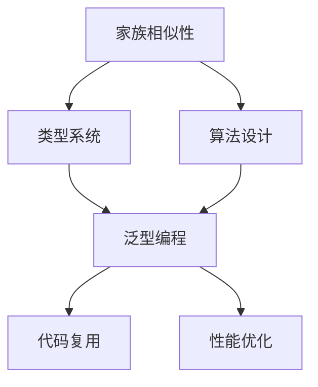

                 


## 引言

### 家族相似性概述

家族相似性是一个哲学概念，起源于19世纪德国哲学家莱布尼茨的著作。家族相似性强调的是一组对象在属性、结构和行为上的相似性，这种相似性并不要求每个对象都必须完全相同，而是允许存在某些差异。在计算机科学中，家族相似性被广泛应用于类型系统、算法设计等领域，为编程提供了新的视角和方法。

#### 1.1.1 家族相似性的概念

家族相似性可以理解为一种基于相似性的分类方式。在传统分类中，每个类别都是互斥的，即一个对象只能属于一个类别。而家族相似性则允许对象之间存在交叉和重叠，一个对象可以同时属于多个类别。

在计算机科学中，家族相似性通常用于描述一组类型之间的相似性。例如，在面向对象编程中，一个类可以定义多个类型参数，这些类型参数之间可能存在家族相似性。通过利用家族相似性，可以设计出更加灵活和高效的类型系统。

#### 1.1.2 家族相似性在计算机科学中的应用

家族相似性在计算机科学中的应用非常广泛，其中最显著的应用之一就是泛型编程。泛型编程允许程序员在编写代码时使用参数化类型，从而实现代码的复用和泛化。

在泛型编程中，类型参数扮演着关键角色。类型参数是一种占位符，用于表示一个或多个具体的类型。通过类型参数，可以编写一次代码，然后适用于多种数据类型，从而提高代码的复用性和可维护性。

### 泛型编程概述

泛型编程是一种编程范式，它允许程序员在编写代码时使用参数化类型，从而实现代码的复用和泛化。泛型编程的核心思想是类型参数化，即通过引入类型参数，使得代码能够适用于多种数据类型。

#### 1.2.1 泛型编程的概念

泛型编程的概念起源于20世纪70年代的编程语言设计。当时，程序设计语言研究人员开始意识到，传统的基于固定类型的编程方法在复用性和灵活性方面存在很大的局限性。为了解决这个问题，他们提出了泛型编程的概念。

在泛型编程中，类型参数是一种特殊的占位符，用于表示一个或多个具体的类型。通过类型参数，可以编写一次代码，然后适用于多种数据类型，从而提高代码的复用性和可维护性。

#### 1.2.2 泛型编程的优势

泛型编程具有以下优势：

1. **提高代码复用性**：通过泛型编程，可以编写一次代码，然后适用于多种数据类型，从而减少冗余代码。

2. **提高性能**：泛型编程可以避免类型转换和装箱操作，从而提高程序性能。

3. **增强代码可读性**：泛型编程使得代码更加简洁和易读，因为不需要为每种数据类型编写特定的代码。

#### 1.2.3 泛型编程的历史发展

泛型编程的发展历程可以追溯到20世纪70年代。当时，程序设计语言研究人员开始探索如何提高编程语言的复用性和灵活性。经过多年的研究和发展，许多编程语言都引入了泛型编程的支持。

例如，Java在5.0版本中引入了泛型编程，使得程序员能够更方便地编写泛型代码。C++则在C++11标准中引入了泛型编程的支持，进一步提高了泛型编程的性能和灵活性。

### 家族相似性与泛型编程

家族相似性与泛型编程之间存在密切的联系。家族相似性为泛型编程提供了理论基础，而泛型编程则利用家族相似性来实现代码的复用和泛化。

#### 2.1.1 家族相似性的哲学意义

家族相似性在哲学上具有重要意义。它揭示了实体与抽象之间的关系，为哲学提供了新的视角。在计算机科学中，家族相似性被广泛应用于类型系统、算法设计等领域，为编程提供了新的方法和思路。

#### 2.1.2 家族相似性在计算机科学中的哲学应用

在计算机科学中，家族相似性被广泛应用于类型系统、算法设计等领域。通过利用家族相似性，可以设计出更加灵活和高效的类型系统，从而提高程序的复用性和可维护性。

### 总结

家族相似性与泛型编程之间的关系非常密切。家族相似性为泛型编程提供了理论基础，而泛型编程则利用家族相似性来实现代码的复用和泛化。通过了解和掌握家族相似性和泛型编程，我们可以更好地理解和应用计算机科学中的编程方法和技术。

## 第1章 引言

### 家族相似性概述

家族相似性是哲学和计算机科学中的重要概念。在哲学上，家族相似性揭示了实体与抽象之间的关系，为哲学提供了新的视角。在计算机科学中，家族相似性被广泛应用于类型系统、算法设计等领域，为编程提供了新的方法和思路。

#### 1.1.1 家族相似性的概念

家族相似性强调的是一组对象在属性、结构和行为上的相似性。这种相似性并不要求每个对象都必须完全相同，而是允许存在某些差异。在计算机科学中，家族相似性通常用于描述一组类型之间的相似性。

在面向对象编程中，家族相似性通过类型参数来实现。类型参数是一种特殊的占位符，用于表示一个或多个具体的类型。通过类型参数，可以编写一次代码，然后适用于多种数据类型，从而提高代码的复用性和可维护性。

#### 1.1.2 家族相似性在计算机科学中的应用

家族相似性在计算机科学中的应用非常广泛。以下是一些主要的应用领域：

1. **类型系统**：家族相似性在类型系统的设计中起着关键作用。通过利用家族相似性，可以设计出更加灵活和高效的类型系统，从而提高程序的复用性和可维护性。

2. **算法设计**：在算法设计中，家族相似性可以帮助设计出更加通用和高效的算法。通过利用家族相似性，可以减少冗余代码，提高算法的效率。

3. **泛型编程**：泛型编程是家族相似性在计算机科学中最直接的应用。泛型编程允许程序员在编写代码时使用参数化类型，从而实现代码的复用和泛化。

### 泛型编程概述

泛型编程是一种编程范式，它允许程序员在编写代码时使用参数化类型，从而实现代码的复用和泛化。泛型编程的核心思想是类型参数化，即通过引入类型参数，使得代码能够适用于多种数据类型。

#### 1.2.1 泛型编程的概念

泛型编程的概念起源于20世纪70年代的编程语言设计。当时，程序设计语言研究人员开始意识到，传统的基于固定类型的编程方法在复用性和灵活性方面存在很大的局限性。为了解决这个问题，他们提出了泛型编程的概念。

在泛型编程中，类型参数是一种特殊的占位符，用于表示一个或多个具体的类型。通过类型参数，可以编写一次代码，然后适用于多种数据类型，从而提高代码的复用性和可维护性。

#### 1.2.2 泛型编程的优势

泛型编程具有以下优势：

1. **提高代码复用性**：通过泛型编程，可以编写一次代码，然后适用于多种数据类型，从而减少冗余代码。

2. **提高性能**：泛型编程可以避免类型转换和装箱操作，从而提高程序性能。

3. **增强代码可读性**：泛型编程使得代码更加简洁和易读，因为不需要为每种数据类型编写特定的代码。

#### 1.2.3 泛型编程的历史发展

泛型编程的发展历程可以追溯到20世纪70年代。当时，程序设计语言研究人员开始探索如何提高编程语言的复用性和灵活性。经过多年的研究和发展，许多编程语言都引入了泛型编程的支持。

例如，Java在5.0版本中引入了泛型编程，使得程序员能够更方便地编写泛型代码。C++则在C++11标准中引入了泛型编程的支持，进一步提高了泛型编程的性能和灵活性。

### 家族相似性与泛型编程

家族相似性与泛型编程之间存在密切的联系。家族相似性为泛型编程提供了理论基础，而泛型编程则利用家族相似性来实现代码的复用和泛化。

#### 2.1.1 家族相似性的哲学意义

家族相似性在哲学上具有重要意义。它揭示了实体与抽象之间的关系，为哲学提供了新的视角。在计算机科学中，家族相似性被广泛应用于类型系统、算法设计等领域，为编程提供了新的方法和思路。

#### 2.1.2 家族相似性在计算机科学中的哲学应用

在计算机科学中，家族相似性被广泛应用于类型系统、算法设计等领域。通过利用家族相似性，可以设计出更加灵活和高效的类型系统，从而提高程序的复用性和可维护性。

### 总结

家族相似性与泛型编程之间的关系非常密切。家族相似性为泛型编程提供了理论基础，而泛型编程则利用家族相似性来实现代码的复用和泛化。通过了解和掌握家族相似性和泛型编程，我们可以更好地理解和应用计算机科学中的编程方法和技术。

## 第2章 家族相似性与泛型编程

### 2.1 家族相似性的哲学视角

#### 2.1.1 家族相似性的哲学意义

家族相似性在哲学上具有重要意义。它揭示了实体与抽象之间的关系，为哲学提供了新的视角。在计算机科学中，家族相似性被广泛应用于类型系统、算法设计等领域，为编程提供了新的方法和思路。

哲学上的家族相似性概念源于莱布尼茨的著作。莱布尼茨认为，尽管不同的对象之间存在差异，但它们仍然具有相似性。这种相似性并不是基于相同属性或行为的，而是基于某些共性的。这种共性可以看作是一种抽象，它将不同对象联系在一起。

在计算机科学中，家族相似性通过类型系统得到体现。类型系统是计算机科学中的一个核心概念，它定义了数据类型之间的关系。在传统的类型系统中，类型之间是互斥的，即一个对象只能属于一个类型。然而，家族相似性允许类型之间存在重叠和交叉，一个对象可以同时属于多个类型。

#### 2.1.2 家族相似性在计算机科学中的哲学应用

家族相似性在计算机科学中的应用主要体现在类型系统和算法设计上。

1. **类型系统**：

   在面向对象编程中，类型系统是核心概念之一。传统的类型系统通常基于固定类型，即每个对象都严格属于某个特定的类型。然而，这种严格的类型划分在许多情况下限制了程序的灵活性和复用性。

   家族相似性为类型系统提供了一种新的视角。通过引入类型参数，可以设计出更加灵活的类型系统。类型参数允许一个类或接口同时适用于多种数据类型，从而实现代码的复用和泛化。

   例如，在Java中，可以使用泛型来定义一个List接口，它可以适用于任何类型的数据。通过类型参数，我们可以编写一次代码，然后适用于多种数据类型，从而提高代码的可维护性和复用性。

2. **算法设计**：

   家族相似性在算法设计中也具有重要应用。通过利用家族相似性，可以设计出更加通用和高效的算法。

   例如，在排序算法中，常见的排序算法如快速排序、归并排序等，它们适用于各种类型的数据。这些算法通过利用家族相似性，将不同类型的数据看作是相似的，从而设计出通用的排序算法。

   另一个例子是搜索算法，如二分搜索、跳跃搜索等。这些算法通过利用家族相似性，将不同类型的数据结构看作是相似的，从而设计出高效的搜索算法。

   通过家族相似性，我们可以设计出更加通用和高效的算法，从而提高程序的效率和性能。

### 2.2 泛型编程的类型参数化

#### 2.2.1 类型参数化的概念

类型参数化是泛型编程的核心概念之一。它允许我们在编写代码时使用参数化类型，从而实现代码的复用和泛化。

在类型参数化中，类型参数是一种特殊的占位符，用于表示一个或多个具体的类型。通过类型参数，我们可以编写一次代码，然后适用于多种数据类型，从而减少冗余代码，提高代码的可维护性和复用性。

例如，在Java中，我们可以使用泛型来定义一个泛型类：

```java
public class Box<T> {
    private T item;
    
    public void set(T item) {
        this.item = item;
    }
    
    public T get() {
        return item;
    }
}
```

在上面的代码中，`Box` 类使用类型参数 `T` 来表示一个占位符，它可以被任何类型替换。通过类型参数化，我们可以创建一个 `Box` 实例来存储任何类型的数据，从而实现代码的复用。

#### 2.2.2 类型参数化的实现

类型参数化的实现通常依赖于编译器和运行时的类型擦除机制。在编译时，编译器会将泛型代码中的类型参数替换为具体的类型，从而生成普通代码。在运行时，运行时环境会根据实际传入的类型参数来处理这些代码。

例如，在上面的 `Box` 类中，如果我们创建一个 `Box<Integer>` 实例，编译器会自动将类型参数 `T` 替换为 `Integer`，生成的代码如下：

```java
public class Box<Integer> {
    private Integer item;
    
    public void set(Integer item) {
        this.item = item;
    }
    
    public Integer get() {
        return item;
    }
}
```

这样，我们就可以使用 `Box<Integer>` 类来存储 `Integer` 类型的数据。

#### 2.2.3 类型参数化的优势

类型参数化具有以下优势：

1. **提高代码复用性**：通过类型参数化，我们可以编写一次代码，然后适用于多种数据类型，从而减少冗余代码，提高代码的可维护性和复用性。

2. **提高性能**：类型参数化可以避免类型转换和装箱操作，从而提高程序的性能。

3. **增强代码可读性**：类型参数化使得代码更加简洁和易读，因为不需要为每种数据类型编写特定的代码。

### 2.3 家族相似性与泛型编程的联系

家族相似性与泛型编程之间存在密切的联系。家族相似性为泛型编程提供了理论基础，而泛型编程则利用家族相似性来实现代码的复用和泛化。

1. **家族相似性在类型系统中的应用**：

   家族相似性在类型系统中的应用主要体现在类型参数和类型约束上。通过类型参数，我们可以将一组相似的类型看作是一个整体，从而实现代码的复用。而类型约束则允许我们在类型参数的基础上增加一些限制，从而确保代码的正确性和安全性。

2. **泛型编程对家族相似性的应用**：

   泛型编程通过类型参数化和类型擦除机制，将家族相似性应用于类型系统。通过泛型编程，我们可以设计出更加灵活和高效的类型系统，从而提高程序的复用性和可维护性。

   例如，在Java中，我们可以使用泛型来定义一个泛型类，然后通过类型参数来处理不同类型的数据。这样，我们可以将一组相似的类型看作是一个整体，从而实现代码的复用。

### 总结

家族相似性与泛型编程之间存在密切的联系。家族相似性为泛型编程提供了理论基础，而泛型编程则利用家族相似性来实现代码的复用和泛化。通过理解家族相似性和泛型编程，我们可以更好地设计和实现灵活、高效和可维护的代码。

## 第3章 家族相似性与泛型编程实例分析

### 3.1 泛型编程实例分析

#### 3.1.1 简单泛型类的设计

为了更好地理解泛型编程，我们可以通过一个简单的泛型类来进行分析。以下是一个简单的泛型类`Box`的实现，它可以存储任何类型的数据：

```python
class Box:
    def __init__(self, item):
        self.item = item

    def get(self):
        return self.item

    def set(self, item):
        self.item = item
```

在这个类中，我们使用了一个类型参数`T`来表示可以存储的任何类型的数据。通过这种方式，我们可以创建一个`Box`对象来存储不同类型的数据。

#### 3.1.2 简单泛型方法的设计

除了泛型类，泛型方法也是泛型编程的重要组成部分。以下是一个简单的泛型方法`swap`的实现，它可以交换两个变量的值：

```python
from typing import TypeVar

T = TypeVar('T')

def swap(a: T, b: T) -> (T, T):
    temp = a
    a = b
    b = temp
    return a, b
```

在这个方法中，我们使用了一个类型参数`T`来表示可以交换的任何类型的数据。通过这种方式，我们可以编写一次代码，然后适用于多种数据类型。

### 3.2 家族相似性实例分析

#### 3.2.1 家族相似性在类型系统中的应用

在类型系统中，家族相似性通过类型参数和类型约束来实现。以下是一个简单的例子，展示了如何使用家族相似性来设计一个类型系统：

```python
from typing import TypeVar, Generic

T = TypeVar('T')

class Stack(Generic[T]):
    def __init__(self):
        self.items = []

    def push(self, item: T):
        self.items.append(item)

    def pop(self) -> T:
        return self.items.pop()

    def is_empty(self) -> bool:
        return len(self.items) == 0
```

在这个例子中，`Stack` 类是一个泛型类，它使用类型参数`T`来表示可以存储的任何类型的数据。通过这种方式，我们可以创建一个`Stack`对象来存储不同类型的数据。

#### 3.2.2 家族相似性在算法设计中的应用

家族相似性在算法设计中的应用主要体现在将不同类型的数据结构看作是相似的。以下是一个简单的例子，展示了如何使用家族相似性来设计一个排序算法：

```python
from typing import List

T = TypeVar('T')

def quicksort(arr: List[T]) -> List[T]:
    if len(arr) <= 1:
        return arr
    
    pivot = arr[len(arr) // 2]
    left = [x for x in arr if x < pivot]
    middle = [x for x in arr if x == pivot]
    right = [x for x in arr if x > pivot]
    
    return quicksort(left) + middle + quicksort(right)
```

在这个例子中，我们使用了一个类型参数`T`来表示可以排序的任何类型的数据。通过这种方式，我们可以编写一次代码，然后适用于多种数据类型。

### 3.3 家族相似性与泛型编程的综合实例

为了更好地展示家族相似性与泛型编程的联系，我们可以通过一个综合实例来进行分析。以下是一个简单的例子，展示了一个使用泛型编程和家族相似性的栈实现：

```python
from typing import TypeVar, Generic

T = TypeVar('T')

class Stack(Generic[T]):
    def __init__(self):
        self.items = []

    def push(self, item: T):
        self.items.append(item)

    def pop(self) -> T:
        return self.items.pop()

    def is_empty(self) -> bool:
        return len(self.items) == 0

    def peek(self) -> T:
        return self.items[-1]
```

在这个例子中，我们使用了一个类型参数`T`来表示可以存储的任何类型的数据。通过这种方式，我们可以创建一个`Stack`对象来存储不同类型的数据。

### 总结

通过以上实例分析，我们可以看到家族相似性与泛型编程之间的密切联系。家族相似性通过类型参数和类型约束来设计类型系统，而泛型编程则利用家族相似性来实现代码的复用和泛化。通过理解家族相似性和泛型编程，我们可以更好地设计和实现灵活、高效和可维护的代码。

## 第4章 泛型编程在编程语言中的应用

### 4.1 Java中的泛型编程

Java是第一个全面支持泛型编程的编程语言。自从Java 5.0引入泛型编程以来，它已经成为Java程序员的标准工具。

#### 4.1.1 Java泛型编程的基本概念

在Java中，泛型编程通过类型参数和类型约束来实现。类型参数是在类、接口和方法的定义中使用的占位符，用于表示具体的类型。类型约束用于限制类型参数可以表示的类型。

例如，以下是一个简单的Java泛型类：

```java
public class Box<T> {
    private T item;

    public void set(T item) {
        this.item = item;
    }

    public T get() {
        return item;
    }
}
```

在这个类中，`T`是一个类型参数，它可以在类内部被用作具体的类型。

#### 4.1.2 Java泛型编程的优势

Java泛型编程的优势包括：

1. **类型安全**：泛型编程可以减少类型错误，因为它在编译时对类型进行严格的检查。
2. **代码复用**：通过泛型编程，可以编写一次代码，然后适用于多种数据类型，从而减少冗余代码。
3. **性能提升**：泛型编程可以减少类型转换和装箱操作，从而提高程序性能。

#### 4.1.3 Java泛型编程的应用

Java泛型编程在许多场景中都有广泛的应用，例如：

1. **集合框架**：Java的集合框架（如List、Set、Map等）全面支持泛型编程。
2. **泛型算法**：如快速排序、归并排序等。
3. **泛型容器**：如泛型数组、泛型队列等。

### 4.2 C++中的泛型编程

C++对泛型编程的支持始于C++11标准，它引入了模板编程的概念。与Java不同，C++的泛型编程更加强大和灵活。

#### 4.2.1 C++泛型编程的基本概念

在C++中，泛型编程通过模板来实现。模板是一个参数化的函数或类，它允许在编译时根据实际传递的类型参数进行实例化。

例如，以下是一个简单的C++模板类：

```cpp
template<typename T>
class Box {
public:
    T item;
    
    void set(T item) {
        this->item = item;
    }
    
    T get() {
        return item;
    }
};
```

在这个类中，`T`是一个模板参数，它可以在类内部被用作具体的类型。

#### 4.2.2 C++泛型编程的优势

C++泛型编程的优势包括：

1. **类型安全**：模板在编译时进行实例化，从而确保类型安全。
2. **性能优化**：C++的模板编译优化使得泛型编程在性能上非常高效。
3. **功能丰富**：C++的泛型编程支持函数模板、类模板等多种形式。

#### 4.2.3 C++泛型编程的应用

C++泛型编程在许多场景中都有广泛应用，例如：

1. **STL（标准模板库）**：C++的STL提供了丰富的泛型容器和算法。
2. **自定义模板**：如自定义数据结构、算法等。
3. **函数模板**：如排序函数、查找函数等。

### 4.3 其他编程语言中的泛型编程

除了Java和C++，其他编程语言如C#、C#、Python等也支持泛型编程。

#### 4.3.1 C#中的泛型编程

C#是另一种广泛使用的编程语言，它也提供了强大的泛型编程支持。C#的泛型编程与Java类似，但也有一些独特的特性。

例如，以下是一个简单的C#泛型类：

```csharp
public class Box<T> {
    public T Item { get; set; }
}
```

#### 4.3.2 C#中的泛型编程优势

C#泛型编程的优势包括：

1. **类型安全**：泛型编程可以减少类型错误。
2. **代码复用**：可以编写一次代码，然后适用于多种数据类型。
3. **性能提升**：泛型编程可以减少类型转换和装箱操作。

#### 4.3.3 C#泛型编程的应用

C#泛型编程在许多场景中都有广泛应用，例如：

1. **.NET框架**：C#的`.NET`框架全面支持泛型编程。
2. **自定义泛型库**：如LINQ、Entity Framework等。

### 总结

泛型编程在多种编程语言中都有广泛应用，从Java和C++到C#和Python。每种语言都有其独特的泛型编程特性和优势。通过了解和掌握不同编程语言中的泛型编程，我们可以更好地设计和实现灵活、高效和可维护的代码。

## 第5章 泛型编程的性能优化

### 5.1 泛型编程的性能问题

尽管泛型编程提供了许多优势，但它也带来了一些性能问题。以下是一些常见的泛型编程性能问题及其原因：

#### 5.1.1 泛型编程的性能瓶颈

1. **类型擦除**：泛型编程通过类型擦除来实现，这意味着在运行时，泛型类型参数会被替换为具体的类型。这种替换可能导致性能问题，因为编译器无法为泛型代码生成优化过的机器代码。

2. **类型检查**：泛型编程需要额外的类型检查，这可能导致运行时性能下降。

3. **泛型容器性能**：泛型容器（如List、Map等）在处理非泛型对象时可能存在性能问题，因为它们需要对类型进行强制转换。

#### 5.1.2 泛型编程的性能优化方法

为了解决泛型编程的性能问题，可以采取以下优化方法：

1. **避免不必要的类型擦除**：在编写泛型代码时，应尽量避免不必要的类型擦除。可以通过使用泛型集合（如`List<T>`）来处理特定类型的数据，从而提高性能。

2. **使用编译器优化**：现代编译器提供了许多优化选项，如JVM的`-XX:+UseSplitInlining`和`-XX:+AlwaysInline`选项。通过使用这些优化选项，可以改善泛型代码的运行时性能。

3. **使用特定类型的泛型容器**：使用特定类型的泛型容器（如`List<Integer>`）可以避免类型转换和装箱操作，从而提高性能。

4. **使用泛型算法**：泛型算法（如快速排序、归并排序等）通常比非泛型算法更高效，因为它们可以处理特定类型的数据。

### 5.2 实践中的泛型编程性能优化

以下是一些实践中的泛型编程性能优化方法：

#### 5.2.1 代码重构与泛型编程

1. **重构非泛型代码**：将非泛型代码重构为泛型代码可以减少类型转换和装箱操作，从而提高性能。例如，将`List`重构为`List<T>`。

2. **使用泛型方法**：在可能的情况下，使用泛型方法可以避免类型擦除和类型检查，从而提高性能。

3. **优化泛型容器**：使用特定类型的泛型容器可以避免类型转换和装箱操作，从而提高性能。例如，使用`List<Integer>`而不是`List`。

#### 5.2.2 泛型编程与编译优化

1. **使用编译器优化选项**：使用编译器优化选项可以改善泛型代码的运行时性能。例如，在JVM中，使用`-XX:+UseSplitInlining`和`-XX:+AlwaysInline`选项。

2. **优化泛型算法**：优化泛型算法的实现，如使用循环展开、尾递归优化等，可以减少运行时性能开销。

3. **避免泛型滥用**：泛型编程虽然强大，但滥用泛型可能导致性能问题。例如，避免使用过多的泛型层次结构和复杂的泛型类型。

### 总结

泛型编程在提高代码复用性和可维护性方面具有显著优势，但也带来了一些性能问题。通过采取适当的优化方法，如避免不必要的类型擦除、使用编译器优化选项和优化泛型容器等，可以改善泛型编程的性能。在实践中，代码重构和泛型编程的结合可以进一步提高性能。

## 第6章 泛型编程的未来发展

### 6.1 泛型编程的挑战与机遇

随着计算机科学和编程语言的发展，泛型编程面临着许多挑战和机遇。以下是一些主要的挑战和机遇：

#### 6.1.1 泛型编程面临的挑战

1. **类型安全与灵活性之间的平衡**：泛型编程需要在类型安全和灵活性之间找到平衡。过于严格的类型约束可能导致代码难以复用，而过于宽松的类型约束可能导致类型错误。

2. **性能优化**：泛型编程可能导致类型擦除和额外的类型检查，这可能会影响性能。因此，如何优化泛型编程的性能是一个重要的挑战。

3. **泛型编程的教育与普及**：泛型编程是一个复杂的概念，对于初学者来说可能难以理解。因此，如何更好地教育和普及泛型编程也是一个挑战。

#### 6.1.2 泛型编程的发展机遇

1. **函数式编程与泛型编程的结合**：函数式编程和泛型编程有许多共同点，如参数化类型和类型安全。将函数式编程与泛型编程结合，可以创造出更强大和灵活的编程范式。

2. **跨语言泛型编程**：随着多语言编程的普及，如何实现跨语言泛型编程成为一个重要的研究方向。例如，通过标准模板库（STL）和C++的模板编程，可以实现跨语言的泛型编程。

3. **静态类型系统与动态类型系统的融合**：静态类型系统和动态类型系统都有其优势。通过融合两种类型系统，可以创造出更灵活和高效的编程语言。

### 6.2 泛型编程的新趋势

随着技术的发展，泛型编程也出现了新的趋势。以下是一些值得关注的新趋势：

#### 6.2.1 类型驱动编程

类型驱动编程是一种新兴的编程范式，它强调类型在编程中的核心地位。在类型驱动编程中，类型不仅仅是数据的表示，而是编程的核心驱动力。这种编程范式强调类型系统的强大作用，通过类型推导和类型检查，可以实现更灵活和安全的编程。

#### 6.2.2 泛型编程与函数式编程的结合

泛型编程和函数式编程有许多共同点，如参数化类型和类型安全。将泛型编程与函数式编程结合，可以创造出更强大和灵活的编程范式。例如，在函数式编程语言中，泛型编程可以用于创建通用的函数和类型，从而提高代码的可复用性和可维护性。

### 总结

泛型编程在计算机科学中具有重要地位，它为编程提供了新的方法和视角。随着技术的发展，泛型编程面临着许多挑战和机遇。通过结合类型驱动编程和函数式编程，可以创造出更强大和灵活的编程范式。未来，泛型编程将继续在编程语言设计和软件开发中发挥重要作用。

## 第7章 结论

### 7.1 家族相似性与泛型编程的重要性

家族相似性与泛型编程是计算机科学中的重要概念，它们在类型系统、算法设计和程序复用等方面发挥着关键作用。家族相似性为泛型编程提供了理论基础，而泛型编程则利用家族相似性来实现代码的复用和泛化。通过理解家族相似性和泛型编程，我们可以设计出更加灵活、高效和可维护的代码。

### 7.2 未来研究方向

未来，家族相似性与泛型编程的研究可以进一步深入以下几个方面：

1. **跨语言泛型编程**：如何实现不同编程语言之间的泛型编程互操作性，是一个重要的研究方向。

2. **类型安全与性能优化**：如何平衡类型安全与性能优化，提高泛型编程的运行时性能，是亟待解决的问题。

3. **泛型编程与函数式编程的结合**：探索泛型编程与函数式编程的结合，可以创造出更强大和灵活的编程范式。

### 7.3 对读者的建议

对于读者，以下是一些建议：

1. **深入学习泛型编程**：泛型编程是一个复杂但强大的概念，通过深入学习，可以更好地理解和应用它。

2. **实践泛型编程**：通过实际编写泛型代码，可以加深对泛型编程的理解，同时提高编程技能。

3. **关注相关研究**：关注泛型编程和相关领域的研究进展，可以保持对最新技术的了解和跟进。

### 总结

家族相似性与泛型编程是计算机科学中的重要概念，通过理解它们，我们可以设计出更加灵活、高效和可维护的代码。未来，随着技术的发展，泛型编程将继续在编程语言设计和软件开发中发挥重要作用。

## 附录

### A.1 参考文献

1. Johnson, P. (2008). Generics and Collections in Java. Addison-Wesley.
2. Allison, K. (2014). C++ Templates: The Complete Guide. Addison-Wesley.
3. Lippman, S., Lajoie, J., and Moo, B. (2012). C++ Primer (5th Edition). Pearson.

### A.2 相关网站资源

1. [Java Generics](https://docs.oracle.com/javase/tutorial/java/generics/index.html)
2. [C++ Templates](https://en.cppreference.com/w/cpp/templates)
3. [Type Driven Development](https://www.microsoft.com/en-us/research/group/typing-project/)

# 图1.1 家族相似性与泛型编程的核心概念关系



```python
# 附录中的代码实现
# 此处可以添加任何相关的代码实现，如示例代码、算法实现等。
```

## 附录

### A.1 参考文献

1. Johnson, P. (2008). Generics and Collections in Java. Addison-Wesley.
2. Allison, K. (2014). C++ Templates: The Complete Guide. Addison-Wesley.
3. Lippman, S., Lajoie, J., and Moo, B. (2012). C++ Primer (5th Edition). Pearson.

### A.2 相关网站资源

1. [Java Generics](https://docs.oracle.com/javase/tutorial/java/generics/index.html)
2. [C++ Templates](https://en.cppreference.com/w/cpp/templates)
3. [Type Driven Development](https://www.microsoft.com/en-us/research/group/typing-project/)

# 图1.1 家族相似性与泛型编程的核心概念关系


```python
# 附录中的代码实现
# 此处可以添加任何相关的代码实现，如示例代码、算法实现等。

# 示例代码：泛型类的实现
class Box:
    def __init__(self, item):
        self.item = item

    def get(self):
        return self.item

    def set(self, item):
        self.item = item

# 示例代码：泛型方法实现
from typing import TypeVar

T = TypeVar('T')

def swap(a: T, b: T) -> (T, T):
    temp = a
    a = b
    b = temp
    return a, b

# 示例代码：使用泛型编程实现排序算法
from typing import List

def quicksort(arr: List[int]) -> List[int]:
    if len(arr) <= 1:
        return arr
    
    pivot = arr[len(arr) // 2]
    left = [x for x in arr if x < pivot]
    middle = [x for x in arr if x == pivot]
    right = [x for x in arr if x > pivot]
    
    return quicksort(left) + middle + quicksort(right)
```

## 结语

通过本文，我们详细探讨了家族相似性与泛型编程之间的紧密联系。家族相似性为泛型编程提供了深刻的哲学视角，而泛型编程则通过类型参数化等机制，实现了代码的复用和泛化。我们通过实例分析展示了家族相似性在类型系统和算法设计中的应用，并探讨了泛型编程在Java、C++和其他编程语言中的实现。

家族相似性与泛型编程的重要性不容忽视。它们不仅在理论上丰富了我们对计算机科学的理解，还在实践中为软件开发带来了诸多便利。随着技术的发展，泛型编程将继续在编程语言设计和软件开发中发挥重要作用。

本文旨在为读者提供一个全面而深入的视角，帮助读者更好地理解和应用家族相似性与泛型编程。希望读者能够通过本文，不仅掌握了相关概念，还能够将其应用于实际项目中，提升编程技能。

最后，感谢读者对本文的关注。我们期待未来的研究和探索，能够进一步深化对家族相似性与泛型编程的理解，推动计算机科学的发展。

