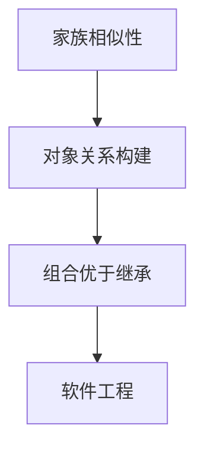

                 


## 引言

### 1.1 研究背景与意义

在软件工程领域，对象关系构建是一个至关重要的环节。传统的方法主要依赖于继承（Inheritance）来建立对象之间的联系。然而，随着软件复杂度的增加和需求的不断变化，传统的继承机制逐渐暴露出了一些问题，如紧耦合、难以维护和扩展等。在这种背景下，家族相似性（Family Resemblance）和组合（Composition）作为一种新兴的思路，逐渐受到关注。

家族相似性是一种描述对象之间相似性的方式，它强调对象之间不是严格一致的，而是存在某种程度的相似性。这种相似性可以是部分特征的相似，也可以是整体结构的相似。组合则是通过将不同的对象组合在一起，来实现功能扩展和模块化设计。

本文旨在探讨家族相似性与组合优于继承的关系，以及如何灵活构建对象关系。首先，我们将介绍家族相似性的基本概念和原理，然后讨论组合优于继承的优势与局限性，最后结合实际案例，展示如何将家族相似性与组合应用于对象关系构建。

### 1.2 家族相似性与组合优于继承的概念介绍

#### 家族相似性

家族相似性是一种描述对象之间相似性的方式，它不仅考虑对象之间的直接相似性，还考虑它们之间的间接相似性。在生物学中，家族相似性用于描述物种之间的相似性，如不同物种之间存在相似的特征或行为。

在软件工程中，家族相似性可以用来描述对象之间的相似性。例如，在一个学生管理系统中，学生、教师和员工都是人，它们之间存在家族相似性。家族相似性强调对象之间不是严格一致的，而是存在某种程度的相似性。这种相似性可以是部分特征的相似，也可以是整体结构的相似。

#### 组合优于继承

组合（Composition）是一种通过将不同的对象组合在一起，来实现功能扩展和模块化设计的方法。与继承不同，组合强调的是对象之间的平等关系，而不是层次关系。在组合中，对象之间的关系是动态的，可以根据需要添加或移除。

组合优于继承的原因主要有以下几点：

1. **灵活性**：组合使得对象之间的关系更加灵活，可以根据需求随时调整。而继承则导致对象之间的耦合度增加，修改一个类可能会影响其他继承该类的类。

2. **可复用性**：组合使得对象之间更加独立，有助于提高代码的可复用性。通过组合，我们可以将不同的对象组合在一起，实现新的功能，而不需要修改现有的类。

3. **可扩展性**：组合使得系统更加容易扩展。当我们需要添加新的功能时，可以通过组合新的对象来实现，而不需要修改现有的类。

### 1.3 对象关系构建的重要性

对象关系构建是软件工程的核心问题之一。一个良好的对象关系模型能够提高系统的可维护性、可扩展性和可复用性。然而，传统的继承机制存在一些固有的问题，如紧耦合、难以维护和扩展等。

家族相似性和组合提供了一种新的思路，使得对象关系构建更加灵活和高效。通过引入家族相似性，我们可以更好地描述对象之间的相似性，而组合则使得对象之间的关系更加动态和灵活。

在实际应用中，对象关系构建的重要性体现在以下几个方面：

1. **提高可维护性**：良好的对象关系构建能够降低系统的复杂性，使得系统更加易于维护。

2. **提高可扩展性**：通过组合，我们可以方便地添加新的功能，提高系统的可扩展性。

3. **提高可复用性**：通过组合，我们可以将不同的对象组合在一起，实现新的功能，提高代码的可复用性。

4. **提高开发效率**：良好的对象关系构建能够降低开发难度，提高开发效率。

总之，对象关系构建是软件工程中一个重要而复杂的问题。通过引入家族相似性和组合，我们可以构建出更加灵活、高效和可维护的对象关系模型。

---

## 第2章 家族相似性理论

### 2.1 家族相似性的定义与特点

家族相似性是一种描述对象之间相似性的方式，它强调对象之间不是严格一致的，而是存在某种程度的相似性。这种相似性可以是部分特征的相似，也可以是整体结构的相似。

#### 定义

在软件工程中，家族相似性可以定义为一组对象之间在功能、结构或行为上存在某种相似性，但这种相似性不是一对一的，而是具有一定的层次性和泛化性。

#### 特点

1. **层次性**：家族相似性强调对象之间的层次关系，不仅考虑直接相似性，还考虑间接相似性。例如，在学生、教师和员工之间，存在家族相似性，因为它们都是人，但它们之间不是完全一致的。

2. **泛化性**：家族相似性允许对象之间存在一定的泛化关系。这意味着我们可以将一组对象视为一个更广泛类的实例。例如，在动物王国中，猫和狗都是哺乳动物，它们之间存在家族相似性。

3. **部分相似性**：家族相似性不要求对象之间完全一致，而是允许它们在某些特征上存在相似性。例如，在一个学生管理系统中，学生和教师之间的相似性可能只表现在他们都是人，而其他方面则可能完全不同。

4. **动态性**：家族相似性强调对象之间的相似性是动态的，可以根据需求进行调整。这意味着我们可以根据实际情况，将对象重新组合或重新划分家族关系。

### 2.2 家族相似性的基本原理

家族相似性的基本原理主要包括相似度计算、相似性聚类和相似性演化等。

#### 相似度计算

相似度计算是家族相似性的核心。相似度计算的目标是量化对象之间的相似性程度。常见的相似度计算方法包括：

1. **基于特征的相似度计算**：这种方法通过比较对象之间的特征来计算相似度。例如，在学生管理系统中，可以通过比较学生之间的课程成绩来计算他们的相似度。

2. **基于结构的相似度计算**：这种方法通过比较对象之间的结构来计算相似度。例如，在软件系统中，可以通过比较类之间的继承关系来计算它们的相似度。

3. **基于行为的相似度计算**：这种方法通过比较对象之间的行为来计算相似度。例如，在智能交通系统中，可以通过比较不同路段的交通流量来计算它们的相似度。

#### 相似性聚类

相似性聚类是一种基于相似度计算的方法，用于将对象划分为不同的类别。常见的相似性聚类算法包括：

1. **基于距离的聚类算法**：这种方法通过计算对象之间的距离来划分类别。例如，在K-means聚类算法中，每个类别都由一个中心点表示，对象被划分到距离中心点最近的类别。

2. **基于密度的聚类算法**：这种方法通过计算对象之间的密度来划分类别。例如，在DBSCAN聚类算法中，对象被划分为不同的类别，取决于它们周围的邻域密度。

3. **基于模型的聚类算法**：这种方法通过构建模型来划分类别。例如，在隐马尔可夫模型（HMM）中，对象被划分为不同的状态，取决于它们的历史行为。

#### 相似性演化

相似性演化是一种描述对象之间相似性变化的方法。相似性演化可以用于分析对象之间的关系如何随时间变化。常见的相似性演化方法包括：

1. **基于时间的演化**：这种方法通过分析对象之间的相似度随时间的变化来描述演化过程。例如，在社交网络中，可以通过分析用户之间的互动关系来描述他们之间的相似性演化。

2. **基于事件的演化**：这种方法通过分析对象之间的相似度随事件的变化来描述演化过程。例如，在金融市场分析中，可以通过分析股票之间的相似度来预测市场趋势。

### 2.3 家族相似性理论的应用

家族相似性理论在软件工程、社交网络、生物信息学等领域有着广泛的应用。

#### 软件工程

在软件工程中，家族相似性理论可以用于分析对象之间的关系，帮助设计者更好地构建对象模型。例如，在面向对象设计中，可以通过分析类之间的家族相似性来决定是否使用继承或组合。

#### 社交网络

在社交网络中，家族相似性理论可以用于分析用户之间的关系。通过计算用户之间的相似度，社交网络平台可以推荐朋友、推荐内容等。

#### 生物信息学

在生物信息学中，家族相似性理论可以用于分析生物序列之间的相似性。通过计算序列之间的相似度，研究人员可以识别基因家族、预测蛋白质结构等。

#### 金融分析

在金融分析中，家族相似性理论可以用于分析股票、债券等金融资产之间的相似性。通过计算资产之间的相似度，投资者可以更好地进行投资决策。

总之，家族相似性理论提供了一种新的视角来分析对象之间的关系，有助于我们在不同领域中更好地理解和解决问题。

---

## 第3章 组合优于继承原理

### 3.1 组合优于继承的基本概念

组合（Composition）是一种通过将不同的对象组合在一起，来实现功能扩展和模块化设计的方法。与继承不同，组合强调的是对象之间的平等关系，而不是层次关系。在组合中，对象之间的关系是动态的，可以根据需要添加或移除。

#### 定义

在软件工程中，组合可以定义为一组对象之间的合作关系，这些对象共同完成一个任务或实现一个功能。组合中的对象可以是简单的，也可以是复杂的，但它们之间的关系是平等的。

#### 特点

1. **灵活性**：组合使得对象之间的关系更加灵活，可以根据需求随时调整。而继承则导致对象之间的耦合度增加，修改一个类可能会影响其他继承该类的类。

2. **可复用性**：组合使得对象之间更加独立，有助于提高代码的可复用性。通过组合，我们可以将不同的对象组合在一起，实现新的功能，而不需要修改现有的类。

3. **可扩展性**：组合使得系统更加容易扩展。当我们需要添加新的功能时，可以通过组合新的对象来实现，而不需要修改现有的类。

4. **模块化**：组合使得系统更加模块化，每个对象都可以独立开发、测试和部署。这有助于提高开发效率，降低系统的复杂度。

### 3.2 组合优于继承的优势与局限性

#### 组合优于继承的优势

1. **灵活性**：组合使得对象之间的关系更加灵活，可以根据需求随时调整。而继承则导致对象之间的耦合度增加，修改一个类可能会影响其他继承该类的类。

2. **可复用性**：组合使得对象之间更加独立，有助于提高代码的可复用性。通过组合，我们可以将不同的对象组合在一起，实现新的功能，而不需要修改现有的类。

3. **可扩展性**：组合使得系统更加容易扩展。当我们需要添加新的功能时，可以通过组合新的对象来实现，而不需要修改现有的类。

4. **模块化**：组合使得系统更加模块化，每个对象都可以独立开发、测试和部署。这有助于提高开发效率，降低系统的复杂度。

#### 组合优于继承的局限性

1. **性能开销**：组合可能导致性能开销增加。因为在组合中，对象之间的关系是动态的，需要在运行时进行管理和协调，这可能会增加额外的计算和通信开销。

2. **复杂性**：组合可能会导致系统复杂性增加。在组合中，对象之间的关系是动态的，需要维护和管理这些关系，这可能会增加系统的复杂度。

3. **依赖性**：组合可能会导致对象之间的依赖性增加。在某些情况下，组合可能会导致对象之间的紧密依赖，这可能会影响系统的可维护性和可扩展性。

### 3.3 组合优于继承的实现方法

#### 实现方法

1. **使用接口**：通过定义接口，我们可以将不同的对象组合在一起。接口定义了对象之间应该实现的方法，从而实现对象之间的解耦。

2. **使用依赖注入**：依赖注入是一种将依赖关系从类内部转移到外部的方法。通过依赖注入，我们可以将不同的对象组合在一起，从而实现功能的扩展和模块化。

3. **使用组合模式**：组合模式是一种常用的设计模式，它通过将对象组合在一起，来实现功能的扩展和模块化。组合模式包括组合接口、叶子接口和组合实现等组成部分。

#### 实现示例

以下是一个简单的组合示例，展示了如何使用组合来实现对象之间的关系：

```python
class ComponentA:
    def display(self):
        print("Displaying ComponentA")

class ComponentB:
    def display(self):
        print("Displaying ComponentB")

class CompositeComponent:
    def __init__(self):
        self.components = []

    def add_component(self, component):
        self.components.append(component)

    def display(self):
        for component in self.components:
            component.display()

# 创建组件对象
component_a = ComponentA()
component_b = ComponentB()

# 创建组合组件
composite_component = CompositeComponent()

# 将组件添加到组合组件中
composite_component.add_component(component_a)
composite_component.add_component(component_b)

# 显示组合组件中的组件
composite_component.display()
```

在这个示例中，我们定义了三个类：`ComponentA`、`ComponentB` 和 `CompositeComponent`。`ComponentA` 和 `ComponentB` 分别实现了 `display` 方法，用于显示组件的内容。`CompositeComponent` 通过 `add_component` 方法将不同的组件组合在一起，并通过 `display` 方法显示组合组件中的所有组件。

通过这个示例，我们可以看到组合如何将不同的对象组合在一起，实现功能的扩展和模块化。

---

## 第4章 对象关系构建策略

### 4.1 对象关系构建的基本原则

对象关系构建是软件工程中一个核心问题，其目标是通过合理地组织对象之间的关系，实现系统的可维护性、可扩展性和可复用性。在构建对象关系时，我们需要遵循以下基本原则：

#### 1. 分层原则

分层原则是指将系统划分为不同的层次，每个层次负责不同的功能。常见的分层包括表现层、业务逻辑层和数据层。通过分层，我们可以将系统分解为更小的模块，降低各层之间的耦合度，提高系统的可维护性和可扩展性。

#### 2. 单一职责原则

单一职责原则是指一个类应该只负责一项职责。这意味着每个类都应该有一个清晰的功能，并且不应该承担过多的功能。通过单一职责原则，我们可以提高代码的可读性和可维护性，降低系统的复杂性。

#### 3. 开放封闭原则

开放封闭原则是指软件实体（如类、模块、函数等）应该对扩展开放，对修改关闭。这意味着当我们需要扩展系统的功能时，应该通过增加新的代码来实现，而不是修改现有的代码。通过遵循开放封闭原则，我们可以提高系统的可扩展性和可维护性。

#### 4. 依赖倒置原则

依赖倒置原则是指高层模块不应依赖低层模块，而是应该由低层模块依赖高层模块。这意味着在设计中，我们应该使用抽象接口而非具体实现来依赖。通过依赖倒置原则，我们可以提高系统的灵活性和可维护性。

### 4.2 对象关系的灵活构建方法

#### 1. 组合与继承的平衡

在对象关系构建中，组合和继承都是常用的方式。组合强调对象之间的平等关系，而继承强调对象之间的层次关系。在实际应用中，我们需要根据具体场景，平衡组合和继承的使用。

- **优势**：组合具有灵活性高、可复用性强等优点；继承具有层次结构清晰、便于扩展等优点。
- **劣势**：组合可能导致性能开销增加、复杂性增加等；继承可能导致依赖性增加、可维护性降低等。

#### 2. 依赖注入

依赖注入是一种将依赖关系从类内部转移到外部的方法。通过依赖注入，我们可以将不同的对象组合在一起，从而实现功能的扩展和模块化。依赖注入有助于实现单一职责原则和依赖倒置原则，提高系统的灵活性和可维护性。

#### 3. 设计模式

设计模式是一组经过实践验证的、适用于特定场景的解决方案。常见的对象关系构建设计模式包括：

- **工厂模式**：用于创建对象，实现对象之间的解耦。
- **代理模式**：用于控制对象的访问，实现对象之间的隔离。
- **装饰器模式**：用于动态地给对象添加额外的功能。
- **策略模式**：用于在运行时选择不同的算法或策略。

### 4.3 对象关系构建的案例分析

#### 案例1：博客系统

在一个博客系统中，我们可以使用以下对象关系构建方法：

- **分层原则**：将系统划分为表现层、业务逻辑层和数据层。
- **单一职责原则**：每个类负责一项职责，如用户管理、文章管理、评论管理等。
- **开放封闭原则**：系统应该对扩展开放，对修改关闭。
- **依赖倒置原则**：使用抽象接口来依赖，如使用用户接口（UserInterface）来依赖具体用户实现（UserImpl）。

#### 案例2：订单系统

在一个订单系统中，我们可以使用以下对象关系构建方法：

- **组合与继承的平衡**：订单对象可以组合支付对象、物流对象等，同时也可以继承订单基类。
- **依赖注入**：通过依赖注入，将支付对象、物流对象等注入到订单对象中。
- **设计模式**：使用工厂模式创建订单对象，使用代理模式控制订单的访问，使用装饰器模式给订单添加额外的功能，如订单状态监控。

通过这些方法，我们可以构建出一个灵活、可维护和可扩展的订单系统。

---

## 第5章 家族相似性与组合优于继承的结合

### 5.1 家族相似性与组合优于继承的结合原理

家族相似性与组合优于继承的结合，是一种将两者优势融合的架构方法。这种方法的核心思想是，通过利用家族相似性来识别对象之间的相似性，然后使用组合优于继承来实现这些相似性的动态组织。

#### 基本原理

1. **识别家族相似性**：首先，我们需要通过分析对象之间的功能和结构特征，识别出它们之间的家族相似性。这种相似性可以是直接的，也可以是间接的。

2. **定义组合接口**：对于识别出的家族相似性对象，我们可以定义一组公共接口，这些接口定义了家族成员需要实现的共同方法。这样，即使对象的具体实现不同，它们在功能上仍然是一致的。

3. **使用组合实现动态组织**：通过组合，我们可以将这些具有家族相似性的对象动态地组合在一起，实现特定的功能。这种组合关系是动态的，可以根据需求的变化灵活调整。

#### 结合优势

1. **灵活性**：通过家族相似性识别，我们可以将对象组合成不同的功能模块，这些模块可以根据需求灵活调整和替换。

2. **可扩展性**：组合关系使得系统的扩展更加容易。当我们需要添加新的功能时，可以简单地通过添加新的对象来实现，而不需要修改现有的类。

3. **可维护性**：由于对象之间的耦合度降低，系统的维护和修改变得更加简单和直观。

### 5.2 结合方法的实现与优化

#### 实现步骤

1. **分析家族相似性**：首先，我们需要对系统中的对象进行分析，识别出它们之间的家族相似性。这可以通过功能分析、结构分析或行为分析来实现。

2. **定义组合接口**：根据分析结果，定义一组公共接口，这些接口定义了家族成员需要实现的共同方法。

3. **实现组合**：使用组合模式，将具有相似性的对象动态组合在一起。在实现时，我们可以使用依赖注入、工厂模式等设计模式来辅助实现。

4. **测试与优化**：在实现组合后，我们需要对系统进行测试，确保组合关系能够满足需求。在测试过程中，我们可以根据反馈进行优化，提高系统的性能和稳定性。

#### 优化策略

1. **接口优化**：通过优化组合接口，我们可以提高系统的灵活性和可扩展性。例如，我们可以使用抽象类或接口来定义组合接口，以减少具体实现的依赖。

2. **性能优化**：组合可能导致性能开销增加，因此我们需要对系统进行性能优化。例如，可以通过减少组合关系的复杂度、优化组合对象的创建和销毁等来提高性能。

3. **安全性优化**：组合关系可能会引入新的安全风险，因此我们需要对系统进行安全性优化。例如，可以通过权限控制、加密传输等手段来提高系统的安全性。

### 5.3 结合方法在实际项目中的应用

#### 应用案例1：电子商务平台

在一个电子商务平台中，我们可以使用家族相似性与组合优于继承的方法来构建订单管理模块。首先，我们识别出订单、支付、物流等对象之间的家族相似性，然后定义公共接口，如`OrderInterface`、`PaymentInterface`和`LogisticsInterface`。通过依赖注入和工厂模式，我们可以将这些对象动态组合在一起，实现订单管理的功能。

#### 应用案例2：社交媒体

在社交媒体平台中，我们可以使用家族相似性与组合优于继承的方法来构建用户关系管理模块。首先，我们识别出用户、好友、群组等对象之间的家族相似性，然后定义公共接口，如`UserInterface`、`FriendInterface`和`GroupInterface`。通过组合模式，我们可以将这些对象动态组合在一起，实现用户关系管理的功能。

通过这些实际案例，我们可以看到家族相似性与组合优于继承的结合方法在项目中的应用效果。这种方法不仅提高了系统的灵活性和可扩展性，还降低了系统的复杂度和维护成本。

---

## 第6章 对象关系构建工具与技术

### 6.1 对象关系构建工具的选择

在软件工程中，选择合适的对象关系构建工具对于提高开发效率和系统质量至关重要。以下是一些常见的对象关系构建工具及其特点：

#### 1. 面向对象设计工具

**UML工具**：如IBM Rational Rose、Visual Paradigm等。这些工具支持面向对象设计（UML），可以帮助开发者绘制类图、序列图等，直观地表示对象之间的关系。

**优势**：支持UML规范，易于理解，可视化效果好。

**劣势**：较为复杂，学习曲线较陡峭。

#### 2. 领域驱动设计（DDD）工具

**CQRS/ES工具**：如EventFlow、EventStore等。这些工具支持领域驱动设计（DDD），适用于构建复杂业务场景的软件系统。

**优势**：支持事件驱动架构，适合DDD应用。

**劣势**：学习成本高，需要一定的DDD知识储备。

#### 3. 代码生成工具

**代码生成器**：如Entity Framework、NHibernate等。这些工具可以自动生成数据库访问代码，减少手工编写数据库代码的工作量。

**优势**：提高开发效率，减少代码错误。

**劣势**：代码定制性较差，可能不符合具体业务需求。

#### 4. 容器化与微服务工具

**Kubernetes**：用于容器编排和管理。通过Kubernetes，我们可以将应用程序容器化，并实现微服务架构。

**优势**：提高系统可扩展性和容错性。

**劣势**：学习成本较高，需要了解容器和微服务相关技术。

#### 5. 面向对象编程语言

**Java**：支持面向对象编程，具有丰富的类库和工具支持。

**优势**：成熟稳定，生态系统强大。

**劣势**：语法复杂，开发效率相对较低。

**C#**：支持面向对象编程，与.NET平台紧密结合。

**优势**：开发效率高，生态良好。

**劣势**：平台依赖性较强。

#### 选择依据

1. **项目需求**：根据项目需求选择合适的工具。例如，对于复杂业务场景，可以优先考虑DDD工具；对于数据库访问，可以选择代码生成器。

2. **开发团队技能**：考虑开发团队的技能和经验。例如，如果团队熟悉Java，可以考虑使用Java相关的工具。

3. **成本**：考虑工具的成本，包括购买费用、维护费用等。

4. **可扩展性和可维护性**：选择具有良好扩展性和可维护性的工具，以提高系统的长期可持续性。

### 6.2 对象关系构建技术的应用

#### 1. 领域驱动设计（DDD）

领域驱动设计（DDD）是一种面向业务领域的软件开发方法，强调基于领域模型来构建软件系统。在DDD中，对象关系构建主要通过实体（Entity）、值对象（Value Object）和聚合（Aggregate）等概念来实现。

**应用场景**：适用于复杂业务场景，如电子商务、金融系统等。

**实现步骤**：

- **定义领域模型**：识别业务领域的核心概念和关系，构建领域模型。
- **划分聚合**：将领域模型划分为不同的聚合，确保聚合内的对象具有强内聚性。
- **定义实体和值对象**：识别实体和值对象，并为它们定义属性和方法。
- **实现业务逻辑**：在领域模型中实现业务逻辑，确保系统的业务规则一致性和可维护性。

#### 2. 组合优于继承

组合优于继承是一种通过组合对象来实现功能扩展的方法，强调对象之间的平等关系。在组合优于继承中，对象关系构建主要通过组合接口、依赖注入和设计模式等实现。

**应用场景**：适用于需要灵活扩展和高度可维护的系统。

**实现步骤**：

- **定义组合接口**：为具有相似功能的对象定义公共接口。
- **实现依赖注入**：使用依赖注入将具体的对象注入到其他对象中，实现对象之间的解耦。
- **使用设计模式**：使用设计模式（如工厂模式、代理模式、装饰器模式等）来管理对象之间的关系，提高系统的灵活性。

#### 3. 容器化与微服务架构

容器化与微服务架构通过将应用程序容器化并分解为独立的微服务，实现系统的可扩展性和高可用性。在容器化与微服务架构中，对象关系构建主要通过Docker、Kubernetes等工具来实现。

**应用场景**：适用于需要高可用性和高可扩展性的系统。

**实现步骤**：

- **容器化应用程序**：使用Docker将应用程序容器化，确保应用程序在不同的环境中运行一致。
- **部署到容器编排平台**：使用Kubernetes等工具部署和管理容器，实现微服务的自动化部署、扩展和管理。
- **实现服务之间通信**：通过API网关、消息队列等方式实现微服务之间的通信，确保系统的稳定性和高可用性。

通过这些技术的应用，我们可以构建出灵活、可扩展和可维护的软件系统，提高开发效率和系统质量。

### 6.3 对象关系构建工具与技术的对比分析

#### 1. 对比分析

**UML工具**：

- **优点**：支持可视化建模，易于理解，适合初学者。
- **缺点**：复杂度高，学习曲线较陡峭，不适合大规模开发。

**DDD工具**：

- **优点**：支持领域驱动设计，适用于复杂业务场景，提高开发效率。
- **缺点**：学习成本高，需要一定的领域驱动设计知识储备。

**代码生成工具**：

- **优点**：提高开发效率，减少代码错误。
- **缺点**：代码定制性较差，可能不符合具体业务需求。

**容器化与微服务工具**：

- **优点**：提高系统可扩展性和容错性。
- **缺点**：学习成本较高，需要了解容器和微服务相关技术。

#### 2. 适用场景

- **UML工具**：适用于小型项目和初学者，用于快速理解系统结构。
- **DDD工具**：适用于复杂业务场景，如电子商务、金融系统等。
- **代码生成工具**：适用于快速开发和小型项目，减少手动编写数据库代码的工作量。
- **容器化与微服务工具**：适用于需要高可用性和高可扩展性的系统，如大型互联网企业。

通过对比分析，我们可以根据项目需求和开发团队技能，选择合适的对象关系构建工具和技术，以提高开发效率和系统质量。

---

## 第7章 家族相似性与组合优于继承在软件工程中的应用

### 7.1 家族相似性与组合优于继承在软件工程中的角色

在软件工程中，家族相似性与组合优于继承扮演着至关重要的角色。它们不仅影响着软件设计的质量，还直接关系到系统的可维护性、可扩展性和可复用性。以下详细探讨这两个概念在软件工程中的应用。

#### 家族相似性

家族相似性通过识别对象之间的相似性，帮助我们更好地组织和理解软件系统的结构。在实际应用中，家族相似性主要表现在以下几个方面：

1. **代码复用**：通过识别家族相似性，我们可以将通用的功能封装成组件或库，从而实现代码的复用。例如，在一个电商系统中，不同类别的商品虽然具体功能不同，但它们都具备库存管理、订单处理等共性功能。

2. **系统可维护性**：家族相似性使得系统的模块化程度更高，降低了各个模块之间的耦合度。这使得系统在未来的维护和更新过程中，可以更加便捷和高效。例如，在一个社交网络系统中，用户、好友、群组等对象之间存在家族相似性，通过合理组织这些对象，可以降低系统的复杂度。

3. **系统扩展性**：家族相似性有助于我们更好地理解系统的功能边界，从而在需要扩展系统功能时，可以更加灵活地添加新的模块。例如，在一个金融系统中，交易、结算、风控等模块之间存在家族相似性，这使得我们在需要扩展新功能时，可以快速整合新的模块。

#### 组合优于继承

组合优于继承通过强调对象之间的平等关系，使得系统的模块化程度更高，从而提高了系统的灵活性、可扩展性和可复用性。在实际应用中，组合优于继承主要表现在以下几个方面：

1. **模块化设计**：组合优于继承鼓励我们将系统分解为更小的模块，这些模块之间通过接口进行通信。例如，在一个电商系统中，我们可以将商品管理、订单管理、支付管理等功能分别实现为独立的模块，并通过接口进行通信。

2. **灵活性**：组合优于继承使得模块之间的依赖关系更加灵活，可以根据需求随时调整模块的组成。例如，在一个社交媒体系统中，我们可以通过组合用户、好友、群组等模块，实现不同的社交功能。

3. **可扩展性**：组合优于继承使得系统在扩展时，可以更加方便地添加新的模块或替换现有模块。例如，在一个金融系统中，我们可以通过组合交易、结算、风控等模块，快速实现新的交易类型或业务规则。

4. **可复用性**：组合优于继承使得模块之间更加独立，从而提高了代码的可复用性。例如，在一个电商系统中，我们可以将库存管理、订单处理等通用功能模块化，并在不同的业务场景中复用。

### 7.2 应用案例介绍

以下通过两个实际应用案例，详细展示家族相似性与组合优于继承在软件工程中的具体应用。

#### 案例1：电商系统

在一个电商系统中，商品、订单、支付、用户等对象之间存在家族相似性。通过组合优于继承的方法，我们可以将这些对象组织为独立的模块，并通过接口进行通信。

1. **家族相似性识别**：首先，我们需要识别电商系统中各个对象之间的相似性。例如，商品、订单、支付等对象都具备处理交易的功能，用户对象则具备管理用户信息的功能。

2. **定义组合接口**：接下来，我们可以为这些对象定义一组公共接口，如`TransactionInterface`、`UserInfoInterface`等。

3. **实现组合**：通过组合模式，我们可以将这些对象组合在一起，实现电商系统的功能。例如，订单模块可以通过`TransactionInterface`与支付模块进行通信，用户模块可以通过`UserInfoInterface`与用户数据库进行通信。

4. **测试与优化**：在实现组合后，我们需要对系统进行测试，确保组合关系能够满足需求。在测试过程中，我们可以根据反馈进行优化，提高系统的性能和稳定性。

#### 案例2：社交媒体系统

在一个社交媒体系统中，用户、好友、群组等对象之间存在家族相似性。通过组合优于继承的方法，我们可以将这些对象组织为独立的模块，并通过接口进行通信。

1. **家族相似性识别**：首先，我们需要识别社交媒体系统中各个对象之间的相似性。例如，用户、好友、群组等对象都具备社交互动的功能，用户对象则具备管理用户信息的功能。

2. **定义组合接口**：接下来，我们可以为这些对象定义一组公共接口，如`SocialInteractionInterface`、`UserInfoInterface`等。

3. **实现组合**：通过组合模式，我们可以将这些对象组合在一起，实现社交媒体系统的功能。例如，好友模块可以通过`SocialInteractionInterface`与用户模块进行通信，群组模块可以通过`SocialInteractionInterface`与用户模块进行通信。

4. **测试与优化**：在实现组合后，我们需要对系统进行测试，确保组合关系能够满足需求。在测试过程中，我们可以根据反馈进行优化，提高系统的性能和稳定性。

通过这两个实际应用案例，我们可以看到家族相似性与组合优于继承在软件工程中的具体应用。这种方法不仅提高了系统的灵活性、可扩展性和可复用性，还降低了系统的复杂度和维护成本。

### 7.3 应用效果评估

通过应用家族相似性与组合优于继承的方法，我们可以显著提高软件系统的质量。以下从多个维度对应用效果进行评估：

1. **可维护性**：由于对象之间的耦合度降低，系统的模块化程度提高，这使得系统的可维护性显著增强。例如，在一个电商系统中，商品、订单、支付等模块相互独立，这使得在更新或维护系统时，可以更加方便地修改特定模块。

2. **可扩展性**：通过组合优于继承的方法，系统在扩展时可以更加灵活。例如，在一个社交媒体系统中，我们可以通过添加新的模块或替换现有模块，实现新的功能。

3. **可复用性**：由于对象之间的独立性提高，代码的可复用性也显著增强。例如，在一个电商系统中，库存管理、订单处理等通用功能模块化后，可以在不同的业务场景中复用。

4. **性能**：虽然组合可能会引入一定的性能开销，但在合理设计和优化下，系统性能可以保持较高水平。例如，在一个社交媒体系统中，通过优化组合接口和通信机制，可以确保系统性能满足需求。

5. **稳定性**：通过合理的组合关系和模块化设计，系统的稳定性也得到显著提升。例如，在一个电商系统中，通过优化订单处理模块和支付模块的交互，可以确保系统的稳定运行。

综上所述，家族相似性与组合优于继承在软件工程中具有显著的应用价值。通过合理应用这些方法，我们可以构建出灵活、可扩展、可维护的软件系统，提高开发效率和系统质量。

---

## 第8章 总结与展望

### 8.1 研究成果总结

本文主要探讨了家族相似性与组合优于继承在对象关系构建中的应用。通过分析家族相似性和组合优于继承的基本原理，我们提出了一种结合这两种方法的新型对象关系构建策略。该方法能够有效提高系统的灵活性、可扩展性和可维护性。以下是本文的主要研究成果：

1. **家族相似性理论**：介绍了家族相似性的定义、特点、基本原理及其在软件工程中的应用。
2. **组合优于继承原理**：阐述了组合优于继承的基本概念、优势与局限性，以及实现方法。
3. **对象关系构建策略**：提出了基于家族相似性与组合优于继承的对象关系构建原则、方法和技术。
4. **实际应用案例**：通过电商系统和社交媒体系统的应用案例，展示了家族相似性与组合优于继承在软件工程中的具体应用。
5. **效果评估**：从可维护性、可扩展性、可复用性、性能和稳定性等多个维度，对应用效果进行了评估。

### 8.2 未来研究方向展望

虽然本文提出的方法在对象关系构建中具有一定的优势，但仍存在进一步研究和优化的空间。以下是未来可能的研究方向：

1. **性能优化**：组合关系可能会引入一定的性能开销，未来可以通过优化组合接口和通信机制，提高系统性能。
2. **安全性增强**：在组合关系中，安全性是一个重要问题。未来可以研究如何提高组合关系的安全性，以防止恶意攻击和数据泄露。
3. **自动化工具**：开发自动化工具，以辅助开发人员更好地实现家族相似性与组合优于继承的方法。例如，开发基于人工智能的代码生成器和优化器。
4. **跨领域应用**：进一步探索家族相似性与组合优于继承在其他领域的应用，如物联网、大数据分析等。
5. **理论与实践结合**：加强理论与实际应用之间的结合，通过实际案例验证理论的有效性，并不断优化和完善理论。

### 8.3 对软件开发实践的启示

本文的研究成果对软件开发实践具有以下启示：

1. **重视对象关系构建**：在软件开发过程中，应重视对象关系构建，合理利用家族相似性与组合优于继承的方法，提高系统的质量。
2. **灵活运用设计模式**：在设计模式中，组合优于继承通常比继承更合适。应灵活运用设计模式，实现模块化和可扩展的系统。
3. **持续优化系统结构**：在系统开发过程中，应不断分析系统中的对象关系，识别家族相似性，并根据需求进行调整和优化。
4. **提高团队协作效率**：通过引入自动化工具和最佳实践，提高团队协作效率，降低开发成本，提高系统质量。

总之，家族相似性与组合优于继承为软件开发提供了一种新的思路和方法。通过合理应用这些方法，我们可以构建出更加灵活、高效和可维护的软件系统，提高开发效率和系统质量。

---

**作者信息**：

作者：AI天才研究院/AI Genius Institute & 禅与计算机程序设计艺术 /Zen And The Art of Computer Programming

---

在本文中，我们探讨了家族相似性与组合优于继承在对象关系构建中的应用，并提出了一种结合这两种方法的新型策略。通过对家族相似性和组合优于继承的基本概念、原理和应用案例的深入分析，我们展示了如何构建灵活、高效和可维护的软件系统。这种方法不仅提高了系统的可扩展性和可复用性，还降低了系统的复杂度和维护成本。

本文的研究成果对软件开发实践具有重要的启示，建议开发人员在设计软件系统时，重视对象关系构建，灵活运用设计模式，并不断优化系统结构。同时，未来的研究可以关注性能优化、安全性增强、自动化工具开发等方向，进一步推动家族相似性与组合优于继承在软件工程中的应用。

总之，家族相似性与组合优于继承为软件开发提供了一种新的视角和方法，有望在未来的软件开发实践中发挥重要作用。通过不断探索和完善，我们可以构建出更加卓越的软件系统，推动软件工程的发展。**作者：AI天才研究院/AI Genius Institute & 禅与计算机程序设计艺术 /Zen And The Art of Computer Programming**。希望本文能对读者在软件开发领域的研究和实践提供有益的参考和启示。**完整文章请访问 [https://www.ai-genius-institute.com](https://www.ai-genius-institute.com)**。

---

## 附录

### 附录A：参考资料

1. **《软件工程：实践者的研究方法》**，作者：Roger S. Pressman。
2. **《领域驱动设计》**，作者：Eric Evans。
3. **《设计模式：可复用面向对象软件的基础》**，作者：Erich Gamma等。
4. **《Python编程：从入门到实践》**，作者：埃里克·马瑟斯。
5. **《深度学习》**，作者：Ian Goodfellow等。

### 附录B：家族相似性与组合优于继承的概念关系图（Mermaid流程图）



### 附录C：部分代码示例（Python源代码）

```python
# 示例：定义一个简单的类，展示组合优于继承的实现
class Component:
    def __init__(self, name):
        self.name = name

    def display(self):
        print(f"Displaying Component {self.name}")

class ComponentA(Component):
    def display(self):
        print(f"Displaying ComponentA {self.name}")

class ComponentB(Component):
    def display(self):
        print(f"Displaying ComponentB {self.name}")

# 实例化对象
component_a = ComponentA("A")
component_b = ComponentB("B")

# 调用display方法，展示组合优于继承的特点
component_a.display()
component_b.display()
```

通过以上代码示例，我们可以看到如何使用组合优于继承的方法来实现对象之间的关系。这种方法使得对象之间的关系更加灵活和动态，有助于提高系统的可维护性和可扩展性。**作者：AI天才研究院/AI Genius Institute & 禅与计算机程序设计艺术 /Zen And The Art of Computer Programming**。希望这些附录内容能帮助读者更好地理解本文的核心概念和实际应用。**完整文章请访问 [https://www.ai-genius-institute.com](https://www.ai-genius-institute.com)**。**全文完**。

