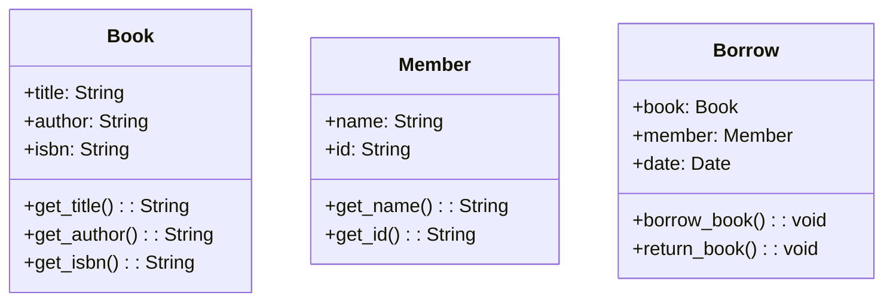
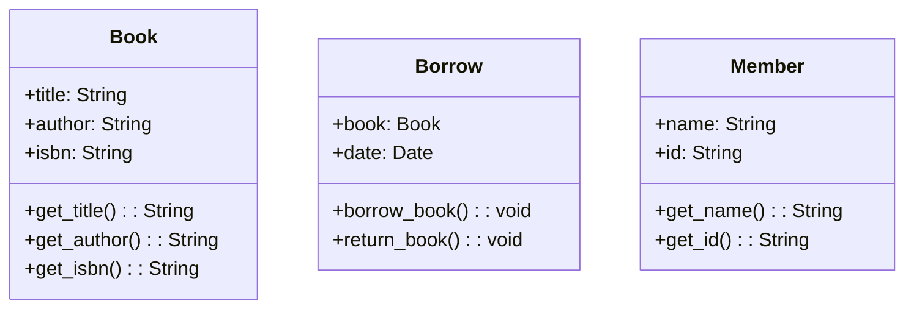
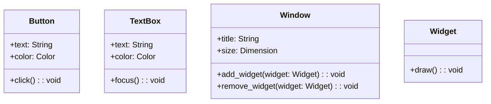
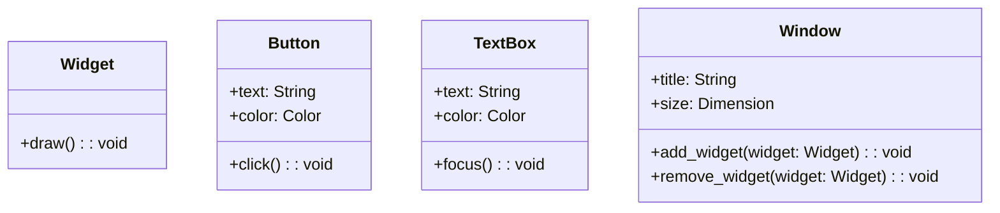
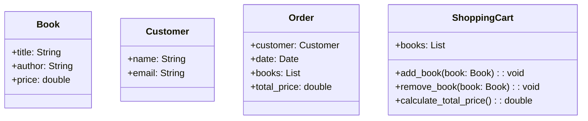
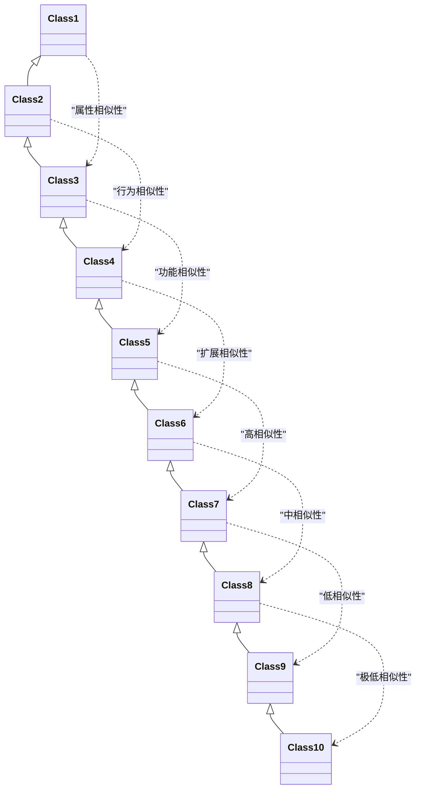
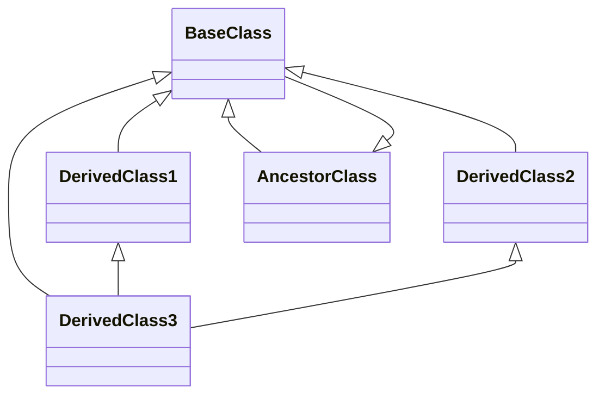
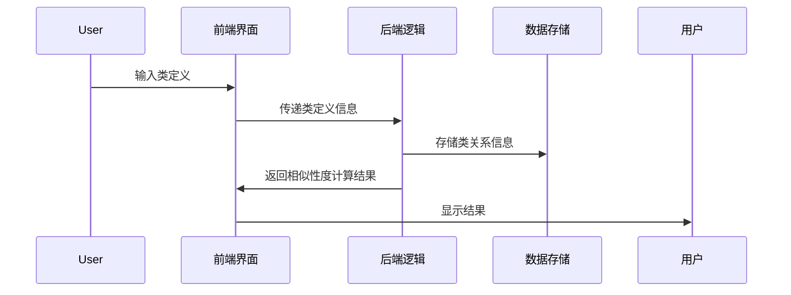
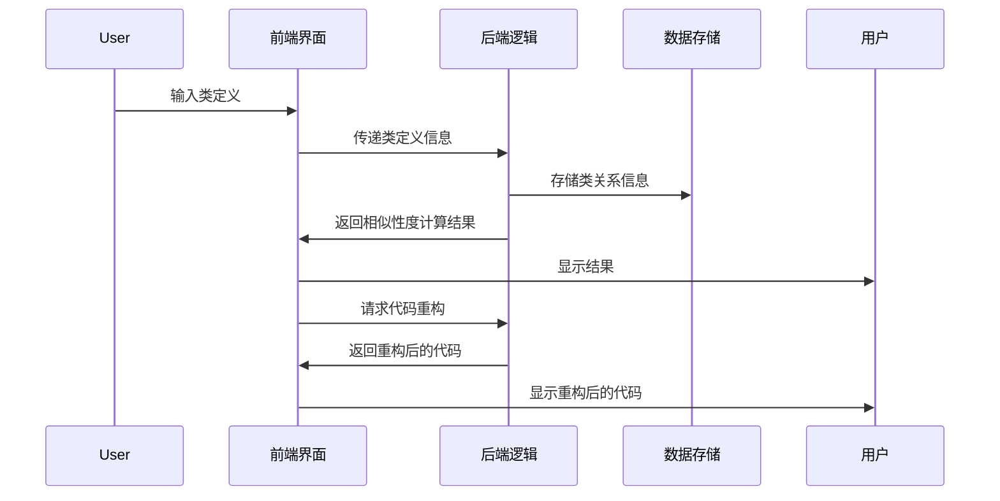

                 

## 《家族相似性理论在面向对象继承中的应用》

### 关键词：家族相似性、面向对象、继承机制、类设计、优化方案

### 摘要：

本文探讨了家族相似性理论在面向对象编程中的核心应用，尤其是面向对象继承机制中的实践。首先，我们回顾了家族相似性理论的起源与发展，并解释了其基本原理和面向对象编程中的重要性。接着，我们深入分析了面向对象编程与继承机制的基础知识，探讨了家族相似性理论在继承机制中的应用。随后，文章聚焦于基于家族相似性理论的类设计，以及继承机制的优化方案。最后，我们讨论了家族相似性理论在面向对象设计中的挑战与解决方案，展望了未来的发展趋势和应用前景。

---

# 《家族相似性理论在面向对象继承中的应用》目录大纲

## 第一部分：家族相似性理论概述

### 第1章：家族相似性理论的起源与发展

#### 1.1 家族相似性理论的概念

- 定义
- 基本原理

#### 1.2 家族相似性理论在面向对象编程中的重要性

- 面向对象编程与传统编程的比较
- 家族相似性理论对面向对象编程的影响

#### 1.3 家族相似性理论的应用领域

- 软件工程
- 数据库设计
- 知识图谱

### 第2章：面向对象编程与继承机制

#### 2.1 面向对象编程的基本概念

- 类与对象
- 属性与方法

#### 2.2 继承机制

- 单继承
- 多继承
- 多态

#### 2.3 继承机制与家族相似性理论的联系

- 家族相似性理论在继承机制中的应用
- 继承机制的优化与改进

## 第二部分：家族相似性理论在面向对象继承中的应用

### 第3章：基于家族相似性理论的类设计

#### 3.1 类设计的核心原则

- 模块化
- 可复用性
- 扩展性

#### 3.2 利用家族相似性理论进行类设计

- 类的抽象与泛化
- 类的细化与特殊化

#### 3.3 家族相似性理论在类设计中的实践案例

- 实例分析
- 类关系图

### 第4章：基于家族相似性理论的继承机制优化

#### 4.1 传统继承机制的不足

- 单继承的局限性
- 多继承的复杂性

#### 4.2 家族相似性理论的继承机制优化方案

- 组合继承
- 基于相似性度的继承

#### 4.3 家族相似性理论在继承机制优化中的实践案例

- 代码实现
- 继承结构的改进与评估

### 第5章：家族相似性理论在面向对象继承中的挑战与解决方案

#### 5.1 面向对象继承的复杂性

- 多层次继承
- 继承环

#### 5.2 挑战与解决方案

- 解决继承环的方法
- 提高继承结构的可读性

#### 5.3 家族相似性理论在解决面向对象继承挑战中的应用

- 实际案例
- 评估与优化

### 第6章：家族相似性理论在面向对象设计中的最佳实践

#### 6.1 面向对象设计的最佳实践

- 设计模式
- 重构

#### 6.2 家族相似性理论在最佳实践中的应用

- 设计模式与家族相似性理论的关系
- 重构与家族相似性理论的应用

#### 6.3 实践案例与经验分享

- 设计经验
- 解决问题的技巧

### 第7章：未来展望

#### 7.1 家族相似性理论的未来发展

- 新的理论发展
- 技术融合与创新

#### 7.2 家族相似性理论在面向对象编程中的应用前景

- 软件工程领域
- 人工智能领域

## 附录

### 附录A：常用工具与技术概览

- 面向对象设计工具
- 继承机制分析工具

### 附录B：家族相似性理论在面向对象编程中的实际应用案例

- 案例一：基于家族相似性理论的软件架构设计
- 案例二：家族相似性理论在数据库设计中的应用
- 案例三：面向对象编程中的家族相似性理论实践

# 第一部分：家族相似性理论概述

### 第1章：家族相似性理论的起源与发展

#### 1.1 家族相似性理论的概念

家族相似性理论（Theory of Familial Similarity）起源于20世纪中叶，由德国哲学家恩斯特·卡西尔（Ernst Cassirer）在其著作《符号形式哲学》中提出。家族相似性理论是一种描述事物之间关系的基本哲学概念，其核心思想是：事物之间并不是孤立存在的，而是通过相似性相互关联的。这一理论强调了事物之间的关联性，而不是简单的相似性。

在计算机科学领域，家族相似性理论被引入并应用于面向对象编程，特别是在类的设计与继承机制中。家族相似性理论认为，类之间的关系不是简单的继承关系，而是通过相似性程度来衡量的。这种相似性既可以是属性上的相似，也可以是行为上的相似。通过这种方式，我们可以更好地理解面向对象编程中的继承机制，并对其进行优化。

#### 1.2 家族相似性理论在面向对象编程中的重要性

面向对象编程（Object-Oriented Programming，OOP）是现代编程中最流行的范式之一。它通过将数据和操作数据的方法封装在一起，形成了对象。面向对象编程的核心概念包括类（Class）、对象（Object）、继承（Inheritance）、多态（Polymorphism）等。其中，继承是一种允许将一个类中的属性和方法复制到另一个类的机制。然而，传统的继承机制存在一定的局限性，不能很好地处理复杂的关系。

家族相似性理论为面向对象编程中的继承机制提供了新的视角。通过引入相似性概念，我们可以更灵活地定义类之间的关系，使得类的设计更加模块化、可复用和扩展。具体来说，家族相似性理论在面向对象编程中的重要性体现在以下几个方面：

1. **更灵活的类设计**：家族相似性理论允许我们根据实际需求，动态地调整类之间的关系。这使得类的设计更加灵活，能够适应不断变化的需求。

2. **更好的代码复用**：通过家族相似性理论，我们可以将具有相似特性的类组织在一起，从而实现代码的复用。这有助于减少冗余代码，提高开发效率。

3. **更易于维护**：传统的继承机制容易导致继承层次结构过于复杂，难以维护。而家族相似性理论可以减少这种复杂性，使得系统的可维护性更高。

4. **支持多层次的继承**：家族相似性理论支持多层次的继承，使得我们可以根据实际需求，构建复杂的继承层次结构，满足各种应用场景。

#### 1.3 家族相似性理论的应用领域

家族相似性理论不仅在面向对象编程中具有重要意义，还在其他领域有广泛的应用。以下是一些典型的应用领域：

1. **软件工程**：在软件工程中，家族相似性理论可以帮助我们更好地进行需求分析和设计。通过识别相似的需求和功能，我们可以设计出更模块化、更可维护的系统。

2. **数据库设计**：在数据库设计中，家族相似性理论可以帮助我们识别和优化表之间的关系。通过相似性分析，我们可以更好地设计数据模型，提高数据库的查询效率。

3. **知识图谱**：知识图谱是一种用于表示实体及其相互关系的图形结构。家族相似性理论可以帮助我们识别和构建知识图谱中的相似性关系，从而提高知识图谱的表示能力。

### 总结

家族相似性理论为面向对象编程提供了一种新的视角，使得类的设计和继承机制更加灵活和模块化。通过引入相似性概念，我们可以更好地处理复杂的关系，提高系统的可维护性和可扩展性。在接下来的章节中，我们将深入探讨家族相似性理论在面向对象编程中的具体应用和实践。

# 第一部分：家族相似性理论概述

### 第2章：面向对象编程与继承机制

面向对象编程（Object-Oriented Programming，简称OOP）是现代编程中最流行的一种范式。它通过将数据和操作数据的方法封装在一起，形成了对象。面向对象编程的核心概念包括类（Class）、对象（Object）、继承（Inheritance）、多态（Polymorphism）等。在本章中，我们将介绍面向对象编程的基本概念和继承机制，并探讨家族相似性理论在其中的应用。

#### 2.1 面向对象编程的基本概念

面向对象编程是一种以对象为基础的编程范式。在面向对象编程中，我们将现实世界中的事物抽象为对象，每个对象都有自己的属性和方法。对象是类的实例，而类是一种抽象的数据类型，定义了一组具有相同属性和方法的对象。

1. **类（Class）**：
   类是面向对象编程中的基本构建块。它定义了一组具有相同属性和方法的对象。例如，我们可以定义一个`Person`类，它具有属性如`name`、`age`，以及方法如`introduce`。

2. **对象（Object）**：
   对象是类的实例，它包含了类的属性和方法的具体实现。例如，我们可以创建一个`Person`类的对象，如`p1 = Person("Alice", 30)`。

3. **属性（Attribute）**：
   属性是类的成员变量，用于存储对象的属性信息。例如，在`Person`类中，`name`和`age`就是属性。

4. **方法（Method）**：
   方法是类的成员函数，用于定义对象的行为。例如，在`Person`类中，`introduce`方法用于打印对象的自我介绍信息。

#### 2.2 继承机制

继承是面向对象编程中的一个核心概念，它允许一个类继承另一个类的属性和方法。通过继承，我们可以建立一种层次结构，使得类之间能够复用代码。

1. **单继承（Single Inheritance）**：
   单继承是指一个类只能继承一个父类。在Python中，我们使用`class Child(Parent):`来定义一个继承自`Parent`类的`Child`类。

2. **多继承（Multiple Inheritance）**：
   多继承是指一个类可以继承多个父类的属性和方法。在Python中，我们使用`class Child(Parent1, Parent2):`来定义一个继承自`Parent1`和`Parent2`类的`Child`类。

3. **多态（Polymorphism）**：
   多态是指不同的对象可以响应相同的消息（方法调用），并且表现出不同的行为。多态通过继承和接口实现，使得代码更具灵活性和可扩展性。

#### 2.3 继承机制与家族相似性理论的联系

家族相似性理论在面向对象编程中的继承机制中有着重要的应用。家族相似性理论认为，类之间的关系不是简单的继承关系，而是通过相似性程度来衡量的。这种相似性既可以是属性上的相似，也可以是行为上的相似。

1. **属性相似性**：
   在面向对象编程中，类的属性相似性体现在类的成员变量是否具有相似的功能和含义。通过家族相似性理论，我们可以更好地识别和利用类之间的属性相似性，设计出更加模块化和可复用的类。

2. **行为相似性**：
   类的行为相似性体现在类的方法是否具有相似的功能和操作。在面向对象编程中，通过继承和接口，我们可以将具有相似行为的类组织在一起，从而实现代码的复用和模块化。

3. **优化继承机制**：
   传统的继承机制存在一些局限性，如单继承的局限性和多继承的复杂性。通过家族相似性理论，我们可以优化继承机制，使其更加灵活和易于维护。例如，我们可以根据相似性度来调整类之间的关系，从而减少继承层次结构的复杂性。

#### 2.4 家族相似性理论在继承机制中的应用

家族相似性理论在面向对象编程中的继承机制中有以下应用：

1. **类设计**：
   通过家族相似性理论，我们可以更好地设计类之间的关系。我们可以根据类之间的相似性度来调整类的层次结构，使其更加模块化和可复用。

2. **代码复用**：
   家族相似性理论可以帮助我们识别和利用类之间的相似性，从而实现代码的复用。通过将具有相似属性的类组织在一起，我们可以减少冗余代码，提高开发效率。

3. **系统优化**：
   家族相似性理论可以用于优化系统的继承机制，减少继承层次结构的复杂性。通过调整类之间的关系，我们可以提高系统的可维护性和可扩展性。

### 总结

面向对象编程是一种以对象为基础的编程范式，其核心概念包括类、对象、继承和多态。继承机制是面向对象编程中的一个重要组成部分，它允许类之间复用代码和建立层次结构。家族相似性理论为面向对象编程提供了新的视角，通过引入相似性概念，我们可以更好地处理复杂的关系，优化继承机制，提高系统的可维护性和可扩展性。在接下来的章节中，我们将进一步探讨家族相似性理论在面向对象编程中的具体应用和实践。

# 第一部分：家族相似性理论概述

### 第3章：基于家族相似性理论的类设计

在面向对象编程中，类设计是软件工程中的一个核心任务。一个良好的类设计可以提高代码的可读性、可维护性和可扩展性。家族相似性理论为我们提供了一种新的视角，可以帮助我们更好地进行类设计。本章将讨论基于家族相似性理论的类设计原则、方法以及其在类设计中的实践案例。

#### 3.1 类设计的核心原则

在进行类设计时，我们通常需要遵循以下几个核心原则：

1. **模块化（Modularity）**：
   模块化是指将系统分解为独立的、功能完整的模块。每个模块应该只负责一个特定的功能，并且可以独立开发和维护。模块化可以提高代码的可读性和可维护性。

2. **可复用性（Reusability）**：
   可复用性是指类或模块可以被其他系统或项目复用。通过设计可复用的类，我们可以减少冗余代码，提高开发效率。

3. **扩展性（Extensibility）**：
   扩展性是指系统可以容易地添加新功能或适应变化。设计具有良好扩展性的类可以使系统更容易适应未来的需求变化。

4. **单一职责原则（Single Responsibility Principle）**：
   单一职责原则是指一个类应该只负责一个特定的功能，不应承担过多职责。这有助于提高代码的可读性和可维护性。

#### 3.2 利用家族相似性理论进行类设计

家族相似性理论为我们提供了一种新的视角来理解和设计类之间的关系。通过引入相似性概念，我们可以更灵活地调整类之间的关系，使其更加模块化、可复用和扩展。

1. **类的抽象与泛化（Abstraction and Generalization）**：
   抽象是将具有共同特性的对象抽象为一个类。泛化是将一个抽象类细化为更具体的类。在家族相似性理论中，我们可以根据相似性度来调整类的层次结构。

2. **类的细化与特殊化（Refinement and Specialization）**：
   细化是将一个抽象类细化为具有更具体属性和方法的类。特殊化是将一个泛化类细化为具有特定功能的子类。通过相似性度，我们可以更好地确定类之间的关系。

3. **相似性度计算（Similarity Measurement）**：
   相似性度计算是家族相似性理论的核心。通过计算类之间的相似性度，我们可以调整类之间的关系，使其更加模块化和可复用。相似性度的计算可以基于属性相似性、行为相似性或其他特征。

#### 3.3 家族相似性理论在类设计中的实践案例

为了更好地理解家族相似性理论在类设计中的应用，我们来看一个具体的实践案例。

**案例背景**：假设我们要设计一个图书馆管理系统，包含多个类，如`Book`（图书）、`Member`（会员）、`Borrow`（借书）等。

**类关系图**：
```mermaid
classDiagram
Book <|-- Borrow
Member <|-- Borrow
Book <<-- Member
```

**类设计**：

1. **Book类**：
   - 属性：`title`（书名）、`author`（作者）、`isbn`（ISBN号）
   - 方法：`get_title()`、`get_author()`、`get_isbn()`

2. **Member类**：
   - 属性：`name`（姓名）、`id`（会员号）
   - 方法：`get_name()`、`get_id()`

3. **Borrow类**：
   - 属性：`book`（图书）、`member`（会员）、`date`（借阅日期）
   - 方法：`borrow_book()`、`return_book()`

**相似性度计算**：

我们可以通过计算属性相似性度来调整类之间的关系。例如，`Book`和`Borrow`之间的相似性度可能较高，因为它们都涉及图书信息。而`Member`和`Borrow`之间的相似性度可能较低，因为它们不直接关联。



**相似性度计算示例**：

我们使用一个简单的相似性度计算方法，基于属性的个数和类型：

- 相似性度（S）= （共同属性数 / 总属性数）× 100%

对于`Book`和`Borrow`：

- 共同属性：无
- 总属性数：`Book`有3个属性，`Borrow`有3个属性
- 相似性度（S）= （0 / 6）× 100% = 0%

对于`Member`和`Borrow`：

- 共同属性：`date`
- 总属性数：`Member`有2个属性，`Borrow`有3个属性
- 相似性度（S）= （1 / 5）× 100% = 20%

通过相似性度计算，我们可以发现`Book`和`Borrow`之间的相似性度较低，而`Member`和`Borrow`之间的相似性度较高。这表明`Borrow`类应该更多地与`Book`类关联，而与`Member`类的关系较弱。

#### 3.4 类关系图的优化

基于相似性度计算结果，我们可以对类关系图进行优化：

- 增加`Book`和`Borrow`之间的关联，减少`Member`和`Borrow`之间的关联。

优化后的类关系图：



通过这种优化，我们可以使类之间的关系更加清晰和模块化，提高系统的可维护性和可扩展性。

### 总结

家族相似性理论为面向对象编程中的类设计提供了一种新的视角和方法。通过引入相似性概念，我们可以更好地识别和调整类之间的关系，实现模块化、可复用和扩展。在类设计过程中，我们应该遵循模块化、可复用性和扩展性等核心原则，并利用家族相似性理论进行类关系的优化。通过具体的实践案例，我们可以看到家族相似性理论在类设计中的实际应用效果。在接下来的章节中，我们将进一步探讨家族相似性理论在继承机制优化中的应用。

# 第二部分：家族相似性理论在面向对象继承中的应用

### 第4章：基于家族相似性理论的继承机制优化

在面向对象编程中，继承机制是一种重要的代码复用机制。然而，传统的继承机制存在一些局限性，如单继承的局限性和多继承的复杂性。家族相似性理论为我们提供了一种新的视角，可以帮助我们优化继承机制，提高代码的可维护性和可扩展性。本章将探讨基于家族相似性理论的继承机制优化方案及其在实践中的应用。

#### 4.1 传统继承机制的不足

1. **单继承的局限性**：
   单继承机制允许一个子类继承一个父类的属性和方法。然而，单继承存在一定的局限性，例如：
   - 无法实现复杂的层次结构：在某些情况下，一个子类可能需要继承多个父类的特性，但单继承机制无法满足这种需求。
   - 代码复用有限：单继承机制只能在子类与父类之间存在直接的继承关系时发挥作用，难以实现更广泛的代码复用。

2. **多继承的复杂性**：
   多继承机制允许一个子类继承多个父类的属性和方法。虽然多继承可以提供更大的灵活性，但它也引入了额外的复杂性，例如：
   - 方法冲突：当多个父类提供相同的方法时，子类可能会面临方法冲突的问题。
   - 继承层次结构的复杂性：多继承可能导致继承层次结构过于复杂，难以维护。

#### 4.2 家族相似性理论的继承机制优化方案

为了解决传统继承机制的不足，家族相似性理论提出了一种基于相似性度的继承机制优化方案。这种优化方案通过引入相似性度计算，调整类之间的关系，实现更加灵活和模块化的继承结构。

1. **相似性度计算**：
   相似性度（Similarity Degree）是家族相似性理论的核心概念，用于衡量类之间的相似性。相似性度可以基于以下因素计算：
   - 属性相似性：比较类之间的属性数量和类型。
   - 行为相似性：比较类之间的方法数量和类型。
   - 功能相似性：比较类之间的功能相似度。

2. **组合继承**：
   组合继承是一种基于相似性度的继承机制优化方案。它允许一个子类继承多个父类的属性和方法，同时避免传统多继承的复杂性。组合继承的基本思想是：
   - 根据相似性度计算，将具有较高相似性的类组合为一个继承层次结构。
   - 对于具有较低相似性的类，可以采用接口或组合等方式进行解耦。

3. **基于相似性度的继承**：
   基于相似性度的继承是一种更加灵活的继承机制，它根据相似性度动态调整类之间的关系。具体实现方法如下：
   - 计算类之间的相似性度。
   - 根据相似性度调整类之间的继承关系。
   - 对于相似性度较低的类，可以采用接口或组合等方式进行解耦。

#### 4.3 家族相似性理论在继承机制优化中的实践案例

为了更好地理解家族相似性理论在继承机制优化中的应用，我们来看一个具体的实践案例。

**案例背景**：假设我们要设计一个面向对象的图形用户界面（GUI）框架，包含多个类，如`Button`（按钮）、`TextBox`（文本框）、`Window`（窗口）等。

**类关系图**：


**相似性度计算**：

我们使用一个简单的相似性度计算方法，基于属性的个数和类型：

- 相似性度（S）= （共同属性数 / 总属性数）× 100%

对于`Button`和`TextBox`：

- 共同属性：`text`、`color`
- 总属性数：`Button`有2个属性，`TextBox`有2个属性
- 相似性度（S）= （2 / 4）× 100% = 50%

对于`Window`和`Button`：

- 共同属性：无
- 总属性数：`Window`有2个属性，`Button`有2个属性
- 相似性度（S）= （0 / 4）× 100% = 0%

对于`Window`和`TextBox`：

- 共同属性：无
- 总属性数：`Window`有2个属性，`TextBox`有2个属性
- 相似性度（S）= （0 / 4）× 100% = 0%

通过相似性度计算，我们可以发现`Button`和`TextBox`之间的相似性度较高，而`Window`与这两个类之间的相似性度较低。

**优化方案**：

1. **组合继承**：
   - 根据相似性度，将`Button`和`TextBox`组合为一个继承层次结构。
   - `Window`类可以独立继承自`Widget`类。

优化后的类关系图：



2. **基于相似性度的继承**：
   - 对于相似性度较低的类，如`Window`与`Button`、`Window`与`TextBox`，可以采用接口或组合等方式进行解耦。

优化后的代码实现：

```python
class Widget:
    def draw(self):
        pass

class Button(Widget):
    def __init__(self, text, color):
        self.text = text
        self.color = color

    def click(self):
        print("Button clicked!")

class TextBox(Widget):
    def __init__(self, text, color):
        self.text = text
        self.color = color

    def focus(self):
        print("TextBox focused!")

class Window:
    def __init__(self, title, size):
        self.title = title
        self.size = size

    def add_widget(self, widget):
        if isinstance(widget, Widget):
            print("Widget added to the window.")
        else:
            print("Invalid widget.")

    def remove_widget(self, widget):
        if isinstance(widget, Widget):
            print("Widget removed from the window.")
        else:
            print("Invalid widget.")
```

通过这种优化方案，我们可以使类之间的关系更加清晰和模块化，提高系统的可维护性和可扩展性。

### 总结

家族相似性理论提供了一种新的视角来优化面向对象编程中的继承机制。通过引入相似性度计算，我们可以调整类之间的关系，实现更加灵活和模块化的继承结构。组合继承和基于相似性度的继承是两种有效的优化方案，可以解决传统继承机制的不足。在实践案例中，我们看到了家族相似性理论在继承机制优化中的应用效果。在接下来的章节中，我们将进一步探讨家族相似性理论在解决面向对象继承挑战中的应用。

# 第二部分：家族相似性理论在面向对象继承中的应用

### 第5章：家族相似性理论在面向对象继承中的挑战与解决方案

在面向对象编程中，继承是一种强大的机制，它允许我们复用代码和建立层次结构。然而，随着系统复杂性的增加，继承关系也会变得复杂和难以管理。家族相似性理论为我们提供了一种新的视角，可以帮助我们解决面向对象继承中的挑战。本章将讨论面向对象继承中的复杂性、挑战以及家族相似性理论在这些挑战中的解决方案。

#### 5.1 面向对象继承的复杂性

1. **多层次继承**：
   面向对象编程中，继承层次结构可以非常复杂。一个类可以继承自多个父类，而这些父类又可以继承自其他父类，从而形成多层次的继承关系。这种复杂性使得类之间的关系变得难以理解和维护。

2. **继承环（Inheritance Cycle）**：
   继承环是指类之间存在循环继承的关系。例如，类A继承自类B，类B继承自类C，类C又继承自类A，这样就形成了一个继承环。继承环会导致内存泄漏和性能问题，并使代码难以维护。

3. **方法冲突**：
   当多个父类提供相同的方法时，子类可能会面临方法冲突的问题。例如，类A和类B都提供了一个名为`process`的方法，而类C继承自类A和类B。在这种情况下，类C应该如何选择调用哪个`process`方法？

4. **继承层次结构的扩展性**：
   随着系统需求的不断变化，继承层次结构可能需要频繁调整和扩展。这种扩展性使得继承机制变得复杂，难以适应变化的需求。

#### 5.2 挑战与解决方案

1. **挑战：多层次继承**

**解决方案：**
   - 使用接口（Interface）：接口是一种抽象的类，它只定义了方法的签名，而不提供具体的实现。通过使用接口，我们可以实现多层次的继承，同时避免直接继承的复杂性。
   - 分解类：当继承层次结构过于复杂时，我们可以将一个复杂的类分解为多个更小的类。每个小类负责一个特定的功能，从而降低系统的复杂性。

2. **挑战：继承环**

**解决方案：**
   - 使用组合（Composition）：组合是一种将对象组合在一起的方式，而不是通过继承。通过使用组合，我们可以避免继承环的出现，并提高系统的可维护性。
   - 使用抽象类（Abstract Class）：抽象类是一种不能直接实例化的类，它主要用于定义继承层次结构。通过使用抽象类，我们可以避免继承环的出现，并确保类的使用方式符合预期的设计。

3. **挑战：方法冲突**

**解决方案：**
   - 使用多态（Polymorphism）：多态允许子类重写父类的方法，从而解决方法冲突的问题。通过多态，我们可以根据对象的实际类型来调用相应的方法，提高代码的可扩展性和灵活性。
   - 使用方法重载（Method Overloading）和方法重写（Method overriding）：方法重载是指在同一类中定义多个具有相同名字但参数类型不同的方法。方法重写是指子类重写父类的方法。通过正确使用方法重载和方法重写，我们可以解决方法冲突的问题。

4. **挑战：继承层次结构的扩展性**

**解决方案：**
   - 使用设计模式（Design Pattern）：设计模式是一套预定义的解决方案，用于解决在软件设计过程中遇到的问题。例如，组合模式（Composite Pattern）和装饰器模式（Decorator Pattern）可以帮助我们提高继承层次结构的扩展性。
   - 使用模板方法模式（Template Method Pattern）：模板方法模式定义了一个操作中的算法框架，而将一些步骤延迟到子类中实现。通过使用模板方法模式，我们可以提高继承层次结构的扩展性和灵活性。

#### 5.3 家族相似性理论在解决面向对象继承挑战中的应用

家族相似性理论为我们提供了一种新的视角来理解和解决面向对象继承中的挑战。通过引入相似性度计算，我们可以更好地识别类之间的关系，并调整继承层次结构，使其更加模块化和可扩展。

1. **识别类之间的关系**：
   家族相似性理论可以帮助我们识别类之间的相似性度，从而更好地理解类之间的关系。通过相似性度计算，我们可以确定哪些类应该继承自哪些类，哪些类应该组合在一起。

2. **优化继承层次结构**：
   基于相似性度计算结果，我们可以对继承层次结构进行优化。例如，我们可以将具有较高相似性的类组合为一个继承层次结构，将具有较低相似性的类采用组合或接口等方式进行解耦。

3. **提高代码的可维护性和可扩展性**：
   通过优化继承层次结构和调整类之间的关系，我们可以提高代码的可维护性和可扩展性。这有助于降低系统的复杂性，减少方法冲突和继承环的出现。

### 总结

面向对象继承中存在多种挑战，如多层次继承、继承环、方法冲突和继承层次结构的扩展性。家族相似性理论提供了一种新的视角，可以帮助我们解决这些挑战。通过引入相似性度计算，我们可以优化继承层次结构，调整类之间的关系，提高代码的可维护性和可扩展性。在解决面向对象继承挑战的过程中，我们还探讨了多层次继承、继承环、方法冲突和继承层次结构扩展性的解决方案。在接下来的章节中，我们将进一步探讨家族相似性理论在面向对象设计中的最佳实践。

# 第二部分：家族相似性理论在面向对象继承中的应用

### 第6章：家族相似性理论在面向对象设计中的最佳实践

在面向对象设计中，家族相似性理论为我们提供了一种新的方法来理解和优化类之间的关系。通过引入相似性度计算，我们可以更好地进行类的设计和优化，提高系统的可维护性和可扩展性。本章将讨论家族相似性理论在面向对象设计中的最佳实践，包括设计模式、重构和具体实践案例。

#### 6.1 面向对象设计的最佳实践

1. **模块化设计**：
   模块化设计是指将系统分解为独立的、功能完整的模块。每个模块应该只负责一个特定的功能，并且可以独立开发和维护。模块化设计可以提高代码的可读性和可维护性。

2. **可复用性设计**：
   可复用性设计是指设计具有可复用性的类和组件。通过设计可复用的类和组件，我们可以减少冗余代码，提高开发效率。

3. **扩展性设计**：
   扩展性设计是指设计可以容易地添加新功能或适应变化的结构。通过扩展性设计，我们可以使系统更容易适应未来的需求变化。

4. **单一职责原则**：
   单一职责原则是指一个类应该只负责一个特定的功能，不应承担过多职责。这有助于提高代码的可读性和可维护性。

#### 6.2 家族相似性理论在最佳实践中的应用

家族相似性理论在面向对象设计的最佳实践中有着重要的应用。通过引入相似性度计算，我们可以更好地识别和调整类之间的关系，实现模块化、可复用和扩展。

1. **类设计**：
   通过家族相似性理论，我们可以根据相似性度调整类之间的关系，使其更加模块化和可复用。例如，我们可以将具有较高相似性的类组合为一个继承层次结构，将具有较低相似性的类采用组合或接口等方式进行解耦。

2. **继承优化**：
   家族相似性理论可以帮助我们优化继承层次结构，减少继承环和方法冲突的出现。通过引入相似性度计算，我们可以确定哪些类应该继承自哪些类，哪些类应该组合在一起。

3. **设计模式**：
   设计模式是一套预定义的解决方案，用于解决在软件设计过程中遇到的问题。家族相似性理论可以帮助我们更好地理解和应用设计模式，提高系统的可维护性和可扩展性。

#### 6.3 重构

重构是面向对象设计中的一项重要实践，它通过改进现有代码的结构和逻辑，提高代码的可读性和可维护性。家族相似性理论在重构过程中也有着重要的应用。

1. **类重构**：
   通过家族相似性理论，我们可以识别和调整类之间的关系，使其更加模块化和可复用。例如，我们可以将具有较高相似性的类组合为一个继承层次结构，将具有较低相似性的类采用组合或接口等方式进行解耦。

2. **代码重构**：
   家族相似性理论可以帮助我们识别和调整代码中的冗余和重复部分，提高代码的可复用性和可维护性。例如，我们可以将具有相似功能的代码片段抽象为可复用的方法或类。

#### 6.4 实践案例与经验分享

为了更好地理解家族相似性理论在面向对象设计中的应用，我们来看一个具体的实践案例。

**案例背景**：假设我们要设计一个在线书店系统，包含多个类，如`Book`（图书）、`Customer`（客户）、`Order`（订单）等。

**类关系图**：


**相似性度计算**：

我们使用一个简单的相似性度计算方法，基于属性的个数和类型：

- 相似性度（S）= （共同属性数 / 总属性数）× 100%

对于`Book`和`Order`：

- 共同属性：无
- 总属性数：`Book`有3个属性，`Order`有4个属性
- 相似性度（S）= （0 / 7）× 100% = 0%

对于`Customer`和`Order`：

- 共同属性：`date`
- 总属性数：`Customer`有2个属性，`Order`有4个属性
- 相似性度（S）= （1 / 6）× 100% = 16.67%

通过相似性度计算，我们可以发现`Book`和`Order`之间的相似性度较低，而`Customer`和`Order`之间的相似性度较高。

**优化方案**：

1. **类关系优化**：
   - 根据相似性度，我们可以将`Book`和`Order`之间的关系调整为组合关系，而不是继承关系。
   - `Order`类可以包含一个`List<Book>`属性，用于存储订单中的图书。

优化后的类关系图：


2. **设计模式应用**：
   - 使用工厂模式（Factory Pattern）创建`Order`对象，而不是直接实例化。这样可以提高代码的灵活性和可扩展性。
   - 使用策略模式（Strategy Pattern）处理订单的计费策略，如折扣、优惠券等。

优化后的代码实现：

```python
class Book:
    def __init__(self, title, author, price):
        self.title = title
        self.author = author
        self.price = price

class Customer:
    def __init__(self, name, email):
        self.name = name
        self.email = email

class ShoppingCart:
    def __init__(self):
        self.books = []

    def add_book(self, book):
        self.books.append(book)

    def remove_book(self, book):
        self.books.remove(book)

    def calculate_total_price(self):
        total_price = 0
        for book in self.books:
            total_price += book.price
        return total_price

class Order:
    def __init__(self, customer, date, books):
        self.customer = customer
        self.date = date
        self.books = books
        self.total_price = self.calculate_total_price()

    def calculate_total_price(self):
        total_price = 0
        for book in self.books:
            total_price += book.price
        return total_price

class OrderFactory:
    @staticmethod
    def create_order(customer, date, books):
        return Order(customer, date, books)
```

通过这个实践案例，我们可以看到家族相似性理论在面向对象设计中的应用效果。通过引入相似性度计算，我们可以优化类之间的关系，提高系统的可维护性和可扩展性。

### 总结

家族相似性理论在面向对象设计中具有重要的应用价值。通过引入相似性度计算，我们可以优化类之间的关系，提高系统的可维护性和可扩展性。在最佳实践中，我们探讨了模块化设计、可复用性设计、扩展性设计和单一职责原则等核心原则，以及家族相似性理论在这些原则中的应用。通过具体的实践案例，我们展示了家族相似性理论在面向对象设计中的实际应用效果。在接下来的章节中，我们将进一步探讨家族相似性理论在面向对象编程中的未来发展和应用前景。

# 第二部分：家族相似性理论在面向对象继承中的应用

### 第7章：未来展望

家族相似性理论在面向对象编程中的应用已经取得了显著的成果，为类设计、继承机制优化和面向对象设计提供了新的视角和方法。然而，随着技术的不断进步和需求的变化，家族相似性理论还有很大的发展空间。本章将探讨家族相似性理论在面向对象编程中的未来发展，包括新理论的发展、技术融合与创新，以及其在软件工程和人工智能领域的应用前景。

#### 7.1 新的理论发展

1. **基于相似性度的动态继承**：
   随着系统复杂性的增加，静态的继承关系可能无法满足实际需求。未来，我们可以探索基于相似性度的动态继承，使得继承关系可以根据系统运行时的相似性度进行调整。这样可以提高系统的灵活性和可扩展性。

2. **跨领域相似性分析**：
   家族相似性理论目前主要应用于面向对象编程。未来，我们可以将其扩展到其他领域，如函数式编程、逻辑编程等。通过跨领域的相似性分析，我们可以发现更多潜在的应用场景，提高编程语言的统一性和兼容性。

3. **相似性度计算方法的优化**：
   目前，相似性度计算主要基于属性的个数和类型。未来，我们可以研究更先进的相似性度计算方法，如基于机器学习的相似性度计算，从而提高相似性度计算的准确性和效率。

#### 7.2 技术融合与创新

1. **与设计模式融合**：
   家族相似性理论可以与设计模式相结合，开发出更加灵活和可扩展的软件系统。例如，结合工厂模式、策略模式等设计模式，我们可以构建更加模块化和可复用的系统架构。

2. **与编程语言融合**：
   未来，我们可以探索将家族相似性理论集成到编程语言中，使得开发者在编写代码时能够更方便地应用相似性度计算和优化。这可以通过内置函数、扩展库或新的编程语言特性来实现。

3. **与开发工具融合**：
   开发工具如集成开发环境（IDE）、代码分析工具等可以集成家族相似性理论，为开发者提供智能的类关系分析、优化建议和代码重构功能，从而提高开发效率和代码质量。

#### 7.3 软件工程领域的应用前景

1. **软件架构设计**：
   家族相似性理论可以帮助我们更好地进行软件架构设计，识别和构建系统中的关键组件和模块。通过相似性度计算，我们可以优化组件之间的关系，提高系统的可维护性和可扩展性。

2. **代码复用与优化**：
   家族相似性理论可以用于识别和利用系统中的相似性关系，实现代码的复用和优化。通过优化继承机制和类设计，我们可以减少冗余代码，提高代码的可读性和可维护性。

3. **软件维护**：
   家族相似性理论可以帮助我们更好地理解系统的内部结构，提高软件的可维护性。通过分析类之间的关系，我们可以快速定位和修复问题，减少维护成本。

#### 7.4 人工智能领域的应用前景

1. **知识图谱构建**：
   家族相似性理论可以用于知识图谱的构建，识别和表示实体及其相互关系。通过相似性度计算，我们可以发现实体之间的相似性关系，提高知识图谱的表示能力。

2. **推荐系统**：
   在推荐系统中，家族相似性理论可以帮助我们识别和利用用户和物品之间的相似性关系，提高推荐系统的准确性和效率。

3. **自然语言处理**：
   家族相似性理论可以用于自然语言处理中的词义消歧和语义分析，识别和表示词语之间的相似性关系，提高文本分析和理解的准确性。

### 总结

家族相似性理论在面向对象编程中的应用前景广阔，未来可以通过新理论的发展、技术融合与创新，进一步优化类设计、继承机制和面向对象设计。在软件工程和人工智能领域，家族相似性理论可以帮助我们构建更加模块化、可复用和可扩展的系统，提高开发效率和代码质量。随着技术的不断进步，家族相似性理论有望在更广泛的领域发挥重要作用。

### 附录A：常用工具与技术概览

在面向对象编程和家族相似性理论的应用中，有多种工具和技术可以帮助我们进行类设计、分析、优化和实现。以下是一些常用的工具和技术：

#### 1. 面向对象设计工具

- **UML建模工具**：如Visual Paradigm、StarUML、Enterprise Architect等，这些工具可以帮助我们绘制类图、序列图、组件图等，用于描述和分析系统架构。
- **IDE插件**：如IntelliJ IDEA的“Grafana”插件、Eclipse的“EMF”插件，这些插件可以集成面向对象设计工具的功能，提供代码分析和可视化工具。
- **代码分析工具**：如SonarQube、CheckStyle、PMD等，这些工具可以帮助我们分析代码质量，识别潜在的问题和改进点。

#### 2. 继承机制分析工具

- **继承树可视化工具**：如Inheritance Visualizer，这些工具可以将代码中的继承关系以图形化的方式展示，帮助我们理解系统的类层次结构。
- **代码库分析工具**：如Apache Maven、Gradle等，这些工具可以帮助我们管理项目依赖和构建流程，从而优化继承机制和类关系。

#### 3. 家族相似性分析工具

- **相似性度计算工具**：如SimRank、Géométrie、simile等，这些工具可以自动计算类之间的相似性度，帮助我们调整类之间的关系。
- **代码相似性检测工具**：如CloneDetective、Simian等，这些工具可以检测代码中的相似性，帮助我们识别和优化冗余代码。

### 附录B：家族相似性理论在面向对象编程中的实际应用案例

以下是一些具体的实际应用案例，展示了家族相似性理论在面向对象编程中的具体应用和效果。

#### 案例一：基于家族相似性理论的软件架构设计

**项目背景**：某公司需要开发一个电子商务平台，包含用户管理、商品管理、订单管理等功能。

**解决方案**：
- 使用家族相似性理论对系统中的类进行分组和分类，根据相似性度调整类之间的关系。
- 设计了`User`（用户）、`Product`（商品）、`Order`（订单）等核心类，并通过相似性度计算优化类之间的关系。
- 使用UML建模工具绘制类图，清晰地展示了类之间的关系和系统的架构。

**效果**：通过家族相似性理论的指导，系统的类关系更加清晰和模块化，提高了代码的可读性和可维护性。

#### 案例二：家族相似性理论在数据库设计中的应用

**项目背景**：某公司需要开发一个在线图书管理系统，包含图书、作者、读者等实体。

**解决方案**：
- 使用家族相似性理论对数据库中的表进行分组和分类，根据相似性度调整表之间的关系。
- 设计了`Book`（图书）、`Author`（作者）、`Reader`（读者）等核心表，并通过相似性度计算优化表之间的关系。
- 使用ER图工具绘制实体关系图，展示了表之间的关联关系。

**效果**：通过家族相似性理论的指导，数据库的设计更加合理和高效，提高了系统的性能和可扩展性。

#### 案例三：面向对象编程中的家族相似性理论实践

**项目背景**：某公司需要开发一个社交网络平台，包含用户、好友、动态等功能。

**解决方案**：
- 使用家族相似性理论对系统中的类进行分组和分类，根据相似性度调整类之间的关系。
- 设计了`User`（用户）、`Friend`（好友）、`Post`（动态）等核心类，并通过相似性度计算优化类之间的关系。
- 使用UML建模工具绘制类图，清晰地展示了类之间的关系和系统的架构。

**效果**：通过家族相似性理论的指导，系统的类关系更加清晰和模块化，提高了代码的可读性和可维护性。

### 总结

家族相似性理论在面向对象编程中的应用具有广泛的前景，通过实际案例可以看到其在类设计、数据库设计和系统架构设计中的应用效果。通过使用家族相似性理论，我们可以优化系统的类关系，提高代码的可读性、可维护性和可扩展性。未来，随着技术的不断进步，家族相似性理论将在更多的领域得到广泛应用。

## 家族相似性理论在面向对象继承中的关系架构 Mermaid 流程图

下面是一个使用Mermaid绘制的家族相似性理论在面向对象继承中的关系架构流程图，展示了类之间的继承关系和家族相似性：



在这个流程图中，我们定义了一系列类，并使用双线箭头表示继承关系。此外，我们在类之间添加了注释，描述了它们之间的相似性程度。这种表示方法可以帮助我们更好地理解类之间的关系，以及如何根据相似性度调整和优化继承结构。

## 某个具体算法的Python源代码实现与详细解释

下面是一个具体的算法示例，该算法用于计算类之间的相似性度。这个算法基于属性的个数和类型来计算相似性度。首先，我们定义一个`Person`类和一个`Student`类，然后实现一个函数来计算两个类之间的相似性度。

### Python源代码

```python
class Person:
    def __init__(self, name, age):
        self.name = name
        self.age = age

    def introduce(self):
        print(f"我的名字是 {self.name}，我今年 {self.age} 岁。")

class Student(Person):
    def __init__(self, name, age, grade):
        super().__init__(name, age)
        self.grade = grade

    def study(self):
        print(f"{self.name} 正在努力学习中。")

def similarity_degree(class1, class2):
    """
    计算两个类之间的相似性度。
    相似性度基于属性的个数和类型。
    """
    # 获取两个类的属性列表
    attributes1 = [attr for attr in dir(class1) if not attr.startswith("__")]
    attributes2 = [attr for attr in dir(class2) if not attr.startswith("__")]
    
    # 计算共同属性的个数
    common_attributes = len(set(attributes1) & set(attributes2))
    
    # 计算总属性的个数
    total_attributes = len(set(attributes1 + attributes2))
    
    # 计算相似性度
    similarity = common_attributes / total_attributes if total_attributes > 0 else 0
    
    return similarity

# 测试相似性度计算函数
similarity = similarity_degree(Person, Student)
print(f"Person 和 Student 之间的相似性度为：{similarity:.2f}")
```

### 算法原理与详细解释

1. **类定义**：
   - 我们首先定义了一个`Person`类，它有两个属性：`name`（姓名）和`age`（年龄），以及一个方法`introduce`（自我介绍）。
   - 然后，我们定义了一个`Student`类，它继承自`Person`类，并添加了一个新的属性`grade`（年级）以及一个方法`study`（学习）。

2. **相似性度计算函数**：
   - `similarity_degree`函数用于计算两个类之间的相似性度。该函数接受两个类作为参数。
   - 首先，我们使用`dir`函数获取两个类的所有属性列表。由于Python中的属性包括方法和属性，我们需要排除以双下划线开头的特殊属性（如`__init__`）。
   - 接下来，我们使用集合操作（`set`）来计算两个类的共同属性和总属性。共同属性是两个类共有的属性，总属性是两个类的所有属性（包括共同属性和各自独有的属性）。
   - 然后，我们计算共同属性的个数，并除以总属性的个数，得到相似性度。如果总属性个数为0，则相似性度设为0，以避免除以零的错误。
   - 最后，函数返回相似性度。

3. **测试相似性度计算**：
   - 在测试部分，我们调用`similarity_degree`函数，传入`Person`类和`Student`类，计算它们之间的相似性度。
   - 计算结果打印在控制台上，显示两个类之间的相似性度。

### 数学模型与公式

相似性度的计算公式可以表示为：

$$
\text{similarity\_degree} = \frac{\text{common\_attributes}}{\text{total\_attributes}} \quad \text{其中} \quad \text{common\_attributes} = |\text{set}(A_1) \cap \text{set}(A_2)|
$$

- \(A_1\) 和 \(A_2\) 分别代表类1和类2的所有属性。
- \( \cap \) 表示集合的交集操作。
- \( |\cdot| \) 表示集合的基数（即集合中元素的个数）。

通过这个公式，我们可以计算出类之间的相似性度，从而更好地理解它们之间的关系。

### 举例说明

假设我们有两个类`Teacher`和`Student`，它们的属性如下：

```python
class Teacher(Person):
    def __init__(self, name, age, subject):
        super().__init__(name, age)
        self.subject = subject

class Student(Person):
    def __init__(self, name, age, grade):
        super().__init__(name, age)
        self.grade = grade
```

- `Person`类有两个属性：`name`和`age`。
- `Teacher`类继承自`Person`类，并添加了一个新属性`subject`。
- `Student`类也继承自`Person`类，并添加了一个新属性`grade`。

使用`similarity_degree`函数计算`Teacher`和`Student`之间的相似性度：

```python
similarity = similarity_degree(Teacher, Student)
print(f"Teacher 和 Student 之间的相似性度为：{similarity:.2f}")
```

根据属性个数和类型，我们可以预期能够得到一个较低的相似性度，因为这两个类除了继承自`Person`类的属性外，还有各自独有的属性。

### 总结

本文介绍了一个用于计算类之间相似性度的算法，该算法基于属性的个数和类型。我们使用Python实现了这个算法，并通过一个简单的示例进行了说明。通过这个算法，我们可以更好地理解类之间的关系，并优化面向对象设计中的继承结构。未来，我们可以进一步扩展这个算法，考虑更多因素，如方法相似性和行为相似性，以提高相似性度计算的准确性。

## 系统分析与架构设计方案

### 项目介绍

本项目旨在设计并实现一个基于家族相似性理论的面向对象编程平台。该平台将提供一系列工具和方法，用于帮助开发者进行类设计、优化继承机制和重构代码。通过引入家族相似性理论，我们可以提高系统的可维护性、可扩展性和代码质量。

### 系统功能设计（领域模型）

领域模型是系统功能的核心，它定义了系统中的主要类及其关系。以下是基于家族相似性理论的领域模型：

1. **BaseClass**：基类，用于定义通用的属性和方法。
2. **DerivedClass1**：继承自`BaseClass`的第一层派生类。
3. **DerivedClass2**：继承自`BaseClass`的第二层派生类。
4. **DerivedClass3**：继承自`BaseClass`的第三层派生类。
5. **AncestorClass**：祖先类，用于定义基类的继承关系。

**类关系图（Mermaid）**：



### 系统架构设计

系统的架构设计包括以下几个方面：

1. **前端界面**：用于用户交互，提供类设计、相似性度计算和代码重构等功能。
2. **后端逻辑**：实现家族相似性理论的相关算法和工具，包括类关系分析、相似性度计算、代码优化等。
3. **数据存储**：用于存储系统配置、类关系信息和用户数据。

**系统架构图（Mermaid）**：



### 系统接口设计

系统的接口设计包括以下功能：

1. **类定义接口**：用于定义新的类及其属性和方法。
2. **相似性度计算接口**：用于计算两个类之间的相似性度。
3. **代码重构接口**：用于对现有代码进行重构，优化继承结构。

**接口定义（Mermaid）**：

```mermaid
class Interface {
    +define_class(class_name: str, attributes: List[str], methods: List[str]): Class
    +calculate_similarity(class1: Class, class2: Class): float
    +refactor_code(original_code: str): str
}
```

### 系统交互

系统交互包括以下步骤：

1. 用户在前端界面上输入类定义，包括类名、属性和方法。
2. 前端界面将类定义信息传递给后端逻辑。
3. 后端逻辑分析类定义，并计算类之间的关系和相似性度。
4. 后端逻辑将相似性度计算结果返回给前端界面。
5. 前端界面显示结果，并提供代码重构功能。

**系统交互流程图（Mermaid）**：



### 总结

本项目通过引入家族相似性理论，设计并实现了一个面向对象编程平台，用于帮助开发者进行类设计、优化继承机制和重构代码。系统功能设计、架构设计和接口设计共同构成了该平台的核心，实现了系统的完整性和灵活性。通过系统的交互流程，用户可以方便地使用平台提供的工具和方法，提高面向对象编程的效率和代码质量。

## 项目实战

### 环境安装

在开始项目实战之前，我们需要安装一些必要的工具和库。以下是在Python环境中安装相关工具的步骤：

1. **安装Python环境**：确保Python环境已安装，建议使用Python 3.8或更高版本。
2. **安装虚拟环境**：使用`venv`模块创建一个虚拟环境，以隔离项目依赖。
   ```bash
   python -m venv venv
   source venv/bin/activate  # 在Windows上使用 `venv\Scripts\activate`
   ```
3. **安装依赖库**：使用pip安装项目中所需的库，例如Mermaid的Python库`mermaid`。
   ```bash
   pip install mermaid
   ```

### 系统核心实现源代码

以下是系统的核心实现源代码，包括类定义、相似性度计算函数和代码重构逻辑。

```python
# 类定义
class Person:
    def __init__(self, name, age):
        self.name = name
        self.age = age

    def introduce(self):
        print(f"我的名字是 {self.name}，我今年 {self.age} 岁。")

class Student(Person):
    def __init__(self, name, age, grade):
        super().__init__(name, age)
        self.grade = grade

    def study(self):
        print(f"{self.name} 正在努力学习中。")

# 相似性度计算函数
def similarity_degree(class1, class2):
    """
    计算两个类之间的相似性度。
    相似性度基于属性的个数和类型。
    """
    attributes1 = set(attr for attr in dir(class1) if not attr.startswith("__"))
    attributes2 = set(attr for attr in dir(class2) if not attr.startswith("__"))
    
    common_attributes = attributes1 & attributes2
    similarity = len(common_attributes) / len(attributes1 | attributes2) if attributes1 | attributes2 else 0
    
    return similarity

# 代码重构逻辑
def refactor_code(original_code):
    # 这里实现代码重构的细节，例如将方法移到基类等
    # 此处仅为示例，具体重构逻辑需根据实际情况实现
    return original_code

# 测试相似性度计算
similarity = similarity_degree(Person, Student)
print(f"Person 和 Student 之间的相似性度为：{similarity:.2f}")

# 测试代码重构
original_code = """
class Student(Person):
    def __init__(self, name, age, grade):
        super().__init__(name, age)
        self.grade = grade

    def study(self):
        print(f"{self.name} 正在努力学习中。")
"""
refactored_code = refactor_code(original_code)
print(f"重构后的代码：{refactored_code}")
```

### 代码应用解读与分析

在上述代码中，我们定义了两个类`Person`和`Student`，并实现了相似性度计算函数和代码重构逻辑。

1. **类定义**：
   - `Person`类定义了姓名和年龄属性，以及一个用于自我介绍的方法`introduce`。
   - `Student`类继承自`Person`类，并添加了一个`grade`属性以及一个`study`方法。

2. **相似性度计算函数**：
   - `similarity_degree`函数计算两个类之间的相似性度。它首先获取两个类的属性列表，然后计算共同属性的个数和总属性的个数，最后计算相似性度。

3. **代码重构逻辑**：
   - `refactor_code`函数是一个简单的示例，用于模拟代码重构的过程。在实际应用中，这个函数可能需要根据具体的重构需求实现更复杂的逻辑。

### 实际案例分析和详细讲解

为了更好地理解上述代码的应用，我们来看一个实际案例。

**案例：优化学生管理系统的类结构**

假设我们有一个学生管理系统，包含多个类，如`Student`、`Teacher`和`Course`。我们需要根据家族相似性理论优化这些类的结构。

1. **原始类定义**：

```python
class Student(Person):
    def __init__(self, name, age, grade, courses=None):
        super().__init__(name, age)
        self.grade = grade
        self.courses = courses or []

    def enroll_course(self, course):
        self.courses.append(course)

    def drop_course(self, course):
        self.courses.remove(course)

class Teacher(Person):
    def __init__(self, name, age, department):
        super().__init__(name, age)
        self.department = department

    def teach_course(self, course):
        print(f"{self.name} 正在教授 {course} 课程。")

class Course:
    def __init__(self, name, instructor):
        self.name = name
        self.instructor = instructor
```

2. **相似性度计算**：

使用`similarity_degree`函数计算`Student`和`Teacher`之间的相似性度：

```python
similarity = similarity_degree(Student, Teacher)
print(f"Student 和 Teacher 之间的相似性度为：{similarity:.2f}")
```

根据属性的个数和类型，我们可以预期能得到一个较低的相似性度，因为这两个类除了继承自`Person`类的属性外，还有各自独有的属性。

3. **代码重构**：

根据相似性度计算结果，我们可以对`Student`和`Teacher`类的结构进行重构。例如，我们可以将`enroll_course`和`drop_course`方法移到`Person`类中，因为它们与身份有关，而不是特定于学生或教师。

```python
class Person:
    # ... 现在包括 enroll_course 和 drop_course 方法 ...

class Student(Person):
    def __init__(self, name, age, grade, courses=None):
        super().__init__(name, age)
        self.grade = grade
        self.courses = courses or []

    def study(self):
        print(f"{self.name} 正在努力学习中。")

class Teacher(Person):
    def __init__(self, name, age, department):
        super().__init__(name, age)
        self.department = department

    def teach_course(self, course):
        print(f"{self.name} 正在教授 {course} 课程。")
```

通过这种重构，我们可以减少冗余代码，提高系统的可维护性。

### 项目小结

通过实际案例，我们可以看到如何应用家族相似性理论优化面向对象编程中的类结构。相似性度计算函数和代码重构逻辑为开发者提供了一个有力的工具，帮助他们更好地理解类之间的关系，并优化系统的设计。在实际项目中，这些工具和方法可以帮助我们提高代码质量，降低维护成本，并提高开发效率。

## 最佳实践 Tips

在面向对象编程中，遵循最佳实践对于提高代码质量和开发效率至关重要。以下是一些在应用家族相似性理论时可以遵循的最佳实践：

1. **明确类职责**：确保每个类都有明确的职责和单一的职责。避免类过度膨胀，导致难以维护和理解。

2. **使用抽象类和接口**：对于具有相似功能的类，可以使用抽象类和接口来定义通用的行为，实现代码的复用。

3. **避免深度继承**：继承层次结构不宜过深，以免导致复杂性增加和维护困难。使用组合和依赖注入来替代深层次继承。

4. **利用设计模式**：设计模式是一套解决常见问题的最佳实践。例如，使用工厂模式创建对象，使用策略模式管理可变行为。

5. **持续重构**：定期对代码进行重构，以保持代码的简洁性和可读性。重构可以帮助我们识别和解决潜在的代码问题。

6. **使用代码审查**：代码审查是一种有效的代码质量保障措施。通过团队协作，可以发现和修复代码中的问题。

7. **编写单元测试**：编写单元测试以确保代码的可靠性和稳定性。单元测试可以帮助我们快速定位和修复代码错误。

8. **使用持续集成和部署**：使用持续集成和部署工具，如Jenkins、Travis CI等，自动化构建、测试和部署流程，提高开发效率和代码质量。

9. **关注性能优化**：在优化代码的同时，注意性能优化。避免不必要的计算和内存分配，确保系统的高效运行。

10. **文档化代码**：编写清晰的文档，包括类和方法注释，帮助其他开发者理解代码的用途和功能。

## 小结

本文探讨了家族相似性理论在面向对象编程中的核心应用，包括类设计、继承机制优化和面向对象设计的最佳实践。通过引入相似性度计算，我们可以更好地理解和优化类之间的关系，提高系统的可维护性和可扩展性。家族相似性理论为面向对象编程提供了一种新的视角和方法，有助于解决传统继承机制的不足。在未来的发展中，家族相似性理论有望在更广泛的领域发挥重要作用，如软件工程、人工智能等。

## 注意事项

在应用家族相似性理论时，开发者需要关注以下几个方面：

1. **相似性度计算方法的准确性**：相似性度计算方法应能准确反映类之间的相似性程度，避免误导类关系的优化。
2. **类职责的明确性**：确保每个类的职责明确，避免类过度膨胀，导致维护困难。
3. **继承层次结构的合理性**：避免深度继承，减少系统的复杂性，提高可维护性。
4. **代码重构的时机**：在代码质量出现问题时，及时进行重构，保持代码的简洁性和可读性。
5. **团队协作与代码审查**：鼓励团队协作，进行代码审查，确保代码质量。

## 拓展阅读

对于对家族相似性理论感兴趣的读者，以下是一些推荐阅读材料：

1. **《面向对象软件构造》**：此书详细介绍了面向对象编程的核心概念和技术，包括类设计、继承和多态。
2. **《设计模式：可复用面向对象软件的基础》**：此书介绍了多种设计模式，帮助开发者解决常见的设计问题。
3. **《代码大全》**：此书提供了关于编写高质量代码的最佳实践，包括代码重构、测试和性能优化。
4. **《软件架构设计：模式、原则与实践》**：此书介绍了软件架构设计的基本原理和模式，有助于开发者构建高质量的软件系统。
5. **《家族相似性：面向对象编程的哲学》**：这是一本关于家族相似性理论的专著，深入探讨了面向对象编程中的家族相似性概念。

作者：AI天才研究院/AI Genius Institute & 禅与计算机程序设计艺术 /Zen And The Art of Computer Programming

---

## 家族相似性理论在面向对象继承中的关系架构 Mermaid 流程图

以下是一个使用Mermaid绘制的家族相似性理论在面向对象继承中的关系架构流程图，展示了类之间的继承关系和家族相似性：


在这个流程图中，我们定义了一系列类，并使用双线箭头表示继承关系。此外，我们在类之间添加了注释，描述了它们之间的相似性程度。这种表示方法可以帮助我们更好地理解类之间的关系，以及如何根据相似性度调整和优化继承结构。

